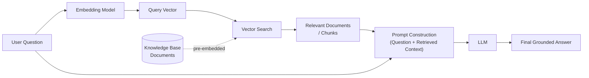
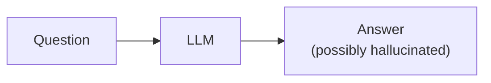
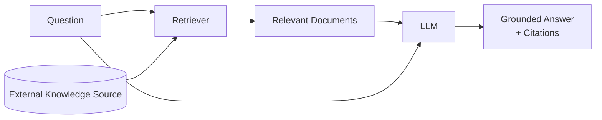

# Introduction & Prerequisites

## Learning Objectives

By the end of this chapter, you will be able to:

- Explain, in plain language, what Retrieval-Augmented Generation (RAG) is and why it exists
- Draw and narrate the end-to-end RAG flow from a user's question to a grounded answer
- Contrast a plain LLM pipeline with a RAG pipeline and articulate the concrete failure modes RAG fixes
- Self-assess your readiness across programming, ML fundamentals, NLP basics, and LLM basics
- Explain, from scratch, what tokens, embeddings, attention, context windows, temperature, top-k/top-p, function calling, and structured output are
- Set up a local Python environment with the libraries used throughout this course
- Compute cosine similarity between two sentence embeddings as a first hands-on taste of retrieval

---

## Prerequisites for This Chapter

None — this is where we start.

This chapter (and this course) assumes only:

- Basic command-line comfort — you can open a terminal, run a command, and install a package
- You have used ChatGPT, Claude, or a similar LLM-based tool at least once as an end user
- General comfort learning technical material — every specialist term will be defined the first time it appears

If you have some Python experience, great — it will make the hands-on exercise smoother. If not, the concepts still stand alone; you can revisit the exercise after a short Python primer.

---

## 1. What Is Retrieval-Augmented Generation?

### 1.1 The Core Idea, With an Analogy

Imagine you ask a brilliant friend a factual question — say, "What's our company's refund policy for orders placed after the holiday sale?" Your friend is extremely articulate and confident, but they last read the company handbook two years ago, and the policy changed last month. They will still answer — fluently, persuasively, and *wrong*.

Now imagine the same friend, but this time, before answering, they walk to the filing cabinet, pull out the current handbook, flip to the refund section, read it, and *then* answer — using their own words, but grounded in the actual current document.

That second friend is a RAG system. The first friend is a plain LLM answering from memory alone.

Formally:

> **Retrieval-Augmented Generation (RAG)** is an architecture that combines **Information Retrieval** (a system that finds relevant documents from a knowledge source) with a **Large Language Model** (a system that generates fluent, coherent text), so that the model retrieves relevant, up-to-date, external information *before* generating its answer — instead of relying solely on what it memorized during training.

The name breaks down cleanly:

- **Retrieval** — search a knowledge base (documents, database records, web pages, PDFs, tickets, code) for the pieces most relevant to the question
- **Augmented** — insert what was retrieved into the prompt, augmenting what the model has to work with
- **Generation** — the LLM writes the final answer, now conditioned on real, current, specific source material

RAG is not a single product or library — it's an *architectural pattern*. You will see it implemented with different vector databases, different embedding models, different orchestration frameworks, and different levels of sophistication (you'll meet "naive," "advanced," "corrective," "graph," and "agentic" RAG later in this course), but the core pattern is always: **retrieve first, then generate**.

### 1.2 The End-to-End Flow

At the simplest level, here is what happens when a user asks a question to a RAG-powered system:

1. The user asks a question in natural language.
2. That question is converted into a numeric representation (an **embedding** — more on this below) that captures its meaning.
3. That numeric representation is used to search a **vector store** of pre-processed knowledge (your documents, also converted to embeddings ahead of time) for the most semantically similar pieces of text.
4. The most relevant pieces of text ("chunks") are retrieved.
5. Those chunks are inserted into a prompt alongside the original question, instructing the LLM to answer *using* this context.
6. The LLM generates a final answer, grounded in the retrieved material, often with citations back to the source.



A text-only version of the same idea, if diagrams don't render in your viewer:

```
User Question
     |
     v
Embedding Model  ---------->  turns the question into a vector (list of numbers)
     |
     v
Vector Search  <-----------  searches a pre-built index of document vectors
     |
     v
Relevant Documents (Top-K chunks)
     |
     v
Prompt = Instructions + Retrieved Chunks + Original Question
     |
     v
LLM
     |
     v
Final Answer (grounded, often with citations)
```

Every later chapter in this course is, in essence, a deep dive into one box of this diagram: how embeddings work (Chapter 4), how to split documents into chunks (Chapter 5), which vector database to use and how search actually works internally (Chapter 6), how to build this pipeline hands-on (Chapter 7), and how to make each stage smarter and more robust (Chapters 8–15).

---

## 2. Why RAG Exists: The Problem It Solves

To appreciate *why* this architecture matters, it helps to see the failure mode it was invented to fix.

### 2.1 The Naive Approach: Question → LLM → Answer



An LLM by itself answers purely from **parametric knowledge** — patterns baked into its weights during training on a large, but fixed and dated, snapshot of text. This works remarkably well for general knowledge, reasoning, and language tasks, but it breaks down in specific, predictable ways:

- **Hallucinations** — when the model doesn't actually know something, it doesn't reliably say "I don't know." It often generates a fluent, confident-sounding answer that is simply invented. This is especially dangerous for niche, internal, or highly specific facts (exact policy wording, a specific customer's order history, a company's internal API signature).
- **Outdated knowledge** — the model's knowledge has a cutoff date and cannot know about anything after training (a new product launch, a policy change last week, this morning's stock price, a bug fixed yesterday in your codebase).
- **No citations** — even when the model happens to be right, it can't point to *where* that fact came from, because there is no "where" — it's a statistical blend of everything it read during training. This makes answers unverifiable and unsuitable for regulated or high-stakes domains (legal, medical, financial, compliance).
- **Limited context / no private knowledge** — the model has never seen your company's internal wiki, your product's proprietary documentation, or your personal notes. It cannot answer questions about information it was never trained on, no matter how well it reasons.

### 2.2 The RAG Approach: Question → Retriever → Documents → LLM → Grounded Answer



By inserting a retrieval step before generation, RAG directly addresses each problem above:

| Problem with plain LLM | How RAG addresses it |
|---|---|
| Hallucinations | The model is instructed to answer *from the provided context*, dramatically reducing invented facts — and it can be told to say "I don't know" when the context doesn't contain the answer |
| Outdated knowledge | The knowledge base can be updated continuously (add a document, re-index) without retraining or fine-tuning the model at all |
| No citations | Because you know exactly which chunks were retrieved, you can show the user the source passages, links, or document names alongside the answer |
| No domain/private knowledge | You can point the retriever at *any* knowledge source — internal wikis, PDFs, support tickets, codebases, databases — instantly giving the LLM access to information it never saw during training |
| Limited context | Instead of stuffing an entire knowledge base into a single prompt (which is expensive and often impossible), retrieval selects only the most relevant slice for each specific question |

This is the single most important mental model in this entire course: **RAG trades "the model must know everything" for "the model must retrieve the right thing and reason over it well."** That shift is what makes LLMs viable for enterprise knowledge work, customer support, legal and medical assistance, codebase Q&A, and any domain where facts must be current, specific, and verifiable.

### 2.3 RAG vs. Fine-Tuning (A Preview)

A natural question at this point: "Why not just fine-tune the model on our documents instead?" This is answered in depth later in the course, but as a preview: fine-tuning bakes patterns and style into model weights and is expensive to keep updated, while RAG keeps knowledge external and swappable — you update a document, not a model. Most production systems use RAG for knowledge and reserve fine-tuning for behavior/style/format. You'll revisit this trade-off with more precision once you understand embeddings and architectures in later chapters.

---

## 3. Self-Assessment: Are You Ready?

RAG sits at the intersection of software engineering, classical machine learning, and modern LLM tooling. You do not need to be an expert in all three, but you should be comfortable with the basics. Below is a checklist organized by category. For each item, a plain-English explanation is given (assume you're seeing the term for the first time), followed by why it specifically matters for RAG. Use this as a genuine self-check — if a topic is unfamiliar, that's fine; note it and move on, this course will build the necessary intuition as it goes.

### 3.1 Programming

- [ ] **Python** — Python is a general-purpose programming language known for readable syntax, and it is the dominant language in the AI/ML ecosystem. *Why it matters for RAG*: essentially every RAG framework (LangChain, LlamaIndex, Haystack), embedding library, and vector database client used in this course exposes a Python API. You'll write Python in nearly every hands-on exercise from Chapter 4 onward.
- [ ] **Object-Oriented Programming (OOP)** — OOP is a style of organizing code around "objects" that bundle data and behavior together (e.g., a `Document` object that holds text plus methods to chunk itself). *Why it matters*: RAG frameworks are built around object abstractions — `Retriever`, `VectorStore`, `Chain`, `Agent` — and understanding classes/instances makes reading and extending their code far easier.
- [ ] **APIs (Application Programming Interfaces)** — An API is a defined way for one piece of software to request functionality or data from another, usually by sending a structured request and getting a structured response back. *Why it matters*: you will call LLM provider APIs (OpenAI, Anthropic, etc.) and vector database APIs constantly; understanding "I send a request, I get a response" is foundational.
- [ ] **Async programming** — Asynchronous code lets a program start a slow operation (like a network call) and keep doing other work while waiting for it to finish, instead of freezing until it's done. *Why it matters*: production RAG systems make many network calls (embedding requests, vector search, LLM generation) and use async patterns to handle multiple user requests efficiently and to stream partial answers back to users.
- [ ] **JSON (JavaScript Object Notation)** — JSON is a lightweight, human-readable text format for representing structured data using key-value pairs, lists, and nested objects, e.g., `{"name": "Ada", "scores": [1, 2, 3]}`. *Why it matters*: nearly all LLM API requests/responses, retrieved document metadata, and configuration files in this course are JSON. "Structured output" from LLMs (covered below) is frequently JSON.
- [ ] **HTTP (Hypertext Transfer Protocol)** — HTTP is the protocol web browsers and applications use to request and send data over the internet, using verbs like GET (fetch data) and POST (send data), and status codes like 200 (success) or 404 (not found). *Why it matters*: every call to a hosted LLM API or cloud vector database travels over HTTP; understanding requests, responses, and status codes helps you debug failures (e.g., a 429 means "rate limited," not "your code is broken").

### 3.2 Machine Learning Foundations

- [ ] **Linear algebra basics (vectors)** — A vector is simply an ordered list of numbers, like `[0.2, -1.4, 0.9]`, which can be thought of as a point or arrow in space. *Why it matters*: embeddings — the core data structure of RAG — are vectors, typically with hundreds or thousands of numbers. You don't need to derive matrix calculus; you need the intuition that "a vector is a point in space, and points close together are similar."
- [ ] **Probability basics** — Probability describes how likely different outcomes are, expressed as numbers between 0 (impossible) and 1 (certain). *Why it matters*: LLMs generate text by predicting a probability distribution over the next possible token at each step; sampling parameters like temperature and top-p (below) directly manipulate this distribution.
- [ ] **Cosine similarity** — Cosine similarity is a way to measure how similar two vectors are by looking at the angle between them, ignoring their length — a score of 1 means "pointing the same direction" (very similar), 0 means "unrelated," and -1 means "opposite." *Why it matters*: this is the single most common mathematical operation in RAG — it's how a vector database decides which stored document embeddings are most relevant to a query embedding. You will compute this yourself in this chapter's hands-on exercise.
- [ ] **Neural networks (conceptual)** — A neural network is a computing system loosely inspired by the brain: layers of simple mathematical units ("neurons") connected together, which learn patterns from data by adjusting the strength ("weight") of each connection during training. *Why it matters*: both embedding models and LLMs are neural networks. You don't need to know how backpropagation works mathematically — you need to know "it's a trained function that maps inputs to outputs, and its behavior comes from patterns in its training data."
- [ ] **Transformers (conceptual)** — The Transformer is the neural network architecture behind virtually all modern LLMs (GPT, Claude, Llama, Gemini) and modern embedding models. Its key innovation is the *attention mechanism* (explained below), which lets the model weigh the relevance of every other word when processing each word in a sequence. *Why it matters*: understanding "transformers process text by attending to relevant context" explains why context window size matters, why long documents get truncated or chunked, and why retrieval (giving the model the *right* small slice of text) is more effective than trying to cram everything in.

### 3.3 NLP Basics (First Exposure — Explained From Scratch)

These terms are the vocabulary of this entire course. If this is your first time encountering them, read carefully — later chapters assume you know these cold.

- [ ] **Tokens** — A token is the basic unit of text an LLM reads and generates — not quite a word, not quite a letter. Depending on the tokenizer, "unbelievable" might become one token, or split into pieces like "un", "believ", "able". Tokens can be whole words, sub-words, punctuation, or even single characters for rare text. *Why it matters for RAG*: LLM context windows (below) and API pricing are both measured in tokens, not words or characters — so every design decision about how much retrieved text to include is fundamentally a token-budgeting problem.
- [ ] **Tokenization** — Tokenization is the process of converting raw text into a sequence of tokens (numbers, really — each token maps to an ID) that a model can process. *Why it matters*: different models use different tokenizers, so the same text can cost a different number of tokens depending on which model you use — this affects both cost and how much retrieved context actually fits.
- [ ] **Attention** — Attention is the mechanism inside a Transformer that lets the model decide, for every token it's processing, how much "weight" or relevance to give to every other token in the input. Think of it as the model constantly asking "which other words matter most for understanding this word right now?" *Why it matters*: attention is *why* giving an LLM good, focused, relevant context (via retrieval) produces much better answers than giving it a huge pile of loosely related text — attention has to work harder and gets "diluted" as irrelevant content increases.
- [ ] **Context window** — The context window is the maximum number of tokens (input plus output combined, in most APIs) that a model can consider at once in a single request — think of it as the model's short-term working memory for that conversation. *Why it matters*: this is a hard constraint on RAG design — it limits how many retrieved chunks you can stuff into a single prompt, which is exactly why *retrieval* (picking the best few chunks) matters more than just "give the model everything."
- [ ] **Embeddings** — An embedding is a numeric vector (a list of numbers) that represents the *meaning* of a piece of text, produced by a trained embedding model, such that texts with similar meaning end up as vectors that are close together in that numeric space — even if they use completely different words (e.g., "car" and "automobile" end up close together). *Why it matters*: embeddings are the foundation of the entire retrieval half of RAG — they're what let a vector database find "documents about vacation policy" even when the user's question never uses the word "vacation." Chapter 4 is dedicated entirely to embeddings.

### 3.4 LLM Basics

- [ ] **Prompt engineering** — Prompt engineering is the practice of carefully crafting the instructions and context you give an LLM to reliably get the output you want — analogous to writing a very clear, unambiguous work order for a highly capable but literal-minded new employee. *Why it matters*: in RAG, the "prompt" is where retrieved documents, instructions, and the user's question all come together — how you structure that prompt directly determines answer quality, faithfulness to sources, and citation behavior (Chapter 9 is dedicated to this).
- [ ] **Temperature** — Temperature is a setting (typically 0 to 2) that controls how random or deterministic an LLM's output is: low temperature (e.g., 0) makes the model pick the most likely next token almost every time (consistent, focused answers), while high temperature allows more surprising, varied word choices (more creative, less predictable). *Why it matters*: RAG systems that answer factual questions from retrieved documents typically use low temperature, because you want faithful, consistent grounding in the source material — not creative embellishment.
- [ ] **Top-k** — Top-k sampling restricts the model's next-token choice to only the *k* most probable candidate tokens (e.g., top-50), then samples from among just those, instead of considering every possible token. *Why it matters*: like temperature, this is a knob for controlling output predictability vs. variety; RAG answer-generation typically favors more conservative settings to stay grounded in retrieved facts.
- [ ] **Top-p (nucleus sampling)** — Top-p sampling is similar to top-k, but instead of a fixed count, it dynamically includes the smallest set of candidate tokens whose combined probability adds up to *p* (e.g., 0.9), adapting the pool size to how confident the model is at each step. *Why it matters*: same practical effect as top-k — a knob for output determinism — and worth knowing because different providers/SDKs expose one, the other, or both.
- [ ] **Function calling (tool calling)** — Function calling is a capability where an LLM, instead of only producing free text, can output a structured request to call a specific external function or tool (e.g., "call `search_orders(customer_id=123)`"), with your code then executing that function and feeding the result back to the model. *Why it matters*: this is the mechanism behind **agentic RAG** (Chapter 14), where the model itself decides *when* and *what* to retrieve, rather than retrieval always happening as a fixed first step.
- [ ] **Structured output** — Structured output means constraining an LLM's response to a specific, predictable format — most commonly JSON matching a defined schema — rather than free-flowing prose. *Why it matters*: production RAG systems often need machine-readable answers (e.g., `{"answer": "...", "sources": [...], "confidence": 0.8}`) so downstream code can reliably parse citations, confidence scores, or follow-up actions instead of scraping a paragraph of text.

> **How to use this checklist**: don't treat unchecked boxes as blockers. Every term above will be revisited, in more depth, exactly when it becomes practically relevant (embeddings in Chapter 4, prompting in Chapter 9, function calling in Chapter 14, and so on). This section exists so you have a map of the territory and know what "I should look this up" means when a later chapter assumes it.

---

## 4. Setting Up Your Environment

This is a brief orientation, not a full tutorial — enough to get a working Python environment ready for the hands-on exercises in this and later chapters.

### 4.1 Requirements

- **Python 3.10 or newer** — check your version with `python3 --version`. Most RAG libraries and their dependencies target 3.10+ for modern typing and async features.
- **A code editor** — VS Code, PyCharm, or even a plain text editor; any will work.
- **An API key** for at least one LLM provider (OpenAI or Anthropic) — free-tier or trial credits are enough to follow along with the course exercises. You won't need this until later chapters, but it's worth creating an account now.

### 4.2 Create an Isolated Virtual Environment

A virtual environment is an isolated, self-contained copy of Python and its installed packages for one project, so that the libraries you install for this course don't conflict with libraries used by other projects on your machine.

```bash
# Create a project folder and move into it
mkdir rag-course && cd rag-course

# Create a virtual environment named ".venv"
python3 -m venv .venv

# Activate it (Linux/macOS)
source .venv/bin/activate

# Activate it (Windows PowerShell)
# .venv\Scripts\Activate.ps1

# Confirm you're using the environment's Python
which python
```

### 4.3 Install the Core Libraries Used in This Course

```bash
pip install --upgrade pip

# LLM provider SDKs (pick at least one; both are fine to have)
pip install openai anthropic

# Orchestration framework used for building RAG pipelines
pip install langchain langchain-community

# Vector databases: Chroma (simple, local, beginner-friendly) and FAISS (fast, local, widely used)
pip install chromadb faiss-cpu

# A lightweight embedding library for the hands-on exercise below
pip install sentence-transformers
```

A short note on each, so the names aren't just noise:

- **openai / anthropic** — official SDKs for calling GPT and Claude models respectively; used from Chapter 7 onward whenever we need an LLM to generate an answer.
- **langchain** — a framework providing pre-built building blocks (document loaders, text splitters, retrievers, chains) so you don't reimplement RAG plumbing from scratch; introduced properly in Chapter 7.
- **chromadb** — a simple, embedded (no separate server required) vector database, ideal for learning and small projects; covered in depth in Chapter 6.
- **faiss-cpu** — Facebook AI Similarity Search, a highly optimized library for fast vector similarity search, widely used both for learning and in production; also covered in Chapter 6.
- **sentence-transformers** — a library providing easy access to pre-trained embedding models, used in this chapter's exercise and expanded on in Chapter 4.

You do not need to fully understand any of these packages yet — you'll meet each one again, in depth, exactly when it's needed.

---

## 5. What This Course Will Not Assume — and What "Proficiency" Means

### 5.1 What We Will Not Assume You Already Know

- Prior experience with LangChain, LlamaIndex, or any RAG-specific framework
- Prior experience with any vector database
- Any deep mathematical background (no calculus derivations, no proofs — conceptual understanding is enough throughout)
- Experience fine-tuning or training neural networks
- Prior professional ML or data engineering experience

If you already have some of this background, great — you'll move faster through the early chapters. If you don't, nothing here is a hard blocker; each concept is introduced from first principles when it's first needed.

### 5.2 What "Professional Proficiency" Looks Like by the End

This course's finish line is not "I can call a RAG library function." It's the ability to operate as a practitioner who can be trusted with a production system. Concretely, by Chapter 20 you will be able to:

- Design a production-grade RAG architecture from a set of business requirements, not just wire together a tutorial
- Choose an embedding model and vector database deliberately, based on cost, latency, scale, and accuracy trade-offs, rather than defaulting to whatever a blog post used
- Build beyond naive RAG — implement hybrid search (keyword + semantic), re-ranking, query transformation, graph-based retrieval, and agentic RAG where a model actively decides what and when to retrieve
- Evaluate a RAG system rigorously, using metrics like recall@k and faithfulness, and tools like Ragas, DeepEval, or TruLens, instead of eyeballing a handful of example answers
- Deploy a RAG system securely and at scale — with caching, monitoring, access control, and PII handling — as a real piece of infrastructure, not a notebook demo
- Explain RAG clearly and precisely in a technical interview or system design discussion, including trade-offs, failure modes, and how you'd debug a system that's hallucinating or retrieving irrelevant context

---

## 6. Real-World Scenario

**The setup**: A mid-sized SaaS company's support team is drowning in tickets. Customers ask questions like "How do I export my data before canceling?" and "What happens to my billing if I downgrade mid-cycle?" The answers all exist — scattered across a 200-page internal handbook, dozens of help-center articles, and a Slack channel full of past troubleshooting threads — but agents spend minutes per ticket just *finding* the right passage before they can even start answering the customer.

**The naive (failed) first attempt**: The team's first instinct is to give a general-purpose chatbot access to the company name and let it answer support questions directly. It sounds confident and helpful — and it's frequently wrong. It invents a "14-day export window" that doesn't exist in the actual policy, and cites a refund process that was replaced six months ago. Customers get incorrect answers delivered with total confidence. Trust erodes fast.

**The RAG fix**: The team instead builds a system that (1) collects the handbook, help-center articles, and resolved Slack threads into a knowledge base, (2) chunks and embeds every document, storing the vectors in Chroma, (3) at query time, embeds the incoming customer question and retrieves the top-matching chunks, and (4) hands those chunks to the LLM with an instruction along the lines of "answer only using the provided context, and cite the source document." Now, when a customer asks about the export window before cancellation, the system retrieves the actual current handbook section, and the LLM's answer is grounded in it — with a link back to the exact policy paragraph. When the policy changes next quarter, the team simply re-indexes the updated document; no retraining, no waiting on an ML team, no model redeployment.

This is the shape of nearly every production RAG use case you'll encounter: a domain with a lot of scattered, changing, ground-truth documentation, and a need for answers that are both fluent *and* verifiably correct. Every subsequent chapter builds the skills to design and operate exactly this kind of system — at increasing levels of scale and sophistication.

---

## 7. Best Practices

- Treat retrieval quality as the primary lever for answer quality — a perfect prompt cannot fix irrelevant retrieved context, but great retrieval can compensate for a fairly simple prompt.
- Start with the simplest possible pipeline (naive RAG) before reaching for hybrid search, re-ranking, or agentic patterns — you need a working baseline to know whether added complexity actually helps.
- Always design for citations from day one — it's far easier to build source-tracking in from the start than to retrofit it later.
- Keep a running mental (or literal) glossary as you progress through this course — RAG terminology overlaps across IR, ML, and LLM communities, and precise vocabulary will help you read papers, documentation, and job interviews alike.
- Budget tokens deliberately — know roughly how many tokens your context window has, how many your retrieved chunks consume, and how much headroom remains for the LLM's answer.

## 8. Common Mistakes

- Assuming a bigger/newer LLM alone fixes hallucination — without grounding via retrieval, even the most capable model will still confidently invent facts it doesn't know.
- Confusing fine-tuning with RAG, and assuming you must fine-tune a model to teach it "your" data — in the vast majority of knowledge-lookup use cases, RAG is faster, cheaper, and easier to keep current.
- Skipping the fundamentals (embeddings, tokens, context windows) and jumping straight to a framework tutorial — this leads to copy-pasted pipelines that break in non-obvious ways the moment real-world documents don't match the tutorial's clean examples.
- Ignoring token/context-window limits when designing prompts, leading to silently truncated context and degraded answers.
- Treating "it gave a plausible-sounding answer" as proof of correctness during early testing, instead of checking retrieved sources against the generated answer.

## 9. Summary

RAG is an architecture that pairs information retrieval with an LLM so the model answers using retrieved, external, up-to-date knowledge instead of relying purely on what it memorized during training. This fixes the core weaknesses of plain LLM usage — hallucination, staleness, lack of citations, and no access to private/domain data — by inserting a retrieve-then-generate step: embed the question, search a vector store, pull back relevant chunks, and feed them into the prompt alongside the question before generation. Building and operating RAG systems well requires a working, if not expert, grasp of Python and APIs, foundational ML concepts like vectors and cosine similarity, core NLP vocabulary like tokens and embeddings, and LLM-specific controls like temperature and function calling — all introduced in this chapter and revisited in depth throughout the course. With your environment set up and this vocabulary in hand, you're ready to go deeper into the core concepts of RAG in Chapter 2.

---

## Knowledge Check

1. In your own words, what does each part of the phrase "Retrieval-Augmented Generation" refer to, and how do the three parts fit together into one pipeline?
2. Name three specific problems with asking an LLM a factual question directly (no retrieval), and explain how RAG addresses each one.
3. What is an embedding, and why is cosine similarity a useful way to compare two embeddings?
4. Why does a model's context window size directly influence how a RAG system must be designed?
5. Explain the difference between what temperature/top-p control versus what function calling enables an LLM to do.

## Hands-On Exercise

**Exercise 1 — Environment setup.** Following Section 4, create a virtual environment named `.venv`, activate it, and install `sentence-transformers`, `chromadb`, and `faiss-cpu`. Confirm the installation succeeded by running `python -c "import sentence_transformers; print('ok')"`.

**Exercise 2 — Compute cosine similarity by hand and with a library.** Save the following as `similarity.py` and run it. It embeds two sentences using a small local embedding model and computes how similar they are.

```python
from sentence_transformers import SentenceTransformer
import numpy as np

# A small, fast, local embedding model — good enough for experimentation
model = SentenceTransformer("all-MiniLM-L6-v2")

sentence_a = "How do I reset my password?"
sentence_b = "What are the steps to change my account password?"
sentence_c = "What is the weather like in Paris today?"

embeddings = model.encode([sentence_a, sentence_b, sentence_c])

def cosine_similarity(v1, v2):
    return np.dot(v1, v2) / (np.linalg.norm(v1) * np.linalg.norm(v2))

sim_ab = cosine_similarity(embeddings[0], embeddings[1])
sim_ac = cosine_similarity(embeddings[0], embeddings[2])

print(f"Similarity (password reset vs. change password): {sim_ab:.4f}")
print(f"Similarity (password reset vs. weather in Paris): {sim_ac:.4f}")
```

Run it with `python similarity.py`. You should see the first pair (both about passwords, worded differently) score noticeably higher than the second pair (unrelated topics) — even though sentence A and B share almost no exact words. This is the core mechanic that makes semantic retrieval possible, and you'll build directly on it starting in Chapter 4.

## Further Reading

- Lewis, P. et al. (2020). *Retrieval-Augmented Generation for Knowledge-Intensive NLP Tasks*. The original RAG paper — arXiv:2005.11401
- Vaswani, A. et al. (2017). *Attention Is All You Need*. The paper introducing the Transformer architecture — arXiv:1706.03762
- OpenAI API documentation — platform.openai.com/docs
- Anthropic Claude API documentation — docs.anthropic.com
- Sentence-Transformers documentation — sbert.net
- LangChain documentation — python.langchain.com
- Hugging Face's "NLP Course" (free) — huggingface.co/course — a solid plain-language primer on tokens, attention, and transformers if you want a deeper dive before Chapter 4

---

<div style="display:flex;justify-content:space-between;align-items:center;">
  <span></span>
  <a href="./00-index.md">🏠 Index</a>
  <a href="./02-core-concepts.md">Next: Core Concepts of RAG →</a>
</div>
