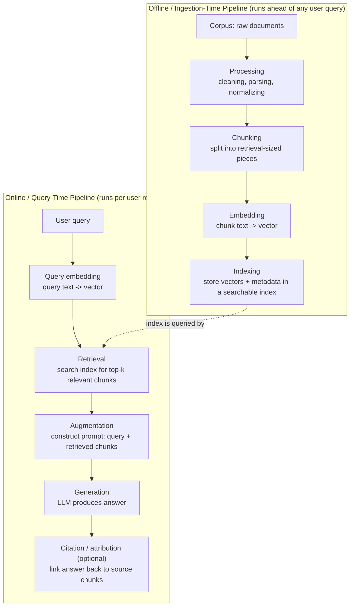

# Core Concepts of RAG

Chapter 1 gave you the elevator pitch: RAG lets an LLM answer questions using knowledge it wasn't trained on, by finding relevant text and handing it to the model before generation. That was the "what" and the "why." This chapter is the "how it's structured conceptually" — the mental model and vocabulary you'll use in every remaining chapter of this course.

Nothing here requires new tools or code. This is the chapter where you build the map before you start walking the terrain. Skimming it will cost you later — nearly every advanced topic (re-ranking in Chapter 8, evaluation in Chapter 13, agentic RAG in Chapter 14) is explained in terms of the vocabulary defined here.

---

## Learning Objectives

By the end of this chapter, you will be able to:

- Explain the difference between **parametric** and **non-parametric** knowledge, and why that distinction is the entire reason RAG exists.
- Define, in both plain language and formal terms, the core RAG vocabulary: corpus, document, chunk, index, retriever, generator, grounding, hallucination, context window, top-k, relevance, semantic vs. keyword search.
- Draw and narrate the full conceptual RAG pipeline from raw documents to a cited answer.
- Explain what it means for a generated answer to be "grounded," and why RAG reduces hallucination without eliminating it.
- Separate "retrieval failure" from "generation failure" as two distinct categories of things that go wrong in a RAG system.
- Use the open-book vs. closed-book exam analogy to explain RAG to a non-technical colleague.

---

## Prerequisites for This Chapter

This chapter builds directly on [Chapter 1: Introduction & Prerequisites](./01-introduction-and-prerequisites.md). We assume you already know:

- What RAG is at a high level, and the three problems it addresses (hallucination, knowledge staleness, lack of citations).
- Basic LLM mechanics: tokens, context windows, temperature, top-k/top-p sampling, and prompt engineering fundamentals.
- That "embeddings" turn text into vectors of numbers — Chapter 1 mentioned this in passing; this chapter uses the term but does not derive it mathematically (that's Chapter 4).
- General Python/ML/NLP comfort, as outlined in the course's [self-assessment](./01-introduction-and-prerequisites.md).

If any of that feels shaky, go back to Chapter 1 before continuing — everything below assumes it as settled ground.

---

## 1. The Core Mental Model: Parametric vs. Non-Parametric Knowledge

Every fact an LLM can produce comes from one of two places. Understanding this split is the single most important idea in this chapter — arguably in this entire course.

### 1.1 Parametric knowledge

When an LLM is trained, it reads enormous amounts of text and adjusts billions of internal numbers (its **parameters**, or weights) so that it gets better at predicting the next token. In the process, statistical patterns about the world — facts, writing styles, reasoning patterns, code idioms — get compressed and smeared across those weights.

This is **parametric knowledge**: knowledge that lives *inside the model's parameters*, baked in at training time. When you ask a base LLM "What is the capital of France?" with no external help, it answers from parametric knowledge — the answer was implicitly encoded during training and is reconstructed at inference time.

Parametric knowledge has three defining properties:

- **It's frozen at training time.** The model has a knowledge cutoff. Anything that happened, changed, or was published after that cutoff simply isn't in the weights.
- **It's expensive to update.** To add or correct parametric knowledge, you must retrain or fine-tune the model — a process that can cost anywhere from thousands to tens of millions of dollars in compute, and takes time (days to months), not seconds.
- **It's not directly inspectable.** You cannot point to "the paragraph" inside a model's weights that produced a given fact. The knowledge is distributed across millions of parameters in a way no one can cleanly extract or audit. This is precisely why hallucination is hard to prevent and citations are impossible without external help — there is nothing to cite back to.

### 1.2 Non-parametric knowledge

**Non-parametric knowledge** is knowledge that lives *outside* the model, in some external store (files, a database, a search index), and is fetched and supplied to the model **at inference time**, fresh, on every request.

RAG's entire premise is: instead of asking the model to recall a fact from its frozen weights, retrieve the fact from an external, editable, inspectable source, and place it directly into the prompt as context. The model's job shifts from "remember the fact" to "read the fact I just handed you and answer using it."

### 1.3 Why the distinction matters

|  | Parametric (model weights) | Non-parametric (retrieved at inference) |
|---|---|---|
| **Updatability** | Requires retraining/fine-tuning | Edit, add, or delete a document/index entry in seconds |
| **Cost of updating** | Very high (compute, data curation, eval, redeployment) | Very low (write to a database, re-index) |
| **Freshness** | Fixed at training cutoff | As fresh as your ingestion pipeline |
| **Verifiability** | Cannot cite a source — you're trusting the model's memory | You can show the exact document/passage used, enabling citations |
| **Scope** | Whatever fit in the training data | Can be scoped precisely — your company's private data, a single user's files, today's news |

This is why Chapter 1 said RAG addresses hallucination, staleness, and citations in one architectural move: all three problems trace back to over-relying on parametric knowledge for facts that are better served non-parametrically. RAG doesn't replace the model's parametric knowledge (it still needs that for language, reasoning, and general world understanding) — it **supplements** it with non-parametric knowledge for the facts that need to be current, private, or verifiable.

A useful shorthand you'll see throughout this course: **parametric knowledge is what the model "knows"; non-parametric knowledge is what the model is "told" right before it answers.** RAG systems are, at their core, machinery for deciding what to tell the model, and telling it well.

---

## 2. Key Terminology

RAG discussions get muddy fast if the vocabulary isn't precise. Below, each term gets a plain-language explanation first, then a formal definition you can quote in a design review.

### 2.1 Corpus

**Plain language:** The entire pile of source material you want your system to be able to draw on — every PDF, wiki page, support ticket, or Slack message you've decided is fair game.

**Formal definition:** The corpus is the complete collection of documents that constitutes the knowledge base for a RAG system, before any processing. It is the raw input to the ingestion pipeline (Section 3).

### 2.2 Document

**Plain language:** One individual "thing" in the corpus — a single PDF, a single web page, a single database record.

**Formal definition:** A document is a single logical unit of content in the corpus, typically with its own identity, metadata (author, date, source URL), and boundaries. A corpus is a set of documents.

### 2.3 Chunk

**Plain language:** A document is usually too big to hand to a retriever or a model all at once, so you slice it into smaller pieces — think "a few paragraphs" rather than "a 40-page PDF."

**Formal definition:** A chunk is a contiguous span of text extracted from a document, sized to be small enough for effective retrieval and to fit comfortably (often alongside several other chunks) inside a model's context window, while remaining large enough to preserve meaning. Chunking strategy is a full topic on its own — see Chapter 5.

### 2.4 Index

**Plain language:** A specially organized copy of your chunks that's built for fast searching — like a book's index, but for meaning instead of just keywords.

**Formal definition:** An index is a data structure built over the corpus's chunks (typically over their embeddings) that supports efficient similarity or relevance search at query time, rather than requiring a linear scan of every chunk. Vector databases (Chapter 6) are the most common implementation of an index in modern RAG.

### 2.5 Retriever

**Plain language:** The component that, given a question, goes and finds the most relevant chunks from the index.

**Formal definition:** A retriever is the subsystem responsible for taking a query and returning a ranked set of chunks from the index judged most relevant to that query, using some similarity or relevance function (semantic, keyword-based, or hybrid — see 2.10).

### 2.6 Generator

**Plain language:** The LLM itself, in its role of taking the question plus the retrieved chunks and writing a natural-language answer.

**Formal definition:** The generator is the language model component that consumes an augmented prompt (query + retrieved context) and produces the final output text. In most modern RAG systems, the generator is a general-purpose LLM (GPT, Claude, Llama, etc.) used off-the-shelf, not specially trained for retrieval.

### 2.7 Grounding

**Plain language:** An answer is "grounded" when it's actually built from the retrieved text, not invented from the model's own memory.

**Formal definition:** Grounding is the property of a generated response being derivable from, and consistent with, the retrieved context supplied to the generator. Grounding is discussed in depth in Section 4.

### 2.8 Hallucination

**Plain language:** The model confidently states something false or unsupported — a fabricated fact, a made-up citation, a wrong number.

**Formal definition:** A hallucination is a generated statement that is not supported by, or contradicts, the available evidence (the retrieved context, in a RAG system, or objective reality, in general). Chapter 1 introduced hallucination as a motivation for RAG; Section 4 below sharpens exactly how RAG affects it.

### 2.9 Context window

**Plain language:** The maximum amount of text an LLM can "look at" at once for a given request — your question, the retrieved chunks, and the model's own answer all have to fit inside this budget together.

**Formal definition:** The context window is the maximum number of tokens (see Chapter 1) a model can process in a single forward pass, encompassing the system prompt, user input, retrieved context, conversation history, and the model's own output. It is a hard resource constraint that shapes nearly every design decision in RAG: how many chunks you can retrieve, how big each chunk can be, and how much conversation history you can keep.

### 2.10 Top-k retrieval

**Plain language:** Instead of retrieving "the one best chunk" or "every remotely related chunk," you retrieve a fixed number — say, the 5 or 10 best-scoring chunks — and pass those to the generator.

**Formal definition:** Top-k retrieval is the practice of returning the *k* highest-scoring items from the retriever's ranking, where *k* is a tunable parameter. Choosing *k* is a real trade-off: too small and you risk missing the passage that actually answers the question; too large and you burn context window budget on noise, dilute relevance, and increase cost and latency (more on this trade-off in Chapter 8).

### 2.11 Relevance

**Plain language:** How well a chunk actually helps answer the specific question asked — not just "about the same topic," but "useful for answering this."

**Formal definition:** Relevance is a (typically scalar) measure of how pertinent a given chunk is to a given query, computed by the retriever's scoring function. Relevance is retrieval's central objective and its central failure point: a retriever that returns topically-related but not actually useful chunks is a common, subtle bug (see Section 5).

### 2.12 Semantic search vs. keyword search

**Plain language:** Keyword search finds documents that contain the same *words* as your query. Semantic search finds documents that share the same *meaning* as your query, even if the words are completely different.

**Formal definition:**
- **Keyword search** (also called lexical or sparse search) matches queries to documents based on shared terms, typically weighted by statistical measures of term importance (classic algorithms: TF-IDF, BM25 — covered in depth in Chapter 3). It is exact, explainable, and fast, but blind to synonyms and paraphrase: a query for "car" will not match a document that only says "automobile" unless the algorithm is specially extended.
- **Semantic search** (dense search) matches queries to documents by comparing their vector embeddings (Chapter 4) in a learned vector space, so that texts with similar *meaning* land close together even with completely different wording. It captures paraphrase and synonymy well but can occasionally miss exact-match precision (e.g., a specific product SKU or error code), which is one reason production systems often combine both approaches — **hybrid search**, covered in Chapter 8.

Keep these two search paradigms distinct in your head now; the tension between them (and how to get the best of both) is a recurring theme starting in Chapter 3.

---

## 3. The Conceptual RAG Pipeline, End to End

Chapter 1 sketched RAG as "retrieve, then generate." Here is the same pipeline broken into its full set of conceptual stages — the granularity you'll need for the rest of the course. Note that this chapter describes these stages *conceptually*; the deep technical mechanics of chunking, embedding, and indexing arrive in Chapters 4–6.

Walking through each stage:

1. **Ingestion (corpus intake).** Raw documents — PDFs, web pages, database exports, tickets — are collected and pulled into the pipeline. This is the entry point of the *offline* half of the system: everything up to and including indexing happens ahead of time, independent of any specific user question.

2. **Processing.** Raw documents are cleaned and normalized: stripping boilerplate (headers, footers, navigation menus), converting formats (PDF/HTML/DOCX → plain text or structured text), fixing encoding issues, and extracting useful metadata (title, author, date, section headings). Garbage in at this stage means garbage retrieved later — a theme you'll see repeatedly.

3. **Chunking.** Processed documents are split into chunks (Section 2.3). This stage alone can make or break retrieval quality, which is why an entire chapter (Chapter 5) is dedicated to it.

4. **Embedding.** Each chunk's text is passed through an embedding model, producing a dense vector that captures the chunk's meaning in a form suitable for similarity comparison. (Chapter 4 covers how and why this works.)

5. **Indexing.** Chunk vectors (plus their original text and metadata) are stored in an index structure optimized for fast similarity search — commonly a vector database (Chapter 6). This completes the offline pipeline; the system is now ready to serve queries.

6. **Query embedding.** When a user asks a question, the *query itself* is passed through the same (or a compatible) embedding model, turning it into a vector that lives in the same space as the indexed chunks. This symmetry — query and chunks embedded into the same vector space — is what makes semantic comparison possible at all.

7. **Retrieval.** The query vector is compared against the index, and the top-k most relevant chunks (Section 2.10, 2.11) are returned.

8. **Augmentation.** The retrieved chunks are woven together with the original user query (and often a system prompt with instructions) into a single prompt. This is the "augmented" in Retrieval-**Augmented** Generation — the generator's input is augmented with retrieved evidence it didn't have on its own. Prompt construction strategy for RAG gets its own chapter (Chapter 9).

9. **Generation.** The augmented prompt is sent to the LLM (the generator), which produces a natural-language answer — ideally one that is grounded in the retrieved chunks rather than invented from parametric memory alone.

10. **Citation/attribution (optional).** Some systems go a step further and explicitly link parts of the generated answer back to the specific chunk(s) that supported them, so a user can click through and verify. This isn't automatic — it requires deliberate prompt design or post-processing, covered later in the course.

Notice the pipeline splits cleanly into two halves that run on very different schedules: **offline** (ingestion through indexing — done in batches, ahead of time, whenever the corpus changes) and **online** (query embedding through generation — done fresh, per request, in real time, typically in under a few seconds). Confusing which stage runs when is a common beginner mistake; keep the split in mind as you move into implementation chapters.

---

## 4. Grounding: What It Means, and What It Doesn't Guarantee

### 4.1 Defining grounding precisely

An answer is **grounded** when its claims are actually supported by the retrieved context that was placed in the prompt — the model is, in effect, "showing its work" from real source material rather than reciting from parametric memory.

Grounding is a *spectrum*, not a binary:

- **Fully grounded:** Every factual claim in the answer traces directly to something stated in the retrieved chunks.
- **Partially grounded:** Some claims come from retrieved chunks; others are filled in from the model's parametric knowledge (which may or may not be accurate) or are subtly extrapolated beyond what the context actually supports.
- **Ungrounded:** The retrieved context was ignored or was irrelevant, and the answer is effectively the model's unaided parametric guess, dressed up to look like it used the context.

### 4.2 Why RAG reduces — but does not eliminate — hallucination

Here is the precise, non-oversold claim this course will keep returning to:

> **RAG is a mitigation for hallucination, not a guarantee against it.**

RAG reduces hallucination risk because it gives the model something better to do than guess: instead of reconstructing a fact from compressed, possibly-faded training signal, the model can read the fact directly off the page you handed it. When retrieval works well and the model faithfully uses what it's given, hallucination rates drop substantially — this is well-documented empirically and is the whole reason the architecture exists.

But RAG introduces its own new failure surface, and none of these are solved just by "adding retrieval":

- **The retriever can fail** and return irrelevant, incomplete, or outdated chunks — in which case the model is generating from bad or insufficient evidence, and may either say "I don't know" (good) or fabricate an answer anyway (still hallucination, just now with a retrieval-quality root cause).
- **The generator can fail to use good context correctly** — ignoring it, misreading it, blending it incorrectly with parametric memory, or over-generalizing beyond what the passage actually says (Section 5 covers this).
- **The context can itself be wrong** — if your corpus contains outdated, contradictory, or incorrect documents, a perfectly grounded answer can still be a perfectly grounded *wrong* answer. Grounding is about faithfulness to the retrieved context, not about the context being true.
- **The model can blend sources sloppily**, producing an answer that sounds well-supported but actually stitches together fragments in a way that misrepresents what any single source said.

This is why later chapters exist at all: Chapter 8 (advanced retrieval) attacks the "bad retrieval" failure mode, Chapter 9 (prompt engineering for RAG) attacks the "model ignores or misreads good context" failure mode, and Chapter 13 (evaluation) gives you the tools to *measure* faithfulness/groundedness rather than just hope for it.

---

## 5. Retrieval and Generation: Two Separable Concerns, Two Separate Failure Modes

One of the most useful habits you can build starting now — well before you write a line of RAG code in Chapter 7 — is thinking of a RAG system as **two independent subsystems glued together**, each with its own job and its own way of failing.

| | Retrieval | Generation |
|---|---|---|
| **Job** | Find the right evidence | Produce the right answer, given the evidence |
| **Depends on** | Embeddings, chunking, index quality, query formulation | Prompt construction, model capability, instruction-following |
| **Failure mode** | Irrelevant, missing, or noisy chunks retrieved | Model ignores good context, misreads it, or overrides it with parametric memory |
| **Symptom looks like** | "The answer is wrong or vague" | "The answer is wrong or vague" |
| **Where you'd fix it** | Chunking (Ch 5), embeddings (Ch 4), hybrid search / re-ranking (Ch 8), query transformation (Ch 11) | Prompt engineering (Ch 9), model choice, output format constraints |

Notice the trap in that table: **both failure modes produce the exact same visible symptom** — a wrong or unhelpful answer. This is precisely why debugging RAG systems is genuinely hard, and precisely why this framing matters so early in the course. When a RAG system gives a bad answer, the very first diagnostic question is always:

> **Did the retriever hand the generator the right evidence at all?**

If you inspect the retrieved chunks and they simply don't contain the answer, you have a **retrieval problem** — no amount of prompt tweaking will fix it, because the generator was never given the information it needed. You need to fix chunking, embeddings, the retrieval algorithm, or the query itself.

If you inspect the retrieved chunks and the answer clearly *is* in there, but the model still got it wrong, ignored it, or contradicted it, you have a **generation problem** — the fix lives in prompt construction, instruction clarity, or possibly model choice, not in retrieval.

Treating these as one undifferentiated "the RAG system is bad" blob is the single most time-wasting habit a RAG practitioner can have. Chapter 13 (Evaluation & Testing) formalizes this split into separately measurable metrics — retrieval metrics like Recall@K and generation/faithfulness metrics are evaluated independently for exactly this reason.

---

## 6. The Open-Book vs. Closed-Book Exam Analogy

This is the single best mental shortcut for explaining RAG to anyone — technical or not.

- **An LLM without RAG is a closed-book exam.** The student (the model) walks in having studied broadly at some point in the past (training), and must answer every question purely from memory. If they never studied a topic, or studied it long ago and it's faded, they might guess — sometimes confidently and wrongly. They cannot look anything up. They cannot know about anything that happened after they stopped studying.

- **An LLM with RAG is an open-book exam** — but with a twist: **the student doesn't get to bring the whole book. They get to bring the one page a librarian (the retriever) hands them, based on the question.** If the librarian hands them the right page, they can read it and answer accurately, and can even point to exactly where the answer came from (citation). If the librarian hands them the wrong page, or no page at all, the student is right back to guessing from memory — an open-book exam does not help you if you're handed the wrong chapter.

This analogy makes two things obvious immediately, without any jargon:

1. **The quality of the "librarian" (retriever) matters as much as the student's (model's) intelligence.** A brilliant student with the wrong page can still answer wrong. This is exactly the retrieval/generation separation from Section 5.
2. **Open-book doesn't mean cheat-proof or infallible** — it means "more likely to be right, if the right material is found." This is exactly the grounding/hallucination-mitigation nuance from Section 4.

Use this analogy freely — it's the fastest way to get a product manager, an executive, or a new teammate to grasp what RAG actually does in about ten seconds.

---

## 7. What's Coming Next (Forward Pointers)

This chapter deliberately stayed at the conceptual level. Four upcoming chapters go deep on the mechanics only sketched here:

- **Chapter 3 — Architecture & Internals** dives into the full pipeline's internals and classic information retrieval theory (TF-IDF, BM25) that underpins keyword search and, historically, predates RAG entirely.
- **Chapter 4 — Embeddings Fundamentals** explains, mathematically and practically, how text becomes a vector, what similarity metrics like cosine similarity mean, and how to choose an embedding model.
- **Chapter 5 — Chunking Strategies** covers fixed-size, recursive, semantic, and parent-child chunking, and the trade-offs behind each.
- **Chapter 6 — Vector Databases** covers how indexes are actually implemented and queried at scale (FAISS, Chroma, Qdrant, Milvus, Pinecone, Weaviate, pgvector, and the ANN/HNSW algorithms behind them).

Everything in those chapters will be explained in terms of the vocabulary and mental models from this chapter — corpus, chunk, retriever, top-k, grounding, and the offline/online pipeline split.

---

## Real-World Scenario

**Setup:** You work at a mid-sized software company. Support engineers currently answer customer questions by manually searching a 2,000-page internal knowledge base (release notes, troubleshooting guides, past ticket resolutions). Leadership wants an AI assistant that can answer these questions instantly.

**Applying this chapter's concepts:**

- The 2,000 pages of knowledge base content is your **corpus**; each individual article or ticket is a **document**.
- A closed-book approach — just asking a general-purpose LLM "How do I fix error E-4021 in our product?" — would fail immediately: error code E-4021 is proprietary and was never in any public training data. This is a pure **parametric knowledge gap**: the model has no way to know this fact no matter how good its reasoning is.
- You build a RAG system instead: the knowledge base is processed and **chunked** (Chapter 5), embedded (Chapter 4), and stored in an **index** (Chapter 6). This is entirely **offline** work, run once and refreshed whenever articles change.
- At query time, a support engineer types the question. It's embedded, compared against the index, and the **retriever** returns the top-5 (**top-k = 5**) most relevant chunks — likely including the exact troubleshooting article for E-4021.
- Those chunks are woven into a prompt (**augmentation**) and sent to the **generator**, which writes a clear, specific answer, ideally **grounded** in the retrieved troubleshooting steps rather than a generic, hallucinated guess about what an "E-4021-style" error might mean.
- Three weeks later, engineering ships a fix and updates the troubleshooting article. Because this is **non-parametric knowledge**, updating the index takes minutes (re-embed and re-index the one changed article) — no retraining, no waiting, no redeployment of the LLM itself. This is the updatability advantage from Section 1.3, made concrete.
- If engineers start reporting wrong answers, the team's first diagnostic step (Section 5) is to log and inspect the retrieved chunks for a handful of failing queries: are the right articles even being retrieved (retrieval problem), or is the right article being retrieved but the model answering incorrectly anyway (generation problem)? That single question determines which chapter of this course to reach for next.

---

## Best Practices

- **Always ask "parametric or non-parametric?" before designing a feature.** If a fact can change, is private, or needs a citation, it belongs in the non-parametric (retrieved) path, not left to the model's memory.
- **Keep retrieval and generation debuggable independently.** Log the retrieved chunks for every request (or a sample) separately from the final answer, so you can diagnose failures using the Section 5 framework instead of guessing.
- **Treat "grounded" as a property you must design for, verify, and measure** — not something that happens automatically just because you added a retrieval step. Chapter 13 will give you concrete metrics for this.
- **Use precise vocabulary internally on your team.** Saying "the retriever returned low-relevance chunks for this query" is far more actionable than "the AI gave a bad answer" — precise terms point directly to which subsystem and which later chapter to consult.
- **Remember the offline/online split when reasoning about latency and cost.** Ingestion, chunking, embedding, and indexing are batch work you control the schedule for; query embedding, retrieval, and generation happen on the user's clock and are where latency budgets actually bite.

---

## Common Mistakes

- **Assuming RAG eliminates hallucination entirely.** It substantially reduces it under good conditions but introduces new failure modes of its own (Section 4.2). Never market or design a system on the assumption of zero hallucination.
- **Treating "the answer was wrong" as one problem instead of two.** Skipping the retrieval-vs-generation diagnosis (Section 5) leads teams to endlessly tune prompts when the real problem is that the retriever never found the relevant chunk — or vice versa.
- **Confusing "topically related" with "relevant."** A chunk about the same general subject as the query is not automatically useful for answering it; relevance (Section 2.11) is about answering the specific question, not matching the general topic.
- **Believing grounded automatically means correct.** A model can be perfectly faithful to a retrieved chunk that is itself outdated or wrong. Grounding is about faithfulness to the context, not truth of the context.
- **Forgetting that query and chunks must live in the same embedding space.** If you embed your corpus with one model and your queries with an incompatible one, semantic search quality collapses — this is a mechanical detail explored further in Chapter 4, but the conceptual root is right here: query embedding and chunk embedding are two halves of one comparison.
- **Under-provisioning the context window budget.** Retrieving a generous top-k without considering how much of the context window each chunk consumes, alongside system prompts and conversation history, leads to truncated or dropped context at generation time.

---

## Summary

- RAG's foundational idea is the split between **parametric knowledge** (baked into model weights, expensive to update, unverifiable) and **non-parametric knowledge** (retrieved fresh at inference time, cheap to update, verifiable). RAG supplements the former with the latter.
- A shared vocabulary — corpus, document, chunk, index, retriever, generator, grounding, hallucination, context window, top-k, relevance, semantic vs. keyword search — underpins every later chapter in this course.
- The full conceptual pipeline splits into an **offline** half (ingestion → processing → chunking → embedding → indexing) and an **online** half (query embedding → retrieval → augmentation → generation → optional citation).
- **Grounding** means an answer's claims are supported by retrieved context. RAG is a **mitigation** for hallucination, not a guarantee — retrieval can fail, generation can fail, and the underlying corpus itself can simply be wrong.
- **Retrieval and generation are separable concerns with separate, independently diagnosable failure modes** — both can produce the identical visible symptom of "a bad answer," so always check what was retrieved before blaming the model, or vice versa.
- The **open-book vs. closed-book exam** analogy is your fastest tool for explaining RAG to anyone: RAG doesn't make the student smarter, it gives them the (hopefully) right page to read from.

---

## Knowledge Check

1. In your own words, explain the difference between parametric and non-parametric knowledge, and give one concrete example of a fact that is a poor fit for parametric knowledge alone.
2. A retriever returns five chunks for a query, and none of them actually contain information relevant to answering the question — yet the LLM still produces a confident, plausible-sounding answer. Is this a retrieval failure, a generation failure, both, or neither? Justify your answer.
3. Why is an answer being "grounded" in retrieved context not the same thing as the answer being "correct"?
4. Explain the difference between semantic search and keyword search, and describe one scenario where keyword search would outperform semantic search.
5. Using the open-book exam analogy, explain what it means for the "librarian" to fail, and how that failure would look different from the "student" failing.

---

## Hands-On Exercise

**Exercise 1: Retrieval-need classification.**
Below are three questions. For each one, decide whether it (a) can be answered reliably from a general-purpose LLM's parametric knowledge alone, or (b) requires retrieval from a non-parametric source. Write 2-3 sentences justifying each classification using the concepts from Section 1.

1. "What is the time complexity of binary search?"
2. "What was our company's Q2 2026 revenue, according to the internal finance report?"
3. "Summarize the customer's last five support tickets and tell me if this is a recurring issue."

For each, also state: if retrieval is needed, what would the "corpus" be, and what would a reasonable "chunk" look like?

**Exercise 2: Diagnose the failure.**
Imagine a RAG-powered internal assistant is asked, "What is our company's current parental leave policy?" It answers confidently with a policy that was replaced eighteen months ago. You are given the ability to inspect exactly what chunks were retrieved for this query.

Write out, step by step, how you would use the retrieval-vs-generation framework from Section 5 to diagnose whether this is a retrieval problem, a generation problem, or a data/corpus problem — and what evidence (from the retrieved chunks) would point to each.

---

## Further Reading

- Lewis, P. et al. (2020). ["Retrieval-Augmented Generation for Knowledge-Intensive NLP Tasks."](https://arxiv.org/abs/2005.11401) — The original RAG paper; introduces the parametric/non-parametric framing formally. Full context in Chapter 18.
- Petroni, F. et al. (2019). ["Language Models as Knowledge Bases?"](https://arxiv.org/abs/1909.01066) — Foundational work probing what factual knowledge is actually stored parametrically in LLMs, and its limits.
- Ji, Z. et al. (2023). ["Survey of Hallucination in Natural Language Generation."](https://arxiv.org/abs/2202.03629) — A comprehensive taxonomy of hallucination types, useful background for the grounding discussion in Section 4.
- Robertson, S. & Zaragoza, H. (2009). ["The Probabilistic Relevance Framework: BM25 and Beyond."](https://www.staff.city.ac.uk/~sbrp622/papers/foundations_bm25_review.pdf) — Classic keyword-search theory, previewed here, covered in depth in Chapter 3.
- MTEB Leaderboard (Hugging Face) — for a preview of how embedding models (Chapter 4) are benchmarked for semantic search quality.

---

  <a href="./01-introduction-and-prerequisites.md">← Previous: Introduction & Prerequisites</a>
  <a href="./00-index.md">🏠 Index</a>
  <a href="./03-architecture-and-internals.md">Next: Architecture & Internals →</a>

