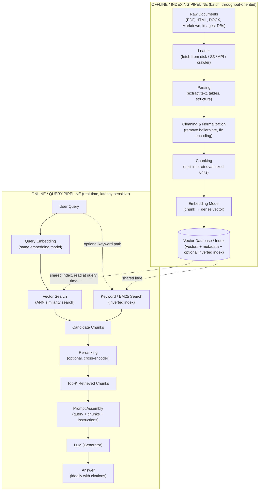

# Architecture & Internals

Chapter 2 gave you the conceptual map of RAG: a corpus gets chunked, embedded, and indexed; a query gets embedded, matched against the index, and the retrieved chunks get stuffed into a prompt for the LLM to reason over. That map is correct, but it is drawn at 30,000 feet. This chapter brings the plane down to 1,000 feet.

You will learn how a RAG system is actually *built* as two separate pieces of software with different performance goals, what happens inside "parsing" and "search" step by step, and where RAG's retrieval math comes from — decades of classic information retrieval (IR) research that existed long before LLMs. Understanding this foundation matters because almost every retrieval bug you will ever debug in production ("why didn't it find the obviously relevant chunk?") traces back to one of the mechanisms in this chapter.

---

## Learning Objectives

By the end of this chapter, you will be able to:

- Draw and explain the two-pipeline architecture of a RAG system: the **offline/indexing pipeline** and the **online/query pipeline**
- Explain why these two pipelines are built and scaled independently
- Describe how an **inverted index** enables fast keyword search, and build one by hand for a tiny corpus
- Explain **TF-IDF** and **BM25** — what problem each solves, and how BM25 improves on TF-IDF
- Compare **lexical (keyword) search** and **semantic (dense vector) search**, and state when each wins
- Define the core IR evaluation metrics — **Precision, Recall, MAP, NDCG** — and explain what "ranking" and "re-ranking" mean
- Describe the internals of document ingestion: PDF parsing, OCR, HTML/Markdown parsing, table and image extraction — and why parsing quality is a first-class RAG concern
- Name the standard tooling for document parsing (PyMuPDF, Unstructured, Apache Tika, BeautifulSoup) and write a minimal PDF-to-text extraction script

---

## Prerequisites for This Chapter

This chapter assumes you've completed:

- **[Chapter 1: Introduction & Prerequisites](./01-introduction-and-prerequisites.md)** — environment setup, Python/NLP baseline
- **[Chapter 2: Core Concepts of RAG](./02-core-concepts.md)** — the conceptual pipeline (ingestion → chunking → embedding → indexing → retrieval → augmentation → generation) and terminology (corpus, chunk, index, retriever, generator, grounding)

If terms like "chunk," "embedding," or "grounding" feel unfamiliar, go back to Chapter 2 first — this chapter builds directly on top of that vocabulary without re-explaining it.

---

## 1. Why "Two Pipelines," Not One

A beginner's mental model of RAG is often a single straight line: *documents go in one end, answers come out the other*. In reality, production RAG systems are two independent systems that happen to share a common data store (the vector index). Think of a library:

- **Building the library** (buying books, cataloging them, shelving them by subject) happens on the librarians' schedule — it can take all night, it doesn't need to be instant, and it happens whether or not anyone is currently visiting.
- **A visitor asking the librarian a question** needs an answer in seconds, not hours, using whatever is already on the shelves at that moment.

These are fundamentally different workloads:

| | Offline / Indexing Pipeline | Online / Query Pipeline |
|---|---|---|
| **Trigger** | New/updated documents | A user asks a question |
| **Optimized for** | Throughput (documents/hour) | Latency (milliseconds/query) |
| **Runs** | Batch jobs, scheduled crawls, nightly syncs | Every single user request |
| **Failure cost** | A delayed index update — annoying, rarely urgent | A slow or wrong answer — visible to the user immediately |
| **Typical scaling knob** | More workers, bigger batches, parallel chunking/embedding | More replicas, caching, faster ANN search, smaller models |

Because their scaling requirements differ so much, real systems let you scale them independently: you might run a fleet of GPU workers overnight to re-embed a million documents, while your query-serving API runs on a handful of low-latency instances that never touch the ingestion code path at all. Keeping them decoupled also means a slow or broken ingestion job never takes down the user-facing chat experience — the index simply goes a little stale, which is almost always the safer failure mode.

### The Full Architecture Diagram



Notice the single point of contact between the two halves: the **vector database / index**. The offline pipeline writes to it; the online pipeline only ever reads from it. This is the same separation of concerns you'd expect between a data warehouse ETL job and the dashboard that queries it.

---

## 2. Classic Information Retrieval Foundations

Before "RAG" existed as a term, search engines had spent 50+ years solving the exact problem retrieval needs to solve: *given a query, find the most relevant documents in a huge collection, fast*. Modern vector search didn't replace this body of work — it sits alongside it, and the best production systems (Chapter 8 covers this as "hybrid search") use both. You need to understand the classic techniques to understand why hybrid search exists at all.

### 2.1 The Inverted Index

**Analogy first.** Imagine the index at the back of a textbook. It doesn't list pages in order and tell you what's on each page (that would be the book itself — a "forward index"). Instead, it lists *words* alphabetically, and under each word, the page numbers where that word appears. If you want every page that mentions "mitochondria," you don't read the whole book — you jump straight to "M" in the index. That back-of-book index *is* an inverted index.

**Formal definition.** An inverted index maps each unique term in a corpus to the list of documents (and often the positions within those documents) where that term occurs.

**Worked example.** Suppose our tiny corpus is:

- Doc 1: "the cat sat on the mat"
- Doc 2: "the dog sat on the log"
- Doc 3: "cats and dogs are friends"

A (simplified, lower-cased) inverted index looks like:

| Term | Postings (doc IDs) |
|---|---|
| the | 1, 2 |
| cat | 1 |
| sat | 1, 2 |
| on | 1, 2 |
| mat | 1 |
| dog | 2 |
| log | 2 |
| cats | 3 |
| and | 3 |
| dogs | 3 |
| are | 3 |
| friends | 3 |

If a user searches for "dog," the engine doesn't scan all three documents word by word — it does a single dictionary lookup on "dog" and immediately gets `[2]`. This is why keyword search engines can query billions of documents in milliseconds: the expensive work (building the term → document mapping) is done once, offline, at indexing time, and the query-time cost is just a fast lookup plus merging a handful of posting lists. This is the direct keyword-search analogue of the vector index you learned about in Chapter 2 — same goal (avoid scanning everything at query time), different mechanism.

### 2.2 TF-IDF: Weighting Terms by How Informative They Are

Knowing *which* documents contain a word isn't enough — we need to know how *relevant* each document is. A naive approach would be: count how many times the query word appears in each document, and rank by that count. This is **Term Frequency (TF)**.

But TF alone is easily fooled. The word "the" appears constantly in every English document — a high TF for "the" tells you nothing about relevance. What we actually want is a way to boost words that are frequent in *this* document but rare *across the whole corpus* — because rare-but-present words are the ones that actually distinguish this document from the rest. That's the intuition behind **Inverse Document Frequency (IDF)**: a word that appears in every document (like "the") gets a low IDF weight; a word that appears in only a few documents (like "mitochondria") gets a high IDF weight.

**TF-IDF** multiplies the two together:

```
TF-IDF(term, doc) = TF(term, doc) × IDF(term)

TF(term, doc)  = (number of times term appears in doc) / (total terms in doc)

IDF(term) = log( N / (1 + number of documents containing term) )
```

where `N` is the total number of documents in the corpus.

**Why this matters for RAG intuition:** if a user asks "What is the warranty period for product X?", the word "the" gives almost zero signal, but "warranty" and "product X" (assuming it's a specific SKU or code) are rare across the corpus and therefore highly diagnostic. TF-IDF automatically up-weights exactly the terms a human would consider important, without anyone having to hand-write stopword-removal rules for every possible query.

TF-IDF is still used today as a baseline scoring function in keyword search and as a fast pre-filter in some hybrid pipelines, but it has a well-known flaw: raw term frequency grows without bound, so a document that repeats "warranty" 50 times looks 50x more relevant than one that mentions it once — which usually isn't true. That flaw is exactly what BM25 was designed to fix.

### 2.3 BM25: The Workhorse of Modern Keyword Search

**BM25** ("Best Matching 25," from a 1990s series of experiments) is TF-IDF's more sophisticated descendant, and it remains the default scoring algorithm in Elasticsearch, OpenSearch, and most production keyword search today — including the "lexical" half of hybrid RAG retrieval.

BM25 fixes two specific problems with plain TF-IDF:

1. **Term frequency saturation.** Going from 1 occurrence of "warranty" to 2 should matter a lot. Going from 20 occurrences to 21 should matter almost not at all — the document has already made its point. BM25 applies a saturating function so that additional occurrences give rapidly diminishing returns, instead of TF-IDF's unbounded linear growth.
2. **Document length normalization.** A 3-paragraph FAQ that mentions "warranty" twice is probably more focused on the topic than a 50-page manual that also mentions it twice. BM25 explicitly normalizes term frequency against document length relative to the average document length in the corpus, so long documents don't win purely by having more words to work with.

The formula (you don't need to memorize this, but recognize its shape):

```
BM25(D, Q) = Σ  IDF(qᵢ) × ( f(qᵢ, D) × (k1 + 1) )
                 ─────────────────────────────────
                 f(qᵢ, D) + k1 × (1 - b + b × |D| / avgdl)
```

- `f(qᵢ, D)` — how many times query term `qᵢ` appears in document `D`
- `|D|` / `avgdl` — this document's length vs. the corpus's average length
- `k1` (commonly ~1.2–2.0) — controls how quickly term frequency saturates
- `b` (commonly ~0.75) — controls how strongly document length is penalized

The reason BM25 is still relevant in a course about neural embeddings and LLMs is simple: **it is extremely good at exactly the things dense embeddings are weak at** — exact matches on product SKUs, error codes, legal citations, acronyms, names, and numbers. This complementary strength is why Chapter 8 (Advanced Retrieval) will teach you to combine BM25 and vector search into **hybrid search** rather than picking one.

### 2.4 Lexical Search vs. Semantic Search

You already met "semantic search" conceptually in Chapter 2 as the mechanism behind embedding-based retrieval. Now that you understand the lexical (keyword) side in detail, here's the direct comparison:

| | Lexical / Keyword Search (TF-IDF, BM25, inverted index) | Semantic / Dense Vector Search (embeddings) |
|---|---|---|
| **Matches on** | Exact word/token overlap | Meaning/similarity, even with different words |
| **Strong at** | Exact IDs, SKUs, error codes, names, acronyms, rare technical terms, quoted phrases | Paraphrase, synonyms, conceptual questions, cross-lingual queries (with multilingual embeddings) |
| **Weak at** | Synonyms ("car" vs. "automobile"), paraphrased questions, conceptual/fuzzy queries | Exact codes/numbers, rare tokens the embedding model undertrained on, precise Boolean logic |
| **Query "laptop won't turn on"** | Matches documents containing those literal words | Also matches a document that says "device fails to power up," even with zero word overlap |
| **Query "error code E-4471"** | Reliably finds the exact document mentioning E-4471 | May retrieve semantically "similar" error codes instead of the exact one — a real failure mode |
| **Index type** | Inverted index | Vector index (ANN structures like HNSW — covered in Chapter 6) |
| **Interpretability** | High — you can see exactly which terms matched | Lower — similarity is a distance in high-dimensional space, harder to explain to a user |

Neither approach is strictly better — they fail in different, complementary places. This is the single most important practical takeaway of this section, and it's the entire justification for the hybrid search architectures you'll build in Chapter 8.

---

## 3. IR Evaluation Metrics (Conceptual Introduction)

Once you can retrieve results, you need a way to measure whether the *right* results came back, and in what order. Chapter 13 will go deep on evaluation methodology and tooling (Ragas, DeepEval, etc.); here, you just need the vocabulary, because it's baked into how retrieval and re-ranking work.

Imagine a query has 10 truly relevant documents somewhere in a corpus of 10,000, and your retriever returns a ranked list of 5 results.

- **Precision** — of the results you *returned*, what fraction were actually relevant? "When I speak, how often am I right?"
  `Precision = (relevant items retrieved) / (total items retrieved)`
- **Recall** — of all the relevant documents that *exist*, what fraction did you manage to retrieve? "Of everything worth finding, how much did I find?"
  `Recall = (relevant items retrieved) / (total relevant items in corpus)`

  There's an inherent tension here: you can get perfect recall by returning every document in the corpus (but precision collapses), or perfect precision by returning only your single most confident result (but recall likely suffers). RAG systems must balance both, because retrieving too little starves the LLM of context, while retrieving too much (irrelevant chunks) dilutes the prompt and can actively mislead the model.

- **MAP (Mean Average Precision)** — Precision and Recall as defined above ignore *order*. MAP fixes that: it computes "average precision" per query (precision measured at each point a relevant result is found, then averaged), and then averages that across all your test queries. It rewards systems that put relevant results near the *top* of the list, not just somewhere in a big returned set.
- **NDCG (Normalized Discounted Cumulative Gain)** — goes a step further than MAP by allowing *graded* relevance (not just relevant/irrelevant, but "highly relevant," "somewhat relevant," "irrelevant") and by discounting the value of a relevant result the further down the ranked list it appears — a relevant document at position 1 is worth far more than the same document at position 20. NDCG is normalized against the best-possible ranking, producing a score between 0 and 1 that's comparable across queries.

### Ranking and Re-ranking

Every retriever produces a **ranking** — an ordered list of candidates by estimated relevance (a BM25 score, a cosine similarity, etc.). But the fast retrieval methods used to search millions of chunks (inverted index lookups, approximate nearest-neighbor vector search) trade some accuracy for speed. **Re-ranking** is a second pass: take the top N candidates from the fast, approximate first pass (say, top 50), and re-score them with a slower, more accurate model (often a cross-encoder that looks at the query and each chunk together, rather than independently) to produce a better final ordering before the top-K go into the prompt. You'll build this in Chapter 8 — for now, just recognize the two-stage "retrieve cheaply, then re-rank precisely" pattern, because it's a direct, practical application of the Precision/Recall/NDCG trade-offs above.

---

## 4. Document Processing & Ingestion Internals

Chapter 2 named "ingestion" as pipeline step one. Here's what actually happens inside it — and why this unglamorous stage quietly determines the ceiling on your entire RAG system's quality. The principle is simple and unforgiving: **garbage in, garbage out** — but in RAG, "garbage in" doesn't just produce one bad answer, it corrupts every downstream stage: bad text produces bad chunks, bad chunks produce bad embeddings, bad embeddings produce bad retrieval, and bad retrieval produces a confidently wrong answer with no error message anywhere to warn you.

### 4.1 PDF Parsing

PDFs are the single most common — and most treacherous — source format in enterprise RAG. A PDF is fundamentally a set of drawing instructions ("put this glyph at coordinate x,y") rather than a structured text document, which means "extracting text" is really "reverse-engineering intended reading order from a pile of positioned characters." This causes classic failure modes: multi-column layouts read left-to-right across columns instead of down each column, headers/footers get interleaved into body text, and tables collapse into unreadable strings of numbers.

Common tools:

- **PyMuPDF** (`fitz`) — fast, widely used, good text/layout extraction, can also pull embedded images.
- **Unstructured** — a higher-level Python library specifically built for RAG-style ingestion; it detects document structure (titles, list items, tables) across many file types, not just PDF.
- **Apache Tika** — a battle-tested, Java-based content-extraction toolkit supporting an enormous range of file formats (PDF, DOCX, PPTX, RTF, and more), often run as a standalone server.

A minimal PyMuPDF example:

```python
import fitz  # PyMuPDF

def extract_text_from_pdf(path: str) -> str:
    doc = fitz.open(path)
    full_text = []
    for page_num, page in enumerate(doc):
        text = page.get_text()
        full_text.append(f"--- Page {page_num + 1} ---\n{text}")
    doc.close()
    return "\n".join(full_text)

if __name__ == "__main__":
    raw_text = extract_text_from_pdf("sample.pdf")
    print(raw_text[:2000])  # inspect the first ~2000 characters
```

Notice this only gets you *raw* text — it says nothing about whether a table survived intact, whether a header repeated on every page polluted your corpus 40 times, or whether a scanned page produced any text at all. Always eyeball the raw output before you trust it downstream; the Hands-On Exercise below walks through exactly this inspection.

### 4.2 OCR for Scanned Documents

Some "PDFs" are actually just images of pages (a scanned contract, a faxed form) with no embedded text layer at all — `page.get_text()` on such a page returns an empty string, silently. To extract anything, you need **Optical Character Recognition (OCR)**: software that looks at the pixel image of a page and predicts what characters are drawn on it (Tesseract is the most common open-source OCR engine; cloud providers also offer OCR APIs). OCR is inherently lossier than native text extraction — it can misread similar-looking characters (`0` vs `O`, `1` vs `l`), struggle with poor scan quality, handwriting, or unusual fonts, and it typically loses fine-grained layout information. A production ingestion pipeline generally needs to first *detect* whether a page has an extractable text layer, and only fall back to OCR when it doesn't.

### 4.3 HTML, Markdown, and Structured Text

Web pages and Markdown files are usually easier than PDFs because they carry explicit structure (tags, headings) rather than just visual positioning:

- **HTML** — parsed with libraries like **BeautifulSoup**, which lets you walk the DOM tree and pull out only the meaningful content (article body, headings) while stripping navigation bars, ads, cookie banners, and scripts — content that would otherwise pollute your chunks with irrelevant boilerplate repeated on every page of a site.
- **Markdown** — closer to "already structured for you": headings (`#`, `##`), lists, and code blocks are unambiguous, which is exactly why Markdown-aware chunkers (Chapter 5) can split along heading boundaries and preserve document structure almost for free.

### 4.4 Tables and Images

Tables are a persistent pain point because their meaning depends on two-dimensional structure (this cell's value is meaningful *because* of its row and column headers), and naive text extraction flattens that structure into a meaningless stream of numbers and words. Better approaches detect table boundaries and either preserve them as Markdown/HTML tables (so structure survives into the chunk) or convert each row into a self-contained natural-language sentence (e.g., "In Q3 2024, Region West had revenue of $4.2M") that reads sensibly on its own once chunked. Images pose a different problem: a chart or diagram carries information a text extractor cannot see at all. Options range from simply discarding images, to running OCR on any text within them, to using a multimodal captioning model to generate a text description that stands in for the image in the index — a topic Chapter 15 (Enterprise & Multimodal RAG) covers in depth.

### 4.5 Why Parsing Quality Is a First-Class Concern

It's tempting to treat parsing as "plumbing" and spend your energy on the more interesting parts — embedding models, retrieval algorithms, prompt design. But recall the pipeline diagram: parsing is stage one, and every later stage operates on *its output*, not on the original document. If parsing merges a table's numbers into a nonsense string, no embedding model or LLM can recover the original meaning — the information is already gone. This is why experienced RAG engineers spend a disproportionate amount of debugging time reading raw extracted text before ever touching the embedding model or prompt — it is very often where the real problem lives.

---

## Real-World Scenario

A mid-sized insurance company builds an internal RAG assistant so adjusters can ask questions about policy documents ("What's the deductible for water damage under policy form HO-3?"). Two weeks after launch, adjusters start reporting wrong answers for anything involving numbers.

The team's debugging process mirrors this chapter's architecture:

1. They check the **online pipeline** first (the obvious suspect) — prompt template, LLM settings — and find nothing wrong.
2. They inspect the **retrieved chunks** for a failing query and notice the correct policy section *was* retrieved — but the deductible table inside it had been flattened by their PDF parser into a single run-on line: `Water Damage 500 1000 Fire 250 500 Theft 100 250`, with no column headers surviving. The LLM was essentially guessing which number belonged to which peril.
3. Tracing further back, this is a stage-one (offline pipeline) failure: their parser (a bare `pdfplumber` text extraction with no table detection) discarded table structure entirely.
4. The fix has nothing to do with embeddings, retrieval, or prompting — they swap in **Unstructured**'s table-aware partitioning, which detects the table and serializes each row as a clear sentence ("Water Damage peril: $500 deductible for form HO-3, $1,000 for form HO-5"). They re-run the offline pipeline to re-index all policy PDFs.
5. Retrieval quality on numeric/table questions jumps immediately, with zero changes to the online pipeline, the embedding model, or the LLM.

The lesson: because the two pipelines are decoupled, the team could pinpoint *which* pipeline owned the bug (offline) without touching the other — and the fix was a parsing change, not an "AI" change, exactly as this chapter's "garbage in, garbage out" principle predicts.

---

## Best Practices

- Treat the offline and online pipelines as separate systems with separate SLAs — don't let a slow ingestion job share infrastructure that your live query path depends on.
- Always manually inspect raw parser output on a sample of real documents before building anything on top of it — don't assume any parser handles your specific document layouts correctly out of the box.
- Prefer table-aware and layout-aware parsers (Unstructured, PyMuPDF with layout analysis, Tika) over naive "grab all the text" extraction whenever your corpus contains tables or multi-column layouts.
- Detect PDFs (or individual pages) that need OCR rather than blindly OCR-ing everything — native text extraction is faster and more accurate when it's available.
- Default to hybrid retrieval design (keyword + semantic) from the start for corpora containing IDs, codes, SKUs, or proper nouns — don't wait for a production incident to discover BM25's strengths.
- When choosing or tuning a retriever, think in terms of Precision/Recall/NDCG trade-offs explicitly, not just "does it look right for this one example query."
- Log what your parser actually extracted (not just that it "succeeded") so ingestion failures are debuggable later.

## Common Mistakes

- Assuming a PDF's visual layout survives text extraction — multi-column pages and tables are especially prone to silently scrambled reading order.
- Skipping inspection of raw extracted text and debugging "bad answers" by tweaking prompts, when the real defect is upstream in parsing.
- Coupling the indexing pipeline and query-serving pipeline so tightly that a slow nightly re-index job degrades live query latency.
- Relying purely on semantic/vector search and being surprised when exact product codes, error numbers, or names aren't retrieved reliably.
- Relying purely on keyword/BM25 search and being surprised when a paraphrased user question ("my screen is black" vs. "device fails to display") returns nothing.
- Treating IDF/BM25 as "old and irrelevant" simply because embeddings are newer — production systems routinely combine both.
- Ignoring document length normalization issues when evaluating retrieval quality — long documents can dominate naive scoring without it.
- Forgetting that OCR is lossy and not verifying OCR output on a sample of scanned documents before trusting it in production.

---

## Summary

RAG's internal architecture splits into two independent systems: an **offline/indexing pipeline** (documents → loader → parsing → chunking → embedding → vector DB), optimized for throughput, and an **online/query pipeline** (query → embedding → vector search → retrieved chunks → prompt assembly → LLM → answer), optimized for latency. They meet only at the shared index. Underneath modern semantic retrieval sits decades of classic IR: the **inverted index** makes keyword lookup fast, **TF-IDF** weights terms by how distinctive they are, and **BM25** improves on TF-IDF with term-frequency saturation and document-length normalization — which is why BM25 remains a core ingredient of production hybrid search alongside dense vector search. Lexical and semantic search fail in complementary ways (exact terms vs. paraphrase/meaning), which is the whole justification for combining them. Retrieval quality is measured with Precision, Recall, MAP, and NDCG, and production systems commonly retrieve cheaply first, then re-rank precisely. Finally, none of this matters if document parsing is broken: PDFs, scanned images, HTML, tables, and embedded images each need appropriate handling (PyMuPDF, Unstructured, Tika, OCR, BeautifulSoup), because ingestion errors corrupt every later stage of the pipeline irreversibly.

---

## Knowledge Check

1. Why are the offline/indexing and online/query pipelines in a RAG system typically built and scaled as separate systems rather than one combined process?
2. Explain, in your own words, what an inverted index is and why it makes keyword search fast. Build one by hand for the sentences "the sun is bright" and "the moon is not bright."
3. What specific problem does BM25 solve that plain TF-IDF does not, and how does it solve it (name both mechanisms)?
4. A user searches for an exact error code like "ERR-30492." Would you expect lexical search or semantic search to perform better here, and why? Give a second example query where the opposite approach would win.
5. What is the difference between Precision and Recall? Describe a retrieval scenario where a system could have perfect Recall but very poor Precision.
6. Why is document parsing described as a "garbage in, garbage out" concern that is especially severe for RAG, compared to a general text-processing task?

---

## Hands-On Exercise

**Part 1 — Inspect real PDF extraction artifacts**

1. Find (or create) a PDF that contains at least one multi-column section or one table — a research paper or an invoice template works well.
2. Install PyMuPDF: `pip install pymupdf`
3. Run the extraction script from Section 4.1 (`extract_text_from_pdf`) against your PDF and print the full output to a text file.
4. Read the output carefully and note every artifact you find — for example: table rows flattened into a single line, header/footer text interleaved mid-sentence, column text interleaved out of order, or missing text (a sign the page may need OCR).
5. Write down, for each artifact, which downstream pipeline stage(s) it would corrupt (chunking? embedding? both?) if left unfixed.

**Part 2 — Compute BM25 intuition by hand on a toy corpus**

Given this tiny 3-document corpus:

- Doc 1: "cats are small furry animals"
- Doc 2: "dogs are loyal furry animals that bark"
- Doc 3: "cats and dogs are both popular pets"

For the query **"furry animals"**:

1. Manually list which documents contain "furry" and which contain "animals" (this is your inverted index lookup).
2. Without computing the exact formula, reason qualitatively: which document should score highest, and why, considering (a) how many query terms it contains, and (b) its length relative to the others?
3. Now consider a modified Doc 1 that repeats "furry" ten times: "cats are furry furry furry furry furry furry furry furry furry furry animals." Would plain TF-IDF and BM25 agree on how much this should boost the document's score? Explain the term-frequency-saturation difference in your own words.
4. Optional: install the `rank_bm25` Python package (`pip install rank_bm25`) and verify your reasoning by actually scoring all three original documents against the query.

---

## Further Reading

- Manning, Raghavan, Schütze — *Introduction to Information Retrieval* (free online) — the canonical textbook covering inverted indices, TF-IDF, and evaluation metrics in full rigor.
- Robertson & Zaragoza — *The Probabilistic Relevance Framework: BM25 and Beyond* — the original theoretical grounding for BM25.
- PyMuPDF documentation — https://pymupdf.readthedocs.io/
- Unstructured library documentation — https://docs.unstructured.io/
- Apache Tika documentation — https://tika.apache.org/
- BeautifulSoup documentation — https://www.crummy.com/software/BeautifulSoup/bs4/doc/
- Elasticsearch's own BM25 explainer (practical, implementation-focused) — https://www.elastic.co/blog/practical-bm25-part-2-the-bm25-algorithm-and-its-variables

---

<div style="display:flex;justify-content:space-between;align-items:center;">
  <a href="./02-core-concepts.md">← Previous: Core Concepts of RAG</a>
  <a href="./00-index.md">🏠 Index</a>
  <a href="./04-embeddings-fundamentals.md">Next: Embeddings Fundamentals →</a>
</div>
