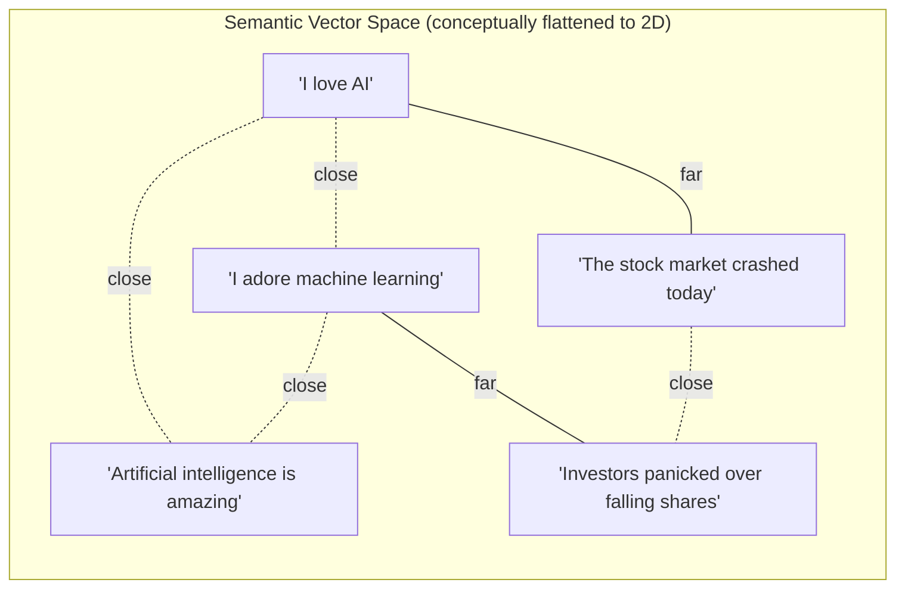

# Chapter 4: Embeddings Fundamentals

> "You shall know a word by the company it keeps." — J.R. Firth, 1957

## Learning Objectives

By the end of this chapter, you will be able to:

- Explain what a text embedding is, in plain language, to someone with no ML background
- Describe intuitively *why* embeddings capture meaning, without needing to derive neural network math
- Compute and interpret Cosine Similarity, Dot Product, and Euclidean Distance, and choose the right one for a task
- Compare the major embedding model families (OpenAI, BGE, E5, GTE, Jina, Nomic, Instructor) and read an MTEB leaderboard entry correctly
- Evaluate an embedding model against practical criteria: quality, speed, dimensionality, multilingual support, context length, and cost
- Generate embeddings in Python and compute similarity between sentences
- Recognize and avoid the most common production pitfall in this entire course: model mismatch between indexing and querying

---

## Prerequisites for This Chapter

This chapter builds directly on **[Chapter 3: Architecture & Internals](./03-architecture-and-internals.md)**, where you learned:

- The classic IR toolkit — inverted indexes, TF-IDF, and BM25 — which retrieves documents by **lexical overlap** (matching words)
- The two-phase RAG pipeline: an **offline/indexing phase** (documents → chunks → vectors → vector store) and an **online/query phase** (query → vector → retrieve → generate)
- That somewhere in both phases, a mysterious step converts text into "vectors"

This chapter opens up that mysterious step. If BM25 from Chapter 3 asks "do these two texts share the same *words*?", embeddings ask a fundamentally different question: "do these two texts share the same *meaning*?" That shift — from lexical matching to semantic matching — is the single biggest reason RAG systems built on embeddings can find a passage about "automobile maintenance" when you search for "car repair," even though not one word overlaps.

No new setup is required. If you want to run the code examples, have Python 3.9+ available; installation instructions are in the worked example below.

---

## 1. What Is an Embedding? Building Intuition First

### 1.1 The problem embeddings solve

Computers only understand numbers. A neural network cannot "read" the word "dog" — it needs the word represented as numbers it can do math on. The crude approach is to assign each word an arbitrary ID (dog = 482, puppy = 9,013). But this throws away everything we know: that "dog" and "puppy" are related, while "dog" and "spreadsheet" are not. Arbitrary IDs carry no meaning.

An **embedding** is a smarter numeric representation. It's a **fixed-length list of numbers (a vector)** assigned to a piece of text (or an image, or audio clip) such that:

> **Texts with similar meaning get vectors that are close together in space. Texts with different meaning get vectors that are far apart.**

```
"I love AI"           →  [0.23, -0.12, 0.88, ..., 0.04]   (e.g., 1536 numbers)
"I adore machine learning" →  [0.25, -0.10, 0.85, ..., 0.06]   (very close to the above)
"The stock market fell today" → [-0.71, 0.44, -0.02, ..., 0.91]  (far away)
```

Each number in the vector doesn't correspond to anything a human can name directly (there's no single dimension that means "animal-ness"). But collectively, the *position* of the vector in this high-dimensional space encodes meaning. That's the whole idea. Everything else in this chapter is refinement of that one sentence.

### 1.2 A 2D analogy before the real thing

Real embeddings have hundreds or thousands of dimensions, which nobody can visualize. So let's cheat and imagine a toy embedding space with only **2 dimensions** — just enough to plot on paper.

Picture a 2D map where we've placed four words based on two made-up axes: "royalty-ness" (x-axis) and "gender, male→female" (y-axis):

```
   royalty-ness
        ▲
        │
        │        ●queen
        │
        │
king●   │
        │
────────┼─────────────────► gender (male → female)
        │
        │
        │
 man●   │
        │              ●woman
        │
```

Notice the geometry: the "gap" between `king` and `man` (both male) looks similar in direction and size to the gap between `queen` and `woman` (both female). This is the famous embedding relationship popularized by Word2Vec:

```
vector("king") - vector("man") + vector("woman") ≈ vector("queen")
```

You just took the "royal" direction from `king`, removed "male," added "female," and arrived approximately at `queen` — pure vector arithmetic reconstructing a meaningful relationship. Nobody programmed the rule "royalty + gender = title." It **emerged** from the geometry the model learned. That emergent structure is why embeddings are so powerful for search: semantically related concepts cluster and align even though no human hand-labeled those relationships.

Real embedding models don't have a clean "royalty" axis or a clean "gender" axis — the hundreds of dimensions are entangled and uninterpretable individually. But the *aggregate geometric behavior* — similar meaning → nearby points, meaningful relationships → consistent directions — is exactly what makes retrieval work.

### 1.3 The formal definition

An embedding function `E` maps a piece of text `t` to a vector `v` in `ℝ^d` (a d-dimensional real-valued space):

```
E(t) = v,   where v ∈ ℝ^d
```

- `d` (dimensionality) is fixed by the model — e.g., 384, 768, 1024, 1536, or 3072 — and every text, whether it's one word or three paragraphs, is compressed into that same fixed-length vector.
- The mapping `E` is not designed by hand; it is **learned** by training a neural network (Section 2).
- Once you have vectors, "is text A similar to text B?" becomes "are vector A and vector B close together?" — a pure geometry question, answerable in milliseconds even across billions of vectors (this is what vector databases in **Chapter 6** are built to do).

---

## 2. Why Embeddings Work: The Distributional Hypothesis

You don't need to understand transformer internals to have solid intuition here. The core idea predates deep learning by decades and is called the **distributional hypothesis**: *words that occur in similar contexts tend to have similar meanings.*

Consider these two sentences with a blank:

```
"I need to walk my ___ before dinner."
"I need to walk my ___ before dinner."
```

If you fill the blank with "dog" or "puppy," both sentences read naturally. If you fill it with "spreadsheet," it doesn't. A model trained on billions of sentences like this notices, purely from **co-occurrence statistics**, that "dog" and "puppy" appear in overlapping contexts far more often than "dog" and "spreadsheet" do. Over enough training data, the model organizes its internal vector space so that words/sentences appearing in similar contexts end up with similar vectors — not because anyone told it what a dog is, but because the *statistical pattern of usage* pushed them together during training.

Modern embedding models (built on transformer architectures, the same family behind LLMs) extend this from single words to entire sentences and paragraphs, using training objectives such as:

- **Contrastive learning**: the model is shown pairs of texts known to be related (e.g., a question and its correct answer, or two paraphrases) and pairs known to be unrelated. It is trained to pull related pairs' vectors closer and push unrelated pairs' vectors apart.
- **Masked/next-token prediction pretraining**: like LLMs, embedding models often start from a language model that has already learned rich contextual representations of text, then get fine-tuned specifically to produce good sentence-level vectors.

The practical upshot for you as a RAG builder: **you don't train these models yourself.** You choose a pretrained embedding model (Section 4) and use it as-is. Understanding *why* it works helps you reason about *when it might fail* — for example, an embedding model trained mostly on English news text may embed legal contracts or source code poorly, because those domains have different distributional statistics than what it saw during training.

---

## 3. Similarity Metrics: Measuring "Closeness"

Once text is a vector, "similar meaning" becomes "small distance" or "small angle" between two points. There are three metrics you'll encounter constantly.

### 3.1 Cosine Similarity

Measures the **angle** between two vectors, ignoring their magnitude (length).

```
                A · B
cosine(A, B) = ───────
               ‖A‖ ‖B‖
```

Where `A · B` is the dot product and `‖A‖`, `‖B‖` are the vectors' magnitudes (Euclidean norms). The result ranges from **-1** (opposite meaning) to **1** (identical direction, i.e., same meaning), with **0** meaning unrelated/orthogonal.

**Why it's the default for text embeddings:** two sentences can point in almost the same direction (same meaning) even if one vector happens to be "longer" than the other — magnitude often correlates with things like text length or word frequency rather than meaning. Cosine similarity cares only about direction, so it's invariant to that noise. Most embedding models (including OpenAI's and BGE) are explicitly trained or normalized so that cosine similarity is the intended comparison metric.

### 3.2 Dot Product

```
A · B = Σ (Aᵢ × Bᵢ)  =  a₁b₁ + a₂b₂ + ... + aₙbₙ
```

This is cosine similarity *without* dividing by the magnitudes. If the vectors are already **normalized to unit length** (‖A‖ = ‖B‖ = 1), then dot product and cosine similarity produce identical rankings — and dot product is cheaper to compute (no division, no square roots), which matters at billion-vector scale. Many vector databases default to dot product internally for this reason, after normalizing vectors once at insert time. Some models (e.g., certain OpenAI embeddings) are trained such that vector magnitude *does* carry a small amount of useful signal, but this is the exception, not the rule.

### 3.3 Euclidean Distance (L2 Distance)

```
d(A, B) = √( Σ (Aᵢ - Bᵢ)² )
```

This measures **straight-line distance** between the two points, the same formula you learned for 2D/3D geometry in school, generalized to `d` dimensions. Smaller distance = more similar. Unlike cosine similarity, Euclidean distance **is** sensitive to magnitude — two vectors pointing the same direction but with very different lengths will show a large Euclidean distance despite being "conceptually" aligned.

### 3.4 Which one should you use?

| Metric | Sensitive to magnitude? | Typical use case |
|---|---|---|
| **Cosine Similarity** | No | Default choice for text embeddings; most embedding models are designed/benchmarked with this in mind |
| **Dot Product** | Yes (unless vectors pre-normalized) | High-performance retrieval when vectors are normalized at index time (equivalent to cosine, faster) |
| **Euclidean Distance** | Yes | Clustering algorithms (e.g., k-means), image embeddings, or cases where absolute distance in space is meaningful |

**Practical rule of thumb:** unless your embedding model's documentation explicitly recommends otherwise, use **cosine similarity** for text retrieval in RAG. When you configure a vector database in Chapter 6, one of the setup parameters will almost always be "distance metric" — set it to cosine (or dot product with normalized vectors, which is mathematically equivalent and faster) for text use cases.

---

## 4. The Embedding Model Landscape

Just like there's no single "best" LLM, there's no single "best" embedding model — the right choice depends on your data, latency budget, and infrastructure. Here's the map of what's out there today.

### 4.1 Proprietary / API-based models

**OpenAI embeddings** are the most widely used starting point because they require no infrastructure — you call an API and get a vector back.

- **`text-embedding-3-small`**: 1536 dimensions (configurable smaller via dimension truncation), cheap, fast, strong general-purpose quality. Good default for prototypes and cost-sensitive production.
- **`text-embedding-3-large`**: 3072 dimensions, higher retrieval accuracy on harder/more nuanced queries, higher cost and storage footprint. Use when quality matters more than cost and you can afford larger vector storage.

Both support **dimension truncation** — you can request a smaller vector (e.g., 256 dims from `text-embedding-3-large`) and lose only a modest amount of accuracy while saving significant storage and search latency. This is a distinctive, useful feature worth knowing about when choosing dimensionality.

### 4.2 Open-source / self-hosted models

These run on your own hardware (or a managed inference endpoint you control), which matters for data privacy, cost at scale, and avoiding API rate limits.

| Model family | Notes |
|---|---|
| **BAAI BGE** (BGE-large, BGE-M3, etc.) | Strong MTEB rankings; BGE-M3 supports dense, sparse, and multi-vector retrieval in one model; widely adopted in open-source RAG stacks |
| **E5** (intfloat/e5-large-v2, multilingual-e5) | Trained with contrastive learning on massive web-scraped pairs; requires specific query/passage prefixes (`"query: ..."` / `"passage: ..."`) for best results — an easy detail to miss |
| **GTE** (General Text Embeddings, Alibaba) | Competitive quality, multiple size tiers (small/base/large), good cost/quality trade-off |
| **Jina Embeddings** | Notable for long context length support (some variants handle 8K tokens or more), useful when chunks can't be kept short |
| **Nomic Embed** | Fully open (weights, training data, and code), long context, popular for fully auditable open pipelines |
| **Instructor XL** | "Instruction-tuned" embeddings — you prepend a task description ("Represent this sentence for retrieval") that steers the embedding toward the specific downstream task, which can improve accuracy on specialized tasks |

### 4.3 MTEB: how to compare models objectively

With dozens of models claiming to be "state of the art," you need a neutral referee. That's the **Massive Text Embedding Benchmark (MTEB)** — a standardized suite of tasks (retrieval, classification, clustering, semantic similarity, reranking, and more) run identically across every submitted model, with results published on a public leaderboard (hosted on Hugging Face).

When reading an MTEB leaderboard, pay attention to:

- **The "Retrieval" column/average specifically** — a model can rank #1 overall but be mediocre at retrieval specifically (the task RAG actually cares about); don't just look at the overall average score.
- **Model size and dimensionality** alongside the score — a model that scores 1% higher but is 5x larger and 5x slower is rarely the right production trade-off.
- **The date of evaluation** — this field moves fast; a leaderboard snapshot from a year ago may be outdated as new models release monthly.

Treat MTEB as a strong starting filter, not a final verdict — always validate the shortlisted candidates against your own domain data (Section 5) before committing.

---

## 5. Choosing an Embedding Model: Practical Evaluation Dimensions

MTEB tells you how a model performs on public benchmarks. Before you commit to one for production, evaluate it against these dimensions using **your own data**:

1. **Embedding quality / retrieval accuracy** — Does it actually retrieve the right chunks for representative queries from your domain? A model great at general web text may underperform on legal, medical, or code-heavy corpora. Build a small labeled test set (query → expected correct chunk) and measure Recall@K (previewed here, covered in depth in **Chapter 13: Evaluation & Testing**).

2. **Speed / latency** — How long does embedding one query take? This matters most at query time (users are waiting) but also at index time if you're embedding millions of documents. Self-hosted small models (e.g., BGE-small, 384 dims) can be 5-10x faster than large API models.

3. **Vector dimensionality (storage cost trade-off)** — Higher dimensions generally mean better quality but linearly more storage and slower search. A 3072-dim vector takes 8x the storage of a 384-dim vector for the same number of documents. At millions of chunks, this becomes a real infrastructure cost — factor it in before defaulting to the largest model available.

4. **Multilingual support** — If your documents or user queries span multiple languages, verify the model was explicitly trained for multilingual retrieval (e.g., `multilingual-e5`, OpenAI's embeddings, or BGE-M3). A model trained purely on English text will embed other languages poorly or inconsistently.

5. **Context length limits** — Every embedding model has a maximum input length (measured in tokens), beyond which text gets truncated silently or rejected. If your chunks (set up in **Chapter 5: Chunking Strategies**) are longer than the model's limit, you'll lose information without an obvious error. Match your chunk size to your embedding model's context window.

6. **Cost** — API models (OpenAI) charge per token embedded, which adds up at scale for both initial indexing and ongoing updates. Self-hosted open-source models have upfront infrastructure/GPU cost but no per-call fee — often cheaper at high volume, more expensive at low volume (when you're paying for idle infrastructure).

---

## 6. Visualizing Vectors in Semantic Space

Here's a diagram of how a handful of sentences might cluster in embedding space (conceptually collapsed to 2D for illustration — real vectors live in hundreds of dimensions):



Notice the two natural clusters: the "AI enthusiasm" sentences (A, B, C) sit close together, and the "financial news" sentences (D, E) sit close together — even though **no word is shared** between "I love AI" and "Artificial intelligence is amazing." That's semantic search working exactly as intended, and it's precisely the capability that lexical methods like BM25 (Chapter 3) cannot provide on their own — which is why production RAG systems increasingly combine both (hybrid search, covered in **Chapter 8**).

---

## 7. Worked Example: Generating Embeddings and Computing Similarity in Python

Let's make this concrete. We'll use `sentence-transformers`, a popular open-source library, to embed a few sentences and compute cosine similarity between them.

### 7.1 Setup

```bash
pip install sentence-transformers scikit-learn numpy
```

### 7.2 Code

```python
from sentence_transformers import SentenceTransformer
from sklearn.metrics.pairwise import cosine_similarity
import numpy as np

# Load a small, fast, well-regarded open-source embedding model.
# "all-MiniLM-L6-v2" produces 384-dimensional vectors and runs on CPU easily.
model = SentenceTransformer("all-MiniLM-L6-v2")

sentences = [
    "I love artificial intelligence.",        # 0
    "I really enjoy machine learning.",        # 1 - similar meaning to 0
    "Deep learning models are fascinating.",   # 2 - related to 0/1
    "The stock market crashed yesterday.",     # 3 - unrelated
    "Investors are worried about inflation.",  # 4 - unrelated, but related to 3
]

# Step 1: Convert each sentence to a fixed-length vector.
embeddings = model.encode(sentences)
print("Shape:", embeddings.shape)   # (5, 384) -> 5 sentences, 384 dimensions each

# Step 2: Compute pairwise cosine similarity between every sentence pair.
similarity_matrix = cosine_similarity(embeddings)

print("\nCosine Similarity Matrix:\n")
header = "        " + "  ".join(f"S{i}" for i in range(len(sentences)))
print(header)
for i, row in enumerate(similarity_matrix):
    print(f"S{i}:  " + "  ".join(f"{val:.2f}" for val in row))
```

### 7.3 Expected output (values are illustrative; exact numbers vary by model version)

```
Shape: (5, 384)

Cosine Similarity Matrix:

        S0  S1  S2  S3  S4
S0:   1.00  0.72  0.58  0.06  0.11
S1:   0.72  1.00  0.61  0.09  0.14
S2:   0.58  0.61  1.00  0.15  0.18
S3:   0.06  0.09  0.15  1.00  0.55
S4:   0.11  0.14  0.18  0.55  1.00
```

### 7.4 Interpreting the result

- The diagonal is always `1.00` — every sentence is perfectly similar to itself.
- `S0` ("I love AI") and `S1` ("I enjoy machine learning") score **0.72** — high similarity, correctly reflecting that they're near-paraphrases.
- `S3` (stock market) and `S4` (inflation/investors) score **0.55** — moderately similar, both being finance-related.
- Cross-topic pairs like `S0`–`S3` score **0.06** — near zero, correctly identified as unrelated.

This is the entire semantic retrieval mechanism in miniature: embed the query the same way, compute cosine similarity against every stored chunk vector, and return the highest-scoring chunks. Vector databases (Chapter 6) do exactly this computation, just optimized to run over millions or billions of vectors in milliseconds using approximate nearest-neighbor (ANN) indexing instead of a brute-force matrix like above.

### 7.5 Equivalent using an OpenAI-style client

If you prefer an API-based model instead of a local one, the shape of the code is nearly identical — only the call to get embeddings changes:

```python
from openai import OpenAI
import numpy as np

client = OpenAI()  # reads OPENAI_API_KEY from environment

def embed(text: str) -> np.ndarray:
    response = client.embeddings.create(
        model="text-embedding-3-small",
        input=text,
    )
    return np.array(response.data[0].embedding)

def cosine_sim(a: np.ndarray, b: np.ndarray) -> float:
    return float(np.dot(a, b) / (np.linalg.norm(a) * np.linalg.norm(b)))

v1 = embed("I love artificial intelligence.")
v2 = embed("I really enjoy machine learning.")
v3 = embed("The stock market crashed yesterday.")

print("Similar pair:", cosine_sim(v1, v2))     # expect high, e.g. ~0.7+
print("Unrelated pair:", cosine_sim(v1, v3))   # expect low, e.g. ~0.1
```

Note that **`text-embedding-3-small` returns 1536-dimensional vectors**, not 384 like MiniLM — a reminder that dimensionality, and therefore storage size, is model-specific (Section 4.1).

---

## 8. Real-World Scenario

**Scenario:** A legal-tech startup builds a RAG system over 50,000 contracts using OpenAI's `text-embedding-3-small`. It works well in testing. Three months later, the team wants to cut API costs, so an engineer swaps the embedding call to a self-hosted BGE-base model — but only updates the **query-time** embedding call, assuming the vector database will "just work" with the new vectors.

Immediately, retrieval quality collapses: the system returns nonsensical or irrelevant contract clauses for nearly every query. Debugging reveals two compounding mistakes:

1. **Dimensionality mismatch**: `text-embedding-3-small` produces 1536-dim vectors; BGE-base produces 768-dim vectors. The vector database was configured for 1536 dimensions, so queries either fail outright or get silently zero-padded/truncated, producing garbage comparisons.
2. **Model mismatch**: even after fixing dimensionality (e.g., by re-configuring the index), the *existing* 50,000 stored vectors were still produced by OpenAI's model, while new queries were embedded with BGE. Comparing a BGE query vector against an OpenAI document vector is meaningless — the two models don't share a coordinate system. It's like comparing GPS coordinates against coordinates from a fictional map: the numbers exist, but they don't refer to the same space.

**The fix:** the team re-embeds the *entire* corpus (all 50,000 contracts) using the new BGE model, rebuilds the vector index from scratch with the correct dimensionality, and only then switches the query-time embedding call. Retrieval quality is restored — at the cost of a full re-indexing pass and downtime window they hadn't budgeted for.

**Lesson:** an embedding model swap is never a one-line change. It's a "must re-embed everything" event, and it should be planned and versioned like a database migration, not a config tweak.

---

## 9. Best Practices

- **Always use the exact same embedding model for indexing and querying.** This is the single most important rule in this chapter — see Section 10 for what happens when it's violated.
- **Pin the model version explicitly**, including for API models (e.g., record which OpenAI embedding model *and* dimension setting you used), so an upstream default change doesn't silently break your index.
- **Validate on your own domain data**, not just MTEB rankings — legal, medical, code, and multilingual corpora behave very differently from the general web text most benchmarks emphasize.
- **Normalize vectors** (scale to unit length) at indexing time if your vector database or downstream code assumes normalized inputs for dot-product search — many libraries do this for you, but verify rather than assume.
- **Match embedding context length to chunk size** (a preview of Chapter 5) — chunks longer than the model's max input will be silently truncated, dropping information invisibly.
- **Track cost and latency budgets early**: benchmark tokens/second and $/million-tokens for your shortlisted models against your expected indexing volume and query rate before committing to production infrastructure.
- **Keep a re-embedding runbook**: document the steps to re-embed the full corpus and rebuild the index, since you will eventually upgrade or switch models.

---

## 10. Common Mistakes

- **Model mismatch between indexing and querying.** Embedding your documents with Model A and your queries with Model B produces vectors from two different, incompatible coordinate systems. Similarity scores become meaningless noise, and retrieval silently degrades rather than failing loudly — often mistaken for a "bad chunking" or "bad prompt" problem instead of being traced back to the real cause.
- **Dimensionality mismatch when swapping models.** Different models output different vector lengths (384 vs. 768 vs. 1536 vs. 3072). Most vector databases require a fixed dimensionality per index; forgetting to reconfigure (or fully rebuild) the index after a model change causes errors or, worse, silently corrupted comparisons.
- **Embedding drift after a model version upgrade.** Even a "minor" version bump of the same model family (e.g., `text-embedding-ada-002` → `text-embedding-3-small`) can shift the vector space enough that old and new vectors are not directly comparable. Treat every model upgrade as requiring a full corpus re-embed, not an in-place patch.
- **Using Euclidean distance on non-normalized vectors** when the model was designed for cosine similarity, producing rankings skewed by vector magnitude rather than actual semantic closeness.
- **Ignoring context length limits**, causing long chunks to be silently truncated with no error, quietly dropping the second half of a document's content from every embedding.
- **Trusting MTEB's overall average blindly** instead of checking the retrieval-specific score and validating against real domain data — a model can be a top generalist and a poor fit for your specific corpus.
- **Forgetting query/passage prefixes** required by some models (e.g., E5's `"query: "` / `"passage: "` convention) — omitting them doesn't cause an error, just quietly worse retrieval quality.

---

## Summary

- An **embedding** is a fixed-length numeric vector representing the meaning of text, such that semantically similar texts map to nearby vectors — this is the foundation of semantic search, contrasted with the lexical matching of BM25/TF-IDF from Chapter 3.
- Embeddings work because of the **distributional hypothesis**: models learn, from massive text corpora, that words and sentences appearing in similar contexts should have similar vector representations.
- **Cosine similarity** is the default metric for comparing text embeddings because it's magnitude-invariant; **dot product** is a faster equivalent for normalized vectors; **Euclidean distance** matters more for clustering or magnitude-sensitive tasks.
- The embedding landscape spans proprietary APIs (**OpenAI's `text-embedding-3-small`/`-large`**) and open-source self-hosted models (**BGE, E5, GTE, Jina, Nomic, Instructor XL**), with the **MTEB leaderboard** as the standard objective comparison tool.
- Choosing a model requires balancing **quality, speed, dimensionality/storage cost, multilingual support, context length, and cost** — always validated against your own domain data.
- The single most consequential rule in production RAG: **the same embedding model must be used for both indexing and querying**, and any model change requires re-embedding the entire corpus.

---

## Knowledge Check

1. In your own words, explain why "car repair" and "automobile maintenance" can be retrieved as similar even though they share zero words in common. Which retrieval approach from Chapter 3 would fail to make this connection, and why?
2. Write out the cosine similarity formula and explain what happens to the score if you double the length (magnitude) of one of the two vectors, without changing its direction.
3. A colleague suggests switching your vector database's distance metric from cosine similarity to raw Euclidean distance without re-normalizing vectors. What risk does this introduce?
4. You're building a RAG system for a multilingual customer support corpus (English, Spanish, and Hindi tickets). Which two evaluation dimensions from Section 5 are most critical for this scenario, and why?
5. Your team wants to upgrade from a 768-dimension open-source embedding model to a 3072-dimension proprietary one for better quality. List every downstream system/step that this change will force you to touch.
6. Explain the difference between "the MTEB overall average score" and "the MTEB retrieval-specific score," and why a RAG engineer should care about the distinction.

---

## Hands-On Exercise

Using `sentence-transformers` (or an OpenAI-style client if you prefer an API-based model), embed the following 5 sentences:

1. "The cat sat quietly on the warm windowsill."
2. "A feline rested peacefully near the sunny window."
3. "Our kitten loves napping in sunlight."
4. "The quarterly earnings report exceeded analyst expectations."
5. "Stock prices rallied after the strong financial results."

**Tasks:**

1. Generate embeddings for all 5 sentences using a model of your choice.
2. Compute the full 5×5 cosine similarity matrix (adapt the code from Section 7.2).
3. Print the matrix and identify which sentences form which cluster.
4. Answer in writing:
   - Which sentences scored highest against each other, and does that match your intuition about their meaning?
   - Sentences 1-3 are about a cat; sentences 4-5 are about finance. Did the cross-cluster similarity scores (e.g., sentence 1 vs. sentence 4) come out low, as expected?
   - Try changing the embedding model (e.g., swap `all-MiniLM-L6-v2` for `all-mpnet-base-v2` or an OpenAI model) and re-run. Do the *absolute* similarity scores change? Do the *relative rankings* (which pairs are most/least similar) stay consistent?
5. **Bonus:** Deliberately mix in one vector produced by a *different* embedding model into your similarity matrix (e.g., embed sentence 5 with a different model than the other four) and observe how the similarity scores become unreliable — this is a hands-on demonstration of the model-mismatch pitfall from Section 10.

---

## Further Reading

- [MTEB Leaderboard (Hugging Face)](https://huggingface.co/spaces/mteb/leaderboard) — the standard public benchmark for comparing embedding models across retrieval, classification, clustering, and more
- [OpenAI Embeddings Documentation](https://platform.openai.com/docs/guides/embeddings) — official guide to `text-embedding-3-small`/`-large`, dimensions, and usage
- [BAAI/bge-large-en-v1.5 Model Card (Hugging Face)](https://huggingface.co/BAAI/bge-large-en-v1.5) — architecture, training details, and usage instructions for BGE
- [intfloat/e5-large-v2 Model Card (Hugging Face)](https://huggingface.co/intfloat/e5-large-v2) — E5 model card, including the query/passage prefix convention
- [Sentence-Transformers Documentation](https://www.sbert.net/) — the library used in this chapter's code example, with dozens of pretrained models
- Mikolov et al., *"Efficient Estimation of Word Representations in Vector Space"* (2013) — the original Word2Vec paper behind the king/queen analogy
- Firth, J.R., *"A Synopsis of Linguistic Theory"* (1957) — origin of the distributional hypothesis quoted at the top of this chapter

---

<div style="display:flex;justify-content:space-between;align-items:center;">
  <a href="./03-architecture-and-internals.md">← Previous: Architecture & Internals</a>
  <a href="./00-index.md">🏠 Index</a>
  <a href="./05-chunking-strategies.md">Next: Chunking Strategies →</a>
</div>
