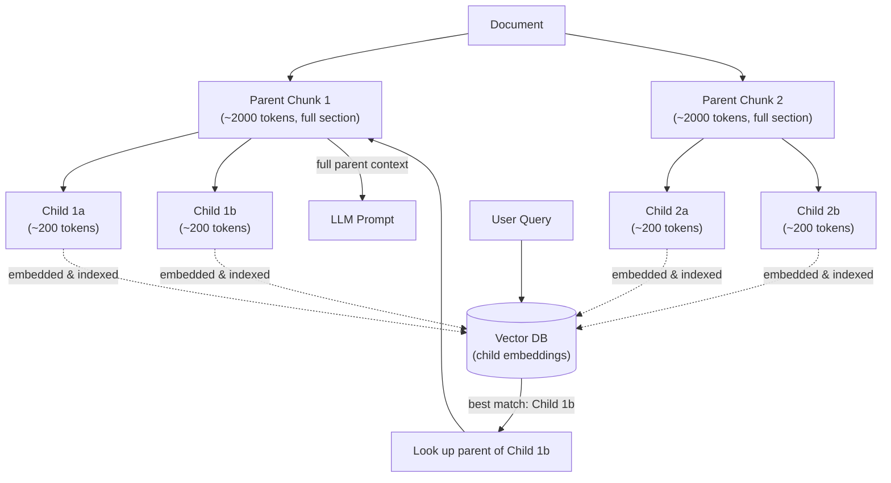

# Chunking Strategies

Chunking is the quiet decision that makes or breaks a RAG system. It gets less attention than embedding models or vector databases, but it has an outsized effect: no matter how good your embedding model is (Chapter 4) or how fast your vector database is (Chapter 6), if the *pieces of text* you hand them are badly cut, retrieval will be mediocre — and a RAG system can never answer better than the chunks it retrieves.

Think of it this way: an LLM can only reason about what's in front of it. If the right sentence exists in your knowledge base but got glued into a 10-page chunk full of unrelated material, or sliced in half across two chunks, the retriever may never surface it — or may surface it without the context needed to make sense of it. Chunking is where you decide the *unit of retrieval*, and that unit shapes everything downstream.

## Learning Objectives

By the end of this chapter, you will be able to:

- Explain why chunking size and boundaries directly control retrieval precision and context quality
- Implement and compare fixed-size, recursive, semantic, token-based, markdown-aware, and code-aware chunking
- Explain and implement parent-child chunking to resolve the "precise vs. contextual" tension
- Choose sensible default chunk sizes and overlap percentages for a given document type
- Use a real text-splitting library (LangChain-style `RecursiveCharacterTextSplitter`) on a sample document
- Recognize and avoid the most common chunking mistakes seen in production RAG systems

## Prerequisites for This Chapter

This chapter builds directly on [Chapter 4: Embeddings Fundamentals](./04-embeddings-fundamentals.md). You should already be comfortable with:

- What an embedding is, and why embedding models compress text into a fixed-size vector
- The idea that a vector is a lossy summary of the meaning of whatever text went into it
- Cosine similarity as a way of measuring how "close" two pieces of text are in meaning
- Token limits and context windows for embedding models (referenced there conceptually; made concrete here)

If any of those feel shaky, revisit Chapter 4 before continuing — this chapter assumes you understand *what* an embedding is, and now asks: *what exactly should we be embedding?*

---

## Why Chunking Matters: The Blurry Photograph Problem

Imagine trying to summarize an entire 40-page employee handbook into a single sentence. You'd have to leave out almost everything — vacation policy, dress code, security procedures, expense rules — and whatever sentence you produced would be a vague, blurry average of all of it. That is exactly what happens when you embed an entire long document as a single vector: the embedding model has to compress paragraphs about completely different topics into one point in vector space. The result is a vector that is "kind of about everything and precisely about nothing." A query about "how many vacation days do I get" and a query about "what's the Wi-Fi password" would both retrieve the same overstuffed vector with mediocre similarity scores, because neither query is *close* to that blurry average.

Now imagine the opposite extreme: chunking the handbook into individual words. Each chunk is embedded with perfect focus, but a chunk containing only the word "twenty" tells the LLM nothing — it has no idea "twenty" refers to vacation days, sick days, or parking spots. You've traded blur for amnesia.

**Chunking is the search for the sweet spot between these two failure modes**: pieces small enough that each one is *about one thing* (so its embedding is sharp and specific), but large enough that each one still carries enough surrounding context to be useful once retrieved.

This single design decision — how you cut text before it ever reaches the embedding model — sets a ceiling on your entire RAG system's quality. A brilliant LLM fed a badly-cut, context-starved chunk will confidently generate a wrong or incomplete answer. Good chunking is not a "nice to have"; it is foundational, on par with choosing a good embedding model.

---

## Strategy 1: Fixed-Size Chunking

The simplest possible approach: pick a size (say, 1000 characters) and a number that adjacent chunks should overlap by (say, 100 characters), and slice the document mechanically from start to end.

```
Document: "...The quarterly revenue grew by 12%. This was driven mainly
by the enterprise segment, which the ..."

Chunk 1 (chars 0-1000):    "...The quarterly revenue grew by 12%. This was
                             driven mainly by the enter"
Chunk 2 (chars 900-1900):  "prise segment, which the ..."
```

Notice the problem immediately: Chunk 1 ends mid-word ("enter"), and the sentence about the enterprise segment is split across two chunks. Fixed-size chunking doesn't know what a sentence, paragraph, or idea is — it just counts characters.

**Why overlap helps a little:** the 100-character overlap window means some of the cut-off content reappears at the start of the next chunk, reducing (but not eliminating) the chance that an important phrase is lost entirely at a boundary.

**When to use it:**
- Quick prototypes or throwaway scripts where chunk quality doesn't matter yet
- Extremely uniform, unstructured text (e.g., raw sensor logs) where there is no "sentence structure" to respect anyway
- As a *fallback* inside more sophisticated splitters (see recursive chunking below)

**When to avoid it:** almost any real production system with prose, since it will regularly cut sentences and ideas in half.

```python
def fixed_size_chunks(text: str, chunk_size: int = 1000, overlap: int = 100):
    chunks = []
    start = 0
    while start < len(text):
        end = start + chunk_size
        chunks.append(text[start:end])
        start = end - overlap  # step forward, but re-include the overlap
    return chunks
```

---

## Strategy 2: Recursive Chunking

Recursive chunking fixes fixed-size chunking's biggest flaw by respecting document structure *first*, and only falling back to a cruder split when it has no choice.

The idea is hierarchical: try to split on the biggest, most meaningful boundary (double newlines, i.e., paragraphs). If a resulting piece is still too large, split *that* piece on the next boundary down (single newlines / sentences). If it's *still* too large, fall back to splitting on spaces (words), and only as an absolute last resort, split on raw characters.

```
Try separators in order: ["\n\n", "\n", ". ", " ", ""]

Document (a few paragraphs)
   │
   ▼ split on "\n\n" (paragraphs)
Paragraph A (fits in chunk_size?) ──yes──▶ keep as one chunk
Paragraph B (too large)
   │
   ▼ split on "\n" (lines/sentences)
Line B1 (fits?) ──yes──▶ keep
Line B2 (still too large)
   │
   ▼ split on " " (words)
   ... continues until each piece fits
```

This is the strategy implemented by LangChain's `RecursiveCharacterTextSplitter`, and it's the sensible **default choice for general-purpose text** — it almost never cuts mid-sentence unless a single sentence alone exceeds your chunk size (rare, but it happens with things like long legal clauses).

**When to use it:** the default for prose documents — articles, documentation, reports, FAQs, wiki pages, PDFs converted to text. This should be your starting point unless you have a specific reason to reach for something more specialized.

---

## Strategy 3: Semantic Chunking

Recursive chunking respects *syntactic* structure (paragraphs, sentences) but has no idea whether two adjacent sentences are about the same *topic*. Semantic chunking splits based on meaning shifts instead.

The technique: embed each sentence individually (reusing the embedding model from Chapter 4), then walk through the document comparing the cosine similarity of each sentence to the one before it. When similarity drops sharply — signaling the topic has shifted — that's a good place to cut a new chunk boundary.

```
Sentence:     S1    S2    S3    S4    S5    S6
Similarity        0.91  0.88  0.35  0.90  0.85
to previous:            ▲           ▲
                    still on topic  topic shift here → cut boundary
                                    │
Chunk A: [S1, S2, S3]   Chunk B: [S4, S5, S6]
```

For example, in a product review that starts by discussing battery life for four sentences and then pivots to discussing camera quality, semantic chunking will detect the similarity drop at the pivot and create a clean split — something a fixed character count would miss entirely if it happened to land 1000 characters into the battery discussion.

**Trade-off:** semantic chunking is far more computationally expensive (you're running an embedding call per sentence, or per small sentence group) and adds complexity (you need to tune the similarity-drop threshold). It shines on documents with abrupt topic changes and no clean formatting to lean on (e.g., transcripts, meeting notes, stream-of-consciousness articles), but is often overkill for well-structured documents where markdown-aware or recursive chunking already does a good job for a fraction of the cost.

**When to use it:** long-form unstructured text with shifting topics and no headings — transcripts, interview notes, narrative reports.

---

## Strategy 4: Token-Based Chunking

Here's a subtlety that trips up a lot of beginners: embedding models and LLMs don't have *character* limits — they have **token** limits. A token is roughly ¾ of a word in English, but the exact mapping depends on the tokenizer, and it varies a lot by language and content type (code, non-English text, and numbers often tokenize far less efficiently than plain English prose).

If you chunk by counting characters, you have no real guarantee about how many tokens that chunk will consume. A chunk of 1000 characters of English prose might be about 200-250 tokens, but the same 1000 characters of Python code or Chinese text could be 300-500+ tokens — potentially blowing past your embedding model's per-input token limit, causing silent truncation (the model just drops the excess) or an outright API error.

Token-based chunking solves this by using the *actual tokenizer* of the model you're chunking for (e.g., `tiktoken` for OpenAI models, or the Hugging Face tokenizer for open models like BGE or E5) to measure chunk size, rather than approximating with character counts.

```python
import tiktoken

def token_based_chunks(text: str, model_name: str = "cl100k_base",
                        max_tokens: int = 500, overlap_tokens: int = 50):
    encoding = tiktoken.get_encoding(model_name)
    tokens = encoding.encode(text)

    chunks = []
    start = 0
    while start < len(tokens):
        end = start + max_tokens
        chunk_tokens = tokens[start:end]
        chunks.append(encoding.decode(chunk_tokens))
        start = end - overlap_tokens
    return chunks
```

**Why this matters in practice:** embedding APIs (and many self-hosted models) will either truncate silently or reject requests that exceed their token limit. If you've only ever measured chunk size in characters, you can ship a pipeline that works fine on your English test documents and then quietly loses the back half of every chunk once a user uploads a document full of code snippets, tables, or non-English text.

**When to use it:** always, in some form, once you move past prototyping. Even if you use recursive or markdown-aware splitting for *where* to cut, you should measure chunk *size* in tokens (using your target model's tokenizer) rather than characters, so your size limits are meaningful.

---

## Strategy 5: Markdown-Aware Chunking

Most real knowledge bases (docs sites, wikis, READMEs, internal knowledge bases exported from Notion/Confluence) are already structured with headings. Markdown-aware chunking uses that structure directly instead of throwing it away.

The approach: parse the document by heading level (`#`, `##`, `###`), and treat each section (or subsection) as a natural chunk boundary — a heading plus the text beneath it, up until the next heading of the same or higher level.

```markdown
# Employee Handbook

## Vacation Policy          ──┐
Full-time employees accrue... │  Chunk 1: "## Vacation Policy\n\n..."
Requests must be submitted... │  (heading kept WITH its content)
                              ─┘
## Expense Reimbursement     ──┐
Submit receipts within 30...   │  Chunk 2: "## Expense Reimbursement\n\n..."
                              ─┘
```

Critically, **keep the heading text inside the chunk itself**. A chunk that reads only "Full-time employees accrue 1.5 days per month..." is ambiguous once separated from its context — accrue *what*, exactly? Prepending "## Vacation Policy" tells both the embedding model and, later, the LLM, exactly what this chunk is about. This is a small change that measurably improves retrieval quality on structured documents.

If a section under a single heading is still too large for your target chunk size, apply recursive chunking *within* that section as a second pass — markdown-aware splitting decides the outer boundaries, recursive splitting handles anything still oversized.

**When to use it:** documentation, wikis, READMEs, any Markdown or HTML content with a heading hierarchy. This is usually a better default than plain recursive chunking whenever headings are present, because it aligns chunks with the author's own organization of ideas.

---

## Strategy 6: Code Chunking

Splitting source code the way you'd split prose is actively harmful: cutting a function in half by character count produces a chunk that doesn't compile, doesn't parse, and means nothing on its own — to a human or to an embedding model. Code has its own structure (functions, classes, methods) that chunking should respect.

The best-practice approach uses an **Abstract Syntax Tree (AST)** parser to understand the code's real structure, rather than treating it as plain text. A popular tool for this is [**tree-sitter**](https://tree-sitter.github.io/tree-sitter/), a fast, incremental parsing library with grammars for dozens of languages, which libraries like LangChain and LlamaIndex use under the hood for language-aware code splitters.

```
File: user_service.py

class UserService:              ──┐
    def get_user(self, id):       │
        ...                       │  Chunk 1: entire get_user method
                                  ─┘
    def create_user(self, data):  ──┐
        ...                         │  Chunk 2: entire create_user method
                                    ─┘
```

Each chunk corresponds to one logical unit — a function, a method, or a class — so it remains syntactically self-contained and meaningful in isolation. For very large classes, you may still need a second-pass split, but the AST-aware boundary ensures you at least never cut *inside* a function signature or split a `for` loop from its body.

**When to use it:** any RAG system indexing a codebase (e.g., a "chat with your repo" tool, covered later in the course). Never fall back to naive fixed-size or even plain recursive text splitting on code if you can avoid it — the quality difference is dramatic.

---

## Strategy 7: Parent-Child Chunking

Every strategy above runs into the same fundamental tension: **small chunks retrieve precisely, but lack context; large chunks carry context, but embed imprecisely.** Parent-child chunking (also called "small-to-big retrieval") resolves this tension by decoupling *what you search over* from *what you hand to the LLM*.

The idea: split each document into large **parent chunks** (e.g., whole sections, ~2000 tokens), then split each parent further into small **child chunks** (e.g., individual sentences or ~200-token pieces). You embed and index only the *child* chunks — so search stays sharp and precise. But each child chunk stores a reference back to its parent. When a child chunk is retrieved as a search hit, you don't hand that tiny sliver to the LLM — you fetch and hand over its *entire parent chunk*, giving the LLM full surrounding context.



Walking through the diagram: the user's query is embedded and compared only against child-chunk embeddings, so the match is precise (a 200-token child chunk about "vacation accrual rate" won't get diluted by neighboring content about expense reports). But once Child 1b is identified as the best match, the system doesn't send that isolated sliver to the LLM — it looks up which parent it belongs to (Parent Chunk 1) and sends the *whole section* instead, so the LLM sees the accrual rate sentence in the context of the entire vacation policy paragraph, including caveats and exceptions that might live one sentence earlier or later.

```python
parent_chunks = markdown_aware_split(document, chunk_size=2000)

child_to_parent = {}
child_chunks = []
for parent_id, parent_text in enumerate(parent_chunks):
    children = recursive_split(parent_text, chunk_size=200)
    for child_text in children:
        child_id = len(child_chunks)
        child_chunks.append(child_text)
        child_to_parent[child_id] = parent_id   # keep the link

# --- at query time ---
best_child_id = vector_search(query, child_chunks)   # search small, precise
parent_id = child_to_parent[best_child_id]
context_for_llm = parent_chunks[parent_id]            # return large, contextual
```

**When to use it:** this is one of the highest-leverage techniques in this chapter and is widely used in production RAG systems (it's a built-in retriever pattern in both LangChain and LlamaIndex, often called a "Parent Document Retriever"). Reach for it whenever precision in search matters (which is almost always) but single small chunks alone would leave the LLM under-informed — which, again, is almost always. The main cost is bookkeeping: you now maintain two layers of chunks and a mapping between them.

---

## Strategy 8: Sliding Window Chunking

Sliding window chunking is really an *overlap discipline* applied on top of any of the strategies above, but it's worth calling out on its own because it directly targets one specific failure: information loss at chunk boundaries.

Picture a sentence like "The refund policy changed on January 1st. Customers who purchased before that date are still covered under the old 90-day window." If a chunk boundary happens to fall exactly between those two sentences, a query about "old refund window" might retrieve only the second sentence — with no idea that it applies specifically to "purchases before January 1st." Sliding window chunking deliberately overlaps consecutive chunks so that boundary-straddling information appears in *both* neighboring chunks, not just one.

```
Chunk 1: [ ...sentence A, sentence B, sentence C... ]
Chunk 2:              [ ...sentence B, sentence C, sentence D... ]
Chunk 3:                           [ ...sentence C, sentence D, sentence E... ]
                       └─ overlap ─┘└─ overlap ─┘
```

Each chunk shares its trailing portion with the next chunk's leading portion. This means sentence C, which might be the crucial connective sentence between two ideas, is fully present in both Chunk 1 and Chunk 2 — so however the retriever slices the document, that sentence has two chances to be embedded in full, undivided context.

**When to use it:** essentially always, as a companion to your primary strategy — recursive, markdown-aware, and token-based splitters typically expose an `overlap` parameter for exactly this reason (see the best-practice default of 10-20% below). It's rarely used entirely on its own; think of it less as a rival to the other seven strategies and more as a dial you turn on top of them.

---

## The Fundamental Trade-off

Every chunking decision ultimately turns the same dial:

| | Smaller chunks | Larger chunks |
|---|---|---|
| **Embedding precision** | High — each vector represents one focused idea | Lower — vector becomes an average of multiple ideas |
| **Context per chunk** | Low — may lack surrounding detail needed to fully answer | High — carries more surrounding explanation |
| **Retrieval recall** | Can miss matches if a concept spans multiple small chunks | Better chance a single chunk contains the full answer |
| **Noise in retrieved context** | Low — less irrelevant text sent to the LLM | Higher — LLM has to filter out unrelated content |
| **Number of chunks (cost/storage)** | Many chunks → more vectors, more storage, more embedding calls | Fewer chunks → cheaper storage, fewer calls |

There is no universally "correct" chunk size — only a size that's appropriate for your documents, your embedding model's ideal input length, and your query patterns. Parent-child chunking (Strategy 7) is popular precisely because it lets you stop choosing a single point on this dial and instead get both ends: small for search, large for context.

---

## Best-Practice Defaults

When you don't have a strong reason to deviate, these defaults work well as a starting point for most text-heavy RAG systems:

- **Chunk size: 300–800 tokens.** Measured with your actual embedding/LLM tokenizer (Strategy 4), not raw characters. Smaller (300-400) for dense reference material like FAQs; larger (600-800) for narrative or explanatory prose.
- **Overlap: 10-20% of chunk size.** For a 500-token chunk, that's roughly 50-100 tokens of overlap — enough to protect boundary sentences (Strategy 8) without excessive duplication and storage bloat.
- **Preserve section boundaries.** Prefer cutting at a heading or paragraph break over a character count, even if it means one chunk is a bit shorter than the target size.
- **Keep tables together.** A table split across two chunks becomes unreadable — neither half makes sense without the header row or the rest of the columns. Treat a table as an atomic, unsplittable unit whenever it fits within your model's limits.
- **Keep code blocks intact.** The same logic as Strategy 6 applies even inside a prose document — never let a fixed-size splitter cut through a fenced code block.
- **Never split mid-sentence if avoidable.** This is the single most common visible symptom of poor chunking, and it's avoidable in nearly every case just by using recursive chunking (Strategy 2) instead of naive fixed-size chunking (Strategy 1).

---

## Worked Example: Recursive Character Text Splitting

Here's a practical example using the same conceptual approach as LangChain's `RecursiveCharacterTextSplitter`, implemented directly so you can see exactly what it does under the hood.

```python
from typing import List


class RecursiveCharacterTextSplitter:
    """A minimal, from-scratch reimplementation of the recursive splitting
    idea (Strategy 2) for teaching purposes. Tries separators in order of
    'most meaningful' to 'least meaningful' and only falls back to a cruder
    split when a piece is still too large."""

    def __init__(self, chunk_size: int = 500, chunk_overlap: int = 75,
                 separators: List[str] = None):
        self.chunk_size = chunk_size
        self.chunk_overlap = chunk_overlap
        self.separators = separators or ["\n\n", "\n", ". ", " ", ""]

    def split_text(self, text: str) -> List[str]:
        return self._split(text, self.separators)

    def _split(self, text: str, separators: List[str]) -> List[str]:
        if len(text) <= self.chunk_size:
            return [text] if text.strip() else []

        separator, remaining_separators = separators[0], separators[1:]
        pieces = text.split(separator) if separator else list(text)

        chunks, current = [], ""
        for piece in pieces:
            candidate = current + separator + piece if current else piece
            if len(candidate) <= self.chunk_size:
                current = candidate
            else:
                if current:
                    chunks.append(current)
                # piece itself may still be too big -> recurse with the
                # next, more granular separator
                if len(piece) > self.chunk_size and remaining_separators:
                    chunks.extend(self._split(piece, remaining_separators))
                    current = ""
                else:
                    current = piece
        if current:
            chunks.append(current)

        return self._add_overlap(chunks)

    def _add_overlap(self, chunks: List[str]) -> List[str]:
        if self.chunk_overlap <= 0 or len(chunks) < 2:
            return chunks
        overlapped = [chunks[0]]
        for i in range(1, len(chunks)):
            prev_tail = chunks[i - 1][-self.chunk_overlap:]
            overlapped.append(prev_tail + chunks[i])
        return overlapped


# --- Try it on a sample document ---
sample_document = """# Refund Policy

Customers may request a refund within 30 days of purchase, provided the
product is in its original condition. Digital products are non-refundable
once downloaded.

# Shipping Policy

Standard shipping takes 5-7 business days. Express shipping is available
for an additional fee and takes 1-2 business days. International orders
may be subject to customs delays outside our control.
"""

splitter = RecursiveCharacterTextSplitter(chunk_size=150, chunk_overlap=20)
for i, chunk in enumerate(splitter.split_text(sample_document), 1):
    print(f"--- Chunk {i} ({len(chunk)} chars) ---")
    print(chunk.strip())
    print()
```

Running this produces chunks that break cleanly at paragraph boundaries wherever possible, only resorting to sentence- or word-level splits when a paragraph alone exceeds `chunk_size` — exactly the recursive fallback behavior described in Strategy 2. In a real project, you would use the battle-tested library implementation (`from langchain_text_splitters import RecursiveCharacterTextSplitter`) rather than this teaching version, but the underlying algorithm is the same.

---

## Real-World Scenario

The right chunking strategy is never one-size-fits-all — it depends entirely on what kind of document you're indexing. Consider three contrasting cases:

**1. A legal contract.** Contracts are dense, precisely worded, and every clause can carry legal weight independently of its neighbors — but clauses also cross-reference each other ("as defined in Section 4.2"). The right approach here is **markdown/section-aware chunking** (Strategy 5) that respects numbered clauses and headings as atomic units, combined with **parent-child chunking** (Strategy 7): index individual clauses as precise child chunks for search, but return the entire section (with its defined terms) as the parent context, so the LLM doesn't answer based on a clause ripped away from the definitions it depends on. Fixed-size chunking would be actively dangerous here — cutting a contract clause in half could cause the LLM to misstate an obligation.

**2. A source code repository.** Code has zero tolerance for structure-blind splitting — a chunk that cuts a function signature from its body is worse than useless. The right approach is **AST-aware code chunking** (Strategy 6) using a tool like tree-sitter, splitting by function/method/class boundaries, ideally paired with metadata (file path, class name, imports) attached to each chunk so the LLM knows which file and class a snippet came from even without seeing the rest of the codebase.

**3. A company wiki page.** Wiki pages are usually already well-organized with headings ("Onboarding," "Benefits," "IT Setup"), written in plain prose, and read by humans who skim by section. **Markdown-aware chunking** (Strategy 5) is the natural fit — split by heading, keep the heading text in the chunk, and fall back to recursive chunking (Strategy 2) only for oversized sections. Semantic chunking (Strategy 3) would be unnecessary overhead here since the author already told you where topics change via headings.

The common thread: figure out what structure the document *already has* (legal clauses, function definitions, markdown headings) and design your chunking to preserve and exploit that structure rather than ignoring it in favor of a generic character count.

---

## Best Practices

- Default to **recursive chunking** for plain prose, **markdown-aware chunking** whenever headings exist, and **code-aware (AST-based) chunking** for source code — reserve fixed-size chunking for prototypes only.
- Always measure chunk size using the **tokenizer of the model you're embedding with**, not character or word counts.
- Use **10-20% overlap** as a default; increase it for documents with a lot of cross-sentence dependency (legal, technical), decrease it if storage/cost is tight and your documents are well-structured.
- Prepend section headings or titles to each chunk's text so the chunk remains self-describing once separated from its neighbors.
- Strongly consider **parent-child chunking** as your default architecture rather than an "advanced" option — it resolves the core precision-vs-context trade-off with modest added complexity.
- Attach rich metadata to every chunk (source document, section title, page number, chunk index) — you'll need this for citations (Chapter 9) and debugging retrieval failures (Chapter 13).
- Treat tables, code blocks, and images/figures as atomic units that should never be split internally.

## Common Mistakes

- **Using fixed-size character chunking in production** and being surprised when retrieval quality is poor — the most common beginner mistake in this chapter.
- **Measuring chunk size in characters or words when the model cares about tokens**, leading to silent truncation on non-English text, code, or numeric-heavy content.
- **Stripping headings/titles out of chunks**, leaving isolated paragraphs that are ambiguous once separated from their context.
- **Splitting tables or code blocks mid-structure**, producing chunks that are unreadable or non-functional in isolation.
- **Using one fixed chunk size for every document type** in a multi-source RAG system (contracts, code, chat logs, wiki pages) instead of choosing a strategy per source type.
- **Ignoring overlap entirely**, which maximizes the chance that a key sentence sitting exactly on a chunk boundary is never fully captured in any single chunk.
- **Confusing "smaller is always more precise" with "smaller is always better"** — over-shrinking chunks without a parent-child architecture behind them starves the LLM of context even when retrieval correctly finds the right general area of the document.

## Summary

Chunking decides the unit of retrieval for your entire RAG system, and it caps the ceiling of everything downstream — a great embedding model and a great LLM cannot rescue badly-cut text. You now have eight strategies in your toolkit: **fixed-size** (simple but naive), **recursive** (structure-aware default), **semantic** (meaning-shift detection), **token-based** (correct size measurement), **markdown-aware** (heading-preserving), **code/AST-aware** (syntactically valid), **parent-child** (precise search + full context), and **sliding window** (boundary protection via overlap). The core tension throughout is precision versus context: smaller chunks embed more sharply but carry less surrounding information, and parent-child chunking is the most elegant way to get both. In practice, pick your primary strategy based on the document's native structure — markdown for wikis, AST for code, sections for legal text — layer 10-20% overlap on top, measure size in real tokens, and strongly consider a parent-child architecture as your production default.

## Knowledge Check

1. Why does embedding an entire long document as a single vector reduce retrieval quality, even if the embedding model itself is high quality?
2. Walk through what recursive chunking does differently from fixed-size chunking when a paragraph is too large to fit in one chunk.
3. What specific problem does token-based chunking solve that character-based chunking cannot, and why does this matter more for code or non-English text?
4. Explain, in your own words, how parent-child chunking resolves the "small chunks are precise but lack context" tension. What are the two things stored/indexed differently in this pattern?
5. Why is fixed-size character chunking a poor fit for source code, and what alternative does this chapter recommend, along with a specific tool?
6. Your knowledge base contains legal contracts, a GitHub repository, and a company wiki. Propose a chunking strategy for each, and justify why the same strategy wouldn't work well for all three.

## Hands-On Exercise

Take the following sample document (or substitute one of your own, at least a few hundred words with at least two headings):

```markdown
# Onboarding Guide

## Day One

Your manager will introduce you to the team during the morning standup.
IT will provision your laptop and accounts before lunch. Make sure to
complete the mandatory security training module by end of day.

## First Week

You'll be paired with a buddy who has been at the company for at least
six months. Schedule 1:1 introductions with each of your immediate
teammates. Review the codebase README and set up your local development
environment following the setup guide linked in the wiki.

## Benefits Enrollment

Health insurance enrollment must be completed within 30 days of your
start date. Retirement plan enrollment is optional but the company match
begins after 90 days of employment. Contact HR with any questions about
coverage options.
```

Do the following:

1. **Chunk it three ways**: (a) fixed-size chunking at 200 characters with no overlap, (b) recursive chunking with a 200-character target size, and (c) markdown-aware chunking by heading section.
2. **Compare the results.** For each method, note: How many chunks were produced? Did any chunk cut a sentence in half? Does each chunk make sense read in isolation, without seeing its neighbors?
3. **Identify the failure case.** Find at least one specific place where fixed-size chunking produced a broken or confusing chunk that recursive or markdown-aware chunking avoided.
4. **Design a parent-child version.** Using the three headings as parent chunks, propose how you would split each into 2-3 child chunks, and describe what you'd return to the LLM if a search matched a child chunk from "Benefits Enrollment."

## Further Reading

- LangChain documentation: [Recursive Character Text Splitter](https://python.langchain.com/docs/how_to/recursive_text_splitter/)
- LlamaIndex documentation: Node Parsers and the Parent Document Retriever pattern
- [tree-sitter](https://tree-sitter.github.io/tree-sitter/) — incremental parsing library used for AST-aware code chunking
- Pinecone Learning Center: "Chunking Strategies for LLM Applications"
- Greg Kamradt's semantic chunking notebook/talk on splitting text by embedding similarity
- `tiktoken` — OpenAI's byte-pair encoding tokenizer library, useful for accurate token-based chunk sizing

<div style="display:flex;justify-content:space-between;align-items:center;">
  <a href="./04-embeddings-fundamentals.md">← Previous: Embeddings Fundamentals</a>
  <a href="./00-index.md">🏠 Index</a>
  <a href="./06-vector-databases.md">Next: Vector Databases →</a>
</div>
