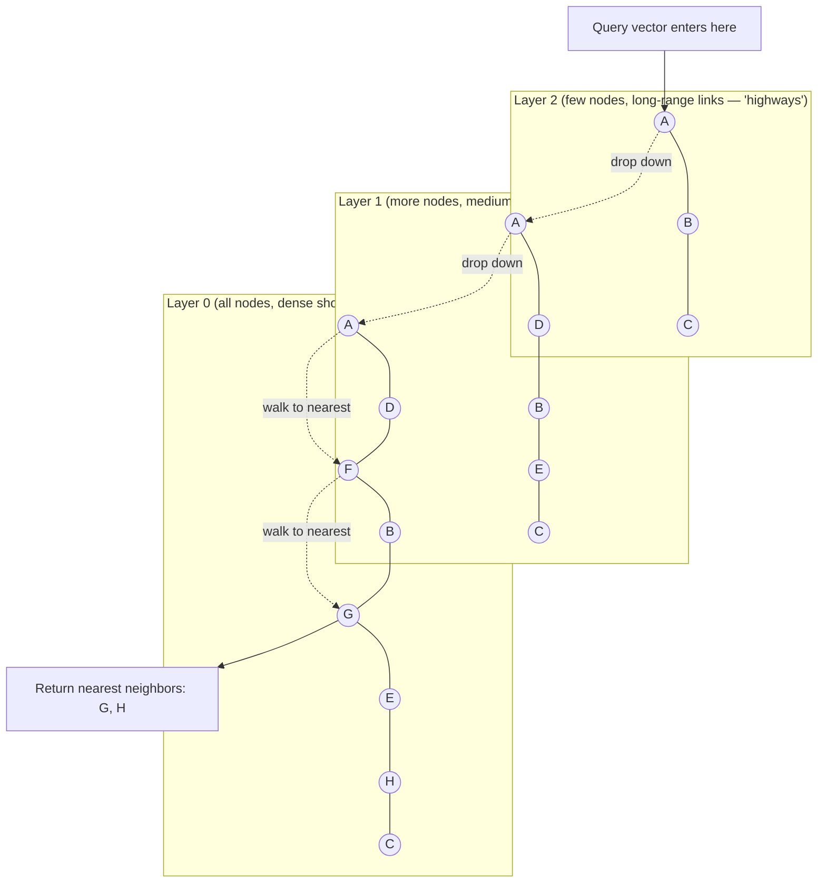
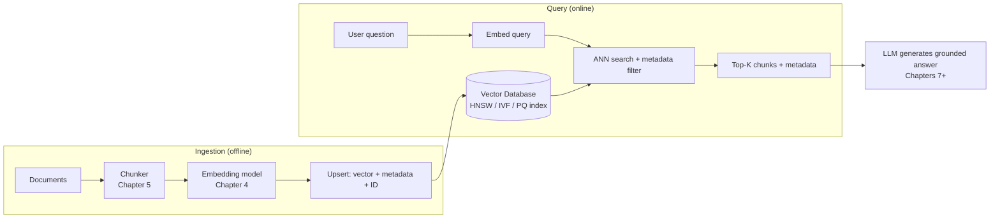

# Chapter 6: Vector Databases

Every embedding you learned to create in [Chapter 4](./04-embeddings-fundamentals.md), and every chunk you learned to carve out of a document in [Chapter 5](./05-chunking-strategies.md), needs somewhere to live. Not just "stored on disk" — stored in a way that lets you ask, in milliseconds, "which of my 5 million chunks are most similar to this new query?" That storage-and-search problem is what a **vector database** solves, and it's the subject of this chapter.

## Learning Objectives

By the end of this chapter, you will be able to:

- Explain why traditional (relational/SQL) databases are the wrong tool for similarity search over embeddings
- Describe, at a conceptual level, how Approximate Nearest Neighbor (ANN) search works and why "approximate" is a feature, not a compromise you should feel bad about
- Explain the intuition behind the three dominant indexing algorithms: HNSW, IVF, and Product Quantization
- Compare the major vector database options (FAISS, Chroma, Qdrant, Milvus, Pinecone, Weaviate, pgvector) and identify which fits a given project
- Explain metadata filtering, pre-filtering vs. post-filtering, namespaces/collections, and upsert semantics
- Build a small local vector store with Chroma, insert embedded documents with metadata, and run a filtered similarity query
- Apply a decision framework to choose a vector database for a real project

## Prerequisites for This Chapter

This chapter builds directly on:

- **[Chapter 4: Embeddings Fundamentals](./04-embeddings-fundamentals.md)** — you should be comfortable with what an embedding vector is, what cosine similarity and dot product mean, and how embedding dimensionality (e.g., 384, 768, 1536) affects storage.
- **[Chapter 5: Chunking Strategies](./05-chunking-strategies.md)** — you should already know how to split a document into chunks. In this chapter, those chunks become the "documents" we embed and store.
- A working Python environment (Chapter 1) with `pip` access, since the hands-on section installs a real package.

If any of those feel shaky, it's worth a quick re-read before continuing — this chapter assumes you can look at a list of floats like `[0.021, -0.114, 0.532, ...]` and immediately think "that's a point in high-dimensional space representing some meaning."

---

## 1. Why You Can't Just Use a Regular Database

Imagine you've embedded 2 million support tickets into 768-dimensional vectors, using the techniques from Chapter 4. A user asks a new question, you embed it into the same 768-dimensional space, and now you need to find the 5 most similar tickets.

Your first instinct, if you know SQL, might be: "I'll just add a `vector` column and write a query." Let's see what that actually requires.

### The brute-force approach, and why it breaks

To find the "nearest" vectors to your query vector, the mathematically correct approach is:

1. Compute the similarity (cosine similarity, dot product, or Euclidean distance — see Chapter 4) between your query vector and **every single vector** in the database.
2. Sort all those similarity scores.
3. Return the top K.

This is called **exact nearest-neighbor search** (also k-NN — k-nearest-neighbors), and it always gives the mathematically correct answer. The problem is cost. Comparing two 768-dimensional vectors takes on the order of 768 multiplications and additions. If you have 2 million vectors, one query costs roughly:

```
2,000,000 vectors × 768 dimensions ≈ 1.5 billion floating-point operations
```

per query. Do that for every user question, across a production system serving hundreds of queries per second, and you have a system that is technically correct but practically unusable. This is the same "brute-force doesn't scale" problem you'd hit trying to `LIKE '%keyword%'` across every row of a million-row text column instead of using an index — except here there is no obvious column to index on, because "similarity" isn't a value you can sort with a B-tree.

A regular relational database (Postgres, MySQL) is built around index structures like B-trees and hash indexes, which are extremely good at answering "give me rows where `id = 5`" or "give me rows where `price BETWEEN 10 AND 20`." Those indexes work because there's a natural ordering (numbers, dates, strings) to exploit. High-dimensional vectors have no such natural ordering — "greater than" and "less than" don't mean anything for a 768-dimensional point. You cannot build a B-tree over vector space the way you build one over an integer column.

This is precisely why a dedicated category of database emerged: **vector databases** — systems purpose-built to index and search high-dimensional vectors efficiently, at scale, with low latency.

> **Analogy**: Think of a library. A relational database is like a card catalog sorted alphabetically by title — great for "find the book called *Dune*," useless for "find books that *feel like* Dune." A vector database is like a librarian who has read every book and organized the shelves by *meaning and theme*, so that browsing near one book quickly surfaces others that feel similar — without reading the entire library cover-to-cover every time someone asks.

---

## 2. Approximate Nearest Neighbor (ANN) Search

If exact search is too slow, what's the alternative? The answer the entire field converged on is: **give up a tiny, controllable amount of accuracy in exchange for massive speed gains.** This is **Approximate Nearest Neighbor (ANN)** search.

### Why "approximate" is not a dirty word

It sounds like a compromise you'd only accept reluctantly. In practice, it's almost always the right trade-off, for two reasons:

1. **The speed difference is enormous.** ANN indexes can search millions or billions of vectors in single-digit milliseconds, compared to seconds for brute-force exact search at the same scale. That's often a 100x–1000x speedup.
2. **The accuracy cost is small and tunable.** A well-configured ANN index typically achieves 95–99% **recall** relative to exact search — meaning if you asked for the top 10 nearest neighbors, an ANN index will usually return 9 or 10 of the *actual* top 10, just possibly in a slightly different order, or with one near-miss swapped in. In a RAG system, where you're about to feed the top 5 chunks into an LLM's context window anyway, the difference between the "true" 5th-most-relevant chunk and the "approximate" 5th-most-relevant chunk is rarely the difference between a good answer and a bad one.

Every ANN algorithm exposes some knob that lets you trade recall for speed (and vice versa) — more on this per-algorithm below. The engineering skill isn't "pick the most accurate algorithm," it's "pick the point on the speed/accuracy curve that matches your latency budget and quality bar."

---

## 3. Core Indexing Algorithms

There are dozens of ANN algorithms in the research literature, but three ideas dominate real-world vector databases. Understanding them conceptually — you do not need to implement them — will make every vector DB's configuration options (`ef_construction`, `nlist`, `nprobe`, etc.) make sense instead of feeling like arbitrary magic numbers.

### 3.1 HNSW (Hierarchical Navigable Small World)

HNSW is the most widely used default index in modern vector databases (Qdrant, Weaviate, Milvus, pgvector, and Chroma's underlying engine all support it). It's graph-based.

**The intuition**: imagine you're trying to find a specific house in a sprawling city, but you only have a rough sense of the neighborhood. You wouldn't walk down every street. Instead, you'd:

1. Start from a highway that connects distant parts of the city (long jumps, low precision).
2. Get off at the right general area, and switch to arterial roads (medium jumps).
3. Finally navigate local streets to the exact house (short jumps, high precision).

HNSW builds exactly this kind of structure, but over vectors instead of geography. It constructs a **multi-layered graph**:

- The **top layer** has very few nodes (vectors), connected by long-range edges — this is the "highway" layer, letting a search jump across large distances in vector space quickly.
- Each **layer below** has progressively more nodes and shorter-range, denser connections.
- The **bottom layer** contains every vector in the collection, densely connected to its true nearest neighbors.

A search starts at an entry point in the top layer, greedily moves to whichever neighbor is closest to the query vector, and once it can't get any closer at that layer, it drops down one layer and repeats — narrowing in like the highway-to-side-street analogy, until it bottoms out with a small set of high-quality candidate nearest neighbors.



**Key tuning knobs** you'll encounter in every vector DB's HNSW config:

- `M` — how many connections each node keeps to its neighbors. Higher M = better recall, more memory.
- `ef_construction` — how thoroughly the graph is built at index time. Higher = better quality graph, slower to build.
- `ef_search` (sometimes just `ef`) — how many candidates are explored at query time. Higher = better recall, slower queries.

HNSW's big advantages: excellent recall, fast queries, and it supports adding new vectors incrementally without rebuilding the whole index. Its downside: it's memory-hungry, because the whole graph structure (not just the raw vectors) has to be kept, typically in RAM, for best performance.

### 3.2 IVF (Inverted File Index)

If you remember the **inverted index** from Chapter 3 — the classic information-retrieval structure that maps each *word* to the list of documents containing it — IVF is the vector-search cousin of that idea, adapted for continuous space instead of discrete tokens.

**The intuition**: instead of a word-to-documents map, IVF partitions the entire vector space into a fixed number of regions ("cells" or "clusters"), typically using an algorithm like k-means. Each cell has a center point (a "centroid"), and every vector in the collection gets assigned to whichever cell's centroid it's closest to. This produces something structurally similar to an inverted index: instead of `word → [doc_ids]`, you get `cluster_centroid → [vector_ids in that cluster]`.

At query time, instead of comparing your query vector against every vector in the database, IVF:

1. Compares the query vector against just the cell centroids (there might be only a few thousand of these, even if there are millions of underlying vectors) to find the nearest cell(s).
2. Only then does a brute-force comparison, but restricted to the (much smaller) set of vectors inside those nearest cell(s).

The key tuning parameters are `nlist` (how many clusters/cells to create when building the index — more cells means finer partitioning) and `nprobe` (how many of the nearest cells to actually search at query time — searching more cells improves recall at the cost of speed, since you're doing more brute-force work per query).

IVF is simpler and often more memory-efficient than HNSW, and it's frequently combined with Product Quantization (next section) for very large-scale, memory-constrained deployments. Its main weakness is that if your query vector happens to sit right on the boundary between two cells, the true nearest neighbor might be in a neighboring cell that never got probed — this is a common, tunable source of recall loss.

### 3.3 Product Quantization (PQ)

HNSW and IVF are both about *where to look* — how to avoid comparing against every vector. Product Quantization solves a different problem: *how to store each vector more cheaply*, because at billion-vector scale, even storing the raw floating-point vectors becomes prohibitively expensive.

**The intuition**: a single 768-dimensional vector, stored as 32-bit floats, takes 768 × 4 bytes = 3,072 bytes. Across a billion vectors, that's over 3 terabytes just for the raw vectors, before any index structure. PQ compresses this dramatically by:

1. Splitting each vector into smaller sub-vectors (say, 768 dimensions split into 8 chunks of 96 dimensions each).
2. For each chunk position, running a clustering algorithm (again, similar to k-means) across all vectors in the dataset to learn a small "codebook" of representative sub-vectors (e.g., 256 representative patterns per chunk).
3. Replacing each original sub-vector with just the ID of its nearest codebook entry — often a single byte (0–255) instead of 96 floats.

The result: a 768-dimensional, 3,072-byte vector might compress down to 8 bytes (one byte per chunk) — a 300x+ reduction in memory. The cost is accuracy: you're now comparing quantized (compressed, "rounded") representations instead of the original precise vectors, so similarity scores become approximate in a different way than HNSW/IVF's approximation. In practice, PQ is usually combined with IVF (an index type often called "IVF-PQ") to get both fast filtering *and* low memory footprint — a very common configuration for billion-scale deployments at companies like Meta (which originated FAISS) and Spotify.

### Putting the three together

| Algorithm | Solves | Trade-off | Typical use |
|---|---|---|---|
| HNSW | Fast approximate search via graph traversal | High recall, but memory-hungry | Default choice for most collections under ~50M vectors |
| IVF | Fast approximate search via clustering/partitioning | Cheaper than HNSW, slightly lower recall unless `nprobe` is high | Large collections, especially combined with PQ |
| PQ | Memory compression of stored vectors | Big memory savings, added quantization error | Billion-scale collections where RAM cost dominates |

You rarely need to implement any of this yourself — every vector database discussed below picks sensible defaults and exposes these knobs when you need to tune them.

---

## 4. Survey of Major Vector Databases

Now that you know *how* they search, let's look at *where* you'd actually run this in a real project. Broadly, vector stores split into "local/embedded, good for learning and prototyping" and "server-based, good for production."

### FAISS (Facebook AI Similarity Search)

FAISS is a **library**, not a full database — there's no server, no persistence layer, no built-in metadata filtering out of the box. You use it directly inside a Python process. It was built by Meta AI Research and is the reference implementation for HNSW, IVF, and PQ — most other vector databases either use FAISS internally or implement algorithms FAISS popularized. It's extremely fast and free, and it's the best place to *learn* how ANN indexing actually behaves, but for a real application you'd typically need to build your own layer on top for metadata storage, filtering, and persistence.

### Chroma

Chroma is an open-source, embedded (or client-server) vector database designed to be the easiest possible on-ramp. It handles embedding storage, metadata, and filtering out of the box, and it can run entirely in-process with zero setup — you `pip install chromadb` and you have a working vector store in one line. It's an excellent choice for prototypes, small projects, and — as you'll see in the hands-on section — for learning.

### Qdrant

Qdrant is an open-source vector database written in Rust, built from the ground up for production use. It supports HNSW indexing, rich metadata filtering (including combining filters with boolean logic), payload (metadata) storage alongside vectors, and can run as a self-hosted server or as a managed cloud service. It's a popular choice when teams want open-source flexibility without giving up production-grade performance.

### Milvus

Milvus is an open-source vector database designed for very large-scale, distributed deployments — think billions of vectors, sharded across many machines. It supports multiple index types (HNSW, IVF, IVF-PQ, and more), and has a managed cloud offering (Zilliz Cloud) run by its creators. It's the heaviest-weight option on this list and is generally overkill unless you're operating at genuine enterprise scale.

### Pinecone

Pinecone is a fully managed, cloud-only vector database — there's no self-hosted option. You never think about index tuning, sharding, or infrastructure; you call an API. This makes it very fast to get into production, at the cost of vendor lock-in and ongoing usage-based cost. It's a common choice for startups that want to move fast and don't want to operate database infrastructure.

### Weaviate

Weaviate is an open-source vector database that also incorporates graph-like features — it lets you define schemas with typed properties and relationships between objects, blurring the line between a vector database and a lightly-structured graph/document database. It has strong built-in support for hybrid search (combining vector similarity with BM25 keyword scoring — a topic we go deeper on in [Chapter 8](./08-advanced-retrieval-techniques.md)) and can run self-hosted or as a managed cloud service.

### pgvector

pgvector is a PostgreSQL **extension**, not a separate database. If your application already stores its relational data in Postgres, pgvector lets you add a `vector` column type and run similarity search (with both exact and HNSW/IVFFlat approximate indexes) using ordinary SQL — no separate system to run, back up, or secure. The trade-off is that it generally doesn't match dedicated vector databases on raw performance at very large scale, but for small-to-medium collections, and especially for teams who value "one less system to operate," it's an excellent pragmatic choice.

### Comparison Table

| Database | Type | Open Source? | Best For | Metadata Filtering | Scale Ceiling | Ops Overhead |
|---|---|---|---|---|---|---|
| **FAISS** | Library (in-process) | Yes | Learning, prototyping, custom pipelines | Manual (build it yourself) | Millions (single machine) | None (no server) |
| **Chroma** | Embedded / lightweight server | Yes | Beginners, small apps, prototyping | Built-in | Low millions | Low |
| **Qdrant** | Server (self-host or cloud) | Yes | Production apps needing rich filtering | Built-in, rich (boolean logic) | Hundreds of millions | Low–Medium |
| **Milvus** | Distributed server | Yes | Enterprise, billion-scale, distributed | Built-in | Billions | High |
| **Pinecone** | Fully managed cloud | No | Fast time-to-production, no ops team | Built-in | Billions (managed) | None (fully managed) |
| **Weaviate** | Server (self-host or cloud) | Yes | Hybrid search, schema/graph-like needs | Built-in | Hundreds of millions | Low–Medium |
| **pgvector** | Postgres extension | Yes | Teams already running Postgres | Full SQL `WHERE` clauses | Low–mid millions | None extra (reuse Postgres) |

---

## 5. Core Vector Database Concepts

Regardless of which product you pick, nearly all vector databases share the same conceptual building blocks. Understanding these will let you read any vector DB's documentation and immediately know what you're looking at.

### Collections / Indexes / Namespaces

A **collection** (Chroma, Qdrant, Weaviate call it this) — also called an **index** (Pinecone) or **namespace** (a sub-partition within an index, in Pinecone's terminology) — is a logically isolated group of vectors, analogous to a table in a relational database. You might have one collection per document type, per tenant (in a multi-tenant SaaS product), or per environment (dev/staging/prod). Keeping unrelated data in separate collections avoids cross-contamination in search results and lets you tune index parameters (embedding dimension, distance metric, HNSW settings) independently per collection.

### Metadata storage

Every vector database lets you attach arbitrary key-value **metadata** to each stored vector — for example, `{"source": "handbook.pdf", "page": 12, "department": "HR", "created_at": "2025-01-15"}`. This is what turns a bare similarity search into something useful for real applications: you're not just retrieving "the closest vectors," you're retrieving the closest vectors *along with everything you need to display, cite, or further filter them.*

### Metadata filtering: pre-filtering vs. post-filtering

Often you don't want "the 5 most similar chunks in the entire collection" — you want "the 5 most similar chunks *from documents tagged `department: HR`*." This is **metadata filtering**, and there are two fundamentally different ways to implement it:

- **Post-filtering**: run the similarity search first (e.g., retrieve the top 50 nearest neighbors), then discard any results that don't match the metadata filter, hoping enough survive to give you your desired top K. This is simple but risky — if very few vectors in the whole collection match your filter, you might run the ANN search, filter down to 2 results, and never even know a better match existed outside the initial top 50.
- **Pre-filtering**: apply the metadata filter *before or during* the ANN search itself, so the algorithm only ever considers vectors that already satisfy the filter. This gives correct results regardless of how selective the filter is, but is more computationally demanding to implement well, since it partially defeats the "don't compare against everything" optimization the index was built for.

Modern production vector databases (Qdrant, Weaviate, Milvus) implement **filtered HNSW** or similar techniques that push the filter down into the graph traversal itself, getting close to pre-filtering correctness without fully abandoning the index's speed advantage. When evaluating a vector database for a project with heavy filtering needs, this is one of the most important (and most under-discussed) things to test empirically — a vector DB that's fast on unfiltered queries can slow down dramatically or return poor results on highly selective filtered queries if it doesn't implement filtering well.

### Hybrid search (preview)

Vector similarity search is excellent at matching *meaning* but sometimes stumbles on things that require exact matching — product SKUs, error codes, acronyms, or a person's name spelled a specific way. **Hybrid search** combines vector similarity with traditional lexical search (BM25, the algorithm from Chapter 3) and merges the two rankings, getting the best of both worlds. Most production vector databases (Weaviate, Qdrant, Milvus) support this natively. We treat hybrid search in full depth in [Chapter 8: Advanced Retrieval Techniques](./08-advanced-retrieval-techniques.md) — for now, just know the term and that it exists as an option when meaning-only search isn't enough.

### Upsert vs. insert

Most vector databases expose an **upsert** operation (insert-or-update by ID) rather than a plain insert. This matters a great deal in RAG systems: documents get edited, re-chunked, or removed all the time. If you re-run your ingestion pipeline on an updated PDF, you want the vectors for the changed chunks to *replace* the old ones (matched by a stable ID you assign, often derived from the document ID and chunk index), not pile up as duplicates alongside stale, outdated vectors. Designing a consistent ID scheme (e.g., `f"{doc_id}::chunk::{chunk_index}"`) early in your pipeline is one of the most valuable but easy-to-overlook habits you can build.

### Overall architecture



---

## 6. Worked Example: A Local Vector Store with Chroma

Let's build a tiny but complete example: embed a handful of documents, attach metadata, store them in Chroma, and run a similarity query with a metadata filter.

```python
# pip install chromadb sentence-transformers

import chromadb
from sentence_transformers import SentenceTransformer

# 1. Load an embedding model (see Chapter 4 for how these are trained and chosen)
embedder = SentenceTransformer("all-MiniLM-L6-v2")  # 384-dimensional embeddings

# 2. Create a local, persistent Chroma client and a collection
client = chromadb.PersistentClient(path="./chroma_store")
collection = client.get_or_create_collection(
    name="handbook_chunks",
    metadata={"hnsw:space": "cosine"},  # distance metric for the HNSW index
)

# 3. Sample "chunks" as if they came out of Chapter 5's chunking pipeline
documents = [
    "Employees accrue 1.5 days of paid time off per month, capped at 24 days per year.",
    "All expense reports over $500 require manager approval before reimbursement.",
    "The engineering on-call rotation runs weekly, handed off every Monday at 9am.",
    "New hires receive a laptop, a monitor, and a company credit card within their first week.",
    "Remote employees are reimbursed up to $75/month for home internet costs.",
]
metadatas = [
    {"department": "HR", "doc_id": "handbook.pdf", "page": 4},
    {"department": "Finance", "doc_id": "handbook.pdf", "page": 9},
    {"department": "Engineering", "doc_id": "handbook.pdf", "page": 14},
    {"department": "HR", "doc_id": "handbook.pdf", "page": 2},
    {"department": "HR", "doc_id": "handbook.pdf", "page": 6},
]
# Stable, deterministic IDs -- important for upsert semantics (see section 5)
ids = [f"handbook::chunk::{i}" for i in range(len(documents))]

# 4. Embed and upsert (safe to re-run -- it will overwrite existing IDs, not duplicate)
embeddings = embedder.encode(documents).tolist()
collection.upsert(
    ids=ids,
    embeddings=embeddings,
    documents=documents,
    metadatas=metadatas,
)

# 5. Query: "How much PTO do I get?" -- but only search HR documents (pre-filtering)
query = "How much paid time off do employees get?"
query_embedding = embedder.encode([query]).tolist()

results = collection.query(
    query_embeddings=query_embedding,
    n_results=2,
    where={"department": "HR"},   # metadata pre-filter, applied during the search
)

for doc, meta, distance in zip(
    results["documents"][0], results["metadatas"][0], results["distances"][0]
):
    print(f"[{distance:.4f}] (page {meta['page']}) {doc}")
```

Expected output (distances will vary slightly by model version, but the ranking should hold):

```
[0.2153] (page 4) Employees accrue 1.5 days of paid time off per month, capped at 24 days per year.
[0.6820] (page 6) Remote employees are reimbursed up to $75/month for home internet costs.
```

Notice what happened: the query about "paid time off" correctly matched the PTO sentence first, based purely on *meaning* (there's no exact word overlap requirement) — and the `where={"department": "HR"}` filter meant the Finance and Engineering chunks were never even candidates, even though "on-call rotation" and "expense reports" are semantically distinct from PTO anyway. In a case where the *closest* match by meaning happened to be in Finance, that pre-filter would have correctly excluded it, which is exactly the pre-filtering behavior discussed in section 5.

---

## Real-World Scenario

**Scenario**: You're building an internal knowledge assistant for a 3,000-person company. The knowledge base has 40,000 documents (HR policies, engineering runbooks, sales playbooks, legal contracts) totaling roughly 2 million chunks after applying the chunking strategies from Chapter 5. Different departments should only be able to search their own documents, for compliance reasons, and the product must answer queries in under 500ms end-to-end.

Walking through the decision:

- **Scale**: 2 million vectors is comfortably within HNSW's sweet spot — no need for IVF-PQ-style memory compression yet.
- **Latency**: 500ms end-to-end (including the LLM call) means the vector search itself needs to return in tens of milliseconds — achievable with HNSW on a dedicated server, not with brute-force FAISS-in-a-loop.
- **Access control / filtering**: department-level isolation is a hard requirement. This pushes toward a database with first-class metadata filtering and (ideally) native multi-tenancy support — Qdrant or Weaviate are strong fits; a single Pinecone index with a `department` metadata field and pre-filtering would also work.
- **Ops tolerance**: the company doesn't have a dedicated database SRE team, so a fully managed option (Pinecone) or a low-maintenance self-hosted option (Qdrant Cloud, or Qdrant self-hosted with modest operational effort) both make sense; Milvus's operational complexity would be overkill for 2 million vectors.

The team ultimately chooses **Qdrant**, self-hosted on their existing Kubernetes cluster, using one collection per department (satisfying the access-control requirement structurally, not just via a filter) with HNSW indexing and payload fields for source document, page number, and last-updated timestamp — enabling both the compliance boundary and rich citation metadata in the final answer.

---

## Best Practices

- **Start local, migrate deliberately.** Prototype with Chroma or FAISS; move to a production database only once you understand your real scale, latency, and filtering requirements — don't reach for Milvus on day one.
- **Design your ID scheme before you ingest anything.** Use deterministic, stable IDs (e.g., `doc_id::chunk_index`) so re-ingesting an updated document is a clean upsert, not a pile of duplicates.
- **Store enough metadata to make citations possible.** At minimum: source document name/URL, page or section, and a timestamp. Your users (and your evaluation pipeline in Chapter 13) will need to trace an answer back to its source.
- **Match the distance metric to your embedding model.** Most modern embedding models are trained and optimized for cosine similarity — using Euclidean distance by mistake with a cosine-trained model will silently degrade retrieval quality. Check your embedding model's documentation.
- **Benchmark filtered queries, not just unfiltered ones.** A vector DB that looks fast in a demo with no filters can behave very differently once you add the `WHERE department = 'HR'` clause your real application needs.
- **Version your indexes when changing chunking or embedding strategy.** If you change chunk size (Chapter 5) or swap embedding models (Chapter 4), old and new vectors are not comparable — rebuild the collection rather than mixing vector spaces.

## Common Mistakes

- **Mixing embeddings from two different models in one collection.** Vectors from different models live in different, incompatible spaces — similarity scores between them are meaningless, even if the dimensionality happens to match.
- **Forgetting that ANN search is approximate and never validating recall.** Teams sometimes assume "the vector DB is broken" when actually the `ef_search`/`nprobe` setting is too low for their accuracy needs — always benchmark recall against exact search on a sample before blaming the data or the model.
- **Treating post-filtering and pre-filtering as interchangeable.** Applying a highly selective metadata filter after an unfiltered top-K search can silently return far fewer (or worse) results than expected — verify which behavior your database actually implements.
- **Choosing a database based on hype rather than requirements.** Picking Milvus for a 50,000-document internal tool, or Pinecone for a project with a zero infrastructure budget, both create unnecessary cost and complexity.
- **Not planning for updates and deletions.** Building an ingestion pipeline that only ever inserts, with no plan for re-indexing edited or removed source documents, leads to a knowledge base that silently drifts out of date.
- **Ignoring memory requirements at scale.** HNSW's excellent recall comes with a real RAM cost; teams that don't estimate `num_vectors × dimensions × 4 bytes × index_overhead_factor` in advance are sometimes surprised by their hosting bill or an out-of-memory crash in production.

## Summary

Vector databases exist because similarity search over high-dimensional embeddings is a fundamentally different problem from the exact-match and range queries relational databases were built for — brute-force comparison against every vector doesn't scale, so the field adopted **Approximate Nearest Neighbor (ANN)** search, trading a small, controllable amount of accuracy for orders-of-magnitude speed gains. Three ideas underpin nearly every modern vector database: **HNSW**'s layered graph traversal, **IVF**'s clustering-based partitioning (conceptually related to the inverted index from Chapter 3), and **Product Quantization**'s vector compression for memory efficiency. On top of these algorithms, real products differ mainly in deployment model and operational maturity — from the bare-metal FAISS library, to beginner-friendly Chroma, to production systems like Qdrant, Milvus, Pinecone, Weaviate, and the pragmatic Postgres-native pgvector. Regardless of which you choose, the same core concepts apply everywhere: collections/namespaces, metadata storage, pre- vs. post-filtering, hybrid search, and upsert-based ID management. With chunks embedded (Chapter 4, Chapter 5) and now indexed and searchable (this chapter), you have everything needed to assemble a full retrieval step — which is exactly where Chapter 7 picks up.

## Knowledge Check

1. Why can't a standard B-tree index in a relational database be used to efficiently search high-dimensional embedding vectors?
2. In your own words, explain why "approximate" nearest neighbor search is usually an acceptable trade-off in a production RAG system rather than a compromise to be avoided.
3. Walk through the layered-graph intuition of HNSW. Why does starting the search at the top layer make it faster than starting at the bottom layer?
4. How is IVF conceptually similar to the inverted index from Chapter 3, and how does Product Quantization solve a different problem than IVF does?
5. What is the difference between pre-filtering and post-filtering when applying a metadata filter alongside a vector similarity search, and why does the difference matter more as a filter becomes more selective?
6. You're choosing a vector database for a project with 500,000 documents, a two-person engineering team with no database operations experience, and a tight budget. Walk through which factors would push you toward FAISS, Chroma, pgvector, or a managed service like Pinecone.

## Hands-On Exercise

Using the Chroma example in this chapter as a starting point:

1. Install the dependencies: `pip install chromadb sentence-transformers`.
2. Take 8–10 short paragraphs of your own choosing (they can be about anything — recipes, movie plots, product descriptions) and assign each a `category` metadata field (at least 3 distinct categories).
3. Embed them with `sentence-transformers` (or the embedding approach you learned in Chapter 4) and `upsert` them into a persistent Chroma collection, using deterministic IDs.
4. Run three queries:
   - One with no metadata filter — inspect the top 3 results and their similarity distances.
   - One with a metadata filter (`where={"category": "..."}`) that should exclude the closest unfiltered match — confirm the filtered result set actually changes.
   - One where you deliberately query for a concept from a category you didn't include in the filter, to confirm your filter correctly returns zero or low-relevance results.
5. Re-run the ingestion step a second time without changing your IDs, and confirm (e.g., by checking `collection.count()`) that you get an upsert (no duplicate growth), not a second copy of every document.
6. Stretch goal: repeat the same exercise using raw FAISS (`pip install faiss-cpu`) instead of Chroma, implementing your own simple metadata filter as a post-filtering step in Python. Compare how much more code was required versus Chroma's built-in `where` clause.

## Further Reading

- FAISS: [github.com/facebookresearch/faiss](https://github.com/facebookresearch/faiss) and its accompanying wiki on index types
- Original HNSW paper: Malkov & Yashunin, "Efficient and robust approximate nearest neighbor search using Hierarchical Navigable Small World graphs" (2016)
- Chroma documentation: [docs.trychroma.com](https://docs.trychroma.com)
- Qdrant documentation, particularly its filtering and indexing guides: [qdrant.tech/documentation](https://qdrant.tech/documentation)
- Milvus documentation and its index-type comparison guide: [milvus.io/docs](https://milvus.io/docs)
- Pinecone's learning center on ANN algorithms: [pinecone.io/learn](https://www.pinecone.io/learn/)
- pgvector: [github.com/pgvector/pgvector](https://github.com/pgvector/pgvector)
- ANN-Benchmarks (independent, empirical comparisons of ANN algorithms across libraries): [ann-benchmarks.com](https://ann-benchmarks.com)

---

<div style="display:flex;justify-content:space-between;align-items:center;">
  <a href="./05-chunking-strategies.md">← Previous: Chunking Strategies</a>
  <a href="./00-index.md">🏠 Index</a>
  <a href="./07-building-your-first-rag.md">Next: Building Your First RAG Pipeline →</a>
</div>
