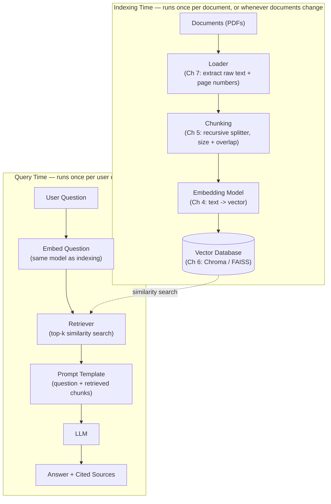

# Chapter 7: Building Your First RAG Pipeline

You have spent six chapters learning the theory: what RAG is and why it exists (Chapter 1), the vocabulary of retrieval and grounding (Chapter 2), the internals of the pipeline and classic information retrieval (Chapter 3), how embeddings turn text into vectors (Chapter 4), how to split documents into retrievable chunks (Chapter 5), and how to store and search those vectors at scale (Chapter 6).

This chapter is where all of it becomes code. By the end, you will have built — from scratch, with your own hands, no framework magic hidden from you — a complete "Chat with a PDF" application: you drop in a PDF, ask it a question in plain English, and it answers using only the content of that PDF, with citations back to the exact page it pulled the answer from.

This is the capstone of the "foundations" phase of the course. Chapter 8 onward assumes you can build this pipeline blindfolded — because everything advanced (hybrid search, re-ranking, query rewriting, evaluation) is a modification to one of the stages you are about to build.

---

## Learning Objectives

By the end of this chapter, you will be able to:

- Draw and explain the full RAG pipeline from raw documents to a cited answer, in both its indexing-time and query-time halves
- Explain what LangChain, LlamaIndex, and Haystack each abstract away, and why understanding the manual pipeline first makes you a better debugger of framework "magic"
- Load a PDF into raw text, split it into overlapping chunks, embed those chunks, and store them in a vector database
- Build a retriever that turns a user's question into a similarity search against that vector database
- Construct a prompt that forces an LLM to answer only from retrieved context and to cite its sources
- Call an LLM API to generate a grounded answer and return it alongside its source citations
- Identify what is still missing from a "first" RAG pipeline — and why

## Prerequisites for This Chapter

This chapter assumes you have internalized the building blocks from:

- **[Chapter 4 — Embeddings Fundamentals](./04-embeddings-fundamentals.md):** you should know what an embedding is, why cosine similarity is used to compare vectors, and that different embedding models trade off quality, speed, and dimensionality.
- **[Chapter 5 — Chunking Strategies](./05-chunking-strategies.md):** you should know why documents can't be embedded whole, what "recursive chunking" means, and why chunk size and overlap matter.
- **[Chapter 6 — Vector Databases](./06-vector-databases.md):** you should know what a vector database does that a plain list of vectors can't (fast approximate nearest-neighbor search via structures like HNSW), and be familiar with at least one option (we'll use Chroma here, with FAISS mentioned as an alternative).

You'll also want:

- Python 3.10+ installed
- A terminal and a code editor
- An API key for an LLM provider (the examples use the Anthropic API, but the pattern is identical for any provider)
- One PDF file to experiment with (a short manual, a research paper, or a policy document works well)

If any of the above feels shaky, skim back through the relevant chapter before continuing — this chapter moves fast because it assumes that groundwork is solid.

---

## 7.1 The Full Pipeline, Restated

Before writing code, let's put the whole picture in front of you one more time, because from here on every section of this chapter is just "zoom in on one box."

A RAG system has two distinct phases that run at different times, on different triggers, and — this matters — at different frequencies:

- **Indexing time** happens once (or periodically, whenever documents change). It's offline, batch-oriented work: load documents, chunk them, embed them, store them.
- **Query time** happens every single time a user asks a question. It's online, latency-sensitive work: embed the question, search the vector database, build a prompt, call the LLM.



Notice the dotted line: the vector database built during indexing is *read* during every query. This is the single most important structural fact about RAG — you pay the cost of processing your documents once, and every subsequent question is cheap and fast because it only searches an already-built index. If you find yourself re-embedding your whole document set on every question, something in your architecture is wrong.

Every remaining section of this chapter builds one box in this diagram, in order, with real code.

## 7.2 Why Frameworks Exist (and Why We're Not Using One Yet)

If you search for "RAG tutorial" online, nearly every result reaches immediately for **LangChain**, **LlamaIndex**, or **Haystack**. It's worth understanding what these frameworks actually do before you use them, because otherwise they feel like magic — and magic is impossible to debug when it breaks.

| Framework | What it's built around | What it abstracts away |
|---|---|---|
| **LangChain** | Composable "chains" of loaders, splitters, retrievers, and prompts, plus agents and tool-calling | Boilerplate for loading 100+ document types, a common interface across dozens of vector stores and LLM providers, prompt templating, and orchestration of multi-step chains |
| **LlamaIndex** | An "index" as the central object — data structures purpose-built for retrieval (vector indexes, tree indexes, keyword indexes, knowledge graphs) | Data connectors ("LlamaHub") for ingesting from almost any source, and query engines that hide the retrieve-then-prompt logic behind a single `.query()` call |
| **Haystack** | A pipeline of typed, swappable "nodes" (components) wired into a DAG, with strong production/deployment tooling | Component lifecycle, pipeline serialization/deployment, and evaluation tooling built in from the start |

All three exist for the same reason every framework exists: **boilerplate reduction**. Loading twelve different file formats, keeping a consistent interface across fifteen vector databases, and re-implementing prompt templating in every project is real, repetitive work. Frameworks let you write `VectorStoreIndex.from_documents(docs)` and get a working retriever in one line.

The trade-off is that "one line" hides five decisions: which chunk size was used, which embedding model, which similarity metric, how many chunks get retrieved, and what the prompt template actually says. When retrieval quality is bad — and in production RAG systems, it will be, regularly — you need to know exactly which of those five knobs to turn. That's only possible if you've built the pipeline manually at least once and know what each stage does and can go wrong.

This is why this chapter builds everything by hand with plain Python, `pypdf`, `sentence-transformers`, and `chromadb` — no LangChain, no LlamaIndex. Once you've done this the hard way, picking up a framework later (we'll do exactly that in later chapters) will feel like recognizing old friends wearing new clothes, not learning something new from zero.

## 7.3 Project Setup

Create a project folder and install the dependencies you'll need for every stage of the pipeline:

```bash
mkdir chat-with-pdf && cd chat-with-pdf
python -m venv .venv && source .venv/bin/activate

pip install pypdf sentence-transformers chromadb anthropic
```

A quick note on each package and which pipeline stage it belongs to:

- `pypdf` — the **loader** (Section 7.4): extracts raw text from PDF files
- `sentence-transformers` — the **embedder** (Section 7.6): the local, free embedding model from Chapter 4
- `chromadb` — the **vector database** (Section 7.7): the storage and search layer from Chapter 6
- `anthropic` — the **LLM client** (Section 7.10): generates the final answer. Swap this for `openai` or any other provider's SDK — the RAG pattern doesn't care which LLM you use

Set your LLM API key as an environment variable so it never ends up hardcoded in a script:

```bash
export ANTHROPIC_API_KEY="sk-ant-..."
```

## 7.4 Step 1 — Document Loaders

The **loader**'s only job is to turn a file on disk into plain text your program can work with. This sounds trivial but is one of the most common sources of silent RAG failures: a scanned PDF with no text layer, a PDF with a broken encoding, or a PDF where text extraction scrambles column order will all "succeed" (no error is thrown) while producing garbage text that poisons every downstream stage.

We load page by page rather than the whole document at once, because we want to keep **page numbers as metadata** — this is what lets us cite "page 4" later instead of just "somewhere in the document."

```python
# loader.py
from pypdf import PdfReader


def load_pdf_pages(path: str) -> list[dict]:
    """Load a PDF and return one record per page, preserving page numbers.

    Each record is a dict with `text` and `metadata` — the metadata is what
    ultimately lets us cite an exact source page in the final answer.
    """
    reader = PdfReader(path)
    pages = []
    for i, page in enumerate(reader.pages):
        text = page.extract_text() or ""
        pages.append({
            "text": text,
            "metadata": {"source": path, "page": i + 1},
        })
    return pages


if __name__ == "__main__":
    pages = load_pdf_pages("sample.pdf")
    print(f"Loaded {len(pages)} pages")
    print(pages[0]["text"][:300])
```

If `page.extract_text()` returns an empty string for every page, your PDF is almost certainly a scanned image with no embedded text layer — you'd need OCR (e.g., `pytesseract`) before this pipeline can work at all. Always eyeball the extracted text before moving on; garbage in at this stage means garbage out at every stage that follows.

## 7.5 Step 2 — Chunking

Chapter 5 covered *why* we chunk: embedding models have limited context windows, and retrieval precision improves when you can pull back a small, focused passage instead of an entire multi-page document. Here we apply the **recursive chunking** strategy from that chapter: try to split on natural boundaries first (paragraphs, then sentences, then words), only falling back to a hard character cut as a last resort, and keep a small overlap between consecutive chunks so a sentence that spans a chunk boundary isn't fully lost from either side.

```python
# chunker.py

def recursive_split(
    text: str,
    chunk_size: int = 800,
    chunk_overlap: int = 100,
    separators: list[str] | None = None,
) -> list[str]:
    """A simplified recursive character splitter (Chapter 5 concept).

    Tries each separator in order (paragraph -> line -> sentence -> word ->
    character), only breaking on a "smaller" separator when a piece is still
    too large after trying the current one.
    """
    if separators is None:
        separators = ["\n\n", "\n", ". ", " ", ""]

    def merge(pieces: list[str]) -> list[str]:
        merged, current = [], ""
        for piece in pieces:
            if len(current) + len(piece) <= chunk_size:
                current += piece
            else:
                if current:
                    merged.append(current)
                # keep a tail of the previous chunk for continuity
                current = (current[-chunk_overlap:] if chunk_overlap else "") + piece
        if current:
            merged.append(current)
        return merged

    def split(text: str, seps: list[str]) -> list[str]:
        if not seps:
            return [text]
        sep, rest = seps[0], seps[1:]
        parts = list(text) if sep == "" else text.split(sep)
        pieces, chunks = [], []
        for part in parts:
            piece = part if sep == "" else part + sep
            if len(piece) <= chunk_size:
                pieces.append(piece)
            else:
                if pieces:
                    chunks.extend(merge(pieces))
                    pieces = []
                chunks.extend(split(piece, rest))
        if pieces:
            chunks.extend(merge(pieces))
        return chunks

    return [c.strip() for c in split(text, separators) if c.strip()]


def chunk_pages(pages: list[dict], chunk_size: int = 800, chunk_overlap: int = 100) -> list[dict]:
    """Chunk every page and attach traceable metadata to each chunk."""
    chunks = []
    for page in pages:
        page_chunks = recursive_split(page["text"], chunk_size, chunk_overlap)
        for i, chunk_text in enumerate(page_chunks):
            chunks.append({
                "id": f"{page['metadata']['source']}-p{page['metadata']['page']}-c{i}",
                "text": chunk_text,
                "metadata": {**page["metadata"], "chunk_index": i},
            })
    return chunks
```

> **Production note:** this hand-rolled splitter is deliberately simplified for teaching. In real projects, reach for a battle-tested implementation like LangChain's `RecursiveCharacterTextSplitter` — same algorithmic idea, more edge cases handled. Building it yourself once is what lets you understand (and configure) it correctly when you inevitably use the library version.

Two numbers you chose here — `chunk_size=800` and `chunk_overlap=100` — are not universal constants. They're a starting point. Chapter 5 covers how to tune them per document type (dense legal text wants smaller chunks than conversational transcripts).

## 7.6 Step 3 — Embedding

With chunks in hand, we turn each one into a vector using the embedding concepts from Chapter 4. We'll use `sentence-transformers` with the `all-MiniLM-L6-v2` model — small, fast, free, and runs entirely locally, which makes it perfect for learning and for smaller production workloads alike.

```python
# embedder.py
from sentence_transformers import SentenceTransformer

_model = SentenceTransformer("all-MiniLM-L6-v2")


def embed_texts(texts: list[str]) -> list[list[float]]:
    """Embed a batch of texts into normalized vectors.

    Normalizing (unit-length vectors) means cosine similarity and dot-product
    similarity become equivalent — a detail from Chapter 4 that matters when
    you configure the vector database's distance metric in the next step.
    """
    embeddings = _model.encode(texts, normalize_embeddings=True)
    return embeddings.tolist()
```

The critical rule to internalize here, one that trips up almost everyone the first time: **you must use the exact same embedding model for your documents and for user questions.** Embeddings from two different models live in unrelated vector spaces — comparing them is meaningless, even though the code will run without any error and silently return irrelevant results.

## 7.7 Step 4 — Indexing

Now we store the embeddings — along with the original chunk text and metadata — in a vector database, per Chapter 6. We'll use **Chroma**, an open-source vector database that's trivial to run locally (no server to stand up) and perfect for a first build. Everything shown here ports directly to FAISS, Qdrant, or a managed service later; only the client calls change, not the pipeline shape.

```python
# indexer.py
import chromadb
from embedder import embed_texts

client = chromadb.PersistentClient(path="./chroma_store")
collection = client.get_or_create_collection(
    name="pdf_chat",
    metadata={"hnsw:space": "cosine"},  # ANN index + distance metric (Ch 6)
)


def index_chunks(chunks: list[dict]) -> None:
    """Embed and store chunks. Chroma persists to disk at ./chroma_store."""
    embeddings = embed_texts([c["text"] for c in chunks])
    collection.add(
        ids=[c["id"] for c in chunks],
        embeddings=embeddings,
        documents=[c["text"] for c in chunks],
        metadatas=[c["metadata"] for c in chunks],
    )
    print(f"Indexed {len(chunks)} chunks into '{collection.name}'")
```

`hnsw:space: "cosine"` tells Chroma to build its HNSW approximate-nearest-neighbor graph (Chapter 6) using cosine distance — matching the normalized embeddings we produced in the previous step. Mismatching the distance metric against how your embeddings were prepared is a subtle bug that degrades retrieval quality without ever throwing an error.

This function is the entire "indexing time" half of the pipeline from Section 7.1. Run it once per document (or whenever documents change); everything after this point runs on every query.

## 7.8 Step 5 — The Retriever

The retriever is where indexing time and query time meet. Given a user's question, it: (1) embeds the question with the *same* model used for the documents, (2) asks the vector database for the top-k most similar chunks, and (3) returns them with their metadata intact so we can cite them later.

```python
# retriever.py
from embedder import embed_texts
from indexer import collection


def retrieve(question: str, top_k: int = 4) -> list[dict]:
    """Embed the question and fetch the top_k most similar chunks."""
    query_embedding = embed_texts([question])[0]
    results = collection.query(query_embeddings=[query_embedding], n_results=top_k)

    retrieved = []
    for doc, meta, distance in zip(
        results["documents"][0], results["metadatas"][0], results["distances"][0]
    ):
        retrieved.append({
            "text": doc,
            "metadata": meta,
            "score": 1 - distance,  # convert cosine distance back to similarity
        })
    return retrieved
```

`top_k` is another knob, like chunk size, that has no universal correct value. Too small (e.g., 1-2) and you risk missing a chunk that had the answer split across a boundary; too large (e.g., 20) and you dilute the LLM's context with irrelevant text, increase cost and latency, and — counterintuitively — often *reduce* answer quality, because the model has to work harder to find the signal in the noise. `top_k=4` is a reasonable starting default; Chapter 8 covers smarter, adaptive alternatives.

## 7.9 Step 6 — The Prompt Template

This is the stage where "retrieval" becomes "augmented generation." The prompt template's job is to hand the LLM exactly the retrieved chunks, plainly labeled with their source, and to give it unambiguous instructions: **answer only using this context, and cite where each fact came from.**

```python
# prompt.py

PROMPT_TEMPLATE = """You are a helpful assistant that answers questions using ONLY the context provided below.

Rules:
- Answer strictly from the context. Do not use outside knowledge.
- If the answer is not contained in the context, respond exactly with:
  "I don't have enough information in the provided documents to answer that."
- Every claim in your answer must be followed by a citation in the form
  [source: filename, page N], taken directly from the context labels below.

Context:
{context}

Question: {question}

Answer:"""


def build_prompt(question: str, retrieved_chunks: list[dict]) -> str:
    blocks = []
    for chunk in retrieved_chunks:
        meta = chunk["metadata"]
        label = f"[source: {meta['source']}, page {meta['page']}]"
        blocks.append(f"{label}\n{chunk['text']}")
    context = "\n\n---\n\n".join(blocks)
    return PROMPT_TEMPLATE.format(context=context, question=question)
```

Notice what this prompt is doing: it's not just handing over text, it's actively fighting the LLM's tendency to fall back on its own pretrained knowledge when the retrieved context is thin or off-topic. This is the single highest-leverage line of the entire pipeline for controlling hallucination — Chapter 9 goes much deeper on prompt design for RAG, but the "answer only from context, say so if you can't" instruction pattern you see here is the foundation everything else builds on.

## 7.10 Step 7 — Calling the LLM

With a fully-formed prompt, generation is a single API call. The example below uses Anthropic's Claude API; the pattern — send a prompt, get text back — is identical for OpenAI, Cohere, a local model server, or any other provider.

```python
# generator.py
import anthropic

llm_client = anthropic.Anthropic()  # reads ANTHROPIC_API_KEY from the environment


def generate_answer(prompt: str, model: str = "claude-sonnet-4-5") -> str:
    response = llm_client.messages.create(
        model=model,
        max_tokens=1000,
        messages=[{"role": "user", "content": prompt}],
    )
    return response.content[0].text
```

Everything upstream of this call — loading, chunking, embedding, indexing, retrieving, prompting — exists for one purpose: to make sure the text arriving in this `prompt` argument actually contains the answer, clearly labeled, and nothing else that would distract or mislead the model.

## 7.11 Step 8 — Returning Sources Alongside the Answer

A RAG answer without citations is just an unverifiable claim. Since we already carried `metadata` through every stage, returning sources is just packaging what we already have:

```python
# app.py
from retriever import retrieve
from prompt import build_prompt
from generator import generate_answer


def ask(question: str, top_k: int = 4) -> dict:
    retrieved = retrieve(question, top_k=top_k)

    if not retrieved:
        return {
            "answer": "I don't have enough information in the provided documents to answer that.",
            "sources": [],
        }

    prompt = build_prompt(question, retrieved)
    answer = generate_answer(prompt)

    sources = [
        {
            "source": c["metadata"]["source"],
            "page": c["metadata"]["page"],
            "relevance_score": round(c["score"], 3),
        }
        for c in retrieved
    ]
    return {"answer": answer, "sources": sources}
```

Returning `sources` separately from the LLM's inline `[source: ...]` citations gives you two layers of verifiability: the model's own citations (which can occasionally be wrong, since the LLM generates them as text) and the ground-truth list of chunks that were actually retrieved (which cannot lie, since it comes straight from the vector database). Showing both to an end user — or logging both for debugging — is good practice; we'll return to this idea when we cover evaluation in Chapter 13.

---

## 7.12 The Complete, Consolidated Script

Here is the entire pipeline as one self-contained file, so you have a single working reference. Save your PDF as `sample.pdf` in the same folder, run this once to index it, then ask questions from a simple command-line loop.

```python
"""
chat_with_pdf.py — a complete, minimal RAG pipeline over a single PDF.

Usage:
    export ANTHROPIC_API_KEY="sk-ant-..."
    python chat_with_pdf.py sample.pdf
"""

import sys
import chromadb
from pypdf import PdfReader
from sentence_transformers import SentenceTransformer
import anthropic

# --- Setup: embedding model, vector database, LLM client -------------------
EMBED_MODEL = SentenceTransformer("all-MiniLM-L6-v2")
CHROMA_CLIENT = chromadb.PersistentClient(path="./chroma_store")
COLLECTION = CHROMA_CLIENT.get_or_create_collection(
    name="pdf_chat", metadata={"hnsw:space": "cosine"}
)
LLM_CLIENT = anthropic.Anthropic()

CHUNK_SIZE = 800
CHUNK_OVERLAP = 100
TOP_K = 4

PROMPT_TEMPLATE = """You are a helpful assistant that answers questions using ONLY the context provided below.

Rules:
- Answer strictly from the context. Do not use outside knowledge.
- If the answer is not contained in the context, respond exactly with:
  "I don't have enough information in the provided documents to answer that."
- Every claim in your answer must be followed by a citation in the form
  [source: filename, page N], taken directly from the context labels below.

Context:
{context}

Question: {question}

Answer:"""


# --- Stage 1: Loader ---------------------------------------------------
def load_pdf_pages(path: str) -> list[dict]:
    reader = PdfReader(path)
    return [
        {"text": page.extract_text() or "", "metadata": {"source": path, "page": i + 1}}
        for i, page in enumerate(reader.pages)
    ]


# --- Stage 2: Chunking (recursive splitter, Chapter 5) ----------------------
def recursive_split(text, chunk_size=CHUNK_SIZE, chunk_overlap=CHUNK_OVERLAP, separators=None):
    if separators is None:
        separators = ["\n\n", "\n", ". ", " ", ""]

    def merge(pieces):
        merged, current = [], ""
        for piece in pieces:
            if len(current) + len(piece) <= chunk_size:
                current += piece
            else:
                if current:
                    merged.append(current)
                current = (current[-chunk_overlap:] if chunk_overlap else "") + piece
        if current:
            merged.append(current)
        return merged

    def split(text, seps):
        if not seps:
            return [text]
        sep, rest = seps[0], seps[1:]
        parts = list(text) if sep == "" else text.split(sep)
        pieces, chunks = [], []
        for part in parts:
            piece = part if sep == "" else part + sep
            if len(piece) <= chunk_size:
                pieces.append(piece)
            else:
                if pieces:
                    chunks.extend(merge(pieces))
                    pieces = []
                chunks.extend(split(piece, rest))
        if pieces:
            chunks.extend(merge(pieces))
        return chunks

    return [c.strip() for c in split(text, separators) if c.strip()]


def chunk_pages(pages, chunk_size=CHUNK_SIZE, chunk_overlap=CHUNK_OVERLAP):
    chunks = []
    for page in pages:
        for i, chunk_text in enumerate(recursive_split(page["text"], chunk_size, chunk_overlap)):
            chunks.append({
                "id": f"{page['metadata']['source']}-p{page['metadata']['page']}-c{i}",
                "text": chunk_text,
                "metadata": {**page["metadata"], "chunk_index": i},
            })
    return chunks


# --- Stage 3: Embedding (Chapter 4) -----------------------------------------
def embed_texts(texts: list[str]) -> list[list[float]]:
    return EMBED_MODEL.encode(texts, normalize_embeddings=True).tolist()


# --- Stage 4: Indexing (Chapter 6) ------------------------------------------
def index_chunks(chunks: list[dict]) -> None:
    embeddings = embed_texts([c["text"] for c in chunks])
    COLLECTION.add(
        ids=[c["id"] for c in chunks],
        embeddings=embeddings,
        documents=[c["text"] for c in chunks],
        metadatas=[c["metadata"] for c in chunks],
    )
    print(f"Indexed {len(chunks)} chunks.")


# --- Stage 5: Retriever ------------------------------------------------
def retrieve(question: str, top_k: int = TOP_K) -> list[dict]:
    query_embedding = embed_texts([question])[0]
    results = COLLECTION.query(query_embeddings=[query_embedding], n_results=top_k)
    return [
        {"text": doc, "metadata": meta, "score": 1 - dist}
        for doc, meta, dist in zip(
            results["documents"][0], results["metadatas"][0], results["distances"][0]
        )
    ]


# --- Stage 6: Prompt template -----------------------------------------------
def build_prompt(question: str, retrieved_chunks: list[dict]) -> str:
    blocks = []
    for chunk in retrieved_chunks:
        meta = chunk["metadata"]
        label = f"[source: {meta['source']}, page {meta['page']}]"
        blocks.append(f"{label}\n{chunk['text']}")
    return PROMPT_TEMPLATE.format(context="\n\n---\n\n".join(blocks), question=question)


# --- Stage 7: LLM call --------------------------------------------------
def generate_answer(prompt: str, model: str = "claude-sonnet-4-5") -> str:
    response = LLM_CLIENT.messages.create(
        model=model, max_tokens=1000, messages=[{"role": "user", "content": prompt}]
    )
    return response.content[0].text


# --- Stage 8: End-to-end ask() with sources ---------------------------------
def ask(question: str, top_k: int = TOP_K) -> dict:
    retrieved = retrieve(question, top_k=top_k)
    if not retrieved:
        return {"answer": "I don't have enough information in the provided documents to answer that.", "sources": []}

    prompt = build_prompt(question, retrieved)
    answer = generate_answer(prompt)
    sources = [
        {"source": c["metadata"]["source"], "page": c["metadata"]["page"], "relevance_score": round(c["score"], 3)}
        for c in retrieved
    ]
    return {"answer": answer, "sources": sources}


# --- CLI entry point ---------------------------------------------------
def main():
    if len(sys.argv) < 2:
        print("Usage: python chat_with_pdf.py <path-to-pdf>")
        sys.exit(1)

    pdf_path = sys.argv[1]
    if COLLECTION.count() == 0:
        print(f"Indexing {pdf_path} ...")
        pages = load_pdf_pages(pdf_path)
        chunks = chunk_pages(pages)
        index_chunks(chunks)
    else:
        print("Existing index found, skipping re-indexing.")

    print("\nAsk questions about the PDF (type 'exit' to quit):\n")
    while True:
        question = input("> ").strip()
        if question.lower() in {"exit", "quit"}:
            break
        result = ask(question)
        print(f"\n{result['answer']}\n")
        print("Sources:")
        for s in result["sources"]:
            print(f"  - {s['source']} (page {s['page']}, score {s['relevance_score']})")
        print()


if __name__ == "__main__":
    main()
```

Run it:

```bash
python chat_with_pdf.py sample.pdf
```

The first run indexes the PDF (Stages 1-4); every question after that only runs Stages 5-8 — exactly the indexing-time / query-time split from the Section 7.1 diagram.

---

## Real-World Scenario: An Internal HR Policy Q&A Bot

A mid-sized company's HR team fields the same questions over and over: "How many sick days do I get?", "What's the parental leave policy?", "Can I carry over unused vacation days?" The answers live scattered across a folder of PDFs — the employee handbook, regional policy addenda, benefits summaries — that most employees never actually read.

The fix is exactly the pipeline you just built, with a few production-flavored adjustments:

- **Loader**: instead of one PDF, a scheduled job walks a shared drive folder nightly, loading every `.pdf` and `.docx` policy document.
- **Chunking**: HR documents tend to have clear section headers ("5.2 Parental Leave"), so the recursive splitter is tuned to prefer breaking on heading patterns first, keeping each chunk topically coherent — a smaller chunk size (around 400-500 characters) works better here than for narrative text, echoing the tuning guidance from Chapter 5.
- **Indexing**: each chunk's metadata includes not just `source` and `page`, but `department` (e.g., "Engineering", "Sales") and `region` (policies differ by country), so the retriever can later be filtered — an employee in the Germany office shouldn't see US-specific leave policy chunks even if they're semantically similar.
- **Retriever**: a metadata filter narrows the search to the employee's own region before the similarity search runs, combining structured filtering with vector search — a pattern Chapter 6 introduced as "filtered ANN search."
- **Prompt template**: the same "answer only from context, cite your source" instructions apply, but with an added line: *"If policies differ by region, state which region's policy you are citing."*
- **Sources**: the bot's Slack replies show the answer plus a clickable link to the exact policy PDF and page, so an employee (or their manager) can verify the answer instead of taking a chatbot's word for it — critical when the topic is something as consequential as leave entitlements.

Structurally, this is the identical eight-stage pipeline from this chapter. Nothing about "going to production" required a different architecture — it required tuning the same knobs (chunk size, metadata, prompt wording) for a different document type and a different trust bar.

---

## Best Practices

- **Preserve metadata from the very first stage.** Page numbers, filenames, section headers — attach them at load time. It's far harder to reconstruct "which page did this text come from?" after chunking than to carry it through from the start.
- **Use the same embedding model for documents and queries, always.** Pin the exact model name/version in code and configuration so an accidental upgrade doesn't silently break retrieval.
- **Match your distance metric to how you prepared your embeddings.** Normalized vectors pair with cosine similarity; verify your vector database is configured to match.
- **Always return sources, not just an answer.** Even if your UI doesn't display them by default, log them — they are your primary debugging tool when a user reports a wrong answer.
- **Handle the empty-retrieval case explicitly.** If nothing relevant is found (or scores are all very low), say so rather than sending a nearly-empty context to the LLM and hoping it makes something up responsibly.
- **Test chunk size and top-k empirically, per document type.** The 800/100/4 defaults used in this chapter are a reasonable starting point, not a law of nature — Chapter 13's evaluation techniques give you a rigorous way to compare configurations.
- **Version your index.** When you change chunking parameters or the embedding model, rebuild the index from scratch rather than mixing old and new chunks — a collection with inconsistent embeddings degrades silently.

## Common Mistakes

- **Embedding whole documents instead of chunks.** Skipping chunking "to keep it simple" produces vectors that are an average of many unrelated topics, wrecking retrieval precision — this is exactly the problem Chapter 5 exists to solve.
- **No chunk overlap.** A sentence that happens to fall exactly on a chunk boundary gets split in half, and neither half retrieves well on its own.
- **Mismatched embedding models between indexing and querying.** This produces confidently wrong results with zero errors — the hardest kind of bug to notice.
- **Retrieving too many chunks "just to be safe."** Large `top_k` values dilute context, increase token cost and latency, and can *reduce* answer quality by burying the relevant chunk in noise.
- **A weak or missing "answer only from context" instruction.** Without it, the LLM will happily blend retrieved context with its own pretrained knowledge, and you lose the entire point of RAG: verifiable, grounded answers.
- **Not testing against a scanned or malformed PDF.** A pipeline that works perfectly on one clean, text-based PDF can silently produce empty chunks on a scanned document — always verify extracted text isn't empty before indexing.
- **Treating this first pipeline as "done."** It's a strong foundation, not a finished product — see the summary below for exactly what's still missing.

---

## Summary

- The RAG pipeline splits cleanly into two phases: **indexing time** (load, chunk, embed, store — runs once) and **query time** (embed question, retrieve, prompt, generate — runs on every question).
- **LangChain, LlamaIndex, and Haystack** all exist to remove boilerplate around this same pipeline shape; understanding the manual version first makes their abstractions transparent instead of magical.
- You built all eight stages by hand: PDF loading with page-level metadata, recursive chunking, local embeddings with `sentence-transformers`, indexing in Chroma, a similarity-search retriever, a context-injecting prompt template with strict grounding instructions, an LLM call, and a final answer packaged with verifiable source citations.
- The same eight-stage shape scales from a personal "chat with one PDF" tool up to a production HR policy bot — what changes with scale and stakes is *tuning* (chunk size, metadata filters, prompt strictness), not the architecture itself.
- This pipeline is a correct, working, **naive** RAG system. It retrieves purely by vector similarity, with a fixed `top_k`, no re-ranking, no query rewriting, and no hybrid keyword+vector search — and it has no systematic way to measure whether its answers are actually good.

That last point is deliberate. What you've built is real and useful, but it is the simplest version of RAG that could possibly work. Chapter 8 picks up exactly here and asks: what happens when purely-semantic top-k retrieval isn't good enough — when the right chunk exists but doesn't rank in the top 4, when the user's phrasing doesn't match the document's phrasing, or when a keyword match matters more than a semantic one? That's where MMR, hybrid search, multi-query retrieval, and re-ranking come in.

## Knowledge Check

1. Why is the RAG pipeline split into an "indexing time" phase and a "query time" phase, and what would go wrong if you re-ran the indexing phase on every user question?
2. What specific problem would occur if you embedded documents with one embedding model and embedded user questions with a different one? Why wouldn't the code raise an error?
3. In the prompt template from Section 7.9, what is the purpose of the instruction "If the answer is not contained in the context, respond exactly with..."? What would you observe if that instruction were removed?
4. Explain, in your own words, what LlamaIndex's "index" abstraction and LangChain's "chain" abstraction are each hiding from you, using the eight stages from this chapter as reference points.
5. Why can increasing `top_k` from 4 to 20 sometimes make answers *worse* rather than better?
6. A user asks a question and your `ask()` function returns an answer with an empty `sources` list. What does that most likely indicate, and what should the application do in response?

## Hands-On Exercise

1. Pick any PDF you have on hand — a paper, a manual, a contract, a book chapter — and save it as `sample.pdf` next to `chat_with_pdf.py`.
2. Run `python chat_with_pdf.py sample.pdf` and ask three questions you already know the answer to, to sanity-check that retrieval and citation are working correctly.
3. Now ask a question that is clearly **not** answered anywhere in the PDF (e.g., if it's a technical manual, ask about the weather). Observe what happens:
   - Does the system correctly say it doesn't know, or does it hallucinate an answer using outside knowledge?
   - Look at the `sources` returned — are the retrieved chunks actually irrelevant, or did the retriever confidently return something plausible-looking but wrong?
4. If it hallucinated, tighten the prompt template's grounding instructions (Section 7.9) and re-run the same question. Did the stricter wording fix it?
5. Try lowering `TOP_K` to 1 and re-asking one of your "known answer" questions from step 2. Did the answer quality change? Try raising it to 10 and compare again.
6. Optional: swap Chroma for FAISS (Chapter 6 covers both) and confirm the rest of the pipeline is unaffected — this is a good way to prove to yourself that the vector database is a swappable component, not baked into the pipeline's logic.

## Further Reading

- [LangChain documentation](https://python.langchain.com/) — document loaders, text splitters, retrievers, and chains
- [LlamaIndex documentation](https://docs.llamaindex.ai/) — data connectors, indexes, and query engines
- [Haystack documentation](https://docs.haystack.deepset.ai/) — pipelines, components, and production deployment
- [Chroma documentation](https://docs.trychroma.com/) — the vector database used in this chapter
- [Sentence-Transformers documentation](https://www.sbert.net/) — the embedding library used in this chapter
- [pypdf documentation](https://pypdf.readthedocs.io/) — the PDF loading library used in this chapter
- [Anthropic API documentation](https://docs.anthropic.com/) — the LLM API used for generation in this chapter

---

<div style="display:flex;justify-content:space-between;align-items:center;">
  <a href="./06-vector-databases.md">← Previous: Vector Databases</a>
  <a href="./00-index.md">🏠 Index</a>
  <a href="./08-advanced-retrieval-techniques.md">Next: Advanced Retrieval Techniques →</a>
</div>
