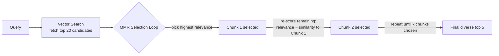
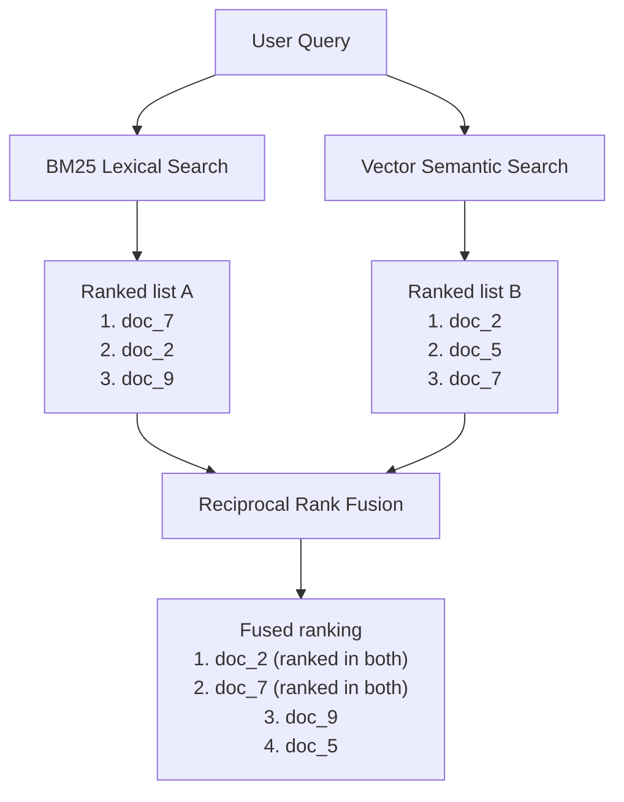
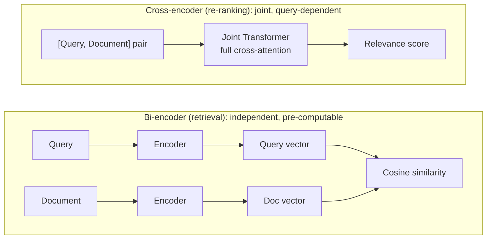
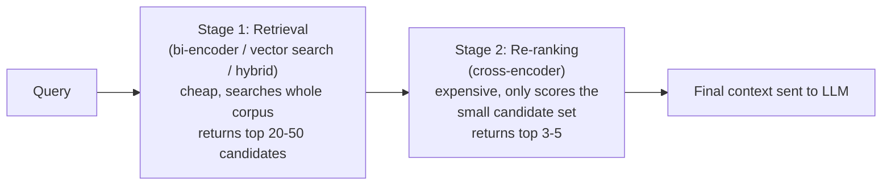

# Advanced Retrieval Techniques

In [Chapter 7](./07-building-your-first-rag.md) you built a working RAG pipeline: chunk documents, embed them, store them in a vector database, and at query time run a plain top-K similarity search to fetch context for the LLM. It worked — but you also saw its cracks. This chapter is a toolbox of fixes. Each technique below solves a specific, named failure mode of naive retrieval, and by the end you'll know exactly which tool to reach for when your RAG system's answers are wrong, redundant, or missing the obvious.

Think of it like moving from a bicycle with one gear to one with fifteen. Retrieval still does the same fundamental job — get you from query to relevant context — but now you have the right gear for every terrain: exact keyword lookups, vague conceptual questions, queries buried in filters, and huge corpora where speed and accuracy pull in opposite directions.

---

## Learning Objectives

By the end of this chapter, you will be able to:

- Explain why plain top-K similarity search returns redundant, near-duplicate chunks, and fix it with **MMR**
- Combine lexical (BM25) and semantic (vector) search into a single **hybrid search** pipeline, and fuse their rankings with **Reciprocal Rank Fusion (RRF)**
- Use an LLM to generate multiple query reformulations (**multi-query retrieval**) and enrich queries with related terms (**query expansion**)
- Build a **self-query retriever** that turns a natural-language question into a semantic query plus structured metadata filters
- Apply **metadata filtering** correctly, understanding the pre-filter vs. post-filter trade-off
- Compress retrieved context down to only the relevant sentences with **context compression**
- Formalize the **parent-document retriever** pattern for retrieving on small chunks while returning full context
- Combine multiple retrievers into a single **ensemble retriever**
- Implement a two-stage **retrieve-then-rerank** pipeline using a **cross-encoder**, and explain why cross-encoders are more accurate but cannot replace the first-stage retriever
- Choose the right combination of these techniques for a given retrieval problem

---

## Prerequisites for This Chapter

This chapter assumes you're comfortable with the material from:

- **[Chapter 3 — Architecture & Internals](./03-architecture-and-internals.md)**: classic information retrieval, especially **BM25** and TF-IDF, which we combine with vector search in hybrid retrieval.
- **[Chapter 4 — Embeddings Fundamentals](./04-embeddings-fundamentals.md)**: vector spaces, cosine similarity — the mechanics that plain similarity search and MMR both build on.
- **[Chapter 5 — Chunking Strategies](./05-chunking-strategies.md)**: in particular the parent-child chunking pattern, which we formalize here as the Parent Document Retriever.
- **[Chapter 7 — Building Your First RAG Pipeline](./07-building-your-first-rag.md)**: the naive end-to-end pipeline whose limitations motivate everything in this chapter.

If any of those feel shaky, it's worth a quick re-read before continuing — this chapter builds directly on top of them rather than re-explaining from scratch.

---

## 1. Plain Similarity Search (Top-K) — A Quick Recap

In Chapter 7, retrieval looked like this: embed the query, compute cosine similarity (or another distance metric) against every chunk vector in the index, and return the K chunks with the highest scores.

```python
results = vectorstore.similarity_search(query, k=5)
```

This is simple, fast, and a genuinely good baseline. But it has one structural weakness that becomes obvious the moment your corpus has any redundancy: **similarity search only knows how to ask "how close is this chunk to the query?" — it never asks "how close is this chunk to the chunks I've already picked?"**

Imagine a knowledge base with five near-identical paragraphs about "refund policy" scattered across different documents (a common occurrence — companies restate the same policy in an FAQ, a terms-of-service page, and a support article). If the user asks "what's your refund policy?", all five paragraphs will score highly and top-K search may return four of them, plus one lonely chunk about *something else entirely* that also happened to mention "refund." You've burned 4/5 of your context budget on saying the same thing four times, and starved the LLM of any other relevant angle (e.g., exceptions, timeframes, regional differences) that might have been the 6th or 7th ranked result.

This is the problem MMR was invented to solve.

---

## 2. Maximum Marginal Relevance (MMR)

**Analogy first**: imagine you're a librarian handing a researcher five books on "climate change." If you hand them five books that are all basically the same textbook reprinted, you've technically satisfied "climate change" but wasted their time. A good librarian instead picks five books that are all relevant *but each adds something new* — one on policy, one on physics, one on economics, one historical, one on models. That's the instinct MMR encodes mathematically.

**Formal idea**: MMR re-ranks (or iteratively selects) candidates by balancing two forces:

1. **Relevance** — how similar is this candidate to the query?
2. **Diversity** — how dissimilar is this candidate to chunks *already selected*?

The conceptual formula, at each selection step, is:

```
MMR = argmax_{d in Candidates \ Selected} [
          λ · Sim(d, query)  -  (1 − λ) · max_{s in Selected} Sim(d, s)
      ]
```

Read this in plain English: "Among the chunks not yet picked, choose the one that scores high on similarity-to-query, but penalize it if it's very similar to something we already picked." The knob `λ` (lambda, between 0 and 1) controls the trade-off:

- `λ = 1` → pure relevance (identical to plain top-K search)
- `λ = 0` → pure diversity (ignores the query almost entirely, just picks spread-out chunks)
- `λ = 0.5–0.7` → a typical sweet spot: mostly relevant, but actively avoiding redundancy

**How it runs in practice**: MMR is normally applied *after* an initial over-fetch. You retrieve a larger candidate pool (say, top 20 by cosine similarity), then run the MMR selection loop over those 20 to pick a diverse top 5. It never invents relevance from nothing — it re-orders and filters what similarity search already found.



In LangChain, this is often a one-line change:

```python
results = vectorstore.max_marginal_relevance_search(
    query,
    k=5,          # final number of chunks returned
    fetch_k=20,   # size of the initial candidate pool
    lambda_mult=0.6,  # relevance vs. diversity trade-off
)
```

**When to use MMR**: any corpus with topical redundancy — FAQs, policy documents restated across pages, news archives covering the same event from multiple angles. Skip it (or push `λ` close to 1) when precision on a narrow, unambiguous question matters more than breadth, since MMR can occasionally trade away a highly relevant chunk to make room for a diverse but weaker one.

---

## 3. Hybrid Search: Lexical + Semantic

MMR fixes redundancy *within* the semantic search results, but it doesn't fix a much deeper problem: **embeddings are bad at exact matches.**

**Why embeddings blur exact terms**: an embedding model is trained to capture *meaning*, which means it deliberately treats close synonyms, paraphrases, and related concepts as near-neighbors. That's a feature when the user says "how do I cancel my subscription" and the document says "terminating your plan." But it's a bug when the user searches for `invoice #INV-2024-88213` or `error code E-4021` — these are arbitrary tokens with no "meaning" for the embedding model to latch onto, so semantically similar-but-wrong chunks can outscore the one chunk that contains the exact ID.

This is precisely what **BM25** (Chapter 3) is good at: it's a lexical, term-frequency-based algorithm that scores documents by exact and near-exact word overlap, weighted by how rare/informative each term is (its IDF component). BM25 will find `INV-2024-88213` every time, because it's looking for that literal token — but BM25 has the opposite weakness: it has no idea that "cancel" and "terminate" mean the same thing.

**Hybrid search runs both retrievers and fuses their results**, getting the best of each:

| | Catches | Misses |
|---|---|---|
| **BM25 (lexical)** | Exact terms, IDs, codes, rare jargon, acronyms | Paraphrases, synonyms, conceptual similarity |
| **Vector search (semantic)** | Paraphrases, synonyms, conceptual/topical similarity | Exact tokens with no learned meaning, rare identifiers |
| **Hybrid** | Both | Much smaller blind spot |

### Fusing the two rankings: Reciprocal Rank Fusion (RRF)

The tricky part of hybrid search isn't running two retrievers — it's combining two *differently-scaled* score systems. BM25 scores are unbounded term-frequency scores; cosine similarity scores are bounded between -1 and 1. You can't just add them together meaningfully.

**RRF sidesteps the scaling problem entirely by ignoring the raw scores and using only rank position.** For each document, RRF computes:

```
RRF_score(d) = Σ  1 / (k + rank_i(d))
              over each retriever i
```

Where `rank_i(d)` is the position of document `d` in retriever `i`'s ranked list (1st, 2nd, 3rd...), and `k` is a small constant (commonly 60) that dampens the impact of very high ranks so the formula doesn't over-reward being #1 in just one list. A document that ranks highly in *both* lists gets a much higher fused score than one that ranks #1 in only one list and is absent from the other.



### Hybrid search code example

```python
from rank_bm25 import BM25Okapi

class HybridRetriever:
    def __init__(self, chunks, vectorstore, k_rrf=60):
        self.chunks = chunks                     # list[str], parallel to vectorstore ids
        self.vectorstore = vectorstore
        self.k_rrf = k_rrf
        tokenized = [c.lower().split() for c in chunks]
        self.bm25 = BM25Okapi(tokenized)

    def _bm25_ranked_ids(self, query, top_n=20):
        scores = self.bm25.get_scores(query.lower().split())
        ranked = sorted(range(len(scores)), key=lambda i: scores[i], reverse=True)
        return ranked[:top_n]

    def _vector_ranked_ids(self, query, top_n=20):
        results = self.vectorstore.similarity_search_with_score(query, k=top_n)
        # assumes each result carries a "chunk_id" in metadata
        return [r.metadata["chunk_id"] for r, _score in results]

    def retrieve(self, query, top_k=5):
        bm25_ids = self._bm25_ranked_ids(query)
        vector_ids = self._vector_ranked_ids(query)

        fused_scores = {}
        for rank, doc_id in enumerate(bm25_ids):
            fused_scores[doc_id] = fused_scores.get(doc_id, 0) + 1 / (self.k_rrf + rank + 1)
        for rank, doc_id in enumerate(vector_ids):
            fused_scores[doc_id] = fused_scores.get(doc_id, 0) + 1 / (self.k_rrf + rank + 1)

        ranked_ids = sorted(fused_scores, key=fused_scores.get, reverse=True)
        return [self.chunks[i] for i in ranked_ids[:top_k]]
```

Most production vector databases (Qdrant, Weaviate, Elasticsearch/OpenSearch, Pinecone with sparse-dense support) offer hybrid search as a built-in query mode — you'll often configure this rather than hand-roll it, but understanding the RRF mechanics underneath means you can debug it when the fused ranking looks wrong.

**When to use hybrid search**: almost always a safe upgrade over pure vector search, especially for corpora containing product codes, legal citations, part numbers, names, or any domain jargon. It's close to a "default on" technique in mature RAG systems.

---

## 4. Multi-Query Retrieval

**The problem**: a single query is a single point in embedding space, but a user's *intent* often has several valid phrasings, and the "best" chunk in your corpus might be worded closer to a phrasing the user didn't type. Ask "how do I reset my password" and the actual doc chunk says "changing your login credentials" — depending on the embedding model, that gap can cost you the right result.

**The fix**: use an LLM to generate several alternative phrasings of the user's query (e.g., "steps to change my account password," "password recovery process"), run retrieval for *each* phrasing, and merge/de-duplicate the union of results — a query goes in, several near-synonymous queries come out, and each one gets its own shot at finding the right chunk.

```python
MULTI_QUERY_PROMPT = """You are helping a search system find relevant documents.
Given the user question below, generate 3 alternative phrasings that
preserve the original meaning but vary in wording. Return one per line.

Question: {question}"""

def multi_query_retrieve(question, llm, vectorstore, k=5):
    variations_text = llm.invoke(MULTI_QUERY_PROMPT.format(question=question))
    variations = [question] + [q.strip() for q in variations_text.split("\n") if q.strip()]

    seen_ids = set()
    merged = []
    for q in variations:
        for doc in vectorstore.similarity_search(q, k=k):
            doc_id = doc.metadata.get("chunk_id", doc.page_content[:50])
            if doc_id not in seen_ids:
                seen_ids.add(doc_id)
                merged.append(doc)
    return merged
```

This trades extra LLM calls and retrieval calls (more latency, more cost) for reduced sensitivity to exact phrasing. It's especially valuable when your users are non-experts who may not use the same vocabulary as your source documents.

**When to use it**: ambiguous or vaguely-worded user queries, support/FAQ bots, situations where you can't control or predict how users phrase questions. Avoid it for latency-critical paths (each variation is an extra retrieval round-trip) or when queries are already well-structured (e.g., generated by another system).

---

## 5. Query Expansion (Brief)

Query expansion is a lighter-weight cousin of multi-query retrieval: instead of generating full alternate *questions*, you enrich the original query with related terms, synonyms, or acronym expansions before it's even embedded or matched.

Example: the query `"RAG evaluation"` might be expanded to `"RAG evaluation retrieval-augmented generation metrics faithfulness recall precision"` before searching — packing in terms that are likely to co-occur with relevant chunks, particularly helpful for the lexical (BM25) side of a hybrid search where exact term overlap matters.

Simple forms of query expansion include:

- A synonym dictionary or thesaurus lookup for domain terms
- Expanding acronyms (`"RAG"` → `"RAG (Retrieval-Augmented Generation)"`)
- Pulling related terms from a knowledge graph or ontology

This chapter only scratches the surface here, because the more powerful and more commonly used LLM-driven query rewriting techniques — **HyDE (Hypothetical Document Embeddings)** and **step-back prompting** — deserve full treatment with their own trade-offs and failure modes. Those are covered in depth in **[Chapter 11 — Query Transformation](./11-query-transformation.md)**. Think of this section as a placeholder flagging that query expansion exists and is a lighter tool than multi-query or HyDE, not a full treatment.

---

## 6. Self-Query Retrieval

**The problem**: some questions aren't purely semantic — they mix a conceptual ask with structured constraints. "Find me papers about India published after 2023" has two very different parts:

1. A **semantic** part: "papers about India" (topic — needs vector search)
2. A **structured filter** part: "published after 2023" (an exact, filterable condition — `year > 2023`)

If you naively embed the whole sentence and run vector search, the embedding model will do its best to represent "after 2023" as *meaning*, which is a poor substitute for an actual numeric filter. Cosine similarity has no native concept of "greater than."

**The fix**: use an LLM to parse the natural-language query into two separate parts — a cleaned-up semantic search string (`"papers about India"`) and a structured filter expression matched against your metadata schema (`country == "India" AND year > 2023`), which you defined back when chunking/indexing (see Chapter 5). The semantic part goes to vector search as usual; the filter part is applied as an exact, non-fuzzy constraint.

```python
from pydantic import BaseModel
from typing import Optional

class ParsedQuery(BaseModel):
    semantic_query: str
    country: Optional[str] = None
    year_gt: Optional[int] = None
    tags: Optional[list[str]] = None

SELF_QUERY_PROMPT = """Parse the user's search request into a semantic
search string and any structured filters. Only fill in fields you're
confident about; leave others null.

Available metadata fields: country (str), year (int), tags (list[str]).

User request: {query}"""

def self_query_retrieve(query, llm, vectorstore, k=5):
    parsed: ParsedQuery = llm.with_structured_output(ParsedQuery).invoke(
        SELF_QUERY_PROMPT.format(query=query)
    )

    filters = {}
    if parsed.country:
        filters["country"] = parsed.country
    if parsed.year_gt:
        filters["year"] = {"$gt": parsed.year_gt}
    if parsed.tags:
        filters["tags"] = {"$in": parsed.tags}

    return vectorstore.similarity_search(
        parsed.semantic_query, k=k, filter=filters
    )
```

**When to use it**: any corpus with rich, queryable metadata (dates, authors, categories, departments, prices, statuses) where users naturally phrase constraints in prose ("recent," "by Dr. Smith," "under $50," "from the legal team"). It's especially powerful in internal enterprise search tools where users think in filters but type in sentences.

---

## 7. Metadata Filtering

Self-query retrieval is one *source* of filters (an LLM inferring them from prose), but metadata filtering as a general technique is broader and often applied directly by your application logic — e.g., a logged-in user's department is known from their session, not inferred from the query text at all.

Common metadata fields used for filtering: `author`, `date`/`year`, `language`, `department`, `document_type`, `access_level`, `tags`, `source`. These are typically stored alongside each chunk's vector at indexing time (Chapter 5/6) and every vector database supports filtering on them.

### Pre-filter vs. post-filter

There are two fundamentally different ways to combine "search by vector similarity" with "filter by metadata," and the difference matters a lot at scale:

- **Pre-filtering**: apply the metadata filter *first*, shrinking the candidate set, then run the similarity search only within that narrowed set (or the vector index applies the filter during graph traversal). This guarantees you get `k` results if `k` matching documents exist, and is generally correct.
- **Post-filtering**: run similarity search first to get the top-K by vector distance *across the whole index*, then discard any results that don't match the filter. The failure mode here is obvious once you see it: if none of the true top-K semantic matches happen to satisfy the filter, you get back **fewer than K results — or zero** — even though plenty of matching documents exist further down the ranking. For example, filtering `department=Legal` after fetching the top 5 by similarity might leave only 1 survivor, when 20 matching Legal documents exist deeper in the ranking.

Most modern vector databases (Qdrant, Weaviate, Milvus, pgvector with proper indexing) support efficient pre-filtering natively — the filter is pushed down into the ANN index traversal (recall Chapter 6's discussion of HNSW) rather than applied as an after-the-fact scan. When configuring metadata filters, always check whether your vector database applies them pre- or post-search, especially as your corpus grows and filters become more selective (narrow).

**When to use it**: multi-tenant systems (filter by `tenant_id` — this is a security requirement, not just a relevance one), time-sensitive corpora (filter to recent documents), access control (filter by user's `access_level`), and any self-query setup from the previous section.

---

## 8. Context Compression

By now you may be retrieving quite a lot: MMR's diverse top-5, hybrid search's fused candidates, multi-query's merged union. Even a "good" retrieved chunk is often 300–500 tokens, but the sentence that actually answers the question might be one line inside it. Sending the full chunk means you pay for (and dilute the LLM's attention with) a lot of irrelevant surrounding text.

**Context compression** adds a step *after* retrieval and *before* generation: take each retrieved chunk, and extract or summarize only the parts relevant to the specific query — turning, say, 2000 tokens of retrieved text into 400 tokens of pure signal before it ever reaches the generation LLM.

Two common approaches:

1. **LLM-based extractive compression**: pass each chunk + the query to a small/cheap LLM with instructions like "extract only the sentences relevant to this question, verbatim, drop everything else." This is accurate but adds an LLM call per chunk (cost/latency trade-off — usually worth it with a fast, cheap model).
2. **Embedding-based sentence filtering**: split each chunk into sentences, embed each sentence, and keep only sentences above a similarity threshold to the query. Cheaper and faster than an LLM call, slightly less precise.

```python
COMPRESS_PROMPT = """Given the question and a document chunk, extract only
the sentences from the chunk that are directly relevant to answering the
question. Return them verbatim. If nothing is relevant, return "NONE".

Question: {question}
Chunk: {chunk}"""

def compress_chunk(question, chunk, cheap_llm):
    result = cheap_llm.invoke(COMPRESS_PROMPT.format(question=question, chunk=chunk))
    return None if result.strip() == "NONE" else result.strip()

def compress_context(question, chunks, cheap_llm):
    compressed = [compress_chunk(question, c, cheap_llm) for c in chunks]
    return [c for c in compressed if c]  # drop empties
```

**When to use it**: long chunks, tight context windows, cost-sensitive generation calls (fewer tokens sent to your best/most-expensive model), or when you've noticed the LLM getting "distracted" by irrelevant text within an otherwise-correct chunk. Skip it when chunks are already small and tightly scoped (the extra LLM call isn't worth it), or in latency-critical paths where the added round-trip is too costly.

---

## 9. Parent Document Retriever (Formalized)

Chapter 5 introduced parent-child chunking as a chunking *strategy*. Here we formalize it as a *retrieval pattern*, because the retrieval-time behavior is what makes it work.

**The tension it resolves**: small chunks are better for retrieval precision (a tightly-scoped chunk produces a cleaner, more focused embedding, so similarity search is more accurate), but small chunks are worse for generation (the LLM loses surrounding context — the sentence before and after, the section heading, the broader argument). Bigger chunks help generation but blur retrieval, because a big chunk's embedding is an average over many different ideas, so it matches queries with only vague, muddy precision.

The Parent Document Retriever refuses to compromise between the two — it uses **small chunks for indexing/matching, but returns the corresponding larger parent chunk for generation.** A query matches against a ~200-token child chunk, but the ~2000-token parent section that child belongs to is what actually gets sent to the LLM.

Implementation-wise: only the **child** chunks are embedded and stored in the vector index. Each child's metadata stores a `parent_id`. A separate key-value store (or the same document store) holds the full parent text keyed by `parent_id`. At query time: vector search finds matching *child* chunks → look up each child's `parent_id` → fetch and de-duplicate the corresponding *parent* chunks → send those to the LLM.

```python
def parent_document_retrieve(query, child_vectorstore, parent_store, k=5):
    child_hits = child_vectorstore.similarity_search(query, k=k)
    parent_ids = list(dict.fromkeys(h.metadata["parent_id"] for h in child_hits))  # de-dup, preserve order
    return [parent_store.get(pid) for pid in parent_ids]
```

**When to use it**: long-form documents (contracts, manuals, research papers) where the answer's supporting detail is local (a paragraph) but understanding it correctly requires surrounding context (the section it sits in). This is one of the highest-leverage, lowest-downside techniques in this chapter — nearly free to adopt if you're already chunking hierarchically.

---

## 10. Ensemble Retrieval

We've now met several distinct retrievers: a BM25 retriever, a vector retriever, a metadata-filtered retriever, a parent-document retriever. **Ensemble retrieval** is the general pattern of running several of these *in parallel* (each producing its own ranked list) and combining their outputs with the same RRF-style fusion used for hybrid search — it's the umbrella concept that hybrid search (BM25 + vector) is actually one specific instance of.

```python
class EnsembleRetriever:
    def __init__(self, retrievers, weights=None):
        self.retrievers = retrievers
        self.weights = weights or [1.0] * len(retrievers)

    def retrieve(self, query, k=5, rrf_k=60):
        fused_scores = {}
        for retriever, weight in zip(self.retrievers, self.weights):
            ranked = retriever.retrieve(query, top_k=20)
            for rank, doc in enumerate(ranked):
                doc_id = doc.metadata.get("chunk_id", doc.page_content[:50])
                fused_scores[doc_id] = fused_scores.get(doc_id, 0) + weight / (rrf_k + rank + 1)
        ranked_ids = sorted(fused_scores, key=fused_scores.get, reverse=True)[:k]
        return ranked_ids
```

The `weights` parameter lets you tune how much each retriever's opinion counts — e.g., you might trust your metadata-filtered retriever more heavily for queries that clearly reference a filterable field, while leaning on vector search for open-ended conceptual questions.

**When to use it**: whenever no single retriever is reliably good across your whole query distribution — which, in practice, is most real-world systems. Ensemble retrieval is the generalization that hybrid search, and even MMR-over-fused-results, both live under.

---

## 11. Cross-Encoder Re-ranking

This is the technique that most reliably produces a visible quality jump in production RAG systems, and it deserves the most careful explanation of *why* it works.

### Bi-encoders vs. cross-encoders

Every retriever we've used so far — the vector search from Chapter 7, hybrid search, MMR — relies on a **bi-encoder**: the query and each document are embedded *independently*, and similarity is computed afterward (usually cosine similarity) between two fixed vectors. This independence is *exactly* what makes vector search fast: because document vectors don't depend on the query, you can compute and index them once, offline, ahead of time. At query time, you only need to embed the query (one forward pass) and do a fast approximate nearest-neighbor lookup (Chapter 6's HNSW) against millions of pre-computed vectors.

A **cross-encoder** throws that independence away. It concatenates the query and a *specific* candidate document together — literally feeding `[query, document]` as one input — and passes the pair through a transformer jointly, letting every token of the query attend to every token of the document (and vice versa) before producing a single relevance score.



**Why this is more accurate**: the model can directly reason about how specific words and phrases in the query relate to specific words and phrases in the document — the kind of fine-grained matching a fixed, pre-computed vector simply cannot represent, because that vector was frozen before it ever saw this particular query.

**Why this is too slow to use as your primary retriever**: because the document representation depends on the query, you *cannot* pre-compute it. There is no index to build. To rank your entire corpus for a single query, you'd have to run a full transformer forward pass over every single query-document pair, at query time — for a corpus of a million documents, that's a million transformer inferences per search. Utterly impractical at scale. Bi-encoders can be pre-indexed; cross-encoders cannot.

### The two-stage retrieve-then-rerank pipeline

The solution used almost universally in production is to use both, in sequence, each doing the job it's suited for:



- **Stage 1 (recall-oriented)**: cast a wide net cheaply across the whole corpus (millions of chunks) using vector search, hybrid search, or an ensemble — optimizing for "did we get the right chunk *somewhere* in our candidate set," not for perfect ordering.
- **Stage 2 (precision-oriented)**: run the expensive, accurate cross-encoder only over that small candidate set (20–50 documents) to re-score and reorder them precisely, then keep only the true top 3–5.

This is the single most important structural insight of this chapter: **you never ask the accurate-but-slow model to search; you only ask it to judge a shortlist that the fast-but-approximate model already assembled.**

### Cross-encoder re-ranking code example

```python
from sentence_transformers import CrossEncoder

# A small, widely-used cross-encoder trained for passage re-ranking
reranker = CrossEncoder("cross-encoder/ms-marco-MiniLM-L-6-v2")

def rerank(query, candidates, top_k=5):
    """
    candidates: list of chunk strings (already retrieved cheaply, e.g. top 20)
    Returns the top_k candidates re-scored by the cross-encoder.
    """
    pairs = [[query, doc] for doc in candidates]
    scores = reranker.predict(pairs)  # one joint forward pass per pair

    scored = list(zip(candidates, scores))
    scored.sort(key=lambda x: x[1], reverse=True)
    return scored[:top_k]

# --- Putting it together with Stage 1 retrieval ---
def retrieve_then_rerank(query, vectorstore, reranker, fetch_k=20, final_k=5):
    stage1_results = vectorstore.similarity_search(query, k=fetch_k)
    stage1_texts = [doc.page_content for doc in stage1_results]

    reranked = rerank(query, stage1_texts, top_k=final_k)
    return reranked  # list of (chunk_text, relevance_score)
```

Notice the shape of the trade-off in code: Stage 1 makes **one query embedding call** and one ANN lookup, regardless of corpus size. Stage 2 makes `fetch_k` (here, 20) forward passes through the cross-encoder — expensive per-call, but bounded and small because it only ever runs over the candidate set, never the whole corpus.

**When to use cross-encoder re-ranking**: essentially always when latency budget allows (typically adds tens to a few hundred milliseconds for a candidate set of 20–50). It is one of the highest quality-per-effort upgrades available and pairs well with every other technique in this chapter — you can re-rank the fused output of hybrid search, of an ensemble retriever, or of multi-query retrieval's merged set.

---

## Real-World Scenario: Legal Statute Search

Consider a legal research assistant used by lawyers to answer questions like: *"What does Section 420 of the IPC say about cheating, and how has it been applied in recent fraud cases?"*

This single question has both a lexical needle and a semantic haystack baked into it:

- **"Section 420 of the IPC"** is an exact identifier — a lawyer expects the literal statute text, no paraphrase tolerance allowed. A pure embedding search might blur "Section 419" and "Section 420" together as "similar-sounding fraud provisions." This is a job for BM25 / lexical search — Chapter 3's territory.
- **"How has it been applied in recent fraud cases"** is a genuinely semantic ask. The relevant case law might never say "Section 420" verbatim, just "the fraud provision" or "the cheating statute" contextually — exactly where vector search shines and BM25 would miss.

A production legal search system would combine several techniques from this chapter:

1. **Hybrid search** (Section 3) — BM25 nails the exact statute number; vector search finds conceptually related case discussions.
2. **Metadata filtering** (Section 7) — restrict by jurisdiction, court level, or date range ("recent" cases), likely inferred via **self-query retrieval** (Section 6).
3. **Parent document retrieval** (Section 9) — match on a tightly-scoped paragraph discussing the statute, but return the full judgment section so the lawyer sees the surrounding legal reasoning, not an isolated sentence.
4. **Cross-encoder re-ranking** (Section 11) — after hybrid search and filtering produce, say, 30 candidate passages, a cross-encoder re-ranks them so the 5 passages actually sent to the LLM are the most precisely on-point, not just "roughly related to fraud law."

Skip hybrid search here and use vector-only retrieval, and you risk the system confidently discussing the wrong section number — a mistake with real professional consequences. This is exactly the kind of domain where the "advanced" techniques in this chapter stop being optional polish and become correctness requirements.

---

## Best Practices

- **Default to hybrid search**, not pure vector search, for any corpus with identifiers, codes, names, or domain jargon — the downside risk is low and the upside is large.
- **Always over-fetch before re-ranking or MMR**: retrieve a candidate pool larger than your final `k` (typically 3–4x) so the second stage has real diversity/precision to work with.
- **Push metadata filters down to pre-filtering** whenever your vector database supports it — verify this explicitly, since post-filtering can silently under-return results.
- **Put a cross-encoder re-ranker in front of your final context selection** as close to a default as MMR or hybrid search — cheap relative to the quality gain, as long as the candidate set stays small (20–50).
- **Use the Parent Document Retriever whenever chunking hierarchically** (Chapter 5) — a near-free upgrade if the child index + parent store infrastructure already exists.
- **Measure before and after** any technique you add — "more sophisticated" doesn't always mean "objectively better" for your corpus (formal evaluation is covered in Chapter 13).
- **Tune `λ` in MMR, weights in ensemble retrieval, and `k` in top-K deliberately** — they materially shape what content the LLM ever sees.

---

## Common Mistakes

- **Applying MMR with `λ` too low**, prioritizing diversity so heavily that the top result is no longer clearly the most relevant one.
- **Treating hybrid search as "vector search with an extra step"** rather than tuning BM25 properly (stopwords, tokenization) because "vector search already handles it."
- **Post-filtering by metadata and being surprised when queries return fewer results than `k`**, without realizing the retriever silently discarded matches instead of finding them in the first place.
- **Running a cross-encoder over the full corpus** instead of a pre-filtered candidate set — this defeats the entire purpose of the two-stage design and will be unusably slow.
- **Forgetting to de-duplicate** when merging results from multi-query or ensemble retrieval, letting the same chunk crowd out genuinely distinct content.
- **Compressing context so aggressively that answer-critical qualifiers get dropped** (e.g., extracting "the fee is $50" while silently dropping "...unless you're a premium member, in which case it's waived").
- **Assuming self-query retrieval always extracts filters correctly** — an LLM can misparse ambiguous language into wrong filter values; validate parsed filters against your schema before applying them.

---

## Summary

Naive top-K similarity search from Chapter 7 is a good starting point but has specific, well-understood failure modes — and this chapter gave you a targeted fix for each:

- **MMR** fixes redundant/near-duplicate results by explicitly trading off relevance against diversity.
- **Hybrid search + RRF** fixes embeddings' blindness to exact terms by combining BM25's lexical precision with vector search's semantic reach.
- **Multi-query retrieval** and **query expansion** reduce sensitivity to how the user happens to phrase their question.
- **Self-query retrieval** and **metadata filtering** let structured constraints ("after 2023," "department=Legal") be handled as filters instead of being mangled into a semantic embedding.
- **Context compression** trims retrieved chunks down to the sentences that actually matter, saving tokens and reducing noise.
- **The Parent Document Retriever** formalizes retrieving on small, precise chunks while returning larger, context-rich parents.
- **Ensemble retrieval** generalizes the idea of combining multiple retrievers' opinions (hybrid search is one specific case of this).
- **Cross-encoder re-ranking** closes the loop with a two-stage retrieve-then-rerank pipeline: a cheap, pre-indexable bi-encoder casts a wide net, and an expensive, jointly-attending cross-encoder precisely re-scores the small resulting shortlist.

None of these techniques are mutually exclusive — production systems typically stack several (e.g., hybrid search → metadata filter → cross-encoder rerank → context compression) in a single pipeline. The next chapter, [Prompt Engineering for RAG](./09-prompt-engineering-for-rag.md), picks up exactly where this one leaves off: once you've retrieved the *right* context, how do you format it into a prompt that gets the LLM to use it correctly?

---

## Knowledge Check

1. Explain, in your own words, why plain top-K similarity search can return several near-duplicate chunks, and describe the mechanism MMR uses to prevent this.
2. A user searches for `error code E-4021` in a hybrid search system. Explain which of the two retrievers (BM25 or vector search) is more likely to find the exact match, and why the other retriever might fail here.
3. Why can't Reciprocal Rank Fusion simply add BM25 scores and cosine similarity scores together? What does RRF use instead?
4. What is the core difference between multi-query retrieval and query expansion?
5. Describe pre-filtering vs. post-filtering for metadata, and explain a concrete scenario where post-filtering would return fewer results than requested even though enough matching documents exist.
6. A cross-encoder model is described as "more accurate but too slow to use as your primary retriever." Explain the architectural reason why, referencing how bi-encoders and cross-encoders differ in what can be pre-computed.

---

## Hands-On Exercise

Take the RAG pipeline you built in [Chapter 7](./07-building-your-first-rag.md) and extend it with cross-encoder re-ranking:

1. **Baseline**: Pick 3-5 test questions relevant to your Chapter 7 corpus. For each, run your existing top-K similarity search (e.g., `k=5`) and record the top result for each question.
2. **Add a wider first stage**: Change your retrieval call to fetch a larger candidate pool, e.g. `k=20`, instead of `k=5`.
3. **Add the re-ranker**: Install `sentence-transformers` and load `cross-encoder/ms-marco-MiniLM-L-6-v2` (or an equivalent). Write a `rerank(query, candidates, top_k=5)` function like the one shown in Section 11, and run it on your 20 candidates to select a re-ranked top 5.
4. **Compare**: For each test question, put the "before" (plain top-K=5) and "after" (retrieve-20-then-rerank-to-5) top results side by side. Did the #1 result change and become more relevant? Did anything buried in positions 6–20 surface into the new top 5? How much extra latency did `rerank()` add?
5. **Stretch goal**: Add a BM25 retriever alongside your vector retriever, fuse them with RRF (Section 3), and feed that fused set into the re-ranker instead of pure vector results. Compare this three-stage pipeline against your Chapter 7 baseline on a query containing an exact identifier or code, if your corpus has one.

Write down your observations — you'll want them again in Chapter 13 when you learn to measure these improvements with formal evaluation metrics instead of eyeballing them.

---

## Further Reading

- Carbonell & Goldstein, ["The Use of MMR, Diversity-Based Reranking for Reordering Documents and Producing Summaries"](https://www.cs.cmu.edu/~jgc/publication/The_Use_of_MMR_Diversity_Based_LTMIR_1998.pdf) — the original MMR paper.
- Cormack, Clarke & Buettcher, ["Reciprocal Rank Fusion Outperforms Condorcet and Individual Rank Learning Methods"](https://plg.uwaterloo.ca/~gvcormac/cormacksigir09-rrf.pdf) — the RRF paper.
- LangChain docs: [MultiQueryRetriever](https://python.langchain.com/docs/how_to/MultiQueryRetriever/), [Self-querying retriever](https://python.langchain.com/docs/how_to/self_query/), [Parent Document Retriever](https://python.langchain.com/docs/how_to/parent_document_retriever/), [Ensemble Retriever](https://python.langchain.com/docs/how_to/ensemble_retriever/), [Contextual compression](https://python.langchain.com/docs/how_to/contextual_compression/).
- Sentence-Transformers docs on [Cross-Encoders](https://www.sbert.net/examples/applications/cross-encoder/README.html), including the `ms-marco` pretrained re-ranking models.
- Reimers & Gurevych, ["Sentence-BERT: Sentence Embeddings using Siamese BERT-Networks"](https://arxiv.org/abs/1908.10084) — foundational paper contrasting bi-encoder and cross-encoder architectures.
- MTEB / BEIR benchmarks for empirical comparisons of hybrid vs. dense-only vs. sparse-only retrieval across domains.
- Preview [Chapter 11 — Query Transformation](./11-query-transformation.md) for HyDE and step-back prompting, the deeper query-rewriting techniques only briefly mentioned here.

---

<div style="display:flex;justify-content:space-between;align-items:center;">
  <a href="./07-building-your-first-rag.md">← Previous: Building Your First RAG Pipeline</a>
  <a href="./00-index.md">🏠 Index</a>
  <a href="./09-prompt-engineering-for-rag.md">Next: Prompt Engineering for RAG →</a>
</div>
