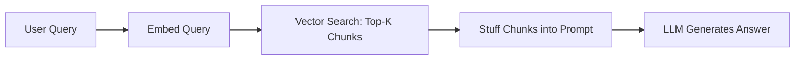
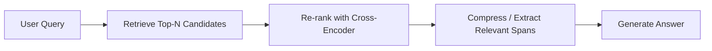
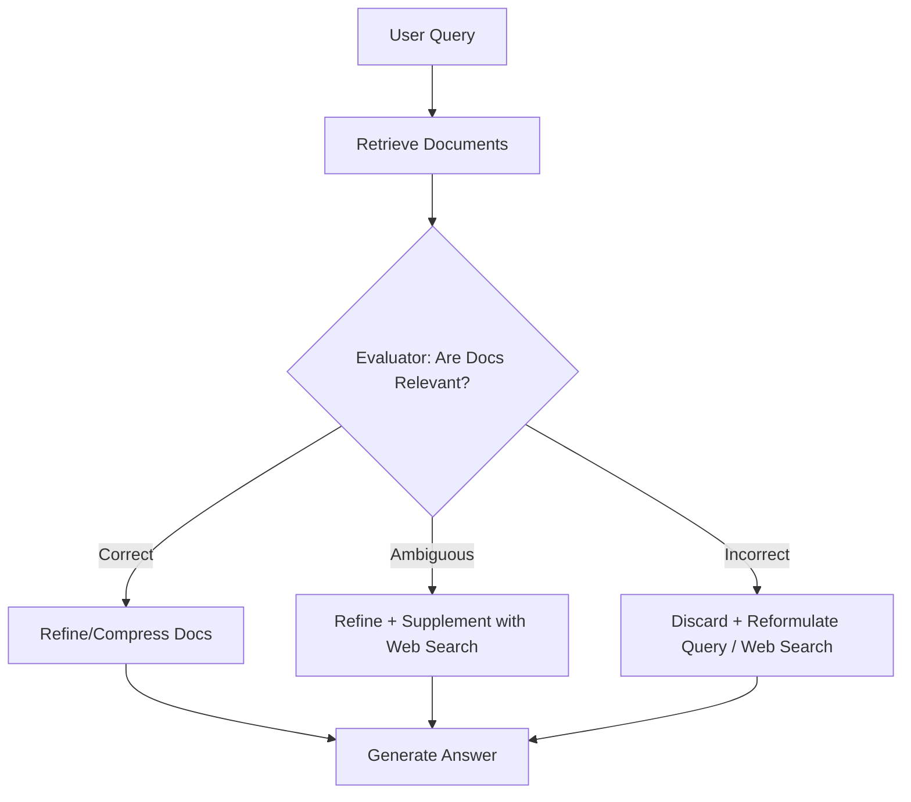
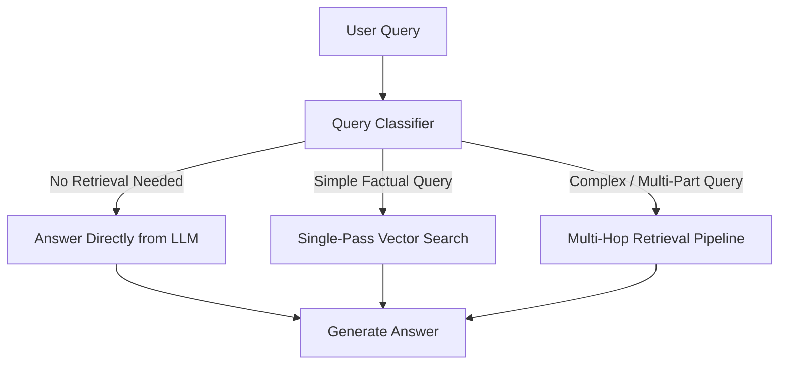
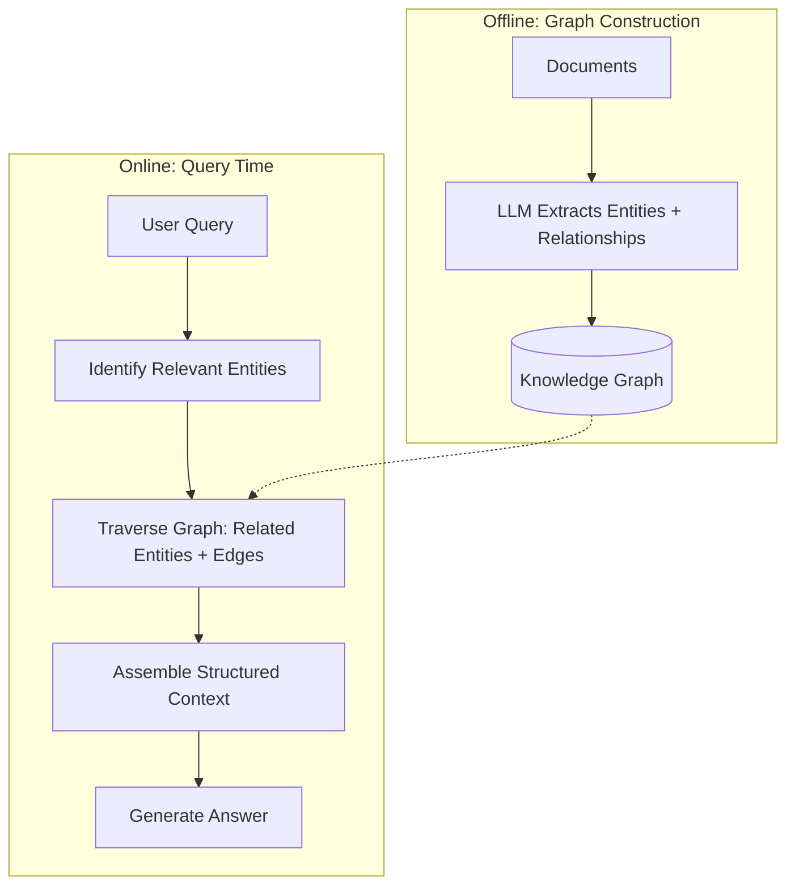
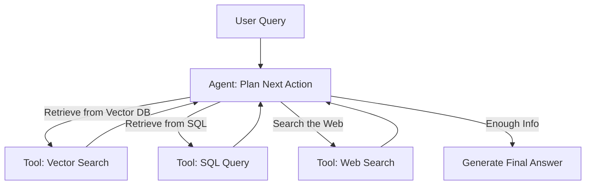
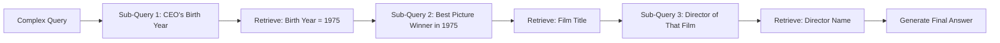
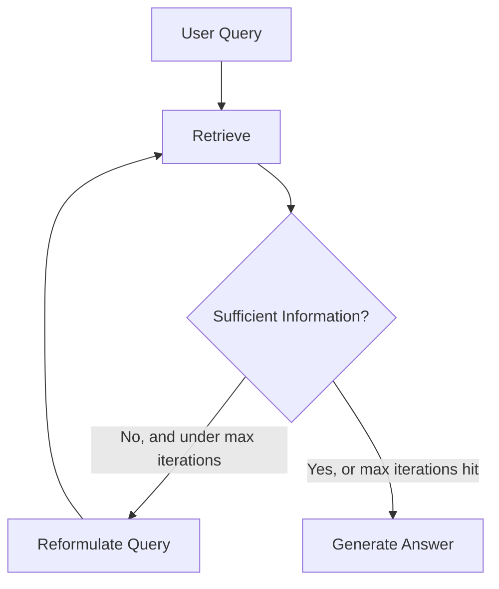
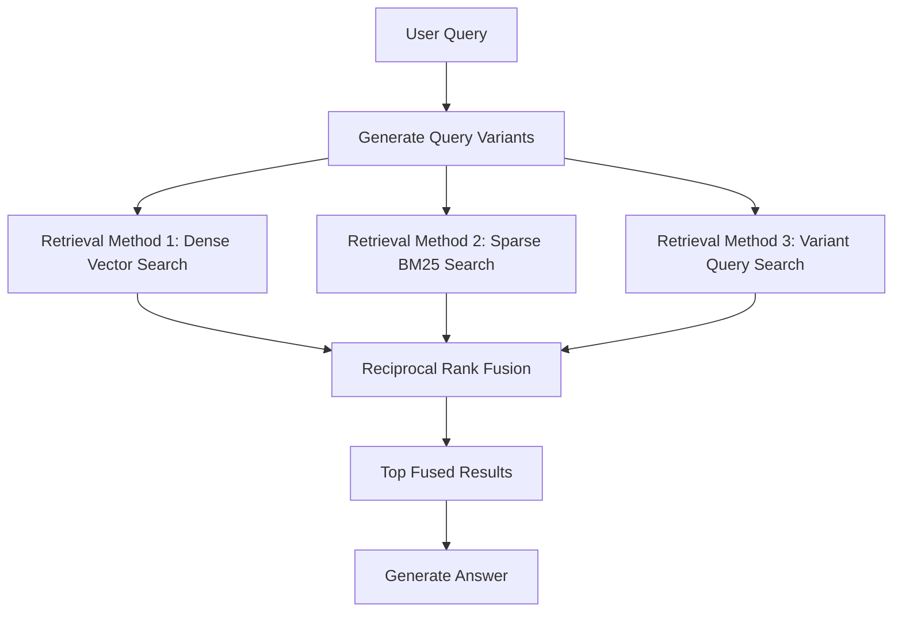
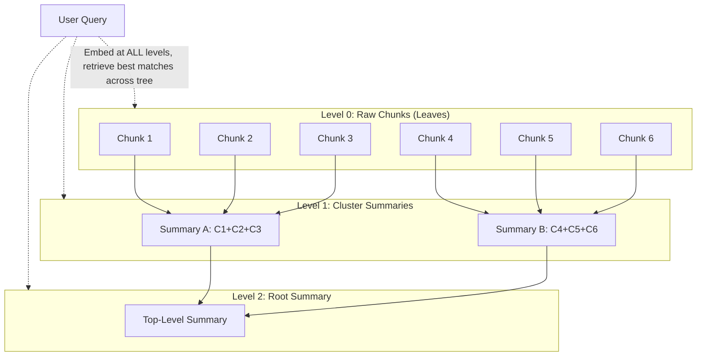

# Chapter 10: RAG Architectures

> "Naive RAG, Advanced RAG, Corrective RAG, Adaptive RAG, Graph RAG, Agentic RAG, Multi-hop RAG, Recursive RAG, Fusion RAG, RAPTOR — same Lego bricks, different blueprints."

---

## Learning Objectives

By the end of this chapter, you will be able to:

- Name and explain the ten major end-to-end RAG architecture patterns and draw each one as a pipeline diagram
- Explain, in plain language, **why** each architecture exists — what specific failure of a simpler architecture it was designed to fix
- Compare architectures on complexity, latency cost, and infrastructure requirements
- Choose the right architecture (or combination of architectures) for a given product requirement
- Recognize that these patterns are not mutually exclusive, and design systems that layer several together
- Avoid the common trap of over-engineering a RAG system with architecture the use case doesn't need

---

## Prerequisites for This Chapter

This chapter is a "zoom out." It assumes you have already built the individual pieces and now want to see how they snap together into full systems. Make sure you've read:

- **[Chapter 7 — Building Your First RAG Pipeline](./07-building-your-first-rag.md)**: this gives you the baseline "Naive RAG" pipeline that every architecture in this chapter either uses as-is or improves upon.
- **[Chapter 8 — Advanced Retrieval Techniques](./08-advanced-retrieval-techniques.md)**: hybrid search, multi-query retrieval, re-ranking, and MMR are the building blocks that "Advanced RAG," "Fusion RAG," and others assemble into a pipeline.
- **[Chapter 9 — Prompt Engineering for RAG](./09-prompt-engineering-for-rag.md)**: every architecture below still ends in a generation step, and how you format context and instruct the LLM at that step matters regardless of which architecture produced the context.

If any of those feel shaky, this chapter will still make sense conceptually, but you'll get far more value by treating it as "the pieces I already know, assembled six different ways."

---

## Why Architecture Matters: The Blueprint Analogy

Think of Chapters 4–9 as a hardware store. You now own a good drill (embeddings), a tape measure (chunking), organized shelving (vector databases), a few power tools (hybrid search, re-ranking, query rewriting), and you know how to write a clear work order (prompting).

But a pile of tools doesn't build a house. **Architecture** is the blueprint — the decision about which tools to use, in what order, with what feedback loops, for what kind of building.

- A garden shed doesn't need load-bearing steel beams. That's **Naive RAG**.
- A two-story house needs a proper foundation inspection before you build on it. That's **Corrective RAG**, checking the retrieval "foundation" before generating.
- An office building needs different wiring in the server room than in the lobby. That's **Adaptive RAG**, routing different query types down different paths.
- A city needs a map of how streets *connect*, not just a list of buildings. That's **Graph RAG**.

The point of this chapter is to give you the vocabulary and mental models to look at a requirement and say, "this needs a CRAG-style safety check" or "this is a multi-hop question, so a single retrieval pass will never work," the way a systems architect reasons about which pattern fits a problem — not by memorizing diagrams, but by understanding what failure mode each pattern was invented to solve.

---

## 1. Naive RAG — The Baseline

**The analogy**: Naive RAG is like asking a librarian a question, having them grab the single book section that sounds most related, and reading you the first few relevant pages — no double-checking, no follow-up questions, no verification that they grabbed the right section.

This is the pipeline you built in Chapter 7: embed the query, run a similarity search against the vector store, stuff the top-k chunks into a prompt, and generate an answer.

**Why it exists**: It's the simplest thing that could possibly work, and for a large fraction of real use cases, it *does* work. It requires no extra infrastructure beyond an embedding model, a vector database, and an LLM.

**Trade-offs**:

| Pros | Cons |
|---|---|
| Simple to build and reason about | No quality check on retrieved chunks |
| Low latency (one retrieval + one generation call) | Fails silently on irrelevant/missing retrieval |
| Cheap — minimal extra LLM calls | Struggles with multi-hop or ambiguous queries |
| Easy to debug (one path, not many) | Retrieves even when retrieval isn't needed |

**When to use it**: Well-scoped, single-document or small-corpus question answering where retrieval is usually reliable (e.g., a FAQ bot over a well-curated 50-page product manual). If your evaluation numbers (Chapter 13) already look great on Naive RAG, don't add complexity you don't need — that's the single most important lesson of this chapter, and we'll return to it in **Best Practices** below.

---

## 2. Advanced RAG — Retrieve, Re-rank, Compress, Generate

**The analogy**: Instead of trusting the librarian's first grab, you ask them to pull the top 20 candidate books, then have a subject-matter expert skim and rank those 20 by actual relevance, then highlight only the truly useful paragraphs before handing you a tight packet to read.

Advanced RAG inserts two extra stages between retrieval and generation, both of which you met in Chapter 8:

1. **Re-rank**: retrieve a wider net (e.g., top 20–50) with a fast method, then apply a more expensive, more accurate cross-encoder or LLM-based re-ranker to reorder by true relevance.
2. **Compress**: trim, summarize, or extract only the relevant sentences from the top-ranked chunks so the LLM's context window isn't wasted on filler.

**Why it exists**: Vector similarity (bi-encoder search) is fast but imprecise — it's optimized for recall, not precision. A cheap first-pass retrieval followed by an expensive but accurate re-rank gives you the speed of vector search with the precision of a heavier model, without paying the heavy model's cost on the entire corpus. Compression then solves a second problem: even relevant chunks contain irrelevant sentences that dilute the LLM's attention and burn context-window budget.

**Trade-offs**:

| Pros | Cons |
|---|---|
| Meaningfully higher answer quality than Naive RAG | Extra latency (one or two more model calls) |
| Better context-window utilization (less noise) | Extra infrastructure: a re-ranker model/service |
| Cheaper generation call (less tokens after compression) | More moving parts to monitor and evaluate |

**When to use it**: Almost always a safe upgrade over Naive RAG once you have real users and quality matters — e.g., an internal knowledge base spanning thousands of documents where the top vector-search hit is often "close but not quite right."

---

## 3. Corrective RAG (CRAG) — Trust, but Verify

**The analogy**: Imagine a fact-checker sitting between the librarian and you. Before you ever see the retrieved pages, the fact-checker reads them and asks: "Do these pages actually answer the question?" If yes, you get them. If they're borderline, the fact-checker trims out the junk. If they're flatly irrelevant, the fact-checker throws them out and goes to Plan B — searching the open web, or asking the librarian to look again with a better question.

CRAG adds an explicit **evaluator** step after retrieval that grades the retrieved documents (often into buckets like "Correct," "Ambiguous," and "Incorrect") and branches accordingly.

**Why it exists**: Naive and even Advanced RAG have no mechanism to notice when retrieval itself has failed — they will confidently generate an answer from irrelevant chunks, producing a fluent but wrong response (a particularly dangerous form of hallucination because it *looks* grounded). CRAG treats "did retrieval actually work?" as a first-class question, not an assumption.

**Trade-offs**:

| Pros | Cons |
|---|---|
| Directly reduces hallucination from bad retrieval | Extra LLM call for evaluation adds latency |
| Has a fallback path instead of failing silently | Needs a fallback source (web search API, secondary index) |
| Self-correcting — degrades gracefully | Evaluator itself can be wrong (adds its own error rate) |

**When to use it**: High-stakes settings where a wrong answer is costly — customer support for billing/legal/medical questions, or any domain where your corpus has coverage gaps and you'd rather say "let me check further" than guess. We'll revisit this exact scenario in **Real-World Scenario** below.

---

## 4. Adaptive RAG — Route the Query, Don't Force One Path

**The analogy**: A hospital doesn't send every patient through the same door. A receptionist (triage) looks at the complaint and routes you: broken arm goes to the ER, a prescription refill goes to a nurse hotline, a routine question goes to a signposted FAQ on the wall — no doctor needed at all.

Adaptive RAG puts a **query classifier** in front of the pipeline that decides, per query, which strategy to use: skip retrieval entirely, do a single simple vector search, or trigger a more expensive multi-step retrieval process.

**Why it exists**: Not all queries are equally hard, but a fixed pipeline treats them as if they were. "What's 12 * 8?" doesn't need retrieval at all — running it through a vector search wastes latency and can even *hurt* quality by injecting irrelevant context. "Compare our Q1 and Q3 refund policies and explain what changed" genuinely needs multiple retrieval steps. Adaptive RAG matches effort to difficulty, the same way you wouldn't use a sledgehammer to hang a picture frame.

**Trade-offs**:

| Pros | Cons |
|---|---|
| Saves latency/cost on easy queries | Requires a reliable query classifier (another model to maintain) |
| Improves quality on hard queries by giving them the right tool | Misclassification routes queries down the wrong, sometimes worse, path |
| Scales gracefully as query variety grows | More engineering and evaluation surface area |

**When to use it**: Consumer-facing assistants or copilots that see a wide spread of query types — from small talk to deep multi-part research questions — where a one-size-fits-all pipeline either overspends on easy queries or underdelivers on hard ones.

---

## 5. Graph RAG — Retrieving Relationships, Not Just Text

**The analogy**: Flat-chunk retrieval is like handing someone a stack of index cards, each with an isolated fact. Graph RAG is like handing them a family tree or an org chart instead — because some questions aren't about a single fact, they're about how facts *connect*. "Who is the manager of the person who approved this invoice?" isn't answered by any single index card; it's answered by tracing a path across two connected nodes.

Graph RAG builds (usually offline, via an LLM extraction pass) a **knowledge graph**: entities (people, products, organizations, concepts) as nodes, and relationships between them as labeled edges. At query time, instead of (or in addition to) a flat vector search, the system traverses the graph — finding relevant entities, walking their relationships, and pulling in a structured neighborhood of context.

**Why it helps where flat retrieval fails**: Vector similarity finds chunks that *sound like* the query, but it has no concept of multi-entity reasoning. Consider: "Which suppliers does the vendor that missed last quarter's SLA also share warehouse space with?" The answer requires connecting three facts (which vendor missed the SLA → what warehouse they use → which other suppliers use that same warehouse) that likely live in three different, textually dissimilar chunks. A single embedding of the question will not be textually close to all three chunks. A graph traversal, by contrast, follows the explicit edges — `missed_SLA`, `uses_warehouse`, `shares_warehouse_with` — regardless of whether the underlying sentences share any vocabulary at all. Graph RAG shines on **multi-entity relationship questions**, and on **global/summary questions over a whole corpus** ("What are the major themes across all customer complaints?") where no single chunk contains the answer but the graph's community structure does. This connects directly to the RAPTOR pattern in Section 10 below, which solves the summary-question problem from a tree-of-summaries angle instead of a graph angle — the two are complementary.

**Trade-offs**:

| Pros | Cons |
|---|---|
| Answers relationship/multi-entity questions flat retrieval can't | Expensive to build — LLM-driven entity/relation extraction over a whole corpus |
| Enables global/summary queries via graph communities | Graph maintenance (updates, dedup, entity resolution) is nontrivial |
| Explainable — you can literally show the traversal path | Overkill for corpora that are mostly independent, unrelated documents |

**When to use it**: Domains that are inherently relational — organizational knowledge (who reports to whom, who owns what), supply chains, biomedical literature (drug-gene-disease interactions), fraud/compliance investigation, or legal case law where precedent chains matter.

---

## 6. Agentic RAG — A Preview

**The analogy**: Every architecture so far, no matter how many branches or checks it has, still runs a largely *predetermined* sequence of steps decided by the engineer in advance. Agentic RAG hands the steering wheel to the LLM itself: instead of a fixed pipeline, an **agent** decides, at each turn, whether to retrieve, what to retrieve, whether the results are good enough, whether to call a different tool entirely (a calculator, a SQL database, a web search API), and when it has enough information to stop and answer.

**Why it exists**: CRAG has one fixed fallback branch. Adaptive RAG picks one of a few fixed routes. Multi-hop RAG (next section) chains a fixed number of retrieval steps. Agentic RAG generalizes all of this: instead of the *engineer* anticipating every branch in advance, the *agent* reasons, in real time, about what it still needs to know and which tool will get it there — including looping back to retrieve again if its first answer attempt looks incomplete.

This is a deep and important enough topic that it gets its own full chapter — we're only scratching the surface here so you can place it correctly among its siblings. **Chapter 14 — Agentic RAG** covers planning strategies, tool-calling patterns, reflection loops, memory, and frameworks like LangGraph in depth. For now, just remember: **Agentic RAG is what you get when you replace the fixed pipeline itself with a reasoning loop.**

**Trade-offs (preview)**:

| Pros | Cons |
|---|---|
| Handles genuinely open-ended, multi-tool tasks | Highest latency and cost of any pattern here |
| Self-correcting and flexible at run time | Harder to test, debug, and bound (can loop, can go off-track) |
| Can compose retrieval with actions (not just Q&A) | Requires careful guardrails in production |

---

## 7. Multi-Hop RAG — Chaining Facts Across Retrieval Steps

**The analogy**: Imagine a trivia question: "Who directed the movie that won Best Picture the year the current CEO of Company X was born?" You cannot look this up in one search. You first need the CEO's birth year, *then* you need to search for "Best Picture winner in [that year]," *then* you need to search for "who directed [that film]." Each search depends on the answer to the previous one.

Multi-hop RAG formalizes this: it decomposes a complex query into a **sequence** of sub-queries, where each retrieval step's output feeds the construction of the next query.

**Why it exists**: A single vector search embeds the *whole* question at once. But the whole question's embedding doesn't resemble any single chunk in the corpus — the chunk about the CEO's birth year doesn't mention "Best Picture," and the chunk about the film's director doesn't mention the CEO at all. One-shot retrieval structurally cannot solve questions where the necessary facts are scattered and dependent on each other. Multi-hop RAG is the direct architectural answer to that limitation.

**Trade-offs**:

| Pros | Cons |
|---|---|
| Solves questions Naive/Advanced RAG cannot answer at all | Latency scales with number of hops (multiple retrieval + LLM calls) |
| Each hop is simple and independently debuggable | Errors compound — a wrong fact in hop 1 poisons every later hop |
| Composable with re-ranking/compression at each hop | Needs a mechanism to decide how many hops are enough |

**When to use it**: Research assistants, due-diligence tools, and any Q&A system where questions are explicitly compositional ("compare," "the year that," "the person who," "before/after") rather than single-fact lookups.

---

## 8. Recursive RAG — Search, Judge, Search Again

**The analogy**: This is how a diligent human researcher actually works: search, skim what comes back, realize it's incomplete or slightly off-target, refine the search, and repeat — until you either have enough to write the answer, or you've hit a reasonable effort limit and have to work with what you've got.

Recursive RAG formalizes this loop: retrieve, evaluate sufficiency, and if insufficient, reformulate the query and retrieve again, until a stopping condition (enough information, or a maximum iteration count) is met.

**Why it exists / how it differs from Multi-Hop and CRAG**: It's worth being precise here because these three patterns look similar on a diagram but solve different problems:

- **CRAG** checks quality **once** and has a fixed fallback (web search / reformulate) — it's a single safety valve, not an open-ended loop.
- **Multi-Hop RAG** follows a **known chain of sub-questions** where the decomposition structure is roughly predictable in advance (fact A → fact B → fact C).
- **Recursive RAG** doesn't assume it knows the chain length or structure ahead of time — it just keeps looping, re-evaluating "do I have enough now?" after every pass, until it does (or gives up). It's the more general, open-ended cousin of both.

**Trade-offs**:

| Pros | Cons |
|---|---|
| Handles queries whose difficulty isn't known in advance | Unbounded loops without a hard cap risk runaway latency/cost |
| Naturally improves recall on hard, broad questions | Diminishing returns — later iterations often add little |
| Simple mental model: "keep trying until good enough" | Needs a well-calibrated "is this sufficient?" judge |

**When to use it**: Open-ended research and exploratory Q&A over large, heterogeneous corpora, where you genuinely don't know upfront how many retrieval passes a given question will need.

---

## 9. Fusion RAG — Combine Many Retrievals, Then Re-Rank the Union

**The analogy**: Instead of asking one librarian one question, you ask three different librarians three slightly reworded versions of your question (and maybe also check the card catalog *and* the digital search terminal), then pool every book anyone suggested and pick the best of the combined pile.

Fusion RAG runs **multiple retrieval passes** — over multiple query variants (recall the multi-query retrieval from Chapter 8), and/or over multiple retrieval methods (dense vector search + sparse BM25 keyword search) — and then **fuses** the ranked lists into one, typically using a rank-fusion algorithm like **Reciprocal Rank Fusion (RRF)**, which rewards documents that appear near the top across multiple lists rather than documents that only one method liked.

**Why it exists**: Every single retrieval method has blind spots. Dense vector search misses exact keyword/acronym matches ("SKU-4471"); sparse keyword search misses semantic paraphrases ("cancel my plan" vs. "terminate subscription"). A single query wording can also miss a relevant chunk that uses different phrasing than the user did. Fusion RAG hedges against all of these individual weaknesses at once by asking multiple slightly-different questions through multiple slightly-different lenses, then trusting the *consensus* of the group more than any single member. This is the direct architectural generalization of the multi-query and ensemble/hybrid retrieval techniques from Chapter 8 — Fusion RAG is what you get when you formalize "combine several retrieval signals" as the core organizing principle of the whole pipeline, not just one optional add-on.

**Trade-offs**:

| Pros | Cons |
|---|---|
| More robust recall than any single retrieval method alone | Multiple retrieval calls run in parallel — more infra, more cost |
| Fusion (RRF) is cheap and needs no training | More result lists to manage, dedupe, and fuse correctly |
| Naturally combines dense + sparse without hand-tuned weights | Doesn't fix a *bad* retrieval method, only blends good ones |

**When to use it**: Corpora with mixed content types (prose *and* structured IDs/codes/acronyms), or any system where you've already noticed that different retrieval methods succeed on different query types and you don't want to force a single winner.

---

## 10. RAPTOR — Retrieval-Augmented Processing Through Tree-Organized Retrieval

**The analogy**: Imagine a book that comes with per-page notes (the raw text), a one-paragraph summary at the end of each chapter, and a one-page executive summary of the whole book at the front. If someone asks you a fine-grained detail ("what did the report say happened on March 3rd?"), you go straight to the page-level notes. If someone asks a big-picture question ("what's the overall conclusion of this report?"), you don't want to read every page — you want the executive summary at the top. RAPTOR builds exactly this kind of layered structure for your document corpus, instead of relying on a flat pile of equal-sized chunks.

**How it works**: Offline, RAPTOR takes your leaf-level chunks (the same chunks from Chapter 5), clusters semantically similar ones together, and asks an LLM to write a summary of each cluster. Those summaries become a new layer of "nodes" one level up. The clustering-and-summarizing process repeats recursively on that new layer, forming higher and higher levels of abstraction, until you're left with a tree: raw chunks as leaves, cluster summaries in the middle layers, and a small number of top-level summaries near the root.

At query time, RAPTOR embeds nodes from **every level** of the tree into the same vector index (or queries level-by-level), so retrieval can return whichever level of abstraction actually matches the query — a leaf chunk for a fine-grained factual question, or a root/mid-level summary for a broad thematic question — sometimes both at once.

**Why it exists**: Flat chunking has a structural blind spot: fixed-size chunks are tuned for *local* detail retrieval, but they fail on questions that require synthesizing information spread across many chunks or an entire document ("summarize the main risks discussed across this 200-page report"). No single flat chunk contains that answer, and stuffing dozens of raw chunks into the prompt is expensive and dilutes the LLM's attention. RAPTOR pre-computes the "zoomed out" view offline so that retrieval can jump straight to the right altitude at query time instead of asking the LLM to synthesize it fresh, expensively, on every query. Note the family resemblance to Graph RAG (Section 5): both exist to answer "global" questions a single flat chunk can't — Graph RAG does it via explicit entity relationships, RAPTOR does it via a summarization hierarchy. They solve overlapping problems from different angles, and can be combined.

**Trade-offs**:

| Pros | Cons |
|---|---|
| Handles both fine-detail and broad/summary questions well | Expensive offline build (many LLM summarization calls) |
| No runtime cost beyond a normal vector search | Tree needs rebuilding/updating as documents change |
| Reduces need for the LLM to synthesize across many raw chunks | Summary quality caps answer quality (lossy compression) |

**When to use it**: Long documents or corpora where users frequently ask both detail-level ("what was the exact number on page 12?") and summary-level ("what's the overall takeaway?") questions — legal contracts, research reports, long meeting transcripts, book-length manuals.

---

## Architectures Are Not Mutually Exclusive

Every architecture above has been presented in isolation for clarity, but **production systems almost always combine several of them**. Think of each one as answering a different question:

- "Should I even retrieve?" → **Adaptive RAG**
- "Was what I retrieved actually good?" → **Corrective RAG**
- "Does this question need connected facts, not just similar text?" → **Graph RAG**
- "Does this question need multiple sequential lookups?" → **Multi-Hop / Recursive RAG**
- "Should I hedge across multiple retrieval signals?" → **Fusion RAG**
- "Does this question need a summary altitude, not a detail altitude?" → **RAPTOR**
- "Should the LLM itself decide all of the above dynamically?" → **Agentic RAG**

A realistic enterprise knowledge assistant might, for example: use **Adaptive RAG** to route small-talk away from retrieval entirely; use **Fusion RAG** (dense + sparse + multi-query) plus a **re-ranker** (Advanced RAG) as its default retrieval path; escalate to **Graph RAG** specifically for questions tagged as "relationship" queries by the router; fall back through a **CRAG**-style evaluator when confidence is low; and wrap the whole thing in a thin **Agentic** loop (Chapter 14) that can retry or call a secondary tool when the first pass isn't good enough. None of that is exotic — it's the natural result of applying the right small fix, from this chapter's toolbox, to each specific failure mode your evaluation suite (Chapter 13) surfaces.

---

## Comparison Table

| Architecture | Complexity | Latency Cost | Extra Infra Needed | Best For | Example Use Case |
|---|---|---|---|---|---|
| **Naive RAG** | Low | Low (1 retrieval + 1 generation) | Vector DB only | Simple, well-scoped Q&A | Internal FAQ bot over a single manual |
| **Advanced RAG** | Low–Medium | Medium (+re-rank, +compress) | Re-ranker model | General-purpose quality upgrade | Company-wide knowledge base search |
| **Corrective RAG (CRAG)** | Medium | Medium–High (+evaluator, possible fallback) | Evaluator + fallback source (web search) | High-stakes accuracy | Customer support for billing/legal questions |
| **Adaptive RAG** | Medium | Variable (low for easy queries, high for hard) | Query classifier | Mixed query difficulty at scale | Consumer copilot handling varied questions |
| **Graph RAG** | High | Medium–High (graph traversal) | Knowledge graph + extraction pipeline | Multi-entity, relational, global/summary questions | Org chart / supply-chain / compliance investigation |
| **Agentic RAG** | High | High (multi-turn tool loop) | Agent framework, tool integrations | Open-ended, multi-tool tasks | Autonomous research assistant (see Chapter 14) |
| **Multi-Hop RAG** | Medium–High | High (N sequential retrieval+LLM calls) | None extra, just orchestration | Compositional questions with dependent facts | "Who directed the film that won the year X was born?" |
| **Recursive RAG** | Medium–High | Variable, bounded by max iterations | Sufficiency judge | Open-ended research where hop count is unknown | Broad exploratory research assistant |
| **Fusion RAG** | Medium | Medium (parallel retrieval calls) | Multiple retrievers + fusion (RRF) logic | Mixed content: prose + IDs/codes/acronyms | Technical support search over docs + ticket IDs |
| **RAPTOR** | High | Low at query time (build cost offline) | Offline tree-build pipeline | Both detail and summary-level questions | Long legal contracts, research reports |

---

## Real-World Scenario

**Scenario A: Enterprise Customer Support Bot (billing and account questions)**

A fintech company builds a support assistant that answers questions about refunds, account holds, and billing disputes. A wrong answer here isn't just embarrassing — it can mean promising a refund the company doesn't actually offer, or telling a customer the wrong dispute deadline, both of which carry real financial and legal exposure.

The team initially shipped **Naive RAG** and found that roughly 8% of answers were subtly wrong — not because the LLM couldn't read, but because the top-3 retrieved chunks sometimes weren't actually about the customer's specific plan tier or region, yet the LLM answered confidently anyway. This is exactly the failure mode CRAG was invented for.

They moved to **Corrective RAG**: after retrieval, a lightweight evaluator LLM call grades whether the retrieved policy documents actually match the customer's plan/region mentioned in the query. If "Correct," they proceed as normal (with re-ranking and compression from Advanced RAG layered in). If "Ambiguous," they supplement with a secondary, more precise metadata-filtered search. If "Incorrect," the bot explicitly tells the user it isn't confident and offers to escalate to a human agent rather than guessing. The added evaluator call costs roughly 200–400ms of latency per query — an easy trade against the cost of a wrong billing promise.

**Scenario B: Internal Engineering FAQ Bot**

A separate team at the same company built a small internal bot answering "how do I request a new Jira project" and "what's our on-call rotation policy" from a 40-page internal wiki. Here, a wrong answer just means an engineer re-reads the wiki page — mildly annoying, not costly. The team correctly kept this as **Naive RAG**: single retrieval pass, no evaluator, no fallback branch. Adding CRAG here would roughly double the latency and engineering surface area for a failure mode (occasional wrong answer on a low-stakes internal question) that simply doesn't justify the cost. This pairing — CRAG for the customer-facing billing bot, Naive RAG for the internal FAQ bot — is the clearest illustration in this chapter of matching architecture to actual risk, not to what sounds most sophisticated.

---

## Best Practices

- **Start with Naive RAG and measure before adding anything.** Every architecture in this chapter adds latency, cost, or engineering surface area. Use the evaluation methods from Chapter 13 to find your *actual* failure mode before reaching for a fix.
- **Match the architecture to the failure mode, not to what's trendy.** If your evaluation shows retrieval quality is fine but the LLM ignores context, no amount of Graph RAG or RAPTOR will help — that's a prompting problem (Chapter 9). If retrieval quality is the problem, ask *which* kind: wrong documents (→ CRAG), missing relationships (→ Graph RAG), multi-step questions (→ Multi-Hop/Recursive), or summary-altitude questions (→ RAPTOR).
- **Layer incrementally.** Advanced RAG (re-rank + compress) is close to a strictly-better default over Naive RAG at modest cost — a reasonable second step for almost any production system. Add CRAG, Adaptive routing, Graph RAG, or RAPTOR only once evaluation data shows a specific need for them.
- **Put a hard cap on any looping architecture.** Recursive RAG, Multi-Hop RAG, and Agentic RAG can all, in principle, keep retrieving forever. Always set a maximum iteration/hop count and a timeout.
- **Log which architectural path a query took.** In an Adaptive or Agentic system, always log the routing decision (which path was chosen and why) — without this, debugging "why did the bot answer badly" becomes nearly impossible.
- **Treat graph and tree construction as ongoing pipelines, not one-time jobs.** Graph RAG's knowledge graph and RAPTOR's summary tree both go stale as source documents change; budget for incremental rebuilds, not just an initial build.
- **Combine, don't replace.** Remember the section above — production systems layer these patterns. Design your pipeline so a new pattern (say, adding Graph RAG for one query category) can be inserted without ripping out the rest.

---

## Common Mistakes

- **Reaching for Agentic RAG or Graph RAG first**, because they sound impressive, without evaluation data showing Naive or Advanced RAG is actually insufficient. This is the single most common and most expensive architectural mistake.
- **Confusing Multi-Hop RAG with Recursive RAG** and hand-building a rigid N-step chain for a problem that actually needs an open-ended "keep going until sufficient" loop, or vice versa — building an unbounded recursive loop for a problem with a known, fixed number of hops.
- **Building a knowledge graph for a corpus that has no real relational structure.** Graph RAG's cost is only worth paying when the questions genuinely require connecting entities; if your corpus is a pile of independent PDFs with no meaningful cross-references, a graph adds cost without adding answer quality.
- **Running RAPTOR's summarization tree once and never rebuilding it.** Summaries silently go stale as source documents are updated, and a stale tree can produce confidently wrong "big picture" answers.
- **No stopping condition on iterative architectures**, leading to runaway latency and API cost on Recursive, Multi-Hop, or Agentic RAG in production.
- **Treating CRAG's evaluator as infallible.** The evaluator is itself an LLM call and can misjudge relevance; monitor its accuracy the same way you'd monitor the main retrieval and generation steps.
- **Ignoring latency budgets when stacking patterns.** Combining Fusion RAG + re-ranking + CRAG + Graph RAG in one pipeline can push response times to several seconds — always check whether your product's latency requirement (chat UI vs. batch report) still tolerates the stack you've built.

---

## Summary

- **Naive RAG** (retrieve → generate) is the baseline every other architecture improves upon; don't abandon it without evidence it's insufficient.
- **Advanced RAG** adds re-ranking and compression between retrieval and generation for a broadly applicable quality upgrade.
- **Corrective RAG (CRAG)** adds an evaluator that checks retrieval quality and triggers a fallback (web search, reformulation) when retrieval fails.
- **Adaptive RAG** classifies each query and routes it to the cheapest strategy that will actually work — including skipping retrieval entirely.
- **Graph RAG** retrieves via a knowledge graph traversal instead of (or alongside) flat chunks, solving multi-entity relationship and global/summary questions flat retrieval structurally cannot answer.
- **Agentic RAG** replaces the fixed pipeline with an LLM-driven reasoning loop that plans, retrieves, and decides when to stop — full depth in Chapter 14.
- **Multi-Hop RAG** chains sequential retrieval steps where each step's output shapes the next query, for compositional questions.
- **Recursive RAG** generalizes the loop: search, judge sufficiency, and re-search until a stopping condition is met, without assuming a fixed number of hops in advance.
- **Fusion RAG** runs multiple retrieval methods and/or query variants in parallel and fuses the ranked results (e.g., via Reciprocal Rank Fusion) for more robust recall.
- **RAPTOR** pre-builds a hierarchical tree of chunk summaries so retrieval can operate at the altitude — detail or summary — that best matches the query.
- None of these are mutually exclusive; production systems combine several, chosen by what your evaluation data shows you actually need.

---

## Knowledge Check

1. What specific failure mode does Corrective RAG (CRAG) address that Naive RAG cannot detect at all?
2. In Adaptive RAG, what determines whether a query skips retrieval entirely, uses a single vector search, or triggers multi-hop retrieval?
3. Explain, with an example question, why flat chunk-based retrieval struggles with the kind of question Graph RAG is designed to answer.
4. What is the key architectural difference between Multi-Hop RAG and Recursive RAG, given that both involve more than one retrieval pass?
5. How does RAPTOR allow the same retrieval system to answer both a fine-grained detail question and a broad summary question well?
6. Why is Agentic RAG described as a generalization of CRAG, Adaptive RAG, and Multi-Hop RAG rather than a completely separate pattern?

---

## Hands-On Exercise

For each of the three queries below, decide which RAG architecture pattern (or combination) from this chapter best fits, and write 2–3 sentences justifying your choice. Consider: does it need retrieval at all, is it single-fact or multi-fact, does it need relationship traversal, and does it need a specific altitude of abstraction?

1. **Query A**: "What is our current password reset policy?" (asked against a 60-page internal IT wiki)
2. **Query B**: "Which of our vendors are subsidiaries of the same parent company as the vendor that failed our last security audit?" (asked against a corpus of vendor contracts and corporate filings)
3. **Query C**: "Summarize the three biggest risks discussed across all 40 of our quarterly compliance reports from the last five years, and pull the exact wording of the risk clause from the most recent report."

> Hint for Query C: notice that it has *two* distinct information needs bundled into one question — a broad synthesis need and a precise, single-document detail need. Which single architecture handles both, and why?

There are no answer keys provided — discuss your reasoning with a peer, a study group, or by re-reading the relevant sections above until your justification references the *specific mechanism* of the architecture you chose, not just its name.

---

## Further Reading

- **RAPTOR**: Sarthi et al., "RAPTOR: Recursive Abstractive Processing for Tree-Organized Retrieval" (2024) — the original paper introducing the recursive clustering-and-summarization tree described in Section 10.
- **CRAG**: Yan et al., "Corrective Retrieval Augmented Generation" (2024) — the original paper introducing the retrieval evaluator and fallback mechanism described in Section 3.
- **GraphRAG**: Microsoft Research, "From Local to Global: A Graph RAG Approach to Query-Focused Summarization" (2024), and the accompanying open-source `microsoft/graphrag` repository — the entity-extraction, community-detection, and hierarchical-summarization approach referenced in Section 5.
- **Self-RAG**: Asai et al., "Self-RAG: Learning to Retrieve, Generate, and Critique through Self-Reflection" (2023) — a closely related self-evaluation approach that informs both CRAG (Section 3) and the reflection loops used in Agentic RAG (Section 6, full depth in Chapter 14).
- Revisit **Chapter 8 — Advanced Retrieval Techniques** for the mechanics behind re-ranking, multi-query retrieval, and hybrid search that underpin Advanced RAG and Fusion RAG in this chapter.
- Preview **Chapter 14 — Agentic RAG** for the full treatment of planning, tool-calling, reflection, and memory only briefly introduced in Section 6 here.

---

  <a href="./09-prompt-engineering-for-rag.md">← Previous: Prompt Engineering for RAG</a>
  <a href="./00-index.md">🏠 Index</a>
  <a href="./11-query-transformation.md">Next: Query Transformation →</a>

