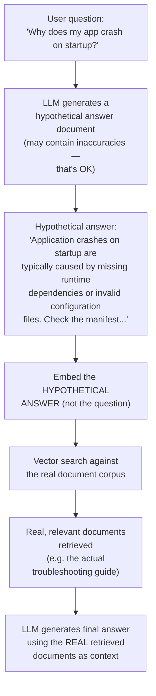

# Chapter 11: Query Transformation

> "The user's question is rarely the best search query. Your job is to translate one into the other." — a lesson every RAG engineer learns the hard way

## Learning Objectives

By the end of this chapter, you will be able to:

- Explain why raw user queries are frequently poor inputs for a retrieval system, and identify the specific failure patterns (ambiguity, conversational references, multi-part questions, vocabulary mismatch)
- Implement **Query Rewriting** to turn a vague, conversational, follow-up-style question into a clear, standalone, retrieval-friendly query
- Implement **Query Decomposition** to break a complex multi-part question into simpler sub-questions, retrieve for each, and combine the results — the mechanism underneath Multi-hop RAG from Chapter 10
- Explain and implement **HyDE (Hypothetical Document Embeddings)**, including *why* embedding a generated hypothetical answer outperforms embedding the raw question
- Explain and implement **Step-back Prompting**, retrieving both a specific query and a more general/abstract version of it
- Recap and formalize **Query Expansion** from Chapter 8 as one technique in this broader family
- Decide when to combine multiple query transformation techniques versus when doing so is unnecessary latency/cost overhead, and match an observed retrieval symptom to the right technique using a diagnostic table

---

## Prerequisites for This Chapter

This chapter is a deep dive into a topic you have already met twice. **[Chapter 8: Advanced Retrieval Techniques](./08-advanced-retrieval-techniques.md)** introduced **query expansion** and **multi-query retrieval** as ways to improve recall by generating variations of a query; this chapter formalizes that idea alongside four other, more powerful transformation strategies. **[Chapter 10: RAG Architectures](./10-rag-architectures.md)** introduced **Adaptive RAG**, **Multi-hop RAG**, and **Recursive RAG** — architectures whose entire premise depends on transforming the query before (or between) retrieval steps. Multi-hop RAG, in particular, is impossible without the **Query Decomposition** technique in Section 3 below; if you read Chapter 10 and wondered "but how, mechanically, does the system break a question into sub-questions?" — this chapter answers that.

No new environment setup is required beyond Chapter 1 (an LLM API key and Python 3.9+). Every technique here is, at its core, "make one extra LLM call before you search" — so the main new mental model is thinking of the **query itself as something you engineer**, not just a string you pass straight to your vector database.

---

## 1. Why the User's Raw Query Is Often a Bad Search Query

Before learning the techniques, it's worth sitting with the problem they all solve.

### 1.1 The mismatch between how people talk and how documents are written

When a person types into a chat box, they write the way they'd talk to a colleague who already has full context: short, elliptical, assuming shared history. Documents — the things you're searching over — are written the opposite way: complete, self-contained, formal, dense with domain vocabulary.

Consider a user chatting with a support bot about a SaaS product:

```
Turn 1 (user): "What's the pricing for the Pro plan?"
Turn 2 (bot):  "The Pro plan is $49/month, billed annually, and includes
                up to 10 team members."
Turn 3 (user): "What about last year?"
```

Turn 3, taken on its own and sent straight to your retriever, is close to meaningless. "What about last year?" — what about *what*, last year? A vector search on that exact string will retrieve... whatever documents happen to contain the phrase "last year," which has nothing to do with historical Pro plan pricing. The user's *intent* is clear from the conversation ("was the Pro plan cheaper last year?"), but the literal *text* of their query carries almost none of that intent.

This is the central problem query transformation exists to solve: **the gap between user intent and query text.** Four distinct flavors of this gap show up constantly:

| Failure pattern | Example | Why raw retrieval fails |
|---|---|---|
| **Conversational reference** | "What about last year?" (after discussing pricing) | Pronouns/references ("it," "that," "the second one," "last year") point at context that isn't in the query string itself |
| **Ambiguity / vagueness** | "Is it good for teams?" | "It" is undefined without conversation history; "good" is subjective and underspecified |
| **Multi-part complexity** | "How does our Q3 revenue compare to Q2, and what drove the difference?" | This is really two-to-three separate lookups bundled into one sentence; a single retrieval pass optimizes for none of them well |
| **Vocabulary / phrasing mismatch** | User asks "why does my app crash on startup," but the manual says "Application Fails to Initialize: Diagnostic Steps" | Questions and their answers are written in structurally different language — short, informal, verb-driven vs. long, formal, noun-driven |

Each row above maps to one or more techniques in this chapter:

- Conversational reference / ambiguity → **Query Rewriting** (Section 2)
- Multi-part complexity → **Query Decomposition** (Section 3)
- Vocabulary/phrasing mismatch → **HyDE** (Section 4) and, for narrow-vs-broad framing gaps, **Step-back Prompting** (Section 5)
- General recall improvement across the board → **Query Expansion** (Section 6)

### 1.2 The shared shape of every technique in this chapter

Every technique here follows the same skeleton: `raw query (+ history) → LLM call that transforms the query → one or more better queries → retrieval → retrieved chunks → LLM call that generates the final answer`. Notice there are now **two LLM calls** in the pipeline instead of one — a transformation call before retrieval, and a generation call after. That's the fundamental cost/latency trade-off you're signing up for every time you add query transformation, a theme we return to explicitly in Section 8.

---

## 2. Query Rewriting

### 2.1 The idea, in plain language

**Query Rewriting** takes a query that only makes sense *in context* — a vague follow-up, a question full of pronouns, a fragment of a longer conversation — and asks an LLM to rewrite it into a **standalone, self-contained, retrieval-friendly** version that carries all the necessary context on its own.

Think of it like this: imagine handing a research librarian a sticky note that just says "what about last year?" with no other information. The librarian can't help you. Now imagine you first hand them a note that says "What was the Pro plan's pricing last year, compared to the current $49/month price?" That note, the librarian can act on immediately. Query rewriting is the automated process of turning the first sticky note into the second, using the conversation history as the missing context.

### 2.2 What goes into the rewrite

A query rewriter needs three inputs: **the raw current query** ("What about last year?"), **recent conversation history** (the last N turns of user/assistant exchange), and **an instruction to the LLM** to produce a single, clear, standalone question that resolves all pronouns and references, without answering the question itself.

### 2.3 Worked example

```
Conversation history:
  User: What's the pricing for the Pro plan?
  Assistant: The Pro plan is $49/month, billed annually, and includes
             up to 10 team members.

Raw query:  "What about last year?"

Rewritten query: "What was the Pro plan's pricing last year, and how
                   does it compare to the current $49/month price?"
```

The rewritten query no longer depends on anything outside itself. You could hand it to a search engine, a different colleague, or a retriever with zero shared context, and it would still make complete sense. That standalone property is the entire goal.

### 2.4 Code snippet

```python
from openai import OpenAI

client = OpenAI()

REWRITE_PROMPT = """You are a query rewriting assistant for a search system.
Given a conversation history and the user's latest message, rewrite the
latest message into a single, standalone, self-contained search query.

Rules:
- Resolve all pronouns and references (it, that, the second one, last year, etc.)
  using the conversation history.
- Do NOT answer the question. Only rewrite it.
- If the latest message is already standalone, return it unchanged.

Conversation history:
{history}

Latest user message: {query}

Standalone query:"""

def rewrite_query(query: str, history: str) -> str:
    response = client.chat.completions.create(
        model="gpt-4o-mini",
        messages=[{"role": "user", "content": REWRITE_PROMPT.format(history=history, query=query)}],
        temperature=0,
    )
    return response.choices[0].message.content.strip()

history = "User: What's the pricing for the Pro plan?\nAssistant: $49/month, billed annually, up to 10 team members."
print(rewrite_query("What about last year?", history))
# -> "What was the Pro plan's pricing last year, compared to the current $49/month price?"
```

Note `temperature=0`: query rewriting should be deterministic and literal, not creative — you want faithful context resolution, not embellishment.

**Where this fits:** query rewriting sits at the very front of a **conversational RAG** system, before any retrieval happens, letting a multi-turn chat interface behave like a series of independent, well-formed searches even though the user is speaking in fragments. It also directly enables **Adaptive RAG** from Chapter 10, which needs a clean, well-formed query before it can even decide *which* retrieval strategy to route to.

---

## 3. Query Decomposition

### 3.1 The idea, in plain language

Some questions aren't vague — they're precise, but they're **compound**: they bundle two or three distinct information needs into a single sentence. A single retrieval pass against a compound question tends to retrieve documents that are "somewhat relevant to everything and fully relevant to nothing," because the embedding of the combined question is a blurry average of several different topics.

**Query Decomposition** solves this by asking an LLM to split the compound question into a set of simpler, independent (or sequentially dependent) sub-questions, retrieving separately for *each* sub-question, and then combining all the retrieved evidence before generating the final answer.

Analogy: if someone asks you "How did our marketing spend and our customer churn both change between Q2 and Q3, and is there a connection?" — you wouldn't try to look this up as one search. You'd naturally break it into: "What was marketing spend in Q2 vs Q3?", "What was customer churn in Q2 vs Q3?", and then reason about a possible connection using both answers. Query decomposition automates exactly that instinct.

### 3.2 Worked example

```
Complex question:
"How does our Q3 revenue compare to Q2, and what likely drove the difference?"

Decomposed sub-questions:
  1. "What was total revenue in Q2?"
  2. "What was total revenue in Q3?"
  3. "What significant business events, launches, or market changes
      occurred between Q2 and Q3 that could affect revenue?"
```

Each sub-question is retrieved **independently** — sub-question 1 might match a Q2 earnings summary chunk, sub-question 2 a Q3 earnings summary chunk, and sub-question 3 a product-launch announcement or a churn report. None of those three chunks would have scored highly against the original, blended question. Once all three sets of chunks are retrieved, they're concatenated (or summarized) and handed to the LLM together to produce one coherent final answer that references revenue numbers from both quarters *and* the contextual event that plausibly explains the change.

This is precisely the mechanism that powers **Multi-hop RAG** from Chapter 10: each sub-question is one "hop," and the answer to an earlier hop can even be used to formulate a later hop's sub-question (e.g., "what happened in the region where revenue dropped most?" — a question you can only ask once you know which region dropped most).

### 3.3 Sequential vs. parallel decomposition

In **parallel decomposition** (used above), sub-questions are independent and can be retrieved simultaneously — fast, and the common case for "compare X and Y" questions. In **sequential decomposition**, a later sub-question depends on an earlier answer (e.g., "Who is the CEO of the company that acquired Acme Corp?" must first resolve "who acquired Acme Corp?" before it can even form the second sub-question). This is slower — each hop must complete before the next begins — but it's the only way to correctly answer genuinely chained questions.

### 3.4 Code snippet

```python
import json
from openai import OpenAI

client = OpenAI()

DECOMPOSE_PROMPT = """Break the following complex question into 2-4 simpler,
self-contained sub-questions that can each be answered independently by
searching a document collection. Return ONLY a JSON list of strings.

Question: {question}

Sub-questions (JSON list):"""

def decompose_query(question: str) -> list[str]:
    response = client.chat.completions.create(
        model="gpt-4o-mini",
        messages=[{"role": "user", "content": DECOMPOSE_PROMPT.format(question=question)}],
        temperature=0,
    )
    return json.loads(response.choices[0].message.content)

def multi_hop_answer(question: str, retrieve_fn, generate_fn) -> str:
    sub_questions = decompose_query(question)
    all_context = [chunk for sq in sub_questions for chunk in retrieve_fn(sq, top_k=3)]
    return generate_fn(question=question, context="\n\n".join(all_context))

question = "How does our Q3 revenue compare to Q2, and what likely drove the difference?"
print(decompose_query(question))
# -> ["What was total revenue in Q2?", "What was total revenue in Q3?",
#     "What significant business events occurred between Q2 and Q3 that could affect revenue?"]
```

---

## 4. HyDE (Hypothetical Document Embeddings)

### 4.1 The core insight

HyDE is, for many learners, the most counterintuitive and delightful technique in this chapter, so let's build the intuition slowly.

Recall from **Chapter 4 (Embeddings Fundamentals)** that semantic search works by embedding a query and a set of documents into the same vector space, then finding documents whose vectors are closest to the query's vector. This works well when the query and the matching document are written in *similar style and length*. But questions and answers are usually **not** written similarly.

A question is short, interrogative, and often uses everyday words:

```
"Why does my app crash on startup?"
```

The document that actually answers it is long, declarative, and uses technical vocabulary:

```
"Application Fails to Initialize: Diagnostic Steps

If the application terminates unexpectedly during the bootstrap
sequence, verify that the runtime dependencies listed in the
manifest are present and that the configuration file conforms
to schema version 2.1. Common root causes include..."
```

Even though these two texts are *about the same thing*, their embeddings may end up only moderately close, because embedding models are sensitive to phrasing, length, and register (formal vs. casual), not just topic. This is the **question-answer vocabulary mismatch problem**, and it's a real, measurable limitation of plain semantic search.

**HyDE's trick:** instead of embedding the *question*, first ask an LLM to **imagine and write a hypothetical answer** to it — a fake, plausible-sounding document that *would* answer it, with no guarantee it's factually correct. Then embed *that hypothetical document*, not the original question, and use its vector to search. Because the hypothetical answer is written in the same style, length, and vocabulary register as *real* answer documents, its embedding lands much closer to the correct real document than the short original question ever could. It sounds backwards — "generate a fake answer to find the real answer" — but it works because retrieval quality depends on *stylistic and lexical proximity* as much as topical relevance, and the hypothetical document is never shown to the user or trusted for facts: only its *vector* is used to search, then the *real* retrieved documents are used to ground the actual answer.

### 4.2 The flow, diagrammed



Two things to notice in this diagram, because they're the most commonly confused part of HyDE for newcomers:

1. **The hypothetical document is never shown to the user and never used as a source of facts.** It exists purely as a better-shaped "search probe." Only the real documents retrieved in step E/F are used to ground the final answer.
2. **There are now three LLM-related steps** where a naive pipeline had one: generate hypothetical answer → embed it → (later) generate the real final answer from real retrieved context. This is the clearest example in the chapter of the latency/cost trade-off discussed in Section 8.

### 4.3 Code snippet

```python
from openai import OpenAI

client = OpenAI()

HYDE_PROMPT = """Write a short, confident, factual-sounding passage that
would answer the following question, as if it were an excerpt from a
technical document. It's OK if some details are approximate — this text
will only be used to guide a search, not shown to the end user.

Question: {question}

Passage:"""

def generate_hypothetical_document(question: str) -> str:
    response = client.chat.completions.create(
        model="gpt-4o-mini",
        messages=[{"role": "user", "content": HYDE_PROMPT.format(question=question)}],
        temperature=0.3,
    )
    return response.choices[0].message.content.strip()

def hyde_retrieve(question: str, embed_fn, vector_store, top_k: int = 5):
    hyde_vector = embed_fn(generate_hypothetical_document(question))  # embed the FAKE answer
    return vector_store.similarity_search_by_vector(hyde_vector, k=top_k)

print(generate_hypothetical_document("Why does my app crash on startup?"))
# -> "Application crashes during startup are most commonly caused by missing
#     runtime dependencies, corrupted configuration files, or version
#     mismatches. To diagnose, check the application logs for stack traces
#     during the initialization phase..."
```

### 4.4 When HyDE helps most — and when it doesn't

HyDE tends to deliver the largest gains on **long-form, formal, technical documents** (manuals, research papers, legal text) paired with **short, casual questions** — the exact vocabulary-mismatch scenario above — and when you have **no labeled query-document data** to fine-tune a retriever, since HyDE is zero-shot and prompt-only.

It helps less, or can even hurt, on **short, already answer-shaped corpora** (FAQs, key-value specs) where there's no vocabulary gap to bridge, and on **very specific, rare-entity questions** (an obscure SKU, a specific line of code) — the LLM may hallucinate a plausible but topically wrong hypothetical document, steering search *away* from the right answer. In those cases, plain keyword/BM25 or hybrid search (Chapter 8) is usually more reliable.

---

## 5. Step-back Prompting

### 5.1 The idea, in plain language

Sometimes a question is specific enough that documents discussing the exact specific case exist in your corpus — but the *best* context for answering it well actually lives one level up, in a document explaining the general principle the specific case is an instance of. If you only ever retrieve using the narrow, specific query, you'll miss that foundational document, because it doesn't mention the specific case by name at all.

**Step-back Prompting** addresses this by asking the LLM to first generate a more **general, abstract "step-back" version** of the question, retrieve using *that* general question as well as the original specific question, and combine both sets of retrieved context before answering. The name comes from the mental motion of literally stepping back from a close-up, detailed view to a wider-angle, more general view before moving forward again.

### 5.2 Worked example

```
Specific question:
"Why does the temperature of gas in a piston increase when the piston
 is pushed in quickly?"

Step-back (general) question:
"What are the fundamental principles of thermodynamics governing the
 relationship between pressure, volume, and temperature in gases?"
```

A document specifically titled "Why does compressing a piston quickly heat the gas inside?" might not exist anywhere in your corpus. But a general thermodynamics reference explaining **adiabatic compression** and the **ideal gas law** almost certainly does — and it's exactly the context an LLM needs to correctly reason through the specific question. Retrieving on the narrow question alone might return nothing relevant, or only a tangential forum post; retrieving on the step-back question surfaces the foundational principle, which the LLM can then apply back down to the specific case in its final answer.

In production terms: you run retrieval **twice** — once with the original specific query, once with the generated step-back query — and merge both result sets (with deduplication) into the context window before generation. Specific and general context are complementary, not redundant: the specific query is more likely to surface directly relevant details, while the step-back query is more likely to surface the correct explanatory framework.

### 5.3 Code snippet

```python
from openai import OpenAI

client = OpenAI()

STEP_BACK_PROMPT = """You are an expert at identifying the general
principle or broader concept behind a specific question. Given a
specific question, write a single, more general "step-back" question
that captures the underlying topic or principle.

Specific question: {question}

Step-back question:"""

def generate_step_back_query(question: str) -> str:
    response = client.chat.completions.create(
        model="gpt-4o-mini",
        messages=[{"role": "user", "content": STEP_BACK_PROMPT.format(question=question)}],
        temperature=0,
    )
    return response.choices[0].message.content.strip()

def step_back_retrieve(question: str, retriever, top_k: int = 3):
    step_back_q = generate_step_back_query(question)
    hits = retriever.search(question, k=top_k) + retriever.search(step_back_q, k=top_k)
    return list({doc.id: doc for doc in hits}.values())  # de-duplicate

print(generate_step_back_query(
    "Why does the temperature of gas in a piston increase when the piston is pushed in quickly?"
))
# -> "What are the fundamental principles of thermodynamics governing pressure,
#     volume, and temperature in gases?"
```

### 5.4 Step-back vs. decomposition — don't confuse them

Both generate an extra query, but in opposite directions: **decomposition** moves sideways/downward, splitting one question into several *narrower* sub-parts at the same complexity level; **step-back** moves upward, generating one *broader, more abstract* question above the original. They can be combined (decompose, then step-back on sub-questions that need foundational context), but they solve different problems — decomposition fixes "too many parts," step-back fixes "too narrow to find its own foundational context."

---

## 6. Query Expansion (Recap and Formalization)

Chapter 8 introduced **query expansion** and **multi-query retrieval** as recall-boosting techniques; here's the formal picture, now that you've seen the more elaborate techniques around it.

**Query Expansion** enriches a single query with additional terms — synonyms, related concepts, alternate phrasings — before running retrieval, so that the search can match documents using different but equivalent vocabulary. There are two common flavors:

1. **Term-level expansion**: append synonyms or related keywords to the original query (classic IR technique, often paired with BM25/lexical search from Chapter 3). E.g., "car repair" expands to "car repair automobile maintenance vehicle service."
2. **LLM-generated query variations (multi-query)**: ask an LLM to produce N different phrasings of the same underlying question, retrieve for each variation separately, and merge/deduplicate the results — the same "cast a wider net" logic as decomposition, but applied to *paraphrases* of one question rather than *sub-parts* of a complex one.

```python
import json
from openai import OpenAI

client = OpenAI()

EXPAND_PROMPT = """Generate 3 alternative phrasings of the following search
query, using different but related vocabulary. Return ONLY a JSON list.

Query: {query}

Alternative phrasings (JSON list):"""

def expand_query(query: str) -> list[str]:
    response = client.chat.completions.create(
        model="gpt-4o-mini",
        messages=[{"role": "user", "content": EXPAND_PROMPT.format(query=query)}],
        temperature=0.5,
    )
    return [query] + json.loads(response.choices[0].message.content)
```

Query expansion is the lightest-weight technique in this chapter — it doesn't require understanding conversation history (unlike rewriting), doesn't require reasoning about sub-parts (unlike decomposition), and doesn't require generating a full hypothetical document (unlike HyDE). It's often the first technique teams reach for because it's cheap to implement and gives a reliable, if modest, recall boost across the board.

---

## 7. Diagnostic Table: Symptom → Recommended Technique

Use this table when deciding *which* technique(s) to reach for, based on what you're observing in production or evaluation:

| Symptom | Recommended technique | Why |
|---|---|---|
| Users ask vague, conversational follow-ups ("what about that one?", "and last year?") | **Query Rewriting** | Resolves pronouns/references using conversation history into a standalone query |
| Complex multi-part questions get incomplete or shallow answers | **Query Decomposition** | Splits the question so each part gets its own dedicated, focused retrieval pass |
| Questions are phrased very differently from the style/vocabulary of the source documents | **HyDE** | Embeds a generated answer-shaped document instead of the short question, closing the vocabulary/style gap |
| Narrow, specific questions retrieve nothing relevant, but foundational/general material exists in the corpus | **Step-back Prompting** | Retrieves the general principle alongside the specific query, surfacing foundational context |
| Retrieval recall is generally low across many query types, no single dominant failure pattern | **Query Expansion / Multi-query** | Casts a wider net with paraphrases and synonyms, a cheap general-purpose recall booster |
| Multi-hop factual questions ("who is the CEO of the company that acquired X?") | **Sequential Query Decomposition** | Each hop's answer is needed to formulate the next hop's query |
| Retrieval quality is fine, but latency/cost budget is tight | **None / plain retrieval, or Query Expansion only** | Every technique in this chapter adds at least one LLM call before retrieval even starts — don't pay that cost without a demonstrated symptom |

---

## 8. Combining Techniques — and Knowing When Not To

### 8.1 Techniques compose

Nothing stops you from combining several of these in one pipeline. A realistic advanced pipeline for a conversational enterprise assistant might: (1) run **Query Rewriting** first, always, since it's cheap and conversation history is often present; (2) check if the rewritten question is compound and, if so, apply **Query Decomposition**; (3) optionally generate a **HyDE** hypothetical document per (sub-)question if the corpus has a strong question/document style mismatch; and (4) optionally add a **Step-back** query in parallel if the domain has a clear specific-vs-general knowledge structure (physics, medicine, law, engineering). This is exactly the kind of composed pipeline an **Adaptive RAG** router (Chapter 10) decides *whether and how* to invoke per-query, rather than running unconditionally for every request.

### 8.2 The cost you're always paying

Every technique here shares one unavoidable cost: **it adds at least one extra LLM call before retrieval even starts.** A naive pipeline makes 1 LLM call (final generation). With HyDE, that becomes 2 LLM calls plus an extra embedding call. With decomposition into 3 sub-questions, it's 1 (decompose) + up to 3 retrieval passes + 1 (final generation) — and if any hop is sequential, added *latency*, not just cost, since hop 2 can't start until hop 1's answer is known. Combine rewriting + decomposition + HyDE on every sub-question and costs/latency multiply further. For a chatbot where users expect a response in under two seconds, stacking three or four techniques unconditionally can push response time well past acceptable — even if retrieval *quality* technically improves. This is the central trade-off of the chapter: **quality gains are real, but they are not free, and they are not always necessary.**

### 8.3 A practical decision rule

Before adding a query transformation technique to a production pipeline, be able to answer: (1) **what measured symptom** (from your Chapter 13 evaluation harness or user feedback) is this meant to fix — if you can't name one, don't add it yet; (2) **what is the added P50/P95 latency**, measured before shipping, not after complaints arrive; (3) **can it run conditionally** rather than on every query — e.g., only decompose when a heuristic (question length, multiple question marks, the word "and") flags the query as likely compound; and (4) **is query expansion, the cheapest lever, already enough**, before reaching for the heavier techniques.

---

## 9. Real-World Scenario

**Scenario:** A company builds a conversational support bot for its SaaS product. First questions in a session work well — "How do I export a report to CSV?" retrieves the right help article every time. But session transcripts show a recurring failure: **follow-up questions consistently fail.**

```
User: How do I create a custom dashboard?
Bot:  [correct answer, citing the "Custom Dashboards" guide]
User: Can I share it with my team?
Bot:  [retrieves an irrelevant article about team billing permissions]
User: What about the second option you mentioned?
Bot:  [retrieves nothing useful — "the second option" matches nothing in the corpus]
```

Both follow-ups fail for the same reason: the retriever receives the literal fragment — "Can I share it with my team?", "What about the second option?" — with no idea what "it" or "the second option" refers to. Short, pronoun-heavy text carries almost no topical content on its own, so its embedding can't align with any specific help article.

**The fix:** the team inserts a **Query Rewriting** step right after the user's message, feeding in the last 2-3 turns of history (Section 2). The rewriter turns "Can I share it with my team?" into "Can I share a custom dashboard with my team?", and "What about the second option?" into "What is the second sharing option for custom dashboards mentioned previously?" — both now standalone and topically rich enough to match the right articles.

Follow-up-turn retrieval accuracy (measured via Recall@K, Chapter 13) jumps significantly. Notably, the team does **not** also add HyDE, decomposition, or step-back — the measured symptom was fully explained, and fully fixed, by rewriting alone. Adding the other three would only have added latency, a direct application of the decision rule in Section 8.3.

---

## 10. Best Practices

- **Diagnose before transforming**, using the table in Section 7 to match a measured symptom to a specific technique rather than stacking everything "just in case."
- **Resolve conversational context first, if present** — Query Rewriting is usually the cheapest, highest-leverage fix for multi-turn chat, and should run before any other transformation.
- **Never show the user a HyDE hypothetical document** — it exists purely to steer the embedding, not as user-facing content.
- **Cache transformed queries** for repeated or near-duplicate raw queries instead of paying the LLM-call cost every time (ties into Chapter 12's caching strategies).
- **Measure the latency cost of each technique explicitly**, and set a hard round-trip budget before it feels slow to users.
- **Apply transformations conditionally**, via a lightweight heuristic or router (as in Adaptive RAG, Chapter 10), rather than unconditionally.
- **Deduplicate merged results** across multiple retrieval passes so the same chunk doesn't appear twice in the final context.
- **A/B test or offline-evaluate every technique** against your Chapter 13 harness before shipping — "should theoretically help" isn't "measurably helped."

---

## 11. Common Mistakes

- **Applying every technique to every query unconditionally** — wiring HyDE, decomposition, and step-back into the main path for every request, tripling or quadrupling latency for gains that only apply to a subset of query types.
- **Showing the HyDE hypothetical document to end users**, directly or by leaking it into the generation context as if it were a verified source — it can contain hallucinated facts and must never be treated as ground truth.
- **Forgetting conversation history entirely**, testing query transformation only on isolated single-turn questions where rewriting has nothing to do, masking a real production gap.
- **Using HyDE on already answer-shaped corpora** (FAQs, key-value specs), where there's no vocabulary/style gap to bridge and the extra generation step adds cost with no benefit — or hurts, if the hypothetical document drifts off-topic for rare/specific entities.
- **Confusing decomposition with step-back prompting** — decomposition doesn't help when the real problem is "this query needs broader foundational context," and step-back doesn't help when the real problem is "this query bundles several distinct information needs."
- **Running sequential decomposition when parallel would do**, needlessly serializing retrieval hops for sub-questions that don't actually depend on each other.
- **Not deduplicating retrieved chunks** across multiple retrieval passes, bloating the context window with redundant text and pushing out room for genuinely new information.
- **Never measuring the actual latency/cost delta** of an added technique in production, only checking offline quality — then being surprised by P95 complaints after shipping.

---

## Summary

- Raw user queries are often poor search inputs because they are short, conversational, ambiguous, sometimes multi-part, and phrased differently from the documents that answer them — the vocabulary/intent gap this whole chapter addresses.
- **Query Rewriting** turns conversational, reference-laden follow-ups into standalone, self-contained queries using conversation history — the essential fix for multi-turn chat interfaces.
- **Query Decomposition** splits complex, multi-part questions into simpler sub-questions, retrieved independently (in parallel) or in sequence (when later hops depend on earlier answers) — the mechanism underneath Multi-hop RAG from Chapter 10.
- **HyDE** generates a hypothetical, possibly-inaccurate answer document with an LLM, embeds *that* document instead of the raw question, and searches with it — because a hypothetical answer's style and vocabulary land much closer to real answer documents in embedding space than a short question ever does. The hypothetical document is never shown to the user or trusted for facts; it's purely a better-shaped search probe.
- **Step-back Prompting** generates a broader, more general/abstract version of a narrow question and retrieves on both, catching foundational context that the narrow query alone would miss.
- **Query Expansion** (from Chapter 8) enriches a query with synonyms or LLM-generated paraphrases — the lightest-weight, most general-purpose recall booster in the family.
- Every technique adds at least one extra LLM call (and often an extra retrieval pass) before generation even starts — apply techniques based on a measured symptom (Section 7's table) and a real latency/cost budget (Section 8), not reflexively.

---

## Knowledge Check

1. Explain, in your own words, why a hypothetical document generated by an LLM for HyDE can be factually wrong and yet still lead to better retrieval than embedding the original question directly.
2. A user asks a chatbot: "How does the refund policy compare to the return policy, and which one applies if I bought through a reseller?" Decompose this into 2-3 sub-questions, and state whether they should be retrieved in parallel or in sequence, and why.
3. What is the key difference between Query Decomposition and Step-back Prompting? Give an example question where decomposition is clearly the right tool, and a different example where step-back is clearly the right tool.
4. A team adds Query Rewriting, HyDE, and Step-back Prompting to every single query in their production pipeline, regardless of query type. What is the likely consequence, and what would you recommend instead?
5. A support bot's retrieval works fine for first questions in a session but fails on follow-ups like "what about the second one?" Which single technique from this chapter most directly addresses this, and what information does it need as input beyond the raw query text?

---

## Hands-On Exercise

Implement HyDE for a sample question and directly compare retrieval results **with** and **without** it.

**Setup:** build (or reuse from an earlier chapter) a small vector store over 5-10 paragraphs of longer, formally-written documents (technical documentation, a product manual, or a Wikipedia article). Pick a question that is deliberately short and casual, phrased differently from the source style — e.g., "why is my wifi so slow?" against a networking manual that says "Factors Affecting 802.11 Wireless Throughput Degradation."

**Tasks:**

1. **Baseline:** embed the raw question directly, retrieve the top-3 chunks, and record the results and similarity scores.
2. **HyDE:** use the code in Section 4.3 to generate a hypothetical answer, embed it instead, retrieve the top-3 chunks, and record the results and scores.
3. **Compare:** Are the retrieved chunks different, and which set looks more relevant? Is the similarity score for the best chunk higher under HyDE? Does the hypothetical document contain factual errors, and did that matter for the quality of the *chunks* retrieved?
4. **Push further:** repeat with a question about a very specific, rare detail in your corpus. Does HyDE still help, or does the hypothetical document hallucinate away from the correct chunk? Write a short paragraph explaining what you observed, connecting it to Section 4.4's guidance on when HyDE helps versus hurts.

---

## Further Reading

- Gao, Ma, Lin, Callan, *"Precise Zero-Shot Dense Retrieval without Relevance Labels"* (2022) — the original HyDE paper
- Zheng et al., *"Take a Step Back: Evoking Reasoning via Abstraction in Large Language Models"* (2023) — the original step-back prompting paper from Google DeepMind
- LangChain documentation on Multi-Query Retriever and Query Transformation chains — practical, framework-level implementations of the techniques in this chapter
- LlamaIndex documentation on Sub-Question Query Engine — a production-grade implementation pattern for query decomposition
- Revisit **Chapter 8: Advanced Retrieval Techniques** for the original coverage of query expansion and multi-query retrieval this chapter formalized
- Revisit **Chapter 10: RAG Architectures** for how Adaptive RAG, Multi-hop RAG, and Recursive RAG depend structurally on the techniques taught in this chapter

---

<div style="display:flex;justify-content:space-between;align-items:center;">
  <a href="./10-rag-architectures.md">← Previous: RAG Architectures</a>
  <a href="./00-index.md">🏠 Index</a>
  <a href="./12-production-rag-systems.md">Next: Production RAG Systems →</a>
</div>
