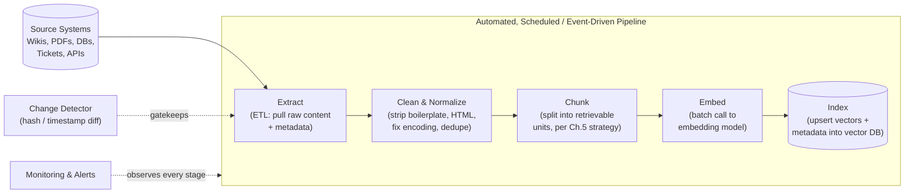
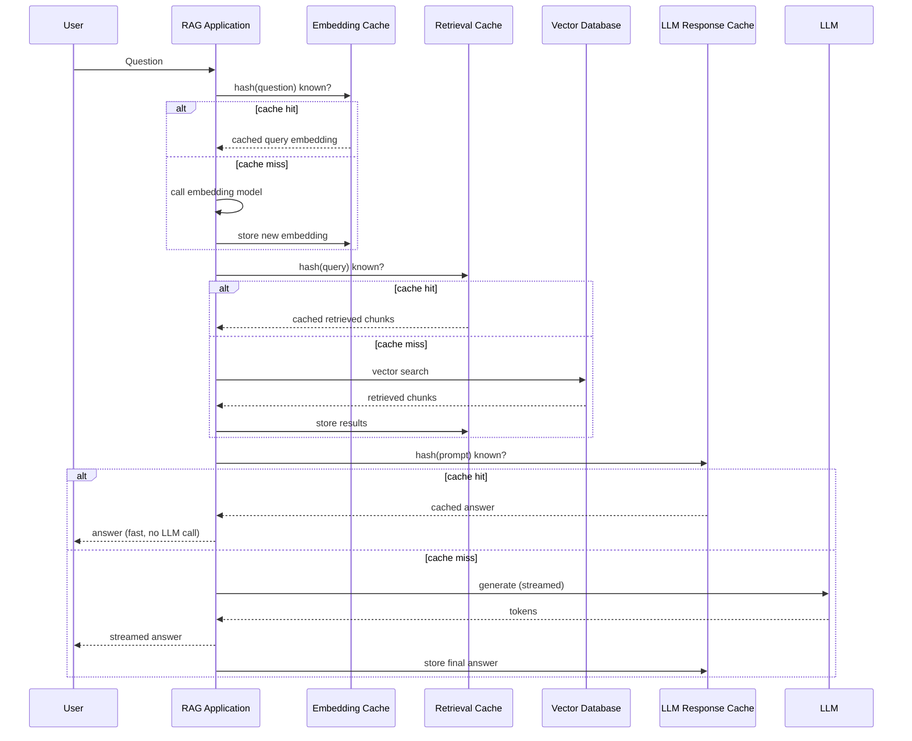

# Production RAG Systems

## Learning Objectives

By the end of this chapter, you will be able to:

- Explain why a "working RAG demo" and a "production RAG system" are fundamentally different engineering problems, not just a matter of scale
- Design a repeatable, automatable, monitorable data pipeline (Source → ETL → Cleaning → Chunking → Embedding → Index) instead of a one-off ingestion script
- Implement incremental indexing so that adding, updating, or deleting a handful of documents doesn't require re-embedding an entire corpus
- Choose the right caching layer (embedding cache, LLM response cache, retrieval cache) for a given cost/latency problem, and explain what each one actually caches
- Explain why streaming the LLM's answer matters for perceived latency, even when total generation time is unchanged
- Identify the metrics a production RAG system must monitor — latency by stage, retrieval quality drift, token cost, and failure rates — and why each one catches a different class of problem
- Reason about scaling levers: distributed vector databases, GPU inference, and load-balanced/retried LLM calls
- Design access-controlled retrieval (RBAC, metadata filters), encryption, and PII handling so a RAG system cannot leak data it shouldn't

---

## Prerequisites for This Chapter

This chapter assumes you already have a **working RAG pipeline** and are ready to operate it as real infrastructure, not a notebook. Specifically, it builds directly on:

- **[Chapter 6 — Vector Databases](./06-vector-databases.md)** — you should know what an index is, how ANN search (e.g., HNSW) works, and what a vector database client looks like in code. This chapter assumes you can add, query, and delete vectors from one.
- **[Chapter 7 — Building Your First RAG Pipeline](./07-building-your-first-rag.md)** — you should have already built the full "load → chunk → embed → store → retrieve → generate" loop at least once, end to end, even if it was a single script against a handful of documents.
- **[Chapter 8 — Advanced Retrieval Techniques](./08-advanced-retrieval-techniques.md)** — concepts like re-ranking and hybrid search reappear here purely from an operational angle (e.g., "re-ranking needs GPU capacity planning at scale"), so a conceptual grasp of what they do is assumed.

If any of those feel shaky, this is a good moment to revisit them — this chapter will not re-explain what chunking or embedding *is*, only how to run those steps reliably, cheaply, and safely for real users.

---

## 1. Why "It Works on My Laptop" Isn't Production

### 1.1 The Gap, With an Analogy

Think about the difference between a home cook who can make a great dinner for six friends, and a restaurant kitchen that serves two hundred covers a night, every night, without ever poisoning a guest, running out of ingredients, or making someone wait ninety minutes for a salad. The recipes might be identical. Almost everything else is not: the home cook buys ingredients once and improvises; the restaurant has supplier contracts, inventory tracking, health inspections, a ticket system, and a plan for what happens when the walk-in fridge fails at 7 p.m. on a Saturday.

A RAG prototype from Chapters 7–11 is the home-cooked meal: you loaded a folder of PDFs once, chunked them, embedded them, and asked good questions against them. It worked, and it proved the *idea* is sound. Production RAG is the restaurant kitchen: the same core recipe (retrieve, augment, generate), but now wrapped in pipelines, caches, monitoring, redundancy, and access control so it can serve real users, all day, safely, at a cost someone is willing to pay.

### 1.2 What Actually Changes

| Dimension | Prototype | Production |
|---|---|---|
| Data ingestion | Run a script once against a static folder | An automated, scheduled/event-driven pipeline that handles new, updated, and deleted documents forever |
| Re-indexing | Re-embed everything, every time, because the corpus is small | Incremental — only touch what changed, because the corpus is large and growing |
| Cost | Nobody's watching the API bill | Every embedding call, retrieval, and LLM token is tracked and budgeted |
| Latency | "It answered in a few seconds, good enough" | End-to-end and per-stage latency is measured, has SLOs, and is optimized under load |
| Failure handling | An exception crashes the script; you fix it and rerun | Retries, backoff, fallbacks, and alerts — the system degrades gracefully instead of crashing for a user mid-conversation |
| Access control | Everyone who runs the script sees everything | Different users must see only what they're authorized to see — enforced at retrieval time, not just in the UI |
| Observability | `print()` statements | Structured logs, traces, dashboards, and alerting across every stage of the pipeline |

This chapter walks through each row on the "Production" side. None of it replaces what you built in Chapters 6–11 — it wraps around it.

---

## 2. The Production Data Pipeline

### 2.1 From Script to Pipeline

In Chapter 7, ingestion probably looked like: open a folder, loop over files, chunk, embed, insert into the vector store, done. That's fine for 50 static files you control. It falls apart the moment:

- New documents arrive continuously (support tickets, new wiki pages, uploaded contracts)
- Existing documents get edited (a policy update, a corrected figure)
- Documents get deleted or become access-restricted
- The corpus grows from thousands to millions of chunks
- More than one person or team needs to trigger, monitor, and debug ingestion

The fix is to treat ingestion as a **pipeline** — a defined sequence of stages, each with clear inputs/outputs, that can be run automatically (on a schedule, or triggered by an event like "file uploaded"), retried on failure, and monitored independently.

### 2.2 The Six Stages

Walking through each stage, and *why* it exists as a distinct step rather than being folded into the next one:

1. **Source** — the systems of record: a Confluence wiki, an S3 bucket of PDFs, a ticketing system's API, a database table, a CMS. Each source typically needs its own connector, its own auth, and its own way of enumerating "what exists" and "what changed since last time."

2. **Extract (ETL)** — pull raw content *and* its metadata (author, last-modified date, source URL, access permissions, document ID) out of the source system. This is kept separate from cleaning because extraction failures (a connector timeout, an API rate limit) are operational problems, while cleaning failures are data-quality problems — you want to be able to tell which one broke without digging through one giant function.

3. **Clean & Normalize** — strip HTML tags, navigation boilerplate, headers/footers, fix character encoding issues, de-duplicate near-identical content, and normalize whitespace. Garbage in a chunk becomes garbage a user might read verbatim in an answer — this stage is where you prevent that.

4. **Chunk** — apply the chunking strategy you chose in Chapter 5 (fixed-size, recursive, semantic, parent-child, etc.). Kept as its own stage because you will change chunking strategy far more often than you change your source connectors, and you don't want to re-write extraction logic every time you tune chunk size.

5. **Embed** — call the embedding model (Chapter 4) in batches. Batching matters enormously here: embedding one chunk at a time over the network is dramatically slower and more expensive than sending a few hundred at once.

6. **Index** — upsert (update-or-insert) the resulting vectors and their metadata into the vector database (Chapter 6). "Upsert" rather than "insert" is deliberate — it's what makes updates to existing documents work cleanly instead of creating duplicates.

### 2.3 Why This Must Be a *Pipeline*, Not a Script

A script runs once when a human remembers to run it. A pipeline:

- **Runs automatically** — on a schedule (e.g., nightly) or triggered by an event (e.g., a webhook when a document is edited)
- **Is idempotent** — running it twice on the same input produces the same result, not duplicate chunks
- **Is observable** — each stage emits metrics/logs so you can see where it slowed down or failed (Section 5)
- **Retries transient failures** — a single API timeout during embedding shouldn't fail the whole nightly run
- **Is composed of independently testable stages** — you can unit-test "does cleaning correctly strip HTML" without needing a live vector database

In practice, teams implement this with workflow orchestration tools (e.g., Airflow, Dagster, Prefect, or simpler cron + queue setups), but the tool matters far less than the discipline of having these six distinct, monitorable stages.

---

## 3. Incremental Indexing

### 3.1 The Problem With Re-Embedding Everything

Imagine your knowledge base is 2 million document chunks. Every night, five new support tickets get resolved and added to the corpus. If your ingestion pipeline's answer to "how do I update the index" is "re-run extraction, cleaning, chunking, and embedding for *everything*, then rebuild the index," you are:

- Paying to re-embed 2 million chunks that haven't changed, to pick up 5 new ones — a massive, unnecessary cost given embedding APIs are billed per token
- Taking however long that full re-embedding job takes (potentially hours) before new content is even searchable
- Risking a fragile, all-or-nothing job — if it fails 90% of the way through, you've wasted most of a very expensive run

This is the RAG equivalent of repainting an entire house every time one wall gets a scuff.

### 3.2 The Fix: Detect What Changed, Touch Only That

Incremental indexing means your pipeline's first real job, every run, is answering three questions:

1. **What's new?** — documents that exist in the source but not yet in your index
2. **What changed?** — documents that exist in both, but whose content differs from what you last indexed
3. **What's gone?** — documents that were indexed before but no longer exist (or are no longer accessible) in the source

Only documents falling into buckets 1 and 2 get re-chunked and re-embedded. Bucket 3 gets its vectors deleted from the index. Everything else is left untouched.

### 3.3 How to Detect Changes

Two complementary techniques, and why you often want both:

- **Content hashing** — compute a hash (e.g., SHA-256) of each document's normalized content (and store it alongside the chunk metadata in your index or a separate tracking table). On the next pipeline run, re-hash the current source content and compare. If the hash matches, skip it entirely — even if a "last modified" timestamp changed for unrelated reasons (e.g., a file got re-saved with no actual content change, or a CMS bumped a metadata field). Hashing is the more *reliable* signal because it reflects actual content, not system bookkeeping.
- **Last-modified timestamps** — most source systems (file systems, databases, wikis, ticketing APIs) expose a `last_modified` or `updated_at` field. Comparing against the timestamp recorded at last successful indexing lets you cheaply filter "candidates that might have changed" *before* paying the cost of fetching and hashing full content. This is the more *efficient* signal — an API call that returns "here are the 12 documents modified since timestamp X" is far cheaper than downloading and hashing your entire corpus every run.

A practical pattern: use timestamps to cheaply narrow down a candidate set, then use content hashing on that smaller set to confirm real changes before doing the expensive chunk/embed work. Maintain a small metadata store (a simple database table is enough) that maps `document_id → last_seen_hash, last_indexed_at, chunk_ids[]`, so deletions and updates can find and remove the exact stale vectors by ID.

### 3.4 Handling Updates and Deletes Correctly

- **Update**: when a document's hash changes, delete its *old* chunks from the vector index (using the stored `chunk_ids`) before inserting new ones. Skipping the delete step is a common bug that leaves stale, outdated chunks permanently mixed into search results alongside the new ones — the retriever ends up returning both the old and new policy wording, and the LLM has no way to know which is current.
- **Delete**: when a document disappears from (or becomes inaccessible in) the source system, its chunks must be actively removed from the vector index. An index that only ever grows, never shrinks, will keep surfacing content for documents that were deleted for a reason — including, in the worst case, documents removed specifically *because* they contained something sensitive or incorrect.

### 3.5 Why This Matters More as Scale Increases

At a hundred documents, brute-force full re-indexing is annoying but tolerable. At a million documents growing by hundreds per day, it is simply not viable — the cost and latency scale with total corpus size instead of with the size of the *change*, which is the wrong axis to scale on. Incremental indexing is what makes "500 new documents a day forever" an operationally boring, routine event instead of a nightly fire drill (you'll design exactly this scenario in this chapter's Hands-On Exercise).

---

## 4. Caching Strategies

Caching is the single highest-leverage production optimization in RAG: it directly cuts both **cost** (fewer paid API calls) and **latency** (skip work you've already done). There are three distinct caches worth understanding, because they cache different things, at different stages, for different reasons.

### 4.1 Embedding Cache

**What it caches**: the embedding vector produced for a given piece of text, keyed by (a hash of) that exact text plus the embedding model/version used.

**Why it saves cost/latency**: the same text often gets embedded more than once — a document that gets re-processed by a pipeline re-run before its content actually changed, a query paraphrase seen before, or overlapping chunks (common with sliding-window chunking from Chapter 5) that share large spans of duplicate text. Every one of those is a paid API call and a network round-trip you don't need to repeat if you've already embedded that exact text with that exact model. An embedding cache is typically a simple key-value store (Redis, or even a local disk cache for smaller deployments) mapping `hash(text + model_id) → vector`.

**A subtlety**: the cache key must include the embedding model identifier/version. Embeddings from different models (or even different versions of the same model) are not interchangeable or comparable — caching without model-awareness will silently serve stale-format vectors after a model upgrade.

### 4.2 LLM Response Cache

**What it caches**: the final generated answer, keyed by (a hash of) the full prompt sent to the LLM — which typically includes the user's question *and* the retrieved context that was assembled for it.

**Why it saves cost/latency**: LLM generation is usually the most expensive and slowest stage in the entire RAG request. If many users ask an identical or near-identical question (extremely common in customer support — "how do I reset my password" gets asked constantly) and it resolves to the same retrieved context, there's no need to pay for and wait on a fresh generation each time; serve the cached answer instead.

**A subtlety**: exact-match caching (identical prompt string) is safe but only catches literal duplicates. Some teams add *semantic* caching — cache lookups based on embedding similarity of the question, not exact text — to catch paraphrases ("How do I reset my password?" vs. "I forgot my password, help") too. Semantic caching adds power but also risk: two questions can be semantically close in embedding space yet require materially different answers (e.g., differing by a critical detail like an account type or region), so semantic response caches need a conservative similarity threshold and are usually paired with a freshness/TTL (time-to-live) policy so stale answers don't linger indefinitely, especially for content that changes.

### 4.3 Retrieval Cache

**What it caches**: the set of retrieved chunks (the vector search *results*, not the final generated answer) for a given query, keyed by the query (or its embedding).

**Why it saves cost/latency**: vector search itself has a cost — especially at scale, with large indexes, hybrid search, or re-ranking steps (Chapter 8) layered on top. Popular queries (top FAQs, common product questions) hit the retriever repeatedly. Caching retrieval results skips the search-and-rerank work while still letting each request go through **fresh generation** — which is useful when you want to save retrieval cost/latency but still want the LLM to phrase, summarize, or adapt its answer per request (e.g., incorporating conversation history) rather than always returning an identical canned response.

### 4.4 Where Each Cache Sits in the Request Flow

Each cache layer is an independent opportunity to short-circuit work — a request can hit none, some, or all three caches, and each hit removes one of the most expensive parts of the pipeline (an embedding call, a vector search, or a full LLM generation).

---

## 5. Streaming: Why Perceived Latency Matters

### 5.1 The Problem

Generation from an LLM is not instantaneous — a multi-paragraph answer might take several seconds to fully generate, especially with a large context assembled from retrieved chunks. If your application waits for the *entire* answer before showing anything to the user, the user stares at a blank screen or a spinner for the whole duration.

### 5.2 The Fix: Stream Tokens as They're Generated

Nearly every major LLM API supports **streaming**: instead of returning one complete response at the end, the API sends the answer back token-by-token (or in small chunks) as it's generated, and your application forwards each piece to the user's screen immediately — exactly like watching ChatGPT or Claude's web interface "type" an answer in real time.

**Why this matters even though total generation time is unchanged**: this is entirely about *perceived* latency, and perceived latency is what users actually experience and judge. A user who sees the first words of an answer appear after 400ms feels the system is responsive, even if the full answer takes 6 seconds to finish streaming — versus a user staring at nothing for 6 seconds and then having the whole answer appear at once, which feels sluggish and makes people wonder if something broke. In a RAG chat interface specifically, streaming also lets a user start reading (and potentially get the gist of the answer) before generation completes, and lets them visually confirm the system is "working" rather than stuck.

### 5.3 What Streaming Interacts With

- **LLM response caching** (Section 4.2): a cached response can either be streamed back artificially (simulating the token-by-token feel for consistency) or returned instantly as a single block — a UX decision, not a technical constraint.
- **Citations**: if your prompt design (Chapter 9) asks the model to emit citations inline or as structured output at the end, streaming needs to handle partial/incomplete structured output gracefully until the stream finishes — a common integration detail that's easy to overlook.
- **Retrieval must still finish first**: streaming only applies to the *generation* stage. The user still waits for embedding + retrieval (and any re-ranking) to complete before the first generated token can appear, which is exactly why retrieval latency (Section 6) is worth optimizing independently.

---

## 6. Monitoring and Observability

### 6.1 Why This Is Not Optional

A prototype fails visibly — you're staring at the terminal when it breaks. A production system fails silently, at 2 a.m., for a subset of users, in a way nobody notices until a customer complains. Monitoring is what converts silent failures into visible, actionable alerts, and what tells you whether the system is *slowly degrading* (retrieval quality drifting down, costs creeping up) long before it looks broken.

### 6.2 What to Track, and Why

**Latency — end-to-end and per-stage**

- Track total request latency (question in → answer fully delivered), but also break it down by stage: embedding the query, vector search, re-ranking (if used), and LLM generation.
- *Why per-stage matters*: "the app feels slow" is not actionable. "Retrieval latency p95 jumped from 80ms to 900ms after last week's index growth" is — it tells you exactly where to look (Section 7.1, sharding) and rules out the LLM provider as the cause.

**Retrieval quality over time (drift detection)**

- Periodically re-run a fixed set of benchmark queries (with known good/expected chunks — this connects directly to the evaluation methodology of Chapter 13) and track whether the same queries keep retrieving the same *quality* of relevant chunks over time.
- *Why it matters*: retrieval quality can silently degrade — a source document changes and the old, better-matching chunk gets replaced with something worse; a re-embedding job introduces a model-version mismatch (Section 4.1's subtlety); new noisy documents dilute the index. Without tracking this over time, quality decay looks identical to "everything is fine" until users start complaining that answers got worse.

**Token usage and cost**

- Log tokens consumed per request, broken down by embedding calls vs. LLM input tokens (largely driven by how much retrieved context you stuff into the prompt) vs. LLM output tokens.
- *Why it matters*: RAG costs scale with usage in ways that are easy to lose track of — a change that seems harmless (retrieving 3 more chunks "just to be safe") can meaningfully increase per-query cost across millions of queries. Cost tracking turns "why did the API bill triple" into "chunk count per query went up 40% after last Tuesday's deploy."

**Failure rates**

- **Retrieval returning zero (or near-zero) results** — often signals an overly strict metadata filter (Section 7.2), an index that's missing expected content, or a genuinely out-of-scope question.
- **LLM errors and timeouts** — rate limits, provider outages, or requests that exceed context window limits because too much context was assembled.
- **Malformed outputs** — cases where structured output (Chapter 9's citation formats, JSON schemas) fails to parse, which silently breaks any downstream code expecting a clean structure.
- *Why it matters collectively*: each failure type demands a different fix (loosen a filter vs. add retries vs. tighten prompt instructions), so lumping them into one generic "error rate" metric hides the actual problem.

### 6.3 Tooling (A Forward Pointer)

Purpose-built LLM/RAG observability platforms — such as **LangFuse**, **Arize Phoenix**, and **Weights & Biases** (in its LLM-tracing capacity) — exist specifically to capture traces across every stage described above (embedding calls, retrieved chunks, prompts, generations, latencies, costs) in one place, rather than stitching together generic application logs by hand. This chapter introduces *what* to monitor and *why*; **Chapter 18 (Tools & Libraries Landscape)** covers these platforms hands-on, including how to instrument a pipeline to send traces to them.

---

## 7. Scaling Considerations

### 7.1 Distributed Vector Databases

A single-node vector index (fine for the Chroma/FAISS setups from Chapter 6 at prototype scale) eventually hits limits on either **storage** (too many vectors to fit in one node's memory/disk) or **query throughput** (too many concurrent searches for one node to serve with acceptable latency). Production vector databases (Qdrant, Milvus, Pinecone, Weaviate — all introduced in Chapter 6) address this through **sharding**: splitting the index across multiple nodes, where each node holds a subset of the vectors, and a query is distributed to relevant shards (or all of them) and results are merged. This is conceptually the same idea as horizontally scaling any database — you trade some coordination complexity for the ability to scale storage and query capacity by adding more machines instead of a bigger single machine.

### 7.2 GPU Inference

Two stages in the RAG pipeline are computationally heavy neural network inference and benefit enormously from GPU acceleration at volume:

- **Embedding generation** — embedding a handful of chunks on CPU during development is fine; embedding hundreds of thousands of chunks during a bulk re-index, or serving high query-embedding throughput in production, is dramatically faster on GPU hardware, and self-hosted embedding models (as opposed to calling a hosted embedding API) generally require GPU capacity planning to keep latency acceptable under load.
- **Re-ranking** (Chapter 8) — cross-encoder re-rankers are more computationally expensive per comparison than the initial vector search, since they process the query and each candidate chunk together rather than comparing pre-computed vectors. At scale, running a re-ranker over dozens of candidates for every single query is a real compute cost, and GPU inference (or a hosted re-ranking API that manages this for you) is typically necessary to keep re-ranking latency acceptable.

### 7.3 Load Balancing Across LLM Endpoints, Rate Limits, and Retries

Any hosted LLM API enforces **rate limits** (requests per minute, tokens per minute) and will occasionally have transient errors or elevated latency. A production system needs to handle this as a normal operating condition, not an exceptional crash:

- **Load balancing across endpoints/providers** — routing requests across multiple API keys, deployment regions, or even multiple LLM providers, so no single rate limit becomes a hard ceiling on your whole system's throughput, and so a single provider's outage doesn't take your entire product down.
- **Retries with exponential backoff** — when a request fails transiently (a rate-limit response, a momentary timeout), retry it after a short delay that increases with each subsequent failure (e.g., 1s, 2s, 4s, 8s), rather than either giving up immediately or hammering the API with immediate retries that make the rate-limit situation worse.
- **Graceful degradation** — if the primary LLM is unavailable after retries, a well-designed system can fall back to a secondary model/provider, or at minimum fail with a clear, honest message to the user instead of hanging indefinitely or silently returning nothing.

---

## 8. Security Considerations

This is the section where a "leaky demo" and a "trustworthy production system" diverge most sharply — and where mistakes are hardest to notice, because a RAG system with a security flaw often looks and behaves completely normally, right up until it doesn't.

### 8.1 RBAC (Role-Based Access Control) in Retrieval

**The core principle**: retrieval must enforce the **exact same permissions** as the source systems the documents came from. If a document was only visible to the Finance team in the source wiki, it must be impossible for anyone outside Finance to retrieve chunks of it through the RAG system — full stop.

**Why this is easy to get wrong**: a naive RAG build often treats the vector index as one big, flat, shared pool of chunks. Once documents from multiple permission levels are embedded into that single pool, *the retriever has no inherent awareness of who is allowed to see what* — vector similarity search only knows about semantic closeness, not authorization. If access control is only enforced in the UI (e.g., "we just don't show a link to that document in the front end"), a user's question can still cause a restricted chunk to be retrieved and pasted directly into the LLM's context — and depending on the prompt and model, that content can leak straight into the generated answer, defeating the entire point of the permission system.

**The fix**: enforce permissions **at retrieval time**, not just in the UI, using one (or both) of:

- **Metadata filtering** — tag every chunk with metadata capturing its access requirements (e.g., `allowed_roles: ["finance", "exec"]`, `department: "legal"`, `sensitivity: "confidential"`), and apply a filter *as part of the vector search itself* — most vector databases support combining a similarity search with a metadata filter (e.g., "search only among vectors where `allowed_roles` includes the requesting user's role"). This ensures restricted chunks are never even returned as candidates, rather than being returned and then hopefully discarded downstream.
- **Per-user or per-tenant indexes** — in stricter multi-tenant setups, maintain fully separate indexes (or index partitions) per tenant/organization, so there is no shared vector space at all between customers who should never see each other's data. This is more operationally heavy but eliminates an entire category of cross-tenant leak risk by construction.

The guiding rule: **the retriever should be incapable of returning something the requesting user isn't authorized to see** — not merely unlikely to, and not reliant on a downstream prompt instruction like "don't mention confidential information," which the LLM has no reliable way to enforce since it doesn't independently know what's confidential once it's already in its context.

### 8.2 Encryption at Rest and in Transit

- **Encryption in transit** — all traffic between your application, the embedding API, the LLM API, and the vector/document stores should run over TLS (HTTPS), so data isn't readable if intercepted on the network.
- **Encryption at rest** — the vector database and any document store holding raw source content should encrypt stored data on disk, so a compromised disk/backup doesn't directly expose plaintext documents or (depending on the embedding model's invertibility properties) reconstructable representations of sensitive content.

Most managed vector database and cloud storage providers offer this by default or as a straightforward configuration option — the responsibility here is largely to *verify it's actually enabled*, especially for self-hosted deployments, rather than to build it yourself.

### 8.3 PII Masking and Redaction

Personally Identifiable Information (PII — names, emails, phone numbers, government ID numbers, addresses, and similar data that can identify a specific individual) shows up constantly in real-world source documents: support tickets, contracts, HR records, chat transcripts.

Two distinct moments where PII handling matters, and why they're different:

- **Before indexing** — if PII doesn't need to be retrievable/answerable (e.g., a customer's home address is irrelevant to answering "what's our return policy"), redact or mask it during the cleaning stage (Section 2.2) so it never enters the vector index at all. This limits the "blast radius" of any future retrieval/access-control mistake — data that was never indexed can't be leaked through the RAG system.
- **Before sending context to a third-party LLM API** — even if PII legitimately needs to be retrieved (e.g., an internal support agent tool that needs a customer's account details to help them), consider whether that PII must be sent to a *third-party* LLM API verbatim, versus masked/tokenized before the API call and re-inserted into the final answer afterward. This matters because sending raw PII to an external provider's API introduces a data-sharing and compliance surface (data processing agreements, regional data residency rules, regulations like GDPR/HIPAA depending on your domain) that many organizations need to minimize deliberately, not by accident.

PII handling is a policy decision as much as a technical one — the "right" amount of masking depends on your regulatory environment, your LLM provider's data handling terms, and what the use case genuinely requires. The engineering job is making sure that decision is enforced automatically and consistently by the pipeline, rather than depending on every document being manually pre-screened by a human before ingestion.

---

## 9. Real-World Scenario

**The setup**: An enterprise software company builds an internal "Ask HR" RAG assistant on top of the company's HR wiki, benefits documents, and internal policy PDFs, so employees can ask things like "How many parental leave days do I get?" or "What's the process for a performance improvement plan?" It launches to strong early reviews — fast, accurate, well-cited answers.

**What went wrong**: The HR wiki has always had proper permissions — most pages are visible to all employees, but a subset (individual disciplinary records, specific executive compensation details, ongoing legal-sensitive HR cases) are restricted to HR staff and legal counsel only. When the RAG team built the ingestion pipeline, they pulled *all* pages from the wiki space via an admin API key (the simplest way to get complete content for indexing) and embedded everything into one shared vector index, without carrying the wiki's page-level permission metadata into the index at all. The application's front end correctly hid restricted *pages* from the wiki's normal browsing view for regular employees — but the RAG assistant's retriever had no concept of "this chunk came from a restricted page." A regular employee, asking a broad question like "what disciplinary actions has the company taken recently for policy violations," got back an answer synthesizing specific, real details from confidential disciplinary records that they were never authorized to see. The system wasn't hacked — it worked exactly as built. The access control had simply never been extended past the wiki's own UI into the retrieval layer that now sat in front of the same underlying data.

**The fix**: The team re-architected ingestion to (1) pull each page's permission metadata (allowed roles/groups) from the wiki API alongside its content, (2) store that metadata on every resulting chunk in the vector index, (3) apply a metadata filter at query time so vector search only considers chunks whose `allowed_roles` include the requesting employee's role — enforced in the retrieval call itself, not as a post-hoc check on the answer — and (4) added an explicit test suite (part of the evaluation practice covered in Chapter 13) that runs known restricted-content queries as a low-privilege test user and asserts zero relevant chunks are ever returned. They also added monitoring (Section 6) alerting on any retrieval request whose result set included chunks tagged above the requester's clearance, as a defense-in-depth backstop in case a future pipeline change reintroduced the gap.

**The lesson**: retrieval is a new access path into your existing data, and it must inherit every permission the original source system enforced — not just re-implement whatever the team remembered to carry over. "The UI hides it" is not access control; the retriever returning it at all is the actual point of failure, because anything retrieved can end up quoted, paraphrased, or summarized into a generated answer.

---

## 10. Best Practices

- Build ingestion as an automated, monitored pipeline from the start — don't let "just run the script when we remember" become a permanent process.
- Implement incremental indexing (content hashing + timestamp filtering) before your corpus grows large enough that full re-indexing becomes a genuine cost or latency problem — retrofitting this later is harder once operational habits form around full re-indexing.
- Layer all three caches (embedding, retrieval, LLM response) where usage patterns support them, but always version cache keys by model/prompt-template identity so a model or prompt upgrade can't silently serve stale results.
- Stream LLM output by default in any user-facing chat interface — it is close to a pure UX win with minimal downside.
- Track latency, retrieval quality, cost, and failure rates as four *separate* metric families, not one blended "health score" — each catches a distinct failure mode.
- Enforce access control as metadata filters (or index partitioning) inside the retrieval call itself — never rely on a prompt instruction or a UI-layer restriction as your only safeguard.
- Treat PII redaction policy as a deliberate, documented decision made once at the pipeline level, applied consistently — not a per-document judgment call left to whoever uploads content.
- Plan for LLM API failures as a normal condition (retries with backoff, multiple endpoints/providers) rather than an exceptional case that only gets handled after the first outage.

## 11. Common Mistakes

- Re-embedding the entire corpus on every ingestion run "because it's simpler," until corpus size makes that simplicity extremely expensive and slow.
- Forgetting to delete stale chunks when a source document is updated or removed, leaving outdated or retracted content permanently retrievable.
- Building a single shared vector index across multiple permission levels or tenants with no metadata-based access filtering — the exact failure in Section 9's scenario.
- Treating "the front end doesn't show a link to it" as equivalent to "the retriever can't return it" — these are not the same guarantee.
- Caching LLM responses without a freshness/TTL policy, so a cached answer keeps being served long after the underlying document (and thus the correct answer) has changed.
- Sending full, unmasked PII to third-party LLM APIs by default, without evaluating whether the use case actually requires it or whether local masking/tokenization would suffice.
- Having no per-stage latency breakdown, so a slowdown anywhere in the pipeline gets reported (and debugged) as a vague "the app feels slow" rather than pointed at the actual stage responsible.
- Assuming rate limits and transient LLM API errors "won't really happen" and shipping without retries, backoff, or a fallback path.

## 12. Summary

Taking RAG from prototype to production is not primarily about handling more traffic — it's about wrapping the retrieve-then-generate core you built in Chapters 6–11 with the operational infrastructure that makes it repeatable, affordable, observable, and safe to expose to real users. That means treating ingestion as an automated pipeline (Source → ETL → Cleaning → Chunking → Embedding → Index) rather than a script, indexing incrementally by detecting changed content through hashing and timestamps instead of re-embedding everything, and layering embedding/retrieval/LLM-response caches to cut both cost and latency. It means streaming generated answers for better perceived responsiveness, and monitoring latency per stage, retrieval quality drift, token cost, and failure rates so degradation is caught before users notice. At scale, it means distributing the vector index across nodes, using GPU inference for embedding and re-ranking, and load-balancing LLM calls with retries and backoff. And critically, it means treating security as a first-class design constraint — enforcing the same access permissions at retrieval time that exist in your source systems, encrypting data at rest and in transit, and deliberately handling PII before it ever reaches an index or a third-party API. This is the chapter where "demo RAG" becomes "professional RAG" — the next chapter, Evaluation & Testing, gives you the rigorous methodology to prove, continuously, that the production system you've just designed is actually working well.

---

## Knowledge Check

1. Explain why incremental indexing (content hashing plus last-modified timestamps) becomes necessary as a corpus grows, and describe what happens to cost and latency if a production pipeline always re-embeds the entire corpus instead.
2. Describe the difference between an embedding cache, an LLM response cache, and a retrieval cache — what does each one store, and give a scenario where one would produce a cache hit but another would not.
3. Why does streaming the LLM's answer improve a user's experience even when the total time to generate the full answer is unchanged?
4. Name the four categories of production metrics discussed in this chapter (latency, retrieval quality, cost, failure rates) and, for each, give one specific signal you'd watch for and what it would tell you.
5. Why is enforcing access control only in the application's UI insufficient for a RAG system, and where must permission checks actually be enforced instead?
6. A vector database node is running out of both memory and query capacity as your corpus and user base grow. Name the scaling technique introduced in this chapter that addresses this, and explain the underlying idea in one or two sentences.

## Hands-On Exercise

**Scenario**: Your company's knowledge base receives roughly **500 new or updated documents per day** (support tickets, contracts, and internal wiki edits combined), on top of an existing corpus of several million already-indexed chunks. Design — on paper, in this markdown file or your notes — an incremental indexing strategy with a caching layer. You do not need to write executable code; a clear, well-reasoned design is the goal.

Your design should address:

1. **Change detection**: For each of the three source types (support tickets, contracts, wiki edits), decide whether you'd rely primarily on last-modified timestamps, content hashing, or both, and justify the choice per source type. (Hint: consider how each source system exposes "what changed" — does it have a reliable `updated_at` field? Does it emit change events/webhooks?)

2. **Pipeline trigger**: Would you run this as a scheduled batch job (e.g., nightly), an event-driven pipeline (triggered per document change), or a hybrid? Justify your choice given 500 documents/day is a fairly steady, moderate volume rather than a bursty one.

3. **Update and delete handling**: Sketch, in plain steps, what happens to a document's *old* chunks when that document is edited, and what happens when a document is deleted from the source. Be specific about what gets deleted from the vector index and when.

4. **Caching layer**: Specify which of the three caches from Section 4 (embedding, LLM response, retrieval) you'd deploy for this system, and for each one you include, state: what gets cached, the cache key, and a reasonable invalidation/TTL policy.

5. **Metadata for access control**: List at least three metadata fields you'd attach to every chunk at indexing time to support both incremental indexing (tracking what's been indexed) and RBAC-aware retrieval (Section 8.1).

6. **One metric per pipeline stage**: For the six-stage pipeline in Section 2.2 (Extract, Clean, Chunk, Embed, Index — treating Source as the input, not a stage you instrument), name one metric you'd monitor at each stage and what a bad value would tell you.

There is no single correct answer — the goal is to demonstrate you can reason concretely about volume, change detection, caching trade-offs, and access control together, the way a production system design review would expect.

## Further Reading

- LangFuse documentation — langfuse.com/docs — open-source LLM/RAG observability and tracing (previewed here, covered hands-on in Chapter 18)
- Arize Phoenix documentation — docs.arize.com/phoenix — open-source ML/LLM observability with RAG-specific tracing views
- Weights & Biases Weave / LLM tracing documentation — wandb.ai — experiment tracking extended to LLM call tracing
- Qdrant documentation on distributed deployment and sharding — qdrant.tech/documentation
- Redis documentation on caching patterns — redis.io/docs — widely used as the key-value store underlying embedding/response caches
- OWASP guidance on LLM application security (covers PII handling, access control, and prompt-injection-adjacent risks) — owasp.org (OWASP Top 10 for LLM Applications)
- Cloud provider documentation on encryption at rest and in transit for your chosen vector database/hosting provider (AWS, GCP, or Azure security documentation, as applicable)

---

  <a href="./11-query-transformation.md">← Previous: Query Transformation</a>
  <a href="./00-index.md">🏠 Index</a>
  <a href="./13-evaluation-and-testing.md">Next: Evaluation & Testing →</a>

