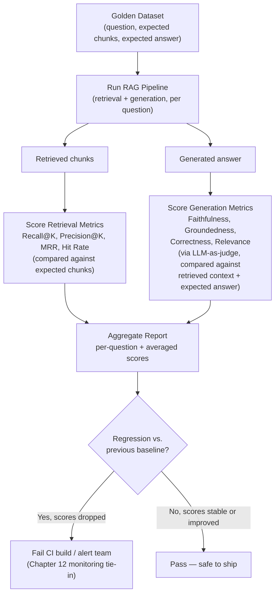

# Evaluation & Testing

Chapter 12 turned your RAG pipeline into a production system: caching, streaming, monitoring, scaling, security. But monitoring dashboards from Chapter 12 tell you *that* something changed (latency spiked, error rate crept up) — they don't tell you whether your system is actually **good at answering questions**, or whether it just got worse the moment someone swapped in a new embedding model. That's a different, harder question, and it's the subject of this chapter.

Evaluation is the discipline of measuring RAG quality rigorously enough that you can answer three questions with confidence: Is this system good enough to ship? Did this change make it better or worse? And when it fails, which half of the pipeline — retrieval or generation — is to blame? Without a real evaluation practice, teams end up "eyeballing" a handful of outputs, feeling good about them, shipping, and finding out three weeks later from angry users that quality quietly collapsed. This chapter builds you the tools to never be that team.

---

## Learning Objectives

By the end of this chapter, you will be able to:

- Explain why evaluating a RAG system is fundamentally harder than evaluating a typical classifier or regression model, and why it requires *two* separate sets of metrics.
- Compute and interpret the four core retrieval metrics — Recall@K, Precision@K, MRR, and Hit Rate — by hand on a small example.
- Explain the four core generation quality dimensions — faithfulness, groundedness, correctness, and relevance — and articulate how each one can fail independently of the others.
- Describe how a "golden dataset" is built and used, and explain the LLM-as-judge pattern, including its well-documented biases and limitations.
- Compare Ragas, DeepEval, TruLens, and LangSmith by what each is best known for and when you'd reach for it.
- Build a minimal, working evaluation harness that scores both retrieval and generation for a small set of test questions and produces a report.
- Design a continuous evaluation strategy that runs automatically in CI/CD to catch regressions before they reach production.

---

## Prerequisites for This Chapter

This chapter assumes you're comfortable with:

- **Chapter 2 (Core Concepts)** — specifically Section 5, "Retrieval and Generation: Two Separable Concerns, Two Separate Failure Modes." This chapter is, in large part, that section made rigorous and measurable. If you don't remember why "the answer was wrong" is not one diagnosis but two, revisit it before continuing.
- **Chapter 7 (Building Your First RAG Pipeline)** — you should have a working mental model (or an actual working pipeline) of query → retrieval → augmentation → generation, since the evaluation harness in this chapter runs exactly that pipeline end-to-end.
- **Chapter 12 (Production RAG Systems)** — specifically the monitoring and observability concepts. This chapter's closing section on continuous evaluation is a direct extension of Chapter 12's monitoring practice, applied to *quality* metrics instead of *operational* metrics (latency, error rate, cost).

---

## 1. Why Evaluating RAG Is Hard

### 1.1 The "no single ground truth" problem

If you train a model to classify emails as spam or not-spam, evaluation is comparatively easy: for every email, there's one correct label, and you count how often the model matches it. Accuracy, precision, recall — all well-defined, all computed against an unambiguous ground truth.

RAG has no such luxury for most real questions. Ask "How do I reset my password?" and there might be five differently-worded answers that are all completely correct — different phrasing, different level of detail, different order of steps. There is rarely one canonical "correct string" to diff your output against. Worse, many questions asked of a RAG system are open-ended ("Summarize the risks in this contract") where "correct" is a matter of judgment, completeness, and nuance rather than exact match.

This means naive approaches that work for classic ML — exact match, BLEU score, ROUGE score borrowed from machine translation — systematically under- or over-score RAG outputs. A perfectly good answer phrased differently from a reference gets penalized; a subtly wrong answer that happens to share vocabulary with the reference gets rewarded. RAG evaluation needs metrics that judge *meaning* and *support*, not string overlap.

### 1.2 The "two stages, two failure modes" problem

Chapter 2 established this and it's worth restating precisely here, because it's the organizing principle of this entire chapter: a RAG system is **two subsystems glued together** — a retriever and a generator — and each can fail completely independently, while producing the exact same visible symptom (a bad final answer).

Consider two failing runs of the same question, "What is our refund policy for annual plans?":

- **Run A:** The retriever returns chunks about the *monthly* plan refund policy — the annual-plan chunk was never indexed correctly. The generator faithfully summarizes what it was given. The final answer is wrong, but the generator did its job perfectly; the retriever failed.
- **Run B:** The retriever returns exactly the right chunk describing the annual-plan refund policy. The generator, for whatever reason, ignores it and answers from its own (outdated, pre-training) beliefs about typical SaaS refund policies. The final answer is wrong, but the retriever did its job perfectly; the generator failed.

If you only measure "was the final answer correct," Run A and Run B are indistinguishable — both score "wrong." But the fix for Run A is entirely in chunking/embedding/indexing (Chapters 4–6, 8), while the fix for Run B is entirely in prompting or model choice (Chapter 9). **This is precisely why RAG evaluation must produce two separate sets of numbers: retrieval metrics and generation metrics.** A single end-to-end "accuracy" score collapses two different problems into one number and tells you nothing about which one to fix.

### 1.3 The "evaluating natural language at scale" problem

Even once you accept you need separate retrieval and generation metrics, generation metrics like "is this answer faithful to the source?" require reading and judging natural language — something that doesn't reduce to a formula the way Recall@K does. Doing this by hand for every question, every time you change your prompt or your embedding model, does not scale past a few dozen examples. Later in this chapter you'll see the industry's answer to this: use a strong LLM as an automated judge, at scale, while being honest about the limitations of that approach.

Putting it together: RAG evaluation is hard because (1) there's rarely one right answer to check against, (2) failures can originate in either of two independent subsystems that must be measured separately, and (3) judging natural-language quality at scale requires automation that itself needs careful design. The rest of this chapter builds up the concepts and tools to handle all three.

---

## 2. Retrieval Evaluation Metrics

Retrieval metrics answer one question only: **given a query, did the retriever find the right chunks?** They don't care what the generator did with those chunks — that's a separate concern, covered in Section 3. To compute any of these metrics you need to know, for each test query, which chunks are *actually* relevant (this is the "golden dataset," covered in Section 4).

Throughout this section, imagine a golden dataset entry for the query **"What is the maximum file size for uploads?"**, where you (a human, ahead of time) have determined that exactly two chunks in your corpus are truly relevant: `chunk_12` and `chunk_47`. Your retriever, asked this query, returns the following ranked list of five chunks (K=5):

```
Rank 1: chunk_47   (relevant)
Rank 2: chunk_3    (not relevant)
Rank 3: chunk_12   (relevant)
Rank 4: chunk_88   (not relevant)
Rank 5: chunk_5    (not relevant)
```

We'll compute all four metrics against this single example, then generalize to averaging across many queries.

### 2.1 Recall@K

**Intuition:** Of all the chunks that are truly relevant somewhere in your corpus, what fraction did your retriever manage to surface within its top K results? Recall asks "did we find everything we needed?" — it doesn't care about the noise mixed in, only about what got missed.

**Formula:**

```
Recall@K = (number of relevant chunks in top K) / (total number of relevant chunks that exist)
```

**Worked example:** There are 2 truly relevant chunks total (`chunk_12`, `chunk_47`). Both appear in the top 5. So:

```
Recall@5 = 2 / 2 = 1.0  (100%)
```

If the retriever had only surfaced `chunk_47` and not `chunk_12` within the top 5, Recall@5 would be `1/2 = 0.5` — you found half of what you needed, and the generator will never even see the missing half, no matter how good it is.

**When it matters most:** Recall@K is the metric you care about most when *missing* information is costly — e.g., a legal or medical RAG system where failing to surface a relevant clause or contraindication is a serious problem, even if it means tolerating a bit of retrieved noise.

### 2.2 Precision@K

**Intuition:** Of the K chunks you actually retrieved and are about to hand to the generator, what fraction are actually useful? Precision asks "how much noise did we hand over?" — a high-recall, low-precision retriever finds everything relevant but drowns it in irrelevant material, burning context window budget (Chapter 2, Section 2.9) and potentially confusing the generator.

**Formula:**

```
Precision@K = (number of relevant chunks in top K) / K
```

**Worked example:** In the top 5 results, 2 are relevant (`chunk_47` at rank 1, `chunk_12` at rank 3) out of 5 retrieved total:

```
Precision@5 = 2 / 5 = 0.4  (40%)
```

**When it matters most:** Precision@K matters most when context window budget is tight or when irrelevant context measurably degrades the generator's answer quality (a well-documented phenomenon — models can get "distracted" by irrelevant retrieved text, sometimes called the "lost in the middle" or context-dilution problem). If you must retrieve a small K because of latency or cost constraints, precision becomes the metric that tells you how well you're spending that limited budget.

**The Recall/Precision trade-off:** These two metrics pull in opposite directions as you change K. Retrieve more chunks (raise K) and recall goes up or stays flat (you can only find more, never less) while precision typically goes down (you're adding more chances for irrelevant chunks to sneak in). Choosing K is exactly this trade-off, made concrete with numbers instead of gut feeling.

### 2.3 Mean Reciprocal Rank (MRR)

**Intuition:** Recall and Precision treat every position in the top K equally — a relevant chunk at rank 1 counts the same as one at rank 5. But in practice, rank matters enormously: many RAG prompt templates put more weight (explicitly or implicitly, in how the model reads them) on earlier chunks, and if a system with a small K only barely fits the top few chunks, you want the *best* one as close to rank 1 as possible. MRR specifically rewards getting *a* relevant result near the top, fast.

**Formula:** For a single query, the reciprocal rank is `1 / (rank of the first relevant result)`. MRR is the average of this value across all queries in your evaluation set.

```
MRR = (1 / N) * Σ (1 / rank_of_first_relevant_result_for_query_i)
```

**Worked example:** For our query, the first relevant chunk (`chunk_47`) appears at rank 1:

```
Reciprocal Rank for this query = 1 / 1 = 1.0
```

If instead `chunk_47` had appeared at rank 3 (with two irrelevant chunks ahead of it), the reciprocal rank would be `1/3 ≈ 0.33`. If no relevant chunk appeared at all in the top K, the reciprocal rank for that query is defined as 0.

Now imagine you run this over three queries, with first-relevant-hit ranks of 1, 3, and 2 respectively:

```
MRR = (1/1 + 1/3 + 1/2) / 3 = (1.0 + 0.333 + 0.5) / 3 ≈ 0.611
```

**When it matters most:** MRR is especially useful for systems where users typically only care about *one* good answer showing up fast — think of a search-style "did you mean" experience, or a RAG system that only actually uses the top 1-2 chunks in its prompt due to a tight context budget.

### 2.4 Hit Rate (a.k.a. Recall@K at the query level, "Hit@K")

**Intuition:** The simplest, coarsest metric of all: for a given query, did *at least one* relevant chunk show up in the top K, yes or no? It's a binary question per query, then averaged into a percentage across your whole evaluation set. Hit Rate doesn't care how many relevant chunks existed or where in the ranking they landed — only whether the retriever found the needle at all.

**Formula:**

```
Hit Rate@K = (number of queries with at least 1 relevant chunk in top K) / (total number of queries)
```

**Worked example:** Our example query has 2 relevant chunks, and at least one (`chunk_47`) appears in the top 5 — so this query counts as a "hit." If you ran this evaluation over 100 queries and 87 of them had at least one relevant chunk somewhere in their top K, then:

```
Hit Rate@5 = 87 / 100 = 0.87  (87%)
```

**When it matters most:** Hit Rate is the fastest, cheapest sanity check you can compute, and a good "smoke test" metric for CI — a sudden drop in Hit Rate (say, from 90% to 60%) after a chunking or embedding-model change is an unambiguous, easy-to-alert-on red flag, even before you dig into the more nuanced Recall/Precision/MRR numbers.

### 2.5 Choosing which retrieval metrics to track

You rarely need to track only one. A reasonable default for most RAG systems: track **Hit Rate@K** as your headline "did retrieval work at all" number (cheap, easy to alert on), **Recall@K** to catch systematic misses of relevant content, and **MRR** if your generator is sensitive to chunk ordering (most are, to some degree, due to how prompts are constructed — see Chapter 9). Precision@K becomes important specifically when context window or cost constraints force you to keep K small.

---

## 3. Generation Evaluation Metrics

Once you've confirmed (or measured) what the retriever handed the generator, the second half of evaluation asks: **given that context, did the generator produce a good answer?** These four dimensions are not the same question asked four ways — each one can be true while the others are false, which is exactly why RAG evaluation needs all four rather than a single "quality score."

### 3.1 Faithfulness

**Intuition:** Faithfulness asks: does every claim in the generated answer trace back to something actually stated in the retrieved context, with nothing invented or added? Think of it as a strict fact-checker whose only reference material is the context the generator was given — not the real world, not common sense, just "is this claim in the source material or not."

**Example:** Context says *"Our standard shipping takes 3-5 business days."* If the generated answer says *"Standard shipping takes 3-5 business days,"* that's faithful. If it says *"Standard shipping takes 3-5 business days, and expedited shipping is available for an extra fee,"* the second clause is a hallucinated addition — nothing in the context mentioned expedited shipping — so the answer is **unfaithful**, even though the first half is perfectly accurate.

Faithfulness is measured independent of whether the underlying claim is objectively true in the real world — it's purely about "is this claim supported by what was retrieved."

### 3.2 Groundedness

**Intuition:** Groundedness is closely related to faithfulness — so closely that many teams and tools use the two terms interchangeably — but it's worth understanding the nuance: groundedness specifically emphasizes **traceability**, i.e., can each claim be mapped back to a *specific* span or sentence in the retrieved context, not merely "does the overall gist match." Faithfulness is often measured at the level of "is the answer as a whole consistent with the context," while groundedness evaluations often go further and ask for or verify a **citation-level mapping** — this claim came from this exact chunk.

**Example:** An answer states three facts, and a groundedness check would ask, for each of the three individually: which specific sentence in the retrieved context supports this? If claim #2 can't be pinned to any specific passage — even if it "sounds compatible" with the general context — it fails the groundedness check even if a looser faithfulness check might let it slide as "not contradictory."

In practice, treat groundedness as faithfulness's stricter, more auditable sibling: faithfulness asks "is this consistent with the context," groundedness asks "can I point to exactly where."

### 3.3 Correctness

**Intuition:** Correctness asks a completely different question from the previous two: is the answer actually right, according to a known correct (reference) answer — regardless of what the retrieved context said? This is the metric that catches the case from Section 1.2's Run A: a perfectly faithful summary of the *wrong* retrieved chunk is faithful, but it is not correct.

**Example:** If the golden dataset says the correct answer to "What is our refund window?" is "30 days," and the generated answer (faithfully derived from a stale, wrongly-retrieved chunk) says "14 days," that answer is faithful to what it was given but **incorrect** relative to ground truth.

Correctness requires a reference answer to compare against — which is exactly what the "golden dataset" in Section 4 supplies. Without a reference, you can only measure faithfulness/groundedness (internal consistency with context), not correctness (external truth).

### 3.4 Relevance (Answer Relevance)

**Intuition:** An answer can be 100% faithful, 100% grounded, and even 100% factually correct — and still fail the user completely if it doesn't actually address what they asked. Relevance asks the simplest and most user-facing question of all: does this answer respond to the question that was actually asked?

**Example:** User asks, "How do I cancel my subscription?" The retrieved context happens to contain a paragraph about subscription *pricing tiers*, and the generator produces a perfectly faithful, perfectly correct summary of the pricing tiers. Every claim in that answer is true and grounded — and it is completely useless to this user, because it never answers the actual question asked. This is a **relevance failure**, and it's a subtly different failure from the retrieval-vs-generation split in Section 1.2: here, both subsystems technically "worked" (context was accurately summarized), but the overall system still failed the user, often because the *retriever* found topically-adjacent-but-wrong content (recall Chapter 2's warning about confusing "topically related" with "relevant").

### 3.5 Why you need all four, not just one

|  | Can be true while... |
|---|---|
| **Faithfulness** | ...the answer is grounded in a *wrong* retrieved chunk, making it faithful but incorrect |
| **Groundedness** | ...every claim traces to context, but the context itself doesn't answer the user's question (irrelevant) |
| **Correctness** | ...an answer accidentally matches the reference for the wrong reason, or is correct but includes an unsupported extra claim (unfaithful) |
| **Relevance** | ...the answer perfectly addresses the topic while getting a specific number or fact wrong (incorrect) |

A production-grade evaluation reports all four, because a system that is faithful-but-irrelevant, or relevant-but-incorrect, or correct-but-unfaithful (accidentally right, for the wrong, hallucinated reason) are all distinct, differently-actionable problems.

---

## 4. Golden Datasets and LLM-as-Judge

### 4.1 Building a golden dataset

A **golden dataset** is a curated set of test cases that anchors every evaluation run — it plays the same role a labeled test set plays in traditional ML, adapted for RAG's two-stage nature. Each entry typically has three parts:

1. **Question** — a realistic query a real user might ask.
2. **Expected chunk(s)** — the specific chunk ID(s) from your corpus that a good retriever *should* surface for this question (this is what Section 2's Recall@K, Precision@K, etc. are computed against).
3. **Expected answer** — a reference answer, written or approved by a human subject-matter expert, that a good generator's output should match in substance (this is what Section 3's correctness is computed against).

Golden datasets are usually built by a mix of: hand-writing questions that cover known important use cases, mining real user queries from logs (once you have production traffic), and deliberately including edge cases — questions with no good answer in the corpus (to test that the system says "I don't know" rather than hallucinating), ambiguous questions, and questions requiring information from multiple chunks.

A golden dataset doesn't need to be huge to be useful — even 20-50 well-chosen examples that cover your system's important use cases and known edge cases will catch the vast majority of regressions. It does need to be **maintained**: as your corpus changes, expected chunks can go stale (the "right" chunk might get split, merged, or deleted during re-indexing), so golden datasets need periodic review just like the corpus they're built against.

### 4.2 The LLM-as-judge pattern

Computing Recall@K or Hit Rate is pure arithmetic once you know which chunks are relevant — cheap and fully automatable. But faithfulness, groundedness, correctness, and relevance all require *reading and judging natural language*, which doesn't reduce to a formula. Having a human expert read every answer for every test run, every time you tweak a prompt, does not scale.

The industry's answer is **LLM-as-judge**: use a separate, typically very capable LLM, given a careful evaluation prompt, to score the answer against the relevant criteria. For instance, a faithfulness judge prompt might look conceptually like:

> "Here is a retrieved context: [context]. Here is a generated answer: [answer]. List every factual claim in the answer, and for each one, state whether it is directly supported by the context, contradicted by the context, or not mentioned in the context at all. Then give an overall faithfulness score from 0 to 1, where 1 means every claim is supported."

This same pattern — give the judge the question, the context, the answer, and (for correctness) the reference answer, then ask for a structured score with reasoning — generalizes to all four generation dimensions, just by changing what the judge is asked to check.

**Why this works reasonably well:** modern frontier LLMs are quite good at the narrower, more mechanical task of "does claim X appear in text Y" compared to the much harder task of generating a great answer from scratch — judging is generally an easier task than generating, which is part of why LLM-as-judge is viable even using the same class of model that produced the answer.

### 4.3 Known limitations and biases of LLM-as-judge

Treat LLM-as-judge as a powerful, scalable heuristic — not ground truth. Documented failure patterns include:

- **Self-preference bias:** an LLM judge tends to score answers more favorably when they're generated by the same model family or a similar one to itself, and can be harsher on outputs from other model families.
- **Verbosity bias:** judges (like many human evaluators) tend to rate longer, more elaborate-sounding answers as higher quality, even when the extra length adds no real value or introduces unsupported claims.
- **Position/order bias:** in judge prompts that compare two answers side-by-side ("which is better, A or B"), judges show a measurable bias toward whichever answer is presented first (or, in some evaluations, second) — a purely positional artifact unrelated to quality.
- **Inconsistency across runs:** the same judge, given the same input twice, can produce different scores due to sampling randomness, unless you pin the judge's temperature to 0 and even then some variance can remain.
- **Blind spots the judge shares with the generator:** if a judge model has the same knowledge gaps or reasoning weaknesses as the model being evaluated, it can fail to catch subtle errors that require genuine domain expertise to spot.

**Mitigations that matter in practice:** use a strong, ideally different-family model as the judge than the one you're evaluating; write detailed, structured judge prompts that ask for step-by-step reasoning before a final score (rather than a bare number) — this measurably improves judge reliability; periodically spot-check the judge's scores against real human judgment on a sample, treating this like calibrating any measurement instrument; and never treat LLM-as-judge scores as infallible ground truth for high-stakes decisions (e.g., medical, legal, safety-critical domains) without human review in the loop.

---

## 5. Evaluation Frameworks and Tools

You don't need to hand-roll everything from scratch (though Section 6 shows you how, so you understand what's happening under the hood). Several mature tools exist, each with a distinct emphasis.

### 5.1 Ragas

**Best known for:** being the RAG-specific evaluation library — it was built from the ground up around exactly the metrics in Sections 2 and 3: faithfulness, answer relevancy, context precision, and context recall, computed largely via LLM-as-judge under the hood. If your primary need is "give me faithfulness/context-precision/context-recall numbers for my RAG pipeline with minimal setup," Ragas is usually the first tool teams reach for. It integrates well with LangChain and LlamaIndex pipelines (Chapter 1) and works directly against a dataset of question/context/answer/ground-truth tuples — essentially a golden dataset in the shape described in Section 4.1.

### 5.2 DeepEval

**Best known for:** being a general-purpose LLM evaluation framework (not RAG-exclusive) that happens to ship strong RAG-specific metrics (faithfulness, answer relevancy, contextual precision/recall, hallucination detection) alongside broader LLM-quality metrics (toxicity, bias, summarization quality). Its standout feature is deep integration with **pytest** — you write evaluation assertions in the same style as unit tests (`assert_test(test_case, metrics=[...])`), which makes it a natural fit for teams that want RAG evaluation to live directly inside their existing test suite and CI pipeline (tying directly into Section 7 below).

### 5.3 TruLens

**Best known for:** combining **tracing** (recording exactly what happened at each step of a RAG call — what was retrieved, what prompt was constructed, what was generated) with evaluation via customizable **feedback functions** — small scoring functions (which can themselves be LLM-as-judge-based, or classic heuristics) that you attach to a running application to continuously score real or test traffic. TruLens leans toward "observe and score your app as it actually runs," making it a natural pairing with the Chapter 12 monitoring mindset — it blurs the line between offline evaluation and online observability.

### 5.4 LangSmith

**Best known for:** being LangChain's observability and evaluation platform — dataset management (storing and versioning your golden datasets), full request tracing (see every retrieval and generation step, like a debugger for your pipeline), and built-in evaluation runs that can use LLM-as-judge or custom scoring functions against stored datasets. If your stack is already built on LangChain (or LangGraph, covered in Chapter 14), LangSmith is usually the path of least resistance for both tracing production traffic and running structured evaluations against golden datasets, all in one place.

### 5.5 Choosing between them

None of these are mutually exclusive, and many production teams use more than one. A reasonable starting heuristic: reach for **Ragas** if you want RAG-specific metrics fast with minimal framework lock-in; reach for **DeepEval** if you want evaluation to live as literal test-suite assertions in CI; reach for **TruLens** if you want continuous feedback scoring layered onto a running application; reach for **LangSmith** if you're already in the LangChain ecosystem and want unified tracing plus evaluation plus dataset management in one platform.

---

## 6. The Evaluation Pipeline, End to End

Here's how all the pieces from Sections 2-5 fit together into a single repeatable process:



Every box in this diagram maps directly to a section above: the golden dataset (Section 4.1), running the actual pipeline (which is the same pipeline built in Chapter 7), scoring retrieval (Section 2) and generation (Section 3, via LLM-as-judge from Section 4.2) independently, and finally comparing against a baseline to catch regressions (Section 7).

---

## 7. Building a Practical Evaluation Harness

Let's build a minimal, working evaluation harness from scratch — hand-rolled rather than using a framework, so you understand exactly what a tool like Ragas is doing internally. This example evaluates a tiny golden dataset of 3 questions against a RAG pipeline, scoring both halves independently and producing a simple report.

### 7.1 The golden dataset

```python
golden_dataset = [
    {
        "question": "What is the maximum file size for uploads?",
        "expected_chunk_ids": {"chunk_12", "chunk_47"},
        "expected_answer": "The maximum upload file size is 25 MB per file.",
    },
    {
        "question": "How long does standard shipping take?",
        "expected_chunk_ids": {"chunk_5"},
        "expected_answer": "Standard shipping takes 3 to 5 business days.",
    },
    {
        "question": "Can I get a refund after 60 days?",
        "expected_chunk_ids": {"chunk_30"},
        "expected_answer": "No, refunds are only available within 30 days of purchase.",
    },
]
```

### 7.2 Retrieval metric scoring functions

These are pure arithmetic — no LLM calls needed — exactly as computed by hand in Section 2.

```python
def recall_at_k(retrieved_ids: list[str], expected_ids: set[str]) -> float:
    if not expected_ids:
        return 1.0
    found = set(retrieved_ids) & expected_ids
    return len(found) / len(expected_ids)


def precision_at_k(retrieved_ids: list[str], expected_ids: set[str]) -> float:
    if not retrieved_ids:
        return 0.0
    found = set(retrieved_ids) & expected_ids
    return len(found) / len(retrieved_ids)


def reciprocal_rank(retrieved_ids: list[str], expected_ids: set[str]) -> float:
    for rank, chunk_id in enumerate(retrieved_ids, start=1):
        if chunk_id in expected_ids:
            return 1.0 / rank
    return 0.0


def hit(retrieved_ids: list[str], expected_ids: set[str]) -> bool:
    return len(set(retrieved_ids) & expected_ids) > 0
```

### 7.3 Generation metric scoring via LLM-as-judge

This is a simplified but structurally faithful version of what Ragas/DeepEval do internally: send a carefully-worded prompt to a judge LLM and parse a structured score back out.

```python
import json

JUDGE_PROMPT_TEMPLATE = """You are a strict evaluator of AI-generated answers. Given the
retrieved context, the generated answer, and (if provided) a reference answer,
score the answer on these dimensions, each from 0.0 to 1.0:

- faithfulness: does the answer ONLY contain claims supported by the context? (1.0 = no unsupported claims)
- relevance: does the answer actually address the question asked? (1.0 = fully on-topic and responsive)
- correctness: does the answer match the reference answer's substance? (1.0 = fully correct; only score
  this if a reference answer is provided)

Question: {question}
Retrieved Context: {context}
Generated Answer: {answer}
Reference Answer: {reference_answer}

Respond ONLY with valid JSON in this exact format:
{{"faithfulness": <float>, "relevance": <float>, "correctness": <float>, "reasoning": "<short explanation>"}}
"""

def llm_judge_score(question: str, context: str, answer: str,
                     reference_answer: str, judge_llm_call) -> dict:
    prompt = JUDGE_PROMPT_TEMPLATE.format(
        question=question, context=context,
        answer=answer, reference_answer=reference_answer,
    )
    # judge_llm_call is any function wrapping your LLM provider's API,
    # called with temperature=0 for maximum score stability (Section 4.3).
    raw_response = judge_llm_call(prompt, temperature=0)
    return json.loads(raw_response)
```

### 7.4 Running the harness end to end

```python
def run_evaluation(golden_dataset, rag_pipeline, judge_llm_call, k=5):
    results = []

    for case in golden_dataset:
        # Run the actual RAG pipeline (built in Chapter 7) against this question.
        retrieved_chunks = rag_pipeline.retrieve(case["question"], top_k=k)
        retrieved_ids = [c.id for c in retrieved_chunks]
        context_text = "\n\n".join(c.text for c in retrieved_chunks)
        answer = rag_pipeline.generate(case["question"], context_text)

        # Score retrieval (pure arithmetic).
        retrieval_scores = {
            "recall_at_k": recall_at_k(retrieved_ids, case["expected_chunk_ids"]),
            "precision_at_k": precision_at_k(retrieved_ids, case["expected_chunk_ids"]),
            "mrr": reciprocal_rank(retrieved_ids, case["expected_chunk_ids"]),
            "hit": hit(retrieved_ids, case["expected_chunk_ids"]),
        }

        # Score generation (LLM-as-judge).
        generation_scores = llm_judge_score(
            question=case["question"],
            context=context_text,
            answer=answer,
            reference_answer=case["expected_answer"],
            judge_llm_call=judge_llm_call,
        )

        results.append({
            "question": case["question"],
            "retrieval": retrieval_scores,
            "generation": generation_scores,
        })

    return results


def print_report(results):
    n = len(results)
    avg = lambda key, group: sum(r[group][key] for r in results) / n

    print(f"Evaluation Report ({n} questions)\n" + "=" * 40)
    print(f"Retrieval  -> Recall@K: {avg('recall_at_k', 'retrieval'):.2f}  "
          f"Precision@K: {avg('precision_at_k', 'retrieval'):.2f}  "
          f"MRR: {avg('mrr', 'retrieval'):.2f}  "
          f"Hit Rate: {sum(r['retrieval']['hit'] for r in results) / n:.2f}")
    print(f"Generation -> Faithfulness: {avg('faithfulness', 'generation'):.2f}  "
          f"Relevance: {avg('relevance', 'generation'):.2f}  "
          f"Correctness: {avg('correctness', 'generation'):.2f}")

    print("\nPer-question breakdown:")
    for r in results:
        print(f"  Q: {r['question'][:50]}...")
        print(f"     Retrieval: {r['retrieval']}")
        print(f"     Generation: {r['generation']}")
```

This harness is deliberately small, but it is structurally identical to what production evaluation frameworks do: run the pipeline, score retrieval arithmetically against known-good chunks, score generation via LLM-as-judge against context and a reference answer, then aggregate into a report. Everything from here is refinement — bigger datasets, more metrics, caching judge calls, parallelizing runs — not a different architecture.

---

## 8. Continuous Evaluation in CI/CD

Chapter 12 established that production RAG systems need monitoring because things silently degrade — cache poisoning, latency creep, cost spikes. Quality degradation is just as real a risk, and just as silent, but a standard observability dashboard (request rate, latency, error rate) will not catch it, because a RAG system that returns confidently wrong answers doesn't throw an error or spike latency. It just quietly gets worse.

**The fix is to treat your evaluation harness (Section 6/7) as a test suite, not a one-off notebook exercise**, and run it automatically whenever anything that could affect quality changes:

- **A new embedding model is proposed.** Run the harness against both the old and new model side by side, comparing retrieval metrics directly. This is the single most common source of silent regressions (see the Real-World Scenario below) because embedding models can look "better" on general benchmarks while performing worse on your specific corpus and query patterns.
- **The chunking strategy changes** (chunk size, overlap, splitting method — Chapter 5). Chunking changes shift what content lives in which chunk boundary, which can quietly move the "right" answer to a different, worse chunk, or split it across two chunks in a way that hurts retrieval.
- **The prompt template changes** (Chapter 9). A well-intentioned prompt tweak to fix one failure case can regress faithfulness or relevance on others — this is exactly why generation metrics need to run alongside retrieval metrics on every prompt change, not just a manual spot-check of the specific case you were trying to fix.
- **The retrieval algorithm changes** (adding re-ranking, hybrid search, query transformation — Chapters 8, 11). These are supposed to improve retrieval metrics; the harness is what proves it actually happened rather than just seeming to help on the two examples you tried by hand.
- **The underlying LLM (generator) is upgraded or swapped.** Even upgrading to a "better" model version from the same provider can shift instruction-following behavior enough to change faithfulness or relevance in either direction.

A practical CI setup: store your golden dataset and current baseline scores in version control alongside your pipeline code. On every pull request that touches retrieval or generation code, run the evaluation harness, compare the new scores against the stored baseline, and **fail the build** if any metric drops beyond an agreed tolerance (e.g., more than 3 percentage points). This mirrors exactly how a traditional test suite fails a build on a broken unit test — except the "test" here is a quality metric rather than a pass/fail assertion, which is precisely what DeepEval's pytest-style integration (Section 5.2) is designed to make natural.

Once in production, don't stop at pre-deploy CI checks — sample a percentage of real production traffic, run it through the same faithfulness/relevance LLM-as-judge scoring in the background, and feed those scores into the same monitoring/alerting infrastructure from Chapter 12. This closes the loop: pre-deploy evaluation catches regressions before they ship; continuous production evaluation catches the failure modes that only show up with real user queries and real corpus drift over time.

---

## Real-World Scenario

**Setup:** A mid-sized company runs an internal RAG assistant over its engineering wiki, used by hundreds of engineers daily to answer questions about internal tooling, deployment procedures, and architecture decisions. It's been running smoothly for six months, with the team treating the occasional "the bot gave me a weird answer" Slack message as normal noise.

**The change:** A engineer on the platform team notices the embedding model they've been using is now two generations behind the provider's latest release, and the new model scores meaningfully higher on the public MTEB leaderboard (mentioned back in Chapter 4). Reasoning that "a better embedding model can only help," they swap it in, re-embed the entire wiki corpus, and ship the change on a Friday afternoon — with a smoke test that consists of asking the bot three familiar questions and confirming the answers "look about right."

**What actually happened:** The new embedding model has a different training distribution and, it turns out, performs noticeably worse than the old model specifically on the company's internal terminology — product codenames, internal acronyms, and tool names that are common in the wiki but rare in the new model's training data. Semantic search quality for exactly those terms quietly degrades. General questions still work fine (which is why the three smoke-test questions passed), but any question referencing a specific internal tool by name now frequently retrieves loosely-related-but-wrong chunks.

**Why nobody caught it immediately:** There was no evaluation harness — no golden dataset, no automated Recall@K or Hit Rate check comparing before and after. The only signal was the aggregate "the bot gave a weird answer" complaints in Slack, which had already been normalized as background noise before the change, so the *rate* of complaints crawling upward over the following weeks didn't register as a signal against a noisy baseline. It took roughly three weeks and a pointed complaint from a team lead ("the bot has been useless for anything about our deployment pipeline lately") before anyone connected the dots back to the embedding model swap.

**How this chapter's tools would have caught it same-day:** A golden dataset (Section 4.1) with even 30 questions — including a deliberate cluster of questions referencing internal tool names and codenames — run through the harness from Section 7 before and after the embedding swap would have shown Recall@K and Hit Rate dropping sharply on exactly that cluster of questions, while staying flat on general questions. That's a same-day, unambiguous, quantified signal instead of a three-week trickle of vague complaints. Wired into CI (Section 8), the regression would have failed the build before the change ever reached production traffic at all.

**The lesson:** "A better embedding model on a public benchmark" and "a better embedding model for your specific corpus and query patterns" are different claims, and only a golden dataset built from your actual use case can tell you which one you're getting. Public benchmarks like MTEB are a reasonable starting filter for which models to try — they are not a substitute for evaluating against your own data.

---

## Best Practices

- **Always measure retrieval and generation separately**, never only an end-to-end score. A single blended number cannot tell you which subsystem to fix, which was the entire point of Chapter 2 Section 5 and this chapter's Section 1.2.
- **Build your golden dataset from real, representative questions**, not just easy or convenient ones — deliberately include edge cases: ambiguous questions, questions with no good answer in the corpus, questions needing multiple chunks, and questions using your domain's specific terminology (as the Real-World Scenario shows, general-purpose questions can mask a regression that only affects domain-specific ones).
- **Pin your LLM-as-judge to temperature 0** and use structured, reasoning-first judge prompts to reduce run-to-run variance and improve reliability (Section 4.3).
- **Use a different, strong model as your judge** than the model you're evaluating, to reduce self-preference bias, and periodically spot-check judge scores against actual human review.
- **Run the evaluation harness on every change that could plausibly affect quality** — new embedding model, new chunk size, new prompt, new generator model, new retrieval algorithm — before it reaches production, not after.
- **Track scores over time, not just as a one-off gate.** A slow drift downward across many small changes can be just as damaging as one sharp regression, and only shows up if you keep historical records to compare against.
- **Treat your golden dataset as a living artifact.** Review and update it as your corpus changes, and add every real production failure you discover as a new regression-test case, exactly as you would add a failing bug to a unit test suite.

---

## Common Mistakes

- **Using only end-to-end "was the answer good" scoring**, with no separate retrieval metrics. This makes it impossible to tell whether a regression came from retrieval or generation, forcing expensive manual debugging every time something breaks.
- **Trusting LLM-as-judge scores blindly**, without ever spot-checking against human judgment or being aware of self-preference, verbosity, and position biases (Section 4.3). A judge that quietly favors longer, more verbose answers will push your system toward bloated responses if you optimize against it uncritically.
- **Building a golden dataset that's too small or too easy**, made up only of the questions the team already knows the system handles well. A dataset that never fails never tells you anything — it needs to include genuinely hard and edge-case questions to be useful as a regression detector.
- **Evaluating once at launch and never again.** Evaluation is not a one-time launch gate; corpora drift, models get upgraded by providers, and query patterns shift over time — a system that passed evaluation six months ago is not guaranteed to still pass today.
- **Confusing "faithful" with "correct."** As shown in Section 3.5, an answer can be perfectly faithful to a wrongly-retrieved or outdated chunk while being factually wrong — reporting only faithfulness scores can create false confidence.
- **Skipping continuous/CI evaluation and relying on manual smoke tests**, as in the Real-World Scenario — a handful of manually-checked questions will reliably miss regressions localized to a subset of query types that weren't in the smoke test.
- **Not versioning the golden dataset alongside the code.** If your test questions and expected answers/chunks live in a spreadsheet disconnected from your repository, they silently go stale and nobody notices until a comparison against them stops making sense.

---

## Summary

- RAG evaluation is harder than typical ML evaluation because there's usually no single correct answer to check against, and because RAG has two independently-failing stages — retrieval and generation — that must be measured with separate sets of metrics.
- **Retrieval metrics** — Recall@K (did we find everything relevant?), Precision@K (how much of what we found is actually relevant?), MRR (how high up was the first relevant hit?), and Hit Rate (did we find anything relevant at all?) — are pure arithmetic once you know the truly relevant chunks for a query.
- **Generation metrics** — Faithfulness (no unsupported claims), Groundedness (each claim traceable to a specific source span), Correctness (matches a reference answer), and Relevance (actually addresses the question) — each measure a genuinely different failure mode and must be tracked separately.
- A **golden dataset** (question + expected chunks + expected answer) is the anchor artifact for all of this, and **LLM-as-judge** is the practical way to score natural-language generation quality at scale — powerful, but with well-documented biases (self-preference, verbosity, position, inconsistency) that require mitigation, not blind trust.
- **Ragas**, **DeepEval**, **TruLens**, and **LangSmith** each cover this space with a different emphasis: RAG-specific metrics, pytest-style test integration, tracing plus feedback functions, and unified LangChain-ecosystem tracing/evaluation/dataset management, respectively.
- A minimal hand-rolled harness — run the pipeline, score retrieval arithmetically, score generation via LLM-as-judge, aggregate a report — captures the same architecture as production frameworks and is a great way to understand what those frameworks are doing under the hood.
- **Continuous evaluation in CI/CD**, tied to the monitoring practices from Chapter 12, is what turns evaluation from a one-time launch gate into an ongoing regression-detection system — catching quality drops from a new embedding model, chunking strategy, or prompt before they reach users, not three weeks after.

---

## Knowledge Check

1. Explain why "the final answer was wrong" is not, by itself, enough information to know whether to fix the retriever or the generator. What would you look at next to tell the two apart?
2. A retriever has Recall@5 = 1.0 but Precision@5 = 0.2 for a given query. Explain in plain language what this combination means, and describe a situation where this specific combination would be a real problem for the generator.
3. Describe a scenario where a generated answer would score high on faithfulness but low on relevance. Why does this matter even though the answer contains no incorrect information?
4. What is the difference between faithfulness and correctness? Give an example of an answer that is faithful but not correct.
5. Name two documented biases of LLM-as-judge scoring, and describe one concrete mitigation for each.
6. A team swaps their embedding model and their three manual smoke-test questions still look fine, but Recall@K on a 40-question golden dataset drops from 0.91 to 0.68. Explain why the golden dataset caught something the smoke test missed.

---

## Hands-On Exercise

Recall the "Chat with PDF" application you built in Chapter 7 — a RAG system that answers questions about the contents of an uploaded PDF.

**Part 1 — Build a 5-question golden dataset.** Pick (or imagine) a specific PDF document (a product manual, a research paper, a policy document — your choice) and write 5 realistic questions a user might ask about it. For each question, write down:

- The question text.
- Which section/page/chunk of the PDF you'd expect a good retriever to surface (you can describe this in plain terms, e.g., "the paragraph under 'Warranty Terms' on page 4").
- A reference answer you'd consider correct, in 1-2 sentences.

**Part 2 — Manually score faithfulness and relevance.** For each of your 5 questions, imagine (or actually run, if you have your Chapter 7 app available) the RAG pipeline's retrieved context and generated answer. For each answer, manually assign:

- A **faithfulness** score (0.0-1.0): does the answer only contain claims present in the retrieved context? Write one sentence justifying your score.
- A **relevance** score (0.0-1.0): does the answer actually address the specific question asked? Write one sentence justifying your score.

**Part 3 — Reflect.** For any answer that scored below 1.0 on either dimension, identify: is this a retrieval problem (the wrong chunk was surfaced) or a generation problem (the right chunk was surfaced but the model didn't use it well)? This is the retrieval-vs-generation diagnostic from Chapter 2, Section 5, now applied with actual scored evidence instead of guesswork.

---

## Further Reading

- [Ragas documentation](https://docs.ragas.io/) — official docs for the RAG-specific evaluation library covering faithfulness, answer relevancy, context precision, and context recall.
- [DeepEval documentation](https://docs.confident-ai.com/) — official docs for the pytest-integrated LLM evaluation framework with RAG-specific metrics.
- [TruLens documentation](https://www.trulens.org/) — official docs for tracing and feedback-function-based evaluation of LLM applications.
- [LangSmith documentation](https://docs.smith.langchain.com/) — official docs for LangChain's observability, dataset management, and evaluation platform.
- Es, S. et al. (2023). ["RAGAS: Automated Evaluation of Retrieval Augmented Generation."](https://arxiv.org/abs/2309.15217) — the original paper introducing the Ragas metric suite and its reference-free evaluation approach.
- Zheng, L. et al. (2023). ["Judging LLM-as-a-Judge with MT-Bench and Chatbot Arena."](https://arxiv.org/abs/2306.05685) — foundational study documenting LLM-as-judge biases (position, verbosity, self-preference) referenced in Section 4.3.

---

<div style="display:flex;justify-content:space-between;align-items:center;">
  <a href="./12-production-rag-systems.md">← Previous: Production RAG Systems</a>
  <a href="./00-index.md">🏠 Index</a>
  <a href="./14-agentic-rag.md">Next: Agentic RAG →</a>
</div>
