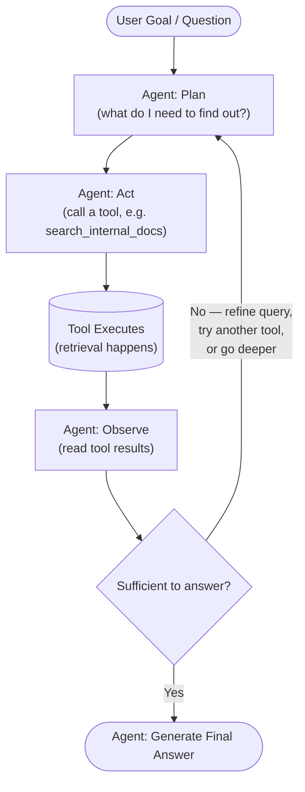
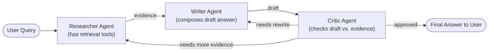

# Agentic RAG

## Learning Objectives

By the end of this chapter, you will be able to:

- Explain precisely what makes a system "agentic," and contrast a fixed RAG pipeline with an agent-driven one
- Describe the agent loop (plan → act/retrieve → observe → decide) and diagram it
- Explain planning, tool calling, reflection, and memory as the four building blocks of agentic behavior
- Design retrieval as one or more callable tools an LLM agent can choose between and parameterize
- Explain the difference between single-agent and multi-agent architectures, and when to split responsibilities across specialized agents
- Explain what MCP (Model Context Protocol) is conceptually, and why standardizing tool/data access matters as agentic systems grow
- Describe how an agent can traverse a knowledge graph interactively, choosing which relationship to follow next based on intermediate findings
- Compare LangGraph, AutoGen, CrewAI, DeepAgents, and Semantic Kernel at a conceptual level
- Sketch a working agentic retrieval loop with a reflection/retry step, in pseudocode
- Articulate the cost/latency/testability trade-offs of agentic RAG and judge when they are worth paying

---

## Prerequisites for This Chapter

This chapter assumes you've completed:

- **[Chapter 1 — Introduction & Prerequisites](./01-introduction-and-prerequisites.md)** — specifically the section on **function calling / tool calling**, which is the exact mechanism agentic RAG relies on to let an LLM invoke a retrieval tool
- **[Chapter 10 — RAG Architectures](./10-rag-architectures.md)** — where Agentic RAG was previewed as one point on the spectrum from Naive → Advanced → Corrective → Adaptive → Graph → Agentic → RAPTOR RAG; this chapter is the deep dive into that final, most flexible point
- **[Chapter 11 — Query Transformation](./11-query-transformation.md)** — techniques like query rewriting, decomposition, and step-back prompting, which an agent frequently invokes *itself*, mid-loop, as one of its available actions

If any of those feel shaky, a quick re-read will pay off — this chapter treats them as known vocabulary.

---

## 1. From Fixed Pipelines to Autonomous Agents

### 1.1 A Recap: Everything So Far Has Been a Script

Take a step back and look at every architecture covered in Chapter 10:

- **Naive RAG**: embed query → search → stuff top-k into prompt → generate. One path, always.
- **Advanced RAG**: add re-ranking, query rewriting, maybe a query router. Still a fixed sequence of stages — the *order* of stages never changes at runtime.
- **Corrective RAG (CRAG)**: grade the retrieved documents, and *branch* — if they're good, generate; if they're bad, fall back to web search. This looks dynamic, but it's really an `if/else` with exactly two predetermined branches, decided by a fixed grading step.
- **Adaptive RAG**: route a query to one of several predetermined strategies (no retrieval / single-step retrieval / multi-step retrieval) based on a classifier. Again — more branches, but the set of possible branches, and the logic for choosing between them, was fixed by the engineer at design time.
- **Graph RAG**: traverse a knowledge graph, but typically via a single, fixed query pattern (e.g., "get the entity, then its 1-hop neighbors").

Every one of these is, at its core, **a flowchart drawn in advance by a human**. The system's *behavior* can vary (which branch it takes), but the *shape* of what it's allowed to do — how many retrieval steps, what order, when to stop — was decided before the query ever arrived. This is what the rest of this course calls a "fixed pipeline," even when it has conditional branches.

### 1.2 What Changes With Agentic RAG

**Agentic RAG hands that flowchart-drawing job to the LLM itself, at runtime, for every query.**

Instead of a human pre-deciding "first retrieve, then grade, then either generate or web-search," the system gives an LLM:

1. A goal (the user's question)
2. A set of tools it is allowed to use (one or more retrieval tools, and possibly others)
3. The ability to observe the result of each tool call
4. The freedom to decide, after each observation, what to do next — call another tool, call the same tool again with different arguments, or stop and answer

The LLM decides, case by case: *Do I need to retrieve at all? What should I search for? Is what I found enough, or do I need to dig further, in a different place, with a different query? Am I done?* No human pre-wrote those decisions — the model makes them fresh, in response to what it actually sees.

> **Analogy**: A fixed RAG pipeline is like a factory assembly line — every unit goes through the same stations in the same order, always. Even a "smart" assembly line with a quality-check station that can route defective units to a rework line is still following a small, fixed number of predetermined paths. Agentic RAG is like handing the job to a human research assistant instead: "Find out whether we're compliant with the new data-retention regulation in the EU." The assistant doesn't follow a script — they might check the internal policy wiki first, realize it's outdated, search a legal database, notice a term they don't understand, look that up too, then circle back and re-read the original document with fresh eyes before writing a summary. The *number* of steps and their *order* emerged from what the assistant found along the way, not from a plan fixed in advance.

### 1.3 The Defining Test

A useful litmus test for whether something is "agentic": **could the number and order of retrieval steps differ between two runs of the exact same query, purely because the model chose differently, and not because a human coded a new branch?** If yes, it's agentic. If the set of possible paths is enumerable in advance by whoever built the system, it's a (possibly sophisticated) fixed pipeline.

This isn't a purity contest — fixed pipelines (Chapters 7–10) are simpler, cheaper, faster, and easier to test, and remain the right choice for a large share of real production RAG systems. Agentic RAG is a tool for a specific kind of problem, covered in Section 8 (Trade-offs) below.

---

## 2. The Agent Loop

### 2.1 The Core Cycle

At the heart of every agentic system — agentic RAG included — is the same repeating cycle: **Plan → Act → Observe → Decide**, repeated until the agent decides it's done.



Walking through each stage:

- **Plan**: the agent (an LLM, prompted with the goal, its available tools, and everything observed so far) decides what it needs next. Early in the loop this might be "I need to find the company's refund policy." Later it might be "I found the general policy but not the holiday-sale exception — I need to search for that specifically."
- **Act**: the agent emits a structured tool call — the same **function calling** mechanism from Chapter 1 — naming a tool and supplying arguments, e.g. `search_internal_docs(query="holiday sale refund exception", top_k=5)`.
- **Retrieve (tool executes)**: your code (not the LLM) actually runs the tool — hits the vector database, calls a web search API, queries a SQL database — and returns the raw result.
- **Observe**: the result is fed back into the agent's context as an "observation," and the LLM reads it.
- **Decide**: the agent reasons over what it now knows and picks one of: loop again (retrieve more / differently), or stop and produce the final answer.

This loop is sometimes called **ReAct** (Reason + Act), after the influential prompting pattern that interleaves the model's reasoning ("I should search for X because...") with concrete tool calls, rather than asking the model to plan everything up front and then execute blindly.

### 2.2 Why a Loop, and Not Just "Retrieve Once, Then Reason"?

A single retrieve-then-generate step (Naive/Advanced RAG) assumes the *first* retrieval is good enough. That assumption breaks down for:

- **Multi-hop questions**: "Which of our vendors that we onboarded in 2023 also appear in last quarter's security incident report?" — answering this requires retrieving vendor records, *then* using names found there to retrieve incident reports, a dependency that can't be resolved with one search.
- **Ambiguous or underspecified queries**: the first search might reveal that the user's question has multiple possible interpretations, prompting the agent to retrieve clarifying context before committing to an answer.
- **Sparse or noisy initial results**: the first search might return nothing useful (wrong terminology, no matching documents), and the agent needs to try a reformulated query, a different tool, or a different knowledge source.

A loop lets the system react to what it actually finds, instead of hoping the first guess is right — the same intuition behind Corrective RAG's fallback-to-web-search branch (Chapter 10), just generalized into an open-ended capability instead of one hardcoded branch.

---

## 3. Planning

**Planning** is the process by which an agent breaks a broad goal into a sequence of smaller, concrete steps or sub-goals, either up front (before taking any action) or incrementally (deciding just the next step, then re-planning after each observation).

Two common styles:

- **Plan-then-execute**: the agent first produces an explicit, numbered plan ("1. Look up the customer's account tier. 2. Look up the refund policy for that tier. 3. Check if the order date falls within the policy window. 4. Compose the answer."), and then works through it step by step, potentially revising the plan if a step reveals new information.
- **Interleaved planning (ReAct-style)**: the agent doesn't commit to a full plan up front. It reasons about just the *next* step, acts, observes, and only then reasons about the step after that. This is more adaptive (it can react to surprises immediately) but can be less efficient for tasks whose overall structure is actually predictable in advance.

For agentic RAG specifically, planning is what decides *what to retrieve and in what order* — e.g., recognizing that a question needs an internal policy document *and* a specific customer record *and* today's exchange rate, and sequencing those retrievals sensibly (sometimes one retrieval's result determines the next retrieval's query, as in the multi-hop example above).

---

## 4. Tool Calling: Retrieval as a Tool

### 4.1 Recap: What Function Calling Is

Chapter 1 introduced **function calling (tool calling)**: an LLM, instead of only producing free text, can emit a structured request to invoke a named function with specific arguments, which your code then executes and feeds the result back to the model. Agentic RAG's entire mechanism rests on this one capability — **retrieval becomes just another tool the LLM can choose to call**, instead of a step your code always runs first.

### 4.2 Designing Retrieval Tools

A single "search" tool is often not enough. Real agentic RAG systems typically expose several retrieval tools, each with a clear name, description, and argument schema, so the LLM can pick the right one:

```python
tools = [
    {
        "name": "search_internal_docs",
        "description": "Search the company's internal knowledge base (policies, "
                        "handbooks, past support tickets). Use for anything about "
                        "internal processes, product behavior, or company policy.",
        "parameters": {
            "query": {"type": "string", "description": "Search query"},
            "top_k": {"type": "integer", "default": 5}
        }
    },
    {
        "name": "search_web",
        "description": "Search the public web. Use for current events, general "
                        "facts, or anything unlikely to be in internal documents.",
        "parameters": {
            "query": {"type": "string"}
        }
    },
    {
        "name": "query_database",
        "description": "Run a read-only query against the customer/orders "
                        "database. Use for specific structured facts like order "
                        "status, account tier, or dates.",
        "parameters": {
            "sql": {"type": "string", "description": "A SELECT-only SQL query"}
        }
    }
]
```

The quality of each tool's `description` matters enormously — it is the *only* information the model has to decide which tool fits a given sub-goal. A vague description ("search stuff") leads to the wrong tool being called, or the right tool being called with a poorly-formed query. Treat tool descriptions with the same care you'd give to API documentation for a human developer, because that's functionally what they are.

### 4.3 The Agent's Decision Space

At each step of the loop, the agent isn't just deciding *whether* to retrieve — it's deciding:

- **Whether to retrieve at all** (a purely conversational follow-up, like "can you rephrase that?", may need no retrieval)
- **Which tool** to use (internal docs vs. web vs. database vs. a knowledge-graph traversal tool, Section 6)
- **What arguments** to pass (the actual search query is often *not* the user's raw question — the agent may rewrite or decompose it first, applying the query transformation techniques from Chapter 11)
- **How many results** to request, and with what filters (e.g., restrict by date, department, document type)

This is strictly more decision-making than any pipeline in Chapter 10 delegates to the model — which is exactly the source of both agentic RAG's power and its cost (Section 8).

---

## 5. Reflection: Critiquing Your Own Work

**Reflection** is an agent examining its own intermediate output — or the evidence it retrieved — and explicitly judging whether it's good enough, before committing to a final answer.

You've already met this idea in Chapter 10, in narrower forms:

- **Self-RAG** trains a model to emit special "reflection tokens" judging whether retrieval was needed, whether retrieved passages are relevant, and whether the generated answer is actually supported by them.
- **Corrective RAG (CRAG)** grades retrieved documents and triggers a fixed fallback (web search) if they're graded poorly.

Agentic RAG generalizes this into an open-ended capability rather than a single hardcoded checkpoint: at *any* point in the loop, the agent can pause and ask itself questions like:

- "Do these retrieved passages actually answer the question, or are they just topically related?"
- "Is there a contradiction between what I found in document A and document B that I need to resolve before answering?"
- "Am I about to state something not actually supported by any retrieved passage?"

If the self-critique fails, the agent doesn't just proceed anyway — it loops back: retrying retrieval with a refined query, trying a different tool, or explicitly flagging uncertainty in the final answer rather than guessing. This is precisely the `Decide` diamond in the agent-loop diagram in Section 2 — reflection is the reasoning that happens inside that diamond.

Reflection is not free — it costs an extra LLM call (or several) per loop iteration — but it's the mechanism that lets agentic RAG catch its own mistakes *before* they reach the user, rather than relying entirely on downstream evaluation (Chapter 13) to catch them after the fact.

---

## 6. Memory: Short-Term vs. Long-Term

Agents that operate across multiple turns, or across sessions, need somewhere to keep track of what's already happened. This is usually split into two kinds:

### 6.1 Short-Term Memory

Short-term memory is the **conversation history within the current session** — what the user asked, what tools were called, what was observed, what's already been said. Practically, this is just the growing context window: every prior turn, tool call, and observation gets included in the prompt for the next step of the loop. It doesn't survive past the session; when the conversation ends, it's gone (unless explicitly persisted — see below).

Short-term memory is what lets an agent avoid re-retrieving something it already found two steps ago, and lets a multi-turn conversation stay coherent ("what about *last* month's numbers?" only makes sense if the agent remembers what numbers were discussed before).

### 6.2 Long-Term Memory

Long-term memory is information that **persists across sessions** — a user's stated preferences ("I always want answers formatted as bullet points"), facts learned in a previous conversation ("this customer is on the Enterprise tier"), or a running log of past interactions.

Here is the key insight this chapter wants you to walk away with: **long-term memory in agentic systems is, in almost every practical implementation, just RAG applied to the agent's own history.** Concretely:

1. Past conversations, facts, and preferences are embedded and stored in a vector store — exactly like any other document collection in this course.
2. When the agent needs to recall something, it issues a retrieval query against *that* store — using the same embedding, indexing, and retrieval techniques from Chapters 4–8.
3. The retrieved memories are inserted into the prompt, the same way retrieved document chunks are.

In other words, "giving an agent memory" and "building a RAG pipeline" are, under the hood, largely the same engineering problem, just pointed at a different corpus (the agent's own history and derived facts instead of a company's documents). This is a genuinely useful reframe: if you understand chunking, embeddings, and retrieval from earlier chapters, you already understand most of what "agent memory" means in production systems — the novelty is mainly in *what* gets written to memory and *when* (e.g., summarizing a long conversation into a compact fact before storing it, rather than storing the raw transcript).

---

## 7. Multi-Agent Systems

### 7.1 Why Split One Agent Into Several

A single agent juggling retrieval, reasoning, writing, and self-critique in one long prompt can become unwieldy — the prompt grows large, the model has to context-switch between very different kinds of tasks, and it's harder to debug which "part" of the system went wrong. **Multi-agent systems** address this by giving each responsibility to a separate, specialized agent, each with its own focused prompt, and often its own tools.

A common pattern for agentic RAG:

- A **Researcher** agent — has access to the retrieval tools (internal docs, web search, database) and is responsible only for gathering evidence
- A **Writer** agent — takes the evidence the Researcher gathered and composes a well-structured final answer, without needing to know *how* the evidence was found
- A **Critic** (or reviewer) agent — reads the Writer's draft against the retrieved evidence and flags unsupported claims, gaps, or tone issues, sending it back to the Writer (or back to the Researcher, if the gap is a missing fact) for another pass



### 7.2 The Trade-off

Multi-agent designs improve separation of concerns (each agent's prompt is smaller and more focused, easier to tune and test in isolation) at the cost of more inter-agent communication overhead and more total LLM calls per query — the same cost/latency trade-off as the single-agent loop, multiplied by the number of agents involved. Reach for multi-agent designs when a task genuinely has distinct phases with different skills (finding vs. writing vs. critiquing), not merely to make an architecture diagram look more sophisticated.

---

## 8. MCP (Model Context Protocol)

As agentic systems accumulate more and more tools — internal search, web search, a SQL database, a ticketing system, a calendar, a code repository — a real integration problem emerges: **every tool typically needs its own bespoke integration code**, hand-written for each agent framework, each tool's own API shape, and each authentication scheme. This doesn't scale as the number of tools and the number of agent applications both grow.

**Model Context Protocol (MCP)** is a standardized, open protocol for connecting LLM applications/agents to external tools and data sources. It's important to be precise about what MCP *is* and *isn't*:

- It is **a protocol** — a specification for how an agent (an "MCP client") and a tool/data provider (an "MCP server") communicate — not a specific product, vendor, or library.
- An MCP server exposes a set of capabilities (tools it can call, resources/data it can provide, prompts it can supply) in a standard, discoverable format.
- Any MCP-compliant agent framework can connect to any MCP-compliant server without custom, one-off integration code — the same way any web browser can talk to any website because they share the HTTP protocol.

**Why this matters for agentic RAG specifically**: a "search_internal_docs" retrieval tool, once exposed as an MCP server, can be reused by *any* agent or agent framework that speaks MCP — you write the retrieval integration once, and every agentic application in your organization (a coding assistant, a support bot, a research agent) can plug into the same knowledge base without reimplementing the connection. As agentic RAG systems mature past a single hand-rolled retrieval tool into dozens of tools across many teams, this standardization is the difference between a maintainable ecosystem and an ever-growing pile of one-off integrations that all break slightly differently.

---

## 9. Knowledge Graphs in Agentic RAG

Chapter 10 introduced Graph RAG as a pattern where the retriever queries a knowledge graph (entities and their relationships) instead of, or alongside, a vector store — typically via a single, fixed traversal pattern decided in advance (e.g., "always fetch the entity's direct neighbors").

Agentic RAG makes graph traversal **interactive and multi-step**, letting the agent decide which relationship to follow next based on what it has found so far, rather than executing one fixed query. Consider the question: *"Which projects were delayed because of a vendor that also caused problems on a different project last year?"*

A fixed single-hop graph query can't answer this — it requires:

1. Find the vendor(s) linked to "problems" on any project (first traversal)
2. For each such vendor, find *other* projects they're linked to (second traversal, whose targets depend on step 1's results)
3. Check which of those other projects were "delayed" (third traversal / filter)
4. Cross-reference the timing ("last year") to confirm relevance

An agent equipped with a graph-query tool (e.g., `graph_query(entity, relationship)` or a tool that accepts a small Cypher/Gremlin-style query) can perform exactly this kind of chained, conditional traversal — deciding after each hop whether it has enough information, and if not, which relationship to follow next, in the same plan → act → observe → decide loop as any other retrieval tool. This is a direct application of Section 2's agent loop, with the knowledge graph simply being one of the "retrieval" tools available, alongside vector search and web search.

---

## 10. Frameworks for Building Agentic RAG

You do not need to memorize APIs for all of these — the goal here is to recognize each name, know roughly what problem it solves, and be able to pick a reasonable starting point for a given project. Chapter 18 revisits this landscape with more comparative detail.

**LangGraph** is a graph-based orchestration library (built by the LangChain team) for defining agents as explicit state machines: you define nodes (steps, including "call the LLM" or "call a retrieval tool") and edges (including conditional edges that route based on the agent's decision), and LangGraph executes and persists the resulting graph, including looping back to earlier nodes. Its explicit state and control flow make agent behavior easier to trace, debug, and constrain than a purely free-form "let the model decide everything" loop, which is a big part of why it has become a popular choice for production agentic RAG specifically.

**AutoGen** (from Microsoft Research) is a framework centered on **multi-agent conversation** — multiple LLM-backed agents (and optionally humans) exchange messages with each other to jointly solve a task, with the framework managing turn-taking and message routing. It's a natural fit for the Researcher/Writer/Critic style of multi-agent RAG described in Section 7, expressed as agents literally "talking" to each other.

**CrewAI** is a framework for **role-based** multi-agent orchestration: you define a "crew" of agents, each with an explicit role, goal, and backstory (e.g., "Senior Research Analyst," "Technical Writer"), assign them tasks, and CrewAI coordinates how they hand off work to each other. It emphasizes a higher-level, more opinionated abstraction than LangGraph's lower-level state machine, trading some flexibility for faster setup of common multi-agent patterns.

**DeepAgents** is a framework/pattern aimed at **long-running, deeply autonomous tasks** — agents designed to plan and execute over many more steps than a typical short Q&A loop, often with explicit sub-agent spawning, persistent task lists, and file-system-like working memory, targeting the kind of open-ended research or engineering task that can run for many minutes or hours rather than seconds.

**Semantic Kernel** is Microsoft's SDK for building AI agents and orchestrating them alongside conventional code, with first-class support for "plugins" (its term for tools/functions an agent can call), planning, and multi-language support (C#, Python, Java) — a common choice in .NET/enterprise Microsoft-stack environments building agentic RAG features that need to integrate tightly with existing enterprise codebases.

---

## 11. A Worked Example: An Agentic Retrieval Loop

Below is a simplified, framework-agnostic sketch of the loop from Section 2 — an agent that retrieves, judges sufficiency via reflection, and either answers or retries with a refined query, up to a step limit.

```python
MAX_STEPS = 4

def run_agentic_rag(user_question, llm, retrieval_tool):
    """
    A minimal agentic RAG loop:
    plan -> retrieve (tool call) -> reflect on sufficiency -> answer or retry.
    """
    history = [{"role": "user", "content": user_question}]
    evidence = []

    for step in range(MAX_STEPS):
        # 1. PLAN: ask the LLM what to do next, given the goal and evidence so far
        plan = llm.decide_next_action(
            goal=user_question,
            evidence_so_far=evidence,
            available_tools=["search_internal_docs", "search_web"],
        )

        if plan.action == "answer":
            # The agent has decided it has enough evidence to stop looping
            return llm.generate_final_answer(user_question, evidence)

        # 2. ACT: execute the retrieval tool the agent chose, with its chosen query
        results = retrieval_tool.call(
            tool_name=plan.tool_name,
            query=plan.query,
            top_k=plan.top_k or 5,
        )
        evidence.append({"query": plan.query, "tool": plan.tool_name, "results": results})

        # 3. OBSERVE + REFLECT: judge whether the new evidence is sufficient
        reflection = llm.judge_sufficiency(
            goal=user_question,
            evidence_so_far=evidence,
        )

        # 4. DECIDE: loop again with a refined query, or fall through to answer
        if reflection.sufficient:
            return llm.generate_final_answer(user_question, evidence)
        # else: loop continues; next iteration's `plan` step sees `reflection.reason`
        # (e.g., "results were about the wrong product line") and can act on it
        history.append({"role": "system", "content": f"Reflection: {reflection.reason}"})

    # Step budget exhausted — answer with best available evidence rather than
    # looping forever, and be explicit about the limitation
    return llm.generate_final_answer(
        user_question, evidence, note="Answer based on partial evidence; step limit reached."
    )
```

The same logic expressed as a LangGraph-style state graph (conceptual, not runnable as-is) makes the control flow even more explicit:

```python
from langgraph.graph import StateGraph, END

graph = StateGraph(AgentState)

graph.add_node("plan", plan_node)
graph.add_node("retrieve", retrieve_node)
graph.add_node("reflect", reflect_node)
graph.add_node("answer", answer_node)

graph.set_entry_point("plan")
graph.add_edge("plan", "retrieve")
graph.add_edge("retrieve", "reflect")

# Conditional edge: the graph itself branches based on the agent's own judgment
graph.add_conditional_edges(
    "reflect",
    lambda state: "answer" if state["sufficient"] or state["steps"] >= MAX_STEPS else "plan",
    {"answer": "answer", "plan": "plan"},
)

graph.add_edge("answer", END)

app = graph.compile()
```

Notice the crucial difference from every pipeline in Chapter 10: the edge out of `reflect` is **conditional on a judgment the LLM made about its own evidence**, not on a rule a human wrote about the *type* of query. The graph shape is fixed (this is what makes LangGraph traceable and debuggable), but which edge actually gets taken, and how many times the `plan → retrieve → reflect` cycle repeats, is decided at runtime by the agent.

---

## 12. Real-World Scenario

**The setup**: A market-research team wants an internal "research assistant" agent that can answer questions like *"How does our new pricing tier compare to what our three biggest competitors announced in the last two months, and does it address the complaints our own customers raised about the old pricing in support tickets?"*

No single document answers this. It requires: (1) internal pricing documentation, (2) recent competitor announcements — which are on the public web and change weekly, so no static internal knowledge base has them, (3) a scan of support tickets for pricing complaints, and (4) synthesis connecting all three.

**Why a fixed pipeline falls short here**: a Naive or even Advanced RAG pipeline retrieves from *one* knowledge base with *one* query shape. This question needs the agent to realize, mid-task, that it must consult an internal knowledge base *and* the live web *and* a ticketing system, in an order it can't know in advance (e.g., it might need to learn a competitor's tier name from the web *before* it can search internal docs for how "our tier" compares to it specifically).

**The agentic RAG design**:

1. The **Researcher agent** is given three tools: `search_internal_docs`, `search_web`, and `search_support_tickets`. On receiving the question, it plans: "First, find our current pricing tier structure internally."
2. It retrieves the internal pricing doc, then plans again: "Now find what Competitor A, B, and C announced recently" — issuing three `search_web` calls with competitor names inferred from an internal competitor-tracking document it retrieved along the way.
3. It reflects: one competitor's announcement is six months old, not "the last two months" as the question specifies — it recognizes this is stale and re-searches with a more specific date-bounded query.
4. It then plans a third phase: "Search support tickets for complaints mentioning 'pricing' or 'cost' from the last quarter," retrieving a sample of relevant tickets.
5. The **Writer agent** takes all three evidence sets (internal pricing, competitor announcements, ticket complaints) and drafts a structured comparison with a section addressing whether the new tier resolves the complaint themes found.
6. The **Critic agent** checks the draft against the evidence: it flags one sentence claiming "customers were mostly complaining about billing frequency" that isn't actually supported by the retrieved tickets (which were mostly about per-seat cost, not frequency), sending it back to the Writer for correction.
7. The corrected draft, now fully traceable to specific retrieved passages, is returned to the requester with citations to each source.

This is a task where the *number of retrieval steps, their order, and which knowledge sources are even needed* genuinely could not be fixed in advance by an engineer — which is exactly the kind of problem agentic RAG is for, and exactly the kind of problem where a fixed pipeline from Chapter 10 would require the user to break the question into three separate, manually-run queries themselves.

---

## 13. Trade-offs: When Is Agentic RAG Worth It?

Agentic RAG is strictly more *capable* than any fixed pipeline for complex, ambiguous, multi-step tasks — but that capability is not free. Be deliberate about the trade-off:

| Dimension | Fixed pipeline (Ch. 7–10) | Agentic RAG |
|---|---|---|
| Cost | 1 (occasionally 2–3) LLM calls per query | Often 5–20+ LLM calls per query (plan, act, reflect, repeated) |
| Latency | Fast, predictable | Slower, variable — a query might take 2 loop iterations or 8 |
| Determinism | Same input → same retrieval path, every time | Same input can take a different path on different runs, especially with any sampling temperature above 0 |
| Testability | Easy to unit-test each fixed stage in isolation | Hard to write deterministic tests; behavior must be evaluated statistically, over many runs (Chapter 13 techniques apply, but with more variance to account for) |
| Debuggability | A failure is traceable to one of a small number of known stages | A failure could stem from a bad plan, a bad tool call, a bad reflection judgment, or a bad final synthesis — more surface area to inspect |
| Capability ceiling | Bounded by what the fixed flowchart anticipated | Can handle novel multi-hop, multi-source, or ambiguous tasks the designer never explicitly anticipated |

**Reach for agentic RAG when:**

- The task genuinely requires an unpredictable number of retrieval steps, from an unpredictable combination of sources, decided by what earlier steps turn up (multi-hop reasoning, open-ended research tasks)
- The cost of a wrong or incomplete answer is high enough to justify extra LLM calls and latency (e.g., a research assistant used a handful of times a day, vs. a high-QPS customer-facing FAQ bot)
- You've already tried Advanced/Corrective/Adaptive RAG (Chapter 10) and hit a ceiling that those fixed branching patterns structurally cannot cross

**Stick with a fixed pipeline when:**

- The query patterns your system needs to handle are well-understood and enumerable — if you can draw the flowchart, draw it; don't pay agentic overhead for a pattern you could hardcode
- Latency and cost per query are tightly constrained (customer support widgets, autocomplete-style features, anything at high volume)
- You need strong guarantees for testing, auditing, or compliance — a system whose behavior can be exhaustively enumerated is much easier to certify as correct than one whose path varies at runtime

A useful discipline: **default to the simplest fixed pipeline that could plausibly work, and only introduce agentic autonomy for the specific sub-problems that demonstrably need it** — sometimes that means a mostly-fixed pipeline with exactly one agentic sub-step (e.g., an agent that decides how many times to retry retrieval), rather than a fully open-ended agent making every decision from scratch. This mirrors the same "start simple, add complexity only when a baseline proves insufficient" principle from Chapter 1's best practices, now applied one level up the architecture stack.

---

## 14. Best Practices

- **Cap the loop.** Always enforce a maximum number of steps/tool calls (Section 11's `MAX_STEPS`). An agent without a hard ceiling can loop indefinitely on an unanswerable or malformed question, burning cost with no termination guarantee.
- **Write tool descriptions as carefully as public API docs.** The LLM's only signal for choosing the right tool and forming a good query is the tool's name, description, and parameter schema — vague descriptions cause silently wrong tool selection.
- **Make reflection explicit and cheap where possible.** A dedicated, focused "is this evidence sufficient?" check (even a smaller/cheaper model) is often more reliable and controllable than hoping a single large prompt implicitly self-corrects.
- **Log every step of the loop.** Because the path isn't fixed, you need a full trace (plan → tool call → arguments → observation → reflection → decision) per query to have any hope of debugging a bad answer after the fact.
- **Prefer graph-based orchestration (e.g., LangGraph) over ad-hoc while-loops for anything beyond a toy example** — explicit state and conditional edges make the system's possible behaviors auditable, even though the specific path taken varies per query.
- **Evaluate over many runs, not one.** Because behavior can vary run to run, apply the evaluation methodology from Chapter 13 across a representative test set *and* across repeated runs of the same queries, tracking variance, not just a single pass/fail per test case.
- **Use multi-agent splits only where roles genuinely differ.** Splitting Researcher/Writer/Critic is worth the added coordination cost when the skills are genuinely distinct; don't multiply agents just to look sophisticated.
- **Standardize tool access with MCP (or an equivalent internal standard) once you have more than a couple of tools**, so new agents and applications can reuse existing retrieval integrations instead of re-implementing them.

## 15. Common Mistakes

- **Building an agent when a fixed pipeline would do.** The most common mistake is reaching for agentic RAG's flexibility and cost for a task whose query patterns were actually enumerable in advance — Corrective or Adaptive RAG (Chapter 10) would have solved it more cheaply and predictably.
- **No step limit**, leading to runaway loops that burn API budget on unanswerable or malformed queries.
- **Treating the agent's self-reported "sufficient" as ground truth** without any independent evaluation — reflection reduces mistakes, it doesn't eliminate them; still evaluate outputs (Chapter 13) rather than trusting the agent's own confidence.
- **Under-specified tool descriptions**, causing the agent to pick the wrong retrieval source (e.g., searching the web when the answer was sitting in internal docs) or to form poorly-targeted queries.
- **Conflating short-term and long-term memory**, e.g., persisting an entire raw conversation transcript as "long-term memory" without summarization or retrieval structure — this bloats storage and produces poor recall quality, since it skips the same chunking/embedding discipline covered in Chapters 4–5.
- **Ignoring cost and latency until production**, only discovering that a query which should take 500ms now takes 15 seconds and 12 LLM calls once real users hit the system.
- **Skipping tracing/observability**, then being unable to explain why an agent gave a specific wrong answer, because the actual sequence of tool calls and decisions was never logged.
- **Assuming multi-agent is always better than single-agent** — added agents mean added coordination overhead and added cost; a single well-prompted agent with good tools often outperforms a needlessly fragmented multi-agent setup on simpler tasks.

## 16. Summary

Every RAG architecture through Chapter 10 — even the branching ones like Corrective and Adaptive RAG — follows a flowchart drawn in advance by a human. **Agentic RAG** replaces that fixed flowchart with an LLM agent that decides, at runtime and step by step, whether to retrieve, what to retrieve, from which source, and when it has enough to answer — the **plan → act (retrieve) → observe → decide** loop, often called ReAct. This autonomy is built from four ingredients: **planning** (breaking a goal into steps), **tool calling** (retrieval exposed as one or more callable tools, using the function-calling mechanism from Chapter 1), **reflection** (the agent critiquing its own evidence or draft and deciding whether to retry, generalizing Self-RAG and CRAG ideas from Chapter 10), and **memory** (short-term conversation history plus long-term persisted facts — the latter of which is, in practice, usually just RAG applied to the agent's own history). Complex tasks are often split across **multiple specialized agents** (Researcher, Writer, Critic), and as agents accumulate tools, **MCP** provides a standard protocol so tool integrations don't need to be rebuilt per framework. Knowledge graphs, too, become interactive under this model — traversed step by step rather than via one fixed query. Frameworks like **LangGraph, AutoGen, CrewAI, DeepAgents,** and **Semantic Kernel** each offer different abstractions for building these systems. The power of agentic RAG comes at a real cost — more LLM calls, higher latency, and much harder deterministic testing — so it earns its place specifically on ambiguous, multi-hop, multi-source tasks where a fixed pipeline's predetermined branches simply cannot cover the space of what might be needed; for everything else, the simpler, cheaper, more testable pipelines from earlier chapters remain the right default.

---

## Knowledge Check

1. What is the precise litmus test for whether a RAG system is "agentic," as opposed to a fixed pipeline with conditional branches (like Corrective or Adaptive RAG)?
2. Walk through the four stages of the agent loop (plan → act → observe → decide) using a concrete multi-hop question of your choosing.
3. Explain, in your own words, why "long-term memory" in an agentic system is often just RAG pointed at the agent's own history rather than a fundamentally different mechanism.
4. Describe a task where a Researcher/Writer/Critic multi-agent split would outperform a single agent doing all three jobs — and one where it would be overkill.
5. What specific problem does MCP solve, and why does that problem get worse as an organization builds more agentic applications with more tools?
6. List three concrete costs of agentic RAG compared to a fixed pipeline, and describe one type of production system where those costs would make agentic RAG the wrong choice.

## Hands-On Exercise

Design, in pseudocode, an agentic retrieval loop with an explicit **reflection step** that retries retrieval **up to 2 times** if the agent judges the results insufficient, then falls back to answering with a caveat if still insufficient after the retries. Your design must include:

1. A `retrieve(query)` tool call
2. A `reflect(question, evidence)` step that returns a judgment (`sufficient: bool`, `reason: str`, and — if not sufficient — a `refined_query: str` suggestion for the next attempt)
3. A retry counter capped at 2 retries (i.e., at most 3 total retrieval attempts)
4. A final answer step that behaves differently depending on whether sufficiency was ever reached

A skeleton to build from:

```python
def agentic_retrieve_with_reflection(question, retriever, llm, max_retries=2):
    query = question
    evidence = []
    attempt = 0

    while True:
        # TODO 1: call retriever with `query`, append results to `evidence`
        # TODO 2: call llm.reflect(question, evidence) to get a judgment
        # TODO 3: if judgment.sufficient -> break out and answer normally
        # TODO 4: if not sufficient and attempt < max_retries ->
        #         set query = judgment.refined_query, increment attempt, loop again
        # TODO 5: if not sufficient and attempt == max_retries ->
        #         break out and answer with an explicit caveat about incomplete evidence
        pass

    # TODO 6: generate and return the final answer, using the `sufficient` flag
    #         to decide whether to include a caveat
```

Fill in each `TODO`, then trace through what happens on paper for three scenarios: (a) the first retrieval is already sufficient, (b) the second retrieval becomes sufficient after one refinement, and (c) all three attempts are insufficient and the agent must answer with a caveat. Confirm your design never calls `retrieve` more than 3 times total.

## Further Reading

- LangGraph documentation — langchain-ai.github.io/langgraph
- Yao, S. et al. (2022). *ReAct: Synergizing Reasoning and Acting in Language Models* — arXiv:2210.03629
- Asai, A. et al. (2023). *Self-RAG: Learning to Retrieve, Generate, and Critique through Self-Reflection* — arXiv:2310.11511 (the paper underlying the reflection ideas revisited in this chapter)
- Model Context Protocol specification — modelcontextprotocol.io
- AutoGen documentation — microsoft.github.io/autogen
- CrewAI documentation — docs.crewai.com
- Semantic Kernel documentation — learn.microsoft.com/semantic-kernel

---

<div style="display:flex;justify-content:space-between;align-items:center;">
  <a href="./13-evaluation-and-testing.md">← Previous: Evaluation & Testing</a>
  <a href="./00-index.md">🏠 Index</a>
  <a href="./15-enterprise-and-multimodal-rag.md">Next: Enterprise & Multimodal RAG →</a>
</div>
