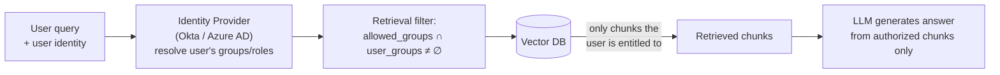
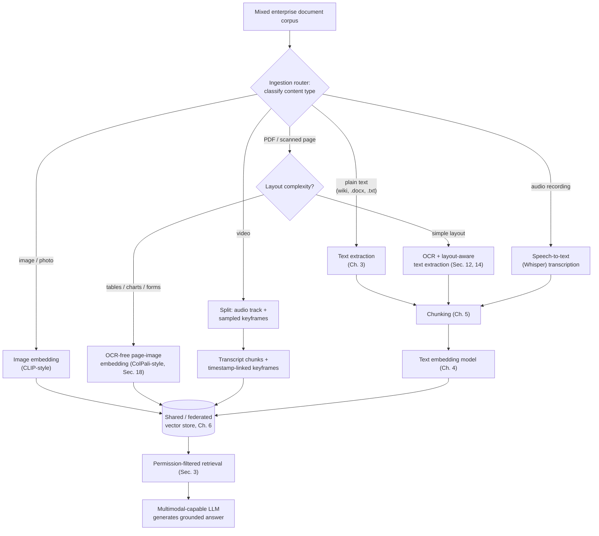

# Chapter 15: Enterprise & Multimodal RAG

Every RAG system you've built so far in this course has quietly made two simplifying assumptions: that there is one user (or all users are equally trusted), and that "documents" means "text." Chapter 14 gave your system a brain — the ability to plan, call tools, and reflect. This chapter gives it the two things a brain needs before it can be trusted inside a real company: **judgment about who is allowed to know what**, and **eyes** — the ability to read a scanned invoice, a chart, a table, or a meeting recording, not just clean paragraphs of text.

Both problems show up the moment a RAG proof-of-concept graduates into something the whole organization uses. A demo built on a folder of clean `.txt` files never has to ask "should this user see this chunk?" or "what do I do with this PDF that is actually a photograph of a table?" A production enterprise system faces both questions on day one. This chapter treats them together because they're the two dimensions along which "toy RAG" becomes "enterprise RAG": **who** can retrieve **what**, and **what kinds of content** can be retrieved at all.

## Learning Objectives

By the end of this chapter, you will be able to:

- Design a multi-tenant vector database layout (shared vs. isolated collections/namespaces) and explain the trade-offs of each
- Implement permission-aware retrieval so that a RAG system never surfaces content a user couldn't already access in the source system
- Explain how to handle document versioning, "as of" queries, audit logging, and data lineage in a production RAG system
- Identify compliance considerations (GDPR, HIPAA, SOC 2) that affect what you index, where you store it, and how long you keep it
- Describe when and how to insert a human-in-the-loop review step, and how user feedback loops back into evaluation
- Explain why plain text extraction breaks down for images, scanned pages, tables, audio, and video — and what multimodal RAG does instead
- Compare CLIP, BLIP, Florence, Donut, and ColPali, and explain the trend toward "OCR-free" document retrieval
- Design an ingestion pipeline that routes text, images, tables, and audio through modality-specific processing into a shared or federated retrieval layer

## Prerequisites for This Chapter

This chapter assumes you're comfortable with:

- **[Chapter 3: Architecture & Internals](./03-architecture-and-internals.md)** — the full RAG pipeline (ingestion → chunking → embedding → indexing → retrieval → generation), and specifically how document processing and text extraction work today. This chapter extends that ingestion stage to non-text content.
- **[Chapter 4: Embeddings Fundamentals](./04-embeddings-fundamentals.md)** — what an embedding vector is and what it means for two vectors to live in the "same space." Multimodal retrieval depends on this idea: images and text can be embedded into a *shared* space so they become comparable.
- **[Chapter 12: Production RAG Systems](./12-production-rag-systems.md)** — you should already have met role-based access control (RBAC), PII masking, and monitoring at a surface level. This chapter goes much deeper on the access-control side and adds the organizational machinery (audit, lineage, compliance) around it.

If Chapter 12's RBAC section feels like a distant memory, it's worth a quick re-read — this chapter assumes you remember that a vector database, by default, has no concept of "this user shouldn't see this."

---

# Part 1 — Enterprise RAG

## 1. Why "It Works in the Demo" Isn't Enough

Picture a RAG system built for a single team, indexing that team's internal wiki. There's one Qdrant collection, everyone who can log in can see everything, there's no record of who asked what, and if a document changes, someone eventually re-runs the ingestion script. This works fine for five people who all have access to the same wiki anyway.

Now scale that same system up to serve an entire 5,000-person company: HR has documents only HR should see (salary bands, disciplinary records), Legal has contracts under attorney-client privilege, Finance has pre-earnings financial data, and every department has documents meant only for their own team. If you point the same undifferentiated retrieval pipeline at all of it, you haven't built a knowledge assistant — you've built a company-wide confidentiality breach with a chat interface. This is the central problem enterprise RAG exists to solve: **retrieval quality is necessary but not sufficient; retrieval must also be *authorized*.**

The topics in this part — multi-tenancy, permissions, versioning, audit, lineage, compliance, human review, and feedback — are not independent features you bolt on later. They form one connected discipline: making sure a RAG system's answers are trustworthy not just in *content* (which Chapter 13's evaluation covered) but in *governance*.

## 2. Multi-Tenancy

**Analogy**: think of an apartment building versus a row of single-family houses. Single-family houses (one RAG deployment per customer) are simple to reason about but expensive to build and maintain one at a time. An apartment building (one shared RAG deployment serving many tenants) is far more efficient to operate — one elevator, one boiler, one security desk — but only works if each tenant's apartment has a lock that actually keeps neighbors out.

**Multi-tenancy** is the practice of serving multiple distinct customers, departments, or teams ("tenants") from a single shared piece of infrastructure, while keeping each tenant's data logically — or physically — isolated from the others. In a RAG system, "infrastructure" usually means: the embedding service, the vector database cluster, the retrieval API, and the LLM. What must stay separate is the *data*: tenant A's chunks must never be retrievable by a query on behalf of tenant B.

### Isolation strategies, from loosest to strictest

| Strategy | How it works | Isolation strength | Operational cost |
|---|---|---|---|
| **Shared collection + metadata filter** | All tenants' vectors live in one collection; every query adds a mandatory filter like `tenant_id = "acme_corp"` | Weakest — depends entirely on the filter being applied correctly, every time, in every code path | Lowest — one collection to manage, scales elastically |
| **Namespace/partition per tenant** | The vector DB's own namespace feature (Pinecone namespaces, Qdrant/Milvus partitions) keeps tenants in separate logical buckets within shared infrastructure | Stronger — the database enforces the boundary, not just application code | Low-medium — still one deployment, but per-tenant operations (delete, backup) are cleaner |
| **Collection per tenant** | Each tenant gets a fully separate collection/index, still on shared compute | Strong — a bug in one tenant's query logic can't leak into another collection | Medium — more collections to provision and monitor, but resource usage can still be pooled |
| **Cluster/instance per tenant** | Each tenant (typically a large enterprise customer, or one under strict regulatory demands) gets a dedicated database instance, sometimes a dedicated VPC | Strongest — physical isolation | Highest — you're back to "one house per family," at scale |

Most SaaS RAG products use the middle two rows: namespace-per-tenant for small/medium tenants, dedicated collections or instances for large or highly regulated customers who pay for (and often contractually require) that isolation.

### A concrete scenario

Suppose you're building a RAG-powered support assistant sold to multiple companies. Company A asks "what's our refund policy?" The embedding of that query must only be compared against Company A's indexed help-center articles — never Company B's. If you implement this with a shared Qdrant collection and a `tenant_id` metadata field, the danger is entirely in your application code: one retrieval call site that forgets to attach the `tenant_id` filter is a data leak across paying customers, and it will not show up in a functional test that only uses one tenant's data. This is why production systems increasingly push tenant isolation down into the database layer (namespaces) rather than trusting every call site to remember a `WHERE` clause — the same lesson SQL engineers learned decades ago with row-level security.

## 3. Document Permissions

Multi-tenancy answers "which company can see this." **Document permissions** answer a finer-grained question: "which *individuals within* a company can see this." Chapter 12 introduced RBAC (role-based access control) briefly as a production security concern; here we go deeper into how it actually gets wired into retrieval.

### The core principle: retrieval must mirror the source system

The single most important rule in enterprise RAG is this: **a user must never be able to retrieve, via the RAG system, content they could not already open directly in the source system.** If Priya doesn't have access to the "Executive Compensation" folder in SharePoint, she must not be able to get its contents surfaced — even paraphrased, even as a supporting citation — by asking the chatbot a clever question. A RAG system that ignores this isn't just a bug; it's a permissions bypass that happens to be shaped like a chat window.

### How this gets implemented

There are two complementary places to enforce this, and production systems typically use both:

1. **Index-time metadata tagging.** During ingestion, every chunk is tagged with the access-control metadata from its source (e.g., `allowed_groups: ["hr-team", "exec"]`, or an ACL list of user IDs). This mirrors whatever permission model the source system (SharePoint, Confluence, Google Drive, a database) already uses — you are not inventing a new permission system, you're *importing* the existing one.
2. **Query-time filtering.** When a user submits a query, the retrieval layer looks up that user's groups/roles (from your identity provider — Okta, Azure AD, etc.) and adds a mandatory filter: only return chunks where the user's groups intersect the chunk's `allowed_groups`. This is philosophically the same mechanism as the metadata filtering you learned in Chapter 6, just applied to access control instead of, say, filtering by document date.

A subtlety worth internalizing: permission filtering must happen *before* the top-K chunks are chosen, not after. If you retrieve the top 5 chunks globally and then discard the ones the user can't see, a user with narrow access might get zero usable chunks back from a query that had plenty of *authorized* good matches further down the ranked list — or worse, in a careless implementation, might get a glimpse of a chunk's existence (via a citation or an error message) before the filter removes it. Filter first, then rank within the authorized set (a "pre-filtering" pattern, same terminology as Chapter 6's pre- vs. post-filtering discussion, now applied to security rather than just relevance).

### Concrete scenario

An engineering-org RAG assistant indexes design docs from Confluence. A senior engineer on the Payments team asks "what's the plan for the new fraud-detection model?" Behind the scenes: her identity resolves to groups `["payments-team", "all-engineering"]`. The retrieval filter allows chunks tagged with either of those groups. A competing team's confidential doc tagged `["ml-platform-leads-only"]` never enters her candidate set — not because the LLM chose to omit it, but because it was never retrieved in the first place. That distinction matters: **you cannot rely on prompting the LLM to "not share confidential information."** The chunk must never reach the context window at all, because an LLM cannot be trusted to reliably withhold information it has already been shown.

## 4. Versioning

Documents change. A company handbook gets updated twice a year; a contract gets amended; a pricing page changes weekly. If your vector index doesn't account for this, you get two failure modes: **stale answers** (the bot confidently cites a policy that was superseded three months ago) and **broken "as of" reasoning** (a user asks "what did the contract say in March?" and the system has no way to answer, because it only ever kept the latest version).

### Strategies

- **Overwrite-on-update (simplest)**: when a document changes, delete its old chunks and re-index the new version, keyed by a stable `document_id`. This keeps the index small and always current, but destroys history — you can't answer "as of" questions.
- **Append with version metadata**: keep every version's chunks, each tagged with `version`, `valid_from`, and `valid_to` timestamps. Retrieval defaults to filtering `valid_to IS NULL` (the current version) but can be pointed at a specific date for "as of" queries. This is the pattern to use whenever a domain has real audit or historical-reasoning requirements — contracts, policies, regulatory filings.
- **Event-sourced re-indexing**: treat every document change as an event; an ingestion pipeline listens for change events (e.g., a webhook from SharePoint or a CMS) and re-indexes incrementally rather than on a nightly batch job, so the index's staleness window is minutes, not a day.

### Scenario

A legal-document RAG assistant is asked, "what was the termination clause in the Acme vendor contract before the March 2025 amendment?" If the system only ever kept the latest version, this question is unanswerable — worse, a naive system might confidently answer with the *current* clause, silently giving wrong information about the past. A versioned index, storing amendment history with `valid_from`/`valid_to` metadata, can correctly retrieve the March-2024-era chunk and tell the user which version it's quoting.

## 5. Audit Logs

An **audit log** is a durable record of what happened: which user asked what, which chunks were retrieved (with their source document IDs and versions), what the LLM was prompted with, and what it answered — timestamped and tamper-resistant. Think of it as a flight data recorder for your RAG system: you hope you never need it, but when something goes wrong ("why did the bot tell a customer their refund was approved when it wasn't?"), it's the only way to reconstruct exactly what the system saw and said.

Minimum fields worth logging for every RAG interaction:

- User identity and their resolved permission groups at query time
- The raw query and any rewritten/transformed version of it (Chapter 11)
- The IDs, versions, and relevance scores of every chunk retrieved (not just the ones ultimately used in the final prompt)
- The exact prompt sent to the LLM and the exact response received
- Model name/version and any generation parameters (temperature, etc.)
- Timestamp and latency breakdown

This isn't optional bookkeeping — in regulated industries, "we can't explain why the system said that" is not an acceptable answer to a compliance auditor or a customer's lawyer.

## 6. Data Lineage

**Data lineage** is the ability to trace a chain: *generated answer → the specific chunks used → the source document → the specific ingestion job that indexed it → the original system of record.* Audit logs capture *what happened at query time*; lineage captures *where the knowledge came from and how it got into the index in the first place*.

Why this matters in practice: suppose a customer reports that the assistant gave incorrect pricing information. Audit logs tell you which chunks were retrieved. Lineage tells you *which document* those chunks came from, *which version* of it, *when* it was ingested, and *which ingestion pipeline run* processed it — which might reveal, for example, that a stale copy of the pricing sheet was accidentally re-ingested by a broken cron job three weeks ago. Without lineage, "the data was wrong" is a dead end. With it, it's a solvable bug.

A practical way to build this: every chunk's metadata carries `source_document_id`, `source_uri`, `ingestion_job_id`, and `indexed_at`. Every ingestion job logs which documents it processed and with what parser/chunking configuration. This is a small amount of extra metadata at ingestion time that pays for itself the first time something goes wrong in production.

## 7. Compliance

Different domains carry different regulatory obligations, and these obligations reach directly into RAG architecture decisions — not just policy documents:

- **GDPR** (EU): governs personal data of EU residents. Relevant to RAG: the "right to erasure" means that if a person's data is indexed (e.g., their name appears in an internal HR document that got chunked and embedded), you need a real mechanism to delete every chunk derived from that data — not just the source document, but its embeddings, any cached retrieval results, and any log entries containing it. This is why lineage (Section 6) matters for compliance, not just debugging: you cannot delete-on-request what you cannot trace.
- **HIPAA** (US healthcare): governs protected health information (PHI). A RAG system touching clinical notes or patient records must ensure PHI is only processed by systems covered under a Business Associate Agreement, often precluding sending raw chunks to a general-purpose third-party LLM API without a specific compliant configuration, and demanding strict access logging (which dovetails with Section 5's audit logs).
- **SOC 2** (general enterprise trust framework, common in B2B SaaS): less about specific data categories and more about demonstrating *process* — access controls are enforced, changes are logged, incidents are tracked. Multi-tenancy isolation (Section 2), permissions (Section 3), and audit logs (Section 5) are exactly the controls a SOC 2 audit will ask you to prove exist.

The common thread: compliance requirements shape three concrete engineering decisions — **what can be indexed at all** (some documents may need to be excluded or redacted before ingestion), **where data is stored and processed** (some contracts require EU-only data residency, ruling out certain cloud regions or third-party APIs), and **how long data is retained** (some regulations require deletion after a fixed period; others require retention for audit purposes — these can be in tension and need a deliberate policy, not a default).

## 8. Human-in-the-Loop

Not every RAG answer should go straight to the end user. In high-stakes domains — legal advice, medical guidance, financial recommendations — a common and often necessary pattern is **human-in-the-loop (HITL)**: the RAG system drafts an answer with citations, and a qualified human reviews (and can edit or reject) it before it's ever sent onward.

This isn't a failure of the RAG system's capability — it's an acknowledgment that some domains have consequences severe enough that "the model was 95% accurate in evaluation" (Chapter 13) still isn't good enough odds for a single answer. Common patterns:

- **Pre-send review queue**: the assistant drafts a response to a customer's medical question; a nurse reviews and approves/edits it before it's sent, rather than the bot replying directly.
- **Confidence-gated escalation**: the system only auto-sends answers above some confidence/groundedness threshold (tying back to the faithfulness metrics from Chapter 13); anything below the threshold routes to a human queue automatically.
- **Approval-required actions**: in an agentic RAG system (Chapter 14) that can *take* actions (not just answer questions), any action with real-world consequence — filing a legal document, issuing a refund — requires explicit human sign-off, even if the RAG-generated draft was excellent.

### Scenario

A financial-advisory chatbot at a bank drafts responses to customer questions about investment products, citing internal compliance-approved product sheets. Rather than sending drafts directly, every response above a certain dollar-amount threshold routes to a compliance officer's review queue; the officer can approve, edit, or reject within minutes. This keeps the speed benefit of RAG (drafting is instant) while keeping a human accountable for anything that could trigger regulatory liability if wrong.

## 9. Feedback Loops

The moment real users interact with your RAG system, you have a resource you didn't have in Chapter 13's offline evaluation: **live feedback on real queries.** A feedback loop is the mechanism for capturing that signal (thumbs up/down, explicit corrections, "this wasn't helpful" flags, or even implicit signals like "the user immediately rephrased the question") and feeding it back into the system's improvement cycle.

Concretely, this closes the loop with the evaluation work from Chapter 13:

- **Golden dataset growth**: a query that got a thumbs-down, once a human confirms what the *correct* answer and supporting chunks should have been, becomes a new labeled example in your evaluation golden dataset — directly growing the test set that guards against regressions.
- **Retrieval tuning signal**: patterns in negative feedback (e.g., a cluster of complaints about questions on a specific topic) often point to a retrieval gap — missing documents, bad chunking of a specific document type, or an embedding model that underperforms on domain jargon — rather than a generation problem.
- **Prompt iteration**: corrections where retrieval was fine but the answer was phrased badly, or ignored an instruction, feed into refining the prompt templates from Chapter 9.

The important discipline here is *closing* the loop, not just collecting the feedback. A thumbs-down button that logs to a table nobody reviews is theater. A functioning feedback loop has an owner, a cadence (e.g., weekly triage of negative feedback), and a defined path from "user flagged this" to "this is now a regression test in the eval suite."

---

# Part 2 — Multimodal RAG

## 10. Why Multimodal RAG Matters

Every RAG system in this course so far has assumed the source content is clean, extractable text. Real enterprise knowledge is rarely that polite. A single "document corpus" in a real company typically contains: Word docs and wikis (clean text — the easy case), scanned paper forms and faxed invoices (images of text), PDFs full of tables and charts (structured/visual data that plain text extraction mangles), slide decks (a mix of text, images, and diagrams), recorded meetings (audio), and training or product-demo videos (audio + visual).

If your ingestion pipeline (Chapter 3) only knows how to pull text out of files, all of that other content is either silently dropped (a huge, invisible gap in your knowledge base — the assistant simply "doesn't know" about anything in scanned documents) or, worse, is naively "extracted" and turns into garbage: a table flattened into a wall of comma-separated numbers with no column headers, or a chart that becomes an alt-text string like `image1.png`. **Multimodal RAG** is the set of techniques for making retrieval work correctly over these non-text (or not-purely-text) content types.

## 11. Image Retrieval

The foundational trick that makes image retrieval possible is embedding images into the *same* (or a jointly-trained, comparable) vector space as text — the same core idea from Chapter 4, extended across modalities. Once an image and a text query can both become vectors in a space where "similar meaning" means "close together," ordinary vector similarity search (Chapter 6) works exactly as it did for text.

This enables two distinct use cases:

- **Text-to-image search**: a user types "show me the network diagram for the payment service," and the system retrieves the actual diagram image, because the text query's embedding lands near that image's embedding in the shared space.
- **Question-answering about image content**: a user asks "what's the maximum load in this chart?" attaching or referencing an image; the system retrieves relevant images and passes them (or a description of them) to a vision-capable LLM to answer.

The model most associated with this shared-space trick is **CLIP** (see Section 15).

## 12. PDF Retrieval with Layout Awareness

Chapter 3 covered basic text extraction from PDFs — pulling out a stream of characters. That's sufficient for a PDF that's really just a text document wearing a PDF wrapper (a policy document, a plain report). It falls apart for PDFs with real *layout*: multi-column academic papers, forms with labeled fields, financial statements with tables spanning a page, or slide-style PDFs where spatial position carries meaning.

**Layout-aware extraction** preserves the document's visual structure — which text belongs to which column, which cells belong to which table, where headers and footers are — rather than flattening everything into one character stream in reading order that may not match the *logical* order. Tools like LayoutLM-style models, or PDF-parsing libraries that expose bounding boxes and structural tags (headings, table cells, list items), let you chunk a document *along its actual structural boundaries* instead of blindly at every N characters — directly improving the chunking quality discussed in Chapter 5, because chunks now respect "this is one table" or "this is one section" instead of splitting mid-row or mid-column.

## 13. Table Retrieval

Tables deserve special treatment because naive text extraction is actively hostile to them. Consider a pricing table with columns `Plan | Monthly Price | Annual Price | Seats Included`. Extracted as raw reading-order text, it might become an unreadable jumble like `Plan Monthly Price Annual Price Seats Included Basic $10 $100 5 Pro $25 $250 20 ...` — a human can still puzzle it out, but an LLM given this as retrieved context frequently misattributes which number belongs to which plan, especially in longer tables.

Two strategies handle this well:

1. **Convert tables to Markdown (or HTML) during ingestion.** A Markdown table (`| Plan | Monthly Price | ... |`) preserves row/column structure in a format LLMs are extensively trained on and parse reliably. This is often the simplest high-leverage fix: detect tables during parsing (many PDF/HTML parsers can identify table regions) and serialize them to Markdown rather than flattening to plain text.
2. **Store tables separately with structured query support.** For large or highly structured tables (a full pricing catalog, a financial dataset), instead of cramming the whole table into a text chunk, store it as actual structured data (a small SQL table, or JSON), and let an agentic RAG system (Chapter 14) query it with a tool call — e.g., a `query_pricing_table(plan="Pro")` tool — rather than relying on similarity search over a text rendering of the table at all. This is often more accurate *and* more token-efficient than retrieving the whole table as context.

## 14. OCR: Recap and Multimodal Framing

Chapter 3 introduced **OCR (Optical Character Recognition)** briefly as one document-processing step among several. In the multimodal context, it's worth restating precisely what it does and where it fits: OCR takes a scanned or photographed page — which is fundamentally an *image*, containing no machine-readable text at all — and recognizes the shapes of characters to produce a text transcript. This is what makes a scanned invoice, a faxed form, or a photo of a whiteboard searchable at all.

The multimodal framing adds two things Chapter 3 didn't dwell on: first, OCR quality varies enormously with input quality (skewed scans, handwriting, low resolution, non-Latin scripts all degrade it, sometimes badly), and a RAG system that blindly trusts OCR output can retrieve and confidently present *misread* text as fact. Second — and this sets up Section 16 — OCR is not the only way to make a scanned document searchable. It is a specific design choice ("extract text first, then do text retrieval") with a real alternative: skip text extraction and embed the page *image* directly.

## 15. Audio Retrieval

Audio content — meeting recordings, customer support calls, earnings-call recordings, podcasts — is made retrievable in two ways, and enterprise systems today overwhelmingly use the first:

- **Transcribe, then treat as text (the dominant approach)**: run the audio through a speech-to-text model (e.g., Whisper) to produce a transcript, then chunk, embed, and index that transcript exactly like any other text document following Chapters 5 and 6. Speaker labels and timestamps are usually preserved as metadata, so a retrieved chunk can be traced back to "Minute 14:32, spoken by the VP of Sales" — which also feeds directly into the data lineage practice from Section 6.
- **Direct audio embeddings**: embed audio (or audio segments) into a vector space directly, without a transcription step, useful for retrieval tasks where the *content* being matched isn't well captured by words alone — e.g., "find calls with a similar tone/sentiment" or searching non-speech audio. This is far less common in enterprise document RAG than the transcribe-first approach, but relevant in specialized applications (audio/music search, call-center sentiment retrieval).

## 16. Video Retrieval

Video combines both problems at once: it has an audio track (handle via Section 15) and a sequence of visual frames (handle via Section 11's image techniques). Effective video retrieval typically combines both:

1. **Transcript-based retrieval**: transcribe the audio track and index it as text, exactly as in Section 15 — this handles "what did they say about Q3 revenue in the earnings call video?"
2. **Keyframe/visual retrieval**: periodically sample frames (e.g., one every few seconds, or at scene changes) and embed them as images (Section 11) — this handles "find the slide where they showed the roadmap diagram," which the audio transcript alone would never surface if that slide was shown silently.

A retrieved "video chunk" in a well-built system typically carries both a transcript snippet and a timestamp-linked keyframe, so the final answer can cite "at 12:04 in the product demo, the roadmap slide showed..." — combining both modalities into one grounded, checkable citation.

## 17. Key Multimodal Models

| Model | What it's for |
|---|---|
| **CLIP** (Contrastive Language-Image Pretraining, OpenAI) | Trains image and text encoders together so that matching image/caption pairs land close together in a shared embedding space — the foundational technique behind text-to-image and image-to-text search |
| **BLIP** (Bootstrapped Language-Image Pretraining) | Generates natural-language captions and answers questions about image content — useful for turning an image into a text description that a normal text-based RAG pipeline can then index and reason over |
| **Florence** (Microsoft) | A vision foundation model supporting a broad range of vision tasks (classification, detection, captioning, visual grounding) from one pretrained backbone, useful as a general-purpose visual understanding component in an enterprise pipeline |
| **Donut** (Document Understanding Transformer) | Reads document images and produces structured output (e.g., extracted fields, generated text) *without* a separate OCR step — an early, influential example of OCR-free document understanding |
| **ColPali** | Embeds entire document *page images* directly into a retrieval space, skipping text extraction and OCR entirely, and has shown strong results specifically on visually complex documents (tables, charts, forms) — see Section 18 |

## 18. The Trend Toward OCR-Free Document Retrieval

The traditional pipeline for a scanned or visually complex document is: OCR → text extraction → chunking → embedding → text-based retrieval (Chapters 3, 5, 6). This works, but every OCR error compounds downstream: a misread table header, a garbled column of numbers, or lost formatting all quietly poison every chunk built from that page, and there's no way for the retrieval step to recover information the OCR step already destroyed.

**ColPali** represents a different philosophy: instead of converting a page to text and then embedding the text, it embeds the page *image itself*, treating layout, tables, charts, and visual structure as first-class signal rather than noise to be stripped away before "real" processing begins. A query (still plain text, e.g., "what was the Q3 revenue?") is embedded and matched directly against page-image embeddings, using a vision-language model trained to make this cross-modal matching work well. Because there's no intermediate text-extraction step, there's no OCR error to compound — the model reasons over the same visual representation a human would look at.

This matters most exactly where traditional OCR pipelines are weakest: documents dominated by tables, charts, forms, and complex multi-column layouts, where "what is this text" is genuinely intertwined with "where is this text and what is it near." For a clean, single-column text-only PDF, OCR-based pipelines and OCR-free approaches perform similarly — the gap opens up specifically on visually complex documents, which is precisely the enterprise document category (invoices, financial statements, forms, scanned contracts) that causes the most pain in Section 12 and Section 14. This doesn't make OCR obsolete — it remains cheaper, more mature, and perfectly adequate for the large fraction of enterprise documents that are visually simple — but it's a genuinely different point on the design-space map that's worth knowing when you're specifically fighting table- and chart-heavy documents.

---

## Real-World Scenario

**Enterprise Knowledge Assistant, Acme Manufacturing Corp.**

Acme wants one internal assistant serving Finance, HR, and Procurement, backed by a shared document store, with two hard requirements the pilot must prove out:

1. **Per-department permissions.** Finance's monthly close documents must never appear in a Procurement employee's retrieval results, and vice versa, even though all departments share the same vector database cluster. HR documents (the most sensitive) get an extra layer: only HR staff and a small "HR-visible" exec group can retrieve them at all, everyone else's queries never match them regardless of topical relevance.
2. **Scanned invoices with tables.** Procurement's biggest pain point is thousands of scanned vendor invoices — photographed or faxed, containing itemized tables (SKU, quantity, unit price, total) — that nobody can currently search. A plain-OCR pipeline was tried first and kept scrambling which price belonged to which line item on invoices with multi-column layouts.

The resulting design combines both parts of this chapter. At ingestion: every document is tagged at chunk level with `allowed_groups` mirrored from the source system's own ACLs (SharePoint permissions for Finance/HR docs, the procurement system's vendor-invoice ACLs). Invoices are routed through a layout-aware pipeline; because early testing showed traditional OCR mangling the line-item tables, Procurement's invoice pipeline is switched to a ColPali-style page-image embedding approach so line items stay correctly associated with their rows, and each invoice chunk still carries `allowed_groups: ["procurement"]` metadata like any other chunk — multimodal handling and permission handling are orthogonal and stack cleanly. At query time: a Procurement analyst asking "what did we pay Vendor X for pump seals last quarter?" gets her identity resolved via Azure AD, the retrieval filter restricts candidates to `procurement`-tagged chunks, and within that authorized set, the ColPali-embedded invoice pages are searched directly — correctly answering from the table without ever having OCR'd (and potentially garbled) the numbers. Every retrieval and answer is written to an audit log with the specific invoice document ID and ingestion job ID (data lineage), so if Finance later disputes a number, the exact source invoice and page can be pulled up in seconds.

---

## Best Practices

- **Enforce permissions at the database/query layer, not just in the prompt.** Never rely on instructing the LLM to withhold information it has already been shown — filter *before* retrieval returns results.
- **Mirror the source system's ACLs, don't invent a parallel permission system.** Two systems of truth for "who can see what" will drift and create silent security gaps.
- **Log everything needed to answer "why did it say that" after the fact** — retrieved chunks, scores, prompt, response, user identity — before you need it, not after an incident forces you to add it.
- **Tag every chunk with lineage metadata at ingestion time** (source document ID, version, ingestion job ID) — it's nearly free to add then and painful to reconstruct later.
- **Treat versioning as a first-class design decision**, not an afterthought — decide up front whether your domain needs "as of" answering, and design metadata (`valid_from`/`valid_to`) accordingly.
- **Route documents by actual content type, not file extension.** A `.pdf` might be clean text, a scanned image, or a table-heavy form — inspect and route accordingly rather than assuming one extraction path fits all PDFs.
- **Convert detected tables to Markdown at minimum**, and consider structured storage with tool-call retrieval for large or high-stakes tables (pricing, financial data).
- **Reach for OCR-free (ColPali-style) approaches specifically for visually complex documents** — tables, charts, forms — rather than defaulting to them everywhere; traditional OCR remains cheaper and sufficient for plain-text-dominant documents.
- **Close the feedback loop deliberately** — assign an owner and a cadence for triaging negative feedback into the evaluation golden dataset (Chapter 13), rather than only collecting it.

## Common Mistakes

- **Filtering by permissions after retrieval instead of before**, which can leak the existence of restricted documents (via citations, error messages, or count mismatches) even if their content is hidden.
- **Trusting a single shared metadata filter across all call sites** with no database-level enforcement — one missed filter in one code path is a full tenant-isolation breach.
- **Treating OCR output as ground truth.** Retrieval and generation built on unverified OCR text can confidently present misread numbers or names as fact, with no signal to the user that the source was a shaky scan.
- **Flattening tables into raw text during extraction**, scrambling which value belongs to which row/column and producing plausible-looking but wrong answers.
- **No versioning strategy**, leading to either stale answers (old policy still being cited) or an inability to answer legitimate "as of" questions in legal/compliance contexts.
- **Skipping audit logging until after an incident**, at which point the data needed to diagnose what went wrong was never captured.
- **Assuming compliance is purely a legal/policy matter** with no engineering implications — in reality it directly constrains what gets indexed, where it's processed, and how long it's retained.
- **Collecting user feedback but never acting on it** — a thumbs-down button that logs to an unreviewed table provides no actual improvement loop.

## Summary

Enterprise RAG is the discipline of making sure a RAG system's answers are not just *accurate* but *authorized, traceable, and compliant*: multi-tenancy keeps unrelated customers' data apart, document permissions ensure retrieval never exceeds what a user could already access in the source system, versioning and audit logs make the system's behavior explainable and historically queryable, data lineage lets you trace any answer back to its origin, compliance requirements shape what can be indexed and where, and human-in-the-loop plus feedback loops keep high-stakes answers accountable and the whole system improving over time.

Multimodal RAG extends retrieval beyond plain text to the images, tables, scanned pages, audio, and video that make up most real enterprise knowledge. Images and text can share an embedding space (CLIP); scanned documents can be read via OCR or, increasingly, retrieved directly from page images without OCR at all (ColPali) — a distinction that matters most for visually complex tables, charts, and forms. Tables need structure-preserving handling rather than naive flattening. Audio and video are typically made searchable via transcription, with video adding keyframe-based visual retrieval on top. None of these multimodal techniques are exempt from Part 1's governance requirements — a permission tag and a lineage record belong on an embedded invoice image chunk exactly as they belong on a text chunk.

Together, these two dimensions — governance and modality — are what separate a RAG demo from a system an entire regulated organization can actually rely on.

## Knowledge Check

1. Why is filtering retrieved chunks by permission *after* ranking the top-K results considered a weaker design than filtering *before* ranking?
2. A vector database offers both a "shared collection with a `tenant_id` metadata filter" option and a "namespace per tenant" option. What's the key difference in how strongly each enforces isolation, and when would you choose the stronger option despite its extra operational cost?
3. Explain the difference between an audit log and data lineage in a RAG system. Give an example of a question each one is best suited to answer.
4. Why can't you rely on prompting an LLM ("don't share confidential information") as your primary access-control mechanism?
5. Describe a document type where a naive OCR + text-extraction pipeline is likely to underperform a ColPali-style OCR-free approach, and explain why.
6. How does a user feedback loop (thumbs up/down, corrections) connect back to the evaluation golden dataset concept from Chapter 13?

## Hands-On Exercise

Design (in Markdown — no code required) a permission-aware retrieval flow for a company with three departments — **Sales**, **Engineering**, and **HR** — each with a private document set, plus one **Company-Wide** document set visible to everyone. Your design should include:

1. **A metadata schema** for a chunk, showing at minimum: `chunk_id`, `source_document_id`, `allowed_groups`, `version`, `ingestion_job_id`.
2. **A worked example** of the `allowed_groups` value you'd assign to: (a) a Sales pipeline report, (b) an HR disciplinary policy, (c) the company handbook, (d) an Engineering design doc that Sales leadership is also allowed to view.
3. **A step-by-step retrieval flow** (as a numbered list or a Mermaid flowchart) showing what happens when a Sales team member submits a query: how their identity is resolved to groups, how the filter is constructed, and at what point in the pipeline the filter is applied relative to similarity ranking.
4. **One failure scenario** you'd specifically test for before launch (e.g., a user who belongs to zero groups, a document with missing `allowed_groups` metadata) and what the *safe default behavior* should be in that case.

There is no single correct answer — the goal is to practice reasoning explicitly about where permission enforcement lives in the pipeline, which is the single most consequential design decision in enterprise RAG.

## Further Reading

- Faysse et al., "ColPali: Efficient Document Retrieval with Vision Language Models" (2024) — the paper introducing OCR-free, page-image-embedding document retrieval discussed in Section 18
- Radford et al., "Learning Transferable Visual Models From Natural Language Supervision" (2021) — the original CLIP paper, foundational to joint image-text embedding spaces (Section 11, 17)
- Kim et al., "OCR-Free Document Understanding Transformer (Donut)" (2022) — an earlier OCR-free document understanding approach, useful context for why ColPali's approach isn't the first of its kind
- Li et al., "BLIP: Bootstrapping Language-Image Pre-training for Unified Vision-Language Understanding and Generation" (2022)
- OWASP guidance on access control and multi-tenancy security patterns — useful general background for Section 2 and 3's isolation strategies, independent of any specific vector database vendor
- Your vector database's own documentation on namespaces/partitions and metadata filtering (Qdrant, Pinecone, Milvus, Weaviate — referenced in Chapter 6) for the concrete mechanics behind Section 2 and 3

---

  <a href="./14-agentic-rag.md">← Previous: Agentic RAG</a>
  <a href="./00-index.md">🏠 Index</a>
  <a href="./16-best-practices.md">Next: Best Practices →</a>

