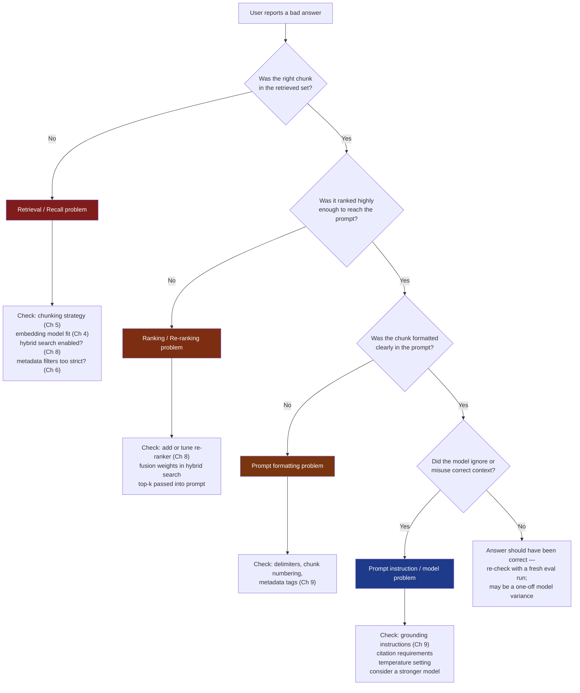

# Best Practices

## Learning Objectives

By the end of this chapter, you will be able to:

- Recite a concise, defensible checklist of best practices for every stage of a RAG pipeline: document processing, embeddings, vector storage, retrieval, prompting, architecture selection, production operations, and evaluation
- Explain the "why" behind each practice well enough to adapt it when your situation doesn't match the textbook case
- Use a debugging decision tree to isolate whether a bad answer is a retrieval problem, a prompt problem, or a model problem, before touching any code
- Apply the idea of "versioning a RAG configuration" — embedding model + chunking config + prompt template as one reproducible unit — instead of treating each as an independent, unversioned variable
- Recognize the cost/latency/quality trade-off explicitly, and state which two dimensions a given system is optimizing for
- Audit an existing RAG pipeline against a consolidated checklist and prioritize the gaps that matter most

## Prerequisites for This Chapter

This chapter is a **synthesis** chapter — it assumes you have already read Chapters 1 through 15 and have working knowledge of the concepts it references. It does not re-teach any technique; it distills and cross-links what you've already learned into one operational reference. If any of the following feel unfamiliar, a quick re-read before continuing will make this chapter much more useful:

- **[Chapter 3: Architecture & Internals](./03-architecture-and-internals.md)** — the full pipeline shape and document processing internals this chapter's chunking practices build on
- **[Chapter 5: Chunking Strategies](./05-chunking-strategies.md)** — fixed/recursive/semantic chunking, the source of the chunking recommendations below
- **[Chapter 6: Vector Databases](./06-vector-databases.md)** — FAISS/Chroma/Qdrant/Milvus/Pinecone/Weaviate trade-offs referenced in the vector DB section
- **[Chapter 8: Advanced Retrieval Techniques](./08-advanced-retrieval-techniques.md)** — hybrid search, re-ranking, MMR, the foundation of the retrieval-quality section
- **[Chapter 9: Prompt Engineering for RAG](./09-prompt-engineering-for-rag.md)** — grounding instructions, citations, context formatting
- **[Chapter 12: Production RAG Systems](./12-production-rag-systems.md)** — caching, monitoring, scaling, security, the basis for the production section
- **[Chapter 13: Evaluation & Testing](./13-evaluation-and-testing.md)** — golden datasets, Ragas/DeepEval, the basis for the evaluation section

Think of this chapter as the "senior engineer's checklist" you'd hand a new team member before they touch a production RAG system — every line has a chapter behind it if you need the full explanation.

---

## 16.1 Why a Consolidated Best-Practices Chapter?

Across Chapters 1–15 you learned dozens of individually correct recommendations: use recursive chunking with overlap, prefer hybrid search over pure vector search, add re-ranking, ground your prompts explicitly, build a golden evaluation set. Each one made sense in the context of the chapter that introduced it. What's missing so far is the **view from above** — seeing all these recommendations together, understanding how they interact, and noticing the practices that only become obvious once you can see the whole system at once (like versioning an entire "RAG configuration" as a unit, or deciding explicitly which two of cost/latency/quality you're optimizing for).

This chapter has two jobs:

1. **Consolidate** — pull the single most important recommendation from each earlier chapter into one organized reference you can scan in five minutes before a design review or a production incident.
2. **Elevate** — add the cross-cutting practices that don't belong to any one chapter, because they're about how the *system as a whole* is built, tested, and operated.

Treat this chapter as a checklist you return to repeatedly, not a one-time read.

---

## 16.2 Document Processing & Chunking Best Practices

*(Builds on Chapter 3: Architecture & Internals, and Chapter 5: Chunking Strategies)*

| Practice | Why |
|---|---|
| **Start with a sane default chunk size (roughly 300–600 tokens) and a 10–20% overlap**, then tune from evaluation data, not intuition | Chapter 5 showed that chunk size trades off precision (small chunks, easy to match exactly) against context sufficiency (large chunks, less fragmentation of ideas). A mid-range default is a safe starting point; the *right* size is empirical, discovered through the retrieval metrics from Chapter 13, not guessed once and left alone |
| **Preserve document structure during chunking** — keep headings, table boundaries, and list items intact rather than splitting mid-table or mid-list | A chunk that starts mid-sentence in the middle of a pricing table is nearly useless to the LLM even if it's semantically "relevant" — structure carries meaning that flat character-splitting destroys |
| **Use recursive or semantic chunking over naive fixed-length splitting** for anything beyond a quick prototype | Chapter 5's recursive splitter respects paragraph/sentence boundaries first and only falls back to hard splits when necessary; semantic chunking goes further by grouping sentences with similar embeddings, reducing the chance of orphaning a fact from its context |
| **Test your chunking strategy on a sample of your *actual* documents before scaling to the full corpus** | PDFs with multi-column layouts, scanned tables, or inconsistent heading styles frequently break chunking assumptions that worked fine on clean Markdown during a demo. Running 20–50 real documents through your chunker and manually inspecting the output catches this in an afternoon instead of after you've indexed a million chunks |
| **Store rich metadata with every chunk** (source file, page/section, timestamp, document type, access level) | Metadata is what makes filtered retrieval, citations (Chapter 9), and RBAC (Chapter 12) possible later — it's far cheaper to capture at ingestion time than to backfill after the fact |
| **Re-chunk when you change chunk size or strategy — don't assume old chunks are still valid** | Chunking, embedding, and indexing are a linked chain (see Section 16.9 on versioning); changing one link without redoing the downstream links silently produces a mismatched, degraded index |

---

## 16.3 Embedding Model Selection Best Practices

*(Builds on Chapter 4: Embeddings Fundamentals)*

- **Match the model to your domain and language, not just its leaderboard rank.** A top-ranked general-purpose English embedding model can underperform a smaller, domain-tuned or multilingual model on your actual queries — legal, medical, and code retrieval in particular benefit from domain- or language-specific models over generic ones.
- **Use the MTEB (Massive Text Embedding Benchmark) leaderboard as a starting shortlist, not a final answer.** MTEB scores are averaged across many tasks and datasets that may not resemble your retrieval workload. Treat a high MTEB rank as "worth evaluating," then confirm with retrieval metrics (recall@k, MRR from Chapter 13) on your own golden dataset before committing.
- **Check dimensionality and cost trade-offs together.** Higher-dimensional embeddings can capture more nuance but cost more to store and search (Chapter 6) and are slower to compute at ingestion and query time — this is your first taste of the cost/latency/quality trade-off formalized in Section 16.10.
- **Plan for re-embedding costs before you need them.** Upgrading to a newer or better embedding model means re-embedding your *entire* corpus and rebuilding your index — for large corpora this is a real cost and time commitment (compute, and potentially re-processing pipeline reruns), not a config flag flip. Budget for it as part of your model-upgrade decision, and never mix vectors from two different embedding models in the same index — cosine similarity between vectors from different models is meaningless.
- **Keep the embedding model choice tightly coupled to your chunking config.** A model tuned for short, single-sentence inputs behaves differently on 500-token chunks than one designed for paragraph-length input — validate the pairing together, not independently.

---

## 16.4 Vector Database Best Practices

*(Builds on Chapter 6: Vector Databases)*

- **Choose based on scale and operational tolerance, not hype.** Chapter 6 walked through FAISS (great for local prototyping, no server to manage, but you own all the plumbing), Chroma (friendly for small-to-medium projects), and Qdrant/Milvus/Pinecone/Weaviate (built for production scale, replication, and managed operations). Ask honestly: do we have the ops capacity to self-host and tune an HNSW index, or do we want a managed service to own that? The "best" vector DB is the one that matches your team's actual operational capacity, not the one with the flashiest benchmark chart.
- **Use metadata filters as a first-class retrieval lever, not an afterthought.** Filtering by tenant ID, document type, date range, or access level *before* the ANN search runs (pre-filtering) or as a tight post-filter is often a bigger quality and security win than any embedding model upgrade — especially in multi-tenant or enterprise settings (Chapter 15).
- **Monitor index size, memory footprint, and query latency from day one**, not after the first complaint. HNSW-style indexes grow non-linearly in memory with dataset size, and query latency percentiles (especially p95/p99, not just averages) tend to creep upward quietly as a collection grows — catch this trend on a dashboard, not in a postmortem.
- **Plan your update/deletion strategy up front.** Some ANN index structures handle deletes and updates gracefully; others require a full rebuild. If your source documents change frequently, this single fact should influence which vector DB you pick, not be discovered after you've committed.

---

## 16.5 Retrieval Quality Best Practices

*(Builds on Chapter 8: Advanced Retrieval Techniques, and Chapter 11: Query Transformation)*

- **Default to hybrid search (dense + sparse/BM25) rather than pure vector search.** Chapter 8 showed that dense embeddings excel at semantic similarity but can miss exact keyword matches (part numbers, error codes, proper nouns) that sparse methods like BM25 catch reliably. Hybrid search, combined via something like Reciprocal Rank Fusion, captures both — treat pure dense retrieval as the exception you can justify, not the default.
- **Add re-ranking for high-stakes use cases** — legal, medical, financial, or anything where a wrong answer has real consequences. A cross-encoder re-ranker over your top-N candidates costs extra latency but meaningfully improves precision at the top of the list, which is exactly where prompt context budget (Chapter 9) is spent.
- **Use query transformation (rewriting, decomposition, HyDE, step-back prompting from Chapter 11) only where you can demonstrate it helps — measure it, don't assume it.** Every query transformation step adds latency and an extra LLM call. It's tempting to add HyDE or multi-query expansion everywhere because it worked in a blog post; the correct process is to A/B it against your golden evaluation set (Chapter 13) on *your* query distribution and keep it only if the metrics move. Complexity that isn't earning its keep is technical debt, not sophistication.
- **Separate "recall problems" from "ranking problems" when debugging retrieval.** If the right chunk was never in the candidate set at all, that's a recall problem (chunking, embedding model, or index issue). If the right chunk was in the candidate set but ranked 8th, that's a ranking problem (re-ranking or fusion weighting issue). Conflating the two leads to fixing the wrong stage.

---

## 16.6 Prompting Best Practices

*(Builds on Chapter 9: Prompt Engineering for RAG)*

- **Use explicit grounding instructions on every RAG prompt**: "answer only from the provided context; if the answer isn't there, say you don't know." This single instruction, as Chapter 9 emphasized, does more to reduce hallucination than almost any other change you can make, and it costs nothing but a paragraph of prompt text.
- **Format context with clear delimiters and metadata** — numbered or XML-tagged sources with filename/page/section attached — so the model (and your citation UI) can attribute every claim to a specific source.
- **Require citations for every factual claim in the answer.** Citations are simultaneously a user-trust feature and a debugging feature: a citation pointing to a source that doesn't actually support the claim is a visible, automatable signal of hallucination (feeds directly into the evaluation metrics of Chapter 13).
- **Explicitly test prompts against "not in context" cases**, not just cases where the answer is present. A prompt that performs beautifully when the retrieved chunks contain the answer can fail badly — confidently fabricating a plausible-sounding response — the one time retrieval comes up empty. Build a small test set of intentionally unanswerable queries and verify the model declines gracefully every time you change the prompt template.
- **Version your prompt template alongside your retrieval config** — see Section 16.9. A prompt tuned against last month's chunk format may silently degrade when chunk size or metadata format changes upstream.

---

## 16.7 Architecture Selection Best Practices

*(Builds on Chapter 10: RAG Architectures, and Chapter 14: Agentic RAG)*

- **Start with Naive or Advanced RAG.** Chapter 10 laid out a spectrum from Naive RAG (embed → retrieve → generate) through Advanced RAG (adds re-ranking, query rewriting, better chunking) up through Corrective RAG, Adaptive RAG, Graph RAG, and full Agentic RAG (Chapter 14). Every step up that ladder adds real engineering and operational cost — more moving parts to build, monitor, and debug.
- **Only add architectural complexity when you have evidence, from your evaluation harness (Chapter 13), that simpler approaches fail on your actual query distribution.** "Agentic RAG sounds more impressive" is not evidence. "Our golden dataset shows 30% of multi-hop questions fail under Advanced RAG, and a corrective retry loop fixes 80% of those failures in testing" is evidence. Let failure analysis on real queries — not architecture-envy — drive the decision to add CRAG's self-correction, an agent's tool-calling loop, or a graph-based multi-hop retriever.
- **Match architecture to query shape, not to the most sophisticated option available.** A single-document FAQ bot rarely benefits from Graph RAG's multi-hop relationship traversal; a research-assistant tool over a large heterogeneous corpus with genuinely multi-hop questions might need exactly that. Know your query distribution (Chapter 13's error analysis is the tool for this) before choosing.
- **Treat agentic RAG (Chapter 14) as the highest-complexity, highest-payoff tier** — appropriate when the task genuinely requires planning, multi-step tool use, or reflection, and inappropriate as a default architecture for straightforward lookup-and-answer use cases where it would only add latency, cost, and new failure modes (infinite loops, tool-call errors) without a corresponding quality gain.

---

## 16.8 Production Best Practices

*(Builds on Chapter 12: Production RAG Systems)*

- **Design for incremental indexing from day one**, not as a later refactor. A pipeline that can only handle "delete everything and re-embed the whole corpus" becomes a serious operational liability the moment your document set is large or changes frequently — incremental add/update/delete needs to be part of the initial architecture, not bolted on after the first full-corpus re-index takes six hours.
- **Add caching (embedding cache, retrieval cache, LLM response cache) as part of the initial design**, sized to your actual query repetition patterns — Chapter 12 covered this as a cost and latency lever that's far easier to build in from the start than to retrofit onto a system already serving traffic.
- **Build monitoring dashboards *before* launch, not after.** Latency percentiles, retrieval hit rates, cache hit rates, error rates, and cost-per-query should all be visible on day one. Waiting until users complain to start instrumenting means you're debugging blind, with no historical baseline to compare against.
- **Bake security and RBAC (role-based access control) into the architecture from the start, not as a retrofit.** Access control needs to be enforced at the metadata-filtering layer of retrieval itself (Section 16.4) — if document-level permissions aren't part of your original indexing and retrieval design, adding them later usually means re-indexing everything with permission metadata and auditing every code path that touches retrieval, which is dramatically more expensive than designing for it up front. This point is significant enough that Section 16.11's Real-World Scenario is built around it.
- **Plan for streaming responses and graceful degradation** (fallback answers, cached results, or clear error messages when the vector DB or LLM API is unavailable) as first-class production requirements, not edge cases to handle "later."

---

## 16.9 Evaluation Best Practices

*(Builds on Chapter 13: Evaluation & Testing)*

- **Build a golden evaluation dataset early — ideally before you've heavily tuned anything.** A golden set (representative queries with known-good answers and/or known-relevant source chunks) is the yardstick every other decision in this chapter gets measured against. Building it late means every earlier decision (chunk size, embedding model, hybrid search weights) was made on vibes rather than evidence, and you have no baseline to know whether later changes are improvements or regressions.
- **Re-run evaluation on every meaningful pipeline change** — a new embedding model, a different chunk size, a new re-ranker, a revised prompt template. Chapter 13's metrics (recall@k, faithfulness, answer relevancy, and tools like Ragas, DeepEval, TruLens, or LangSmith) exist precisely so this re-run is fast and automatable, not a manual multi-hour exercise that gets skipped under deadline pressure.
- **Track metrics over time, not just as one-off snapshots.** A dashboard showing faithfulness and recall@k trending over the last 90 days catches slow degradation (e.g., corpus drift, embedding model deprecation) that a single point-in-time evaluation run would miss entirely.
- **Don't rely solely on vibes or manual spot-checks**, especially as your system and team grow. Manual review has a place — it's how you build intuition and catch qualitative issues automated metrics miss — but it doesn't scale, isn't reproducible across team members, and can't be run automatically on every pull request the way an automated eval suite can.
- **Include domain experts in building the golden dataset**, not just engineers — more on why in Section 16.10.

---

## 16.10 Cross-Cutting & Holistic Best Practices

These practices don't belong to any single earlier chapter — they only make sense once you can see the entire system at once.

### Treat RAG as a system of independently-testable stages, not a monolith

A RAG pipeline is retrieval (embedding → search → filtering → re-ranking) feeding generation (prompt construction → LLM call). When the final answer is bad, resist the urge to "just try a different prompt" or "just try a different model" as a first reflex. Instead, **isolate the stage that's actually broken**:

1. Was the correct chunk even retrieved? (Inspect the raw retrieval output before it reaches the prompt — a Chapter 13 recall@k check.)
2. If yes, was it ranked highly enough to make it into the prompt's context budget? (A ranking/re-ranking problem, Chapter 8.)
3. If yes, did the prompt present it clearly enough for the model to use it? (A Chapter 9 prompt-formatting problem.)
4. If yes, did the model still fail to use it correctly? (A genuine generation/model problem — rarer than the other three, but real.)

This decomposition turns "the answer was wrong, let's guess what to fix" into a structured diagnosis that finds the actual broken stage in minutes instead of hours of undirected trial and error.

### Version everything together as one "RAG configuration"

An embedding model version, a chunking configuration, a prompt template, and a re-ranker model are not independent variables — they interact, and changing one without tracking the others makes results impossible to reproduce or roll back. Treat the tuple **(embedding model + version, chunking strategy + parameters, prompt template version, re-ranker/retrieval config)** as a single versioned unit — a "RAG configuration" — the same way you'd version a container image. Tag your evaluation results (Chapter 13) with the exact configuration version that produced them, so that six months from now, when someone asks "why did quality drop last Tuesday," the answer is a diff between two tagged configurations, not an archaeology project through commit history and Slack threads.

### Start simple, add complexity only when justified by evaluation data

This theme recurs throughout this chapter (chunking, query transformation, architecture selection) because it's the single most common failure of judgment in RAG system design: adding sophistication because it's available, not because the evaluation data says it's needed. Every additional component — a re-ranker, a query decomposition step, an agentic loop, a graph index — is a new thing that can break, a new thing to monitor, and a new source of latency and cost. Earn each one with evidence.

### Involve domain experts in building the golden evaluation dataset

Engineers are good at building evaluation *infrastructure* — the harness, the metrics, the CI integration. Engineers are frequently *not* the right people to judge whether a legal, medical, or financial answer is actually correct and complete. A golden dataset built entirely by engineers tends to reward answers that are well-formatted and plausible-sounding rather than answers that are substantively correct in the domain. Bring in the people who would actually be held accountable for a wrong answer in production — support leads, compliance officers, clinicians, whoever owns the domain — to write and review the golden question/answer pairs, especially the tricky edge cases and the "correct answer is actually 'I don't know'" cases.

### Cost, latency, and quality are a three-way trade-off — be explicit about which two you're optimizing for

You can generally have any two of the three at the expense of the third:

- **Optimizing for quality + low latency** (e.g., a real-time customer support widget with high standards) costs more — bigger models, more retrieval candidates, aggressive caching infrastructure to hide latency behind pre-computation.
- **Optimizing for quality + low cost** (e.g., an internal research tool used a few times a day) can tolerate higher latency — more re-ranking passes, more query transformation steps, slower but cheaper models.
- **Optimizing for low latency + low cost** (e.g., high-volume, low-stakes autocomplete-style suggestions) means accepting lower quality — smaller models, less retrieval depth, skipping re-ranking.

The mistake is not making this trade-off — every system makes it, whether consciously or not — the mistake is not being explicit about which two you're targeting, which leads to teams simultaneously trying to minimize cost, minimize latency, *and* maximize quality, arguing past each other because nobody has agreed on the actual constraint being relaxed. State it in the design doc: "this system optimizes for quality and latency; we accept higher per-query cost to achieve both."

---

## 16.11 Diagram: The RAG Debugging Decision Tree

When an answer is bad, use this decision tree instead of guessing. It mirrors the "isolate the broken stage" practice from Section 16.10.

### Diagram: RAG System Health Checklist Before Launch

```mermaid
flowchart LR
    subgraph Data["Data Layer"]
        A1[Chunking validated\non real documents]
        A2[Metadata captured\nat ingestion]
        A3[Embedding model\nevaluated on MTEB\n+ own eval set]
    end

    subgraph Retrieval["Retrieval Layer"]
        B1[Hybrid search enabled]
        B2[Re-ranking for\nhigh-stakes queries]
        B3[Metadata filters\nfor RBAC]
    end

    subgraph Generation["Generation Layer"]
        C1[Grounding instructions\nin every prompt]
        C2[Citations required]
        C3["'Not in context' cases\ntested"]
    end

    subgraph Ops["Operations Layer"]
        D1[Monitoring dashboards live]
        D2[Caching configured]
        D3[Incremental indexing\nsupported]
        D4[Security / RBAC\nenforced]
    end

    subgraph Eval["Evaluation Layer"]
        E1[Golden dataset built\nwith domain experts]
        E2[Automated eval runs\non every change]
        E3[Metrics tracked\nover time]
    end

    Data --> Retrieval --> Generation --> Ops
    Eval -.validates.-> Data
    Eval -.validates.-> Retrieval
    Eval -.validates.-> Generation
```

---

## Real-World Scenario

Two teams, both building an internal enterprise knowledge assistant over HR, legal, and engineering documents, six months apart at two different companies.

**Team A** moved fast. They had a working demo in two weeks: naive RAG, no re-ranking, no golden dataset, no access control beyond "if you can reach the internal URL, you can query anything indexed." Leadership loved the demo and pushed for a company-wide launch within a month. Under that pressure, evaluation and security were treated as "things to add after launch, once we know people actually want this." Three months post-launch, two things happened almost simultaneously: an employee in a regional office discovered they could ask the assistant about a confidential executive compensation document they had no business seeing — because chunk-level document permissions were never modeled into retrieval, only checked (inconsistently) at the file-browser level the assistant bypassed entirely. And separately, the assistant had been confidently answering questions about an outdated leave policy for two months after it changed, because there was no evaluation harness or metric tracking to catch the drift — nobody was measuring faithfulness or freshness, so nobody noticed until an employee escalated a wrong answer to HR.

The retrofit was expensive and disruptive: retrieval had to be re-architected to carry and enforce document-level permissions as metadata filters (Section 16.4, Section 16.8) across an index that was never designed for it, requiring a full re-index; and a golden evaluation dataset (Section 16.9) had to be built retroactively, under scrutiny, while the assistant was still fielding live traffic. Both fixes took roughly six weeks longer than they would have taken if designed in from the start, and the security incident triggered a mandatory internal audit that delayed two unrelated projects competing for the same security team's time.

**Team B**, building a similar system later, had heard about Team A's incident informally. They spent an extra two weeks up front: metadata-based access control was part of the initial indexing design (every chunk carries an `allowed_roles` field, enforced as a pre-filter before ANN search, per Section 16.4); a 150-question golden dataset was built jointly by two engineers and two domain experts from HR and legal (Section 16.10) before any serious retrieval tuning began; and a monitoring dashboard tracking faithfulness, recall@k, and cost-per-query went live on day one of a limited pilot, not after general availability. The extra two weeks felt slow at the time, particularly under the same leadership enthusiasm Team A experienced. Nine months later, Team B's system had caught two document-permission misconfigurations automatically (flagged by an access-control test embedded in their eval suite) before they became incidents, and a policy-drift regression was caught by the tracked faithfulness metric dropping 4 points within a day of a document update, triaged and fixed before any user noticed.

The lesson isn't "move slowly" — it's that evaluation and security are cheapest exactly once, at the start, as part of the original design, and expensive every time after that, in proportion to how much production traffic and trust has already accumulated on top of the gap.

---

## Best Practices

A single consolidated checklist, pulling together every recommendation from this chapter:

**Document processing & chunking**
- [ ] Chunk size and overlap chosen from evaluation data, not guesswork
- [ ] Document structure (headings, tables, lists) preserved through chunking
- [ ] Chunking tested on real sample documents before full-corpus indexing
- [ ] Rich metadata captured at ingestion (source, page, timestamp, access level)

**Embeddings**
- [ ] Embedding model chosen for domain/language fit, validated against MTEB *and* your own eval set
- [ ] Re-embedding cost and process planned before any model upgrade
- [ ] No mixing of vectors from different embedding models in one index

**Vector database**
- [ ] Vector DB choice matches team's operational capacity, not just benchmark rankings
- [ ] Metadata filters used for both relevance and access control
- [ ] Index size, memory, and query latency (including p95/p99) monitored continuously

**Retrieval**
- [ ] Hybrid search (dense + sparse) is the default, not pure vector search
- [ ] Re-ranking applied to high-stakes use cases
- [ ] Query transformation techniques kept only where measured to help

**Prompting**
- [ ] Explicit "answer only from context / say I don't know" instruction on every prompt
- [ ] Context delimited, numbered/tagged with source metadata
- [ ] Citations required for every factual claim
- [ ] Prompts tested against "not in context" cases, not just answerable ones

**Architecture**
- [ ] Start with Naive/Advanced RAG; complexity added only on evaluation evidence
- [ ] Architecture matched to actual query distribution, not to the most impressive option

**Production**
- [ ] Incremental indexing designed in from day one
- [ ] Caching sized to real query patterns from the start
- [ ] Monitoring dashboards live before launch
- [ ] Security/RBAC enforced at the retrieval layer from the start

**Evaluation**
- [ ] Golden dataset built early, with domain expert input
- [ ] Evaluation re-run on every pipeline change
- [ ] Metrics tracked over time, not just spot-checked

**Cross-cutting**
- [ ] Bad answers debugged by isolating the failing stage (retrieval vs. ranking vs. prompt vs. model)
- [ ] Embedding model + chunking config + prompt template versioned together as one reproducible "RAG configuration"
- [ ] Explicit agreement on which two of cost/latency/quality the system optimizes for

## Common Mistakes

The practices above imply their inverses as common failure modes — skipping golden datasets, bolting on security after launch, adding architectural complexity without evidence, mixing embedding model versions in one index, and so on. This chapter has called several of them out directly. For the **complete, dedicated catalog** of RAG failure modes — including subtler pitfalls like silent context truncation, evaluation metric gaming, over-chunking, and retrieval-generation mismatch that don't fit neatly into a single best-practice bullet — see **[Chapter 17: Common Mistakes & Pitfalls](./17-common-mistakes-and-pitfalls.md)**, which is built specifically to complement this chapter: this chapter tells you what to do, Chapter 17 catalogs what goes wrong when you don't.

## Summary

This chapter consolidated the most important professional recommendations from across the entire course into one operational reference, organized by pipeline stage: chunk size and structure preservation from document processing (Chapter 5), domain-fit and re-embedding planning for embeddings (Chapter 4), scale-appropriate vector database choice with metadata filtering (Chapter 6), hybrid search and evidence-based query transformation for retrieval quality (Chapters 8 and 11), explicit grounding and citation requirements for prompting (Chapter 9), complexity-on-evidence for architecture selection (Chapters 10 and 14), security and monitoring built in from day one for production (Chapter 12), and early, expert-involved golden datasets for evaluation (Chapter 13). Beyond the per-stage practices, the chapter introduced holistic practices that only make sense seeing the whole system: treating RAG as independently-testable stages so you can isolate whether retrieval, ranking, prompting, or the model itself is at fault; versioning embedding model, chunking config, and prompt template together as one reproducible "RAG configuration"; starting simple and adding complexity only when evaluation data demands it; involving domain experts (not just engineers) in building the golden dataset; and being explicit about which two of cost, latency, and quality a given system is optimizing for. The Real-World Scenario contrasted a team that retrofitted evaluation and security under production pressure with one that built both in from day one — the same underlying lesson as every best practice in this chapter: the practices are cheap when designed in from the start and expensive in direct proportion to how much has already been built on top of their absence.

## Knowledge Check

1. Why should chunking strategy be tested on a sample of real documents before scaling to the full corpus, rather than trusting a strategy that worked on a clean demo document?
2. A team wants to add query decomposition (Chapter 11) to every query because it improved results in a blog post they read. What does this chapter say they should do before adopting it, and why?
3. Walk through the debugging decision tree in Section 16.11 for a scenario where the correct chunk was retrieved and ranked in the top 3, but the final answer was still wrong. Which stage is most likely at fault, and what would you check first?
4. What does it mean to "version a RAG configuration," and why is it not sufficient to version the prompt template alone?
5. Explain the cost/latency/quality trade-off in your own words, using an example system different from the ones given in Section 16.10.
6. Why does this chapter recommend involving domain experts, not just engineers, in building the golden evaluation dataset?

## Hands-On Exercise

Pick a RAG pipeline you have access to — your own project from earlier chapters, one at work, or a hypothetical one you sketch out based on this course's capstone ideas (previewed in Chapter 19). Using the consolidated checklist in this chapter's **Best Practices** section:

1. **Audit it section by section** — document processing, embeddings, vector database, retrieval, prompting, architecture, production, evaluation, and cross-cutting practices. For each checklist item, mark it done, partially done, or missing.
2. **Identify your top 3 gaps.** Don't just list every unchecked box — prioritize the three gaps that would cause the most damage if left unaddressed, using the Real-World Scenario in this chapter as a model for how to think about severity (a missing security control and a missing evaluation harness are both "unchecked boxes," but they don't carry equal risk).
3. **For each of your top 3 gaps, write one sentence on the *why*** — which specific bad outcome does closing this gap prevent? (e.g., "No golden dataset means we cannot detect quality regressions from future changes, which is exactly what happened to Team A in this chapter's Real-World Scenario.")
4. **Propose a next action for each gap** that's small enough to start this week — not "build a full evaluation platform," but "write 20 golden Q&A pairs with one domain expert this week."

This exercise is deliberately similar to what a senior engineer or tech lead would do in a real production readiness review — treat it as practice for that exact conversation.

## Further Reading

- Revisit [Chapter 13: Evaluation & Testing](./13-evaluation-and-testing.md) for the full mechanics of building and running a golden dataset with Ragas, DeepEval, TruLens, or LangSmith
- Revisit [Chapter 12: Production RAG Systems](./12-production-rag-systems.md) for the detailed caching, monitoring, and security architecture referenced throughout Section 16.8
- MTEB (Massive Text Embedding Benchmark) leaderboard — for current embedding model comparisons referenced in Section 16.3
- Anthropic and OpenAI production/prompting guidelines — practical operational advice that complements the prompting practices in Section 16.6
- [Chapter 17: Common Mistakes & Pitfalls](./17-common-mistakes-and-pitfalls.md) — the natural next chapter, cataloging failure modes in depth
- [Chapter 18: Tools & Libraries Landscape](./18-tools-and-libraries-landscape.md) — for a comparison of the frameworks, databases, and evaluation tools referenced throughout this chapter's recommendations

  <a href="./15-enterprise-and-multimodal-rag.md">← Previous: Enterprise & Multimodal RAG</a>
  <a href="./00-index.md">🏠 Index</a>
  <a href="./17-common-mistakes-and-pitfalls.md">Next: Common Mistakes & Pitfalls →</a>

