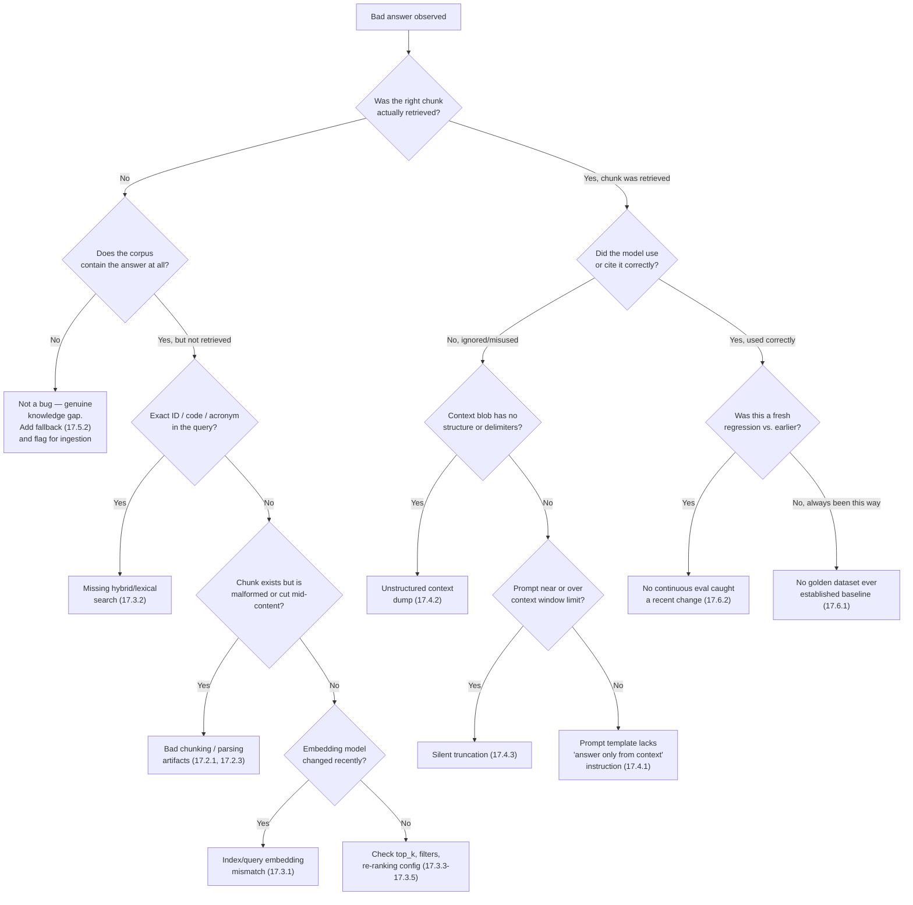

# Common Mistakes & Pitfalls

## Learning Objectives

By the end of this chapter, you will be able to:

- Recognize the most common chunking and ingestion mistakes before they poison an entire index
- Diagnose retrieval failures caused by embedding mismatches, missing hybrid search, or bad top-k tuning
- Identify prompt and generation mistakes that turn a good retrieval result into a hallucinated or uncitable answer
- Distinguish premature architectural complexity from genuinely necessary complexity
- Explain why "no evaluation harness" and "one-time evaluation" are both forms of the same underlying mistake
- Spot production and security mistakes — permission leakage, silent degradation, reindexing bottlenecks, and PII exposure — before they become incidents
- Use a systematic debugging flowchart to trace a bad answer back to its root cause
- Given a set of symptoms, name the specific mistake(s) most likely responsible

## Prerequisites for This Chapter

This chapter assumes you have completed Chapters 1–16, with particular reliance on:

- **[Chapter 3: Architecture & Internals](./03-architecture-and-internals.md)** and **[Chapter 5: Chunking Strategies](./05-chunking-strategies.md)** — you need to know what "good" chunking looks like to recognize what "bad" chunking looks like.
- **[Chapter 6: Vector Databases](./06-vector-databases.md)** and **[Chapter 8: Advanced Retrieval Techniques](./08-advanced-retrieval-techniques.md)** — hybrid search, re-ranking, and metadata filtering are the fixes for several mistakes below; you should already know how they work.
- **[Chapter 9: Prompt Engineering for RAG](./09-prompt-engineering-for-rag.md)** — the "answer only from context" instruction and citation formatting from that chapter are the direct antidotes to the prompting mistakes here.
- **[Chapter 10: RAG Architectures](./10-rag-architectures.md)** and **[Chapter 14: Agentic RAG](./14-agentic-rag.md)** — to recognize over-engineering, you need to know what Naive, Advanced, Corrective, and Agentic RAG actually cost in complexity and latency.
- **[Chapter 12: Production RAG Systems](./12-production-rag-systems.md)** and **[Chapter 15: Enterprise & Multimodal RAG](./15-enterprise-and-multimodal-rag.md)** — permissions, monitoring, and incremental indexing were covered there as things to build; here we look at what happens when they're skipped.
- **[Chapter 13: Evaluation & Testing](./13-evaluation-and-testing.md)** — you need to understand what a golden dataset and continuous evaluation *are* before you can appreciate what's lost without them.
- **[Chapter 16: Best Practices](./16-best-practices.md)** — this chapter is the direct mirror of that one. Reading them back to back reinforces both.

---

## 17.1 Why Study Failure Modes Explicitly

Most engineering education teaches the "happy path" — how to build the thing correctly. RAG has an unusual property that makes studying failure modes especially valuable: **every stage of the pipeline can fail silently.** A malformed chunk doesn't throw an exception. A mismatched embedding model doesn't crash your app. A missing "I don't know" instruction doesn't produce an error — it produces a confident, fluent, wrong answer that looks exactly like a right one.

This is the core danger of RAG systems compared to traditional software: **most RAG failures are quality failures, not availability failures.** Your dashboards stay green while your answers get worse. The only way to catch these problems early is to know what they look like *before* they show up in production, which is exactly what this chapter catalogs.

Every mistake below follows the same structure: what it looks like, why it's tempting, what symptom you'd actually observe, and the fix (with a pointer back to the chapter that teaches the fix in depth).

---

## 17.2 Chunking & Ingestion Mistakes

### Mistake 17.2.1 — Chunking Without Regard to Document Structure

**What it looks like:** Running a fixed-size character or token splitter (e.g., `RecursiveCharacterTextSplitter(chunk_size=1000)`) over every document type in your corpus indiscriminately — PDFs, Markdown, HTML, code files — without checking whether the resulting chunks respect logical boundaries.

**Why it's tempting:** A naive splitter is a single line of code, works immediately on any input, and requires zero domain knowledge of the document format. It's the default in every framework's quickstart tutorial, so it's what everyone reaches for first.

**Symptom:** You retrieve a chunk that ends with "as shown in the table below:" and the table itself — the actual data the user asked about — is either cut off, split across two separate chunks, or entirely in the *next* chunk that never got retrieved. Or a code block is split mid-function, so the LLM sees `def calculate_total(items):\n    total = 0\n    for` and nothing else. Or OCR'd technical manuals get split mid-sentence, mid-word, or even mid-number ("The maximum voltage is 2" | "40V" split into two chunks).

**Fix:** Use structure-aware chunking as covered in [Chapter 5](./05-chunking-strategies.md) — split on Markdown headers, keep tables and code blocks atomic, use recursive splitters that respect paragraph and sentence boundaries before falling back to raw character counts. Different document types need different splitters; a single one-size-fits-all splitter across a heterogeneous corpus is itself a red flag.

### Mistake 17.2.2 — Copy-Pasted Chunk Size Never Tuned to the Corpus

**What it looks like:** Every project in the company uses `chunk_size=1000, chunk_overlap=200` because that's what the first tutorial anyone read used, and it was never revisited — regardless of whether the corpus is dense legal contracts, short FAQ entries, or long technical manuals.

**Why it's tempting:** Chunk size feels like a minor implementation detail rather than a modeling decision, so it doesn't get the same scrutiny as, say, the choice of embedding model or LLM. It's also genuinely hard to know what to tune it *to* without an evaluation harness — which is itself Mistake 17.6.1.

**Symptom:** Retrieval quality varies wildly by document type within the same system. Short FAQ-style content retrieves fine (each entry naturally fits in ~1000 characters), but long technical procedures retrieve poorly because a single logical step spans 3-4 chunks and none of them alone contains enough context to be useful, while the embedding of any single chunk is too generic to rank highly for a specific query.

**Fix:** Treat chunk size as a hyperparameter, not a constant. Run the chunk-size sweep methodology from [Chapter 5](./05-chunking-strategies.md) against your own corpus and your own representative queries, using the retrieval metrics from [Chapter 13](./13-evaluation-and-testing.md) (recall@k, precision@k) to pick a size empirically rather than by convention. Different document types in the same corpus may legitimately warrant different chunk sizes.

### Mistake 17.2.3 — Ignoring Parsing Artifacts ("Garbage In, Garbage Out")

**What it looks like:** Extracted text still contains repeated page headers/footers ("Confidential — Acme Corp — Page 14 of 212"), running page numbers, watermark text, or garbled OCR output (e.g., "Тhe systеm rеquires" with mixed character sets from a bad scan), and none of it is cleaned before chunking and embedding.

**Why it's tempting:** Text extraction libraries (PyPDF, unstructured, etc.) "just work" for the happy path of clean, born-digital PDFs, so teams assume the output is clean without spot-checking it — especially with large corpora where manually reviewing every extracted document isn't feasible.

**Symptom:** Every chunk from a given document embeds a nearly identical fragment of the header/footer text, which shows up as near-duplicate noise in vector space and can dilute or dominate similarity scores for unrelated queries (a chunk might rank surprisingly high purely because it shares the boilerplate footer text with the query, if the query happens to mention the company name). Separately, OCR garbling produces embeddings that don't correspond to any coherent meaning, so those chunks essentially never retrieve correctly and the content is silently invisible to the system — worse than not having ingested the document at all, because it *looks* ingested.

**Fix:** Add a cleaning stage to your ingestion pipeline (covered in [Chapter 3](./03-architecture-and-internals.md)): strip repeated headers/footers with pattern detection, run OCR confidence checks and flag low-confidence pages for manual review or re-scanning, and normalize character encodings. Spot-check a random sample of extracted chunks from every new document source before it goes live — "did this actually parse cleanly" is a five-minute check that prevents weeks of confusing retrieval quality complaints.

---

## 17.3 Embedding & Retrieval Mistakes

### Mistake 17.3.1 — Embedding Model Mismatch Between Indexing and Querying

**What it looks like:** The index was built with one embedding model (say, `text-embedding-ada-002`), and at some point — a library upgrade, a cost-optimization migration, a new model release — the query-time embedding call switched to a different model (say, `text-embedding-3-small`) without re-embedding the existing corpus. Or, more subtly: two different services in the same system (an ingestion worker and a query API) drift out of sync on which model version they use.

**Why it's tempting:** Embedding model configuration is often just a string constant buried in a config file or environment variable, easy to change in one place without realizing it needs to be changed everywhere and the whole index needs to be rebuilt.

**Symptom:** Retrieval quality doesn't gracefully degrade — it collapses. Because embeddings from different models live in different, incompatible vector spaces (different dimensionality is an obvious crash; same dimensionality but different training is a silent quality disaster), similarity scores become close to meaningless. You'll see retrieval return chunks that are only vaguely or randomly related to the query, with cosine similarity scores that no longer correlate with actual relevance. If someone reduces dimensionality without re-indexing, you may get a hard error; if the dimensionality happens to match, you get the far more dangerous silent failure.

**Fix:** Treat the embedding model as part of your index's schema, not a runtime parameter. Version your indexes by embedding model (recall the model landscape discussion in [Chapter 4](./04-embeddings-fundamentals.md)), and any time you change embedding models, re-embed the *entire* corpus — there is no partial-migration shortcut. Store the embedding model identifier as metadata on the index itself and assert it matches at query time, so a mismatch fails loudly instead of silently.

### Mistake 17.3.2 — Relying on Vector Search Alone for Exact-Match Needs

**What it looks like:** A pure dense-vector retrieval pipeline is used for a domain full of exact-match lookups — product SKUs, error codes, part numbers, legal citation numbers, employee IDs, acronyms — and there's no lexical or hybrid component at all.

**Why it's tempting:** Semantic/dense retrieval is the "modern" default that every framework showcases, and it genuinely does outperform keyword search for conceptual, paraphrased queries. It's easy to assume it subsumes keyword search entirely, since it clearly understands meaning that keyword matching misses.

**Symptom:** A user searches for `"error code E-4471"` and gets back chunks discussing *various* error codes and general troubleshooting guidance, but never the one chunk that specifically documents E-4471 — because the embedding model treats "E-4471" as a near-meaningless token cluster and embeds it close to other alphanumeric strings in general, rather than treating it as the precise identifier it is. Similarly, a query for a specific product model number returns semantically "similar" products rather than an exact match.

**Fix:** Add lexical search (BM25/sparse) alongside dense vectors and combine them with a hybrid search strategy, as covered in [Chapter 8](./08-advanced-retrieval-techniques.md). Exact identifiers, codes, and acronyms are exactly the case lexical search was built for — dense embeddings should complement, not replace, keyword matching in any domain with structured identifiers.

### Mistake 17.3.3 — Retrieving Too Few or Too Many Chunks

**What it looks like:** `top_k` is set once (often `k=3` or `k=4`, copied from a tutorial) and never revisited, regardless of query complexity or corpus characteristics. Or the opposite: someone "fixes" a poor-recall problem by cranking `k` up to 20+ and passing all of it into the prompt.

**Why it's tempting:** `top_k` is a single integer, trivial to set and easy to forget about. Increasing it feels like a safe, low-effort way to "give the model more to work with" when answers seem incomplete.

**Symptom:** With `k` too low: multi-hop or comparative questions get incomplete answers because a fact that exists in the corpus (chunk rank 5, say) never makes it into the prompt at all — not a hallucination, but a hard ceiling on recall. With `k` too high: answer quality actually gets *worse*, not better, because the LLM has to sift through mostly irrelevant chunks to find the signal (a manifestation of the "lost in the middle" effect), token costs balloon, latency increases, and you're more likely to blow past the context window (see Mistake 17.4.3).

**Fix:** Tune `top_k` empirically against your evaluation set (again, [Chapter 13](./13-evaluation-and-testing.md)) rather than guessing, and prefer the pattern from [Chapter 8](./08-advanced-retrieval-techniques.md): retrieve a wider candidate pool, then re-rank and truncate to a smaller final set that actually goes into the prompt. That decouples "cast a wide net" from "only show the model the best evidence."

### Mistake 17.3.4 — No Re-Ranking Before Generation

**What it looks like:** The top-k results straight from the vector database's approximate nearest neighbor search are passed directly into the prompt with no intermediate re-ranking step.

**Why it's tempting:** Vector search already returns results "sorted by similarity," so it's easy to assume that ordering is good enough — adding a re-ranker means an extra model call, extra latency, and extra infrastructure.

**Symptom:** The *correct* chunk is somewhere in the top-k (often confirmed by manually inspecting retrieval logs), but not at the top, and it's buried under two or three chunks that are lexically or superficially similar to the query but don't actually answer it. The LLM, following the order and relative prominence of the context, weights the wrong chunks more heavily, or the correct chunk falls outside a tightened `top_k` used to manage context length (see Mistake 17.3.3), so it never even reaches the prompt.

**Fix:** Add a cross-encoder or LLM-based re-ranking stage, as covered in [Chapter 8](./08-advanced-retrieval-techniques.md), between initial retrieval and prompt construction. Bi-encoder vector similarity is a fast, approximate first pass; re-ranking is the higher-precision second pass that vector search alone can't provide.

### Mistake 17.3.5 — Ignoring Available Metadata Filtering

**What it looks like:** Every document in a multi-tenant, multi-department, or multi-date corpus is searched as one undifferentiated pool, even though rich metadata (department, document date, product line, access tier) was captured at ingestion time and is sitting unused in the vector database's metadata fields.

**Why it's tempting:** Filtering requires the application layer to know and pass the right filter for a given query (which department is this user in? which product are they asking about?), which is more upfront engineering than just embedding the query and searching everything.

**Symptom:** A user in the "Marketing" department asking about "the Q3 budget" gets chunks pulled from Finance, Sales, and Engineering's Q3 planning documents mixed in with Marketing's, because nothing narrowed the search space — and outdated documents (an old pricing sheet superseded eighteen months ago) regularly outrank the current one because vector similarity has no concept of recency or authority unless you explicitly encode and filter on it.

**Fix:** Apply metadata filters (department, date range, document type, access tier) before or alongside the vector search, as covered in [Chapter 6](./06-vector-databases.md) and [Chapter 8](./08-advanced-retrieval-techniques.md). This isn't just a relevance optimization — as you'll see in Mistake 17.7.1, metadata filtering is also often your first line of defense for access control.

---

## 17.4 Prompting & Generation Mistakes

### Mistake 17.4.1 — No "I Don't Know" Instruction

**What it looks like:** The prompt template says something like "Answer the user's question using the following context" and nothing else — no instruction for what to do when the context doesn't actually contain the answer.

**Why it's tempting:** It's the simplest possible prompt, and it works fine in every demo where the retrieved context happens to contain the answer, because demos are usually run against queries the builder already knows the corpus can answer.

**Symptom:** For any query where retrieval genuinely fails to surface the answer (a documentation gap, a badly phrased query, a genuinely out-of-scope question), the model doesn't fail visibly — it confidently blends its own pretrained knowledge with fragments of irrelevant retrieved text and produces a fluent, wrong answer with no indication anything went wrong. This is precisely the scenario in the [Prompt Engineering chapter's Real-World Scenario](./09-prompt-engineering-for-rag.md#real-world-scenario), and it's the single most dangerous failure mode in this entire chapter because it's indistinguishable from a correct answer without independently verifying the fact.

**Fix:** Add the explicit "answer only from context, say you don't know otherwise" instruction from [Chapter 9, Section 9.9](./09-prompt-engineering-for-rag.md). Treat it as non-negotiable in any production RAG prompt template.

### Mistake 17.4.2 — Unstructured Context Dumped Into the Prompt

**What it looks like:** Retrieved chunks are string-concatenated into one blob (`" ".join(chunks)`) and inserted into the prompt with no numbering, no source labels, and no delimiters separating one chunk from another or from the surrounding instructions.

**Why it's tempting:** It's the fastest way to get *something* working — `f"Context: {' '.join(chunks)}\n\nQuestion: {query}"` is one line and technically qualifies as "RAG."

**Symptom:** The model cannot produce reliable citations because it has no way to identify which source a given fact came from — if it attempts citations at all, they're often wrong or fabricated. When two chunks contain conflicting information (an old and a new version of a policy, say), the model blends them into a single muddled answer instead of recognizing them as two distinct, attributable claims. Debugging is also harder for you: when an answer is wrong, you can't tell from the logs which specific chunk misled the model.

**Fix:** Use the numbered, source-tagged, clearly delimited context formatting from [Chapter 9, Sections 9.3–9.4](./09-prompt-engineering-for-rag.md) — XML tags or numbered markdown sources, consistently applied across the application.

### Mistake 17.4.3 — Silent Context Window Truncation

**What it looks like:** The combined length of instructions, few-shot examples, retrieved chunks, and the question is never measured against the model's context window limit. It works fine in testing (short queries, small chunk counts) and is assumed to keep working in production.

**Why it's tempting:** Context windows on modern models are large enough (100K+ tokens for many models) that it's easy to assume you'll never hit the limit — until a query transformation technique from [Chapter 11](./11-query-transformation.md) (like multi-query retrieval) multiplies your candidate chunk count, or a `top_k` misconfiguration (Mistake 17.3.3) balloons context size unexpectedly.

**Symptom:** Answers become inexplicably worse for certain queries only, with no error in the logs — the API either silently truncates the input (some client libraries and proxies do this) or errors out in a way that's caught and retried with a smaller (differently truncated) context, producing inconsistent answers across retries. The chunk that actually contained the answer might be the one that got cut, right in the middle of a sentence, and there's no obvious signal pointing to "context window" as the cause because the failure looks just like a retrieval-quality problem.

**Fix:** Explicitly track and budget token counts for every component of the prompt, as covered in [Chapter 9, Section 9.10](./09-prompt-engineering-for-rag.md) — log prompt token counts on every request, set explicit budgets per section, and prefer contextual compression or tighter re-ranking over silently hoping everything fits.

---

## 17.5 Architecture Mistakes

### Mistake 17.5.1 — Reaching for Agentic/Graph RAG Before Validating Simpler Architectures Fail

**What it looks like:** A team starts a new RAG project by building a multi-agent, tool-calling, graph-traversing system from day one — because that's what the most impressive blog posts and conference talks describe — without first shipping and measuring a Naive or Advanced RAG baseline.

**Why it's tempting:** Agentic and Graph RAG architectures ([Chapter 10](./10-rag-architectures.md), [Chapter 14](./14-agentic-rag.md)) are genuinely exciting, well-marketed, and technically impressive to build. There's also a reasonable-sounding argument for it: "our domain is complex, so we'll need the sophisticated approach eventually — why not start there?"

**Symptom:** Months into the project, the team has a fragile system with high latency (multiple sequential LLM calls per query), high cost (every query might trigger several tool calls and re-planning loops), difficult debugging (failures can occur at any node in a graph or any step in an agent's plan), and — often — accuracy that's no better, or even worse, than a much simpler pipeline would have achieved, because the actual query distribution turned out to be dominated by simple, single-hop factual lookups that Naive RAG handles perfectly well.

**Fix:** Follow the progressive complexity principle from [Chapter 10](./10-rag-architectures.md): ship Naive RAG first, measure it against a real evaluation set ([Chapter 13](./13-evaluation-and-testing.md)) built from your actual query distribution, and only add complexity (query transformation, corrective retrieval, agentic planning, graph traversal) where the evaluation shows a *specific* failure mode that the added complexity specifically addresses. Complexity should be a response to measured evidence, not an assumption made in advance.

### Mistake 17.5.2 — No Fallback Path for Zero or Low-Confidence Retrieval

**What it looks like:** The pipeline always passes whatever the retriever returns into the prompt, even when similarity scores are uniformly low (indicating nothing relevant was found) or the retriever returns an empty result set for a niche or out-of-scope query.

**Why it's tempting:** Building a "happy path only" pipeline is simpler, and it's easy to assume retrieval will "usually" find something reasonably close, so a dedicated low-confidence branch feels like unnecessary extra engineering.

**Symptom:** For genuinely out-of-scope questions (asking a company's internal HR bot about a topic never covered in any document), the system still forces a "best effort" answer out of whatever marginally-related chunks happened to rank highest, rather than recognizing the retrieval confidence was low and responding accordingly. This compounds directly with Mistake 17.4.1 — even a well-written "say I don't know" instruction depends on the model itself judging relevance, which is less reliable than the system checking similarity scores or corrective-retrieval signals directly.

**Fix:** Implement a confidence check and fallback path, as in the Corrective RAG (CRAG) pattern from [Chapter 10](./10-rag-architectures.md): when top similarity scores fall below a threshold, or the vector search returns nothing, route to a fallback (a "not enough information" response, a web search fallback, or an escalation to a human) instead of forcing a generation from weak evidence.

---

## 17.6 Evaluation Mistakes

### Mistake 17.6.1 — Shipping With No Golden Dataset or Evaluation Harness

**What it looks like:** The RAG system is validated purely by the engineering team trying a handful of queries by hand, declaring "looks good," and shipping. There's no curated set of representative question/answer/expected-source triples, and no automated metric computation.

**Why it's tempting:** Building a golden dataset is genuinely tedious, unglamorous work — someone has to write realistic questions, determine correct answers, and identify which source chunks should support them. It's easy to defer indefinitely in favor of visible feature work, especially under deadline pressure, when manual spot-checking *feels* sufficient.

**Symptom:** The system performs well on the small set of queries the team happened to try during development (often skewed toward easy, well-documented topics) and then performs unpredictably in production on the much wider and messier real query distribution — a regression only becomes visible when users complain, at which point there's no baseline to compare against to even confirm whether things got worse or were always this bad.

**Fix:** Build the golden dataset and automated evaluation harness described in [Chapter 13](./13-evaluation-and-testing.md) — a representative set of queries with known-correct answers and expected retrieved sources, scored with retrieval metrics (recall@k, MRR) and generation metrics (faithfulness, answer relevancy) via tools like Ragas or DeepEval, *before* shipping, not after complaints arrive.

### Mistake 17.6.2 — One-Time Evaluation Instead of Continuous Evaluation

**What it looks like:** An evaluation harness *does* exist, and it *was* run — once, before the initial launch — but it's never re-run after subsequent changes: a new embedding model, an updated prompt template, a chunking parameter tweak, an LLM provider or model version upgrade.

**Why it's tempting:** Running the evaluation suite once feels like it "proved" the system works, and re-running it after every small change feels like excessive process overhead, especially when the change seems unrelated to retrieval or generation quality (e.g., "we just upgraded a dependency" or "we just swapped providers for cost reasons").

**Symptom:** Silent regressions. A well-known failure pattern: an LLM provider deprecates a model version and auto-upgrades everyone to a newer one with different behavior (more verbose, different citation habits, subtly different instruction-following), and answer quality quietly degrades for weeks before anyone notices, because there was no automated check re-run against the golden dataset at the time of the change to catch it.

**Fix:** Wire evaluation into CI/CD, as recommended in [Chapter 13](./13-evaluation-and-testing.md) — run the golden dataset evaluation automatically on every change to prompts, chunking configuration, embedding models, or LLM provider/version, and alert on metric regressions before they reach users, not after.

---

## 17.7 Production & Security Mistakes

### Mistake 17.7.1 — Retrieval That Ignores Source-System Permissions

**What it looks like:** Documents are ingested from source systems that have their own access control (a Confluence space restricted to Legal, a Google Drive folder shared only with Finance, a Slack channel with limited membership), but the RAG index treats all ingested content as uniformly searchable by any authenticated user of the RAG application.

**Why it's tempting:** Implementing document-level or field-level access control in the vector database is real engineering work — it requires propagating and continuously syncing permission metadata from every source system, and it's invisible in a demo where everyone testing the system already has full access to everything.

**Symptom:** An employee outside the Legal or Finance team asks a general question and receives an answer that quotes or paraphrases content from a restricted document they should never have been able to see — the LLM doesn't know or care about access control, so if a restricted chunk gets retrieved, it gets used. This is a compliance and security incident, not just a quality bug, and it's exactly the concern raised in [Chapter 15](./15-enterprise-and-multimodal-rag.md) regarding enterprise multi-tenancy.

**Fix:** Propagate source-system permissions into your vector database as metadata and enforce them as a mandatory filter on every query — never rely on the LLM prompt to "not mention" restricted content. This is the security-critical instance of the metadata filtering discussed in Mistake 17.3.5, and it's covered in depth in [Chapter 12](./12-production-rag-systems.md) and [Chapter 15](./15-enterprise-and-multimodal-rag.md).

### Mistake 17.7.2 — No Monitoring, So Quality or Cost Degrades Silently

**What it looks like:** The RAG system is deployed with infrastructure-level monitoring (uptime, latency, error rates) but no monitoring of retrieval quality, answer quality, or per-query cost over time.

**Why it's tempting:** Infrastructure monitoring is standard practice that every team already knows how to set up; RAG-quality monitoring (tracking retrieval scores, citation rates, faithfulness over time, cost per query) is a newer and less standardized discipline that's easy to skip, especially since the system "looks" healthy from an uptime/latency dashboard the entire time.

**Symptom:** Retrieval quality drifts as the corpus grows and diversifies (documents added later don't chunk or embed as cleanly as the originally curated set), or an upstream API price/quota change quietly triples the per-query cost, or a change elsewhere in the stack causes average context length — and therefore token spend — to creep upward over weeks. None of this trips an infrastructure alert because the system is technically "up" and "fast" the entire time; the first sign anyone notices is a surprise cloud bill or a spike in user complaints that no one can immediately explain because there's no historical quality baseline to compare against.

**Fix:** Add RAG-specific observability as covered in [Chapter 12](./12-production-rag-systems.md) — track retrieval similarity score distributions, citation/faithfulness rates (sampled and scored automatically, e.g. via the same tools from [Chapter 13](./13-evaluation-and-testing.md)), token usage and cost per query, and set alerts on trend degradation, not just outages.

### Mistake 17.7.3 — No Incremental Indexing

**What it looks like:** Adding or updating documents requires re-embedding and re-indexing the *entire* corpus from scratch, because the ingestion pipeline was never designed to update or delete individual documents in place.

**Why it's tempting:** A full rebuild is conceptually simpler to implement and reason about than a correct incremental update path (which has to handle deletions, updates to existing documents, and de-duplication correctly) — and it's perfectly fine when the corpus is small and static, which it usually is in an early prototype.

**Symptom:** As the corpus grows from hundreds to hundreds of thousands of documents, the full reindex job that used to take minutes starts taking hours, and eventually becomes an operational bottleneck: documentation updates that should be reflected in the RAG system within minutes are stale for a day or more because the reindex job only runs on a nightly schedule (to avoid the embedding API cost and runtime of running it more often), and a single failed reindex run can leave the system serving a stale or partially-rebuilt index.

**Fix:** Design ingestion for incremental updates from the start, as covered in [Chapter 12](./12-production-rag-systems.md) — track document versions/hashes so only changed documents are re-chunked and re-embedded, support targeted upsert and delete operations against the vector database rather than full rebuilds, and reserve full reindexes for genuine schema or embedding-model migrations.

### Mistake 17.7.4 — Sending Sensitive/PII Data to Third-Party LLM APIs Unmasked

**What it looks like:** Retrieved chunks (and sometimes user queries themselves) containing personally identifiable information, health records, financial details, or other regulated data are sent as-is to a third-party LLM API for generation, with no masking, redaction, or review of the vendor's data processing terms.

**Why it's tempting:** Masking and redaction add a processing step and can occasionally reduce answer quality if done crudely (redacting a name a user is specifically asking about, for instance), so it's tempting to skip it "for now" in a prototype and worry about it before the "real" launch — a step that, in practice, often gets forgotten because the prototype quietly becomes the production system.

**Symptom:** An internal audit or a customer security questionnaire reveals that customer PII, employee health information, or confidential contract terms have been flowing to a third-party API without a signed data processing agreement (DPA) or without confirming the vendor's data retention/training-use policy — a compliance finding that can trigger regulatory exposure (e.g., under GDPR or HIPAA) regardless of whether any actual misuse of the data occurred.

**Fix:** Apply PII detection and masking/redaction before data leaves your infrastructure, as covered in [Chapter 12](./12-production-rag-systems.md) and [Chapter 15](./15-enterprise-and-multimodal-rag.md), and confirm a data processing agreement and appropriate data handling terms (no training on your data, defined retention) are in place with any third-party LLM provider before sensitive data touches their API — or use a private/self-hosted deployment for the most sensitive workloads.

---

## 17.8 Debugging Flowchart: From "Bad Answer" to Root Cause

When a user reports a bad RAG answer, the mistakes above map onto a systematic diagnostic path. Work top-down: confirm retrieval first, then prompting, then architecture/production factors.

Use this flowchart as a checklist during incident response: it forces you to rule out retrieval before blaming the model, and to rule out prompting before reaching for architectural changes — the same "diagnose before you redesign" discipline from [Chapter 10](./10-rag-architectures.md).

---

## Real-World Scenario

**Company:** A healthcare SaaS provider building an internal RAG assistant over clinical policy documents, billing procedures, and compliance guidelines for its support staff.

**The setup:** The team shipped quickly. Chunking used the default `chunk_size=1000` from a LangChain tutorial (Mistake 17.2.2), applied uniformly across PDFs that mixed narrative policy text with dense billing-code tables — tables were frequently split mid-row (Mistake 17.2.1). Retrieval was pure vector search with `top_k=4` and no re-ranking (Mistakes 17.3.3/17.3.4). The prompt had no "I don't know" fallback (Mistake 17.4.1). There was no golden dataset — the team validated with about ten manual test questions before launch and called it done (Mistake 17.6.1).

**The incident:** Three weeks in, a support agent asked the assistant which billing code applied to a specific outpatient procedure. The relevant billing table had been split by the chunker so that the procedure name landed in one chunk and its corresponding code landed in the *next* chunk — and because there was no re-ranking, the retriever's top 4 results included the procedure-name chunk but not the code chunk (which ranked 6th, just outside `top_k`). Lacking the actual code, the model — with no instruction to admit it didn't know — inferred a plausible-looking but incorrect code based on similar procedures it recalled from its own training. The agent submitted a claim with the wrong code, and it was rejected by the payer, delaying reimbursement and triggering a compliance review of "why is the internal assistant giving billing code guidance that doesn't match our documentation."

**Diagnosis:** Following a flowchart much like the one in Section 17.8, engineers first checked whether the correct chunk was retrieved at all. It was in the vector database, but ranked outside `top_k=4` — confirming a retrieval, not a hallucination-only, problem. Inspecting the chunk itself revealed the split-table problem: the code was structurally separated from the procedure name it belonged to, so its embedding alone was a weak match for the query. This pointed to two compounding root causes rather than one: bad chunking created a weak, structurally incomplete chunk, and the retrieval config (no re-ranking, tight `top_k`) failed to surface that weak-but-relevant chunk anyway — and once retrieval failed, there was no "I don't know" instruction to stop the model from guessing.

**The fix:** Three changes, mapped directly to sections in this chapter:
1. Re-chunked billing documents with table-aware splitting that kept each table row (procedure + code + description) as an atomic unit, per Mistake 17.2.1's fix.
2. Added a re-ranking stage and widened the initial candidate pool before truncating to the final context, per Mistake 17.3.4.
3. Added the "answer only from context, say I don't know" instruction, per Mistake 17.4.1, so that even if a future retrieval gap occurred, the assistant would flag it instead of guessing.

The team also finally built the golden dataset they should have started with (Mistake 17.6.1), using this very incident's query as one of the first entries — ensuring a regression test would have caught the problem before it ever reached a support agent.

---

## Best Practices

This chapter is the inverse of [Chapter 16: Best Practices](./16-best-practices.md) — read together, they form a matched checklist: for every mistake cataloged here, Chapter 16 states the corresponding positive practice. As a quick bridge:

- Where this chapter warns against default chunk sizes and structure-blind splitting, Chapter 16 recommends corpus-specific, structure-aware chunking.
- Where this chapter warns against pure vector search and no re-ranking, Chapter 16 recommends hybrid search and a re-ranking stage as defaults.
- Where this chapter warns against missing "I don't know" instructions and unstructured context, Chapter 16 recommends the full structured prompt template.
- Where this chapter warns against premature agentic complexity, Chapter 16 recommends starting simple and adding complexity only where evaluation justifies it.
- Where this chapter warns against no evaluation and no monitoring, Chapter 16 recommends golden datasets, continuous evaluation, and production observability as non-negotiable.

If you've internalized this chapter's failure modes, Chapter 16 will read less like a list of aspirational advice and more like a list of things you now know exactly *why* to do.

## Common Mistakes — Quick Reference

| Mistake | Symptom | Fix | Chapter Reference |
|---|---|---|---|
| Structure-blind chunking | Tables/code/sentences split mid-content, key data missing from any single chunk | Structure-aware, format-specific chunking | Ch 5 |
| Copy-pasted chunk size | Retrieval quality varies wildly by document type | Empirically tune chunk size per corpus | Ch 5, 13 |
| Uncleaned parsing artifacts | Near-duplicate header/footer noise; OCR-garbled chunks never retrieve | Clean/normalize text at ingestion, spot-check extraction | Ch 3 |
| Embedding model mismatch | Similarity scores become meaningless; retrieval quality collapses | Version indexes by embedding model; re-embed fully on change | Ch 4 |
| Vector-only search for exact matches | Exact IDs/codes/acronyms never retrieved | Add hybrid (lexical + dense) search | Ch 8 |
| Wrong `top_k` (too low/high) | Missing facts (too low) or noisy, diluted answers (too high) | Tune `top_k` against eval metrics; widen-then-rerank | Ch 8, 13 |
| No re-ranking | Correct chunk retrieved but ranked too low to reach the prompt | Add cross-encoder/LLM re-ranking stage | Ch 8 |
| Ignoring metadata filters | Irrelevant/outdated/cross-tenant content pollutes results | Filter by department, date, access tier before/with vector search | Ch 6, 8 |
| No "I don't know" instruction | Confident hallucination when context lacks the answer | Add explicit "answer only from context" instruction | Ch 9 |
| Unstructured context dump | Model can't cite sources; conflicting chunks get blended | Numbered/tagged, delimited context formatting | Ch 9 |
| Silent context window truncation | Inconsistent answers, no error logged, key chunk cut off | Track token budgets explicitly; compress/re-rank before truncation | Ch 9 |
| Premature agentic/graph complexity | High latency/cost, fragile system, no accuracy gain over simple RAG | Validate Naive/Advanced RAG first; add complexity only with evidence | Ch 10, 14 |
| No fallback for low-confidence retrieval | Forced "best effort" answers on out-of-scope queries | Confidence threshold + fallback path (CRAG-style) | Ch 10 |
| No golden dataset/eval harness | Regressions invisible until users complain | Build golden dataset, automate retrieval/generation metrics | Ch 13 |
| One-time evaluation only | Silent quality regressions after model/prompt/config changes | Continuous evaluation wired into CI/CD | Ch 13 |
| Ignoring source-system permissions | Restricted content leaks through generated answers | Propagate and enforce permissions as mandatory metadata filters | Ch 12, 15 |
| No production monitoring | Quality/cost degrade for weeks unnoticed | RAG-specific observability: scores, faithfulness, cost trends | Ch 12 |
| No incremental indexing | Reindex jobs become an hours-long bottleneck as corpus grows | Version-based incremental upsert/delete, not full rebuilds | Ch 12 |
| Unmasked PII sent to third-party APIs | Compliance findings, missing DPA, regulatory exposure | PII masking/redaction; signed DPA or private deployment | Ch 12, 15 |

## Summary

Nearly every mistake in this chapter shares a common shape: it is easy to introduce, invisible in a demo, and silent in production until someone notices a wrong answer, a compliance gap, or a runaway cost. Chunking mistakes (structure-blind splitting, untuned sizes, uncleaned parsing artifacts) poison the corpus before retrieval even runs. Embedding and retrieval mistakes (model mismatches, vector-only search, bad `top_k`, missing re-ranking, unused metadata filters) mean the right information often exists in the index but never reaches the prompt. Prompting mistakes (no "I don't know" instruction, unstructured context, silent truncation) turn even good retrieval into unreliable or uncitable answers. Architectural mistakes — reaching for agentic or graph complexity before validating simpler baselines, or shipping with no fallback for low-confidence retrieval — trade robustness for sophistication that the query distribution may not need. Evaluation mistakes (no golden dataset, one-time-only testing) mean none of the above would even be caught before or after it ships. And production/security mistakes (ignored permissions, no monitoring, no incremental indexing, unmasked PII) turn quality problems into compliance and operational incidents. The fix for essentially every mistake here was already taught in an earlier chapter — this chapter's job was to make the failure mode recognizable *before* you're debugging it in production.

## Knowledge Check

1. Why do most RAG failures manifest as silent quality problems rather than visible errors or crashes? What does that imply about how you should monitor a RAG system?
2. A team retrieves the correct chunk into the top-k candidate pool, but the final answer doesn't reflect it. List two distinct mistakes from this chapter that could each independently explain this, and describe how you'd tell them apart.
3. Explain why "always use hybrid search" and "always use pure vector search" are both wrong defaults. What property of the query distribution should determine the choice?
4. A team argues that building a golden evaluation dataset is a waste of time because "we already tested it manually and it worked." What is wrong with this reasoning, and what specific failure mode does it leave the team blind to?
5. Why is reaching for agentic or graph RAG before testing a simpler architecture considered a mistake even if the agentic system eventually performs well? What is actually being criticized — the destination or the process?
6. Describe a scenario where ignoring metadata filtering causes both a relevance problem and a security problem simultaneously. Why do these two concerns often point to the same fix?

## Hands-On Exercise

A team reports the following symptoms about their internal RAG chatbot, built over a corpus of engineering runbooks and incident postmortems:

- Users frequently get answers that sound confident and well-written, but engineers who know the runbooks well say roughly 1 in 5 answers contains a fact that isn't actually in any document.
- When engineers manually search the vector database for the exact chunk that should answer a given question, they often find it exists and is well-formed — but it's usually not in the top 3 results the app displays.
- The system was evaluated once, right after launch six months ago, using about fifteen example questions the team wrote by hand. It has not been re-evaluated since, despite the LLM provider being switched twice since then for cost reasons.
- The prompt template is: `"Context:\n{chunks}\n\nQuestion: {question}\nAnswer:"` with the top 3 retrieved chunks joined by newlines.

**Your task:**

1. Identify at least three distinct mistakes from this chapter that these symptoms point to, citing the specific subsection for each.
2. For each mistake identified, state which specific symptom in the description is the evidence for it (don't just list the mistake — connect it to the observed behavior).
3. Propose an order of operations for fixing these — which fix would you make first, and why, given that some of these mistakes compound with each other (hint: consider which fix would make the others easier to verify).
4. One symptom in the list is *not* fully explained by the three most obvious mistakes — identify it and explain what additional investigation (not just a code fix) it calls for.

## Further Reading

- Anthropic — "Building Effective Agents" (on the cost of unnecessary architectural complexity, directly relevant to Mistake 17.5.1)
- Pinecone / Weaviate engineering blogs — "Common pitfalls in production vector search" (retrieval-tuning postmortems from real deployments)
- Ragas documentation — "Faithfulness" and "Context Precision" metrics, useful for automatically detecting several of this chapter's mistakes (Mistakes 17.4.1, 17.3.4) in an evaluation pipeline
- OWASP Top 10 for LLM Applications — particularly "Sensitive Information Disclosure" and "Excessive Agency," which map to Mistakes 17.7.1 and 17.7.4
- Revisit [Chapter 13](./13-evaluation-and-testing.md) for the full methodology behind golden datasets and continuous evaluation referenced throughout Section 17.6
- Revisit [Chapter 16](./16-best-practices.md) immediately after this chapter — reading the positive and negative framings back-to-back is the fastest way to cement both

  <a href="./16-best-practices.md">← Previous: Best Practices</a>
  <a href="./00-index.md">🏠 Index</a>
  <a href="./18-tools-and-libraries-landscape.md">Next: Tools & Libraries Landscape →</a>

