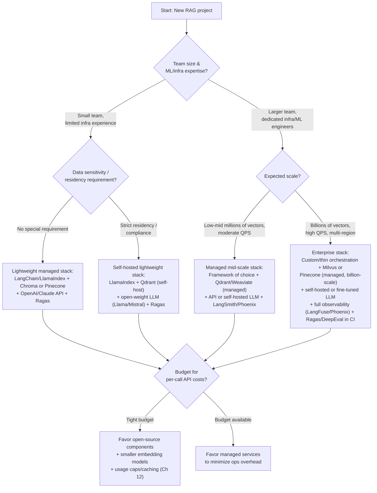

# Chapter 18: Tools & Libraries Landscape

Across this course you've met a lot of individual tools in the place they were most relevant — Chroma when we first stood up a vector store in [Chapter 6](./06-vector-databases.md), LangChain when we built the first pipeline in [Chapter 7](./07-building-your-first-rag.md), Ragas when we needed to score answers in [Chapter 13](./13-evaluation-and-testing.md), LangGraph when we built a planning loop in [Chapter 14](./14-agentic-rag.md). That's the right way to learn them — in context, solving a real problem. It's the wrong way to *remember* them, because the pieces never get laid side by side.

This chapter is that side-by-side view: a single reference map of the RAG ecosystem, organized by the job each category of tool does, plus the research papers that most of this tooling is a direct implementation of. Treat it less like a chapter to "finish" and more like a page to bookmark and revisit — the tools will change over the next year, the categories and the reasoning for choosing between them will not.

## Learning Objectives

By the end of this chapter, you will be able to:

- Recall and compare the major tools in each layer of the RAG stack: orchestration, embeddings, vector storage, generation, evaluation, observability, and agent orchestration
- Explain what specific problem each tool category exists to solve, not just its name
- Use a structured decision process to choose a starter stack for a new project based on team size, scale, budget, and hosting preference
- Identify the must-read research papers behind modern RAG techniques and explain, in one sentence, why each one matters practically
- Avoid the two most common tool-selection mistakes: chasing hype and ignoring total cost of ownership

## Prerequisites for This Chapter

This chapter consolidates and cross-references tools introduced earlier — you don't need to re-read those chapters, but they're where the deeper "how it works" explanations live:

- [Chapter 3: Architecture & Internals](./03-architecture-and-internals.md) — document processing libraries (loaders, parsers, OCR)
- [Chapter 4: Embeddings Fundamentals](./04-embeddings-fundamentals.md) — embedding models and MTEB
- [Chapter 6: Vector Databases](./06-vector-databases.md) — vector database internals and comparison
- [Chapter 7: Building Your First RAG Pipeline](./07-building-your-first-rag.md) — orchestration frameworks in action
- [Chapter 13: Evaluation & Testing](./13-evaluation-and-testing.md) — evaluation frameworks and metrics
- [Chapter 14: Agentic RAG](./14-agentic-rag.md) — agent orchestration frameworks and tool calling

---

## 1. Orchestration Frameworks

**The problem they solve**: Building a RAG pipeline from raw API calls means writing your own glue code for chunking, embedding, retrieval, prompt assembly, and calling the LLM — and rewriting it every time you swap a vector database or LLM provider. Orchestration frameworks give you standard abstractions (`Document`, `Retriever`, `Chain`/`Pipeline`) so the pieces snap together and are swappable.

### LangChain

The most widely adopted framework, with the largest ecosystem of integrations (hundreds of document loaders, vector stores, and LLM providers behind a common interface). Its core abstraction is the "chain" (and, increasingly, LangGraph — covered in Section 7 — for anything with loops or branches). Strength: breadth of integrations and community examples for almost any use case. Weakness: the API surface is large and has changed across versions, which can make older tutorials misleading.

### LlamaIndex

Originally built specifically for RAG (its name was literally "GPT Index"), so its retrieval-side abstractions — indices, retrievers, query engines, node post-processors — are more purpose-built and often require less boilerplate for a pure retrieval pipeline than LangChain does. Strength: best-in-class for retrieval-centric applications, strong data connector ecosystem. Weakness: smaller ecosystem than LangChain for non-retrieval agent/tool-calling patterns, though this gap has narrowed significantly.

### Haystack

Built by deepset, Haystack leans toward explicit, production-oriented pipeline definitions (you wire together named components in a directed graph) rather than the more implicit chaining style of LangChain. Strength: clean separation of components, good for teams that want explicit control over every pipeline step and strong support for classic IR components (BM25, retrievers) alongside vector search. Weakness: smaller community and integration count than LangChain.

### Comparison Table

| Framework | Learning Curve | Strength | Best Fit |
|---|---|---|---|
| **LangChain** | Medium (large API surface) | Broadest integration ecosystem, most tutorials/examples | Teams that want maximum flexibility and are willing to read docs carefully |
| **LlamaIndex** | Low–Medium | Purpose-built retrieval abstractions, strong data connectors | Retrieval-heavy applications (Chat-with-docs, knowledge assistants) |
| **Haystack** | Medium | Explicit, production-oriented pipeline graphs | Teams wanting tight control and strong hybrid (BM25 + vector) support |

**Practical note**: None of these are mutually exclusive with rolling your own thin orchestration layer. Many production teams use a framework for prototyping and data connectors, then hand-roll the hot path (retrieval + prompt assembly) for full control over latency and behavior. Revisit [Chapter 7](./07-building-your-first-rag.md) for a working example of both LangChain and LlamaIndex on the same task.

---

## 2. Embedding Models

**The problem they solve**: Turning text into vectors that capture semantic meaning, so "closeness in vector space" approximates "closeness in meaning." Covered in depth in [Chapter 4](./04-embeddings-fundamentals.md); here's the full landscape side by side.

| Model | Open or Closed | Typical Dimensions | Notable Strength |
|---|---|---|---|
| **OpenAI `text-embedding-3-small`** | Closed (API) | 1536 (truncatable) | Cheap, fast, strong general-purpose default; zero infrastructure |
| **OpenAI `text-embedding-3-large`** | Closed (API) | 3072 (truncatable) | Higher accuracy on nuanced queries; higher cost/storage |
| **BAAI BGE (BGE-large, BGE-M3)** | Open | 1024 (BGE-M3 supports multi-vector) | Strong MTEB retrieval scores; BGE-M3 does dense + sparse + multi-vector in one model |
| **E5 (intfloat/e5-large-v2, multilingual-e5)** | Open | 1024 | Strong contrastive-trained quality; requires `query:`/`passage:` prefixes |
| **Jina Embeddings** | Open (some tiers) | 768–1024 | Long-context support (8K+ tokens), useful for large chunks |
| **Nomic Embed** | Open (fully, incl. training data) | 768 | Fully auditable pipeline, long context, popular for compliance-sensitive open stacks |
| **Voyage AI** | Closed (API) | 1024–1536 | Domain-tuned variants (code, finance, law); consistently near the top of MTEB retrieval leaderboards |

**How to choose**: Start with the practical evaluation dimensions from [Chapter 4, Section 5](./04-embeddings-fundamentals.md) — retrieval accuracy on *your* data, latency, dimensionality/storage cost, multilingual needs, context length, and cost — rather than the raw MTEB leaderboard rank alone.

---

## 3. Vector Databases

**The problem they solve**: Storing millions of embeddings and finding the nearest ones to a query vector in milliseconds — a job ordinary relational databases were never built for, as explained in [Chapter 6](./06-vector-databases.md). Below is the same comparison, now placed alongside the frameworks and embedding models above so you can see how a "full stack" fits together.

| Database | Type | Open Source? | Best For | Scale Ceiling | Ops Overhead |
|---|---|---|---|---|---|
| **FAISS** | Library (in-process) | Yes | Learning, prototyping, custom pipelines | Millions (single machine) | None (no server) |
| **Chroma** | Embedded / lightweight server | Yes | Beginners, small apps, prototyping | Low millions | Low |
| **Qdrant** | Server (self-host or cloud) | Yes | Production apps needing rich filtering | Hundreds of millions | Low–Medium |
| **Milvus** | Distributed server | Yes | Enterprise, billion-scale, distributed | Billions | High |
| **Pinecone** | Fully managed cloud | No | Fast time-to-production, no ops team | Billions (managed) | None (fully managed) |
| **Weaviate** | Server (self-host or cloud) | Yes | Hybrid search, schema/graph-like needs | Hundreds of millions | Low–Medium |
| **pgvector** | Postgres extension | Yes | Teams already running Postgres | Low–mid millions | None extra (reuse Postgres) |

**Full-stack pairing intuition**: a Chroma + FAISS-style local setup pairs naturally with a prototyping-stage LangChain/LlamaIndex app and an API embedding model; a Qdrant/Milvus/Weaviate setup pairs with a production orchestration layer (framework or custom) and often a self-hosted embedding model to keep the whole pipeline inside your own infrastructure boundary. Section 8 turns this intuition into an explicit decision process.

---

## 4. LLMs as the RAG Generator

The generator is the component that turns retrieved context into a final answer. Benchmarks and rankings here change monthly, so rather than quoting numbers that will be stale by the time you read this, here's general positioning and the criteria that actually drive the choice.

| Family | General Positioning |
|---|---|
| **GPT family (OpenAI)** | Broad general capability, mature tool-calling/function-calling support, large ecosystem of integrations; common default for API-based generation |
| **Claude family (Anthropic)** | Strong at careful instruction-following, long-context handling, and citation-grounded answers; frequently chosen for RAG systems that need faithful, well-hedged answers over raw context |
| **Gemini family (Google)** | Very large context windows, strong native multimodal input handling; a natural fit when a RAG system needs to reason over images/video alongside text ([Chapter 15](./15-enterprise-and-multimodal-rag.md)) |
| **Llama family (Meta, open weights)** | Open weights you can self-host and fine-tune; common choice when data residency or cost-at-scale rules out API-only generators |
| **Mistral family (open + API)** | Efficient, strong performance-per-parameter, popular for self-hosted deployments with limited GPU budget |
| **Qwen family (Alibaba, open weights)** | Strong multilingual performance and competitive open-weights quality; common choice for non-English-first deployments |

**How to choose a generator LLM for RAG** — in rough priority order:

1. **Context window** — does it comfortably fit your retrieved chunks plus system prompt plus conversation history, with margin? A model with a nominally huge context window can still degrade on information buried in the middle of a long prompt ("lost in the middle") — test with your actual chunk counts, don't just check the max token spec.
2. **Tool-calling support** — required if your RAG system is agentic ([Chapter 14](./14-agentic-rag.md)) and needs to call retrieval or other tools mid-reasoning, not just generate from a fixed context block.
3. **Latency** — a chat UI needs sub-second-to-a-few-seconds response; a batch report-generation job can tolerate much more. Larger/more capable models are almost always slower.
4. **Cost** — API pricing is per-token and scales with both context length and output length; a large retrieved-context RAG call can cost meaningfully more per query than a short chat message. Self-hosted open-weight models trade per-call cost for fixed infrastructure cost.
5. **Data residency / compliance** — if regulations or contracts require data to never leave your infrastructure, this alone rules out API-only providers regardless of quality, pushing you toward Llama, Mistral, or Qwen self-hosted.

---

## 5. Evaluation Frameworks

**The problem they solve**: You can't tune what you don't measure. These tools compute standardized metrics (faithfulness, answer relevance, context precision/recall — from [Chapter 13](./13-evaluation-and-testing.md)) instead of you hand-rolling scoring logic.

| Framework | Focus | Notes |
|---|---|---|
| **Ragas** | RAG-specific metrics (faithfulness, answer relevancy, context precision/recall) | Purpose-built for RAG; the most common starting point for a first evaluation harness |
| **DeepEval** | Broad LLM evaluation, "pytest-style" unit tests for LLM outputs | Good fit if your team already thinks in test suites and wants CI-integrated evaluation |
| **TruLens** | Tracing + evaluation combined, feedback functions attached to live traces | Useful when you want to evaluate production traffic, not just an offline test set |
| **LangSmith** | Tracing, dataset management, and evaluation, tightly integrated with LangChain | Best fit if you're already standardized on LangChain/LangGraph |

**How to choose**: Ragas is the lowest-friction way to get faithfulness/relevance/precision/recall numbers on a held-out test set; DeepEval if you want evaluation to live inside your existing test suite and CI pipeline; TruLens or LangSmith if you need the evaluation to be wired directly into live traces rather than run separately offline. Many production teams end up running more than one — an offline Ragas harness for regression testing plus LangSmith/TruLens for live monitoring.

---

## 6. Observability & Monitoring Tools

**The problem they solve**: Evaluation frameworks tell you *if* quality is good on a test set; observability tools tell you *what actually happened* on a specific production request — which chunks were retrieved, what prompt was sent, how long each step took, and where a failure occurred. This is the debugging and monitoring layer covered conceptually in [Chapter 12](./12-production-rag-systems.md).

| Tool | Specializes In |
|---|---|
| **Arize Phoenix** | Open-source tracing and evaluation for LLM apps; strong at visualizing embeddings and retrieval quality drift over time |
| **LangFuse** | Open-source tracing, prompt management, and cost/latency analytics; framework-agnostic (works outside LangChain despite the name similarity) |
| **Weights & Biases (W&B)** | Experiment tracking or fine-tuning/training runs and, via W&B Weave, LLM application tracing; most valuable if your team already uses W&B for model training |

**Distinction to keep straight**: evaluation frameworks (Section 5) answer "is quality good?" against a curated dataset; observability tools (this section) answer "what happened on this exact request, in production, right now?" A mature RAG system typically uses both — Section 8's decision guide assumes you'll add at least one observability tool once you're past the prototype stage.

---

## 7. Agent Orchestration Frameworks

**The problem they solve**: Once a RAG system needs to plan multi-step retrieval, call tools conditionally, or loop until a quality bar is met — the agentic patterns from [Chapter 14](./14-agentic-rag.md) — a simple linear chain isn't enough. These frameworks manage state, branching, and tool-calling loops explicitly.

| Framework | Model | Best Fit |
|---|---|---|
| **LangGraph** | Explicit state graph (nodes + edges), built by the LangChain team | Fine-grained control over agent loops, branching, and human-in-the-loop checkpoints; the default choice if you're already in the LangChain ecosystem |
| **AutoGen** | Multi-agent conversation framework (Microsoft) | Scenarios modeled as multiple specialized agents "talking" to each other (e.g., a researcher agent and a critic agent) |
| **CrewAI** | Role-based multi-agent framework | Fast to prototype role-based agent teams ("researcher," "writer," "reviewer") with less boilerplate than AutoGen or raw LangGraph |
| **DeepAgents** | Lightweight planning-and-tool-use agent scaffold | Minimal-dependency agent loops when you want the planning pattern without a heavy framework |
| **Semantic Kernel** | Microsoft's agent/plugin framework, strong .NET/C# support | Best fit for teams building in the Microsoft/.NET ecosystem rather than Python-first stacks |

**How to choose**: LangGraph if you need precise control and are willing to model the agent as an explicit graph; CrewAI or AutoGen if the problem naturally decomposes into multiple cooperating agent "roles"; DeepAgents for a minimal footprint; Semantic Kernel if your platform is .NET-first. All of them sit *above* the retrieval and generation layers already covered — an agent framework decides *when* to retrieve, not *how* retrieval works.

---

## 8. How to Choose Your Stack: A Decision Guide

There is no universally "best" stack — only the stack that fits your team's size, your scale requirements, your budget, and your hosting constraints. Work through the questions below in order; each answer narrows the field.

| Question | If the answer is... | Lean toward |
|---|---|---|
| Team size / ML-infra expertise | Small, generalist team | Managed services (Pinecone, OpenAI API) to minimize ops burden |
| Team size / ML-infra expertise | Dedicated ML/infra engineers | Self-hosted, more configurable stack (Qdrant/Milvus, open-weight LLMs) |
| Scale needs | Prototype to low millions of vectors | Chroma, FAISS, or pgvector; any orchestration framework |
| Scale needs | Hundreds of millions to billions of vectors | Qdrant, Milvus, or Pinecone (managed) |
| Budget | Tight / cost-sensitive at scale | Open-source, self-hosted components; smaller open embedding models; aggressive caching ([Chapter 12](./12-production-rag-systems.md)) |
| Budget | Available, time-to-market matters more | Fully managed vector DB + API LLM + API embeddings |
| Hosting preference | Must be self-hosted (compliance, data residency) | Qdrant/Milvus/Weaviate self-hosted + Llama/Mistral/Qwen self-hosted |
| Hosting preference | No constraint, prefer to avoid ops | Pinecone + OpenAI/Claude/Gemini API |

### Quick Reference: If You Only Remember One Tool Per Category

Useful as a default "just get started" cheat sheet — not a recommendation to skip the decision process above once you're past the prototype stage.

| Category | Prototype Default | Production Default (self-hosted) | Production Default (managed) |
|---|---|---|---|
| Orchestration | LlamaIndex or LangChain | Thin custom layer over a framework | Same, framework often kept for connectors |
| Embedding model | OpenAI `text-embedding-3-small` | BGE or E5 | Voyage AI or OpenAI `text-embedding-3-large` |
| Vector database | Chroma | Qdrant or Milvus | Pinecone |
| Generator LLM | GPT or Claude (API) | Llama or Mistral (self-hosted) | GPT, Claude, or Gemini (API) |
| Evaluation | Ragas | Ragas + DeepEval in CI | Ragas + LangSmith |
| Observability | None yet (add before launch) | LangFuse | Arize Phoenix or LangSmith |
| Agent orchestration | LangGraph | LangGraph or CrewAI | LangGraph |

---

## 9. Must-Read Research Papers

Most of the "advanced" techniques in this course are direct, traceable implementations of specific papers. Reading the originals (even just the abstract and figures) will sharpen your intuition for *why* a technique works, not just *that* it works.

### The Foundation

**"Retrieval-Augmented Generation for Knowledge-Intensive NLP Tasks"** (Lewis et al., 2020)
The paper that named and formalized RAG: combine a parametric generator (a seq2seq LLM) with a non-parametric retriever (a dense vector index over an external corpus), and train/use them together so the model's "knowledge" can be updated by changing the index instead of retraining the model. **Why it matters practically**: it's the architectural blueprint for literally every system in this course — every time you retrieve chunks and stuff them into a prompt, you're running a simplified, inference-time-only version of this paper's idea.

### Dense Retrieval

**DPR — "Dense Passage Retrieval for Open-Domain Question Answering"** (Karpukhin et al., 2020)
Showed that a dense, learned bi-encoder (separate encoders for questions and passages, trained with contrastive learning) beats classic sparse retrieval (TF-IDF/BM25, from [Chapter 3](./03-architecture-and-internals.md)) on open-domain QA. **Why it matters practically**: it's the direct ancestor of every embedding model in Section 2 — the training recipe (contrastive learning on query-passage pairs) that DPR popularized is still, in spirit, how modern embedding models are trained.

**Contriever — "Unsupervised Dense Information Retrieval with Contrastive Learning"** (Izacard et al., 2021)
Showed strong dense retrievers can be trained without labeled query-passage pairs, using unsupervised contrastive learning over naturally co-occurring text spans. **Why it matters practically**: explains why many modern open embedding models (Section 2) can be trained cheaply on unlabeled web-scale text before any task-specific fine-tuning.

### Late Interaction

**ColBERT — "Efficient and Effective Passage Search via Contextualized Late Interaction over BERT"** (Khattab & Zaharia, 2020)
Instead of collapsing a passage into one single vector (as standard embedding models do), ColBERT keeps a vector *per token* and computes similarity as a sum of token-level maximum similarities at query time. **Why it matters practically**: it's meaningfully more precise than single-vector embeddings, especially on queries with important specific terms, at the cost of much higher storage — a concrete example of the recall/cost trade-off you'll navigate whenever "just use a bigger/better embedding model" isn't enough.

### Hybrid / Sparse

**SPLADE — "SPLADE: Sparse Lexical and Expansion Model for First Stage Ranking"** (Formal et al., 2021)
Learns a sparse representation (like BM25's bag-of-words, but with learned term weights and automatic query/document term expansion) using a transformer, getting semantic-aware matching while keeping the efficiency and interpretability of sparse/inverted-index search. **Why it matters practically**: a concrete alternative to hybrid search implemented as "run BM25 and a dense retriever separately and fuse the results" ([Chapter 8](./08-advanced-retrieval-techniques.md)) — SPLADE bakes semantic awareness directly into a sparse representation instead.

### Long Context

**LongRAG — "Enhancing Retrieval-Augmented Generation with Long-context LLMs"** (Jiang et al., 2024)
Argues that as generator context windows grow, retrieval should shift toward retrieving fewer, much larger units (whole documents or long sections) instead of many small chunks, since the long-context LLM itself can do fine-grained reading. **Why it matters practically**: directly informs the chunk-size decisions in [Chapter 5](./05-chunking-strategies.md) — as your generator LLM's context window grows, the optimal chunking strategy genuinely changes, it isn't a fixed rule.

### Knowledge Graph

**GraphRAG** (Microsoft Research, 2024)
Builds an LLM-extracted knowledge graph plus hierarchical community summaries over a corpus, so queries needing multi-entity relationships or whole-corpus summarization can be answered by graph traversal and community summaries instead of flat chunk similarity. **Why it matters practically**: this is the paper behind the Graph RAG architecture pattern covered in [Chapter 10](./10-rag-architectures.md) — read it when you hit the "my flat vector search can't answer relationship questions" wall.

### Advanced Architectures (Reference Back to Chapters 10–11)

- **RAPTOR — "Recursive Abstractive Processing for Tree-Organized Retrieval"** (Sarthi et al., 2024): clusters and recursively summarizes chunks into a tree so retrieval can operate at the detail or summary "altitude" the query needs. Covered architecturally in [Chapter 10, Section 10](./10-rag-architectures.md).
- **CRAG — "Corrective Retrieval Augmented Generation"** (Yan et al., 2024): adds an explicit retrieval-quality evaluator and a fallback path (e.g., web search) when retrieved documents are judged irrelevant. Covered in [Chapter 10, Section 3](./10-rag-architectures.md).
- **Self-RAG — "Self-Reflective Retrieval-Augmented Generation"** (Asai et al., 2023): trains a model to emit special "reflection" tokens that decide, at generation time, whether to retrieve at all, and to critique its own draft answer's groundedness. Connects to the reflection patterns discussed in [Chapter 14](./14-agentic-rag.md).
- **HyDE — "Precise Zero-Shot Dense Retrieval without Relevance Labels"** (Gao et al., 2022): generates a hypothetical answer to the query first, then embeds *that* to search, on the intuition that an answer-shaped piece of text is closer in embedding space to real answer passages than a short question is. Covered in [Chapter 11](./11-query-transformation.md).

---

## Real-World Scenario

**The startup**: A three-person team is building an internal support-ticket assistant with a launch deadline six weeks out. Nobody on the team has run vector database infrastructure before. They choose **LangChain + Chroma + OpenAI (`text-embedding-3-small` + GPT-family generator) + Ragas** for evaluation. Every choice optimizes for *time to a working system with the smallest possible ops surface*: Chroma needs no server to run in early testing, OpenAI's API means no GPU infrastructure to provision, and LangChain's document loaders handle their mixed PDF/HTML ticket corpus with a few lines of code. They accept the trade-offs knowingly — Chroma won't scale past low millions of vectors, and per-token API costs will grow with usage — because at their current scale (a few thousand tickets) those ceilings are years away, and the six-week deadline makes "no infrastructure to operate" worth far more than "cheapest at 10x scale."

**The enterprise**: A regulated financial services company is building a similar-sounding assistant — "search internal documents, answer questions" — but under materially different constraints: hundreds of millions of documents, a strict data-residency requirement (nothing may leave the company's private cloud), and a dedicated platform engineering team. They choose **a custom, thin orchestration layer (not a heavyweight framework) + self-hosted Qdrant or Milvus + a self-hosted open-weight LLM (Llama or Mistral, fine-tuned on internal data) + LangFuse for tracing + DeepEval wired into CI**. Every choice here optimizes for *control and compliance*, accepting a much larger ops burden because a dedicated team exists to carry it, and because the data-residency requirement makes any API-based component (OpenAI, Pinecone, Anthropic API) a non-starter regardless of how much faster it would be to integrate.

The lesson isn't "enterprise stacks are better" or "lightweight stacks are better" — it's that the *same product idea* justifies opposite tool choices once you change team size, scale, budget, and compliance constraints. Section 8's decision guide is how you make that judgment explicit instead of by default.

---

## Best Practices

- **Prefer swappable abstractions over deep framework lock-in.** Keep your retrieval and generation logic behind your own thin interfaces where practical, so swapping Chroma for Qdrant, or OpenAI for Claude, is a config change, not a rewrite. This matters most for the vector database and LLM provider — the two components most likely to change as your scale or budget shifts.
- **Start lightweight, upgrade on evidence, not anxiety.** Chroma-to-Qdrant, or OpenAI-to-self-hosted-Llama, are both migrations you can do later, once evaluation data ([Chapter 13](./13-evaluation-and-testing.md)) or a real scale/cost/compliance problem tells you it's necessary — not up front, "just in case."
- **Re-evaluate the landscape periodically.** This chapter is a snapshot; new embedding models, vector databases, and frameworks ship monthly. Revisit the MTEB leaderboard and framework release notes every few months if you're actively building, not just at project kickoff.
- **Pick evaluation and observability tooling early, not as an afterthought.** Retrofitting Ragas or LangFuse onto a system that's already in production, with no baseline metrics from day one, means you have no way to know if a later change was actually an improvement.
- **Validate any tool against your own data before committing**, especially embedding models and LLMs — public benchmarks (MTEB, model leaderboards) are a filter for building a shortlist, not a substitute for testing on your domain's actual documents and queries.

---

## Common Mistakes

- **Choosing a tool because it's trendy, not because it fits.** Adopting the agent framework or vector database with the most GitHub stars or the loudest recent launch post, without checking it against your actual scale, team expertise, and budget constraints from Section 8.
- **Ignoring total cost of ownership for "free" self-hosted options.** Milvus or a self-hosted Llama model has no per-call fee, but running them well requires GPU infrastructure, monitoring, upgrades, and on-call engineering time — costs that are real but easy to leave out of a naive "open source is free" comparison against a managed service's line-item invoice.
- **Over-engineering the stack for a prototype.** Standing up Milvus, a multi-agent LangGraph pipeline, and a self-hosted fine-tuned LLM for a proof-of-concept that just needs to validate whether users want the feature at all — adding months of infrastructure work before anyone has confirmed the product idea works.
- **Under-engineering a system that's clearly headed for scale or compliance requirements.** The inverse mistake: building on Chroma and an API-only LLM for a system the team already knows will need to handle regulated, on-premises data within the year, and having to do a disruptive mid-flight migration instead of planning for it.
- **Treating framework choice as a bigger decision than it is.** Spending weeks debating LangChain vs. LlamaIndex vs. Haystack when the retrieval quality, chunking strategy, and evaluation harness — decisions covered in Chapters 4, 5, and 13 — will affect the final product far more than which orchestration library wraps them.

---

## Summary

- **Orchestration frameworks** (LangChain, LlamaIndex, Haystack) provide standard abstractions so the pieces of a RAG pipeline are swappable; choose based on whether your use case is retrieval-centric, integration-broad, or explicit-pipeline-oriented.
- **Embedding models** span a spectrum from zero-infrastructure API models (OpenAI, Voyage AI) to fully open, self-hostable models (BGE, E5, Jina, Nomic); choose using MTEB as a filter and your own data as the final judge.
- **Vector databases** range from in-process libraries (FAISS) to fully managed cloud services (Pinecone), with self-hosted production options (Qdrant, Milvus, Weaviate, pgvector) in between.
- **Generator LLMs** (GPT, Claude, Gemini, Llama, Mistral, Qwen) are chosen on context window, tool-calling support, latency, cost, and data-residency requirements — not on a single "best" leaderboard, since this shifts constantly.
- **Evaluation frameworks** (Ragas, DeepEval, TruLens, LangSmith) answer "is quality good on a test set?"; **observability tools** (Arize Phoenix, LangFuse, Weights & Biases) answer "what happened on this specific production request?" — mature systems use both.
- **Agent orchestration frameworks** (LangGraph, AutoGen, CrewAI, DeepAgents, Semantic Kernel) sit above retrieval and generation, managing planning, branching, and tool-calling loops.
- Choosing a stack is a structured decision based on team size/expertise, scale, budget, and hosting/compliance constraints — not a popularity contest.
- The major research papers (RAG, DPR, ColBERT, SPLADE, LongRAG, GraphRAG, RAPTOR, CRAG, Self-RAG, HyDE) are the direct source of nearly every technique covered earlier in this course, and are worth reading in the original once you've used the technique in practice.

---

## Knowledge Check

1. Why would a team choose LlamaIndex over LangChain for a pure "chat with documents" application, and what would make them choose LangChain instead?
2. Name two dimensions besides raw MTEB score you must check before adopting an embedding model in production.
3. What is the practical difference between what an evaluation framework (like Ragas) tells you and what an observability tool (like LangFuse) tells you?
4. A regulated company cannot send data to any external API. Which layers of the stack (embedding model, vector database, generator LLM) does this constraint rule out, and what would you choose instead for each?
5. Explain, in your own words, what ColBERT's "late interaction" does differently from a standard single-vector embedding model, and why that costs more storage.
6. Why does GraphRAG exist when vector similarity search already works well for most queries — what specific type of question does it solve that flat retrieval cannot?

---

## Hands-On Exercise

For each project below, pick a concrete stack (orchestration framework, embedding model, vector database, generator LLM, and at least one evaluation/observability tool) and write 3–5 sentences justifying each choice against the project's actual constraints — not just naming a popular tool.

1. **Small team, tight budget, must be in production in two weeks.** A five-person startup needs a "chat with our product docs" feature shipped fast, with unpredictable but currently low query volume.
2. **Large enterprise, strict data residency requirements.** A healthcare company must keep all patient-adjacent data within its own private cloud, has a dedicated platform team, and expects to scale to hundreds of millions of document chunks within two years.
3. **Research project, maximum retrieval accuracy required, cost and latency are secondary.** An academic team is building a benchmark system to push state-of-the-art retrieval quality on a fixed, medium-sized corpus, with a GPU cluster already available.

For each, be explicit about what you would deliberately *not* use and why — the rejected options are as instructive as the chosen ones.

**Stretch challenge**: For scenario 3 (research project), pick one paper from Section 9 (e.g., ColBERT or SPLADE) and describe, concretely, how you would integrate it into the stack you chose — which existing component would it replace or augment, and what trade-off would you be accepting in exchange for the accuracy gain.

---

## Further Reading

- MTEB Leaderboard (embedding model comparisons): [huggingface.co/spaces/mteb/leaderboard](https://huggingface.co/spaces/mteb/leaderboard)
- Lewis et al., "Retrieval-Augmented Generation for Knowledge-Intensive NLP Tasks" (2020) — the original RAG paper
- Karpukhin et al., "Dense Passage Retrieval for Open-Domain Question Answering" (2020) — DPR
- Izacard et al., "Unsupervised Dense Information Retrieval with Contrastive Learning" (2021) — Contriever
- Khattab & Zaharia, "ColBERT: Efficient and Effective Passage Search via Contextualized Late Interaction over BERT" (2020)
- Formal et al., "SPLADE: Sparse Lexical and Expansion Model for First Stage Ranking" (2021)
- Jiang et al., "LongRAG: Enhancing Retrieval-Augmented Generation with Long-context LLMs" (2024)
- Microsoft Research, "From Local to Global: A Graph RAG Approach to Query-Focused Summarization" (2024) — GraphRAG
- Sarthi et al., "RAPTOR: Recursive Abstractive Processing for Tree-Organized Retrieval" (2024)
- Yan et al., "Corrective Retrieval Augmented Generation" (2024) — CRAG
- Asai et al., "Self-RAG: Learning to Retrieve, Generate, and Critique through Self-Reflection" (2023)
- Gao et al., "Precise Zero-Shot Dense Retrieval without Relevance Labels" (2022) — HyDE
- LangChain, LlamaIndex, and Haystack official documentation for current API references (framework APIs evolve faster than this chapter can track)

---

  <a href="./17-common-mistakes-and-pitfalls.md">← Previous: Common Mistakes & Pitfalls</a>
  <a href="./00-index.md">🏠 Index</a>
  <a href="./19-capstone-projects.md">Next: Capstone Projects →</a>

