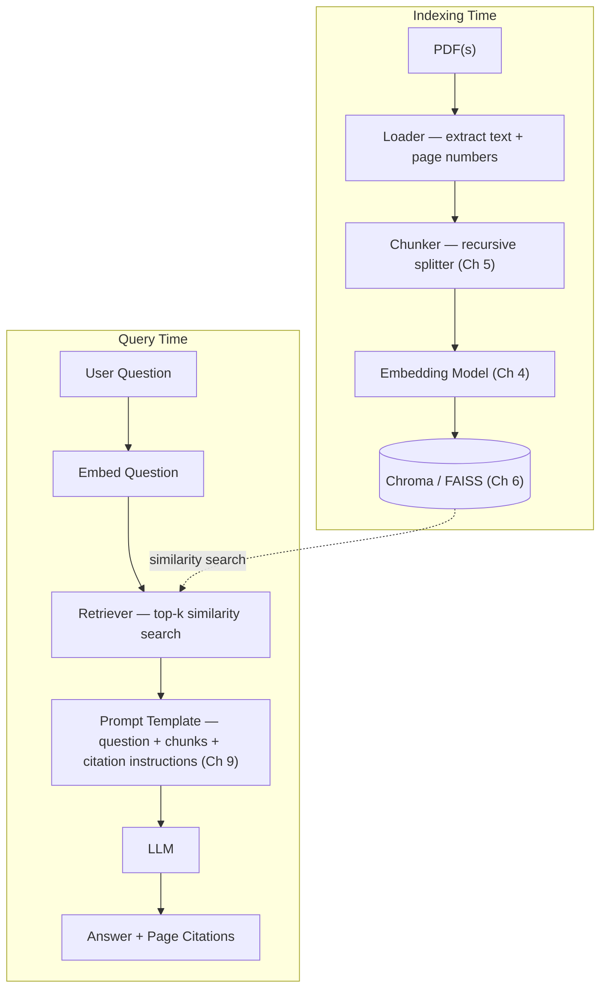
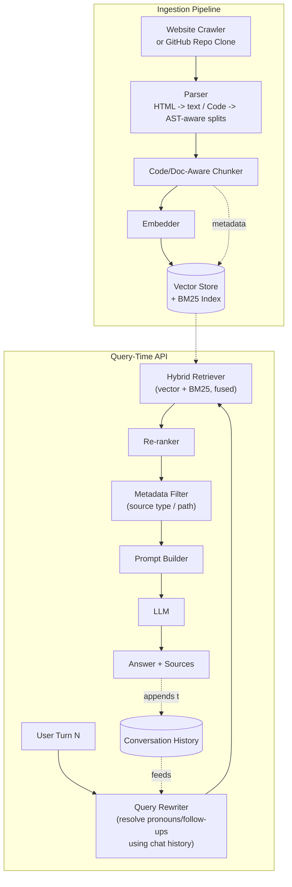
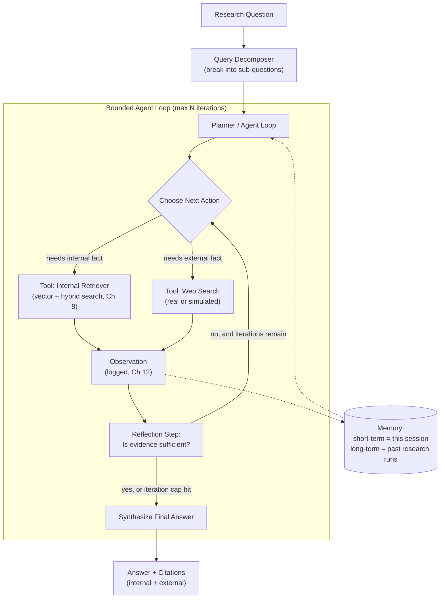
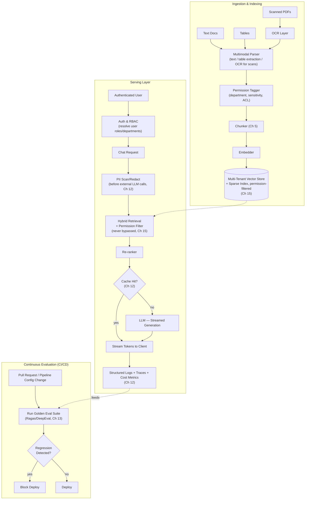

# Chapter 19: Capstone Projects

Eighteen chapters have given you every individual piece: what RAG is and why it exists (Ch 1–2), how the pipeline works internally (Ch 3), how to choose embeddings (Ch 4), chunking strategies (Ch 5), and a vector database (Ch 6), how to build and improve retrieval (Ch 7–8, Ch 11), how to prompt an LLM to answer only from context (Ch 9), which architecture pattern fits which problem (Ch 10), how to run RAG in production safely (Ch 12), how to evaluate it (Ch 13), how to make it agentic (Ch 14), how to scale it to an enterprise and to non-text data (Ch 15), the professional best-practices checklist (Ch 16), the failure modes to avoid (Ch 17), and the tooling landscape to choose from (Ch 18).

This chapter is where you stop reading about RAG and build it, four times, at increasing difficulty. Each project is a self-contained brief — requirements, architecture, folder structure, a numbered implementation plan that points back to the exact chapter that taught each step, best practices to bake in from the start, and extensions to attempt once the core works. Treat these as you would a real work assignment: read the brief fully before writing a line of code, and resist the urge to jump straight to the hardest one.

---

## Learning Objectives

By the end of this chapter, you will be able to:

- Plan and scope a RAG project from a one-paragraph requirement into a concrete architecture and folder structure
- Sequence an implementation so that each stage (ingestion, chunking, embedding, indexing, retrieval, generation, evaluation) is built and verified before the next depends on it
- Apply hybrid search, query rewriting, and metadata filtering to a real multi-source corpus
- Design and bound an agentic loop that combines internal retrieval with external tools for multi-hop research questions
- Assemble a production-grade RAG system with permissions, observability, security, and a CI evaluation gate — synthesizing every prior chapter into one working system
- Recognize the specific mistakes that sink RAG projects at each tier of difficulty, and design around them up front

## Prerequisites for This Chapter

This is the **synthesis chapter** of the course. It assumes you have read and internalized Chapters 1 through 18 — there is no new theory here, only application. If any implementation step below references a mechanism you don't remember (hybrid search, query decomposition, the agentic loop, RBAC filtering), that is a signal to go back to the cited chapter before continuing, not to skip the step.

You will also need, practically:

- A working Python environment (3.10+), as set up in Chapter 1
- API keys for at least one LLM provider and one embedding model
- A local or hosted vector database (Chroma/FAISS for the first two projects; a production-grade option such as Qdrant, Milvus, or pgvector for the capstone, per Chapter 6)
- Comfort reading and writing Mermaid diagrams, since each project below is specified with one

Work through the four projects **in order**. Each one deliberately reuses code and lessons from the one before it — skipping ahead means re-learning fundamentals under the pressure of a much harder project.

---

## Beginner Project: "Chat with a PDF"

### Requirements

- Accept one or a handful of PDF documents (a manual, a paper, a policy document)
- Answer natural-language questions using only the content of those PDFs
- Every answer must include a citation back to the source document and page number
- Must run entirely locally: no hosted vector database, no server — a single script or notebook is enough
- Must say "I don't know" (not guess) when the answer isn't in the documents

This is deliberately the same project built hands-on in Chapter 7. If you worked through that chapter's code, this project is about rebuilding it independently, from a blank folder, without copying the chapter's code verbatim — the goal is to prove the pipeline lives in your head, not in a chapter you can re-read.

### Architecture



This is exactly the Chapter 7 pipeline: no hybrid search, no re-ranking, no agent — a single retrieve-then-generate pass. Resist adding anything beyond this diagram; the point of the beginner project is to make this minimal loop rock-solid before adding complexity anywhere else.

### Folder Structure

```text
chat-with-pdf/
├── data/
│   └── sample.pdf
├── chat_with_pdf/
│   ├── __init__.py
│   ├── loader.py          # PDF -> text + page metadata
│   ├── chunker.py         # recursive chunking
│   ├── embedder.py        # text -> vector
│   ├── store.py           # Chroma/FAISS wrapper: add(), query()
│   ├── prompt.py          # prompt template + citation formatting
│   └── qa.py              # ties it all together: ask(question) -> answer
├── ingest.py               # CLI: python ingest.py data/sample.pdf
├── ask.py                  # CLI: python ask.py "What is the refund window?"
├── requirements.txt
└── README.md
```

### Implementation Plan

1. **Load** the PDF with `pypdf` (or similar), preserving page numbers as metadata for every extracted block of text — this metadata is what makes citations possible later (Ch 3, Ch 7).
2. **Chunk** the extracted text using a recursive character/token splitter with overlap, choosing chunk size based on your embedding model's context limits and the density of the source document (Ch 5).
3. **Embed** each chunk with a sentence-transformers model (or a hosted embedding API), keeping the same model for both indexing and query time (Ch 4).
4. **Store** the embeddings plus their page-number metadata in Chroma or FAISS, and confirm you can run a similarity search and get back the correct chunk for a hand-picked test query (Ch 6).
5. **Retrieve** the top-k chunks for a new question by embedding the question with the same model and searching the store (Ch 7).
6. **Prompt** the LLM with a template that: includes the retrieved chunks labeled by page number, instructs the model to answer *only* from the provided context, and instructs it to say "I don't know" if the context doesn't contain the answer, and to cite page numbers inline (Ch 9).
7. **Generate** the answer by calling the LLM API and return both the answer text and the list of source pages used.
8. **Manually test** with at least 10 questions: some answerable directly, some requiring synthesis across two chunks, and at least 3 deliberately unanswerable from the document, to confirm the fallback behavior works.

### Best Practices to Apply

- Format citations consistently and visibly — e.g., `[p. 12]` inline, or a "Sources:" footer listing every page used — so a user can verify the answer without reading the whole document (Ch 9).
- Explicitly test and tune the "I don't know" fallback; an ungrounded model will confidently hallucinate an answer from its training data instead of admitting the document doesn't cover it (Ch 2, Ch 9).
- Keep chunk size and overlap as named constants in one place, not scattered magic numbers — you will tune these more than once (Ch 5).
- Log every question, the retrieved chunk IDs, and the answer to a local file from day one; this habit compounds directly into the evaluation harness you'll build in the intermediate project (Ch 13).

### Extensions / Improvements to Try Next

- Wrap `ask.py` in a minimal web UI (Streamlit or Gradio) so the app is demoable without a terminal.
- Support multiple PDFs at once, adding a `source_document` metadata field so citations include the filename, not just the page.
- Add a cheap re-ranking step (e.g., a cross-encoder) after retrieval to see, empirically, whether it improves answer quality on your test questions (Ch 8).

---

## Intermediate Project: "Multi-Source Website/GitHub Repo Chatbot"

### Requirements

- Ingest either a small documentation website (crawled pages) or a GitHub repository (source code + README/docs) — pick one corpus type, though the architecture below supports both
- Support **hybrid search** (keyword + semantic) since code and technical docs contain exact identifiers (function names, error codes) that pure semantic search often misses
- Handle **follow-up questions** — a user should be able to ask "how do I install it?" and then "does that work on Windows too?" without repeating context
- Support metadata filtering by source type (code vs. docs) or file path
- Must be served as a callable API, not just a local script

### Architecture



### Folder Structure

```text
repo-chatbot/
├── ingestion/
│   ├── crawler.py           # website crawl or git clone + walk
│   ├── parsers/
│   │   ├── html_parser.py   # strip nav/boilerplate, extract main content
│   │   └── code_parser.py   # language-aware splitting (functions/classes)
│   ├── chunker.py           # code-aware + doc-aware chunking strategies
│   └── pipeline.py          # orchestrates crawl -> parse -> chunk -> embed -> index
├── retrieval/
│   ├── hybrid.py            # vector + BM25 fusion (RRF)
│   ├── reranker.py          # cross-encoder re-ranking
│   ├── query_rewriter.py    # conversational query rewriting
│   └── filters.py           # metadata filter builder
├── api/
│   ├── main.py               # FastAPI app: POST /chat
│   ├── schemas.py            # request/response models
│   └── session.py            # conversation history store (per session_id)
├── evaluation/
│   ├── golden_dataset.jsonl  # hand-labeled Q/A pairs with expected sources
│   └── run_eval.py           # retrieval + answer quality scoring
├── scripts/
│   └── reindex.py            # incremental re-crawl / re-index entrypoint
├── requirements.txt
└── README.md
```

### Implementation Plan

1. **Choose and ingest the corpus**: crawl a documentation site (respecting robots.txt, deduplicating pages) or clone a GitHub repo and walk its file tree, separating source files from Markdown/docs (Ch 3).
2. **Parse by source type**: strip HTML boilerplate (nav bars, footers) down to main content for web pages; for code, parse at function/class boundaries rather than arbitrary line counts so a chunk is never a syntactically broken fragment (Ch 3, Ch 5).
3. **Chunk with source-aware strategies**: prose gets recursive/semantic chunking as in the beginner project; code gets AST-aware or function-level chunking, and every chunk carries metadata — `source_type`, `file_path`, `url` or `line_range` (Ch 5).
4. **Build a hybrid index**: embed chunks into a vector store and simultaneously build a BM25 (or equivalent sparse) index over the same chunks, so exact-match queries (a function name, an error string) are not lost to semantic-only search (Ch 8).
5. **Add re-ranking**: after hybrid retrieval returns a candidate set, re-rank with a cross-encoder to push the most relevant chunks to the top before they reach the prompt (Ch 8).
6. **Add query rewriting for follow-ups**: before retrieval, pass the current question plus recent conversation turns through a rewriting step that resolves pronouns and implicit references into a standalone query (e.g., "does that work on Windows?" → "does the installation process work on Windows?") (Ch 11).
7. **Add metadata filtering**: let the API accept an optional filter (e.g., `source_type=code`) and thread it through to the retriever, restricting search to a subset of the index without re-indexing (Ch 8).
8. **Expose it as an API**: wrap the pipeline in a FastAPI (or similar) service with a `/chat` endpoint that accepts a `session_id` and message, retrieves conversation history for that session, and returns an answer with sources.
9. **Build a small evaluation harness**: hand-write 15–30 question/expected-source pairs covering both corpus types and follow-up scenarios, and score retrieval (did the right chunk get retrieved?) and answer quality against them (Ch 13).
10. **Wire up incremental re-indexing**: write a `reindex.py` that only re-crawls/re-chunks/re-embeds pages or files that changed since the last run (by hash or last-modified timestamp), instead of rebuilding the whole index every time.

### Best Practices to Apply

- Make re-crawling/re-indexing **incremental** from the start — track a content hash or last-modified date per source unit so a nightly job doesn't re-embed an entire unchanged corpus (Ch 12).
- Chunk code and prose **differently**; never run a generic character splitter over source code, since it will cut through function bodies and produce chunks that are syntactically meaningless out of context (Ch 5).
- Keep the query rewriter's output visible in logs — when retrieval seems wrong, the first thing to check is whether the rewritten query actually captured the user's intent (Ch 11, Ch 13).
- Version your golden evaluation dataset in the repo alongside the code, so retrieval regressions are caught by re-running `run_eval.py`, not by a user complaint (Ch 13).

### Extensions / Improvements to Try Next

- Add multi-query retrieval: generate 2–3 paraphrases of the user's question and fuse their retrieved results for better recall on ambiguous phrasing (Ch 8, Ch 11).
- Grow the golden evaluation dataset over time by logging real user questions and periodically hand-labeling a sample of them.
- Containerize the API and deploy it (a small VM, or a serverless container platform) so it's reachable outside your laptop.

---

## Advanced Project: "Agentic Research Assistant"

### Requirements

- Answer complex, multi-hop research questions that cannot be resolved by a single retrieval pass (e.g., "compare our internal Q3 findings to what's publicly reported about our top competitor's Q3, and flag any contradictions")
- Combine **internal document search** with a **web search tool** (a real API, or a simulated/mocked one for learning purposes)
- Use an **agent** that plans its own steps, decides which tool to call next, and knows when it has gathered enough evidence to stop
- Bound the agent's cost and runtime — no infinite loops, no runaway API spend

### Architecture



### Folder Structure

```text
research-assistant/
├── agent/
│   ├── loop.py               # the bounded plan -> act -> observe -> reflect loop
│   ├── planner.py            # decomposes question into sub-questions
│   └── reflector.py          # judges whether gathered evidence is sufficient
├── tools/
│   ├── base.py                # Tool interface (name, description, schema, call())
│   ├── internal_retriever.py  # wraps hybrid search over internal docs
│   └── web_search.py          # real API client or a mocked/simulated search tool
├── memory/
│   ├── short_term.py          # in-session scratchpad of sub-answers + sources
│   └── long_term.py           # optional: persisted memory across sessions
├── evaluation/
│   ├── multi_hop_cases.jsonl  # test questions with expected reasoning chains
│   └── run_eval.py            # scores final answer AND intermediate step correctness
├── logging_config.py          # structured logging for every tool call (Ch 12)
├── main.py                    # CLI entrypoint: python main.py "research question"
├── requirements.txt
└── README.md
```

### Implementation Plan

1. **Decompose the question**: before invoking the agent, or as the agent's first move, break a compound research question into sub-questions the agent can tackle one at a time — this is the same decomposition mechanism taught for multi-hop and recursive RAG (Ch 10, Ch 11).
2. **Define the tools**: implement an internal-retriever tool wrapping the hybrid search + re-ranking pipeline from the intermediate project, and a web-search tool (use a real search API if you have one, or write a small simulated tool returning canned/mocked results for a fixed set of test questions) — both exposed with a consistent name/description/schema interface (Ch 14).
3. **Build the agent loop**: implement the plan → act → observe → reflect cycle — the agent picks a tool, calls it, records the observation, and then explicitly reasons about whether it has enough evidence to answer or needs another step (Ch 14).
4. **Add the reflection step**: after each tool call, prompt the model (or use a rule) to judge sufficiency — "given what I've gathered, can I answer the original question confidently, or is a specific piece of information still missing?" — and let this judgment decide whether to keep iterating (Ch 14).
5. **Bound the loop**: set a hard maximum number of iterations (e.g., 5–8) and a hard cap on tool calls; if the cap is hit before the reflection step is satisfied, force synthesis of a best-effort answer with an explicit caveat rather than looping indefinitely (Ch 12, Ch 14).
6. **Add memory**: maintain a short-term scratchpad of sub-question → sub-answer → source pairs within a single research run, and optionally persist completed research runs to long-term memory so a later, related question can reuse prior findings (Ch 14).
7. **Synthesize and cite**: once reflection signals sufficiency (or the cap is hit), have the model compose a final answer that explicitly draws on both internal and external evidence, citing each distinctly (internal doc + page/section vs. external source + URL) (Ch 9, Ch 14).
8. **Log every tool call**: record, for every iteration, which tool was called, with what arguments, what it returned, and what the reflection step concluded — this is the debugging surface for the entire project, and it's the same structured logging discipline taught for production monitoring (Ch 12).
9. **Evaluate multi-step correctness**: build a small set of multi-hop test questions with known correct reasoning chains, and score not just the final answer but whether the agent retrieved the *right intermediate facts* along the way — a wrong final answer built on right intermediate steps is a different bug than a lucky right answer built on wrong steps (Ch 13).

### Best Practices to Apply

- **Bound the agent hard**: a maximum iteration count and/or maximum tool-call count is not optional — an ungrounded reflection step can loop indefinitely (or expensively) on an ambiguous question if there's no hard stop (Ch 12, Ch 14).
- **Log every tool call, every time**, including failed or empty-result calls — most agent bugs are diagnosed by reading the log of what it *actually* did, not by re-reading the code (Ch 12).
- Keep the reflection step's sufficiency judgment separate and inspectable from the final answer synthesis — conflating "do I have enough evidence" with "here is my answer" in one LLM call makes both harder to debug and evaluate.
- Treat the web-search tool's results with the same skepticism as any retrieved context: don't let the agent present external claims as internally-verified fact.

### Extensions / Improvements to Try Next

- Add a second, specialized **critic/reviewer agent** that checks the first agent's draft answer against the gathered evidence before it's returned to the user, catching unsupported claims (Ch 14).
- Add long-term memory across sessions so a follow-up research request days later can build on (and cite) a prior run's findings instead of starting from zero.
- Swap the simulated web-search tool for a real search API and measure how much the agent's answer quality and cost change.

---

## Production-Grade Capstone: "Enterprise Knowledge Assistant"

### Requirements

- Ingest a multi-department document corpus (e.g., HR, Legal, Engineering, Finance) where **not every user is allowed to see every document**
- Support hybrid search with re-ranking, streaming answers to the client as they're generated
- Full observability: structured logs, latency/cost metrics, and traceable requests end-to-end
- Security: role-based access control (RBAC) enforced at retrieval time, PII masking before any data leaves your infrastructure to a third-party LLM
- Continuous evaluation wired into CI, gating deploys on evaluation regressions
- Must ingest and answer over **text, tables, and scanned (image-based) PDFs** — not text-only documents

### Architecture



### Folder Structure

```text
enterprise-knowledge-assistant/
├── ingestion/
│   ├── loaders/
│   │   ├── text_loader.py
│   │   ├── table_loader.py     # structured table extraction
│   │   └── ocr_loader.py       # scanned PDF -> text via OCR
│   ├── permission_tagger.py    # attaches department/ACL metadata per chunk
│   └── pipeline.py
├── indexing/
│   ├── chunker.py
│   ├── embedder.py
│   └── vector_store.py         # multi-tenant, permission-aware store wrapper
├── retrieval/
│   ├── hybrid.py
│   ├── reranker.py
│   └── permission_filter.py    # enforced at query time, cannot be bypassed
├── api/
│   ├── main.py                 # FastAPI app with streaming responses
│   ├── streaming.py
│   └── cache.py                 # semantic/exact response cache (Ch 12)
├── auth/
│   ├── rbac.py                  # role/department resolution
│   └── pii_redaction.py         # PII detection + masking before LLM calls
├── evaluation/
│   ├── golden_dataset/          # versioned, growing set of labeled Q/A pairs
│   ├── run_eval.py
│   └── ci_gate.py                # fails the pipeline on regression vs. baseline
├── monitoring/
│   ├── metrics.py                # latency, cost, token usage
│   └── tracing.py                # end-to-end request tracing
├── infra/ (or deploy/)
│   ├── docker-compose.yml
│   ├── k8s/ or terraform/
│   └── pipeline_config.yaml      # versioned chunking/embedding/retrieval config
├── ci/
│   └── eval_gate.yml              # CI job: run evaluation, block deploy on regression
├── requirements.txt
└── README.md
```

### Implementation Plan

1. **Design permission metadata up front**: decide the access-control model (per-department, per-document ACL, sensitivity levels) before ingesting a single document — retrofitting permissions onto an already-built index is far harder than baking it in from the start (Ch 15).
2. **Build multimodal ingestion**: implement loaders for plain text, structured tables (extracting rows/columns as retrievable, queryable units rather than flattened prose), and OCR for scanned PDFs, normalizing all three into a common document representation (Ch 15).
3. **Tag every chunk with permission metadata** at ingestion time — department, sensitivity level, and any ACL identifiers — stored alongside the vector embedding, not in a separate system that could drift out of sync (Ch 15).
4. **Chunk and embed**, reusing the strategies from the beginner and intermediate projects, now applied uniformly across text, table, and OCR'd content (Ch 5, Ch 4).
5. **Build a multi-tenant, permission-aware vector store** where every query is filtered by the requesting user's resolved permissions *before* similarity ranking happens, never as a post-hoc filter on results that were already computed over the full corpus (Ch 15).
6. **Implement authentication and RBAC** in the API layer, resolving an incoming request to a user identity and the set of departments/ACLs that identity can access (Ch 15).
7. **Add PII detection and redaction** as a mandatory step on the retrieved-context path, before any content is sent to a third-party LLM API — this includes content pulled from tables and OCR'd scans, which are easy to overlook (Ch 12).
8. **Implement hybrid retrieval + re-ranking**, identical in mechanism to the intermediate project, now composed with the mandatory permission filter (Ch 8, Ch 15).
9. **Add caching** for repeated or near-duplicate queries to cut latency and cost, being careful that cache keys account for the requesting user's permission scope so a cached answer built from documents User A can see is never served to User B (Ch 12).
10. **Stream the generated answer** token-by-token to the client rather than waiting for the full response, for a responsive UX at production scale (Ch 12).
11. **Instrument full observability**: structured logs for every request, latency and token-cost metrics, and end-to-end tracing so a slow or wrong answer can be diagnosed stage-by-stage (Ch 12).
12. **Build and version a golden evaluation dataset**, growing it over time from real (properly anonymized) production questions, covering retrieval quality, faithfulness, and permission-filtering correctness (Ch 13).
13. **Wire evaluation into CI**: every change to code or to the pipeline configuration (chunk size, embedding model, prompt template) triggers the evaluation suite, and a regression beyond a defined threshold blocks the deploy (Ch 13, Ch 16).
14. **Version pipeline configuration alongside code**: chunking parameters, embedding model version, retrieval top-k, and prompt templates should live in a checked-in config file, not scattered constants, so any evaluation result can be tied to an exact, reproducible configuration (Ch 16).
15. **Run the full best-practices checklist from Chapter 16** against the finished system before considering it complete — this project is the intended proving ground for that checklist.

### Best Practices to Apply

- **Never bypass permission filters**, even when it would produce a more complete or more helpful-looking answer — a broader answer built on documents a user isn't authorized to see is a security incident, not a quality win (Ch 15).
- **Redact PII before it reaches any third-party LLM call** — treat this as a mandatory pipeline stage, not an optional enhancement, and cover all ingestion modalities (text, tables, OCR), since PII often hides in scanned forms and spreadsheets more than in prose (Ch 12).
- **Version pipeline configuration together with code** (chunking, embedding model, retrieval parameters, prompts) so that every evaluation score and every production incident can be traced to an exact, reproducible configuration (Ch 16).
- Treat the CI evaluation gate as a first-class deployment blocker, the same as a failing unit test — a silent retrieval-quality regression is far more dangerous than a build failure because it degrades trust slowly and invisibly (Ch 13).

### Extensions / Improvements to Try Next

- Add **Graph RAG** for cross-department relationship questions (e.g., "which contracts reference a vendor also named in an HR compliance filing?") that flat retrieval structurally can't answer (Ch 10).
- Add agentic capabilities (Ch 14) for complex requests that need multi-step reasoning across departments, reusing the bounded agent loop from the advanced project.
- Build a feedback loop where user thumbs-up/down (or corrections) on answers feeds a review queue that grows the golden evaluation dataset over time, closing the loop between production usage and evaluation coverage (Ch 13).

---

## Real-World Scenario

The production-grade capstone is modeled directly on a pattern common across large organizations: a company with HR, Legal, Engineering, and Finance departments wants a single internal chat assistant, but each department's documents carry different sensitivity — an engineer should never see unredacted HR performance reviews, and Finance's pre-earnings documents must never leak to a general "ask anything" assistant before public disclosure.

Such organizations typically start with exactly the beginner project's naive pattern — a single team stands up a "chat with our wiki" tool as an internal hackathon project. It works well enough on a demo with a handful of public documents that leadership approves expanding it company-wide. That is precisely the moment the project's actual hard requirements surface: permissions per department, PII in HR and Legal documents, tables of financial figures that plain-text chunking mangles, scanned and signed contracts that have no extractable text at all, and a legal/compliance team that will not accept "the model usually gets it right" as an evaluation standard.

Every requirement in the capstone brief — permission-tagged ingestion, mandatory PII redaction, multimodal parsing, a CI evaluation gate that blocks deploys — exists because a real team hit that exact wall after shipping the naive version first. Building the four projects in this chapter in order is a compressed simulation of that same trajectory: you'll feel firsthand why each production requirement exists, rather than being handed a checklist with no scar tissue behind it.

---

## Best Practices

- **Build incrementally, project by project.** Each project in this chapter reuses code and lessons from the one before it — the hybrid search you build for the intermediate project becomes a retrieval component in the advanced project's tool, and both feed directly into the capstone's retrieval layer. Skipping to the capstone skips the debugging experience that makes its requirements make sense.
- **Don't over-engineer the beginner project.** Its entire purpose is to make the minimal retrieve-then-generate loop solid and well-understood; adding hybrid search or an agent loop to it defeats the point and delays the lessons the *later* projects are meant to teach.
- **Don't under-scope the capstone's security requirements.** Permissions, PII redaction, and the CI evaluation gate are not "extensions to add if there's time" — treat them as core requirements from day one of that project, exactly as a real enterprise deployment would.
- **Write a golden evaluation set for every project past the first**, even a small one. Without it, you cannot tell whether a change (a new chunking strategy, a new prompt) made retrieval better or worse — you're only guessing from a handful of manual spot-checks.
- **Log everything, from the beginner project onward.** The logging discipline you build habitually in project one is the same discipline that makes the advanced project's agent loop debuggable and the capstone's observability requirement achievable.
- **Reuse, don't rewrite.** By the time you reach the capstone, you should be importing and adapting modules from the intermediate and advanced projects (hybrid retrieval, the agent loop, evaluation harnesses) rather than starting from a blank file — that reuse is itself evidence you've internalized the course.

---

## Common Mistakes

- **Over-scoping the beginner project.** Adding hybrid search, re-ranking, or a chat UI before the basic cited-answer loop works reliably wastes time relative to the lesson the project is meant to teach, and hides bugs in the fundamentals under layers of unrelated complexity.
- **Skipping the evaluation harness until "later."** Every project in this chapter gets meaningfully harder to debug without one; by the time you reach the capstone, retrofitting evaluation onto an already-built system is far more work than building it alongside the pipeline from the start.
- **Treating permission filtering as a UI concern rather than a retrieval-time concern.** Filtering results *after* they're returned from an unfiltered similarity search means the wrong documents were still ranked, scored, and potentially exposed in logs or a cache — permission filtering has to happen at query time, before ranking.
- **Under-scoping the capstone's security requirements** by treating RBAC and PII redaction as afterthoughts to bolt on once the "real" retrieval logic works — in a genuine enterprise deployment, this ordering gets a project rejected by a security review, not shipped.
- **Building an unbounded agent loop** in the advanced project — no maximum iteration count, no maximum tool-call budget — which risks both runaway cost and a poor user experience when the agent spins on an ambiguous question.
- **Ignoring code-aware chunking** in the intermediate project and running a generic text splitter over source code, producing chunks that cut through function bodies and retrieve as syntactically meaningless fragments.
- **Not versioning pipeline configuration** in the capstone, so that an evaluation score from last week cannot be reproduced or compared against today's, because nobody recorded which chunk size, embedding model, or prompt template produced it.
- **Confusing "the demo worked once" with "it's production-ready."** Every project in this chapter should be validated against a written set of test questions (a golden dataset by the intermediate project onward), not a single happy-path manual test.

---

## Summary

- The **beginner project** ("Chat with a PDF") rebuilds the Chapter 7 pipeline from a blank folder: loader → chunker → embedder → vector store → retriever → prompt → LLM, with citations and an "I don't know" fallback as the core deliverables.
- The **intermediate project** (website/repo chatbot) adds hybrid search, re-ranking, code-aware chunking, conversational query rewriting, metadata filtering, and a first evaluation harness, served as an API.
- The **advanced project** (agentic research assistant) replaces the fixed pipeline with a bounded agent loop that plans, chooses between an internal-retrieval tool and a web-search tool, reflects on evidence sufficiency, and synthesizes a cited multi-hop answer.
- The **production-grade capstone** (enterprise knowledge assistant) combines permissioned multi-tenant retrieval, multimodal ingestion (text, tables, scanned PDFs), streaming, full observability, PII redaction, and a CI evaluation gate — synthesizing nearly every chapter in this course into one working system.
- Each project deliberately builds on the last: components, lessons, and even code are meant to carry forward, so working through them in order is itself part of the curriculum, not just a suggestion.
- The recurring meta-lesson across all four tiers is that **evaluation and logging are not optional extras** — they are what turns "it worked when I tried it" into a system you can trust, debug, and safely change.

---

## Knowledge Check

1. In the beginner project, why does preserving page-number metadata during PDF loading matter for a requirement that appears much later in the pipeline?
2. Why does the intermediate project require a *different* chunking strategy for source code than for prose documentation, and what goes wrong if you use one generic splitter for both?
3. In the advanced project's agent loop, what is the specific difference between the "reflection" step and the "synthesis" step, and why does bounding the loop's iteration count matter even if reflection is working correctly?
4. Why must permission filtering in the production capstone happen *before* similarity ranking, rather than as a filter applied to the top-k results afterward?
5. What is the purpose of versioning pipeline configuration (chunk size, embedding model, prompt template) alongside code in the capstone project, and what specific problem does it prevent?
6. A team wants to skip straight to building the production-grade capstone without doing the first three projects. What specific debugging and design skills would they be missing that the earlier projects were meant to build?

---

## Hands-On Exercise

Pick **one** project tier from this chapter — if you're unsure, pick the **Intermediate Project** ("Multi-Source Website/GitHub Repo Chatbot"), since it's substantial enough to exercise most of the course while remaining achievable solo in a week. Follow this day-by-day schedule, adapting it to whichever tier you chose:

- **Day 1 — Scope and ingest.** Pick your corpus (a real small documentation site or a GitHub repo you know well). Write the crawler/loader and parser. By end of day, you should have raw text extracted with source metadata (URL or file path) for every document unit.
- **Day 2 — Chunk and embed.** Implement source-aware chunking (prose vs. code) and embed everything into a vector store. Spend 30 minutes manually inspecting a sample of chunks to confirm none are syntactically broken or missing metadata.
- **Day 3 — Retrieval.** Build the hybrid retriever (vector + BM25) and confirm, by hand-testing 5–10 queries, that exact-match queries (an identifier, an error string) now surface results that pure semantic search was missing.
- **Day 4 — Re-ranking and query rewriting.** Add a cross-encoder re-ranking step and a conversational query rewriter. Test with a 3-turn conversation containing at least one follow-up question that relies on pronoun resolution.
- **Day 5 — API and metadata filtering.** Wrap the pipeline in a FastAPI service with a `/chat` endpoint, session-based conversation history, and an optional metadata filter parameter.
- **Day 6 — Evaluation harness.** Write 15–20 golden question/expected-source pairs covering both straightforward and follow-up questions. Implement `run_eval.py` and get a baseline score.
- **Day 7 — Harden and reflect.** Fix the worst-scoring cases from your evaluation run, add incremental re-indexing, and write down (for yourself) three concrete things you'd change if this had to serve real users tomorrow — carry that list into the advanced project.

If you instead choose the **Production-Grade Capstone**, stretch this same seven-day skeleton across several weeks, using each day above as a milestone week and adding permissioning, PII redaction, multimodal ingestion, and the CI evaluation gate as additional weeks before considering the project complete.

---

## Further Reading

- Revisit **Chapter 7 — Building Your First RAG Pipeline** for the full worked example the beginner project is based on.
- Revisit **Chapter 8 — Advanced Retrieval Techniques** for the hybrid search and re-ranking mechanics used in the intermediate project onward.
- Revisit **Chapter 11 — Query Transformation** for the rewriting and decomposition techniques used in both the intermediate and advanced projects.
- Revisit **Chapter 14 — Agentic RAG** for the full planning/tool-calling/reflection/memory treatment underlying the advanced project's agent loop.
- Revisit **Chapter 15 — Enterprise & Multimodal RAG** for multi-tenancy, permissions, and multimodal ingestion patterns underlying the capstone.
- Revisit **Chapter 16 — Best Practices** and **Chapter 17 — Common Mistakes & Pitfalls** as a pre-flight checklist before starting the capstone, and again as a post-flight review after finishing it.
- Revisit **Chapter 18 — Tools & Libraries Landscape** when choosing concrete frameworks, vector databases, and evaluation tools for whichever project you build.
- **Ragas** and **DeepEval** documentation, for building out the evaluation harnesses referenced in the intermediate, advanced, and capstone projects.
- **LangGraph** documentation, for a production-grade way to implement the bounded agent loop in the advanced project.

---

<div style="display:flex;justify-content:space-between;align-items:center;">
  <a href="./18-tools-and-libraries-landscape.md">← Previous: Tools & Libraries Landscape</a>
  <a href="./00-index.md">🏠 Index</a>
  <a href="./20-interview-preparation.md">Next: Interview Preparation →</a>
</div>
