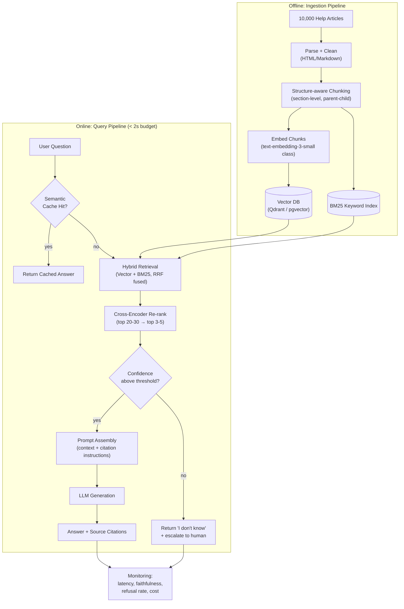

# Interview Preparation

You've now built the full stack: theory, embeddings, chunking, vector databases, a working pipeline, advanced retrieval, architectures, prompting, production hardening, evaluation, agentic systems, enterprise/multimodal RAG, best practices, common pitfalls, the tooling landscape, and a capstone project. This chapter is not new material — it is a rehearsal. Its job is to take everything from Chapters 1-19 and drill it into the shape an interviewer actually asks for: a crisp conceptual answer, a diagnosis under scenario pressure, a structured system design walkthrough, and calm troubleshooting under ambiguity.

Treat this chapter as a mock interview panel. Read a question, form your own answer out loud or on paper *before* reading the model answer, then compare. The gap between your answer and the model answer tells you exactly which earlier chapter to revisit.

A typical RAG-focused interview loop maps loosely onto this chapter's five sections: a **phone screen** usually draws from Section 1 (conceptual Q&A) and the Rapid-Fire Round; a **take-home or pairing round** often resembles Section 4 (practical troubleshooting) or asks you to extend a small pipeline; an **onsite system design round** follows the shape of Section 3; and a **debugging/whiteboard round** mirrors Section 2's scenario questions. Section 5's case studies are the kind of concrete example you should have ready when an interviewer asks "tell me about a production issue you've seen or can imagine."

---

## Learning Objectives

By the end of this chapter, you will be able to:

- Answer the 20 most common RAG conceptual interview questions crisply, in 2-6 sentences, without rambling
- Diagnose realistic production scenarios by separating retrieval failures from generation failures
- Deliver a structured, interview-shaped system design answer for a RAG product, covering ingestion, chunking, embeddings, vector DB, retrieval strategy, prompting, evaluation, monitoring, and scaling
- Recognize three classic production failure patterns (embedding drift, permission leaks, over-engineered agentic RAG) from real-world-style case studies
- Practice a second, independent system design problem end-to-end as a capstone to the whole course
- Walk into a RAG-focused interview able to state assumptions, name trade-offs, and describe how you would measure success — the three habits that separate strong candidates from purely theoretical ones

---

## Prerequisites for This Chapter

This is the capstone review chapter of the entire course. It assumes you have completed, or are comfortable skimming back through, **all of Chapters 1-19**:

- **Ch 1-3**: motivation for RAG, core terminology, full pipeline internals, classic IR (BM25/TF-IDF)
- **Ch 4-6**: embeddings, similarity metrics, chunking strategies, vector databases and ANN indexes (HNSW)
- **Ch 7-9**: building a first RAG pipeline, advanced retrieval (MMR, hybrid search, re-ranking, self-query), prompt engineering
- **Ch 10-11**: RAG architectures (Naive → Advanced → CRAG → Adaptive → Graph → RAPTOR), query transformation
- **Ch 12-13**: production systems (caching, streaming, monitoring, scaling, security) and evaluation methodology
- **Ch 14-15**: agentic RAG, enterprise and multimodal RAG
- **Ch 16-18**: best practices, common mistakes and failure modes, the tools/library landscape
- **Ch 19**: the capstone project you built or designed

Every answer below points back to the specific chapter that taught it — if an answer feels unfamiliar rather than "oh right, I remember this," that is your signal to go back and re-read before the interview, not during it.

---

## Quick-Reference: Whole-Course Cheat Sheet

Use this table for a five-minute review immediately before an interview. If any "Interview Soundbite" doesn't ring a bell, open that chapter tonight, not tomorrow morning.

| Ch | Topic | Interview Soundbite |
|---|---|---|
| 1 | Motivation & setup | RAG grounds an LLM in external, current, or private knowledge without retraining it |
| 2 | Core concepts | Retrieval and generation are separate stages with separate failure modes |
| 3 | Architecture & internals | Every RAG system is offline indexing + online retrieve-then-generate, on top of classic IR (BM25) |
| 4 | Embeddings | Cosine similarity in a learned vector space approximates semantic similarity, not exact meaning |
| 5 | Chunking | Chunk size/overlap/boundary choice determines what retrieval can and can't find |
| 6 | Vector databases | ANN indexes (HNSW, IVF) trade a little recall for orders-of-magnitude faster search |
| 7 | First RAG pipeline | Naive top-K retrieval is a real baseline, not a toy — know its exact limitations |
| 8 | Advanced retrieval | MMR, hybrid search, re-ranking each fix one specific, named failure of naive top-K |
| 9 | Prompt engineering | The prompt is where you enforce grounding, citations, and "I don't know" behavior |
| 10 | RAG architectures | Match architecture (Naive/Advanced/CRAG/Graph/RAPTOR) to the query pattern, not to hype |
| 11 | Query transformation | Rewriting/decomposing/HyDE fix queries *before* they ever reach the retriever |
| 12 | Production systems | Caching, monitoring, scaling, and access control are day-one requirements, not later add-ons |
| 13 | Evaluation & testing | If you can't measure Recall@K and faithfulness, you can't safely change the pipeline |
| 14 | Agentic RAG | Agent loops add multi-hop reasoning and tool use at the cost of latency and cost — use selectively |
| 15 | Enterprise & multimodal | Access control belongs at the data layer; multimodal retrieval needs modality-aware chunking |
| 16 | Best practices | A checklist beats a memorized architecture when the interviewer changes the constraints |
| 17 | Common mistakes | Most production RAG failures are retrieval failures wearing a generation-failure costume |
| 18 | Tools & landscape | Know why a tool exists (the problem it solves), not just its name |
| 19 | Capstone | You should be able to defend every architectural decision in your own project out loud |
| 20 | Interview prep | State assumptions, name trade-offs, always say how you'd measure success |

---

## Answer Structure Templates

Before drilling questions, it helps to have a reusable shape for each question type, so you're never improvising structure under pressure — only content.

**Conceptual question template** (aim for 30-60 seconds spoken):

```
1. One-sentence definition.
2. Why it exists / what problem it solves.
3. One concrete mechanism or example.
4. (If relevant) One trade-off or limitation.
```

**Scenario/debugging question template** (aim for 60-120 seconds spoken):

```
1. Restate the symptom in your own words to confirm understanding.
2. Name the two or three most likely failure categories.
3. State the diagnostic step that would distinguish between them
   (the single most information-dense check first).
4. Only then propose a fix — tied to the specific category you'd expect to confirm.
```

**System design question template** (aim for 8-12 minutes spoken, Section 3 below is a full worked example):

```
1. Clarifying questions (scale, latency, compliance, update frequency).
2. Ingestion pipeline (chunking choice + why).
3. Embedding model choice + why.
4. Vector database / index choice + why.
5. Retrieval strategy (+ re-ranking, if applicable) + why.
6. Prompt design (grounding, citations, refusal behavior).
7. Evaluation plan (offline metrics, test set construction).
8. Monitoring plan (what dashboards/alerts exist post-launch).
9. Scaling plan (what breaks first at 10x/100x, and the fix).
```

Every worked answer in this chapter follows one of these three shapes — internalize the shape, and you'll never freeze on structure, even for a scenario you've never seen before (see the Hands-On Exercise at the end of this chapter).

---

## Section 1 — Conceptual Q&A

### Q1. What is RAG?

**Model answer**: Retrieval-Augmented Generation is an architecture that grounds an LLM's output in external knowledge retrieved at query time, rather than relying solely on what the model memorized during training. At inference, a retriever fetches the most relevant pieces of text (or other modalities) from a knowledge base, and those pieces are inserted into the prompt as context before the LLM generates its answer. This lets the model answer questions about private, current, or domain-specific information without retraining, and lets you cite sources for what it says. (Ch 1-2)

**Likely follow-up**: "Is RAG a model or a system?" — Answer: it's a system-level pattern, not a model architecture; the LLM itself is unmodified, and all the "RAG-ness" lives in the retrieval and prompting layers wrapped around it.

### Q2. Why use RAG instead of just fine-tuning or a bigger context window?

**Model answer**: Fine-tuning bakes knowledge into weights — it's expensive to update, doesn't easily support per-query source citation, and is prone to catastrophic forgetting when you need to add new facts. Larger context windows let you stuff more text in, but you pay for it on every single call (cost and latency), retrieval quality inside very long contexts still degrades ("lost in the middle"), and you still need a mechanism to select *which* documents to include in the first place — that mechanism is retrieval. RAG is cheaper to keep current (just re-index), gives traceable citations, and scales to knowledge bases far larger than any context window. In practice, production systems often combine all three: a reasonably sized context window, retrieval to select the right subset of a large corpus, and light fine-tuning for style or domain vocabulary. (Ch 1-2)

### Q3. Explain the complete RAG pipeline end-to-end.

**Model answer**: Offline: documents are loaded, cleaned, split into chunks, embedded into vectors, and stored in a vector database (often alongside a keyword index and metadata for filtering). Online: a user query is embedded with the same embedding model, the vector database returns the top-K semantically similar chunks (often merged with a BM25 lexical search and re-ranked by a cross-encoder), those chunks are formatted into a prompt template alongside the user's question and instructions, and the LLM generates an answer grounded in that context, ideally with citations back to the source chunks. A production system wraps this with caching, monitoring, guardrails, and evaluation. (Ch 3, 7, 12)

### Q4. Difference between BM25 and vector search.

**Model answer**: BM25 is a lexical, term-frequency-based ranking function — it scores documents by how often and how rarely query terms appear, and it's excellent at exact matches: product codes, acronyms, names, error strings. Vector search embeds text into a continuous vector space and ranks by semantic similarity (usually cosine), so it can match a query to a passage that expresses the same idea with completely different words, but it can miss or under-weight exact rare tokens because they get diluted in the embedding. Production systems typically combine both in hybrid search, because their failure modes are complementary. (Ch 3-4, 8)

**Likely follow-up**: "Give a concrete query where each one fails alone." — BM25 alone fails on "how do I get my money back if I'm unhappy with a purchase" (no word overlap with a passage titled "Refund Policy" that never uses "unhappy" or "money back"); vector search alone fails on "error E-4021" (the embedding may correctly cluster it near "error" and "codes" generally, but blur exactly *which* four-digit code the passage discusses).

### Q5. What is chunk overlap and why does it matter?

**Model answer**: Chunk overlap means consecutive chunks share a small window of text (e.g., the last 50 tokens of chunk N are repeated as the first 50 tokens of chunk N+1) instead of being cut at hard, non-overlapping boundaries. Without overlap, a sentence or idea that straddles a chunk boundary can be split so that neither chunk contains the full thought, and retrieval either misses it or returns half of it. Overlap costs some storage and redundancy but meaningfully reduces the chance that answer-critical context is severed at a chunk edge. (Ch 5)

### Q6. What is HNSW?

**Model answer**: HNSW (Hierarchical Navigable Small World) is a graph-based approximate nearest neighbor algorithm used by most modern vector databases. It builds multiple layers of proximity graphs — a sparse top layer for long jumps across the vector space and progressively denser lower layers — so a search starts at the top layer, greedily navigates toward the query vector, and descends layer by layer to refine the result, giving logarithmic-ish search time instead of scanning every vector. Its main tunable trade-offs are `M` (graph connectivity, affecting recall and memory) and `ef_search`/`ef_construction` (search/build effort, trading latency and index build time for recall). (Ch 6)

**Likely follow-up**: "What happens if you set `ef_search` too low?" — Answer: search terminates its graph traversal too early and returns lower-recall results faster; too high, and you pay unnecessary latency for recall gains that may already have plateaued — this is exactly the parameter you re-tune when corpus size changes by an order of magnitude (see Scenario 4 in Section 2).

### Q7. What is ANN (Approximate Nearest Neighbor) search and why "approximate"?

**Model answer**: Exact nearest neighbor search requires comparing a query vector against every vector in the index (brute force), which is accurate but doesn't scale past roughly a few hundred thousand to a few million vectors at low latency. ANN algorithms (HNSW, IVF, product quantization, ScaNN) trade a small, tunable amount of recall for orders-of-magnitude faster search by using data structures — graphs, clusters, or compressed representations — that skip the vast majority of vectors that are almost certainly irrelevant. "Approximate" means the top-K returned may occasionally miss the true nearest neighbor in exchange for speed, and that recall/speed trade-off is exactly what index parameters like `ef_search` or `nprobe` control. (Ch 6)

### Q8. What is hybrid search?

**Model answer**: Hybrid search runs a lexical retriever (typically BM25) and a semantic retriever (vector search) over the same query in parallel, then merges the two ranked lists into one — most commonly with Reciprocal Rank Fusion (RRF), which combines results by rank position rather than raw score, since BM25 scores and cosine similarities aren't on comparable scales. It's the standard way to get both exact-term precision and semantic recall in a single retrieval stage. (Ch 8)

### Q9. Explain MMR (Maximum Marginal Relevance).

**Model answer**: MMR is a re-ranking/selection strategy that balances relevance to the query against diversity among the already-selected results, using a formula like `λ · sim(query, doc) − (1−λ) · max(sim(doc, selected))`. It prevents the classic failure of plain top-K search returning five near-duplicate chunks that all say the same thing, by explicitly penalizing candidates that are too similar to what's already been picked. `λ` close to 1 favors pure relevance; `λ` closer to 0 favors diversity. (Ch 8)

**Likely follow-up**: "What's a concrete symptom that tells you to lower `λ`?" — Answer: if you inspect your top-K results for a real query and several chunks are near-paraphrases of each other (a common outcome when a policy is restated across an FAQ, a terms page, and a support article), that redundancy is the signal to reduce `λ` and let MMR trade a little pure relevance for coverage of distinct content.

### Q10. What is re-ranking and why is it a separate stage from initial retrieval?

**Model answer**: Re-ranking takes a wider candidate set from a cheap first-stage retriever (e.g., top 20-50 from vector or hybrid search) and re-scores it with a more expensive, more accurate model — typically a cross-encoder that jointly attends over the query and each candidate together, rather than comparing pre-computed independent embeddings. Cross-encoders can't serve as the *primary* retriever because they can't be pre-indexed — every query would require scoring against the entire corpus, which is far too slow. Running them only over a small first-stage shortlist gets most of the accuracy benefit at a fraction of the cost. (Ch 8)

**Likely follow-up**: "Why not just use the cross-encoder for everything and skip the vector index?" — Answer: bi-encoders (used for the vector index) encode query and document independently, so document embeddings can be pre-computed once and reused across all future queries; cross-encoders must re-process the query-document pair jointly every single time, so nothing about them can be pre-computed — that's the architectural reason the two-stage design exists at all.

### Q11. What is parent-child retrieval?

**Model answer**: Parent-child (parent-document) retrieval indexes small, precise child chunks for the actual similarity search — so matching is sharp and doesn't get diluted by long, topic-mixed passages — but at retrieval time returns the larger parent chunk or full section that the matched child belongs to, so the LLM receives enough surrounding context to answer well. It decouples "what unit is best to *match* on" from "what unit is best to *generate from*." (Ch 5, 8)

### Q12. What is Graph RAG?

**Model answer**: Graph RAG builds a knowledge graph — entities as nodes, relationships as edges, often with community/cluster summaries — from the corpus during ingestion, and answers queries by traversing or summarizing relevant subgraphs instead of (or in addition to) chunk-level vector search. It's particularly strong for questions that require connecting multiple entities or reasoning over relationships ("how are Project X and Vendor Y related through past incidents?") that a single-chunk retrieval would never assemble on its own, at the cost of a heavier, more complex ingestion pipeline. (Ch 10)

### Q13. What is Agentic RAG?

**Model answer**: Agentic RAG wraps retrieval in an agent loop that can plan multi-step retrieval, decide which tools or data sources to call, evaluate whether retrieved evidence is sufficient, and iterate (re-query, decompose the question, call a calculator or API) before producing a final answer — instead of the fixed retrieve-once-then-generate flow of naive RAG. It trades higher latency and cost for the ability to handle multi-hop questions, tool use, and self-correction. (Ch 14)

**Likely follow-up**: "When would you *not* recommend agentic RAG?" — Answer: for a query distribution dominated by single-hop factual lookups, where the extra planning/tool-selection LLM calls add latency and cost with no measurable quality gain — this is exactly the over-engineering trap in Section 5's third case study.

### Q14. How do you evaluate a RAG system?

**Model answer**: Evaluation splits into retrieval metrics and generation metrics. Retrieval is measured with Recall@K, Precision@K, MRR, and nDCG against a labeled or synthetic ground-truth set of query-to-relevant-chunk mappings. Generation is measured with LLM-judged or reference-based metrics like faithfulness/groundedness (does the answer only claim what's in the retrieved context), answer relevance, and context precision/recall — frameworks like Ragas, DeepEval, and TruLens automate this. A mature setup also runs regression evaluation on every pipeline or model change (including embedding model upgrades) and tracks these metrics continuously in production, not just at launch. (Ch 13)

**Likely follow-up**: "What if you don't have ground-truth labels for retrieval?" — Answer: bootstrap a synthetic evaluation set by using an LLM to generate plausible questions from known chunks (so the "correct" chunk is known by construction), and validate a sample of the synthetic set by hand before trusting it as a regression baseline.

### Q15. What are common production challenges in RAG?

**Model answer**: Latency budgets get squeezed by every extra stage (hybrid search, re-ranking, multi-query) stacked onto the pipeline; embedding and LLM API costs scale with traffic and context size; stale indexes drift out of sync with the source of truth without incremental indexing; access-control and multi-tenancy must be enforced at the retrieval layer, not just the UI; and silent quality regressions (from an embedding model swap, a chunking change, or corpus drift) are easy to ship without continuous evaluation and monitoring in place. (Ch 12-13, 16-17)

### Q16. What are hallucination mitigation techniques in RAG?

**Model answer**: Ground the prompt explicitly with instructions to answer only from provided context and to say "I don't know" when the context is insufficient; require and check citations so unsupported claims are visible; use faithfulness evaluation (LLM-as-judge or NLI-based) to catch ungrounded generations before and after deployment; apply re-ranking and better retrieval so the LLM isn't forced to generate from irrelevant context in the first place; and for high-stakes domains, add a verification/self-critique step (as in CRAG or Self-RAG style architectures) that checks the draft answer against the retrieved evidence before returning it. (Ch 9-10, 13)

### Q17. What is metadata filtering?

**Model answer**: Metadata filtering restricts a vector search to a subset of the index that matches structured attributes attached to each chunk at ingestion time — such as `department`, `date`, `access_level`, or `document_type` — either as a pre-filter (narrow the candidate set before the ANN search runs) or a post-filter (run the search, then discard results that don't match). Pre-filtering is generally preferred at scale and for security-sensitive filters, because post-filtering can silently return fewer than `k` results when the filter is selective. (Ch 8, 12)

**Likely follow-up**: "Why is post-filtering specifically dangerous for access control?" — Answer: post-filtering runs the ANN search first, unrestricted, and only discards disallowed results afterward — if the filter logic has any edge case (missing metadata field, incorrect tenant tag), restricted content can slip through into the final result set; this is precisely the failure pattern in Section 5's permission-leak case study.

### Q18. What is context compression?

**Model answer**: Context compression takes the chunks returned by the retriever and trims them down to just the sentences or spans relevant to the query — using an LLM extraction step, an embeddings-based sentence filter, or a lightweight compression model — before they're inserted into the final prompt. It reduces token cost and latency and cuts down on noise that can distract the LLM, but must be tuned carefully so it doesn't strip out qualifying clauses ("...unless...") that change the meaning of the retained sentence. (Ch 8)

### Q19. What caching strategies apply to RAG?

**Model answer**: Query-result caching stores the final answer (or retrieved context) for exact or semantically-similar repeated queries, cutting both retrieval and generation cost for common questions. Embedding caching avoids re-embedding identical or unchanged chunks during re-indexing. Semantic caching matches new queries against previously answered queries by embedding similarity rather than exact string match, catching paraphrases. All caching layers need explicit invalidation hooked into the ingestion pipeline so stale answers aren't served after the underlying documents change. (Ch 12)

### Q20. What is incremental indexing and why does it matter at scale?

**Model answer**: Incremental indexing updates the vector index by adding, updating, or deleting only the chunks affected by a source document change, instead of re-embedding and rebuilding the entire index from scratch on every update. At scale — millions of chunks, documents changing continuously — full re-indexing is prohibitively slow and expensive, and would leave the system serving stale results for the duration of the rebuild. Incremental indexing requires tracking document-to-chunk lineage (so you can find and delete all chunks belonging to a changed or deleted document) and is a core piece of keeping a production RAG system's knowledge base current. (Ch 12)

### Rapid-Fire Round

Some interviewers run a fast, one-line-answer round before or after the deeper questions above. Practice answering each of these in a single breath — if you hesitate on any, that's a pointer back to the chapter in parentheses.

| Prompt | One-line answer |
|---|---|
| Cosine similarity vs. Euclidean distance for embeddings? | Cosine ignores magnitude and compares direction only, which is usually what you want for normalized text embeddings (Ch 4) |
| Sparse vs. dense retrieval? | Sparse (BM25/TF-IDF) matches exact terms; dense (embeddings) matches meaning (Ch 3-4) |
| Fixed-size vs. recursive chunking? | Fixed-size is simplest but ignores document structure; recursive respects natural boundaries (paragraphs, sections) first (Ch 5) |
| Top-K vs. MMR? | Top-K optimizes pure relevance; MMR optimizes relevance minus redundancy (Ch 8) |
| Bi-encoder vs. cross-encoder? | Bi-encoder pre-computes embeddings independently and is fast; cross-encoder jointly scores query+doc and is accurate but slow (Ch 8) |
| RAG vs. fine-tuning? | RAG updates knowledge by re-indexing; fine-tuning updates knowledge by retraining weights (Ch 1-2) |
| Faithfulness vs. answer relevance? | Faithfulness checks the answer against the retrieved context; relevance checks the answer against the user's question (Ch 13) |
| Naive RAG vs. Advanced RAG? | Naive is embed-retrieve-generate; Advanced adds pre-retrieval (query rewriting) and post-retrieval (re-ranking, compression) steps (Ch 10) |
| Pre-filter vs. post-filter? | Pre-filter narrows the search space before ANN search runs; post-filter discards non-matching results after (Ch 8, 12) |
| RAPTOR in one line? | Recursively clusters and summarizes chunks into a tree, so retrieval can match at the right level of abstraction, from raw detail to high-level summary (Ch 10) |

---

## Section 2 — Scenario-Based Questions

### Scenario 1: "Our RAG system gives wrong answers even though we can see the right document is in the corpus — how do you debug this?"

**Model answer**: The first move is to isolate *retrieval* failure from *generation* failure — these have completely different fixes, and conflating them wastes debugging time. Concretely:

1. **Check retrieval first, in isolation.** Run the failing query directly against the retriever (bypass the LLM entirely) and inspect the actual top-K chunks returned. If the correct passage isn't in that list at all, this is a retrieval problem, not a generation problem — the LLM was never given the right evidence, so it was never going to answer correctly (Ch 2's core "garbage in, garbage out" framing).
2. **If retrieval missed it**, check the usual suspects from Chapter 17: was the passage chunked in a way that split the answer-bearing sentence across a boundary (Ch 5)? Does the query phrasing use different vocabulary than the passage, suggesting a pure vector search is missing an exact term that a BM25/hybrid pass would catch (Ch 8)? Is a metadata filter silently excluding it (Ch 12)? Is the embedding model mismatched between what was used at ingestion time versus query time?
3. **If retrieval succeeded** (the correct chunk *is* in the top-K passed to the LLM) but the answer is still wrong, this is a generation/faithfulness problem: check the prompt template — is the instruction to "only use the provided context" actually present and clear (Ch 9)? Is the correct chunk buried deep in a long context window where "lost in the middle" effects cause the LLM to under-weight it? Run a faithfulness evaluation (Ch 13) on this specific query to quantify whether the model is ignoring, misreading, or contradicting the retrieved context.
4. Only after separating these two failure classes do you reach for the specific fix — better chunking, hybrid search, re-ranking, or prompt/context-ordering changes.

### Scenario 2: "Retrieval is fast but answers are inconsistent for near-identical questions — what could be wrong?"

**Model answer**: Fast-but-inconsistent points away from an outright bug and toward retrieval instability near decision boundaries. Likely causes, in rough order of likelihood: (1) **chunking boundaries** — two nearly-identical questions may retrieve two different chunks because the answer sits right at a chunk split in one document but not the other, so re-check chunk size/overlap (Ch 5); (2) **embedding model mismatch or drift** — if the embedding model used for the query differs even slightly from the one used at ingestion (different version, different normalization), small wording differences can push otherwise-similar queries onto different sides of the similarity threshold (Ch 4, 13); (3) **missing re-ranking** — with only a first-stage retriever, small perturbations in query phrasing shuffle a densely-packed top-K in ways a cross-encoder re-rank stage would stabilize by scoring more precisely (Ch 8); (4) **no MMR/deduplication**, letting near-duplicate chunks swap places at the top of the ranking non-deterministically. The fix path is usually: confirm embedding model consistency first (cheapest to rule out), then add re-ranking, then revisit chunking.

### Scenario 3: "Legal/compliance says we can't send certain documents to a third-party LLM API — what are your options?"

**Model answer**: Frame this as a data-residency and trust-boundary problem, not just a hard blocker, and lay out options ranging from least to most disruptive: (1) **PII/sensitive-data masking or redaction** before any content leaves your infrastructure, so only sanitized context reaches the third-party API — feasible if the restricted material is a small, identifiable subset of the corpus (Ch 12); (2) **self-hosted or open-weight LLMs** (e.g., Llama, Mistral, Qwen served via vLLM or similar) run entirely inside your own infrastructure or VPC, avoiding third-party data transfer altogether, at the cost of owning inference infrastructure and typically trading off some raw quality versus frontier hosted models (Ch 15, 18); (3) **on-prem or self-hosted embedding models** for the retrieval side specifically, since embeddings of sensitive text sent to a third-party embedding API are also a compliance exposure, not just the final generation call; (4) **tiered routing**, where restricted documents are only ever processed by the self-hosted/on-prem path while non-sensitive documents can still use a third-party API for better quality — this is often the pragmatic middle ground rather than an all-or-nothing migration. Whichever option, this needs to be enforced at the retrieval/access-control layer (Ch 12), not left to prompt instructions, since compliance requirements are a hard boundary, not a suggestion to the model.

### Scenario 4: "The vector index has grown to 50M+ chunks and query latency has degraded — what do you investigate?"

**Model answer**: Work top-down from architecture to tuning: (1) **Index type and parameters** — confirm you're on an ANN index (HNSW, IVF-PQ) and not falling back to brute-force/flat search at this scale; check HNSW's `ef_search` (search-time effort) and `M` (graph connectivity) — an `ef_search` set too high for this corpus size is a common silent latency killer (Ch 6). (2) **Sharding/partitioning** — at 50M+ vectors, a single-node index may be memory- or CPU-bound; check whether the vector database is horizontally sharded and whether queries fan out efficiently across shards (Ch 6, 12). (3) **Filter-before-search** — if queries include metadata filters (tenant ID, date range, document type), verify filtering happens *before* or *during* the ANN traversal (native pre-filtering) rather than as a post-filter over a much larger initial candidate set, which wastes the ANN speedup entirely (Ch 8, 12). (4) **Growth-driven re-tuning** — parameters tuned for a 1M-vector index don't automatically stay optimal at 50x that size; re-benchmark recall/latency trade-offs at current scale. (5) **Resource/infra check** — confirm the index fits in memory (or is using appropriate on-disk/quantized structures) rather than causing disk thrashing. The general diagnostic order is: verify index type and config → verify sharding/infra → verify filter placement → re-tune ANN parameters for current scale.

---

## Section 3 — System Design Discussion

### Mock Interview: "Design a RAG-based customer support assistant for a SaaS company with 10,000 help articles, needing sub-2-second responses, source citations, and the ability to say 'I don't know.'"

This is how a strong candidate structures the answer out loud, section by section, explicitly naming trade-offs.

**1. Clarify requirements first.** Before designing anything, I'd confirm: expected query volume/concurrency, whether articles update frequently (affects incremental indexing needs), whether this is public-facing (affects hallucination tolerance and tone) or internal-agent-facing, and whether multi-language support is needed. For this walkthrough I'll assume: moderate traffic (hundreds of queries/minute at peak), articles update a few times a day, public-facing, English-only for v1.

**2. Ingestion pipeline (Ch 3, 5).** 10,000 help articles is a small-to-medium, well-structured corpus — likely HTML/Markdown with headings. I'd parse and clean each article, then chunk using a **recursive, structure-aware splitter** that respects heading boundaries (H2/H3 sections) rather than fixed-size splitting, because help articles are already organized into coherent sub-topics, and a section-aware split keeps each chunk semantically whole. I'd use moderate chunk sizes (roughly 300-500 tokens) with ~10-15% overlap, and store a **parent-child structure** (Ch 5, 8): index at the paragraph/section level for precise matching, but retrieve the full article section as the parent so the LLM has enough context to answer completely and cite the source article.

**3. Embedding model choice (Ch 4).** Given English-only, moderate-scale, and a need for both quality and low latency, I'd choose a strong small-to-mid-size embedding model (e.g., an OpenAI `text-embedding-3-small`/-large class model, or a top open MTEB-leaderboard model if self-hosting is preferred) rather than the largest available model — at 10,000 articles, embedding quality differences at the very top of MTEB matter less than for a huge, ambiguous corpus, and a smaller model keeps query-time embedding latency low, which matters directly for the sub-2-second budget.

**4. Vector database choice (Ch 6).** At this scale (tens of thousands of chunks, not millions), almost any production vector DB works — I'd pick based on operational fit rather than raw scale requirements: **Qdrant or pgvector** if the team already runs Postgres and wants one less piece of infrastructure to operate, or a managed option (Pinecone, Weaviate Cloud) if the team wants to avoid running infra at all. I would explicitly *not* over-engineer this choice — a common interview trap is spending too long on vector DB selection for a corpus this small when it isn't the bottleneck.

| Option | Best fit when | Trade-off |
|---|---|---|
| pgvector | Team already runs Postgres; wants one fewer moving part | ANN performance and feature set lag purpose-built vector DBs at very large scale |
| Qdrant / Milvus | Self-hosting is preferred; need native pre-filtering and payload/metadata support | Team owns operations, scaling, and upgrades |
| Pinecone / Weaviate Cloud | Team wants zero infra ops and fast time-to-launch | Ongoing managed-service cost; less control over tuning internals |
| FAISS (local) | Prototyping, research, single-node batch workloads | No built-in serving layer, filtering, or persistence story — not production-ready alone |

For a 10,000-article corpus, this table is really an operational-fit decision, not a performance one — worth saying explicitly in an interview so it's clear you know *why* the choice is low-stakes here, versus Scenario 4 in Section 2 where scale makes it high-stakes.

**5. Retrieval strategy (Ch 8).** Hybrid search (BM25 + vector, fused with RRF) is the right default here because support queries frequently include exact tokens — error codes, feature names, plan names — that pure vector search can under-weight. I'd retrieve a candidate set of ~20-30 chunks from hybrid search, then apply a **cross-encoder re-ranking** stage to cut down to the top 3-5 chunks actually sent to the LLM — this two-stage design keeps first-stage retrieval cheap and fast while getting cross-encoder-level precision on the final context, which matters directly for both answer quality and staying inside the 2-second budget (re-ranking a shortlist of 20-30 is fast; re-ranking the full corpus would not be).

**6. Prompt design (Ch 9).** The system prompt explicitly instructs the model to answer *only* from the provided context, to cite the source article for every claim, and — critically for the "I don't know" requirement — to explicitly say it doesn't know rather than guess when the retrieved context doesn't clearly answer the question. I'd also set a **retrieval confidence threshold**: if the top re-ranked result's score falls below a calibrated cutoff, skip generation and directly return a "not confident, here's how to reach a human" response rather than letting the LLM attempt an answer from weak context.

**7. Evaluation plan (Ch 13).** Before launch: build a labeled test set of ~100-200 realistic support questions mapped to their correct source article(s), and measure Recall@5/@10 for retrieval and faithfulness/answer-relevance for generation using Ragas or DeepEval. Post-launch: sample production queries for periodic faithfulness re-scoring, and track a "refused to answer" rate and a "cited wrong article" rate as ongoing quality signals, not just a one-time launch gate.

**8. Monitoring plan (Ch 12).** Track end-to-end p50/p95/p99 latency (broken down by retrieval vs. re-ranking vs. generation stage, so a regression is localizable), retrieval recall proxies in production (e.g., re-ranker confidence score distribution), LLM API error/timeout rates, cache hit rate, and cost per query. Alert on latency budget breaches and on sudden drops in re-ranker confidence scores, which often precede a visible quality regression.

**9. Scaling to 100x traffic.** At 100x query volume (still the same 10,000-article corpus — traffic scales, not corpus size), the bottlenecks shift from "is the corpus too big" to "can the serving layer keep up." Concretely, in priority order: (a) add a **semantic cache** in front of the pipeline, since support questions cluster heavily around common topics, so a large fraction of 100x traffic is likely near-duplicate queries that never need to hit the full pipeline — this is usually the single highest-leverage change (Ch 12); (b) horizontally scale the retrieval and generation services behind a load balancer, since both are stateless per-request and scale linearly with added replicas; (c) consider a smaller/faster "first-pass" LLM with escalation to a stronger model only for low-confidence cases, to control the per-query cost that would otherwise multiply 100x directly; (d) re-benchmark the vector DB under the new query-per-second load, since even a small, 10,000-article corpus can bottleneck on read QPS and connection concurrency rather than raw vector count; (e) revisit the re-ranking stage's cost specifically, since cross-encoder inference is the most compute-heavy per-query step in the pipeline and is a natural candidate to batch or to skip for cache hits. I'd explicitly flag that I'd want real production traffic data before committing to (c), since a first-pass/escalation split only pays off if a meaningful fraction of queries are genuinely low-difficulty.



---

## Section 4 — Practical Troubleshooting Exercises

Work through these as you would in a live interview — talk through your diagnostic process, not just a final guess. Each maps to a different failure category discussed in Chapter 17; do not read ahead in that chapter for the answer before attempting the diagnosis yourself.

**Exercise 1 — The silent regression.** A RAG system has been running smoothly in production for six months. Last week, the team upgraded the embedding model to a newer version from the same provider, expecting a quality improvement based on its higher MTEB leaderboard score. Two weeks later, support tickets about "the bot doesn't understand my question anymore" have tripled, but nothing else in the pipeline changed. What would you check, in what order, and what class of failure does this represent?

*Starter checklist (do not read until you've formed your own hypothesis): was the entire index re-embedded with the new model, or only new documents going forward? Are query-time and index-time embeddings guaranteed to come from the same model version? Does your evaluation harness run automatically on model/dependency upgrades, or only on deliberate pipeline changes?*

**Exercise 2 — The confident wrong answer.** A legal-document RAG assistant retrieves the correct clause from the correct contract (you've verified this by inspecting the retriever's raw output) but the generated answer states the *opposite* of what the clause says, with high apparent confidence and no hedging. The prompt template does include an instruction to "answer only from the provided context." What would you investigate about the prompt, the context window, and the model's behavior, and what class of failure does this represent?

*Starter checklist: where in the assembled prompt does the retrieved clause sit relative to other retrieved chunks — could "lost in the middle" apply even with only a handful of chunks? Does the clause contain a negation or exception ("shall not," "except where") that a compression or truncation step upstream might have clipped? Would a faithfulness/NLI-based check on this specific answer flag a contradiction against the source?*

**Exercise 3 — The slow Tuesday.** A RAG system's latency is fine Monday through Sunday except for a recurring 3x latency spike every Tuesday between 9am and 11am, with no corresponding spike in overall query volume in that window. What categories of causes would you investigate (infrastructure, data pipeline, external dependencies), and what class of failure does this represent?

*Starter checklist: does anything else happen on a weekly schedule near that window — a batch re-indexing job, a scheduled cache warm/flush, a nightly-turned-weekly backup or snapshot job on the vector database? Is the spike on the retrieval side, the generation side, or both — and would your per-stage latency breakdown (Ch 12) even let you tell the difference today?*

---

## Section 5 — Real-World Production Case Studies

**The silent embedding upgrade.** A team running a production RAG system swapped their embedding provider's model to a newer version after a routine SDK upgrade pinned a new default — no one deliberately decided to change embeddings, it happened as a side effect of a dependency bump. Because the new embedding model produced vectors in a subtly different distribution than the one the existing index had been built with, retrieval quality degraded for a specific, hard-to-notice subset of query types, while overall traffic and error rates looked completely normal on standard infra dashboards. The regression was only caught two weeks later when the team's scheduled Ragas evaluation run — comparing current retrieval Recall@10 against a fixed historical baseline — flagged a statistically significant drop, at which point they discovered the version mismatch and re-indexed the corpus with the new model consistently applied end-to-end. The lesson generalizes directly from Chapter 13: without continuous, automated evaluation, an embedding change can silently degrade a system for weeks before anyone notices from user complaints alone.

**The permission leak caught (and one caught late).** In one enterprise RAG deployment, a security review before launch discovered that the vector database's metadata filtering for tenant/department access control was being applied as a *post-filter* after the ANN search rather than enforced at the query layer — meaning a sufficiently curious user could, in principle, craft queries that surfaced fragments of restricted-department documents in low-relevance-scored results that weren't properly excluded, because the post-filter logic had an edge case around documents with missing metadata fields. This was caught in a pre-launch penetration test and fixed by moving access control to a mandatory pre-filter enforced at the database query level, never trusting application-layer filtering alone. A comparable but less fortunate case at a different organization shipped a similar gap to production and only discovered it after an internal audit months later flagged that an intern account had retrieved several HR-restricted documents through the support chatbot — a costly, avoidable incident. Chapter 12 and Chapter 15's message is exactly this: access control for RAG must be enforced at the retrieval/data layer, verified before launch, and treated as a security-critical path, not a UI-layer nicety.

**Agentic RAG where Advanced RAG would have sufficed.** A team building an internal documentation assistant implemented a fully agentic architecture from day one — an LLM-driven planning loop that decided which of several tools to call (vector search, SQL lookup, web search, a calculator), iterated up to five times, and self-critiqued its draft answer before responding — because agentic RAG was the most discussed architecture in the team's research at the time. In production, the vast majority of real user queries were simple, single-hop factual lookups ("what's our PTO policy?") that a plain hybrid-search-plus-re-ranking pipeline (Advanced RAG, Ch 10) would have answered correctly in one retrieval pass. Instead, every query paid the latency and token cost of multiple planning/tool-selection LLM calls, pushing median response time well past what users tolerated for a documentation lookup and multiplying per-query cost several times over for no measurable quality gain on the common case. The fix was to route: a lightweight classifier (or even a simple heuristic on query complexity) sent straightforward lookups through the cheap Advanced RAG path and reserved the full agentic loop for genuinely multi-hop or tool-requiring questions. The broader lesson from Chapters 10, 14, and 16: architectural sophistication should be matched to the query distribution you actually observe, not to the most interesting architecture available — and this is exactly the kind of trade-off a strong interview answer should proactively raise rather than assume "more agentic" always means "better."

---

## Best Practices

- **Always state your assumptions out loud**, especially in system design questions — traffic volume, corpus size, latency budget, and update frequency change the right answer, and stating them shows you understand *why* the design depends on them rather than reciting a fixed template.
- **Always name the trade-off**, not just the choice — "I'd use hybrid search over pure vector search because support queries include exact codes, at the cost of a slightly more complex fusion step" is a stronger answer than "I'd use hybrid search."
- **Always mention how you'd measure success** — a system design or scenario answer that never mentions evaluation, monitoring, or a specific metric reads as untested opinion, not engineering judgment. Reference Recall@K, faithfulness scores, latency percentiles, or a specific dashboard metric whenever you propose a change.
- **Ask clarifying questions before diving into a system design answer** — scale, latency requirements, update frequency, and compliance constraints all materially change the right design, and asking first signals senior-level thinking rather than pattern-matching to a memorized architecture.
- **Connect every answer back to a concrete failure mode or production concern** — interviewers are usually probing for whether you've actually operated a RAG system, not whether you've read about one.
- **When you don't know something, say so and reason from first principles** — the same "I don't know" discipline you'd build into a RAG system's prompt is a good discipline for the interview itself; a confident wrong guess is worse than an honest "I'm not certain, but here's how I'd find out."
- **Use the Answer Structure Templates above under time pressure** — a memorized shape (definition → why → mechanism → trade-off; or clarify → design → justify → evaluate → scale) keeps you from freezing on organization and lets all your thinking go toward content.
- **Narrate your reasoning, not just your conclusion**, especially in scenario/debugging questions — an interviewer evaluating a live-coding-adjacent debugging question is watching *how* you isolate the failure (Scenario 1's retrieval-vs-generation split is the canonical example), not just whether you eventually land on the right answer.

---

## Common Mistakes

- **Giving a purely theoretical answer** — reciting what RAG is or what MMR does without ever mentioning how you'd evaluate it, monitor it, or what breaks at scale. Interviewers weight production awareness heavily; a textbook-correct but production-blind answer under-scores.
- **Not asking clarifying questions in a system design interview** — jumping straight into "I'd use Pinecone and GPT-4" without first asking about scale, latency, budget, or compliance constraints reads as template-matching rather than engineering judgment.
- **Treating retrieval and generation failures as the same problem** — proposing a prompt fix for what is actually a retrieval miss (or vice versa) without first isolating which stage failed, as covered in Scenario 1.
- **Naming a technique without explaining when *not* to use it** — every technique in this course (agentic RAG, re-ranking, Graph RAG, context compression) has a cost; failing to mention it signals surface-level familiarity.
- **Over-indexing on a single "best" vector database or embedding model** — there is no universally correct choice; strong candidates justify a choice against the specific stated requirements rather than defaulting to whichever tool is currently trendiest.
- **Forgetting citations and the "I don't know" behavior** in a design answer when the prompt explicitly asked for them — these are often the exact requirements an interviewer is listening for, and skipping them in the design costs more than getting a smaller detail wrong elsewhere.
- **Answering the question that was asked at the wrong altitude** — giving a deep dive on HNSW internals when the interviewer asked a high-level "how would you design this system," or staying so high-level on a focused conceptual question that you never actually name the mechanism (e.g., saying "hybrid search combines two methods" without ever saying which two, or what fuses them).
- **Silently skipping the "how would you scale this" follow-up** — many system design answers are strong until traffic or data volume grows, then stall because scaling was never considered during the initial design; always reserve a mental note for what breaks first at 10x and 100x, as modeled in Section 3.

---

## Summary

This course started with a single question — what is RAG, and why does it exist — and built outward from there, one load-bearing layer at a time. Chapter 1 gave you the motivation and the environment. Chapter 2 gave you the vocabulary. Chapter 3 opened up the pipeline's internals and grounded you in the classic information retrieval (BM25, TF-IDF) that predates and still underpins modern hybrid systems. Chapters 4-6 gave you the three foundational building blocks — embeddings, chunking, and vector databases — that every RAG system, no matter how advanced, is built on top of. Chapter 7 turned theory into a working pipeline with your own hands. Chapters 8-9 sharpened that pipeline with advanced retrieval techniques and disciplined prompt engineering. Chapters 10-11 widened your view to the full landscape of RAG architectures and query transformation strategies, so you could match the right architecture to the right problem instead of defaulting to naive RAG everywhere. Chapters 12-13 took the system out of the notebook and into production: caching, monitoring, scaling, security, and — critically — rigorous evaluation as an ongoing discipline rather than a one-time check. Chapters 14-15 pushed further into agentic, enterprise, and multimodal RAG, the systems that reason, use tools, and handle images, tables, audio, and multi-tenant access control. Chapters 16-18 consolidated everything into a professional checklist, a catalog of known failure modes, and a map of the tools and papers that define the field. Chapter 19 asked you to build something real end-to-end. And this chapter, Chapter 20, rehearsed all of it under interview conditions.

You are now equipped to:

- **Design production-grade RAG architectures** for a given set of requirements, not just recite a single reference architecture
- **Choose embedding models and vector databases** deliberately, based on scale, latency, cost, and data sensitivity trade-offs rather than defaults
- **Build hybrid, graph, and agentic RAG systems**, and know when each is the right tool and when it is overkill
- **Optimize retrieval** with chunking strategy, MMR, hybrid search, re-ranking, query transformation, and context compression
- **Evaluate rigorously**, with retrieval and generation metrics, continuous regression testing, and production monitoring — not eyeballing outputs
- **Deploy securely**, with access control enforced at the data layer, PII handling, and compliance-aware architecture choices
- **Explain all of the above confidently in an interview**, stating assumptions, naming trade-offs, and always tying answers back to how you'd measure success

None of this was ever about memorizing a single "correct" RAG architecture — the whole point of moving from Chapter 1's naive pipeline through Chapter 10's architecture landscape to Chapter 14's agentic systems was to build a mental toolbox where each tool has a name, a mechanism, a cost, and a specific failure mode it fixes. A senior RAG engineer isn't the person who has memorized the most techniques; it's the person who can look at a real corpus, a real latency budget, and a real compliance constraint, and pick the smallest set of tools from that box that actually solves the problem in front of them — then prove, with evaluation, that it worked.

That is the full arc: from "what is a vector?" to a professional capable of designing, building, evaluating, and productionizing RAG systems — and defending every one of those decisions in a room with a whiteboard. Good luck.

---

## Knowledge Check

These six questions deliberately span the entire course rather than staying inside this chapter — if you can answer all six confidently and in the structured shapes from the Answer Structure Templates section, you are ready for a professional RAG interview.

1. Without looking back at Chapter 3, describe the full RAG pipeline end-to-end, including at least one production-hardening step (from Ch 12) and one evaluation step (from Ch 13) that a "textbook" description often omits.
2. Compare and contrast three RAG architectures from Chapter 10 (e.g., Naive, CRAG, Graph RAG) in terms of when each is the *wrong* choice, not just when each is the right one.
3. A hiring manager asks you to justify, in under two minutes, why you would choose hybrid search plus re-ranking over a pure agentic RAG loop for a given product. Draft that two-minute answer.
4. Explain how you would design an evaluation harness (Ch 13) that would have caught the "silent embedding upgrade" case study in Section 5 before it reached two weeks of undetected production degradation.
5. Design-question self-check: pick any RAG system you interact with as a user (a documentation chatbot, a support assistant, a coding assistant) and sketch, from memory, what its ingestion pipeline, retrieval strategy, and evaluation plan probably look like, based on its observed behavior.
6. What three habits, per this chapter's Best Practices section, most reliably separate a strong RAG system design answer from a weak one — and can you point to a moment in your own capstone project (Ch 19) where you applied each of them?

---

## Hands-On Exercise

**Full mock system-design interview, independently.** Using the exact same structure as Section 3's worked example, design a RAG system for this scenario:

> "Design a RAG system for a hospital's internal medical knowledge base, used by clinicians to look up treatment protocols, drug interaction guidelines, and internal policies. It must support strict access control by clinical role, cite its sources precisely enough for a clinician to verify against the original protocol document, and must never fabricate a dosage, contraindication, or protocol step — an incorrect answer here has patient-safety consequences, not just user annoyance."

Work through, in writing, each of the following sections, exactly as modeled in Section 3:

1. **Clarifying questions** you would ask before designing anything (think about what changes here versus the SaaS support example — regulatory requirements, update cadence for medical guidelines, audit logging needs, offline/on-prem constraints).
2. **Ingestion pipeline** — chunking choice and why, given that medical protocols often have highly structured, numbered steps where getting the boundary wrong could sever a dosage from its condition.
3. **Embedding model choice** — and whether a general-purpose or domain-specific (biomedical) embedding model is justified here, and why.
4. **Vector database choice** — and how the access-control-by-clinical-role requirement changes this choice compared to the SaaS example.
5. **Retrieval strategy** — would you still use hybrid search plus re-ranking? Would you add anything given the "never fabricate a dosage" requirement (hint: think about verification/grounding checks from Chapter 10's CRAG/Self-RAG-style architectures).
6. **Prompt design** — how would the "must never fabricate" requirement change your prompt instructions and your "I don't know" threshold compared to the SaaS example?
7. **Evaluation plan** — what would a clinically-appropriate evaluation set need to look like, and would you involve clinical staff in building it?
8. **Monitoring plan** — what would you monitor here that you didn't need to monitor in the SaaS example (hint: think audit trails and regulatory review)?
9. **Scaling and one architecture diagram** — draw your own Mermaid diagram for this system, modeled on the one in Section 3, adapted for the access-control and verification requirements you added above.

There is no single correct answer here — the goal is to practice producing a complete, structured, trade-off-aware design under a scenario you haven't seen a worked example for, which is exactly the condition you'll face in a real interview.

**Stretch goal**: after completing your written design, time yourself delivering it out loud in under 12 minutes, exactly as you would in a live onsite round. If you run long, identify which of the nine sections you over-explained — a common pattern is spending too long on embedding/vector-DB choice (Ch 4, 6) and too little on evaluation and monitoring (Ch 13, 12), which is backwards from how most interviewers weight the answer.

---

## Further Reading

- Revisit **[Chapter 2 — Core Concepts](./02-core-concepts.md)** and **[Chapter 17 — Common Mistakes & Pitfalls](./17-common-mistakes-and-pitfalls.md)** together if Section 2's scenario questions felt unfamiliar — they are two sides of the same coin (what should happen vs. what goes wrong).
- Revisit **[Chapter 13 — Evaluation & Testing](./13-evaluation-and-testing.md)** before any interview — "how would you measure this" is the single most common follow-up question to almost every answer in this chapter.
- Revisit **[Chapter 6 — Vector Databases](./06-vector-databases.md)** and **[Chapter 12 — Production RAG Systems](./12-production-rag-systems.md)** if the scaling and latency scenarios in Section 2 felt shaky.
- Revisit **[Chapter 10 — RAG Architectures](./10-rag-architectures.md)** and **[Chapter 14 — Agentic RAG](./14-agentic-rag.md)** before a system design round — being able to name *which* architecture fits a scenario, and which doesn't, is consistently tested.
- **[Chapter 18 — Tools & Libraries Landscape](./18-tools-and-libraries-landscape.md)** for the paper list (RAG, DPR, ColBERT, RAPTOR, CRAG, Self-RAG, HyDE, GraphRAG) — interviewers at research-adjacent companies sometimes probe whether you know the origin of a technique, not just how to use it.
- General system design interview practice: Alex Xu's *System Design Interview* series, for the non-RAG-specific muscle of clarify-design-justify-scale that Section 3's structure is built on.
- General ML/LLM interview preparation: Chip Huyen's *Designing Machine Learning Systems* and her ML interview guide, for the broader ML-systems interview patterns that RAG-specific questions sit inside of.
- Donald Knuth-style "explain it to a five-year-old, then explain it to a peer" practice: for each of the 20 conceptual questions in Section 1, try producing both a one-sentence explanation for a non-technical stakeholder and the full technical model answer — interviewers sometimes deliberately ask you to do both to check genuine understanding versus memorization.
- Practice explaining your own Chapter 19 capstone project as if it were a take-home assignment you're presenting live — most RAG interviews eventually ask "walk me through something you've actually built," and your capstone should be that answer, rehearsed and ready.
- Revisit the **[Course Index](./00-index.md)** milestones checklist and confirm every box is genuinely checkable from memory before an interview — if any box gives you pause, that is your last-mile study list.

---

<div style="display:flex;justify-content:space-between;align-items:center;">
  <a href="./19-capstone-projects.md">← Previous: Capstone Projects</a>
  <a href="./00-index.md">🏠 Index</a>
  <span></span>
</div>
