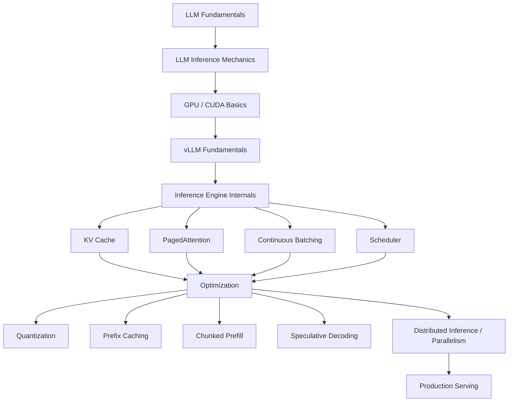

# vLLM Mastery — LLM Inference Engineering from Fundamentals to Production Serving

## Course Overview

Training an LLM gets it *made*; **serving** it is what makes it usable. This course is about the second half of that story: how a request full of English words becomes tokens, how those tokens get batched with a hundred other requests without wasting GPU memory, how the same weights answer thousands of concurrent users, and how you scale all of that across GPUs, nodes, and a Kubernetes cluster without falling over.

vLLM is the dominant open-source engine for this job. It didn't just make LLM serving faster — it introduced **PagedAttention**, a memory-management idea borrowed from OS virtual memory that made continuous, high-concurrency LLM serving practical in the first place. Understanding vLLM well means understanding *why* naive LLM serving is memory-bound and fragmentation-prone, and how vLLM's scheduler, KV cache manager, and batching engine solve that.

This course assumes you already know how to *use* an LLM through an agent framework — you've built with LangChain, LangGraph, MCP, and DeepAgents in this repo's other courses. It does not re-teach what a tool call is or what an agent loop does. Instead it teaches what happens **underneath** the API call: model loading, KV cache, scheduling, quantization, parallelism, benchmarking, and the production operations that keep an inference service healthy under real traffic.

### A note on pace and versioning

vLLM ships a new minor release roughly every two weeks, and it has already been through one major architectural rewrite (the "V1 engine," which fully replaced the earlier "V0" engine). This course teaches the **current V1 architecture** throughout — V0 is fully deprecated and no longer exists in current vLLM. Where a flag or CLI command is likely to drift, chapters say so explicitly and point you at `vllm serve --help` and the release notes rather than asking you to memorize something that might be renamed by the time you read this.

## Why This Course Exists

A hosted, OpenAI-compatible API hides all of this from you by design — that's the point of the API. The moment you need to *self-host* a model (cost, data residency, latency, fine-tuned weights, air-gapped deployment), all of this becomes your responsibility: how much VRAM does a 70B model actually need, why does concurrency crater past a certain batch size, why did the container OOM when it worked fine locally. This course builds the mental model that makes those questions answerable instead of mysterious.

## Who This Course Is For

You should already be comfortable with:

- Python at a professional level (async/await, packaging, CLI tools)
- REST APIs and HTTP fundamentals, including streaming responses
- The basic mechanics of how an LLM generates text (tokens, logits, sampling) — not re-taught here
- LangGraph and/or DeepAgents well enough to wire a tool or a model endpoint into a graph
- Docker fundamentals (images, volumes, `docker run`) — Chapter 19 builds on this, doesn't start from zero
- Enough Linux/GPU-adjacent comfort to read a `nvidia-smi` table without panicking

You do **not** need CUDA programming experience, a background in distributed systems, or prior vLLM/serving-engine experience — those are built from first principles starting in Chapters 2–3.

## Quick Self-Assessment

| Question | If "no," start at |
|---|---|
| Can you explain the difference between prefill and decode? | Chapter 1 |
| Do you know why GPU memory bandwidth matters more than raw FLOPs for LLM decoding? | Chapter 2 |
| Have you ever run `vllm serve` or the `LLM` class? | Chapter 3 |
| Do you know what a KV cache is and why it grows with context length? | Chapter 6 (Chapter 1 gives the short version) |
| Have you heard of PagedAttention and could you explain it to a colleague? | Chapter 7 |
| Do you know the difference between tensor and pipeline parallelism? | Chapter 15 |

## Estimated Timeline

| Pace | Duration |
|---|---|
| Intensive (learning full-time, with GPU access) | 2–3 weeks |
| Steady (evenings/weekends) | 6–8 weeks |
| Reference-only (dip in as needed) | Ongoing |

> Several chapters are far more valuable with hands-on GPU access (even a single consumer GPU, or a rented cloud instance) than read-only. If you don't have GPU access yet, you can still read the entire course for the mental model — flag exercises you'll come back to.

## Complete Chapter Index

| # | Chapter | Focus |
|---|---|---|
| 00 | [Index](./00-index.md) | You are here |
| 01 | [LLM Inference Fundamentals](./01-llm-inference-fundamentals.md) | Prefill vs. decode, TTFT/TPOT/ITL, throughput vs. latency |
| 02 | [GPU & CUDA Fundamentals](./02-gpu-and-cuda-fundamentals.md) | VRAM, tensor cores, precision formats, compute- vs. memory-bound |
| 03 | [vLLM Fundamentals](./03-vllm-fundamentals.md) | Install, the `LLM` class, offline inference, your first server |
| 04 | [The OpenAI-Compatible Server](./04-openai-compatible-server.md) | `vllm serve`, endpoints, tool calling, structured outputs, integrating with your agent stack |
| 05 | [Sampling & Generation](./05-sampling-and-generation.md) | `SamplingParams`, temperature/top-p/top-k, logprobs |
| 06 | [KV Cache](./06-kv-cache.md) | What K/V are, why cache grows with context, the memory/concurrency trade-off |
| 07 | [PagedAttention](./07-pagedattention.md) | The core vLLM innovation — blocks, paging, fragmentation |
| 08 | [Continuous Batching](./08-continuous-batching.md) | Static vs. dynamic vs. continuous batching |
| 09 | [The vLLM Scheduler](./09-vllm-scheduler.md) | How KV cache + PagedAttention + batching become one system |
| 10 | [Memory Management](./10-memory-management.md) | `gpu_memory_utilization`, `max_num_seqs`, diagnosing OOM |
| 11 | [Prefix Caching](./11-prefix-caching.md) | Reusing KV cache across requests sharing a prefix |
| 12 | [Chunked Prefill](./12-chunked-prefill.md) | Balancing long-prompt prefill against decode fairness |
| 13 | [Quantization](./13-quantization.md) | FP8/AWQ/GPTQ/GGUF, VRAM vs. quality trade-offs |
| 14 | [Speculative Decoding](./14-speculative-decoding.md) | Draft models, n-gram lookup, acceptance rate |
| 15 | [Parallelism](./15-parallelism.md) | Tensor, pipeline, and data/expert parallelism across GPUs and nodes |
| 16 | [Structured Outputs & Tool Calling](./16-structured-outputs-and-tool-calling.md) | Guided decoding backends, tool-call parsers, plugging into LangGraph/MCP/DeepAgents |
| 17 | [Benchmarking](./17-benchmarking.md) | `vllm bench`, TTFT/TPOT/throughput, concurrency sweeps |
| 18 | [Performance Tuning](./18-performance-tuning.md) | Systematic, one-variable-at-a-time tuning methodology |
| 19 | [Docker](./19-docker.md) | `vllm/vllm-openai`, GPU passthrough, volumes, health checks |
| 20 | [Production Serving](./20-production-serving.md) | Auth, rate limiting, Kubernetes, autoscaling, observability |
| 21 | [Best Practices](./21-best-practices.md) | Synthesis across every prior chapter |
| 22 | [Common Mistakes & Pitfalls](./22-common-mistakes-and-pitfalls.md) | A pitfall catalog from real-world vLLM misconfiguration |
| 23 | [Capstone Projects](./23-capstone-projects.md) | Beginner → production-grade multi-GPU serving platform |
| 24 | [Interview Preparation](./24-interview-preparation.md) | FAQs, scenario questions, system design, troubleshooting |

## Milestones

- **Milestone 1 (Ch. 1–5)**: You can explain prefill/decode, GPU memory layout, and get a model talking through both the offline `LLM` class and the OpenAI-compatible server.
- **Milestone 2 (Ch. 6–9)**: You can explain KV cache, PagedAttention, and continuous batching well enough to whiteboard vLLM's core architecture in a design review.
- **Milestone 3 (Ch. 10–14)**: You can diagnose OOM errors, tune memory flags, and reason about quantization and speculative decoding trade-offs.
- **Milestone 4 (Ch. 15–18)**: You can scale a model across GPUs, wire structured outputs/tool calling into an agent stack, and back every tuning decision with a benchmark.
- **Milestone 5 (Ch. 19–24)**: You can containerize, deploy, and operate vLLM in production, avoid the well-documented pitfalls, and defend your design choices in an interview.

## Recommended Resources

- Official docs: `docs.vllm.ai` (always check which version a page describes — the docs track `main`)
- Release notes: `github.com/vllm-project/vllm/releases` (check before trusting any specific flag/default in this course)
- The original paper: Kwon et al., *"Efficient Memory Management for Large Language Model Serving with PagedAttention"*, SOSP 2023
- `github.com/vllm-project/production-stack` — the Kubernetes/Helm deployment path used in Chapter 20
- `github.com/vllm-project/vllm-gguf-plugin` — if you need GGUF support specifically (moved out-of-tree)
- This repo's [LangGraph course](../langgraph-course/00-index.md), [MCP course](../mcp-course/00-index.md), and [DeepAgents course](../deepagents-course/00-index.md) for the agent-runtime side referenced in Chapters 4 and 16

## Learning Priority (80/20)

If you only have time for a fraction of this course, prioritize: **prefill vs. decode (Ch. 1)**, **KV cache (Ch. 6)**, **PagedAttention (Ch. 7)**, **continuous batching (Ch. 8)**, **GPU memory management (Ch. 10)**, **tensor parallelism (Ch. 15)**, **benchmarking (Ch. 17)**, and **performance tuning (Ch. 18)**. Don't start by memorizing CLI flags — once the conceptual model of *why* KV cache consumes memory, *why* PagedAttention matters, and *how* continuous batching increases throughput clicks, vLLM's configuration surface becomes easy to reason about instead of a wall of flags to memorize.

  
  <a href="./00-index.md">🏠 Index</a>
  <a href="./01-llm-inference-fundamentals.md">Next: LLM Inference Fundamentals →</a>

