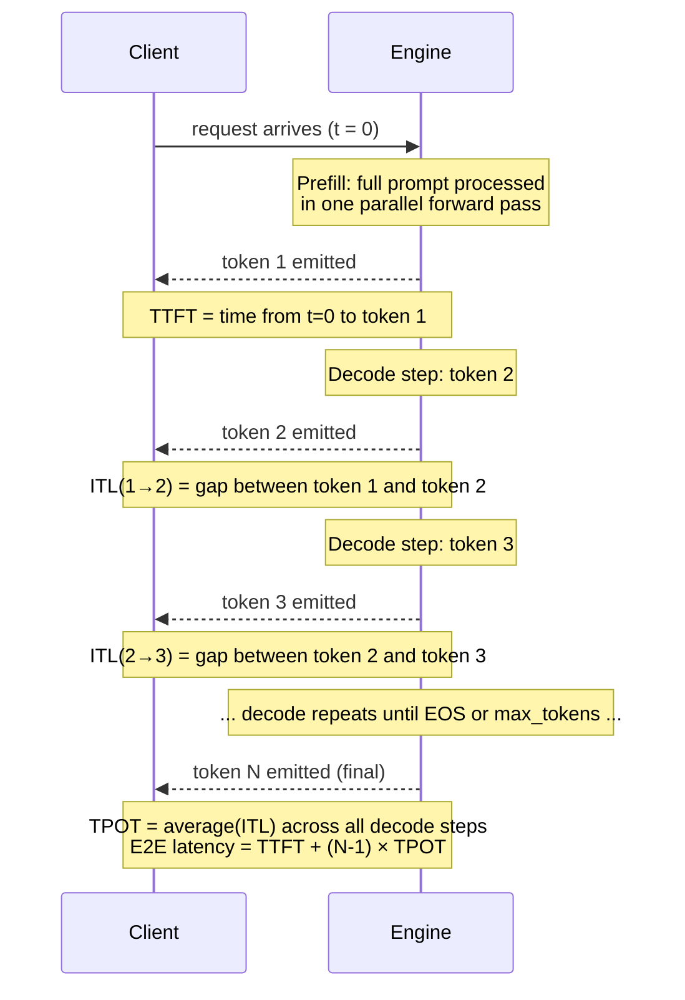
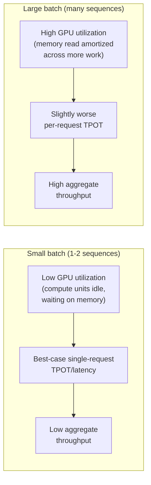
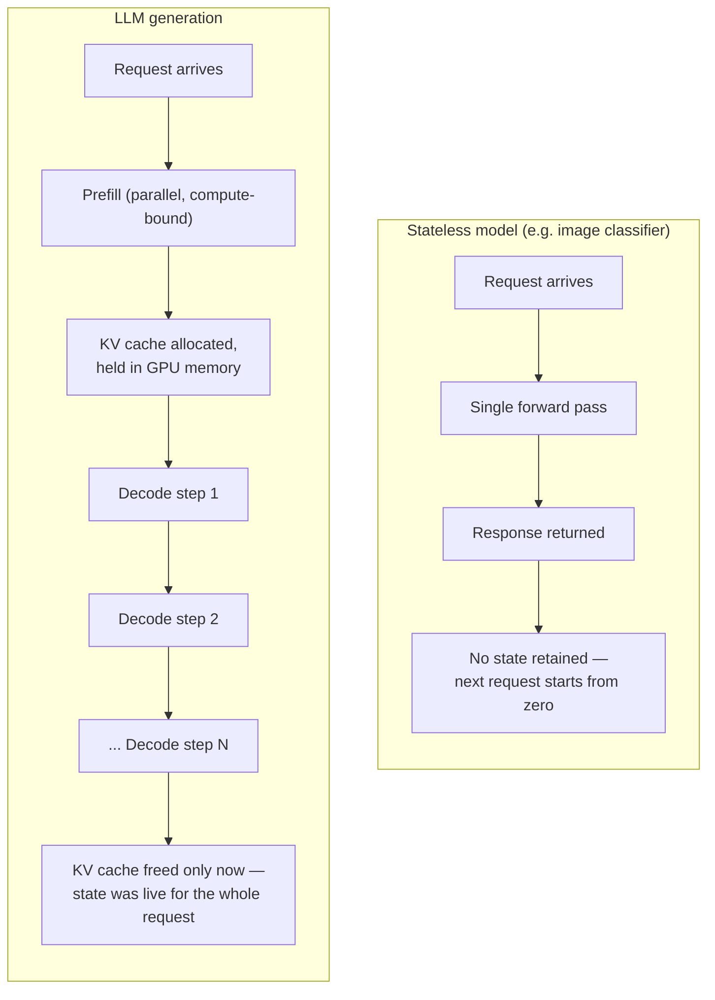
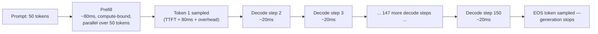

# LLM Inference Fundamentals

## Learning Objectives

By the end of this chapter, you will be able to:

- Trace the exact sequence of steps between "a user sends a prompt" and "tokens stream back," including where tokenization, prefill, and decode sit in that sequence
- Explain **why** prefill and decode are fundamentally different computational workloads (parallel/compute-bound vs. sequential/memory-bound), not just that they are different
- Explain why autoregressive generation forces decode to be sequential, and why that constraint is the single biggest reason LLM serving is hard
- Define **TTFT**, **TPOT**, **ITL**, and **TPS** precisely enough to compute each from a timestamped trace, and explain what each one tells an operator that the others don't
- Reason about the throughput-vs-latency trade-off and predict, directionally, what increasing batch size does to each
- Explain why context length is expensive on two separate axes — compute (attention cost) and memory (KV cache size) — and why those two costs don't grow the same way
- Give an intuitive (pre-Chapter-6) account of why caching K/V projections avoids wasteful recomputation, without yet needing the block-level mechanics
- Articulate, precisely, why serving an LLM is a fundamentally different systems problem than serving a stateless model like an image classifier

## Prerequisites

This chapter assumes you already have:

- Professional-level Python
- General LLM/agent fundamentals: what a transformer does at a black-box level, what tokens/logits/sampling are, what an agent loop or tool call is (from this repo's LangChain, LangGraph, MCP, and DeepAgents courses)
- Comfort reading a REST API request/response cycle and basic latency/throughput vocabulary from other systems you've operated (a database, a web service)

This chapter does **not** assume any GPU, CUDA, or serving-engine background — that starts in Chapter 2 (GPU & CUDA Fundamentals) and Chapter 3 (vLLM Fundamentals). Everything here is framework-agnostic: it's true of any engine serving any autoregressive transformer, not specific to vLLM. vLLM enters the story in Chapter 3.

---

## 1. Why This Chapter Exists Before Any vLLM Content

You already know how to *call* an LLM — you've done it through LangChain, through a raw API, through an agent loop. What you may not have had to reason about is what happens **inside the box** between "prompt goes in" and "tokens come out," and why that internal process has such a strange, lopsided performance profile: the first word can take a noticeably different amount of time to appear than every word after it, and doubling the number of concurrent users doesn't double your GPU's workload in the way you might expect from, say, doubling requests to a stateless web service.

Everything in this course — KV cache, PagedAttention, continuous batching, quantization, parallelism — exists to manage the consequences of the process this chapter describes. If this chapter's model is solid, the rest of the course is "here's the clever engineering that makes this process fast and memory-efficient." If it's shaky, later chapters will feel like a pile of unmotivated tricks. So: no code, no vLLM, no CLI flags yet. Just the shape of the problem.

## 2. From Prompt to Tokens: Setting Up the Problem

Before any generation happens, a request goes through two mechanical steps that are easy to skip past mentally but matter for everything that follows:

1. **Tokenization**: the prompt string is split into a sequence of integer token IDs using the model's tokenizer (BPE, SentencePiece, etc. — you've used these as black boxes before; nothing new here). A prompt like `"Explain PagedAttention"` might become `[36, 128, 92, 4471, 33]` — five integers, not five words; token boundaries rarely line up with word boundaries.
2. **Embedding lookup**: each token ID is mapped to a dense vector via the model's embedding table. This is a cheap lookup, not a meaningful compute cost.

From here on, "the prompt" means **a sequence of input token IDs**, and every cost we discuss — compute, memory, latency — is denominated in tokens, not words or characters. This is why API pricing, context limits, and the metrics in Section 5 are all token-denominated: tokens are the actual unit of work the engine processes. A rough rule of thumb for English text is ~4 characters per token, but this varies a lot by language, tokenizer, and content (code and non-English scripts often tokenize far less efficiently).

## 3. Prefill: Processing the Whole Prompt at Once

Once you have a sequence of input token IDs, the model needs to run a forward pass over all of them before it can produce anything. This step is called **prefill**.

The key property of prefill: the model already has the *entire* input sequence available, all at once. There's no dependency between processing token 1 and token 2 of the prompt — a transformer's self-attention layers can compute all positions' representations in parallel, using large matrix-matrix multiplications, because nothing about token 50's representation depends on token 49's representation having already been computed in a previous step. (Causal masking still prevents token 50 from *attending to* token 51 onward, but that's a masking constraint inside one parallel computation, not a sequential dependency across computations.)

This makes prefill:

- **Parallel across the sequence dimension** — the whole prompt is one batched matrix multiply, not a loop over tokens
- **Compute-bound** — for anything but a tiny prompt, the GPU's arithmetic units (not its memory bandwidth) are the bottleneck, because large matrix-matrix multiplications are exactly the workload GPUs are built to saturate
- **A single forward pass**, whose latency scales with prompt length, but sub-linearly in wall-clock terms up to a point, because a longer prompt just means bigger matrices in the same parallel operation — up until the GPU's compute units are already saturated, at which point it becomes closer to linear

At the end of prefill, two things exist that didn't before:

1. A set of logits over the vocabulary for the *next* token (position N+1, where N is the prompt length) — this is what sampling turns into the first output token
2. **Key and Value projections for every prompt token, at every layer** — a byproduct of the attention computation that gets *kept*, not thrown away. This is the seed of the KV cache (Section 6).

## 4. Decode: One Token at a Time, Forever

Once the first output token is sampled, everything changes. The model needs to compute the *next* token after that — but it can't jump ahead, because it doesn't know what the previous token will be until it's already been sampled.

This is **decode**: a loop that runs once per output token, where each iteration:

1. Takes the single most-recently-generated token as input
2. Runs it through the model to compute logits for the *next* token
3. Samples the next token from those logits
4. Appends that token to the sequence and to the KV cache (Section 6)
5. Feeds it back in as the input for the next iteration

Structurally, this is nearly the opposite of prefill:

- **Sequential** — iteration N+1 cannot start until iteration N has produced its token; there is no way to parallelize across the output sequence the way prefill parallelizes across the input sequence
- **Memory-bound, not compute-bound** — each decode step only processes *one new token* per sequence, so the matrix multiplications involved are tiny (matrix-vector, not matrix-matrix) relative to the size of the model weights and the growing KV cache that have to be read from GPU memory to do that tiny amount of compute. The GPU spends most of a decode step waiting on memory bandwidth, not doing arithmetic — its compute units sit mostly idle. This is precisely the imbalance that makes **batching multiple sequences' decode steps together** so valuable (previewed in Section 9, covered fully in Chapter 8): if you're going to pay the cost of reading the weights from memory anyway, reading them once to serve 32 sequences' decode steps is far more efficient than reading them once per sequence.
- **One iteration per output token** — if the request asks for 500 output tokens, decode runs 500 times, no matter how fast or slow the GPU is; you cannot compute output token 500 without first computing (and sampling) tokens 1 through 499 in order

This prefill/decode split is the single most important structural fact in this entire course. Skim past it and half the optimizations in later chapters (continuous batching, chunked prefill, speculative decoding) will look like arbitrary cleverness rather than direct responses to this specific asymmetry.

| | Prefill | Decode |
|---|---|---|
| Input | Entire prompt (N tokens) | One token (the last generated one) |
| Parallelism | Across all N prompt positions at once | None — strictly sequential, one token at a time |
| Bottleneck | Compute (arithmetic throughput) | Memory bandwidth (reading weights + KV cache) |
| Matrix shapes | Matrix-matrix (large, GPU-efficient) | Matrix-vector (small, GPU-underutilized per sequence) |
| Runs how many times per request | Once | Once per output token |
| What grows the cost | Prompt length | Number of output tokens **and** growing KV cache per step |

## 5. Why Generation Is Autoregressive — and Why That Forces Sequential Decode

"Autoregressive" means each output token is generated conditioned on all tokens before it (prompt plus every token generated so far), and the model's whole training objective — predict the next token given everything prior — assumes that structure. This is not an implementation detail an engine could route around; it's the definition of what the model was trained to do.

The direct consequence: to know what token 300 should be, the model needs token 299 to already exist, because token 299 is part of the input to the forward pass that produces token 300. You cannot compute token 300 speculatively without a guess for token 299 — and if that guess is wrong, the computation for 300 was wasted. (Speculative decoding, Chapter 14, is precisely a controlled way of making such guesses and cheaply verifying them — but it doesn't remove the fundamental sequential dependency, it works around it probabilistically.)

This is *the* reason decode latency cannot simply be parallelized away by throwing more compute at a single request. A single request's decode is fundamentally, irreducibly a chain of 1-at-a-time steps. The only lever an engine has for a single request's decode speed is making *each step* faster (bigger/faster GPU, quantization, better kernels) — it cannot make more steps happen at once for that one request. What an engine *can* parallelize is **decode across different requests** — which is the entire premise of continuous batching (Chapter 8) and the reason a serving engine's job is so different from a single offline inference script.

## 6. A First Look at the KV Cache

Here's the wasteful alternative decode would require without any caching: to compute token 300, naively you'd need to re-run the *entire* forward pass over all 299 prior tokens plus the new one, from scratch, at every single decode step — recomputing attention Key and Value projections for tokens 1 through 299 again, even though those tokens' representations never change once computed (causal masking means an earlier token's K/V never depend on later tokens). Over a full generation of M output tokens, that means the total work across the whole decode loop grows **quadratically** with sequence length — step 300 redoes step 299's work, plus 298's, plus every step before it.

The fix is obvious once stated: compute each token's Key and Value projections **once**, at every layer, and keep them around. This is the **KV cache**. Prefill populates it for the whole prompt in one shot (Section 3); each decode step adds exactly one new token's K/V to it and reuses everything already stored. A decode step's attention computation becomes "the new token's Query, against all cached Keys/Values" — no recomputation of anything already cached.

This turns the total decode cost from quadratic back to roughly linear in sequence length — a single decode step still touches every previously cached token's K/V (that memory read is exactly the memory-bandwidth bottleneck from Section 4), but it never *recomputes* them.

The catch, and the thing that motivates roughly a third of this entire course: **the KV cache has to live somewhere**, and that somewhere is GPU memory, for the entire lifetime of the request. Unlike model weights (fixed size, loaded once, shared across every request), the KV cache:

- **Grows with every decode step** — one more token means one more slot to store, at every layer, for that specific request
- **Is per-request, per-sequence state** — not shared across requests the way weights are
- **Competes with every other concurrent request's KV cache for the same finite VRAM**

A rough sizing formula (framework-agnostic — every serving engine faces this, not just vLLM) for the KV cache of **one** sequence:

```
KV cache bytes  ≈  2 (K and V)
                 × num_layers
                 × num_kv_heads
                 × head_dim
                 × sequence_length
                 × bytes_per_element (2 for FP16/BF16, 1 for FP8)
```

Plug in something like a 32-layer, 32-KV-head, 128-head-dim model at FP16: `2 × 32 × 32 × 128 × seq_len × 2 bytes` = `524,288 bytes per token` ≈ 512 KiB per token, per sequence. At a 4,096-token context, that's ~2 GiB for a *single* sequence's cache alone — before you've served a second concurrent user. This is why "how much VRAM does this model actually need to serve N concurrent users at context length L" is a real, recurring production question, and why naively over-allocating or fragmenting this memory (the pre-PagedAttention failure mode) wrecks concurrency. Chapter 6 goes deep on exact cache layout and lifecycle; Chapter 7 covers how PagedAttention specifically solves the fragmentation problem this formula's "lives somewhere, grows per-request" property creates. For now, the takeaway is just: **the KV cache is the reason an LLM serving engine has mutable, growing, per-request state sitting in GPU memory for the duration of a request — something a stateless model server never has to think about at all** (Section 10 makes this contrast explicit).

## 7. The Metrics: TTFT, TPOT, ITL, and TPS

With prefill and decode distinguished, the standard LLM-serving latency/throughput metrics stop being arbitrary acronyms and become direct measurements of the two phases above. Precision matters here — these terms get used loosely in blog posts, but as an engineer tuning a production system you need to compute each one from a timestamped trace without ambiguity.



### Time to First Token (TTFT)

**Definition**: wall-clock time from when a request is submitted (or, in a loaded system, from when the engine actually starts working on it — see the queueing caveat below) to when the *first* output token is available to the client.

TTFT is dominated by **prefill** — the engine has to run the full prompt through the model before it can sample anything. So TTFT scales primarily with **prompt length**: a 4,000-token prompt has meaningfully higher TTFT than a 40-token prompt, all else equal, because prefill's compute cost scales with prompt size.

The caveat that trips people up in production: TTFT as *experienced by the client* also includes any time the request spent **queued** behind other requests before the engine started prefilling it. Under load, a system can have fast raw prefill compute but terrible client-observed TTFT purely from queueing delay. When you see a TTFT regression in production, the first diagnostic question is "did prefill get slower, or did the queue get longer" — they have completely different fixes (Chapter 18 builds this diagnostic muscle in depth).

### Time Per Output Token (TPOT)

**Definition**: the average time for each output token **after the first**, computed as:

```
TPOT = (E2E latency - TTFT) / (number_of_output_tokens - 1)
```

TPOT is a **decode**-phase metric — it reflects the steady-state cost of one sequential decode step: read the model weights and this sequence's KV cache from GPU memory, do a small amount of compute, sample, append. Because decode is memory-bandwidth-bound (Section 4), TPOT is primarily sensitive to **how much has to be read from memory per step** — which grows (slowly) as the KV cache grows with sequence length, and which is heavily affected by **how many other sequences are being decoded in the same batch step** (Section 9) and by GPU memory bandwidth itself (Chapter 2).

### Inter-Token Latency (ITL)

**Definition**: the time gap between two *specific, consecutive* emitted tokens — token *k* to token *k+1* — as an individual measurement, not an average.

This is the subtle distinction people conflate with TPOT. TPOT is a single averaged number over an entire decode run; ITL is the full **distribution** of per-step gaps. Two requests can have identical TPOT (say, 25ms average) while one has near-constant 25ms gaps and the other has wildly jittery gaps (18ms, then 60ms, then 20ms, then 55ms...) because it keeps getting momentarily deprioritized by the scheduler in favor of other concurrent requests. Average TPOT looks the same; the *user experience* of the second one — streamed text that stutters — is much worse. This is why production dashboards report ITL as a **percentile distribution** (p50, p95, p99), not just a mean, and why "smooth streaming" is a distinct operational goal from "low average token time." Chapter 17 (Benchmarking) and Chapter 18 (Performance Tuning) both treat p99 ITL as a first-class number, not a derived footnote of TPOT.

### Throughput / Tokens Per Second (TPS)

Throughput has two meaningfully different flavors that get casually collapsed into "tokens/sec" and should not be:

- **Per-request TPS**: `1 / TPOT` for a single sequence's decode — "how fast does *this* stream feel." This is a latency-side number in disguise.
- **Aggregate system throughput**: total tokens (prompt + generated, across *all* concurrent requests) processed per second, system-wide. This is the number that determines how many requests per second your deployment can sustain, and it's what capacity planning and cost-per-token calculations are actually built on.

These two throughput numbers can — and routinely do — move in **opposite directions** as you change batch size, which is exactly the trade-off in Section 8.

### Putting the Metrics Together

For a single request generating N output tokens:

```
End-to-end latency  =  TTFT  +  (N - 1) × TPOT     (ignoring per-step jitter — ITL captures that jitter)
```

| Metric | Phase it reflects | What it's sensitive to | Granularity |
|---|---|---|---|
| TTFT | Prefill (+ queueing) | Prompt length, queue depth, compute throughput | One number per request |
| TPOT | Decode | KV cache size, memory bandwidth, batch contention | One averaged number per request |
| ITL | Decode | Same as TPOT, plus scheduler fairness/jitter | A distribution — per adjacent token pair |
| TPS (per-request) | Decode | Inverse of TPOT | One number per request |
| TPS (aggregate) | Both, across all concurrent requests | Batch size, concurrency, engine efficiency | One number per system, per time window |

## 8. Throughput vs. Latency: The Fundamental Trade-off

Here is the trade-off every serving decision in this course ultimately comes back to: **batch size** — how many sequences' decode steps get processed together in one engine step — pushes throughput and per-request latency in opposite directions.

Recall from Section 4 that a single sequence's decode step is memory-bound: the GPU spends most of the step's time reading weights (and that sequence's KV cache) from memory, with its compute units mostly idle. If you batch several sequences' decode steps together — read the weights from memory *once*, then do the (still small, but now bigger) matrix multiply against several sequences' hidden states at once — you amortize that expensive memory read across more useful work. Aggregate throughput goes up substantially, because the GPU's compute units, previously starved waiting on memory, now have more work to do per memory read.

But each individual sequence in that batch now shares the engine's attention for that step with every other sequence in the batch. If the engine's steps take slightly longer as the batch grows (larger combined matrix multiply, more memory traffic in aggregate), then each individual sequence's **TPOT gets slightly worse**, even though the *system's* aggregate tokens/sec is much higher. You've traded a small amount of per-request latency for a large amount of system throughput.



This is why the right operating point depends entirely on what you're optimizing for:

- **A single interactive user, latency-sensitive** (a chat UI where one person is waiting on the stream): you want small batches, prioritizing that one request's TPOT/TTFT, accepting that the GPU is mostly idle.
- **A high-volume backend workload** (batch summarization of a million documents overnight, no human waiting on any individual response): you want the largest batch the memory budget allows, maximizing aggregate tokens/sec, and you don't care that any individual document's TPOT is a bit higher than it could be in isolation.
- **A production API serving many concurrent interactive users** (the hardest and most common real case): you need *both* — enough aggregate throughput to serve everyone, without any individual user's TTFT/ITL degrading past the point where the stream feels laggy. This is precisely the problem continuous batching (Chapter 8) and the scheduler (Chapter 9) exist to manage: admitting new requests into an in-flight batch step-by-step, rather than forcing an operator to pick one static batch size and live with its trade-off for every request uniformly.

There is no batch size that is "correct" in the abstract — it's a dial you set based on your actual latency SLOs and expected concurrency, and re-tuning it (Chapter 18) is a routine part of operating an inference service, not a one-time setup step.

## 9. Context Length: Two Separate Costs, Two Separate Growth Rates

"Context length" (prompt + generated tokens so far) is expensive along two axes that do not scale the same way, and conflating them is a common source of bad intuition:

1. **Compute cost of prefill**: attention over a prompt of length N requires every position to (in principle) attend to every other position, an O(N²) relationship in the attention computation itself, though in practice modern attention kernels and hardware make long-prompt prefill perform much better than naive quadratic scaling would suggest. Still: a 32K-token prompt's prefill is meaningfully, non-trivially more expensive than a 1K-token prompt's — this is why TTFT rises with prompt length (Section 7).
2. **Memory cost of the KV cache**: as derived in Section 6, KV cache size grows **linearly** with sequence length (each new token adds one more slot to store, not a growing multiple), but it is paid **continuously, for the entire lifetime of the request**, and it competes with every other concurrent request's cache for the same fixed VRAM pool. A model with a 128K context window doesn't just mean "prompts can be longer" — it means every one of those 128K token-slots' worth of K/V must be resident in GPU memory simultaneously if a request actually uses that much context, which directly caps how many *concurrent* long-context requests a given amount of VRAM can hold.

The operational consequence: raising `max_model_len` (the context length an engine is configured to serve — Chapter 10 covers the actual flag) isn't a free capability unlock. It's a decision that trades away concurrency headroom, because more of your fixed VRAM budget has to be reserved for the possibility of long-context KV caches, leaving less for running many requests side by side. This exact tension — "support longer contexts" vs. "serve more concurrent users" — is why memory management (Chapter 10) and PagedAttention (Chapter 7) are load-bearing chapters in this course rather than optional deep-dives.

## 10. Why This Is a Fundamentally Different Systems Problem

You've almost certainly served a stateless ML model before — an image classifier, a sentence embedder, a fraud-detection scorer. Put the two side by side and the differences are not incremental; they're structural.



Concretely, the differences that matter for how you design and operate a serving system:

| | Stateless classifier | LLM generation |
|---|---|---|
| Forward passes per request | Exactly one | One prefill + one decode step per output token — count unknown in advance |
| Per-request state held in GPU memory | None beyond the single pass | A growing KV cache, resident for the entire request lifetime |
| Cost predictability | Fixed cost, known ahead of time from input size alone | Cost depends on output length, which is only known when generation stops (EOS or `max_tokens`) |
| What "batching" buys you | Straightforward — batch inputs, one pass, done | Must batch *sequences at different points in their own lifecycle* (Chapter 8) — one request's decode step 3 alongside another's decode step 200 |
| Memory competition across requests | Minimal — no long-lived per-request memory | Direct competition for finite VRAM between every concurrent request's KV cache (Sections 6, 9) |
| Failure mode under load | Slower responses, roughly proportional to load | Can OOM outright if KV cache demand exceeds VRAM, or silently degrade TPOT/ITL for everyone already in flight |

The one-sentence version, which is worth being able to say precisely in an interview or a design review: **an LLM serving engine has to manage a variable number of concurrent, variable-length, stateful decode loops competing for a shared, finite pool of GPU memory whose demand isn't known until generation ends — a stateless model server just needs to run the same fixed-cost function as many times in parallel as the hardware allows.** Every remaining chapter in this course is an answer to some piece of that one sentence.

## 11. Worked Example: A Request's Full Lifecycle, With Numbers

Take a concrete (illustrative, not measured) example to make Sections 3–8 tangible. Suppose a request has:

- A 50-token prompt
- A request for up to 200 output tokens
- Prefill takes 80 ms (compute-bound, scales with prompt size)
- Each decode step, in isolation with no other concurrent requests, takes 20 ms (memory-bound, roughly flat per step at this context length)
- The model actually stops after 150 output tokens (hits an EOS token before reaching the 200-token cap)



Working through the metrics:

- **TTFT** ≈ 80 ms (plus some fixed engine/network overhead — call it 90 ms observed)
- **TPOT** = total decode time / (150 − 1) steps = (149 × 20 ms) / 149 = **20 ms** — clean in this idealized, no-contention example; in a real multi-tenant system TPOT would be higher and would fluctuate as the batch composition changes each step (Section 8)
- **E2E latency** ≈ TTFT + (150 − 1) × TPOT = 90 ms + 2,980 ms ≈ **3.07 seconds**
- **Per-request TPS** = 150 tokens / 3.07 s ≈ **49 tokens/sec** for this one request
- **ITL** — in this idealized example, every gap is ~20 ms, so the distribution is tight around the mean; in production, expect a spread (p50 might be 20ms, p99 might be 45ms under load from other concurrent requests sharing the batch)

Now change one variable: run this exact request in a batch alongside 31 other similar requests instead of alone. Aggregate throughput across all 32 requests might now be, say, 1,200 tokens/sec system-wide — vastly higher than 32 × 49 = 1,568 tokens/sec would suggest if they ran in perfect isolation one after another, because they're now overlapping in time — but this single request's own TPOT might rise from 20 ms to 26 ms per step, because each decode step is now doing more combined work per step and taking a bit longer wall-clock, even though it's serving 32 sequences instead of one. That's the trade-off from Section 8, made concrete with numbers.

## Real-World Scenario

A team ships a customer-support chat agent (built on LangGraph, per this repo's earlier courses) backed by a self-hosted 13B model. In testing with a single developer sending one request at a time, TTFT is ~150 ms and the response streams smoothly at a steady clip — the demo looks great. In production, with 40 concurrent support agents using the tool during a peak hour, two separate complaints show up: "responses take forever to start" and, separately, "the streaming text stutters, it's not the smooth typing effect it was in the demo."

Those are two *different* problems, diagnosable only because the team understands the vocabulary from this chapter:

- "Takes forever to start" is a **TTFT** complaint. Given 40 concurrent users, the likely cause is **queueing** — requests waiting for an engine slot before prefill even starts — not prefill itself getting slower. The fix path is capacity (more replicas, or the batching/scheduling tuning in Chapters 8–9), not touching model or prompt size.
- "Stutters" is an **ITL** complaint, not a TPOT complaint — the *average* token rate might look fine on a dashboard that only reports mean TPOT, while the p99 inter-token gap is what a human actually perceives as jank. This is why Chapter 17 insists on percentile-based ITL dashboards rather than trusting a single averaged throughput number, and why this team's first fix was upgrading their monitoring before touching any engine configuration at all — you cannot tune what you cannot see, and TPOT alone was hiding the exact problem users were reporting.

Only after separating these two complaints — using the precise vocabulary this chapter defines — could the team figure out that queueing depth (a capacity/admission problem, addressed later via continuous batching and scheduler tuning) and per-step scheduling fairness (a batch-composition problem) were two different knobs, fixed two different ways, instead of one vague "it's slow" ticket that nobody could act on.

## Best Practices

- **Always distinguish TTFT from TPOT/ITL when reporting or debugging a latency issue.** They point to different subsystems (prefill/queueing vs. decode/batching) with different fixes. A single "average latency" number collapses this distinction and actively hides the diagnosis.
- **Track ITL as a distribution (p50/p95/p99), not just an average.** A perfectly fine mean TPOT can coexist with a jittery, bad-feeling stream — the mean won't show you that.
- **Separate per-request throughput from aggregate system throughput** in your own head and in any dashboard you build. They answer different questions ("how fast does this one stream feel" vs. "how much total load can this deployment take"), and optimizing one can actively hurt the other.
- **Think in tokens, not characters or words**, whenever reasoning about cost, latency, or context limits — every metric in this chapter is token-denominated because tokens are the actual unit of engine work.
- **Remember that KV cache is per-request, growing, and lives in GPU memory for the whole request** — this is the mental model that makes memory management (Chapter 10), PagedAttention (Chapter 7), and OOM debugging make sense later. If you only remember one fact from this chapter going into Chapter 6, make it this one.
- **When choosing a batch-size-adjacent trade-off, start from your actual SLO**, not from "bigger batch = better." Ask "what's the acceptable TTFT/ITL for my use case" before "what's the max throughput my hardware can hit" — the second question without the first produces a system that's fast in aggregate and unusable for any individual user.

## Common Mistakes

- **Treating "latency" as one undifferentiated number.** Reporting a single average end-to-end latency across requests with wildly different prompt/output lengths hides whether a regression is a prefill (TTFT) problem or a decode (TPOT/ITL) problem — and the fixes for each are different subsystems entirely.
- **Assuming decode speed is dominated by raw compute (FLOPs) the same way prefill is.** Decode is memory-bandwidth-bound (Section 4); throwing a GPU with more FLOPs but the same memory bandwidth at a decode-heavy workload won't help nearly as much as intuition from "bigger GPU = faster" suggests. Chapter 2 covers this distinction in hardware terms.
- **Assuming longer max context length is "free" as long as you don't use it.** Depending on how an engine pre-allocates or reserves memory for context length (engine-specific — Chapter 10), configuring a large `max_model_len` can reduce how many concurrent requests fit in VRAM even for requests that never approach that limit.
- **Believing decode could, in principle, be parallelized across a single sequence's own output tokens** if you just had a bigger/faster GPU. It cannot — the autoregressive dependency (Section 5) is a property of what the model was trained to do, not a limitation of current hardware or software. Only cross-request parallelism (batching) is available.
- **Conflating TPOT (an average) with ITL (a distribution).** They can look identical on a mean-only dashboard while describing very different user experiences — see the Real-World Scenario above.
- **Forgetting that "tokens" ≠ "words" ≠ "characters"** when doing back-of-envelope cost or latency estimates — the ratio varies by language, tokenizer, and content type, and getting this wrong throws off every downstream estimate (VRAM sizing, cost-per-request, expected TTFT).

## Summary

- A request's lifecycle is: prompt → tokenizer → input token IDs → **prefill** (one parallel, compute-bound forward pass over the whole prompt, producing the first token and populating the KV cache) → **decode loop** (one sequential, memory-bound step per output token, each one producing exactly one new token and appending to the KV cache) → repeat until EOS or `max_tokens` → detokenize → response.
- Prefill and decode are structurally opposite workloads: prefill is parallel and compute-bound; decode is sequential and memory-bound. This asymmetry is the reason nearly every optimization covered later in this course exists.
- Autoregressive generation — each token conditioned on everything before it — is *why* decode must be sequential; it's a property of what the model was trained to do, not an engineering limitation that faster hardware alone removes.
- The KV cache exists to avoid recomputing every prior token's Key/Value projections at every decode step. Without it, total decode cost would grow quadratically with sequence length instead of roughly linearly. The cost of this fix: the cache is per-request, grows every step, and occupies GPU memory for the entire request lifetime — the seed of nearly every memory-management topic later in this course.
- **TTFT** reflects prefill (plus queueing); **TPOT** is the averaged per-token decode cost; **ITL** is the actual distribution of per-token gaps (and the more accurate signal for perceived streaming smoothness); **TPS** comes in per-request and aggregate-system flavors that move independently and sometimes in opposite directions.
- Batch size trades per-request latency (TPOT/ITL get slightly worse) against aggregate system throughput (much higher) — there is no universally "correct" batch size, only one that matches your actual latency SLOs and expected concurrency.
- Context length costs compute (prefill, roughly quadratic in attention) and memory (KV cache, linear in sequence length but held continuously and competing with every other concurrent request) along two separate axes that don't scale identically.
- Serving an LLM is structurally different from serving a stateless model: it manages a variable number of concurrent, variable-length, **stateful** decode loops competing for a shared, finite GPU memory pool, with total cost unknown until generation actually stops.

## Knowledge Check

1. A colleague says "decode is slow because the GPU doesn't have enough FLOPs." What's wrong with that diagnosis, and what would you check instead?
2. Explain, in your own words, why prefill can be parallelized across the whole prompt but decode cannot be parallelized across a single sequence's own output tokens.
3. Two requests report identical average TPOT (30 ms/token). One "feels" smooth when streamed to a user; the other stutters noticeably. What metric would you look at to explain the difference, and why wouldn't TPOT alone show it?
4. Why does increasing batch size typically raise aggregate system throughput while also slightly increasing each individual request's TPOT? Are these facts in conflict?
5. Explain why the KV cache exists — specifically, what computation would have to be redundantly repeated without it, and how that cost would scale with sequence length.
6. Why can a large `max_model_len` configuration reduce the number of concurrent requests a deployment can serve, even for requests that use far less than the maximum context?

<details>
<summary>Answers</summary>

1. Decode is memory-bandwidth-bound, not compute-bound — each step reads the full model weights (and the sequence's growing KV cache) from GPU memory to do a comparatively tiny amount of arithmetic on one new token. Extra FLOPs help far less than extra memory bandwidth would. Check GPU memory bandwidth utilization and KV cache size/growth before assuming a compute upgrade will fix decode latency.
2. Prefill has the entire prompt available upfront, and no prompt token's representation depends on a *previously computed* token's representation (causal masking is just a constraint within one parallel computation, not a sequential dependency across computations) — so all prompt positions can be processed in one batched matrix operation. Decode's output tokens are generated autoregressively: token N+1 requires token N to already exist and be fed back in as input, so there is no way to compute it before token N is sampled. That dependency chain is irreducibly sequential for a single sequence.
3. Look at Inter-Token Latency (ITL) as a distribution (p50/p95/p99), not the averaged TPOT. Two requests can share the same mean per-token time while one has tight, consistent gaps and the other has high-variance jitter (fast, then slow, then fast) caused by scheduler/batch contention — the jitter is what a human perceives as stuttering, and an average erases exactly that signal.
4. Not in conflict — they're two sides of the same batching trade-off. Batching decode steps together amortizes the expensive memory read (weights + per-sequence KV cache) across more useful compute per step, so aggregate tokens/sec across all sequences in the batch rises substantially. But each individual sequence now shares that step with more neighbors, and the step itself may take slightly longer wall-clock, so that one sequence's own TPOT rises a little. Higher aggregate throughput and slightly worse per-request latency are simultaneously true and directly connected.
5. Without a KV cache, computing output token K would require recomputing Key/Value projections for every one of the K−1 prior tokens from scratch, at every layer, on every decode step — because attention needs those projections and nothing would be stored. Repeating that at every step across a generation of M tokens makes total decode cost grow quadratically with sequence length. Caching each token's K/V the moment it's computed (once, during prefill or its own decode step) means each subsequent step only computes the *new* token's projections and reuses everything else, restoring roughly linear total cost.
6. Because the KV cache for a request must be resident in GPU memory for that request's entire lifetime, and an engine typically has to reserve or account for memory in proportion to the *maximum* context length it's configured to serve. A larger `max_model_len` means a larger worst-case per-request memory reservation, which — depending on the engine's exact allocation strategy (Chapter 10) — leaves less VRAM headroom for running many requests concurrently, even if most actual requests are short.

</details>

## Hands-On Exercise

No GPU or vLLM install required — this exercise sharpens the mental model with real tokenization and back-of-envelope timing math you'll reuse once vLLM enters the picture in Chapter 3.

### Part 1 — Tokenization is not word-counting

Using either `tiktoken` (fast, no model download) or a Hugging Face `transformers` tokenizer:

```python
import tiktoken

enc = tiktoken.get_encoding("cl100k_base")  # a widely-used BPE encoding
samples = [
    "Explain PagedAttention in one sentence.",
    "def fibonacci(n): return n if n < 2 else fibonacci(n-1) + fibonacci(n-2)",
    "こんにちは、今日は良い天気ですね。",
]
for s in samples:
    ids = enc.encode(s)
    print(f"{len(s):>3} chars -> {len(ids):>3} tokens | {s[:40]!r}")
```

Run this and note the chars-per-token ratio for each sample. Confirm for yourself that English prose, source code, and non-Latin-script text tokenize at noticeably different densities — this is the fact behind "assume ~4 chars/token" being a rough English-only heuristic, not a universal constant.

### Part 2 — Observe prefill vs. decode timing locally (CPU is fine, illustrative only)

Using `transformers` with a small model (e.g. `gpt2`) and a streamer, capture per-token timestamps to compute an approximate local TTFT/TPOT/ITL — understanding that CPU numbers won't be representative of GPU-served production numbers, only illustrative of the *shape* of the timing pattern:

```python
import time
import threading
from transformers import AutoModelForCausalLM, AutoTokenizer, TextIteratorStreamer

model_name = "gpt2"
tok = AutoTokenizer.from_pretrained(model_name)
model = AutoModelForCausalLM.from_pretrained(model_name)

prompt = "The three most important ideas in distributed systems are"
inputs = tok(prompt, return_tensors="pt")
streamer = TextIteratorStreamer(tok, skip_prompt=True, skip_special_tokens=True)

gen_kwargs = dict(**inputs, max_new_tokens=40, streamer=streamer, do_sample=False)
thread = threading.Thread(target=model.generate, kwargs=gen_kwargs)

t0 = time.perf_counter()
thread.start()

timestamps = []
for _ in streamer:
    timestamps.append(time.perf_counter())
thread.join()

ttft = timestamps[0] - t0
gaps = [b - a for a, b in zip(timestamps, timestamps[1:])]
tpot = sum(gaps) / len(gaps) if gaps else 0.0

print(f"TTFT:  {ttft*1000:.1f} ms")
print(f"TPOT:  {tpot*1000:.1f} ms (averaged over {len(gaps)} gaps)")
print(f"ITL (first 5 gaps, ms): {[round(g*1000, 1) for g in gaps[:5]]}")
```

Run it a few times and look at the spread in the `gaps` list — even on an idle CPU with a single request and no concurrency, you should see the gaps aren't perfectly uniform. Now imagine that same variance under real concurrent load from other requests, and you have an intuitive feel for why ITL is reported as a distribution in production (Section 7).

### Part 3 — Math-only: work the trade-off yourself

Without running any code, work through this by hand (revisit Section 11 if you get stuck):

A request has a 200-token prompt and generates 300 output tokens. Measured in isolation: prefill takes 120 ms; each decode step takes 18 ms.

1. Compute TTFT, TPOT, total E2E latency, and per-request TPS for this single request.
2. Now suppose this request runs in a batch of 16 concurrent similar requests, and batching raises each decode step's wall-clock time to 30 ms (because the step now does more combined work) while aggregate throughput across all 16 requests becomes far higher than running them one-by-one. Recompute this one request's TPOT and E2E latency under batching, and explain in one paragraph why the *aggregate* system may be strictly better off even though this specific request's numbers got worse.
3. If your product's SLA requires p99 TPOT under 25 ms for a live chat use case, would the batch-of-16 configuration in step 2 satisfy that SLA for this request? What lever from Section 8 would you reach for first if it didn't?

## Further Reading

- Kwon, Woosuk, et al. "Efficient Memory Management for Large Language Model Serving with PagedAttention." SOSP 2023 — `https://arxiv.org/abs/2309.06180` (the foundational paper behind Chapters 6–7; worth reading once now for the problem framing, again after Chapter 7 for the mechanism)
- vLLM documentation root — `https://docs.vllm.ai/` (always check which version a given page describes)
- vLLM blog — `https://blog.vllm.ai/` (background on V1's scheduler/KV-cache-manager redesign, relevant once you reach Chapters 6–9)
- vLLM GitHub repository — `https://github.com/vllm-project/vllm`
- NVIDIA Developer Blog, "Mastering LLM Techniques: Inference Optimization" — `https://developer.nvidia.com/blog/mastering-llm-techniques-inference-optimization/` (good framework-agnostic treatment of prefill/decode and the metrics in Section 7)
- Databricks Engineering Blog, "LLM Inference Performance Engineering: Best Practices" — `https://www.databricks.com/blog/llm-inference-performance-engineering-best-practices`
- Hugging Face `transformers` generation docs (for the Part 2 exercise) — `https://huggingface.co/docs/transformers/main_classes/text_generation`
- `tiktoken` repository (for the Part 1 exercise) — `https://github.com/openai/tiktoken`
- This repo's [LangGraph course](../langgraph-course/00-index.md) and [DeepAgents course](../deepagents-course/00-index.md), if you want to revisit how the agent-runtime layer treats an LLM call as a black box — this chapter is what's actually happening inside that box

<div style="display:flex;justify-content:space-between;align-items:center;">
  <a href="./00-index.md">← Previous: Index</a>
  <a href="./00-index.md">🏠 Index</a>
  <a href="./02-gpu-and-cuda-fundamentals.md">Next: GPU & CUDA Fundamentals →</a>
</div>
