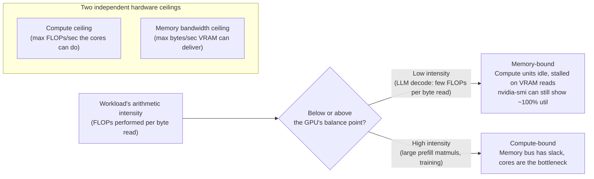
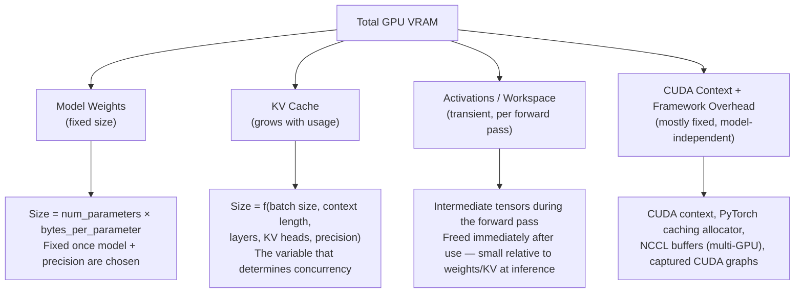

# GPU & CUDA Fundamentals

> A GPU serving a 70B model isn't slow because it's short on math — modern GPUs do hundreds of trillions of floating-point operations per second. It's slow (or fast) almost entirely because of how many bytes it can pull out of VRAM per second, and how cleverly the serving engine amortizes those bytes across useful work. Everything in this course — KV cache, PagedAttention, continuous batching, quantization — is, underneath, a strategy for managing that one constraint.

## Learning Objectives

By the end of this chapter, you will be able to:

- Explain why a GPU is a throughput-oriented, massively-parallel device while a CPU is a latency-oriented, few-core device, and why that distinction makes GPUs the right hardware for matrix-heavy LLM math
- Name the four places GPU VRAM goes during LLM serving (weights, KV cache, activations, framework/runtime overhead) and explain, at a conceptual level, why VRAM — not compute — is the resource that governs almost every vLLM configuration decision
- Describe what a CUDA kernel is and why "the GPU is a separate memory space with its own program launched from the CPU" matters for reasoning about performance, without needing to write one
- Explain what a tensor core is, why it exists, and why it ties numeric precision directly to throughput
- Compare FP32, FP16/BF16, FP8, INT8, and INT4 on memory footprint, compute throughput, and accuracy trade-offs, and explain why "lower precision" is not merely "smaller," it is usually also "faster"
- Read an `nvidia-smi` table and explain why "100% GPU utilization" does not mean "the GPU's compute is the bottleneck"
- Distinguish compute-bound from memory-bandwidth-bound workloads using arithmetic intensity, and explain — precisely, with the underlying reasoning — why **LLM decode is memory-bandwidth-bound, not compute-bound**, and why that single fact explains why batching more requests together increases throughput
- Do rough back-of-envelope VRAM math for a model's weights and KV cache at a given precision, and use that mental model to reason about why a deployment is likely to OOM before it happens

---

## Prerequisites

Before this chapter, you should have read **Chapter 1: LLM Inference Fundamentals**, which established prefill vs. decode, TTFT/TPOT/ITL, and the throughput-vs-latency framing this course uses throughout. This chapter builds the hardware mental model underneath those terms: *why* prefill and decode behave so differently on a GPU, and *why* the KV cache growth described in Chapter 1 turns into a hard VRAM ceiling in practice.

You should already be comfortable with, from your existing background:

- Basic floating-point representation (that a "32-bit float" and a "16-bit float" are different bit layouts) — this chapter builds on that, doesn't start from zero
- Reading a table of numbers/metrics without needing units re-explained (GB, GB/s, TFLOPS)
- General familiarity with what a GPU is used for in ML (training, inference) at a black-box level

You do **not** need CUDA programming experience, a computer-architecture background, or any prior GPU debugging experience — this chapter builds the mental model from first principles, aimed specifically at what you need to reason about vLLM's behavior in Chapters 6–14, not at becoming a CUDA kernel author.

---

## 1. GPU vs. CPU: Two Different Bets on How to Spend Silicon

A CPU and a GPU are both "a chip that runs programs," but they represent two different bets about what kind of work is worth optimizing for.

A **CPU** is a **latency-oriented** device: a handful of powerful cores (commonly 8–64 in server chips), each with a deep pipeline, branch prediction, out-of-order execution, and large caches, all in service of finishing *one* instruction stream as fast as possible. This is the right bet for code with lots of branching, dependent sequential steps, and unpredictable control flow — an HTTP request handler, a database query planner, the Python interpreter itself.

A **GPU** is a **throughput-oriented** device: thousands of small, simple cores (an NVIDIA H100 has on the order of 16,000+ CUDA cores across its streaming multiprocessors), each individually much weaker than a CPU core, but present in overwhelming numbers. The bet is: if your workload is the *same* simple operation applied independently to a huge number of data elements — exactly what a matrix multiply is — then trading per-core sophistication for raw core count wins by orders of magnitude, because you can do thousands of independent multiply-adds in the time a CPU core does a handful.

| | CPU | GPU |
|---|---|---|
| Design goal | Latency — finish one thing fast | Throughput — finish many things in parallel |
| Core count | Few (single digits to ~100) | Thousands |
| Per-core complexity | High (branch prediction, deep OoO pipelines) | Low (simple, in-order, SIMT execution) |
| Best suited to | Sequential, branchy, data-dependent code | Massively data-parallel, uniform arithmetic |
| Analogy | A handful of expert chefs, each cooking a complex dish end-to-end | Thousands of line cooks, each doing one identical chopping motion in parallel |

Transformer inference is, at its core, matrix multiplication — projecting hidden states through weight matrices, computing attention scores, applying feed-forward layers. Every one of those operations is the same arithmetic (multiply, accumulate) applied independently across enormous numbers of elements — exactly the shape of problem a GPU's bet was built for. This is why the entire discipline in this course (batching, KV cache management, quantization) exists in service of *keeping those thousands of simple cores fed*, rather than making any single core smarter.

---

## 2. VRAM: The Resource That Actually Constrains You

Every GPU has its own dedicated memory — **VRAM** (video RAM, physically HBM — High Bandwidth Memory — on modern datacenter GPUs) — living on the same board as the GPU die, separate from your machine's regular system RAM. The GPU's compute cores can only operate directly on data sitting in VRAM; anything in system RAM has to be copied over the PCIe bus (or NVLink, on some systems) first.

VRAM is fixed and finite per card — common datacenter sizes are 24GB, 40GB, 80GB, or 141GB depending on the SKU (consumer cards are typically 8–24GB) — and unlike system RAM, **you cannot swap it to disk without a severe performance cliff**, and in vLLM's current V1 engine specifically, there isn't even a working GPU→CPU KV cache swap path to fall back on (more on this in Chapter 10 — the `--swap-space` flag exists but is presently a no-op in V1; treat this as a version-sensitive detail worth re-checking against current docs).

This is why almost every configuration decision you'll make with vLLM — `gpu_memory_utilization`, `max_model_len`, `max_num_seqs`, which quantization method to use, whether you need tensor parallelism across multiple GPUs — ultimately reduces to one question: **does it fit in VRAM, and if so, how much VRAM is left over for the KV cache that lets you serve concurrent requests?** A GPU with abundant compute but insufficient VRAM for your model plus a usable KV cache is not a viable inference GPU for that model, full stop. VRAM capacity, not raw FLOPs, is usually the first-order sizing question for any deployment, and Section 8 below builds the mental model for exactly where those VRAM bytes go.

---

## 3. CUDA and CUDA Kernels: What a "GPU Program" Actually Is

**CUDA** (Compute Unified Device Architecture) is NVIDIA's platform and programming model for running general-purpose code on the GPU. You don't need to write CUDA to use vLLM — vLLM's kernels are already written (many hand-optimized, some generated via compilers like Triton) — but you need the conceptual model of what's happening underneath a vLLM forward pass, because it explains several performance behaviors you'll meet later in this course (why `--enforce-eager` hurts throughput, why CUDA graphs matter, why kernel launch overhead is a real cost).

A **CUDA kernel** is a function written to run on the GPU, launched from a CPU-side ("host") program, that executes across a huge number of parallel threads simultaneously — conceptually, "run this same small function, once per data element, across thousands of GPU cores at once." A single matrix multiply, a single softmax, a single attention computation in vLLM is typically one or a handful of kernel launches.

The practical mental model worth keeping:

1. **The CPU (host) and GPU (device) are separate machines with separate memory spaces.** Data has to be explicitly moved from host RAM to device VRAM (or already live there) before a kernel can touch it. This is why "which memory is this tensor in" is a real, load-bearing question in GPU-backed frameworks, not pedantry.
2. **Launching a kernel has overhead**, independent of how much work the kernel does. Launch a kernel to add two 10-element arrays, and most of the wall-clock time is launch overhead, not the addition. This is exactly why **CUDA graphs** exist (capturing a whole sequence of kernel launches once, then replaying the captured graph with near-zero per-step launch overhead) — and why vLLM's V1 engine uses piecewise CUDA graph capture by default, only falling back to fully eager (uncaptured) execution when you pass `--enforce-eager` for debugging. You'll meet this again in Chapter 9 (the scheduler) and Chapter 10 (memory management).
3. **Kernels run asynchronously relative to the host.** The CPU can launch a kernel and move on to queuing the next one without waiting, which is part of why GPU program structure (batching many independent, similarly-shaped operations together) matters so much for keeping the device busy.

You will not write a CUDA kernel in this course. You need exactly this much: a kernel is a GPU-resident program operating on VRAM-resident data, launched from the CPU, and the *number and shape* of kernel launches your workload requires is itself a performance variable — which is precisely why batching multiple requests' work into fewer, larger kernel launches (continuous batching, Chapter 8) is one of vLLM's central performance techniques rather than an implementation detail.

---

## 4. Tensor Cores: Why Precision and Speed Are the Same Lever

Starting with the Volta architecture (V100, 2017), NVIDIA GPUs added a second kind of core alongside ordinary CUDA cores: **tensor cores** — specialized hardware units purpose-built to perform small fused matrix-multiply-accumulate operations (`D = A × B + C`) in a single operation, far faster than the same computation done via general-purpose CUDA cores.

The reason tensor cores exist is that matrix multiplication is *so* dominant in deep learning workloads (it's essentially the entire cost of a transformer forward pass) that it became worth building dedicated silicon for that one operation, the same way a video codec chip is worth building once video decoding is common enough. The catch — and the reason this section belongs in a chapter about precision — is that **tensor cores are typically restricted to specific, lower-precision numeric formats**, and each new generation of tensor core has extended support to progressively lower precisions:

- Volta/Turing-generation tensor cores: FP16 (and INT8/INT4 on Turing)
- Ampere-generation (A100) tensor cores: adds BF16 and TF32
- Hopper-generation (H100) tensor cores: adds FP8
- Blackwell-generation tensor cores: adds NVFP4/MXFP4-style 4-bit formats

This is the mechanical link this chapter needs you to hold onto: **using a lower-precision numeric format isn't just "using less memory" — it's *also* unlocking a faster execution path on the same silicon**, because the GPU has hardware specifically built to go faster at that precision. That double benefit (less memory *and* more speed from the same change) is why quantization (Chapter 13) is one of the highest-leverage levers in the entire course, and why the next section spends real time on precision formats specifically.

---

## 5. Numeric Precision Formats: FP32, FP16/BF16, FP8, INT8, INT4

Every number a GPU stores and computes with is represented in some fixed number of bits. The format you choose trades off three things simultaneously: **memory footprint**, **compute throughput** (via tensor core support), and **numeric accuracy**.

### 5.1 The formats, conceptually

| Format | Bits | Bytes/value | What it is | Typical role |
|---|---|---|---|---|
| **FP32** | 32 | 4 | Standard "single precision" float: 1 sign bit, 8 exponent bits, 23 mantissa bits | Historical training default; rarely used for LLM inference weights today — mostly a baseline to compare against |
| **FP16** | 16 | 2 | "Half precision" float: 1 sign, 5 exponent, 10 mantissa bits. Same *dynamic range logic* as FP32 but far fewer exponent bits, so it can **overflow/underflow** on values FP32 would represent fine | Common inference precision; needs care around numerical stability (loss scaling during training; less of an issue at inference) |
| **BF16** | 16 | 2 | "Brain float": 1 sign, **8 exponent bits** (same as FP32), only 7 mantissa bits | Same *range* as FP32 (won't overflow the way FP16 can) at half the memory — the modern default inference/training dtype for most LLM families |
| **FP8** | 8 | 1 | 8-bit float, commonly in **E4M3** (4 exponent, 3 mantissa — more precision, less range) or **E5M2** (5 exponent, 2 mantissa — more range, less precision) variants | Hopper+ tensor cores; a well-regarded quality/performance default on modern NVIDIA hardware for inference (Chapter 13) |
| **INT8** | 8 | 1 | 8-bit signed integer; requires a separate scale factor (and sometimes zero-point) to map back to real values — not a float at all | Classic quantization target (e.g. via `bitsandbytes`, GPTQ/AWQ-adjacent int8 paths) |
| **INT4** | 4 | 0.5 | 4-bit integer, same scale-factor idea as INT8 but half the bits again | Aggressive quantization (GPTQ/AWQ typically ship 4-bit weights); largest memory savings, largest accuracy risk |

The conceptual thread to hold onto: **floating-point formats spend their bits on exponent (range) vs. mantissa (precision)**; **integer formats have no exponent at all** — they represent a fixed set of evenly-spaced values and rely on an external scale factor to approximate the original range, which is why quantization (converting weights from FP16/BF16 down to INT8/INT4) needs a calibration step to choose good scale factors, covered fully in Chapter 13.

### 5.2 Why lower precision is faster, not just smaller

Two independent effects stack on top of each other whenever you drop precision:

1. **Less memory to move.** Half the bytes per value means half the VRAM footprint for weights, and — critically for this course's central argument in Section 7 — half the bytes that have to be read from VRAM per token during decode. Since decode is memory-bandwidth-bound (Section 7), cutting bytes-per-value close to *directly* cuts decode time.
2. **Faster tensor core paths, where supported.** As Section 4 described, a GPU generation's tensor cores are often built to execute lower-precision matrix multiplies at a higher raw operations-per-second rate than higher-precision ones — an H100's FP8 tensor core throughput is roughly double its BF16/FP16 throughput, for instance, because the hardware unit is built to push more FP8 operations through the same silicon per cycle.

This is why precision reduction is a rare "free lunch, with an asterisk" in the performance-tuning literature: you get less memory pressure *and* more raw throughput from the same change, and the asterisk — the thing you're trading away — is numeric accuracy.

### 5.3 The accuracy trade-off, honestly stated

Fewer bits means fewer distinguishable values, which means the represented number necessarily deviates from the "true" high-precision value by some rounding error. For LLM weights specifically:

- **BF16/FP16 vs FP32**: generally treated as accuracy-neutral for inference in practice — this is why BF16 is the default `dtype="auto"` resolution for most modern models in vLLM, not a compromise.
- **FP8**: measurable but usually small quality degradation on modern models when done well (per-tensor or per-channel scaling, sometimes post-training calibration) — widely considered a strong default trade-off on Hopper-class+ hardware as of this writing.
- **INT8**: noticeably more aggressive; quality impact is model- and task-dependent, and usually needs a proper quantization method (GPTQ/AWQ/bitsandbytes) rather than a naive cast.
- **INT4**: the most aggressive common option — real accuracy risk, particularly on tasks needing precise reasoning or rare-token recall, but the memory savings (roughly a quarter of FP16) can be the difference between "fits on this GPU" and "doesn't," which is often the deciding factor in practice.

None of this is a reason to avoid quantization — it's the reason Chapter 13 exists as a full chapter on doing it *well* rather than treating "just cast to a smaller dtype" as sufficient. The point for this chapter is narrower: hold the mental model that **precision is a dial with real trade-offs on both ends**, so that when Chapter 13 discusses FP8/AWQ/GPTQ/GGUF trade-offs, the "why" is already familiar.

---

## 6. Reading `nvidia-smi`: What "100% Utilization" Actually Tells You

`nvidia-smi` is the standard command-line tool for inspecting GPU state. A representative (illustrative, not from a live system) snippet looks like:

```
+-----------------------------------------------------------------------------------------+
| NVIDIA-SMI 550.90.07              Driver Version: 550.90.07      CUDA Version: 12.4      |
|-------------------------------+----------------------+----------------------------------|
| GPU  Name             Persist.| Bus-Id        Disp.A  |               Volatile Uncorr ECC|
| Fan  Temp   Perf   Pwr:Usage  |         Memory-Usage  | GPU-Util  Compute M.             |
|===========================================================================================|
|   0  NVIDIA A100-SXM4-80GB  On| 00000000:00:04.0  Off |                                0 |
| N/A   62C    P0    312W/400W  |  71234MiB / 81920MiB  |     97%      Default             |
+-------------------------------+----------------------+----------------------------------+

+-----------------------------------------------------------------------------------------+
| Processes:                                                                               |
|  GPU   PID   Type   Process name                                       GPU Memory Usage |
|===========================================================================================|
|    0  18421     C   python3 (vllm serve ...)                                   71200MiB  |
+-----------------------------------------------------------------------------------------+
```

How to read this for an inference workload:

- **`Memory-Usage` (`71234MiB / 81920MiB`)** — the field you'll care about most for vLLM sizing. This is VRAM actually allocated, not "available." A vLLM server deliberately claims a large chunk up front (governed by `gpu_memory_utilization`, default 0.9) for weights + KV cache, so seeing this near the card's full capacity while serving is *expected behavior*, not a leak.
- **`GPU-Util` (`97%`)** — this is the single most commonly misread number on this whole table. `GPU-Util` reports the percentage of the last sampling window during which *at least one kernel was executing* on the GPU. It says **nothing about whether that kernel was using the GPU's compute units efficiently** — a kernel that's stalled waiting on a VRAM read still counts as "the GPU is busy" for this metric, because from the scheduler's point of view a kernel is running. **A GPU can sit at 97–100% utilization while being almost entirely memory-bandwidth-bound and getting a small fraction of its theoretical FLOPs** — which is, in fact, the normal state of an LLM decode workload, and exactly the trap this section exists to name before Section 7 explains why.
- **`Pwr:Usage/Cap` (`312W/400W`)** — often a better rough proxy for "how hard is the compute actually working" than `GPU-Util`, since power draw does correlate with how much silicon is actively toggling, though it's still not a precise substitute for a proper profiler.
- **`Processes`** — which process(es) hold GPU memory and how much; useful for confirming vLLM is the process holding the memory you expect, or spotting a zombie process that never released VRAM after a crash (a common practical annoyance — `nvidia-smi` memory not clearing after a Python process dies is one of the first things to check when a fresh `vllm serve` launch immediately reports insufficient memory).

The takeaway to carry forward: **`GPU-Util` measures occupancy of time, not efficiency of computation.** For the compute-vs-memory-bound question that actually determines throughput, you need the framing in the next section, not this single percentage.

---

## 7. The Two Ceilings: Compute (FLOPs) vs. Memory Bandwidth

Every GPU workload is constrained by two independent hardware ceilings, and understanding which one a given workload hits first is the single most useful piece of performance intuition in this entire chapter.

- **Compute ceiling**: the maximum number of floating-point operations per second the GPU's cores (including tensor cores) can physically perform — measured in FLOPS (or, for lower precision, sometimes far higher TOPS-style figures thanks to Section 4's tensor core throughput multiplier).
- **Memory bandwidth ceiling**: the maximum number of bytes per second that can be moved between VRAM and the GPU's compute units — measured in GB/s or TB/s.

A workload is **compute-bound** if, given the amount of data it reads, it performs enough arithmetic on that data that the compute units stay the bottleneck — the GPU is spending its time doing math, and the memory bus has idle capacity to spare. A workload is **memory-bandwidth-bound** if it doesn't do enough arithmetic per byte read to keep the compute units busy — the compute units sit comparatively idle, stalled waiting on the next chunk of data to arrive from VRAM, and the memory bus is the bottleneck instead.

The ratio that tells you which regime you're in is called **arithmetic intensity**: FLOPs performed, divided by bytes read from memory to perform them. Every GPU has a "balance point" — roughly, its compute ceiling divided by its memory bandwidth ceiling — and a workload's arithmetic intensity relative to that balance point determines which ceiling it hits.



### 7.1 Why LLM decode specifically is memory-bandwidth-bound

This is the single most important fact this chapter has to land, because it is the reason batching exists as a technique at all, and the reason nearly every optimization in this course (KV cache management, continuous batching, quantization, speculative decoding) is framed around it.

Consider generating one new token during autoregressive decode. For each token, the model has to run a forward pass through every layer — which means reading essentially the entire set of model weights (and the relevant slice of KV cache) from VRAM — but it only performs a comparatively small, fixed amount of arithmetic per token: roughly on the order of 2 floating-point operations (one multiply, one add) per model parameter, per token generated. Contrast that against the bytes that had to be read to do that arithmetic: at FP16/BF16, roughly 2 bytes read per parameter to perform those ~2 FLOPs.

That gives a rough arithmetic intensity of about **1 FLOP per byte read** for single-token decode — and modern GPUs have a compute-to-bandwidth balance point far above that (an H100, for instance, can perform on the order of a few hundred FLOPs for every byte its memory bus can deliver in the same time, at BF16). A workload sitting at ~1 FLOP/byte, on hardware whose balance point sits at several hundred FLOPs/byte, is nowhere near saturating the compute ceiling — it's almost entirely limited by how fast bytes can stream out of VRAM. That's the concrete mechanism behind "LLM decode is memory-bandwidth-bound": one token's worth of arithmetic simply isn't enough work to keep the compute units occupied for the time it takes to stream the weights (and KV cache) past them.

> **Why this matters for the rest of the course**: if decode is memory-bound, the fix isn't "do the math faster" — the compute units already have slack. The fix is **do more useful arithmetic per byte read**, which is exactly what batching multiple requests' decode steps together achieves: reading the same weights from VRAM once but multiplying them against *many* requests' hidden states in that single pass raises the FLOPs-per-byte ratio, because the expensive part (streaming weights out of VRAM) is now amortized over many tokens' worth of compute instead of one. This is the hardware-level reason continuous batching (Chapter 8) is vLLM's central throughput lever, not a coincidental design choice — it's the direct answer to Section 7's arithmetic-intensity problem.

### 7.2 Prefill vs. decode, revisited through this lens

Chapter 1 introduced prefill (processing an entire prompt's tokens in one parallel pass) and decode (generating tokens one at a time) as different phases with different latency behavior. This chapter's framing explains *why* they differ: prefill processes many tokens in the same forward pass, so the same weight-read is multiplied against a whole batch of prompt-token hidden states at once — pushing arithmetic intensity up and making prefill comparatively more compute-bound. Decode, one token at a time per sequence, is the low-arithmetic-intensity, memory-bound regime described above — until you batch enough concurrent sequences' decode steps together that the *effective* per-step arithmetic intensity starts to look more like a mini-prefill, which is precisely the throughput mechanism continuous batching exploits.

---

## 8. Where GPU Memory Goes for LLM Serving

Given VRAM is the binding constraint (Section 2), it's worth building a precise mental model of what's actually consuming it during a vLLM deployment. This exact breakdown returns, with concrete tuning levers attached to each box, in Chapter 10 (Memory Management) — this chapter's job is just to make the shape of the tree familiar first.



- **Model weights** — the largest fixed cost. Entirely determined by parameter count and the precision you load in (Section 9 works this out with real numbers). This is a hard floor: the weights have to fit before anything else is even possible.
- **KV cache** — the variable, usage-dependent cost, and the one that determines how many concurrent requests (and how much context length) you can actually serve. This is the exact quantity Chapter 6 dedicates a full chapter to, and the reason `max_num_seqs`/`max_model_len` exist as tuning knobs — they're bounding how large this box is allowed to grow.
- **Activations** — the intermediate tensors produced mid-forward-pass (attention scores, MLP intermediate outputs). These are transient: allocated, used, and freed within a single forward pass, so at inference time (as opposed to training, where activations must be retained for backpropagation) this is comparatively small relative to weights and KV cache — but not zero, and it's a real contributor at large batch sizes or long sequences.
- **Runtime/framework overhead** — CUDA context initialization, PyTorch's caching memory allocator holding onto freed blocks for reuse, NCCL communication buffers if you're running tensor/pipeline parallelism (Chapter 15), and memory reserved for captured CUDA graphs (Section 3). This is mostly fixed per-process rather than scaling with model size, but it's real, non-zero VRAM that has to be budgeted for — it's part of why `gpu_memory_utilization` defaults to 0.9 rather than letting vLLM claim 100% of the card.

### 8.1 Diagnosing OOM, conceptually

A CUDA out-of-memory (OOM) error, at the conceptual level this chapter is aiming for, is exactly what it sounds like: some allocation request needed more bytes than were free in one of the four boxes above, combined. Three practical patterns account for the overwhelming majority of real-world vLLM OOMs, and each one maps directly onto a box in the tree:

1. **The weights alone don't fit** — you tried to load a model whose weight tensor, at the chosen precision, already exceeds the card's VRAM (or exceeds VRAM once you subtract realistic overhead). The fix is a smaller model, a lower precision (Section 5), or splitting the weights across multiple GPUs (tensor parallelism, Chapter 15) — not a KV cache tuning knob.
2. **The weights fit, but there's not enough left for a usable KV cache** — the single most common vLLM-specific OOM shape. `gpu_memory_utilization` sets how much of the card vLLM is *allowed* to use in total; if weights consume nearly all of that budget, there's little room left for KV cache blocks, which caps concurrency (or context length) at an uncomfortably low number, or fails outright if the engine can't allocate even the minimum viable cache.
3. **KV cache demand grew past what was provisioned at runtime** — too many concurrent long-context sequences requested at once, exceeding what `max_num_seqs`/`max_model_len` (and the memory budget behind them) were sized for.

Deep, hands-on OOM diagnosis — reading the actual error message, tuning `gpu_memory_utilization`/`max_num_seqs`/`max_model_len` against a real deployment — is Chapter 10's job. The mental model this chapter wants you to leave with is simpler and more durable: **an OOM is never mysterious once you can name which box in the Section 8 tree ran out of room**, and forming that habit (weights? KV cache? overhead?) before reaching for a specific flag will save you far more time than memorizing flag names first.

---

## 9. Worked Example: VRAM Math by Hand

### 9.1 Model weights at different precisions

The formula is simple: `VRAM for weights ≈ num_parameters × bytes_per_parameter`. Applying it to a few illustrative model sizes:

| Model size | FP32 (4B/param) | FP16/BF16 (2B/param) | FP8/INT8 (1B/param) | INT4 (0.5B/param) |
|---|---|---|---|---|
| 7B params | 28 GB | 14 GB | 7 GB | 3.5 GB |
| 13B params | 52 GB | 26 GB | 13 GB | 6.5 GB |
| 70B params | 280 GB | 140 GB | 70 GB | 35 GB |

Read this table as the reason quantization discussions and GPU-selection discussions are the same discussion: a 70B model at BF16 (140GB) does not fit on a single 80GB A100/H100 at all — you either quantize it down (70GB at FP8 still barely fits with zero room left for KV cache or overhead; more realistically you'd shard it across multiple GPUs via tensor parallelism, Chapter 15, or quantize further to INT4/INT8 and accept the accuracy trade-off from Section 5.3).

### 9.2 KV cache size for a real architecture shape

The KV cache formula (developed fully in Chapter 6; introduced here just enough to make Section 8's tree concrete) is:

```
bytes per token = 2 (K and V) × num_layers × num_kv_heads × head_dim × bytes_per_element
```

Using a Llama-2-7B-shaped architecture as a concrete, illustrative example (32 layers, 32 attention heads, head_dim 128, BF16 → 2 bytes/element):

```
bytes per token = 2 × 32 × 32 × 128 × 2
                = 524,288 bytes
                ≈ 512 KiB per token, per sequence
```

Now scale that to a realistic serving scenario — 32 concurrent sequences, each holding 2048 tokens of context:

```
per-sequence KV cache at 2048 tokens = 512 KiB × 2048 ≈ 1 GiB
total KV cache for 32 concurrent sequences ≈ 1 GiB × 32 = 32 GiB
```

Sit with that number for a moment: **32GB of KV cache, for a model whose weights only take 14GB at BF16.** This is the single most important intuition this worked example can give you — at realistic concurrency and context lengths, **KV cache, not weights, is frequently the larger consumer of VRAM**, which is exactly why PagedAttention (Chapter 7) exists as a dedicated solution to managing this specific pool of memory efficiently, rather than KV cache being an afterthought next to the "real" cost of holding the weights.

### 9.3 Putting it together against a real card

Take an 80GB A100, `gpu_memory_utilization=0.9` (the default) → roughly 72GB usable. Weights at BF16 (14GB) leave roughly 58GB for KV cache, activations, and overhead — comfortably enough for the 32GB KV cache scenario above, with headroom. Repeat the same exercise with a 70B model at BF16 (140GB) on that same single 80GB card, and the weights alone don't fit — no KV cache math is even reachable, which is exactly failure mode #1 from Section 8.1.

---

## 10. Real-World Scenario

A team wants to self-host a 13B-parameter chat model for an internal support tool, expecting roughly 20 concurrent conversations at any given time, each averaging around 4,000 tokens of context (prompt + generated history). They provision a single 24GB consumer-class GPU because "13B models run fine on 24GB" — a claim they'd seen in a blog post about *running* a 13B model for a single local chat session, at BF16, with no serving concurrency at all.

Working through this chapter's mental model exposes the gap immediately:

- **Weights**: 13B params at BF16 ≈ 26GB — already larger than the entire card, before a single KV cache block or activation tensor is considered. The blog post's "13B fits on 24GB" claim was almost certainly about a *quantized* (INT8 or INT4) checkpoint, or measuring against a card with more headroom than assumed.
- Even switching to an INT8 checkpoint (≈13GB weights) to make the model fit, the team still needs to run Section 9.2's KV cache math for their actual concurrency target (20 sequences × 4,000 tokens) before assuming the rest of the card can absorb it — at this model's architecture, that KV cache load could easily rival or exceed the weight size itself, exactly as in the 7B example above.
- The fix the team lands on: quantize to INT8 (Section 5, Chapter 13) to free room, explicitly compute expected KV cache size for their concurrency target using Section 9.2's formula, and check the total against `gpu_memory_utilization`'s realistic budget *before* provisioning hardware — rather than sizing GPUs off a single-user local-chat anecdote that never had to account for concurrent KV cache at all.

The broader lesson: "does the model run at all" and "does the model run at the concurrency and context length production actually needs" are two different VRAM budgets, and conflating them is one of the most common capacity-planning mistakes in self-hosted LLM serving.

---

## 11. Best Practices

- **Always size VRAM against weights + KV cache together**, never weights alone. A model "fitting" with no room left for KV cache means it can serve roughly one request at a time with a short context — rarely the deployment goal.
- **Do the arithmetic-intensity gut-check before assuming "GPU-bound" means "compute-bound."** If `nvidia-smi` shows near-100% utilization but throughput seems low relative to the GPU's rated FLOPs, suspect memory-bandwidth-bound decode before suspecting a compute problem — check batch size and concurrency first.
- **Treat precision choice as a first-order performance decision, not just a memory-saving trick.** Because tensor cores tie speed to precision (Section 4), moving to a lower precision that your GPU's tensor cores actually support is frequently a bigger performance win than most software-level tuning.
- **When estimating whether a model fits a GPU, compute weight size and a realistic KV cache size separately**, using the formulas in Section 9, rather than relying on rules of thumb from a different concurrency/context-length regime than the one you actually need.
- **Prefer BF16 over FP16 when both are viable** for its wider dynamic range (matching FP32's exponent width) unless you have a specific reason (older hardware without BF16 tensor core support, a model explicitly validated only in FP16) to do otherwise.
- **Watch `nvidia-smi`'s `Memory-Usage` field as your primary sizing signal**, and remember it will look "full" by design once vLLM is running (governed by `gpu_memory_utilization`) — that's expected, not a leak, unless it keeps growing over time.

---

## 12. Common Mistakes

- **Reading `nvidia-smi`'s `GPU-Util` at 100% as "the GPU is maxed out on compute" and concluding there's no more performance to find.** As Section 6/7 covered, that percentage measures time-occupied, not FLOPs delivered — a memory-bound decode workload can sit at 100% util while using a small fraction of the card's rated compute throughput. Increasing batch size can raise real throughput even while `GPU-Util` was already reading 100%.
- **Sizing a GPU off weight size alone and forgetting KV cache entirely.** As the Real-World Scenario shows, "the weights fit" and "the deployment fits, at the concurrency/context length you actually need" are different questions with different answers.
- **Assuming FP16 and BF16 are interchangeable with no trade-off.** They're the same size and (usually) similar speed, but FP16's narrower exponent range makes it more prone to overflow/underflow on some model/activation distributions — not merely a cosmetic difference.
- **Treating lower precision as a pure win with no due diligence.** INT4/INT8 quantization done naively (a blind cast, no calibration) can degrade output quality far more than a properly calibrated GPTQ/AWQ/FP8 pipeline — Chapter 13 exists specifically because "just quantize it" undersells how much the *method* matters.
- **Ignoring leftover VRAM held by a dead process.** A crashed Python process doesn't always release CUDA memory immediately; a fresh `vllm serve` failing to allocate memory that "should" be free is often this, not a sizing miscalculation — check `nvidia-smi`'s process list before re-deriving your VRAM math from scratch.
- **Conflating "more VRAM" with "faster."** VRAM capacity determines what you *can* fit and how much concurrency you can serve; it does not by itself determine memory *bandwidth* or compute throughput — two GPUs with the same VRAM capacity can have very different bandwidth, and therefore very different decode throughput, from different HBM generations/bus widths.

---

## Summary

- GPUs are throughput-oriented (thousands of simple cores), CPUs are latency-oriented (few complex cores) — transformer inference's matrix-multiply-heavy arithmetic is exactly the shape of workload GPUs were bet on.
- **VRAM is the resource that governs almost every vLLM configuration decision** — it's fixed per card, not swappable to disk without a severe penalty, and every sizing question in this course reduces to "does it fit, with room left over for KV cache."
- A **CUDA kernel** is a GPU-resident program launched from the CPU across thousands of parallel threads; kernel launch overhead and the CPU/GPU separate-memory-space model explain why batching kernel launches (CUDA graphs, continuous batching) matters.
- **Tensor cores** are dedicated matrix-multiply hardware, generation-gated to specific lower precisions — which is *why* lower precision is faster, not merely smaller.
- **FP32 → BF16/FP16 → FP8 → INT8 → INT4** trade memory footprint and (with tensor core support) compute throughput against numeric accuracy; BF16 matches FP32's dynamic range at half the memory and is the common inference default, FP8 is a strong modern default on Hopper+, INT8/INT4 are more aggressive with real accuracy risk that a good quantization method (Chapter 13) mitigates.
- **`nvidia-smi`'s `GPU-Util` measures time-occupancy, not compute efficiency** — a memory-bound workload can show ~100% utilization while barely using the card's rated FLOPs.
- Every workload is bound by one of two ceilings — **compute (FLOPs/sec)** or **memory bandwidth (bytes/sec)** — determined by its arithmetic intensity (FLOPs per byte read) relative to the GPU's own balance point.
- **LLM decode is memory-bandwidth-bound**: roughly 1 FLOP per byte read at single-token decode, far below a modern GPU's compute:bandwidth balance point — which is exactly why batching more sequences' decode steps together (continuous batching, Chapter 8) raises effective arithmetic intensity and therefore throughput, by amortizing the same weight-read across more useful compute.
- GPU memory for LLM serving breaks down into **weights (fixed), KV cache (usage-dependent, often the larger consumer at real concurrency), activations (transient), and runtime/framework overhead (mostly fixed)** — this exact tree returns with concrete tuning levers in Chapter 10.
- OOM errors, conceptually, always trace back to one of those four boxes running out of room — naming which one is the first diagnostic step, before reaching for a specific flag.

---

## Knowledge Check

1. Explain, in your own words, why a workload made of many independent, identical multiply-accumulate operations (like a matrix multiply) is a better fit for a GPU's architecture than a CPU's, referencing the throughput-vs-latency framing from Section 1.
2. A colleague says "our GPU is at 100% utilization in `nvidia-smi`, so we've maxed out its performance for this workload — there's nothing more to gain." Explain precisely what `GPU-Util` does and does not measure, and describe a concrete scenario (referencing Section 7) where this conclusion would be wrong.
3. Derive, from the formula in Section 7.1, why single-token LLM decode has an arithmetic intensity around 1 FLOP/byte at FP16/BF16, and explain in your own words why that number being far below a modern GPU's compute:bandwidth balance point is the reason decode is memory-bandwidth-bound rather than compute-bound.
4. Using the formula from Section 9.1, compute the approximate VRAM footprint of a 34B-parameter model at FP16 and at INT4. What does the difference tell you about when quantization is the deciding factor for whether a model fits a given GPU?
5. Name the four boxes GPU memory divides into for LLM serving (Section 8), and for each one, state whether it's fixed-size or usage/concurrency-dependent.
6. Explain why lower numeric precision on modern NVIDIA GPUs is often *both* a memory win and a speed win rather than just a memory win, referencing tensor cores (Section 4) specifically.

---

## Hands-On Exercise

You'll need access to any machine with an NVIDIA GPU and drivers installed (a rented cloud GPU instance is fine if you don't have local hardware — the exercise takes only a few minutes of GPU time).

1. **Run `nvidia-smi` with nothing else active** on the GPU and note the baseline `Memory-Usage` and `GPU-Util`. This is your "empty card" reference point.
2. **Run `nvidia-smi` again while a model is loaded and actively generating** (any local inference process — vLLM itself is introduced in Chapter 3, but any GPU-backed generation script works for this exercise). Compare `Memory-Usage` against your baseline, and note `GPU-Util` during active generation vs. idle.
3. **Do the arithmetic-intensity gut-check on your own hardware**: look up your GPU's rated BF16 (or FP16) tensor-core TFLOPS and its memory bandwidth (GB/s) from its vendor spec sheet, and compute the ratio (TFLOPS × 10¹²) ÷ (bandwidth × 10⁹) to get your card's own compute:bandwidth balance point in FLOPs/byte. Compare that number against the ~1 FLOP/byte figure derived in Section 7.1 for single-token decode, and note how far below the balance point decode sits on your specific hardware.
4. **By hand, without running any code**, compute the VRAM footprint for a hypothetical 30B-parameter model's weights at FP32, BF16, FP8, and INT4, using Section 9.1's formula. Then pick a batch size and context length (e.g., 16 sequences × 8,000 tokens) and, using an architecture shape of your choosing (or the Llama-2-7B-shaped example from Section 9.2, scaled by parameter count), estimate the KV cache size for that scenario. State which of the two (weights or KV cache) dominates your total, and whether your imagined deployment would fit on an 80GB GPU at `gpu_memory_utilization=0.9`.

---

## Further Reading

- NVIDIA, ["What Is CUDA?"](https://blogs.nvidia.com/blog/what-is-cuda-2/) — accessible conceptual overview of the CUDA programming model
- NVIDIA, ["NVIDIA Tensor Cores"](https://www.nvidia.com/en-us/data-center/tensor-cores/) — official overview of tensor core generations and supported precisions
- NVIDIA `nvidia-smi` documentation: `https://developer.nvidia.com/nvidia-system-management-interface` — full field reference for the tool used in Section 6
- NVIDIA A100 and H100 datasheets (search `nvidia.com/en-us/data-center/`) for current, authoritative memory bandwidth and TFLOPS figures per SKU — always check the specific SKU (SXM vs. PCIe variants differ) rather than assuming a single number for "the A100" or "the H100"
- Kwon, Woosuk, et al., ["Efficient Memory Management for Large Language Model Serving with PagedAttention"](https://arxiv.org/abs/2309.06180), SOSP 2023 — the paper behind Chapter 7; its introduction contains a KV-cache-size worked example in the same spirit as Section 9.2 of this chapter
- vLLM docs, [Quantization overview](https://docs.vllm.ai/en/latest/features/quantization/) — the current, version-tracked list of supported quantization methods this chapter's Section 5 sets up for Chapter 13
- This repo's [LangGraph course](../langgraph-course/00-index.md) and [DeepAgents course](../deepagents-course/00-index.md) — for context on the agent-runtime layer that ultimately calls the inference engine this course is teaching you to reason about

<div style="display:flex;justify-content:space-between;align-items:center;">
  <a href="./01-llm-inference-fundamentals.md">← Previous: LLM Inference Fundamentals</a>
  <a href="./00-index.md">🏠 Index</a>
  <a href="./03-vllm-fundamentals.md">Next: vLLM Fundamentals →</a>
</div>
