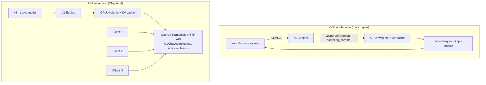

# vLLM Fundamentals

## Learning Objectives

By the end of this chapter, you will be able to:

- Explain in one paragraph what vLLM is and the problem it solves, without repeating the full architectural story (that starts in earnest at Chapter 6)
- Install vLLM correctly for a CUDA GPU, and know where to look when your hardware isn't NVIDIA/CUDA
- Explain what "V1 engine" means as an orientation fact — the thing you're running — without needing its internals yet
- Load and generate text from a real model using the offline `LLM` class, end to end, in a plain Python script
- Use `SamplingParams` correctly enough to avoid the single most common first-run mistake in vLLM (truncated 16-token outputs)
- Pick a GPU and scope a process to it with `CUDA_VISIBLE_DEVICES`
- Explain, at a conceptual level, why offline inference (`LLM`) and online serving (`vllm serve`, Chapter 4) are two faces of the same engine rather than two different products

## Prerequisites

This chapter builds directly on:

- **Chapter 1 (LLM Inference Fundamentals)** — you should already know the difference between prefill and decode, and why those two phases have very different performance characteristics. This chapter doesn't re-derive that; it just puts an engine in front of it.
- **Chapter 2 (GPU & CUDA Fundamentals)** — you should know what VRAM is, roughly what "compute capability" means, and why memory bandwidth (not just raw FLOPs) governs decode speed. This chapter assumes that vocabulary when it talks about `gpu_memory_utilization` and choosing a GPU.

You do not need any prior exposure to vLLM itself — that's what this chapter is for. If you've never run a line of vLLM code before, you're in the right place.

---

## 1. What vLLM Is, in One Paragraph

vLLM is an open-source **inference and serving engine** for large language models: you give it a model (usually a Hugging Face repo ID) and it handles loading the weights onto GPU(s), batching concurrent requests, managing the KV cache that grows as generation proceeds, and producing tokens as fast as the hardware allows — either as a Python library you call directly (this chapter) or as an OpenAI-compatible HTTP server (Chapter 4). It exists because naively running a model with plain `transformers` generation loops leaves enormous throughput on the table: memory gets fragmented, batches sit static instead of admitting new work as old work finishes, and GPU utilization craters under any real concurrent load. vLLM's foundational contribution — **PagedAttention** — solved the memory-fragmentation half of that problem; the rest of this course (starting Chapter 6) is about *why* that matters and *how* it works. For now, treat vLLM as the thing that turns "I have model weights and a prompt" into "I have generated tokens," efficiently, and let's actually run it.

You do not need to understand PagedAttention, continuous batching, or the scheduler to use vLLM productively today. That's deliberate. This course teaches the tool before the theory, the same way you learned to call `model.invoke()` in LangChain before you cared how the runnable graph was compiled underneath it.

---

## 2. Installing vLLM

### 2.1 Hardware and OS requirements

vLLM's primary, best-supported path is **NVIDIA GPUs on Linux**:

- **OS**: Linux (the primary target; other platforms are community-supported at best)
- **Python**: 3.10–3.13
- **GPU compute capability**: ≥ 7.5 — this covers everything from the Turing generation onward: T4, RTX 20-series and later, A100, L4, H100, and newer Blackwell-class cards (B200-class GPUs additionally need CUDA ≥ 12.8)

If you don't know your GPU's compute capability, `nvidia-smi` plus a quick lookup of the card model against NVIDIA's compute capability table will tell you. Chapter 2 covered why this number matters — it gates which CUDA kernel features (and therefore which vLLM attention backends) are even available on your card.

> **Beyond NVIDIA**: vLLM also supports AMD ROCm (≥ 6.3), Intel GPUs and CPUs, AWS Neuron (Inferentia/Trainium), and Intel Gaudi, largely through a `vllm.platforms` plugin abstraction that is increasingly moving hardware backends out-of-tree. Google TPU support, for example, now lives in a separate repository (`vllm-project/tpu-inference`) rather than the core vLLM repo. This course teaches the NVIDIA/CUDA path as the primary case throughout — if you're on different hardware, the concepts (KV cache, batching, scheduling) still transfer, but installation and some flags will differ. Check `docs.vllm.ai` for your specific backend.

### 2.2 Installing with `uv` (recommended)

The vLLM project's own current install guidance leads with [`uv`](https://docs.astral.sh/uv/), a fast Python package/environment manager:

```bash
uv pip install vllm --torch-backend=auto
```

`--torch-backend=auto` tells the installer to detect your installed CUDA version and pull a matching PyTorch build automatically, instead of you having to figure out which PyTorch/CUDA wheel combination is correct by hand.

### 2.3 Installing with plain `pip`

If you're not using `uv`, the equivalent with `pip` pins an explicit PyTorch wheel index for your CUDA version:

```bash
pip install vllm --extra-index-url https://download.pytorch.org/whl/cu129
```

(`cu129` here means CUDA 12.9 — swap for whatever wheel index matches your installed CUDA toolkit; check `docs.vllm.ai`'s installation page for the currently recommended index, since supported CUDA versions shift release to release.)

### 2.4 Nightly builds

If you need a fix or feature that hasn't shipped in a stable release yet:

```bash
uv pip install -U vllm --torch-backend=auto --extra-index-url https://wheels.vllm.ai/nightly
```

Nightlies move fast and can break; don't run them in production without a very good reason.

### 2.5 Verifying the install

Once installed, a quick sanity check that doesn't require downloading a model:

```bash
python -c "import vllm; print(vllm.__version__)"
```

vLLM ships a new **minor** release roughly every two weeks (recent examples in mid-2026: `v0.26.0`, `v0.25.1`, `v0.25.0`), so whatever version prints here is a snapshot in time, not a fact worth memorizing. When something in this course or in a blog post references a specific flag, cross-check it against `vllm serve --help` or `docs.vllm.ai` for the version you actually have installed — that habit will save you more debugging time over your career than any individual flag this course teaches you.

> **Verify against current docs**: exact CUDA wheel index names (`cu129` and similar) and the nightly index URL are the kind of detail that shifts as PyTorch and CUDA both rev independently of vLLM. Treat the commands above as correct at the time this course was written and re-check `docs.vllm.ai/en/latest/getting_started/installation/gpu.html` before running them verbatim months from now.

---

## 3. Orientation: You're Running the V1 Engine

If you read older vLLM blog posts, Stack Overflow answers, or tutorials, you may run into references to a `VLLM_USE_V1=0` environment variable, or to a "V0 engine" as something distinct from "V1." Here's the orientation you need right now, in full, so you can stop worrying about it:

vLLM went through one major internal rewrite. The original engine (retroactively called **V0**) was replaced by a rearchitected core — the **scheduler, KV cache manager, worker process model, sampler, and API server were all rebuilt** — called **V1**. That rewrite is complete. **V0 is fully deprecated and no longer exists in current vLLM.** There is no toggle to go back to it, and `VLLM_USE_V1=0` is a historical artifact from the transition period, not something you need to set or even know about going forward.

Practically, for this chapter, "V1" means:

- Every `LLM(...)` call you make in this chapter is running on the V1 engine — there is no other engine to opt into or out of.
- V1 was explicitly designed around a "zero configs" philosophy: optimizations like prefix caching and chunked prefill are **on by default**, not something you have to discover and enable. You'll meet both properly in Chapters 8, 9, and 11, but it's worth knowing now that vLLM's defaults are already trying to be fast, out of the box, without you tuning anything.

That's the entire orientation this chapter needs to give you. The *why* behind V1's redesign — the scheduler, the KV cache manager, the unified handling of prefill and decode tokens — is genuinely interesting and is exactly what Chapters 6 through 9 are for. Right now, just know: there's one engine, you're using it, and it's trying to be fast by default.

---

## 4. Supported Models — Check the Docs, Don't Memorize a List

A natural question at this point is "which models can I actually load?" The honest answer is a moving target, and this course deliberately does not hardcode a supported-models table, for two reasons: vLLM adds new model architectures essentially every release, and it has also *dropped* support for a handful of very old architectures over time. Any static list in a written course would be stale within weeks.

What's stable is the **mental model** for how vLLM decides whether it can load something:

1. **Native vLLM model implementations.** vLLM reimplements and optimizes the most popular model architectures itself (think: the various Llama, Qwen, Mistral, DeepSeek, Gemma families, and many more) with custom, performance-tuned code paths. Most of the time, if a model's architecture is popular and reasonably recent, vLLM has a native implementation of it, and you can load its Hugging Face repo ID directly with no extra configuration.
2. **Broad Hugging Face repo ID compatibility.** In practice, this means you can hand `LLM(model="some-org/some-model")` almost any Hugging Face causal-LM-style repo ID and it will "just work," in the same spirit as `AutoModelForCausalLM.from_pretrained(...)` — vLLM resolves the config, picks a matching architecture implementation, and loads the weights.
3. **A generic Transformers-backend fallback.** For architectures that don't (yet) have a native, hand-optimized vLLM implementation, vLLM also has a generic fallback path that runs the model through the underlying `transformers` library's own implementation, inside vLLM's serving loop. This trades some performance for much broader coverage — it means "vLLM doesn't support this model" is a much rarer sentence than it used to be, even for niche or brand-new architectures.

The practical habit to build: **before you assume a model works (or doesn't), check `docs.vllm.ai/en/latest/models/supported_models.html`** for the current, generated-from-source list, rather than trusting your memory or a blog post. This applies doubly to anything you read in this course — model support is one of the fastest-moving surfaces in the entire project.

For the worked examples in this chapter, we'll use `facebook/opt-125m` — a small, old, thoroughly-supported model that downloads in seconds and runs on essentially any GPU (or even CPU, slowly), specifically so the mechanics of the `LLM` class are the only thing you're learning right now, not whether a large model fits in your VRAM.

---

## 5. Offline Inference: The `LLM` Class

### 5.1 Why "offline" inference exists as a concept

Before writing any code, it's worth being explicit about a distinction that will matter for the rest of the course: vLLM gives you **two ways to use the same engine**.

- **Offline inference** (this chapter): you import `vllm` into your own Python process, construct an `LLM` object, and call `.generate(...)` directly. There's no HTTP server, no network hop, no concurrent client management — it's a batch job. You give it a list of prompts, it gives you back a list of results, and the process exits.
- **Online serving** (Chapter 4): you run `vllm serve <model>` as a long-lived process that exposes an OpenAI-compatible HTTP API, and clients (your agent code, `curl`, LangChain's `ChatOpenAI`-compatible clients, etc.) send it requests over the network, potentially many of them concurrently, indefinitely.

Both modes run on the exact same V1 engine underneath — same scheduler, same KV cache manager, same PagedAttention-based memory management. The difference is purely the "front door": a Python function call versus an HTTP endpoint. This chapter deliberately starts with offline inference because it's the fastest path to "I generated text with vLLM" with zero networking, authentication, or concurrency concerns to think about. Once the `LLM`/`SamplingParams` mechanics are second nature, Chapter 4 layers a server on top of the identical concepts.

### 5.2 The `LLM` class constructor

`vllm.entrypoints.llm.LLM` is re-exported at the top level of the package, so in practice you always write:

```python
from vllm import LLM, SamplingParams
```

The constructor arguments you need for almost every real use case:

```python
from vllm import LLM

llm = LLM(
    model="facebook/opt-125m",   # a Hugging Face repo ID, or a local path to weights
    tensor_parallel_size=1,      # default 1 — how many GPUs to shard each layer across (Chapter 15)
    dtype="auto",                # default "auto" — vLLM picks a sensible compute dtype for the model
    quantization=None,           # default None — set to "awq"/"gptq"/"fp8"/etc. for quantized weights (Chapter 13)
    gpu_memory_utilization=0.9,  # default 0.9 — fraction of GPU memory reserved for weights + KV cache
)
```

A quick note on each, at the depth you need right now (each gets a full chapter later):

- **`model`** — almost always a Hugging Face repo ID (`"facebook/opt-125m"`, `"meta-llama/Llama-3.2-1B-Instruct"`, etc.) or a local filesystem path to a directory in the same layout. This is the only argument you strictly must supply.
- **`tensor_parallel_size`** — how many GPUs to split a single model's layers across. Defaults to `1` (single GPU, no sharding). Chapter 15 is entirely about this and its siblings (`pipeline_parallel_size`, `data_parallel_size`). For this chapter, leave it at `1`.
- **`dtype`** — the numeric precision vLLM computes in. `"auto"` inspects the model's own config and picks accordingly (usually `bfloat16` or `float16` for modern checkpoints). You'll revisit this alongside quantization in Chapter 13.
- **`quantization`** — `None` by default, meaning "use the weights as they are." Set this to a method name (`"awq"`, `"gptq"`, `"fp8"`, `"bitsandbytes"`, etc.) when loading pre-quantized checkpoints. Full treatment in Chapter 13 — ignore it for now.
- **`gpu_memory_utilization`** — the fraction (0 to 1) of total GPU memory vLLM is allowed to claim for weights, activations, and — critically — the KV cache pool it pre-allocates at startup. Default `0.9` (use 90% of the GPU's memory). This single number is one of the first things you'll tune once you hit real memory pressure (Chapter 10), but the default is a sane starting point for a GPU that isn't also running anything else.

### 5.3 A full worked example

Here's a complete, runnable script: load a small model, generate text for a batch of prompts, and print the results.

```python
"""
chapter03_offline_inference.py

Minimal offline inference example using vLLM's LLM class.
Run with: python chapter03_offline_inference.py
Requires an NVIDIA GPU (compute capability >= 7.5) with vLLM installed.
"""

from vllm import LLM, SamplingParams

# 1. Define the prompts you want completions for. Offline inference is
#    naturally batch-oriented: hand vLLM a list, get a list back.
prompts = [
    "The capital of France is",
    "In machine learning, a tensor is",
    "def fibonacci(n):",
]

# 2. Configure how generation should behave. See section 6 below for why
#    max_tokens is set explicitly here rather than left at its default.
sampling_params = SamplingParams(
    temperature=0.7,
    max_tokens=64,
)

# 3. Construct the engine. This downloads the model (first run only, cached
#    afterward under ~/.cache/huggingface) and loads it onto the GPU.
llm = LLM(
    model="facebook/opt-125m",
    tensor_parallel_size=1,
    dtype="auto",
    quantization=None,
    gpu_memory_utilization=0.9,
)

# 4. Generate. vLLM batches these three prompts together internally and
#    schedules them through the same continuous-batching machinery it would
#    use for three concurrent HTTP requests in Chapter 4 — offline inference
#    is not a "simpler" code path, just a different entry point into it.
outputs = llm.generate(prompts, sampling_params)

# 5. Each output preserves the prompt it corresponds to, plus one or more
#    completions (SamplingParams.n controls how many; default 1).
for output in outputs:
    prompt = output.prompt
    generated_text = output.outputs[0].text
    print(f"Prompt:    {prompt!r}")
    print(f"Generated: {generated_text!r}")
    print("-" * 60)
```

Running this produces one loading/compilation phase (the first call to `LLM(...)` — vLLM allocates KV cache blocks, may capture CUDA graphs, etc.) followed by generation that, for a batch this small, typically finishes in well under a second on any modern GPU.

A few things worth noticing about this code, since they'll matter for everything that follows:

- **You never manually manage batching.** You handed vLLM three unrelated prompts of different lengths as a plain Python list; vLLM's scheduler decided how to pack them into steps internally. You'll learn exactly how in Chapter 8 (Continuous Batching) — for now, notice that you didn't have to think about it at all.
- **`llm.generate()` is synchronous and blocking** in this offline form — it returns only once all prompts in the batch are fully generated. That's a deliberate simplicity trade-off for the offline/batch use case; the online server (Chapter 4) supports streaming and per-request concurrency instead.
- **The order of `outputs` matches the order of `prompts`** — vLLM guarantees this even though prompts of different lengths may finish generating at different scheduler steps internally.

---

## 6. `SamplingParams` — Just Enough to Run Your First Example

`SamplingParams` controls *how* tokens get chosen at each decode step — a full treatment (top-p, top-k, penalties, structured outputs, logprobs) is Chapter 5's entire job. For this chapter, you need exactly two fields and one critical gotcha.

```python
from vllm import SamplingParams

sampling_params = SamplingParams(
    temperature=0.7,   # default 1.0 — higher = more random, lower = more deterministic
    max_tokens=64,      # default 16 (!) — see below
)
```

- **`temperature`** (default `1.0`) — scales the logits before sampling. Lower values make the model's choices more concentrated on high-probability tokens (more deterministic, more repetitive at the extreme of `0.0`); higher values flatten the distribution (more diverse, more prone to incoherence at extremes). `0.7` is a common, unremarkable starting point for exploratory generation. You don't need to reason more deeply about this yet — Chapter 5 covers the sampling math and how `temperature` interacts with `top_p`/`top_k`.

- **`max_tokens`** (default **16**) — the maximum number of tokens to generate, on top of the prompt. This is the single most important fact in this entire section:

> **⚠️ The `max_tokens` default is 16 tokens.** If you construct `SamplingParams()` with no arguments, or forget to pass `max_tokens`, every generation you run will be silently truncated after 16 tokens — no error, no warning, just a suspiciously short, often mid-sentence output. This trips up nearly everyone the first time they use vLLM, because 16 tokens is enough to look *plausible* (a complete-looking short phrase) without being what you actually wanted. Always set `max_tokens` explicitly to a value that makes sense for your task — a short classification answer might genuinely only need a handful of tokens, but a paragraph of prose or a code completion needs `256`, `512`, or more.

Everything else `SamplingParams` exposes — `top_p`, `top_k`, `min_p`, `presence_penalty`, `frequency_penalty`, `repetition_penalty`, `n` (multiple completions per prompt), `stop`/`stop_token_ids`, `seed`, `logprobs`, and the structured-outputs-related `structured_outputs` field — is covered properly in Chapter 5. One historical note worth flagging now so an old tutorial doesn't confuse you later:

> **Note:** Older vLLM tutorials and blog posts sometimes reference a `best_of` parameter (V0-era best-of-N sampling). It has been removed from current `SamplingParams` entirely — if you see it in a code sample, that sample predates the current API and will raise a `TypeError` if you try to pass it.

---

## 7. GPU Configuration Basics

For this chapter — single-GPU offline inference — GPU configuration is mostly about *which* GPU vLLM uses, not yet about splitting a model across several (that's Chapter 15's `tensor_parallel_size` > 1 territory).

### 7.1 Checking what's available

Before running anything, confirm what vLLM can see:

```bash
nvidia-smi
```

This lists every GPU visible to the process, its memory, and current utilization. If you have multiple GPUs and other workloads (a Jupyter kernel, another training job, a colleague's process) already using one of them, you want to know that *before* vLLM tries to claim 90% of a GPU's memory that's already half-occupied.

### 7.2 Pinning a process to a specific GPU

The standard mechanism — not vLLM-specific, but essential to know — is the `CUDA_VISIBLE_DEVICES` environment variable, which scopes which physical GPU(s) a process can see at all:

```bash
# Only GPU 0 is visible to this process
CUDA_VISIBLE_DEVICES=0 python chapter03_offline_inference.py

# Only GPU 2 is visible (vLLM will still call it "cuda:0" internally,
# since it's the only device in its visible set)
CUDA_VISIBLE_DEVICES=2 python chapter03_offline_inference.py
```

This matters in two common situations:

- **A shared, multi-GPU machine** — you want to make sure your experiment doesn't accidentally claim a GPU a colleague (or another one of your own processes) is actively using.
- **Debugging which GPU actually got used** — if `LLM(...)` mysteriously fails with an out-of-memory error, checking `CUDA_VISIBLE_DEVICES` (and `nvidia-smi` at the same moment) is usually the first diagnostic step, before touching `gpu_memory_utilization`.

### 7.3 Single-GPU is the default; multi-GPU is Chapter 15

Everything in this chapter runs with `tensor_parallel_size=1` — one GPU, no sharding. That's the right default for any model that comfortably fits in one GPU's VRAM (Chapter 2's VRAM math tells you how to estimate that). The moment a model's weights plus KV cache no longer fit on a single card, you need `tensor_parallel_size > 1` (splitting layers across GPUs on one node) or `pipeline_parallel_size > 1` (splitting layer *ranges* across nodes) — both of which are Chapter 15's subject in full, including the distributed-executor-backend choice (Ray vs. plain multiprocessing) that multi-GPU/multi-node setups need. Don't reach for either yet; get comfortable with single-GPU offline inference first.

---

## 8. From Offline Inference to Online Serving

Everything above ran inside your own Python process: you imported `vllm`, built an `LLM`, called `.generate()`, and the process exited when it was done. That's perfect for batch jobs — scoring a dataset, running an evaluation suite, generating synthetic data — but it's the wrong shape for the far more common production case: **a long-running service that many different clients call over the network, indefinitely, often concurrently.**

That's what `vllm serve` gives you, and it's the entire subject of Chapter 4. The important conceptual point to take away right now, before you get there, is this:



Both boxes wrap the **same V1 engine** — same scheduler, same KV cache manager, same PagedAttention-based batching underneath. `vllm serve <model>` is, at a conceptual level, "construct an `LLM`-equivalent engine once, then keep it alive behind an HTTP server so many independent clients can send it requests concurrently instead of one Python process calling `.generate()` in a loop." Chapter 4 covers the actual `vllm serve` CLI, the OpenAI-compatible endpoints (`/v1/chat/completions`, `/v1/completions`, `/v1/embeddings`, `/v1/models`), authentication via `--api-key`, and how this plugs directly into the agent stack you already know from LangChain/LangGraph/MCP/DeepAgents — none of that is duplicated here. The one thing worth internalizing now: **you are not learning a second, different tool in Chapter 4.** You're learning a second front door onto the exact engine you just used.

---

## 9. Real-World Scenario

**Situation**: You're prototyping a document-summarization feature for an internal tool. Before wiring up a full server, an authentication layer, and a client library, you want to answer one narrow question: *does this open-weight model produce summaries good enough to justify self-hosting it, versus just calling a hosted API?*

This is exactly the use case offline inference is for. You don't need a running service, concurrent client handling, or auth — you need to feed a batch of real documents from your dataset through a candidate model and eyeball (or automatically score) the outputs, once, as a script.

```python
from vllm import LLM, SamplingParams

documents = [
    "<document 1 text...>",
    "<document 2 text...>",
    # ... dozens or hundreds more, pulled from your actual dataset
]

prompts = [f"Summarize the following document in 2-3 sentences:\n\n{doc}" for doc in documents]

sampling_params = SamplingParams(
    temperature=0.3,     # lower temperature: summarization wants consistency, not creativity
    max_tokens=150,      # explicit — don't rely on the 16-token default
)

llm = LLM(
    model="meta-llama/Llama-3.2-1B-Instruct",   # illustrative — pick per your VRAM budget
    gpu_memory_utilization=0.9,
)

outputs = llm.generate(prompts, sampling_params)

for doc, output in zip(documents, outputs):
    print(output.outputs[0].text)
```

Run this once against a held-out set of real documents, review the summaries (or score them against reference summaries with whatever metric your team uses), and you have a data-backed answer to "is this model good enough" *before* investing in server infrastructure, load testing, or a deployment pipeline. This offline-inference-as-evaluation pattern — batch a representative sample through candidate models and compare — is one of the most common real production uses of the `LLM` class, distinct from (and usually prior to) standing up `vllm serve` for the model that wins.

---

## 10. Best Practices

- **Always set `max_tokens` explicitly.** Never rely on the default of 16 for anything beyond a quick smoke test. Make it a habit to write `SamplingParams(temperature=..., max_tokens=...)` as a pair, every time.
- **Start with a small model to validate mechanics, then swap in your real target model.** `facebook/opt-125m` or a similarly tiny model lets you confirm your script, environment, and GPU setup all work in seconds, before you spend minutes downloading and loading a multi-billion-parameter checkpoint.
- **Batch your prompts instead of looping `.generate()` calls one at a time.** Passing a list of prompts to a single `.generate()` call lets vLLM's scheduler batch them together; calling `.generate()` in a Python loop for each prompt individually forfeits the batching benefit and is meaningfully slower.
- **Check `docs.vllm.ai/en/latest/models/supported_models.html` before assuming a model architecture works (or doesn't).** Don't trust a memorized list — yours or this course's — model support changes every release.
- **Pin GPU visibility explicitly (`CUDA_VISIBLE_DEVICES`) on shared machines.** Don't assume vLLM will pick an idle GPU for you; nothing guarantees that.
- **Treat any specific flag, default, or version number you read (including in this course) as "verify against `vllm serve --help` / `docs.vllm.ai` for your installed version" rather than gospel.** vLLM's two-week release cadence means defaults and flag names can and do shift.
- **Cache awareness**: the first `LLM(model=...)` call for a given model downloads weights to the Hugging Face cache (`~/.cache/huggingface` by default) — subsequent runs reuse the cache and load much faster. If you're scripting repeated experiments in CI or ephemeral containers, consider pre-warming or mounting that cache directory rather than re-downloading every run.

---

## 11. Common Mistakes

1. **Forgetting to set `max_tokens`, getting truncated 16-token outputs, and assuming the model is broken.** This is by far the most common first-hour vLLM mistake. The output looks plausible — a short phrase, not an error — so it's easy to conclude the model itself is bad rather than that generation stopped after 16 tokens. Always set `max_tokens` explicitly.
2. **Passing `best_of` to `SamplingParams` because an older tutorial used it.** `best_of` was a V0-era field for best-of-N sampling and has been removed entirely from current `SamplingParams`. Passing it raises a `TypeError`. If you see it in a code sample, that sample is stale.
3. **Setting `CUDA_VISIBLE_DEVICES=0` unconditionally in scripts on a shared machine**, assuming GPU 0 is always free. On a shared box, check `nvidia-smi` first — GPU 0 is not guaranteed to be idle just because it's the first index.
4. **Looping `.generate()` per-prompt instead of batching a list.** This works, but throws away one of the main reasons to use vLLM in the first place — its ability to batch concurrent work efficiently. Collect prompts into a list and call `.generate()` once.
5. **Chasing `VLLM_USE_V1=0` from an old blog post because something behaves differently than the post describes.** V0 no longer exists. If current behavior doesn't match an older post, the post is describing a deprecated engine generation, not a toggle you should try to flip back on.
6. **Assuming a model "isn't supported" from stale memory instead of checking the live docs.** vLLM adds native model support constantly and has a generic Transformers-backend fallback for architectures without one — many models that "didn't work last year" work fine today, and vice versa for very old architectures that have since been dropped.
7. **Over-provisioning `gpu_memory_utilization` blindly (e.g., cranking it to `0.99`) to "get more KV cache," on a GPU that's also running something else (a display server, another process, a Jupyter kernel).** This is a fast route to an OOM crash rather than a performance win. Chapter 10 covers memory tuning properly; for now, the default `0.9` is a sensible starting point on a GPU dedicated to this workload.

---

## 12. Summary

- vLLM is an inference/serving engine: give it a model, it handles loading, batching, KV cache, and token generation, either as a Python library (`LLM` class) or an HTTP server (`vllm serve`, Chapter 4).
- Install with `uv pip install vllm --torch-backend=auto` (or the `pip` + `--extra-index-url` equivalent) on Linux, Python 3.10–3.13, NVIDIA GPU with compute capability ≥ 7.5.
- **V1 is the only engine** — there is no V0 to opt into; `VLLM_USE_V1=0` is a historical artifact, not something you need.
- Don't memorize a "supported models" list — most Hugging Face causal-LM repo IDs load directly, with a generic Transformers-backend fallback for the rest; check `docs.vllm.ai` for the current picture.
- The `LLM` class constructor's core knobs for this stage: `model`, `tensor_parallel_size` (leave at `1` for now), `dtype="auto"`, `quantization=None`, `gpu_memory_utilization=0.9`.
- `SamplingParams(temperature=..., max_tokens=...)` — and **always set `max_tokens` explicitly**, since its default is 16 and will silently truncate your output otherwise.
- Use `CUDA_VISIBLE_DEVICES` to control which physical GPU a process uses; stick to single-GPU (`tensor_parallel_size=1`) until Chapter 15 covers scaling across GPUs.
- Offline inference (`LLM`) and online serving (`vllm serve`, Chapter 4) are two front doors onto the same V1 engine — not two different tools to learn separately.

---

## 13. Knowledge Check

1. What is the default value of `max_tokens` in `SamplingParams`, and what's the practical consequence of not setting it explicitly?
2. Name the two required-to-know constructor arguments of `LLM` that control (a) how many GPUs a single model's layers are sharded across, and (b) what fraction of GPU memory the engine is allowed to use.
3. Why does this course say "there is no V0 engine anymore" rather than "V1 is usually faster than V0"? What's wrong with the second framing?
4. A colleague pastes a code sample using `SamplingParams(best_of=4, ...)`. What will happen if you run it against a current vLLM install, and why?
5. Conceptually, what is the *actual* difference between calling `llm.generate(prompts, sampling_params)` from a Python script and running `vllm serve <model>`, given that both use the same engine underneath?
6. You're on a shared GPU box and your `LLM(...)` call fails with an out-of-memory error immediately on startup. Name two things you'd check before touching `gpu_memory_utilization`.

<details>
<summary>Answers</summary>

1. Default is **16**. Without setting it explicitly, generations are silently truncated after 16 tokens — no error is raised, the output just looks like a short, plausible-but-truncated phrase.
2. `tensor_parallel_size` (GPU sharding count, default `1`) and `gpu_memory_utilization` (fraction of GPU memory reserved for weights + KV cache, default `0.9`).
3. Because V0 isn't merely "slower" — it has been **fully removed** from the codebase. Framing it as a performance comparison implies V0 is still an available option you could choose for some reason; it isn't. There's exactly one engine to reason about now.
4. It will raise a `TypeError`, because `best_of` does not exist as a field on current `SamplingParams` — it was a V0-era parameter that has been removed entirely.
5. Both run the identical V1 engine (same scheduler, KV cache manager, batching). The difference is purely the "front door": `.generate()` is an in-process, synchronous, one-shot batch call inside your own Python process; `vllm serve` keeps the engine alive as a long-running process behind an OpenAI-compatible HTTP API that many independent clients can call concurrently, indefinitely.
6. Run `nvidia-smi` to see whether the GPU is already partially occupied by another process, and check `CUDA_VISIBLE_DEVICES` to confirm which physical GPU your process is actually targeting — both are more likely culprits at first launch than the `gpu_memory_utilization` fraction itself.

</details>

---

## 14. Hands-On Exercise

**Goal**: get a real generation out of vLLM end to end, and deliberately trigger — then fix — the `max_tokens` gotcha, so it's memorable rather than theoretical.

**Requirements**: access to a machine with an NVIDIA GPU (compute capability ≥ 7.5) and vLLM installed per Section 2. If you don't have GPU access yet, read through the steps and code anyway — you'll run this the moment you do; the mental model matters more right now than the execution.

1. Install vLLM:
   ```bash
   uv pip install vllm --torch-backend=auto
   ```
2. Confirm your GPU is visible:
   ```bash
   nvidia-smi
   ```
3. Create a script (`opt125m_test.py`) with the following, **deliberately omitting `max_tokens`** the first time:
   ```python
   from vllm import LLM, SamplingParams

   llm = LLM(model="facebook/opt-125m")
   sampling_params = SamplingParams(temperature=0.7)  # no max_tokens — watch what happens
   outputs = llm.generate(["Explain what a KV cache is in one paragraph:"], sampling_params)
   print(outputs[0].outputs[0].text)
   ```
4. Run it and observe: the output stops abruptly, mid-sentence, after a very short span of text. Count the tokens (roughly, by eyeballing word count) — it should be in the neighborhood of 16.
5. Now fix it: add `max_tokens=200` to the `SamplingParams` call, rerun, and confirm you get a complete, much longer response.
6. Extend the script to pass a **list** of 3 different prompts in a single `llm.generate()` call, and print all three outputs — confirm the ordering of results matches the ordering of your input prompts.
7. **Bonus**: wrap steps 3–6 with `CUDA_VISIBLE_DEVICES` set to a specific GPU index (if you have more than one), and confirm via `nvidia-smi` (in a second terminal, while the script runs) that only that GPU shows increased memory usage.

**Success criteria**: you've seen the `max_tokens=16` truncation happen with your own eyes (not just read about it), fixed it, and generated correct, ordered completions for a batch of prompts from a single `.generate()` call.

---

## 15. Further Reading

- vLLM installation guide (GPU/CUDA path): `https://docs.vllm.ai/en/latest/getting_started/installation/gpu.html`
- vLLM quickstart (offline inference and `vllm serve` both introduced): `https://docs.vllm.ai/en/latest/getting_started/quickstart.html`
- Supported models (always check the live version, not a memorized list): `https://docs.vllm.ai/en/latest/models/supported_models.html`
- `SamplingParams` source of truth: `https://github.com/vllm-project/vllm/blob/main/vllm/sampling_params.py`
- `LLM` class entrypoint source: `https://github.com/vllm-project/vllm/blob/main/vllm/entrypoints/llm.py`
- vLLM release notes (check cadence and current version before trusting any specific flag/default): `https://github.com/vllm-project/vllm/releases`
- V1 engine usage guide: `https://docs.vllm.ai/en/latest/usage/v1_guide.html` (or search current docs nav for "V1" if this path has moved)
- Original PagedAttention paper (full treatment starts Chapter 7): Kwon, Woosuk, et al. "Efficient Memory Management for Large Language Model Serving with PagedAttention." *Proceedings of the 29th ACM Symposium on Operating Systems Principles* (SOSP 2023).

<div style="display:flex;justify-content:space-between;align-items:center;">
  <a href="./02-gpu-and-cuda-fundamentals.md">← Previous: GPU & CUDA Fundamentals</a>
  <a href="./00-index.md">🏠 Index</a>
  <a href="./04-openai-compatible-server.md">Next: The OpenAI-Compatible Server →</a>
</div>
