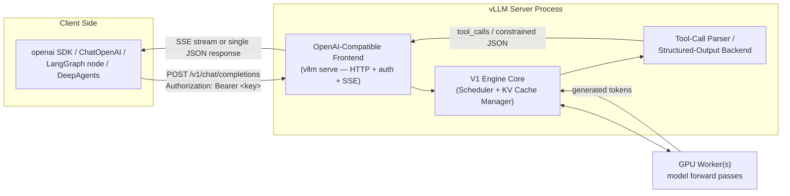

# The OpenAI-Compatible Server

## Learning Objectives

By the end of this chapter, you will be able to:

- Launch vLLM's production-facing server with `vllm serve <model> [flags]` and explain why this CLI entry point,
  not the internal module invocation, is the one to teach, script, and put in a Dockerfile
- Enumerate the server's confirmed HTTP surface — `/v1/chat/completions`, `/v1/completions`, `/v1/embeddings`,
  `/v1/models`, `/health`, `/metrics` — and state precisely which routes `--api-key` gates and which it doesn't
- Explain what `--served-model-name` does, why you'd give a model multiple aliases, and which one shows up in
  responses and Prometheus labels
- Turn on tool/function calling correctly with `--enable-auto-tool-choice` plus a `--tool-call-parser`, matching
  the parser to the model family and its chat template instead of guessing
- Write a structured-output request using the **current** `structured_outputs` request field and
  `--structured-outputs-config.backend` server flag — and recognize the **old** `guided_json`/`guided_regex`
  fields on sight as removed-in-v0.12.0 syntax from stale tutorials
- Describe, at a high level, what the experimental Rust frontend (`VLLM_USE_RUST_FRONTEND=1`) changes and why it
  isn't the default yet
- Point a LangChain `ChatOpenAI` client, a LangGraph node, and a DeepAgents `create_deep_agent()` call at a vLLM
  server as if it were `api.openai.com`, and explain exactly what does and doesn't change when you do
- Launch a real server locally, hit it with `curl` and the `openai` Python SDK, both streaming and non-streaming,
  and send one structured-output request end to end

---

## Prerequisites for This Chapter

This chapter builds directly on **Chapter 3 (vLLM Fundamentals)**, where you installed vLLM, ran the offline
`LLM` class, and got your first taste of `vllm serve`. Specifically, this chapter assumes you already know:

- How to install vLLM and confirm a GPU is visible to it (Ch. 3)
- The difference between the offline `LLM` class (a Python object you call `.generate()` on directly, in-process)
  and the server (a long-running HTTP process other programs talk to) — Chapter 3 covered the former in depth;
  this chapter is entirely about the latter
- Basic `SamplingParams` concepts (`temperature`, `max_tokens`, etc.) — Chapter 5 goes deep on these; this
  chapter uses them only incidentally, as ordinary OpenAI request fields

This chapter does **not** re-teach what a tool call is, what an agent loop does, what LangGraph nodes or
DeepAgents subagents are, or how the OpenAI Chat Completions API is shaped in general — all of that is assumed
background from this repo's `langchain-core-course`, `langgraph-course`, `mcp-course`, and `deepagents-course`.
What's new here is **vLLM's specific implementation** of that already-familiar surface: which endpoints it
exposes, which flags turn on which features, and where it's a byte-for-byte drop-in versus where it has its own
opinions.

> **Scope note:** this chapter introduces tool calling and structured outputs at the level needed to *use* the
> server correctly. Chapter 16 (Structured Outputs & Tool Calling) goes much deeper on the guided-decoding
> backends themselves (how xgrammar/guidance/outlines actually constrain token generation) and on parser
> internals. Treat this chapter as "how do I turn these features on and wire them into my agent stack," and
> Chapter 16 as "how do they work under the hood."

---

## 1. Why an OpenAI-Compatible Server, Not a Bespoke API

Every serving engine has to expose *some* HTTP API. vLLM's designers made a deliberate choice: instead of
inventing a new request/response shape, the server speaks the same wire format as OpenAI's own
`/v1/chat/completions`, `/v1/completions`, and `/v1/embeddings` endpoints. This is not a cosmetic detail — it's
the single biggest reason vLLM slots into an existing agent stack with near-zero code change.

Think about what "your agent stack" actually consists of, per this course's prerequisites: LangChain's
`ChatOpenAI`, LangGraph nodes that call a chat model, DeepAgents' `create_deep_agent(model=...)`, the raw
`openai` Python SDK, curl scripts, load testers, observability tooling that already knows how to parse an OpenAI
chat completion — all of it was written against *the shape of the API*, not against "OpenAI the company."
Because vLLM reproduces that shape faithfully, every one of those clients works against a self-hosted vLLM
server by changing exactly two things: the `base_url` and the API key. Section 11 makes this concrete for each
piece of your stack. Everything before that section is about the server itself: how to launch it, what it
exposes, and how to turn on its more advanced features correctly.

---

## 2. Launching the Server

The canonical, documented entry point is the `vllm serve` CLI subcommand:

```bash
vllm serve NousResearch/Meta-Llama-3-8B-Instruct --dtype auto --api-key token-abc123
```

`<model>` is anything the offline `LLM` class from Chapter 3 accepts — a Hugging Face repo ID or a local path.
Flags after it configure the engine and the server together; you'll meet the ones relevant to this chapter
(`--api-key`, `--served-model-name`, `--enable-auto-tool-choice`, `--tool-call-parser`,
`--structured-outputs-config.backend`) below, and the rest of the course covers memory, parallelism,
quantization, and speculative-decoding flags in their own chapters.

> **Note — the module form exists, don't teach it as primary.** You may see
> `python -m vllm.entrypoints.openai.api_server ...` in older blog posts or in vLLM's own internals. It still
> exists, but it's an internal implementation detail, not the documented CLI surface. `vllm serve` is what the
> docs, the Docker image's default entrypoint, and this course teach. If you ever see the module form in a
> tutorial, treat it as equivalent-but-legacy, not as something to copy into new scripts or Dockerfiles.

Once the process finishes loading weights and warming up, it logs that it's listening (default port `8000`,
overridable with `--port`) and is ready to serve requests. Everything from here is ordinary HTTP.

---

## 3. Confirmed Endpoints

The server exposes a small, stable set of routes:

| Endpoint | Purpose | Gated by `--api-key`? |
|---|---|---|
| `POST /v1/chat/completions` | Chat-style completions — the endpoint essentially every agent framework calls | Yes |
| `POST /v1/completions` | Legacy-style raw text completions (single prompt string in, text out, no chat roles) | Yes |
| `POST /v1/embeddings` | Embedding vectors for embedding-capable models | Yes |
| `GET /v1/models` | Lists the model(s) the server is currently serving (see `--served-model-name`, Section 5) | Yes |
| `GET /health` | Unauthenticated liveness check — "is the process up and able to answer" | **No** |
| `GET /metrics` | Prometheus-format metrics, all metric names prefixed `vllm:` | **No** |

The split matters operationally: `/health` and `/metrics` are deliberately **not** gated by `--api-key`, because
your Kubernetes liveness/readiness probes and your Prometheus scraper are typically infrastructure-internal
callers that shouldn't need to carry an application-level secret just to check "is this pod alive" or "what's
the current queue depth." Every route under `/v1/*` — the actual model-serving surface — **is** gated. Chapter 20
(Production Serving) goes deeper on wiring `/health` into orchestration and `/metrics` into a Prometheus/Grafana
stack; for this chapter, the important fact is simply which routes require a key and which don't, so you don't
accidentally either (a) expose an unauthenticated inference endpoint to the internet, or (b) break your liveness
probe by pointing it at a route that expects a bearer token it doesn't send.

---

## 4. Authentication — `--api-key`

```bash
vllm serve <model> --api-key token-abc123
```

With this flag set, every request to a gated route (Section 3's table) must carry:

```
Authorization: Bearer token-abc123
```

Omit the header (or send the wrong key) and you get an HTTP 401. Omit `--api-key` entirely at launch time and
the server runs with **no authentication at all** on `/v1/*` — fine for a laptop experiment on `localhost`,
never fine for anything reachable from a network you don't fully control. This single flag is also exactly what
makes vLLM plug into the `openai` SDK and `ChatOpenAI` unmodified: both already know how to send an
`Authorization: Bearer <key>` header, because that's what talking to OpenAI's own API requires. Section 11 uses
this directly.

---

## 5. Streaming

`/v1/chat/completions` and `/v1/completions` both support `stream=true`, using standard OpenAI Server-Sent
Events (SSE) semantics — the same wire format the `openai` SDK, LangChain, and LangGraph already know how to
consume. This is long-standing, stable behavior, not a vLLM-specific extension: each SSE event carries a
JSON chunk with an incremental `delta`, and the stream ends with a literal `data: [DONE]` line. Because the
framing is identical to OpenAI's own, nothing about your existing streaming-consumption code — a LangGraph
node's `.astream()`, a FastAPI endpoint proxying chunks to a browser, the `openai` SDK's streaming iterator —
needs to change when the `base_url` points at vLLM instead of OpenAI. The worked example in Section 12 shows
both the streaming and non-streaming request side by side.

---

## 6. `--served-model-name`: Aliasing

```bash
vllm serve meta-llama/Llama-3.1-8B-Instruct \
  --served-model-name llama3.1-8b llama3 my-org/production-chat-model
```

`--served-model-name` accepts one or more space-separated names. Any of them is accepted as the `model` field in
an incoming request, but **the first name listed is canonical** — it's what appears in the `model` field of
every response, and it's the value that shows up as the `model_name` label on `vllm:`-prefixed Prometheus
metrics (Section 3). This matters for two practical reasons:

1. **Deployment portability**: if you swap the underlying checkpoint later (a fine-tune, a version bump), client
   code that hardcodes `model="llama3"` keeps working unchanged — you're aliasing away the raw HF repo ID as an
   implementation detail, the same way you'd alias a database connection string behind an environment variable.
2. **Multi-tenant dashboards**: since the first alias is what lands in metrics labels, choosing a stable,
   human-readable first alias (rather than the full HF repo path) keeps Grafana panels and alert rules readable
   across model swaps.

---

## 7. Tool / Function Calling

### 7.1 Why this needs two flags, not one

Tool calling is **off by default**. Enabling it takes two flags together:

```bash
vllm serve NousResearch/Hermes-3-Llama-3.1-8B \
  --enable-auto-tool-choice \
  --tool-call-parser hermes
```

- **`--enable-auto-tool-choice`** is the mandatory switch that turns the feature on at all. Without it, a
  request that includes a `tools=[...]` array is simply answered as ordinary chat text — the model may even
  emit something that *looks* like a tool call in plain text, but the server won't parse it into the structured
  `tool_calls` field the OpenAI API contract expects, and your agent framework's tool-calling loop will silently
  never fire.
- **`--tool-call-parser <name>`** tells the server *how* to parse a given model family's raw text output into
  that structured `tool_calls` field. This is necessary because open-weight models don't share one universal
  tool-call output format the way a single vendor's API would — one model family emits something JSON-like
  wrapped in a special token, another emits Python-call-shaped syntax, another nests it differently again. The
  parser is the piece of code that knows one specific family's dialect and normalizes it into the OpenAI shape.

Both flags are required together; passing only one leaves tool calling non-functional (Common Mistakes,
below, calls this out explicitly since it's the single most common setup error).

### 7.2 A representative parser list — not the complete one

The following parsers are confirmed current (from `docs/features/tool_calling.md`) as of this writing. **This
list grows with nearly every vLLM release** — treat it as a representative sample of the shape of the mapping
(parser ↔ model family ↔ chat template), and check the live docs page before locking in a parser name for a
model not shown here:

| Parser | Model family | Notes |
|---|---|---|
| `hermes` | Hermes-2/3 (NousResearch), Qwen2.5, QwQ-32B | |
| `mistral` | Mistral-7B-Instruct-v0.3 and later Mistral models | |
| `llama3_json` | Llama 3.1 / 3.2 | **requires an explicit `--chat-template`** |
| `llama4_pythonic` | Llama 4 | supports parallel tool calls |
| `granite4` / `granite` / `granite-20b-fc` | IBM Granite family | parser is specific to the Granite *generation* — don't assume one Granite parser works for every Granite release |
| `internlm` | InternLM2.5 | |
| `jamba` | AI21 Jamba 1.5 | |
| `xlam` | Salesforce xLAM | Llama-based and Qwen-based xLAM variants use different chat templates |
| `deepseek_v3` / `deepseek_v31` | DeepSeek-V3 / R1 family | version-specific |
| `openai` | gpt-oss-20b / gpt-oss-120b | |
| `kimi_k2` | Moonshot Kimi-K2-Instruct | |
| `hunyuan_a13b` | Tencent Hunyuan-A13B | combine with `--reasoning-parser hunyuan_a13b` for reasoning mode |
| `cohere_command3` | Cohere Command-R family | |

You can also register a custom parser for a model family vLLM doesn't ship a parser for, via
`--tool-parser-plugin`.

> **Pin the chat template to the parser.** Many of these parsers assume the prompt was assembled with a
> specific chat template — one that renders tool definitions and tool-call/tool-result turns in the exact
> textual format the parser expects to parse back out. `llama3_json` is explicitly documented as needing
> `--chat-template` set. In general, when a model's own tokenizer doesn't ship a template compatible with the
> parser you chose, vLLM's repo carries ready-made templates under `examples/tool_chat_template_*.jinja` — pass
> the matching one with `--chat-template path/to/tool_chat_template_....jinja`. Mismatching parser and template
> is a silent-failure mode (Common Mistakes, below): the server starts fine, requests succeed, but tool calls
> never get extracted correctly, or get parsed as garbled fragments.

### 7.3 What the request/response actually looks like

Once enabled, a normal OpenAI-shaped tool-calling request works exactly as it would against OpenAI:

```python
from openai import OpenAI

client = OpenAI(base_url="http://localhost:8000/v1", api_key="token-abc123")

tools = [{
    "type": "function",
    "function": {
        "name": "get_weather",
        "description": "Get current weather for a city.",
        "parameters": {
            "type": "object",
            "properties": {"city": {"type": "string"}},
            "required": ["city"],
        },
    },
}]

response = client.chat.completions.create(
    model="hermes-3-llama-3.1-8b",
    messages=[{"role": "user", "content": "What's the weather in Tokyo?"}],
    tools=tools,
    tool_choice="auto",
)

message = response.choices[0].message
if message.tool_calls:
    for call in message.tool_calls:
        print(call.function.name, call.function.arguments)
```

Nothing here differs from calling OpenAI itself — that's the entire point. What differs is server-side: the
`--tool-call-parser` you configured is what turned the model's raw text into `message.tool_calls` at all.

---

## 8. Structured Outputs

### 8.1 The current naming — and why it changed

vLLM constrains generation to match a JSON Schema, a regex, a fixed set of choices, or a grammar using one of
several backends: **xgrammar** and **guidance** are the two backends the current docs lead with; **outlines**
and **lm-format-enforcer** are also still-recognized backend values (the docs note they differ in regex dialect
— xgrammar/guidance/outlines use Rust-style regex, lm-format-enforcer uses Python's `re` module). The default
backend value is `"auto"`, which picks a backend per request.

Two names to get right:

- **Server flag**: `--structured-outputs-config.backend <xgrammar|guidance|outlines|lm-format-enforcer|auto>`
  on `vllm serve`. This replaced the older `--guided-decoding-backend` flag name.
- **Request field**: the request body nests everything under a **`structured_outputs`** object. Equivalent
  sub-fields are `json`, `regex`, `choice`, `grammar`, and `structural_tag`.

```python
completion = client.chat.completions.create(
    model="hermes-3-llama-3.1-8b",
    messages=[{"role": "user", "content": "Return a JSON object with name and age fields for a fictional person."}],
    extra_body={"structured_outputs": {"json": {
        "type": "object",
        "properties": {"name": {"type": "string"}, "age": {"type": "integer"}},
        "required": ["name", "age"],
    }}},
)
```

On the offline `SamplingParams` side (Chapter 3/5), the equivalent is a `structured_outputs=StructuredOutputsParams(...)`
field passed directly to `SamplingParams`, rather than an `extra_body` dict — same concept, different surface
because there's no HTTP layer involved offline.

### 8.2 The old naming you'll still see in tutorials

> **Callout — this is a removed API, not an alternate spelling.** Before the current naming, vLLM's request body
> accepted separate top-level fields — `guided_json`, `guided_regex`, `guided_choice`, `guided_grammar`,
> `guided_whitespace_pattern`, `structural_tag`, and a per-request `guided_decoding_backend` override. **These
> fields were removed in v0.12.0.** If you copy a `extra_body={"guided_json": {...}}` snippet from a blog post,
> a Stack Overflow answer, or an older internal wiki page, it will not silently keep working on a current vLLM —
> it will simply be ignored (or rejected, depending on server-side strictness), and you'll get an unconstrained
> completion with no error message pointing you at the actual cause. Section 8.1's `structured_outputs` nesting
> is the only current, supported request shape — treat any `guided_*` field name as a sign the material you're
> reading predates v0.12.0.

---

## 9. The Experimental Rust Frontend

An optional Rust-based API frontend (informally "vllm-frontend-rs") has been merged into the main repo. Enable
it with:

```bash
VLLM_USE_RUST_FRONTEND=1 vllm serve <model> ...
```

It replaces the Python HTTP-handling frontend while still talking to the same Python V1 engine core underneath,
over the existing ZeroMQ IPC boundary — so the model-execution path (scheduler, KV cache manager, GPU workers)
is unchanged; only request parsing/serialization at the edge is different. Early reports show meaningful
single-process throughput gains specifically on preprocessing-heavy workloads (lots of small, JSON-parsing-bound
requests, e.g. high-QPS structured-output or tool-calling traffic where Python-side request handling is a
bottleneck relative to GPU time).

Treat this as **an emerging, opt-in option worth knowing about**, not the default path. It's explicitly labeled
experimental and not yet at full feature parity with the Python frontend. Teach and default to plain
`vllm serve` (the Python frontend) for anything you're putting into production today; keep the Rust frontend on
your radar for future performance-tuning work and for recognizing it if you see the env var in someone else's
launch script or in an interview question about where vLLM is headed.

---

## 10. Request Path, End to End



Two things worth internalizing from this diagram:

1. **The frontend and the engine core are logically separate**, even though `vllm serve` starts both as one
   process by default — this is *why* the experimental Rust frontend (Section 9) can swap out just the HTTP/JSON
   layer while leaving the scheduler, KV cache manager, and GPU workers (all covered in Chapters 6–9) completely
   untouched.
2. **Tool-call parsing and structured-output constraining both happen after generation, at the frontend layer**
   (well, structured outputs actually constrain *during* generation at the token level — Chapter 16 goes deep on
   this — but the parsing/validation step that turns raw output into the OpenAI-shaped `tool_calls` field is a
   frontend concern). Either way, none of this is visible to a client speaking the OpenAI wire format — from
   the client's point of view, it's just a chat completion that happens to include a `tool_calls` field or
   schema-conformant JSON.

---

## 11. Integrating With Your Existing Agent Stack

This is the payoff section for this course's audience. Because the server speaks the OpenAI wire format, every
layer of your existing stack integrates by pointing at a different `base_url` and API key — no rewritten client
code, no new SDK to learn.

### 11.1 Raw `openai` SDK / FastAPI passthrough

The most literal integration: treat vLLM as a drop-in replacement for `api.openai.com`.

```python
from openai import OpenAI

client = OpenAI(
    base_url="http://localhost:8000/v1",
    api_key="token-abc123",  # must match --api-key at launch, or "EMPTY"/anything if launched without --api-key
)
```

A common production pattern is a thin FastAPI service that sits in front of vLLM and simply forwards
`/v1/chat/completions` requests — adding your own auth, rate limiting, logging, or request shaping at that
layer, then calling the `openai` SDK (configured as above) internally, or proxying the request body through
directly. Because the request/response shapes are identical to OpenAI's, this passthrough layer needs no
translation logic at all — it's structurally the same problem as writing a reverse proxy in front of any
OpenAI-compatible backend.

### 11.2 LangChain's `ChatOpenAI`

`ChatOpenAI` from `langchain_openai` already knows how to send a `base_url` and bearer token — you're using the
exact same class you already use for hosted OpenAI, just constructed differently:

```python
from langchain_openai import ChatOpenAI

model = ChatOpenAI(
    model="hermes-3-llama-3.1-8b",       # matches --served-model-name / repo ID served
    base_url="http://localhost:8000/v1",
    api_key="token-abc123",
    temperature=0,
)

response = model.invoke("What's the weather in Tokyo?")
```

Everything from `langchain-core-course` Chapter 3 (`BaseChatModel`, `.invoke()`/`.stream()`/`.ainvoke()`) and
Chapter 7 (`.bind_tools()`) applies unchanged. If you enabled tool calling server-side (Section 7),
`model.bind_tools([...])` followed by `.invoke()` produces an `AIMessage` with `.tool_calls` populated exactly
as it would against hosted OpenAI — the parser you configured with `--tool-call-parser` is what makes this work
underneath.

### 11.3 LangGraph nodes

A LangGraph node is, per `langgraph-course`, just a Python callable that (usually) invokes a chat model and
returns updated state. Since the model object itself is a `ChatOpenAI` instance pointed at vLLM (Section 11.2),
no LangGraph-specific change is needed — the node code you already know how to write from
`langgraph-course` Chapter 3 (Nodes) and Chapter 8 (Tool-Calling Patterns) works unmodified. The only new
consideration this course adds: your node's latency and throughput now depend on the vLLM server's scheduling
and batching behavior (Chapters 6–9) rather than a hosted provider's opaque infrastructure — something worth
knowing when you're debugging a slow graph rather than assuming it's your graph logic.

### 11.4 DeepAgents' `create_deep_agent()`

Per `deepagents-course` Chapter 3, `create_deep_agent()`'s `model` parameter accepts either an
`init_chat_model`-style provider string or a **prebuilt `BaseChatModel` instance** — and a prebuilt instance is
the recommended default specifically because it's the only way to control provider-specific parameters a bare
string can't express (`base_url` being exactly one of those parameters). Point it at vLLM the same way as
Section 11.2:

```python
from deepagents import create_deep_agent
from langchain_openai import ChatOpenAI

model = ChatOpenAI(
    model="hermes-3-llama-3.1-8b",
    base_url="http://localhost:8000/v1",
    api_key="token-abc123",
)

agent = create_deep_agent(model=model, tools=[...], system_prompt="...")
```

Everything else about the agent — the planning/todo system, subagent orchestration, filesystem-backed context —
is entirely unaware of where the model lives; DeepAgents was already designed (per `deepagents-course` Chapter
2's architecture discussion) to treat `model` as an opaque `BaseChatModel`, never assuming a specific provider.
The one thing to double check per `deepagents-course` Chapter 3's Section 3 ("The `model=None` Trap"): always
pass `model` explicitly — never rely on the default fallback — since that default has nothing to do with your
self-hosted vLLM deployment and would silently ignore it.

### 11.5 What's genuinely different, not just relocated

It's worth being explicit about what *doesn't* transfer automatically, so you don't assume perfect parity:

- **Model-family-specific behavior**: switching from `gpt-4o-mini` to a self-hosted Llama or Qwen checkpoint
  changes response quality, tool-calling reliability, and context length — none of that is vLLM's doing, it's an
  inherent property of the model you chose to self-host.
- **Rate limits and quotas** are now entirely your own infrastructure's responsibility (`--max-num-seqs`,
  hardware capacity, Chapter 10) rather than a hosted provider's account-level limits.
- **Feature surface**: not every OpenAI API feature necessarily has a vLLM equivalent on day one of a new
  OpenAI feature shipping — always check the current `docs.vllm.ai` OpenAI-compatible-server page (Further
  Reading) for what's implemented in your installed version before assuming 1:1 parity on a brand-new feature.

---

## 12. Worked End-to-End Example

### 12.1 Launch

```bash
# a small, widely-available instruct model — adjust for your available VRAM
vllm serve Qwen/Qwen2.5-1.5B-Instruct \
  --dtype auto \
  --api-key token-abc123 \
  --served-model-name qwen2.5-1.5b-instruct \
  --enable-auto-tool-choice \
  --tool-call-parser hermes
```

Wait for the server to log that it's listening on port 8000 before continuing.

### 12.2 Health check (unauthenticated)

```bash
curl http://localhost:8000/health
```

### 12.3 Non-streaming chat completion via `curl`

```bash
curl http://localhost:8000/v1/chat/completions \
  -H "Content-Type: application/json" \
  -H "Authorization: Bearer token-abc123" \
  -d '{
        "model": "qwen2.5-1.5b-instruct",
        "messages": [{"role": "user", "content": "Say hello in one short sentence."}],
        "max_tokens": 64
      }'
```

> Remember Chapter 3/5's `SamplingParams` default: `max_tokens` defaults to **16** if you omit it entirely —
> always set it explicitly, or you'll get a confusingly truncated reply and assume something's broken.

### 12.4 Streaming via `curl`

```bash
curl http://localhost:8000/v1/chat/completions \
  -H "Content-Type: application/json" \
  -H "Authorization: Bearer token-abc123" \
  -d '{
        "model": "qwen2.5-1.5b-instruct",
        "messages": [{"role": "user", "content": "Count from 1 to 5."}],
        "max_tokens": 64,
        "stream": true
      }'
```

You'll see a sequence of `data: {...}` SSE lines terminated by `data: [DONE]`.

### 12.5 Same request via the `openai` Python SDK

```python
from openai import OpenAI

client = OpenAI(base_url="http://localhost:8000/v1", api_key="token-abc123")

# non-streaming
completion = client.chat.completions.create(
    model="qwen2.5-1.5b-instruct",
    messages=[{"role": "user", "content": "Say hello in one short sentence."}],
    max_tokens=64,
)
print(completion.choices[0].message.content)

# streaming
stream = client.chat.completions.create(
    model="qwen2.5-1.5b-instruct",
    messages=[{"role": "user", "content": "Count from 1 to 5."}],
    max_tokens=64,
    stream=True,
)
for chunk in stream:
    delta = chunk.choices[0].delta.content
    if delta:
        print(delta, end="", flush=True)
```

### 12.6 A structured-output request

```python
schema = {
    "type": "object",
    "properties": {
        "city": {"type": "string"},
        "forecast": {"type": "string", "enum": ["sunny", "cloudy", "rainy", "snowy"]},
    },
    "required": ["city", "forecast"],
}

completion = client.chat.completions.create(
    model="qwen2.5-1.5b-instruct",
    messages=[{"role": "user", "content": "Invent a plausible one-day weather forecast for Tokyo, as JSON."}],
    max_tokens=64,
    extra_body={"structured_outputs": {"json": schema}},
)
print(completion.choices[0].message.content)  # guaranteed to parse as valid JSON matching `schema`
```

---

## Real-World Scenario

A platform team is migrating an internal support-ticket triage agent off hosted OpenAI, driven by data-residency
requirements — ticket contents can't leave the company's VPC. The agent is built on LangGraph, calls a tool that
looks up account records, and was originally written against `ChatOpenAI(model="gpt-4o-mini")`.

The team stands up `vllm serve` inside their VPC with a Llama-3.1-8B-Instruct checkpoint, and the migration plan
looks deceptively simple: swap the `ChatOpenAI` construction line to point `base_url` at the internal vLLM
endpoint (Section 11.2), keep everything else — the graph, the tool definitions, the prompt — unchanged.

Two things break on day one, both traceable directly to earlier sections of this chapter:

1. **Tool calls silently stop firing.** The team launched the server with just `vllm serve <model>` — no
   `--enable-auto-tool-choice`, no `--tool-call-parser`. The model, seeing the same tool schemas LangGraph
   always sends, tries to describe the tool call in plain prose instead of a structured `tool_calls` field,
   because the server never parses it as one (Section 7.1). The graph's routing logic, which branches on
   whether `AIMessage.tool_calls` is non-empty, always takes the "no tool call" branch — the agent looks like
   it's ignoring its own tools.
2. **A teammate's structured-output helper (copied from a year-old blog post) silently no-ops.** A shared
   utility function builds `extra_body={"guided_json": schema}` to force a structured summary field. Against
   the version of vLLM the team just deployed, this field was removed in v0.12.0 (Section 8.2) — no error, just
   an unconstrained response that occasionally fails downstream JSON parsing in a way that looks like a flaky
   model rather than a stale integration.

The fix for both is exactly what this chapter teaches: relaunch with
`--enable-auto-tool-choice --tool-call-parser llama3_json --chat-template <matching jinja>`, and update the
shared structured-output helper to send `extra_body={"structured_outputs": {"json": schema}}`. Both fixes are
configuration/request-shape corrections, not code rewrites — which is exactly the value of the OpenAI-compatible
surface: the *graph* never needed to change, only the two places where the team's assumptions about defaults and
API naming were stale.

---

## Best Practices

- **Always pass `--api-key` outside of trusted-localhost experimentation** — an ungated `/v1/*` surface is a
  free inference endpoint for anyone who can reach the port.
- **Pair every `--tool-call-parser` with the chat template it expects**, and verify against the model's own
  `tokenizer_config.json` or the repo's `examples/tool_chat_template_*.jinja` files rather than assuming the
  model's default template is compatible.
- **Give production deployments a stable `--served-model-name`** decoupled from the raw HF repo ID, so client
  code and dashboards survive a checkpoint swap.
- **Always set `max_tokens` explicitly** on every request — the `SamplingParams` default of 16 (Chapter 5)
  applies identically through the server, and a silently truncated response is a common early confusion.
- **Prefer `structured_outputs` / `--structured-outputs-config.backend` over anything you find named
  `guided_*`** in a snippet you didn't write this week — treat the old names as an automatic sign the source
  material predates v0.12.0.
- **Construct agent-framework model objects (`ChatOpenAI`, etc.) explicitly with `base_url`/`api_key`**, never
  rely on a framework's undocumented default resolution — this is the same discipline
  `deepagents-course` teaches for `create_deep_agent(model=...)` and it applies here for the same reason.
- **Check `docs.vllm.ai`'s tool-calling and structured-outputs pages before locking in a parser or backend name**
  for a model not covered in Section 7.2's table — both surfaces grow every release.

---

## Common Mistakes

- **Enabling only one of `--enable-auto-tool-choice` / `--tool-call-parser`.** Both are required together; one
  without the other leaves tool calling silently non-functional rather than erroring at startup (Section 7.1,
  Real-World Scenario).
- **Copying `guided_json`/`guided_regex`/`guided_choice`/`guided_grammar` request fields from an older
  tutorial.** These were removed in v0.12.0; the current, supported shape is `structured_outputs` (Section 8.2).
- **Mismatching `--tool-call-parser` and `--chat-template`.** The server starts and answers requests fine; tool
  calls simply parse incorrectly or not at all — a much harder failure to notice than a startup error
  (Section 7.2).
- **Forgetting `max_tokens`** and being confused by a 16-token truncated response, mistaking it for a broken
  model or a broken prompt rather than the documented `SamplingParams` default.
- **Assuming `/health` or `/metrics` require the API key**, and either breaking a liveness probe by adding an
  auth header it doesn't need, or — worse — assuming `/v1/*` is similarly ungated when `--api-key` is set
  (Section 3).
- **Teaching or scripting against `python -m vllm.entrypoints.openai.api_server`** instead of `vllm serve` — it
  works, but it's the internal form, not the documented, stable CLI surface.
- **Treating the experimental Rust frontend (`VLLM_USE_RUST_FRONTEND=1`) as production-ready by default** — it's
  explicitly labeled experimental and not at full feature parity; don't reach for it as a default performance
  lever without validating your specific request patterns against it first.
- **Relying on `create_deep_agent()`'s default model resolution** instead of passing an explicit `ChatOpenAI`
  instance pointed at your vLLM server — the default has nothing to do with your self-hosted deployment.

---

## Summary

- `vllm serve <model> [flags]` is the canonical, documented CLI to launch the OpenAI-compatible server; the
  module-invocation form is legacy/internal.
- Confirmed endpoints: `/v1/chat/completions`, `/v1/completions`, `/v1/embeddings`, `/v1/models` (all gated by
  `--api-key` when set), plus unauthenticated `/health` and `/metrics`.
- Streaming uses standard OpenAI SSE semantics — no framework-side changes needed versus talking to OpenAI.
- `--served-model-name` accepts multiple aliases; the first is canonical in responses and Prometheus labels.
- Tool calling requires **both** `--enable-auto-tool-choice` and `--tool-call-parser <name>`, matched to the
  model family and its chat template; the parser list (`hermes`, `mistral`, `llama3_json`, `llama4_pythonic`,
  the `granite` family, `deepseek_v3`/`v31`, `openai`, `kimi_k2`, and others) grows every release — check live
  docs for the current, complete set.
- Structured outputs now use the `structured_outputs` request field (with `json`/`regex`/`choice`/`grammar`/
  `structural_tag` sub-fields) and the `--structured-outputs-config.backend` server flag (backends: xgrammar,
  guidance, outlines, lm-format-enforcer, or `auto`) — the older `guided_*` request fields were removed in
  v0.12.0.
- An experimental Rust frontend (`VLLM_USE_RUST_FRONTEND=1`) exists for preprocessing-heavy workloads but isn't
  the default or full-parity path yet.
- Because the wire format matches OpenAI's, `ChatOpenAI`, LangGraph nodes, `create_deep_agent()`'s `model=`, and
  the raw `openai` SDK all integrate by changing `base_url`/`api_key` — no client-side rewrite required.

---

## Knowledge Check

1. Which vLLM CLI subcommand is the documented, canonical way to launch the OpenAI-compatible server, and what's
   the relationship between it and `python -m vllm.entrypoints.openai.api_server`?
2. Name the six endpoints covered in this chapter and state which ones `--api-key` gates. Why is it operationally
   important that `/health` and `/metrics` are *not* gated?
3. What are the two separate flags required to enable tool calling, and what specifically happens if you set
   only one of them?
4. A colleague's code sends `extra_body={"guided_json": schema}` and gets an unconstrained, non-JSON response
   with no error. What's the likely cause, and what's the corrected request shape?
5. You call `create_deep_agent()` without setting `model` explicitly, expecting it to use your locally running
   vLLM server. What actually happens, and why?
6. If `--served-model-name` is set to `alias-a alias-b alias-c`, which one appears in the `model` field of a
   response, and which one appears as a Prometheus metric label?

---

## Hands-On Exercise

1. **Launch the server** locally with a small instruct model of your choice (adjust for your hardware),
   `--api-key`, `--served-model-name`, and tool calling enabled with a matching parser — following Section 12.1's
   pattern.
2. **Confirm `/health`** responds without any auth header, and confirm a request to `/v1/models` *fails* without
   the `Authorization` header and *succeeds* with it.
3. **Send a non-streaming and a streaming chat completion** via both `curl` and the `openai` Python SDK
   (Sections 12.3–12.5) — deliberately omit `max_tokens` once on one of them and observe the truncated output at
   the default of 16, to make Chapter 5's default concrete before you get there.
4. **Send a tool-calling request** with a simple one-tool schema (e.g. a `get_weather(city: str)` function) and
   confirm `message.tool_calls` is populated — then relaunch the server *without* `--enable-auto-tool-choice` and
   send the same request again, and observe how the response changes (or doesn't) to see Section 7.1's failure
   mode firsthand.
5. **Send a structured-output request** using `extra_body={"structured_outputs": {"json": schema}}` with a
   schema of your own design, and confirm the response is valid JSON conforming to it.
6. **Optional:** construct a `ChatOpenAI` instance pointed at your local server (Section 11.2) and confirm
   `.invoke()` and `.bind_tools([...]).invoke()` both work exactly as they would against hosted OpenAI.

---

## Further Reading

- [vLLM Docs — OpenAI-Compatible Server](https://docs.vllm.ai/en/latest/serving/openai_compatible_server.html) —
  the authoritative reference for every endpoint and flag in this chapter
- [vLLM Docs — Tool Calling](https://docs.vllm.ai/en/latest/features/tool_calling.html) — the complete, current
  `--tool-call-parser` list and per-model chat-template requirements (Section 7.2's table is a subset)
- [vLLM Docs — Structured Outputs](https://docs.vllm.ai/en/latest/features/structured_outputs.html) — backend
  details and the current `structured_outputs` request shape (Section 8)
- `github.com/vllm-project/vllm/releases` — check before trusting any specific flag/parser/backend name against
  your installed version
- Related chapter in this course: [Chapter 3 — vLLM Fundamentals](./03-vllm-fundamentals.md) — install, the
  offline `LLM` class, your first server
- Related chapter in this course: [Chapter 5 — Sampling & Generation](./05-sampling-and-generation.md) —
  `SamplingParams` fields this chapter's requests rely on (`max_tokens`, `temperature`, etc.)
- Related chapter in this course: [Chapter 16 — Structured Outputs & Tool Calling](./16-structured-outputs-and-tool-calling.md)
  — the deep dive on guided-decoding backend internals and parser mechanics
- This repo's [LangChain Core course](../langchain-core-course/00-index.md), [LangGraph course](../langgraph-course/00-index.md),
  and [DeepAgents course](../deepagents-course/00-index.md) — the agent-side wiring referenced throughout
  Section 11

---

<div style="display:flex;justify-content:space-between;align-items:center;">
  <a href="./03-vllm-fundamentals.md">← Previous: vLLM Fundamentals</a>
  <a href="./00-index.md">🏠 Index</a>
  <a href="./05-sampling-and-generation.md">Next: Sampling & Generation →</a>
</div>
