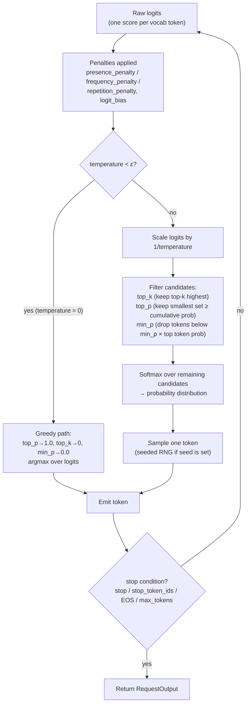

# Sampling & Generation

## Learning Objectives

By the end of this chapter, you will be able to:

- Enumerate every field on vLLM's `SamplingParams` dataclass, its default value, and what it controls —
  organized by what it actually governs (randomness, length, repetition, output shape) rather than as an
  alphabetical wall of flags
- Trace the exact pipeline a model's raw logits go through before a token is chosen — temperature scaling, then
  top-k/top-p/min-p filtering, then sampling — and explain *why* the order of these steps matters
- Explain why `max_tokens` defaulting to `16` is the single most common "why did my output get cut off"
  support question, and set it correctly every time
- Distinguish `presence_penalty`, `frequency_penalty`, and `repetition_penalty` precisely enough to pick the
  right one (or combination) for a repetition problem, instead of cargo-culting all three to nonzero values
- State, with confidence, that `best_of` **does not exist** on current `SamplingParams` — and explain what
  it used to do, for anyone still following a V0-era tutorial
- Explain how per-request `SamplingParams` coexist safely inside the same continuously-batched decode step —
  and why this is a structural property of vLLM's architecture, not a special mode you opt into
- Use `seed` for reproducible generation, and state precisely what guarantees it does and does not give you
- Locate the `structured_outputs` field on `SamplingParams` and know it's a forward pointer to Chapter 16,
  not something to learn deeply here
- Run a temperature/top-p sweep against the same prompt using the offline `LLM` class and read the resulting
  differences correctly

---

## Prerequisites for This Chapter

This chapter assumes you've completed **Chapter 3 (vLLM Fundamentals)** and are comfortable with:

- Installing vLLM and instantiating the offline `LLM` class (`from vllm import LLM, SamplingParams`)
- Calling `llm.generate(prompts, sampling_params=...)` and reading a `RequestOutput`
- The basic mechanics of how an LLM produces text — logits over a vocabulary, a softmax turning them into a
  probability distribution, and sampling a next token from that distribution. This chapter does **not**
  re-teach what temperature or top-p *mean* conceptually — you already know that from using hosted chat
  completion APIs. What's new here is vLLM's **exact parameter surface**: the precise field names, defaults,
  validation rules, and what happens when different requests in the same batch use different settings.

If you haven't run `vllm serve` or the `LLM` class at all yet, go back to Chapter 3 first — this chapter
builds directly on the offline inference workflow introduced there.

---

## 1. The Sampling Pipeline: From Logits to a Token

Every decoding step, the model produces one row of raw, unnormalized **logits** — one real number per
vocabulary entry (tens of thousands of them). Everything in `SamplingParams` exists to answer one question:
*given this row of logits, which single token do we actually emit next?* vLLM's sampler applies a fixed
sequence of transformations to get there:



A few things worth internalizing about this diagram before the field-by-field reference:

1. **Penalties (presence/frequency/repetition) apply to logits, before temperature and filtering.** They
   reshape the score landscape; temperature and top-k/top-p/min-p then act on the reshaped landscape.
2. **`temperature` near zero is special-cased as greedy decoding**, not "divide by a tiny number and hope."
   Confirmed directly from vLLM's own source (`vllm/sampling_params.py`): when `temperature < _SAMPLING_EPS`,
   vLLM sets `top_p=1.0`, `top_k=0`, `min_p=0.0` and takes the `argmax` — it does not attempt to scale logits
   by `1/0`. One consequence: **`n > 1` combined with `temperature=0` raises a validation error** — greedy
   decoding always produces the same token, so asking for more than one *distinct* completion at `n>1` is a
   contradiction vLLM refuses to silently paper over.
3. **top-k, top-p, and min-p all narrow the candidate set before the final softmax/sample** — they compose,
   they don't override each other. Setting all three simultaneously means "the intersection of these three
   filters," which is a real, valid (if unusual) configuration.

---

## 2. The `SamplingParams` Dataclass — Full Field Reference

Every generation request in vLLM — offline via the `LLM` class or through the OpenAI-compatible server
(Chapter 4, which translates request-body fields into a `SamplingParams` instance internally) — is governed
by one `SamplingParams` object. This section is the complete field table, organized by what each field
actually controls rather than alphabetically.

```python
from vllm import SamplingParams

params = SamplingParams(
    temperature=0.7,
    top_p=0.9,
    max_tokens=256,
)
```

### 2.1 Randomness controls

These fields shape *which* token gets picked among plausible candidates.

| Field | Default | What it does | Why it matters |
|---|---|---|---|
| `temperature` | `1.0` | Scales logits by `1/temperature` before softmax. Lower → sharper distribution (more deterministic); higher → flatter distribution (more random). `0` is special-cased as **greedy decoding** (argmax), not division by zero. | The single highest-leverage knob for "creative vs. reliable" output. |
| `top_p` | `1.0` | Nucleus sampling — keep the smallest set of highest-probability tokens whose cumulative probability is ≥ `top_p`, zero out everything else, renormalize. `1.0` = no filtering. | Adapts the candidate set size to how peaked/flat the distribution already is, unlike `top_k`'s fixed count. |
| `top_k` | `0` | Keep only the `top_k` highest-logit tokens before sampling. **`0` (or `-1`) means "consider all tokens" — i.e., disabled.** Any other value must be `≥ 1`; vLLM raises a validation error for `top_k < -1`. | This is the field most likely to trip up anyone coming from a framework where `0` means "keep zero tokens" or where `-1` is the disabled sentinel instead of `0`. In vLLM, `0` and `-1` are synonyms for "off." |
| `min_p` | `0.0` | Drop any token whose probability is below `min_p × (probability of the single most likely token)`. `0.0` disables it. | A relative floor rather than `top_p`'s cumulative-mass or `top_k`'s fixed-count filter — useful for cutting a long tail of near-zero-probability tokens without picking an arbitrary `k` or `p`. |
| `seed` | `None` | Fixes the RNG used for sampling this request. | See Section 5 — reproducibility, and its real limits. |

### 2.2 Length controls

| Field | Default | What it does | Why it matters |
|---|---|---|---|
| `max_tokens` | **`16`** | Hard cap on generated tokens for this request. | **The single most common vLLM trip-up.** See the callout immediately below. |
| `min_tokens` | `0` | Minimum tokens generated before EOS/`stop` is allowed to end the sequence. Must be `≤ max_tokens`, or vLLM raises a validation error at construction time. | Prevents a model from stopping suspiciously early (e.g. emitting EOS on the first token) when you need a guaranteed minimum-length answer. |
| `stop` | `None` | A string or list of strings; generation halts the moment any of them is produced. Requires `detokenize=True` (vLLM raises a validation error otherwise — stop-string matching operates on detokenized text). | Lets you truncate at a structural marker (e.g. `"\n\n"`, `"</answer>"`) without waiting for the model's own EOS token. |
| `stop_token_ids` | `None` | Like `stop`, but matches on raw token IDs instead of decoded strings. | Useful when the stop condition is a specific special token that may not round-trip cleanly through detokenization. |
| `ignore_eos` | `False` | If `True`, keep generating past the model's EOS token instead of stopping there. | Mainly used with an explicit `max_tokens` for benchmarking (forcing a fixed output length) — see Chapter 17. |

> **The `max_tokens=16` gotcha, loudly:** `SamplingParams()` with no arguments generates **at most 16
> tokens**, then stops — not because the model chose to stop, but because the request hit its cap. This is
> the single most-reported "why is vLLM truncating my answer" confusion in practice. There is no dependency
> on prompt length, model size, or task — it is a fixed default on the dataclass. **Set `max_tokens` explicitly
> on every real request.** If you're building anything user-facing, treat "did I set `max_tokens`?" as a
> checklist item, not an afterthought.

### 2.3 Repetition controls

Three distinct penalty mechanisms exist, and they are **not interchangeable** — each modifies the logit
landscape differently before temperature/top-k/top-p apply:

| Field | Default | Range | What it does | How it differs from the others |
|---|---|---|---|---|
| `presence_penalty` | `0.0` | `[-2.0, 2.0]` (validated) | Flat penalty applied to *any* token that has appeared **at least once** in the text generated so far, regardless of how many times. Positive values push the model toward introducing new vocabulary; negative values encourage reuse. | Binary — appeared-or-not. Doesn't scale with repetition count. |
| `frequency_penalty` | `0.0` | `[-2.0, 2.0]` (validated) | Penalty that scales with **how many times** a token has already appeared. The more a token repeats, the harder it's penalized on subsequent steps. | Proportional — punishes heavy repeaters more than tokens used once. |
| `repetition_penalty` | `1.0` | must be `> 0.0` (validated) | Multiplicative penalty on tokens that appear in **the prompt and the generated text so far combined** (not just generated text). Values `> 1.0` discourage repetition; values `< 1.0` encourage it. | The only one of the three that also looks at the *prompt*, not just what's been generated — and it's multiplicative rather than additive to the logit. |

Why three fields for what looks like one problem: `presence_penalty` and `frequency_penalty` mirror the
OpenAI Chat Completions API's naming and semantics (useful if you're porting logic from a hosted-API
integration), while `repetition_penalty` is the older, model-literature-standard mechanism (from the
CTRL/Grover lineage of repetition-control papers) that also accounts for prompt tokens. In practice: reach for
`repetition_penalty` slightly above `1.0` (e.g. `1.1`–`1.3`) as a general-purpose fix for degenerate looping;
reach for `frequency_penalty` when you specifically want heavy repeaters suppressed more than one-off reuses.
They can be combined, but start from one nonzero value at a time — stacking all three by default makes it
hard to attribute a change in output quality to any single knob.

### 2.4 Output shape controls

| Field | Default | What it does | Notes |
|---|---|---|---|
| `n` | `1` | Number of completions to generate for this one prompt/request. | Must be `1` when the request resolves to greedy decoding (`temperature < ε`) — see Section 1. This is vLLM's *current* mechanism for "give me several candidate completions"; see Section 3 for what used to sit alongside it. |
| `logprobs` | `None` | If set to an integer, return that many top log-probabilities per **generated** token. | Useful for confidence inspection, reranking, or research tooling — inspecting *why* the model picked what it picked. |
| `prompt_logprobs` | `None` | Same idea, but for **prompt** tokens — the log-probability the model assigned to each prompt token given everything before it. | Useful for scoring/evaluating a fixed continuation, or debugging tokenization/perplexity issues. |
| `structured_outputs` | `None` | Takes a `StructuredOutputsParams(...)` instance constraining generation to a schema, regex, grammar, or choice set. | Full treatment in **Chapter 16**; see Section 6 below for where this fits today. |
| `logit_bias` | `None` | A mapping vLLM uses to construct a logits processor that adds a bias to specific token IDs' logits before sampling. | Direct per-token nudging — e.g. suppress a token entirely with a large negative bias, or make one more likely. |
| `allowed_token_ids` | `None` | Restricts the vocabulary to only the given token IDs — every other token's score is dropped. | A hard allow-list, stronger than a bias — nothing outside the set can ever be emitted. |
| `bad_words` | `None` | A list of strings/word sequences that must never be generated. Precisely: the *last* token of a matching sequence is disallowed at the point where the next generated token would complete it. | A denylist at the phrase level rather than the single-token level `allowed_token_ids`/`logit_bias` operate at. |

### 2.5 Output formatting (rounds out the dataclass)

| Field | Default | What it does |
|---|---|---|
| `detokenize` | `True` | Whether to convert generated token IDs back into text at all. Set `False` only if you specifically want raw token IDs and are handling detokenization yourself — note `stop` (string matching) requires this to stay `True`. |
| `skip_special_tokens` | `True` | Whether special tokens (EOS, padding, etc.) are stripped from the detokenized output text. |
| `include_stop_str_in_output` | `False` | Whether a matched `stop` string is included in the returned output text, or trimmed off. |

---

## 3. `best_of` No Longer Exists — Read This If You Learned vLLM From an Older Tutorial

> **Note — legacy/historical:** Older vLLM tutorials, blog posts, and even some cached documentation reference
> a `best_of` field on `SamplingParams`. **It has been removed.** If you try `SamplingParams(best_of=4, n=1)`
> against a current vLLM install, it will not do what those older docs describe — the field simply isn't part
> of the dataclass anymore.

`best_of` was a V0-era mechanism: it told the engine to internally generate `best_of` candidate sequences and
return only the top `n` of them, ranked by cumulative log-probability. It doubled as a crude quality-improving
trick ("generate 8, keep the best 2") without the caller having to see or rank the discarded candidates
themselves. Current `SamplingParams` has no equivalent single-field replacement. If you need "generate several
candidates and pick the best one" today, the pattern is:

1. Set `n` to however many completions you want returned (all of them come back — there is no server-side
   discard-and-rank step anymore).
2. Do your own ranking/selection in your application code — using `logprobs`, an external reward/verifier
   model, or task-specific scoring — over the `n` completions vLLM actually hands you.

This is a deliberate simplification in the V1-era API surface: `SamplingParams` sticks to describing *how to
sample*, and pushes "which of several candidates is best" out to the caller, who usually has better
task-specific judgment than a generic log-probability ranking anyway.

---

## 4. Per-Request `SamplingParams` Under Continuous Batching

Here's a fact that surprises people coming from simpler batched-inference setups: **in the same decode step,
vLLM can be running one request at `temperature=0` (deterministic), another at `temperature=1.2` (highly
random), a third with `n=3`, and a fourth with a `logit_bias` banning a dozen tokens — all sharing the same
GPU forward pass.** This isn't a special mode you opt into; it's a structural property of how vLLM's engine
is built.

Why this is safe, at a level appropriate for this chapter (Chapter 8 covers the scheduler and batching
machinery in full — this is a forward pointer, not the full explanation):

- The **model's forward pass** — the expensive GPU-bound matrix multiplication that produces logits — is
  genuinely shared and batched across every sequence in the step. This is the part continuous batching makes
  efficient, and it has nothing to do with sampling settings; every sequence gets its own logits row out of the
  same batched computation regardless of what `SamplingParams` it's carrying.
- The **sampling step** — everything in Section 1's pipeline, from penalties through the final token draw —
  operates **per-sequence**, applying each request's own `SamplingParams` to its own logits row independently.
  One request's `top_k` or `seed` has zero effect on any other request's sampling in the same step.
- Each request carries its `SamplingParams` as part of its own scheduled state, the same way it carries its
  own KV cache blocks and its own position in its own sequence — sampling configuration is just more per-request
  metadata to the scheduler, not something that needs to be uniform across a batch.

The practical upshot: you never need to group requests by sampling configuration, run separate batches per
temperature setting, or worry that a wildly different `SamplingParams` on one request will perturb another
request's output. This is exactly what makes vLLM a sane substrate for serving many simultaneous
users/agents with completely different generation needs (one doing deterministic tool-call generation at
`temperature=0`, another doing creative long-form writing at `temperature=0.9`) through a single running
engine instance.

---

## 5. Reproducibility With `seed` — and Its Real Limits

Setting `seed` fixes the RNG vLLM uses when drawing a token from the post-filtering probability distribution
for that request, which is what most people mean by "make generation reproducible":

```python
from vllm import LLM, SamplingParams

llm = LLM(model="facebook/opt-125m")
params = SamplingParams(temperature=0.8, top_p=0.95, max_tokens=64, seed=42)

out_a = llm.generate(["Explain KV caching in one paragraph."], params)[0].outputs[0].text
out_b = llm.generate(["Explain KV caching in one paragraph."], params)[0].outputs[0].text
# out_a == out_b, run back-to-back on the same process/engine instance
```

What `seed` **does** guarantee: given the same prompt, the same `SamplingParams` (including the same `seed`),
the same model weights, and the same engine instance/session, you get the same output every time you run it.

What `seed` **does not** guarantee, and why this matters if you're building anything that compares runs
across environments:

- **Different batch composition can change floating-point results.** GPU kernels for batched matrix
  multiplication are not always strictly associative in floating point — the exact numerical result for one
  sequence's logits can differ slightly depending on what else is in the batch alongside it (padding,
  batch size, which other sequences are co-scheduled). Continuous batching means "what else is in the batch"
  changes step to step and run to run under real traffic, so bit-for-bit-identical logits across two different
  serving sessions aren't a guarantee even with `seed` fixed.
- **Different hardware, drivers, or kernel/attention-backend choices can change floating-point results.**
  Different GPU architectures, CUDA/cuDNN versions, or attention backends (FlashAttention vs. FlashInfer vs.
  others) can produce logits that differ in the last few bits of floating-point precision. Usually harmless for
  the *distribution*, but occasionally enough to flip which token wins a near-tie in `argmax` or in sampling.
- **A different vLLM version can change results even with everything else fixed** — kernel implementations,
  default numerics, and scheduling behavior evolve release to release.

The practical framing: treat `seed` as giving you **reproducibility within a fixed environment** (same
hardware, same vLLM version, same engine session) — genuinely useful for debugging, regression-testing prompts,
and demoing deterministic behavior — but not as a portable, cross-environment guarantee that two different
deployments will produce byte-identical output from the same seed. If you need cross-environment determinism
guarantees for compliance/audit reasons, pin the full stack (vLLM version, model revision, hardware class,
attention backend) rather than relying on `seed` alone.

---

## 6. Structured Outputs — the `structured_outputs` Field, Briefly

`SamplingParams` has a `structured_outputs` field, taking a `StructuredOutputsParams(...)` instance, that
constrains generation to match a JSON schema, regex, grammar, or fixed choice set — enforced token-by-token
during sampling rather than validated after the fact:

```python
from vllm import SamplingParams
from vllm.sampling_params import StructuredOutputsParams

params = SamplingParams(
    max_tokens=128,
    structured_outputs=StructuredOutputsParams(json=my_json_schema),
)
```

That's the entire scope of structured outputs this chapter covers — knowing the field exists, its shape, and
that it plugs into the same `SamplingParams` object as everything else in this chapter. **Chapter 16
(Structured Outputs & Tool Calling)** covers the full picture: the `xgrammar`/`guidance` backend choice, how
this maps to the OpenAI-compatible server's request body (the `structured_outputs` field there replaced the
older, now-removed `guided_json`/`guided_regex`/etc. fields as of v0.12.0), and how it plugs into tool-call
parsing for agent frameworks.

---

## Worked Examples

All examples use the offline `LLM` class from Chapter 3. Swap `facebook/opt-125m` for any model you have
locally — it's used here purely as a small, fast-loading illustration model.

### Example 1 — the `max_tokens=16` gotcha, made visible

```python
from vllm import LLM, SamplingParams

llm = LLM(model="facebook/opt-125m")

prompt = "Write a short paragraph explaining what a KV cache is."

# No max_tokens set — uses the default of 16
default_params = SamplingParams(temperature=0.7)
truncated = llm.generate([prompt], default_params)[0].outputs[0].text
print("Default max_tokens=16:", repr(truncated))

# Explicit, sane max_tokens
full_params = SamplingParams(temperature=0.7, max_tokens=200)
full = llm.generate([prompt], full_params)[0].outputs[0].text
print("Explicit max_tokens=200:", repr(full))
```

Running this reliably shows the first output cut off mid-sentence at 16 tokens, and the second running to
completion (or its own natural stopping point) well before 200 tokens if the model finishes on its own. This
is the single check worth doing once, deliberately, so the `max_tokens=16` default stops being an abstract
warning and becomes a concrete thing you've seen happen.

### Example 2 — sweeping temperature and top_p on the same prompt

```python
from vllm import LLM, SamplingParams

llm = LLM(model="facebook/opt-125m")
prompt = "The best way to reduce GPU memory usage when serving an LLM is"

sweep = [
    {"temperature": 0.0, "top_p": 1.0},   # greedy — deterministic
    {"temperature": 0.3, "top_p": 0.9},   # low randomness
    {"temperature": 0.7, "top_p": 0.9},   # moderate randomness
    {"temperature": 1.5, "top_p": 1.0},   # high randomness, no nucleus filtering
]

for cfg in sweep:
    params = SamplingParams(max_tokens=40, **cfg)
    result = llm.generate([prompt], params)[0].outputs[0].text
    print(f"temperature={cfg['temperature']}, top_p={cfg['top_p']}:")
    print(f"  {result!r}\n")
```

What to look for when you run this: the `temperature=0.0` row is the same every time you re-run the whole
script (greedy decoding is deterministic by construction — no `seed` even needed). As temperature climbs,
expect increasingly varied word choice and, past a point (the `1.5` row here), a visible increase in
incoherence — high temperature flattens the distribution enough that low-probability, poorly-fitting tokens
get a real chance of being drawn. `top_p=0.9` vs. `top_p=1.0` at the same temperature is a subtler effect —
nucleus filtering trims the long low-probability tail before sampling, which tends to reduce the frequency of
those "way off in left field" token choices without changing the overall variety much at moderate
temperatures.

### Example 3 — `seed` reproducibility, and what breaks it

```python
from vllm import LLM, SamplingParams

llm = LLM(model="facebook/opt-125m")
prompt = "List three benefits of continuous batching."
params = SamplingParams(temperature=0.9, top_p=0.9, max_tokens=60, seed=7)

run_1 = llm.generate([prompt], params)[0].outputs[0].text
run_2 = llm.generate([prompt], params)[0].outputs[0].text
print("Identical (same process, same seed)?", run_1 == run_2)  # expect True

# Different seed, same everything else
different_seed_params = SamplingParams(temperature=0.9, top_p=0.9, max_tokens=60, seed=123)
run_3 = llm.generate([prompt], different_seed_params)[0].outputs[0].text
print("Different seed, same prompt/config:")
print(run_3)
```

### Example 4 — heterogeneous `SamplingParams` in a single batched call

`LLM.generate()` accepts either one `SamplingParams` applied to every prompt, or a list of `SamplingParams`
the same length as the prompt list, paired one-to-one — exactly the "different requests, different sampling
settings, same batch" property from Section 4, made concrete in the offline API:

```python
from vllm import LLM, SamplingParams

llm = LLM(model="facebook/opt-125m")

prompts = [
    "Extract the ticket priority as one word: 'The server is down, please help now.'",
    "Write a creative one-sentence opening line for a fantasy novel.",
    "Summarize continuous batching in a single sentence.",
]

# One deterministic (structured-extraction-style) request,
# one highly creative request, one moderate-temperature request —
# all issued in the same llm.generate() call.
per_request_params = [
    SamplingParams(temperature=0.0, max_tokens=10),               # deterministic
    SamplingParams(temperature=1.3, top_p=1.0, max_tokens=40),     # creative
    SamplingParams(temperature=0.4, top_p=0.9, max_tokens=30),     # moderate
]

outputs = llm.generate(prompts, sampling_params=per_request_params)
for prompt, out in zip(prompts, outputs):
    print(f"PROMPT: {prompt}\n  -> {out.outputs[0].text!r}\n")
```

vLLM schedules and batches these three requests together at the engine level exactly as it would if they all
shared one `SamplingParams` — Section 4 explains why that's safe. Nothing about the deterministic request's
`temperature=0.0` affects the creative request's `temperature=1.3` output; they're independent per-sequence
sampling decisions applied to independently computed logits rows within the same batched forward pass.

---

## Real-World Scenario

A team is building an agent tool-execution layer on top of a self-hosted model: one code path extracts
structured fields from a document (needs deterministic, terse output), another path drafts a user-facing
summary (wants some variety so responses don't feel robotic across repeated calls), and a third path is a
debugging/eval harness that needs the *exact same* output every time a regression test runs.

Their first implementation created one global `SamplingParams(temperature=0.7, max_tokens=512)` and reused it
everywhere, because "it worked in the demo." Two failures showed up quickly:

1. **The field-extraction path occasionally returned a slightly different value for the same input** —
   `temperature=0.7` gave the model room to phrase a boolean or category answer differently run to run,
   which broke a downstream regex parser expecting one of three exact strings.
2. **Their eval harness's "did this regression test pass" comparisons were flaky**, because the harness reused
   the same global params (`temperature=0.7`, no `seed`) instead of the deterministic settings its job
   actually needed.

The fix maps directly onto this chapter's per-request model:

```python
extraction_params = SamplingParams(temperature=0.0, max_tokens=20)          # deterministic, terse
summary_params = SamplingParams(temperature=0.8, top_p=0.9, max_tokens=300) # some variety, real length
eval_params = SamplingParams(temperature=0.0, max_tokens=300, seed=0)       # deterministic + explicit seed
```

Because these are three independent `SamplingParams` objects passed per-request (Section 4, Example 4), all
three call sites can hit the *same running vLLM instance* — no need to spin up separate engines, one "creative"
and one "deterministic." The extraction and eval paths use `temperature=0.0` (greedy — no `seed` strictly
required, but the eval harness sets one anyway for auditability and to make the intent explicit in code
review). The summary path keeps its higher temperature. This single change — stopping the reuse of one global
`SamplingParams` across structurally different call sites — resolved both the parsing flakiness and the eval
flakiness without touching the model or the serving infrastructure at all.

---

## Best Practices

- **Always set `max_tokens` explicitly.** Never rely on the default of `16` for anything beyond a quick smoke
  test — treat it as a required field in your own application-level wrapper around `SamplingParams`.
- **Use `temperature=0.0` for anything requiring a single, structurally consistent answer** (classification,
  extraction, tool-argument generation, regression tests) — it's genuinely deterministic (via vLLM's
  special-cased greedy path), not just "low randomness."
- **Reach for `structured_outputs` (Chapter 16) instead of prompting harder** when you need a specific JSON
  shape reliably — sampling-time constraint enforcement is strictly more reliable than instructing the model
  to "please output valid JSON" and hoping.
- **Pick one repetition-control knob first and tune it in isolation** before combining
  `presence_penalty`/`frequency_penalty`/`repetition_penalty` — stacking all three from the start makes it
  hard to attribute output-quality changes to any single one.
- **Pass a list of `SamplingParams` (one per prompt) to a single `llm.generate()` call** when different
  prompts genuinely need different settings, instead of issuing separate `generate()` calls per configuration
  — this lets vLLM batch them together at the engine level (Section 4, Example 4).
- **Set `seed` for anything you'll re-run and compare** — debugging sessions, regression tests, demos — but
  don't treat it as a cross-environment/cross-version determinism guarantee (Section 5).
- **Use `logprobs`/`prompt_logprobs` when you need to *inspect* model confidence**, not just when you need the
  final text — they're comparatively cheap to request and often answer "why did it pick that" questions faster
  than re-prompting and guessing.

---

## Common Mistakes

- **Forgetting `max_tokens` and getting silently truncated 16-token outputs.** By far the most common
  `SamplingParams` mistake — Section 2.2's callout exists because this trips up nearly everyone the first time.
- **Using `best_of` from an old tutorial.** It's been removed from `SamplingParams` entirely (Section 3) — if
  you're following a blog post or course that predates the V1 engine, expect this and other V0-era fields to
  be gone, not just renamed.
- **Assuming `top_k=0` means "keep zero tokens."** In vLLM, `top_k=0` (and `top_k=-1`) both mean **disabled —
  consider all tokens** — the opposite of what "0" might suggest if you're used to a framework where `0` is a
  literal, restrictive count. Passing `top_k=0` is not a bug; it's the default, "off" state.
- **Setting `n > 1` together with `temperature=0`.** Greedy decoding always produces the same token at every
  step, so requesting more than one distinct completion (`n > 1`) at `temperature=0` is a logical
  contradiction — vLLM raises a validation error rather than silently returning `n` identical completions.
- **Reusing one global `SamplingParams` object across structurally different call sites** (deterministic
  extraction vs. creative generation vs. reproducible eval) — see the Real-World Scenario. Each call site with
  a genuinely different generation *goal* deserves its own `SamplingParams`.
- **Treating `seed` as a portable determinism guarantee across hardware/versions.** It reproduces results
  within a fixed environment; it is not a contract that two different deployments produce byte-identical
  output (Section 5).
- **Piling on `presence_penalty`, `frequency_penalty`, and `repetition_penalty` simultaneously by default**
  "just in case," instead of diagnosing which specific repetition pattern you're fighting and reaching for the
  one mechanism that actually targets it (Section 2.3).
- **Setting `stop` without realizing it requires `detokenize=True`.** vLLM validates this and raises an error
  at construction time if you've set `detokenize=False` alongside a `stop` string — worth knowing before you
  hit it as a confusing exception rather than expecting it.

---

## Summary

- vLLM's sampling pipeline is: penalties applied to raw logits → temperature scaling (or the special-cased
  greedy path at `temperature≈0`) → top-k/top-p/min-p filtering → softmax → sample (Section 1).
- `SamplingParams` groups logically into **randomness controls** (`temperature`, `top_p`, `top_k`, `min_p`,
  `seed`), **length controls** (`max_tokens` — default **16**, `min_tokens`, `stop`, `stop_token_ids`,
  `ignore_eos`), **repetition controls** (`presence_penalty`, `frequency_penalty`, `repetition_penalty`), and
  **output shape controls** (`n`, `logprobs`, `prompt_logprobs`, `structured_outputs`, `logit_bias`,
  `allowed_token_ids`, `bad_words`), plus formatting fields (`detokenize`, `skip_special_tokens`,
  `include_stop_str_in_output`).
- `max_tokens` defaulting to `16` is the most common real-world trip-up — set it explicitly on every request
  that matters.
- `top_k=0` (and `top_k=-1`) both mean "disabled, consider all tokens" — not "keep zero tokens."
- `temperature=0` is special-cased greedy (deterministic) decoding, and forces `n=1`.
- `best_of` has been removed from `SamplingParams` entirely — it was a V0-era best-of-N mechanism; ranking
  multiple candidates is now the caller's responsibility using `n` and your own selection logic.
- Different requests in the same continuously-batched decode step can carry completely different
  `SamplingParams` safely — the shared, batched part is the GPU forward pass; sampling itself is applied
  per-sequence, independently, on each request's own logits.
- `seed` gives reproducibility within a fixed environment (same hardware, vLLM version, engine session) — not
  a cross-environment/cross-version guarantee, due to floating-point non-associativity under different batch
  compositions or hardware/kernel choices.
- `structured_outputs=StructuredOutputsParams(...)` exists on `SamplingParams` today; its full treatment is
  Chapter 16.

---

## Knowledge Check

1. Walk through the exact pipeline vLLM applies to go from raw logits to a sampled token, and state at which
   stage `presence_penalty`/`frequency_penalty`/`repetition_penalty` are applied relative to temperature
   scaling and top-k/top-p/min-p filtering.
2. A teammate sets `SamplingParams(top_k=0)` and asks why the model still considers the entire vocabulary
   instead of "zero tokens." Explain what `top_k=0` (and `top_k=-1`) actually mean in vLLM, and why this
   convention might surprise someone coming from a different framework.
3. Why does vLLM raise a validation error if you pass `SamplingParams(temperature=0.0, n=4)`? Tie your
   answer to what `temperature=0` actually does internally.
4. Explain, precisely, the difference between `presence_penalty`, `frequency_penalty`, and
   `repetition_penalty` — which one(s) look at the prompt tokens as well as generated tokens, and which one
   scales with repeat count vs. being a flat yes/no penalty?
5. A former colleague's script uses `SamplingParams(best_of=8, n=1)` and no longer runs. What happened to
   `best_of`, and what's the current recommended pattern for "generate several candidates, keep the best one"?
6. Two requests — one with `temperature=0.0`, one with `temperature=1.2` — end up scheduled into the same
   continuous-batching decode step. Explain why this is safe, distinguishing what's shared across the batch
   (the forward pass) from what's applied per-request (sampling).
7. You fix `seed=42` and get identical output twice in a row during local testing, then deploy to a different
   GPU class in production and get a slightly different output for the same prompt/seed/params. Is this a
   bug? Explain using Section 5.

---

## Hands-On Exercise

Using the offline `LLM` class from Chapter 3 (any small model you have available, e.g. `facebook/opt-125m`):

1. **Reproduce the `max_tokens=16` gotcha deliberately.** Run one generation with default `SamplingParams`
   (no `max_tokens` set) and one with `max_tokens=200`, on the same prompt. Confirm the first is cut off at
   16 tokens.
2. **Run the same prompt at `temperature=0`, `temperature=0.7`, and `temperature=1.5`** (fixing `max_tokens`
   the same across all three). For each, run it **twice**. Confirm: the `temperature=0` output is identical
   across both runs with no `seed` needed; the `temperature=0.7` and `temperature=1.5` outputs differ run to
   run, and the `1.5` output shows more visible incoherence than the `0.7` output.
3. **Add `seed=42` to the `temperature=0.7` configuration** and re-run it three times. Confirm all three runs
   now produce identical output. Then change only the `seed` to `99` and confirm you get a *different* (but
   still internally consistent across repeated runs) output.
4. **Try `SamplingParams(temperature=0.0, n=4)`** and confirm it raises a validation error rather than
   returning results — read the error message it gives you.
5. **Build one `llm.generate()` call with three prompts and three different `SamplingParams`** in a list —
   one deterministic (`temperature=0.0`), one moderate, one highly creative (`temperature≥1.3`) — following
   Example 4. Confirm all three complete correctly in the same call and each reflects its own settings.
6. **Bonus:** experiment with `min_p` at a fixed moderate-to-high temperature (e.g. `temperature=1.0`,
   `min_p=0.05`) versus the same temperature with `min_p=0.0` (disabled). Compare how often each produces a
   visibly "off the rails" token choice over several runs.

---

## Further Reading

- [vLLM Sampling Parameters reference](https://docs.vllm.ai/en/latest/api/vllm/sampling_params.html) —
  authoritative, current field list; check this against the table in Section 2 before relying on any field
  name in production, since it can gain/lose fields release to release
- [vLLM source: `vllm/sampling_params.py`](https://github.com/vllm-project/vllm/blob/main/vllm/sampling_params.py)
  — the ground truth this chapter's field table and validation rules were read directly from
- [vLLM source: `vllm/entrypoints/llm.py`](https://github.com/vllm-project/vllm/blob/main/vllm/entrypoints/llm.py)
  — the `LLM.generate()` signature and its per-prompt vs. shared `sampling_params` behavior (Example 4)
- [vLLM release notes](https://github.com/vllm-project/vllm/releases) — check before trusting any specific
  default/flag/field name against the version you're actually running
- Related chapter in this course: [Chapter 3 — vLLM Fundamentals](./03-vllm-fundamentals.md) — the offline
  `LLM` class this chapter's examples build on
- Related chapter in this course: [Chapter 4 — The OpenAI-Compatible Server](./04-openai-compatible-server.md)
  — how request-body sampling fields map onto this same `SamplingParams` surface server-side
- Related chapter in this course: [Chapter 8 — Continuous Batching](./08-continuous-batching.md) — the full
  mechanics behind Section 4's "different `SamplingParams` in the same batch" claim
- Related chapter in this course: [Chapter 16 — Structured Outputs & Tool Calling](./16-structured-outputs-and-tool-calling.md)
  — the full treatment of `structured_outputs`/`StructuredOutputsParams`

---

<div style="display:flex;justify-content:space-between;align-items:center;">
  <a href="./04-openai-compatible-server.md">← Previous: The OpenAI-Compatible Server</a>
  <a href="./00-index.md">🏠 Index</a>
  <a href="./06-kv-cache.md">Next: KV Cache →</a>
</div>
