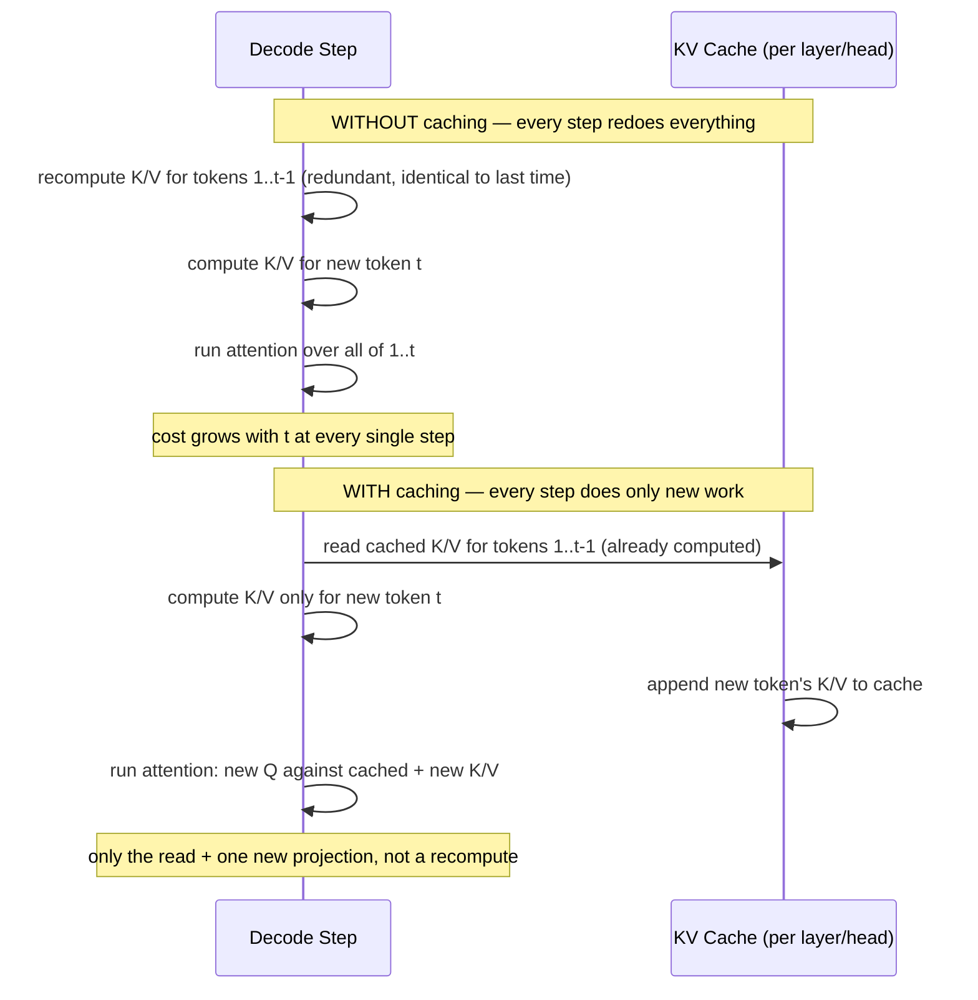
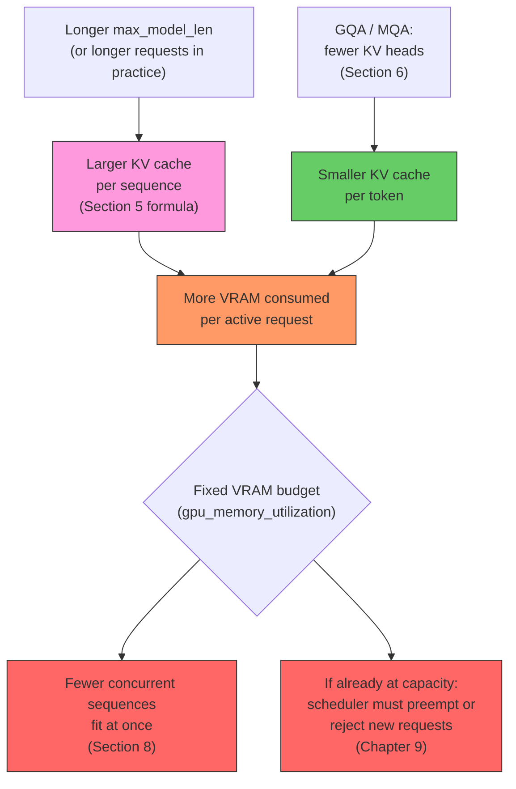

# KV Cache

## Learning Objectives

By the end of this chapter, you will be able to:

- Explain precisely *why* autoregressive decoding needs the Key (K) and Value (V) projections of every
  previously generated token, not just the newest one, and why Query (Q) does not need to be cached
- Quantify, with a concrete numeric example, exactly how much redundant computation an uncached decode loop
  performs compared to a cached one
- Derive and apply the KV cache size formula — layers × KV heads × head dim × sequence length × precision × 2
  (K and V) — for a real model configuration
- Explain why grouped-query attention (GQA) and multi-query attention (MQA) exist specifically to shrink KV
  cache size, and quantify their effect
- Distinguish two *different* scaling behaviors that are easy to conflate: attention compute (quadratic in total
  sequence length) versus KV cache memory (linear in current sequence length)
- Compute, from a VRAM budget and a per-sequence KV cache size, an upper bound on concurrent requests a GPU can
  serve — and explain why a large-context model serves far fewer concurrent users than a small-context model at
  the same VRAM budget
- Identify why naive, contiguous KV cache allocation wastes memory through fragmentation — the problem
  PagedAttention (Chapter 7) exists to solve

---

## Prerequisites for This Chapter

This chapter assumes you've read **Chapter 1 (LLM Inference Fundamentals)** and **Chapter 2 (GPU & CUDA
Fundamentals)**. Specifically, you should already know:

- The difference between **prefill** (processing the prompt, one parallel forward pass) and **decode**
  (generating tokens one at a time, autoregressively) — Chapter 1
- Why LLM decoding is **memory-bandwidth-bound**, not compute-bound — moving weights (and, as this chapter will
  show, KV cache) from HBM to the GPU's compute units dominates decode latency far more than raw FLOPs do —
  Chapter 2
- What VRAM is and roughly how it's partitioned between model weights, activations, and other engine state —
  Chapter 2

This chapter does **not** re-derive the self-attention formula from scratch — you already know, from
training-side transformer knowledge, what Query, Key, and Value projections are and how
`softmax(QKᵀ/√d)V` works. What's new here is *inference-specific*: what K and V are used for once a model is
generating tokens one at a time rather than training on fixed sequences, and why caching them is the single
most consequential serving optimization in the entire stack — arguably more foundational to how vLLM works than
any other single idea, which is exactly why PagedAttention (Chapter 7) exists to manage this cache well.

---

## 1. What K and V Are For, at Inference Time

Recall the attention computation for one layer, one head: a Query vector for the *current* token is compared
against Key vectors for every token in the sequence so far, producing attention weights; those weights combine
the corresponding Value vectors into the layer's output for the current token.

The part that matters for serving, which training-time intuition doesn't automatically surface, is this:

> **During autoregressive decode, generating token *t* requires the Key and Value vectors of tokens
> `1, 2, ..., t-1` — not their Query vectors, and not the full hidden states, just K and V.**

Why only K and V, and not Q? Because Q is only ever used to compute *that token's own* attention output, once,
at the step where that token is the "current" token. Once token 5's output has been computed, token 5's Query
vector is never touched again. But token 5's Key and Value vectors are read again at **every subsequent decode
step**, because every future token's attention computation needs to compare its Query against token 5's Key,
and (if attention weight is nonzero) mix in token 5's Value. K and V are the only two artifacts from a past
token's forward pass that remain permanently relevant to the future.

This is the entire reason a "KV cache" exists and not a "Q cache" or a "hidden-state cache": Q is transient
(used once, discarded), while K and V are durable (computed once, needed forever after, for every layer and
every attention head independently).

---

## 2. The Decode-Time Problem, Stated Precisely

Consider generating text token by token from a prompt of length `n`. At the moment you're about to produce
token `n+1`, standard self-attention (per layer, per head) says: take the Query vector for position `n+1`,
compute its dot product against the Key vector of *every* position `1..n+1`, softmax, then weight-sum the
Value vectors of every position `1..n+1`.

The Query for position `n+1` is cheap — it's one new projection, computed from that one token's hidden state.
The problem is the K and V side: naively, "every position `1..n+1`" means literally re-running the K and V
linear projections for positions `1` through `n` all over again, even though those tokens' hidden states (and
therefore their K/V projections) are byte-for-byte identical to what they were the last time you computed them.

Nothing about token 1's Key vector changes between decode step 10 and decode step 50 (causal attention means a
token's own representation never depends on tokens that come after it). So recomputing it 40 more times
produces the exact same numbers, at the exact same FLOP cost, for no benefit whatsoever. This is pure waste —
and because every decode step re-touches every prior position, the waste compounds with every token generated.

---

## 3. Without Caching: Quantifying the Waste

Let's make this concrete with small enough numbers to count by hand. Suppose a prompt has `n = 100` tokens,
and the model generates `m = 50` new tokens.

**Without a KV cache**, at each decode step you must run the K/V projection over the *entire* sequence produced
so far, because nothing was saved from the previous step:

| Decode step (generating token) | Sequence length at this step | K/V projections computed this step |
|---|---|---|
| 101 | 100 | 100 |
| 102 | 101 | 101 |
| 103 | 102 | 102 |
| ... | ... | ... |
| 150 | 149 | 149 |

Total K/V projections computed across all 50 decode steps:

```
Σ (i = 0 to 49) of (100 + i)  =  50 × 100 + (0 + 1 + ... + 49)  =  5000 + 1225  =  6225
```

**With a KV cache**, each token's K/V projection is computed exactly once, ever — at the step where it's the
newest token:

```
100 (prefill, computed once for the whole prompt in parallel) + 50 (one per decode step) = 150
```

`6225 / 150 ≈ 41.5×` — for a *tiny* example (100-token prompt, 50 generated tokens), the uncached approach does
**over 41 times more K/V projection work** than the cached approach, and every bit of that extra work produces
identical, previously-computed numbers. Scale `n` and `m` up to realistic production sizes (prompts in the
thousands of tokens, generations in the hundreds or thousands), and the ratio grows further — the wasted-work
sum scales roughly with `n·m + m²/2`, while the cached cost only ever scales with `n + m`. This is why "don't
cache K/V" isn't a minor inefficiency you could tune around; it's an asymptotically different — and far
worse — growth curve for the exact same generation task.

> Every serving engine worth using implements KV caching; it is not a vLLM-specific feature. What *is*
> vLLM-specific, and the subject of Chapter 7, is doing the *memory management* around that cache well.

---

## 4. With Caching: Store Once, Reuse Every Step

The fix follows directly from Section 3: as each token's K and V vectors are computed (once, whether during
parallel prefill or a single decode step), **store them** — per layer, per attention head — in a cache. Every
later decode step then does two things instead of recomputing anything:

1. Compute Q, K, and V **only for the newest token**.
2. **Append** that new token's K and V to the cache, then run attention using the *full* cached K/V (all prior
   tokens) plus the new K/V — but only the new token's Q.

This is why decode throughput scales the way it does: the *compute* done at each individual decode step is
dominated by one new token's worth of projections plus an attention read over the (growing) cache, rather than
by projections over the whole sequence. This is exactly what "decode is memory-bandwidth-bound" (Chapter 2)
refers to in practice — at each step, the GPU spends most of its time **reading** the KV cache out of HBM (a
memory-bandwidth-bound operation) rather than recomputing it (a compute-bound operation it already did once).



The cache is what turns "decode a token" from "redo the whole prefix" into "do a small constant amount of new
work plus a cache read" — this is, without exaggeration, the single most important optimization in LLM serving.
Everything from Chapter 7 (PagedAttention) through Chapter 12 (Chunked Prefill) is about managing this cache
efficiently, not about avoiding the need for it.

---

## 5. Sizing the KV Cache: The Formula

Caching solves the *compute* waste problem from Section 3 — but it trades that for a *memory* cost: every
token's K and V vectors, for every layer and every attention head, have to live in GPU memory for as long as
that token might still be attended to (i.e., for the life of the sequence). Sizing that memory correctly is the
single most load-bearing piece of capacity-planning math in this entire course.

**Per-token KV cache size** (bytes), for one sequence:

```
bytes_per_token = 2 × num_layers × num_kv_heads × head_dim × bytes_per_element
```

Where:

| Term | Meaning |
|---|---|
| `2` | one factor for K, one factor for V — they're stored separately, same size each |
| `num_layers` | every transformer layer has its own independent K/V cache — nothing is shared across layers |
| `num_kv_heads` | the number of **key/value** attention heads — see Section 6, this is *not* always equal to the number of query heads |
| `head_dim` | dimensionality of each individual attention head (commonly `hidden_size / num_attention_heads`) |
| `bytes_per_element` | 2 for fp16/bf16, 4 for fp32, 1 for an 8-bit KV cache format |

**Total KV cache size for one sequence** of length `L` tokens:

```
total_bytes = bytes_per_token × L
```

**Total KV cache memory across a batch** of concurrently active sequences is (approximately) the sum over every
active sequence of its own current length — see Section 8 for why "approximately" matters and why it's the
crux of concurrency planning:

```
total_batch_bytes ≈ Σ (bytes_per_token × current_length_i)  for every active sequence i
```

> **On precision, briefly:** some serving engines, including vLLM, support storing the KV cache itself in a
> lower-precision format (e.g., an 8-bit float format) independent of the model's compute dtype, specifically to
> shrink `bytes_per_element` and therefore the whole cache. **Unconfirmed — verify the exact current flag name
> and supported dtypes against `vllm serve --help` / current docs before relying on this in production** — this
> chapter's formula holds regardless of which concrete dtype ends up plugged into `bytes_per_element`.

---

## 6. GQA/MQA: Shrinking the Cache by Shrinking `num_kv_heads`

The formula in Section 5 has one term that's easy to skate past but disproportionately important in practice:
`num_kv_heads` is **not necessarily the same number as the model's total attention heads**.

In classic **multi-head attention (MHA)**, every attention head has its own independent Q, K, *and* V
projection — so `num_kv_heads == num_attention_heads`. But most modern production model architectures instead
use:

- **Grouped-query attention (GQA)**: multiple query heads *share* a smaller number of K/V heads (e.g., 4 query
  heads per 1 shared K/V head). `num_kv_heads` is a fraction of the total query head count.
- **Multi-query attention (MQA)**: the extreme case — *all* query heads share a single K/V head.
  `num_kv_heads = 1`.

Both exist for exactly one serving-relevant reason: **the KV cache formula scales linearly with `num_kv_heads`,
so reducing it directly and proportionally shrinks the cache**, without touching `num_attention_heads` (which
still governs model quality/expressiveness via the query side). A model with 32 query heads but only 8 KV
heads (a real, common ratio — see the worked example below) has a KV cache **4× smaller** than an equivalent
model using full MHA with 32 KV heads, at identical `num_layers`, `head_dim`, and precision. This is a pure
serving-cost win with a (usually small, architecture-team-validated) quality trade-off baked in at
pretraining time — not something you choose as a serving-time flag; it's fixed by the model's published
architecture.

This is worth internalizing precisely *because* it's easy to skip past: two models with the same total
parameter count and the same `num_attention_heads` can require wildly different amounts of KV cache memory per
token, purely as a function of how many KV heads their architecture actually uses.

---

## 7. Context Length: Two Different Scaling Behaviors

It's tempting to lump "attention gets expensive with long context" into one vague statement, but there are
**two distinct quantities that scale differently**, and conflating them leads to wrong capacity-planning
conclusions.

### 7.1 KV cache memory — linear in sequence length

From Section 5's formula, `total_bytes = bytes_per_token × L`. Memory grows **linearly** with the number of
tokens currently in the sequence. Double the context length, double the KV cache memory for that sequence. No
surprises, no quadratic terms — memory is a simple running sum of per-token costs.

### 7.2 Attention compute — quadratic in total sequence length

Compute is a different story. During **prefill**, computing attention over an `n`-token prompt costs
`O(n²)` — every one of the `n` query positions attends against all `n` key positions (this is the familiar
quadratic-in-training-sequence-length fact you already know, just applied to a prompt instead of a training
batch). During **decode**, an individual step's cost is `O(t)` — the new token's one Query attends against `t`
cached Keys — which looks linear per step. But summed across generating `m` tokens from a prompt of length `n`,
the *cumulative* decode compute is `Σ(n+i)` for `i` in `0..m-1`, which is `O(n·m + m²)` — quadratic in the total
number of tokens processed once you account for the whole generation, not just one step in isolation (this is
the same `Σ` you computed by hand in Section 3).

**The distinction that matters for capacity planning:**

| Quantity | Scaling behavior | Practical consequence |
|---|---|---|
| KV cache memory (a snapshot at any point in time) | **Linear** in current sequence length | Predictable, budgetable VRAM cost — Section 8 builds on this directly |
| Attention compute (cumulative, over a full generation) | **Quadratic** in total sequence length | Why very long contexts (100K+ tokens) get disproportionately slower per-request even before you run out of VRAM |

Memory pressure (this chapter, and Chapters 9–10) and compute cost (relevant to Chapter 1's TTFT/TPOT
discussion and Chapter 18's tuning) are two separate constraints that both get worse with longer context, but
for different mathematical reasons and on different curves. A back-of-envelope capacity plan that only accounts
for one of them will be wrong.

---

## 8. Concurrency: Why Total KV Cache Memory Is a Sum Across Requests

Section 5's batch formula — `total_batch_bytes ≈ Σ (bytes_per_token × current_length_i)` — is the single fact
that explains one of the most counter-intuitive things newcomers encounter about LLM serving:

> **A model deployed with a large maximum context window can serve far fewer *concurrent* users than the same
> model deployed with a small maximum context window, on identical hardware.**

This feels backwards at first — "the model is the model, why does context length change how many users I can
serve?" — until you internalize that **every active sequence's KV cache is a separate, growing memory
allocation that competes for the same fixed VRAM pool as every other active sequence's KV cache.** A GPU doesn't
have a separate memory bank per request; `gpu_memory_utilization` (Chapter 3, Chapter 10) defines one shared
pool that the engine's scheduler must divide among however many sequences are alive at once.

If your worst case is "every concurrent sequence might use the full `max_model_len`," then:

```
max_concurrent_sequences ≈ available_kv_cache_memory / (bytes_per_token × max_model_len)
```

Grow `max_model_len` by 16× (say, 8K → 128K context) and, all else equal, your worst-case concurrent-request
ceiling drops by roughly 16× on the same GPU. This isn't a vLLM inefficiency — it's an unavoidable consequence
of Section 5's linear formula applied across a batch. The worked examples below make this concrete with real
numbers.

---

## 9. The Memory Pressure Trade-off Chain

Put Sections 5–8 together and you get one causal chain that recurs throughout the rest of this course — it's
the mental model Chapter 9 (scheduler) and Chapter 10 (memory management) build directly on top of:



Two levers push in opposite directions on the *same* downstream variable (VRAM consumed per request): longer
context pushes memory pressure up, while GQA/MQA architectures push it back down. Chapter 9 covers what the
scheduler actually does once it hits the "fewer sequences fit" or "must preempt" branches (V1's recompute-based
preemption, not GPU↔CPU swap — a V0-era mechanism that no longer applies) in full; for this chapter, the point
is just to see clearly *why* that pressure exists in the first place.

---

## 10. Why Naive KV Cache Allocation Wastes Memory

Everything above establishes *how much* KV cache memory a workload needs. It says nothing yet about *how* an
engine should actually lay that memory out — and the naive answer turns out to be badly wasteful, which is the
direct motivation for Chapter 7.

The naive approach: when a new sequence starts, reserve one **contiguous** block of GPU memory sized for the
*maximum possible length* that sequence could ever reach (i.e., `max_model_len`), since you don't know in
advance how many tokens the user's request will actually generate before hitting a stop condition or `max_tokens`
(Chapter 5).

This is wasteful for a very concrete reason: **actual sequence lengths are highly variable and unpredictable**.
A request might generate 20 tokens, or 2,000, and the engine has no way to know which in advance. If every
sequence reserves a slot sized for the theoretical maximum, then:

- A sequence that finishes after 50 tokens still holds a contiguous reservation sized for (say) 8,192 tokens —
  the unused remainder is memory nobody else can use until that sequence completes and releases its slot,
  even though it was sitting idle the whole time.
- This is **internal fragmentation** in the classic operating-systems sense: memory allocated to a slot that the
  slot's occupant isn't actually using, but that also isn't free for anyone else to claim, because the
  allocation is one indivisible contiguous chunk.
- Multiply this across hundreds of concurrent, wildly-different-length requests, and a large fraction of
  "reserved" KV cache memory at any given moment is doing nothing — directly shrinking the real concurrency
  numbers from Section 8's formula, below what the *true* memory need would allow.

This is precisely the problem PagedAttention was built to solve: instead of one contiguous reservation per
sequence, allocate KV cache in small, fixed-size, non-contiguous **blocks** (vLLM's default block size is 16
tokens — you'll see this parameter, `block_size`, again as a first-class concept in Chapter 7) that get handed
out to a sequence incrementally, as it actually grows, and returned to a shared free pool the moment they're no
longer needed. That's the full subject of the next chapter — this chapter's job was only to make you feel,
concretely, why the naive contiguous approach leaves real capacity on the table.

> **Accuracy note — don't over-read a related but different fact:** you may encounter release notes describing
> removal of a "legacy attention implementation" from vLLM's codebase. That refers specifically to an old,
> **V0-era standalone attention kernel path** being deleted as the codebase consolidated onto V1 — it does
> **not** mean paged, block-structured KV cache storage was removed. Quite the opposite: PagedAttention's
> block-based design is foundational to V1's `KVCacheManager` and every current attention backend (FlashAttention,
> FlashInfer, and others) operates on top of that paged/block-structured cache. "A legacy attention kernel was
> removed" and "PagedAttention was removed" are not the same claim — only the former is true.

---

## Worked Examples

All three examples below are deliberately **back-of-envelope**: they ignore per-block bookkeeping overhead,
activation memory, CUDA graph reservations, and other engine-internal costs covered in Chapter 10 — the point
is to build the right *order-of-magnitude* intuition, not to reproduce vLLM's exact internal memory accounting.

### Example A: Per-token and per-sequence KV cache size for a GQA model

Take a real, publicly documented architecture shape — an 8B-parameter, Llama-3-style transformer:

| Parameter | Value |
|---|---|
| `num_layers` | 32 |
| `num_attention_heads` (query heads) | 32 |
| `num_kv_heads` (GQA) | 8 |
| `head_dim` | 128 |
| dtype | bf16 (2 bytes/element) |

Per-token KV cache size:

```
bytes_per_token = 2 × 32 × 8 × 128 × 2
                = 2 × 32 = 64
                64 × 8   = 512
                512 × 128 = 65,536
                65,536 × 2 = 131,072 bytes
                = 128 KiB per token
```

At an 8,192-token context (a full request at this length):

```
128 KiB × 8,192 = 1,048,576 KiB = 1,024 MiB = 1 GiB per sequence
```

At a 128,000-token context (a long-context deployment):

```
128 KiB × 128,000 = 16,384,000 KiB ≈ 15.6 GiB per sequence
```

One long-context sequence alone would need more KV cache memory than many entire consumer GPUs have VRAM —
before you've loaded a single model weight.

### Example B: What GQA saves you — GQA vs. full MHA, same model shape

Same shape as Example A, except imagine a hypothetical variant using full multi-head attention instead of GQA
(`num_kv_heads = 32`, matching the query head count, instead of 8):

```
bytes_per_token (MHA) = 2 × 32 × 32 × 128 × 2 = 524,288 bytes = 512 KiB per token
```

That's exactly `32 / 8 = 4×` larger than the GQA version's 128 KiB/token — the ratio is always exactly
`num_attention_heads / num_kv_heads`, since every other term in the formula is identical between the two
variants. At the same 8,192-token context: **4 GiB per sequence under MHA vs. 1 GiB under GQA.** Section 6's
claim, made numeric: GQA is a direct, proportional, architecture-level lever on KV cache size, independent of
anything a serving engine can tune at runtime.

### Example C: Turning VRAM budget into a concurrency ceiling

Take an 80 GB GPU (an H100-80GB-class card), serving the Example A model (8B params, bf16 weights ≈ 16 GB), with
`gpu_memory_utilization = 0.9` (Chapter 3's default) reserving 72 GB for weights + KV cache + activations. Set
aside roughly 2 GB for activation memory and engine overhead, leaving **≈ 54 GB for KV cache**.

**Scenario 1 — `max_model_len = 8,192`, GQA (1 GiB/sequence at full length):**

```
54 GB / 1 GiB ≈ 54 concurrent full-length sequences (worst case)
```

**Scenario 2 — same GPU, same model, but hypothetically full MHA instead of GQA (4 GiB/sequence at full length):**

```
54 GB / 4 GiB ≈ 13 concurrent full-length sequences
```

Same hardware, same parameter count, same context length — a **4× difference in worst-case concurrency**,
purely from the KV-head architecture choice in Section 6.

**Scenario 3 — same GPU, same GQA model, but `max_model_len = 128,000` (≈ 15.6 GiB/sequence at full length):**

```
54 GB / 15.6 GiB ≈ 3 concurrent full-length sequences
```

This is Section 8's claim made concrete: raising the context window ceiling from 8K to 128K — an ~16× increase —
drops the worst-case concurrency ceiling from ~54 down to ~3, roughly the same ~16× factor, on identical
hardware serving the identical model. This is exactly why a team choosing "what `max_model_len` should we
configure" is really answering "how many concurrent users can this GPU serve," whether or not they realize it
at configuration time.

> In practice, `max_num_seqs` and PagedAttention's block-level allocation (Chapter 7) mean real deployments
> rarely hit the literal worst case simultaneously across every request — most real traffic mixes short and
> long requests. These numbers are a **worst-case planning ceiling**, not a guarantee of average-case
> throughput; Chapter 17 (Benchmarking) is where you'd measure the real, workload-specific number.

---

## Real-World Scenario

A team deploys an 8B-parameter chat model on a single 80 GB GPU and configures `max_model_len=32000` "to be
safe" — they want to support long documents even though most of their actual chat traffic is short exchanges.
Their staging load test with 5 concurrent simulated users looks fine. In production, the on-call engineer gets
paged for `OutOfMemory` errors and heavily throttled request admission the moment concurrent traffic crosses
roughly 15–20 real users — far below the throughput the sales team was told to expect from an 80 GB card.

The root cause, diagnosed with exactly this chapter's formula: at `max_model_len=32000`, this model's
worst-case KV cache footprint per sequence (using Example A's 128 KiB/token figure) is
`128 KiB × 32,000 ≈ 3.9 GiB per sequence`. With roughly 54 GB available for KV cache (Example C's math), the
engine's real worst-case concurrency ceiling is `54 / 3.9 ≈ 13–14` sequences — not the "dozens of users" figure
the team assumed a big GPU implied, because nobody had connected "we set a large `max_model_len`" to "we cut our
concurrency ceiling by roughly 4× compared to an 8K-context configuration," even though the two facts are the
same math.

The fix wasn't a code change — it was **right-sizing `max_model_len` to the actual traffic distribution**
(most chat turns are short; a small number of "long document" requests could be routed to a separate deployment
with a larger context window and a correspondingly lower concurrency budget) plus properly load-testing at
realistic concurrency *before* production, using the formula from Section 8 to set expectations rather than
discovering the ceiling live via paged alerts. This exact split — a fast, high-concurrency pool for short
requests and a separate, lower-concurrency pool for long-context requests — is a common production pattern you
should expect to see revisited when Chapter 10 covers memory management flags in depth and Chapter 20 covers
production architecture.

---

## Best Practices

- **Compute your worst-case KV cache footprint per sequence before choosing `max_model_len`** — use Section 5's
  formula with your model's actual `num_layers`, `num_kv_heads` (check the model's published config, not the
  query head count), `head_dim`, and dtype, not a guess.
- **Treat `max_model_len` as a concurrency lever, not just a "how long can prompts be" setting** — Section 8 and
  Example C show these are the same knob in disguise.
- **Know your model's `num_kv_heads`, not just its total attention head count**, before doing capacity math —
  conflating the two silently overestimates KV cache size (if the model actually uses GQA/MQA) or, worse,
  underestimates it (if you assumed GQA savings a full-MHA model doesn't actually have).
- **Separate "typical request length" from "worst-case `max_model_len`"** when planning concurrency — if the
  vast majority of traffic is short but a handful of requests are long, consider routing long-context requests
  to a separately-sized deployment (Real-World Scenario) rather than sizing every deployment for the tail case.
- **Remember the two different scaling curves from Section 7** when someone says "long context is slow" — check
  whether the complaint is about *memory* (linear, budgetable) or *compute/latency* (quadratic across a full
  generation), because the fix for one is not the fix for the other.
- **Don't confuse "we cache K/V" with "we solved the memory problem"** — caching solves the *recompute* waste
  from Section 3; it introduces a *new* memory-management problem that naive contiguous allocation handles
  poorly (Section 10) and that Chapter 7 is entirely devoted to solving well.

---

## Common Mistakes

- **Sizing "how many concurrent users can this GPU serve" from GPU VRAM and model weight size alone**, ignoring
  KV cache entirely — this is the single most common capacity-planning error in the Real-World Scenario, and it
  always produces an optimistic number that gets discovered as wrong in production, not staging.
- **Assuming every model with the same head count has the same KV cache footprint** — ignoring that
  `num_kv_heads` (not `num_attention_heads`) is the term that actually appears in the formula, and that GQA/MQA
  models can differ by 4–8× or more in KV cache size from an MHA model with identical query-head counts
  (Section 6, Example B).
- **Treating "quadratic attention compute" and "linear KV cache memory" as the same claim** — they are two
  distinct scaling behaviors (Section 7) with different practical consequences; conflating them leads to
  confusing "why is memory fine but latency terrible" (or vice versa) debugging sessions.
- **Setting `max_model_len` to the largest number the model architecture supports "just in case,"** without
  connecting that choice to its direct, proportional effect on worst-case concurrent-request capacity
  (Section 8, Example C, Real-World Scenario).
- **Believing that "a legacy attention implementation was removed" means PagedAttention or paged KV cache
  storage was removed from vLLM** — it refers to an old V0-era kernel path being deleted, not to the paging
  design itself, which remains foundational to V1 (Section 10's accuracy note).
- **Forgetting that KV cache memory is a per-*sequence*, per-layer, per-head-group cost that sums across every
  concurrently active request** — mentally budgeting KV cache as if it were a single fixed cost rather than
  `Σ` over the whole active batch (Section 8's formula) is the most common source of "it worked in my
  single-request test" surprises.

---

## Summary

- During autoregressive decode, every new token's attention computation needs the **Key and Value** vectors of
  every previous token — Query vectors are transient and used once, but K/V are needed at every future step,
  which is exactly why a "KV cache" (not a "Q cache") exists.
- **Without caching**, every decode step recomputes K/V projections for the entire prefix so far — pure,
  compounding waste, since causal attention means those projections never change once computed; a concrete
  100-prompt/50-generated-token example showed **~41× more K/V projection work** without caching than with it.
- **With caching**, each token's K/V is computed exactly once and reused on every subsequent step — this is
  what makes decode's per-step compute close to constant rather than growing with sequence length, and is
  widely considered the single most important LLM serving optimization.
- **KV cache size formula**: `bytes_per_token = 2 × num_layers × num_kv_heads × head_dim × bytes_per_element`;
  total sequence size multiplies by current sequence length; total batch size sums this across every active
  sequence.
- **GQA/MQA reduce `num_kv_heads`** specifically to shrink KV cache size, independent of `num_attention_heads` —
  a real architectural lever with a proportional, directly computable effect on memory (Example B: 4× in a
  32-vs-8 KV head comparison).
- **Two different scaling behaviors with context length**: KV cache memory grows **linearly** with sequence
  length; attention compute, accumulated across a full generation, grows **quadratically** with total sequence
  length. These are separate constraints, not the same fact stated twice.
- **Concurrency capacity is a sum across active sequences' KV cache** — this is precisely why a large-context
  deployment of a model serves far fewer concurrent users than a small-context deployment of the same model at
  identical VRAM, as Example C's ~16× swing (54 → 3 concurrent sequences) demonstrates.
- **Naive, contiguous, worst-case-sized KV cache allocation wastes memory via internal fragmentation**, because
  actual sequence lengths are unpredictable and variable — this is the direct motivation for PagedAttention's
  block-based design, covered fully in Chapter 7.

---

## Knowledge Check

1. Why does an LLM serving engine need a "KV cache" specifically, rather than caching Query vectors as well, or
   caching entire hidden states? Answer in terms of which of Q/K/V is reused at future decode steps and which
   is used exactly once.
2. Using the method from Section 3, compute how many total K/V projections an *uncached* decode loop performs
   for a prompt of length `n = 200` generating `m = 100` tokens, and compare it to the cached total of
   `n + m = 300`. What's the ratio, and does it grow or shrink as `m` increases relative to `n`?
3. A model has `num_layers = 40`, `num_attention_heads = 40`, `num_kv_heads = 8`, `head_dim = 128`, and is served
   in fp16. Compute its per-token KV cache size in KiB, then its per-sequence size at a 16,000-token context.
4. Explain, in your own words, why KV cache memory scales **linearly** with sequence length while attention
   compute (accumulated over a full generation) scales **quadratically** — what specifically differs between
   what's being measured in each case?
5. A team doubles `max_model_len` from 16K to 32K on the same GPU, same model, same `gpu_memory_utilization`.
   Using Section 8's formula, what happens to the worst-case concurrent-request ceiling, and why?
6. Why does naive, contiguous, worst-case-sized KV cache allocation waste memory even when the *total* KV cache
   memory demanded by all currently-generating tokens is well within budget? What OS-level concept does this
   waste resemble, and what does that suggest about the shape of the fix (without describing PagedAttention's
   mechanism in detail)?

---

## Hands-On Exercise

**Part 1 — compute it by hand.**

Given this model configuration:

```
num_layers      = 28
num_attention_heads = 16
num_kv_heads    = 4      # GQA
head_dim        = 256
dtype           = bf16 (2 bytes/element)
```

1. Compute `bytes_per_token` using Section 5's formula. Show your work (don't just state the final number).
2. Compute the per-sequence KV cache size at three context lengths: 2,000 tokens, 16,000 tokens, and
   64,000 tokens.
3. Given a 48 GB GPU with 34 GB available for KV cache after weights and overhead, compute the worst-case
   concurrent-sequence ceiling at each of the three context lengths from step 2.
4. Now assume this model instead used full MHA (`num_kv_heads = 16` instead of 4). Recompute
   `bytes_per_token` and the worst-case concurrency ceiling at the 16,000-token context length. What's the
   ratio between the GQA and MHA concurrency ceilings, and does it match what Section 6 predicts?

**Part 2 — observe it live, if you have GPU access.**

Using the offline `LLM` class from Chapter 3:

1. Load a small model (e.g., `facebook/opt-125m` or any small model you already have local access to) with
   `LLM(model=..., gpu_memory_utilization=0.9)`.
2. Watch GPU memory via `nvidia-smi` (or `nvidia-smi --loop=1` in a second terminal) while you run generations
   at a few different `max_tokens` / prompt-length combinations via `SamplingParams` (Chapter 5).
3. Generate one very short prompt/response, note GPU memory used; then generate with a much longer prompt (or
   a higher `max_tokens`) and note the difference. Confirm, qualitatively, that memory usage grows with
   sequence length in a way consistent with Section 7's "linear" claim — you won't see the exact
   `bytes_per_token` number in `nvidia-smi` (vLLM pre-allocates a KV cache pool at startup rather than growing
   it token-by-token, which Chapter 7/10 explain), but you should be able to reason about *why* the pool was
   sized the way it was, given `gpu_memory_utilization` and the model's config.

---

## Further Reading

- Kwon, Woosuk, et al., ["Efficient Memory Management for Large Language Model Serving with
  PagedAttention"](https://arxiv.org/abs/2309.06180), SOSP 2023 — the foundational paper; this chapter set up
  the exact problem (Section 10) that this paper solves. **Chapter 7 covers it in full — read it now for
  motivation, or wait and read it alongside Chapter 7 for the mechanism.**
- ["Inside vLLM: Anatomy of a High-Throughput LLM Inference System"](https://blog.vllm.ai/2025/09/05/anatomy-of-vllm.html)
  — vLLM's own blog walkthrough of the engine internals, including how the KV cache manager fits into the
  broader V1 architecture
- [docs.vllm.ai](https://docs.vllm.ai/) — official docs; check the current version's memory-management and
  KV-cache-related pages, since exact flag names and defaults shift release to release
- [github.com/vllm-project/vllm/releases](https://github.com/vllm-project/vllm/releases) — release notes; check
  before trusting any specific flag/dtype/default mentioned in this chapter's precision aside
- Related chapter in this course: [Chapter 3 — vLLM Fundamentals](./03-vllm-fundamentals.md) —
  `gpu_memory_utilization` and the offline `LLM` class used in the Hands-On Exercise
- Related chapter in this course: [Chapter 7 — PagedAttention](./07-pagedattention.md) — the block-based
  solution to the fragmentation problem set up in Section 10
- Related chapter in this course: [Chapter 9 — The vLLM Scheduler](./09-vllm-scheduler.md) — what actually
  happens when the memory pressure chain (Section 9) hits its limit: admission control and preemption
- Related chapter in this course: [Chapter 10 — Memory Management](./10-memory-management.md) — the full
  picture of `gpu_memory_utilization`, `max_num_seqs`, and diagnosing real-world OOM errors this chapter's math
  only approximates

---

<div style="display:flex;justify-content:space-between;align-items:center;">
  <a href="./05-sampling-and-generation.md">← Previous: Sampling & Generation</a>
  <a href="./00-index.md">🏠 Index</a>
  <a href="./07-pagedattention.md">Next: PagedAttention →</a>
</div>
