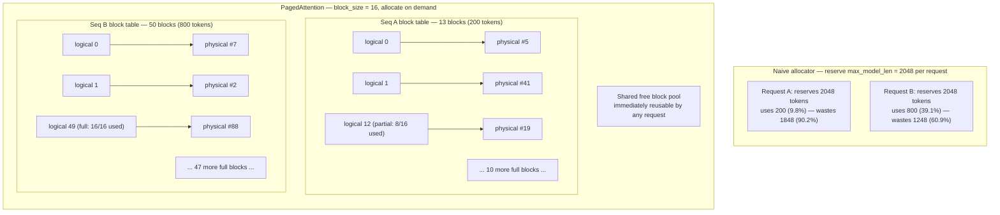
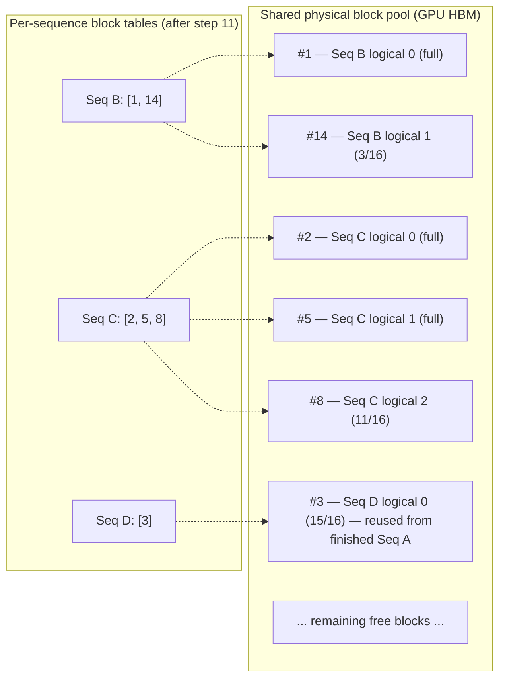

# PagedAttention

## Learning Objectives

By the end of this chapter, you will be able to:

- Explain precisely *why* naive KV cache allocation — reserving a contiguous region sized for the maximum
  possible sequence length — wastes the majority of a GPU's memory before a single extra request arrives
- State the OS virtual-memory analogy for PagedAttention accurately: logical blocks, physical blocks, and a
  per-sequence block table, and map each term to its OS equivalent (virtual pages, page frames, page table)
- Define `block_size` (default 16 tokens), explain what it controls, and reason about the trade-off between a
  smaller and a larger block size
- Walk through, block by block, how two or three concurrent sequences get physical blocks allocated to them
  across several decode steps — including a block being freed and immediately reused by a new request
- Quantify, with concrete numbers, how much internal fragmentation PagedAttention eliminates compared to a
  reserve-the-maximum allocation strategy
- Explain the memory-sharing / copy-on-write mechanism that lets sequences with identical prefixes share
  physical blocks — and why this is the foundation Chapter 11 (Prefix Caching) builds on, not a separate feature
- State the exact citation for the PagedAttention paper and its headline throughput result
- Correctly resolve the single most common point of confusion in the entire vLLM ecosystem: that a "legacy
  attention implementation" being removed from vLLM refers to an old V0-era kernel, **not** to PagedAttention as
  a memory-management design, which remains foundational to the current V1 engine

---

## Prerequisites for This Chapter

This chapter is the direct payoff of **Chapter 6 (KV Cache)**. You should already be comfortable with:

- What the K (key) and V (value) tensors are, why every generated token appends new K/V vectors to a growing
  per-sequence cache, and why that cache — not the model weights — is what makes long-context, high-concurrency
  serving memory-bound (Ch. 6)
- Why KV cache size grows linearly with sequence length and why that growth is the dominant constraint on how
  many requests you can serve concurrently (Ch. 6, Ch. 2)
- The basic prefill/decode split in autoregressive generation (Ch. 1)

This chapter also leans on one piece of background knowledge from outside this course: **OS virtual memory** —
specifically the idea of a page table mapping virtual addresses to physical page frames. If that's rusty, the
analogy is re-derived from scratch in Section 2 below; you don't need to go re-read an OS textbook first, but if
the terms "page table," "page frame," or "demand paging" mean nothing to you, read Section 2 slowly.

This chapter does **not** re-teach what attention is, what a transformer layer is, or what a token is — that's
assumed background per this course's prerequisites.

---

## 1. The Problem: Reserving for the Worst Case

Chapter 6 established that every sequence being generated needs a KV cache — a per-layer, per-head store of key
and value vectors, one pair per token generated so far. The cache grows by one token's worth of K/V on every
decode step. That growth is exactly the problem.

### 1.1 Why naive systems reserve the maximum

The attention kernels used by early, pre-vLLM serving systems (the paper names FasterTransformer and Orca as the
baselines it compares against) expect each sequence's KV cache to live in a single **contiguous** block of GPU
memory — the same assumption you'd make if you were writing the simplest possible implementation yourself: one
tensor per sequence, shaped `[max_seq_len, num_layers, num_kv_heads, head_dim]`.

The catch: at the moment a request arrives, the engine has no idea how long the *output* is going to be. A
request might hit an end-of-sequence token after 5 tokens, or it might run for 2000 tokens before it does. The
model itself decides this, one token at a time, as generation proceeds — there is no way to know in advance. A
system built around contiguous per-sequence allocation has exactly one safe option: **reserve a contiguous
region sized for the longest sequence the system will ever allow** — typically `max_model_len`, the engine's
configured context-length ceiling.

That single design decision — forced by the contiguity requirement, not by anything about attention itself —
is where nearly all of the waste in pre-PagedAttention serving systems comes from.

### 1.2 A concrete illustration

Suppose `max_model_len = 2048` and two requests arrive:

- **Request A** ends up generating a total of 200 tokens (short prompt, short answer — a quick factual
  question).
- **Request B** ends up generating a total of 800 tokens (a longer prompt with a detailed, multi-paragraph
  answer).

A naive, reserve-the-maximum allocator has no choice but to reserve 2048 tokens' worth of contiguous KV cache
space for *each* request, because it can't know in advance that A will stop at 200 or B at 800:

| Request | Reserved (tokens) | Actually used (tokens) | Wasted (tokens) | Wasted (%) |
|---|---|---|---|---|
| A | 2048 | 200 | 1848 | 90.2% |
| B | 2048 | 800 | 1248 | 60.9% |
| **Total** | **4096** | **1000** | **3096** | **75.6%** |

Three-quarters of the GPU memory set aside for these two requests' KV caches sits empty for the entire lifetime
of the request, unusable by anyone else, because it was reserved the moment the request was admitted and can't
be handed back until the request completes. Multiply this by however many concurrent requests your service
needs to support, and it becomes clear why memory — not compute — is the binding constraint on concurrency in
LLM serving. This specific waste pattern is what systems literature calls **internal fragmentation**: memory
that is allocated to a request but never used by it.

> The illustrative numbers above (200/800 tokens out of a 2048 max) are constructed for this chapter to make the
> arithmetic concrete, not measurements quoted from the paper. The point they're illustrating — that
> reserve-the-maximum allocation wastes memory in *proportion to how much shorter the real output is than the
> configured ceiling*, which is usually a lot — is the paper's actual motivation, and generalizes to whatever
> lengths and ceiling you plug in.

There's a second flavor of waste the naive approach also suffers from: **external fragmentation**. Even if you
tried to get clever and reserve a variable-sized region per request based on some estimate, GPU memory
allocated and freed in different-sized contiguous chunks over time leaves behind a checkerboard of
differently-sized holes that often can't be reused for a new, differently-sized request — the classic
"enough total free memory, but no single free chunk big enough" problem familiar from any first-fit/best-fit
memory allocator. PagedAttention's fix addresses both problems with the same idea.

---

## 2. The Core Idea: Borrow From Virtual Memory

The insight that makes vLLM vLLM is not a new attention algorithm, a new kernel fusion trick, or a new
numerical format. It's a **memory management** idea, borrowed almost directly from how every modern operating
system manages RAM for processes: **virtual (paged) memory**.

### 2.1 The OS analogy, precisely

In an operating system:

- A process is given a **virtual address space** that looks contiguous to the process — it can pretend its
  memory is one long, uninterrupted range of addresses.
- Physical RAM is divided into fixed-size **page frames** (commonly 4 KiB on x86).
- A per-process **page table** maps each **virtual page** to whichever **physical page frame** currently holds
  it — and those physical frames can be scattered anywhere in RAM, in any order, not adjacent to each other at
  all.
- The process never sees this scattering. Every memory access goes through the page table, which translates
  "virtual page 7" to "physical frame 214" (or wherever it actually lives) transparently.
- Because physical frames don't need to be contiguous, the OS can allocate a new page to a process from
  *anywhere* in free RAM — no need to find one big contiguous hole. And because pages are fixed-size, waste is
  bounded to at most one partially-used page per process, not an entire over-provisioned reservation.

PagedAttention applies exactly this structure to KV cache:

| OS Virtual Memory | PagedAttention |
|---|---|
| Process | Sequence (a single request being generated) |
| Virtual address space | The sequence's logical KV cache — how the sequence "sees" its own cache |
| Page (fixed size, e.g. 4 KiB) | **Block** (fixed size, `block_size` tokens — default 16) |
| Physical page frame | **Physical block** — a fixed-size slot in the GPU's KV cache memory pool |
| Page table | **Block table** — per-sequence mapping from logical block index → physical block ID |
| Physical RAM | GPU HBM allocated to the KV cache pool |
| Demand paging (allocate a page only when first touched) | Blocks allocated only as the sequence actually generates enough tokens to need one |

A sequence's KV cache is logically split into fixed-size **blocks** — think of a block as "the K/V vectors for
16 consecutive token positions, across all layers and heads, as one fixed-shape tensor." Those blocks do **not**
need to sit next to each other in GPU memory. Each sequence carries a small **block table**: an ordered list
that says, for logical block 0, "the actual data lives in physical block #214"; for logical block 1, "physical
block #7"; and so on. The attention kernel, when it needs to compute attention for a given sequence, consults
that sequence's block table and gathers the relevant physical blocks from wherever they actually live in the
GPU's memory pool.

### 2.2 Why this solves the problem in Section 1

Because blocks are allocated **on demand, one at a time, as a sequence actually grows**, there is no more
reserve-the-maximum decision to make. A sequence that will eventually generate 200 tokens is only ever given
`⌈200/16⌉ = 13` blocks — never 2048/16 = 128 blocks "just in case." A sequence that turns out to need 800 tokens
gets `⌈800/16⌉ = 50` blocks, allocated incrementally as it crosses each 16-token boundary, not all 128 up front.

And because physical blocks scattered anywhere in the memory pool are just as usable as contiguous ones, a
freed block from a finished request can be handed to a brand-new, differently-sized request immediately — no
external fragmentation, because "contiguous" was never a requirement for physical blocks in the first place.

---

## 3. Blocks, Block Tables, and `block_size`

### 3.1 What a block actually is

A **block** is a fixed-size storage unit for `block_size` tokens' worth of K and V vectors, for every layer and
every KV head the model has. If `block_size = 16` (the current vLLM default), one physical block holds the
K/V state for 16 token positions. The GPU's KV cache memory is carved up, once, into a large pool of physical
blocks of this fixed size — call it the **block pool**. That pool is a resource shared across every sequence
the engine is currently serving.

### 3.2 Logical blocks vs. physical blocks

For a given sequence:

- Its **logical blocks** are numbered 0, 1, 2, ... in the order the sequence's tokens were generated — logical
  block 0 covers tokens 0–15, logical block 1 covers tokens 16–31, and so on. This numbering is purely
  conceptual; it's "how the sequence thinks about its own cache," exactly like a virtual address is "how a
  process thinks about its own memory."
- Its **physical blocks** are the actual slots in the shared block pool where that data is stored — arbitrary
  IDs like `#5`, `#41`, `#12`, potentially nowhere near each other in memory, and potentially *reused from a
  different sequence entirely* moments after that other sequence finished.
- The sequence's **block table** is the list that connects the two: `block_table[i]` gives the physical block ID
  holding logical block `i`'s data.

Only the **last** logical block of a sequence is ever partially filled — every earlier block is, by
definition, completely full (that's what triggers moving on to the next block). This is the one place waste can
still occur, and it's bounded: at most `block_size - 1` tokens' worth of unused slots, in the single last block,
per sequence — never anything close to reserving an entire `max_model_len`-sized region.

### 3.3 `block_size`: the trade-off

`block_size` defaults to **16 tokens per block**. It's a real, configurable engine parameter, and choosing it
involves a genuine trade-off in both directions:

- **Too small a block size** (e.g., 1–2 tokens per block) means a sequence's block table has as many entries as
  it has tokens, or close to it. The attention kernel has to gather from many more scattered physical locations
  per step, which increases per-step indexing/bookkeeping overhead and produces smaller, less GPU-friendly
  memory-access patterns (GPUs strongly prefer larger, contiguous reads over many small strided ones). You'd be
  paying a real performance tax to shave fragmentation down further than it needs to be.
- **Too large a block size** (e.g., 128–256 tokens) increases internal fragmentation in exactly the one place
  it still exists: the last, partially-filled block. On average, a sequence wastes about `block_size / 2` tokens
  in that final block — trivial at `block_size=16` (8 tokens on average, against sequences that are commonly
  hundreds to thousands of tokens long), but non-trivial at `block_size=256` (128 tokens on average, and worse
  for lots of short sequences). A large block size also raises the bar for **prefix sharing** (Section 6 below,
  and Chapter 11 in full): two sequences can only share a block if their prefixes match for an entire block's
  worth of tokens, so bigger blocks mean fewer opportunities for two requests' prompts to align on a shared
  block boundary.

`block_size=16` sits in the sweet spot the vLLM authors landed on: large enough for efficient, reasonably
coalesced kernel memory access, small enough that the residual per-sequence waste is close to negligible, and
fine-grained enough to give prefix caching (Ch. 11) a reasonable number of chances to find a shared boundary.
Unless you have a specific, measured reason to change it, treat 16 as the right default rather than a knob to
casually tune — and verify the exact current default and whether it's user-configurable in your installed
version via `vllm serve --help` before relying on a non-default value in production.

### 3.4 A first look at the mapping

Note what changed: total physical blocks actually allocated is `13 + 50 = 63` blocks (1008 token-slots), against
`200 + 800 = 1000` tokens actually used — **8 tokens of waste, 0.8%** — compared to the naive scheme's 3096
tokens (75.6%) wasted. Section 5 works this comparison in full.

---

## 4. Worked Example: Step-by-Step Block Allocation

Let's trace real block allocation across several decode steps for three sequences sharing one block pool, using
the real default `block_size = 16`. Physical block IDs are arbitrary and deliberately non-adjacent, to make the
point that "physical" really does mean "wherever there's a free slot," not "next to the sequence's other
blocks."

**t = 0 (prefill).** Two requests arrive and are admitted.

- **Seq A**, prompt = 18 tokens. Needs `⌈18/16⌉ = 2` blocks. Allocated: physical `#3` (logical 0, full — 16/16)
  and physical `#9` (logical 1, holding the remaining 2 tokens — 2/16). `block_table[A] = [3, 9]`.
- **Seq B**, prompt = 10 tokens. Needs `⌈10/16⌉ = 1` block. Allocated: physical `#1` (logical 0, 10/16 filled).
  `block_table[B] = [1]`.

No new blocks are contiguous with each other — `#3`, `#9`, and `#1` are just whatever the free-block pool handed
out. That's fine; nothing in the design needs them to be adjacent.

**Decode steps 1–6.** Both sequences generate one token per step (this is continuous batching, previewed here
and covered fully in Chapter 8 — multiple sequences are decoded together, one token each, per scheduler step).
After 6 steps:

- **Seq A**: 18 + 6 = 24 tokens. Still fits in 2 blocks (`⌈24/16⌉ = 2`) — block `#9` is now 8/16 full. No new
  block needed.
- **Seq B**: 10 + 6 = 16 tokens. Still exactly 1 block (`⌈16/16⌉ = 1`) — block `#1` is now **exactly full**,
  16/16. The *next* token generated will force a new allocation.

**Decode step 7.** B crosses its block boundary, and a third request arrives.

- **Seq B** generates its 17th token. `⌈17/16⌉ = 2` blocks now required. A new physical block, `#14`, is
  allocated from the free pool. `block_table[B] = [1, 14]`, with `#14` at 1/16.
- **Seq C** arrives with an 40-token prompt. Needs `⌈40/16⌉ = 3` blocks: `#2` (full), `#5` (full), `#8` (8/16).
  `block_table[C] = [2, 5, 8]`.
- **Seq A**: 25 tokens, block `#9` now 9/16. No new block.

**Decode steps 8–10.** All three sequences continue generating.

- **Seq A** reaches its stopping condition (EOS or `max_tokens`) at **28 total tokens** (18 prompt + 10
  generated) during step 10. Both of its blocks, `#3` and `#9`, are **freed back to the shared pool
  immediately** — no waiting for some larger region to become free, because each block is independently
  reusable the instant its owner is done with it.
- **Seq B**: now at 19 tokens (`block_table[B] = [1, 14]`, `#14` at 3/16).
- **Seq C**: now at 43 tokens (`block_table[C] = [2, 5, 8]`, `#8` at 11/16).

**Step 11.** A fourth request arrives.

- **Seq D** arrives with a 15-token prompt. Needs 1 block. The allocator hands it **physical block `#3`** —
  the very block Seq A released one step earlier, now serving a completely unrelated request. `block_table[D]
  = [3]`, 15/16 full.

Three things this walkthrough demonstrates concretely, all direct consequences of the design in Section 2:

1. **A single sequence's own blocks aren't adjacent to each other** — Seq A's two blocks were `#3` and `#9`,
   nowhere near each other, and the kernel didn't care.
2. **Allocation is incremental, triggered only by crossing a block boundary** — Seq B held 1 block from token 1
   through token 16, and only reached for a 2nd block on token 17.
3. **A freed block is immediately available to a completely unrelated new request** — `#3` went from Seq A to
   Seq D in a single step, with no fragmentation, no compaction pass, and no waiting for a "big enough" region.

---

## 5. Quantifying the Waste Reduction

Return to Section 1's two requests — A ending at 200 tokens, B at 800 tokens — with `max_model_len = 2048` and
`block_size = 16`.

**Naive (reserve-the-maximum) allocation:**

| | Reserved | Used | Wasted |
|---|---|---|---|
| Request A | 2048 tokens | 200 tokens | 1848 tokens (90.2%) |
| Request B | 2048 tokens | 800 tokens | 1248 tokens (60.9%) |
| **Total** | **4096 tokens** | **1000 tokens** | **3096 tokens (75.6%)** |

In block terms (still assuming a hypothetical contiguous-reservation scheme sized in `block_size`-sized units
for a fair comparison): reserving `max_model_len` for each request costs `2048/16 = 128` blocks per request,
**256 blocks total**, no matter how the requests actually turn out.

**PagedAttention (allocate on demand):**

| | Blocks allocated | Token-slots | Used | Wasted |
|---|---|---|---|---|
| Request A | `⌈200/16⌉ = 13` | 208 | 200 | 8 tokens (3.8% of its own allocation) |
| Request B | `⌈800/16⌉ = 50` | 800 | 800 | 0 tokens (800 is an exact multiple of 16) |
| **Total** | **63 blocks** | **1008** | **1000** | **8 tokens (0.8%)** |

Two comparisons fall out of this:

- **Waste as a fraction of what's allocated**: 75.6% (naive) vs. 0.8% (paged) — the naive scheme wastes roughly
  **94x** as much, proportionally, as PagedAttention does on this pair of requests.
- **Total blocks needed to serve the same two requests**: 256 blocks (naive) vs. 63 blocks (paged) — paging
  needs only **~25%** of the block budget the naive scheme would reserve. That's memory that's now free to hold
  *other requests'* KV caches instead of sitting idle — directly translating into more concurrent sequences the
  same GPU can serve, which is the entire point (Chapter 8's continuous batching and Chapter 9's scheduler both
  build on exactly this headroom).

Request B's zero waste above is a coincidence of 800 being an exact multiple of 16 — don't read "PagedAttention
wastes 0%" out of it as a general claim. The honest general statement is: **waste is bounded to at most
`block_size - 1` tokens per sequence, confined entirely to that sequence's last block**, regardless of how long
or short the sequence turns out to be. That's a fixed, small, per-sequence cap — a world apart from a waste
amount that scales with the *entire unused gap* between actual length and a global maximum.

---

## 6. Memory Sharing and Copy-on-Write (Preview of Prefix Caching)

The same indirection that makes on-demand allocation possible — a sequence's logical blocks pointing at
physical blocks via a block table, rather than owning a fixed contiguous region — enables a second, independent
benefit: **multiple sequences can point at the very same physical block**.

If two sequences share an identical prefix — the same system prompt, the same few-shot examples, the same
opening paragraph of a shared document — the physical blocks holding that shared prefix's K/V vectors can be
computed **once** and referenced by both sequences' block tables simultaneously, with a reference count tracking
how many sequences currently point at that block. Instead of two sequences each paying the full prefill cost
and full memory cost for identical tokens, the engine can serve both from one shared allocation.

This raises an obvious question: what happens when one of those sequences needs to *write* into a block it's
sharing with another — for instance, the shared prefix's last block is only partially full, and one sequence's
next generated token needs to land in it, while another sequence sharing that same block is going to generate a
*different* next token? The two sequences can no longer agree on what that block contains. The mechanism that
resolves this is **copy-on-write**, the same technique OS's use for `fork()`-shared pages: the moment a write
would diverge a shared block, the engine allocates a **fresh physical block**, copies the shared block's
existing contents into it, decrements the original block's reference count, and lets the diverging sequence
write into its own private copy from then on. Every other sequence still referencing the original, unmodified
block is completely unaffected.

> This chapter introduces the block-table mechanics that make sharing and copy-on-write possible at all — that
> mechanism is the foundation. **Chapter 11 (Prefix Caching)** covers the full feature built on top of it: the
> caching policy that decides which prefixes to keep around, eviction behavior, hash-based block lookup so
> *unrelated* requests that happen to share a prefix (not just multiple generations of the same request) can
> benefit, and the `--enable-prefix-caching` / `--no-enable-prefix-caching` flag (default **on** in V1). Treat
> this section as "why sharing is even possible," and Chapter 11 as "how vLLM turns that possibility into an
> automatic, production feature."

---

## 7. The Paper and Its Headline Result

PagedAttention isn't an internal vLLM implementation detail with no paper trail — it's the subject of a
peer-reviewed systems paper, and citing it precisely is worth doing exactly right:

> Kwon, Woosuk, et al. **"Efficient Memory Management for Large Language Model Serving with PagedAttention."**
> *Proceedings of the 29th ACM Symposium on Operating Systems Principles* (SOSP 2023).

The paper's headline result, benchmarked against the serving systems that predated it (FasterTransformer- and
Orca-style baselines): **2–4x throughput improvement**, driven almost entirely by the memory-efficiency gains
this chapter has walked through — fitting far more concurrent sequences into the same GPU memory footprint,
which increases effective batch size, which is what continuous batching (Chapter 8) actually leverages into
throughput. PagedAttention is a memory-management contribution first; the throughput win downstream is what
memory efficiency *buys* you once a scheduler is willing to spend the freed-up headroom on more concurrent
requests.

SOSP — the ACM Symposium on Operating Systems Principles — is itself a small signal worth noticing: this is not
an ML-conference paper about a modeling trick. It's an *operating systems* paper about memory management,
accepted at the field's top OS systems venue, applying an OS idea to an ML serving problem. The virtual-memory
analogy in Section 2 isn't a teaching device layered on afterward — it's literally how the idea was conceived
and where it was published.

---

## 8. Is PagedAttention Still in vLLM? Resolving the "Legacy Attention" Confusion

This is worth its own section because it is, genuinely, the single easiest thing to get wrong about vLLM if
you're skimming release notes or a changelog rather than reading carefully — and getting it wrong in an
interview or a design review is a bad look given this is supposed to be the concept you know cold.

> **Note:** vLLM went through a major internal re-architecture from an earlier engine generation ("V0") to the
> current one ("V1"); V0 is now fully deprecated and no longer exists in current vLLM. Along the way, a
> **legacy attention implementation was removed from the codebase in a later release**. If you encounter that
> phrasing in a changelog, release note, or blog post, it refers to the **old V0-era standalone attention
> kernel path** being deleted — not to PagedAttention as a memory-management design being removed. **The paging
> design covered in this entire chapter — fixed-size blocks, per-sequence block tables, on-demand allocation,
> block sharing — remains foundational to the current V1 engine.** V1's attention backends (FlashAttention,
> FlashInfer, and others) all still operate on paged, block-structured KV cache; they were rewritten to call
> into the new V1 architecture, not to abandon paging. "A kernel implementation was retired" and "the KV cache
> is no longer organized into blocks" are two entirely different claims, and only the first one is true.

Why this mistake is so easy to make: "PagedAttention" is both the name of the *design* (blocks + block tables +
on-demand allocation — Sections 2–6 of this chapter) and, informally, the name people sometimes use for *a
specific kernel* that implements attention over that block-structured layout. When a specific kernel
implementation gets replaced or removed as the engine evolves — which is normal, expected software evolution,
not a retreat from the underlying idea — a changelog entry like "removed legacy attention implementation" is
talking about the *kernel*, while the *design it implements* (paged, block-structured KV cache) is exactly as
central to V1 as it was to V0. If anything, V1's "zero configs" philosophy (Chapter 1, Chapter 9) leans on
paging *more* directly than V0 did, since prefix caching and chunked prefill — both built on the same block
abstraction — are enabled by default rather than opt-in.

The practical takeaway: when you read a vLLM release note that mentions removing or replacing an attention
kernel, ask "which backend, and does it still consume block-structured KV cache?" rather than "did vLLM abandon
PagedAttention?" The answer to the second question, as of the current V1-only architecture, is no.

---

## Real-World Scenario

You're operating an internal support copilot for a SaaS company. Every single request — regardless of which
customer or which employee is using it — starts with an identical ~900-token system prompt: product policies,
tool definitions for the copilot's function-calling surface, and a few worked examples of well-formed answers.
On top of that shared prefix, each request appends a different user question.

**Without any block sharing**, every one of your, say, 200 concurrent sessions would need its own full KV cache
for that 900-token prefix — the identical prefill computed and stored 200 separate times, `900 × 200 = 180,000`
tokens' worth of redundant KV cache, purely because every session's prompt happens to start the same way. That's
memory (and, without prefix caching, redundant prefill compute) spent re-deriving something that was already
computed for the previous session five seconds earlier.

**With the block-table indirection this chapter covers**, those 900 tokens land on `⌈900/16⌉ = 57` physical
blocks the first time any session computes them. Every subsequent session whose prompt starts with the same 900
tokens can have its block table's first 57 entries point at those *same* physical blocks, with a reference
count tracking how many sessions are currently sharing them — one copy of that prefix's KV cache serving all 200
sessions simultaneously, not 200 separate copies. The moment any individual session's conversation diverges from
the shared prefix (which it always eventually does — that's the whole point of the user's own question sitting
on top of it), copy-on-write kicks in for whichever block first needs to hold divergent content, giving that
session its own private copy from that point forward while every other session sharing the original prefix is
untouched.

This is precisely the situation Chapter 11 (Prefix Caching) turns into an automatic, default-on production
feature (`--enable-prefix-caching`, on by default in V1) — but the reason it's *possible at all* is the block
table and physical-block-sharing mechanism from Sections 2 and 6 of this chapter. Without PagedAttention's
indirection, there would be nothing for a prefix cache to point two sequences' allocations at in the first
place — you'd be back to each sequence owning its own private, contiguous region, full stop.

---

## Best Practices

- **Trust the default `block_size=16` unless you have a measured, specific reason to change it** — it's a
  deliberately chosen balance between kernel efficiency, per-sequence waste, and prefix-sharing granularity
  (Section 3.3), not an arbitrary number to tune first when chasing performance.
- **Reason about capacity in blocks, not just in raw KV-cache bytes**, when thinking through how many concurrent
  sequences your GPU can serve — the block pool size and how many blocks the longest-running requests currently
  hold is the actual constraint the scheduler (Chapter 9) is juggling every step.
- **Don't hand-roll your own KV cache pre-allocation or "worst-case" sizing logic on top of vLLM** — that's
  exactly the naive strategy Section 1 describes, and it's precisely what PagedAttention exists to make
  unnecessary. If you find yourself trying to pre-reserve memory per request, you're fighting the engine's own
  memory manager.
- **When designing prompts for high-concurrency workloads, put shared content (system prompts, tool
  definitions, few-shot examples) first and per-request content last** — this maximizes how many leading blocks
  can be shared across requests via the mechanism in Section 6, which Chapter 11's prefix caching depends on
  directly.
- **Read "legacy attention implementation removed" changelog entries as a kernel-path change, not a paging
  removal** — verify what specifically changed (which backend, which release) against current release notes
  before repeating a claim like "vLLM removed PagedAttention" anywhere, including in an interview answer.
- **When estimating how many concurrent requests fit in a given `gpu_memory_utilization` budget, think in terms
  of blocks-per-sequence, not tokens-per-sequence directly** — round every sequence length up to the next
  multiple of `block_size` first, since that's the actual unit the memory manager allocates in (Chapter 10 goes
  deep on this arithmetic for capacity planning).

---

## Common Mistakes

- **Assuming a "legacy attention implementation removed" changelog entry means PagedAttention itself was
  removed from vLLM.** It doesn't. It refers to an old V0-era kernel path being retired; the paged,
  block-structured KV cache design remains foundational to the current V1 engine and its FlashAttention/
  FlashInfer backends. Section 8's callout exists specifically because this is the most common misreading in
  the whole ecosystem.
- **Believing PagedAttention eliminates fragmentation entirely.** It doesn't eliminate it — it *bounds* it, to
  at most `block_size - 1` tokens, confined to the single last block of each sequence, instead of letting waste
  scale with the gap between actual length and a global maximum. There is still some waste; it's just small,
  fixed, and per-sequence rather than proportional to `max_model_len`.
- **Confusing `block_size` with `max_num_seqs` or `max_model_len`.** `block_size` controls how many tokens fit
  in one physical KV cache allocation unit (default 16). `max_num_seqs` caps how many sequences can be
  scheduled concurrently. `max_model_len` caps how long any single sequence (prompt + generation) may be. All
  three matter for capacity planning; none of them is a substitute for the others.
- **Assuming a larger `block_size` is strictly "more efficient."** It reduces block-table bookkeeping overhead,
  but increases average per-sequence waste in the last block (`~block_size/2` tokens on average) and reduces
  the granularity at which prefix sharing (Section 6, Chapter 11) can kick in. It's a trade-off, not a
  one-directional win.
- **Assuming a sequence's KV cache must be physically contiguous in GPU memory.** The entire point of the
  block-table indirection is that it deliberately isn't — Section 4's worked example shows a single sequence's
  blocks landing on scattered, non-adjacent physical IDs, by design.
- **Treating "block sharing" (this chapter) and "prefix caching" (Chapter 11) as two unrelated features.**
  They're the same mechanism at two different layers: this chapter covers the low-level capability (multiple
  block-table entries can point at one physical block, with copy-on-write on divergence); Chapter 11 covers the
  policy layer built on top of it (hash-based lookup across *unrelated* requests, eviction, the default-on
  `--enable-prefix-caching` behavior). Understanding one without the other leaves a gap in explaining *why*
  prefix caching works at all.

---

## Summary

- Naive KV cache allocation reserves a contiguous region sized for the maximum possible sequence length,
  because pre-vLLM attention kernels required contiguous per-sequence storage and output length is unknowable
  in advance — this wastes the large majority of reserved memory in the common case (Section 1's worked numbers:
  75.6% wasted across two illustrative requests).
- PagedAttention borrows the OS virtual-memory pattern directly: a sequence's KV cache is split into fixed-size
  **blocks**; a per-sequence **block table** maps **logical blocks** to **physical blocks** that can be
  scattered anywhere in the shared GPU memory pool — exactly like a page table mapping virtual pages to
  physical page frames.
- `block_size` defaults to **16 tokens per block** — small enough to keep per-sequence waste low and give
  prefix sharing fine granularity, large enough for GPU-efficient kernel memory access. Too small increases
  bookkeeping/indexing overhead; too large increases average waste in each sequence's last, partially-filled
  block.
- Waste under paging is bounded to at most `block_size - 1` tokens, confined to the last block of each
  sequence — in this chapter's worked comparison, 0.8% wasted under paging vs. 75.6% under naive reservation,
  and 63 physical blocks needed vs. 256 blocks a naive scheme would have to reserve for the same two requests.
- The same block-table indirection that enables on-demand allocation also enables **sharing**: multiple
  sequences with an identical prefix can point their block tables at the same physical blocks, with
  **copy-on-write** allocating a private copy only once a shared block's contents actually need to diverge.
  This is the mechanism Chapter 11's prefix caching builds a full caching policy on top of.
- The foundational paper: **Kwon, Woosuk, et al., "Efficient Memory Management for Large Language Model Serving
  with PagedAttention," SOSP 2023** — headline result, **2–4x throughput improvement** over
  FasterTransformer/Orca-style predecessors, driven by the memory-efficiency gains this chapter covers.
- A "legacy attention implementation removed" release note refers to the retirement of an **old V0-era kernel
  path**, not to PagedAttention as a design being removed — V1's attention backends (FlashAttention, FlashInfer)
  still operate on paged, block-structured KV cache. This is the single easiest fact to get wrong in this
  course; Section 8 exists to make sure you don't.

---

## Knowledge Check

1. Walk through, in your own words, exactly why pre-vLLM serving systems were forced to reserve a contiguous KV
   cache region sized for the maximum possible sequence length, rather than allocating exactly as much as each
   request turns out to need. What specific requirement of their attention kernels forced this?
2. Map each of the following OS virtual-memory terms to its PagedAttention equivalent, and explain the mapping
   in one sentence each: virtual page, physical page frame, page table.
3. `block_size` defaults to 16 tokens. Explain the cost of setting it much smaller (e.g., 2) and the cost of
   setting it much larger (e.g., 256) — what specifically gets worse in each direction?
4. Given three sequences with final lengths of 50, 130, and 257 tokens and `block_size = 16`, compute how many
   physical blocks each one needs, and how much token-slot waste occurs in each sequence's last block.
5. Explain, precisely, how two sequences sharing an identical prefix can share physical KV cache blocks, and
   what triggers a copy-on-write between them. Why can't they simply keep sharing a block forever once their
   generated content starts to differ?
6. A colleague says, "I read in the vLLM changelog that a legacy attention implementation was removed — so
   PagedAttention is gone in the current version, right?" Correct them precisely: what was actually removed,
   and what evidence would you point to that the paging design is still central to V1?

---

## Hands-On Exercise

**Part 1 — compute blocks needed, with and without paging.**

Four requests are submitted to an engine configured with `max_model_len = 4096` and `block_size = 16`. Their
final (prompt + generated) lengths turn out to be:

| Request | Final length (tokens) |
|---|---|
| W | 75 |
| X | 512 |
| Y | 1400 |
| Z | 3800 |

For each request, compute:

1. The number of physical blocks a **paged** allocator needs (`⌈length / 16⌉`), the resulting token-slot
   capacity, and the wasted tokens in the last block.
2. The number of blocks a **naive, reserve-the-maximum** allocator would need per request (`max_model_len /
   block_size`, applied identically regardless of actual length), and the resulting wasted tokens.

Then compute, across all four requests combined:

3. Total blocks needed under paging vs. total blocks a naive scheme would reserve.
4. The overall waste percentage under each scheme (`wasted tokens / allocated token-slots`).
5. What percentage of the naive scheme's block budget does the paged scheme actually need? (This is the
   number you'd quote to justify how much more concurrency the same GPU memory buys you.)

**Part 2 — trace an allocation sequence.**

Using the step-by-step style of Section 4, trace what happens to the block tables of two sequences, **P** and
**Q**, given `block_size = 16`:

- Seq P arrives first with a 20-token prompt, then generates 30 tokens before hitting EOS.
- Seq Q arrives 3 decode steps after P, with a 12-token prompt, then generates 100 tokens before hitting EOS.

For each sequence, identify: (a) how many blocks it holds immediately after prefill, (b) at exactly which
generated-token count each new block gets allocated, (c) how many blocks it holds at the moment it finishes, and
(d) whether any of P's freed blocks could plausibly be reused by Q, given the arrival order above (reason about
timing, not just block counts).

**Part 3 (bonus) — prefix sharing arithmetic.**

Ten concurrent sessions all share an identical 340-token system prompt on top of otherwise-unrelated user
questions, with `block_size = 16`. Compute: (a) how many blocks the shared prefix occupies, (b) how many of
those blocks can be shared read-only across all ten sessions before any session's content diverges, and (c) how
much total KV-cache-block memory (in blocks) sharing saves compared to each session computing and storing its
own private copy of the prefix.

---

## Further Reading

- **The paper**: Kwon, Woosuk, et al. *"Efficient Memory Management for Large Language Model Serving with
  PagedAttention."* Proceedings of the 29th ACM Symposium on Operating Systems Principles (SOSP 2023) — the
  primary source for everything in Sections 2, 6, and 7. Read it directly for the original benchmark
  methodology behind the 2–4x throughput figure.
- `docs.vllm.ai` — the current design documentation for the KV cache manager and attention backends; check
  which vLLM version a given page describes, since internals documentation tracks `main` and evolves with every
  release.
- `github.com/vllm-project/vllm/releases` — check here before repeating any claim about what was or wasn't
  removed from a given release, including the "legacy attention implementation" removal discussed in Section 8.
- Related chapter in this course: **[Chapter 6 — KV Cache](./06-kv-cache.md)** — the memory-growth problem this
  entire chapter exists to solve.
- Related chapter in this course: **[Chapter 8 — Continuous Batching](./08-continuous-batching.md)** — how the
  memory headroom PagedAttention frees up gets converted into actual throughput via iteration-level scheduling.
- Related chapter in this course: **[Chapter 9 — The vLLM Scheduler](./09-vllm-scheduler.md)** — how the
  `KVCacheManager` component that allocates and frees blocks fits into the engine's per-step scheduling loop.
- Related chapter in this course: **[Chapter 10 — Memory Management](./10-memory-management.md)** — turning
  this chapter's block arithmetic into practical `gpu_memory_utilization`/`max_num_seqs` capacity planning and
  OOM diagnosis.
- Related chapter in this course: **[Chapter 11 — Prefix Caching](./11-prefix-caching.md)** — the full,
  default-on production feature built on top of Section 6's block-sharing and copy-on-write mechanism.

---

  <a href="./06-kv-cache.md">← Previous: KV Cache</a>
  <a href="./00-index.md">🏠 Index</a>
  <a href="./08-continuous-batching.md">Next: Continuous Batching →</a>

