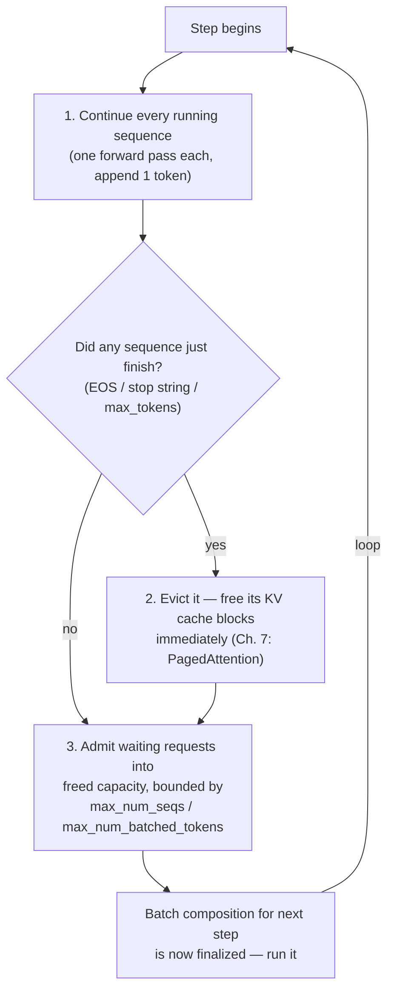

# Continuous Batching

## Learning Objectives

By the end of this chapter, you will be able to:

- Explain precisely why **static batching** — the naive "collect N requests, run them together, wait for all of
  them to finish" approach — is a poor fit for LLM inference specifically, in terms of wasted GPU slot-steps, not
  just "it's slow"
- Describe **dynamic batching** (batching-by-arrival-window) as a partial improvement over static batching, and
  state exactly which part of the underlying problem it does *not* solve
- Define **continuous batching** (a.k.a. **iteration-level scheduling**) precisely: admission and eviction happen
  at every decode step, not at "batch boundaries" — and trace a concrete timeline of overlapping requests through
  it
- Explain, using slot-step accounting, why continuous batching improves aggregate throughput so dramatically
  relative to static batching
- Articulate the **latency/throughput trade-off** continuous batching introduces — more concurrent sequences means
  higher aggregate throughput but more per-step compute contention, connecting back to Chapter 1's TTFT/TPOT
  framing
- Explain **why continuous batching depends on PagedAttention** — cheap, non-contiguous KV cache
  allocation/deallocation is the mechanical precondition that makes per-step admission and eviction affordable
- Describe, at a bridging level of detail, what a scheduler actually has to decide at every step — enough to set
  up Chapter 9's full treatment, without duplicating it

---

## Prerequisites for This Chapter

This chapter builds directly on:

- **Chapter 1 (LLM Inference Fundamentals)** — you should already be comfortable with the prefill/decode split and
  the throughput-vs-latency framing (TTFT, TPOT/ITL). This chapter is where that trade-off stops being abstract
  and becomes a concrete scheduling decision.
- **Chapter 6 (KV Cache)** — you should know that every sequence carries a per-token KV cache that grows with
  generated length, and that this cache is what actually occupies GPU memory during decoding, not just the model
  weights.
- **Chapter 7 (PagedAttention)** — you should know that vLLM's KV cache is managed as fixed-size, non-contiguous
  **blocks** (default 16 tokens each) rather than one contiguous per-sequence allocation, and that this is the
  mechanism that eliminates the internal/external fragmentation a naive KV cache allocator suffers from. This
  chapter does not re-derive PagedAttention — it explains why continuous batching *needs* it.

This chapter does **not** cover the scheduler's internal admission algorithm, priority/fairness policies, or the
exact token-budget arithmetic — that's Chapter 9's job in full. This chapter's job is narrower: understand *why*
per-step batch-composition changes are the right idea before looking at *how* vLLM's scheduler implements it.

---

## 1. The Problem: Requests Don't Finish at the Same Time

Every batching strategy for neural network inference has to answer one question: **when multiple requests share a
GPU, how do you group them so the hardware stays busy?**

For a vision model — say, a ResNet doing image classification — this question has a clean answer. Every input
image takes essentially the same amount of compute to produce an output: one forward pass, done. If you collect 32
images into a batch and run them through the network together, all 32 finish at (almost) the same instant, because
the amount of work per input is fixed and known in advance.

LLM text generation breaks this assumption completely. A single forward pass produces exactly one new token. To
produce a complete response, the model runs one forward pass *per output token*, autoregressively, until it hits an
EOS token, a stop string, or `max_tokens`. Two requests sent to the model at the same instant can have wildly
different output lengths — a one-word classification answer versus a 2,000-token chain-of-thought explanation —
and there is **no way to know in advance** exactly how many decode steps a given request will need. This single
fact is the reason LLM batch scheduling is a fundamentally different, harder problem than batching for
fixed-compute models, and it's the reason this entire chapter exists.

---

## 2. Static Batching — The Naive Approach

**Static batching** is the intuitive, "obviously correct" first idea, and it's exactly what off-the-shelf batched
inference servers (built for models with fixed per-input compute) do by default:

1. Collect up to *N* requests (a fixed batch size).
2. Run them together as one batch, stepping the model forward repeatedly.
3. **Wait for every single request in the batch to finish** before returning any results and starting the next
   batch.

The batch is a single unit that lives or dies together. That's fine for a ResNet. For an LLM, it's disastrous,
because of the output-length variance described in Section 1.

### 2.1 Why it's specifically bad for LLMs

Picture four requests — A, B, C, D — that all happen to be sitting in a static batch of size 4 when it starts:

| Request | Output length needed |
|---|---|
| A | 4 tokens |
| B | 12 tokens |
| C | 6 tokens |
| D | 3 tokens |

The batch runs as a unit for as long as its **longest** member needs — 12 steps, driven by B. What happens to A, C,
and D once they've produced their final token?

- Their *useful* work is done at steps 4, 6, and 3 respectively.
- But the batch, as a data structure, doesn't shrink. In a naive padded-batch implementation, the framework
  continues stepping the model forward for the full 12 iterations, and A/C/D's rows in that batch matrix are still
  occupying GPU compute and memory — either producing masked/padding output that's discarded, or simply sitting
  idle while the matrix multiply still processes their row shape. Either way: **the GPU spends 8 extra steps
  "processing" a request that has nothing useful left to say**, purely because a different request in the same
  batch hasn't finished yet.
- Worse: **no new request can join.** Even if request E arrives at step 1 and could easily use one of A's, C's, or
  D's slots the moment they finish, static batching has no mechanism to insert it mid-batch. E queues until the
  *entire* batch of 4 drains at step 12, then waits for a whole new batch to be assembled around it.

This is the core failure mode to internalize: **static batching wastes GPU cycles on requests that have already
finished (they occupy a slot producing nothing) and simultaneously starves newly-arrived requests of capacity that
is, in reality, sitting idle.** Both problems stem from the same root cause — output-length variance is unknown in
advance, and static batching commits to a fixed group of requests for the group's *entire* lifetime.

### 2.2 The compounding effect at scale

This isn't a minor inefficiency that averages out. Under real traffic, output-length distributions are typically
long-tailed — lots of short completions (classification, short chat turns, autocomplete) mixed with occasional very
long ones (long-form generation, reasoning traces, code generation). In a static-batch world, **a single long
straggler in a batch drags every other member of that batch down to its pace**, and this happens on every batch,
repeatedly, for the life of the service. The bigger the batch size and the more skewed the length distribution, the
worse the waste — which is precisely the opposite of what you want, since bigger batches are supposed to be how you
buy more throughput on a GPU.

---

## 3. Dynamic Batching — A Partial Improvement, Not a Fix

Some inference frameworks improve on pure static batching with **dynamic batching**: instead of waiting for exactly
*N* requests to accumulate before starting, the server collects whatever requests arrive within a short **time
window** (e.g., "wait up to 20ms, or until 8 requests have arrived, whichever comes first") and then runs *that*
group together as one batch.

This helps with one specific problem: it reduces the time a request spends waiting *before a batch even starts*,
compared to a static batcher that might sit idle waiting for a batch to fill up during a quiet traffic period.
Dynamic batching is a genuinely useful technique for models with fixed per-input compute (it's common in
vision/embedding serving stacks), because once the batch window closes, every member really does finish at the same
time.

**For LLMs, dynamic batching solves the wrong half of the problem.** It improves *when a batch starts*; it does
nothing about *what happens once the batch is running*. Once that windowed group of requests begins decoding
together, it is still a static batch in every way that matters here: it still runs until its slowest member
finishes, it still can't evict a member early, and it still can't admit a newly-arrived request mid-flight. The
straggler problem from Section 2 is completely untouched. Dynamic batching is worth knowing about as an
intermediate step in the design space — and as a thing you'll see named in other serving frameworks' documentation
— but it is not what vLLM does, and it does not close the throughput gap this chapter is building toward.

---

## 4. Continuous Batching (a.k.a. Iteration-Level Scheduling)

**Continuous batching** — the vLLM/Orca-lineage idea, and the term used in vLLM's own engineering materials (see
the "Anatomy of vLLM" blog series in Further Reading) — reframes the unit of scheduling entirely. Instead of
scheduling at the *batch* level, it schedules at the **iteration (decode step) level**:

> At every single decode step, the scheduler re-decides the composition of the running batch: it evicts any
> sequence that just produced its final token, and it admits any newly-arrived (or previously-queued) request into
> the resulting free capacity — all before the *next* step runs.

This is also called **iteration-level scheduling**, and that name is arguably the more precise one: the granularity
of scheduling decisions is one model forward pass (one iteration), not one "batch" in the static-batching sense.
There is no such thing as "the batch" as a fixed, long-lived group anymore — there is only "the set of sequences
being processed *this step*," which is free to be a completely different set of sequences than "the set of
sequences being processed *last step*."

Mechanically, at each step the scheduler does three things:

1. **Continue** every sequence still in progress — run one more forward pass for each, appending one new token to
   each sequence's KV cache.
2. **Evict** any sequence that just hit EOS, a stop condition, or `max_tokens` — free its resources immediately,
   the instant it's done, not when some enclosing batch happens to close.
3. **Admit** as many waiting requests as current capacity allows, filling exactly the slots eviction just freed (or
   slots that were never full to begin with).

Every one of these three decisions happens **every step**, not every "batch." The batch, as a runtime concept, is
recomputed from scratch on every iteration.



This is why the term "continuous" is apt: from the GPU's point of view, there is a continuous stream of decode
steps, each with its own batch composition, rather than discrete batch-shaped pulses of work separated by
drain-and-refill boundaries.

---

## 5. Worked Timeline: Requests A, B, C, D

Let's make Section 2's example concrete by adding **arrival times**, and walking the same four requests through
both scheduling strategies. Assume the GPU has capacity for **4 concurrent sequences** in both cases — the point of
this comparison is the *scheduling policy*, not a difference in hardware capacity.

| Request | Arrives at step | Tokens needed | Finishes at step (if never made to wait) |
|---|---|---|---|
| A | 0 | 4 | 3 |
| B | 0 | 12 | 11 |
| C | 2 | 6 | 7 |
| D | 5 | 3 | 7 |

### 5.1 Under static batching

A static batcher starts a batch the moment requests are available and does not touch it again until every member
finishes. At step 0, only A and B have arrived, so Batch 1 = {A, B}. C and D arrive later (steps 2 and 5) but
**cannot join Batch 1 in progress** — they queue.

| Step range | Running batch | What's actually happening |
|---|---|---|
| 0–3 | {A, B} | A and B both doing useful work |
| 4–11 | {A, B} | **B alone does useful work; A's slot is occupied but produces nothing** — A finished at step 3 but the batch can't shrink |
| 0–11 (whole time) | — | C (arrived step 2) and D (arrived step 5) sit **queued**, even though 2 of the batch's 4 capacity slots have been doing nothing useful since step 4 |
| 12 | Batch 1 fully drains; Batch 2 = {C, D} starts | |
| 12–17 | {C, D} | C and D both doing useful work initially |
| 15–17 | {C, D} | **D's slot idles from step 14 onward** (D only needed 3 steps, finishing at step 14 within Batch 2, but Batch 2 can't close until C finishes at step 17) |

**Total wall-clock time to complete all four requests: 18 steps (0–17).** D — a 3-token request — doesn't get its
answer until step 17, purely because of which batch it happened to queue into, despite never once actually
requiring more than 3 steps of GPU time.

### 5.2 Under continuous batching

The scheduler admits and evicts every step. Since capacity is 4 and only 4 requests exist total, nothing ever needs
to queue here — every request is admitted the instant it arrives.

| Step | Active set | Event |
|---|---|---|
| 0 | A, B | A and B start |
| 1 | A, B | |
| 2 | A, B, C | **C admitted the instant it arrives** — a free slot exists |
| 3 | A, B, C | |
| 3→4 | — | **A evicted** — finished its 4th token, KV cache freed immediately |
| 4 | B, C | |
| 5 | B, C, D | **D admitted the instant it arrives** |
| 6 | B, C, D | |
| 7 | B, C, D | |
| 7→8 | — | **C and D both evicted** — C finished its 6th token, D finished its 3rd |
| 8–11 | B | B runs alone to completion |
| 11→12 | — | **B evicted** — finished its 12th token |

**Total wall-clock time to complete all four requests: 12 steps (0–11).** D finishes at step 7 — not step 17 —
because it was admitted the moment it arrived and never occupied a slot it wasn't using. Every request's actual
finish time depends only on its own arrival time plus its own output length, not on which arbitrary cohort of other
requests it happened to be grouped with.

```mermaid
gantt
    dateFormat X
    axisFormat %L
    title Static Batching — must wait for the slowest member of each fixed batch
    section Batch 1 (starts step 0)
    A — 4 useful tokens, then 8 steps occupying an idle/wasted slot : 0, 12
    B — 12 tokens, the straggler that blocks the whole batch        : 0, 12
    section Batch 2 (cannot start until Batch 1 fully drains at step 12)
    C — queued steps 2-12, then 6 useful tokens                     : 12, 6
    D — queued steps 5-12, then 3 useful tokens, then idles 3 steps : 12, 6
```

```mermaid
gantt
    dateFormat X
    axisFormat %L
    title Continuous Batching — batch composition changes every decode step
    section Iteration-level scheduling
    A — arrives step 0, admitted immediately, evicted after 4 tokens  : 0, 4
    B — arrives step 0, runs uninterrupted for all 12 tokens          : 0, 12
    C — arrives step 2, admitted immediately, evicted after 6 tokens  : 2, 6
    D — arrives step 5, admitted immediately, evicted after 3 tokens  : 5, 3
```





Notice what the two Gantt charts show side by side: in the static chart, A's and D's bars extend well past the
point where they actually stopped producing useful output — that overhang *is* the wasted GPU capacity. In the
continuous chart, every bar ends exactly when the request's real work ends, and new bars (C, D) start exactly when
they arrive, regardless of what any other request is doing.

---

## 6. Why Throughput Improves So Dramatically

Add up the "useful GPU work" in the example above: A needs 4 token-steps, B needs 12, C needs 6, D needs 3 — **25
token-steps of genuinely useful work, total, no matter which scheduling strategy you use.** The question is how
much *extra*, non-useful GPU time each strategy spends getting that same 25 token-steps of work done.

| Metric | Static batching | Continuous batching |
|---|---|---|
| Wall-clock steps to finish all 4 requests | 18 | 12 |
| Slot-steps actually occupied (running or held-idle-in-batch) | 2×12 + 2×6 = 36 | 2+2+3+3+2+3+3+3+1+1+1+1 = 25 |
| Useful token-steps produced | 25 | 25 |
| Wasted slot-steps | 11 (≈31%) | 0 |

In this example, continuous batching finishes **33% sooner in wall-clock time** and with **zero wasted slot-steps**
— every single unit of GPU capacity consumed corresponds to a real output token being produced. That's not a
rounding-error optimization; it's the difference between a GPU that's constantly doing useful work and one that
spends a third of its time babysitting finished requests and idle queues.

Generalize this beyond four toy requests: at production scale, with hundreds of concurrent requests and a
long-tailed output-length distribution, static batching's waste compounds across every batch cycle, continuously.
Continuous batching's core promise is that **the GPU is essentially never idle waiting for "the batch" to finish**
— the instant any sequence's slot frees up, the scheduler backfills it from the queue on the very next step. This
is the single biggest reason vLLM (and Orca before it) can push dramatically higher throughput on the same hardware
than a static-batch server running the same model.

---

## 7. The Latency/Throughput Trade-off This Introduces

Continuous batching doesn't make concurrency free — it makes concurrency **efficient**, which is a different claim.
Recall Chapter 1's framing: **throughput** (tokens/sec across all requests) and **latency** (time to first token,
time per output token, for *one* request) are in tension, not aligned. Continuous batching sits squarely inside
that tension:

- **More concurrent sequences packed onto the GPU → higher aggregate throughput**, because more of the GPU's
  parallelism is being used for useful work per step (this is also related to why larger effective batch sizes
  push you further into compute-bound territory rather than memory-bandwidth-bound territory — Chapter 2's
  compute-vs-memory-bound distinction).
- **More concurrent sequences packed onto the GPU → more contention for the same fixed compute budget every step**,
  which means each individual sequence's per-step time (its TPOT/ITL, in Chapter 1's terms) tends to increase as
  concurrency rises. A single request running alone on a GPU gets the fastest possible per-token latency that
  hardware can deliver; the same request running alongside 50 others is sharing that step's compute with 50 other
  sequences, so its *own* tokens arrive more slowly, even though the *system's* aggregate output is far higher.

This is why "just cram as many sequences onto the GPU as will physically fit" is not automatically the right
answer for every deployment. A batch/chat-completion API serving many users where nobody notices an extra 20ms
between tokens can push concurrency hard for throughput. A latency-sensitive interactive product (e.g., a live
voice agent, or an IDE autocomplete feature where perceived responsiveness *is* the product) may deliberately cap
concurrency lower, trading some aggregate throughput for a tighter, more predictable per-request latency curve.
`max_num_seqs` and `max_num_batched_tokens` (Section 9, and Chapter 9/10 in full) are exactly the levers that let
you choose where you sit on this curve — they are not "batch size" in the static-batching sense; they're
**concurrency ceilings** that shape this trade-off.

There's a second, sharper latency cost worth naming here: **preemption**. If the running set of sequences grows to
the point where the KV cache manager (Chapter 7) can't find enough free blocks for a step, the V1 engine has to
**preempt** — evict a running sequence entirely under memory pressure, before it's actually finished. Unlike the
older V0 engine (which could swap a preempted sequence's KV cache out to CPU memory and swap it back in later), the
current V1 engine has **no GPU↔CPU KV swap path for preemption** — a preempted sequence's KV cache is dropped, and
when the sequence is rescheduled, its prefill has to be **recomputed from scratch**. That recompute cost is a real,
sometimes-invisible tail-latency risk that shows up specifically under high-concurrency, memory-constrained
configurations — it's part of why the concurrency ceiling you choose interacts with memory management (Chapter 10)
and not just with raw scheduler policy.

---

## 8. Why This Depends on PagedAttention

Continuous batching sounds simple stated as "add and remove sequences from the batch every step" — but that phrase
hides a hard requirement: **adding and removing a sequence from the running batch has to be cheap**, every single
step, for hundreds of concurrent sequences, without stalling the GPU. Whether that's true or not is entirely a
question of how the KV cache is allocated — which is Chapter 7's subject, and the reason these two chapters are
sequenced back to back.

Think about what "admit a new sequence" actually requires: the engine needs to give that sequence's KV cache
somewhere to live in GPU memory, sized for however many tokens it will eventually generate — a number that, per
Section 1, **isn't known in advance**. If KV cache were allocated the naive way — one contiguous block of memory
per sequence, sized for the worst case (`max_model_len`) — then:

- Admitting a sequence means finding a large contiguous free region, which gets harder and harder to do cheaply as
  memory fragments (the same internal/external fragmentation problem Chapter 7 covers in depth).
- Evicting a sequence means freeing a large contiguous region and hoping it can be reused efficiently later, rather
  than becoming yet another oddly-sized fragment.
- Doing this *every single decode step*, for every sequence entering or leaving the batch, would make the
  bookkeeping cost of continuous batching itself a bottleneck — defeating the purpose.

**PagedAttention's block-based KV cache (fixed-size blocks, default 16 tokens, allocated non-contiguously, tracked
by the `KVCacheManager`) is precisely what makes admission and eviction cheap.** Admitting a sequence means
grabbing however many free 16-token blocks it currently needs from a free list — a fast, fixed-cost operation, not
a search for a large contiguous region. Evicting a sequence means returning its blocks to that free list
immediately, where they're instantly available to the very next sequence that needs them, regardless of that new
sequence's own eventual length. There's no fragmentation penalty for the "different sequences enter and leave
constantly" access pattern, because blocks were never assumed to belong to one long-lived, fixed-size allocation in
the first place.

Put directly: **continuous batching is the scheduling policy; PagedAttention is the memory-management mechanism
that makes that policy affordable.** You could theoretically describe iteration-level scheduling as a scheduling
idea independent of any particular memory layout — and indeed, Orca (the paper that originated iteration-level
scheduling, pre-dating vLLM) achieved it without PagedAttention specifically. But vLLM's version of continuous
batching, running at the concurrency levels and memory efficiency it's known for, is only practical *because* block-
based KV cache allocation exists underneath it. Teaching these as two separate, unrelated 80/20 topics would miss
the point — they are a matched pair: one is the "what" (change the batch every step), the other is the "how"
(make changing it every step cheap).

---

## 9. A First Look at Request Scheduling (Bridge to Chapter 9)

Everything above describes the *idea* of continuous batching. It leaves an obvious question unanswered: when
capacity is limited and more requests want in than can fit, **which** requests get admitted first, and how much
capacity does the engine dare to hand out before running into the preemption/recompute cost from Section 7? That
full algorithm — admission ordering, fairness, the unified per-step token budget — is Chapter 9's entire subject.
Here's just enough to orient you before that chapter goes deep:

- V1's scheduler is a **unified scheduler**: it treats prompt (prefill) tokens and generated (decode) tokens
  through the **same dynamic per-step token budget**, rather than V0's older approach of separate prefill-phase and
  decode-phase scheduling logic running side by side. One scheduling loop, one budget, every step.
- Two engine arguments bound what the scheduler is allowed to admit: **`--max-num-seqs`** (a ceiling on how many
  sequences may be running concurrently) and **`--max-num-batched-tokens`** (a ceiling on the total number of
  tokens — prompt and generation combined — processed in a single step). Both are real, current, exposed engine
  args; both are concurrency/throughput levers, not "batch size" in any static-batching sense.
- The scheduler calls into the **`KVCacheManager`** (Section 8's block allocator) on every admission/eviction
  decision — scheduling and memory management are not separate subsystems bolted together; the scheduler literally
  cannot admit a sequence the KV cache manager can't find blocks for.

That's the minimum needed to make sense of `max_num_seqs`/`max_num_batched_tokens` when they show up in this
chapter's exercises. Chapter 9 covers the actual decision algorithm — including what happens when demand exceeds
either ceiling — in full.

---

## Real-World Scenario

A team runs a combined coding-assistant product on one model deployment: short inline autocomplete suggestions
(often 5–15 output tokens) and long-form "explain/refactor this function" requests (often 500–2,000+ output
tokens), hitting the same backend. Their first deployment used an off-the-shelf batched inference server originally
built for a fixed-length classification model, configured with a static batch size of 8 and a short batching
window.

In production, the symptom was consistent and confusing at first: **autocomplete latency was wildly inconsistent**
— sometimes near-instant, sometimes multiple seconds — even though autocomplete requests were individually tiny.
Once they instrumented it, the cause was exactly Section 2's failure mode: any time a long "explain this function"
request landed in the same batch window as several autocomplete requests, every one of those autocomplete requests
had to wait for the long request to fully finish before the batch returned *any* results, because the server
returned the whole batch as a unit. A 15-token autocomplete suggestion was, from the user's point of view, held
hostage by an unrelated 1,500-token request that happened to share its batch slot.

Migrating the backend to vLLM changed nothing about the API surface the product team had to reason about — same
prompts, same model — but changed everything about how the underlying batch was managed. With continuous batching,
the short autocomplete request finishes and returns the moment *it's* done, regardless of what else is running
alongside it; the long "explain this function" request keeps occupying its own slot for as long as it actually
needs, without blocking anyone else's slot from being freed and reused. Aggregate throughput went up (more of the
GPU's step-by-step capacity was doing useful work, per Section 6), and — just as important for this specific
product — the *tail latency* of the short-request class stopped being coupled to the length of whatever unrelated
long request happened to be running concurrently.

---

## Best Practices

- **Stop thinking in terms of "batch size" the way you would for a vision or embedding model.** `max_num_seqs` is a
  concurrency *ceiling* the scheduler operates under every step, not a fixed group size that starts and finishes
  together. Size it based on your actual request-length distribution and available KV cache memory (Chapter 10),
  not a number copied from a different kind of serving stack.
- **Treat throughput and latency as a curve you're choosing a point on, not two numbers to both maximize.** Higher
  concurrency (`max_num_seqs`, `max_num_batched_tokens`) buys aggregate throughput at the cost of per-request TPOT
  under contention (Section 7). Decide, deliberately, which side of that curve your product needs, and benchmark
  it (Chapter 17/18) rather than guessing.
- **Remember that a request's finish time depends on when it arrived and how long it needs — not on which other
  requests happened to be running alongside it.** If you find yourself explaining a latency anomaly by pointing at
  "what else was in the batch," that's a sign you're reasoning about the system with static-batching intuitions.
- **Budget for preemption/recompute cost, not just steady-state throughput.** Under sustained high concurrency and
  tight memory headroom, V1's recompute-based preemption (Section 7) can produce latency spikes for the specific
  sequences that get preempted — this is a real operational tail-risk, not just a theoretical footnote.
- **Keep the mental model tied together: continuous batching (policy) + PagedAttention (mechanism) are one
  system.** When diagnosing throughput or memory issues, don't reach for scheduler tuning alone or memory tuning
  alone — Chapter 9 and Chapter 10 will keep returning to this same coupling.

---

## Common Mistakes

- **Tuning `max_num_seqs` like a fixed vision-model `batch_size`.** Setting it once from a rule of thumb (or a
  number that "felt right" for a completely different kind of model) and never revisiting it ignores that the
  right value depends on your workload's output-length distribution, not a static property of the model.
- **Assuming vLLM requests that arrive together will finish together.** There is no lockstep batch semantics in
  vLLM's decode loop — two requests submitted in the same HTTP burst can finish seconds apart, and that's the
  system working correctly, not a bug.
- **Believing "more concurrency is strictly better."** Cranking `max_num_seqs`/`max_num_batched_tokens` as high as
  memory allows, without checking what that does to per-request latency (Section 7), optimizes only half of the
  trade-off this chapter describes.
- **Assuming a sequence that started running is guaranteed to run to completion uninterrupted.** Under memory
  pressure, V1 can preempt an already-running sequence and recompute its prefill later (no CPU-swap path exists in
  V1) — a real cost that shows up as a latency outlier for the unlucky sequence, not a throughput number.
- **Reasoning about continuous batching without connecting it to PagedAttention.** Iteration-level admission and
  eviction only stay cheap because the KV cache is block-based and non-contiguous (Chapter 7). Treating "continuous
  batching" as a purely scheduler-side feature, independent of KV cache layout, misses why it works at all.
- **Citing V0-era scheduler behavior (separate prefill/decode-phase scheduling) as if it's current.** V1's unified
  scheduler handles prompt and generation tokens through one dynamic per-step token budget (Section 9) — older
  blog posts or tutorials describing V0's split scheduling logic are describing a deprecated engine generation.

---

## Summary

- **Static batching** groups a fixed set of requests and runs them together until *all* finish — for LLMs, this
  means every request in the group is bottlenecked by whichever one has the longest output, wasting GPU capacity on
  finished requests that occupy a slot producing nothing, and blocking new arrivals from joining mid-batch.
- **Dynamic batching** shortens the wait *before* a batch starts by grouping arrivals within a time window, but
  once that batch begins running, it behaves exactly like a static batch — the straggler problem is untouched.
- **Continuous batching (iteration-level scheduling)** re-decides the running batch's composition at *every decode
  step*: finished sequences are evicted immediately, freeing capacity that newly-arrived or queued requests fill on
  the very next step. There is no fixed "batch" as a long-lived unit — only "what's running this step."
- The worked timeline (Section 5) showed the same four requests finishing in 18 steps under static batching versus
  12 steps under continuous batching, with zero wasted slot-steps in the continuous case versus roughly 31% waste
  under static batching.
- Higher concurrency under continuous batching buys **aggregate throughput** but increases **per-step contention**,
  which raises per-request TPOT/ITL — this is Chapter 1's throughput/latency trade-off made concrete, tunable via
  `max_num_seqs`/`max_num_batched_tokens`.
- Continuous batching's cheap per-step admission/eviction is only possible because **PagedAttention** (Chapter 7)
  allocates KV cache in fixed-size, non-contiguous blocks — the scheduling policy and the memory-management
  mechanism are a matched pair, not two independent 80/20 topics.
- The scheduler's exact admission algorithm, fairness/priority behavior, and unified token-budget arithmetic are
  Chapter 9's full subject; this chapter established the *why* that Chapter 9's *how* builds on.

---

## Knowledge Check

1. Four requests share a static batch: their required output lengths are 3, 20, 5, and 2 tokens. How many total
   "wasted" slot-steps does the batch accumulate (assume all four start together), and which request is
   responsible for the batch's total wall-clock duration?
2. Why doesn't dynamic batching (arrival-window batching) solve the straggler problem that static batching has,
   even though it reduces time-to-batch-start?
3. In your own words, what does "iteration-level scheduling" mean, and what specifically changes at every decode
   step under continuous batching that does *not* change under static batching?
4. Explain why continuous batching's cheap per-step admission/eviction depends on PagedAttention specifically —
   what would go wrong if the KV cache were allocated as one large contiguous region per sequence instead?
5. A team doubles `max_num_seqs` on their vLLM deployment and observes higher aggregate tokens/sec but also higher
   P99 per-token latency for individual requests. Is this a bug? Explain what's happening in terms of Section 7's
   trade-off.
6. What happens, mechanically, when V1 needs to preempt a running sequence under memory pressure — and how does
   this differ from what V0 used to do?

---

## Hands-On Exercise

Observe continuous batching directly by sending several concurrent requests with deliberately different expected
output lengths to a local vLLM server, and watching them complete out of order.

1. **Start a local server** (adjust model/flags for your hardware; check `vllm serve --help` for the current flag
   surface):
   ```bash
   vllm serve NousResearch/Meta-Llama-3-8B-Instruct --dtype auto
   ```

2. **Send several concurrent requests with very different `max_tokens`/expected output lengths.** A small async
   Python script makes the interleaving easy to observe:
   ```python
   import asyncio
   import time
   from openai import AsyncOpenAI

   client = AsyncOpenAI(base_url="http://localhost:8000/v1", api_key="not-needed")

   REQUESTS = [
       ("short-A",  "Reply with just the word 'hello'.", 5),
       ("long-B",   "Write a detailed 500-word explanation of how TCP congestion control works.", 700),
       ("medium-C", "List 10 prime numbers.", 60),
       ("short-D",  "What is 2+2? Answer with just the number.", 5),
   ]

   async def run_one(label: str, prompt: str, max_tokens: int, start: float):
       t0 = time.monotonic()
       resp = await client.chat.completions.create(
           model="NousResearch/Meta-Llama-3-8B-Instruct",
           messages=[{"role": "user", "content": prompt}],
           max_tokens=max_tokens,
       )
       elapsed = time.monotonic() - t0
       print(f"[{time.monotonic()-start:6.2f}s elapsed] {label} finished after {elapsed:.2f}s "
             f"({len(resp.choices[0].message.content.split())} words)")

   async def main():
       start = time.monotonic()
       await asyncio.gather(*(run_one(label, prompt, mt, start) for label, prompt, mt in REQUESTS))

   asyncio.run(main())
   ```

3. **Observe the completion order.** You should see `short-A` and `short-D` finish well before `long-B`, even
   though all four requests were submitted in the same `asyncio.gather` call at (approximately) the same instant.
   This is Section 5's timeline made real: the short requests are evicted from the running batch — and their HTTP
   responses returned — the moment they finish, without waiting for `long-B` to complete.

4. **Repeat with streaming enabled** (`stream=True`) and log the arrival time of each token/chunk instead of just
   the final completion. You should see `short-A`/`short-D`'s tokens arrive in a tight burst near the start, while
   `long-B`'s tokens keep arriving steadily for much longer — direct, first-hand evidence that these requests are
   sharing the GPU concurrently rather than running one after another.

5. **Push concurrency further and watch the latency side of the trade-off (Section 7).** Fire 50–100 concurrent
   requests (mix of short and long) instead of 4, and compare each request's own elapsed time against the 4-request
   run. Individual per-token latency should visibly increase as concurrency rises — this is the throughput/latency
   trade-off from Section 7, observed directly rather than just described. If you have Prometheus scraping enabled,
   also inspect the server's `/metrics` endpoint during this run for request-count/queue-depth-style gauges (exact
   metric names are version-specific — check the current `/metrics` output on your installed version rather than
   assuming a name from an older post).

---

## Further Reading

- vLLM engineering blog: `https://blog.vllm.ai` — home of the "Anatomy of vLLM" series, which covers the
  scheduler and continuous-batching internals discussed in this chapter in more implementation-level depth
- `https://github.com/vllm-project/vllm` — read `vllm/v1/core/sched/scheduler.py` and the surrounding
  `vllm/v1/core/` package directly for the current unified scheduler implementation referenced in Section 9
- Yu, Gyeong-In, et al. **"Orca: A Distributed Serving System for Transformer-Based Generative Models."** 16th
  USENIX Symposium on Operating Systems Design and Implementation (OSDI 2022) — the paper that originated
  iteration-level scheduling, predating and informing vLLM's own continuous batching design
- Kwon, Woosuk, et al. **"Efficient Memory Management for Large Language Model Serving with PagedAttention."**
  Proceedings of the 29th ACM Symposium on Operating Systems Principles (SOSP 2023) — the paper behind Chapter 7,
  cited again here because Section 8's argument depends directly on it
- `docs.vllm.ai` — check the current architecture/design docs for the V1 scheduler and `KVCacheManager` (always
  confirm which version a given docs page describes, since the docs track `main`)
- Related chapter in this course: [Chapter 1 — LLM Inference Fundamentals](./01-llm-inference-fundamentals.md) —
  the TTFT/TPOT/throughput-vs-latency framing this chapter builds on directly
- Related chapter in this course: [Chapter 6 — KV Cache](./06-kv-cache.md) — what's actually being allocated and
  freed on every admission/eviction decision
- Related chapter in this course: [Chapter 7 — PagedAttention](./07-pagedattention.md) — the block-based memory
  mechanism Section 8 argues continuous batching depends on
- Related chapter in this course: [Chapter 9 — The vLLM Scheduler](./09-vllm-scheduler.md) — the full admission
  algorithm, token-budget arithmetic, and fairness behavior this chapter only bridges toward
- Related chapter in this course: [Chapter 10 — Memory Management](./10-memory-management.md) — `max_num_seqs`,
  `gpu_memory_utilization`, and diagnosing the preemption/OOM pressure Section 7 introduces

---

<div style="display:flex;justify-content:space-between;align-items:center;">
  <a href="./07-pagedattention.md">← Previous: PagedAttention</a>
  <a href="./00-index.md">🏠 Index</a>
  <a href="./09-vllm-scheduler.md">Next: The vLLM Scheduler →</a>
</div>
