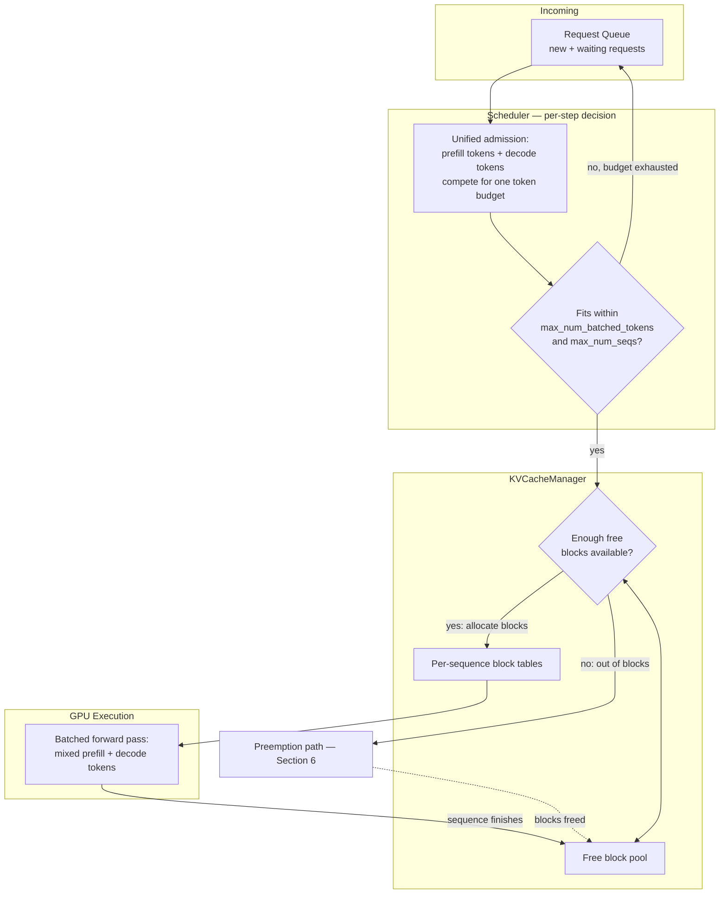
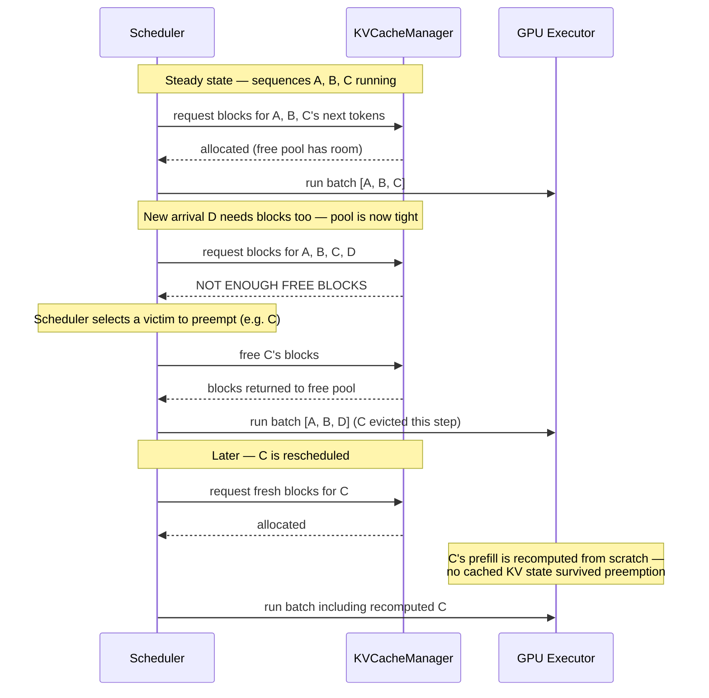

# The vLLM Scheduler

## Learning Objectives

By the end of this chapter, you will be able to:

- Describe precisely what the vLLM scheduler decides on every single engine step: which requests run, how many
  tokens of work each one gets, and how KV cache blocks are allocated to back that work
- Explain V1's **unified scheduler** design — a single dynamic per-step token budget shared by prefill and decode
  work — and why this replaced V0's split prefill-phase/decode-phase scheduling logic as an architectural
  simplification, not just a performance tweak
- Explain the role of the `KVCacheManager` as the component the scheduler calls into for block allocation and
  deallocation, and how that ties directly to the block tables from Chapter 7
- Tune `max_num_seqs` and `max_num_batched_tokens` deliberately, understanding exactly how the two knobs interact
  and why you'd reach for one over the other depending on whether your workload is prefill-heavy or decode-heavy
- Reason about why a single long prompt's prefill can dominate an entire scheduler step's token budget, and how
  the scheduler balances that against decode-step fairness for already-running sequences
- Explain V1's **recompute-based preemption** precisely — what triggers it, what happens to a preempted
  sequence's KV cache, and the throughput trade-off it represents relative to V0's now-removed CPU-swap
  preemption
- State, with the correct version-check caveat, why `--swap-space` is currently a no-op in V1 and what would have
  to change for that to stop being true

---

## Prerequisites for This Chapter

This chapter is the **synthesis chapter** for the internals arc — it does not introduce a new subsystem so much
as it wires three already-built subsystems together into one coherent picture. Specifically, it builds directly
on:

- **Chapter 6 (KV Cache)** — you should already know what the K/V tensors are, why the KV cache grows linearly
  with sequence length, and why KV cache size (not raw parameter count) is usually the binding constraint on how
  many concurrent sequences a GPU can serve. This chapter treats KV cache *size* as a given and focuses on who
  decides *when* cache gets allocated to which sequence.
- **Chapter 7 (PagedAttention)** — you should already know that vLLM's KV cache is organized into fixed-size
  **blocks** (default 16 tokens per block) and addressed indirectly through a per-sequence **block table**,
  the way an OS page table maps virtual pages to physical frames. This chapter does not re-derive paging; it
  explains the component that actually *calls* the block allocator — the `KVCacheManager` — and how the scheduler
  reacts when that allocator runs out of physical blocks.
- **Chapter 8 (Continuous Batching)** — you should already be comfortable with the core idea that vLLM re-forms
  its running batch at every engine step (iteration-level scheduling) rather than waiting for a fixed batch to
  finish, and that this is what lets a newly-arrived request start executing without waiting on a slow request
  in front of it. This chapter is the mechanism *behind* that per-step re-forming: something has to decide, each
  step, exactly which sequences go into the batch and how much of the token budget each one consumes. That
  "something" is the scheduler.

If any of those three chapters feel shaky, this is a good moment to go back — this chapter assumes you can hold
all three mental models simultaneously and just needs to connect them.

---

## 1. What the Scheduler's Job Actually Is

Strip away every optimization vLLM layers on top, and the inference engine's core loop looks like this at every
single step:

1. Look at the requests currently waiting (newly arrived, not yet admitted) and the requests currently running
   (admitted, mid-generation).
2. Decide which of them get to do work *this step*, and for each one, how many tokens of work.
3. Make sure GPU memory — specifically, KV cache blocks — actually exists to back that work before it's allowed
   onto the GPU.
4. Hand the resulting batch off to the model executor, which runs one forward pass over exactly that batch.
5. Do it again next step, because by the time this step finishes, the world has already changed: some sequences
   finished, new requests arrived, and the picture needs to be re-evaluated from scratch.

The component making decision (2) is the **scheduler**. The component enforcing decision (3) is the
**`KVCacheManager`**, which the scheduler calls into rather than reimplementing block bookkeeping itself. Sitting
between the incoming request queue and the GPU, the scheduler is the answer to a question Chapter 8 raised but
didn't fully resolve: continuous batching says "reform the batch every step" — the scheduler is *how* that
reforming happens, request by request, token by token.

It helps to be precise about what's being scheduled. This isn't scheduling *requests* in the abstract, the way an
OS scheduler picks which process gets a CPU timeslice. It's scheduling **tokens of work**, because a single
request's cost to the system changes dramatically over its own lifetime — a request that just arrived with a
2,000-token prompt needs to prefill roughly 2,000 tokens' worth of attention computation before it produces its
first output token; a request that's already mid-generation needs exactly one token's worth of decode work per
step. Both are "the same request" from the API's point of view, but they are wildly different amounts of
scheduling cost. This distinction — and how V1 changed the way vLLM reasons about it — is the chapter's central
thread.

---

## 2. V0's Split Design, and Why V1 Unified It

> **Historical context, not current behavior.** V0 is fully deprecated — this section exists so the "unified
> scheduler" naming in V1 actually means something to you, not as a description of anything you'll run today.

V0's scheduler treated prefill and decode as separate scheduling problems with separate code paths. Roughly: one
pass of scheduling logic decided which waiting requests got admitted into a prefill batch; a structurally
different pass decided which running requests got a decode step. The two paths had their own admission rules, own
notion of what a "batch" meant, and had to be reconciled against each other by additional logic to keep GPU
utilization reasonable across both phases at once.

This split made intuitive sense as a first design — prefill and decode really are computationally different
(prefill is compute-bound over many tokens at once; decode is memory-bandwidth-bound over one token per
sequence) — but it came at a real engineering cost: two scheduling logic paths to maintain, two sets of edge
cases, and a structural seam that later features (like giving a long prefill's tokens a smaller slice of a step
so decode-step sequences aren't starved — chunked prefill, Chapter 12) had to be bolted across rather than
designed into from the start.

V1 replaces this with what its own design documents call a **unified scheduler**: prefill tokens and decode
tokens are no longer different *kinds* of scheduling problem. They're both just "tokens that need a forward
pass this step," competing for the same dynamic per-step token budget. Concretely: at the start of a step, the
scheduler looks at every running sequence needing a decode token and every waiting/partially-prefilled sequence
still needing prefill tokens, and admits work — a mix of both kinds, in whatever proportion fits — until the
step's token budget (`max_num_batched_tokens`, Section 4) is exhausted or there's no more admissible work.

Why this is a genuine architectural simplification, not just a refactor:

- **One code path instead of two.** There's no separate "am I in the prefill scheduling branch or the decode
  scheduling branch" logic to keep synchronized. A token is a token; the scheduler doesn't need to know or care
  which phase of which sequence's lifecycle it belongs to when deciding whether it fits in this step's budget.
- **Chunked prefill becomes a natural consequence, not a special case.** If prefill tokens and decode tokens
  share one budget, then a long prompt's prefill naturally gets split across multiple steps whenever it wouldn't
  otherwise leave room for other sequences' decode tokens — the *same* admission logic that handles "this decode
  token fits" also handles "only 300 of this prefill's 2,000 tokens fit this step; do those 300 now, the rest
  next step." Chapter 12 covers chunked prefill's mechanics and defaults in full; the point here is that the
  unified scheduler is what makes chunking fall naturally out of the design rather than needing its own bolted-on
  admission path.
- **Fewer surprising interactions.** Because there's only one admission decision per step (not two reconciled
  against each other), it's structurally harder for the scheduler to make a decision that looks locally sensible
  in one path but starves the other.

The mental model to carry forward: in V1, "schedule a step" means "fill a shared token budget with whatever
mixture of prefill and decode work is available and admissible" — not "run the prefill scheduler, then run the
decode scheduler."

---

## 3. The `KVCacheManager`: Where Block Allocation Actually Happens

The scheduler decides *that* a sequence should get tokens of work this step. It does not itself track which
physical KV cache blocks are free, which are in use, or which can be shared via prefix caching (Chapter 11). That
bookkeeping belongs to the **`KVCacheManager`**, a distinct component the scheduler calls into.

This separation of concerns matters conceptually as well as for code organization:

- The **scheduler** answers "given current demand and current budget, who runs this step, and how many tokens of
  work do they get?"
- The **`KVCacheManager`** answers "given that this sequence needs N more tokens' worth of KV cache, do enough
  free blocks exist, and if so, which physical block IDs get assigned into this sequence's block table?"

Every time the scheduler wants to admit a sequence — whether it's a brand-new request starting its prefill, or an
already-running sequence about to take another decode step — it has to ask the `KVCacheManager` whether there's
room. Recall from Chapter 7 that the KV cache is carved into fixed-size blocks (default 16 tokens each) and every
sequence has a block table indirecting logical token positions to physical block IDs. The `KVCacheManager` is the
component that actually walks that free-block pool, hands out new physical block IDs when a sequence's block
table needs to grow, and reclaims blocks back into the free pool the moment a sequence finishes or is preempted.

This is precisely the coupling this chapter exists to make explicit: the scheduler's per-step admission decisions
are only ever *provisional* until the `KVCacheManager` confirms the memory to back them actually exists. A
sequence can be "ready to run" from the scheduler's point of view (it has tokens waiting, it hasn't hit
`max_num_seqs`) and still get blocked or preempted purely because the `KVCacheManager` has no free blocks left to
give it. Section 6 covers exactly that failure mode.

The diagram's key point: admission is a two-stage gate. The scheduler's own token-budget check is necessary but
not sufficient — a sequence can pass the scheduler's budget check and still fail the `KVCacheManager`'s block
availability check, which is exactly when preemption enters the picture.

---

## 4. `max_num_seqs` and `max_num_batched_tokens`: How the Two Knobs Interact

Two engine args govern admission directly:

- **`--max-num-seqs`** — the maximum number of sequences that may be running concurrently at all. This caps *how
  many distinct requests* can occupy a slot in the running batch at once, independent of how many tokens each
  one needs.
- **`--max-num-batched-tokens`** — the maximum number of tokens (prefill and decode tokens combined, per the
  unified scheduler in Section 2) processed in a single scheduler step. This caps the *total token-level work* per
  step, independent of how many sequences that work is spread across.

These are not redundant — they cap two different axes of scheduling cost, and understanding *why* they're
separate is the difference between tuning by trial and error and tuning deliberately.

Picture the two extremes:

- A batch of **many sequences, each contributing exactly one decode token** — say, 200 concurrent chat
  conversations all mid-generation, each needing just its next token. `max_num_seqs` is the binding constraint
  here: if it's set to 128, the 129th conversation simply waits, even though 129 single-token decode steps would
  easily fit inside almost any reasonable `max_num_batched_tokens` value. Decode-heavy workloads are cheap per
  sequence but sequence-count-hungry.
- A batch of **very few sequences, each contributing a huge prefill** — say, two requests that each just arrived
  with 4,000-token prompts. `max_num_batched_tokens` is the binding constraint here: even though `max_num_seqs`
  has plenty of headroom (only 2 of, say, 256 allowed slots are in use), a single step trying to prefill both
  full prompts at once could easily blow past a `max_num_batched_tokens` of, say, 8,192 — forcing the scheduler to
  admit only part of one prompt's tokens this step (see Section 5) rather than the whole thing at once.

Put differently: `max_num_seqs` answers "how many stories can I be telling at once?" while
`max_num_batched_tokens` answers "how many words total can I write down this step, across however many stories
are competing for that space?" A workload can be constrained by either one independently, and the two failure
modes feel completely different when you're debugging them — a `max_num_seqs`-bound workload shows requests
queued at admission with GPU compute still visibly idle; a `max_num_batched_tokens`-bound workload shows the GPU
saturated on token throughput with plenty of concurrency headroom still available.

This gives you a concrete tuning heuristic:

| Workload shape | Binding knob to raise | Reasoning |
|---|---|---|
| Many short-lived chat sessions, short prompts, long streamed outputs (decode-heavy) | `max_num_seqs` | Each sequence's per-step cost is tiny (one decode token); the ceiling on concurrency is what limits throughput, not the token budget |
| Few large-document / RAG-context requests with long prompts, short outputs (prefill-heavy) | `max_num_batched_tokens` | Each admitted sequence's prefill can single-handedly consume most of a step's budget; raising `max_num_seqs` alone does nothing if the token budget is still the wall being hit |
| Mixed, latency-sensitive interactive workload | Tune both together, conservatively | A too-large `max_num_batched_tokens` lets one huge prefill dominate a step and delay every other sequence's decode token that step — directly hurting inter-token latency (ITL) for everyone else. This is precisely the fairness problem chunked prefill (Ch. 12) exists to soften. |

Neither flag is "the important one" in isolation — they're answers to two different questions, and a workload
can be starved by either independently of the other. Section 8 (Common Mistakes) covers the specific failure of
tuning one while ignoring the other.

> **Verify against current docs:** exact defaults for `--max-num-seqs` and `--max-num-batched-tokens` vary by
> vLLM version and are chosen adaptively based on available GPU memory and model context length in some
> deployment paths. Don't hardcode a specific default number into your mental model — check
> `vllm serve --help` for your installed version before treating a number you saw in a blog post as current.

---

## 5. Prefill vs. Decode: Very Different "Costs" per Step

Section 4 already hinted at this, but it's worth stating on its own because it's the piece that makes the
scheduler's job genuinely hard, not just a bookkeeping exercise.

A **decode step** for an already-running sequence costs the scheduler (roughly) one token of budget and one
token's worth of new KV cache. It's cheap, predictable, and — critically — every running sequence needs one every
single step to make forward progress at all. Starve a sequence of decode steps and its user-visible token stream
just stalls.

A **prefill** for a newly-admitted or partially-admitted sequence costs the scheduler as many tokens of budget as
the prompt has left to process — a 2,000-token prompt is, in raw token-budget terms, worth roughly 2,000 decode
steps' worth of budget consumption in a single step if scheduled all at once. That's not a rounding-error
difference; it's multiple orders of magnitude for long prompts, and it's exactly why "just give every sequence a
turn" round-robin scheduling doesn't work here the way it might for a CPU scheduler handling roughly-equal-cost
tasks.

This asymmetry creates a genuine fairness tension the scheduler has to resolve every step:

- If the scheduler always prioritizes admitting new prefills fully and immediately, a burst of long-prompt
  arrivals can monopolize the entire token budget for several steps in a row, during which every already-running
  sequence's decode step gets delayed — directly increasing inter-token latency (ITL) for users who were already
  mid-conversation and have nothing to do with the new arrivals.
- If the scheduler always prioritizes decode steps for running sequences over prefill for new arrivals, new
  requests could wait an unbounded amount of time before their first token even starts processing, hurting
  time-to-first-token (TTFT) for anyone unlucky enough to arrive during a busy period.

V1's unified per-step token budget (Section 2) is what gives the scheduler a lever to balance this: because
prefill and decode tokens draw from the *same* budget rather than separate ones, the scheduler can admit a
partial slice of a large prefill — just enough tokens to make progress without exhausting the whole step's
budget — while still leaving room in the same step for running sequences' decode tokens. This partial-admission
behavior is exactly what **chunked prefill** (Chapter 12) formalizes and, per the current V1 default, applies
automatically rather than as an opt-in behavor. This chapter doesn't need you to know chunked prefill's exact
mechanics yet — just recognize *why* it exists: it's the direct answer to the prefill/decode cost asymmetry this
section describes, made possible by the unified scheduler's single shared budget.

---

## 6. Preemption: What Happens When KV Cache Blocks Run Out

Even with careful token-budget management, a simpler resource can run out first: **physical KV cache blocks**.
`max_num_batched_tokens` and `max_num_seqs` cap *admission* into a step, but the `KVCacheManager` from Section 3
can independently run out of free blocks to allocate — for example, when every currently-running sequence keeps
growing (each decode step needs a little more KV cache) and the free block pool shrinks toward zero even though
no single admission decision individually looks unreasonable.

When the `KVCacheManager` cannot find enough free blocks to satisfy every currently-admitted sequence's need to
grow, something has to give. The scheduler's answer is **preemption**: it selects one or more running sequences,
evicts them from the running batch, and frees their KV cache blocks back into the pool so the remaining sequences
can continue.

The important part of this chapter — the part that's genuinely different from what older vLLM material (or
casual searches that surface V0-era blog posts) will tell you — is **what happens to a preempted sequence's KV
cache**:

> **V0 (historical, fully removed):** a preempted sequence's KV cache blocks could be **swapped out to CPU
> memory** and swapped back in later when the sequence was rescheduled, via the `--swap-space` flag reserving CPU
> DRAM for exactly this purpose.
>
> **V1 (current):** there is **no GPU↔CPU KV cache swap for preemption**. Instead, V1 uses **recompute-based
> preemption**: a preempted sequence's KV cache is simply **dropped** — the blocks go straight back to the free
> pool — and when that sequence is eventually rescheduled, its prefill is **recomputed from scratch** as if it
> were a brand-new request, using whatever prompt + generated-so-far tokens it needs to reconstruct its state.

This is a real architectural trade-off, not a strict improvement, and it's worth understanding both sides:

**Why recompute-based preemption is simpler:**

- No CPU-side memory management to reason about at all — no separate CPU KV cache allocator, no swap-in/swap-out
  bookkeeping, no need to reserve and size a CPU memory pool for this purpose in the first place.
- No PCIe transfer latency or bandwidth contention from moving KV cache tensors between GPU and host memory —
  swap traffic on a busy multi-GPU box competing with other PCIe traffic was a real V0-era operational concern.
- One less subsystem that can have its own bugs, edge cases, and version-specific behavior to keep correct across
  releases.

**Why it can cost you throughput:**

- If a sequence gets preempted and later rescheduled, all the compute spent on its original prefill (and any
  decode steps it had already taken) is **thrown away** — recomputing prefill from scratch is not free, it's the
  same compute cost as if the request had never run at all up to that point.
- Under **frequent preemption** — a workload running close to its KV cache capacity ceiling, with lots of churn
  between admitted and evicted sequences — this recompute cost can repeat over and over for the same sequences,
  meaningfully eating into effective throughput even though no individual decision looks wrong in isolation.
- This is precisely why **adequate KV cache headroom** is the practical mitigation, not a scheduler tuning flag:
  if you're seeing frequent preemption in your logs/metrics, the fix is usually to reduce concurrent memory
  pressure (lower `max_num_seqs`, shorter `max_model_len`, a smaller `gpu_memory_utilization` safety margin used
  more efficiently, or simply more/larger GPUs) rather than to look for a preemption-tuning knob, because there
  isn't a "make recompute cheaper" flag — the cost is structural to the design.

### 6.1 The `--swap-space` implication

Given recompute-based preemption doesn't need CPU memory at all, it follows directly that **`--swap-space` is
currently a no-op in V1** — there's no swap mechanism left for it to configure. This is confirmed by an open
GitHub issue (vllm-project/vllm#27984) stating the parameter is unused and `num_cpu_blocks` is hardcoded to zero
at engine init. If you set `--swap-space 16` on a V1 server today, you are not reserving 16 GiB of CPU memory for
KV cache swap — you're setting a flag the engine currently ignores.

> **Verify against current docs.** There is active work in the broader ecosystem on **tiered KV cache offloading**
> (GPU HBM → CPU DRAM → object storage, mentioned in Chapter 10's memory-management context) that could plausibly
> repurpose `--swap-space` or a similarly-named flag for a *different* purpose than V0's preemption swap. Treat
> "does `--swap-space` do anything today" as a question to re-answer against `vllm serve --help` and current
> release notes at the time you're reading this, not a fact frozen at this course's writing date.

---

## 7. Worked Example: A Scheduler Walkthrough Across Several Steps

Concrete numbers make this easier to internalize than prose alone. Assume, purely for illustration, a server
configured with `max_num_seqs=4` and `max_num_batched_tokens=2048` (illustrative values chosen to make the
walkthrough's arithmetic land cleanly — not a recommendation for any real deployment).

**Step 1 — two sequences arrive.**

- Request A arrives: a 1,500-token prompt.
- Request B arrives: a 100-token prompt.
- `max_num_seqs` allows both (2 of 4 slots used). Token budget: A needs 1,500, B needs 100 — total 1,600, fits
  under 2,048. `KVCacheManager` has plenty of free blocks (nothing running yet). Both prefills run to completion
  in this single step.
- GPU executes a batch mixing A's 1,500 prefill tokens and B's 100 prefill tokens — 1,600 tokens total, one
  forward pass.

**Step 2 — both sequences move to decode; a third arrives.**

- A and B each need exactly one decode token now (2 tokens total demand from running sequences).
- Request C arrives: a 3,000-token prompt.
- Token budget check: 2 (A, B decode) + 3,000 (C's full prefill) = 3,002 — exceeds `max_num_batched_tokens=2048`.
  Because prefill and decode share one budget (the unified scheduler, Section 2), the scheduler doesn't reject C
  outright or block A/B's decode — it admits A and B's decode tokens (2) plus a **chunk** of C's prefill: as much
  of C's remaining 3,000 tokens as fits in the remaining budget (2,046 tokens). This is chunked prefill's
  mechanism in miniature (full treatment in Chapter 12) — foreshadowed here because it falls directly out of the
  unified budget design.
- `max_num_seqs` allows C's admission (3 of 4 slots used).
- GPU executes a batch: A's decode token + B's decode token + 2,046 tokens of C's prefill = 2,048 tokens, exactly
  at budget.

**Step 3 — C's prefill finishes; D arrives; the KV cache gets tight.**

- A and B need one decode token each. C needs its remaining 954 prefill tokens (3,000 − 2,046).
- Request D arrives: a 1,200-token prompt.
- Token budget: 2 (A, B decode) + 954 (rest of C's prefill) + up to 1,200 (D) = up to 2,156 if all admitted —
  slightly over 2,048, so the scheduler again chunks: it finishes C's prefill (954 tokens, since letting an
  in-progress prefill finish rather than leaving it perpetually chunked is generally prioritized) plus A/B's
  decode tokens (2), leaving 1,092 tokens of budget for D — enough to admit D's entire 1,200-token prompt? No —
  1,092 < 1,200, so D gets a partial chunk of 1,092 tokens this step, with the remaining 108 tokens carried to
  step 4.
- Separately, suppose at this point the `KVCacheManager` reports the free block pool is nearly exhausted — four
  sequences (A, B, C, D) are all now holding growing KV cache allocations, and `max_num_seqs=4` means a 5th
  sequence can't even be considered for admission regardless of token budget. If a 5th high-priority request
  arrived here needing blocks that don't exist, the scheduler would need to **preempt** one of A/B/C/D (Section
  6) — dropping its KV cache and requiring a full prefill recompute later — rather than admit the new arrival
  without freeing space first.

**Step 4 — D's prefill finishes; steady-state decode.**

- D's remaining 108 prefill tokens finish. A, B, C, D are all now in decode, one token each — 4 tokens total,
  comfortably under both `max_num_batched_tokens` (2,048) and `max_num_seqs` (4, and all 4 slots are now decode-
  only, cheap per step).
- This is the steady state continuous batching (Chapter 8) describes: once the token-budget-heavy prefill work is
  behind them, four concurrent sequences cost almost nothing per step, and the scheduler could easily admit a 5th
  or 6th request's prefill into the same step's remaining budget the moment one arrives — up to the
  `max_num_seqs` ceiling.

The throughline across all four steps: **the scheduler is not choosing "prefill this step, decode next step"** —
every single step, across all four steps above, is a mixture, sized by whatever the unified token budget allows,
with `max_num_seqs` acting as a hard ceiling on concurrency independent of how cheap or expensive each sequence's
current step happens to be.

---

## Real-World Scenario

A team runs a RAG-based internal support-ticket assistant. Requests arrive with long, retrieved-context-heavy
prompts (routinely 3,000–6,000 tokens after the retrieval step stuffs in relevant documents) but short answers
(100–300 tokens). They provision a single GPU, leave `max_num_seqs` at a generous value copied from a blog post
tuned for a chat-style workload (many short prompts, long streamed answers), and are confused when throughput
plateaus far below what the GPU's memory would suggest should be possible — `nvidia-smi` shows healthy memory
headroom, and `max_num_seqs` isn't anywhere near its ceiling in their metrics.

Applying this chapter's model: their workload is **prefill-heavy**, not concurrency-heavy. Every request's cost
is dominated by a single expensive prefill of several thousand tokens; there are rarely more than a handful of
sequences in flight at once because each one finishes its (short) generation quickly relative to how long its
own prefill took. `max_num_seqs` was never the binding constraint — `max_num_batched_tokens`, left at a value
sized for a very different workload shape, was silently capping how much of each request's expensive prefill
could be admitted per step, and chunking that couldn't be avoided (Section 5) was adding scheduling overhead the
team hadn't accounted for.

The fix: raise `max_num_batched_tokens` (informed by measuring actual per-step GPU utilization and KV cache
headroom, not by guessing), leave `max_num_seqs` closer to what their real concurrency needs demand rather than
a value copied from an unrelated workload's tuning guide, and re-benchmark (`vllm bench serve`, Chapter 17) before
and after to confirm the change actually moved the needle rather than just feeling right. The general lesson: the
two flags answer different questions, and picking which one to raise requires first classifying your own
workload as prefill-heavy, decode-heavy, or mixed — not applying someone else's tuning numbers verbatim.

---

## Best Practices

- **Classify your workload before tuning either flag.** Ask: is the dominant cost per request a big prompt (raise
  `max_num_batched_tokens`) or a lot of concurrent conversations (raise `max_num_seqs`)? Guessing at numbers
  without this classification wastes tuning cycles on the wrong knob.
- **Watch for preemption in metrics/logs as a KV cache headroom signal, not a scheduler-tuning problem.** If
  you're seeing sequences preempted and recomputed frequently, the fix is reducing concurrent memory pressure
  (lower `max_num_seqs`, tighter `max_model_len`, more GPU memory) — there is no flag that makes recompute itself
  cheaper.
- **Benchmark before and after any change to these flags** (`vllm bench serve`/`latency`/`throughput`, Chapter
  17) rather than trusting intuition about which knob should matter more for your traffic shape — the interaction
  between the two flags is genuinely non-obvious until you've measured it once for your own workload.
- **Don't treat `--swap-space` as a lever for anything in current V1** — verify against `vllm serve --help` for
  your installed version, but as of this writing it's a documented no-op (vllm-project/vllm#27984).
- **Remember the unified scheduler is one code path, not two**, when reasoning about scheduling behavior — don't
  mentally model V1 as "the prefill scheduler and the decode scheduler working together." There is one admission
  decision per step, over one shared token budget.
- **Size KV cache headroom deliberately for your peak concurrency, not your average concurrency** — recompute-
  based preemption makes running consistently close to the KV cache ceiling more expensive (in wasted recompute)
  than it would have been under V0's swap-based preemption, so leaving margin matters more, not less, in V1.

---

## Common Mistakes

- **Tuning `max_num_seqs` in isolation without considering `max_num_batched_tokens`.** Raising the sequence
  ceiling does nothing for a prefill-heavy workload that's actually being throttled by the token budget per step
  — and can even make things worse by letting more large prefills compete for the same fixed budget, increasing
  chunking overhead and per-request latency variance.
- **Being surprised that a preempted sequence "lost its place" and restarted its prefill.** This is expected,
  correct V1 behavior — recompute-based preemption always drops KV cache on preemption. If you see a preempted
  sequence's TTFT-equivalent latency spike after being rescheduled, that's the recompute cost showing up exactly
  where the design predicts it will, not a bug.
- **Expecting `--swap-space` to reserve CPU memory for KV cache swap in V1**, based on an older tutorial, blog
  post, or V0-era documentation. It's currently a no-op — check current docs, don't assume the flag does what its
  name and V0-era history suggest.
- **Assuming the scheduler processes "all prefill, then all decode" each step**, rather than a genuinely mixed
  per-step budget. This misunderstanding leads to incorrect mental models when debugging latency — e.g., blaming
  "decode starvation" on a phase-ordering issue that doesn't actually exist in the unified design, when the real
  cause is a `max_num_batched_tokens` value too small for the prefill sizes in play.
- **Interpreting healthy `nvidia-smi` memory headroom as proof the scheduler isn't the bottleneck.** Both
  `max_num_seqs` and `max_num_batched_tokens` are admission-time caps independent of how much GPU memory is
  technically free — a workload can be scheduler-bound (capped by one of these flags) while the GPU still has
  spare VRAM, precisely because the flags are enforced before memory pressure ever becomes the limiting factor.
- **Assuming preemption exclusively means "server is overloaded, add more GPUs."** Sometimes it means
  `max_num_seqs` or `max_model_len` is set more generously than the provisioned KV cache can actually sustain
  under peak concurrent context lengths — a config problem, not necessarily a hardware-scale problem.

---

## Summary

- The scheduler's job, every step: decide which requests run, how many tokens each gets, and confirm KV cache
  blocks exist to back that work — sitting between the request queue and GPU execution.
- V1's **unified scheduler** treats prefill and decode tokens as the same kind of per-step budget consumption,
  replacing V0's separate prefill-phase/decode-phase logic. This is a genuine simplification: one admission code
  path, and a natural foundation for chunked prefill rather than a bolted-on special case.
- The scheduler calls into the **`KVCacheManager`** for all block allocation/deallocation — the scheduler decides
  *who* runs; the `KVCacheManager` decides whether the physical KV cache blocks exist to actually back that
  decision, updating the per-sequence block tables from Chapter 7.
- **`max_num_seqs`** caps concurrent sequence count; **`max_num_batched_tokens`** caps total tokens (prefill +
  decode) processed per step. They cap different axes of cost and must be tuned according to whether your
  workload is prefill-heavy (large prompts, few concurrent sequences) or decode-heavy (many concurrent
  sequences, cheap per-step cost each).
- Prefill and decode have very different per-step "costs" — a long prompt's prefill can be worth thousands of
  decode-steps' worth of budget. The scheduler balances this by admitting mixed, and sometimes chunked, work each
  step rather than favoring one phase categorically.
- **Preemption** triggers when the `KVCacheManager` runs out of free blocks for all currently-admitted work. V1
  uses **recompute-based preemption** — a preempted sequence's KV cache is dropped entirely and its prefill is
  recomputed from scratch when rescheduled, unlike V0's GPU↔CPU swap. This trades implementation simplicity for
  potential wasted recompute under frequent preemption — a strong argument for adequate KV cache headroom.
- **`--swap-space` is currently a no-op in V1** (vllm-project/vllm#27984) — a direct consequence of not needing
  CPU swap space for preemption anymore. Verify against current docs, since tiered KV offload work may eventually
  repurpose the flag for something different.

---

## Knowledge Check

1. In your own words, explain why V1's "unified scheduler" is described as an architectural simplification
   relative to V0, rather than just a performance optimization. What specifically got removed/merged?
2. A server has `max_num_seqs=64` and plenty of unused sequence slots, but throughput is still capped well below
   what the GPU's compute should allow. Which of the two admission flags would you suspect first, and what
   workload shape (prefill-heavy vs. decode-heavy) would make that diagnosis likely correct?
3. Walk through what happens, step by step, when the `KVCacheManager` reports it cannot allocate enough blocks
   for all currently-admitted sequences. What specifically happens to the KV cache of the sequence chosen for
   preemption, and what has to happen before that sequence can resume generating?
4. Why is `--swap-space` currently a no-op in V1, and what earlier V0-era mechanism made this flag meaningful
   before V1's scheduler redesign?
5. A teammate says "the scheduler runs all pending prefills first, then switches to decoding the running batch."
   Is this an accurate description of V1's behavior? If not, correct it precisely.
6. Why does frequent preemption represent wasted work specifically in V1 (as opposed to being a purely neutral
   load-shedding mechanism), and what's the practical mitigation this chapter recommends?

---

## Hands-On Exercise

Observe scheduler behavior directly by tuning `max_num_seqs` and `max_num_batched_tokens` against a real workload
and watching how admission and throughput change.

1. **Start a server with deliberately tight settings.** Launch `vllm serve <a small model you have access to>`
   with an explicit, small `--max-num-seqs` (e.g. 8) and a small `--max-num-batched-tokens` (e.g. 512) —
   deliberately undersized relative to what your GPU could otherwise sustain, so you can see the caps actually
   bind. Confirm both flags against `vllm serve --help` for your installed version before relying on the exact
   names/defaults.

2. **Generate two distinctly different load patterns** using `vllm bench serve` (Chapter 17's tool):
   - A **decode-heavy** pattern: many short prompts (tens of tokens), requesting long outputs, at moderate-to-high
     concurrency.
   - A **prefill-heavy** pattern: few, very long prompts (thousands of tokens, e.g. by concatenating a long
     document into the prompt), requesting short outputs, at low concurrency.

3. **For each pattern, sweep one flag while holding the other fixed.** Run the decode-heavy pattern at a few
   different `--max-num-seqs` values (holding `--max-num-batched-tokens` fixed) and observe throughput/TTFT/ITL
   change. Then run the prefill-heavy pattern at a few different `--max-num-batched-tokens` values (holding
   `--max-num-seqs` fixed) and observe the same metrics.

4. **Confirm the asymmetry directly:** show that raising `--max-num-seqs` measurably helps the decode-heavy
   pattern but does little for the prefill-heavy one, and vice versa for `--max-num-batched-tokens`. Write down,
   in your own words, why each pattern responded to one flag and not meaningfully to the other.

5. **Bonus — provoke preemption on purpose.** Set `--max-num-seqs` and/or `--max-model-len` aggressively high
   relative to your GPU's actual VRAM, drive enough concurrent long-context load to exhaust KV cache blocks, and
   look at the server logs/metrics for preemption events. Correlate a preemption event with a subsequent latency
   spike for that specific request, confirming the recompute cost from Section 6 directly rather than just
   reading about it.

---

## Further Reading

- `docs.vllm.ai/en/latest/usage/v1_guide.html` — the current V1 guide; confirms the unified scheduler description
  and chunked-prefill-by-default behavior referenced throughout this chapter
- `docs.vllm.ai/en/latest/serving/engine_args.html` (or the current equivalent engine-args reference page) — the
  authoritative, always-current source for `--max-num-seqs`, `--max-num-batched-tokens`, `--swap-space`, and
  every other flag named in this chapter; check this before relying on any specific default value
- `github.com/vllm-project/vllm` — search the repo for `scheduler.py` and `kv_cache_manager.py` under
  `vllm/v1/core/` (path names may shift release to release) to read the actual admission and block-allocation
  logic this chapter describes conceptually
- `github.com/vllm-project/vllm/issues/27984` — the open issue confirming `--swap-space` is currently a no-op in
  V1, cited directly in Section 6.1
- vLLM blog: "vLLM V1: A Major Upgrade to vLLM's Core Architecture" (2025-01-27) — the original V1 announcement,
  useful context for why the scheduler/KV-cache-manager split was redesigned as part of the broader V1 rewrite
- The "Anatomy of vLLM" blog series (vLLM project) — referenced elsewhere in this course for continuous batching
  terminology; also covers scheduler internals at a code-walkthrough level
- Related chapter in this course: [Chapter 6 — KV Cache](./06-kv-cache.md)
- Related chapter in this course: [Chapter 7 — PagedAttention](./07-pagedattention.md)
- Related chapter in this course: [Chapter 8 — Continuous Batching](./08-continuous-batching.md)
- Related chapter in this course: [Chapter 10 — Memory Management](./10-memory-management.md) — `gpu_memory_utilization`,
  diagnosing OOM, and tiered KV offload context that extends this chapter's `--swap-space` discussion
- Related chapter in this course: [Chapter 12 — Chunked Prefill](./12-chunked-prefill.md) — the full mechanics of
  the partial-prefill-admission behavior foreshadowed in Sections 5 and 7 of this chapter

---

  <a href="./08-continuous-batching.md">← Previous: Continuous Batching</a>
  <a href="./00-index.md">🏠 Index</a>
  <a href="./10-memory-management.md">Next: Memory Management →</a>

