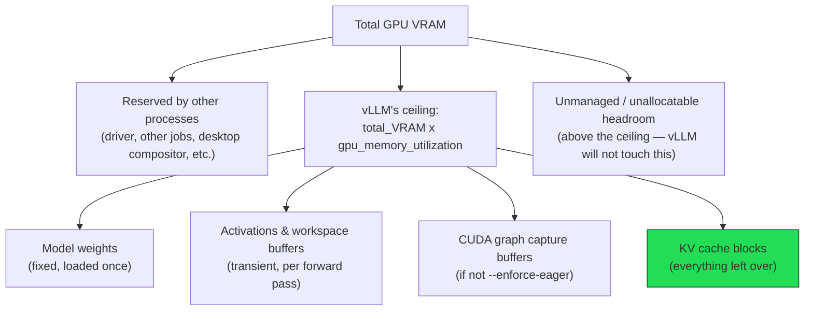
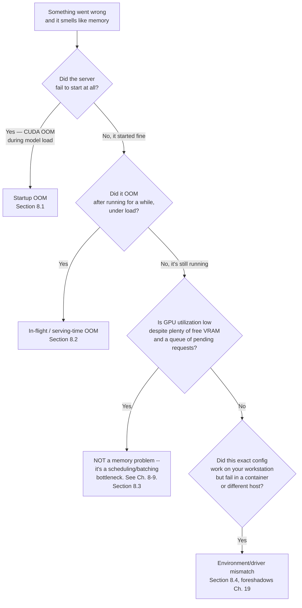

# Memory Management

> Every vLLM deployment failure that isn't a bug is a memory problem wearing a different costume. "It won't start," "it throughput-craters under load," "it OOMs after the fifth concurrent request," "it worked on my workstation but dies in the container" — all four are, at bottom, questions about where GPU memory went and who's allowed to claim more of it. This chapter turns the mental models from Chapters 2, 6, 7, and 9 into the concrete configuration and debugging skill of actually running vLLM against a GPU with finite VRAM.

## Learning Objectives

By the end of this chapter, you will be able to:

- Explain what `--gpu-memory-utilization` actually controls — a **total ceiling** for weights + KV cache + activations, not a "fraction reserved for KV cache" — and why that distinction is the single most common source of vLLM memory misconfiguration
- Trace, for a given GPU and model, exactly how much VRAM is consumed by weights before a single KV cache block is ever allocated, and compute how much headroom remains
- Use `--max-model-len`, `--max-num-seqs`, and `--max-num-batched-tokens` as **memory and concurrency levers**, not just scheduler knobs, and predict how changing each one shifts the ceiling on concurrent sequences
- Explain the memory/performance trade-off behind `--enforce-eager` and when disabling CUDA graph capture is the right call
- Explain why V1's default piecewise CUDA graph compilation itself consumes VRAM, and factor that into a careful memory budget
- State plainly, with a citation, that `--swap-space` is currently a dead flag in V1 — and know what's coming to eventually replace it
- Run a systematic diagnostic playbook that distinguishes startup OOM, in-flight OOM, poor-utilization-that-isn't-a-memory-problem, and environment-mismatch OOM
- Do the full arithmetic of a VRAM budget: given a GPU's VRAM, a model's weight footprint, and a KV-cache-per-token formula, compute how many concurrent sequences a configuration can actually support at a given context length

---

## Prerequisites

This chapter is the practical payoff of four earlier chapters, and assumes you can already answer each one's core question without re-deriving it from scratch:

- **Chapter 2 (GPU & CUDA Fundamentals)** — the GPU memory breakdown: model weights, KV cache, activations, and runtime/framework overhead all competing for the same physical VRAM budget. This chapter revisits that tree and attaches real flags to each branch.
- **Chapter 6 (KV Cache)** — why the KV cache grows with context length and concurrency, and the per-token memory cost of caching keys and values per layer, per head. This chapter reuses that formula directly in the worked example below.
- **Chapter 7 (PagedAttention)** — KV cache is allocated in fixed-size **blocks** (default `block_size = 16` tokens, confirmed current default), not as one contiguous per-sequence buffer. Memory accounting in this chapter is block-based, not byte-continuous.
- **Chapter 9 (The vLLM Scheduler)** — `max_num_seqs` and `max_num_batched_tokens` were introduced there as scheduler admission controls (how many sequences/tokens get processed per step). This chapter reframes the same two flags from the memory side: they don't just control scheduling fairness, they cap how much KV cache demand the engine will ever try to satisfy at once.

If any of those four questions feels shaky, a quick pass back through the relevant chapter will make the arithmetic in this one land much faster — this chapter deliberately does not re-derive PagedAttention or the KV cache formula from first principles.

---

## 1. Revisiting the GPU Memory Breakdown

Chapter 2 introduced the idea that a GPU's VRAM is not one undifferentiated pool — it's carved up (implicitly, not through hard OS-level partitions) among a small number of competing consumers the moment `vllm serve` starts:



The load-bearing detail in this diagram, and the one most students get backwards on first read: **KV cache is whatever's left over inside the ceiling, not a slice you configure directly.** vLLM doesn't ask "how much memory do you want for KV cache?" — it asks "how much memory are you willing to let me touch in total?", loads weights, reserves a margin for activations and (if enabled) CUDA graphs, and then converts every remaining byte inside the ceiling into KV cache blocks. Section 2 below unpacks exactly why that matters.

### 1.1 The four consumers, revisited

| Consumer | Size behavior | Controlled by |
|---|---|---|
| Model weights | Fixed once loaded — a function of parameter count and dtype, not traffic | `dtype`/`--quantization` (Ch. 13), not a memory flag directly |
| Activations & workspace buffers | Transient, scales with batch size and sequence lengths in flight | Indirectly, via `--max-num-batched-tokens` and `--max-num-seqs` |
| CUDA graph capture buffers | Fixed once captured, paid once at startup | `--enforce-eager` (off = graphs captured, on = no graphs) |
| KV cache blocks | Everything left over inside the ceiling, divided into fixed-size blocks | `--gpu-memory-utilization` (the ceiling) and `--max-model-len` (per-sequence demand against that pool) |

Every flag covered in this chapter is a lever on exactly one row of that table. Keeping straight *which* row a flag actually moves is most of the battle in diagnosing a memory problem correctly instead of guessing.

---

## 2. `--gpu-memory-utilization`: A Ceiling, Not a KV Cache Fraction

`--gpu-memory-utilization` is a float, **default `0.9`**, and it is by a wide margin the most misunderstood flag in vLLM's memory surface. Read the name literally and the natural (wrong) reading is "the fraction of GPU memory to use for the KV cache." That is not what it does.

What it actually does: at startup, vLLM computes `total_VRAM_on_this_GPU × gpu_memory_utilization` and treats that product as the **absolute ceiling** for everything vLLM itself will allocate on that GPU — model weights, activation/workspace buffers, CUDA graph capture buffers, and KV cache, all combined. It is not "0.9 of memory is for KV cache and the rest is for weights." It is "0.9 of memory, period, is the most vLLM will ever claim; weights come out of that budget first, and KV cache gets whatever's left."

Concretely, on startup vLLM:

1. Loads the model weights into GPU memory (a fixed cost, determined by parameter count × bytes-per-parameter).
2. Runs a memory-profiling forward pass to estimate activation/workspace memory at the configured batch/sequence limits, and (unless `--enforce-eager` is set) captures CUDA graphs, consuming additional VRAM.
3. Whatever is left between "memory used so far" and "the ceiling" gets divided into KV cache blocks — this is the pool the `KVCacheManager` (Chapter 9) actually hands out to running sequences.

The practical consequence: **raising `gpu_memory_utilization` does not "give more memory to the KV cache" in isolation** — it raises the ceiling for everything, and only the leftover-after-weights-and-activations portion of that increase becomes KV cache. Lowering it below the point where weights alone fit is worse than a KV cache shortage — it's a hard failure, because weights can't load at all (Section 6.1).

> **Why default to 0.9 and not 1.0?** Leaving ~10% of VRAM outside vLLM's ceiling is deliberate headroom for the CUDA driver's own allocations, memory fragmentation, and any other process sharing the GPU (a display server, a monitoring agent, a second inference process). Pushing `gpu_memory_utilization` to 1.0 on a GPU that's otherwise idle is a legitimate move to squeeze out marginally more KV cache, but it removes that safety margin — a stray allocation from anywhere else on the GPU can now push you over the edge into an OOM you wouldn't have hit at 0.9.

### 2.1 Why this flag deserves outsized attention

Three practical implications fall directly out of "ceiling, not KV-cache fraction":

- **A larger model (bigger weights) leaves less headroom for KV cache at the same `gpu_memory_utilization`**, even on the same GPU — because weights are subtracted from the ceiling before KV cache gets anything. Doubling model size does not just double weight VRAM; it can more than halve the KV cache pool if the ceiling doesn't move.
- **Quantizing a model (Chapter 13) is one of the highest-leverage KV-cache levers available**, precisely because it shrinks the "weights" branch of the tree without touching the ceiling at all — every gigabyte you save on weights becomes a gigabyte available for KV cache blocks, for free.
- **You cannot reason about `gpu_memory_utilization` in isolation from `--max-model-len`, `--max-num-seqs`, and quantization** — it sets the total pie, but the other flags determine how the leftover slice gets consumed per sequence. A chapter section further down works this arithmetic concretely.

---

## 3. `--max-model-len`: Capping Per-Sequence KV Cache Demand

`--max-model-len` sets the maximum context length (prompt tokens + generated tokens, combined) the engine will accept for any single request. If a model's native/trained context window is 128K tokens but you set `--max-model-len 8192`, the engine will reject or truncate requests that would exceed 8192 tokens total — it does not serve the model's full native context.

From the memory angle (as opposed to the correctness angle — can this request even be answered), `--max-model-len` is a direct lever on **worst-case KV cache demand per sequence**. Recall from Chapter 6 that KV cache size for a sequence grows linearly with the number of tokens cached for it. Capping the maximum context length caps the maximum number of KV cache blocks any single sequence can ever claim — which is exactly the number the scheduler (Chapter 9) needs in order to guarantee it isn't over-admitting sequences it can't actually fit in the KV cache pool.

The trade-off is direct and worth stating as plainly as possible: **a smaller `--max-model-len` means smaller worst-case per-sequence KV cache reservations, which means more concurrent sequences fit in the same KV cache pool.** If your actual traffic never needs more than 4K tokens of context, serving with `--max-model-len 128000` (the model's native max) wastes no VRAM directly — vLLM's KV cache manager allocates blocks lazily, as tokens are actually generated, not eagerly up front for the full `max-model-len` — but it does force the scheduler's admission math to plan for a worst case that never happens, which can lead to overly conservative concurrency limits or preemption under load when a handful of unusually long requests do show up. Setting `--max-model-len` to the *realistic* maximum for your workload, not the model's theoretical maximum, is one of the cheapest concurrency wins available.

> **Nuance worth internalizing**: because vLLM's KV cache manager allocates blocks incrementally as a sequence generates tokens (this is exactly what "PagedAttention" gives you — Chapter 7), a short request never *pays* for `--max-model-len`'s full ceiling. What `--max-model-len` actually constrains is the scheduler's worst-case planning assumption and the point at which a single long-running request gets rejected outright rather than silently truncated. Section 7's worked example makes this concrete with real numbers.

---

## 4. `--max-num-seqs` and `--max-num-batched-tokens`, Revisited From the Memory Side

Chapter 9 introduced these two as the scheduler's admission-control knobs: `--max-num-seqs` caps how many sequences can be running concurrently, and `--max-num-batched-tokens` caps how many tokens (across all sequences) the engine processes in a single scheduler step. Both are true and both matter for throughput — but read purely through a memory lens, they answer a different question:

- **`--max-num-seqs`** is a hard ceiling on how many sequences can simultaneously hold KV cache blocks. Even if the KV cache pool has room for 200 short sequences, setting `--max-num-seqs 32` means only 32 will ever be admitted at once — the other 168 wait in the scheduler's queue regardless of available VRAM. This is a *safety valve*, not a memory-saving flag per se: it exists so the scheduler never has to gamble on whether the KV cache pool can actually satisfy every admitted sequence's worst-case demand.
- **`--max-num-batched-tokens`** caps token-level throughput per step, which indirectly caps the activation/workspace memory consumed by that step (more tokens processed per step means larger transient activation buffers during that forward pass). It's a smaller lever on KV cache directly, but a real one on the "activations" branch of the memory tree from Section 1.

The memory-side framing to keep in mind: **raising `--max-num-seqs` without also having genuine KV cache headroom just moves the failure from "requests queue longer than you'd like" to "requests get preempted (recomputed from scratch, V1 has no swap — see Section 6) once the KV cache pool actually fills up."** Section 8 covers exactly this failure mode as one of the four canonical OOM/degradation patterns.

---

## 5. `--enforce-eager`: Trading CUDA Graphs for Memory and Startup Time

By default (unless `--enforce-eager` is passed), V1 captures **piecewise CUDA graphs** at startup — confirmed current default behavior, mode `FULL_AND_PIECEWISE`: full graph capture for the uniform, predictable shape of a decode batch, and piecewise (partial) graph capture elsewhere, because not every attention backend can be fully graph-captured across every possible batch shape. CUDA graphs eliminate CPU-side kernel-launch overhead by replaying a pre-recorded sequence of GPU operations instead of dispatching each kernel individually from Python — this is a meaningful decode-throughput win, particularly for smaller models where kernel-launch overhead is a larger fraction of total step time.

`--enforce-eager` disables this entirely and forces plain eager PyTorch execution — every operation dispatched individually, every time, no graph replay.

The trade-off, stated as a straight ledger:

| | CUDA graphs enabled (default) | `--enforce-eager` |
|---|---|---|
| Decode throughput | Higher — no per-kernel Python/CPU dispatch overhead | Lower — full eager dispatch every step |
| Startup time | Slower — graph capture happens at engine init, adding real wall-clock time before the server is ready | Faster — no capture phase at all |
| VRAM consumed by graph buffers | Nonzero — captured graphs occupy dedicated buffers, subtracted from the ceiling before KV cache (Section 1) | Zero — that memory goes back to the KV cache pool instead |
| Debuggability | Harder — a captured graph obscures the normal Python stack trace when something misbehaves inside it | Easier — every operation is a normal, traceable eager PyTorch call |

Two situations where reaching for `--enforce-eager` is the right call, not a compromise:

1. **You're debugging a suspected memory or correctness issue** and need every operation to run in normal eager mode so stack traces and memory profiling tools (e.g. `torch.cuda.memory_summary()`, `nvidia-smi` sampled mid-request) reflect what's actually executing, rather than a replayed graph.
2. **You're on a genuinely memory-constrained GPU** where the CUDA graph buffers themselves are competing meaningfully with KV cache for the last few hundred MB to a few GB of headroom, and you've already decided the throughput loss is an acceptable trade for a few more KV cache blocks (more concurrency) or for fitting a model that otherwise doesn't fit at all.

For a production deployment optimizing for steady-state throughput on a GPU with reasonable headroom, leave CUDA graphs enabled (the default) — `--enforce-eager` is a deliberate, situational trade, not a default-safe setting.

---

## 6. CUDA Graphs and Memory: The Subtlety Worth Surfacing

Section 5 already stated it, but it deserves its own heading because it's easy to forget when doing careful VRAM budgeting: **CUDA graph capture is not free.** V1's default piecewise CUDA graph compilation (`FULL_AND_PIECEWISE` mode) captures and retains buffers for the graphs it records, and that memory comes out of the same ceiling described in Section 1 — it is subtracted before whatever remains becomes KV cache.

This matters concretely in two situations:

- **When you're right at the edge of fitting a model and are tuning `gpu_memory_utilization` upward in small increments to claw back KV cache headroom**, remember that CUDA graph buffers are part of what's competing for that same ceiling. If you're that close to the edge, `--enforce-eager` is worth testing as an alternative lever before you keep raising `gpu_memory_utilization` toward 1.0 and its shrinking safety margin (Section 2).
- **When comparing two configurations' memory profiles side by side** (e.g. debugging "why does this configuration have less KV cache than I expected given the same weights and same `gpu_memory_utilization`"), check whether one run has `--enforce-eager` set and the other doesn't — that alone can account for a meaningful VRAM difference that has nothing to do with weights, `max-model-len`, or quantization.

The magnitude of graph-buffer VRAM depends on model architecture, batch shapes configured via `--max-num-seqs`/`--max-num-batched-tokens`, and vLLM version — don't try to memorize a fixed number here; if you need an exact figure for a specific deployment, compare `nvidia-smi` output (or vLLM's own startup log lines reporting memory usage) between a normal run and an `--enforce-eager` run of the identical configuration.

---

## 7. `--swap-space`: Confirmed Dead in Current V1

Older vLLM material (blog posts, tutorials, and some still-uncorrected documentation written during or before the V0→V1 transition) teaches `--swap-space` as a real memory-management lever: the idea, inherited from V0, was that when the KV cache pool filled up, a preempted sequence's KV cache could be swapped out to CPU memory and swapped back in later, rather than being discarded outright.

**That mechanism does not function in current V1.** As of this writing, `--swap-space` is confirmed effectively a no-op: a live, open GitHub issue (`vllm-project/vllm#27984`) states the parameter is unused, and `num_cpu_blocks` is hardcoded to zero in engine initialization. V1 handles preemption differently from V0 in the first place — instead of swapping a sequence's KV cache to CPU memory, V1 uses **recompute-based preemption**: a preempted sequence's KV cache is simply dropped, and if the sequence is rescheduled later, its prefill is recomputed from scratch. There is no GPU↔CPU KV swap path in the current preemption logic for `--swap-space` to plug into.

> **Do not teach `--swap-space` as a working lever in a current deployment.** If you see it in a config file, a Helm values file, or an old blog post, treat it the same way you'd treat `VLLM_USE_V1=0` — a historical artifact from the V0 era, harmless to leave unset, not something to tune expecting an effect. Verify against `vllm serve --help` and current release notes before relying on any behavior described here, since this specific flag is an explicit candidate for repurposing (see below).

**Forward context, not a feature to teach step-by-step today**: there is active work in the vLLM project toward **tiered KV cache offloading** — a GPU HBM → CPU DRAM → object-storage hierarchy for KV cache, conceptually an evolution of the same idea `--swap-space` originally represented, but re-architected for V1. It's plausible `--swap-space` (or a successor flag) gets repurposed for this before this course goes stale. Treat this as a space to watch, not a configuration surface to depend on today — check current docs and `vllm serve --help` before assuming any specific swap/offload flag does something in the version you're running.

---

## 8. A Diagnostic Playbook for Memory Problems

Every memory-related failure mode you'll hit in practice falls into one of four buckets. Work through them in this order — they're roughly ordered from "happens first, at startup" to "happens last, under sustained load and only in certain environments."



### 8.1 CUDA OOM at startup — the model won't load

**Symptom**: `vllm serve` crashes during initialization, often with a `torch.cuda.OutOfMemoryError` or a vLLM-level error surfaced during weight loading or the initial memory-profiling pass, before the server ever reports "ready."

**Usual root causes, in order of likelihood**:

1. **`--gpu-memory-utilization` is set too low to even fit the weights.** Remember Section 2: weights come out of the ceiling first. If `total_VRAM × gpu_memory_utilization` is smaller than the model's weight footprint, there is no valid configuration of KV cache that fixes this — the ceiling itself is too low. Raise `gpu_memory_utilization`, or move to a smaller/quantized model, or add more GPUs via tensor parallelism (Chapter 15).
2. **Wrong precision/dtype assumption.** Loading a model at `dtype="float32"` when you intended `"float16"`/`"bfloat16"` roughly doubles the weight footprint versus what you budgeted for. Double-check the `dtype` you're actually passing (default is `"auto"`, which is usually right, but explicit overrides are a common self-inflicted cause here).
3. **Another process is already holding VRAM on the same GPU.** `nvidia-smi` before starting vLLM is the first command to run, not an afterthought — a leftover process from a previous crashed run, a Jupyter kernel, or another service can silently eat into the ceiling vLLM computes at startup.
4. **The model genuinely doesn't fit on this GPU at this precision, full stop.** Not every OOM is a misconfiguration — sometimes the honest answer is "a 70B model in FP16 does not fit on a single 24GB consumer GPU," and the fix is quantization (Chapter 13) or tensor parallelism across multiple GPUs (Chapter 15), not a flag tweak.

### 8.2 CUDA OOM during serving — KV cache exhausted under load

**Symptom**: the server starts fine, serves requests successfully for a while, and then fails — either an explicit OOM, or (more often in a well-configured deployment) heavy preemption/recompute activity and degraded latency as the scheduler fights to keep every admitted sequence's KV cache demand within the pool.

**Usual root causes**:

1. **`--max-model-len` is set higher than your real concurrency needs justify.** A large `max-model-len` forces the scheduler to plan for worst-case per-sequence KV cache demand (Section 3) even if most real requests are short — under a burst of unusually long requests, or just enough concurrent moderate-length ones, the KV cache pool runs out of blocks faster than expected.
2. **`--max-num-seqs` is set higher than the KV cache pool can actually sustain at your typical context length.** This is the direct memory-side failure mode from Section 4 — admitting more concurrent sequences than the pool has room for under real traffic, as opposed to synthetic light traffic during initial testing.
3. **Traffic patterns shifted.** A configuration tuned and load-tested against typical 1-2K token requests can start failing once real users start sending 20K-token documents through the same endpoint — the KV cache math that worked in staging no longer holds against the new request-length distribution.

**Fix, in order of cost**: first, lower `--max-model-len` to the realistic maximum your traffic needs (cheapest, no hardware or model change); second, lower `--max-num-seqs` to cap worst-case concurrent KV cache demand; third, only if neither is acceptable for your SLA, consider a smaller/quantized model or more GPUs (Chapters 13/15).

### 8.3 Poor GPU utilization despite plenty of free VRAM — not a memory problem

**Symptom**: `nvidia-smi` shows low GPU compute utilization and gigabytes of free VRAM, yet requests are slow or the server isn't handling as much concurrent traffic as the hardware should support.

**This is the trap**: it's tempting to reach for memory flags (`gpu_memory_utilization`, `max_num_seqs`) to "fix" this, but abundant free VRAM with low utilization is almost always a **scheduling or batching** symptom, not a memory ceiling problem — covered in depth in Chapters 8-9. Common underlying causes: `--max-num-batched-tokens` set too conservatively for the GPU's real compute headroom, a request pattern that's latency-sensitive and mostly waiting on network/client round-trips rather than GPU work, or a single-GPU deployment that's actually compute-bound elsewhere in the stack (tokenization, detokenization, network serialization) rather than in the model forward pass itself. Raising `gpu_memory_utilization` here does nothing useful — there's no memory shortage to relieve. Diagnose with the scheduler and batching lens from Chapters 8-9 before touching any memory flag.

### 8.4 "Works locally, OOMs in the container"

**Symptom**: the exact same `vllm serve` command and flags run fine on a bare-metal workstation or a manually-provisioned cloud VM, but OOM (or fail to start at all) once deployed inside a container (Docker, Kubernetes).

**Usual root causes** (this chapter foreshadows Chapter 19's full treatment):

1. **Different driver/CUDA versions between the container image and the host.** A container's CUDA runtime version can silently mismatch the host's NVIDIA driver in ways that change effective available memory or trigger fallback code paths with different memory characteristics.
2. **cgroup/container memory limits interacting with the NVIDIA Container Toolkit.** GPU VRAM itself isn't cgroup-limited the way host RAM is, but a container's host-RAM limit can starve the pinned host-memory buffers vLLM and CUDA use for transfers, producing a failure that *looks* like a GPU OOM but is actually a host-memory-adjacent problem.
3. **A different GPU actually gets scheduled.** In a multi-GPU host or a Kubernetes cluster with heterogeneous nodes, the container may land on a GPU with less VRAM than the workstation you tested on — checking `nvidia-smi` *inside* the running container, not assuming it matches what you saw locally, is the first diagnostic step.
4. **Another workload sharing the same physical GPU** (common in shared/cluster environments without strict GPU isolation) eating into the ceiling vLLM's `gpu_memory_utilization` calculation assumes is exclusively available to it.

Chapter 19 covers the full Docker/GPU-passthrough story; for now, the diagnostic habit worth building is: **when "it worked locally" fails in a container, check what `nvidia-smi` reports from inside the container first**, before assuming the vLLM flags themselves are wrong — they may be correct for a GPU you're no longer actually running on.

---

## 9. Worked Example: A Full VRAM Budget

This section does the arithmetic explicitly, tying together Chapter 6's KV-cache-per-token formula, Chapter 7's block-based allocation, and this chapter's flags.

### 9.1 The scenario

- **GPU**: a single 80GB NVIDIA A100 (illustrative — the same math applies to any card, just substitute its VRAM).
- **Model**: an 8B-parameter, Llama-3-style decoder-only transformer served in FP16 — 32 transformer layers, 8 KV heads (grouped-query attention), head dimension 128.
- **Launch flags**: `--gpu-memory-utilization 0.9`, `--max-model-len 8192`, `--enforce-eager` off (default CUDA graphs enabled).

### 9.2 Step 1 — the ceiling

```
ceiling = total_VRAM × gpu_memory_utilization
        = 80 GB × 0.9
        = 72 GB
```

This 72GB is the absolute maximum vLLM will ever claim on this GPU for weights + activations + CUDA graph buffers + KV cache, combined.

### 9.3 Step 2 — model weights

8B parameters at 2 bytes/parameter (FP16):

```
weights = 8,000,000,000 × 2 bytes
        ≈ 16 GB
```

### 9.4 Step 3 — activations and CUDA graph buffers (illustrative reserve)

These vary by batch-size configuration and are harder to pin to an exact universal number — for this worked example, assume vLLM's memory-profiling startup pass and CUDA graph capture together reserve roughly **2 GB** (illustrative; check your own deployment's startup logs for the real figure, which vLLM typically reports).

### 9.5 Step 4 — KV cache pool

```
KV_cache_pool = ceiling − weights − activations/graph_reserve
              = 72 GB − 16 GB − 2 GB
              = 54 GB
```

This 54GB, divided into fixed-size blocks (`block_size = 16` tokens per block, Chapter 7), is the entire pool the scheduler has to work with for every concurrent sequence, combined.

### 9.6 Step 5 — KV cache cost per token (Chapter 6's formula)

For a standard multi-head attention KV cache, the per-token cost across the whole model is:

```
bytes_per_token = 2 (K and V) × num_layers × num_kv_heads × head_dim × bytes_per_element
                = 2 × 32 × 8 × 128 × 2 (FP16)
                = 131,072 bytes
                ≈ 128 KiB per token
```

(Grouped-query attention's smaller `num_kv_heads`, 8 instead of a full 32 query heads, is exactly what keeps this number from being 4× larger — this is the same GQA memory savings Chapter 6 covers when explaining why modern architectures favor it.)

### 9.7 Step 6 — cost per sequence at `--max-model-len 8192`

```
bytes_per_sequence (worst case, full context) = 128 KiB × 8192 tokens
                                                = 1,048,576 KiB
                                                ≈ 1 GB per sequence
```

(Rounded up to the nearest 16-token block boundary — negligible at this scale.)

### 9.8 Step 7 — max concurrent sequences implied by the KV cache pool

```
max_concurrent_sequences ≈ KV_cache_pool / bytes_per_sequence
                          ≈ 54 GB / 1 GB
                          ≈ 54 sequences
```

**at full 8192-token context, worst case, every sequence using its maximum allowed length.** In practice, most real sequences are shorter than `max-model-len`, and PagedAttention's lazy, incremental block allocation (Chapter 7) means the pool actually supports *more* concurrent sequences than this worst-case number as long as they don't all simultaneously hit the ceiling — but 54 is the number you should use for capacity planning and for setting `--max-num-seqs`, because it's the number the scheduler has to defend against in the worst case.

### 9.9 Step 8 — the effect of lowering `--max-model-len`

Cut `--max-model-len` to `4096` (half), with everything else unchanged:

```
bytes_per_sequence @ 4096 tokens = 128 KiB × 4096 ≈ 0.5 GB
max_concurrent_sequences ≈ 54 GB / 0.5 GB ≈ 108 sequences
```

Halving the maximum context length doubled the worst-case concurrency headroom — with zero hardware change, zero quantization, and zero change to `gpu_memory_utilization`. This is precisely the "cheapest lever" claim from Section 3 and Section 8.2, made numeric.

### 9.10 Step 9 — the effect of quantization (forward reference to Chapter 13)

If the same model were served at FP8 instead of FP16 (halving weight bytes-per-parameter), weights would drop from ~16GB to ~8GB, freeing an additional 8GB directly into the KV cache pool — pushing the pool from 54GB to roughly 62GB at the original `--max-model-len 8192`, without touching the context-length trade-off at all. This is why Section 2.1 called quantization one of the highest-leverage KV-cache levers: it's the one lever in this whole chapter that grows the pool itself rather than shrinking per-sequence demand against a fixed pool.

---

## 10. Example `vllm serve` Invocations and What Changes

```bash
# Baseline: defaults, generous context, CUDA graphs enabled
vllm serve meta-llama/Llama-3.1-8B-Instruct \
  --gpu-memory-utilization 0.9 \
  --max-model-len 8192
# Ceiling = 0.9 x total VRAM. Weights + graph buffers taken first,
# remainder becomes the KV cache pool sized for worst-case 8192-token sequences.
```

```bash
# Prioritizing concurrency over max context — the Section 9.9 move
vllm serve meta-llama/Llama-3.1-8B-Instruct \
  --gpu-memory-utilization 0.9 \
  --max-model-len 4096 \
  --max-num-seqs 96
# Same ceiling, but each sequence's worst-case KV cache reservation is halved,
# so max_num_seqs can realistically be raised without over-promising concurrency
# the KV cache pool can't back up.
```

```bash
# Memory-constrained GPU, debugging an OOM: disable CUDA graphs, push the ceiling up
vllm serve meta-llama/Llama-3.1-8B-Instruct \
  --gpu-memory-utilization 0.95 \
  --max-model-len 4096 \
  --enforce-eager
# Recovers the graph-capture VRAM back into the KV cache pool (Section 5-6) and
# gives fully eager, traceable execution for profiling -- at a decode-throughput cost.
```

```bash
# Startup OOM triage: model won't load at all -- lower expectations, raise ceiling
vllm serve meta-llama/Llama-3.1-70B-Instruct \
  --gpu-memory-utilization 0.95 \
  --quantization awq \
  --max-model-len 4096
# If weights alone don't fit even near gpu_memory_utilization=1.0, the fix isn't a
# flag at all -- it's quantization (shown here) or tensor parallelism (Ch. 15).
```

---

## Real-World Scenario

**Setup**: A team is standing up an internal RAG assistant on a single 48GB GPU, serving a 13B-parameter model in FP16 (~26GB of weights). Their first configuration uses every default: `--gpu-memory-utilization 0.9` (ceiling ≈ 43.2GB) and no `--max-model-len` override, which means the engine serves up to the model's full native context — 32K tokens.

**What went wrong**: The server started fine and passed a smoke test with two or three sequential requests. Once the team opened it to a pilot group of ~15 concurrent internal users, the service began intermittently failing requests under load, with scheduler logs showing heavy preemption activity — sequences being dropped and recomputed from scratch (Section 7's V1 recompute-based preemption, not a swap, since `--swap-space` does nothing) far more often than expected.

**Diagnosis**: Following the playbook in Section 8, this wasn't a startup OOM (the server started fine) and `nvidia-smi` showed high, not low, memory pressure during the failures — ruling out Section 8.3's "poor utilization" bucket. It matched Section 8.2 exactly: KV cache exhaustion under real concurrent load. Running the Section 9-style arithmetic for their actual GPU/model combination showed that at the model's full 32K native context, the worst-case per-sequence KV cache reservation left room for only around 10-12 fully-worst-case concurrent sequences inside their KV cache pool — comfortably below the 15 concurrent users in the pilot, especially once a handful of unusually long RAG-context requests (users pasting long documents) hit simultaneously.

**The fix**: The team's actual RAG prompts, measured empirically across two weeks of pilot logs, almost never exceeded 6K tokens combined (retrieved context + question + generation). They set `--max-model-len 8192` — generous headroom over observed real usage, but a quarter of the native 32K ceiling — which, by the same arithmetic as Section 9.9, roughly quadrupled their worst-case concurrent-sequence headroom without touching the GPU, the model, or `gpu_memory_utilization` at all. They paired this with `--max-num-seqs` set explicitly to a number their own arithmetic showed the KV cache pool could actually sustain at 8192 tokens, rather than leaving it at a default that assumed unlimited headroom.

**Lesson**: The team's first instinct was to reach for a bigger GPU. The actual fix cost nothing — it was recognizing that `--max-model-len` defaulting to the model's full native context was silently forcing the scheduler to plan for a worst case ("every user pastes a 32K-token document") that never happened in their real traffic, and that the fix was matching the flag to observed reality rather than to the model card's headline number.

---

## Best Practices

- **Set `--max-model-len` to your realistic maximum traffic length, not the model's native maximum**, unless you have a concrete reason every request might need the full window. This is consistently the cheapest concurrency win available and doesn't require touching hardware.
- **Treat `--gpu-memory-utilization` as a ceiling for everything, and reason about weights, activations/graph buffers, and KV cache as three separate withdrawals against that one ceiling** — never phrase it to yourself or a teammate as "the KV cache fraction."
- **Do the Section 9-style arithmetic before deploying, not after the first OOM.** Given your GPU's VRAM, your model's parameter count and dtype, and your architecture's KV-cache-per-token cost, you can predict your worst-case concurrent-sequence ceiling before a single real user hits the service.
- **Reach for quantization (Chapter 13) before reaching for a bigger GPU** when weights are eating disproportionately into your ceiling — it's the one lever that grows the KV cache pool itself rather than trading against per-sequence demand.
- **Use `--enforce-eager` deliberately, for debugging or genuinely VRAM-starved deployments** — not as a default, since it gives up real decode throughput.
- **Check `nvidia-smi` before starting vLLM**, especially in shared or multi-tenant environments, so your `gpu_memory_utilization` ceiling calculation reflects reality rather than an assumption that the whole GPU is yours.
- **Don't configure `--swap-space` expecting it to do anything** in a current V1 deployment — verify against `vllm serve --help` and current release notes if you're unsure whether this has changed by the time you're reading this.
- **When utilization is low and VRAM is abundant, look at the scheduler (Chapters 8-9), not memory flags** — raising `gpu_memory_utilization` or `max_num_seqs` does nothing to fix a batching bottleneck.

---

## Common Mistakes

- **Reading `--gpu-memory-utilization` as "fraction of memory for the KV cache."** It's a ceiling for weights + activations + CUDA graph buffers + KV cache combined — this single misunderstanding underlies most confused bug reports about "why is my KV cache smaller than I expected."
- **Raising `--gpu-memory-utilization` to fix an OOM without checking whether weights even fit inside the new ceiling.** If weights alone don't fit, no amount of ceiling-raising within the GPU's physical VRAM helps — the fix is quantization or more GPUs, not a bigger fraction of a fixed pie.
- **Leaving `--max-model-len` at the model's full native context "just in case," without measuring real traffic.** This silently caps concurrency far below what the hardware could otherwise support, as the Real-World Scenario shows concretely.
- **Configuring `--swap-space` and assuming it provides a CPU-offload safety net for KV cache under memory pressure.** It's confirmed dead in current V1 (`num_cpu_blocks` hardcoded to zero, per open GitHub issue #27984) — preemption in V1 recomputes from scratch, it does not swap to host memory.
- **Treating a low-utilization, plenty-of-free-VRAM symptom as a memory problem** and reaching for `gpu_memory_utilization` or `max_num_seqs` when the actual bottleneck is scheduling/batching (Chapters 8-9) — this wastes debugging time chasing the wrong subsystem.
- **Assuming "works on my workstation" and "works in the container" are testing the same configuration.** Different driver versions, a different physical GPU, or contention from co-scheduled workloads can all produce an OOM that has nothing to do with the vLLM flags themselves (Section 8.4, Chapter 19).
- **Forgetting that CUDA graph buffers cost real VRAM.** When comparing two runs' available KV cache side by side, an unnoticed `--enforce-eager` difference between them can fully explain a memory discrepancy that looks otherwise unexplained.
- **Setting `--max-num-seqs` high "to allow more concurrency" without checking whether the KV cache pool can actually back that concurrency up at your real `--max-model-len`.** This just relocates the failure from "requests queue" to "requests get preempted and recomputed under load."

---

## Summary

- GPU VRAM under vLLM is split among four competitors: model weights, activations/workspace buffers, CUDA graph capture buffers, and KV cache blocks — all bounded by one ceiling, `total_VRAM × gpu_memory_utilization` (default 0.9).
- `--gpu-memory-utilization` sets that ceiling for everything, not a KV-cache-specific fraction; KV cache gets whatever remains after weights and activations/graphs are subtracted.
- `--max-model-len` caps worst-case per-sequence KV cache demand; lowering it to match real traffic (rather than a model's native max context) is frequently the cheapest available concurrency win.
- `--max-num-seqs` and `--max-num-batched-tokens`, revisited from the memory side, cap how many sequences can simultaneously hold KV cache blocks and how much transient activation memory a single scheduler step consumes.
- `--enforce-eager` trades CUDA-graph decode throughput for lower startup time, easier debugging, and a small amount of VRAM recovered from graph buffers back into the KV cache pool — a deliberate, situational choice, not a default.
- V1's default piecewise CUDA graph compilation (`FULL_AND_PIECEWISE`) itself consumes VRAM, which matters when budgeting carefully or comparing two runs' available KV cache.
- `--swap-space` is confirmed dead/no-op in current V1 (GitHub issue #27984) — don't configure it expecting a CPU-offload safety net; V1 preemption recomputes from scratch instead. Tiered KV cache offloading is active future work that may eventually repurpose this space.
- Memory problems fall into four diagnosable buckets: startup OOM (weights/ceiling too small), in-flight OOM (KV cache exhausted under real load), poor utilization despite free VRAM (a scheduling problem, not a memory one), and "works locally, fails in a container" (environment/driver mismatch, Chapter 19).
- The Section 9 worked example ties Chapter 6's KV-cache-per-token formula directly to a concrete concurrent-sequence budget — this is the arithmetic every production vLLM deployment should run before, not after, going live.

---

## Knowledge Check

1. A teammate says "I raised `gpu_memory_utilization` from 0.7 to 0.9 to give the KV cache more room." Correct the mental model in their statement without being pedantic about it — what did raising that flag actually change?
2. Given a GPU with 40GB VRAM, a model with 24GB of FP16 weights, and `--gpu-memory-utilization 0.9`, is there any value of `--max-model-len` that avoids a startup OOM? Why or why not, and what two remedies (other than a different GPU) would actually fix it?
3. Explain, in one or two sentences, why lowering `--max-model-len` from 32K to 8K can quadruple worst-case concurrent-sequence capacity without changing `gpu_memory_utilization`, the GPU, or the model at all.
4. What specifically breaks (or doesn't break) if you set `--swap-space 16` on a current vLLM V1 deployment expecting it to give you a CPU KV cache overflow buffer?
5. A deployment shows low GPU compute utilization and 20GB of free VRAM under a queue of pending requests. Name two flags from this chapter that would be the *wrong* thing to reach for here, and explain what you'd check instead (and in which chapter).
6. Explain the trade-off `--enforce-eager` represents, and describe one concrete situation where you'd deliberately choose it in production, not just for debugging.
7. Walk through, with real arithmetic, why quantizing a model's weights from FP16 to FP8 grows the KV cache pool even though `--gpu-memory-utilization` and `--max-model-len` don't change.

---

## Hands-On Exercise

**Goal**: deliberately trigger an OOM, then fix it using the flags from this chapter — on a real GPU if you have access, or by working through the arithmetic on paper if you don't.

1. **Pick a model and GPU** you have access to (a small model like a 1-7B parameter model on a consumer GPU is fine — you don't need anything exotic for this exercise). Compute, using Section 9's method, the model's FP16 (or your model's native dtype) weight footprint and your GPU's total VRAM.
2. **Deliberately misconfigure the ceiling**: launch with `--gpu-memory-utilization` set just below the point where weights fit (e.g., if weights need 8GB and your GPU has 16GB, try `--gpu-memory-utilization 0.4`, giving a 6.4GB ceiling). Confirm you get a startup OOM, and identify from the error/log output that it's happening during weight loading, not KV cache allocation — this is Section 8.1's bucket.
3. **Fix it minimally**: raise `--gpu-memory-utilization` just enough for the server to start successfully (leave `--max-model-len` at a large value for now). Note how much KV cache headroom the startup logs report — it should be thin, since you've only budgeted just past the weights.
4. **Now deliberately trigger an in-flight OOM instead**: with the server running, set `--max-model-len` to a large value (e.g. the model's native max) and `--max-num-seqs` aggressively high relative to your computed KV cache pool from Section 9's arithmetic. Send enough concurrent requests (a simple script firing several requests in parallel is enough) to exceed what your own arithmetic predicts the pool can sustain, and observe preemption/recompute behavior or an outright OOM. This is Section 8.2's bucket.
5. **Fix it the right way**: lower `--max-model-len` to a realistic value for the requests you're actually sending (not the model's native max), and set `--max-num-seqs` to a number your Section 9-style arithmetic shows the KV cache pool can actually back up at that context length. Re-run the same concurrent request script and confirm the failure/preemption goes away.
6. **Write down, in your own words**, the specific arithmetic that predicted the fix would work *before* you ran it — the point of this exercise is prediction-then-confirmation, not trial-and-error flag-twiddling.

If you don't have GPU access for this exercise, do steps 1, 3, and 5 entirely on paper using Section 9's formulas with a GPU/model combination of your choosing, and write out what log output or `nvidia-smi` evidence you'd expect to see at each step — you can validate the prediction later once you do have GPU access.

---

## Further Reading

- Official vLLM engine arguments reference: `docs.vllm.ai/en/latest/serving/engine_args.html` (always check this against the version you're actually running — flag defaults and availability shift release to release)
- vLLM release notes: `github.com/vllm-project/vllm/releases` (check before trusting any specific default stated in this chapter against your installed version)
- The open issue confirming `--swap-space` is currently a no-op: `github.com/vllm-project/vllm/issues/27984`
- The V1 architecture guide: `docs.vllm.ai/en/latest/usage/v1_guide.html` — covers the unified scheduler and current preemption behavior referenced in Section 7
- Kwon, Woosuk, et al., *"Efficient Memory Management for Large Language Model Serving with PagedAttention,"* SOSP 2023 — the paper underlying the block-based KV cache allocation this chapter's arithmetic assumes
- This course's **Chapter 6 (KV Cache)** for the full derivation of the per-token KV cache formula used in Section 9
- This course's **Chapter 7 (PagedAttention)** for why KV cache is block-allocated rather than contiguous, and what that means for fragmentation
- This course's **Chapter 9 (The vLLM Scheduler)** for the scheduling-side treatment of `max_num_seqs`/`max_num_batched_tokens` this chapter builds on
- This course's **Chapter 13 (Quantization)** for the weight-shrinking lever referenced throughout this chapter
- This course's **Chapter 19 (Docker)** for the full environment/driver-mismatch story foreshadowed in Section 8.4

---

<div style="display:flex;justify-content:space-between;align-items:center;">
  <a href="./09-vllm-scheduler.md">← Previous: The vLLM Scheduler</a>
  <a href="./00-index.md">🏠 Index</a>
  <a href="./11-prefix-caching.md">Next: Prefix Caching →</a>
</div>
