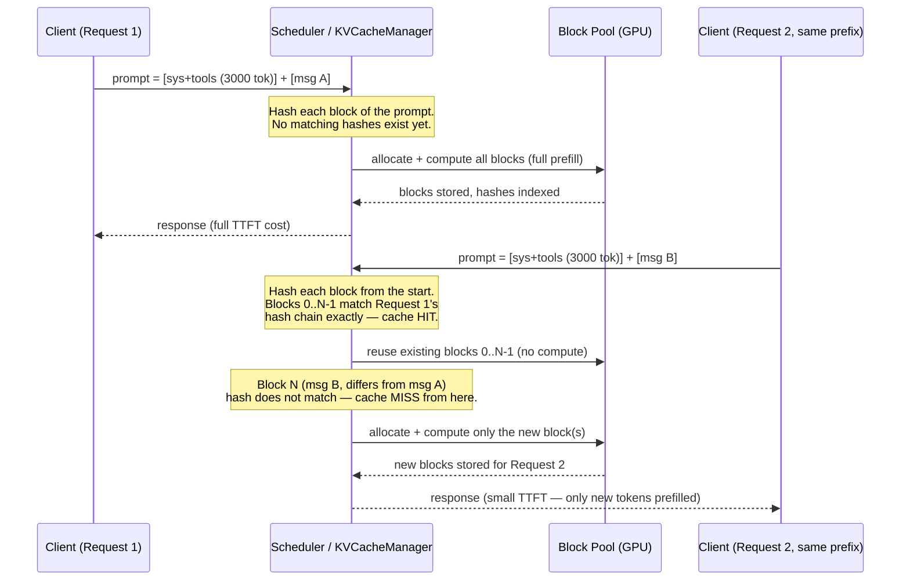

# Prefix Caching

## Learning Objectives

By the end of this chapter you will be able to:

- Explain why requests that share a long common prefix — a system prompt, a tool-definition block, a few-shot example set — are wasteful to serve naively, and what "wasteful" costs in GPU time and memory.
- Describe how vLLM turns PagedAttention's block-based KV cache (Chapter 7) into a **shared-block cache**: identical prefixes map to identical physical blocks instead of each sequence paying to recompute and store its own copy.
- Explain, conceptually, how vLLM recognizes a cache hit via block-level hashing, and why the hash has to include a block's position in the sequence, not just its token content.
- Explain copy-on-write block divergence: why sequences sharing a prefix's blocks can keep sharing them right up until the moment their content actually differs.
- Enable, disable, and verify prefix caching via `--enable-prefix-caching` / `--no-enable-prefix-caching`, and state vLLM V1's actual default correctly.
- Reason about **cache hit rate** as the metric that determines whether prefix caching is helping at all, and identify the concrete prompt-structure choices that raise or crater it.
- Apply the single highest-leverage prompt-engineering rule for agent builders: **static content first, variable content last** — and explain precisely why reordering a prompt can turn a near-100% cache hit rate into a near-0% one.
- Identify vLLM's current architectural limitation on prefix caching (Mamba/hybrid models) and judge, for a given workload, whether prefix caching will move the needle at all.

## Prerequisites

- **Chapter 7 (PagedAttention)** — this chapter assumes you're comfortable with: KV cache stored in fixed-size **blocks** (default 16 tokens each), a per-sequence **block table** mapping logical block indices to physical block indices, and the fact that physical blocks are just slots in a big, shared pool of GPU memory. Everything in this chapter is "one more idea layered on top of the block table" — if the block table isn't solid yet, go back to Chapter 7 first.
- **Chapter 6 (KV Cache)** — why K/V tensors exist per-token per-layer and why they get more expensive as context grows.
- **Chapter 10 (Memory Management)** — `--gpu-memory-utilization` and how vLLM budgets GPU memory for the KV cache pool that prefix caching reuses blocks *within*.
- Comfort with your own agent stack's prompt construction — this chapter is written assuming you've built a LangGraph or DeepAgents agent and know what its system prompt + tool-schema block typically looks like on the wire.

## The Motivating Scenario: You're Already Paying for This Prefix, Repeatedly

Think about what an actual request looks like from a LangGraph or DeepAgents agent. Every single turn, the prompt sent to the model is roughly:

```
[SYSTEM PROMPT: role, instructions, guardrails — 400 tokens]
[TOOL DEFINITIONS: 8-15 tool schemas with descriptions and JSON Schema
 parameter specs — 1,500-4,000 tokens]
[FEW-SHOT EXAMPLES, if any — 500-2,000 tokens]
[CONVERSATION HISTORY: grows every turn]
[THIS TURN'S USER MESSAGE / TOOL RESULT: usually short]
```

The first three blocks — system prompt, tool definitions, few-shot examples — are **byte-identical across every single call your agent makes**, whether it's the same conversation's next turn, a different user's session, or a batch job scoring a thousand documents with the same instructions. It's not unusual for this static block to be 2,000-6,000 tokens, dwarfing the actual "new" content of a given turn (which might be a 30-token tool result).

Without prefix caching, the engine treats every request as brand new: it recomputes the K and V projections for every token in that static block, on every single call, and stores the result in its own private set of KV cache blocks. For a workload with a 4,000-token shared prefix and thousands of calls per hour, that's thousands of redundant prefill passes over *identical* tokens, and thousands of redundant copies of the resulting KV cache sitting in GPU memory competing for space with everyone else's cache.

This is exactly the pattern PagedAttention's block design was built to exploit — it just needed one more idea on top: **if two sequences have identical tokens in the same position, they can point at the *same physical blocks* instead of each getting their own.**

## From Private Blocks to Shared Blocks

Recall from Chapter 7: a sequence's KV cache isn't one contiguous allocation — it's a **block table**, a list of physical block indices, each holding the KV cache for `block_size` tokens (default 16). Nothing about that design *requires* each sequence's block table to point at blocks nobody else uses. It just happened to work that way by default, because nothing yet was checking whether two sequences needed the same content.

Prefix caching adds exactly that check. When a new sequence starts, before running prefill on it, the engine's KV cache manager asks: **"Have I already computed and stored the KV cache for this exact sequence of tokens, in this exact position, before?"** If the first `k` blocks of the new sequence's tokens match blocks already resident in the cache pool from some earlier sequence, the new sequence's block table is populated with pointers to those *existing* physical blocks — no prefill compute, no new memory allocation for those blocks. Only the tokens *after* the matched prefix need to actually run through attention and get new blocks allocated.

This is the mechanism, end to end:

1. A new request arrives with its full token sequence (system prompt + tools + history + new turn).
2. The engine chunks the prompt into `block_size`-token blocks, same as any other prefill.
3. For each block, the engine computes a hash and checks it against a table of hashes for blocks currently held in the KV cache pool.
4. As long as consecutive blocks from the start of the prompt keep matching, the engine keeps reusing existing physical blocks — a **cache hit** — instead of computing new ones.
5. The moment a block's hash *doesn't* match anything cached (typically where the request's unique content begins), prefill resumes normally for that block and everything after it, and new physical blocks get allocated.

The net effect: two requests sharing a 4,000-token system prompt + tool-schema block, differing only in their last 50 tokens, do a full 4,000-token prefill exactly once between them — the second request "prefills" only its unique 50 tokens, and the engine simply extends its block table with pointers to the same physical blocks the first request already populated for the shared prefix.

## How a Cache Hit Is Recognized: Block-Level Hashing

The mechanism above depends on being able to answer "have I seen this block before, in this position?" cheaply — you can't afford to compare raw token tensors block-by-block against every other sequence's cache on every request.

Conceptually, vLLM answers this by computing a **hash per block** that folds together:

- the token IDs contained in that block, and
- the hash of the *preceding* block in the same sequence (i.e., the hashes chain from the start of the sequence forward).

Chaining the hash matters for a subtle but important reason: **the same 16 tokens appearing at block position 3 of one prompt and block position 7 of another prompt are not the same cache entry.** Attention is position-sensitive (positional embeddings/RoPE are baked into how K/V get consumed), so a block of tokens only produces an identical KV cache result if everything *before* it in the sequence was also identical. Chaining the hash from the start of the sequence encodes exactly that "everything before this block matched too" condition into the hash itself — a block's hash only matches an existing cache entry if the entire prefix up to and including that block matches, not just that one block's raw tokens in isolation.

This is why the *order* of prompt content is not cosmetic — it is the entire mechanism. A static block that always appears first, in the same position, with the same tokens, produces the same hash chain every time and hits the cache. The same static content appearing *after* some per-request variable content produces a completely different hash chain every time (because the chain now includes whatever came before it), and never hits the cache at all. Hold onto this — it's the basis for the single most actionable tip in this chapter, a few sections down.

> **Note on internals:** the exact hashing algorithm and the data structure vLLM uses to index cached blocks (radix-tree-style prefix matching, a flat hash table, etc.) are internal engine implementation details, and it's reasonable for those details to evolve between releases. The conceptual model above — a chained, position-aware hash per block, checked against a pool of previously-computed blocks — is the stable mental model to carry forward regardless of the exact current internal data structure.

Here's the same flow as a sequence diagram, showing a cache hit and a cache miss side by side for two back-to-back requests that share a prefix:



The key thing to notice: the hash comparison happens **block by block, from the start of the sequence**, and stops reusing the instant one block's hash fails to match — everything from that point forward is computed fresh, exactly as if prefix caching weren't in play at all for that portion.

## Copy-on-Write: Where Sharing Stops

Sharing physical blocks across sequences is only safe as long as nobody *writes* to a shared block. Two sequences sharing a prefix diverge the instant they generate different tokens — sequence A's next token and sequence B's next token are (almost always) different, so they cannot both live in the same physical block going forward.

This is standard **copy-on-write (COW)**, the same idea operating systems use for shared memory pages, applied to KV cache blocks:

- While two sequences' block tables both point at the same physical block and neither has written anything new into it, they share it — zero extra memory, zero extra compute for that block.
- The moment either sequence needs to write a *new* token's KV values into what would be the next slot of a shared block (or needs a wholly new block for content beyond the shared prefix), the engine allocates a fresh physical block for that sequence and stops pointing at the shared one from that point forward.
- Only the **generated portion** ever triggers this divergence. The shared prefix's blocks remain shared, referenced-counted, for as long as any active sequence still needs them.

This ties directly back to Chapter 7's block table: divergence is nothing more than "sequence B's block-table entry for logical block N now points at a different physical block index than sequence A's." No data movement, no special-casing in the attention kernel — it's a one-line change to a table of integers.

```mermaid
flowchart TB
    subgraph Pool["Physical KV Cache Block Pool"]
        P0["Block P0\n(sys prompt tokens 0-15)"]
        P1["Block P1\n(sys prompt tokens 16-31)"]
        P2["Block P2\n(tool schemas tokens 32-47)"]
        P3["Block P3\n(tool schemas tokens 48-63)"]
        A1["Block A1\n(Seq A's own tokens)"]
        B1["Block B1\n(Seq B's own tokens)"]
        C1["Block C1\n(Seq C's own tokens)"]
    end

    subgraph SeqA["Sequence A block table"]
        A_L0["logical 0"] --> P0
        A_L1["logical 1"] --> P1
        A_L2["logical 2"] --> P2
        A_L3["logical 3"] --> P3
        A_L4["logical 4 (divergent)"] --> A1
    end

    subgraph SeqB["Sequence B block table"]
        B_L0["logical 0"] --> P0
        B_L1["logical 1"] --> P1
        B_L2["logical 2"] --> P2
        B_L3["logical 3"] --> P3
        B_L4["logical 4 (divergent)"] --> B1
    end

    subgraph SeqC["Sequence C block table"]
        C_L0["logical 0"] --> P0
        C_L1["logical 1"] --> P1
        C_L2["logical 2"] --> P2
        C_L3["logical 3"] --> P3
        C_L4["logical 4 (divergent)"] --> C1
    end

    style P0 fill:#1f4a2a,stroke:#2e8b57,color:#fff
    style P1 fill:#1f4a2a,stroke:#2e8b57,color:#fff
    style P2 fill:#1f4a2a,stroke:#2e8b57,color:#fff
    style P3 fill:#1f4a2a,stroke:#2e8b57,color:#fff
    style A1 fill:#5a4a1f,stroke:#c0a030,color:#fff
    style B1 fill:#5a4a1f,stroke:#c0a030,color:#fff
    style C1 fill:#5a4a1f,stroke:#c0a030,color:#fff
```



Blocks `P0`-`P3` (the shared system prompt + tool schemas — 64 tokens across four 16-token blocks) are computed once and referenced by all three sequences' block tables. The moment each sequence starts generating its own content, it gets its own private block (`A1`, `B1`, `C1`) — that's the copy-on-write divergence point. Three sequences, one prefill of the shared prefix, three cheap "extensions" instead of three full prefills.

## Interaction with the Scheduler and Continuous Batching

Prefix caching doesn't operate as a separate stage bolted onto the engine — it's consulted directly inside the same `KVCacheManager` block-allocation path that Chapter 9's unified scheduler calls into on every step. When the scheduler admits a new sequence and asks the KV cache manager for blocks, the manager's answer is now "here are the blocks you need — some newly allocated, some pointers to already-resident cached blocks" rather than always "here are N freshly allocated blocks." This is why prefix caching composes cleanly with continuous batching (Chapter 8): a cache-hit sequence still gets scheduled, batched, and stepped through decode exactly like any other sequence — the *only* difference is how much prefill work it costs on its way in. From the scheduler's perspective, a sequence with a 3,000-token cache hit and a 50-token miss looks, for admission purposes, much closer to "a 50-token prompt" than to "a 3,050-token prompt" — which is exactly why prefix caching improves effective throughput and concurrency headroom, not just single-request latency: cache hits free up scheduler token-budget (`--max-num-batched-tokens`, Chapter 9) that would otherwise have gone to recomputing the shared prefix, leaving more room for other requests in the same scheduling step.

## Block Eviction: Why a Cache Hit Isn't Guaranteed Forever

The block pool backing prefix caching is the same finite pool of GPU memory used for every sequence's KV cache (Chapter 10) — cached blocks from a finished request aren't cost-free to keep around forever. Conceptually, a block that no active sequence's block table currently references becomes a candidate for **eviction**: reference-counted, and reclaimed (freed for a new allocation) under memory pressure once nothing needs it, typically favoring keeping more-recently-used blocks over older ones. This is why cache hit rate (discussed next) is a *live, traffic-dependent* number rather than a one-time property of your prompt: a shared prefix that's reused every few seconds under sustained load stays resident and keeps hitting; the same prefix reused once an hour under a memory-constrained deployment may well have been evicted to make room for other sequences' KV cache by the time the next request arrives, forcing a full recompute exactly as if caching were off for that request.

> **Note:** the precise eviction policy (LRU vs. some other recency/priority scheme) is an internal engine detail rather than a documented, stable contract — treat "recently-used blocks survive longer" as the right mental model, and verify current behavior in the docs/source if you need to reason precisely about eviction under a specific memory budget.

## Enabling, Disabling, and Verifying Prefix Caching

The flag is `--enable-prefix-caching` / its negation `--no-enable-prefix-caching`.

The fact that matters most in day-to-day use: **prefix caching is default-on in V1.** You do not need to pass `--enable-prefix-caching` to get this benefit — the V1 engine's stated design goal is "zero configs," turning on optimizations like this one by default rather than requiring you to discover and opt in to them. Most readers of this chapter will never type this flag at all.

Where the flag *does* matter:

- **Disabling it for a clean A/B comparison.** If you're benchmarking (Chapter 17) and want to isolate the effect of prefix caching itself — say, to justify a prompt-restructuring effort to a skeptical team, or to reproduce a specific worst-case latency number for capacity planning — pass `--no-enable-prefix-caching` explicitly to get a baseline with it off.
- **Debugging correctness questions.** Prefix caching is designed to be invisible to output correctness — a cache hit should produce numerically identical results to a fresh computation of the same tokens. If you ever suspect otherwise, disabling it is the fastest way to check whether the behavior is cache-related.
- **Confirming it's actually on**, since "default-on" is a fact about the version of vLLM you happen to be running, not a law of nature. Check `vllm serve --help` for the flag's current default, and check the server logs or `/metrics` for cache-related counters at startup — this is exactly the kind of detail worth a `> **Verify against current docs/`--help`.**` habit rather than trusting any single course chapter (including this one) to stay accurate across releases.

```bash
# Explicit baseline for a clean off/on comparison — most of the time you
# won't need to pass either flag, since ON is the default.
vllm serve meta-llama/Llama-3.2-1B-Instruct --no-enable-prefix-caching   # baseline: caching off
vllm serve meta-llama/Llama-3.2-1B-Instruct --enable-prefix-caching     # explicit on (same as default)
```

## Cache Hit Rate: The Metric That Tells You Whether Any of This Is Working

Prefix caching isn't a binary "on = fast, off = slow" switch — its payoff is entirely proportional to **cache hit rate**: the fraction of prefill tokens across your traffic that get served from existing blocks instead of freshly computed. A high hit rate means most of your prefill compute (and the GPU-seconds it costs) is being skipped entirely. A low hit rate means the feature is enabled but doing almost nothing for you, because your requests rarely actually share identical prefixes at the block level.

**What drives hit rate up:**

- A **stable, unmodified system prompt** across requests — the same instructions, verbatim, every call.
- **Consistent prompt structure and ordering** — the same blocks always appear in the same order, so the hash chain lines up call after call.
- **High request volume relative to prefix uniqueness** — many requests sharing few distinct prefixes (a chatbot with one system prompt serving thousands of users; a batch job applying one set of instructions across many documents).
- Enough **GPU memory allocated to the KV cache pool** (Chapter 10's `--gpu-memory-utilization`) that shared blocks don't get evicted before the next request that could reuse them arrives.

**What drives hit rate down:**

- **Dynamic content interleaved early in the prompt.** This is the big one, covered in its own section below.
- **High prompt diversity** — genuinely one-off, unstructured prompts with little shared structure between requests (a general-purpose completion API serving arbitrary user text with no common template).
- **Low request volume or long gaps between requests sharing a prefix** — if the cache pool evicts a block (because it needs the memory for something else) before another sequence can reuse it, that hit is lost.
- **Frequent, small edits to the "shared" prompt itself** — if your team A/B tests system prompt wording per-request, or injects a slightly different instruction variant per user segment, you've turned what should be one shared prefix into dozens of distinct ones, each needing its own cache entries.

Cache hit rate is exposed via vLLM's Prometheus `/metrics` endpoint (Chapter 20 covers wiring this into an observability stack); watch it the same way you'd watch any other efficiency metric — a production agent deployment with a large, static tool-definition block and a poor cache hit rate is a strong signal that something in the prompt-construction path is quietly defeating the cache.

## The Prompt-Engineering Implication: Static First, Variable Last

Given the hash-chaining mechanism above, one rule follows directly and is worth internalizing as a hard habit for anyone building agents on top of vLLM:

> **Put static, shared content at the start of the prompt. Put per-request variable content at the end.**

Concretely, for a LangGraph or DeepAgents system:

```
GOOD (cache-friendly) ordering:
[system prompt — static]
[tool definitions — static]
[few-shot examples — static]
[conversation history — grows, but each prior turn stays fixed once written]
[this turn's new user message / tool result — variable, changes every call]

BAD (cache-hostile) ordering:
[timestamp / request ID / user ID — variable, changes every call]
[system prompt — static]
[tool definitions — static]
[conversation history]
```

The bad ordering looks harmless — "I'll just prepend a timestamp so the model knows what time it is" — but because the hash chain for every block *after* the timestamp now includes that timestamp's contribution, **every single request produces a completely different hash chain from block zero onward, even though 95% of the prompt's tokens are identical to the previous call.** The cache hit rate for that prompt structure is effectively zero: you're paying full prefill cost for the entire static block, every single time, purely because of where one small piece of variable data was placed.

The fix costs nothing in capability — the model doesn't need the timestamp to appear *before* the instructions to use it correctly. Move it to the end (or into the final user-turn content, right next to what it's relevant to), and the entire static prefix in front of it becomes cacheable again.

This generalizes beyond timestamps: user IDs, session IDs, "current date is..." injections, randomized few-shot example ordering (if you're doing that for some reason), or any per-request templating that touches the *beginning* of the prompt all have the same cache-destroying effect. If it varies per request, it belongs as late in the prompt as your task allows.

## Known Limitation: Not Yet Supported for Mamba/Hybrid Models

As of the current V1 guide, **prefix caching is not yet supported for Mamba/hybrid-architecture models.** Mamba and hybrid (Mamba + attention) architectures maintain a fundamentally different kind of recurrent state rather than a token-indexed KV cache in the PagedAttention sense, so the block-hash-and-reuse mechanism described in this chapter doesn't have an equivalent to hook into yet for those architectures. If you're serving a Mamba/hybrid model, don't expect `--enable-prefix-caching` to do anything useful for it — verify current support before assuming otherwise, since this is an area of active engine development.

## When Prefix Caching Helps a Lot, and When It Barely Matters

| Workload shape | Expect prefix caching to help |
|---|---|
| Agent framework (LangGraph/DeepAgents) with a large, static tool-definition + system-prompt block resent every turn | **A lot** — this is close to the textbook use case |
| Chatbot/assistant product with one long, stable system prompt across all users | **A lot** — high request volume sharing one prefix |
| Batch scoring/classification: same instructions applied across thousands of documents | **A lot** — one static instruction prefix, many unique document bodies |
| Few-shot prompting with a fixed example set prepended to varying queries | **A lot**, as long as the examples/ordering never change per request |
| One-off, highly unique, unstructured prompts (general text completion with no shared template) | **Barely at all** — little to no shared prefix to hit |
| Prompts where variable content is injected at the very start (bad ordering, previous section) | **Little to none**, regardless of workload type — the ordering defeats the mechanism before it gets a chance to help |

The pattern: prefix caching is a bet on **repetition**. The more your traffic is "the same instructions, over and over, with the interesting part at the end," the more it pays off — and that describes the overwhelming majority of production agent workloads.

## Worked Example: TTFT With and Without Prefix Caching

The clearest way to see the effect is **time-to-first-token (TTFT)** — introduced in Chapter 1 — across a batch of requests that all share a long system prompt, varying only their final user message.

Setup: a ~3,000-token static system prompt (representative of a LangGraph agent's system prompt + tool schemas), 50 sequential requests each appending a short, unique final message, sent one after another to the same running server.

```bash
# Baseline run: prefix caching disabled
vllm serve meta-llama/Llama-3.2-1B-Instruct --no-enable-prefix-caching --port 8000

# Comparison run: prefix caching enabled (also the V1 default — shown
# explicitly here purely for a clean, labeled A/B comparison)
vllm serve meta-llama/Llama-3.2-1B-Instruct --enable-prefix-caching --port 8001
```

A minimal client that sends the same shared-prefix prompt repeatedly and measures TTFT via streaming:

```python
import time
from openai import OpenAI

STATIC_PREFIX = open("agent_system_prompt_and_tools.txt").read()  # ~3,000 tokens

def measure_ttft(base_url: str, user_message: str) -> float:
    client = OpenAI(base_url=base_url, api_key="token-abc123")
    start = time.perf_counter()
    stream = client.chat.completions.create(
        model="meta-llama/Llama-3.2-1B-Instruct",
        messages=[
            {"role": "system", "content": STATIC_PREFIX},   # static, first
            {"role": "user", "content": user_message},        # variable, last
        ],
        max_tokens=64,
        stream=True,
    )
    for chunk in stream:
        if chunk.choices and chunk.choices[0].delta.content:
            return time.perf_counter() - start   # time to first content token
    return time.perf_counter() - start

results_off = [measure_ttft("http://localhost:8000/v1", f"Request #{i}") for i in range(50)]
results_on  = [measure_ttft("http://localhost:8001/v1", f"Request #{i}") for i in range(50)]
```

**Illustrative results** (numbers below are a representative pattern to teach the shape of the effect, not a benchmark claim for any specific vLLM version/model/GPU — reproduce this on your own hardware for real numbers, ideally with `vllm bench serve`, Chapter 17):

| | Request #1 TTFT | Requests #2-50 TTFT (avg) | Why |
|---|---|---|---|
| **Prefix caching OFF** | ~180 ms | ~180 ms (flat) | Every request recomputes the full 3,000-token prefix from scratch — no request benefits from any other request's work |
| **Prefix caching ON** | ~180 ms | ~15-25 ms | Request #1 pays full prefill cost and populates the cache; requests #2-50 hit the cached prefix blocks and only prefill their own short, unique message |

The first request is identical either way — there's nothing to reuse yet. The gap opens immediately on request #2 and stays open for the rest of the batch: with caching on, TTFT drops to roughly "prefill cost of just the new tokens," because the 3,000-token static block is served from already-resident blocks instead of recomputed. This is the entire value proposition of the feature in one table — and it's precisely the shape of an agent loop, where the "first request" cost is paid once and every subsequent turn (from this session or any other session sharing the same system prompt) rides on it.

**A second illustrative shape worth internalizing — batch scoring**, since it's an equally common vLLM use case for agent/data teams: a fixed instruction ("classify the following support ticket into one of these seven categories: ...") applied across 10,000 unique documents, one request per document. Every request's prompt is `[static instructions, ~600 tokens] + [unique document body, 200-2,000 tokens]`. With prefix caching, request #1 pays for the 600-token instruction block once; requests #2 through #10,000 all skip it, regardless of how different their document bodies are from each other — because the *instructions*, not the documents, are what's shared and hashed identically every time. The unique document body still gets prefilled fresh every time (correctly — it's genuinely different content), but the fixed overhead that would otherwise be paid 10,000 times is paid once. At scale, this is often a larger aggregate saving than the agent-chat case, purely because of sheer request volume against one unchanging prefix.

## Real-World Scenario: A LangGraph Agent Resending Its Tool Definitions Every Turn

Consider a LangGraph agent wired to seven tools (a calendar lookup, a CRM query, a document search, a code execution sandbox, and three internal APIs), each with a moderately detailed JSON Schema and a multi-sentence description so the model reliably picks the right one. That tool-definition block alone commonly runs 2,000-3,500 tokens. Add a 400-token system prompt describing the agent's role and guardrails, and you're looking at a ~3,000-token static prefix that gets sent, unchanged, **on every single turn of every single conversation** — that's simply how the chat-completions API works: there's no server-side session state, so the full message history (including the system prompt and tools, which LangGraph typically re-attaches via the model binding on each invocation) goes out on the wire every time.

Without prefix caching, a five-turn conversation pays for that 3,000-token block *five times* — once per turn — even though it's the exact same tokens each time. Across a moderate number of concurrent users, that's a huge fraction of total prefill compute spent recomputing something that never changes, directly inflating TTFT on every turn and directly consuming scheduler/GPU capacity that could be serving other requests.

With prefix caching on (the V1 default), the very first request in the very first conversation of the day pays for that block once. Every subsequent turn — from that same conversation, from a different user's conversation, from a completely different session — hits the same cached blocks as long as the tool-definition block and system prompt are unchanged. The agent's *effective* per-turn prefill cost collapses to roughly "conversation history since it last changed, plus this turn's new content," which is exactly the input a well-designed LangGraph node should be adding incrementally anyway.

The practical takeaway for the team building this agent: don't personalize or template the system prompt/tool-definition block per-user or per-request unless you genuinely need to (e.g., don't inject a per-user API key or a per-tenant list of enabled tools directly into the *system prompt* text if you can pass it as a separate mechanism instead) — every such personalization fragments what would otherwise be one universally-shared, highly-cacheable prefix into many smaller, less-reused ones.

## Best Practices

- **Order your prompt static-first, variable-last.** This is the single most impactful, purely-free optimization covered in this chapter — no infrastructure change required, just prompt structure.
- **Keep the shared system prompt and tool-definition block byte-identical across requests** whenever possible. Even a single-character difference (a trailing newline change, a reformatted JSON schema) produces a different block hash and a full miss on that block onward.
- **Avoid per-request templating that touches the beginning of the prompt** — timestamps, request IDs, "current user: X" lines, and similar injected variables belong at the end, next to the content they're relevant to, not the start.
- **Verify prefix caching's actual default and current flag behavior with `vllm serve --help`** rather than assuming this chapter's V1-default-on description holds forever — it's accurate as of the version this course targets, but re-check for your installed version.
- **Watch cache hit rate as a real operational metric** (via `/metrics`), not just a one-time benchmark checkbox — a regression in hit rate is a signal that something changed in your prompt-construction path.
- **Allocate enough GPU memory to the KV cache pool** (`--gpu-memory-utilization`, Chapter 10) that cacheable blocks survive long enough between requests to actually get reused, rather than being evicted moments after creation under memory pressure.
- **Use `--no-enable-prefix-caching` deliberately for A/B benchmarking**, not as a production setting — it exists to isolate the feature's effect for measurement, not because you should routinely turn it off.
- **Don't hand-roll prompt caching logic in your agent framework** if vLLM's prefix caching already covers your case — LangGraph/DeepAgents application-level "let me manually cache the system prompt" tricks are usually solving a problem the serving engine already solves more reliably, transparently, and at the right layer (KV cache blocks, not application strings).

## Common Mistakes

- **Putting a timestamp, request ID, or user ID at the very start of the prompt.** This is the classic mistake this chapter exists to prevent — it silently destroys the cache hit rate for an otherwise perfectly cacheable static block, and it's easy to do by accident (e.g., a logging/tracing middleware that prepends metadata to every prompt).
- **Assuming prefix caching needs to be explicitly enabled.** It's default-on in V1 — spending effort "turning it on" is wasted; the effort belongs in verifying it's on and structuring prompts to benefit from it.
- **Reformatting or regenerating the "static" system prompt/tool schema per request** (e.g., re-serializing a Python dict to JSON with non-deterministic key ordering, or reformatting whitespace) — even though the *content* is logically the same, a different token sequence produces a different hash and misses the cache.
- **A/B testing system prompt wording in production without realizing each variant fragments the cache** — ten prompt variants means ten separate cache entries instead of one, each seeing a fraction of the traffic and a correspondingly lower steady-state hit rate.
- **Ignoring cache hit rate as a metric** and only looking at raw throughput/latency numbers, which makes it hard to tell whether a regression is a cache-hit-rate problem (fixable by prompt restructuring) or something else entirely (a GPU/scheduling problem).
- **Assuming prefix caching works for every model architecture.** It's not yet supported for Mamba/hybrid architectures — don't expect a benefit (or spend time debugging why there isn't one) for those model families without checking current support first.
- **Believing a cache hit changes output correctness.** It shouldn't — a cache hit is designed to be numerically equivalent to a fresh computation of the same tokens. If you observe otherwise, that's a bug worth investigating, not expected behavior.

## Summary

Prefix caching takes PagedAttention's block-based KV cache (Chapter 7) one step further: since identical tokens in identical sequence positions produce identical KV cache values, multiple sequences can share the same physical blocks for a common prefix instead of each computing and storing their own copy. vLLM recognizes a cache hit via a chained, position-aware hash per block — a block only matches an existing cache entry if the entire prefix leading up to it also matched, which is exactly why prompt *ordering* determines whether caching helps at all. Sequences sharing prefix blocks diverge via copy-on-write the instant they generate different content, at which point each gets its own private block going forward — a one-line change to the block table, no data copying required. The feature is controlled by `--enable-prefix-caching`/`--no-enable-prefix-caching` and is **default-on in V1**, so most deployments get this for free; the flag matters mainly for deliberate A/B benchmarking or debugging. Cache hit rate is the metric that tells you whether the feature is actually earning its keep for your specific traffic — driven up by stable, consistently-ordered prompts and high repetition, driven down by prompt diversity and, especially, by dynamic content (timestamps, user IDs) placed early in the prompt. The single most actionable takeaway for agent builders: **structure prompts with static/shared content first and variable content last** — this one habit is what turns a large, resent-every-turn system prompt and tool-definition block from a recurring cost into a one-time cost. The feature currently does not extend to Mamba/hybrid-architecture models, and its payoff scales directly with how repetitive your workload's prefixes actually are — enormous for agents, chatbots, and batch instruction-following; negligible for one-off, unstructured prompts.

## Knowledge Check

1. Two requests share an identical 3,000-token system prompt and tool-definition block but differ in their final user message. Explain, in terms of the block table and block hashing, what happens differently on the GPU for the second request compared to the first.
2. Why does the block hash need to incorporate the hash of the *preceding* block in the sequence, rather than just that block's own token content?
3. What is copy-on-write divergence in this context, and at what exact point does it happen for two sequences sharing a prefix?
4. Is `--enable-prefix-caching` something most vLLM V1 deployments need to pass explicitly? What is the flag actually useful for in practice?
5. An agent team adds a line like `"Current time: 2026-07-31T14:02:11Z"` to the very beginning of their system prompt, before the static instructions and tool schemas. What happens to their cache hit rate, and why? What's the fix?
6. Name two workload types where prefix caching would deliver a large win, and one where it would barely matter. Justify each with the mechanism, not just the label.

## Hands-On Exercise

Using a model small enough to run comfortably on your available GPU (e.g., a 1-3B instruct model):

1. Write (or reuse) a static "system prompt" text file of at least 1,500-2,000 tokens — a reasonable stand-in is a realistic LangGraph-style system prompt plus 5-8 tool JSON Schema definitions concatenated together.
2. Launch two server instances (or run one at a time to save GPU memory): one with `--no-enable-prefix-caching`, one with `--enable-prefix-caching` (or simply the default, unflagged).
3. Write a client script that sends 30-50 sequential chat-completion requests to each server, all using the same static system prompt and a different one-line user message each time. Measure **TTFT** for each request (time from sending the request to receiving the first streamed token), following the pattern in this chapter's worked example.
4. Plot or tabulate TTFT across the 30-50 requests for both servers. Confirm: request #1 should look similar on both; requests #2 onward should show a clear, sustained TTFT drop on the caching-enabled server.
5. Now repeat the experiment on the caching-enabled server, but move a fake variable field (e.g., a fresh UUID) to the *front* of the system prompt on every request instead of leaving the prompt static. Confirm that TTFT on requests #2+ regresses back toward the caching-off numbers — direct, hands-on proof of this chapter's central prompt-ordering rule.
6. If you have access to the server's `/metrics` endpoint, find the prefix-cache-related counters/gauges and correlate them with what you observed in steps 4 and 5.

## Further Reading

- vLLM V1 guide (prefix caching default behavior, current architecture): `https://docs.vllm.ai/en/latest/usage/v1_guide.html`
- vLLM design docs on automatic prefix caching: `https://docs.vllm.ai/en/latest/design/prefix_caching.html`
- vLLM features docs index (check for a current, dedicated prefix caching page under Features): `https://docs.vllm.ai/en/latest/features/`
- Kwon, Woosuk, et al. "Efficient Memory Management for Large Language Model Serving with PagedAttention." SOSP 2023 — the foundational paper this chapter builds directly on top of.
- `vllm bench serve` / `vllm bench latency` docs, for reproducing this chapter's worked example rigorously: `https://docs.vllm.ai/en/latest/cli/bench/serve.html`, `https://docs.vllm.ai/en/latest/cli/bench/latency.html`
- This repo's [LangGraph course](../langgraph-course/00-index.md) and [DeepAgents course](../deepagents-course/00-index.md) for how system prompts and tool bindings are actually constructed in the frameworks referenced throughout this chapter's scenarios.

<div style="display:flex;justify-content:space-between;align-items:center;">
  <a href="./10-memory-management.md">← Previous: Memory Management</a>
  <a href="./00-index.md">🏠 Index</a>
  <a href="./12-chunked-prefill.md">Next: Chunked Prefill →</a>
</div>
