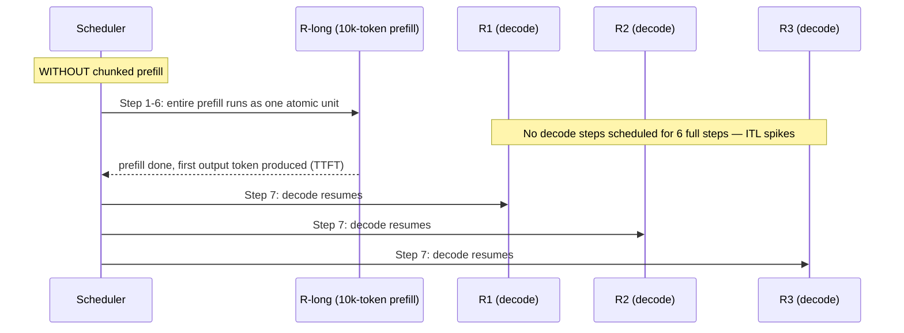
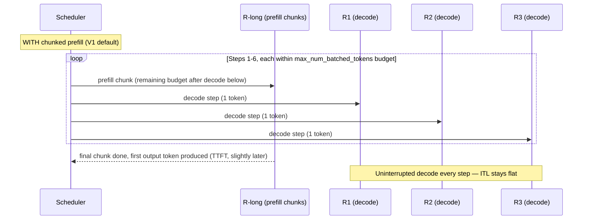

# Chunked Prefill

## Learning Objectives

By the end of this chapter, you will be able to:

- Explain precisely why an unchunked prefill of a long prompt is a scheduling problem, not just a compute-time
  problem — how one giant prefill step monopolizes the per-step token budget (`max_num_batched_tokens`, Chapter 9)
  and starves every other in-flight sequence's decode step for the duration
- Describe chunked prefill's mechanism: splitting a large prefill into smaller pieces, each admitted into a normal
  scheduler step alongside other sequences' decode work, instead of running the whole prefill as one isolated step
- Reason correctly about the trade-off direction: chunked prefill can slightly *increase* TTFT for the long-prompt
  request itself, while dramatically *improving* ITL/decode latency for every other concurrent request
- Distinguish chunked prefill (a fairness/latency-smoothing mechanism) from continuous batching (Chapter 8, a
  throughput mechanism) — these are commonly conflated, and this chapter draws the line explicitly
- State the current V1 default-on status of chunked prefill correctly, including which parts of that claim are
  solid and which need a fresh `--help`/docs check before you rely on them in production
- Connect chunked prefill's chunk sizing back to `max_num_batched_tokens` (Chapters 9–10) — the same knob that
  bounds total per-step tokens also bounds how large a single prefill chunk can be

---

## Prerequisites for This Chapter

This chapter builds directly on:

- **Chapter 8 (Continuous Batching)** — you should already understand iteration-level scheduling: that vLLM
  admits new sequences and drops finished ones every scheduler step rather than waiting for a fixed batch to
  fully complete. Chunked prefill is best understood as an extension of that same idea applied *within* a single
  request's prefill, not a separate concept bolted on top.
- **Chapter 9 (The vLLM Scheduler)** — you should already know that V1's scheduler is "unified": it treats prompt
  tokens and output tokens through the same per-step token budget (`max_num_batched_tokens`), rather than V0's
  older separate prefill-phase/decode-phase logic. This chapter assumes that unified-scheduler mental model as a
  given and builds the chunked-prefill story directly on top of it.
- **Chapter 2 (GPU & CUDA Fundamentals)** — the distinction between compute-bound and memory-bound GPU work.
  Prefill (processing many prompt tokens in parallel, one forward pass) is comparatively compute-bound; decode
  (generating one token per sequence per step) is comparatively memory-bandwidth-bound, dominated by reading KV
  cache. This chapter leans on that distinction to explain *why* interleaving the two workloads improves GPU
  utilization.

This chapter does **not** re-derive how the scheduler admits sequences in general (Chapter 9 owns that) or how
`max_num_batched_tokens`/`max_num_seqs` are tuned for memory (Chapter 10 owns that). Its job is narrower:
explain what happens when one request's prefill is *large* relative to the per-step budget, and how chunking that
prefill changes the latency profile for everyone sharing the engine.

---

## 1. The Problem: One Big Prefill Blocks Everyone Else

Recall from Chapter 1 that a request's lifecycle has two phases: **prefill** (process the entire prompt in one
forward pass, producing the first output token) and **decode** (generate output tokens one at a time,
autoregressively, each depending on the growing KV cache). Prefill is the expensive one when the prompt is long —
processing a 10,000-token document for summarization means a single forward pass over 10,000 tokens before the
model has produced a single word of output.

Chapter 9 established that V1's scheduler pulls from a shared per-step **token budget**
(`max_num_batched_tokens`) — the maximum number of tokens (prompt tokens *and* generated tokens combined) the
engine will process in one scheduler step, across all sequences. Continuous batching (Chapter 8) means the
scheduler is, in the steady state, mixing decode steps from many concurrent sequences into that budget every
step — that's what makes concurrent serving efficient.

Now put a 10,000-token prompt into that picture *without* chunking. If the scheduler treats "run this request's
prefill" as an atomic, all-or-nothing unit of work, it has two bad options:

1. **Devote an entire scheduler step (or several) exclusively to this one prefill**, deferring every other
   sequence's decode step until the prefill finishes. Every other user currently mid-generation sees their
   token stream stall for as long as the big prefill takes.
2. **Try to fit the 10,000-token prefill inside the same budget as ongoing decode work.** If
   `max_num_batched_tokens` is, say, 8,192, a single 10,000-token prefill doesn't even fit in one step's budget
   at all under a naive "prefill is atomic" model — it would need special-casing to exceed the budget just this
   once, defeating the purpose of having a budget.

Either way, the failure mode is the same from a concurrent user's point of view: **their decode steps stop
happening** while the long prompt's prefill runs. Concretely:

- The long-prompt request's own **TTFT** is whatever it takes to run the full prefill (compute-bound, roughly
  proportional to prompt length).
- Every *other* in-flight request's **ITL** (inter-token latency — Chapter 1) spikes for that same duration,
  because the scheduler wasn't giving their sequences any decode steps while the big prefill occupied the
  engine.
- From a fairness standpoint, one large request degrades the experience of every concurrent request, in
  proportion to how long its prefill takes — a single 10,000-token summarization request can stall a dozen
  concurrent chat users for the time it takes to prefill 10,000 tokens.

This is the core problem chunked prefill exists to solve. It is not a memory problem (Chapter 10's territory) and
it is not a raw-throughput problem (Chapter 8's territory) — it's a **scheduling fairness** problem: how do you
let a small number of huge requests coexist with a large number of small ones, without the huge ones starving the
small ones of scheduler steps.

---

## 2. Chunked Prefill's Idea: Split the Prefill, Interleave the Chunks

Chunked prefill's fix is exactly what the name says: instead of treating a long prompt's prefill as one
monolithic unit of work, split it into smaller **chunks**, each sized to fit comfortably inside a normal
scheduler step's token budget alongside other sequences' decode work.

Mechanically, with chunking:

- The scheduler computes how much of the per-step token budget (`max_num_batched_tokens`) is left after
  admitting decode steps for already-running sequences.
- Whatever budget remains in that step gets allocated to the next chunk of a pending (or partially-prefilled)
  long prompt.
- The long prompt's prefill state (how many prompt tokens have been processed so far) is tracked across steps —
  it isn't restarted each time, it resumes from where the previous chunk left off.
- This repeats over as many scheduler steps as it takes to consume the entire prompt, with each of those steps
  *also* carrying decode work for other sequences.

The mental shift is: **"one giant prefill step, then normal scheduling resumes"** becomes **"prefill work
interleaved with decode work across several steps, exactly like continuous batching interleaves multiple
sequences' decode work already."** Chunked prefill essentially extends the continuous-batching principle one
level deeper — instead of only interleaving *whole requests*, it interleaves a *phase of a single request*
(prefill) with the ongoing decode work of others.

### 2.1 Why this specifically helps: the compute-bound/memory-bound mix

Chapter 2 established that prefill and decode have different GPU utilization profiles:

- **Prefill** processes many tokens in one pass — it's comparatively **compute-bound**, since the GPU can
  parallelize the matrix multiplications across the prompt's tokens and keep the tensor cores well fed.
- **Decode** processes exactly one new token per sequence per step — it's comparatively **memory-bound**, since
  the dominant cost is reading each sequence's KV cache from GPU memory rather than doing large matrix
  multiplications.

A scheduler step that's *pure* decode for a batch of sequences under-utilizes the GPU's compute throughput
(memory-bandwidth is the bottleneck, compute units sit relatively idle). A scheduler step that's *pure* prefill
for one huge request under-utilizes the opportunity to interleave cheap memory-bound work into the same step.
Mixing a prefill chunk into a step that also carries several sequences' decode work lets the same step exercise
both the compute units (via the chunk) and the memory bandwidth (via the decode work) more evenly — better
overall GPU utilization than segregating the two workloads into separate all-prefill or all-decode steps.

---

## 3. The Latency Trade-off: Whose Number Gets Better, Whose Gets (Slightly) Worse

This is the trade-off to internalize precisely, because it's easy to state backwards:

| Metric | Without chunking | With chunking |
|---|---|---|
| **TTFT of the long-prompt request itself** | Lower bound: however long the raw compute takes, run as one uninterrupted pass | Slightly **higher** — its own prefill is now spread across multiple scheduler steps, each of which may also be sharing budget with other sequences' decode work, so wall-clock time to first token can stretch out a bit |
| **ITL of *other* concurrent requests** | Spikes badly for the entire duration of the big prefill — their decode steps are blocked | Improves dramatically — other sequences keep getting decode steps in between prefill chunks, so their token stream doesn't stall |
| **Overall GPU utilization / aggregate throughput** | Can be lower — steps tend toward being either compute-heavy (pure prefill) or memory-heavy (pure decode), rarely both | Generally better — chunks of compute-bound prefill work and memory-bound decode work coexist in the same step more often |

The important framing: chunked prefill is fundamentally a **fairness and latency-smoothing mechanism**, not a
pure throughput mechanism. It is easy to conflate with continuous batching (Chapter 8), which genuinely exists to
maximize throughput by keeping the GPU saturated with as many concurrent sequences as memory allows. Chunked
prefill's primary job is different: it exists so that **one large request doesn't unfairly monopolize the
scheduler at the expense of everyone else's latency**. Any throughput improvement it produces (via better
compute/memory-bound mixing, Section 2.1) is a secondary, welcome side effect — not the mechanism's reason for
existing. If someone asks "does chunked prefill make my server faster?", the precise answer is: it makes the
*distribution* of latency across concurrent users fairer and smoother, and it *can* improve aggregate throughput
as a side effect of better batching composition — but "faster for the one big request" is specifically **not**
what it optimizes for; that request's own TTFT is the one number that can get slightly worse.

---

## 4. Scheduler Step Timeline: Before and After Chunking

The diagram below shows one long-prompt request (`R-long`, a 10,000-token prompt) arriving alongside three
already-running chat sequences (`R1`, `R2`, `R3`) that are mid-decode. Without chunking, `R-long`'s entire prefill
occupies the scheduler exclusively; with chunking, it's split into pieces that share steps with `R1`–`R3`'s
decode work.

Read these two sequence diagrams side by side. In the "without chunking" version, `R1`–`R3` get zero decode steps
for the entire duration of `R-long`'s prefill — six full scheduler steps of silence from their perspective, which
is exactly what shows up as an ITL spike for those users. In the "with chunking" version, every scheduler step
carries *both* a slice of `R-long`'s prefill *and* a decode step for each of `R1`–`R3` — `R-long`'s total prefill
still takes roughly the same six steps end to end (its TTFT is unchanged or slightly worse, since each chunk now
shares the step with other work), but `R1`–`R3` never stall.

---

## 5. Interaction With `max_num_batched_tokens`

Chapters 9 and 10 introduced `max_num_batched_tokens` as the ceiling on total tokens (prompt + generated)
processed per scheduler step. Chunked prefill doesn't introduce a separate, independently-configured "chunk
size" knob to learn — the effective chunk size **falls out of** that same per-step budget:

- Each scheduler step has `max_num_batched_tokens` total tokens to spend.
- Ongoing decode steps for already-admitted sequences claim some of that budget first (each decode step needs
  exactly 1 token per sequence, so a batch of *N* actively-decoding sequences claims *N* tokens of the budget).
- Whatever remains is available for the next chunk of any prefill in progress — so if `max_num_batched_tokens`
  is 8,192 and there are 100 sequences mid-decode, roughly 8,092 tokens remain for prefill chunk(s) in that step.
- A larger `max_num_batched_tokens` means fewer, larger chunks (a long prefill finishes in fewer steps, closer to
  the unchunked TTFT — but with more scheduler-step "weight" taken away from decode work in each of those steps).
  A smaller `max_num_batched_tokens` means more, smaller chunks (smoother interleaving with decode work, better
  ITL protection for concurrent sequences — but the long prompt's own prefill, and therefore its TTFT, stretches
  across more steps).

This is the same tuning surface from Chapter 10, viewed through a new lens: **`max_num_batched_tokens` is
simultaneously your total per-step throughput ceiling and your effective chunked-prefill chunk-size ceiling.**
There's no separate "set chunk size to N tokens" flag to learn — you tune the fairness/TTFT trade-off through the
same lever you already tune for memory and throughput.

---

## 6. V1 Status: Default-On, Not Opt-In

Per this course's fact sheet (verified via a live fetch of vLLM's `docs/usage/v1_guide.md`): **chunked prefill is
enabled by default whenever possible in V1**, a deliberate change from V0's behavior, where it was only
conditionally enabled based on model characteristics. This lines up with V1's broader "zero configs" design
philosophy (also covered in Chapters 8 and 11 for continuous batching and prefix caching, respectively) —
optimizations that used to require an opt-in flag or only applied to certain model families now apply by default
across the board.

A CLI flag, `--enable-chunked-prefill`, exists in the current surface. Per the fact sheet, it is **largely
vestigial for disabling the behavior** in V1 — the default-on behavior is the documented current state, and the
flag's main historical purpose (opting in on V0, where it wasn't automatic) no longer applies since there's
nothing to opt into.

> **Unconfirmed — verify against `vllm serve --help` before relying on this in production.** Whether
> `--enable-chunked-prefill` / a `--no-enable-chunked-prefill` counterpart still parses at all as a functioning
> CLI flag — and whether passing it actually changes engine behavior versus being silently ignored — was not
> independently re-verified beyond the V1 guide's prose at the time this course was written. Treat "chunked
> prefill is on, and the flag may or may not do anything if you try to turn it off" as the safe operating
> assumption, and confirm the exact current behavior against `vllm serve --help` and `docs.vllm.ai` before
> designing any production configuration around disabling it.

> **Note (historical/legacy context):** older tutorials and blog posts written against V0 sometimes describe
> chunked prefill as a feature you had to explicitly enable, and note that it was conditionally available
> depending on the model. That framing described V0's actual behavior at the time — it does not describe
> current V1 behavior, where chunked prefill is on by default across supported models. If you're reading an
> older post that says "enable chunked prefill with `--enable-chunked-prefill` to get this benefit," treat that
> as a V0-era instruction, not current guidance.

---

## 7. Worked Example: Before and After

### Setup

A single vLLM V1 server hosts a chat-assistant model serving two kinds of traffic simultaneously:

- **Three short chat requests** (`R1`, `R2`, `R3`), each with a ~200-token prompt, already mid-decode, each user
  watching tokens stream in and expecting smooth, low-ITL output — this is the classic interactive chat UX where
  perceptible stutter between tokens is immediately noticeable.
- **One long-document request** (`R-long`): a 10,000-token document submitted for summarization, just arrived.

### Scenario A — chunked prefill unavailable (illustrative, V0-style behavior for comparison)

`R-long` arrives and its entire 10,000-token prefill is scheduled as one large, uninterrupted unit of work. For
the several hundred milliseconds to low seconds that prefill takes to compute (exact duration depends on model
size, GPU, and prompt length), the scheduler produces no decode steps for `R1`, `R2`, or `R3`. From those three
users' point of view: the token stream that had been arriving smoothly suddenly pauses, then resumes all at once
once `R-long`'s prefill finishes and its own first output token is produced. Their **ITL** for that window spikes
to roughly the full duration of `R-long`'s prefill — a single new request degraded three other users' experience
simultaneously, and the effect scales with however many concurrent users happen to be decoding at the moment a
long prompt arrives.

`R-long`'s own **TTFT** in this scenario is close to the theoretical minimum: one uninterrupted forward pass over
10,000 tokens, nothing competing for the GPU during that window.

### Scenario B — chunked prefill enabled (current V1 default)

`R-long`'s 10,000 tokens are split into chunks sized to fit the remaining per-step token budget after `R1`–`R3`'s
decode steps are accounted for (Section 5). Each scheduler step now does a little of everything: one decode
token for each of `R1`, `R2`, `R3`, plus one chunk of `R-long`'s prefill. `R1`–`R3` continue receiving a token
essentially every step, exactly as if `R-long` had never arrived — their **ITL** stays flat and unaffected.

`R-long`'s **TTFT** is now the sum of several step-intervals, each of which is sharing GPU time with the chat
requests' decode work rather than having the GPU exclusively — so its TTFT is measurably higher than Scenario
A's, though still bounded and predictable (proportional to prompt length divided by the effective chunk
throughput).

### The trade being made

Three users' interactive experience stays smooth at the cost of one user's document-summarization request taking
somewhat longer to produce its first token. For almost every real deployment mixing interactive chat traffic with
occasional long-context requests, that's exactly the trade you want — a slightly slower summarization response is
far less noticeable to that one user than a full ITL stall would be to three others simultaneously.

---

## 8. Real-World Scenario: A RAG Pipeline Sharing a Server With Chat Traffic

A production deployment serves a single vLLM instance behind two different application paths on the same
organization's infrastructure:

1. **A RAG (retrieval-augmented generation) pipeline** that retrieves several document chunks per query,
   concatenates them into the prompt along with the user's question, and sends requests that frequently land in
   the 4,000–12,000 prompt-token range — the retrieved context dominates prompt length.
2. **A general-purpose internal chat assistant**, whose prompts are typically short (a few hundred tokens of
   conversation history) but whose users are latency-sensitive and notice any stutter in the streamed response.

Both application paths point at the same `vllm serve` endpoint to share GPU capacity and avoid running two
separate deployments for cost reasons. Without chunked prefill's default-on behavior, every RAG query with a
large retrieved-context prompt would periodically stall every concurrent chat user for as long as that RAG
query's prefill takes — an infrastructure decision made purely for cost efficiency would visibly degrade an
unrelated product's user experience, and the two teams operating these two application paths would have no
obvious reason to connect "chat feels stuttery sometimes" to "the RAG team just shipped a feature that retrieves
more context chunks per query."

Because V1 enables chunked prefill by default, this exact contention is smoothed automatically: RAG queries'
large prefills get split into chunks and interleaved with chat users' decode steps rather than blocking them
outright. The operational lesson generalizes: **any time a single vLLM instance serves a mix of long-context and
short-interactive traffic, chunked prefill is precisely the mechanism that keeps that mix viable on shared
hardware** — and it's worth explicitly verifying (via `/metrics` or a benchmark, Chapter 17) that it's actually
active and doing its job, rather than assuming it silently based on this chapter's description alone.

---

## 9. Best Practices

- **Don't try to "turn off" chunked prefill to chase a lower TTFT for large-prompt requests** unless you've
  measured that the ITL cost to concurrent traffic is acceptable for your workload — chunking exists specifically
  because that trade is usually the right one for shared, multi-tenant serving. If you truly have a
  single-tenant, batch-only workload (no concurrent decode traffic to protect), the trade-off chunked prefill is
  built for may simply not apply to you — but confirm that's genuinely your traffic shape before disabling
  anything.
- **Tune `max_num_batched_tokens` with chunked prefill's chunk-size implication in mind (Section 5), not just its
  memory implication (Chapter 10).** A very small `max_num_batched_tokens` chosen purely to conserve memory will
  also produce very small prefill chunks — smoothing ITL further, but stretching out large prompts' TTFT more
  than you might expect from a memory-tuning decision alone.
- **Benchmark with a realistic mix of prompt lengths, not just one shape.** A benchmark run entirely with
  uniform, short prompts (Chapter 17) will never exercise the scenario chunked prefill exists for. Include at
  least one long-prompt class of request in any benchmark meant to represent real mixed traffic.
- **Monitor ITL, not just aggregate throughput, when validating this behavior.** Aggregate tokens/sec can look
  fine even when a subset of unlucky concurrent users are experiencing periodic ITL spikes — per-request latency
  percentiles (p50/p95/p99 ITL) are what actually reveal whether long-prompt requests are degrading concurrent
  decode fairness.
- **Re-verify the exact current flag behavior before writing it into a production runbook.** Given the fact
  sheet's explicit caveat (Section 6), don't hand a teammate a runbook step that says "pass
  `--no-enable-chunked-prefill` to disable this" without first confirming, against your installed version's
  `--help` output, that doing so has any effect at all.

---

## 10. Common Mistakes

- **Assuming disabling chunked prefill is possible or meaningful in V1 without checking current docs.** The
  `--enable-chunked-prefill` flag's continued existence in `--help` output does not by itself guarantee it still
  changes engine behavior — per the fact sheet, this is explicitly unconfirmed and needs a fresh check against
  your installed version before you rely on it.
- **Conflating chunked prefill with continuous batching.** They interact and reinforce each other, but they solve
  different problems: continuous batching (Chapter 8) maximizes throughput by keeping many sequences in flight;
  chunked prefill protects concurrent sequences' latency fairness from being trampled by one large sequence's
  prefill. Describing chunked prefill as "a throughput optimization" in an interview or design doc is the kind of
  imprecision that reads as not having internalized the distinction.
  Chunked prefill is a *fairness* mechanism whose *side effect* can be improved throughput — not the reverse.
- **Expecting chunked prefill to make the long-prompt request itself faster.** It doesn't, and isn't meant to —
  its own TTFT typically gets slightly worse, not better, because its prefill work now shares scheduler steps
  with other sequences instead of monopolizing them.
- **Treating "the flag exists in `--help`" as proof the underlying behavior is opt-in.** In V1, the *default* is
  what matters for describing current behavior; a flag's mere presence in `--help` output doesn't tell you
  whether the behavior it names is on-by-default, off-by-default, or (per Section 6) whether the flag does
  anything functional at all anymore.
  If old blog posts insist you must pass `--enable-chunked-prefill` to "turn this on," treat that as V0-era
  advice describing V0's actual conditional-enablement behavior, not current V1 defaults.
- **Tuning `max_num_batched_tokens` purely for a memory/OOM concern (Chapter 10) without noticing its
  double duty as the effective chunk-size ceiling (Section 5).** A change made to fix a memory problem can
  silently change your long-prompt TTFT and short-prompt ITL profile as a side effect — treat this as one knob
  with two coupled effects, not two independent knobs that happen to share a name.

---

## 11. Summary

- A long prompt's prefill, if scheduled as one atomic, uninterrupted unit of work, monopolizes the scheduler's
  per-step token budget (`max_num_batched_tokens`) for its entire duration — starving every other concurrent
  sequence of decode steps and spiking their ITL for as long as the prefill takes.
- **Chunked prefill** splits a large prefill into smaller pieces, each processed as part of a normal scheduler
  step alongside other sequences' decode work — "one giant prefill step, then normal scheduling resumes" becomes
  "prefill interleaved with decode across several steps."
- The trade-off: the long-prompt request's own **TTFT** may increase slightly (its prefill now shares steps with
  other work), while every other concurrent request's **ITL** improves dramatically (they're no longer blocked
  behind one huge prefill). Overall GPU utilization also tends to improve, since compute-bound prefill chunks and
  memory-bound decode work can be mixed more evenly per step (Chapter 2's compute-bound/memory-bound
  distinction).
- Chunked prefill is fundamentally a **scheduling fairness / latency-smoothing mechanism**, distinct from
  continuous batching's **throughput** focus (Chapter 8) — don't conflate the two, even though they interact and
  reinforce each other.
- In current V1, chunked prefill is **enabled by default whenever possible**, unlike V0's conditional,
  model-dependent enablement. The `--enable-chunked-prefill` flag still exists but is largely vestigial for
  disabling the behavior — verify against `vllm serve --help` and current docs before relying on any specific
  disable behavior.
- Effective chunk size is bounded by `max_num_batched_tokens` (Chapters 9–10) — there's no independent
  "chunk size" setting; the same knob that caps total per-step tokens also caps how large a prefill chunk can be
  in any given step.

---

## 12. Knowledge Check

1. A 10,000-token summarization request arrives on a server that's also serving several concurrent chat users
   mid-decode. Without chunked prefill, what specifically happens to those chat users' ITL, and why?
2. Explain why chunked prefill typically makes the long-prompt request's *own* TTFT slightly worse, not better —
   what exactly is it now sharing scheduler steps with that it wasn't before?
3. A colleague describes chunked prefill as "vLLM's way of increasing throughput." What's imprecise about that
   framing, and how would you correct it using the distinction between chunked prefill and continuous batching?
4. Why does prefill being comparatively compute-bound and decode being comparatively memory-bound (Chapter 2)
   matter for explaining chunked prefill's GPU-utilization benefit? What happens in a scheduler step that mixes
   both, versus a step that's purely one or the other?
5. You reduce `max_num_batched_tokens` to fix an OOM issue (Chapter 10). What secondary effect does this have on
   chunked prefill's behavior, and specifically on the TTFT of large-prompt requests going forward?
6. A teammate wants to disable chunked prefill for a batch-only workload with no concurrent decode traffic to
   protect. What would you tell them to check before writing `--no-enable-chunked-prefill` into a config file,
   given what this chapter says about the flag's current status?

---

## 13. Hands-On Exercise

Reproduce the before/after ITL effect from Section 7 concretely, using `vllm bench serve` (Chapter 17's tool) or
a small custom script against a running `vllm serve` instance.

1. **Stand up a server** with a modest model you can run locally or on a rented GPU (e.g. a small instruct model
   in the 1B–8B range), noting your installed vLLM version (`vllm --version`) since chunked-prefill's exact
   default/flag behavior is version-sensitive per Section 6.

2. **Establish a short-prompt decode baseline.** Send a steady stream of several concurrent short chat-style
   requests (a few hundred tokens each, `max_tokens` set to something like 200–300 so you get a real decode
   stream to measure) and record their per-token ITL distribution (p50/p95) with nothing else competing for the
   engine.

3. **Introduce one long-prompt request mid-stream.** While the short requests are still running, fire off a
   single request with a very long prompt (e.g. paste in a 8,000–10,000-token document — any long article or
   generated filler text works) and a small `max_tokens` (you care about its TTFT and its effect on others, not
   its own output length). Keep the short requests' load running concurrently throughout.

4. **Observe the short requests' ITL during the long request's prefill window.** With chunked prefill active
   (the current V1 default), the short requests' ITL should stay close to your Step 2 baseline. Record the
   numbers.

5. **If your installed version's `--enable-chunked-prefill` / disable flag still functions (verify first per
   Section 6), repeat the same test with it explicitly disabled** and compare. You should see the short
   requests' ITL spike noticeably during the long request's prefill window in this run, versus the flat profile
   from Step 4 — this is the concrete, measured version of the before/after contrast in Section 7's worked
   example.

6. **Record the long-prompt request's own TTFT in both runs.** Confirm the direction of the trade-off described
   in Section 3: TTFT for the long request should be equal or slightly *worse* with chunking active, while the
   short requests' ITL should be dramatically *better*.

7. **Bonus:** repeat the experiment with two or three different `max_num_batched_tokens` values (Chapter 10) and
   observe how the short-request ITL and long-request TTFT both shift as the effective chunk size changes,
   confirming Section 5's claim that this one flag governs both.

---

## 14. Further Reading

- `docs.vllm.ai` — search for "chunked prefill" in the current V1 user guide (`docs/usage/v1_guide.md` at the
  time this course was written) for the exact current wording on default-on behavior; always check which version
  of the docs you're reading, since they track `main`
- `github.com/vllm-project/vllm/releases` — check release notes for any changes to chunked-prefill defaults or
  flag behavior between versions; this is exactly the kind of detail that can shift release to release
- Kwon, Woosuk, et al. *"Efficient Memory Management for Large Language Model Serving with PagedAttention."*
  SOSP 2023 — the foundational paper behind the KV cache/block-based memory model that chunked prefill's
  step-by-step chunk admission builds on top of (Chapter 7)
- This repo's [Chapter 8 — Continuous Batching](./08-continuous-batching.md) — the throughput-focused iteration-level
  scheduling concept that chunked prefill extends one level deeper
- This repo's [Chapter 9 — The vLLM Scheduler](./09-vllm-scheduler.md) — the unified per-step token budget model
  this chapter assumes throughout
- This repo's [Chapter 10 — Memory Management](./10-memory-management.md) — `max_num_batched_tokens` tuning for
  memory, now revisited here for its chunk-size implication
- This repo's [Chapter 17 — Benchmarking](./17-benchmarking.md) — `vllm bench serve` and the TTFT/ITL/throughput
  measurement methodology used in this chapter's Hands-On Exercise

---

  <a href="./11-prefix-caching.md">← Previous: Prefix Caching</a>
  <a href="./00-index.md">🏠 Index</a>
  <a href="./13-quantization.md">Next: Quantization →</a>

