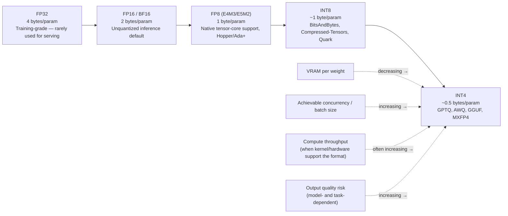

# Quantization

## Learning Objectives

By the end of this chapter, you will be able to:

- Explain what happens to weight precision on the inference-serving side of the precision ladder (FP32 → FP16/BF16 → FP8 → INT8 → INT4), and why the trade-off differs subtly from the training-side trade-off you may already know from QLoRA/fine-tuning contexts
- Name the quantization methods vLLM supports today (FP8, GPTQ, AWQ, GGUF, MXFP4, NVFP4, BitsAndBytes, TorchAO, Quark, Compressed-Tensors) and explain the practical difference between "needs a pre-quantized checkpoint" methods and "quantize on load" methods
- Use the `--quantization <method>` flag (and the equivalent `LLM(quantization=...)` constructor argument) correctly for FP8, AWQ, and GPTQ checkpoints
- Explain GGUF's out-of-tree status in current vLLM — why it requires installing a separate plugin package, what the docs themselves say about its maturity, and when llama.cpp/Ollama are simply the better tool for a GGUF file
- Reason about the VRAM/throughput/quality trade-off quantization presents, without treating any single method as a universal "best" choice
- Design and run a structured comparison of the same model at two different precisions, measuring memory, latency, throughput, and output quality rather than eyeballing "it feels faster"

## Prerequisites

This chapter builds directly on:

- **Chapter 2 (GPU & CUDA Fundamentals)** — you should already have the precision ladder (FP32 → FP16/BF16 → FP8 → INT8 → INT4) and the concept of tensor cores from that chapter. This chapter doesn't re-derive what a floating-point format is or why GPUs have dedicated low-precision matrix-multiply hardware; it applies that vocabulary specifically to *serving* a model rather than training one.
- **Chapter 3 (vLLM Fundamentals)** — you've already seen the `quantization` field on the `LLM` constructor (defaulting to `None`) and the `dtype` field (defaulting to `"auto"`) without needing to use either yet. This chapter is where both become load-bearing.
- **Chapter 10 (Memory Management)** — you should already be comfortable with `gpu_memory_utilization` and the general shape of "how much VRAM does this model need." Quantization is one of the biggest levers you have for changing that number, so this chapter assumes you know *why* VRAM budget matters, not just that it does.

If you've fine-tuned a model with QLoRA, you already have real intuition here: QLoRA loads a frozen base model in 4-bit (usually NF4) to save memory during *training*, while full-precision adapters do the actual learning. This chapter is the mirror image of that idea applied to *inference*: there's no training happening, no adapters, no gradients — just a forward pass, over and over, for as many concurrent requests as your scheduler can pack in. The question isn't "can 4-bit weights still support backprop well enough to learn," it's "can 4-bit (or 8-bit, or FP8) weights still produce good enough token predictions, at a batch size and speed a full-precision checkpoint couldn't touch." Same compression techniques, materially different reason for reaching for them.

---

## 1. The Precision Ladder, Revisited for Serving

Chapter 2 introduced the precision ladder as a GPU/CUDA fact: numbers can be represented with more or fewer bits, and fewer bits means less memory and (with matching hardware support) faster arithmetic, at a cost to representable range and precision. Here it is again, laid out specifically for what it means to **serve** an already-trained model:

| Format | Bits/param | Bytes/param | Typical role in serving |
|---|---|---|---|
| FP32 | 32 | 4 | Training-grade precision; essentially never used to *store* weights for inference — wasteful VRAM for no serving-time benefit |
| FP16 / BF16 | 16 | 2 | The common **unquantized** inference default — this is what `dtype="auto"` typically resolves to for a modern checkpoint |
| FP8 (E4M3 / E5M2) | 8 | 1 | First quantization rung; native tensor-core support on recent NVIDIA hardware makes this often the best default quality/perf trade-off available today |
| INT8 | 8 | ~1 | Integer quantization; comparable memory footprint to FP8 but a different numeric representation (fixed-point vs. floating-point), with different accuracy characteristics per model |
| INT4 | 4 | ~0.5 | Aggressive quantization; GPTQ, AWQ, and GGUF all commonly target 4-bit; largest VRAM win, largest quality-risk surface |

Two things are worth being explicit about, because they're easy to blur together:

**First, this is a *storage and compute* format for weights, not a *training* decision.** Nothing here involves gradients, adapters, or backprop stability. The only question quantization answers at serving time is: how many bytes does each parameter occupy in GPU memory, and what numeric format does the matrix-multiply hardware operate on when it multiplies those weights against activations?

**Second, "lower precision" buys you two independent things, not one:**

1. **Less VRAM per weight.** A 70B-parameter model at BF16 needs roughly 140 GB just for weights; the same model at INT4 needs roughly 35 GB. That's the difference between "needs multiple high-end GPUs" and "fits on one."
2. **Often faster compute — but only if the hardware and kernel actually support the lower-precision format natively.** FP8 is fast on Hopper/Ada-generation NVIDIA GPUs (and newer) because those cards have dedicated FP8 tensor-core paths. Running FP8 math on a card without that support, or running a quantization format whose kernel implementation isn't well-optimized, can *underperform* a well-supported FP16 path even though it's using fewer bits. Bit-width and speed are correlated, not causally identical — the kernel matters as much as the format.

Both of these come at a cost: **quality**. Compressing a weight matrix loses information, and how much that hurts a specific model on a specific task is not something you can predict from the bit-width alone — it has to be measured. That measurement is exactly what this chapter's hands-on exercise (Section 7) walks you through, with Chapter 17 (Benchmarking) supplying the measurement tools in depth.

---

## 2. Why Serving Cares About This Differently Than Training Does

If your quantization intuition comes from QLoRA or similar fine-tuning workflows, here's the reframe that matters for this course:

- **Training-side quantization** (QLoRA-style) is about fitting a *frozen* base model into VRAM cheaply while spending your VRAM budget on trainable adapter parameters, optimizer states, and gradients instead. The frozen base model's precision is a means to an end — freeing memory for the parts of the pipeline that actually change during training.
- **Serving-side quantization** (this chapter) is about the *entire* model — there are no adapters, no optimizer states, no gradients. Every byte you save on weight precision is a byte directly available for **KV cache** (Chapter 6) instead, which is what lets you serve more concurrent requests, longer contexts, or bigger batches on the same hardware.

That second point is the practical payoff worth internalizing: quantizing weights doesn't just let a bigger model *fit* — it directly increases the VRAM left over for `gpu_memory_utilization` to allocate toward KV cache blocks, which is what continuous batching (Chapter 8) needs to admit more concurrent sequences. A 4-bit 70B model isn't just "the same model, smaller" — it's "the same model, smaller, with dramatically more headroom for concurrency," which is usually the metric that actually matters in production.

---

## 3. The Quantization Methods Landscape

vLLM's current documentation confirms support for the following methods via the `--quantization` flag / `LLM(quantization=...)` kwarg: **FP8**, **GPTQ**, **AWQ**, **GGUF**, **MXFP4**, **NVFP4**, **BitsAndBytes**, **TorchAO**, **Quark**, and **Compressed-Tensors**. That's a long list, and a common mistake is trying to memorize all ten as if they're interchangeable options on a menu. They aren't — they split along a much more useful axis: **how does the quantized checkpoint come into existence, and when?**

### 3.1 Post-training quantization (PTQ) methods that need a pre-quantized checkpoint

**GPTQ** and **AWQ** are both **post-training quantization** methods: a separate offline process (not vLLM itself) takes an existing full-precision checkpoint, runs a calibration procedure against a small dataset, and produces a *new*, already-quantized checkpoint — typically 4-bit — with its own set of weight files. You cannot point `--quantization gptq` at an arbitrary unquantized Hugging Face repo and expect it to work; the checkpoint on disk has to already be in GPTQ (or AWQ) format.

The practical upside: for any reasonably popular open-weight model, someone has almost certainly already done this calibration work and published the quantized checkpoint to Hugging Face. You're rarely running the quantization process yourself — you're loading someone else's already-quantized artifact, the same way you'd load any other HF repo ID.

- **GPTQ** — per current vLLM docs, the **ExLlamaV2** kernel is the default execution path for GPTQ checkpoints.
- **AWQ** — per current vLLM docs, vLLM ships an **official AWQ kernel** as the default, with **Marlin** and **Machete** kernels available as faster alternatives specifically for **large-batch throughput** scenarios. (The exact quantization-method string to explicitly request the Marlin/Machete-accelerated path — something you may see referenced as a distinct value in some setups — should be treated as **unconfirmed here; verify against `vllm serve --help` or current docs** before relying on a specific flag name in production. What's confirmed is that AWQ has more than one available kernel and that Marlin/Machete exist specifically to help large-batch throughput.)

Both GPTQ and AWQ target similar bit-widths (commonly 4-bit) and solve a similar problem; in practice the choice between them for a given model often comes down to **which one the community actually published a checkpoint for**, rather than a first-principles decision — check what's available on Hugging Face for your target model before assuming you'll need to quantize it yourself.

### 3.2 FP8 — often less pre-processing, strong hardware alignment

**FP8** (using either the **E4M3** or **E5M2** exponent/mantissa split) is commonly cited as the best default quality/performance trade-off available on modern NVIDIA hardware, and it's worth understanding *why* it behaves differently from GPTQ/AWQ in practice:

- FP8 is a **floating-point** format, not an integer format — it keeps a small exponent range the way FP16/BF16 do, just with far fewer mantissa bits. This tends to degrade more gracefully than aggressive integer quantization for models that weren't specifically calibrated for it.
- Recent NVIDIA GPU generations (Hopper, Ada Lovelace, and newer) have **native FP8 tensor-core support**, which means FP8 matrix multiplies aren't just "smaller," they're running on hardware paths specifically built for this format.
- Compared to GPTQ/AWQ, FP8 is **often applicable with less pre-processing** on supported hardware — you may be able to point vLLM at a checkpoint with substantially less of the "find someone's already-published quantized artifact" step that GPTQ/AWQ typically require. Pre-quantized FP8 checkpoints (produced by tools such as NVIDIA's Model Optimizer or the `llm-compressor` project) are also increasingly common on Hugging Face for teams that want tighter control over calibration.

This is why FP8 is frequently the first quantization method to reach for on a Hopper-class-or-newer NVIDIA fleet: it needs the least ceremony to try, and the hardware is built to make it fast, not just small.

### 3.3 BitsAndBytes — on-the-fly quantization at load time

**BitsAndBytes** is the odd one out on this list in a genuinely useful way: it can **quantize an ordinary, unquantized checkpoint on the fly, at load time**, inside the vLLM process itself. You don't need to find a pre-quantized artifact on Hugging Face first — you point vLLM at the regular full-precision (or BF16/FP16) repo ID, set `--quantization bitsandbytes`, and the quantization happens as part of loading.

This trades a small amount of load-time overhead (and, depending on model/config, sometimes a wider quality gap than a carefully calibrated GPTQ/AWQ checkpoint) for a much lower barrier to trying quantization at all — there's no dependency on someone else having already published a quantized version of your specific model or fine-tune. It's a natural first thing to try on a checkpoint you produced yourself (e.g., your own fine-tune) that nobody else has quantized yet.

### 3.4 The newer and more specialized formats

The remaining confirmed methods are real, supported, and worth knowing exist, without needing deep first-principles treatment in a course chapter — their specifics shift quickly and are exactly the kind of detail worth checking against current docs at the moment you need one:

- **MXFP4** — a 4-bit floating-point "micro-scaling" format (part of a broader family of block-scaled low-precision formats gaining traction across the industry for both training and inference).
- **NVFP4** — NVIDIA's own 4-bit floating-point format, targeting the newest (Blackwell-class and beyond) hardware generations with native low-bit tensor-core support.
- **TorchAO** — quantization tooling native to the PyTorch ecosystem (`torchao`), useful when your workflow is already built around PyTorch-native quantization APIs rather than a vLLM- or vendor-specific toolchain.
- **Quark** — AMD's quantization toolkit, relevant if your deployment story includes AMD ROCm hardware alongside or instead of NVIDIA.
- **Compressed-Tensors** — a flexible, safetensors-based checkpoint format (used by tooling such as `llm-compressor`) that can represent mixed precision within a single checkpoint (e.g., some layers INT8, some FP8), aimed at being a portable, hardware-agnostic quantized-checkpoint format rather than a single fixed bit-width scheme.

> **Verify against current docs**: the exact calibration workflow, supported bit-widths, and hardware requirements for MXFP4, NVFP4, TorchAO, Quark, and Compressed-Tensors are the fastest-moving part of this list. Treat the descriptions above as orientation — "this exists, this is roughly what it's for" — and confirm specifics at `docs.vllm.ai` before making a production decision based on any one of them.

---

## 4. The `--quantization` Flag in Practice

The mechanism is the same one you saw in Chapter 3, now actually put to use: `--quantization <method>` on `vllm serve`, or `quantization="<method>"` on the `LLM` constructor. In most cases vLLM can also *auto-detect* the quantization method from the checkpoint's config metadata — but being explicit is good practice, especially in production configs, since it fails loudly (clear error) rather than silently guessing wrong if the checkpoint's metadata is ambiguous or missing.

### 4.1 FP8

```bash
# vllm serve
vllm serve NousResearch/Meta-Llama-3-8B-Instruct --quantization fp8
```

```python
# Offline LLM class
from vllm import LLM, SamplingParams

llm = LLM(
    model="NousResearch/Meta-Llama-3-8B-Instruct",
    quantization="fp8",
    gpu_memory_utilization=0.9,
)

sampling_params = SamplingParams(temperature=0.7, max_tokens=200)
outputs = llm.generate(["Explain the difference between FP8 and INT8 in one paragraph:"], sampling_params)
print(outputs[0].outputs[0].text)
```

On Hopper/Ada-class-or-newer NVIDIA hardware, this is often the lowest-friction quantization path available — the same repo ID you'd load unquantized, with one flag added, assuming the hardware and checkpoint support it.

### 4.2 AWQ

```bash
# vllm serve — repo ID is illustrative; find an actual AWQ checkpoint for your
# target model on Hugging Face (search "<model-name> AWQ")
vllm serve your-org/your-model-AWQ --quantization awq
```

```python
from vllm import LLM

llm = LLM(
    model="your-org/your-model-AWQ",   # illustrative repo ID — substitute a real AWQ checkpoint
    quantization="awq",
    gpu_memory_utilization=0.9,
)
```

Remember: the repo ID here has to already be an AWQ-quantized checkpoint — this flag tells vLLM *how to interpret* the weights it's loading, it doesn't quantize an unquantized checkpoint for you (that's BitsAndBytes' job, Section 3.3).

### 4.3 GPTQ

```bash
# vllm serve — repo ID is illustrative; find an actual GPTQ checkpoint for your
# target model on Hugging Face (search "<model-name> GPTQ")
vllm serve your-org/your-model-GPTQ --quantization gptq
```

```python
from vllm import LLM

llm = LLM(
    model="your-org/your-model-GPTQ",   # illustrative repo ID — substitute a real GPTQ checkpoint
    quantization="gptq",
    gpu_memory_utilization=0.9,
)
```

Same shape as AWQ — the checkpoint must already be GPTQ-quantized. vLLM's default execution path for GPTQ is the ExLlamaV2 kernel.

### 4.4 BitsAndBytes (on-the-fly, for contrast)

```bash
# NousResearch/Meta-Llama-3-8B-Instruct here is an ordinary, UNQUANTIZED
# checkpoint — bitsandbytes quantizes it during load, no pre-quantized
# artifact required
vllm serve NousResearch/Meta-Llama-3-8B-Instruct --quantization bitsandbytes
```

Worth contrasting directly against 4.2/4.3: same-looking flag, fundamentally different requirement on the checkpoint you point it at.

---

## 5. GGUF's Special Status: Out-of-Tree, Plugin-Based, and Not vLLM's Primary Use Case

GGUF deserves its own section because it behaves differently from every other method on this list, and getting this wrong is one of the most common sources of stale-tutorial confusion in vLLM quantization content.

### 5.1 GGUF support has moved out of the core vLLM repository

As of current vLLM documentation, **GGUF support has migrated out-of-tree to a separate plugin package**: `vllm-gguf-plugin`. The doc's own words, quoted directly: *"GGUF support has migrated to OOT [vllm-gguf-plugin](https://github.com/vllm-project/vllm-gguf-plugin). Make sure you have GGUF plugin installed before serving a GGUF model."*

This means `--quantization gguf` (or simply loading a `.gguf`-suffixed repo/file) is **not** something the base `vllm` package handles on its own anymore. You need an additional install step:

```bash
uv pip install vllm-gguf-plugin
```

Skip this step and try to serve a GGUF model anyway, and you'll hit an error rather than a silent fallback — the plugin is a hard requirement, not an optional performance boost.

### 5.2 The docs themselves call it "highly experimental and under-optimized"

This is not this course's editorializing — it's the vLLM project's own current documentation describing its own GGUF support: **"highly experimental and under-optimized."** That's a meaningfully different quality bar than FP8, GPTQ, or AWQ, all of which are treated as mature, production-viable paths in current docs. Plan accordingly: GGUF-via-vLLM is a "this might work, test thoroughly, don't bet a production SLA on it without validating first" path, not a drop-in production quantization choice.

### 5.3 Loading syntax and the tokenizer recommendation

GGUF checkpoints load using a `repo_id:quant_type` syntax, and the docs make a specific, worth-following recommendation: pass `--tokenizer` explicitly, pointing at the **base model's** tokenizer, rather than relying on vLLM to convert the tokenizer embedded inside the GGUF file itself.

```bash
uv pip install vllm-gguf-plugin

vllm serve unsloth/Qwen3-0.6B-GGUF:Q4_K_M --tokenizer Qwen/Qwen3-0.6B
```

The reasoning behind `--tokenizer`: GGUF embeds its own tokenizer representation (a llama.cpp-native format), and converting that back into a Hugging Face-style tokenizer at load time is, per the docs, slow and unstable — especially for large-vocabulary models. Pointing `--tokenizer` at the original base model's Hugging Face repo sidesteps that conversion entirely and uses a known-good tokenizer instead.

### 5.4 Why llama.cpp/Ollama remain the more natural home for GGUF

GGUF as a file format was purpose-built for **llama.cpp** (and tools built on top of it, like Ollama) — CPU-friendly, single-file, widely distributed, and deeply optimized within that specific ecosystem. vLLM's core strengths — continuous batching, PagedAttention, high-concurrency GPU serving — are largely orthogonal to what made GGUF popular in the first place (running quantized models efficiently on modest or CPU-only hardware, with a simple single-binary tool).

The honest framing, and the one to carry forward: **if you specifically have a GGUF file and want to run it, llama.cpp or Ollama is very likely the better tool for that job.** vLLM's GGUF support exists for the cases where you're already standardized on vLLM's serving stack (its API surface, its ops tooling, its scheduler) and specifically need to run a model that only exists as a GGUF artifact — not as the default recommendation for "I want to run a quantized model." If you have any choice in the matter (i.e., the model is also available as a GPTQ/AWQ/FP8 checkpoint, or you can produce one), prefer that path for anything you intend to run through vLLM in production.

---

## 6. The Trade-off, Visualized



Read the dotted arrows as directional trends, not guarantees: moving right along the solid ladder tends to shrink VRAM footprint and grow the batch size/concurrency you can fit in a given memory budget, and *can* increase throughput — but only where the kernel and hardware genuinely accelerate that format (FP8 on Hopper+ is the clean case; a poorly optimized 4-bit kernel on the wrong hardware can be slower, not faster, than a well-supported FP16 path). The quality-risk arrow is the one that's easiest to forget under deadline pressure — it grows too, and how much it grows is specific to your model and task, not something you can read off the bit-width alone.

---

## 7. Real-World Scenario

**Situation**: Your team runs a 70B-parameter open-weight model behind an internal chat tool. At BF16, it needs roughly 140 GB of VRAM for weights alone — before a single byte of KV cache — which forces you onto a multi-GPU tensor-parallel setup (Chapter 15) just to fit the weights, let alone serve meaningful concurrency. Your infra budget is under pressure, and someone on the team asks: "can we just quantize this down to one GPU?"

The honest answer requires more than a yes/no:

1. **Check what's available.** Search Hugging Face for FP8, AWQ, and GPTQ checkpoints of your specific model. For a popular open-weight model, at least an AWQ or GPTQ 4-bit checkpoint almost certainly already exists; an FP8 checkpoint may or may not, depending on how recently the model was released and whether your hardware generation is FP8-native.
2. **Match the method to your hardware.** If your GPUs are Hopper-class or newer, FP8 is a strong first candidate — least pre-processing, hardware-native speed. If you're on older (Ampere-class or earlier) hardware without native FP8 tensor-core paths, GPTQ or AWQ 4-bit is the more proven route for a VRAM-driven decision like this one.
3. **Estimate the new footprint.** A 4-bit quantized 70B model needs roughly 35 GB of weights instead of 140 GB — plausibly one high-end GPU instead of four, with room left over for KV cache.
4. **Don't skip the quality check.** This is exactly where Section 8's comparison protocol earns its keep: before flipping the production traffic over, run the same evaluation set (real prompts your users actually send, not a generic benchmark) through both the current BF16 deployment and the candidate quantized checkpoint, and compare outputs side by side or against a scoring rubric. A quantization method that saves 4x the VRAM but visibly degrades your specific task (say, faithfulness on a RAG-grounded answer, or correctness on code generation) is not a win, no matter how good the memory numbers look.
5. **Decide with numbers, not vibes.** "It felt about as good in a few manual tests" is not a rollout decision for a production chat tool — it's a reason to run the structured comparison in Section 8 before committing.

This is the realistic shape of almost every quantization decision in production: not "which method is objectively best," but "given this model, this hardware, and this task's tolerance for quality drift, which method clears the bar while buying back the VRAM/throughput headroom we actually need."

---

## 8. Best Practices

- **Start with FP8 on Hopper/Ada-class-or-newer NVIDIA hardware** if a checkpoint is available (or if on-the-fly FP8 quantization is workable for your use case) — it's commonly the best default quality/perf trade-off on that hardware generation, with less pre-processing than GPTQ/AWQ.
- **On older hardware, or when a proven pre-quantized checkpoint already exists for your model, reach for AWQ or GPTQ** rather than trying to force FP8 onto hardware that doesn't have native FP8 tensor-core support — you'll pay the format's overhead without the format's speed benefit.
- **Check Hugging Face for an existing quantized checkpoint before quantizing anything yourself.** For any reasonably popular open-weight model, someone has almost certainly already published GPTQ/AWQ/FP8 variants — re-deriving one from scratch is rarely the first move.
- **Reach for BitsAndBytes when you specifically need on-the-fly quantization** of a checkpoint nobody else has quantized yet (e.g., your own fine-tune) — accept that it's a convenience trade, not necessarily the best achievable quality/perf point for that model.
- **Treat GGUF-via-vLLM as a last resort, not a default**, and always install `vllm-gguf-plugin` first. If you have any choice of format (the model is also available as GPTQ/AWQ/FP8), prefer that — and if you specifically need to run a GGUF file efficiently, seriously consider llama.cpp/Ollama instead of vLLM.
- **Never treat quantization as a free lunch.** Every step down the precision ladder has a real, if often small, accuracy cost. Measure it on your actual task with your actual data (Section 9) before shipping a quantized model to production traffic.
- **Match the quantization method's kernel to your hardware generation deliberately**, not by trial and error in production. A kernel that isn't well-optimized for your specific GPU generation can make a "smaller" format *slower* than an unquantized baseline — check current docs for which kernels target which hardware generations before committing.
- **Re-measure after any vLLM upgrade.** Kernel implementations for these methods improve release to release; a quantization method that underperformed six months ago on your hardware may not underperform today, and vice versa if a kernel gets deprecated or its optimization focus shifts.

---

## 9. Common Mistakes

1. **Trying to load a GGUF model without installing `vllm-gguf-plugin` first.** Current vLLM does not bundle GGUF support in the base package anymore — this fails with an error, not a silent fallback. Install the plugin (`uv pip install vllm-gguf-plugin`) before attempting to serve a GGUF checkpoint.
2. **Assuming quantization is a free lunch with zero quality cost.** Every method on this chapter's list trades some accuracy for memory/speed — the amount varies by model, task, and calibration quality, but "zero cost" is never the honest framing. Measure it (Section 9) rather than assuming it away.
3. **Pointing `--quantization gptq` or `--quantization awq` at an ordinary, unquantized checkpoint.** These are post-training quantization formats — the checkpoint on disk has to already be in that quantized format. If you want to quantize an unquantized checkpoint at load time, that's what BitsAndBytes is for, not GPTQ/AWQ.
4. **Choosing a quantization method by bit-width alone, ignoring hardware/kernel support.** A 4-bit format with a poorly optimized kernel for your specific GPU generation can underperform a well-supported FP16 baseline. "Fewer bits" does not automatically mean "faster" — it means faster *if the hardware and kernel are actually built to exploit it*.
5. **Treating GGUF-via-vLLM as equivalent in maturity to FP8/GPTQ/AWQ.** The docs themselves label GGUF support "highly experimental and under-optimized" — that's a different risk tier than the other confirmed methods, and production decisions should reflect that.
6. **Skipping `--tokenizer` on a GGUF load and hitting slow or unstable tokenizer conversion**, especially on large-vocabulary models. The docs specifically recommend pointing `--tokenizer` at the base model instead of converting the GGUF-embedded tokenizer.
7. **Comparing precisions with a handful of manual prompts instead of a structured, repeatable protocol.** "It looked fine in three tests" is not evidence a quantized model is production-ready — Section 9's comparison methodology exists precisely because manual spot-checking misses regressions that only show up statistically or on specific task categories.
8. **Forgetting that quantized weights still need a matching `dtype`/compute path.** Setting `quantization=` without checking whether the surrounding compute dtype and hardware actually support that quantized format's kernel is a common source of "it loaded but it's not actually faster" confusion.

---

## 10. Summary

- The precision ladder for **serving** is FP32 → FP16/BF16 → FP8 → INT8 → INT4: fewer bits means less VRAM per weight and, with matching hardware/kernel support, often faster compute — at a real, model- and task-dependent cost to output quality.
- This differs from training-side quantization (e.g., QLoRA): serving has no adapters, optimizer states, or gradients — every byte saved on weight precision becomes a byte available for KV cache, which is what actually buys more concurrency.
- Confirmed vLLM-supported methods: **FP8** (E4M3/E5M2), **GPTQ** (ExLlamaV2 kernel default), **AWQ** (official kernel default, Marlin/Machete for large-batch throughput), **GGUF** (see below), **MXFP4**, **NVFP4**, **BitsAndBytes**, **TorchAO**, **Quark**, **Compressed-Tensors**.
- GPTQ and AWQ are **post-training quantization** methods requiring an already-quantized checkpoint (usually already published on Hugging Face for popular models); BitsAndBytes can quantize an ordinary checkpoint **on the fly at load time**; FP8 is often usable with less pre-processing on supported (Hopper/Ada+) hardware.
- The `--quantization <method>` flag (or `LLM(quantization=...)`) is the mechanism for all of them — the checkpoint you point it at has to match what the method expects (pre-quantized vs. not).
- **GGUF has moved out-of-tree** to the separate `vllm-gguf-plugin` package, must be installed explicitly, and is described by vLLM's own docs as "highly experimental and under-optimized." Load with `repo_id:quant_type` syntax and pass `--tokenizer` pointing at the base model. For GGUF specifically, llama.cpp/Ollama remain the more natural home — vLLM is not GGUF's primary use case.
- There is no universally "best" quantization method — the right choice depends on your hardware generation, your model, checkpoint availability, and your task's tolerance for quality drift. Decide with a measured comparison (Section 12), not intuition.

---

## 11. Knowledge Check

1. Why does quantization matter *more* directly for concurrency in a serving context than in a training context, even though the underlying bit-compression technique (e.g., 4-bit weights) can be the same?
2. You want to serve a popular open-weight model with AWQ quantization. What has to be true about the checkpoint you point `--quantization awq` at, and what's the most likely source for finding one?
3. A colleague says "just use bitsandbytes for everything, it's the best quantization method." What's the actual trade-off bitsandbytes makes compared to GPTQ/AWQ, and when is it genuinely the right choice?
4. Your team wants to serve a model that's only available as a `.gguf` file. Name two things you must do before it will load in vLLM, and one reason you might choose llama.cpp/Ollama instead.
5. Why can a 4-bit quantized model sometimes run *slower* than an FP16 baseline on certain hardware, despite using a quarter of the bytes per weight?
6. What's wrong with concluding "the quantized model works fine" after testing it on three or four prompts manually?

<details>
<summary>Answers</summary>

1. In training, quantizing the frozen base model (QLoRA-style) frees memory for adapters/gradients/optimizer states that do the actual learning — the base model's precision is a means to an end. In serving, there's no adapter/gradient/optimizer overhead at all — every byte saved on weight precision becomes a byte directly available for the KV cache pool, which is what lets the scheduler admit more concurrent sequences (continuous batching, Chapter 8). The same bit-compression technique has a more direct, immediate concurrency payoff at serving time.
2. The checkpoint must already be **AWQ-quantized** — `--quantization awq` tells vLLM how to interpret weights that are already in that format, it does not quantize an unquantized checkpoint for you. The most likely source is an existing AWQ checkpoint already published on Hugging Face for that model (search "`<model-name>` AWQ"), since popular open-weight models are almost always already quantized by the community.
3. BitsAndBytes trades a small amount of load-time quantization overhead (and, depending on model, potentially a wider quality gap than a carefully calibrated GPTQ/AWQ checkpoint) for the ability to quantize an **ordinary, unquantized** checkpoint on the fly, with no dependency on someone else having already published a pre-quantized artifact. It's the right choice specifically when no pre-quantized checkpoint exists yet — e.g., your own fine-tune — not as a universal default over GPTQ/AWQ when a good pre-quantized checkpoint is already available.
4. You must (a) install the out-of-tree `vllm-gguf-plugin` package (`uv pip install vllm-gguf-plugin`) before vLLM will serve a GGUF model at all, and (b) pass `--tokenizer` pointing at the base model's Hugging Face repo rather than relying on the GGUF-embedded tokenizer conversion, which the docs describe as slow/unstable for large-vocabulary models. You might choose llama.cpp/Ollama instead because GGUF was purpose-built for that ecosystem, and vLLM's own docs describe its GGUF support as "highly experimental and under-optimized" — a different maturity tier than FP8/GPTQ/AWQ.
5. Bit-width and speed are correlated but not causally identical — speed depends on whether the GPU has native tensor-core support for that specific format *and* whether the quantization method's kernel implementation is well-optimized for that hardware generation. A 4-bit format running through a poorly optimized kernel, or on hardware without a fast native path for it, can be slower than a well-supported FP16 baseline even though it uses far fewer bytes per weight.
6. A handful of manual prompts can look fine while missing regressions that only show up statistically (small but real average quality degradation) or on specific task categories/edge cases not covered by those few examples. A production rollout decision needs a structured, repeatable comparison across a representative evaluation set — comparing memory, latency, throughput, *and* a real quality metric — not a subjective spot check.

</details>

---

## 12. Hands-On Exercise: Comparing the Same Model at Two Precisions

**Goal**: serve the same model at two different precisions and produce a data-backed comparison of memory, latency, throughput, and output quality — the exact kind of evidence Section 7's real-world scenario needs before a quantization decision ships to production. This exercise deliberately gives you a repeatable methodology, not just "try it and see."

**Requirements**: an NVIDIA GPU (Chapter 2's compute-capability baseline applies), vLLM installed, and access to a model with both an unquantized checkpoint and a quantized variant available (an AWQ or GPTQ checkpoint is the easiest to find pre-published for a popular open-weight model; FP8 if your hardware is Hopper/Ada-class or newer).

### Step 1 — Pick your pair

Choose one unquantized baseline and one quantized variant of the *same* underlying model — for example, a model's default BF16 checkpoint versus a community-published AWQ or GPTQ 4-bit checkpoint of that same model. Keeping the underlying model identical is what makes the comparison meaningful; comparing two *different* models at two different precisions tells you nothing about quantization's effect specifically.

### Step 2 — Record baseline memory footprint

Before generating anything, load each checkpoint and record actual VRAM consumption:

```bash
# Terminal 1: start the baseline (unquantized) server
vllm serve <your-model> --gpu-memory-utilization 0.9

# Terminal 2, while it's running:
nvidia-smi
```

Note the reported memory usage. Stop the server, then repeat with the quantized variant:

```bash
vllm serve <your-model>-AWQ --quantization awq --gpu-memory-utilization 0.9
nvidia-smi
```

Record both numbers side by side. This is your first concrete data point — expect a substantial drop for the quantized variant, roughly proportional to the bit-width reduction.

### Step 3 — Measure latency and throughput with `vllm bench`

This is where Chapter 17 (Benchmarking) becomes directly relevant — don't hand-roll timing code; use vLLM's own benchmarking CLI (`vllm bench latency`, `vllm bench serve`, `vllm bench throughput`, from the `vllm[bench]` extra) against both servers, using **identical** input/output length settings and concurrency levels for both runs. Run each precision's benchmark independently (one server up at a time is simplest, to avoid resource contention skewing results), and record:

- **Latency** (e.g., TTFT/TPOT-style per-request timing) at a fixed, modest concurrency
- **Throughput** at a swept range of concurrency levels, specifically watching for the concurrency level where the *quantized* variant can admit more simultaneous sequences than the baseline could before running out of KV cache room — this is the concurrency headroom payoff from Section 2, made concrete.

Chapter 17 covers the full mechanics of `vllm bench` and how to interpret TTFT/TPOT/throughput numbers rigorously — treat this step as "apply that chapter's tools here," not as reinventing benchmarking methodology from scratch.

### Step 4 — Build a quality evaluation set

Before touching a benchmarking tool for quality, assemble a **fixed, representative set of prompts** — ideally pulled from your actual use case (real user queries, or realistic stand-ins), not generic trivia. 20–50 prompts is a reasonable starting size for a first pass. Freeze this set — you'll run it, unchanged, against both precisions.

```python
from vllm import LLM, SamplingParams

eval_prompts = [
    # ... your fixed, representative prompt set ...
]

sampling_params = SamplingParams(temperature=0.0, max_tokens=300)  # temperature=0 for reproducibility

llm = LLM(model="<your-model>", quantization=None)   # run once per precision
outputs = llm.generate(eval_prompts, sampling_params)

for prompt, output in zip(eval_prompts, outputs):
    print(f"PROMPT: {prompt}\nOUTPUT: {output.outputs[0].text}\n{'-'*60}")
```

Run this once with the unquantized model, once with the quantized model (swapping `model=` and adding `quantization="awq"` or your chosen method), and save both sets of outputs to files.

### Step 5 — Score the quality difference — don't eyeball it

Pick a scoring approach appropriate to your task and apply it identically to both output sets:

- **Task with a ground truth** (classification, extraction, code that can be executed/tested): score both output sets against the same ground truth/test suite and compare accuracy directly.
- **Open-ended generation** (summarization, chat): use either a consistent human rubric (same reviewer, same criteria, ideally blind to which output came from which precision) or an LLM-as-judge comparison prompt that scores both outputs against the same criteria, applied identically to both sets.

The point of freezing the prompt set and applying one consistent scoring method is that "quality looked about the same" becomes a comparable number, not a vibe — e.g., "94% pass rate at BF16 vs. 91% at AWQ-4bit on this eval set," which is an actual basis for a go/no-go decision.

### Step 6 — Assemble the comparison table

Bring Steps 2–5 together into one table:

| Metric | Baseline (unquantized) | Quantized variant |
|---|---|---|
| VRAM used (weights) | ... | ... |
| Max concurrent sequences at same VRAM budget | ... | ... |
| Latency (fixed concurrency) | ... | ... |
| Throughput (swept concurrency) | ... | ... |
| Quality score on eval set | ... | ... |

**Success criteria**: you have real numbers, not impressions, in every cell of that table, for a model you actually ran on your own hardware — and you can state, specifically, what this quantization method cost you in quality in exchange for what it bought you in memory and throughput headroom, for this model, this hardware, and this task.

**Bonus**: repeat the exercise with a second quantization method (e.g., GPTQ instead of AWQ, or FP8 if your hardware supports it) against the same baseline and eval set, and compare the *quantization methods* against each other, not just against the unquantized baseline.

---

## 13. Further Reading

- vLLM quantization overview (index of all supported methods): `https://docs.vllm.ai/en/latest/features/quantization/`
- FP8 quantization: `https://docs.vllm.ai/en/latest/features/quantization/fp8.html`
- AWQ quantization: `https://docs.vllm.ai/en/latest/features/quantization/awq.html`
- GPTQ quantization: `https://docs.vllm.ai/en/latest/features/quantization/gptq.html`
- GGUF quantization (confirms the out-of-tree migration and "highly experimental and under-optimized" status): `https://docs.vllm.ai/en/latest/features/quantization/gguf.html`
- `vllm-gguf-plugin` repository: `https://github.com/vllm-project/vllm-gguf-plugin`
- BitsAndBytes quantization: `https://docs.vllm.ai/en/latest/features/quantization/bnb.html`
- vLLM release notes (check current supported-method list before relying on any specific one): `https://github.com/vllm-project/vllm/releases`
- `vllm bench` CLI docs, used for Step 3 of the hands-on exercise: `https://docs.vllm.ai/en/latest/cli/bench/serve.html`
- This course's Chapter 2 (GPU & CUDA Fundamentals) for the precision-ladder foundations this chapter builds on, and Chapter 17 (Benchmarking) for the full measurement methodology referenced throughout Section 12.

<div style="display:flex;justify-content:space-between;align-items:center;">
  <a href="./12-chunked-prefill.md">← Previous: Chunked Prefill</a>
  <a href="./00-index.md">🏠 Index</a>
  <a href="./14-speculative-decoding.md">Next: Speculative Decoding →</a>
</div>
