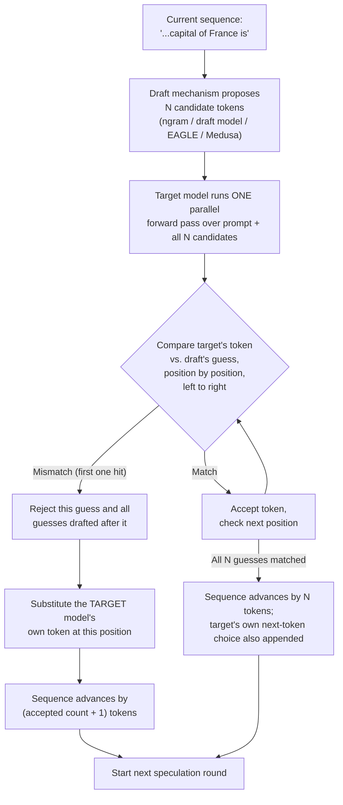

# Speculative Decoding

## Learning Objectives

By the end of this chapter, you will be able to:

- Explain *why* speculative decoding can speed up LLM serving without ever changing the model's output distribution — correctness is never on the table, only latency
- Walk through the draft → verify → accept/reject cycle concretely, including what happens on both a full-accept and a partial-reject path
- Configure `--speculative-config` on `vllm serve` and explain the required `num_speculative_tokens` field
- Distinguish the confirmed `method` values (`ngram`, `draft_model`, `eagle`/`eagle3`, `medusa`) by how each one produces its candidate tokens, and match a workload to the method most likely to pay off
- Define **acceptance rate** precisely, explain what drives it up or down, and use it to reason about whether speculative decoding is helping or hurting a given deployment
- Explain the latency trade-off speculative decoding makes (more per-step compute for fewer sequential steps) and why this course tells you not to prioritize this chapter until Chapters 17–18's benchmarking discipline is comfortable
- Recognize multi-token prediction (MTP) as an emerging, model-native technique whose exact configuration surface is not yet something to memorize

## Prerequisites

This chapter builds directly on:

- **Chapter 1 (LLM Inference Fundamentals)** — you should already know the prefill/decode split, and specifically that decode generates exactly one token per forward pass, per sequence, per step. Everything in this chapter is about attacking that "one token per step" ceiling.
- **Chapter 2 (GPU & CUDA Fundamentals)** — you should know why decode is **memory-bandwidth-bound**, not compute-bound: each decode step re-reads the model's entire weight set (and the growing KV cache) from VRAM to produce a single token, while the GPU's compute units sit mostly idle waiting on that data movement. Speculative decoding exists specifically to exploit the compute headroom that fact implies.
- **Chapter 9 (The vLLM Scheduler)** — you should understand how the scheduler admits work per step and how continuous batching packs prefill and decode tokens into the same step. Speculative decoding changes what a "decode step" looks like from the scheduler's perspective — instead of producing one token per sequence, a step can now produce several, verified in parallel.

You do not need any prior exposure to draft models, EAGLE, or Medusa — those are introduced from scratch below.

---

## 1. The Core Idea: Spend Idle Compute to Buy Fewer Sequential Steps

Recall from Chapter 2 the key asymmetry of decode: producing one token requires reading the *entire* model's weights (and the *entire* KV cache accumulated so far) from GPU memory, but the actual arithmetic — the matrix multiplies once that data is in registers — is comparatively cheap. On modern GPUs, a single decode step for a single sequence leaves most of the GPU's compute (FLOPs) capacity unused; the bottleneck is how fast bytes move off HBM, not how fast the tensor cores can multiply them. This is why continuous batching (Chapter 8) helps so much — packing more sequences into a step lets you amortize that expensive weight-read across more useful work — but batching alone doesn't reduce the *number of sequential steps* a single request needs to finish generating.

Speculative decoding attacks that different axis: **the number of sequential decode steps itself.**

The trick has three moving parts:

1. **A cheap, fast mechanism proposes several tokens ahead.** This is the "draft" step — instead of asking the full target model "what's the next token?" one token at a time, something much cheaper guesses a short run of *several* upcoming tokens at once. "Cheap" here can mean an actual smaller model, a lightweight prediction head, or — in the simplest case — no model at all, just pattern-matching against text you've already seen.
2. **The real (target) model verifies all of those guesses in a single parallel forward pass.** Because the target model is memory-bandwidth-bound per Chapter 2, checking *N* candidate tokens in one forward pass costs barely more in wall-clock time than checking one — the weights still only need to be read from VRAM once. This is the crux of why the trick works at all: verification is (almost) as cheap as ordinary single-token decoding, but it can validate multiple tokens per read of the weights.
3. **The target model has final say — always.** For each candidate token, the target model computes what *it* would have produced at that position. If the draft's guess matches, that token is **accepted** — free tokens, effectively. The moment a guess doesn't match, that token and everything drafted after it are **rejected**, and the target model's own token at that position is substituted in. Decoding then continues normally (or with a fresh round of speculation) from that point.

The critical property this preserves: **speculative decoding never changes the output distribution.** The target model's verification pass is the same computation it would have done anyway, token by token — speculative decoding just lets it check several candidates in parallel instead of generating them one at a time. If every guess is wrong, you've paid the cost of running the (cheap) draft mechanism plus one verification pass, and you fall back to exactly the token the target model would have produced regardless — no worse in *correctness* than ordinary decoding, only potentially worse in *wasted compute* if the guesses are consistently bad. That distinction — a latency/throughput trade-off, never a correctness trade-off — is the single most important thing to internalize before touching this feature in production.

---

## 2. The Draft → Verify → Accept/Reject Cycle, Concretely

Let's trace one round of speculation by hand. Say the target model has generated `"The capital of France is"` so far, and a draft mechanism is asked to propose `num_speculative_tokens = 4` tokens ahead.

**Step 1 — Draft.** The draft mechanism (whichever method — details in Section 4) proposes a candidate continuation, greedily or however its own logic works:

```
Draft proposes: " Paris" ", " "a" " city"
```

**Step 2 — Verify.** The target model runs a single forward pass over the prompt plus all four drafted tokens *at once*, computing what token *it* would have chosen at each of those four positions (given everything before it, exactly as if it were decoding normally token by token):

```
Position 1 (after "...is"):        target says " Paris"   — draft said " Paris"   → MATCH
Position 2 (after "...is Paris"):  target says ","         — draft said ","        → MATCH
Position 3 (after "...Paris,"):    target says " the"      — draft said " a"       → MISMATCH
Position 4 (after "...Paris, the"):target says " capital"  — draft said " city"    → not evaluated (see below)
```

**Step 3 — Accept/reject.** Tokens are accepted **left to right, up to the first mismatch**. Here, positions 1 and 2 are accepted (`" Paris"`, `","`) — those are "free" tokens, produced without the target model ever having to decode them one at a time. Position 3 is where the draft and target disagree: the draft's guess (`" a"`) is discarded, and the **target model's own token** (`" the"`) is substituted in as the ground truth for that position instead. Position 4's guess is moot — since decoding is autoregressive, a guess made *conditioned on* a token that turned out to be wrong (`" a"`) can't be trusted anyway, so it's simply thrown away without needing separate evaluation.

**Net result of this one round**: 3 real tokens produced (`" Paris"`, `","`, `" the"`) for the cost of one draft step plus one target-model verification pass — instead of 3 separate sequential target-model decode steps. Decoding then resumes from `"...Paris, the"`, and a new round of speculation begins.

This is the general shape of every round, regardless of `method`: draft proposes up to `num_speculative_tokens` candidates, the target verifies all of them in one pass, accepted tokens are kept left-to-right up to the first mismatch, and the target's own token replaces the first mismatch (everything speculated after it is discarded). **The worst case — every single guess wrong — costs one wasted draft step plus one verification pass that still produces exactly one correct token (the target's own), so it degrades to "ordinary decoding plus a bit of overhead," never to incorrect output.**



---

## 3. Configuring Speculative Decoding: `--speculative-config`

The current, confirmed mechanism for enabling speculative decoding in vLLM is a single JSON-valued flag on `vllm serve`: **`--speculative-config`**. (Older, flat flags like a standalone `--speculative-model` argument belong to an earlier API surface — if you see one in a blog post or older tutorial, treat it as legacy and reach for `--speculative-config` instead.)

The general shape:

```bash
vllm serve <target-model> --speculative-config '{"method": "<method-name>", "num_speculative_tokens": <int>, ...method-specific fields...}'
```

Two fields are universal:

- **`method`** (string) — which drafting mechanism to use. Confirmed values: `ngram`, `draft_model`, `eagle`, `eagle3`, `medusa` (Section 4 covers each).
- **`num_speculative_tokens`** (int) — how many tokens ahead to speculate per round. This is the `N` from the walkthrough above — the ceiling on how many candidate tokens the draft mechanism proposes before the target model verifies them in one pass. Required across every method.

Beyond those two shared fields, each method takes its own additional configuration (an n-gram lookup window for `ngram`, a model path/repo ID for `draft_model`/`eagle`/`eagle3`/`medusa`). Worked examples for the two most conceptually distinct methods — `ngram` and `draft_model` — follow in Section 5.

> **Verify against current docs**: as with every flag in this course, treat the exact JSON schema above as correct at time of writing and cross-check `vllm serve --help` (or `docs.vllm.ai`'s speculative decoding page) for your installed version before relying on it in production — this is an actively developed area of the codebase.

---

## 4. The `method` Values — How Each One Produces Its Guesses

All five confirmed methods are trying to solve the same problem (propose tokens cheaply), but they differ enormously in *how* they generate a guess, and that difference is exactly what determines which workloads each one is good at.

### 4.1 `ngram` — no draft model at all

`ngram` is the cheapest method to reason about and to operate, because there is no second model in the picture whatsoever. It works by **prompt lookup**: it scans the text generated (and the prompt) so far for a recent n-gram — a short sequence of tokens — that matches the *end* of what's currently been generated, and then guesses that the continuation will repeat whatever followed that same n-gram the last time it appeared.

Concretely: if the token sequence `"import numpy as np\nimport"` appeared once already and was followed by `" pandas as pd"`, and the model is now generating `"...import"` again, `ngram` guesses `" pandas as pd"` will follow again — purely by string/token matching against history, no forward pass through any neural network required to produce the guess itself.

This makes `ngram` spectacularly cheap to enable (no extra model to download, load into VRAM, or keep resident) and it shines specifically on **repetitive, structurally predictable content** — code (import blocks, boilerplate, repeated variable names), structured data extraction (JSON keys that recur), or any editing task where large spans of the "new" text are actually copies or near-copies of text the model has already seen. It does comparatively poorly on genuinely novel, creative prose, because there's no earlier occurrence to look up — nothing to guess from.

### 4.2 `draft_model` — an actual smaller model runs ahead

`draft_model` uses a real, independently-loaded smaller/faster Hugging Face model to generate candidate tokens the ordinary way — it runs its own (much cheaper) forward passes to produce a short continuation, which the target model then verifies exactly as described in Section 2. This is the most general-purpose and intuitive method: any smaller model from the same family (or a compatible tokenizer/vocabulary) can act as the draft, at the cost of that draft model itself needing to be loaded and run on every speculation round.

### 4.3 `eagle` / `eagle3` — a lightweight head trained specifically to draft

`eagle` and `eagle3` are more sophisticated than "just point at a smaller model." They use a **lightweight prediction head trained specifically to draft for the particular target model it's paired with**, rather than a generic smaller model that happens to share a tokenizer. Because the drafting head is trained against the target model's own behavior, its guesses tend to track the target's actual distribution more closely than an off-the-shelf smaller model would, which — as Section 6 covers — is exactly what drives acceptance rate up.

### 4.4 `medusa` — parallel heads attached to the target model itself

`medusa` takes a different architectural approach: instead of a *separate* model or head running ahead sequentially, it attaches **multiple parallel prediction heads directly onto the target model**, each head trained to predict a token some fixed number of positions further ahead than the last hidden state alone would give you for free. The candidates for the whole speculation round come out of one forward pass through the target model plus its attached heads, rather than a separate draft process running its own sequence of steps.

### 4.5 Choosing among them

| Method | Needs a separate model? | Best suited to |
|---|---|---|
| `ngram` | No | Repetitive/structured content: code editing, autocomplete, structured extraction, anything with a lot of literal repetition |
| `draft_model` | Yes — any compatible smaller HF model | General-purpose; good default when you have a natural smaller sibling model available |
| `eagle` / `eagle3` | Yes — a purpose-trained drafting head | Cases where you want higher acceptance rates than a generic smaller model gets you, and a compatible EAGLE head exists for your target model |
| `medusa` | Yes — heads trained/attached for that specific target model | Similar goal to EAGLE, different architecture — parallel heads on the target rather than a sequential separate drafter |

There is no universally "best" method — it is close to entirely workload-dependent, and Section 6 (acceptance rate) is the lens for deciding whether any of them are actually paying off *for your specific traffic*.

---

## 5. Worked Examples

### 5.1 `ngram` — zero extra models, best for repetitive workloads

```bash
vllm serve meta-llama/Llama-3.2-3B-Instruct \
  --speculative-config '{"method": "ngram", "num_speculative_tokens": 4, "prompt_lookup_min": 2, "prompt_lookup_max": 5}'
```

- `method: "ngram"` — no draft model to load; pure prompt-lookup.
- `num_speculative_tokens: 4` — propose up to 4 tokens per round.
- `prompt_lookup_min` / `prompt_lookup_max` — the n-gram window size range the lookup mechanism searches over (i.e., how short/long a matching span in the prior text has to be before it's used as the basis for a guess). Smaller windows match more often but on flimsier evidence; larger windows are more selective.

This is the cheapest possible speculative decoding setup to try — nothing to download, nothing extra to keep resident in VRAM beyond the target model itself. It's a reasonable first experiment for any workload with repetitive structure (Section 7 works through exactly such a scenario).

### 5.2 `draft_model` — an actual smaller model as drafter

```bash
vllm serve meta-llama/Llama-3.1-70B-Instruct \
  --speculative-config '{"method": "draft_model", "model": "meta-llama/Llama-3.2-1B-Instruct", "num_speculative_tokens": 5}'
```

- `method: "draft_model"` — a real smaller model does the drafting.
- `model` — the draft model's HF repo ID (illustrative pairing here — always confirm tokenizer/vocabulary compatibility between target and draft before trusting this pairing in production).
- `num_speculative_tokens: 5` — propose up to 5 tokens per round.

Unlike `ngram`, this configuration requires the draft model to be downloaded and loaded — expect extra VRAM usage and extra load time at startup, on top of the target model's own footprint.

> **A note on `eagle`/`eagle3`/`medusa` JSON shapes**: these methods also take a model/head reference plus `num_speculative_tokens`, following the same general shape as `draft_model` above (a path or repo ID pointing at the trained head/model, alongside the shared `num_speculative_tokens` field). The exact field names for these methods are more specialized and change faster than the `ngram`/`draft_model` shapes shown above — confirm the current field names against `vllm serve --help` or `docs.vllm.ai` before configuring one of these methods, rather than copying a remembered JSON shape verbatim.

---

## 6. Acceptance Rate — The Metric That Determines Everything

**Acceptance rate** is the fraction of speculated (drafted) tokens that the target model actually accepts during verification, out of all tokens speculated. It is the single most important number for reasoning about whether a speculative decoding configuration is helping or hurting.

Why it matters so much: every round of speculation costs something extra — running the draft mechanism, plus a verification pass that (for methods with a separate draft model) is at minimum as expensive as one ordinary decode step, and can be more expensive if the draft mechanism itself isn't free (as `ngram`'s pure lookup is, but `draft_model`/`eagle`/`eagle3`/`medusa` are not). That extra cost only pays for itself if enough of the speculated tokens are actually **accepted**, because accepted tokens are the ones you got "for free" relative to one-at-a-time decoding.

- **High acceptance rate** → most speculated tokens turn out to match what the target model would have produced anyway → each round advances the sequence by several tokens for close to the cost of one → large realized speedup.
- **Low acceptance rate** → most speculated tokens get thrown away at the first mismatch → each round advances the sequence by only one or two tokens (the target's own substituted token, plus maybe one lucky early match) → you've paid the draft mechanism's cost and the verification pass's cost for barely more benefit than ordinary decoding would have given you. In the extreme, if the draft mechanism itself is expensive to run (a sizeable `draft_model`) and acceptance rate is very low, speculative decoding can be **net slower** than not using it at all — you're paying for guesses that almost never pay off.

**What drives acceptance rate up:**

- **How closely the draft's token distribution matches the target's.** This is the whole reason EAGLE/Medusa exist as distinct, more sophisticated methods: a prediction head trained specifically against the target model's own behavior tends to guess more like the target would than a generic, independently-trained smaller model does.
- **How repetitive or predictable the task's content is.** `ngram` has no learned notion of "what the target model would say" at all — it purely bets that history repeats. On tasks where that bet is frequently correct (code, structured data, editing tasks where much of the output is a near-copy of existing text), acceptance rate can be very high despite `ngram` being the "dumbest" method on the list.

**What drives acceptance rate down:**

- **Open-ended, creative, or highly variable generation** — free-form creative writing, brainstorming, anything where there are many roughly-equally-good next tokens rather than one that's clearly most likely. The draft mechanism (whichever one you chose) has much less signal to work with, so its guesses diverge from the target model's actual choices more often.
- **High sampling temperature.** The higher the temperature, the more the target model itself is willing to select lower-probability tokens — which makes it *harder* for any fixed draft mechanism to predict what the target will pick, independent of how good the draft mechanism is in principle.
- **A draft model/head that's a poor match for the target** — wrong scale, wrong training data, wrong tokenizer alignment — will systematically diverge from what the target would say, tanking acceptance rate regardless of method sophistication.

The practical discipline this implies: **acceptance rate is not something to guess at — measure it.** Chapter 17 (Benchmarking) is where you get the tools to actually observe acceptance rate and realized speedup for your specific model, method, and traffic pattern, rather than assuming a method that helped one workload will help another.

---

## 7. Latency Trade-Offs: Why This Course Says "Don't Prioritize This Yet"

Speculative decoding is fundamentally a trade: **more compute per step, in exchange for fewer sequential steps.** Every round costs you the draft mechanism's overhead (near-zero for `ngram`, a real forward pass or more for the other methods) plus a verification pass over multiple candidate positions at once instead of one. That trade is a net win *only* when acceptance rate is high enough that the number of sequential steps saved outweighs the extra per-step cost paid to get there.

This is precisely why the course roadmap treats speculative decoding as something to reach for only once the fundamentals are solid: **you cannot tell, from first principles alone, whether speculative decoding will help *your* specific deployment.** It depends on your target model, your chosen method, your draft model or head (if any), and — most of all — the actual distribution of your production traffic. The only way to know is to measure: run your workload with speculative decoding off, measure throughput/latency (Chapter 17's job), turn it on with a specific configuration, measure again, and compare — ideally while also watching the realized acceptance rate so you understand *why* the number moved the way it did (Chapter 18's systematic, one-variable-at-a-time tuning methodology is exactly the discipline this requires).

Skipping that measurement step and just enabling speculative decoding because it sounds like a strict win is the single most common way to end up with a configuration that's quietly *slower* than the baseline it was meant to improve — the extra per-step compute is real and unconditional; the benefit is conditional on acceptance rate, which you don't know until you measure it.

---

## 8. A Word on MTP (Multi-Token Prediction)

Recent release notes reference **MTP** — multi-token prediction, a model-native approach to speculative decoding where the target model architecture itself is trained to predict several tokens ahead as part of its own forward pass, rather than relying on a bolted-on draft mechanism external to the model. It's mentioned in the context of large multimodal deployments and represents an interesting direction: pushing the "propose several tokens" capability *into* the model's own training rather than pairing it with a separate drafting model or head.

That said: **the exact `--speculative-config` shape for MTP is not something this course can responsibly hand you as a worked example.** Unlike `ngram` and `draft_model` above, MTP's precise configuration surface was not independently confirmed at the time this chapter was written, and inventing plausible-looking JSON for it would risk teaching you something wrong. Treat MTP as a real, emerging technique worth knowing the *name* and *concept* of for now — and check `docs.vllm.ai`'s current speculative decoding page (or the release notes for your installed version) for its actual configuration shape before trying to use it.

---

## 9. Real-World Scenario

**Situation**: Your team runs a self-hosted coding assistant that powers in-editor autocomplete and multi-file refactor suggestions. The traffic pattern is dominated by things like: repeating an import block across files, regenerating a function signature that's nearly identical to one already in context, applying the same small edit pattern (a renamed variable, an added type hint) across many call sites. This is, almost by definition, exactly the kind of repetitive, structurally predictable content `ngram` speculation is suited to — large spans of "new" output are near-copies of text the model has already seen earlier in the same file or session.

You enable the cheapest possible configuration to test the hypothesis:

```bash
vllm serve Qwen/Qwen2.5-Coder-7B-Instruct \
  --speculative-config '{"method": "ngram", "num_speculative_tokens": 5, "prompt_lookup_min": 2, "prompt_lookup_max": 6}'
```

No extra model to download or load — `ngram` only needs the target model itself, which makes this close to a zero-risk experiment to try before reaching for a heavier method. You then run your Chapter 17 benchmarking suite against a representative sample of real autocomplete/refactor requests, twice — once with `--speculative-config` present, once without — and compare TTFT/TPOT and overall throughput, while also instrumenting (or otherwise inspecting) the realized acceptance rate.

Because so much of the output in this workload really is repeated structure, `ngram`'s naive "guess the same continuation as last time" strategy lands correctly a large fraction of the time, acceptance rate comes back high, and the measured speedup justifies keeping the configuration in production. Contrast this with the same team also serving a separate, general-purpose creative-writing chatbot on the same infrastructure: turning on the identical `ngram` configuration there would very likely show a much lower acceptance rate (there's far less literal repetition to look up) and a correspondingly smaller — possibly negative — net benefit. The lesson isn't "ngram is good" or "ngram is bad" in the abstract; it's that **the same configuration performs completely differently depending on how repetitive the actual traffic is**, which is exactly why this is a per-workload, measure-don't-assume decision.

---

## 10. Best Practices

- **Measure acceptance rate before committing to any speculative decoding configuration in production.** Never enable it purely because the concept sounds appealing — a low acceptance rate can make a deployment slower, not faster, and you only find out by measuring.
- **Start with `ngram` as your cheapest experiment.** It requires no extra model to download, load, or keep resident in VRAM, which makes it the lowest-risk way to test whether your workload has enough repetitive structure to benefit at all before investing in a `draft_model`/`eagle`/`eagle3`/`medusa` setup.
- **Match the method to the workload's actual content, not to novelty.** Repetitive/structured tasks (code editing, structured extraction) favor `ngram`; general-purpose tasks with a natural smaller sibling model favor `draft_model`; tasks where you can access a purpose-trained drafting head or heads favor `eagle`/`eagle3`/`medusa`.
- **Benchmark with and without speculative decoding, using Chapter 17's tools, on your actual representative traffic** — not a synthetic prompt that doesn't resemble production. Speculative decoding's benefit is entirely traffic-dependent.
- **Re-check configuration after every meaningful model or traffic-pattern change.** A method/config that had a great acceptance rate against last quarter's traffic mix isn't guaranteed to hold up once your product's usage pattern shifts (e.g., a coding assistant that starts fielding more open-ended "explain this codebase" queries alongside autocomplete).
- **Treat `--speculative-config`'s exact JSON schema, and any method beyond `ngram`/`draft_model` shown here, as "verify against current docs before relying on it in production"** — this is an actively evolving part of the codebase, and MTP's configuration surface in particular is not yet something to memorize (Section 8).
- **Don't reach for this chapter before Chapters 17–18 are comfortable.** Speculative decoding's payoff is conditional and workload-specific; without solid benchmarking discipline, you have no reliable way to tell if a given configuration is actually helping.

---

## 11. Common Mistakes

1. **Enabling speculative decoding on a highly creative, open-ended generation task and being surprised it's slower, not faster.** Creative/unpredictable tasks tend toward low acceptance rates almost by definition — there's no strong pattern for a draft mechanism (of any method) to latch onto — so the extra per-round overhead (draft mechanism + wider verification pass) isn't reliably amortized by enough accepted tokens. The fix isn't "abandon speculative decoding everywhere," it's "recognize this particular workload isn't a good candidate, or at least measure before assuming it is."
2. **Assuming a method that helped one deployment will automatically help another.** Acceptance rate is a property of *(method, draft config, target model, traffic pattern)* together, not a property of the method alone. A `draft_model` pairing that yields a great acceptance rate on one target model/traffic mix can perform very differently on a different one.
3. **Skipping the acceptance-rate/benchmark step entirely and shipping a speculative decoding config straight to production because it's "supposed to be faster."** Without measuring, you have no way to know whether you've actually made things faster, made no meaningful difference, or made things worse — and the failure mode is silent (no errors, just worse latency than expected).
4. **Choosing a heavier method (`draft_model`, `eagle`/`eagle3`, `medusa`) before trying the essentially-free `ngram` baseline first**, especially on workloads with real repetitive structure. This burns extra VRAM and setup effort on a more complex method when the cheap option might have already captured most of the available benefit.
5. **Confusing speculative decoding with a correctness/quality trade-off.** It is not one — the target model always verifies and has final say (Section 1–2). If someone on your team worries that speculative decoding might make outputs "less accurate" or "hallucinate more," the concern is misplaced; the actual risk surface is purely latency/throughput, never output distribution.
6. **Treating a fabricated or half-remembered `--speculative-config` JSON shape (especially for `eagle`/`eagle3`/`medusa`, or worse, for MTP) as authoritative.** Only `ngram` and `draft_model`'s field-level shapes are worked through in detail in this chapter for a reason — always confirm the exact field names for the other methods, and especially for MTP, against `vllm serve --help` or current docs before configuring them in anything that matters.

---

## 12. Summary

- Decode is memory-bandwidth-bound (Chapter 2): each step re-reads the full model (and KV cache) from VRAM to produce one token, leaving compute headroom mostly idle. Speculative decoding spends that idle compute to reduce the number of *sequential* steps needed.
- The cycle: a cheap mechanism **drafts** several candidate tokens ahead; the target model **verifies** all of them in one parallel forward pass; tokens are **accepted** left-to-right up to the first mismatch, at which point the target model's own token replaces the mismatch and everything drafted after it is discarded. The target model always has final say — correctness is never compromised, only latency/throughput is at stake.
- Current mechanism: `--speculative-config` JSON on `vllm serve`, with a required `method` and a required `num_speculative_tokens` shared across all methods.
- Confirmed `method` values: `ngram` (no draft model — pure prompt-lookup, best on repetitive/structured content), `draft_model` (a real smaller HF model drafts), `eagle`/`eagle3` (a lightweight head trained specifically to draft for the target), `medusa` (multiple parallel prediction heads attached to the target model itself).
- **Acceptance rate** — the fraction of speculated tokens the target model actually accepts — is the metric that determines everything: high acceptance rate means large realized speedup, low acceptance rate can make speculative decoding a net loss versus not using it at all.
- The trade is conditional, not guaranteed: extra per-step compute in exchange for fewer sequential steps, worthwhile only when acceptance rate is high enough to amortize that cost — which is exactly why this course places this chapter after, and dependent on, the benchmarking (Ch. 17) and tuning (Ch. 18) discipline needed to actually measure it.
- MTP (multi-token prediction) is a real, emerging, model-native technique referenced in recent release notes — its exact configuration surface is unconfirmed at time of writing; check current docs rather than trusting invented example JSON for it.

---

## 13. Knowledge Check

1. Why does speculative decoding never compromise correctness, even when the draft mechanism's guesses are frequently wrong?
2. In the draft → verify → accept/reject cycle, what happens to speculated tokens *after* the first mismatch, and why can't they simply be checked independently on their own merits?
3. Name the two fields every `--speculative-config` value must include, regardless of `method`.
4. Which confirmed `method` requires no separate draft model at all, and what specific kind of workload does it tend to do best on? Why?
5. Define acceptance rate precisely, and explain a concrete scenario where a technically-working speculative decoding configuration could end up making a deployment *slower* than not using it at all.
6. Why does this course explicitly recommend not prioritizing speculative decoding until you're comfortable with the benchmarking material in Chapter 17?

<details>
<summary>Answers</summary>

1. Because the **target model always verifies every speculated token itself** before it's kept — a speculated token is only accepted if it matches what the target model would have produced at that position anyway. When guesses are wrong, the target model's own token is substituted in instead, which is exactly what ordinary one-token-at-a-time decoding would have produced. The only cost of wrong guesses is wasted compute, never a wrong output.
2. They are discarded, without needing separate evaluation. Because decoding is autoregressive, any guess made *after* a mismatched position was conditioned on a token that turned out to be incorrect — so that later guess isn't a valid candidate for what the target model would actually produce at that later position, and there's no point verifying it.
3. `method` (which drafting mechanism to use) and `num_speculative_tokens` (how many tokens ahead to speculate per round).
4. `ngram` — it needs no separate draft model, working instead by prompt-lookup (finding a recent matching n-gram in the prompt/generation so far and guessing the continuation that followed it before). It does best on repetitive, structurally predictable content — code editing, structured data extraction, or any task where large spans of new output are near-copies of text already seen — because that's exactly the pattern its "repeat what followed last time" strategy exploits.
5. Acceptance rate is the fraction of speculated (drafted) tokens the target model actually accepts during verification, out of all tokens speculated. A configuration can end up slower than no speculation at all when acceptance rate is low **and** the draft mechanism itself isn't free (e.g., a sizeable `draft_model`): you pay the cost of running the draft mechanism plus a wider verification pass every round, but most guesses are thrown away at the first mismatch, so you gain very few "free" tokens per round to offset that extra cost — for example, running an expensive draft model against a highly creative, open-ended generation task with few predictable patterns.
6. Because whether speculative decoding actually helps is entirely conditional on acceptance rate for your specific model, method, and traffic — something you cannot determine from first principles alone. Chapter 17 provides the benchmarking tools (and Chapter 18 the systematic tuning methodology) needed to measure latency/throughput with and without a given configuration and confirm it's a real win rather than an assumed one.

</details>

---

## 14. Hands-On Exercise

**Goal**: enable the cheapest speculative decoding method (`ngram`) on a local server for a deliberately repetitive workload, and benchmark the speedup (or lack thereof) against a non-speculative baseline, using the `vllm bench` tooling from Chapter 17.

**Requirements**: a machine with vLLM installed and GPU access sufficient to serve a small-to-medium instruct model (this exercise is designed to work with a modest model so the mechanics, not raw hardware, are the focus). Install the benchmarking extra if you haven't already: `pip install vllm[bench]`.

1. **Start a baseline server** (no speculative decoding):
   ```bash
   vllm serve Qwen/Qwen2.5-Coder-7B-Instruct --port 8000
   ```
2. **Construct a deliberately repetitive prompt set** that mimics the code-editing scenario from Section 9 — for example, a set of prompts each asking the model to "add a docstring to the following function" for many structurally similar Python functions, or "add type hints to this function" repeated across a batch of near-identical signatures. The repetition is the point: you want the same continuation pattern (e.g., the shape of a Python docstring block) to recur across many of your generations.
3. **Benchmark the baseline** using `vllm bench serve` (Chapter 17's tool) against this prompt set, and record throughput and per-token latency (TPOT).
4. **Stop the baseline server, then start a speculative-decoding server** on the same model and port:
   ```bash
   vllm serve Qwen/Qwen2.5-Coder-7B-Instruct --port 8000 \
     --speculative-config '{"method": "ngram", "num_speculative_tokens": 4, "prompt_lookup_min": 2, "prompt_lookup_max": 5}'
   ```
5. **Re-run the identical benchmark** (same prompt set, same `vllm bench serve` invocation) against the speculative-decoding server, and record the same metrics.
6. **Compare the two runs.** Did throughput improve? Did per-token latency drop? By how much?
7. **Bonus — break the hypothesis on purpose**: repeat steps 1–6, but swap in a prompt set of genuinely varied, open-ended creative-writing prompts (e.g., "write a short story about..." with a different premise each time) instead of the repetitive code-editing set. Compare the speedup (if any) you observe here against what you saw in step 6. You should expect a noticeably smaller benefit — possibly none, possibly a regression — since this workload has far less repetitive structure for `ngram`'s prompt-lookup strategy to exploit.

**Success criteria**: you have two side-by-side benchmark results — repetitive workload vs. creative workload — each run with and without `--speculative-config`, and you can explain *in terms of acceptance rate* why the two workloads responded differently to the identical speculative decoding configuration.

---

## 15. Further Reading

- vLLM speculative decoding docs (confirm current `--speculative-config` schema and supported `method` values here before relying on anything in this chapter verbatim): `https://docs.vllm.ai/en/latest/features/spec_decode.html`
- vLLM benchmarking CLI, needed for the hands-on exercise (Chapter 17's full treatment): `https://docs.vllm.ai/en/latest/cli/bench/serve.html`
- vLLM release notes (check for MTP and other speculative-decoding-related changes since this chapter was written): `https://github.com/vllm-project/vllm/releases`
- EAGLE project (background on the "lightweight head trained specifically to draft" approach): `https://github.com/SafeAILab/EAGLE`
- Medusa project (background on the "parallel heads attached to the target model" approach): `https://github.com/FasterDecoding/Medusa`
- Leviathan, Yaniv, et al. "Fast Inference from Transformers via Speculative Decoding." *ICML 2023* — one of the original papers formalizing the draft/verify/accept-reject idea this chapter walks through.

<div style="display:flex;justify-content:space-between;align-items:center;">
  <a href="./13-quantization.md">← Previous: Quantization</a>
  <a href="./00-index.md">🏠 Index</a>
  <a href="./15-parallelism.md">Next: Parallelism →</a>
</div>
