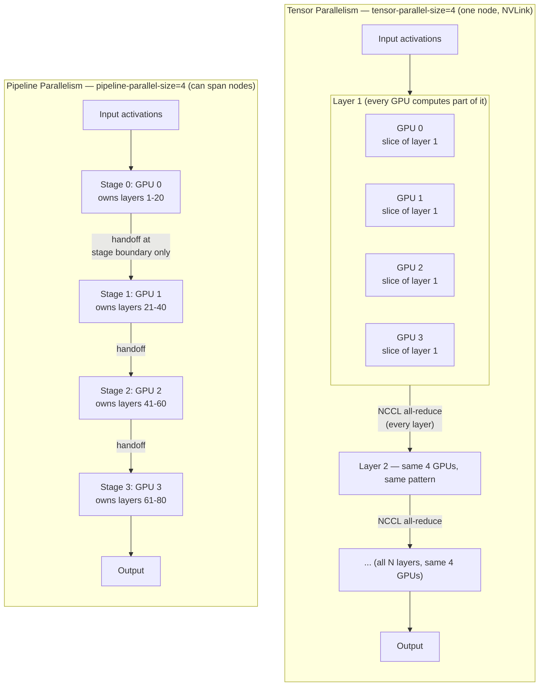

# Parallelism

## Learning Objectives

By the end of this chapter, you will be able to:

- Explain the two independent reasons you'd ever need more than one GPU for inference: a VRAM-capacity problem (the model doesn't fit) and a compute/throughput problem (one GPU isn't fast enough), and recognize that they call for different solutions
- Explain what `--tensor-parallel-size` actually does to a model's weights, why it requires frequent inter-GPU communication, and why that makes it primarily an intra-node (NVLink) technique
- Explain what `--pipeline-parallel-size` actually does, why its communication pattern tolerates slower networking than tensor parallelism, and what a "pipeline bubble" is and when it hurts
- Explain `--data-parallel-size` / `--data-parallel-size-local` and why data parallelism is the natural fit for horizontal throughput scaling and for MoE/expert-parallel deployments via `--enable-expert-parallel`
- Compute effective expert-parallel size as DP size × TP size, and read a `vllm serve` invocation combining TP/PP/DP correctly
- Choose `--distributed-executor-backend {mp|ray}` correctly for single-node vs. multi-node deployments, and explain why Ray is needed once you cross node boundaries
- Apply a decision framework — "what's the cheapest parallelism strategy, in communication overhead, that gets me the VRAM/compute I need" — instead of defaulting to "more GPUs, more parallelism, always better"

## Prerequisites

This chapter builds directly on:

- **Chapter 2 (GPU & CUDA Fundamentals)** — you should already be comfortable with what VRAM is, what NVLink is versus PCIe versus a datacenter network fabric (InfiniBand/RoCE), and roughly why interconnect bandwidth matters for anything that moves tensors between devices. This chapter assumes that vocabulary without re-deriving it.
- **Chapter 10 (Memory Management)** — you should already know how to reason about whether a model's weights plus KV cache overhead fit inside a single GPU's VRAM budget (`gpu_memory_utilization`, `--max-model-len`, `--max-num-seqs`). Parallelism is what you reach for once that arithmetic says "no, it doesn't fit" — this chapter doesn't re-derive the VRAM math, it picks up right where that answer is "no."

You should also recall, from Chapter 3, that `tensor_parallel_size` appeared as an `LLM` constructor argument defaulting to `1` — this chapter is the full treatment that chapter deferred.

---

## 1. Why Parallelism Exists: Two Distinct Problems

It's tempting to think of "parallelism" as one generic dial you turn up when things get big. It isn't — it's the answer to two genuinely different problems, and confusing them leads to picking the wrong tool.

**Problem 1: The model doesn't fit in one GPU's VRAM.** A GPU has a fixed amount of memory. A model's weights consume a fixed amount of that memory (roughly `parameters × bytes-per-parameter`, per Chapter 2's precision-format discussion), and on top of that, vLLM needs room for the KV cache pool that grows with concurrent requests and context length (Chapter 6). A large enough model — a 70B-parameter model in `bf16`, or a frontier-scale MoE model with hundreds of billions of total parameters — simply cannot have its weights loaded onto a single GPU, no matter how you tune `gpu_memory_utilization`. This is a **capacity** problem. The only fix is to spread the model's weights across more than one GPU's memory.

**Problem 2: One GPU isn't fast enough.** Even when a model fits comfortably on a single GPU, that GPU has a ceiling on tokens-per-second it can produce, and a ceiling on how many concurrent requests it can serve at a target latency. If your traffic exceeds that ceiling, no amount of clever scheduling on one device will get you there — you need more devices doing the work, not more sharding of a model that already fits. This is a **throughput** problem, and its fix is different from Problem 1's: replicate the model, don't split it, and spread incoming requests across the replicas.

The rest of this chapter is organized around three concrete mechanisms — **tensor parallelism**, **pipeline parallelism**, and **data parallelism** — and the first thing to internalize is which problem each one solves:

| Mechanism | Solves | What gets split |
|---|---|---|
| Tensor parallelism (TP) | Capacity (mostly) | Individual weight matrices/layers, across GPUs on one node |
| Pipeline parallelism (PP) | Capacity, across nodes | Layer *ranges*, across GPUs/nodes |
| Data parallelism (DP) | Throughput (and MoE capacity, via expert parallelism) | Nothing about the model — full replicas, split *requests* |

Every one of these mechanisms buys you capacity or throughput at a cost: **communication overhead** between devices. That cost is the central theme of this entire chapter — it's why you don't just default to "use every GPU you have, split every way you can."

### 1.1 Parallelism is a last resort, not a first instinct

Before reaching for any of the mechanisms in this chapter, it's worth remembering that Chapter 13's quantization techniques (FP8, AWQ, GPTQ, and friends) directly reduce the "does it fit" question by shrinking the weights themselves — sometimes a model that looks like a two-GPU tensor-parallel problem at `bf16` fits on a single GPU once quantized to FP8 or AWQ. Similarly, Chapter 10's memory-management levers (`--gpu-memory-utilization`, `--max-model-len`, `--max-num-seqs`) can be the difference between "doesn't fit" and "fits" for a model that's only marginally over budget. The practical ordering of operations, before you touch any parallelism flag: (1) can quantization make this fit on fewer GPUs, (2) can trimming `--max-model-len`/`--max-num-seqs` make this fit within your memory budget, and only then (3) reach for TP/PP/DP for whatever capacity or throughput gap remains. Parallelism is the right tool for a real gap — not the default first move.

---

## 2. Tensor Parallelism (`--tensor-parallel-size`)

### 2.1 What it actually does

Tensor parallelism (TP) splits **individual weight matrices — and therefore individual layers — across GPUs**. Concretely: a transformer layer's attention projection matrices and MLP weight matrices are each partitioned (typically column-wise or row-wise) so that every GPU in the TP group holds a *slice* of every layer, not a distinct subset of layers. When a forward pass runs, **every GPU computes part of the math for every single layer**, and the partial results have to be combined — via an all-reduce (or similarly-patterned collective) over NCCL — before the next operation in that same layer can proceed.

This is the detail that matters most: **TP communicates within every layer, not just at model boundaries.** A model with 80 transformer layers running with `--tensor-parallel-size 4` performs on the order of one all-reduce (or more) per layer, every single forward step, for every token generated. That's an enormous number of small, latency-sensitive collective operations happening continuously during both prefill and decode.

### 2.2 Why this makes TP an intra-node technique

Because TP's communication happens at layer granularity — extremely frequently, and each individual exchange is relatively small but latency-sensitive — the *round-trip latency* of the interconnect between GPUs dominates whether TP is fast or slow. **NVLink** (GPU-to-GPU, hundreds of GB/s, low latency, all within one server chassis) makes this workable: the communication cost per layer is small enough not to stall the compute pipeline. A standard datacenter network fabric between separate physical nodes (even a fast one — InfiniBand, RoCE) has meaningfully higher latency and lower effective bandwidth per hop than NVLink, and paying that penalty *once per layer, every step* compounds into a severe throughput penalty.

This is why the practical guidance is: **tensor parallelism is a same-node, NVLink-connected-GPU technique.** You set `--tensor-parallel-size` to however many GPUs you have on one node (commonly 2, 4, or 8), and you do not, as a rule, stretch a single TP group across nodes over ordinary networking — the per-layer communication tax would eat your throughput gains.

### 2.3 What TP buys you

Splitting every layer's weight matrices N ways roughly divides the per-GPU memory footprint of the model's weights by N (KV cache accounting is a bit more nuanced but follows the same spirit — Chapter 6 and Chapter 10 cover the KV cache side of the math in depth). This is what lets a model that doesn't fit on one GPU fit across several: a 70B-parameter model that needs roughly 140GB in `bf16` for weights alone won't fit on a single 80GB GPU, but with `--tensor-parallel-size 2` (or 4), each GPU only needs to hold its own slice.

---

## 3. Pipeline Parallelism (`--pipeline-parallel-size`)

### 3.1 What it actually does

Pipeline parallelism (PP) takes a completely different cut through the model: instead of splitting *within* every layer, it splits the model **by layer range**. With `--pipeline-parallel-size 4` on an 80-layer model, GPU (or GPU group) 0 might hold layers 1–20, GPU 1 holds layers 21–40, GPU 2 holds layers 41–60, and GPU 3 holds layers 61–80. Each stage owns a complete, contiguous chunk of the model — no GPU needs to talk to another mid-layer.

Data flows through the pipeline stage by stage: activations computed by stage 0 for a given micro-batch are handed off to stage 1, which continues the forward pass, hands off to stage 2, and so on. **Communication happens only at the boundaries between stages** — once per stage transition, not once per layer's internal math. For a model with 80 layers split 4 ways, that's on the order of 3 handoffs per forward pass through the pipeline, versus TP's per-layer chatter.

### 3.2 Why this tolerates slower networking

Because PP's communication is far less frequent and happens at natural model boundaries, it is meaningfully more tolerant of higher-latency, lower-bandwidth interconnects than TP is. This is exactly why PP is the mechanism you reach for to **span multiple nodes**: the activation tensors handed between pipeline stages cross a real network fabric only a handful of times per forward pass, not dozens of times, so the added latency of an inter-node hop matters far less to overall throughput than it would inside a TP group.

### 3.3 The cost: pipeline bubbles

PP isn't free, though — it has its own characteristic inefficiency: **pipeline bubbles**. While stage 3 is computing on micro-batch A's activations (which had to first pass through stages 0, 1, and 2), stages 0–2 are idle with respect to micro-batch A — they've already done their part and are waiting, or they're working ahead on a later micro-batch if the scheduler supports that overlap. At the very start and end of processing a batch, some pipeline stages are necessarily idle simply because the data hasn't reached them yet, or has already left them. This idle time is the "bubble."

Bubbles are worst **at low batch sizes** (there isn't enough concurrent work to keep every stage continuously busy) and shrink proportionally as batch size grows (more micro-batches in flight means stages spend more time genuinely overlapping their work). This is a meaningful trade-off against TP: TP has no equivalent bubble problem (every GPU is always doing part of the same layer's work simultaneously), but it pays its cost every layer regardless of batch size; PP pays no per-layer tax but loses efficiency specifically when concurrency is low.

### 3.4 TP vs. PP, side by side



The contrast to hold onto: **TP fans the same layer's work out across GPUs and pays a communication cost every layer**; **PP hands the whole forward pass down an assembly line of GPUs and pays a communication cost only at handoffs**, at the price of stages sitting idle when there isn't enough concurrent work to keep the whole line busy.

---

## 4. Data Parallelism (`--data-parallel-size` / `--data-parallel-size-local`)

### 4.1 What it actually does

Data parallelism (DP) is conceptually the simplest of the three: instead of splitting the model at all, you run **full, independent replicas** of the model, each capable of serving requests entirely on its own, and you spread incoming requests across those replicas. There's no cross-replica communication required for a given request's forward pass at all — each replica is a self-contained copy of the whole model (which may itself be internally sharded with TP/PP, as covered in Section 5).

Two related flags control this, per vLLM's distributed-serving surface:

- **`--data-parallel-size`** — the total number of data-parallel replicas across your whole deployment, potentially spanning multiple nodes.
- **`--data-parallel-size-local`** — the number of those replicas that live on a given node, for multi-node DP setups where you need to tell each node how much of the total DP count it's responsible for hosting.

Because DP replicas don't need to communicate with each other to process a request, DP scales throughput close to linearly with replica count — the classic "horizontal scaling" pattern, structurally similar to running more instances behind a load balancer, except vLLM's DP support is aware of this at the engine level rather than requiring you to hand-roll a router in front of N independent `vllm serve` processes.

### 4.2 Data parallelism and MoE / expert parallelism

DP is used especially heavily for **Mixture-of-Experts (MoE) models** via **expert parallelism**, enabled with `--enable-expert-parallel`. The reasoning is architecture-specific: an MoE model's feed-forward layers are split into many "expert" sub-networks, and only a small subset of experts is active for any given token. Expert parallelism distributes *which experts live on which devices* — instead of every device holding every expert (wasteful) or one device holding all experts (defeats the point of MoE's sparse activation), experts are spread across the data-parallel replicas so that, in aggregate, the full set of experts is available across the deployment while each individual device only holds its share.

The key relationship to internalize: **effective expert-parallel size is computed as DP size × TP size — it is not set directly as its own number.** You don't pick an "expert-parallel-size" flag; you pick your DP and TP sizes, enable expert parallelism, and the effective EP degree falls out of that product.

The documented example pattern makes this concrete:

```bash
vllm serve <moe-model> \
  --tensor-parallel-size 1 \
  --data-parallel-size 8 \
  --enable-expert-parallel
```

Here, TP size is 1 (no intra-layer weight sharding) and DP size is 8 (eight full replica "slots"), so the effective expert-parallel degree is `1 × 8 = 8` — experts get distributed across those 8 slots. If you instead ran `--tensor-parallel-size 2 --data-parallel-size 8 --enable-expert-parallel`, the effective EP degree would be `2 × 8 = 16`. This is the concrete mechanism behind the DP × TP multiplication described in vLLM's parallelism documentation — worth verifying against current docs for the exact current defaults and interactions, since MoE serving is one of the faster-moving areas of the project, but the DP × TP relationship itself is the stable mental model.

---

## 5. Multi-GPU vs. Multi-Node: Combining Strategies

Putting Sections 2–4 together, a practical rule of thumb emerges:

- **Tensor parallelism is the natural single-node choice.** It wants NVLink, NVLink lives inside one server chassis, so TP size is typically bounded by however many GPUs are physically in one node (commonly 2, 4, or 8).
- **Pipeline parallelism extends across nodes.** Once a model needs more sharding than one node's GPUs can provide via TP alone, PP is how you add *more* devices to the picture without paying TP's per-layer communication tax over a slower inter-node link.
- **Data parallelism extends across nodes too, for a different reason** — not because the model needs more room, but because you need more independent capacity to serve more concurrent traffic (or, per Section 4, because an MoE model's experts need to be spread wider).

For very large models, it's completely normal to **combine TP and PP** (and sometimes DP on top): TP shards each node's own GPUs tightly via NVLink, and PP chains multiple such TP-sharded node-groups together across the network. A worked example: suppose you have 2 nodes, each with 4 NVLink-connected GPUs (8 GPUs total), and a model too large for a single node's 4-way TP group to hold to your target `--max-model-len` and concurrency comfortably. You'd shard within each node with TP, and chain the two nodes with PP:

```bash
# Node 0 (holds pipeline stage 0, TP=4 across this node's 4 GPUs)
vllm serve <large-model> \
  --tensor-parallel-size 4 \
  --pipeline-parallel-size 2 \
  --distributed-executor-backend ray

# Node 1 joins the same Ray cluster as pipeline stage 1 — the vllm serve
# invocation is coordinated via Ray, not launched as a second independent
# server process pointed at a different model or config.
```

> **Verify against current docs** for the exact multi-node launch sequence (Ray cluster bootstrap on each node, head vs. worker node roles, and how `vllm serve` is invoked once per logical deployment vs. per physical node) — the mechanics of *joining* a Ray cluster across machines are more operational detail than this chapter's scope, and are exactly the kind of surface that's worth double-checking against `docs.vllm.ai`'s current distributed-serving guide before a real multi-node rollout.

The total device count in a combined deployment is the product of the parallelism dimensions in play: `TP size × PP size × DP size` GPUs, total, across your cluster. `--tensor-parallel-size 4 --pipeline-parallel-size 2` uses 8 GPUs (2 nodes × 4 GPUs each) to shard one logical model instance; adding `--data-parallel-size 2` on top of that would mean *two* such 8-GPU model instances, for 16 GPUs total, each independently serving a share of requests.

---

## 6. Distributed Backend: Ray vs. Multiprocessing

Every one of TP, PP, and DP needs *something* to actually spawn and coordinate the worker processes that run each shard/replica. vLLM supports two backends for this, controlled via `--distributed-executor-backend {mp|ray}` on `vllm serve` (or the equivalent constructor kwarg on the `LLM` class):

- **`mp` (native Python multiprocessing)** — the default choice for **single-node** deployments. vLLM spawns worker processes directly on the local machine; there's no need for a distributed process-orchestration layer when every worker is going to live on the same box you launched from.
- **`ray`** — the **default distributed backend for multi-node** deployments. [Ray](https://www.ray.io/) is a general-purpose distributed-computing framework that handles the genuinely hard parts of running coordinated worker processes *across separate machines*: discovering and connecting to other nodes, launching and monitoring remote worker processes, handling a worker dying on a machine you're not physically logged into, and giving the engine a uniform way to address "worker 5" without caring which physical node it's actually running on.

The reason Ray specifically becomes necessary once you cross node boundaries is straightforward: plain multiprocessing is a single-machine primitive — `multiprocessing.Process` forks or spawns a new process on the *same* operating system instance. It has no concept of "a different physical machine." The moment your PP stages or DP replicas live on separate nodes, something has to take on process orchestration across machines — launching remote processes, wiring up their networking, handling partial failures — and that's exactly the job Ray is built for. You *can* still choose `ray` for a single-node deployment (some operators standardize on it for consistency with their multi-node deployments), but you cannot realistically choose plain `mp` once you need workers on more than one machine.

---

## 7. Communication Overhead: The Central Cost of All Parallelism

Step back from the individual mechanisms and one theme runs through all three: **every parallelism strategy buys capacity or throughput at the cost of communication between devices**, and that cost differs enormously by mechanism:

- TP: communication every layer, every step — needs NVLink, effectively confined to one node.
- PP: communication only at stage boundaries — tolerates slower networking, but introduces bubbles that hurt at low concurrency.
- DP: no cross-replica communication for a single request at all — the cheapest option by far, per-request, but it doesn't reduce per-GPU memory footprint (each replica is a full model copy, or a full TP/PP-sharded copy) so it doesn't solve a capacity problem by itself.

This is why the right mental framing is **not** "how much parallelism can I throw at this deployment" — it's:

> **How much VRAM and compute do I actually need, and what is the *cheapest* parallelism strategy — in terms of communication overhead — that gets me there?**

Every unit of parallelism beyond what's strictly needed is pure communication tax with no corresponding benefit. A model that fits on one GPU and doesn't need extra throughput gains nothing from `--tensor-parallel-size 2` — it just pays NCCL synchronization overhead on every layer for no reason. Section 10 turns this framing into a concrete decision checklist.

---

## 8. Worked Examples

The following `vllm serve` invocations are illustrative patterns for different deployment sizes — treat the exact flag defaults and any version-sensitive behavior as **verify against current docs / `vllm serve --help`** before relying on them in production, per this course's standing convention.

### 8.1 Fits on one GPU — no parallelism

```bash
vllm serve meta-llama/Llama-3.2-1B-Instruct
```

No TP, no PP, no DP flags needed — this is the default (`tensor_parallel_size=1` from Chapter 3). Don't add parallelism here; there's nothing to gain and only communication overhead to lose (Section 11 covers this exact mistake).

### 8.2 Needs 2 GPUs, one node — tensor parallelism

```bash
vllm serve meta-llama/Llama-3.1-8B-Instruct \
  --tensor-parallel-size 2
```

Two NVLink-connected GPUs on one node, model sharded across both. This is the default reach for "doesn't fit on one GPU, but two GPUs on one node is enough."

### 8.3 Needs a full 8-GPU node — larger tensor-parallel group

```bash
vllm serve <70b-class-model> \
  --tensor-parallel-size 8
```

A common shape for a 70B-class dense model on a single 8-GPU node (e.g., an 8×A100/H100 box) — all sharding stays inside the node, all communication stays on NVLink.

### 8.4 Needs to span nodes — tensor + pipeline parallelism

```bash
# 2 nodes x 4 GPUs = 8 GPUs total, one logical model instance
vllm serve <very-large-model> \
  --tensor-parallel-size 4 \
  --pipeline-parallel-size 2 \
  --distributed-executor-backend ray
```

TP=4 shards each node's own 4 GPUs via NVLink; PP=2 chains the two nodes together, with only stage-boundary handoffs crossing the network. `--distributed-executor-backend ray` is set explicitly here because this deployment spans nodes — see Section 6.

### 8.5 Horizontal throughput scaling — data parallelism

```bash
# 4 independent full replicas, spread across however many nodes hold 4 GPUs total
vllm serve meta-llama/Llama-3.1-8B-Instruct \
  --data-parallel-size 4
```

Each replica independently serves a share of incoming requests — no cross-replica communication per request. Use this when the model already fits and runs fast enough per-replica, but you need more aggregate request capacity than one replica provides.

### 8.6 MoE model with expert parallelism

```bash
vllm serve <moe-model> \
  --tensor-parallel-size 1 \
  --data-parallel-size 8 \
  --enable-expert-parallel
```

The documented pattern from Section 4.2 — 8 DP replica slots, TP=1 (no intra-layer sharding), effective expert-parallel degree of `1 × 8 = 8`, letting the model's experts be distributed across all 8 slots rather than replicated in full on each.

### 8.7 Combined TP + PP + DP for a very large MoE deployment

```bash
# 2 "instances," each spanning 2 nodes x 4 GPUs (TP=4, PP=2) = 8 GPUs/instance
# 2 instances x 8 GPUs = 16 GPUs total, plus expert parallelism within each instance
vllm serve <large-moe-model> \
  --tensor-parallel-size 4 \
  --pipeline-parallel-size 2 \
  --data-parallel-size 2 \
  --enable-expert-parallel \
  --distributed-executor-backend ray
```

Here TP shards within a node, PP chains node-pairs into one large model instance, and DP=2 replicates *that entire instance* for additional throughput/expert distribution — effective expert-parallel degree from the DP×TP relationship is `2 × 4 = 8`. This is the kind of configuration Section 9's real-world scenario walks through end to end.

---

## 9. Real-World Scenario

**Situation**: Your team needs to self-host a large, open-weight MoE model in production. The model's total parameter count (across all experts) is far too large for any single GPU, and beyond that, product requirements call for serving a meaningful volume of concurrent traffic with acceptable latency — not just "make it fit," but "make it fit *and* serve real load."

**Working through the decision**:

1. **Does it fit on one GPU?** No — an MoE model at this scale has a total parameter footprint (even though only a fraction of experts activate per token) that exceeds any single GPU's VRAM. Parallelism of some kind is mandatory, not optional.
2. **How much sharding fits on one node?** Your nodes have 8 NVLink-connected GPUs each. You determine, from the dense (non-expert) parts of the model plus per-GPU KV cache needs (Chapter 10's arithmetic), that `--tensor-parallel-size 4` per node is a solid fit, leaving headroom rather than maxing out `gpu_memory_utilization`.
3. **Does one node's TP group hold the whole model?** No — the full expert set still doesn't fit in 4-way (or even 8-way) TP alone at acceptable KV cache headroom. You need to spread further, and since it's already using TP for what fits on a node, the next move is **expert parallelism via data parallelism**, not stretching TP across nodes (Section 2.2's NVLink argument rules that out).
4. **Expert distribution**: you configure `--enable-expert-parallel` with `--data-parallel-size 8` (spread across your available nodes) and `--tensor-parallel-size 4`, giving an effective expert-parallel degree of `4 × 8 = 32` — the model's experts are distributed across 32 effective slots, so no single GPU has to hold anywhere near the full expert set.
5. **Multi-node coordination**: because this deployment spans multiple physical nodes, `--distributed-executor-backend ray` is required — plain multiprocessing has no way to orchestrate workers on machines it can't see (Section 6).
6. **Throughput headroom**: the DP dimension chosen for expert distribution *also* happens to give you 8-way request-level horizontal scaling as a side benefit — each of the 8 DP "slots" can accept its own share of incoming requests independently, which is exactly the throughput property Section 4 described.

The resulting invocation looks structurally like Section 8.7's combined example — scaled to the team's actual node count and GPU-per-node topology. The point of walking through it step by step rather than just handing over a flag combination: **every parallelism dimension here was chosen to answer a specific capacity or throughput question**, not added because "more GPUs are available."

---

## 10. Best Practices — A Decision Framework

Use this as an ordered checklist, not a menu to pick from freely:

1. **Model fits comfortably on one GPU (weights + KV cache headroom, per Chapter 10's math)?** → **No parallelism.** Leave `tensor_parallel_size`/equivalent flags at their defaults. This is the cheapest, fastest, simplest deployment — don't leave it on the table because parallelism "seems more production-grade."
2. **Model needs 2–8 GPUs, all available on one node with fast interconnect (NVLink)?** → **Tensor parallelism.** Set `--tensor-parallel-size` to the number of GPUs on that node you're dedicating to this model. This is the standard, well-trodden path for large-but-single-node-shardable dense models.
3. **Model needs to span multiple nodes because it doesn't fit even at your node's full TP width?** → **Add pipeline parallelism.** Keep TP maxed out per node (bounded by NVLink-connected GPU count), and use `--pipeline-parallel-size` to chain node-groups together — PP's stage-boundary-only communication tolerates the slower inter-node network far better than stretching TP across it would.
4. **Need horizontal request-throughput scaling with replicated capacity, or you're serving an MoE model that needs its experts spread across devices?** → **Data parallelism** (`--data-parallel-size`/`--data-parallel-size-local`), combined with `--enable-expert-parallel` for the MoE case. Remember effective expert-parallel size is DP size × TP size, not a separately-set number.
5. **At every step, ask "what's the cheapest strategy in communication overhead that gets me there" — not "what's the maximum parallelism I can apply.**" TP's per-layer NCCL traffic, PP's bubbles, and DP's lack of per-request memory savings are all real costs; pick the minimum combination that satisfies your actual VRAM and throughput requirements.
6. **Match `--distributed-executor-backend` to your topology**: `mp` for single-node, `ray` once you cross node boundaries — don't reach for Ray's orchestration overhead on a single-node deployment that plain multiprocessing handles just fine, and don't try to make single-node multiprocessing coordinate workers on a machine it can't see.
7. **Benchmark before and after adding any parallelism dimension** (Chapter 17) — the theoretical communication-cost reasoning in this chapter tells you what to expect, but the only way to confirm a given TP/PP/DP combination is actually paying off on your specific hardware and model is to measure it.

---

## 11. Common Mistakes

1. **Using pipeline parallelism for two GPUs on the same NVLink-connected node, when tensor parallelism would be faster.** PP exists to tolerate slower inter-node networking; on a single node with NVLink already available, TP's per-layer communication is cheap and fast over that interconnect, while PP's layer-range split introduces pipeline bubbles for no corresponding benefit. If both GPUs are on one node, default to TP, not PP.
2. **Over-parallelizing a model that fits fine on one GPU.** Setting `--tensor-parallel-size 2` (or higher) on a model that already fits comfortably, and runs fast enough, on a single GPU adds pure NCCL synchronization overhead every layer with no capacity or throughput benefit. Check the VRAM/throughput math (Chapter 10, Chapter 17) before adding any parallelism dimension.
3. **Stretching a tensor-parallel group across nodes over ordinary networking.** TP's per-layer, latency-sensitive all-reduce pattern was designed around NVLink's low latency and high bandwidth; running it over a standard inter-node network fabric pays that per-layer tax at much higher latency, often making things slower than a smaller TP group plus pipeline parallelism would have been.
4. **Choosing DP thinking it solves a capacity problem, when the model doesn't fit on a single replica to begin with.** DP replicates the *whole* model (or the whole TP/PP-sharded model) per replica — it doesn't shrink any individual replica's memory footprint. If a single replica doesn't fit on the GPUs you've allotted it, adding more DP replicas doesn't fix that; you need TP and/or PP within each replica first.
5. **Forgetting that effective expert-parallel size is DP × TP, and trying to set an "expert-parallel-size" flag directly.** There isn't one — `--enable-expert-parallel` is a mode switch, and the actual EP degree falls out of whatever DP and TP sizes you've already chosen.
6. **Using `mp` (multiprocessing) for a deployment intended to span multiple physical nodes.** Plain multiprocessing has no concept of a remote machine; once workers need to live on more than one node, the executor backend needs to be `ray` (or an equivalent orchestration layer), not the single-node default.
7. **Ignoring pipeline bubbles at low concurrency, then blaming pipeline parallelism generally for poor throughput.** PP's bubble overhead is worst specifically at low batch sizes; a PP deployment that looks inefficient under light load may look completely different — and much closer to its theoretical throughput — once concurrency rises enough to keep every stage continuously busy. Benchmark at realistic production concurrency, not a single-request smoke test, before judging a PP configuration.

---

## 12. Summary

- Parallelism answers two distinct problems: **capacity** (the model doesn't fit in one GPU's VRAM) and **throughput** (one GPU isn't fast enough for the traffic) — recognize which one you actually have before picking a mechanism.
- **Tensor parallelism** (`--tensor-parallel-size`) splits individual weight matrices/layers across GPUs; every GPU computes part of every layer and they communicate via NCCL every layer — this frequent communication needs NVLink, making TP primarily an **intra-node** technique.
- **Pipeline parallelism** (`--pipeline-parallel-size`) splits the model by layer *ranges* across GPUs/nodes; communication happens only at stage boundaries, which tolerates slower inter-node networking — at the cost of **pipeline bubbles**, worst at low batch sizes.
- **Data parallelism** (`--data-parallel-size` / `--data-parallel-size-local`) runs full model replicas with no cross-replica communication per request, giving near-linear horizontal throughput scaling; combined with `--enable-expert-parallel`, it's the mechanism behind MoE expert distribution, where **effective expert-parallel size = DP size × TP size** (documented pattern: `--tensor-parallel-size 1 --data-parallel-size 8 --enable-expert-parallel`).
- TP shards within a node; PP and DP extend across nodes; large models commonly **combine TP + PP** (and sometimes DP on top) — total device count is the product of the parallelism dimensions in play.
- **`--distributed-executor-backend {mp|ray}`** — `mp` (native multiprocessing) is the single-node default; **Ray** is the default, and effectively required, once workers span multiple physical machines, because plain multiprocessing has no concept of orchestrating processes on a machine it isn't running on.
- **Communication overhead is the central cost of every parallelism strategy.** The right question is never "how much parallelism can I apply" — it's "what's the cheapest strategy, in communication overhead, that gets me the VRAM/throughput I actually need."

---

## 13. Knowledge Check

1. Why does tensor parallelism require NVLink-class interconnect, while pipeline parallelism can tolerate a slower inter-node network? Answer in terms of *how often* and *at what granularity* each mechanism communicates.
2. A model fits on a single GPU with plenty of VRAM headroom and already meets your latency/throughput targets under expected load. Your colleague suggests adding `--tensor-parallel-size 2` anyway "for safety." What's wrong with that suggestion?
3. You're deploying an MoE model with `--tensor-parallel-size 2 --data-parallel-size 4 --enable-expert-parallel`. What is the effective expert-parallel degree?
4. What is a "pipeline bubble," and under what traffic condition (high or low concurrency) is it worst? Why does that condition make it worse?
5. You have two GPUs connected via NVLink on the same physical server. Which is the better default — `--tensor-parallel-size 2` or `--pipeline-parallel-size 2` — and why?
6. Why does a multi-node deployment need `--distributed-executor-backend ray` rather than the default `mp` backend?

<details>
<summary>Answers</summary>

1. Tensor parallelism communicates (via NCCL all-reduce or similar) **within every layer, every forward step** — an extremely frequent, latency-sensitive pattern that only stays fast over NVLink's low-latency, high-bandwidth intra-node links. Pipeline parallelism communicates only **at stage boundaries** (once per stage transition, not once per layer), which is infrequent enough that the added latency of a standard inter-node network fabric doesn't dominate overall throughput the way it would for TP.
2. The model already fits and already meets targets — there's no capacity problem and no throughput problem to solve. Adding `--tensor-parallel-size 2` introduces per-layer NCCL communication overhead on every forward step for no corresponding benefit; it's pure communication tax layered onto a deployment that didn't need it, exactly the "over-parallelizing" mistake in Section 11.
3. `TP size (2) × DP size (4) = 8`. Effective expert-parallel degree is 8, not a separately configured number.
4. A pipeline bubble is idle time on one or more pipeline stages while they wait for data to arrive from — or be fully consumed by — other stages in the pipeline (most pronounced at the start/end of processing a batch, before the pipeline is "full"). It's worst at **low concurrency/batch sizes**, because there isn't enough concurrent work (enough micro-batches in flight) to keep every stage continuously busy; at higher concurrency, stages overlap their work on different micro-batches and the bubble's relative cost shrinks.
5. `--tensor-parallel-size 2` is the better default. Two NVLink-connected GPUs on one node is exactly TP's ideal case — fast enough interconnect to absorb TP's per-layer communication cheaply, with no pipeline-bubble downside to pay. Using PP here would introduce bubbles for no benefit, since the fast interconnect that makes TP attractive is already available.
6. Plain Python multiprocessing spawns worker processes on the *same* machine it's running on — it has no built-in concept of a separate physical machine. Once pipeline stages or data-parallel replicas need to live on different nodes, something has to orchestrate process launch, networking, and failure handling *across machines*, which is exactly what Ray provides and plain multiprocessing cannot.

</details>

---

## 14. Hands-On Exercise

**Goal**: build fluency with the decision framework from Section 10, whether or not you currently have multi-GPU hardware available.

**If you have access to 2 or more GPUs on one NVLink-connected node:**

1. Pick a small-to-medium model that fits on a single one of your GPUs (so you have a `tensor_parallel_size=1` baseline to compare against) — reuse `facebook/opt-125m` or a similarly small model from Chapter 3 if you don't have a larger target model handy.
2. Launch it normally first: `vllm serve <model>` with no parallelism flags. Note startup time and, if you have Chapter 17's benchmarking tool available, a quick throughput number.
3. Relaunch the same model with `vllm serve <model> --tensor-parallel-size 2`. Observe: does startup take noticeably longer (worker process coordination overhead)? Does per-request latency change? Is there any throughput change for a model this small — and does that match the "over-parallelizing a model that already fits" mistake from Section 11, i.e. is TP here actually a net loss rather than a gain?
4. If you have 4+ GPUs, repeat with `--tensor-parallel-size 4` and observe how the trend continues.
5. **Bonus**: if your GPUs are *not* all on the same node (e.g., you're renting separate cloud instances), try to reason through — without necessarily running it — why a naive `--tensor-parallel-size` spanning those instances would behave badly, and sketch what a `--pipeline-parallel-size`-based alternative would look like instead.

**If you don't currently have multi-GPU access**, work through the decision framework for these three hypothetical deployments, writing out your reasoning (not just the final flags) for each:

- **Scenario A**: A 7B-parameter dense model, `bf16`, on a single 24GB consumer GPU. Your VRAM math (Chapter 10) says weights plus a comfortable KV cache budget fit with room to spare, and your expected traffic is light (a handful of concurrent users).
- **Scenario B**: A 70B-parameter dense model, `bf16`, and you have one on-prem server with 8 NVLink-connected 80GB GPUs. Your VRAM math says the model needs more than one GPU's worth of memory but comfortably fits within that single 8-GPU node.
- **Scenario C**: A large MoE model whose full expert set is far larger than any single node's aggregate GPU memory (say, 4 nodes of 8 GPUs each would be needed at minimum), and you additionally need to serve substantial concurrent production traffic.

For each, state: (a) which parallelism mechanism(s) you'd use and why, (b) a representative `vllm serve` flag combination, and (c) which `--distributed-executor-backend` value applies.

**Success criteria**: for the hands-on path, you've directly observed TP's overhead on a model that didn't need it. For the scenario-based path, your three answers should look structurally like Sections 8.1, 8.3, and 8.6/8.7 respectively — if they don't, revisit Section 10's decision framework before checking.

---

## 15. Further Reading

- vLLM distributed inference / parallelism guide: `https://docs.vllm.ai/en/latest/serving/distributed_serving.html` (verify current path/section names — this is a fast-evolving area of the docs)
- vLLM CLI reference (confirm current flag names/defaults for `--tensor-parallel-size`, `--pipeline-parallel-size`, `--data-parallel-size`, `--data-parallel-size-local`, `--enable-expert-parallel`, `--distributed-executor-backend`): `https://docs.vllm.ai/en/latest/cli/serve.html`
- Ray documentation, for understanding the distributed-execution backend used for multi-node deployments: `https://docs.ray.io/en/latest/`
- vLLM release notes (check whether parallelism flags/defaults have shifted since this chapter was written): `https://github.com/vllm-project/vllm/releases`
- NVIDIA NCCL documentation, for the collective-communication primitives (all-reduce, etc.) underlying tensor parallelism: `https://docs.nvidia.com/deeplearning/nccl/user-guide/docs/index.html`
- This repo's [GPU & CUDA Fundamentals](./02-gpu-and-cuda-fundamentals.md) chapter, for NVLink vs. PCIe vs. datacenter-network background this chapter assumes
- This repo's [Memory Management](./10-memory-management.md) chapter, for the VRAM-fit arithmetic that determines *whether* you need parallelism at all

<div style="display:flex;justify-content:space-between;align-items:center;">
  <a href="./14-speculative-decoding.md">← Previous: Speculative Decoding</a>
  <a href="./00-index.md">🏠 Index</a>
  <a href="./16-structured-outputs-and-tool-calling.md">Next: Structured Outputs & Tool Calling →</a>
</div>
