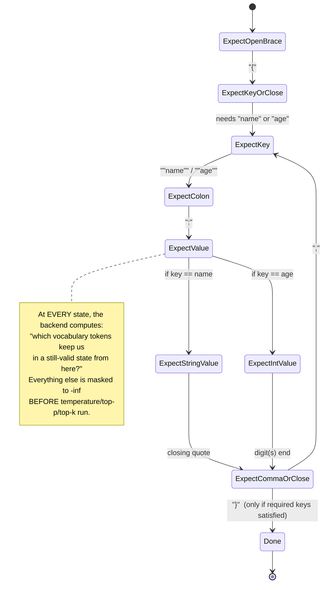

# Structured Outputs & Tool Calling

## Learning Objectives

By the end of this chapter, you will be able to:

- Explain *why* forcing an LLM to emit schema-conformant JSON or a valid tool call is fundamentally an
  inference-engine problem — constraining sampling at each decode step — not something a system prompt can
  reliably guarantee on its own
- Describe, conceptually, how a grammar-constrained decoding backend (xgrammar, guidance, and the
  still-recognized outlines/lm-format-enforcer) turns a JSON Schema or grammar into a per-step token mask, and
  where that mask plugs into the sampling pipeline you met in Chapter 5
- Write current-syntax structured-output requests for all four request shapes — `json`, `regex`, `choice`,
  `grammar` — via the `structured_outputs` request field, and configure the server-side backend with
  `--structured-outputs-config.backend`
- Recognize the removed `guided_json`/`guided_regex`/`guided_choice`/`guided_grammar` request fields on sight as
  pre-v0.12.0 syntax, not a valid alternate spelling
- Explain precisely what a `--tool-call-parser` does: it does not create tool-calling behavior in the model, it
  *extracts* a model-family-specific textual convention (produced because the chat template prompted the model
  to emit it) into the OpenAI-standard `tool_calls` response field
- Match a served model family to its `--tool-call-parser` (and, where required, its `--chat-template`), including
  the combined `--tool-call-parser`/`--reasoning-parser` pattern used for reasoning-capable models
- Wire a self-hosted vLLM server into a LangGraph `ChatOpenAI` node's `bind_tools()`, into an MCP-tool-enabled
  agent, and into `create_deep_agent()`'s `model` parameter — and state exactly what changes and what doesn't
  compared to a hosted-OpenAI backend
- Identify the practical reliability gap between open-model/parser combinations and hosted frontier models on
  parallel tool calls and deeply nested schemas, and know to test before trusting a specific pairing in
  production

---

## Prerequisites for This Chapter

This chapter assumes:

- **Chapter 4 (The OpenAI-Compatible Server)** — you already know *how to turn on* tool calling
  (`--enable-auto-tool-choice` + `--tool-call-parser`) and structured outputs (`structured_outputs` request
  field, `--structured-outputs-config.backend`) at the level needed to make a request succeed. This chapter goes
  much deeper on *why* those flags exist and *how* the mechanisms underneath them work — read Chapter 4 first if
  you haven't; this chapter does not re-explain the endpoint surface, authentication, or streaming.
- **Chapter 5 (Sampling & Generation)** — you know the shape of `SamplingParams` and the conceptual decode-step
  pipeline: a forward pass produces logits over the vocabulary, penalties and temperature reshape them, top-p/
  top-k/min_p filter the candidate set down, and a token is sampled from what's left. This chapter inserts one
  more stage into that pipeline — a validity **mask** — and explains exactly where.
- Deep, assumed familiarity with **this repo's `langchain-core-course`, `langgraph-course`, `mcp-course`, and
  `deepagents-course`** — specifically what a tool call *is* from the agent side (`bind_tools()`,
  `AIMessage.tool_calls`, the ReAct loop, MCP tool schemas, `create_deep_agent()`'s tool list). None of that is
  re-taught here. This chapter's entire job is the other side of that boundary: what the *engine* has to do to
  make an agent framework's tool-calling assumptions actually hold at runtime.

> **Scope relative to Chapter 4**: Chapter 4 taught "how do I turn this on and get a response." This chapter
> teaches "what is actually happening between the request landing on the server and the response containing
> valid JSON or a populated `tool_calls` field" — the constrained-decoding state machine, the parser's parsing
> logic, and the wiring details that make self-hosted models behave like hosted ones from your agent framework's
> point of view.

---

## 1. Why This Is an Inference-Engine Problem, Not a Prompting Problem

Every agent-framework tutorial teaches some version of: "describe the tool schema in the prompt, ask the model
nicely to respond in JSON, then `json.loads()` the result." That works *most* of the time with a capable model
and a simple schema. It also fails in exactly the ways you'd expect from asking a next-token predictor to follow
a formatting rule purely through prompting:

- An extra trailing comma, a missing closing brace, a stray sentence of preamble before the JSON starts
- A field with the wrong type (a string where an integer was required) because the schema only ever appeared as
  *text describing the shape*, never as an actual constraint on what tokens are legal
- Degraded reliability precisely on the long tail — deeply nested schemas, enums with many options, optional
  fields — where "please follow this format" carries the least weight relative to everything else competing for
  the model's attention

None of this is a flaw you can prompt-engineer away completely, because prompting only ever influences the
*probability distribution* over the next token — it never removes an invalid token from the set of things the
model is *permitted* to sample. As long as an invalid continuation has any positive logit, greedy decoding, or
an unlucky sample at any temperature above 0, can select it.

**Guided/structured decoding solves this by moving the guarantee out of the prompt and into the sampler.**
Recall the decode-step pipeline from Chapter 5:

```
logits  →  constraints  →  filtered distribution  →  sample
```

Structured outputs and tool-calling grammars operate at the **constraints** stage — the same stage where
`logit_bias`, `allowed_token_ids`, and bad-word suppression already live (Chapter 5, `SamplingParams`). At every
single decode step, before temperature scaling and top-p/top-k filtering ever happen, the engine computes which
tokens in the vocabulary are even **eligible** to be considered next, given everything generated so far and the
target schema/grammar. Every token that would make the output invalid — an opening quote where a digit is
required, a key not in the schema, a value outside an enum — gets its logit forced to `-inf` (or removed from
consideration entirely, depending on backend implementation) before the rest of the sampling pipeline ever
touches it.

This is the crucial distinction to internalize for this chapter: **prompting shapes probability; constrained
decoding removes possibility.** A well-prompted, unconstrained model might place 0.1% of its probability mass on
an invalid token — negligible-sounding, but multiplied across thousands of requests and long output sequences,
that 0.1% becomes routine production JSON-parsing failures. A constrained decode has *zero* probability mass on
an invalid token at every step, by construction, because that token was never in the candidate set to begin
with. The model isn't being asked to behave; it's being prevented from misbehaving.

Structured outputs (Section 2–4) and tool calling (Section 5) are two applications of a related but distinct
idea, worth separating clearly up front:

- **Structured outputs** constrain the *sampling process itself* so that every generated token is guaranteed to
  keep the output on a path toward a schema-valid final string. This is what Sections 2–4 cover.
- **Tool calling** relies on the model being trained (via its chat template and fine-tuning) to *emit* a
  particular textual convention when it wants to call a tool, and then a **parser** — ordinary text
  processing, running on the model's raw output, generally *not* a constrained-decoding mechanism itself —
  extracts that convention into the OpenAI-standard `tool_calls` field. This is Section 5.

Some deployments combine both: structured-output-style grammar constraints applied specifically to the
tool-call-argument portion of a generation (so the model can't emit a malformed function-call payload), layered
underneath a tool-call parser that extracts the whole thing. The mental separation still holds even when they're
combined in practice — the sampling-level guarantee governs token validity; the parser governs *extraction of
already-generated text* into the wire format.

---

## 2. How a Constrained-Decoding Backend Actually Works

Conceptually, every constrained-decoding backend does the same core thing, regardless of implementation
details: it treats the target grammar (a JSON Schema, a regex, an enum, an arbitrary context-free grammar) as
a **formal grammar**, and walks it as a **state machine** in lockstep with generation.

1. **Compile the schema/grammar into an automaton.** A JSON Schema like `{"type": "object", "properties":
   {"name": {"type": "string"}, "age": {"type": "integer"}}, "required": ["name", "age"]}` is compiled into a
   structure that knows, at any partial-output position, exactly which characters (and therefore which token
   continuations) are legal next — "we're inside the value for `name`, so we need a `"` to open a string, or
   more string characters, or a closing `"` if the string is done."
2. **Track state as tokens are generated.** Each time the model emits a token, the automaton advances by
   however many characters that token represents, updating its internal position in the grammar (e.g., "we've
   just closed the `name` string, so a `,` or `}` is legal next, and if `,` then a `"age"` key must follow").
3. **At every decode step, compute the mask.** Before the sampler runs, the backend asks its automaton: "given
   the current state, which tokens in the *entire vocabulary* would advance to a still-valid state?" Every
   other token gets masked out (logit forced to `-inf`) for that step only. This is the step that plugs directly
   into Chapter 5's pipeline, upstream of temperature/top-p/top-k.
4. **Repeat until the grammar reaches an accepting state** (e.g., the JSON object's closing `}` was emitted and
   no further keys are required) or `max_tokens`/`stop` ends generation first.

The reason this needs a dedicated **backend** rather than being a trivial regex check is mostly performance:
computing "which of these ~100k–200k vocabulary tokens are legal right now" naively, per token, per request, at
production concurrency, would be prohibitively slow. Backends differ mainly in *how* they make this fast and
*what* grammar dialects they accept — not in the underlying state-machine idea:

- **xgrammar** and **guidance** are the two backends the current vLLM docs lead with as of this writing.
- **outlines** and **lm-format-enforcer** are also still-recognized backend values — the current docs note a
  concrete dialect difference between them: **xgrammar, guidance, and outlines use Rust-style regex syntax**,
  while **lm-format-enforcer uses Python's `re` module** semantics for regex-based constraints. This matters in
  practice the moment your `regex` structured-output request uses a Python-`re`-specific construct (e.g. certain
  lookbehind forms) against a Rust-regex backend — it can fail to compile or behave subtly differently, which is
  exactly the kind of thing worth checking if a `regex`-constrained request behaves unexpectedly.
- The default backend value is **`"auto"`**, which lets vLLM choose per request — a reasonable default for most
  use cases, but worth pinning explicitly (`--structured-outputs-config.backend xgrammar`, for example) once
  you've validated a specific backend against your schema shapes and want deterministic, reproducible behavior
  across deployments.



The diagram is deliberately schematic (a real JSON-Schema automaton has far more states and handles nesting,
arrays, enums, and whitespace far more generally) — the point to take away is that **the grammar's current state
determines the legal token set at every single step**, and that computation happens once per decode step, for
every request using structured outputs, as an integral part of generation rather than a post-hoc validation
pass.

> **Why this is engine-side, restated.** A prompting-only approach could only ever produce a string and then
> *check* whether it happened to be valid JSON afterward — by which point an invalid token has already been
> generated and there's nothing left to do except retry the whole request. Constrained decoding prevents the
> invalid token from being chosen in the first place, at the sampler, inside the engine's decode loop — which is
> precisely why this capability lives in vLLM (an inference engine) rather than in LangChain, LangGraph, or any
> other client-side framework. No client-side code has visibility into per-step logits; only the engine does.

---

## 3. Structured Outputs: Backend Configuration and the Current Request Shape

### 3.1 Server-side backend selection

```bash
vllm serve Qwen/Qwen2.5-7B-Instruct \
  --structured-outputs-config.backend xgrammar
```

Valid values (per current docs): `xgrammar`, `guidance`, `outlines`, `lm-format-enforcer`, or `auto` (the
default — vLLM picks per request). This flag **replaced** the older `--guided-decoding-backend` name; if you see
`--guided-decoding-backend` in an older tutorial, treat it as the same concept under a retired flag name.

### 3.2 The current request-body shape

As of **v0.12.0**, the old top-level `guided_json`/`guided_regex`/`guided_choice`/`guided_grammar`/
`guided_whitespace_pattern`/`structural_tag`/`guided_decoding_backend` request fields were **removed**. The
current, supported shape nests everything under a single `structured_outputs` object, with sub-fields `json`,
`regex`, `choice`, `grammar`, and `structural_tag`:

```python
extra_body={"structured_outputs": {"json": schema}}       # was: guided_json
extra_body={"structured_outputs": {"regex": pattern}}      # was: guided_regex
extra_body={"structured_outputs": {"choice": options}}      # was: guided_choice
extra_body={"structured_outputs": {"grammar": grammar_str}} # was: guided_grammar
```

> **Callout — this is a removed API, not an alternate spelling.** If you find `guided_json` (or any sibling
> `guided_*` field) in a blog post, an internal wiki page, or a teammate's helper function, it predates v0.12.0.
> Against a current vLLM server it does not raise an error — it is simply ignored — so the failure mode is a
> silently unconstrained completion, not a clean exception. This is exactly the kind of stale-integration bug
> that looks like "the model is unreliable" when the real cause is a removed request field. See Chapter 4,
> Section 8.2, and this chapter's Common Mistakes.

### 3.3 Worked example: `json`

Constrain the response to a JSON Schema:

```python
from openai import OpenAI

client = OpenAI(base_url="http://localhost:8000/v1", api_key="token-abc123")

schema = {
    "type": "object",
    "properties": {
        "ticket_id": {"type": "string"},
        "priority": {"type": "string", "enum": ["low", "medium", "high", "urgent"]},
        "assignee": {"type": "string"},
    },
    "required": ["ticket_id", "priority"],
}

completion = client.chat.completions.create(
    model="qwen2.5-7b-instruct",
    messages=[{"role": "user", "content": "Triage this ticket: printer on 3rd floor is jammed again."}],
    max_tokens=128,
    extra_body={"structured_outputs": {"json": schema}},
)
print(completion.choices[0].message.content)  # guaranteed to parse and satisfy `schema`
```

### 3.4 Worked example: `regex`

Constrain the response to match a regular expression — useful for fixed-format strings like IDs, dates, or
codes where a full JSON Schema is overkill:

```python
completion = client.chat.completions.create(
    model="qwen2.5-7b-instruct",
    messages=[{"role": "user", "content": "Generate a plausible order confirmation code."}],
    max_tokens=16,
    extra_body={"structured_outputs": {"regex": r"[A-Z]{3}-\d{6}"}},
)
print(completion.choices[0].message.content)  # e.g. "ORD-482913"
```

> Remember Section 2's dialect note: xgrammar/guidance/outlines expect **Rust-style** regex syntax; only
> lm-format-enforcer uses Python `re` semantics. A pattern that compiles fine in a Python REPL is not guaranteed
> to compile identically against a Rust-regex-based backend — test the exact pattern against the backend you've
> actually configured.

### 3.5 Worked example: `choice`

Constrain the entire response to be exactly one of a fixed set of strings — the narrowest and cheapest form of
structured output, useful for classification-style calls:

```python
completion = client.chat.completions.create(
    model="qwen2.5-7b-instruct",
    messages=[{"role": "user", "content": "Classify sentiment: 'This update broke my workflow.'"}],
    max_tokens=8,
    extra_body={"structured_outputs": {"choice": ["positive", "neutral", "negative"]}},
)
print(completion.choices[0].message.content)  # guaranteed to be one of the three strings, verbatim
```

### 3.6 Worked example: `grammar`

For output shapes that aren't cleanly expressed as JSON Schema or a single regex (a small DSL, a structured
log-line format, a subset of SQL), pass a formal grammar directly — typically as a Lark or GBNF-style grammar
string, depending on backend support:

```python
key_value_grammar = r"""
start: pair ("\n" pair)*
pair: KEY "=" VALUE
KEY: /[a-z_]+/
VALUE: /[^\n]+/
"""

completion = client.chat.completions.create(
    model="qwen2.5-7b-instruct",
    messages=[{"role": "user", "content": "Emit three key=value config lines for a database connection."}],
    max_tokens=64,
    extra_body={"structured_outputs": {"grammar": key_value_grammar}},
)
print(completion.choices[0].message.content)
```

> **Unconfirmed — verify against current docs before relying on this in production.** The exact accepted
> grammar dialect(s) and precise syntax requirements per backend are implementation details that shift between
> releases; treat the shape above as illustrative of the *concept* (arbitrary grammar, not just JSON/regex/enum)
> rather than a guaranteed-syntax reference. Check `docs.vllm.ai`'s structured-outputs page for the exact
> grammar format your installed backend accepts before shipping this in production code.

### 3.7 The offline equivalent: `StructuredOutputsParams`

Everything above assumed the HTTP server. The offline `LLM` class (Chapter 3) exposes the identical concept
through `SamplingParams`, without an HTTP layer or `extra_body` wrapper:

```python
from vllm import LLM, SamplingParams
from vllm.sampling_params import StructuredOutputsParams

llm = LLM(model="Qwen/Qwen2.5-7B-Instruct")

params = SamplingParams(
    max_tokens=128,
    structured_outputs=StructuredOutputsParams(json=schema),  # same schema as Section 3.3
)
outputs = llm.generate(["Triage this ticket: printer on 3rd floor is jammed again."], params)
print(outputs[0].outputs[0].text)
```

Same mechanism, same guarantee — `structured_outputs` is a first-class `SamplingParams` field (Chapter 5's
field table), it's just reached through `extra_body` when going over HTTP because the OpenAI wire format has no
native concept of it.

---

## 4. Tool / Function Calling: What a Parser Actually Does

### 4.1 The chat-template-then-parse mental model

This is the section most worth slowing down on, because "tool-call parser" is easy to misread as "the thing
that makes the model call tools." It isn't. Two independent pieces of machinery cooperate:

1. **The chat template** (a Jinja file bundled with the model, or an explicit `--chat-template` override) is
   what renders the `tools=[...]` schemas and the conversation history into the actual prompt text the model
   sees — and, critically, it establishes the textual *convention* the model was fine-tuned to use when it wants
   to invoke a tool. One model family was trained to emit something like a `<tool_call>{"name": ..., "arguments":
   ...}</tool_call>` tagged JSON blob. Another was trained toward a Python-call-shaped syntax like
   `get_weather(city="Tokyo")`. These are not interchangeable — they're baked into each model's fine-tuning, the
   same way one person's shorthand notes aren't automatically legible to someone who learned a different
   shorthand.
2. **The tool-call parser** is server-side text-processing logic that knows one specific family's convention and
   converts it into the OpenAI API's standard `tool_calls` response shape — a list of `{"id", "type": "function",
   "function": {"name", "arguments"}}` objects. The parser doesn't influence what the model generates; it
   post-processes the model's raw generated text (as it streams or completes) and lifts the family-specific
   convention into the universal wire format your agent framework already knows how to consume.

Put differently: **the chat template is what makes tool-call-shaped text likely to be generated; the parser is
what makes that text legible to an OpenAI-compatible client.** Skip the parser and the model may still emit
perfectly good tool-call-shaped text — it'll just arrive as ordinary `message.content` string data, with
`message.tool_calls` empty, and your agent framework's routing logic (which branches on `tool_calls` being
non-empty, per `langgraph-course` Chapter 8's `ToolNode`/`bind_tools` pattern) will never fire the tool-call
branch. This is precisely the failure mode Chapter 4's Real-World Scenario walked through, and it's why
`--enable-auto-tool-choice` and `--tool-call-parser` are both mandatory, together, for tool calling to work at
all.

```mermaid
flowchart LR
    subgraph "Prompt construction"
        T["tools=[...] schemas<br/>+ conversation history"]
        CT["Chat template<br/>(model-specific Jinja)"]
        T --> CT
    end
    CT -->|"renders prompt in the<br/>convention this model<br/>was fine-tuned on"| GEN["Model generation<br/>(V1 engine, Ch. 6-9)"]
    GEN -->|"raw text, e.g.<br/>&lt;tool_call&gt;{"name":...}&lt;/tool_call&gt;<br/>or get_weather(city='Tokyo')"| PARSE["--tool-call-parser<br/>(hermes / mistral / llama3_json / ...)"]
    PARSE -->|"extracts + normalizes"| OUT["OpenAI-standard<br/>message.tool_calls[]"]
    OUT --> AGENT["Your agent framework<br/>(bind_tools / ToolNode / MCP / DeepAgents)<br/>— unchanged code"]
```

### 4.2 Why one parser per model family, not one universal parser

A universal parser isn't possible because there's no single textual convention to parse — each family's
fine-tuning committed to its own. The parser roster below is a **representative, confirmed-current subset**
(from `docs/features/tool_calling.md`); this list grows almost every vLLM release, so treat it as illustrative
of the mapping's shape, not exhaustive:

| Parser | Model family | Notes |
|---|---|---|
| `hermes` | Hermes-2/3 (NousResearch), Qwen2.5, QwQ-32B | |
| `mistral` | Mistral-7B-Instruct-v0.3 and later Mistral models | |
| `llama3_json` | Llama 3.1 / 3.2 | **requires an explicit `--chat-template`** |
| `llama4_pythonic` | Llama 4 | supports parallel tool calls |
| `granite4` / `granite` / `granite-20b-fc` | IBM Granite family | version-specific per Granite generation |
| `internlm` | InternLM2.5 | |
| `jamba` | AI21 Jamba 1.5 | |
| `xlam` | Salesforce xLAM | Llama-based and Qwen-based xLAM variants use different chat templates |
| `deepseek_v3` / `deepseek_v31` | DeepSeek-V3 / R1 family | version-specific |
| `openai` | gpt-oss-20b / gpt-oss-120b | |
| `kimi_k2` | Moonshot Kimi-K2-Instruct | |
| `hunyuan_a13b` | Tencent Hunyuan-A13B | reasoning model — pair with `--reasoning-parser` (Section 4.3) |
| `cohere_command3` | Cohere Command-R family | |

Custom families not covered by a shipped parser can register their own via `--tool-parser-plugin` — the
extension point exists precisely because this mapping can never be fully closed; new model families with new
conventions ship constantly.

> **Pin the chat template to the parser.** A parser is written against the *exact* textual convention its
> matching chat template produces. `llama3_json` is explicitly documented as requiring `--chat-template` to be
> set. Where a model's own tokenizer config doesn't ship a tool-calling-compatible template, vLLM's repository
> carries ready-made ones under `examples/tool_chat_template_*.jinja` — pass the matching file with
> `--chat-template path/to/tool_chat_template_....jinja`. Mismatching the two is a **silent** failure mode: the
> server starts, requests succeed, and tool calls parse incorrectly, partially, or not at all — with no startup
> error pointing you at the cause. This is one of the two failure modes in Chapter 4's Real-World Scenario, and
> it reappears in this chapter's own scenario below.

### 4.3 Reasoning models: the combined parser pair

Some models — the fact sheet's confirmed current example is Tencent's **Hunyuan-A13B** — are trained to emit a
separate reasoning/thinking block before their final answer or tool call (the same "thinking out loud, then
answer" pattern you've likely seen from reasoning-tuned models generally). For these, vLLM supports combining
**both** a tool-call parser and a reasoning parser on the same launch:

```bash
vllm serve tencent/Hunyuan-A13B-Instruct \
  --enable-auto-tool-choice \
  --tool-call-parser hunyuan_a13b \
  --reasoning-parser hunyuan_a13b
```

Conceptually, this is the same extraction idea from Section 4.1, applied twice over one generation: the
reasoning parser strips out (or separately surfaces) the model's thinking block, and the tool-call parser
extracts the actual tool invocation from whatever text follows it. Without the reasoning parser, a reasoning
model's thinking block risks being misparsed as part of the tool-call payload, or leaking into
`message.content` where your agent framework doesn't expect it. Treat this pairing as a real, current pattern
for reasoning-capable tool-calling models specifically — not every model needs it, and the exact reasoning-parser
roster (like the tool-call-parser roster) is worth checking against current docs before committing to a name for
a model not confirmed here.

### 4.4 What the client sees — unchanged from Chapter 4

Once both flags are configured correctly, the request/response shape at the client is ordinary OpenAI-format
tool calling — nothing new to learn here beyond Chapter 4's Section 7.3. The entire point of this section was
explaining what happens **between** the request landing and that clean response existing.

---

## 5. The Integration Payoff: Plugging This Into Your Existing Agent Stack

Everything in Sections 1–4 is invisible from a well-configured client's point of view — which is exactly what
makes self-hosted vLLM a drop-in backend for the agent stack you already know from this repo's other courses.
This section makes that concrete for each layer.

### 5.1 LangGraph: `ChatOpenAI` + `bind_tools()`

A LangGraph node that calls a chat model, per `langgraph-course` Chapter 3 (Nodes) and Chapter 8 (Tool-Calling
Patterns), is written against `BaseChatModel`'s `bind_tools()`/`.invoke()` contract — never against a specific
provider. Point `ChatOpenAI` at your vLLM server exactly as Chapter 4, Section 11.2 showed:

```python
from langchain_openai import ChatOpenAI

model = ChatOpenAI(
    model="hermes-3-llama-3.1-8b",          # matches --served-model-name
    base_url="http://localhost:8000/v1",
    api_key="token-abc123",
    temperature=0,
)

model_with_tools = model.bind_tools([get_weather_tool])
```

The only thing this chapter adds beyond Chapter 4's wiring: `bind_tools()` producing a populated
`AIMessage.tool_calls` on `.invoke()` depends entirely on the server having `--enable-auto-tool-choice` and a
correctly matched `--tool-call-parser`/`--chat-template` for the served model (Section 4). If those are missing
or mismatched, the LangGraph node itself is not broken — the graph's conditional edge that branches on
`tool_calls` being non-empty (`langgraph-course` Chapter 4, Edges & Routing) will simply always take the
no-tool-call path, and debugging effort gets misdirected at graph logic that was never the problem.

### 5.2 MCP: the schema layer underneath is the same mechanism

`mcp-course` Chapter 4 (MCP Tools) and Chapter 10 (Tool Schema Design) cover how an MCP server declares tool
schemas, and `mcp-course` Chapters 17–19 (MCP + LangChain / LangGraph / DeepAgents) cover how those schemas get
converted into the tool definitions an agent framework binds to a model. This chapter does not re-explain any of
that conversion — the important fact for this chapter is what happens **after** conversion: an MCP tool's JSON
Schema becomes exactly the same `{"type": "function", "function": {"name", "description", "parameters"}}` shape
passed to `tools=[...]` in a chat completions request (Chapter 4, Section 7.3). From vLLM's perspective, there is
no distinction between "a tool defined by hand" and "a tool discovered from an MCP server at runtime" — both
arrive as the same OpenAI-format tool schema, and both go through the exact same chat-template-render-then-parse
pipeline from Section 4.1. **The parser and chat-template mechanics in this chapter are what actually execute
underneath every MCP-tool-enabled agent**, the moment that agent's model is a self-hosted vLLM server rather than
a hosted API. If MCP tool calls aren't firing against your vLLM server, the debugging path is identical to
Section 5.1's — check `--enable-auto-tool-choice`/`--tool-call-parser` first, before suspecting the MCP server or
the adapter layer.

### 5.3 DeepAgents: `create_deep_agent(model=...)`

Per `deepagents-course` Chapter 3 (Your First Deep Agent) and Chapter 11 (MCP Integration), `create_deep_agent()`
accepts a prebuilt `BaseChatModel` instance for its `model` parameter — the recommended pattern specifically
because it's the only way to express provider-specific parameters like `base_url`:

```python
from deepagents import create_deep_agent
from langchain_openai import ChatOpenAI

model = ChatOpenAI(
    model="hermes-3-llama-3.1-8b",
    base_url="http://localhost:8000/v1",
    api_key="token-abc123",
)

agent = create_deep_agent(model=model, tools=[...], system_prompt="...")
```

DeepAgents' planning system, subagent orchestration, and filesystem-backed context (`deepagents-course` Chapters
4–6, 8) all treat `model` as an opaque `BaseChatModel` and never assume a specific provider — so nothing about
this chapter's server-side mechanics needs new DeepAgents-side code. What DeepAgents *does* depend on, through
every layer that eventually calls the model with tools bound, is exactly the same `--enable-auto-tool-choice`/
`--tool-call-parser` correctness this chapter has been building toward.

### 5.4 The gotcha worth testing before you trust it

Not every open model + parser combination reaches the same reliability bar as hosted frontier models on two
specific fronts:

- **Parallel tool calls** — a single assistant turn requesting more than one tool call at once. The parser
  roster in Section 4.2 explicitly calls out `llama4_pythonic` as supporting this; that's a signal, not a
  guarantee for every other parser in the table. Some parser/model combinations reliably return only the first
  tool call, silently dropping additional ones the model may have intended.
- **Deeply nested or large tool-argument schemas** — a schema with several levels of nested objects, large
  enums, or many optional fields stresses both the model's tool-calling fine-tuning *and* the parser's text
  extraction logic more than a flat, few-field schema does. Reliability here varies meaningfully by model family
  and parser maturity, in a way that isn't fully captured by a "supports tool calling: yes" checkbox.

The practical implication for a production agent pipeline: **test your specific model/parser pairing against
your actual tool schemas** — including the parallel-call and nested-schema cases your agent might realistically
trigger — before trusting it the way you'd trust a hosted frontier API. This is exactly the same discipline
`deepagents-course`'s testing chapter and `langgraph-course`'s testing chapter already teach for agent logic
generally; it applies with extra weight here because the failure mode (a dropped or malformed tool call) is
silent at the HTTP layer and only surfaces as an agent that mysteriously "forgot" to do something.

---

## 6. Worked End-to-End Example

### 6.1 Launch — tool calling and structured outputs together

```bash
vllm serve NousResearch/Hermes-3-Llama-3.1-8B \
  --dtype auto \
  --api-key token-abc123 \
  --served-model-name hermes-3-llama-3.1-8b \
  --enable-auto-tool-choice \
  --tool-call-parser hermes \
  --structured-outputs-config.backend xgrammar
```

### 6.2 A structured JSON-output request

```python
from openai import OpenAI

client = OpenAI(base_url="http://localhost:8000/v1", api_key="token-abc123")

incident_schema = {
    "type": "object",
    "properties": {
        "summary": {"type": "string"},
        "severity": {"type": "string", "enum": ["sev1", "sev2", "sev3", "sev4"]},
        "affected_services": {"type": "array", "items": {"type": "string"}},
    },
    "required": ["summary", "severity", "affected_services"],
}

completion = client.chat.completions.create(
    model="hermes-3-llama-3.1-8b",
    messages=[{"role": "user", "content": "Summarize: checkout API returning 500s for ~10% of requests since 14:02 UTC."}],
    max_tokens=128,
    extra_body={"structured_outputs": {"json": incident_schema}},
)
print(completion.choices[0].message.content)
```

### 6.3 A tool-calling request against the same server

```python
tools = [{
    "type": "function",
    "function": {
        "name": "lookup_service_status",
        "description": "Look up current operational status for a named service.",
        "parameters": {
            "type": "object",
            "properties": {"service_name": {"type": "string"}},
            "required": ["service_name"],
        },
    },
}]

response = client.chat.completions.create(
    model="hermes-3-llama-3.1-8b",
    messages=[{"role": "user", "content": "Is the checkout service currently degraded?"}],
    tools=tools,
    tool_choice="auto",
    max_tokens=128,
)

message = response.choices[0].message
if message.tool_calls:
    for call in message.tool_calls:
        print(call.function.name, call.function.arguments)
else:
    print("No tool call — check --enable-auto-tool-choice / --tool-call-parser configuration (Section 4).")
```

### 6.4 The same tool call through a LangGraph node

```python
from langchain_openai import ChatOpenAI
from langchain_core.tools import tool
from langgraph.prebuilt import ToolNode
from langgraph.graph import StateGraph, MessagesState, START, END

@tool
def lookup_service_status(service_name: str) -> str:
    """Look up current operational status for a named service."""
    return f"{service_name}: operational"  # stub — replace with a real check

model = ChatOpenAI(
    model="hermes-3-llama-3.1-8b",
    base_url="http://localhost:8000/v1",
    api_key="token-abc123",
    temperature=0,
).bind_tools([lookup_service_status])

def call_model(state: MessagesState):
    return {"messages": [model.invoke(state["messages"])]}

def route(state: MessagesState):
    last = state["messages"][-1]
    return "tools" if getattr(last, "tool_calls", None) else END

graph = StateGraph(MessagesState)
graph.add_node("agent", call_model)
graph.add_node("tools", ToolNode([lookup_service_status]))
graph.add_edge(START, "agent")
graph.add_conditional_edges("agent", route, {"tools": "tools", END: END})
graph.add_edge("tools", "agent")
app = graph.compile()

result = app.invoke({"messages": [("user", "Is the checkout service currently degraded?")]})
print(result["messages"][-1].content)
```

Nothing in this graph is vLLM-aware — it's exactly the pattern `langgraph-course` Chapter 8 teaches for any
tool-calling model. Its correctness rests entirely on the server-side configuration from Section 6.1.

---

## Real-World Scenario

A team self-hosts a Llama-3.1-8B-Instruct checkpoint behind vLLM to back a LangGraph agent that uses two MCP
tools (an internal ticketing-system lookup and a knowledge-base search, wired in per `mcp-course` Chapter 18).
The agent worked correctly during development against hosted `gpt-4o-mini` and the migration plan was, per
Chapter 4's integration section, "just change the `base_url`."

In staging, two problems surface that trace directly to this chapter's material:

1. **Tool calls fire for single-tool turns but silently drop the second call on multi-tool turns.** The team
   launched with `--tool-call-parser llama3_json`. Section 4.2's table flags `llama4_pythonic` — not
   `llama3_json` — as the parser explicitly documented for parallel tool-call support. Llama 3.1 by itself, and
   this parser, weren't validated for the "look up the ticket *and* search the knowledge base in the same turn"
   pattern their agent's prompt occasionally triggers. The fix isn't a parser bug to report — it's exactly
   Section 5.4's gotcha: this specific model/parser pairing needed to be tested against the agent's actual
   multi-tool-call patterns before being trusted, and the team either needs to redesign the prompt to avoid
   requesting parallel calls, or evaluate whether a model/parser pairing with confirmed parallel-call support
   fits their latency/quality budget.
2. **A structured-output helper that post-processes the knowledge-base search result into a fixed JSON shape
   occasionally returns unconstrained prose instead of JSON.** Root cause: the helper was still using
   `extra_body={"guided_json": schema}`, copied from an internal wiki page written against an older vLLM
   version. Against the currently deployed server, that field was removed in v0.12.0 (Section 3.2) — no error,
   just silent non-enforcement. Updating the helper to `extra_body={"structured_outputs": {"json": schema}}`
   fixes it immediately, with no change needed anywhere else in the pipeline.

Both root causes are configuration-layer, not agent-logic — reinforcing this chapter's central claim: once you
understand the engine-side mechanics (parser-per-family matching, current request-body syntax, and the
real reliability limits of specific model/parser pairings), these failures stop looking like flaky-model
mysteries and start looking like checklist items.

---

## Best Practices

- **Treat structured-output constraints and tool-call parsers as two distinct mechanisms** even when used
  together — one masks invalid tokens during sampling; the other extracts already-generated text into a
  standard wire format. Debugging each requires reasoning about a different part of the pipeline.
- **Pin `--structured-outputs-config.backend` explicitly** once you've validated a backend against your actual
  schemas, rather than leaving it on `auto` indefinitely in production — deterministic backend selection makes
  behavior reproducible across restarts and deployments.
- **Always pair a `--tool-call-parser` with the exact chat template it expects**, verified against the model's
  own `tokenizer_config.json` or the repo's `examples/tool_chat_template_*.jinja` files — never assume a model's
  default template is parser-compatible.
- **Check the regex dialect (Rust-style vs. Python `re`) for your chosen structured-output backend** before
  shipping a `regex` constraint that uses dialect-specific syntax.
- **Test parallel-tool-call and nested-schema behavior explicitly** for your specific model/parser pairing
  before a production agent pipeline depends on it — don't infer support from a model's general "supports tool
  calling" marketing claim.
- **Use the current `structured_outputs` request field**, never a `guided_*` field copied from material that
  might predate v0.12.0.
- **For reasoning-capable tool-calling models**, remember the combined `--tool-call-parser`/`--reasoning-parser`
  pattern (Section 4.3) — omitting the reasoning parser risks the thinking block leaking into the tool-call
  payload or `message.content`.
- **Keep agent-framework code (LangGraph nodes, DeepAgents `model=`) provider-agnostic**, exactly as your
  `langgraph-course`/`deepagents-course` prerequisites already teach — all vLLM-specific correctness belongs in
  the `vllm serve` launch configuration, not in agent logic.

---

## Common Mistakes

- **Assuming a well-crafted system prompt guarantees valid JSON.** Without `structured_outputs`, there is no
  sampling-level guarantee — only a probabilistic nudge that degrades on complex schemas and long outputs
  (Section 1).
- **Copying `guided_json`/`guided_regex`/`guided_choice`/`guided_grammar` request syntax from an older
  tutorial.** Removed in v0.12.0; silently ignored rather than erroring (Section 3.2).
- **Choosing a `--tool-call-parser` by model *vendor* rather than exact model *family/version*.** Parser
  compatibility is version-specific (e.g. Granite's parser varies by generation, DeepSeek's by v3 vs. v3.1) —
  don't assume one parser covers an entire vendor's model lineup.
- **Forgetting the matching `--chat-template`** for a parser that requires one (`llama3_json` is explicitly
  documented as needing this) — the server starts fine and requests succeed; tool calls simply parse incorrectly
  or not at all, with no startup-time error to flag the mismatch.
- **Expecting parallel tool calls to work reliably on any parser/model combination.** Only some combinations
  (e.g. `llama4_pythonic`) are documented as supporting this — test before depending on it in a multi-tool-call
  agent design (Section 5.4, Real-World Scenario).
- **Using a Python-`re`-specific regex construct against a Rust-regex-based backend** (xgrammar/guidance/
  outlines) for a `regex`-constrained request, and being confused when it fails to compile or behaves
  differently than expected in a Python REPL.
- **Debugging a "broken" LangGraph/MCP/DeepAgents tool call by inspecting agent code first**, when the actual
  cause is missing/mismatched `--enable-auto-tool-choice`/`--tool-call-parser`/`--chat-template` on the vLLM
  server — check the server configuration before assuming the graph, MCP adapter, or DeepAgents wiring is at
  fault (Section 5).
- **Treating a reasoning-capable model's tool-calling support the same as a non-reasoning model's**, and
  omitting the paired `--reasoning-parser` — risks reasoning-block content leaking into the tool-call payload or
  the final answer.

---

## Summary

- Forcing schema-conformant output is an **inference-engine** concern: it requires masking invalid tokens at
  the **constraints** stage of the decode pipeline (`logits → constraints → filtered distribution → sample`,
  Chapter 5) — not something prompting alone can guarantee, because prompting only reshapes probabilities, never
  removes possibilities.
- A constrained-decoding backend (**xgrammar**, **guidance**, and the still-recognized **outlines**/
  **lm-format-enforcer**) compiles a schema/grammar into a state machine and, at every decode step, computes
  which vocabulary tokens keep the output on a valid path — masking everything else before normal sampling runs.
  xgrammar/guidance/outlines use Rust-style regex; lm-format-enforcer uses Python `re`.
- Server flag: `--structured-outputs-config.backend <xgrammar|guidance|outlines|lm-format-enforcer|auto>`
  (default `auto`). Request shape: `extra_body={"structured_outputs": {"json"|"regex"|"choice"|"grammar":
  ...}}`, replacing the `guided_*` fields removed in v0.12.0.
- Tool calling requires **both** `--enable-auto-tool-choice` and `--tool-call-parser <name>`. The parser doesn't
  create tool-calling behavior — it **extracts** the model-family-specific textual convention (produced by the
  matching chat template) into the OpenAI-standard `tool_calls` field. Parsers are family-specific (`hermes`,
  `mistral`, `llama3_json`, `llama4_pythonic`, the `granite` family, `deepseek_v3`/`v31`, `openai`, `kimi_k2`, and
  others — a growing, non-exhaustive list) because model families were trained on different conventions.
- Reasoning-capable tool-calling models (e.g. `hunyuan_a13b`) pair `--tool-call-parser` with a matching
  `--reasoning-parser` to separate the thinking block from the tool call/answer.
- A correctly configured vLLM server is a drop-in OpenAI-compatible backend for `ChatOpenAI.bind_tools()`
  (LangGraph), MCP-tool-enabled agents (the same JSON-schema tool definitions flow through the identical
  parser/backend mechanics underneath), and `create_deep_agent(model=...)` — no agent-side code changes needed,
  only correct server-side flags.
- Not every open model/parser combination reliably supports **parallel tool calls** or **deeply nested schemas**
  as well as hosted frontier models — test your specific pairing against your actual tool schemas before trusting
  it in production.

---

## Knowledge Check

1. Explain, in terms of the Chapter 5 decode-step pipeline (`logits → constraints → filtered distribution →
   sample`), exactly where a structured-output backend's token mask is applied, and why that placement is what
   gives it a hard guarantee that prompting alone cannot.
2. What does a `--tool-call-parser` actually do, and what does it *not* do? Why can't one universal parser cover
   every model family?
3. A colleague sends `extra_body={"guided_json": schema}` against a current vLLM server and gets an
   unconstrained, occasionally-invalid response with no error. What's the cause, and what's the corrected
   request?
4. Name the two backends the current vLLM docs lead with for structured outputs, the two still-recognized
   additional backends, and the one concrete dialect difference called out between them.
5. Your team wants an agent to request two tools in a single turn against a self-hosted Llama-3.1-8B model using
   `--tool-call-parser llama3_json`. What does Section 4.2/5.4 tell you to check before assuming this will work
   reliably?
6. You've wired a self-hosted vLLM server into a LangGraph node via `ChatOpenAI.bind_tools()`, and the graph's
   conditional edge always routes to the "no tool call" branch even though the prompt clearly asks for a tool.
   Name the two server-side flags most likely to be missing or mismatched, and explain how you'd confirm which
   one it is.

---

## Hands-On Exercise

1. **Launch a vLLM server** with a small tool-calling-capable instruct model (e.g. a Hermes or Qwen2.5 variant),
   `--enable-auto-tool-choice`, a matching `--tool-call-parser`, and `--structured-outputs-config.backend
   xgrammar`, following Section 6.1's pattern.
2. **Send a `json`-constrained structured-output request** (Section 6.2) with a schema of your own design that
   includes at least one `enum` field and one nested object — confirm the response always parses and always
   satisfies the schema, even across several repeated calls at `temperature=1.0`.
3. **Send a `regex`-constrained request** (Section 3.4) and deliberately test a pattern construct that behaves
   differently between Python `re` and Rust-style regex (for example, a lookbehind assertion) — observe what
   happens against your configured backend.
4. **Send a tool-calling request** (Section 6.3) with a two-tool schema, and inspect whether `message.tool_calls`
   contains both calls when the prompt plausibly warrants both — note whether your chosen parser handled this or
   only returned one.
5. **Build the minimal LangGraph tool-calling agent from Section 6.4**, point it at your server, and confirm the
   graph correctly routes through the `tools` node and back. Then deliberately relaunch the server *without*
   `--tool-call-parser` and rerun the same graph — observe the routing failure firsthand and confirm you can
   diagnose it from Section 5.1's guidance alone.
6. **Optional — MCP integration**: following `mcp-course` Chapter 18's pattern, wire an MCP server's tools into
   the same LangGraph agent instead of hand-defined tools, and confirm the same server configuration (Section
   6.1) is sufficient with no additional vLLM-side changes.

---

## Further Reading

- [vLLM Docs — Tool Calling](https://docs.vllm.ai/en/latest/features/tool_calling.html) — the authoritative,
  current `--tool-call-parser` roster and per-model chat-template requirements
- [vLLM Docs — Structured Outputs](https://docs.vllm.ai/en/latest/features/structured_outputs.html) — backend
  details, the current `structured_outputs` request shape, and the regex-dialect comparison referenced in
  Section 2
- [vLLM Docs — OpenAI-Compatible Server](https://docs.vllm.ai/en/latest/serving/openai_compatible_server.html) —
  the endpoint/flag reference this chapter builds on
- `github.com/vllm-project/vllm/releases` — check before trusting a specific parser/backend name against your
  installed version; both rosters grow almost every release
- Related chapter in this course: [Chapter 4 — The OpenAI-Compatible Server](./04-openai-compatible-server.md) —
  how to turn these features on and do the basic agent-stack wiring
- Related chapter in this course: [Chapter 5 — Sampling & Generation](./05-sampling-and-generation.md) — the
  decode-step pipeline this chapter's constrained-decoding mask plugs into
- This repo's [LangGraph course, Chapter 8 — Tool Calling Patterns](../langgraph-course/08-tool-calling-patterns.md)
- This repo's [MCP course, Chapter 4 — MCP Tools](../mcp-course/04-mcp-tools.md), [Chapter 10 — Tool Schema
  Design](../mcp-course/10-tool-schema-design.md), and [Chapter 18 — MCP + LangGraph](../mcp-course/18-mcp-with-langgraph.md)
- This repo's [DeepAgents course, Chapter 3 — Your First Deep Agent](../deepagents-course/03-your-first-deep-agent.md)
  and [Chapter 11 — MCP Integration](../deepagents-course/11-mcp-integration.md)

---

<div style="display:flex;justify-content:space-between;align-items:center;">
  <a href="./15-parallelism.md">← Previous: Parallelism</a>
  <a href="./00-index.md">🏠 Index</a>
  <a href="./17-benchmarking.md">Next: Benchmarking →</a>
</div>
