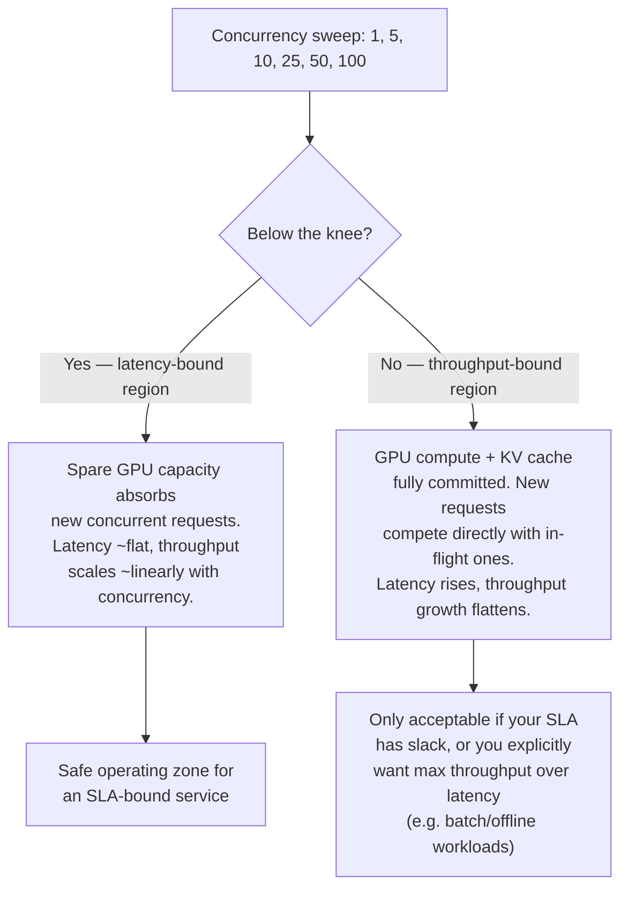

# Benchmarking

## Learning Objectives

By the end of this chapter, you will be able to:

- Recite the full LLM-serving metric vocabulary precisely — TTFT, TPOT, ITL, TPS, aggregate throughput, concurrency, GPU utilization, VRAM consumption — and state what question each one answers and who (end user vs. operator) cares about it
- Use the current `vllm bench` CLI (`vllm bench latency`, `vllm bench serve`, `vllm bench throughput`) instead of the retired standalone benchmark scripts you may see referenced in older tutorials
- Run a quick offline latency smoke test with `vllm bench latency --load-format dummy` and explain why "dummy" weights are appropriate for that specific measurement and inappropriate for others
- Run a realistic online-serving benchmark with `vllm bench serve` against a live `vllm serve` endpoint, and explain precisely why that's a structurally different measurement than `vllm bench latency`/`vllm bench throughput`
- Design and execute a **concurrency sweep** (1, 5, 10, 25, 50, 100...) and locate the "knee" in the latency-vs-concurrency curve — the point where a deployment flips from latency-bound to throughput-bound
- Read GPU utilization *alongside* latency/throughput numbers to correctly diagnose whether a slowdown is a genuine compute bottleneck or a scheduling/memory-configuration problem
- Apply a repeatable benchmarking methodology (warm-up, realistic distributions, end-to-end measurement, repeated runs, matched hardware) that produces numbers you can actually trust and act on in Chapter 18

## Prerequisites

This chapter assumes you're comfortable with:

- **Chapter 1** — the exact definitions of TTFT, TPOT, and ITL, and the prefill/decode split that produces them. This chapter recaps them only briefly; if any of TTFT/TPOT/ITL feels shaky, go back to Chapter 1 Section 7 first.
- **Chapter 8** (Continuous Batching) and **Chapter 9** (The vLLM Scheduler) — you should understand why batching multiple requests together raises aggregate throughput while nudging individual-request latency, because that trade-off is exactly what a concurrency sweep makes visible.
- **Chapter 10** (Memory Management) — `gpu_memory_utilization`, `max_num_seqs`, and how VRAM pressure shows up as OOMs or reduced concurrency headroom, because this chapter teaches you to *read* the symptoms those configs produce, not just set the flags.

This chapter does not teach *how to fix* a bad benchmark result — that's Chapter 18 (Performance Tuning), which depends entirely on this chapter's discipline. Benchmarking without a tuning chapter after it is just data collection; tuning without a benchmarking chapter before it is just guessing. This chapter is the "don't optimize based on intuition" half of that pair.

---

## 1. Why This Chapter Exists: Measurement Before Tuning

Every optimization technique in this course so far — quantization (Ch. 13), speculative decoding (Ch. 14), parallelism (Ch. 15), structured outputs (Ch. 16) — has a real cost as well as a real benefit. Quantization saves VRAM but can cost quality and sometimes latency. Speculative decoding can raise throughput or can make things *worse* if the acceptance rate is low. Tensor parallelism unlocks bigger models but adds cross-GPU communication overhead. None of these trade-offs can be reasoned about from first principles alone, in production, on your actual hardware, with your actual traffic pattern — they have to be **measured**.

This is the single most common failure mode in real vLLM deployments: an engineer reads a blog post claiming "AWQ gives you 2x throughput" or "speculative decoding is always a win," applies it in production, and either gets a regression or — worse — gets an improvement they can't explain or reproduce because they never established a baseline. Chapter 18 is going to ask you to change one variable at a time and observe the effect. That's only possible if you already know how to observe the effect precisely, repeatably, and without fooling yourself. That's this chapter's entire job.

## 2. The Full Metric Vocabulary

Chapter 1 introduced TTFT, TPOT, and ITL from first principles, tied to the prefill/decode split. Here they are again, briefly, plus the operator-facing metrics (throughput, concurrency, GPU utilization, VRAM) that Chapter 1 didn't need yet but this chapter can't proceed without.

### Recap: the per-request latency metrics (Chapter 1)

| Metric | Definition | Reflects |
|---|---|---|
| **TTFT** (Time to First Token) | Wall-clock time from request submission to the first output token being available | Prefill cost + queueing delay |
| **TPOT** (Time Per Output Token) | `(E2E latency − TTFT) / (num_output_tokens − 1)` — averaged decode-step cost | Decode-phase memory bandwidth cost, batch contention |
| **ITL** (Inter-Token Latency) | The *distribution* of gaps between consecutive emitted tokens (p50/p95/p99), not an average | Same as TPOT, plus scheduler fairness/jitter — the number that actually predicts perceived streaming smoothness |

### The rest of the vocabulary

| Metric | Definition | What question it answers | Who cares |
|---|---|---|---|
| **TPS (per-request)** | `1 / TPOT` for a single stream | "How fast does *my* response feel while it streams?" | End user (indirectly, via UX) |
| **Aggregate throughput** | Total tokens (prompt + generated) processed per second, summed across **all** concurrent requests, system-wide | "How much total load can this deployment sustain?" | Operator — this is the number capacity planning and cost-per-token math are built on |
| **Concurrency** | Number of requests simultaneously in-flight (submitted but not yet complete) at a given moment | "How many users can be actively waiting on this deployment at once?" | Operator, and indirectly the end user (concurrency past the "knee" — Section 4 — degrades everyone's latency) |
| **GPU utilization** | Fraction of time the GPU's compute units are actively doing work (as reported by `nvidia-smi` or DCGM), typically sampled over an interval | "Is the GPU the bottleneck, or is it sitting idle waiting on something else?" | Operator — the key diagnostic signal tying this chapter to Chapters 9/10 (Section 5) |
| **VRAM consumption** | Bytes of GPU memory in use — weights + KV cache + activations + framework overhead | "How much headroom is left before OOM, and how much of it is available for more concurrent KV cache?" | Operator — directly determines the safe `max_num_seqs` / concurrency ceiling (Chapter 10) |

The throughput-vs-latency distinction from Chapter 1 Section 8 is worth restating in this chapter's frame: **TTFT/TPOT/ITL are what an individual end user experiences; aggregate throughput and GPU utilization are what an operator pays for and provisions against.** A benchmark that reports only one side of that split — a marketing-friendly aggregate tokens/sec number with no p99 latency, or a single-request latency number with no concurrency context — is not lying, but it is answering a different question than the one you actually need answered before a production launch. Every worked example in this chapter reports both sides deliberately.

## 3. The Current CLI: `vllm bench`

If you search for "how to benchmark vLLM" online, a meaningful fraction of what you'll find references three standalone Python scripts: `benchmark_serving.py`, `benchmark_latency.py`, and `benchmark_throughput.py`, usually invoked directly (`python benchmark_serving.py ...`) from inside a cloned `vllm` repo checkout. **Those scripts are retired.** The `benchmarks/README.md` file in the vLLM repository itself now opens with language to the effect of "this directory *used to* contain vLLM's benchmark scripts and utilities" — past tense, a direct signal that the standalone-script era is over.

> **If you find `benchmark_serving.py`, `benchmark_latency.py`, or `benchmark_throughput.py` named in an older blog post or Stack Overflow answer, don't go looking for them in a fresh vLLM checkout — look for the `vllm bench` CLI equivalent instead.** The functionality didn't disappear; it was consolidated into a proper CLI subcommand.

The current, unified interface is three subcommands under `vllm bench`:

| Subcommand | Measures | Style |
|---|---|---|
| `vllm bench latency` | Single-request (or small fixed-batch) latency of the offline engine directly | Offline — no HTTP server involved |
| `vllm bench throughput` | Maximum aggregate throughput the offline engine can sustain, saturating it with a fixed workload | Offline — no HTTP server involved |
| `vllm bench serve` | Realistic online-serving behavior against a **running** OpenAI-compatible server, under configurable concurrent traffic | Online — drives the real HTTP endpoint |

Install it with the dedicated extra:

```bash
pip install vllm[bench]
```

This extra pulls in the benchmarking-specific dependencies (dataset loaders, HTTP client libraries for `vllm bench serve`, etc.) that aren't part of the core `vllm` install — don't skip it and then wonder why `vllm bench` isn't recognized as a subcommand.

Full current documentation lives at `docs.vllm.ai/en/latest/cli/bench/latency.html`, `.../serve.html`, and `.../throughput.html` — check these before a benchmarking session, since exact flags are added and renamed release-to-release faster than any course chapter can track.

## 4. `vllm bench latency`: Offline Engine Latency, No Server Required

`vllm bench latency` measures the latency of the **offline engine itself** — it instantiates an `LLM`-style engine in-process, runs a fixed prompt/output-length workload through it directly, and reports latency statistics. There is no HTTP server, no network hop, no concurrent-client simulation. This makes it the right tool for one specific question: *"how fast is a single forward pass (or a small fixed batch) through this engine, on this hardware, with this configuration?"* — a pure measurement of engine + hardware, with the serving-layer variables (queueing, HTTP overhead, concurrent contention) deliberately removed.

Worked example, confirmed from the fact sheet:

```bash
vllm bench latency \
  --model meta-llama/Llama-3.2-1B-Instruct \
  --input-len 32 \
  --output-len 1 \
  --enforce-eager \
  --load-format dummy
```

Flag by flag:

- **`--model meta-llama/Llama-3.2-1B-Instruct`** — which model to load. Any illustrative small model works well for a quick smoke test; you don't need your production model to sanity-check that the CLI itself runs.
- **`--input-len 32`** — the synthetic prompt length in tokens. `vllm bench latency` doesn't read real prompt text from a dataset; it generates a synthetic prompt of exactly this length, which is precisely what you want when you're isolating engine mechanics from prompt-content effects.
- **`--output-len 1`** — generate exactly one output token. Combined with `--input-len 32`, this measures something close to a pure prefill-dominated latency number — useful when you specifically want to isolate prefill cost from decode cost (recall Chapter 1: these are structurally different workloads, and a benchmark that conflates them by using a long generation length muddies which phase you're actually measuring). Raise `--output-len` when you want decode-dominated numbers instead.
- **`--enforce-eager`** — disables CUDA graph capture, forcing eager PyTorch execution (Chapter 10/12 background: V1 uses piecewise CUDA graph compilation by default). For a benchmark, this trades away some raw performance in exchange for **faster startup** (no graph-capture warm-up cost) and more predictable, debuggable timing — a reasonable trade for a quick smoke test, but remember that a `--enforce-eager` number is *not* representative of a production deployment's real latency, which will normally run with CUDA graphs enabled. Don't compare an `--enforce-eager` benchmark number directly against a production dashboard number.
- **`--load-format dummy`** — the load-bearing flag for a *fast* smoke test: instead of downloading and loading the model's actual pretrained weights, the engine allocates tensors of the correct shape filled with essentially random/uninitialized values. This is exactly right for **pure latency/scheduling benchmarking**, where you care about "how long does a forward pass of this shape take on this hardware," not "what does the model actually output" (the output text will be garbage — that's expected and irrelevant to a latency measurement). It's the difference between benchmarking *engine mechanics* and benchmarking *model quality* — this flag deliberately throws away the latter to measure the former quickly, without a multi-gigabyte download, which matters a lot when you're iterating on a config change and re-running the benchmark dozens of times in a session.

> **Never use `--load-format dummy` for a benchmark whose output you intend to compare against a real deployment's throughput/latency for planning purposes** if there's any chance model-specific behavior (e.g., actual token distribution affecting EOS timing, or a quantization format that changes tensor layout) matters to the result. For a production capacity-planning benchmark, load the real weights. Dummy weights are a development/smoke-test convenience, not a planning tool.

## 5. `vllm bench throughput`: Maximum Sustainable Offline Throughput

`vllm bench throughput` is the offline-engine counterpart that answers a different question than `latency`: *"if I throw a large batch of requests at this engine back-to-back with no artificial pacing, what's the maximum aggregate tokens/sec it can sustain?"* It saturates the engine deliberately, rather than modeling realistic arrival timing. This is useful for capacity-planning questions like "what's the theoretical ceiling of this hardware/model/config combination" — but, like `vllm bench latency`, it's still an **offline** measurement: no HTTP server, no client-side network/serialization overhead, no realistic think-time between request arrivals.

Because the exact current flag set for `vllm bench throughput` isn't in this course's verified fact sheet, treat any specific flags you see for it (dataset selection, batch-size caps, etc.) as:

> **Unconfirmed — verify against `vllm bench throughput --help` or `docs.vllm.ai/en/latest/cli/bench/throughput.html`** before relying on a specific flag spelling in a real benchmarking session.

The conceptual takeaway that *is* confirmed and stable: `latency` and `throughput` both measure the **offline engine in isolation**; neither one tells you what a real client, talking to a real running server over real HTTP, with real concurrent traffic, will actually experience. That's what `vllm bench serve` is for.

## 6. `vllm bench serve`: Realistic Online-Serving Benchmarks

This is the tool for the question that actually matters for a production launch: *"if I point real HTTP traffic at my running `vllm serve` endpoint, with realistic concurrency, what latency and throughput do clients actually see?"*

The structural difference from `latency`/`throughput` is not a minor implementation detail — it changes what's being measured:

| | `vllm bench latency` / `vllm bench throughput` | `vllm bench serve` |
|---|---|---|
| Target | An in-process offline engine instance | A running `vllm serve` HTTP endpoint |
| Transport | None — direct Python calls | Real HTTP requests (OpenAI-compatible `/v1/completions` or `/v1/chat/completions`) |
| Includes network/serialization overhead | No | Yes |
| Includes real scheduler queueing under concurrent load | Partially (batch scheduling, no request-arrival queueing) | Yes — this is the whole point |
| Concurrency model | Fixed batch or saturating loop | Configurable concurrent clients / request rate, closer to real traffic |
| What it answers | "How fast is the engine, in isolation?" | "What will my actual users experience against my actual deployment?" |

You start the server first, exactly as you would for real traffic:

```bash
vllm serve meta-llama/Llama-3.2-1B-Instruct --port 8000
```

Then, in a separate terminal, drive it with `vllm bench serve`. A representative invocation:

```bash
vllm bench serve \
  --backend vllm \
  --model meta-llama/Llama-3.2-1B-Instruct \
  --host 127.0.0.1 \
  --port 8000 \
  --dataset-name random \
  --num-prompts 200 \
  --max-concurrency 10
```

> **Unconfirmed — verify exact flag names against `vllm bench serve --help` or `docs.vllm.ai/en/latest/cli/bench/serve.html` before a real session.** The fact sheet confirms that `vllm bench serve` exists as a subcommand and requires `pip install vllm[bench]`, but does not enumerate every current flag spelling (dataset selection, concurrency control, request-rate pacing, etc.) — these are exactly the kind of flags that get renamed or extended release-to-release, and the intent above (point it at a running server, choose a dataset shape, set a concurrency level, run N prompts) is the durable concept even if a specific flag name drifts.

What you get back from a `vllm bench serve` run is the metric table from Section 2, measured **end-to-end through the real serving stack**: TTFT, TPOT, ITL percentiles, and aggregate throughput, at whatever concurrency you configured. This is the tool for the concurrency sweep in Section 7 — you re-run it at each concurrency level and compare.

## 7. The Concurrency Sweep: Finding the Knee

Here's the methodology from the course roadmap, and the reason this chapter exists rather than just being a CLI reference: **don't pick a production concurrency limit by guessing, and don't pick it from a single benchmark run at one arbitrary concurrency level.** Run `vllm bench serve` repeatedly against the same server, holding the model/hardware/config fixed and varying only concurrency:

```
concurrency = 1, 5, 10, 25, 50, 100
```

At each level, record aggregate throughput (tokens/sec, system-wide) and a latency number that matters for your use case — typically p50 and p99 TTFT, and p50/p99 TPOT or ITL. Then plot latency (y-axis) against concurrency (x-axis), and separately plot throughput (y-axis) against concurrency (x-axis).

### Why this reveals the deployment's true operating envelope

Recall the throughput-vs-latency trade-off from Chapter 1 Section 8 and continuous batching from Chapter 8: batching multiple sequences' decode steps together amortizes the expensive memory read (weights + KV cache) across more useful work, raising aggregate throughput, at the cost of slightly higher per-request latency as each step now serves more sequences. A concurrency sweep is that trade-off made empirical, at every level simultaneously, on your actual hardware:

- **At low concurrency** (1, 5): the server has spare capacity. The GPU's compute units are mostly idle between decode steps (Chapter 1 Section 4's memory-bound decode). Adding another concurrent request barely moves anyone's latency, because there was slack to absorb it. This region is **latency-bound** — you have headroom, and throughput scales up almost linearly with concurrency because you're mostly just filling idle capacity.
- **At high concurrency** (100, and beyond): the server's batching/scheduling capacity and available VRAM for KV cache are now fully committed. Every additional concurrent request now genuinely competes for the same finite GPU compute and memory bandwidth as everyone already being served. Latency for *everyone* starts rising meaningfully with each additional concurrent request, and throughput growth flattens out (or, past true saturation, can even decline as scheduling/preemption overhead grows). This region is **throughput-bound** — the server is saturated, and you're now trading latency for capacity you may not even be gaining.

The **knee** is the transition zone between those two regimes — the concurrency level around which the latency-vs-concurrency curve visibly bends upward, and the throughput-vs-concurrency curve visibly flattens. Below the knee, concurrency is nearly free. Above it, every unit of added concurrency has a real, worsening latency cost.

### Illustrative shape (not real numbers — the shape is the point)

```
Latency (p99 TTFT, ms)
   ^
   |                                                    ___----●  (100)
   |                                        ___----●----
   |                              ___---●---           (50)
   |                       __--●--                       (25)
   |                 _--●--                                (10)
   |            _--●--                                       (5)
   |      ●--                                                 (1)
   +----------------------------------------------------------------> Concurrency
        1     5     10          25          50          100

                              ^
                        the "knee" — latency-bound
                        region ends, throughput-bound
                        region begins somewhere around here


Aggregate Throughput (tokens/sec)
   ^
   |                                    ●-----●-----●   (flattening — saturated)
   |                          ●----●----                (25 → 50 → 100: diminishing returns)
   |                 ●---●----                            (10 → 25: still climbing well)
   |            ●----                                      (5)
   |      ●--                                              (1)
   +----------------------------------------------------------------> Concurrency
        1     5     10          25          50          100
```

Or, as a Mermaid diagram of the same idea, focused on the mechanism rather than the exact curve shape:



The methodological point: **don't pick an arbitrary concurrency number** ("we'll just set `max_num_seqs` to 64 because that's what another team used") — run the sweep on your own model, hardware, and prompt distribution, find where your curve actually bends, and set your production concurrency ceiling relative to *that* knee, with margin. Two deployments with different models, different quantization, or different GPUs will have their knee in completely different places; there is no universal "safe" concurrency number that transfers between them.

## 8. Reading GPU Utilization Alongside These Metrics

A latency/throughput number by itself under-determines the diagnosis. The same "TPOT went up" symptom has completely different fixes depending on what GPU utilization is doing at the same moment — this is the direct link back to Chapters 9 (scheduler) and 10 (memory management).

| GPU utilization | Latency | Diagnosis | What to do about it |
|---|---|---|---|
| **High** (GPU consistently near-saturated) | High / degraded | The GPU is legitimately the bottleneck — you're compute- or memory-bandwidth-bound and there's no slack left to reclaim | Faster/more GPUs, more parallelism (Ch. 15), quantization to reduce per-step cost (Ch. 13), or accept this concurrency level as your real ceiling |
| **High** | Acceptable (within SLA) | Well-tuned — you're extracting real value from the hardware without violating your latency budget | Nothing to fix; this is the target state. Keep monitoring as traffic patterns shift |
| **Low** | High / degraded | **Not a compute problem.** The GPU is sitting idle while requests still feel slow — something upstream of raw compute is the bottleneck | Look at scheduling and batching configuration (Chapter 9 — is the scheduler admitting requests efficiently? is `max_num_batched_tokens` too conservative?) and memory configuration (Chapter 10 — is `gpu_memory_utilization` or `max_num_seqs` set so low that requests are queueing for KV cache space rather than compute?) |
| **Low** | Acceptable | Under-loaded — you likely have headroom for more concurrency before hitting the knee (Section 7) | Consider whether you're over-provisioned for current traffic, or whether this is simply a low-traffic period |

The trap this table exists to prevent: an engineer sees degraded latency, assumes "the GPU must be too slow," and reaches straight for a hardware upgrade or quantization — without checking utilization first. If utilization was actually *low* the whole time, a faster GPU changes nothing, because the GPU was never the constraint; the real fix was a scheduler or memory-configuration change that costs nothing in hardware. Always check utilization before reaching for a compute-side fix.

## 9. Real-World Scenario: Choosing a Safe Max-Concurrency for an SLA-Bound Service

A team is launching an internal support-ticket triage assistant with a hard SLA: **p99 TTFT under 500 ms**, because the UI shows a "thinking" spinner and product has decided anything slower feels broken. They've deployed a 7B-class model on a single GPU behind `vllm serve` and need to set a safe concurrency ceiling (via `max_num_seqs` and, at the load-balancer layer, a request-admission limit) before opening it up to the whole support org.

Instead of guessing a number, they run the Section 7 sweep with `vllm bench serve` against their actual staging deployment — same GPU, same model, same quantization config they intend to ship to production (Section 10 explains why that hardware-matching matters) — using a realistic prompt-length distribution drawn from real historical ticket text (not a single fixed prompt length, per the checklist in Section 10). Results, illustrative:

| Concurrency | p50 TTFT | p99 TTFT | Aggregate throughput |
|---|---|---|---|
| 1 | 90 ms | 110 ms | 45 tok/s |
| 5 | 100 ms | 140 ms | 210 tok/s |
| 10 | 120 ms | 210 ms | 390 tok/s |
| 25 | 180 ms | 420 ms | 780 tok/s |
| 50 | 340 ms | 890 ms | 900 tok/s |
| 100 | 610 ms | 1,900 ms | 940 tok/s |

Reading this against the SLA (p99 TTFT < 500 ms): concurrency 25 is the last level that clears the bar (p99 = 420 ms), and 50 blows past it (890 ms) while throughput has only grown from 780 to 900 tok/s — a small aggregate gain for a large latency cost, exactly the throughput-bound region from Section 7. The knee sits somewhere between 25 and 50.

The team doesn't set the production ceiling at exactly 25, though — they build in margin, because a benchmark's synthetic concurrent load is cleaner than real traffic's bursty arrival pattern, and because GPU behavior can vary slightly across otherwise-identical hardware. They set `max_num_seqs` (and the load-balancer's admission limit) to roughly 15–18, re-verify with another sweep at that ceiling under a simulated bursty arrival pattern (not just steady concurrency), and set up ongoing p99 TTFT dashboards (tying back to Chapter 1's Real-World Scenario) so a regression shows up before users complain. If demand later requires serving more concurrent users, the team now has a principled next step: re-run this exact sweep after each candidate change (more GPUs, quantization, speculative decoding) from Chapters 13–15, and compare the *new* knee against this baseline — which is precisely Chapter 18's tuning loop.

## 10. Best Practices: The Benchmarking Checklist

Treat this as a literal checklist before trusting any benchmark number enough to act on it:

- **Warm up before measuring.** The first few requests after a cold start pay for CUDA graph capture (unless `--enforce-eager`), lazy kernel compilation, prefix-cache population, and general JIT/cache-warming effects that will never recur in steady state. Discard warm-up-period measurements or run a throwaway batch before starting the timed run — a benchmark that includes cold-start cost systematically overstates real steady-state latency.
- **Use realistic prompt/output-length distributions, not one fixed length.** A single fixed `--input-len`/`--output-len` (fine for the quick engine smoke test in Section 4) tells you nothing about how your *actual* traffic — a mix of short chat turns and long document-summarization requests, say — will behave, because prefill cost scales with prompt length and total request duration scales with output length. Pull a representative sample from real production logs or a public dataset that matches your use case's shape.
- **Measure end-to-end, not just engine-internal.** `vllm bench latency`/`throughput` measure the offline engine; only `vllm bench serve` against a real running server captures HTTP overhead, request queueing, and load-balancer behavior. A production capacity decision should be based on the end-to-end number, not the engine-only number — the gap between them is exactly the "serving stack tax" that engine-only benchmarks can't see.
- **Repeat runs and check variance**, not just a single sample. GPU clocks, thermal throttling, background OS activity, and even minor scheduler nondeterminism can shift numbers run to run. Run each configuration multiple times and look at the spread before treating a single number as ground truth — a "10% improvement" that's smaller than the run-to-run noise floor isn't a real improvement.
- **Benchmark on the same hardware/config you'll actually deploy on.** A benchmark run on an A100 tells you very little about production behavior on an L4 or H100 — different memory bandwidth, different compute throughput, different CUDA graph behavior. Likewise, benchmarking with a different quantization method, `gpu_memory_utilization`, or `max_num_seqs` than production will use produces numbers that don't transfer. If you must benchmark on different hardware than production (e.g., no staging GPU access), say so explicitly next to the numbers and treat the result as directional, not definitive.
- **Report both sides of the latency/throughput split** (Section 2) — a benchmark write-up that reports only aggregate tokens/sec, or only single-request latency, is answering half the question a production launch decision actually needs answered.
- **Re-run the sweep after every meaningful config change**, not just once at launch. Quantization, speculative decoding, a new vLLM version, or a hardware change can all move the knee — treat benchmarking as a recurring practice tied to Chapter 18's tuning loop, not a one-time pre-launch checkbox.

## 11. Common Mistakes

- **Benchmarking with unrealistically short/uniform prompts.** A fixed 32-token prompt with a 1-token output (great for the Section 4 smoke test) tells you almost nothing about how a deployment serving 2,000-token support tickets with 400-token responses will actually perform — prefill cost and KV cache growth both scale with the numbers you didn't test.
- **Skipping warm-up.** Timing the very first request(s) after server start bakes CUDA-graph-capture and kernel-compilation cost into your "steady-state" number, making the engine look artificially slower than it will be for the 10,000th request.
- **Benchmarking on different hardware than production.** A number from a developer's workstation GPU, or from whatever cloud instance happened to be available, is not a stand-in for the actual production GPU — memory bandwidth and compute throughput differences alone can invalidate the comparison.
- **Using the retired standalone scripts from an old tutorial.** If a blog post or internal runbook still references `python benchmark_serving.py` or `benchmark_latency.py`, don't try to resurrect them from an old repo checkout — use the current `vllm bench serve`/`latency`/`throughput` subcommands and `pip install vllm[bench]` instead (Section 3).
- **Picking a production concurrency limit without a sweep.** Setting `max_num_seqs` to a round number because it "seemed reasonable" or matched a different team's deployment, instead of running the Section 7 sweep on your own model/hardware/traffic and finding your own knee.
- **Reaching for a hardware/compute fix without checking GPU utilization first.** Assuming a latency regression means "the GPU is too slow" when utilization was actually low the whole time — the real fix was in scheduling or memory configuration (Section 8), and a hardware upgrade would have changed nothing.
- **Treating a single benchmark run as ground truth.** Not checking run-to-run variance, and mistaking noise for a real signal when comparing two configurations.
- **Comparing an `--enforce-eager` latency number against a production (CUDA-graph-enabled) dashboard number** as if they measured the same thing — they don't (Section 4).
- **Reporting only aggregate throughput, or only single-request latency**, in a benchmark write-up meant to inform a real launch decision — neither half of the picture is sufficient alone (Section 2, Section 10).

## Summary

- The full metric vocabulary spans two audiences: **TTFT/TPOT/ITL/per-request TPS** answer "what does one user experience," while **aggregate throughput, concurrency, GPU utilization, and VRAM consumption** answer "what does this deployment cost to run and how much load can it take." A production decision needs both.
- The current benchmarking CLI is `vllm bench latency`, `vllm bench serve`, and `vllm bench throughput` (install via `pip install vllm[bench]`). The older standalone `benchmark_serving.py`/`benchmark_latency.py`/`benchmark_throughput.py` scripts are retired — if you see them referenced, look for the `vllm bench` equivalent.
- `vllm bench latency`/`throughput` measure the **offline engine in isolation** — no HTTP, no server, no realistic concurrent-client behavior. `--load-format dummy` makes `latency` a fast smoke test by skipping real weight loading, appropriate for engine-mechanics measurement, not for planning-grade capacity numbers.
- `vllm bench serve` drives a real, running `vllm serve` OpenAI-compatible endpoint under configurable concurrent traffic — this is the tool for realistic online-serving numbers, and the one to use for a concurrency sweep.
- A **concurrency sweep** (1, 5, 10, 25, 50, 100...) reveals a deployment's true operating envelope: a latency-bound region below the "knee," where concurrency is nearly free, and a throughput-bound region above it, where every added concurrent request meaningfully degrades everyone's latency for diminishing throughput gain. Find your own knee empirically — it moves with model, hardware, and configuration.
- GPU utilization is the diagnostic that disambiguates a latency problem: high utilization + high latency means the GPU is genuinely the bottleneck; low utilization + high latency means the problem is upstream, in scheduling or memory configuration (Chapters 9–10), and no hardware upgrade will fix it.
- Trustworthy benchmarking requires warm-up, realistic (not uniform) prompt/output distributions, end-to-end (not engine-only) measurement, repeated runs to separate signal from noise, and matching production hardware/configuration — skipping any one of these produces numbers that look precise but don't transfer to reality.

## Knowledge Check

1. A teammate reports "our aggregate throughput is 1,200 tokens/sec, so we're in great shape." What's missing from that claim, and what would you ask to see before agreeing?
2. Why is `vllm bench latency --load-format dummy` an appropriate tool for a quick engine smoke test, but an inappropriate one for a production capacity-planning decision?
3. Explain, in your own words, why `vllm bench serve` measures something structurally different from `vllm bench latency`/`vllm bench throughput`, even though all three eventually run the same underlying model.
4. You run a concurrency sweep and find that throughput barely improves from concurrency 50 to 100, while p99 latency roughly doubles. What region of the curve are you in, and what would you set your production concurrency ceiling to, and why?
5. GPU utilization is at 30% and p99 latency is badly out of SLA. A colleague proposes buying a faster GPU. What's wrong with that proposal, and where would you look instead?
6. Why does benchmarking on a different GPU model than your production hardware produce numbers you can't trust, even if the software configuration is identical?

<details>
<summary>Answers</summary>

1. Aggregate throughput alone says nothing about per-request latency (TTFT/TPOT/ITL) — a system could be pushing a high tokens/sec number while individual users experience terrible p99 latency, because throughput is measured system-wide while an end user only feels their own stream. Ask to see the latency percentiles (especially p99 TTFT and ITL) at the concurrency level that throughput number was measured at, and ask what concurrency level it was measured at in the first place.
2. `--load-format dummy` skips loading real pretrained weights, which is exactly right when you're isolating engine/scheduling mechanics (how long does a forward pass of a given shape take on this hardware) and want fast iteration without a multi-gigabyte download — the model's actual output quality is irrelevant to that measurement. It's inappropriate for capacity planning because a real deployment decision needs numbers that reflect the actual model you'll serve, loaded the way you'll actually load it (real weights, real quantization format), since those details can affect memory layout and timing in ways a dummy-weight run won't capture.
3. `vllm bench latency`/`throughput` instantiate the offline engine in-process and measure it directly — no HTTP, no network, no realistic concurrent-arrival pattern, no load-balancer or serialization overhead. `vllm bench serve` sends real HTTP requests to an already-running `vllm serve` endpoint, so it captures the entire serving stack: network overhead, request queueing under real concurrent load, and the actual OpenAI-compatible API surface a real client would hit. Two different questions: "how fast is the engine in isolation" vs. "what will a real client actually experience."
4. This is the throughput-bound region, past the knee — the server is saturated, and additional concurrency is now trading meaningfully worse latency for almost no additional throughput. The production concurrency ceiling should be set below 50, at whatever level the latency-vs-concurrency curve was still close to flat (the latency-bound region), with some safety margin below that point rather than at the knee itself, since real bursty traffic behaves worse than a clean synthetic sweep.
5. Low GPU utilization with high latency means the GPU is not the bottleneck — it's sitting comparatively idle while requests are still slow, so buying faster compute wouldn't address the actual constraint. The real problem is very likely upstream in scheduling (Chapter 9 — is the scheduler admitting requests efficiently, is `max_num_batched_tokens` too conservative) or memory configuration (Chapter 10 — is `gpu_memory_utilization`/`max_num_seqs` set so conservatively that requests queue for KV cache space rather than compute). Look there before touching hardware.
6. Different GPU models have different memory bandwidth and compute throughput, which is precisely what decode (memory-bound) and prefill (compute-bound) performance depend on (Chapter 1). CUDA graph capture behavior, kernel selection, and even quantization kernel availability can also differ across GPU architectures. A number measured on one GPU model doesn't predict behavior on another even with byte-identical vLLM configuration — the hardware itself is a variable in the measurement, not a constant you can assume away.

</details>

## Hands-On Exercise

Requires: a running vLLM install with GPU access (or CPU platform, understanding results will be illustrative-only), and `pip install vllm[bench]`.

### Part 1 — Smoke-test the engine directly

Run the confirmed `vllm bench latency` example from Section 4 against a small model:

```bash
vllm bench latency \
  --model meta-llama/Llama-3.2-1B-Instruct \
  --input-len 32 \
  --output-len 1 \
  --enforce-eager \
  --load-format dummy
```

Then re-run it with `--output-len 128` instead of `1`, keeping everything else the same. Compare the reported latency numbers and explain, in your own words tying back to Chapter 1, why the second run's latency is dominated by a different phase (decode) than the first (prefill).

### Part 2 — Start a real server and drive it with `vllm bench serve`

Start the server:

```bash
vllm serve meta-llama/Llama-3.2-1B-Instruct --port 8000
```

In a separate terminal, install the bench extra if you haven't, and check `vllm bench serve --help` for the exact current flags on your installed version before running the sweep — flag names for dataset selection and concurrency control are exactly the kind of detail that drifts release to release (Section 6).

### Part 3 — Run the concurrency sweep

Using whatever the current `vllm bench serve` flags are for setting concurrency and prompt count (verify with `--help`), run the same benchmark at each of these concurrency levels against your server, changing nothing else between runs:

```
1, 5, 10, 25, 50
```

For each run, record: p50 TTFT, p99 TTFT, p50 TPOT (or ITL if reported), and aggregate throughput (tokens/sec). Tabulate the results (a simple Markdown table like the one in Section 9 is fine) and, separately, sketch (by hand or with any plotting tool you like) latency vs. concurrency and throughput vs. concurrency.

### Part 4 — Identify the knee and justify a production number

From your own sweep's numbers:

1. At what concurrency level does the latency curve visibly start bending upward, and at what level does the throughput curve visibly start flattening? Are they the same level, or does one lead the other?
2. If you had a hypothetical SLA of "p99 TTFT under 300 ms," what concurrency ceiling would you recommend for production, and how much margin below the knee would you build in, and why?
3. Repeat Part 3 with `--enforce-eager` added to your server launch command and compare the resulting knee location against your first run. Does disabling CUDA graphs move the knee to a lower concurrency, and does that match your expectation from Section 4's discussion of what `--enforce-eager` trades away?

## Further Reading

- `vllm bench latency` CLI reference — `https://docs.vllm.ai/en/latest/cli/bench/latency.html`
- `vllm bench serve` CLI reference — `https://docs.vllm.ai/en/latest/cli/bench/serve.html`
- `vllm bench throughput` CLI reference — `https://docs.vllm.ai/en/latest/cli/bench/throughput.html`
- vLLM benchmarks directory (for historical context on the retired standalone scripts, and any current utility scripts) — `https://github.com/vllm-project/vllm/tree/main/benchmarks`
- vLLM release notes (check before trusting any specific flag/default mentioned in this chapter against your installed version) — `https://github.com/vllm-project/vllm/releases`
- vLLM documentation root — `https://docs.vllm.ai/`
- This course's Chapter 1 (LLM Inference Fundamentals) for the TTFT/TPOT/ITL definitions this chapter builds on, and Chapter 18 (Performance Tuning) for what to do with the numbers this chapter teaches you to produce

<div style="display:flex;justify-content:space-between;align-items:center;">
  <a href="./16-structured-outputs-and-tool-calling.md">← Previous: Structured Outputs & Tool Calling</a>
  <a href="./00-index.md">🏠 Index</a>
  <a href="./18-performance-tuning.md">Next: Performance Tuning →</a>
</div>
