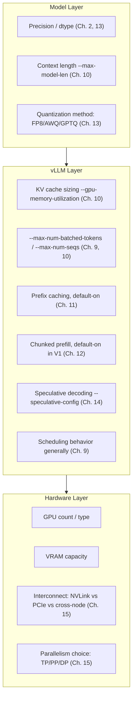
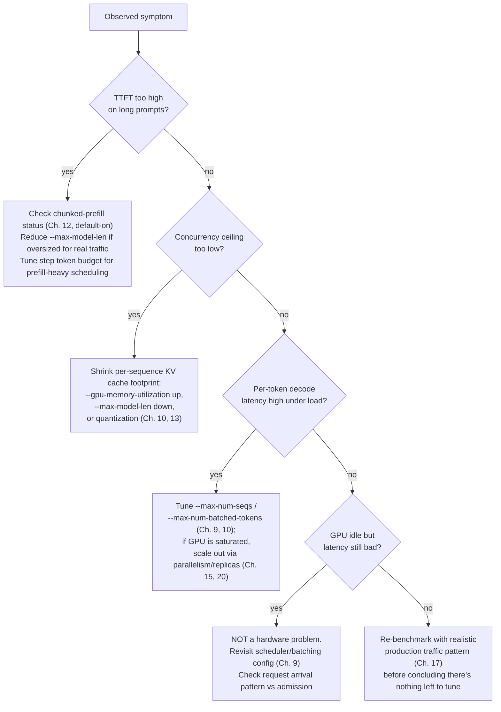

# Performance Tuning

## Learning Objectives

By the end of this chapter, you will be able to:

- State the one discipline this entire chapter exists to instill: **change exactly one variable between
  benchmark runs, or the result is unattributable** — and explain precisely why changing two flags at once
  destroys your ability to reason about cause and effect, even when the aggregate numbers look better
- Organize vLLM's entire tunable surface into three layers — **model**, **vLLM engine**, and **hardware** —
  and, for every lever already introduced in Chapters 6–17, state in one line what it does and which chapter
  covers it in depth
- Read a `vllm bench serve` / `vllm bench latency` output and a `nvidia-smi` snapshot together to distinguish
  a **scheduling/batching bottleneck** (GPU idle, latency still bad) from a **genuine compute/memory-bandwidth
  ceiling** (GPU saturated, latency bad because there is nothing left to give)
- Run a realistic multi-iteration tuning walkthrough end-to-end: baseline → benchmark → diagnose → change one
  thing → re-benchmark → compare → iterate, and know when to stop
- Map the four most common production symptoms — high TTFT on long prompts, low concurrency ceiling, high
  per-token decode latency under load, and "GPU is idle but latency is still bad" — to the specific lever from
  Chapters 6–17 that actually fixes each one, instead of guessing
- Recognize the point of diminishing returns on a single instance and know when the correct next move is
  **horizontal scaling** (more replicas behind a load balancer, Chapter 20) rather than further single-box
  tuning

## Prerequisites

- **Chapter 9** (The vLLM Scheduler) — this chapter tunes the scheduler's admission behavior
  (`max_num_seqs`, `max_num_batched_tokens`); you need to already understand what the scheduler decides every
  step, not just that flags exist
- **Chapter 10** (Memory Management) — `--gpu-memory-utilization`, `--max-model-len`, and how KV cache sizing
  determines your concurrency ceiling are load-bearing background for this whole chapter
- **Chapter 13** (Quantization) — precision and quantization method trade-offs (FP8, AWQ, GPTQ) reappear here
  as a lever for both VRAM footprint and raw throughput
- **Chapter 15** (Parallelism) — tensor/pipeline/data parallelism choices are a tuning lever at the hardware
  layer, not just a "how to fit a big model" mechanism
- **Chapter 17** (Benchmarking) — you need to already be comfortable running `vllm bench serve`,
  `vllm bench latency`, and `vllm bench throughput` and reading TTFT/TPOT/ITL/throughput output; this chapter
  assumes that tool is second nature and spends zero time re-teaching it

If any of those five feel shaky, this chapter will still make sense as a map, but the worked walkthrough will
land much harder once you've personally run the benchmarks it references.

---

## Why This Chapter Is Different From the Ones Before It

Chapters 6 through 17 each introduced a *concept* — what a KV cache is, why PagedAttention avoids
fragmentation, what continuous batching buys you, how the scheduler admits requests, how quantization trades
quality for memory, how parallelism splits a model across GPUs, how to measure any of it with a benchmark. Each
of those chapters, taken alone, teaches you a knob.

This chapter introduces no new knob. It teaches the **process** that turns a pile of knobs into a working
production configuration: a disciplined, repeatable loop of *hypothesize → change one thing → measure → keep
or revert*. That process is not obvious, and skipping it is the single most common way experienced engineers
still waste days tuning a vLLM deployment.

### The rule: one variable at a time

Here is the rule, stated as plainly as possible, because it is simple to state and surprisingly easy to violate
under real deadline pressure:

> **Never change more than one configuration variable between two benchmark runs you intend to compare.**

Say your baseline gets 45 tokens/sec/user at TTFT of 800ms. You suspect both `--max-num-seqs` and
`--gpu-memory-utilization` are too conservative, so — because you're in a hurry — you bump both at once and
re-run the benchmark. Throughput goes up 30%. Which change caused it? You don't know, and you *cannot* know
from this data. Maybe `--max-num-seqs` did all the work and `--gpu-memory-utilization` was neutral or even
slightly harmful. Maybe it's the reverse. Maybe they interacted (raising both together pushed you past a KV
cache eviction threshold that neither one alone would have hit). You've bought yourself a working number and a
config you cannot explain, cannot safely port to a different model or GPU, and cannot debug when it eventually
regresses.

This matters more in vLLM specifically than in a lot of tuning contexts because so many of its levers are
**not independent**. `--gpu-memory-utilization`, `--max-model-len`, and `--max-num-seqs` all compete for the
same fixed pool of VRAM (Chapter 10) — moving one changes how much headroom the others have. Quantization
(Chapter 13) changes both the VRAM available for KV cache *and* the compute cost per token, so a throughput
change after switching to FP8 could be either effect, or both, depending on whether you were VRAM-bound or
compute-bound beforehand. Speculative decoding (Chapter 14) trades a latency-per-token constant for an
acceptance-rate variable that depends on your traffic's actual content — a synthetic benchmark with repetitive
prompts will report an acceptance rate that a mixed production traffic pattern won't reproduce. In every one of
these cases, changing two things at once doesn't just give you an unattributable win — it can hide a real
regression in the variable you cared less about.

The fix costs you time up front (each iteration is a full benchmark run, and a benchmark run against a real GPU
is not free) and pays it back later: every entry in your tuning log is a fact you can defend, port to another
model, and re-derive if the vLLM version changes underneath you.

### The three layers of the tunable surface

The roadmap for this course organizes the levers you've already learned into three layers. Tuning discipline
means working through them in order of leverage-for-effort, not randomly:



**Model layer** — the cheapest changes to *try* (a flag or a different checkpoint) but the most disruptive to
quality and compatibility:

| Lever | What it does | Chapter |
|---|---|---|
| Precision / `dtype` | `bfloat16`/`float16` vs. lower-precision formats; changes compute throughput and memory bandwidth pressure per token | Ch. 2, 13 |
| `--max-model-len` | Caps the context length the engine will serve; directly caps per-sequence KV cache size | Ch. 10 |
| Quantization method (`--quantization fp8/awq/gptq/...`) | Shrinks weight (and sometimes KV cache) memory footprint, changes compute cost per token, some quality cost | Ch. 13 |

**vLLM layer** — the layer with the most levers and the best effort-to-reward ratio, because you're not
touching the model or the hardware, only how the engine schedules and allocates against what it already has:

| Lever | What it does | Chapter |
|---|---|---|
| `--gpu-memory-utilization` | Fraction of GPU memory reserved for weights + KV cache + activations; the primary control on how much KV cache — and therefore concurrency — you get | Ch. 10 |
| `--max-num-batched-tokens` / `--max-num-seqs` | Per-step token budget and max concurrent sequences; controls how aggressively the scheduler batches | Ch. 9, 10 |
| Prefix caching | Reuses KV cache blocks across requests sharing a prompt prefix; **default-on in V1** | Ch. 11 |
| Chunked prefill | Splits long prefills across scheduler steps so they don't starve decode; **default-on in V1** | Ch. 12 |
| Speculative decoding (`--speculative-config`) | Drafts multiple tokens per step (ngram/eagle/eagle3/medusa/draft_model) to cut per-token latency, at the cost of acceptance-rate variance | Ch. 14 |
| Scheduling behavior generally | The unified scheduler's admission and step-budgeting logic underlies all of the above | Ch. 9 |

**Hardware layer** — the most expensive to change (new GPUs, a different node topology) but sometimes the only
lever left once the other two are exhausted:

| Lever | What it does | Chapter |
|---|---|---|
| GPU count / type | More or faster GPUs raise the ceiling on both memory and compute | — |
| VRAM capacity | Determines how much room exists for weights + KV cache before you must quantize or shrink context | Ch. 10, 13 |
| Interconnect (NVLink vs. PCIe vs. cross-node networking) | Determines whether tensor parallelism (which needs low-latency all-reduce every layer) is viable, or whether you should prefer pipeline/data parallelism instead | Ch. 15 |
| Parallelism choice (TP/PP/DP/EP) | How you split a model (or replicate it) across the hardware you have | Ch. 15 |

The ordering matters: model-layer and vLLM-layer changes are reversible in minutes and don't require new
hardware. Exhaust those first. Only reach for the hardware layer — different GPUs, a different parallelism
topology, more nodes — once you've confirmed (via benchmarking, not guessing) that the bottleneck is a genuine
compute or memory-bandwidth ceiling rather than a misconfigured scheduler.

---

## Reading the Bottleneck: Is the GPU the Problem or Not?

Before changing anything, the first diagnostic question is always the same one, and it has a mechanical
answer:

**Is the GPU actually busy while latency is bad?**

Run your benchmark (`vllm bench serve` under realistic concurrency, per Chapter 17) while watching
`nvidia-smi dmon` or `nvidia-smi -l 1` in a second terminal. Two outcomes:

1. **GPU utilization is high (routinely 90%+) and latency is bad.** The GPU is legitimately saturated — there
   is no slack left to schedule better. This is a **hardware-or-model-layer** problem: you need less compute
   per token (quantization), fewer tokens to compute (shorter context, speculative decoding's acceptance
   savings), or more/faster GPUs (parallelism, scaling out).

2. **GPU utilization is low or spiky (dipping well below saturation) and latency is still bad.** The GPU has
   idle cycles it isn't being fed work to fill. This is **never** a hardware problem, no matter how it feels —
   throwing more GPUs at an underfed scheduler just gives you more idle GPUs. This is a **vLLM-layer**
   scheduling/batching problem: check `--max-num-seqs`, `--max-num-batched-tokens`, whether requests are
   arriving faster than the scheduler can admit them, or whether `--gpu-memory-utilization` is leaving so little
   KV cache headroom that the scheduler can't admit more concurrent sequences even though compute is free.

This single check — GPU busy vs. GPU idle — is what separates "tune the engine" from "tune or replace the
hardware," and it is the first thing to establish in every tuning session before touching a single flag.

---

## Worked Example: A Full Tuning Walkthrough

The scenario: you're serving a 13B-class model on a single GPU with 80GB of VRAM, behind `vllm serve`, and
product wants to know the maximum sustainable concurrency at a P99 TTFT under 2 seconds and per-token latency
under 50ms. All numbers below are illustrative — a realistic shape for the kind of change each lever produces —
not measurements from a specific model; run your own benchmark to get real numbers for your hardware and
model.

### Baseline

```bash
vllm serve meta-llama/Llama-3.1-13B-Instruct \
  --gpu-memory-utilization 0.90 \
  --max-model-len 8192
```

```bash
vllm bench serve \
  --model meta-llama/Llama-3.1-13B-Instruct \
  --num-prompts 200 \
  --request-rate 20
```

**Baseline result**: TTFT P99 = 3.4s, TPOT (per-token latency) = 61ms, sustained throughput = 1,150 tok/s,
`nvidia-smi` shows GPU compute utilization dipping to 40–55% between scheduler steps.

**Diagnosis**: GPU is *not* saturated (well under 90%), yet TTFT and TPOT both miss target. Per the check
above, this points at the vLLM layer — the scheduler isn't being given enough concurrent work to keep the GPU
fed, most likely because the default `--max-num-seqs` is capping admission below what the KV cache budget could
actually support.

### Iteration 1 — raise `max-num-seqs`, nothing else

```bash
vllm serve meta-llama/Llama-3.1-13B-Instruct \
  --gpu-memory-utilization 0.90 \
  --max-model-len 8192 \
  --max-num-seqs 256          # changed: was engine default
```

**Result**: TTFT P99 = 2.6s, TPOT = 58ms, throughput = 1,480 tok/s, GPU utilization now 65–75%.

**Comparison**: Throughput up ~29%, TTFT improved but still above the 2s target. Exactly one variable changed,
so the entire delta is attributable to `--max-num-seqs`. Keep the change, move to the next bottleneck — GPU is
still not saturated, so there's more scheduling headroom to find.

### Iteration 2 — raise `max-num-batched-tokens`, nothing else

```bash
vllm serve meta-llama/Llama-3.1-13B-Instruct \
  --gpu-memory-utilization 0.90 \
  --max-model-len 8192 \
  --max-num-seqs 256 \
  --max-num-batched-tokens 16384   # changed: was engine default
```

**Result**: TTFT P99 = 1.8s, TPOT = 55ms, throughput = 1,690 tok/s, GPU utilization now 85–90%.

**Comparison**: TTFT now under target. The larger per-step token budget let more prefill work land in each
scheduler step instead of trickling in, which is exactly what chunked prefill (Chapter 12, default-on) is
designed to interleave fairly with decode — but it can only interleave what the step budget allows through.
Again, exactly one variable changed. GPU utilization is now approaching saturation, which changes the next
diagnostic question.

### Iteration 3 — GPU is now close to saturated; check whether quantization buys more headroom

GPU utilization at 85–90% means we're near the boundary between "still a scheduling problem" and "now a
compute problem." Rather than push scheduling further (which risks queueing latency for marginal throughput
gains), test whether FP8 quantization — a model-layer change — both frees VRAM for more KV cache *and* reduces
compute per token:

```bash
vllm serve meta-llama/Llama-3.1-13B-Instruct \
  --gpu-memory-utilization 0.90 \
  --max-model-len 8192 \
  --max-num-seqs 256 \
  --max-num-batched-tokens 16384 \
  --quantization fp8              # changed: only this
```

**Result**: TTFT P99 = 1.5s, TPOT = 41ms, throughput = 2,050 tok/s, GPU utilization steady around 88%,
concurrency ceiling (max sequences the KV cache can hold at `--max-model-len 8192`) roughly doubled because FP8
KV cache entries take less space per token.

**Comparison**: A clean win on every metric, attributable entirely to the quantization change since it was the
only variable. This is the expected shape of a compute-and-memory-bound win: less VRAM per token means more
concurrent sequences fit; less compute per token means faster decode. Confirm the output quality is still
acceptable for your task (Chapter 13's quality/perf trade-off) before shipping — quantization is the one lever
in this walkthrough with a real quality cost, so this step needs an eval pass, not just a latency benchmark.

### Iteration 4 — diminishing returns check

At this point TTFT and TPOT are both comfortably under target. Push concurrency further:

```bash
vllm bench serve --num-prompts 200 --request-rate 40   # doubled offered load, same config
```

**Result**: TTFT P99 climbs to 2.9s, TPOT to 68ms, GPU utilization pinned at 97–99%.

**Diagnosis**: The GPU is now genuinely saturated under the higher offered load. This is the point of
diminishing returns for *this instance* — no remaining scheduler or memory flag changes the fact that the GPU
has no idle compute left to give. The next lever is not another engine flag; it's either (a) scale up
(bigger/more GPUs, revisit parallelism per Chapter 15) or (b) scale out (more replicas of this exact
configuration behind a load balancer, Chapter 20). Continuing to fiddle with `--max-num-seqs` or
`--max-num-batched-tokens` from here would only move latency between requests, not create capacity that
doesn't exist.

**Summary of the walkthrough**: baseline → `+max-num-seqs` (scheduling headroom) → `+max-num-batched-tokens`
(more scheduling headroom, now GPU-bound) → `+fp8` (model-layer win, buys back both VRAM and compute) →
diminishing-returns check at higher load (confirms the hardware ceiling) → decision point (scale up or scale
out, not tune further). Each step changed exactly one variable and was justified by the diagnosis from the
previous step's benchmark, not by intuition.

---

## Tuning Archetypes: Symptom → Lever

The four symptoms named in this course's roadmap each map to a specific first lever to try. This is a starting
hypothesis, not a guarantee — confirm with a benchmark before and after, per the discipline above.



**"TTFT is too high for long prompts."** Chunked prefill (Chapter 12) is default-on in V1 and exists precisely
to stop a single long prefill from blocking decode steps for other in-flight sequences — but the benefit is
bounded by the per-step token budget (`--max-num-batched-tokens`). If prompts are systematically long, verify
chunked prefill is actually active (`> **Unconfirmed — verify against `vllm serve --help`/current docs**` for
whether `--enable-chunked-prefill`/`--no-...` is still a meaningful flag to check, since V1 defaults it on
regardless) and consider whether `--max-model-len` is set far larger than real traffic needs, which wastes KV
cache budget that could otherwise support more concurrent prefills.

**"Concurrency ceiling is too low."** This is almost always a KV cache sizing problem (Chapter 10): each
concurrent sequence needs its own KV cache blocks, and if `--gpu-memory-utilization` leaves too little headroom
after weights, or `--max-model-len` is larger than needed, you run out of blocks before you run out of demand.
Shrinking the per-sequence footprint — via a lower `--max-model-len`, a quantization method that also shrinks
KV cache, or simply raising `--gpu-memory-utilization` if there's unclaimed VRAM — raises the ceiling directly.

**"Per-token decode latency is too high under load."** First check whether the GPU is saturated. If not,
`--max-num-seqs`/`--max-num-batched-tokens` tuning (as in Iterations 1–2 above) is the first move. If the GPU
*is* saturated, no scheduler flag fixes this — the fix is scaling out (parallelism across more GPUs, Chapter
15, or more replicas, Chapter 20) or reducing compute per token (quantization, speculative decoding).

**"GPU is idle but latency is still bad."** This is explicitly *not* a hardware problem, and buying more GPUs
here wastes money. Revisit the scheduler and admission configuration (Chapter 9) first: is `--max-num-seqs`
capping admission conservatively, is the client's request arrival pattern bursty in a way the benchmark's
concurrency setting doesn't reflect, is `--max-num-batched-tokens` too small to let the scheduler batch
efficiently. This symptom is the clearest tell that you're in vLLM-layer territory, not hardware-layer.

---

## Real-World Scenario

A team ships a customer support chatbot backed by a single vLLM instance serving a 13B model, using the
default engine args from Chapter 3's quick-start guide with only `--max-model-len` set to match their prompt
template. Under early low-traffic use it feels snappy. At the first marketing push, response times spike and
some requests time out.

The on-call engineer's first instinct is to add a second GPU and shard the model across it. Before doing that,
they run `vllm bench serve` against a captured sample of real production prompts and watch `nvidia-smi`
alongside it: GPU utilization sits around 35%, and TTFT is dominated by requests queueing rather than by actual
generation time. This is the "GPU idle but latency bad" archetype — it is a scheduling/admission problem, not
a capacity problem, so buying a second GPU would not have fixed it (it would have given them two underfed
GPUs instead of one). Following the one-variable-at-a-time discipline, they raise `--max-num-seqs` alone,
re-benchmark, confirm the improvement, then raise `--max-num-batched-tokens` alone and confirm again. Only
after both of those are exhausted and the GPU is genuinely pinned near saturation under realistic peak load do
they open a design discussion about parallelism or a second replica — at which point the decision is backed by
a benchmark showing an actual compute ceiling, not a guess made under incident pressure.

The team also discovers, in the process, that their original synthetic benchmark (short, uniform prompts sent
at a steady rate) never surfaced the queueing behavior at all — it only showed up against a request-rate and
prompt-length distribution that matched real traffic. That becomes a standing rule for the team going forward:
never trust a tuning decision made against a benchmark shape that doesn't resemble production.

---

## Best Practices

- **One variable per run, always.** If you're tempted to change two flags because you're confident about both,
  that confidence is exactly the thing benchmarking exists to check — spend the extra ten minutes.
- **Diagnose before you tune.** Watch `nvidia-smi` alongside every benchmark run. GPU busy vs. idle is the
  cheapest, highest-value piece of information you can gather before touching a flag.
- **Benchmark against production-shaped traffic**, not a convenient synthetic default. Prompt length
  distribution, output length distribution, concurrency pattern (steady vs. bursty), and prefix-sharing rate
  (which matters enormously if prefix caching, Chapter 11, is doing real work in production) all change which
  lever actually helps.
- **Keep a tuning log.** For every iteration, record: what changed, the full command, the benchmark command,
  and the resulting TTFT/TPOT/throughput numbers plus the GPU utilization observed. This is what makes a
  configuration defensible and portable later.
- **Work top-down through the three layers** (model → engine → hardware) in order of reversibility and cost,
  not randomly — cheap, reversible engine-layer changes first, expensive hardware-layer changes last, and only
  once you've confirmed via benchmarking that you actually need them.
- **Know your stopping criterion up front.** Decide the target (a P99 TTFT, a TPOT ceiling, a cost-per-token
  budget) before you start tuning, so "good enough" has a definition and you don't chase diminishing returns
  indefinitely.
- **Recognize a genuine ceiling and stop tuning the box.** When GPU utilization is pinned near saturation under
  realistic peak load and you've already exhausted the cheap engine-layer levers, further single-instance
  tuning has hit diminishing returns — the next move is horizontal scaling (more replicas behind a load
  balancer, Chapter 20) or a hardware/parallelism change (Chapter 15), not another flag on the same instance.
- **Re-validate quality after any model-layer change.** Quantization and precision changes are the one category
  of "performance" tuning with a real accuracy cost — a latency win that silently degrades output quality isn't
  a win.

## Common Mistakes

- **Changing multiple flags at once and misattributing the effect.** The single most common violation of this
  chapter's core rule. It produces a config that happens to work but that nobody can explain, defend, or port
  to a different model/GPU/vLLM version — and when it eventually regresses, there's no way to know which of
  the several changes was responsible without re-deriving the whole thing from scratch.
- **Tuning against unrealistic synthetic benchmarks.** A benchmark with short uniform prompts, a steady request
  rate, and no prefix sharing will recommend a completely different configuration than one that matches real
  production traffic — especially anything that touches prefix caching (Ch. 11), chunked prefill (Ch. 12), or
  speculative decoding (Ch. 14) acceptance rates, all of which are sensitive to the actual *content* and
  *pattern* of traffic, not just its volume.
- **Assuming GPU idle time means you need more/better GPUs.** It almost always means the opposite — the
  scheduler or admission config isn't feeding the GPU it already has. Buying hardware to fix a scheduling
  problem wastes money and often makes the underlying problem harder to see (more idle capacity, same
  bottleneck).
- **Treating quantization purely as a performance lever.** It's also a quality lever. A tuning session that
  only checks latency/throughput after switching quantization methods and skips an output-quality eval pass can
  ship a regression that a benchmark dashboard will never surface.
- **Tuning forever instead of recognizing a hardware ceiling.** Once GPU utilization is genuinely pinned near
  saturation under realistic peak load, continuing to adjust `--max-num-seqs`/`--max-num-batched-tokens` mostly
  redistributes latency between requests rather than creating real capacity — the correct move at that point is
  to scale out or up, not to keep iterating on the same instance.
- **Forgetting that flags interact through a shared resource.** `--gpu-memory-utilization`, `--max-model-len`,
  and `--max-num-seqs` all draw from the same VRAM budget (Chapter 10); tuning one without re-checking the
  others' headroom can silently starve concurrency you thought you'd preserved.

## Summary

Performance tuning is not a new concept from Chapters 6–17 — it's the discipline that makes everything those
chapters taught you *usable* in a defensible, repeatable way. The rule is simple to state and easy to violate:
change exactly one variable between benchmark runs, or the result is unattributable. The tunable surface
organizes into three layers — model (precision, context length, quantization), vLLM engine (KV cache sizing,
batch/sequence limits, prefix caching, chunked prefill, speculative decoding, scheduling), and hardware (GPU
count/type, VRAM, interconnect, parallelism) — and disciplined tuning works top-down through them, exhausting
the cheap, reversible engine-layer levers before reaching for expensive hardware changes. The first diagnostic
question in any tuning session is whether the GPU is actually busy: idle GPU with bad latency is a
scheduling/batching problem, never a hardware problem; a saturated GPU with bad latency is a genuine ceiling
that needs quantization, parallelism, or more hardware to move. Four common symptoms — high TTFT on long
prompts, low concurrency ceiling, high per-token latency under load, and idle-GPU-bad-latency — each map to a
specific first lever to try, though the mapping is a starting hypothesis to confirm with a benchmark, not a
guarantee. And every tuning session has a stopping point: once you're pinned near a real hardware ceiling under
realistic traffic, the answer is to scale out horizontally (more replicas, Chapter 20) rather than to keep
fighting the same box. This chapter is where the eight priority topics from this course's 80/20 list — prefill
vs. decode, KV cache, PagedAttention, continuous batching, GPU memory management, tensor parallelism,
benchmarking, and performance tuning itself — stop being eight separate facts and become one practiced skill.

## Knowledge Check

1. You change `--max-num-seqs` and `--gpu-memory-utilization` in the same benchmark run and see a 20%
   throughput improvement. What can you conclude about which change caused the improvement, and what should
   you do next?
2. During a benchmark run, `nvidia-smi` shows GPU utilization oscillating between 30% and 50% while TTFT is
   well above target. Is this a hardware problem? What layer should you investigate first, and why?
3. Which two engine flags most directly control the maximum number of concurrent sequences vLLM can serve, and
   through what shared resource do they compete with `--max-model-len`?
4. A team observes their concurrency ceiling is too low in production. Name two different levers — one from
   the model layer, one from the vLLM layer — that could raise it, and explain the mechanism by which each
   works.
5. After several rounds of tuning, GPU utilization is pinned at 98% under realistic peak load and TTFT/TPOT
   are still above target. What is the correct next step, and why would continuing to adjust
   `--max-num-batched-tokens` at this point likely not help?
6. Why can a synthetic benchmark with short, uniform, non-repeating prompts recommend a tuning configuration
   that performs worse in production than the baseline it "improved on"?

## Hands-On Exercise

You're given the following bug report from a teammate: *"Our vLLM instance feels slow under load — average
response time is way worse than what we saw in initial testing, but when I glance at `nvidia-smi` during peak
traffic, the GPU doesn't look pinned."*

1. Before touching any flag, decide which of the four tuning archetypes from this chapter this symptom
   matches, and write down (in one sentence) why.
2. Using your own vLLM install and a model you can run locally (a small model is fine — the methodology is what
   matters, not the model size), reproduce a comparable baseline: launch `vllm serve` with default
   `--max-num-seqs`/`--max-num-batched-tokens`, and run `vllm bench serve` at a concurrency high enough to
   create queueing (start low, raise `--request-rate` until you see TTFT degrade while `nvidia-smi` still shows
   idle cycles).
3. Record the baseline TTFT, TPOT, throughput, and observed GPU utilization range.
4. Change exactly one lever suggested by your diagnosis in step 1 (most likely `--max-num-seqs` or
   `--max-num-batched-tokens`), restart the server, and re-run the identical benchmark command.
5. Compare the two result sets side by side. Did the metric you predicted would move, actually move? Is GPU
   utilization now higher?
6. Repeat steps 4–5 for a second, different single-variable change, keeping the first change in place. Confirm
   you can still attribute each improvement (or regression) to exactly one change.
7. Write a two-sentence tuning log entry for each iteration: what changed, what happened, and whether you kept
   or reverted it. This is the artifact a real production tuning session should produce.

## Further Reading

- vLLM optimization and tuning docs: `https://docs.vllm.ai/en/latest/configuration/optimization.html`
- vLLM engine arguments reference: `https://docs.vllm.ai/en/latest/configuration/engine_args.html`
- `vllm bench` CLI docs: `https://docs.vllm.ai/en/latest/cli/bench/serve.html`,
  `https://docs.vllm.ai/en/latest/cli/bench/latency.html`,
  `https://docs.vllm.ai/en/latest/cli/bench/throughput.html`
- vLLM V1 architecture guide (scheduler, chunked prefill, prefix caching defaults):
  `https://docs.vllm.ai/en/latest/usage/v1_guide.html`
- Kwon, Woosuk, et al. "Efficient Memory Management for Large Language Model Serving with PagedAttention."
  SOSP 2023 — the foundational paper behind the memory-management behavior this chapter tunes around
- vLLM release notes (check before trusting any specific flag/default): `https://github.com/vllm-project/vllm/releases`
- `production-stack` repo (autoscaling/replica patterns referenced as the "scale out" answer in this chapter):
  `https://github.com/vllm-project/production-stack`

<div style="display:flex;justify-content:space-between;align-items:center;">
  <a href="./17-benchmarking.md">← Previous: Benchmarking</a>
  <a href="./00-index.md">🏠 Index</a>
  <a href="./19-docker.md">Next: Docker →</a>
</div>
