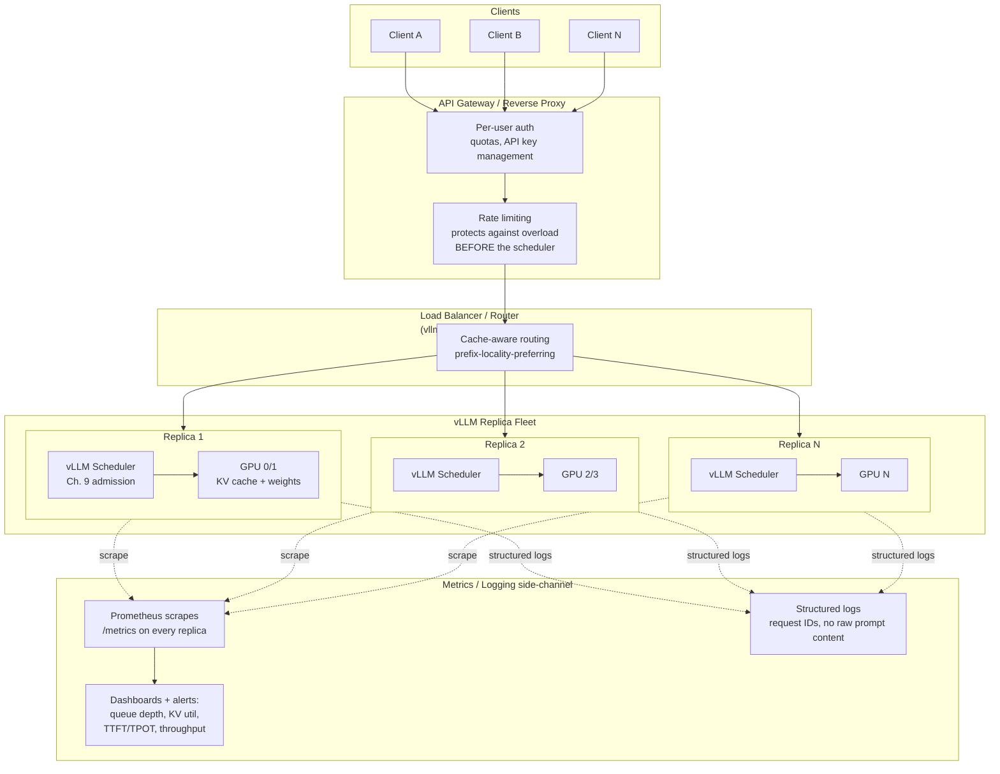

# Production Serving

## Learning Objectives

By the end of this chapter, you will be able to:

- Explain why vLLM's `--api-key` (Chapter 4) is the wrong tool for per-user auth, quotas, or multi-tenant key
  management on its own, and design where an API gateway/reverse proxy needs to sit in front of vLLM to close
  that gap
- Distinguish **overload protection** (a gateway's job — rejecting or shaping traffic before it reaches vLLM)
  from **efficient admission of already-accepted work** (the scheduler's job, Chapter 9) — and explain why
  layering rate limiting in front of vLLM, rather than expecting vLLM to do it, is the correct architecture
- Set client-side timeouts appropriately for LLM generation latencies, and explain precisely why naive immediate
  retries are dangerous for a GPU-backed, stateful-per-request service in a way they usually aren't for a
  stateless REST API
- Explain why naive round-robin load balancing is a poor fit for a fleet of vLLM replicas, and why prefix-cache
  locality (Chapter 11) makes cache-aware routing — the problem `vllm-project/production-stack`'s router targets
  — the better default
- Distinguish Kubernetes liveness from readiness semantics as applied to vLLM's `/health` endpoint, and configure
  probes that reflect vLLM's actual startup and failure behavior instead of a generic web-service template
- Identify which Prometheus metrics (`vllm:`-prefixed, Chapter 17's vocabulary) actually matter for production
  dashboards and alerting, and why raw GPU utilization alone is an insufficient signal
- Explain why naive CPU-utilization-based autoscaling fails for GPU-backed LLM services, and what signals
  (queue depth, KV cache utilization) work better
- Describe the drain-then-replace pattern needed for rolling deployments of a service with in-flight generations
  and warm prefix caches, and why a naive rolling update strategy silently drops or corrupts requests
- State, with appropriate hedging, what disaggregated prefill/decode serving is and why it exists, without
  needing to implement it end-to-end

---

## Prerequisites for This Chapter

This chapter is the **capstone of the internals-plus-ops arc**. It does not introduce new vLLM internals — it
takes everything mechanical you've already learned and asks "how do I run this reliably, for real users, without
babysitting it." Specifically, it assumes:

- **Chapter 4 (The OpenAI-Compatible Server)** — you know the confirmed endpoint surface (`/v1/chat/completions`,
  `/v1/completions`, `/v1/embeddings`, `/v1/models`, `/health`, `/metrics`), that `--api-key` gates only the
  `/v1/*` routes, and that `/health`/`/metrics` are deliberately left unauthenticated. This chapter builds the
  production posture on top of that surface rather than re-deriving it.
- **Chapter 9 (The vLLM Scheduler)** — you know that vLLM's own scheduler already does admission control
  *inside* the engine: `max_num_seqs`, `max_num_batched_tokens`, and preemption already manage what happens once
  a request has reached the server. This chapter is careful to never re-explain that — it's about what happens
  **before** a request reaches the scheduler at all.
- **Chapter 10 (Memory Management)** — you know why KV cache headroom, not raw parameter count, is usually the
  binding constraint on concurrency, and why frequent preemption is a capacity signal. This matters directly for
  autoscaling signals in this chapter.
- **Chapter 15 (Parallelism)** — you know the difference between scaling *up* a single replica (tensor/pipeline
  parallelism across GPUs) and scaling *out* to multiple replicas. This chapter is almost entirely about the
  scale-out axis: once you've sized a single replica's parallelism, production serving is about running a *fleet*
  of those replicas well.
- **Chapter 19 (Docker)** — you know `vllm/vllm-openai`, GPU passthrough (`--gpus all`), volumes for model
  weights, and container-level health checks. This chapter is the Kubernetes-and-fleet layer built on top of that
  single-container foundation.

If any of those feel shaky, this chapter will still make sense at a conceptual level, but the worked examples
assume you can read a `vllm serve` invocation, a Prometheus metric name, and a Helm values file without needing
each one re-explained from zero.

---

## 1. Why "Production Serving" Is Its Own Chapter

Everything through Chapter 19 answered "how do I run one vLLM instance well." Production serving asks a
different question: "how do I run a *fleet* of vLLM instances, in front of real, unpredictable traffic, such that
individual failures, bursts, and deployments don't turn into outages." The core tension this chapter keeps
returning to is that **vLLM is not a stateless web service**, even though it exposes an HTTP API that looks like
one:

- A request in flight is holding **GPU KV cache blocks** (Chapter 6/9) for its entire lifetime — killing the
  connection client-side doesn't necessarily free that memory server-side immediately.
- Requests have **wildly different costs**: a 50-token completion and a 4,000-token document summary hit the same
  endpoint but consume utterly different amounts of scheduler budget and GPU time (Chapter 9, Section 5).
- Replicas develop **warm state** over time — populated prefix caches (Chapter 11) — that naive routing throws
  away.
- **Startup is expensive.** Loading multi-GB weights onto a GPU, warming CUDA graphs, and initializing the KV
  cache pool takes real wall-clock time — nothing like a typical container's sub-second cold start.

Every section below is really the same idea applied to a different layer of the stack: **treat vLLM as a
stateful, GPU-bound, unevenly-loaded service, not a generic REST backend**, and every off-the-shelf production
pattern (rate limiting, load balancing, autoscaling, rolling deploys) needs to be adapted with that in mind rather
than applied verbatim from a general ops playbook.



The diagram is the mental model for the entire chapter: authentication and rate limiting happen at the **edge**,
before requests ever reach a scheduler; routing happens at a **cache-aware load balancer**, not a naive
round-robin; each replica keeps doing exactly what Chapter 9 already taught you it does; and observability is a
side-channel that watches all of it without touching the request path.

---

## 2. Authentication in a Production Context

Chapter 4 covered `--api-key` mechanically: it's a single shared secret that gates every `/v1/*` route, and
`/health`/`/metrics` are deliberately left ungated. Revisit that fact with a production lens and its limitation
becomes obvious:

**`--api-key` is coarse-grained by design.** It answers exactly one question — "does this caller know *a* valid
key" — and nothing more:

- There is no per-key notion of *who* the caller is beyond "someone with the key."
- There is no per-key usage tracking, quota, or spend limit.
- Rotating or revoking access for one tenant means rotating the key for **every** tenant sharing that server,
  since it's one shared secret, not a set of independently-revocable credentials.
- There is no built-in concept of a "key with a 100 req/min limit" vs. "key with a 10,000 req/min limit."

None of this is a defect in vLLM — `--api-key` is doing exactly the job it was designed for (keep a serving
endpoint from being wide open on a network), not the job of a multi-tenant API product. That job belongs to a
layer in front of vLLM.

### 2.1 The API gateway as the multi-tenant auth boundary

In production, the standard pattern is: put an **API gateway or reverse proxy** (examples: Kong, Envoy, a cloud
provider's API Gateway, or even a purpose-built FastAPI/NGINX layer) in front of vLLM, and let it own:

- **Per-user or per-tenant API key issuance and revocation** — independent of vLLM's own single `--api-key`.
- **Usage tracking and metering** — who called what, how many tokens, when — for billing or internal chargeback.
- **Per-tenant quotas** — distinct from the rate limiting discussed in Section 3, though the two are closely
  related in implementation.

The gateway then authenticates to vLLM itself using **one** `--api-key` (or none, if the network path between
gateway and vLLM is already trusted/private, e.g. same-cluster service-to-service traffic) — vLLM's auth becomes
an internal, single-tenant concern, and all the multi-tenant complexity lives in the gateway where it belongs.
This is the same "auth at the edge, trust internally" pattern used for most backend services behind a gateway; it
isn't vLLM-specific, but it's worth stating plainly because it's easy to mistakenly reach for `--api-key` as if it
could scale to a multi-tenant SaaS product's auth needs on its own — it can't, and it was never meant to.

> **Note:** this course does not re-teach what an API gateway is or how OAuth/API-key issuance systems work in
> general — that's assumed production-ops literacy. The point specific to vLLM is narrower: know precisely where
> the line sits between "what `--api-key` gives you" (one shared secret, coarse) and "what a real multi-tenant
> deployment needs" (per-user identity, quotas, revocation) — and that the second thing has to be built or bought
> separately, not configured into vLLM itself.

---

## 3. Rate Limiting: Protecting the Service vs. Scheduling Admitted Work

This is the section most likely to get architecturally confused, so it's worth being precise about the boundary.

**vLLM's scheduler (Chapter 9) already does admission control** — but only for requests that have *already
reached the server*. `max_num_seqs` and `max_num_batched_tokens` decide how many already-arrived requests get
processed this step, and how much of the token budget each gets. That's real, important, and already covered —
this chapter is not re-explaining it.

**Rate limiting, in the production-ops sense, is a different job**: deciding whether a request should even be
**allowed to arrive** at the server in the first place, based on caller identity, traffic shape, or overall system
load — independent of whether the scheduler technically has room for it right now.

Why this has to live in front of vLLM rather than being expected from vLLM itself:

- **vLLM has no concept of "this caller" beyond the shared `--api-key`.** It cannot apply a "100 requests/minute
  for tenant X" policy on its own — there's no per-tenant identity for it to key a limit on (Section 2).
- **By the time a request reaches the scheduler, it has already consumed network and connection-handling
  resources**, and — critically — a request that reaches the scheduler is a request the scheduler *will* try to
  admit into a step's token budget, competing with everyone already running. Rejecting overload traffic before it
  reaches the scheduler is strictly cheaper than admitting it and letting the scheduler's own preemption
  machinery (Chapter 9, Section 6) sort it out under pressure — preemption exists to recover from a memory
  crunch, it is not a substitute for not creating that crunch in the first place.
- **A burst that the scheduler *can* technically admit can still be undesirable from a fairness or SLA point of
  view.** The scheduler optimizes for "make good use of the GPU across whatever's currently admitted"; it has no
  concept of "tenant X promised only 5 concurrent requests in their contract" — that's a gateway-level policy
  decision, not an engine-level one.

So the practical architecture: rate limiting (token-bucket, sliding-window, concurrency caps — whatever your
gateway supports; this course assumes you already know these algorithms generically) is configured **at the
gateway or reverse proxy**, in front of the load balancer/router (Section 5), keyed on the gateway's own notion of
caller identity from Section 2. vLLM's scheduler then does the job it was always going to do — decide how to run
the traffic that made it past the gate — without needing to know anything about tenants, quotas, or SLAs at all.

Restated as the one-line distinction to keep in your head: **the gateway protects the service from too much
traffic; the scheduler makes efficient use of the traffic it's given.** These are not competing implementations of
the same feature — they operate at different points in the request's life and solve different problems.

---

## 4. Timeouts and Retries: Why LLM Serving Breaks Naive REST Assumptions

### 4.1 Timeouts need to be much longer than a typical REST API's

A typical REST API's client timeout is tuned around the assumption that "if this hasn't come back in a second or
two, something is wrong." LLM generation breaks that assumption structurally: a legitimately healthy, correctly
functioning request can take **tens of seconds** to complete, because:

- Time-to-first-token (TTFT, Chapter 1/17) depends on prefill cost, which scales with prompt length — a
  multi-thousand-token RAG prompt can legitimately take real time just to produce its *first* token.
- Total generation time scales with `max_tokens` and the per-token decode latency (TPOT, Chapter 1/17) — a
  1,000-token response at even a healthy TPOT is several seconds of streaming, and can be much longer under load
  or for larger models.
- None of this is a failure signal. It's the expected shape of the workload.

The practical consequence: **client-side timeouts for LLM completions need to be set with generation cost in
mind, not copied from a typical microservice's 5–10 second default.** A common pattern is a much longer overall
request timeout (potentially minutes, depending on `max_tokens` and expected load) combined with a much shorter
**per-chunk** timeout when using streaming — if tokens are actively arriving via SSE, the request is healthy even
if it's been "open" for a long time; it's the absence of *any* new data for an extended stretch that should be
treated as a failure signal, not elapsed wall-clock time alone.

### 4.2 Why naive automatic retries are actively dangerous here

In a typical stateless REST service, "timeout, then retry" is usually safe: the failed request likely did little
or no work server-side, and a retry is cheap for both client and server. **This assumption does not hold for
vLLM**, for a reason specific to how GPU-backed generation works:

> A request that has timed out **from the client's point of view** may still be **actively running on the
> server** — occupying a scheduler slot, holding KV cache blocks, and consuming GPU decode cycles — right up until
> the server-side connection is torn down (or the request completes/is cancelled). The client giving up does not
> automatically mean the server has given up.

This creates a genuinely dangerous failure mode if retries are naive: a client that times out and *immediately*
fires an identical request compounds load in exactly the moment the server is already struggling — the original
request may still be consuming resources, and now a duplicate request is competing for scheduler admission and KV
cache blocks too. Under real overload, a fleet of clients doing this simultaneously can turn a slow patch into a
cascading overload, because every timeout produces a duplicate request rather than backing off.

**Recommended pattern instead of naive immediate retry:**

- **Retry with exponential backoff**, not immediately — give the server a chance for the original request (and
  any transient load spike) to actually clear before adding more load.
- **Bound the number of retries.** An unbounded retry loop against a genuinely overloaded fleet just adds fuel.
- **Be idempotency-aware.** If your application can tag requests with a client-generated request ID and your
  gateway/application layer can deduplicate on it (recognizing "this is a retry of a request I've already seen,"
  not a new one), you avoid double-billing a tenant or double-consuming GPU capacity for the same logical request.
  vLLM itself does not provide request deduplication — this has to be built at the gateway/application layer if
  you need it.
- **Distinguish retryable from non-retryable failures.** A `429`-style rejection from a rate limiter (Section 3)
  or a `5xx` from genuine overload is a signal to back off and retry later; a `400` (bad request — e.g. a prompt
  exceeding `max_model_len`) will fail identically every time and should never be retried as-is.
- **Prefer streaming plus a "stop if truly stalled" watchdog over a monolithic non-streaming timeout-and-retry.**
  If you're already receiving tokens, the generation is alive; only treat the request as dead if the stream stalls
  for longer than a reasonable inter-token gap, not based on total elapsed time.

The throughline: LLM serving's failure recovery has to account for the fact that **a "failed" request from the
client's perspective may not be a "finished" request from the server's perspective** — retries need to be
conservative, backed-off, and ideally deduplicated, not immediate and naive.

---

## 5. Load Balancing: Why Naive Round-Robin Is the Wrong Default

Once you're running more than one vLLM replica (Chapter 15's scale-out axis), something has to decide which
replica handles each incoming request. The default instinct — round-robin, or its close cousin least-connections,
borrowed from load-balancing generic stateless web servers — is a **poor fit** for a fleet of vLLM replicas, for
two compounding reasons.

### 5.1 Requests have wildly uneven cost

Round-robin assumes each request costs roughly the same amount of work, so spreading them evenly spreads load
evenly. LLM requests violate that assumption badly (this is the same asymmetry Chapter 9, Section 5 covered for
prefill vs. decode, now showing up at the fleet level instead of the single-scheduler level): a short chat turn
and a 6,000-token document-summarization request hit the same endpoint but cost the receiving replica utterly
different amounts of scheduler budget, KV cache, and GPU time. Pure round-robin can easily route several expensive
requests to the same replica back-to-back purely by chance, leaving it saturated while a sibling replica sits
comparatively idle — "evenly distributed request *count*" is not the same thing as "evenly distributed *load*."

### 5.2 Prefix-caching locality

This is the more interesting and more vLLM-specific reason. Chapter 11 covered prefix caching: when a new
request's prompt shares a prefix with a previously-processed prompt (a repeated system prompt, a shared
few-shot preamble, a multi-turn conversation's earlier turns), vLLM can reuse the already-computed KV cache blocks
for that shared prefix instead of recomputing them — a substantial win for TTFT and GPU cost.

**That cached prefix lives on one specific replica's GPU memory.** If a load balancer routes the next request
sharing that prefix to a *different* replica purely because round-robin's counter said "it's your turn," the
prefix cache hit is lost — the new replica has never seen that prefix and has to compute it from scratch, even
though a sibling replica sitting right next to it already had the answer cached. Naive round-robin actively
**works against** one of vLLM's most valuable optimizations by treating replicas as interchangeable, stateless
targets when they are, in this specific respect, not interchangeable at all — they accumulate distinct warm state
over time.

The ideal routing behavior: a request that shares a prefix with previously-routed traffic should ideally route to
the **same replica** that handled that prefix before, to get the cache hit — while still balancing genuinely new
traffic across the fleet reasonably. This is a fundamentally different routing problem than generic HTTP load
balancing; it requires the router to have *some* notion of prompt content or session affinity, not just connection
counts.

### 5.3 The recommended path: `vllm-project/production-stack`'s router

Rather than hand-rolling this — building your own prefix-aware routing logic on top of a generic load balancer is
a non-trivial distributed-systems problem — the vLLM project's own **`production-stack`** repository (introduced
in Chapter 19's Docker/Kubernetes context) ships a router specifically designed to address this. Per the project's
own positioning, it layers routing and autoscaling features on top of the base OpenAI-compatible surface, with
cache-aware routing as one of its stated goals — routing requests toward replicas likely to already hold a
relevant prefix rather than treating every replica as an interchangeable round-robin target.

**Recommendation for this course:** treat naive round-robin (or a generic cloud load balancer with no
LLM-specific awareness) as a reasonable *starting point* for a single-replica or early-stage deployment, but plan
to move to `production-stack`'s router — or an equivalent cache-aware routing layer if evaluating alternatives —
once you're running enough replicas that prefix-cache locality across the fleet starts to matter for real
workloads (heavy multi-turn conversation traffic, shared system prompts, RAG pipelines with repeated context
templates). Don't invest engineering time hand-rolling prefix-aware routing logic when a maintained project
already targets exactly this problem.

---

## 6. Health and Readiness Checks for Kubernetes

Chapter 4 introduced `/health` as vLLM's unauthenticated liveness endpoint. In a Kubernetes context, this needs to
be mapped onto Kubernetes' two-probe model precisely, because the two probes answer genuinely different questions
and mixing them up causes real operational pain:

- **Liveness probe** — "is this process alive enough that restarting it might help?" A liveness probe failing
  causes Kubernetes to **kill and restart the pod**. This should only fail for genuine, unrecoverable hangs or
  crashes — not for "temporarily busy."
- **Readiness probe** — "should this pod currently receive traffic?" A readiness probe failing takes the pod
  **out of service rotation** (no restart) until it passes again. This is the right place to express "the process
  is up but not yet able to usefully serve requests."

For vLLM specifically, this distinction matters most at **startup**: loading multi-GB model weights onto a GPU,
building the KV cache pool, and (unless `--enforce-eager` is set — Chapter 10) capturing CUDA graphs all take real
wall-clock time, during which the process is alive (it will eventually respond to `/health`) but **not yet ready
to usefully handle a generation request**. If your readiness probe treats "process responds to `/health`" as
"ready for traffic" without accounting for this warm-up window, Kubernetes will start routing production traffic
to a replica before it's actually finished initializing — a real, avoidable failure mode covered again in
Common Mistakes below.

> **Verify against current docs.** Confirm the exact current semantics of `/health` — whether it reflects only
> "process is up and responding" or something closer to "engine has finished initialization" — against the vLLM
> version you're deploying before writing probe configuration; this can plausibly change between releases, and
> the safest posture is to explicitly test what `/health` returns during your own replica's startup window rather
> than assuming.

### 6.1 Worked example: readiness/liveness probe configuration

```yaml
# Illustrative Kubernetes pod spec snippet — adapt paths/ports/timings to your deployment.
# Confirm exact /health behavior for your installed vLLM version before trusting these numbers as-is.
containers:
  - name: vllm-server
    image: vllm/vllm-openai:latest   # pin an explicit tag in production, not `latest`
    ports:
      - containerPort: 8000
    startupProbe:
      # Generous window for cold start: weight loading + KV cache init + (optional) CUDA graph capture.
      # Kubernetes won't run liveness/readiness checks until this probe first succeeds.
      httpGet:
        path: /health
        port: 8000
      failureThreshold: 60          # allow up to ~10 minutes of startup before giving up
      periodSeconds: 10
    livenessProbe:
      # Only fail this for genuine, unrecoverable hangs — a restart is the remedy, so be conservative.
      httpGet:
        path: /health
        port: 8000
      periodSeconds: 15
      failureThreshold: 3
      timeoutSeconds: 5
    readinessProbe:
      # Governs traffic admission — take the pod out of rotation on repeated failure without restarting it.
      httpGet:
        path: /health
        port: 8000
      periodSeconds: 5
      failureThreshold: 3
      timeoutSeconds: 5
```

The `startupProbe` is the piece most often missing in a naive first attempt: without it, an aggressive
`livenessProbe` can conclude the replica is "stuck" during a long, legitimate model-load window and restart it
before it ever finishes loading — potentially looping forever and never becoming ready.

---

## 7. Metrics: What to Actually Watch in Production

Chapter 4 confirmed `/metrics` as vLLM's Prometheus-format endpoint, with all metric names prefixed `vllm:`, and
left unauthenticated for the same reason `/health` is — scrapers shouldn't need to carry the API key. Chapter 17
built the metric vocabulary (TTFT, TPOT/ITL, throughput, queue depth, KV cache utilization). This section is about
which of those matter most once you're running a production fleet and need dashboards/alerts, not just ad-hoc
benchmarking.

**Signals worth a dashboard panel and, for several of them, an alert:**

- **Queue depth / pending requests** — the clearest early-warning signal that a replica (or the fleet) is falling
  behind demand. Rising queue depth with flat or falling completion throughput is the leading indicator you want
  before users start reporting slow responses.
- **KV cache utilization** — how close a replica is to its KV cache ceiling (Chapter 9/10). Sustained high
  utilization correlates directly with preemption risk (Chapter 9, Section 6) — a replica running hot on KV cache
  is a replica about to start recomputing prefills for evicted sequences, which is a throughput cliff, not a
  gentle degradation.
- **TTFT and TPOT/ITL distributions** (not just averages — track p50/p95/p99) — averages hide the tail, and the
  tail is what users actually notice. A p50 that looks healthy alongside a badly degraded p99 usually means a
  subset of requests (often the largest prompts, or requests landing during a burst) are having a much worse
  experience than the average suggests.
- **Request throughput / completion rate** — the fleet-level counterpart to what Chapter 17's benchmarking runs
  measure in isolation; watching it over time in production is how you notice a slow regression a one-off
  benchmark would never catch.
- **Preemption/recompute events** (Chapter 9, Section 6) — a direct, causal signal for "KV cache headroom is too
  tight for current traffic," distinct from and more actionable than raw GPU utilization alone.

**Why raw GPU utilization (e.g. from `nvidia-smi`/DCGM) is not sufficient on its own:** a replica can show healthy
GPU compute utilization while still being scheduler-bound or KV-cache-bound (Chapter 9's Common Mistakes made
exactly this point) — GPU utilization tells you the GPU is busy, not that it's busy doing useful, timely work for
the traffic you actually care about. Treat GPU utilization as one input among several, not the headline number.

### 7.1 Worked example: Prometheus scrape configuration

```yaml
# prometheus.yml snippet — scraping /metrics from every vLLM replica.
# In Kubernetes, prefer a ServiceMonitor (if using the Prometheus Operator) targeting the vLLM
# Service's port; the static config below is the plain-Prometheus equivalent for illustration.
scrape_configs:
  - job_name: 'vllm-replicas'
    metrics_path: /metrics
    scrape_interval: 15s
    static_configs:
      - targets:
          - 'vllm-replica-0:8000'
          - 'vllm-replica-1:8000'
          - 'vllm-replica-2:8000'
        labels:
          service: 'vllm-production'
```

Because `/metrics` is unauthenticated by design (Section 6/Chapter 4), no bearer token or `--api-key` needs to be
threaded into the scrape config — but that also means `/metrics` should not be exposed on a network path reachable
from outside your trust boundary, since it can reveal operational detail (request rates, model name via the
`model_name` label tied to `--served-model-name`, queue depth) you may not want publicly visible. Restrict it at
the network layer (cluster-internal only, or firewalled), the same way you'd restrict any unauthenticated
operational endpoint.

---

## 8. Logging: Structured, Traceable, Privacy-Conscious

Production LLM serving logging has to satisfy two goals that are in mild tension: **traceability** (being able to
follow one request across the gateway → router → vLLM replica hop chain when debugging) and **privacy** (not
casually persisting the full content of every prompt and completion, which may contain sensitive user data).

**What to log by default:**

- **A request ID generated at the edge** (gateway or client) and propagated through every hop — router, vLLM
  replica — so a single request's path through the whole architecture in Section 1's diagram can be reconstructed
  from logs after the fact. This is standard distributed-tracing practice, applied here specifically to the
  gateway→router→vLLM chain this chapter has been building.
- **Structured fields**: request ID, timestamp, replica identity, latency breakdown (queueing time, TTFT,
  total duration), token counts (prompt tokens, completion tokens), HTTP status, and — if you've built the
  gateway-level auth from Section 2 — the authenticated tenant/user identity.
- **Not, by default: full prompt or completion text.** Prompts and completions can contain personal data,
  proprietary business content, or otherwise sensitive material; logging them by default turns your log
  aggregation system into an uncontrolled copy of exactly the data your access controls were presumably built to
  protect.

**When full content logging is genuinely needed** (debugging a specific quality issue, a compliance requirement,
an abuse investigation), treat it as an **explicit, access-controlled, ideally time-bounded** exception — a
separate, more tightly access-controlled log stream or sampling-based capture, not the default behavior for every
request. This is the same "log metadata by default, content only deliberately and access-controlled" pattern used
broadly in production services handling any kind of sensitive payload; the vLLM-specific point is just that
prompts/completions are exactly this kind of payload, and it's easy to forget that when you're focused on
debugging latency and reach for verbose logging without thinking about what "verbose" actually captures.

---

## 9. Distributed Serving and Kubernetes

### 9.1 `vllm-project/production-stack`: the confirmed, maintained deployment path

For running vLLM on Kubernetes, the maintained path is the **`vllm-project/production-stack`** Helm repository
(also referenced in Chapter 19). It packages the base OpenAI-compatible server plus the router (Section 5) and
autoscaling features (Section 10) into a coherent Helm-installable stack, rather than requiring you to hand-build
router/autoscaling logic around the bare `vllm/vllm-openai` image yourself.

```bash
# Add the production-stack Helm repo and install with a starter values file.
helm repo add vllm https://vllm-project.github.io/production-stack
helm install vllm vllm/vllm-stack -f values-01-minimal-example.yaml
```

The `-f values-01-minimal-example.yaml` argument points at a values file defining, at minimum, which model to
serve and how many replicas/GPUs to provision — check the `production-stack` repository's own example values
files for the current shape of this configuration, since Helm chart values schemas evolve independently of vLLM's
own release cadence.

> **A simpler alternative exists.** For teams that don't need the router or autoscaling features — e.g. a single
> internal deployment behind an existing load balancer — the vLLM repo also ships a simpler, bare Helm chart under
> `examples/online_serving/chart-helm/` in the main `vllm-project/vllm` repository, providing a basic
> StatefulSet + PodDisruptionBudget deployment without the full production-stack feature set. Reach for
> `production-stack` when you need cache-aware routing or autoscaling; reach for the bare chart when you just need
> "run this container reliably on Kubernetes" and already have those concerns handled elsewhere.

### 9.2 GPU scheduling in Kubernetes

Beyond the Helm chart itself, vLLM pods need to land on GPU-capable nodes and have the scheduler actually reserve
GPU capacity for them — this is standard Kubernetes GPU-workload practice (via the NVIDIA device plugin), applied
here to vLLM specifically:

- **Resource requests/limits for `nvidia.com/gpu`** — declare exactly how many GPUs a replica needs, so the
  Kubernetes scheduler only places the pod on a node with that much free GPU capacity:

  ```yaml
  resources:
    limits:
      nvidia.com/gpu: 1     # match this to --tensor-parallel-size × --pipeline-parallel-size for the replica
  ```

  For a replica configured with `--tensor-parallel-size 2` (Chapter 15), the pod needs `nvidia.com/gpu: 2` — the
  GPU resource request has to match the parallelism configuration, not be picked independently of it.

- **Node selectors and taints** — most clusters mix GPU and non-GPU nodes. Taint GPU nodes (e.g.
  `nvidia.com/gpu=present:NoSchedule`) so only pods that explicitly tolerate the taint land there, and give vLLM
  pods a matching `nodeSelector`/toleration plus a `tolerations` entry — this keeps non-GPU workloads from
  accidentally scheduling onto expensive GPU nodes and keeps vLLM pods from accidentally landing on a node with no
  GPU at all.

  ```yaml
  nodeSelector:
    gpu-type: "a100"          # match your cluster's actual node labels
  tolerations:
    - key: "nvidia.com/gpu"
      operator: "Exists"
      effect: "NoSchedule"
  ```

These are general Kubernetes GPU-scheduling mechanics (not vLLM-specific), included here because production
vLLM deployments run into them immediately — a `production-stack` Helm install still needs correctly labeled/
tainted GPU nodes and correctly sized `nvidia.com/gpu` requests underneath it to actually land pods where GPUs
exist.

---

## 10. Autoscaling: Why GPU-Backed LLM Services Need Different Signals

Autoscaling a typical stateless web service usually keys off CPU (or request-rate) utilization: scale out when
CPU crosses a threshold, scale back in when it falls. **This does not transfer well to vLLM**, for two related
reasons.

### 10.1 Cold start is expensive

A typical web service's cold start is milliseconds to a few seconds — start the process, maybe warm a connection
pool. A new vLLM replica's cold start includes:

- Loading multi-GB (often tens-of-GB) model weights onto the GPU.
- Initializing the KV cache pool at the configured `--gpu-memory-utilization` (Chapter 10).
- Optionally capturing CUDA graphs (Chapter 9/10), unless `--enforce-eager` trades that startup cost away for
  worse steady-state throughput.

This is **minutes**, not seconds, in the worst case for large models. An autoscaler that reacts to a burst by
spinning up a new replica and expecting it to help within the next 30–60 seconds will be disappointed — by the
time the new replica is actually ready to serve traffic (Section 6's readiness distinction matters enormously
here), the burst that triggered scale-out may already be over, or may have already caused the kind of overload
degraded latency was supposed to prevent.

### 10.2 CPU utilization is close to meaningless here

vLLM's CPU usage largely reflects request handling/scheduling overhead, not the actual bottleneck — the GPU is
where all the real generation work happens. A replica can be **completely saturated on GPU/KV-cache capacity**
while showing low, unremarkable CPU utilization, meaning a CPU-threshold-based autoscaler would never trigger
scale-out for the workload pattern that actually needs it, and might trigger scale-out based on incidental CPU
noise that has nothing to do with serving capacity.

### 10.3 Better signals: queue depth and KV cache utilization

The metrics Section 7 already told you to watch for dashboards are exactly the right autoscaling signals too:

- **Queue depth / pending request count** rising and staying elevated is a direct signal that current replica
  capacity isn't keeping up with arrival rate — scale out.
- **KV cache utilization** approaching its ceiling fleet-wide is a direct signal that you're capacity-bound on the
  resource that actually matters (Chapter 9/10), independent of what CPU or even raw GPU compute utilization say.

Because both signals lag reality by the time a new replica is actually warm and ready (Section 10.1), production
autoscaling for GPU-backed LLM services generally needs **more conservative, earlier-triggering thresholds and
longer stabilization windows** than a typical web service's autoscaler — you're not reacting to a load spike in
real time so much as forecasting that a sustained trend justifies the multi-minute cost of bringing up new
capacity. Some deployments choose to keep a small amount of **pre-warmed standby capacity** rather than relying
purely on reactive autoscaling, specifically to blunt the cold-start-latency problem for bursty traffic — an
option worth knowing about even though it trades idle GPU cost for responsiveness.

> **Unconfirmed — verify against current docs.** The exact autoscaling mechanism and configuration surface
> `production-stack` exposes (e.g. whether it integrates with Kubernetes HPA using custom metrics, or ships its
> own autoscaling controller) should be checked against the current `vllm-project/production-stack` documentation
> before you commit to a specific configuration — this is exactly the kind of fast-moving surface Section 0 of
> the course's fact sheet warns against hardcoding.

---

## 11. Rolling Deployments: Draining Without Dropping Requests

Updating a fleet of vLLM replicas (new model version, new vLLM version, new configuration) runs into the same
"this isn't really stateless" problem from Section 1: a naive rolling update that just kills old pods and starts
new ones as soon as they pass a basic readiness check will, at some point, kill a pod that is **mid-generation**
for one or more in-flight requests — those requests simply fail, mid-stream, from the client's point of view.

**The pattern that avoids this is drain-then-replace, not kill-then-replace:**

1. **Stop routing new requests to the replica being updated.** At the router/load-balancer layer (Section 5),
   mark the replica as not-accepting-new-work — this is conceptually a readiness-probe-driven removal from
   rotation (Section 6), or an explicit "drain" signal if your router/orchestration supports one.
2. **Let in-flight requests on that replica finish naturally.** Because requests are relatively short-lived
   (seconds to tens of seconds, per Section 4.1) compared to typical infrastructure timescales, a bounded drain
   window (long enough to cover your p99 request duration with margin) is usually sufficient — this is quite
   different from draining a long-lived stateful connection (e.g. a websocket session) that might run for hours.
3. **Only then terminate the old replica**, once it has no in-flight requests remaining or the drain window has
   elapsed.
4. **Bring up the new replica following the same startup/readiness discipline from Section 6** — it shouldn't
   receive traffic until it has actually finished loading weights and initializing, not merely once its process
   has started.

Kubernetes' native `RollingUpdate` strategy combined with a `preStop` hook (to trigger draining before the
container receives `SIGTERM`) and a `terminationGracePeriodSeconds` long enough to cover realistic in-flight
request durations gets you most of the way there for a bare Deployment; a `PodDisruptionBudget` (mentioned
alongside the bare Helm chart in Section 9.1) further protects against too many replicas draining simultaneously
during a cluster-level disruption (e.g. node maintenance) and briefly starving the fleet of capacity.

**Warm prefix caches are lost on replacement, and that's an accepted cost, not a bug to fix.** A freshly started
replacement replica starts with a cold prefix cache regardless of how carefully you drain the old one — there is
no mechanism to transfer that GPU-resident cached state to a new pod. The practical implication: rolling updates
have a real, if usually modest, throughput/latency cost immediately afterward while the new replica's prefix cache
re-warms from live traffic — budget for a brief post-deploy period of slightly elevated TTFT rather than being
alarmed by it, and avoid rolling the entire fleet simultaneously (which would zero out prefix-cache locality
fleet-wide at once) in favor of a gradual, one-or-few-at-a-time replacement.

---

## 12. Disaggregated Prefill/Decode Serving — Know This Exists

Chapter 15 covered scaling a single replica across GPUs (tensor/pipeline parallelism) and this chapter has covered
scaling *out* to multiple identical replicas. There's a third pattern worth knowing about for very large
deployments, even though it's not something this course walks through step by step: **disaggregated prefill/decode
serving**.

The idea: prefill (compute-bound, processes an entire prompt at once) and decode (memory-bandwidth-bound,
processes one token per sequence per step) have genuinely different resource profiles (Chapter 9, Section 5
already made this point at the single-scheduler level). At large enough scale, some deployments separate them
into **distinct worker pools** — dedicated "prefill" workers and dedicated "decode" workers — connected by a
**KV-transfer layer** that moves the computed KV cache from a prefill worker to a decode worker once the prompt's
prefill is done, rather than having every replica do both jobs and potentially contend with itself. Named
KV-connector backends referenced in current vLLM documentation for this include **NIXL**, **Mooncake**, and
**LMCache**.

> **Present this as an advanced, evolving pattern, not a default recommendation.** Disaggregated prefill/decode
> serving is a real, maturing production pattern for very large deployments where prefill/decode contention is
> a measured, significant problem — but it is still labeled experimental in parts of the current vLLM
> documentation, and it meaningfully increases operational complexity (a new class of worker, a new
> cross-worker transfer layer, new failure modes around that transfer layer). For the overwhelming majority of
> deployments — including most of what this course's audience will build — the router/replica-fleet pattern in
> Sections 5–10 of this chapter is the right level of complexity to reach for. Know disaggregated PD serving
> exists and roughly why (prefill/decode resource-profile mismatch, same root cause as Chapter 9 Section 5's
> single-scheduler fairness tension, just addressed by separating worker pools entirely instead of time-sharing
> one scheduler), so you recognize it in a design discussion or a job interview — but treat "should we adopt
> this" as a question to revisit against current docs and your own measured bottlenecks, not something to
> implement by default.

---

## Real-World Scenario

A team serves an internal coding-assistant model behind vLLM for their engineering org. Early on, a single
replica behind a plain cloud load balancer (round-robin, no `production-stack`) was fine — traffic was low, and
nobody noticed the router's routing decisions. As adoption grew to several hundred engineers making frequent
multi-turn requests (each conversation resending the growing conversation history as a prompt prefix), they scaled
out to four replicas behind the same round-robin load balancer, and TTFT got noticeably *worse* on average despite
having 4x the GPU capacity.

Applying this chapter's model: round-robin was distributing each new request in a multi-turn conversation to a
random replica, independent of which replica had handled that conversation's *previous* turns. Every follow-up
message in a long conversation was, from the fleet's point of view, indistinguishable from a brand-new
conversation — the shared, growing prefix (system prompt + prior turns) almost never landed on a replica that
already had it cached (Section 5.2), so nearly every turn paid full prefill cost for the entire accumulated
conversation history, on whichever replica happened to draw it. Adding replicas without cache-aware routing had
made the *aggregate* prefix-cache hit rate worse, not better, because it multiplied the number of places a given
conversation's history could land, each miss just as expensive as before.

The fix: migrate the fleet to `vllm-project/production-stack`'s router (Section 5.3) so that repeat requests from
the same conversation preferentially land on the replica that already holds that conversation's cached prefix.
Alongside that, they tightened their readiness probes (Section 6) after noticing that one of the four replicas had
occasionally received traffic before it finished CUDA graph capture during a redeploy, causing a burst of
unusually slow first requests right after each rolling update — an unrelated but compounding issue this chapter's
Section 11 and Section 6 both speak to directly.

---

## Best Practices

- **Put multi-tenant auth, quotas, and per-user rate limiting at a gateway in front of vLLM** — don't ask
  `--api-key` to do a job it was never designed for (Section 2).
- **Rate-limit before the scheduler, not instead of it.** The gateway protects the service from too much traffic;
  the scheduler (already covered in Chapter 9) makes efficient use of whatever traffic gets through. Keep these
  two responsibilities separate in your architecture (Section 3).
- **Set client timeouts around realistic generation latency, and treat "no new streamed tokens for N seconds" as
  the failure signal, not raw elapsed time** (Section 4.1).
- **Retry with backoff, bounded attempts, and idempotency-awareness — never immediate, unbounded retries** (Section
  4.2). A timed-out request may still be consuming GPU/KV-cache resources server-side.
- **Adopt `vllm-project/production-stack`'s router once prefix-cache locality matters for your traffic** — don't
  hand-roll cache-aware routing, and don't default to plain round-robin once you're running a real multi-replica
  fleet with meaningful shared-prefix traffic (Section 5).
- **Use a `startupProbe` for model-load time, and keep liveness conservative** — reserve pod restarts for genuine
  hangs, and use readiness (not liveness) to gate traffic during normal warm-up (Section 6).
- **Watch queue depth, KV cache utilization, and TTFT/TPOT percentiles (not just averages) as your headline
  dashboards** — raw GPU utilization alone is insufficient (Section 7).
- **Log request IDs and structured metadata by default; keep full prompt/completion content out of default logs**
  unless explicitly required and access-controlled (Section 8).
- **Autoscale on queue depth / KV cache utilization, not CPU utilization**, and budget for multi-minute cold starts
  when sizing scale-out reaction time (Section 10).
- **Drain before replacing, and roll gradually** — never kill-and-replace the whole fleet simultaneously, both to
  avoid dropping in-flight requests and to avoid zeroing out prefix-cache locality fleet-wide at once (Section
  11).

---

## Common Mistakes

- **Using plain round-robin (or a generic cloud load balancer with no LLM awareness) across multiple vLLM
  replicas and being confused when adding replicas doesn't proportionally improve latency.** This throws away
  prefix-cache locality (Section 5.2) — the fix is a cache-aware router like `production-stack`'s, not more
  replicas behind the same naive balancer.
- **Autoscaling on CPU utilization for a GPU-bound service.** CPU usage reflects request-handling overhead, not
  the actual GPU/KV-cache bottleneck — this metric can stay flat while the service is fully saturated on the
  resource that actually matters (Section 10.2).
- **Naive immediate retries on timeout**, compounding load on an already-struggling server precisely when it can
  least afford it, and potentially double-consuming GPU/KV-cache resources for the same logical request if the
  original hasn't actually been torn down server-side (Section 4.2).
- **Treating `--api-key` as sufficient for multi-tenant production auth** — it's one shared secret with no
  per-user quota, usage tracking, or independent revocation; that has to be built at a gateway layer (Section 2).
- **Skipping a `startupProbe` and relying on an aggressive `livenessProbe` alone**, causing Kubernetes to restart a
  replica that's still legitimately loading weights/warming CUDA graphs — potentially looping forever and never
  reaching a ready state (Section 6).
- **Rolling the entire replica fleet simultaneously during a deployment**, dropping every in-flight request at
  once and zeroing out prefix-cache locality across the whole fleet in one step, instead of draining and replacing
  gradually (Section 11).
- **Exposing `/metrics` (or `/health`) outside your trust boundary** just because they're unauthenticated by
  design — unauthenticated doesn't mean "safe to expose publicly"; restrict at the network layer (Section 7.1).
- **Logging full prompt/completion content by default** for debugging convenience, without considering that
  prompts/completions routinely contain sensitive user or business data (Section 8).

---

## Summary

- `--api-key` (Chapter 4) is coarse — one shared secret gating all `/v1/*` routes. Multi-tenant auth, quotas, and
  per-user key management belong at an API gateway in front of vLLM, not inside vLLM itself.
- Rate limiting in production is layered **in front of** vLLM to protect against overload before requests reach
  the scheduler — a different job from the scheduler's own already-covered admission control (`max_num_seqs`,
  `max_num_batched_tokens`, Chapter 9).
- LLM requests need much longer client timeouts than typical REST APIs, and naive immediate retries are dangerous
  because a timed-out request may still be consuming GPU/KV-cache resources server-side — retry with backoff,
  bounded attempts, and idempotency-awareness instead.
- Naive round-robin load balancing is a poor fit for a vLLM fleet because requests have wildly uneven cost and
  because it throws away prefix-cache locality (Chapter 11) — `vllm-project/production-stack`'s router is the
  recommended, maintained path for cache-aware routing.
- `/health` maps onto Kubernetes' liveness (is the process alive) vs. readiness (is it actually ready for traffic,
  e.g. finished loading the model) distinction — a `startupProbe` covers vLLM's real, non-trivial cold-start
  window.
- `/metrics` (Prometheus, `vllm:`-prefixed) is the observability backbone — watch queue depth, KV cache
  utilization, and TTFT/TPOT percentile distributions, not just averages or raw GPU utilization.
- Log structured metadata and request IDs by default for cross-hop tracing; keep full prompt/completion content
  out of default logging for privacy, reserving it for explicit, access-controlled cases.
- `vllm-project/production-stack`'s Helm chart is the confirmed, maintained Kubernetes deployment path, layering
  router and autoscaling features on top of the base OpenAI-compatible server; GPU nodes need explicit
  `nvidia.com/gpu` resource requests plus node selectors/taints.
- Autoscaling GPU-backed LLM services needs queue-depth/KV-cache-utilization signals, not CPU utilization, and
  needs to account for multi-minute cold starts — very different from typical web-service autoscaling.
- Rolling deployments need a drain-then-replace pattern to avoid dropping in-flight requests, accepting that
  prefix caches cold-start on replacement replicas as an unavoidable, budgeted-for cost.
- Disaggregated prefill/decode serving (NIXL/Mooncake/LMCache KV-connector backends) is a real, evolving pattern
  for very large deployments addressing prefill/decode resource-profile mismatch at the worker-pool level — know
  it exists, but treat it as advanced and still-experimental in parts of current docs, not a default choice.

---

## Knowledge Check

1. A teammate proposes handling per-tenant rate limits by issuing each tenant a separate `--api-key`-launched
   vLLM instance. Why is this the wrong architectural instinct, and what should sit in front of a shared vLLM
   fleet instead to solve per-tenant quotas?
2. Explain, precisely, why a naive "timeout after 5 seconds, then immediately retry" pattern — perfectly
   reasonable for a typical stateless REST call — can make an overloaded vLLM fleet's situation *worse* rather
   than better.
3. Why does adding more vLLM replicas behind a plain round-robin load balancer sometimes fail to improve, or even
   worsen, average TTFT for multi-turn conversational traffic? What specifically does `production-stack`'s router
   aim to fix here?
4. Distinguish Kubernetes liveness from readiness for a vLLM pod. Why is a `startupProbe` particularly important
   for vLLM specifically, compared to a typical stateless microservice?
5. A service owner configures autoscaling based on average CPU utilization across their vLLM replica fleet and
   finds it never triggers scale-out even during periods of clearly degraded latency. Diagnose why, and name two
   metrics that would work better as autoscaling signals.
6. What specifically happens to a warm prefix cache when a replica is replaced during a rolling deployment? Given
   that, what deployment strategy minimizes the operational cost of this, and why should you avoid replacing the
   entire fleet at once?

---

## Hands-On Exercise

Choose **one** of the two tracks below depending on what infrastructure you have available.

### Track A — Deploy `production-stack` to a local cluster

1. Set up a local Kubernetes cluster with GPU access if available (minikube with the NVIDIA device plugin, or an
   equivalent local/cloud sandbox cluster). If you don't have GPU access, you can still complete steps 1–3 to
   validate the Helm mechanics, substituting a CPU-mode or dummy-load-format model for illustration — the goal
   here is understanding the deployment shape, not benchmarking real throughput.
2. `helm repo add vllm https://vllm-project.github.io/production-stack`, then find a minimal example values file
   in the `production-stack` repository (referenced as `values-01-minimal-example.yaml` in Section 9.1 — confirm
   the current file name/location in the repo, since example file names can change) and `helm install` it,
   pointing at a small model you have access to.
3. Confirm the pod reaches Ready (not just Running) before treating it as up — watch `kubectl get pods` and
   correlate readiness with actual `/health` behavior and model-load completion in the pod's logs, connecting
   this directly to Section 6's liveness/readiness distinction.
4. Send a handful of requests sharing a common long prefix (e.g. the same lengthy system prompt) through the
   deployed router, then check whether repeat requests measurably benefit from prefix-cache locality (lower TTFT
   on the second/third request vs. the first) — this validates Section 5's cache-aware-routing claim directly
   rather than just reading about it.
5. Simulate a rolling update (bump a label or trigger a redeploy) while a long-running request is in flight, and
   observe whether it completes successfully or gets dropped — tune `terminationGracePeriodSeconds` and any
   drain/`preStop` configuration until in-flight requests survive the update, per Section 11.

### Track B — Design the architecture for a hypothetical SLA

You don't have cluster access, but your team has committed to the following SLA for an internal, multi-team
LLM-backed support-ticket assistant: **p95 TTFT under 2 seconds, p95 total latency under 20 seconds, 99.5%
availability, supporting three internal teams with independent usage quotas, and zero dropped in-flight requests
during deployments.**

1. Draw the full production architecture (a diagram in the spirit of Section 1's) naming every layer: gateway/auth
   (what does per-team quota enforcement require here?), rate limiting placement, load balancer/router choice and
   why, replica count/parallelism assumptions (tie back to Chapter 15), health/readiness probe configuration, and
   the observability side-channel.
2. For each of the four SLA numbers, identify which architectural decision in your diagram is most directly
   responsible for meeting or missing it — e.g., which decision protects p95 TTFT, which protects availability
   during deploys, which enforces per-team quotas.
3. Identify the one component in your design most likely to become a bottleneck first as the three teams' usage
   grows, and what metric (Section 7) you'd watch to catch that before it violates the SLA.

---

## Further Reading

- `github.com/vllm-project/production-stack` — the Kubernetes/Helm deployment path with router and autoscaling
  features covered throughout this chapter; check current example values files and router configuration options
  before deploying
- `docs.vllm.ai/en/latest/deployment/` (or the current equivalent deployment section of the vLLM docs) — the
  authoritative, always-current source for deployment guidance, including Kubernetes-specific pages
- `docs.vllm.ai/en/latest/serving/` (or the current equivalent serving-guide section) — production serving
  configuration reference; check for the current, exact behavior of `/health` before finalizing probe
  configuration
- `github.com/vllm-project/vllm/tree/main/examples/online_serving/chart-helm` — the simpler, bare Helm chart
  (StatefulSet + PodDisruptionBudget) referenced in Section 9.1 for teams that don't need the full
  `production-stack` feature set
- Kubernetes documentation on liveness/readiness/startup probes and `PodDisruptionBudget` — general Kubernetes
  concepts this chapter applies specifically to vLLM's cold-start and drain behavior
- NVIDIA device plugin for Kubernetes documentation — the mechanism behind `nvidia.com/gpu` resource
  requests/limits referenced in Section 9.2
- Related chapter in this course: [Chapter 4 — The OpenAI-Compatible Server](./04-openai-compatible-server.md) —
  the endpoint surface, `--api-key`, `/health`, `/metrics` this chapter builds a production posture on top of
- Related chapter in this course: [Chapter 9 — The vLLM Scheduler](./09-vllm-scheduler.md) — the internal
  admission control (`max_num_seqs`, `max_num_batched_tokens`, preemption) this chapter deliberately does not
  re-explain, distinguishing it from gateway-level rate limiting
- Related chapter in this course: [Chapter 10 — Memory Management](./10-memory-management.md) — KV cache
  headroom and preemption as capacity signals, referenced directly in this chapter's autoscaling section
- Related chapter in this course: [Chapter 11 — Prefix Caching](./11-prefix-caching.md) — the mechanism behind
  this chapter's load-balancing/routing discussion
- Related chapter in this course: [Chapter 15 — Parallelism](./15-parallelism.md) — the scale-*up* axis (tensor/
  pipeline/data parallelism within a replica) this chapter's scale-*out* (fleet) discussion builds on top of
- Related chapter in this course: [Chapter 17 — Benchmarking](./17-benchmarking.md) — the TTFT/TPOT/throughput
  vocabulary this chapter's metrics section assumes
- Related chapter in this course: [Chapter 19 — Docker](./19-docker.md) — the single-container foundation
  (`vllm/vllm-openai`, GPU passthrough, container-level health checks) this chapter's Kubernetes layer extends

---

<div style="display:flex;justify-content:space-between;align-items:center;">
  <a href="./19-docker.md">← Previous: Docker</a>
  <a href="./00-index.md">🏠 Index</a>
  <a href="./21-best-practices.md">Next: Best Practices →</a>
</div>
