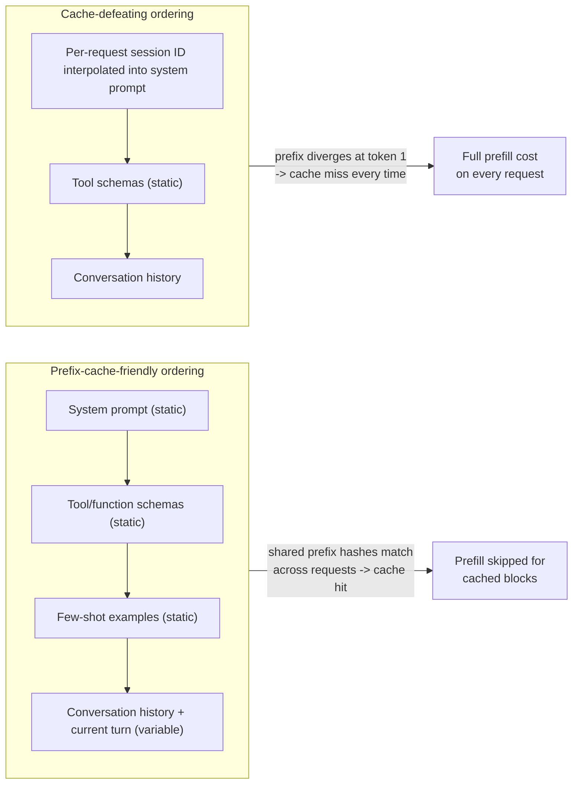
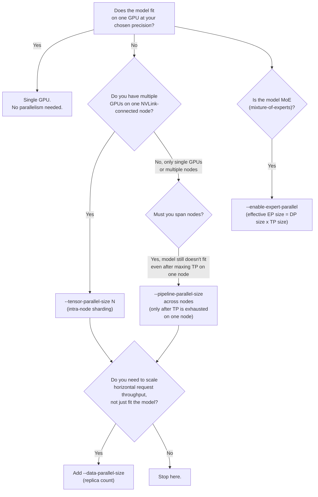

# Best Practices

> Chapters 1-20 built the mental model, one concept at a time: prefill vs. decode, KV cache, PagedAttention, continuous batching, the scheduler, memory flags, prefix caching, chunked prefill, quantization, speculative decoding, parallelism, structured outputs, benchmarking, tuning methodology, Docker, and production operations. This chapter does not introduce a single new mechanism. It is a **playbook** — the decisions you actually make, in the order you actually make them, when you sit down to configure a real vLLM deployment, with a one-line "why" attached to each one so you're applying judgment instead of copying a config file you don't understand.

## Learning Objectives

By the end of this chapter, you will be able to:

- Choose a precision/quantization strategy (FP8, AWQ/GPTQ, or GGUF) based on hardware constraints and task-quality requirements, rather than defaulting to whatever a blog post used
- Configure `--gpu-memory-utilization`, `--max-model-len`, and `--max-num-seqs` together as one coupled memory budget, instead of tuning each in isolation
- Explain why fighting V1's default-on prefix caching and chunked prefill is usually the wrong instinct, and when it is legitimately the right one
- Structure prompts — especially in agent frameworks — so that prefix caching actually pays off
- Apply a disciplined benchmarking methodology (production-equivalent hardware, realistic traffic shape, one variable at a time, look for the "knee") before trusting any configuration change
- Pick the smallest parallelism strategy that fits a given model/hardware combination, and justify why you didn't reach for a bigger one
- Wire up tool calling and structured outputs with the current, non-deprecated flags and request fields, and test parallel tool calls explicitly rather than assuming support
- Run vLLM in production without baking in secrets, losing the model cache on every restart, or load-balancing away your prefix-cache hit rate
- Treat every specific flag name and default in this course (including this chapter) as a snapshot that needs re-verification against `vllm serve --help` and current release notes before a real deployment

---

## Prerequisites

This chapter assumes you've read the whole course, or at minimum the following, since every recommendation below cites its source chapter rather than re-deriving it:

- **Chapters 1-2** — prefill/decode, TTFT/TPOT/ITL, compute-bound vs. memory-bound GPU work
- **Chapters 6-9** — KV cache, PagedAttention, continuous batching, the V1 unified scheduler
- **Chapter 10 (Memory Management)** — `--gpu-memory-utilization` as a ceiling, not a KV-cache fraction; `--max-model-len` as the cheapest concurrency lever; the four-bucket OOM diagnostic playbook
- **Chapter 11 (Prefix Caching)** and **Chapter 12 (Chunked Prefill)** — both default-on in V1, both fairness/efficiency mechanisms you tune around rather than fight
- **Chapter 13 (Quantization)** — FP8/AWQ/GPTQ/GGUF trade-offs
- **Chapter 14 (Speculative Decoding)** and **Chapter 15 (Parallelism)** — draft models/n-gram lookup, and tensor/pipeline/data/expert parallelism
- **Chapter 16 (Structured Outputs & Tool Calling)** — tool-call parsers, chat templates, `structured_outputs`
- **Chapter 17 (Benchmarking)** and **Chapter 18 (Performance Tuning)** — `vllm bench`, and the one-variable-at-a-time methodology this chapter leans on heavily
- **Chapters 19-20 (Docker, Production Serving)** — containerization, auth, autoscaling, observability

If any single recommendation below feels unfamiliar rather than like a reminder, that's a signal to go back to the cited chapter — this chapter deliberately doesn't re-teach the underlying mechanism, only the decision.

---

## 1. Model & Precision Choices

### 1.1 Default to FP8 on modern NVIDIA hardware

Chapter 13 covered the mechanics; the operational rule is simple: **on modern NVIDIA hardware (Hopper/Blackwell-class GPUs with native FP8 support), FP8 (E4M3/E5M2) is the default starting point for a production quantization decision**, not AWQ, not GPTQ, and not "don't quantize at all." The reasoning:

- FP8 halves weight VRAM versus FP16/BF16 with the smallest quality degradation of the commonly used quantization methods on hardware that has native FP8 tensor core support — you are not trading much accuracy for a large, direct increase in the KV cache pool (Chapter 10, Section 2.1's "quantization is the one lever that grows the pool itself" point applies here specifically).
- It requires no calibration dataset the way some GPTQ/AWQ workflows do, and current checkpoints are increasingly published pre-quantized to FP8 by model authors themselves.

**Reach for AWQ or GPTQ instead when**: you're on VRAM-constrained consumer hardware (a single 8-24GB GPU) where the deeper compression AWQ/GPTQ provide (typically 4-bit) is the difference between a model fitting at all and not fitting, or where the deployment target genuinely lacks native FP8 tensor core support. AWQ's official kernel is the default path, with Marlin/Machete kernels available when large-batch throughput matters more than the default kernel's characteristics; GPTQ defaults to the ExLlamaV2 kernel. Both are well-trodden, well-supported paths on older or smaller GPUs where FP8 either isn't accelerated in hardware or isn't worth the added complexity over a mature 4-bit path.

**Reach for GGUF only when you have a specific reason to**, and even then, question whether vLLM is the right serving engine at all. Per the fact sheet: GGUF support in vLLM moved fully out-of-tree into a separate plugin (`vllm-project/vllm-gguf-plugin`), and vLLM's own docs describe it as "highly experimental and under-optimized." GGUF's natural home is `llama.cpp` or Ollama, both built around the format from the ground up with mature, optimized kernels for it. If you're choosing a serving stack from scratch and GGUF is a hard requirement (e.g., you only have a GGUF checkpoint and no way to reconvert), that's a legitimate reason to pick `llama.cpp`/Ollama over vLLM entirely, rather than fighting an experimental out-of-tree plugin to make vLLM do something it isn't optimized for.

### 1.2 Always verify quantized checkpoint quality against your actual task

The single most common quantization mistake isn't picking the wrong method — it's **skipping verification entirely**. A quantized model's benchmark numbers on generic evals (MMLU, HellaSwag, whatever a model card cites) do not guarantee it performs acceptably on *your* task. A 4-bit AWQ quantization of a model that's excellent at general chat can degrade meaningfully on a narrow, precision-sensitive task — structured JSON extraction, code generation with exact syntax requirements, multi-step tool-calling reasoning — in ways that don't show up in aggregate benchmark scores at all.

Before committing a quantized checkpoint to production:

1. Run your own task-specific eval set (even a few dozen hand-checked examples) through both the full-precision and quantized checkpoint, side by side.
2. Pay particular attention to structured-output and tool-calling tasks (Chapter 16) — these are exactly the tasks where a subtly degraded model produces malformed output that a human eval on generic chat quality would never surface.
3. If quality is unacceptably degraded, don't assume "quantization doesn't work for this model" — try a different method (FP8 tends to degrade least; a more conservative GPTQ/AWQ bit-width or calibration set can also help) before abandoning quantization altogether.

---

## 2. Memory Configuration

Chapter 10 is the authoritative treatment; this section is the checklist version.

### 2.1 `--gpu-memory-utilization` is a total ceiling, not a KV-cache-only knob

Restated once more because it's the single most misread flag in vLLM: `--gpu-memory-utilization` (default `0.9`) sets `total_VRAM × utilization` as the absolute ceiling for **weights + activations/workspace buffers + CUDA graph capture buffers + KV cache, combined**. It is not "the fraction of memory reserved for KV cache." Raising it doesn't hand more memory to the KV cache in isolation — it raises the whole ceiling, and KV cache only gets whatever's left after weights and activations are subtracted. Before touching this flag to "fix" a memory problem, know which of the four consumers you're actually short on (Chapter 10, Section 8's diagnostic playbook).

### 2.2 Size `--max-model-len` to your actual need, not the model's max

A model card advertising 128K or 1M tokens of native context is not an instruction to serve at that length. `--max-model-len` directly caps the scheduler's worst-case per-sequence KV cache reservation — halving it can double or more your worst-case concurrent-sequence headroom, with zero hardware change (Chapter 10, Section 9.9 walks the arithmetic). Measure your *actual* traffic's prompt+generation length distribution (from pilot logs, not guesses) and set `--max-model-len` to a generous but realistic ceiling over that — not the model's theoretical maximum "just in case." This is consistently the cheapest concurrency win available, and it costs nothing except doing the measurement first.

### 2.3 Budget KV cache math explicitly before choosing `--max-num-seqs`

`--max-num-seqs` is a hard ceiling on how many sequences can simultaneously hold KV cache blocks — but setting it without first computing whether the KV cache pool can actually back that many sequences at your real `--max-model-len` just relocates the failure from "requests queue" to "requests get preempted and recomputed under load" (V1 has no swap-to-CPU path — Chapter 10, Section 7 — preemption in V1 drops the sequence's cache and recomputes prefill from scratch). Do the arithmetic before deploying:

```
ceiling            = total_VRAM × gpu_memory_utilization
KV_cache_pool       = ceiling − weights − activations/graph_reserve
bytes_per_token     = 2 × num_layers × num_kv_heads × head_dim × bytes_per_element
bytes_per_sequence  = bytes_per_token × max_model_len   (worst case, full context)
max_concurrent_seqs ≈ KV_cache_pool / bytes_per_sequence
```

Set `--max-num-seqs` at or below that number — not at an arbitrary round number chosen because it "felt reasonable."

---

## 3. Batching & Scheduling

### 3.1 Trust V1's defaults; don't fight them

V1's explicit design goal is "zero configs" — prefix caching (Chapter 11) and chunked prefill (Chapter 12) are both **on by default**, not opt-in flags you need to remember to set. The instinct to reach for `--no-enable-prefix-caching` or to "disable chunked prefill for lower TTFT" is almost always wrong for a shared, multi-tenant deployment: prefix caching trades a small bookkeeping cost for large latency wins on repeated shared prefixes, and chunked prefill trades a slightly higher TTFT for one large request against protecting every concurrent sequence's decode latency from starving. Both defaults exist because the trade they represent is the right one in the overwhelming majority of real deployments. Only disable either if you've *measured* (Chapter 17/18) that your specific traffic shape doesn't benefit and the default is actively costing you something — not on a hunch.

### 3.2 Tune `--max-num-batched-tokens`/`--max-num-seqs` for your actual traffic mix

These two flags are the real tuning surface, and the right values depend entirely on whether your traffic is prefill-heavy or decode-heavy:

- **Prefill-heavy traffic** (RAG pipelines, document summarization, long-context analysis — large prompts, short generations): a larger `--max-num-batched-tokens` lets more of a long prefill land in fewer scheduler steps, closer to the unchunked TTFT, at some cost to how much budget is left for interleaved decode work in the same step (Chapter 12, Section 5).
- **Decode-heavy traffic** (interactive chat, long streamed generations, short prompts): protecting ITL matters more than any single request's TTFT — a more conservative `--max-num-batched-tokens` keeps prefill chunks small and interleaving frequent, which is exactly what keeps concurrent chat users' token streams smooth.
- **Mixed traffic** (the common case — a chat product with occasional RAG-style long-context requests sharing one endpoint): this is precisely the scenario chunked prefill's default-on behavior exists for (Chapter 12, Section 8) — don't manually try to segregate the two traffic classes onto separate schedulers before first confirming, via `/metrics` or a benchmark, that the default interleaving isn't already handling it acceptably.

Remember `--max-num-batched-tokens` does double duty (Chapter 12, Section 5): it's simultaneously your per-step throughput/memory ceiling *and* your effective chunked-prefill chunk-size ceiling. A change made purely to fix an OOM can silently shift your long-prompt TTFT and short-prompt ITL profile as a side effect — treat it as one knob with two coupled effects.

---

## 4. Prefix-Cache-Friendly Prompt Design

This is the most directly actionable section for anyone building on top of vLLM through an agent framework (LangChain, LangGraph, MCP, DeepAgents — this repo's other courses), because it costs nothing to implement and pays off immediately once prefix caching (default-on, Chapter 11) is in play.

**The rule: put static/shared content first, variable content last.**

Prefix caching works by hashing and reusing KV cache blocks for the longest common token *prefix* shared between requests. A cache hit requires the shared content to be a literal prefix — not just present somewhere in the prompt. Concretely, for an agent-framework request, order the prompt as:

1. **System prompt** — identical across every request to this agent, always first.
2. **Tool/function schemas** — identical across every request using the same toolset, immediately after the system prompt.
3. **Few-shot examples**, if used, and any other content that's genuinely constant across requests.
4. **Conversation history and the current user turn** — the part that actually varies request to request, placed last.

Getting this order backwards — e.g., interpolating a per-request timestamp, session ID, or user name into the system prompt itself, or listing tool schemas in a per-request-randomized order — breaks the shared prefix at the very first token, and every request pays full prefill cost with zero cache reuse, even though the "meaningful" content (the system prompt, the tools) was byte-for-byte identical to the previous request in every way that mattered.



Practical checklist for agent-framework integrations:

- Never interpolate per-request/per-user dynamic values (timestamps, session IDs, request IDs, randomized few-shot ordering) into the system prompt or tool-schema block. If you need per-user personalization, put it as late in the prompt as possible, ideally in the final user turn.
- Keep tool/function schema ordering deterministic and stable across requests to the same agent — don't re-serialize a dict in an order that isn't guaranteed stable between calls.
- For multi-turn conversations, note that the growing conversation history is itself a prefix relative to the next turn in the *same* conversation — this is a second, independent prefix-caching win beyond the static system-prompt/tools block, and it's why conversational agents benefit especially strongly from prefix caching turn over turn.
- Verify the win is real for your workload with `/metrics` or a benchmark (Section 5) rather than assuming reordering helped — prefix cache hit rate is directly observable, not something you should have to infer.

---

## 5. Benchmarking Discipline

Chapters 17-18 built the full methodology; the discipline reduces to three rules, and skipping any one of them invalidates the result.

### 5.1 Benchmark on production-equivalent hardware with realistic traffic shapes

A benchmark run on a different GPU generation, a different GPU count, or with synthetic uniform-length prompts tells you almost nothing about how a configuration change will behave in production. Traffic shape matters specifically because of everything covered in Sections 3-4 above: a benchmark using only short, uniform prompts will never exercise chunked prefill's interleaving behavior or prefix caching's hit-rate dynamics, both of which are exactly the mechanisms a production mixed-traffic deployment depends on. Use `vllm bench serve` (Chapter 17) with a request-length distribution and concurrency pattern that resembles your real users, not a convenient synthetic default.

### 5.2 One variable at a time

Changing `--gpu-memory-utilization`, `--max-model-len`, and `--max-num-seqs` simultaneously and observing a throughput improvement tells you the combination worked — it tells you nothing about which change caused the improvement, or whether one of the three changes was actively hurting while another compensated for it. Chapter 18's tuning methodology applies directly here: change one flag, benchmark, record, revert or keep, then move to the next. This is slower than tuning by intuition, but it's the only way to build a config you can actually explain and defend later — including in the interview scenarios of Chapter 24.

### 5.3 Look for the knee, not an arbitrary concurrency target

Throughput vs. latency, plotted against increasing concurrency, is not a straight line — it has a "knee": a point where added concurrency stops buying meaningful throughput and starts costing latency instead, as queuing and KV cache pressure dominate. Picking a deployment's target concurrency by an arbitrary number ("let's support 100 concurrent users") without first plotting this curve for your actual model/hardware/config means you're as likely to be well past the knee (paying latency for no throughput gain) as comfortably before it. Run the sweep, find the knee, and set `--max-num-seqs` and your load-balancer/autoscaler targets relative to that measured point — not a guess.

---

## 6. Parallelism

Chapter 15 is the mechanism reference; the operational rule is: **use the smallest parallelism strategy that fits your model and hardware, and add more only when a specific, named requirement forces it.**



Concretely:

- **Tensor parallelism (`--tensor-parallel-size`)** is the first and usually only lever needed once a model doesn't fit on one GPU — it shards individual layers/matrices across GPUs on the *same* node, and is efficient specifically because NVLink gives those GPUs high-bandwidth, low-latency interconnect for the frequent cross-GPU communication TP requires.
- **Pipeline parallelism (`--pipeline-parallel-size`)** shards layer *ranges* across nodes, tolerating the higher latency/lower bandwidth of inter-node networking better than TP does. Reach for it only when a model still doesn't fit after exhausting tensor parallelism on a single NVLink-connected node — not as a default multi-GPU strategy. Don't reach for pipeline parallelism across nodes when tensor parallelism on one node suffices; PP adds inter-node coordination complexity and latency you don't need if the model already fits within one node's GPU count.
- **Data parallelism (`--data-parallel-size`)** replicates the whole model (or the whole TP/PP group) to scale horizontal request throughput — add it when your bottleneck is "not enough total request-serving capacity across many replicas," not "the model doesn't fit."
- **Expert parallelism (`--enable-expert-parallel`)** is specific to MoE architectures, where the effective expert-parallel size is computed as DP size × TP size rather than set directly. Only relevant if you're serving an MoE model in the first place (e.g., the documented pattern `--tensor-parallel-size 1 --data-parallel-size 8 --enable-expert-parallel` for a MoE deployment).
- **Multi-node launches** default to Ray as the distributed executor backend; single-node uses native Python multiprocessing. Override with `--distributed-executor-backend {mp|ray}` if you have a specific reason to.

The failure mode this section exists to prevent: reaching for pipeline parallelism (or worse, a multi-node deployment at all) as a reflexive "we need more GPUs" response, when the actual model comfortably fits on one 8-GPU NVLink node with tensor parallelism alone — adding unnecessary inter-node complexity, latency, and operational surface area for no benefit.

---

## 7. Structured Outputs / Tool Calling

Chapter 16 is the full reference; the operational checklist:

- **Always pair a `--tool-call-parser` with its required `--chat-template`.** Many parsers (e.g. `llama3_json` for Llama 3.1/3.2) explicitly require a specific chat template — often one of the `examples/tool_chat_template_*.jinja` files shipped in the vLLM repo — to format tool definitions and tool-call outputs in the shape the parser expects. Enabling `--enable-auto-tool-choice --tool-call-parser <name>` without the matching template produces malformed or unparsed tool calls that look like a parser bug but are actually a template mismatch.
- **Test parallel-tool-call behavior explicitly.** Not every parser/model combination supports emitting multiple tool calls in one turn reliably — `llama4_pythonic`, for instance, is called out specifically for parallel tool call support, which is notable precisely because it isn't a universal guarantee across every parser. Don't assume parallel tool calling works because single tool calls work; write a test that actually issues a prompt likely to trigger multiple simultaneous tool calls and inspect the raw response.
- **Use the current `structured_outputs` request field, not the deprecated `guided_*` fields.** The old per-request `guided_json`/`guided_regex`/`guided_choice`/`guided_grammar`/`guided_whitespace_pattern`/`structural_tag`/`guided_decoding_backend` fields were removed in v0.12.0. Current shape nests everything under `structured_outputs`:

  ```python
  completion = client.chat.completions.create(
      model=model,
      messages=[...],
      extra_body={"structured_outputs": {"json": schema}},   # was guided_json
  )
  ```

  On the server side, the backend is selected with `--structured-outputs-config.backend` (which replaced the old `--guided-decoding-backend` flag name), choosing between `xgrammar` (the emphasized default-family backend), `guidance`, or the still-recognized-but-less-emphasized `outlines`/`lm-format-enforcer`. If you find `guided_json` or `--guided-decoding-backend` in a tutorial, treat it as a signal the material predates v0.12.0 — the request shape and flag name have both moved on.
- **Custom parsers** can be registered via `--tool-parser-plugin` when none of the built-in parsers match your model family — don't force-fit a mismatched parser onto a model it wasn't written for.

---

## 8. Production Operations

Chapters 19-20 built the full deployment story; the checklist version:

- **Never bake secrets into Docker images.** API keys, HF tokens, and any auth material belong in environment variables or a secrets manager (Kubernetes Secrets, a cloud provider's secret store) injected at runtime — not `ENV` lines or `COPY`'d files baked into the image itself, which persist in image layers and registries indefinitely.
- **Always mount a persistent model cache volume.** Without one, every container restart or rescheduled pod re-downloads model weights from the Hugging Face Hub (or wherever the checkpoint lives) before it can start serving — turning a routine restart into a multi-minute (or, for large models, much longer) outage. Mount a persistent volume at the HF cache path (typically `~/.cache/huggingface`) so weights survive restarts.
- **Use `vllm-project/production-stack`'s router instead of naive round-robin load balancing** across multiple vLLM replicas. A naive round-robin balancer sends semantically related requests (e.g., successive turns of the same conversation, or requests sharing the same system prompt/tool schema) to arbitrary, different replicas — destroying prefix-cache locality (Section 4) every time, since each replica maintains its own independent KV cache. A prefix-cache-aware router routes related requests back to the same replica when possible, preserving the cache-hit benefit that naive load balancing throws away.
- **Monitor `/metrics` for queue depth and KV cache utilization, not just raw request latency.** Raw p50/p99 latency tells you something is wrong after it's already affecting users; queue depth and KV cache utilization (both exposed as `vllm:`-prefixed Prometheus metrics) tell you *why*, and often give earlier warning — a growing queue or climbing KV cache utilization precedes a latency spike, not the other way around.
- **Use queue-depth/KV-utilization-based autoscaling signals, not CPU-utilization-based ones.** GPU-bound inference workloads routinely show low host CPU utilization even when the GPU (and its KV cache) is fully saturated and requests are queuing — a CPU-based horizontal pod autoscaler will simply never trigger under real backpressure. Scale on the metrics that actually reflect engine load: queue depth, KV cache utilization, or a request-latency SLO, sourced from `/metrics`.

---

## 9. Staying Current

vLLM ships a new minor release roughly every two weeks, and this course's own fact sheet was compiled by cross-checking live docs and GitHub state on a specific date — it is a snapshot, not a permanent reference. This course itself has already documented, within its own chapters, several precedents for exactly the kind of drift you should expect to keep encountering:

- **One full architecture rewrite**: V0 → V1, changing the scheduler, KV cache manager, worker, sampler, and API server internals while keeping model implementations and kernels. V0 is now fully removed, not just deprecated.
- **A request/flag rename**: `guided_decoding_backend`/`guided_json`/etc. → `structured_outputs`/`--structured-outputs-config.backend`, with the old fields fully removed in v0.12.0, not just soft-deprecated.
- **A feature moving out-of-tree entirely**: GGUF support migrating from in-repo to the separate `vllm-project/vllm-gguf-plugin`.
- **A flag going quietly dead without being removed from `--help`**: `--swap-space`, still present in the CLI surface but confirmed a no-op in current V1 (tracked via a live, open GitHub issue), pending possible future repurposing for tiered KV offload.

The operating rule this history justifies: **never treat any single source — including this course — as permanently authoritative for a specific flag name, default value, or behavior.** Before deploying, or before writing a flag name into a runbook a teammate will follow later without re-checking, run `vllm serve --help` against the version you're actually running, and skim the release notes for versions between what this course describes and what you have installed. This is not a disclaimer to read once and forget — it's a concrete pre-deployment step, exactly as real as checking `nvidia-smi` before starting a server.

---

## Worked Example: A Consolidated "Good Defaults" Invocation

The following combines the recommendations from Sections 1-3 and 7 into one representative production launch command for a mid-size instruct model on a single modern multi-GPU NVLink node, serving an agent-style chat/tool-calling workload with a realistic, measured traffic profile. Every flag below traces back to a section above — treat this as a template to adapt with your own measured numbers, not a config to copy verbatim.

```bash
vllm serve meta-llama/Llama-3.1-70B-Instruct \
  --tensor-parallel-size 4 \
  --quantization fp8 \
  --gpu-memory-utilization 0.9 \
  --max-model-len 16384 \
  --max-num-seqs 64 \
  --max-num-batched-tokens 8192 \
  --enable-auto-tool-choice \
  --tool-call-parser llama3_json \
  --chat-template examples/tool_chat_template_llama3.1_json.jinja \
  --served-model-name agent-chat-70b \
  --api-key "${VLLM_API_KEY}"
```

Why each piece is there:

| Flag | Rationale (section) |
|---|---|
| `--tensor-parallel-size 4` | Smallest parallelism strategy that fits a 70B model across 4 NVLink-connected GPUs on one node — no pipeline/data parallelism reached for unless throughput or multi-node capacity is a separate, named requirement (Section 6) |
| `--quantization fp8` | Default precision choice on modern NVIDIA hardware — shrinks weight VRAM, directly grows the KV cache pool, smallest quality hit of the common methods (Section 1) — verified against a task-specific eval before shipping, not assumed |
| `--gpu-memory-utilization 0.9` | The default ceiling, left alone unless a Chapter 10-style budget calculation says otherwise (Section 2.1) |
| `--max-model-len 16384` | Set to the measured realistic maximum for this agent's actual conversation+tool-schema length, not the model's full native context (Section 2.2) |
| `--max-num-seqs 64` | Chosen after running the KV-cache-pool arithmetic from Section 2.3 for this GPU/model/`max-model-len` combination — not picked arbitrarily |
| `--max-num-batched-tokens 8192` | Tuned for this workload's mixed prefill/decode traffic shape (Section 3.2), also setting the effective chunked-prefill chunk size |
| `--enable-auto-tool-choice` + `--tool-call-parser llama3_json` + `--chat-template ...` | Tool-call parser always paired with its required chat template (Section 7) — never one without the other |
| `--served-model-name agent-chat-70b` | A stable alias for API consumers, decoupled from the underlying HF repo ID |
| `--api-key "${VLLM_API_KEY}"` | Read from environment, never hardcoded into the image or command history (Section 8) |

Note what's deliberately *absent*: no `--enforce-eager` (CUDA graphs stay on for decode throughput, since this GPU has headroom), no `--no-enable-prefix-caching` or chunked-prefill-disabling flag (V1's defaults are trusted per Section 3.1), and no `--swap-space` (known dead in current V1, per Chapter 10 Section 7).

Before this goes to production: benchmark it with `vllm bench serve` against a realistic concurrency sweep (Section 5), confirm the prefix-cache hit rate via `/metrics` reflects the prompt-ordering discipline from Section 4, and re-verify every flag name above against your installed version's `vllm serve --help` (Section 9).

---

## Real-World Scenario

**Setup**: A team is deploying an internal coding-assistant agent — built on this repo's LangGraph/MCP stack — on top of a self-hosted 32B-parameter instruct model. The agent calls several MCP tools per turn (a file-search tool, a test-runner tool, a lint tool) and maintains long multi-turn conversations as a developer iterates on a task. The team has read Chapters 1-20 and is now assembling a production configuration from scratch.

**Their first pass**: They copy a config they found in a blog post: `--gpu-memory-utilization 0.95`, no `--max-model-len` override (serves the model's full 128K native context), `--max-num-seqs 256`, AWQ 4-bit quantization "because it was in the example," `--guided-decoding-backend outlines` for structured tool-call arguments, and a naive round-robin Nginx load balancer in front of three replicas for redundancy.

**Applying this chapter's checklist surfaces four problems before deployment**:

1. **Precision (Section 1)**: The team's GPUs are modern Hopper-class cards with native FP8 support, and the coding assistant's tool-call-argument accuracy is precision-sensitive — a 4-bit AWQ quantization, chosen only because a blog post used it, hadn't been checked against the team's own tool-calling eval set at all. Switching to FP8 and running a quick before/after comparison on 30 real tool-calling transcripts showed AWQ was producing a small but real rate of malformed JSON tool arguments that FP8 didn't.
2. **Memory (Section 2)**: Pilot logs of real developer sessions showed conversations rarely exceeded 20K tokens even after many turns and several tool-call round-trips — nowhere near the model's 128K native context. Serving at the full native length, combined with `--max-num-seqs 256` chosen without any KV-cache arithmetic, meant the scheduler was planning for a worst case that never occurred while simultaneously risking preemption once real concurrent usage climbed — exactly Chapter 10's Real-World Scenario, recurring. Setting `--max-model-len 24576` and recomputing `--max-num-seqs` from the actual KV-cache-pool math fixed both problems at once.
3. **Structured outputs (Section 7)**: `--guided-decoding-backend` is the old, removed flag name (structured-output backend selection now lives under `--structured-outputs-config.backend`, and the corresponding request field is `structured_outputs`, not `guided_json`) — the blog post predated v0.12.0. The team's own client code, copied from the same era, was still sending `guided_json` in `extra_body`, which the current server silently ignored rather than erroring, so structured tool-call arguments had been falling back to unconstrained generation the entire time without anyone noticing until a lint-tool call sent malformed JSON in a demo.
4. **Load balancing (Section 8)**: With naive round-robin across three replicas, each new turn of the same developer's multi-turn conversation had roughly a two-in-three chance of landing on a *different* replica than the previous turn — throwing away the prefix-cache hit on the accumulated conversation history and tool schemas every single turn, even though prefix caching itself was correctly on by default. Switching the front door to `vllm-project/production-stack`'s prefix-cache-aware router kept related requests sticky to the same replica, and `/metrics` showed the prefix-cache hit rate climb accordingly.

**Lesson**: None of these four issues were exotic — each was a specific, checklist-catchable instance of "copied a config without re-deriving why each flag was there," and each is a section of this chapter. The fix in every case was cheap once identified; the cost was entirely in *not* checking systematically before shipping.

---

## Best Practices

This chapter effectively *is* the best-practices content — the checklist below is a concise, scannable summary of Sections 1-9 for a pre-deployment review.

- **Precision**: default to FP8 on modern NVIDIA hardware; use AWQ/GPTQ on VRAM-constrained consumer hardware; treat GGUF as a `llama.cpp`/Ollama use case, not a vLLM default; always validate a quantized checkpoint against your own task-specific eval before shipping it.
- **Memory**: treat `--gpu-memory-utilization` as a total ceiling for weights+activations+graphs+KV cache, never a KV-cache-only fraction; set `--max-model-len` to your measured real traffic need, not the model's native max; compute the KV-cache-pool arithmetic explicitly before choosing `--max-num-seqs`.
- **Batching/scheduling**: trust V1's default-on prefix caching and chunked prefill; tune `--max-num-batched-tokens`/`--max-num-seqs` based on whether your traffic is prefill-heavy, decode-heavy, or mixed.
- **Prompt design**: put static/shared content (system prompt, tool schemas, few-shot examples) first; put variable content (conversation turns, per-user data) last — never interpolate per-request dynamic values into the static prefix.
- **Benchmarking**: always benchmark on production-equivalent hardware with realistic traffic shapes; change one variable at a time; find the latency/throughput knee rather than picking an arbitrary concurrency number.
- **Parallelism**: use the smallest strategy that fits — tensor parallelism on one NVLink node before pipeline parallelism across nodes; add data/expert parallelism only for horizontal throughput scaling or MoE support specifically.
- **Structured outputs/tool calling**: always pair a `--tool-call-parser` with its required `--chat-template`; test parallel tool calls explicitly; use `structured_outputs`/`--structured-outputs-config.backend`, not the removed `guided_*` fields.
- **Production operations**: no secrets baked into images; a persistent mounted model cache volume; a prefix-cache-aware router (`vllm-project/production-stack`), not naive round-robin; monitor `/metrics` for queue depth and KV cache utilization; autoscale on those signals, not CPU utilization.
- **Staying current**: re-verify every flag name and default in this course (and any other single source) against `vllm serve --help` and current release notes before a real deployment — vLLM's release cadence and history of renames/rewrites make this a required step, not paranoia.

---

## Common Mistakes

A consolidated top-mistakes list spanning the whole course, each cross-referenced to the chapter that covers the fix in depth:

1. **Reading `--gpu-memory-utilization` as "the KV cache fraction."** It's a total ceiling for everything vLLM allocates. *(Chapter 10)*
2. **Serving at the model's full native `--max-model-len` "just in case," without measuring real traffic.** Silently caps concurrency far below what the hardware could otherwise support. *(Chapter 10)*
3. **Setting `--max-num-seqs` to an arbitrary round number instead of computing what the KV cache pool can actually sustain.** Relocates the failure to preemption/recompute under real load. *(Chapter 10)*
4. **Configuring `--swap-space` and expecting a CPU-offload safety net.** Confirmed dead/no-op in current V1 — preemption recomputes from scratch instead. *(Chapter 10)*
5. **Trying to "turn off" chunked prefill or prefix caching to chase a marginal win, without benchmarking the trade-off first.** Both are on by default because the trade they represent is usually correct for shared traffic. *(Chapters 11, 12)*
6. **Conflating chunked prefill with continuous batching, or describing chunked prefill as "a throughput optimization."** It's a fairness/latency-smoothing mechanism; throughput gains are a side effect, not its purpose. *(Chapter 12)*
7. **Picking a quantization method by copying a blog post instead of checking hardware constraints and task-specific quality.** FP8 is the modern-NVIDIA default; AWQ/GPTQ for VRAM-constrained hardware; verify quality on your own eval set regardless of method. *(Chapter 13, this chapter Section 1)*
8. **Reaching for GGUF in vLLM production by default.** It's an experimental, out-of-tree plugin in vLLM; `llama.cpp`/Ollama are the natural home for GGUF specifically. *(Chapter 13, this chapter Section 1)*
9. **Reaching for pipeline parallelism (or multi-node deployment) before exhausting tensor parallelism on one NVLink node.** Adds unnecessary inter-node latency and complexity when TP alone would fit the model. *(Chapter 15, this chapter Section 6)*
10. **Using deprecated `guided_json`/`guided_decoding_backend`-style fields and flags.** Removed in v0.12.0 — current surface is `structured_outputs` (request) / `--structured-outputs-config.backend` (server flag). A server silently ignoring an old field is a worse failure mode than an error, because it's invisible until output quality degrades. *(Chapter 16, this chapter Section 7)*
11. **Enabling a `--tool-call-parser` without its required matching `--chat-template`.** Produces malformed or unparsed tool calls that look like a parser bug. *(Chapter 16, this chapter Section 7)*
12. **Assuming parallel tool calling works because single tool calls work.** Not every parser/model combination supports it — test explicitly. *(Chapter 16, this chapter Section 7)*
13. **Benchmarking with synthetic, uniform-length prompts and assuming the results generalize to mixed production traffic.** Never exercises chunked prefill or prefix caching's real dynamics. *(Chapters 17, 18, this chapter Section 5)*
14. **Tuning multiple flags at once and attributing an observed improvement to the wrong one.** *(Chapter 18, this chapter Section 5)*
15. **Picking a target concurrency arbitrarily instead of finding the latency/throughput knee via a sweep.** *(Chapter 18, this chapter Section 5)*
16. **Baking API keys or HF tokens into a Docker image.** Persists in image layers/registries indefinitely; use environment variables or a secrets manager instead. *(Chapter 19, this chapter Section 8)*
17. **Not mounting a persistent model cache volume.** Turns every restart into a full model re-download before the server can serve again. *(Chapter 19, this chapter Section 8)*
18. **Load-balancing multiple vLLM replicas with naive round-robin.** Destroys prefix-cache locality for multi-turn/shared-prefix traffic; use `vllm-project/production-stack`'s router instead. *(Chapter 20, this chapter Section 8)*
19. **Autoscaling on CPU utilization for a GPU-bound inference workload.** CPU stays low even when the GPU/KV cache is saturated and requests are queuing — scale on queue depth/KV utilization from `/metrics` instead. *(Chapter 20, this chapter Section 8)*
20. **Treating any single source — including this course — as permanently authoritative for a flag name or default.** vLLM's ~biweekly cadence and history of renames (`guided_decoding_backend` → `structured-outputs-config.backend`), rewrites (V0 → V1), and out-of-tree moves (GGUF) mean every deployment should re-check `vllm serve --help` and release notes first. *(This chapter, Section 9)*

---

## Summary

- **Precision**: FP8 is the modern-NVIDIA default; AWQ/GPTQ serve VRAM-constrained hardware; GGUF belongs to `llama.cpp`/Ollama more than to production vLLM; always validate quantized quality against your actual task.
- **Memory**: `--gpu-memory-utilization` is a total ceiling, not a KV-cache slice; `--max-model-len` should match measured real traffic, not a model's native maximum; `--max-num-seqs` should come from explicit KV-cache-pool arithmetic, not a guess.
- **Batching/scheduling**: V1's default-on prefix caching and chunked prefill are usually correct to trust as-is; `--max-num-batched-tokens`/`--max-num-seqs` are the real tuning surface, set according to whether traffic is prefill-heavy, decode-heavy, or mixed.
- **Prompt design**: static content first, variable content last, for every agent-framework integration that wants prefix-cache hits.
- **Benchmarking**: production-equivalent hardware, realistic traffic, one variable at a time, find the knee — never trust an untested config change.
- **Parallelism**: smallest strategy that fits — TP on one NVLink node before PP across nodes, DP/EP only for throughput scaling or MoE.
- **Structured outputs/tool calling**: pair parsers with their chat templates, test parallel tool calls explicitly, use current `structured_outputs`/`--structured-outputs-config.backend`, not removed `guided_*` fields.
- **Production operations**: no baked-in secrets, persistent model cache volumes, prefix-cache-aware routing, queue-depth/KV-utilization-based monitoring and autoscaling.
- **Staying current**: vLLM's release cadence and history of major renames/rewrites mean every flag in this course (and any other single source) needs re-verification against `vllm serve --help` and release notes before a real deployment.

---

## Knowledge Check

1. A teammate proposes AWQ quantization for a new deployment "because it's what we used last time," on hardware that turns out to be a fleet of Hopper-class GPUs. What would you ask them to check before agreeing, and what would you likely recommend instead?
2. Explain, in your own words, why `--max-num-seqs` should be derived from KV-cache-pool arithmetic rather than chosen as a round number, and what failure mode results from getting it wrong in each direction (too low vs. too high).
3. A developer wants to disable chunked prefill to get a faster TTFT for a single large document-summarization request. Under what specific, narrow traffic condition would that actually be a reasonable thing to do, and why is it the wrong default instinct for most deployments?
4. An agent-framework integration puts a per-request UUID at the very start of its system prompt, before the actual system instructions. What does this do to prefix-cache hit rate, and how would you restructure the prompt to fix it?
5. Why does autoscaling a vLLM deployment on host CPU utilization tend to fail to trigger even under real backpressure, and what two metrics would you scale on instead?
6. A colleague finds a two-year-old blog post recommending `--guided-decoding-backend outlines` and `guided_json` in the request body for structured outputs. What's the current equivalent surface, and why might their client code silently fail rather than error if they used the old names against a current server?

---

## Hands-On Exercise

**Goal**: audit a given `vllm serve` configuration against this chapter's checklist, and identify what to change and why.

Here is a configuration a (fictional) teammate has proposed for a new internal deployment. The model is a 34B-parameter instruct model used by a multi-turn customer-support chat agent that calls two internal tools (an order-lookup tool and a refund-issuing tool) per conversation, running on a node with 2 GPUs connected via NVLink, each with 80GB VRAM:

```bash
vllm serve internal-org/support-agent-34b \
  --tensor-parallel-size 1 \
  --pipeline-parallel-size 2 \
  --quantization gguf \
  --gpu-memory-utilization 0.99 \
  --max-num-seqs 500 \
  --swap-space 32 \
  --enable-auto-tool-choice \
  --tool-call-parser hermes
```

Additional facts: pilot logs show real conversations, including tool calls, almost never exceed 6,000 tokens total. The team plans to run three replicas of this behind an existing Nginx round-robin load balancer they already use for other services. The client code sends structured refund-amount validation using `extra_body={"guided_json": schema}`.

Work through the following, using this chapter's sections as your checklist:

1. **Parallelism** (Section 6): Is `--pipeline-parallel-size 2` the right choice given 2 GPUs on one NVLink-connected node? What should it be instead, and why?
2. **Precision** (Section 1): Is GGUF the right quantization choice here? What would you recommend instead, and what would you check before committing to it?
3. **Memory** (Section 2): `--gpu-memory-utilization 0.99` and no `--max-model-len` override, combined with `--max-num-seqs 500` and the pilot-log fact that real conversations stay under 6,000 tokens — do the arithmetic (Section 2.3's formula) conceptually: is 500 concurrent sequences plausible at whatever the model's native context length is, versus at a `--max-model-len` matched to the 6,000-token reality? What values would you propose instead?
4. **The `--swap-space 32` flag**: what does this flag actually do in current V1, and what should the team understand about it before relying on it in their capacity planning?
5. **Structured outputs**: is `guided_json` the current request field? What happens if this client code runs unmodified against a current vLLM server, and why is that worse than an outright error?
6. **Load balancing**: given that this is a multi-turn conversational agent behind three replicas, what's wrong with the existing Nginx round-robin balancer for this specific workload, and what should replace it?
7. **Write a corrected `vllm serve` command** (and a one-line note on the load-balancer change) that addresses every issue you found, citing which section of this chapter justifies each change.

There is no single "correct" answer key — the point of the exercise is producing a config you can defend line by line, the way the Worked Example table in this chapter does.

---

## Further Reading

- Official vLLM docs: `docs.vllm.ai` (always check which version of the docs you're reading — they track `main`)
- vLLM release notes: `github.com/vllm-project/vllm/releases` — check before trusting any flag/default in this chapter against your installed version
- vLLM engine arguments reference: `docs.vllm.ai/en/latest/serving/engine_args.html`
- Structured outputs documentation: `docs.vllm.ai/en/latest/features/structured_outputs.html`
- Tool calling documentation: `docs.vllm.ai/en/latest/features/tool_calling.html`
- GGUF plugin (out-of-tree): `github.com/vllm-project/vllm-gguf-plugin`
- Production Kubernetes/Helm deployment path: `github.com/vllm-project/production-stack`
- The open issue confirming `--swap-space` is currently a no-op: `github.com/vllm-project/vllm/issues/27984`
- Kwon, Woosuk, et al., *"Efficient Memory Management for Large Language Model Serving with PagedAttention,"* SOSP 2023 — the foundational paper underlying every memory-configuration recommendation in this chapter
- This course's **Chapter 10 (Memory Management)** for the full memory-budgeting derivation
- This course's **Chapter 11 (Prefix Caching)** and **Chapter 12 (Chunked Prefill)** for the mechanisms this chapter tells you to trust by default
- This course's **Chapter 13 (Quantization)**, **Chapter 15 (Parallelism)**, **Chapter 16 (Structured Outputs & Tool Calling)** for the mechanism-level detail behind Sections 1, 6, and 7
- This course's **Chapter 17 (Benchmarking)** and **Chapter 18 (Performance Tuning)** for the full methodology behind Section 5
- This course's **Chapter 19 (Docker)** and **Chapter 20 (Production Serving)** for the full operational detail behind Section 8
- This repo's [LangGraph course](../langgraph-course/00-index.md), [MCP course](../mcp-course/00-index.md), and [DeepAgents course](../deepagents-course/00-index.md) for the agent-framework side of Section 4's prompt-design guidance

<div style="display:flex;justify-content:space-between;align-items:center;">
  <a href="./20-production-serving.md">← Previous: Production Serving</a>
  <a href="./00-index.md">🏠 Index</a>
  <a href="./22-common-mistakes-and-pitfalls.md">Next: Common Mistakes & Pitfalls →</a>
</div>
