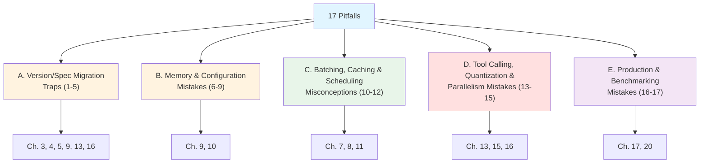
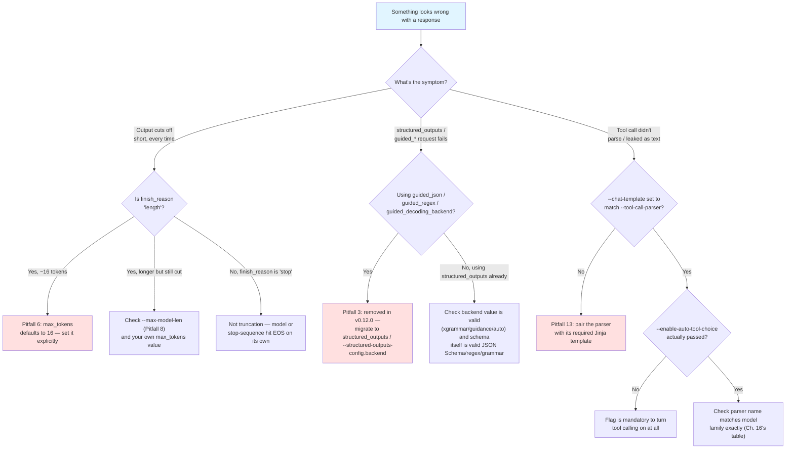
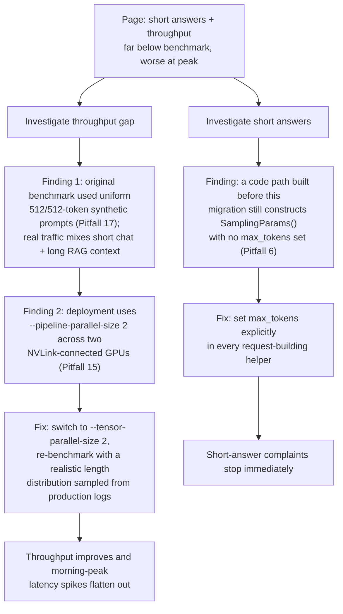

# Common Mistakes & Pitfalls

Every prior chapter taught you the right way to configure, tune, or operate vLLM. This chapter is the inventory of the wrong ways — the specific, recurring mistakes that show up when engineers bring assumptions from an older vLLM tutorial, from a different serving engine, or from an old changelog they half-remember, and those assumptions turn out to be stale, inverted, or simply never true. None of this introduces new mechanisms — every entry cross-references the chapter that taught the concept correctly the first time. What's new here is the framing: **exactly what it looks like when someone gets it wrong**, why the mistake is so tempting to make, and the concrete before/after that fixes it.

Seventeen pitfalls follow, grouped into five families: version/spec migration traps, memory & configuration mistakes, batching/caching/scheduling misconceptions, tool-calling/quantization/parallelism mistakes, and production/benchmarking mistakes. Read this chapter as a checklist to run against your own vLLM deployment, not as a novel — skim the bold headings, stop wherever one looks uncomfortably familiar.

## Learning Objectives

By the end of this chapter, you will be able to:

- Recognize each of the 17 catalogued pitfalls by its symptom, not just by its name — a truncated completion, a 400 on a structured-output request, and a tool call the parser can't unpack all have a specific, checkable root cause
- Explain *why* vLLM's rapid V0→V1 migration and its roughly-biweekly release cadence make several of these mistakes unusually easy to inherit from tutorials, blog posts, and even changelog entries that are individually true but collectively misleading if read out of context
- Apply the concrete before/after fix for each pitfall, using the exact flags and fields established in Chapters 1–21
- Distinguish a genuinely removed/renamed API surface (V0 flags, `best_of`, `guided_*` fields) from a still-current-but-widely-misunderstood one (`--gpu-memory-utilization`, `--swap-space`, prefix caching defaults)
- Walk the truncated-output / structured-output-failure / tool-call-parsing-failure decision tree below without guessing, on your first pass through a real incident
- Run a pre-ship review of a vLLM deployment against this chapter's condensed prevention checklist

## Prerequisites

This chapter assumes you have completed Chapters 1–21, including Chapter 21's Best Practices synthesis. It does not re-teach any mechanism from scratch — every entry below points back to where the concept was taught correctly, plus the specific way people get it wrong in practice. You should be comfortable, in particular, with: the V1 engine architecture and the V0→V1 migration (Ch. 3, 9), `SamplingParams` and its defaults (Ch. 5), KV cache and PagedAttention (Ch. 6, 7), continuous batching and the scheduler (Ch. 8, 9), memory management flags (Ch. 10), prefix caching (Ch. 11), chunked prefill (Ch. 12), quantization (Ch. 13), parallelism (Ch. 15), structured outputs and tool calling (Ch. 16), benchmarking (Ch. 17), and production serving (Ch. 20).

If a heading below references a chapter you haven't actually internalized yet — not just read — go back to that chapter first; this catalog will make much less sense as a list of "things to avoid" without a solid feel for the "right way" it's contrasting against.

---

## How This Catalog Is Organized



Each pitfall below follows the same shape: **what it looks like**, **why it happens**, a concrete **before/after fix**, and **how to detect/prevent it**. Numbering runs continuously (1–17) across all five sections.

---

## Section A: Version/Spec Migration Traps

vLLM went through one major architectural rewrite — the V1 engine, which fully replaced V0 — and ships a new minor release roughly every two weeks. That combination means a large fraction of the vLLM content indexed by search engines describes behavior that no longer exists. These five pitfalls all share the same root cause: trusting a tutorial's age less than its apparent authority.

### 1. Following an Old Tutorial That Assumes V0 Exists

**What it looks like:** a blog post, Stack Overflow answer, or internal wiki page tells you to set `VLLM_USE_V1=0` to "get the stable engine," or discusses V0-only concepts (a separate prefill-phase/decode-phase scheduler, GPU↔CPU KV cache swap on preemption) as if they describe current behavior. Someone follows the advice, the env var does nothing meaningful on a current install, and they're left debugging a phantom.

**Why it happens:** `VLLM_USE_V1=0` was a real, useful escape hatch during the V0→V1 transition period — it let you fall back to the old engine if V1 hit a regression for your workload. Content written during that transition window is not wrong for the moment it was written; it's just frozen at a moment that has since passed. Search results don't sort by "still current," and a working-looking snippet from an old post reads exactly as authoritative as one written last week.

> **Note (historical only):** V0 is fully deprecated and removed. vLLM's own `docs/usage/v1_guide.md` states plainly: "We have fully deprecated V0." **V1 is the only engine.** `VLLM_USE_V1=0` is not meaningful in current versions — if you see it in a tutorial, that tutorial predates the full V0 removal; treat every other claim in it with the same suspicion.

```bash
# WRONG — copied from an old blog post, assumes V0 still exists as a fallback
VLLM_USE_V1=0 vllm serve meta-llama/Llama-3.1-8B-Instruct
```

```bash
# CORRECT — current vLLM: just run it, V1 is the only engine, no opt-in/opt-out needed
vllm serve meta-llama/Llama-3.1-8B-Instruct
```

**Detect & prevent it:**
- Check the publication date (or last-updated date) on any vLLM tutorial before trusting a specific flag or env var — if it predates the V0 removal and doesn't explicitly say "updated for V1," verify every flag against `vllm serve --help` before using it.
- If a document mentions "prefill-phase scheduling" and "decode-phase scheduling" as two separate scheduler paths, or GPU↔CPU KV cache swap on preemption, that's a strong V0-era tell (Ch. 9) — current V1 uses a unified scheduler and recompute-based preemption instead.
- When in doubt, run `vllm serve --help` on your actual installed version and confirm the flag exists before adding it to a deployment config — an unrecognized flag will usually error loudly, but an env var like `VLLM_USE_V1` failing silently to do anything meaningful is a much quieter failure mode.

### 2. Using `best_of` in `SamplingParams` From an Old Code Sample

**What it looks like:** code copied from an older tutorial constructs `SamplingParams(best_of=4, n=1, ...)` expecting vLLM to generate 4 candidates server-side and return the best one, and it fails with a `TypeError: unexpected keyword argument 'best_of'` (or, if the surrounding code doesn't even hit that path immediately, quietly gets ignored depending on how the wrapper code was written).

**Why it happens:** `best_of` was a genuine, documented V0-era `SamplingParams` field for best-of-N sampling, and plenty of still-indexed tutorials, Q&A answers, and internal snippets use it. The field name is intuitive enough ("give me the best of N samples") that it feels like it should still be there, and nothing in the calling code signals that the field was removed rather than renamed.

```python
# WRONG — best_of no longer exists on SamplingParams (V0-era field)
from vllm import SamplingParams

params = SamplingParams(n=1, best_of=4, temperature=0.8, max_tokens=256)
# TypeError: __init__() got an unexpected keyword argument 'best_of'
```

```python
# CORRECT — current vLLM: request n completions directly and pick the best
# one yourself (e.g. by a reward model, a scoring heuristic, or majority vote)
from vllm import SamplingParams

params = SamplingParams(n=4, temperature=0.8, max_tokens=256)
outputs = llm.generate(prompts, params)
best = max(outputs[0].outputs, key=lambda o: your_scoring_function(o.text))
```

**Detect & prevent it:**
- Grep any inherited or copy-pasted vLLM code for `best_of=` — it is a hard removal, not a rename, and there is no drop-in replacement kwarg; the equivalent behavior has to be rebuilt using `n` plus your own selection logic.
- Confirm the exact current field list against `vllm/sampling_params.py` (or `SamplingParams.__init__`'s signature at runtime via `inspect.signature`) rather than trusting a remembered field list — Chapter 5 has the confirmed current table.
- Treat a `TypeError: unexpected keyword argument` on any `SamplingParams(...)` call as a strong signal to check whether the offending field was a V0-era concept before assuming it's a typo.

### 3. Using the Old `guided_json`/`guided_regex`/`guided_decoding_backend` Request Fields

**What it looks like:** a request body (or `extra_body` in an OpenAI-client call) sets `guided_json`, `guided_regex`, `guided_choice`, `guided_grammar`, or `guided_decoding_backend` directly, expecting vLLM's structured-output machinery to pick it up the way older documentation describes — and it either gets silently ignored or the server returns a validation error, depending on the exact vLLM version.

**Why it happens:** the `guided_*` naming was the original, widely-documented structured-output API surface, and a huge amount of tutorial content, cookbook code, and even some framework integration layers were written against it before the rename. The old names are also more self-explanatory in isolation ("guided JSON," "guided regex") than the newer nested shape, so they keep getting reproduced in new write-ups by authors who learned the feature from an old source.

> **Note:** the per-request `guided_json`/`guided_regex`/`guided_choice`/`guided_grammar`/`guided_whitespace_pattern`/`structural_tag`/`guided_decoding_backend` fields were **removed in v0.12.0**. They're not deprecated-but-working — they're gone.

```python
# WRONG — old guided_* fields, removed in v0.12.0
completion = client.chat.completions.create(
    model=model,
    messages=[{"role": "user", "content": "Return a JSON object with name and age."}],
    extra_body={"guided_json": schema},  # removed field
)
```

```python
# CORRECT — current request shape: everything nests under structured_outputs
completion = client.chat.completions.create(
    model=model,
    messages=[{"role": "user", "content": "Return a JSON object with name and age."}],
    extra_body={"structured_outputs": {"json": schema}},  # was guided_json
)
```

```bash
# and on the server side, the backend flag was also renamed
# WRONG (legacy naming)
vllm serve <model> --guided-decoding-backend xgrammar
# CORRECT (current naming)
vllm serve <model> --structured-outputs-config.backend xgrammar
```

**Detect & prevent it:**
- Grep any inherited request-building code for `guided_json`, `guided_regex`, `guided_choice`, `guided_grammar`, `guided_whitespace_pattern`, and `guided_decoding_backend` — every one of these needs to move under the `structured_outputs` dict (equivalent fields: `choice`, `regex`, `json`, `grammar`, `structural_tag`) or the `SamplingParams(structured_outputs=StructuredOutputsParams(...))` field on the Python side.
- Watch the exact vLLM minor version your fleet runs — v0.12.0 is the confirmed cutover point; a fleet mid-upgrade across that boundary can have two request shapes in flight simultaneously if client code isn't updated in lockstep with the server.
- Chapter 16's structured-outputs section has the current field-by-field mapping; use it as the migration checklist rather than guessing at field renames one at a time.

### 4. Trying to Load a GGUF Model Without `vllm-gguf-plugin` Installed

**What it looks like:** `vllm serve unsloth/Qwen3-0.6B-GGUF:Q4_K_M --tokenizer Qwen/Qwen3-0.6B` fails at startup with an error about an unrecognized load format or missing quantization backend, on a install where GGUF support was expected to "just work" the way it used to.

**Why it happens:** GGUF support used to live in-tree, and plenty of existing documentation, blog posts, and even muscle memory from earlier vLLM versions assume you can serve a `.gguf` file (or a `repo_id:quant_type` reference) with nothing beyond a base `pip install vllm`. GGUF support has since **migrated out-of-tree** to its own plugin package, and nothing about the `vllm serve` invocation syntax changes to signal that — the command looks identical to the one that used to work.

> **Confirmed via live fetch of `docs/features/quantization/gguf.md`:** *"GGUF support has migrated to OOT [vllm-gguf-plugin](https://github.com/vllm-project/vllm-gguf-plugin). Make sure you have GGUF plugin installed before serving a GGUF model."* The doc itself also calls GGUF support "highly experimental and under-optimized" — treat GGUF as a specialty path, not the default recommendation for production vLLM serving (llama.cpp/Ollama remain more natural homes for GGUF specifically).

```bash
# WRONG — assumes in-tree GGUF support, fails on a current vLLM install
pip install vllm
vllm serve unsloth/Qwen3-0.6B-GGUF:Q4_K_M --tokenizer Qwen/Qwen3-0.6B

# CORRECT — install the OOT plugin first
pip install vllm vllm-gguf-plugin
vllm serve unsloth/Qwen3-0.6B-GGUF:Q4_K_M --tokenizer Qwen/Qwen3-0.6B
```

**Detect & prevent it:**
- Before serving any `*-GGUF` repo or `.gguf` path, confirm `vllm-gguf-plugin` is installed in the same environment — `pip show vllm-gguf-plugin` is a one-line preflight check worth adding to any deployment script that touches GGUF.
- Always pass `--tokenizer` pointing at the base model's tokenizer repo (as in the example above) rather than letting vLLM try to convert a tokenizer out of the GGUF file itself — the docs call that conversion path slow and unstable for large-vocabulary models.
- If GGUF is your only reason for reaching for vLLM, reconsider — the docs themselves frame GGUF support as experimental and secondary; llama.cpp or Ollama are the more natural home for a GGUF-first workflow, and vLLM's other quantization formats (FP8, AWQ, GPTQ) are better-supported paths (Ch. 13, Pitfall 14 below).

### 5. Assuming `--swap-space` Does Something Functional in V1

**What it looks like:** a deployment sets `--swap-space 8` (or some other value) expecting vLLM to swap preempted sequences' KV cache out to CPU memory under pressure, the way V0 documented — and then observes preemption behavior identical to a deployment that never set the flag at all, with no error to explain why.

**Why it happens:** `--swap-space` was a real, functional V0 flag, and its name and unit ("GB of CPU memory to reserve for KV cache swap") are self-explanatory enough that setting it "just in case" feels like free insurance against preemption thrashing. V1 replaced GPU↔CPU KV cache swap with recompute-based preemption (drop the sequence's cache, recompute prefill from scratch when it's rescheduled) — but the flag itself wasn't removed, so it silently accepts a value and does nothing with it, rather than erroring to tell you it's inert.

> **Confirmed no-op, with a version-check caveat:** an open GitHub issue, **[vllm-project/vllm#27984](https://github.com/vllm-project/vllm/issues/27984)**, states that `--swap-space` is unused in V1 and `num_cpu_blocks` is hardcoded to zero at engine init. There is active work on tiered KV cache offloading (GPU HBM → CPU DRAM → object storage) that may eventually repurpose this flag — treat this as "as of today this flag is a no-op; check current docs and `vllm-project/vllm#27984`'s status before relying on it in production."

```bash
# WRONG assumption — believing this reserves CPU memory for KV cache swap
vllm serve meta-llama/Llama-3.1-8B-Instruct --swap-space 16
# ^ accepted, parsed, and currently a no-op in V1 — no CPU-side swap actually occurs

# CORRECT mental model — preemption in V1 is recompute-based, not swap-based;
# the actual levers that reduce preemption frequency are admission-side:
vllm serve meta-llama/Llama-3.1-8B-Instruct \
  --max-num-seqs 128 \
  --max-model-len 8192 \
  --gpu-memory-utilization 0.9
```

**Detect & prevent it:**
- Don't budget capacity planning around `--swap-space` "absorbing" preemption pressure — it currently does nothing; the real levers are `--max-num-seqs`, `--max-model-len`, and `--gpu-memory-utilization` (Ch. 9, Ch. 10), which control how much preemption happens in the first place by controlling admission and KV cache headroom.
- If preemption (recompute) is showing up frequently in your metrics, that's a KV cache headroom problem to solve at the admission-control layer (Ch. 9's preemption diagnosis section), not something `--swap-space` can help with today.
- Periodically re-check `vllm-project/vllm#27984` and the current memory-management docs before this course goes stale — if `--swap-space` gets repurposed for tiered offload, that changes this pitfall's advice; verify against `vllm serve --help` and current docs rather than trusting this chapter as a permanent statement of fact.

---

## Section B: Memory & Configuration Mistakes

These mistakes come from reasonable-sounding but incorrect mental models of what vLLM's memory and admission-control flags actually mean — not from outdated information, but from names that invite the wrong reading on first encounter.

### 6. Forgetting `max_tokens` Defaults to 16

**What it looks like:** a request (offline via `SamplingParams()` or via the OpenAI-compatible server) completes successfully, returns a well-formed response, and the response is just... cut off mid-sentence, every single time, at what turns out to be exactly 16 tokens.

**Why it happens:** most sampling parameters in vLLM have defaults that "do the reasonable thing" if you don't set them (`temperature=1.0`, `top_p=1.0`, and so on), so it's a natural — and wrong — assumption that `max_tokens` follows the same pattern and defaults to something generous, or to "however long the model wants to go." Instead it defaults to a conservative **16**, and because the request doesn't error — it just returns a short, truncated, but syntactically valid completion — this is often mistaken for a model-quality problem ("why does this model always give short answers?") rather than a configuration omission.

```python
# WRONG — no max_tokens set, silently truncated at 16 tokens
from vllm import SamplingParams

params = SamplingParams(temperature=0.7)
outputs = llm.generate(["Explain how PagedAttention works."], params)
print(outputs[0].outputs[0].text)  # cuts off after ~16 tokens, every time
```

```python
# CORRECT — set max_tokens explicitly to whatever your use case actually needs
from vllm import SamplingParams

params = SamplingParams(temperature=0.7, max_tokens=512)
outputs = llm.generate(["Explain how PagedAttention works."], params)
print(outputs[0].outputs[0].text)
```

**Detect & prevent it:**
- Treat "every response from this endpoint is suspiciously the same short length" as the signature symptom — count tokens in a truncated response; 16 (or very close to it, accounting for stop sequences) is close to a diagnostic fingerprint for this exact mistake.
- Make `max_tokens` a required, explicitly-set field in any request-building helper or SDK wrapper your team maintains, rather than relying on every caller to remember the default is small — a lint rule or code-review checklist item is cheap insurance.
- Check `outputs[0].outputs[0].finish_reason` — `"length"` confirms the completion was cut off by hitting `max_tokens` (or `min_tokens`/context-length limits) rather than the model choosing to stop; `"stop"` means it hit a stop sequence or EOS on its own.

### 7. Misunderstanding `--gpu-memory-utilization` as "the KV Cache Fraction"

**What it looks like:** a team sets `--gpu-memory-utilization 0.9`, expects 90% of VRAM to be available specifically for KV cache, and is confused when observed KV cache capacity is significantly smaller than that — or, worse, lowers the value expecting only KV cache to shrink, and instead hits an out-of-memory error because the model's weights no longer fit inside the reduced ceiling at all.

**Why it happens:** the flag's name reads, on a literal parse, like "utilization of GPU memory for [the thing I care about, which is KV cache]." It is not that. `--gpu-memory-utilization` sets an **absolute ceiling** — `total_VRAM × gpu_memory_utilization` — for everything vLLM allocates on that GPU combined: model weights, activation/workspace buffers, CUDA graph capture buffers, *and* KV cache. Weights come out of that ceiling first; KV cache gets whatever's left over. Raising the value doesn't "give more memory to KV cache" in isolation — it raises the ceiling for everything, and only the leftover-after-weights portion of the increase becomes usable KV cache capacity.

```bash
# WRONG mental model — "this reserves 90% of VRAM just for KV cache"
vllm serve meta-llama/Llama-3.1-70B-Instruct --gpu-memory-utilization 0.9
# Reality: weights (a large fraction of a 70B model's footprint) come out of
# that same 0.9 ceiling first — KV cache gets only what's left after weights
# and activation/CUDA-graph buffers are subtracted.

# CORRECT framing — reason about the full pie, not just the KV cache slice
# ceiling = total_VRAM * gpu_memory_utilization
# KV cache pool = ceiling - weights - activation/workspace buffers - CUDA graph buffers
```

**Detect & prevent it:**
- Never reason about `--gpu-memory-utilization` without simultaneously accounting for model size — a larger model leaves less headroom for KV cache at the *same* utilization value, on the *same* GPU, because weights are subtracted from the ceiling first (Ch. 10).
- If lowering `--gpu-memory-utilization` causes a hard OOM at model-load time rather than a smaller-but-working KV cache pool, that's diagnostic: the ceiling has dropped below what the weights alone need, which is a different (and worse) failure mode than a KV-cache-only shortage.
- Cross-check any memory-tuning decision against `--max-model-len` and `--max-num-seqs` together (Pitfall 9 below) — `--gpu-memory-utilization` sets the total budget, but those two flags determine how much of the leftover KV cache pool each concurrent sequence actually demands.

### 8. Setting `--max-model-len` to the Model's Max Supported Context "Just in Case"

**What it looks like:** a model card advertises a 128K-token context window, so the deployment sets `--max-model-len 131072` "to be safe" even though the actual production traffic never sends prompts anywhere near that long — and concurrency capacity turns out far lower than expected, with the server preempting or rejecting requests well before GPU compute looks saturated.

**Why it happens:** "use the model's full capability" feels like the conservative, no-downside choice — nobody wants to be the one who capped context length too aggressively and broke a legitimate long-context request. What's invisible at configuration time is that `--max-model-len` is a *per-sequence* KV cache reservation ceiling, and vLLM's KV cache pool (Pitfall 7) is a fixed, shared resource — reserving headroom for a 128K-token worst case on every single concurrent sequence divides that shared pool by a much larger per-sequence denominator than the traffic actually needs, starving concurrency long before the GPU's compute or the model's real usage pattern would.

```bash
# WRONG — "the model supports 128K, so let's not artificially limit it"
vllm serve Qwen/Qwen3-8B --max-model-len 131072
# Real traffic: prompts + outputs almost never exceed 4K tokens combined.
# Result: KV cache pool sized to accommodate worst-case 128K sequences,
# collapsing the number of concurrent requests the same GPU can actually serve.

# CORRECT — size --max-model-len to observed/expected real traffic, with margin
vllm serve Qwen/Qwen3-8B --max-model-len 8192
# Same KV cache pool now supports far more concurrent sequences, because each
# sequence's worst-case reservation is realistic instead of maximal.
```

**Detect & prevent it:**
- Measure your actual prompt+output length distribution (Pitfall 17 covers exactly this measurement for benchmarking) before setting `--max-model-len` — set it to comfortably cover your p99, not the model's theoretical maximum, unless your real traffic actually needs the maximum.
- If concurrency is capped well below what GPU compute utilization suggests should be possible, and you can't explain why, check `--max-model-len` first — an oversized value is one of the most common invisible causes of "why can't I serve more concurrent requests," precisely because nothing about it produces an error; it just quietly shrinks the KV cache pool's effective concurrency.
- Treat `--max-model-len` as a per-*sequence* worst-case reservation decision, not a "what is this model theoretically capable of" answer — the two questions have different correct answers for almost every real deployment.

### 9. Tuning `max_num_seqs` Without Considering `max_num_batched_tokens` (or Vice Versa)

**What it looks like:** a team raises `--max-num-seqs` to allow more concurrent requests, sees no throughput improvement at all, and concludes (incorrectly) that the change had no effect — or raises `--max-num-batched-tokens` expecting more concurrent conversations to fit, when their workload is decode-heavy and was never bound by the token budget in the first place.

**Why it happens:** the two flags sound like they control the same thing — "how much can the server handle at once" — and it's natural to tune whichever one is more prominent in a given blog post's advice without checking which one is actually the binding constraint for your specific traffic shape. `max_num_seqs` caps *how many sequences* can be admitted into a scheduler step; `max_num_batched_tokens` caps the *total token budget* (prefill + decode tokens combined) for that same step. A workload can be bound by either one independently, and raising the wrong knob does nothing measurable — which reads, misleadingly, as "this flag doesn't work."

```bash
# WRONG — raising max_num_seqs on a workload that was never seq-count-bound
# (e.g. few, large-document RAG-context requests with long prompts): no effect,
# because max_num_batched_tokens is the actual binding constraint here.
vllm serve <model> --max-num-seqs 512 --max-num-batched-tokens 2048

# CORRECT — diagnose which knob is actually binding before touching either:
# - Requests queued at admission with GPU compute visibly idle -> max_num_seqs-bound
# - GPU compute saturated processing large prefills, few requests admitted
#   -> max_num_batched_tokens-bound
# then raise the one that's actually the wall, informed by measured headroom:
vllm serve <model> --max-num-seqs 64 --max-num-batched-tokens 16384
```

**Detect & prevent it:**
- Before changing either flag, identify your workload's shape (Ch. 9): many short-lived, decode-heavy chat sessions are typically `max_num_seqs`-bound; few large-document/RAG-context prefill-heavy requests are typically `max_num_batched_tokens`-bound; mixed interactive workloads need both tuned together, conservatively.
- Watch the specific symptom each bound produces — a `max_num_seqs`-bound workload shows requests queued at admission with GPU compute still visibly idle; a `max_num_batched_tokens`-bound workload shows the GPU saturated on large prefills while sequence slots sit unused. These are distinguishable in metrics, not something you have to guess at.
- Never tune either flag by copying a value from a blog post without first measuring your own per-step GPU utilization and KV cache headroom (Ch. 9's diagnostic walkthrough) — the "right" value is workload-specific, and a value that's correct for someone else's prompt/output length distribution can be actively wrong for yours.

---

## Section C: Batching, Caching & Scheduling Misconceptions

These mistakes come from applying a mental model of inference serving from a different (usually static-batch) system to vLLM, or from misreading a real changelog entry too literally.

### 10. Manually Batching Requests Client-Side Before Sending Them

**What it looks like:** a client-side integration collects incoming requests into groups, waits for a batch to fill (or a timeout to elapse), and sends them to vLLM as a single batched call — the same pattern that would be necessary against a static-batch inference server — when talking to a vLLM deployment that already does continuous batching internally.

**Why it happens:** client-side batching is the correct, load-bearing pattern for older or simpler inference servers that process one fixed-size batch at a time, waiting for the whole batch to finish before starting the next. That mental model is deeply ingrained for anyone who's operated a static-batch system, and nothing about a vLLM endpoint's request/response shape visibly signals "you don't need to do this anymore" — it just accepts whatever requests you send it.

**Why it's actively counterproductive against vLLM specifically:** continuous batching (Ch. 8) exists precisely so that individual requests can join and leave the running batch at every scheduler step, independent of each other's arrival or completion time — a fast, short request doesn't wait behind a slow, long one, and the engine's own admission control (`max_num_seqs`, `max_num_batched_tokens`) already does the batching decision far more granularly than any fixed client-side batch window can. Manually batching client-side reintroduces exactly the head-of-line blocking and latency inflation continuous batching was built to eliminate — a fast request now waits for its artificial batch window to fill (or time out) before it's even sent, on top of whatever the server does internally.

```python
# WRONG — client artificially waits/groups requests, reintroducing head-of-line
# blocking that vLLM's own continuous batching already eliminates server-side
batch = []
async def handle_request(prompt: str):
    batch.append(prompt)
    if len(batch) < BATCH_SIZE:
        await wait_for_batch_or_timeout()
    return await send_batch_to_vllm(batch)  # everyone waits for the batch window

# CORRECT — send each request to vLLM as soon as it arrives; let the scheduler's
# own continuous batching (Ch. 8) admit and interleave requests per-step
async def handle_request(prompt: str):
    return await vllm_client.chat.completions.create(
        model=model, messages=[{"role": "user", "content": prompt}], max_tokens=512,
    )
```

**Detect & prevent it:**
- Any client-side code that collects requests into a buffer, waits for a count or timeout, and only then sends them as a group to a vLLM endpoint is a design smell worth flagging in review — it's solving a problem vLLM's scheduler already solves, at the cost of added latency.
- Send requests to vLLM independently and concurrently (one HTTP call per request, or one `.generate()` call per prompt against the offline `LLM` class using its own list-of-prompts batching, which is different from client-side grouping across independent callers) and let `max_num_seqs`/`max_num_batched_tokens` govern admission.
- If you inherited a client-batching layer built for a previous, non-continuous-batching inference server, treat migrating it away as a real performance win to capture, not a nice-to-have cleanup — Chapter 8's throughput/latency comparison quantifies exactly what head-of-line blocking costs.

### 11. Killing Prefix-Cache Hit Rate With Dynamic Content at the Start of a Prompt

**What it looks like:** a prompt template puts a timestamp, request ID, or user ID at the very beginning of the prompt (e.g. `f"[req:{request_id}] [user:{user_id}] {system_prompt}\n\n{shared_instructions}\n\n{user_message}"`), and prefix-cache hit rate metrics stay near zero even though the vast majority of the prompt content — the system prompt, the shared instructions — is identical across thousands of requests.

**Why it happens:** putting metadata "up front" is a natural authoring convention borrowed from logging and tracing, where the identifying information belongs at the start of a line for readability. Prefix caching (Ch. 11), however, is default-on in V1 and works by matching a *prefix* — a contiguous run of identical tokens from the very first token onward — against previously-cached KV blocks. The moment the first tokens of a prompt differ (a unique request ID at position 0), there is no shared prefix left to match at all, regardless of how much identical content follows it — the cache lookup fails on token zero and never gets a chance to benefit from the shared content later in the prompt.

```python
# WRONG — dynamic, per-request content placed first, so no request ever shares
# a matching prefix with any other, even though most of the prompt is identical
prompt = f"[req:{request_id}] [ts:{timestamp}] {SYSTEM_PROMPT}\n\n{SHARED_INSTRUCTIONS}\n\n{user_message}"

# CORRECT — static/shared content first, dynamic content appended after it, so
# every request sharing SYSTEM_PROMPT + SHARED_INSTRUCTIONS hits the same
# cached prefix blocks regardless of request-specific metadata
prompt = f"{SYSTEM_PROMPT}\n\n{SHARED_INSTRUCTIONS}\n\n[req:{request_id}] [ts:{timestamp}]\n\n{user_message}"
```

**Detect & prevent it:**
- Audit every prompt template for anything unique-per-request (timestamps, request IDs, user IDs, session IDs, nonces) and confirm it appears only *after* the shared static content, never before it — a single misplaced field at the very front of the template is enough to zero out prefix-cache hit rate for that entire template.
- Watch vLLM's prefix-cache hit-rate metrics directly (Ch. 11) rather than assuming caching is working just because `--enable-prefix-caching` is on (it's on by default already) — a near-zero hit rate on a template with heavy shared content is the signature of this exact mistake.
- If you must include per-request metadata for logging/tracing purposes, consider whether it needs to be *in the prompt sent to the model at all* — sometimes it can be tracked purely in your own request-logging layer rather than injected into the token sequence.

### 12. Assuming PagedAttention Was Removed Because of a "Legacy Attention Implementation" Changelog Entry

**What it looks like:** someone reads a real vLLM release-notes entry describing the removal of a "legacy attention implementation," concludes that PagedAttention — the foundational, headline feature of vLLM — has been removed, and either panics in a design review or (worse) tells others vLLM "doesn't do paged KV cache anymore."

**Why it happens:** this is arguably the single most plausible-sounding misreading in this entire catalog, because the underlying changelog entry is completely real — a "legacy attention implementation" genuinely was removed from the codebase in a later release. The mistake is entirely in what that phrase refers to: it describes the old **V0-era standalone attention kernel path**, not the PagedAttention concept or design. Someone skimming release notes without the V0/V1 architectural context has no way to know which layer of the stack "legacy attention implementation" is pointing at, and "attention implementation" + "removed" reads, on its face, exactly like "the attention mechanism vLLM is famous for was removed."

> **Accuracy correction:** PagedAttention — the block-based, paged KV cache management scheme from Kwon et al.'s SOSP 2023 paper — is foundational to V1, not something that was ever on the chopping block. What was removed was one specific, older kernel implementation of attention computation from the V0 era. V1's current attention backends (FlashAttention, FlashInfer, and others) all still operate on paged/block-structured KV cache — paging is the architecture; the removed kernel was one V0-era implementation detail underneath it.

```text
# The changelog entry that causes this confusion (illustrative phrasing):
#   "Removed legacy attention implementation"
#
# WRONG reading: "vLLM removed PagedAttention / paged KV cache."
# CORRECT reading: "vLLM removed an old V0-era attention *kernel* code path.
#   Paging and block-structured KV cache remain foundational to V1's design;
#   current attention backends (FlashAttention, FlashInfer, etc.) all still
#   operate on the paged KV cache — only one specific kernel implementation
#   underneath that architecture was deleted."
```

**Detect & prevent it:**
- Never conclude "PagedAttention was removed" from a changelog entry alone — cross-check against the current architecture docs (Ch. 7) and, if genuinely uncertain, against the actual attention-backend code in `vllm/attention/` to confirm paged KV cache management is still the operative design (it is).
- Read "legacy" and "V0" as near-synonyms in vLLM release notes from the migration period — a changelog entry describing removal of a "legacy X implementation" is describing a V0-era code path being cleaned up after the V1 migration completed, not a feature regression in V1 itself.
- If this comes up in a design review or an interview question, the precise correct answer distinguishes the *paging concept* (foundational, unchanged, what makes vLLM vLLM) from the *specific kernel implementation* (an internal detail that has been replaced/optimized multiple times across releases, most recently by removing an old V0-only path).

---

## Section D: Tool Calling, Quantization & Parallelism Mistakes

These mistakes are specific to three of the more operationally consequential configuration surfaces in vLLM: enabling tool calling correctly, trusting a quantized model without validating it, and picking the right parallelism strategy for the hardware topology actually available.

### 13. Enabling Tool Calling Without the Matching `--chat-template`

**What it looks like:** a deployment sets `--enable-auto-tool-choice --tool-call-parser llama3_json` (or any other parser), the server starts successfully with no error, and then every tool-call attempt comes back malformed — the parser fails to extract a clean function name/arguments pair, or the model's raw text (including tool-call syntax) leaks into the user-visible response instead of being parsed into a structured tool call.

**Why it happens:** `--enable-auto-tool-choice` and `--tool-call-parser <name>` are the two flags that get emphasized in most tool-calling setup instructions, so it's natural to treat them as the complete configuration. But a given tool-call parser is written to expect the model's tool-call output in a *specific textual format* — and that format is produced by a specific chat template applying specific formatting instructions to the conversation before it ever reaches the model. Several parsers, `llama3_json` among them, explicitly require a matching `--chat-template` to produce parseable output at all; without it, the model was never actually instructed (via its prompt) to emit tool calls in the shape the parser expects, so the parser has nothing well-formed to parse.

```bash
# WRONG — parser enabled, but no chat template supplied: the model was never
# instructed to emit tool calls in the exact format llama3_json expects
vllm serve NousResearch/Meta-Llama-3-8B-Instruct \
  --enable-auto-tool-choice \
  --tool-call-parser llama3_json

# CORRECT — pair the parser with its expected chat template every time
vllm serve NousResearch/Meta-Llama-3-8B-Instruct \
  --enable-auto-tool-choice \
  --tool-call-parser llama3_json \
  --chat-template examples/tool_chat_template_llama3_json.jinja
```

**Detect & prevent it:**
- Treat `--tool-call-parser` and `--chat-template` as a pair, never one without the other — Chapter 16's current parser table notes exactly which parsers require an explicit `--chat-template` versus which ones work with a model's built-in template, and the vLLM repo ships matching Jinja templates under `examples/tool_chat_template_*.jinja` for the parsers that need one.
- If tool calls are coming back malformed or the raw tool-call syntax is leaking into the assistant's visible text content, check the chat template first — this is a much more common root cause than a parser bug, and it's fully within your control to fix by supplying the correct template.
- Confirm the parser name you're using against the current, complete list in `docs/features/tool_calling.md` before assuming a given model family's parser — new parsers are added almost every release, and the exact model-to-parser-to-template mapping is worth re-verifying rather than trusting a remembered list (Ch. 16).

### 14. Assuming a Quantized Model Has Zero Quality Cost

**What it looks like:** a team quantizes a model (FP8, AWQ, GPTQ, or another supported method) purely to fit more concurrency or a bigger model onto available VRAM, ships it to production without ever running the target task's actual evaluation suite against the quantized weights, and only discovers a quality regression — subtly worse reasoning, occasional format drift on structured tasks, degraded performance on a specific downstream task — well after launch, usually from a user complaint rather than an internal check.

**Why it happens:** quantization is often introduced, correctly, as "the same model, using less memory and running faster" — and for many methods and many tasks, the measured quality delta genuinely is small enough to be a non-issue. That framing quietly elides the "for many tasks" qualifier: quantization error is not uniform across all tasks or all models, and a method that's essentially lossless for open-ended chat can be measurably worse for a task requiring precise structured output, exact arithmetic, or narrow-domain factual recall. Treating "the field generally validates quantization is fine" as "therefore my specific model on my specific task doesn't need validation" is the actual mistake — the surrounding chapters (13) never claimed quantization was cost-free, only that it's a viable, well-supported trade-off when validated.

```text
# WRONG workflow — quantize, deploy, assume parity with the full-precision model
1. Quantize model to AWQ
2. Confirm it loads and serves without error
3. Ship to production
4. (Discover quality regression later, via user complaints)

# CORRECT workflow — quantize, then validate against the actual target task
1. Quantize model to AWQ (or FP8/GPTQ/whichever method fits your hardware)
2. Run your target task's real evaluation suite against BOTH the full-precision
   and quantized model, side by side, on held-out examples representative of
   production traffic — not just a generic benchmark
3. Compare quality deltas specifically on the dimensions that matter for your
   use case (structured-output validity, factual accuracy, task-specific scoring)
4. Ship only if the measured delta is acceptable for your use case; if not,
   try a different quantization method, or accept the larger memory footprint
```

**Detect & prevent it:**
- Never treat "quantization is generally low-cost" as a substitute for measuring the cost on your own task — build (or reuse) an evaluation harness that runs the same held-out prompt set through both the full-precision and quantized model and diffs the outputs on the metric your production use case actually cares about.
- Pay particular attention to structured-output and tool-calling tasks (Pitfall 13) when validating a quantized model — format-sensitive tasks are exactly where small per-token probability shifts from quantization are most likely to surface as visible failures, compared to open-ended generation where the same shift is often imperceptible.
- If a quantization method's own documentation calls out task-specific caveats (e.g. certain GGUF quant levels being described as "highly experimental" per Pitfall 4, or a known accuracy gap on specific benchmarks), don't treat that language as boilerplate — read it as a direct pointer to what to validate first.

### 15. Reaching for Pipeline Parallelism Across NVLink-Connected GPUs on One Node

**What it looks like:** a deployment with two (or more) GPUs on the same node, connected via NVLink, is configured with `--pipeline-parallel-size 2` to split the model across them — and observed throughput/latency is worse than a comparable tensor-parallel configuration would have achieved on the same hardware.

**Why it happens:** pipeline parallelism and tensor parallelism both "split the model across multiple GPUs," and at a glance either one seems like a reasonable answer to "I have two GPUs, how do I use both for one model." The distinction that matters here is what each strategy is *designed* for: tensor parallelism (`--tensor-parallel-size`) shards individual layers/matrices across GPUs and is designed for high-bandwidth, low-latency intra-node interconnects like NVLink — it needs to synchronize frequently (per-layer), so it wants the fastest possible link between GPUs. Pipeline parallelism (`--pipeline-parallel-size`) splits layer *ranges* across GPUs (or nodes) and is designed for lower-bandwidth inter-node links, where minimizing synchronization frequency matters more than maximizing per-step communication speed. Using pipeline parallelism on a same-node, NVLink-connected pair wastes exactly the interconnect advantage tensor parallelism was built to exploit, and typically leaves the pipeline stages under-pipelined (idle bubbles) relative to what tensor parallelism would achieve on the same link.

```bash
# WRONG — pipeline parallelism across two NVLink-connected GPUs on one node:
# leaves the fast interconnect underused, and introduces pipeline bubble idle time
vllm serve <model> --pipeline-parallel-size 2

# CORRECT — tensor parallelism is the intended strategy for same-node,
# high-bandwidth-interconnect GPU pairs
vllm serve <model> --tensor-parallel-size 2
```

**Detect & prevent it:**
- Match the parallelism strategy to the interconnect topology, not just to "how many GPUs are available": same-node/NVLink → tensor parallelism first; multi-node/lower-bandwidth network → pipeline parallelism (often combined with tensor parallelism within each node) — Chapter 15's topology-driven decision guide covers this directly.
- If you're unsure which interconnect you actually have, check it before choosing a strategy (`nvidia-smi topo -m` shows NVLink vs. PCIe topology) rather than assuming NVLink is present just because the GPUs are in the same chassis.
- Benchmark both configurations against your real workload before committing (Ch. 17) — the topology argument above is the correct default reasoning, but a benchmark on your actual hardware and model is the thing that should ultimately decide, especially at unusual scales or with atypical models (e.g. very large MoE models, which may prefer `--data-parallel-size` plus `--enable-expert-parallel` over either tensor or pipeline parallelism alone).

---

## Section E: Production & Benchmarking Mistakes

These are workflow and architecture mistakes that surface once a vLLM deployment moves from a single-replica test into real, multi-replica production traffic — they cost significant debugging time relative to how straightforward the fix is once identified.

### 16. Naive Round-Robin Load Balancing Across Replicas

**What it looks like:** a multi-replica vLLM deployment sits behind a generic load balancer configured with plain round-robin (or least-connections) routing, and prefix-cache hit rates measured per-replica are far lower in aggregate than the hit rate a single-replica test showed for the same traffic pattern — even though prefix caching is enabled and working correctly on each individual replica.

**Why it happens:** round-robin is the default, "obviously fair" load-balancing strategy for stateless services, and vLLM's OpenAI-compatible endpoint looks, from the load balancer's perspective, exactly like any other stateless HTTP service — nothing about the request/response shape signals that *which replica* a request lands on has a large performance consequence. What round-robin misses is that vLLM's prefix cache (Ch. 11) is per-replica, in-memory state: two requests sharing an identical prompt prefix only benefit from a cache hit if they happen to land on the *same* replica. Plain round-robin actively works against this by spreading requests sharing a prefix across every replica roughly evenly — maximizing the odds that the second request in a repeated-prefix pair lands somewhere that never saw the first one.

```text
# WRONG — generic round-robin load balancer, prefix-locality-blind
Client A (shared system prompt) -> Replica 1
Client B (same shared system prompt) -> Replica 2   # cache miss, could've been a hit
Client A again -> Replica 3                          # cache miss again
# Aggregate prefix-cache hit rate stays low regardless of how well caching
# works on any single replica, because requests sharing a prefix rarely
# land on the same replica twice in a row.

# CORRECT — prefix-cache-aware routing, e.g. via vllm-project/production-stack's
# router, which can route based on prefix/session affinity rather than blind
# round-robin, keeping requests that share a prefix on the same replica
helm repo add vllm https://vllm-project.github.io/production-stack
helm install vllm vllm/vllm-stack -f values-01-minimal-example.yaml
```

**Detect & prevent it:**
- Compare per-replica prefix-cache hit-rate metrics against a single-replica baseline for the same traffic pattern — if aggregate hit rate drops sharply once you scale to multiple replicas behind a generic load balancer, prefix-cache locality loss from naive routing is the first thing to check.
- Reach for `vllm-project/production-stack`'s router (Ch. 20) specifically because it's designed to preserve prefix-cache locality across replicas, rather than treating a vLLM fleet as an undifferentiated pool of interchangeable backends the way a generic load balancer assumes.
- If migrating to a prefix-aware router isn't immediately feasible, a simpler interim mitigation is session/hash-based affinity (routing by a stable key like user ID or conversation ID) rather than pure round-robin — imperfect, but far better than spreading every request from the same conversation across every replica.

### 17. Benchmarking With Unrealistic, Uniform-Length Synthetic Prompts

**What it looks like:** a team runs `vllm bench serve` (or an equivalent benchmarking pass) using a synthetic prompt set where every prompt is the same fixed length and every generated output is capped at the same fixed length, gets clean, favorable-looking throughput/latency numbers, ships that configuration to production, and is then surprised when real traffic — a mix of short chat turns and long RAG-context prompts, wildly varying output lengths — behaves nothing like the benchmark predicted.

**Why it happens:** uniform-length synthetic prompts are the easiest benchmark to construct (a fixed input length and a fixed `max_tokens` produce clean, directly-comparable numbers across configurations) and they're exactly what most default benchmarking examples use to demonstrate a tool. The problem is that vLLM's scheduling behavior (Ch. 9) is highly sensitive to the actual *distribution* of prompt and output lengths — a workload that's `max_num_batched_tokens`-bound because of occasional very long prefills looks completely different, under the scheduler, from a workload with uniformly medium-length prompts, even if the two have identical *average* lengths. A benchmark that never exercises that variance never surfaces the scheduling behavior (preemption under a bursty long-prefill load, tail-latency inflation from a large prefill blocking other sequences' decode steps) that real production traffic will actually trigger.

```bash
# WRONG — uniform synthetic load, hides real scheduling behavior
vllm bench serve --model <model> \
  --input-len 512 --output-len 512 \
  --num-prompts 200

# CORRECT — a distribution that reflects real observed traffic shape (illustrative):
# mix of short chat turns, long RAG-context prompts, and varying output lengths,
# sampled from a distribution rather than fixed constants
vllm bench serve --model <model> \
  --dataset-name <a dataset/config that samples realistic input/output length
  variance for your workload — check `vllm bench serve --help` for the current
  dataset/distribution options on your installed version>
```

**Detect & prevent it:**
- Before benchmarking, pull the actual prompt/output length distribution from production logs (or a representative sample of real user traffic) rather than assuming a fixed average is representative — Chapter 17's benchmarking methodology treats this distribution as the first input to gather, not an afterthought.
- Specifically test bursty/skewed scenarios (a batch of long RAG-context prompts arriving concurrently with normal short chat traffic) rather than only a smooth, uniform arrival pattern — this is exactly the scenario where `max_num_batched_tokens` tuning (Pitfall 9) and chunked prefill's fairness behavior (Ch. 12) matter most, and a uniform benchmark never exercises it.
- Treat `vllm bench serve/latency/throughput` (Ch. 17) results as trustworthy only to the extent the input dataset matches reality — a clean, favorable number on an unrealistic dataset is worse than a mediocre number on a realistic one, because the former actively misleads capacity planning.

---

## Decision Tree: Diagnosing a Truncated Output, a Failed Structured-Output Request, or a Malformed Tool Call

The three most common "something's wrong with vLLM" symptoms reported by teams new to a deployment all trace back to pitfalls in this chapter. This decision tree routes each symptom to its most likely cause, in the order worth checking:



The pattern across all three branches: check the most common, cheapest-to-verify cause first (a default value, a removed field, a missing paired flag) before assuming something deeper — a corrupted model, a broken parser, a vLLM bug — is at fault. In practice, the overwhelming majority of these three symptom reports resolve at the first or second node in each branch.

---

## Real-World Scenario

A team stands up a two-GPU (NVLink-connected, same node) vLLM deployment for an internal RAG assistant, migrating from a hand-rolled inference wrapper they'd built the previous year against an earlier vLLM release. Two weeks after launch, they're paged for two separate complaints: "the assistant gives suspiciously short answers sometimes" and "throughput is way worse than our benchmark predicted, especially during the morning traffic spike."



The investigation, run against this chapter's catalog rather than starting from a blank slate, took under two hours: the short-answer complaint matched Pitfall 6's signature exactly (a suspiciously consistent short length, `finish_reason: "length"` confirmed it), traced to one legacy request-building function nobody had touched since the migration. The throughput gap turned out to be two compounding issues rather than one — the original capacity-planning benchmark (Pitfall 17) never exercised the actual bursty, mixed-length traffic shape the morning spike produces, and separately, the parallelism strategy itself (Pitfall 15) was leaving the NVLink interconnect underused. Neither finding was a vLLM bug; both were exactly the kind of configuration-inherited-from-an-old-setup mistake this catalog exists to make recognizable on sight.

## Best Practices

- **Keep a bookmarked copy of this chapter's 17 headings** as a pre-ship checklist — most of these pitfalls take under a minute to grep for or verify once you know the exact symptom to look for.
- **Set `max_tokens` explicitly, every time, in every request-building helper** — never rely on the default; make it a required field in any wrapper your team maintains (Pitfall 6).
- **Treat `--gpu-memory-utilization`, `--max-model-len`, `max_num_seqs`, and `max_num_batched_tokens` as one interconnected system, not four independent dials** — tune them together, informed by measured headroom, never by copying a single value from a blog post (Pitfalls 7-9).
- **Before trusting any vLLM tutorial, blog post, or Stack Overflow answer, check its age against the V0→V1 migration and the specific minor-version cutovers (like v0.12.0's `guided_*` removal) mentioned in this chapter** — a working-looking snippet is not the same as a currently-correct one (Pitfalls 1-3).
- **Always pair `--tool-call-parser` with its required `--chat-template`**, and confirm both against the model family in the current `docs/features/tool_calling.md` list rather than a remembered one (Pitfall 13).
- **Validate a quantized model against your actual target task's evaluation suite before shipping it**, not just against a generic benchmark — "quantization is usually fine" is not the same claim as "quantization is fine for my task" (Pitfall 14).
- **Match your parallelism strategy to your actual interconnect topology** — tensor parallelism for same-node/NVLink, pipeline parallelism for cross-node/lower-bandwidth links — and confirm the topology with `nvidia-smi topo -m` rather than assuming it (Pitfall 15).
- **Benchmark with a realistic prompt/output length distribution pulled from real traffic**, never a uniform synthetic one, before trusting any capacity number for production planning (Pitfall 17).
- **Reach for `vllm-project/production-stack`'s router instead of a generic load balancer** the moment you scale past one replica, specifically to preserve prefix-cache locality (Pitfall 16).

## Common Mistakes

This chapter's entire content is a mistakes catalog; here is the condensed top-6, for a fast final pass:

1. **Not setting `max_tokens` explicitly** — silently truncates every response at 16 tokens, with no error to signal why (Pitfall 6).
2. **Following a pre-V0-removal tutorial without checking its age** — `VLLM_USE_V1=0`, `best_of`, and the `guided_*` request fields are all confirmed gone, not just deprecated (Pitfalls 1, 2, 3).
3. **Misreading `--gpu-memory-utilization` as a KV-cache-only fraction** — it's a total ceiling for weights + KV cache + activations combined; weights come out first (Pitfall 7).
4. **Enabling tool calling without the matching `--chat-template`** — the parser has nothing well-formed to parse if the model was never instructed, via the template, to emit tool calls in the expected shape (Pitfall 13).
5. **Shipping a quantized model without validating it against the actual target task** — "generally low-cost" is not a substitute for measuring the cost on your own evaluation suite (Pitfall 14).
6. **Benchmarking with uniform synthetic prompts instead of a realistic length distribution** — clean numbers on unrealistic data actively mislead capacity planning (Pitfall 17).

## Summary

- This chapter catalogued 17 recurring vLLM mistakes across five families: version/spec migration traps, memory & configuration mistakes, batching/caching/scheduling misconceptions, tool-calling/quantization/parallelism mistakes, and production/benchmarking mistakes — each with what it looks like, why it happens, a before/after fix, and how to detect it.
- Version/migration traps (Pitfalls 1-5) come almost entirely from vLLM's V0→V1 rewrite and its biweekly release cadence — `VLLM_USE_V1=0`, `best_of`, and the old `guided_*` request fields are all confirmed removed, not merely deprecated, and GGUF support has moved out-of-tree entirely.
- Memory & configuration mistakes (Pitfalls 6-9) come from names that invite a plausible-but-wrong reading: `max_tokens`'s conservative default, `--gpu-memory-utilization`'s "total ceiling, not KV-cache-fraction" reality, `--max-model-len`'s per-sequence concurrency cost, and the need to tune `max_num_seqs`/`max_num_batched_tokens` together rather than independently.
- Batching/caching/scheduling misconceptions (Pitfalls 10-12) come from applying a static-batch mental model to a continuous-batching engine, misplacing dynamic content in a prompt template, and misreading a real "legacy attention implementation removed" changelog entry as "PagedAttention was removed" — it wasn't; only an old V0 kernel path was.
- Tool-calling/quantization/parallelism mistakes (Pitfalls 13-15) are configuration-surface mistakes with concrete, checkable fixes: pair every tool-call parser with its required chat template, validate quantized models against the real target task rather than trusting genericized reassurance, and match parallelism strategy to actual interconnect topology.
- Production/benchmarking mistakes (Pitfalls 16-17) are architecture and workflow mistakes that only surface at real multi-replica scale: naive round-robin routing destroys prefix-cache locality that a prefix-aware router would have preserved, and uniform synthetic benchmarks hide the scheduling behavior real, variable-length traffic will trigger.
- The decision tree above routes the three most commonly reported symptoms — truncated output, failed structured-output requests, malformed tool calls — to their most likely root cause in cheapest-to-verify order, and in practice resolves the overwhelming majority of real incidents at its first or second node.

## Knowledge Check

1. A colleague finds a tutorial that sets `VLLM_USE_V1=0` and insists on adding it to a new deployment "for stability." What's the precise correction, and what specific doc statement backs it up?
2. A request using `SamplingParams(n=1, best_of=4, ...)` raises a `TypeError`. What was `best_of` for, and what's the correct current way to reproduce similar behavior?
3. Explain, precisely, why `--gpu-memory-utilization 0.5` on a large model can produce a hard out-of-memory error at model-load time rather than "just a smaller KV cache" — what does the flag actually gate?
4. A team sets `--max-model-len` to a model's full advertised context window "just in case," and later finds concurrency capacity far lower than expected even though GPU compute utilization looks low. What's the mechanism connecting these two facts?
5. Someone reads a real vLLM changelog entry about a "legacy attention implementation" being removed and concludes PagedAttention no longer exists in vLLM. What's wrong with that conclusion, and what did that changelog entry actually refer to?
6. A tool-calling deployment sets `--enable-auto-tool-choice --tool-call-parser llama3_json` with no `--chat-template`, and every tool call comes back malformed. What's missing, and why does the parser fail without it?
7. Why does naive round-robin load balancing across vLLM replicas reduce aggregate prefix-cache hit rate, even when prefix caching is confirmed working correctly on every individual replica?

<details>
<summary>Answers</summary>

1. `VLLM_USE_V1=0` was a real, temporary escape hatch during the V0→V1 transition, letting a deployment fall back to V0 if V1 hit a regression. It is not meaningful in current versions because **V0 is fully deprecated and removed** — vLLM's own `docs/usage/v1_guide.md` states "We have fully deprecated V0." A new deployment should simply run `vllm serve` with no V0/V1 selection needed; V1 is the only engine.
2. `best_of` was a V0-era `SamplingParams` field requesting N candidate completions server-side and returning the single best one by some internal scoring. It is confirmed removed from current `SamplingParams` — there is no drop-in replacement kwarg. The correct current approach: request `n=4` completions directly, then apply your own selection logic (a reward model, a scoring heuristic, majority vote) over the returned candidates in `outputs[0].outputs`.
3. `--gpu-memory-utilization` gates an **absolute ceiling** (`total_VRAM × gpu_memory_utilization`) for everything vLLM allocates on that GPU combined — model weights, activation/workspace buffers, CUDA graph capture buffers, and KV cache together, with weights subtracted from the ceiling first. If the ceiling itself (at `gpu_memory_utilization=0.5`) is smaller than the model's weight footprint alone, there is no valid KV cache allocation that fixes this — the weights simply can't load, producing a hard OOM rather than a smaller-but-functional KV cache pool.
4. `--max-model-len` is a per-*sequence* worst-case KV cache reservation. Setting it to the model's full context window means every concurrent sequence's reservation is sized for a worst-case that real traffic rarely if ever hits, which divides the shared, fixed-size KV cache pool by a much larger effective per-sequence cost than necessary — collapsing achievable concurrency well below what the GPU's actual compute headroom would otherwise support. Lowering `--max-model-len` to a realistic value (informed by real prompt+output length distributions) frees that same fixed KV cache pool to support far more concurrent sequences.
5. PagedAttention — the block-based, paged KV cache management design foundational to vLLM's architecture (Kwon et al., SOSP 2023) — was never removed and remains foundational to the V1 engine; all of V1's current attention backends (FlashAttention, FlashInfer, etc.) still operate on paged, block-structured KV cache. The changelog entry describing a "legacy attention implementation" removal referred specifically to an old **V0-era standalone attention kernel code path** being deleted after the V1 migration completed — an implementation detail underneath the paging architecture, not the paging design itself.
6. Missing: a matching `--chat-template` (e.g. `examples/tool_chat_template_llama3_json.jinja` for the `llama3_json` parser). The parser is written to extract tool calls from a specific textual format that the model only produces because the chat template instructs it to format tool calls that way as part of prompt construction. Without the matching template, the model was never instructed to emit tool-call syntax in the shape the parser expects, so the parser has no well-formed output to extract a clean function name/arguments pair from.
7. vLLM's prefix cache (default-on in V1) is per-replica, in-memory state — two requests only get a cache hit on a shared prompt prefix if they land on the *same* replica. Plain round-robin routing spreads requests roughly evenly across every replica regardless of prompt content, meaning requests sharing an identical prefix rarely land on the same replica twice in a row, even though each individual replica's prefix-caching mechanism is working exactly as designed. A prefix-aware router (like `vllm-project/production-stack`'s) routes based on prefix/session affinity specifically to preserve this locality across replicas.

</details>

## Hands-On Exercise

Using a local vLLM server (a single small model such as `Qwen/Qwen3-0.6B` or `facebook/opt-125m` is enough — GPU access is helpful but a CPU-backed run works for reproducing the request/config-level pitfalls), deliberately reproduce and then fix three of this chapter's pitfalls:

1. **Reproduce and fix Pitfall 6 (`max_tokens` default).** Send a chat completion request with no `max_tokens` set and confirm the response is truncated at 16 tokens with `finish_reason: "length"`. Then re-send the identical request with `max_tokens=256` explicitly set and confirm the difference. Write down the exact request/response pair for both — this is the fastest pitfall in this chapter to both reproduce and fix, and the most valuable one to internalize by feel.

2. **Reproduce and fix Pitfall 3 (removed `guided_*` fields).** On your installed vLLM version, attempt a structured-output request using the old `extra_body={"guided_json": schema}` shape and observe what happens (an error, or a silently-ignored field, depending on your exact version). Then rewrite the same request using `extra_body={"structured_outputs": {"json": schema}}` and confirm you get valid, schema-constrained JSON back. Launch the server with `--structured-outputs-config.backend xgrammar` explicitly and confirm the flag is recognized (compare against attempting the old `--guided-decoding-backend` flag name).

3. **Reproduce and fix Pitfall 11 (prefix-cache-hostile prompt ordering).** Build two versions of a prompt template against a shared system prompt and shared instructions of at least a few hundred tokens: one with a unique request ID/timestamp at the very front, one with the same dynamic content moved to the end. Send a batch of requests (varying only the dynamic field) against each template and compare the server's prefix-cache hit-rate metrics (`/metrics`, `vllm:`-prefixed) between the two — confirm the front-loaded version shows near-zero hit rate and the end-loaded version shows a high one.

4. **Optional stretch — Pitfall 13 (tool calling without a matching chat template).** If you have access to a tool-calling-capable model, launch it with `--enable-auto-tool-choice --tool-call-parser llama3_json` deliberately omitting `--chat-template`, send a request with a tool definition, and observe the malformed/unparsed result. Re-launch with the matching `--chat-template examples/tool_chat_template_llama3_json.jinja` and confirm the same request now produces a correctly parsed tool call.

5. **Write down, for each pitfall you reproduced, the exact symptom you observed** (error message, metric value, or response shape) — the point of this exercise is building the pattern-matching instinct to recognize each pitfall's signature on sight in a real incident, not just reading about it.

## Further Reading

- Chapter 3 (vLLM Fundamentals) and Chapter 9 (The vLLM Scheduler) — the V0→V1 architectural history behind Pitfalls 1 and 12
- Chapter 5 (Sampling & Generation) — the current, confirmed `SamplingParams` field table behind Pitfalls 2 and 6
- Chapter 16 (Structured Outputs & Tool Calling) — the current `structured_outputs`/`--structured-outputs-config.backend` naming and the parser/chat-template pairing behind Pitfalls 3 and 13
- Chapter 13 (Quantization) — the GGUF out-of-tree migration and the full supported-methods list behind Pitfalls 4 and 14
- Chapter 9 (The vLLM Scheduler) and Chapter 10 (Memory Management) — `--swap-space`, `--gpu-memory-utilization`, `--max-model-len`, `max_num_seqs`, and `max_num_batched_tokens` behind Pitfalls 5 and 7-9
- Chapter 7 (PagedAttention), Chapter 8 (Continuous Batching), and Chapter 11 (Prefix Caching) — the concepts behind Pitfalls 10-12
- Chapter 15 (Parallelism) and Chapter 17 (Benchmarking) — tensor vs. pipeline parallelism topology guidance and benchmarking methodology behind Pitfalls 15 and 17
- Chapter 20 (Production Serving) — `vllm-project/production-stack`'s router and prefix-locality-preserving routing behind Pitfall 16
- `github.com/vllm-project/vllm/issues/27984` — the open GitHub issue confirming `--swap-space` is currently a no-op in V1 (Pitfall 5)
- `github.com/vllm-project/vllm-gguf-plugin` — the out-of-tree GGUF plugin repo (Pitfall 4)
- `docs.vllm.ai/en/latest/features/structured_outputs.html` — current structured-outputs backend and request-shape documentation (Pitfall 3)
- `docs.vllm.ai/en/latest/features/tool_calling.html` — the current, complete tool-call-parser list and required chat templates (Pitfall 13)
- `docs.vllm.ai/en/latest/usage/v1_guide.html` — the confirmed "fully deprecated V0" and chunked-prefill-default-on statements (Pitfalls 1, 9)
- `github.com/vllm-project/vllm/releases` — always check the current release notes before trusting any specific flag/default described in this chapter or elsewhere in this course

<div style="display:flex;justify-content:space-between;align-items:center;">
  <a href="./21-best-practices.md">← Previous: Best Practices</a>
  <a href="./00-index.md">🏠 Index</a>
  <a href="./23-capstone-projects.md">Next: Capstone Projects →</a>
</div>
