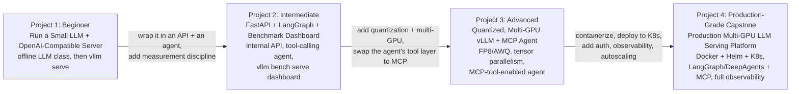
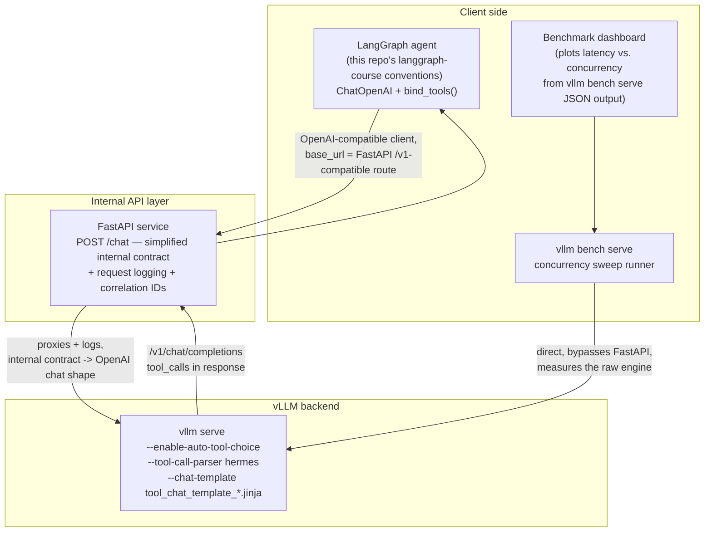
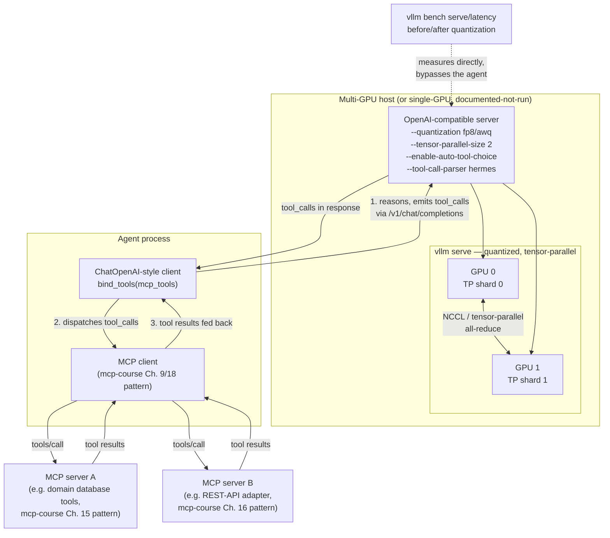
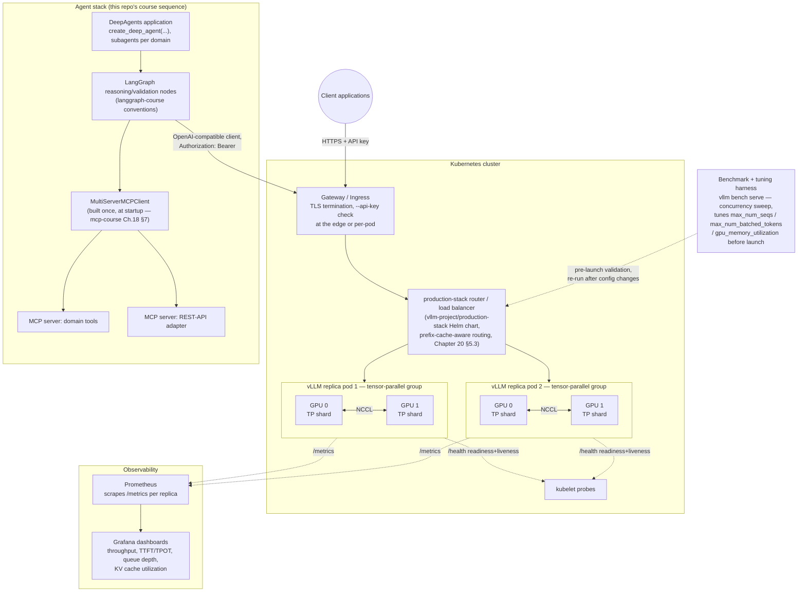

# Capstone Projects

## Learning Objectives

By the end of this chapter, you will be able to:

- Take a small Hugging Face model from a cold checkout to both offline (`LLM` class) and served
  (`vllm serve` + OpenAI-compatible API) inference, verifying the details that trip up first-time users
  (`max_tokens` defaults, model revision pinning).
- Wrap a self-hosted vLLM server behind a small FastAPI service, consume that service from a LangGraph agent
  with tool calling enabled, and build a benchmark dashboard on top of `vllm bench serve` output — tying
  Chapters 4, 16, and 17 together into one working system.
- Serve a quantized, tensor-parallel model and expose it as the model backend for an MCP-tool-enabled agent —
  synthesizing Chapters 13 (quantization), 15 (parallelism), and 16 (tool calling) with this repo's MCP course.
- Design, document, and defend a production-grade, multi-GPU vLLM serving platform: containerized, deployed to
  Kubernetes via Helm, benchmarked and tuned systematically, observable, and consumed by a full
  LangGraph/DeepAgents + MCP agent stack — the capstone the course roadmap explicitly recommends building.
- Read an unfamiliar vLLM deployment (a Dockerfile, a Helm values file, a `vllm serve` invocation) and
  immediately map every flag back to the concept chapter that explains why it's there.
- Judge your own vLLM project against the same rubric used here: correct engine configuration for the
  hardware available, a benchmarking methodology that precedes tuning rather than guessing, an honest security
  posture, and observability that would actually help you at 2 a.m.

---

## Prerequisites for This Chapter

This chapter assumes the **entire course**, Chapters 1–22. It introduces no new vLLM concepts — it is a
synthesis chapter, and every design decision below is a direct application of something a previous chapter
already taught in depth:

- **Chapters 1–3** — prefill/decode, GPU memory fundamentals, the `LLM` class and your first `vllm serve`
- **Chapter 4** — the OpenAI-compatible server: endpoints, `--api-key`, tool calling, structured outputs
- **Chapter 5** — `SamplingParams`, and the `max_tokens` default-16 trap every beginner project below must avoid
- **Chapters 6–9** — KV cache, PagedAttention, continuous batching, the V1 scheduler
- **Chapter 10** — `--gpu-memory-utilization`, `--max-model-len`, `--max-num-seqs`, diagnosing OOM — the memory
  sizing math behind every tier's model choice
- **Chapters 11–12** — prefix caching and chunked prefill (default-on in V1; know what you're benefiting from)
- **Chapter 13** — quantization methods (FP8, AWQ, GPTQ) — the Advanced and Production tiers' core technique
- **Chapter 14** — speculative decoding — an Advanced-tier extension
- **Chapter 15** — tensor/pipeline/data parallelism — the Advanced and Production tiers' multi-GPU story
- **Chapter 16** — tool-call parsers, chat-template pairing, structured outputs, and the LangGraph/MCP/DeepAgents
  integration payoff every tier from Intermediate onward leans on directly
- **Chapters 17–18** — `vllm bench serve/latency/throughput`, the concurrency-sweep methodology, and the
  one-variable-at-a-time tuning discipline the Intermediate dashboard and Production benchmark sweep both use
- **Chapter 19** — the `vllm/vllm-openai` Docker image, GPU passthrough, health checks — the Production tier's
  containerization step
- **Chapter 20** — auth, rate limiting, `production-stack`, Kubernetes GPU scheduling, `/metrics`/`/health`,
  autoscaling signals — the entire backbone of the Production-Grade Capstone
- **Chapter 21–22** — best practices and the pitfall catalog; this chapter's Best Practices sections point back
  to specific pitfalls rather than repeating them from scratch

If any of this feels shaky, go back to the named chapter — this chapter piece it together, it doesn't re-teach
it.

This chapter also assumes you've built (or at least read closely) the sibling courses in this repo —
`AI-ML/langchain-core-course`, `AI-ML/langgraph-course`, `AI-ML/mcp-course`, and `AI-ML/deepagents-course`.
The Advanced and Production-Grade projects put a vLLM-served model behind that agent stack; they do not
re-teach what a `StateGraph`, an MCP server, or a DeepAgents subagent is.

---

## Why Four Tiers, and How to Use Them

The four projects below are graded in difficulty and each **absorbs and extends** the one before it. The
**Beginner** project gets a model talking, offline and served, with nothing else in the way. The
**Intermediate** project puts a real internal API and a real agent in front of that server, plus the
measurement discipline (a benchmark dashboard) this course insists on before any tuning claim. The
**Advanced** project adds the two hardest engine-level levers — quantization and multi-GPU parallelism — and
makes the served model the "brain" of an MCP-tool-using agent. The **Production-Grade Capstone** is the
synthesis: every concern from every earlier chapter, deployed the way a real platform team would deploy it,
consumed by the full agent stack this repo has been building toward across five courses.

You do not have to build all four to get value from this chapter — reading each Implementation Plan closely,
even without GPU access, will surface gaps in how you'd approach your own vLLM deployment. But if you have the
hardware, build them in order.



---

## Project 1 (Beginner): Run a Small LLM with vLLM + OpenAI-Compatible Local Server

### Requirements

Two milestones, one project, no network dependency beyond the initial model download:

- **Milestone A — Offline inference.** Install vLLM, load a small Hugging Face model with the `LLM` class
  (`facebook/opt-125m` is a good first choice: it's tiny, downloads in seconds, and needs no gated-model
  access), and generate text with explicit `SamplingParams`.
- **Milestone B — Local server.** Launch the *same* model with `vllm serve`, then hit the running server two
  ways: `curl` against `/v1/chat/completions` (or `/v1/completions` for a base, non-instruction-tuned model
  like `opt-125m`), and the official `openai` Python SDK pointed at the local base URL.
- Single-process, single-GPU scope (or CPU-fallback where the platform supports it — Chapter 2 §"Hardware
  backends," `CpuPlatform`) — no parallelism, no auth, no containerization. This project exists purely to
  build the muscle memory of "install → load → generate → serve → call" before anything else gets added.

### Architecture

A single host, a single process at a time (offline script, then separately the server process), no network
topology beyond localhost:

```
┌─────────────────────────────────────────────────────────────┐
│  Local machine (1 GPU, or CPU fallback)                      │
│                                                                │
│  Milestone A:  python offline_infer.py                        │
│    └── vllm.LLM(model="facebook/opt-125m") ── SamplingParams   │
│                                                                │
│  Milestone B:  vllm serve facebook/opt-125m --served-model-name│
│                small-opt --port 8000                           │
│    └── OpenAI-compatible HTTP server on :8000                  │
│          /v1/chat/completions  /v1/completions                 │
│          /v1/models  /health  /metrics                          │
│                                                                │
│         curl :8000/v1/completions   ──┐                        │
│         openai Python SDK client()  ──┴──►  same server         │
└─────────────────────────────────────────────────────────────┘
```

### Folder Structure

```
small-llm-vllm/
├── offline_infer.py          # Milestone A: LLM class, SamplingParams, prints completions
├── serve_commands.md         # exact vllm serve invocations used (kept as a runbook, not code)
├── client_curl.sh            # Milestone B: curl against /v1/completions
├── client_openai_sdk.py      # Milestone B: openai Python SDK against the local server
├── streaming_client.py       # extension: SSE streaming through the openai SDK
├── requirements.txt          # vllm, openai
└── README.md
```

### Implementation Plan

1. **Install vLLM** following Chapter 3's preferred path: `uv pip install vllm --torch-backend=auto` (or
   `pip install vllm --extra-index-url https://download.pytorch.org/whl/cu129` on a plain pip setup). Confirm
   the install with `python -c "import vllm; print(vllm.__version__)"` — treat whatever version this prints as
   an illustration, not a claim about "the current version" (fact sheet §1).
2. **Write `offline_infer.py`** using the confirmed `LLM` constructor kwargs (fact sheet §2):
   ```python
   from vllm import LLM, SamplingParams

   llm = LLM(model="facebook/opt-125m", dtype="auto", gpu_memory_utilization=0.9)
   params = SamplingParams(temperature=0.7, top_p=0.9, max_tokens=128)  # explicit max_tokens — see Best Practices
   outputs = llm.generate(["The capital of France is", "In machine learning, a tensor is"], params)
   for out in outputs:
       print(out.outputs[0].text)
   ```
3. **Pin the model revision.** Pass a specific commit hash or tag via the model's revision if the loader
   supports it for your chosen model, or at minimum record the exact HF repo ID and the date you pulled it in
   `README.md` — a silently-updated model weights repo is a real reproducibility hazard (Best Practices below).
4. **Run Milestone A** and confirm you get 128-token completions, not the 16-token default — this is the
   single most common first-run surprise (fact sheet §4: `max_tokens` defaults to 16).
5. **Launch the server** (Milestone B):
   ```bash
   vllm serve facebook/opt-125m --served-model-name small-opt --port 8000
   ```
   Note the `--served-model-name` alias (fact sheet §3) — the client refers to the model as `small-opt`
   regardless of the underlying HF repo ID, which matters the moment you swap models later without touching
   client code.
6. **Confirm the server is alive** with the unauthenticated `/health` endpoint (`curl localhost:8000/health`)
   before attempting any completion calls — this endpoint exists precisely so you don't have to guess whether
   startup finished (fact sheet §3).
7. **Call it with `curl`**, explicitly passing `max_tokens` again (the server-side request default mirrors the
   `SamplingParams` default):
   ```bash
   curl localhost:8000/v1/completions \
     -H "Content-Type: application/json" \
     -d '{"model": "small-opt", "prompt": "The capital of France is", "max_tokens": 64}'
   ```
8. **Call it with the `openai` Python SDK**, pointed at the local server (no real API key needed since this
   server has no `--api-key` yet):
   ```python
   from openai import OpenAI

   client = OpenAI(base_url="http://localhost:8000/v1", api_key="not-needed")
   resp = client.completions.create(model="small-opt", prompt="In machine learning, a tensor is", max_tokens=64)
   print(resp.choices[0].text)
   ```
9. **Check `/v1/models`** to see `small-opt` listed as the only available model — confirming the
   `--served-model-name` alias took effect end-to-end.
10. **Write down what you saw**, including one deliberate failure: try starting the server with no
    `--served-model-name` and note the raw HF repo ID that appears in `/v1/models` instead, so the alias's
    practical effect is unambiguous.

### Best Practices

- **Always set `max_tokens` explicitly**, in both `SamplingParams` and the request body — the default of 16 is
  the single most common source of "why is my output truncated" confusion for first-time vLLM users (fact
  sheet §4, Chapter 5, Chapter 22 Pitfall 2).
- **Pin the model revision/commit you tested against.** A generic HF repo ID like `facebook/opt-125m` is stable
  in practice, but as a habit for every project going forward, record the exact revision or a content hash of
  the weights you validated against — reproducibility problems compound as projects get more complex.
- **Check `/health` before assuming the server is ready** — especially for larger models where weight loading
  takes real time; a request that arrives before the server is fully up fails in a way that's easy to
  misdiagnose as a client bug.
- **Verify `dtype="auto"` picked what you expect** — print `llm.llm_engine.model_config.dtype` (or the
  equivalent for your installed version) once, so "auto" isn't a black box the first time you use it.
- **Use `--served-model-name` from the start**, even on a single-model beginner project — it costs nothing and
  it's the exact mechanism the Intermediate project's alias-based multi-model extension builds on.

### Extensions and Improvements

- **Add streaming.** Rewrite `client_openai_sdk.py` with `stream=True` and iterate the SSE chunks — standard
  OpenAI streaming semantics, a long-stable vLLM feature (fact sheet §3).
- **Try a second small model** (e.g., a small instruction-tuned model so `/v1/chat/completions` — not just
  `/v1/completions` — becomes meaningful) and compare `/v1/models` output and response shape.
- **Add `--served-model-name` with multiple aliases** (`--served-model-name small-opt opt-125m-base`) and
  confirm both names route to the same underlying model.
- **Try CPU-only inference** if you don't have a CUDA GPU handy, using vLLM's `CpuPlatform` backend (Chapter 2)
  — a useful exercise in seeing the same `LLM`/`vllm serve` surface work, just slower, on different hardware.

---

## Project 2 (Intermediate): FastAPI + LangGraph + Benchmark Dashboard

### Requirements

One small internal platform, three pieces working together:

- **A `vllm serve` backend** — an instruction-tuned small/mid model with tool calling enabled
  (`--enable-auto-tool-choice --tool-call-parser <name>`, paired with the matching `--chat-template`, fact
  sheet §3).
- **A FastAPI service** in front of that backend — not a pass-through proxy, but a thin internal API adding
  request logging, a simplified/internal contract (e.g., `POST /chat` taking `{"user_id", "message"}` instead
  of the full OpenAI chat-completions shape), and a place to add auth/rate limiting later without touching the
  agent code that calls it.
- **A LangGraph agent** (reference this repo's `langgraph-course` conventions — `StateGraph`, tool-calling
  nodes, Chapter 8 of that course — rather than re-teaching LangGraph here) that talks to the model through the
  OpenAI-compatible interface with tool calling enabled, calling at least one real tool (e.g., a calculator or
  a small lookup function).
- **A benchmark dashboard** built on `vllm bench serve` output (fact sheet §13, Chapter 17) that plots latency
  (TTFT, TPOT) vs. concurrency — the measurement discipline this course insists on before any tuning claim
  (Chapter 17–18).

### Architecture



### Folder Structure

```
fastapi-langgraph-vllm/
├── vllm_backend/
│   └── serve_commands.md        # exact vllm serve invocation, model + tool-parser + chat-template pairing
├── api/
│   ├── main.py                    # FastAPI app: POST /chat, GET /health
│   ├── schemas.py                   # ChatRequest/ChatResponse — the simplified internal contract
│   ├── vllm_client.py                 # thin wrapper: openai.OpenAI client pointed at vllm serve
│   ├── logging_middleware.py            # structured request logging, correlation-id injection
│   └── config.py                          # VLLM_BASE_URL, MODEL_NAME, LOG_LEVEL
├── agent/
│   ├── graph.py                  # StateGraph: reason -> tool_call -> reason -> answer (langgraph-course pattern)
│   ├── tools.py                    # one or two real tools (calculator, lookup)
│   └── run_agent.py                  # entrypoint, base_url pointed at the FastAPI service
├── benchmarks/
│   ├── run_sweep.sh              # loop: vllm bench serve at concurrency 1, 2, 4, 8, 16, 32
│   ├── results/                    # raw JSON output per concurrency level
│   └── dashboard.py                  # loads results/, plots TTFT/TPOT vs. concurrency
├── tests/
│   └── test_vllm_client.py
├── .env
└── pyproject.toml
```

### Implementation Plan

1. **Choose an instruction-tuned model with a documented tool-call parser** — e.g., a Qwen2.5-Instruct-class
   model paired with `--tool-call-parser hermes`, or a Mistral-Instruct model paired with `--tool-call-parser
   mistral` (fact sheet §3). Launch it:
   ```bash
   vllm serve <chosen-model> \
     --enable-auto-tool-choice \
     --tool-call-parser hermes \
     --served-model-name intermediate-agent-model
   ```
   Confirm the parser/chat-template pairing works with a raw `curl` tool-calling request before building
   anything on top of it (Chapter 16 §4.1–§4.2) — many parsers require a specific `--chat-template`, and a
   mismatch here fails silently or produces malformed tool calls rather than a clear error.
2. **Write `api/schemas.py` and `api/vllm_client.py`**: the FastAPI service's `ChatRequest` is deliberately
   simpler than the full OpenAI chat-completions body (`{"user_id": str, "message": str}`), and
   `vllm_client.py` translates that into a proper `openai.OpenAI().chat.completions.create(...)` call against
   `settings.vllm_base_url`.
3. **Write `api/logging_middleware.py`**: log request ID, user_id, model name, latency, and token counts for
   every call — this is the "internal API contract" value-add over a bare reverse proxy, and it is exactly
   the structured-logging habit Chapter 20 §8 asks for, applied here at a much smaller scale.
4. **Wire `api/main.py`**'s `POST /chat` endpoint and a `GET /health` that checks both the FastAPI process and
   (optionally) forwards a check to the backend's own `/health` — don't let the FastAPI layer report healthy
   while the vLLM backend underneath it is down.
5. **Build the LangGraph agent in `agent/graph.py`**, following this repo's `langgraph-course` conventions
   directly (a `StateGraph` with a reasoning node using `ChatOpenAI(base_url=..., api_key="unused").bind_tools([...])`,
   routed to a tool-execution node and back) — point its `base_url` at the FastAPI service's chat endpoint, not
   directly at `vllm serve`, so the agent exercises the internal API layer end to end. Reference
   `langgraph-course` Chapter 8 (tool-calling patterns) rather than re-deriving the pattern here.
6. **Confirm tool calling actually round-trips**: run the agent against a prompt that should trigger the tool,
   and verify the `tool_calls` field on the model's response is populated and the agent correctly executes and
   feeds the result back (Chapter 16 §5.1's `ChatOpenAI` + `bind_tools()` integration payoff).
7. **Write `benchmarks/run_sweep.sh`**, looping `vllm bench serve` across a concurrency series (1, 2, 4, 8, 16,
   32), pointed directly at the `vllm serve` backend (not through FastAPI, so the measurement reflects the
   engine, not the wrapper's overhead) and saving each run's JSON output under `benchmarks/results/` (fact
   sheet §13, Chapter 17 §7's concurrency-sweep methodology):
   ```bash
   for c in 1 2 4 8 16 32; do
     vllm bench serve --model intermediate-agent-model --base-url http://localhost:8000 \
       --num-prompts 200 --max-concurrency "$c" \
       --save-result --result-filename "results/concurrency_${c}.json"
   done
   ```
8. **Write `benchmarks/dashboard.py`**, loading every JSON file in `results/` and plotting TTFT and TPOT (or
   whichever percentile fields your installed version's `vllm bench serve` reports) against concurrency —
   this is Chapter 17 §7's "find the knee" exercise, turned into a reusable, rerunnable dashboard rather than a
   one-off manual read of console output.
9. **Add a second model alias** (extension groundwork): launch the same server with a second
   `--served-model-name` entry (or a second server process on a different port) and confirm the FastAPI layer
   and the dashboard both work unmodified against either alias by config change alone.
10. **Test end to end**: agent → FastAPI → vLLM backend → tool result → agent's final answer, with the
    benchmark dashboard run independently as an operational check, not part of the request path.

### Best Practices

- **Structured logging from day one, even at this scale** — request ID, model name, token counts, and latency
  on every call through the FastAPI layer (Chapter 20 §8) — this is what makes the benchmark dashboard's
  numbers explainable later when they don't match expectations.
- **Pair `--enable-auto-tool-choice` with the correct `--tool-call-parser` and `--chat-template`, always** —
  enabling the flag without the matching parser produces confusing, model-family-specific failures rather than
  a clear error (fact sheet §3, Chapter 16 §4.2, Chapter 22 Pitfall 13).
- **Benchmark the raw engine, not through your wrapper layer** — `vllm bench serve` should point at
  `vllm serve` directly; benchmarking through FastAPI conflates the wrapper's own latency with the engine's,
  and you lose the ability to isolate which layer a regression came from.
- **Don't skip the concurrency sweep** — a single-concurrency benchmark tells you nothing about where the
  service's real operating envelope is; Chapter 17 §7's "knee" only shows up across a range (Chapter 18's
  tuning methodology depends on having this data first).
- **Keep the internal API contract genuinely simpler than the OpenAI shape** — if `ChatRequest` just re-exposes
  every OpenAI field, the FastAPI layer isn't adding anything; the value is in hiding complexity the LangGraph
  agent doesn't need to know about (model name, tool-parser details, base URL).

### Extensions and Improvements

- **Add structured-output validation** on top of the FastAPI contract — request the model produce JSON
  matching a Pydantic schema via `extra_body={"structured_outputs": {"json": schema}}` (fact sheet §3, Chapter
  16 §3), and validate the response against that schema again on the FastAPI side as a belt-and-suspenders
  check.
- **Add a second model behind a second `--served-model-name` alias** (or a second full server) and extend the
  FastAPI layer to route by a `model` field in the request, exercising the alias mechanism as a real routing
  decision rather than a cosmetic label.
- **Add basic auth to the FastAPI layer** (an API key header, checked before any request reaches the vLLM
  backend) as a preview of Chapter 20's much fuller production auth story.
- **Feed the benchmark dashboard's concurrency-sweep results back into the LangGraph agent's own client-side
  timeout configuration** — a genuinely useful, closed-loop exercise: let measured p99 TTFT/TPOT inform what
  timeout the agent's HTTP client should use, instead of guessing a number.
- **Add GPU utilization alongside the latency plot** (Chapter 17 §8), reading `nvidia-smi` samples during the
  same sweep, so the dashboard shows both "how slow" and "how busy the GPU actually was" side by side.

---

## Project 3 (Advanced): Quantized, Multi-GPU vLLM Server as an MCP Agent's Model Backend

### Requirements

A single vLLM deployment combining the two hardest engine-level levers this course covers, exposed as the
model backend behind an MCP-tool-enabled agent:

- **A quantized model** — FP8 (recommended default on modern NVIDIA hardware) or AWQ (a strong choice on
  VRAM-constrained/consumer GPUs), via `--quantization fp8` or `--quantization awq` (fact sheet §10).
- **Tensor parallelism**, `--tensor-parallel-size N` with `N > 1`, if a multi-GPU host is available (fact sheet
  §12). If you only have one GPU, document the multi-GPU command and simulate/describe expected scaling
  behavior rather than fabricating benchmark numbers you didn't actually measure — label anything you couldn't
  run as "documented, not run on this hardware."
- **An MCP-tool-enabled agent** where the quantized, tensor-parallel vLLM server is the "brain": the model
  reasons and issues tool calls (fact sheet §3, `--enable-auto-tool-choice` + matching parser/chat-template),
  and an MCP client (reference this repo's `mcp-course` — `MultiServerMCPClient` from its Chapter 18, or a
  direct `ClientSession` from its Chapter 9 — rather than re-teaching MCP here) dispatches those calls to one
  or more MCP servers.
- **Before/after quantization benchmarking**, following Chapter 13's methodology exactly: the same prompt set,
  the same concurrency levels, run once against the unquantized model and once against the quantized one, using
  `vllm bench serve`/`vllm bench latency`.

### Architecture



### Folder Structure

```
quantized-mp-mcp-agent/
├── vllm_backend/
│   ├── serve_unquantized.md      # baseline command, for the before/after comparison
│   ├── serve_quantized.md          # vllm serve <model> --quantization fp8 --tensor-parallel-size 2 ...
│   └── quantize_notes.md             # how the FP8/AWQ checkpoint was produced or sourced
├── mcp_servers/
│   ├── domain_server/                # follows mcp-course Ch. 7/15 layout — not re-derived here
│   │   ├── server.py
│   │   ├── tools/
│   │   └── services/
│   └── rest_adapter_server/            # follows mcp-course Ch. 16 layout
│       ├── server.py
│       ├── tools/
│       └── services/
├── agent/
│   ├── mcp_client.py             # builds the MCP client(s), mcp-course conventions
│   ├── model_client.py             # ChatOpenAI-style client against the quantized vllm serve backend
│   ├── graph.py                      # LangGraph/DeepAgents wiring — reasoning node calls MCP tools
│   └── run_agent.py
├── benchmarks/
│   ├── run_before_after.sh       # same prompt set/concurrency, unquantized then quantized
│   └── results/
│       ├── unquantized/
│       └── quantized/
├── tests/
│   └── test_tool_call_parser_pairing.py
├── .env
└── pyproject.toml
```

### Implementation Plan

1. **Establish the unquantized baseline first.** Launch the target model with `--tensor-parallel-size 1` (or
   whatever N you'll use later), no `--quantization` flag, and run `vllm bench serve`/`vllm bench latency`
   against it (fact sheet §13). This is the "before" half of Chapter 13's before/after methodology — don't skip
   straight to the quantized deployment and assume the improvement without a measured baseline.
2. **Quantize or source a pre-quantized checkpoint.** For FP8, many current checkpoints are published
   pre-quantized on the Hub; for AWQ, similarly. Record in `quantize_notes.md` exactly which checkpoint/process
   you used — quantization-method provenance matters for reproducing results later.
3. **Serve the quantized model with `--tensor-parallel-size` > 1 if hardware allows**:
   ```bash
   vllm serve <quantized-model-repo-or-path> \
     --quantization fp8 \
     --tensor-parallel-size 2 \
     --enable-auto-tool-choice \
     --tool-call-parser hermes \
     --served-model-name advanced-agent-model
   ```
   If you only have one GPU, run and document the single-GPU quantized case (`--tensor-parallel-size 1
   --quantization fp8`), and separately write out the multi-GPU command you would run, explicitly labeled
   "documented, not benchmarked on this hardware" rather than inventing numbers (fact sheet §12).
4. **Validate the tool-call parser/chat-template pairing on the quantized server independently of the agent** —
   a raw `curl` tool-calling request first, exactly as in Project 2 step 1, since quantization changing the
   model's output distribution slightly is a real reason to re-verify this pairing rather than assume it still
   works identically (Chapter 16 §4.2, Chapter 22 Pitfall 13).
5. **Run the "after" benchmark**: the same prompt set, the same concurrency series as step 1, against the
   quantized (and tensor-parallel, if applicable) server. Compare throughput, TTFT, and TPOT side by side —
   this is Chapter 13's core lesson: quantization is a VRAM/quality/throughput trade-off you measure, not
   assume.
6. **Stand up the MCP server(s)** following this repo's `mcp-course` conventions exactly — a domain-specific
   tools server (mcp-course Chapter 15's pattern) and/or a curated REST-API adapter server (mcp-course Chapter
   16's pattern). Do not re-derive MCP primitives here; reuse or adapt an existing mcp-course project directly.
7. **Build `agent/model_client.py`**: an OpenAI-compatible client (`ChatOpenAI` if using LangChain/LangGraph
   conventions, or a raw `openai.OpenAI()` client) pointed at the quantized vLLM server's base URL, with
   `bind_tools()` populated from the MCP server's advertised tool schemas (mcp-course Chapter 17/18's
   MCP-to-LangChain tool adapter pattern).
8. **Build `agent/mcp_client.py` and `agent/graph.py`**: construct the MCP client once (mcp-course Chapter 18
   §7's "build it once" rule applies here identically — a quantized model doesn't change this rule), and wire a
   reasoning loop where the vLLM-served model's tool calls are dispatched through the MCP client to the actual
   MCP server(s).
9. **Test the full loop**: a user prompt that requires calling an MCP tool, confirming the quantized model
   correctly emits a well-formed `tool_calls` payload, the MCP client dispatches it, and the tool result is fed
   back into the model's context for a final answer.
10. **Write up the before/after quantization numbers and the tensor-parallel scaling behavior** (measured or
    documented) as the project's benchmark report — this artifact is what Chapter 18's tuning methodology
    calls "the evidence a tuning decision is not a guess."

### Best Practices

- **Benchmark before and after quantization, every time, with the same prompt set and concurrency levels**
  (Chapter 13, Chapter 17) — a quantization method's throughput/quality trade-off is only real once measured on
  your model and your hardware, not assumed from a blog post's numbers.
- **Re-validate the tool-call parser/chat-template pairing after quantizing** — don't assume a pairing that
  worked on the unquantized model still produces well-formed tool calls without checking (Chapter 16 §4.2).
- **Treat undocumented multi-GPU hardware honestly** — if you don't have multiple GPUs, say so explicitly and
  mark the multi-GPU command/expected-scaling section as "documented, not run here" rather than fabricating
  numbers (course-wide convention, echoed in the fact sheet's own version-illustration rule).
- **Build the MCP client once, not per agent turn** — this rule from mcp-course Chapter 18 §7 doesn't change
  just because the model backend is now quantized and tensor-parallel; rebuilding it per request still
  re-spawns subprocesses / re-negotiates HTTP sessions for no reason.
- **Pick the quantization method for your hardware, not by default habit** — FP8 is the commonly cited best
  default on modern NVIDIA hardware; AWQ/GPTQ remain common choices on VRAM-constrained consumer GPUs (fact
  sheet §10) — justify the choice in your write-up rather than picking one arbitrarily.

### Extensions and Improvements

- **Add speculative decoding** on top of the quantized, tensor-parallel server via `--speculative-config`
  (fact sheet §11), e.g. `{"method": "ngram", "num_speculative_tokens": 4, "prompt_lookup_min": 2,
  "prompt_lookup_max": 5}` for a draft-model-free approach, and benchmark its effect on TPOT specifically.
- **Compare two quantization methods head-to-head** (e.g., FP8 vs. AWQ on the same model) using the identical
  before/after benchmarking harness from steps 1 and 5, turning this project into a genuine quantization-method
  comparison rather than a single before/after pair.
- **Swap the hand-wired agent loop for a DeepAgents `create_deep_agent(...)`** (this repo's `deepagents-course`),
  using its `interrupt_on` mechanism to gate any destructive MCP tool, mirroring the pattern the mcp-course
  capstone uses for its Enterprise MCP Gateway.
- **Add a second MCP server and confirm tool-name disambiguation** across both servers before wiring them into
  the same agent (mcp-course Chapter 10 §4.2's uniqueness discipline) — a good rehearsal for the Production
  tier's multi-server MCP setup.

---

## Production-Grade Capstone: Production Multi-GPU LLM Serving Platform

This is the project the course roadmap explicitly recommends as the capstone, and it gets the most depth in
this chapter: it is the synthesis of nearly every chapter in this course — plus this repo's LangChain,
LangGraph, MCP, and DeepAgents courses — into one system that could plausibly run in production.

### Requirements

- **A quantized model** (FP8 or AWQ, Chapter 13), served **tensor-parallel across multiple GPUs**
  (`--tensor-parallel-size N`, Chapter 15) behind the **OpenAI-compatible API** with **`--api-key` auth**
  gating the `/v1/*` routes (fact sheet §3, Chapter 20 §2) and **tool calling + structured outputs enabled**
  (`--enable-auto-tool-choice --tool-call-parser <name>`, `--structured-outputs-config.backend`, Chapter 16).
- **Containerized** with the official `vllm/vllm-openai` Docker image (fact sheet §14, Chapter 19) — GPU
  passthrough via the NVIDIA Container Toolkit, model weights cached on a mounted volume, no secret baked into
  the image.
- **Deployed via the `vllm-project/production-stack` Helm chart** (fact sheet §14, Chapter 20 §9) to Kubernetes
  with GPU scheduling (`nvidia.com/gpu` resource requests/limits).
- **Benchmarked systematically and tuned before launch** (Chapters 17–18): a concurrency sweep on the deployed
  platform, not just a local dev box, followed by one-variable-at-a-time tuning of `--max-num-seqs`,
  `--max-num-batched-tokens`, and `--gpu-memory-utilization` against that measured baseline.
- **Instrumented with `/metrics` Prometheus scraping and `/health` readiness/liveness probes** (fact sheet §3,
  §14, Chapter 20 §6–§7).
- **Consumed by a LangGraph/DeepAgents agent stack using MCP tools** — the full pipeline this repo's course
  sequence has been building toward: LangChain → LangGraph → MCP → DeepAgents → vLLM, all operating together.

### Architecture



> **Note on disaggregated prefill/decode:** the architecture above co-locates prefill and decode on the same
> tensor-parallel replica pods, which is the right default for most deployments. Disaggregated serving
> (separate prefill/decode worker pools connected via a KV-transfer layer — NIXL, Mooncake, or LMCache, fact
> sheet §15) is a real, maturing pattern for very large deployments, treated here as a stretch-goal extension,
> not the platform's default shape.

### Folder Structure

```
production-vllm-platform/
├── docker/
│   ├── Dockerfile.overrides       # if any customization is layered on vllm/vllm-openai; often empty/minimal
│   └── docker-compose.local.yml     # local single-GPU smoke test before touching Kubernetes
├── helm/
│   ├── values-production.yaml    # production-stack Helm values: replica count, TP size, GPU resources
│   ├── values-staging.yaml         # smaller footprint, same shape, for pre-prod validation
│   └── secrets/
│       └── api-key-secret.yaml       # Kubernetes Secret manifest — populated out-of-band, never committed with real values
├── benchmarks/
│   ├── run_sweep.sh              # vllm bench serve concurrency sweep against the deployed platform
│   ├── tune_iterations/            # one directory per tuning iteration, config + results side by side
│   └── results/
├── observability/
│   ├── prometheus-scrape-config.yaml   # ServiceMonitor or static scrape config for /metrics
│   ├── grafana-dashboard.json             # throughput, TTFT/TPOT, queue depth, KV cache utilization panels
│   └── k8s-probes.yaml                      # readiness/liveness probe definitions referencing /health
├── agent/
│   ├── deepagents_app.py         # create_deep_agent(...), subagents, interrupt_on wiring
│   ├── langgraph_nodes.py           # reasoning/validation nodes (langgraph-course conventions)
│   └── model_client.py                # OpenAI-compatible client, --api-key auth, base_url -> production-stack router
├── mcp_servers/
│   ├── domain_server/             # mcp-course Ch. 15 pattern
│   └── rest_adapter_server/         # mcp-course Ch. 16 pattern
├── tests/
│   ├── test_health_and_metrics.py
│   └── integration/
│       └── test_end_to_end_agent_call.py
├── .env.example
└── README.md
```

### Implementation Plan

1. **Quantize/select the model** (Chapter 13): choose FP8 for modern NVIDIA hardware or AWQ for
   VRAM-constrained GPUs, and validate the checkpoint loads correctly with `--quantization <method>` on a
   single GPU before anything else.
2. **Local single-GPU validation** (`docker/docker-compose.local.yml`): run the quantized model in the official
   `vllm/vllm-openai` image on one GPU, confirm `/health`, `/v1/models`, and a tool-calling request all work,
   exactly as in Project 3's single-GPU path.
3. **Tensor-parallel validation**, still local if multiple GPUs are available: add `--tensor-parallel-size N`
   and confirm the server starts, all N GPUs show utilization via `nvidia-smi`, and inference still produces
   correct output — catching any TP-specific misconfiguration before it reaches Kubernetes (Chapter 15).
4. **Dockerize**: confirm the `vllm/vllm-openai` image plus your launch command (model, quantization, TP size,
   `--api-key`, tool-call flags) is fully expressed as container args/env vars, no secret baked into the image
   itself, and GPU passthrough works via the NVIDIA Container Toolkit (`docker run --gpus all`, Chapter 19
   §2–§4).
5. **Helm deploy to a Kubernetes cluster**: add the `production-stack` Helm repo and install with a values file
   requesting the correct `nvidia.com/gpu` resource count per replica (fact sheet §14, Chapter 20 §9):
   ```bash
   helm repo add vllm https://vllm-project.github.io/production-stack
   helm install vllm-platform vllm/vllm-stack -f helm/values-production.yaml
   ```
   Confirm GPU scheduling actually placed each tensor-parallel replica's shards on GPUs within the same node
   (tensor parallelism requires low-latency intra-node interconnect — Chapter 15).
6. **Benchmark sweep and tune before launch** (Chapters 17–18): run `vllm bench serve` concurrency sweeps
   against the *deployed* platform (through the `production-stack` router, not bypassing it), then tune
   `--max-num-seqs`, `--max-num-batched-tokens`, and `--gpu-memory-utilization` one variable at a time,
   re-running the sweep after each change and keeping every iteration's config + results side by side under
   `benchmarks/tune_iterations/` — this is the evidence trail Chapter 18 insists a tuning decision needs.
7. **Wire up monitoring**: confirm Prometheus scrapes every replica's `/metrics` endpoint (unauthenticated per
   fact sheet §3, so no `--api-key` needed for the scrape itself), build Grafana panels for throughput,
   TTFT/TPOT, queue depth, and KV cache utilization (Chapter 20 §7, §10.3), and wire `/health` into Kubernetes
   readiness *and* liveness probes so a stuck-but-alive process gets recycled, not just a fully-crashed one
   (Chapter 20 §6).
8. **Connect the agent stack**: point `agent/model_client.py`'s OpenAI-compatible client at the
   `production-stack` router's URL with `Authorization: Bearer <api-key>`, build the `MultiServerMCPClient`
   once at application startup (mcp-course Chapter 18 §7 — this rule is non-negotiable at every tier of this
   course), wire it into `create_deep_agent(...)` with subagents scoped per MCP-server domain
   (deepagents-course Chapter 8), and gate any destructive MCP tool behind `interrupt_on` (deepagents-course
   Chapter 9).
9. **Load-test end to end**: drive the full path — client → gateway → router → replica pods → agent's MCP tool
   calls — under realistic concurrent load, confirming the platform's measured operating envelope from step 6
   still holds once the agent stack's own overhead (tool-call round trips, MCP dispatch) is included, not just
   the raw engine in isolation.
10. **Document the rollout runbook**: what a canary/rolling deployment looks like for a config change (new
    tuning parameters, a new quantized checkpoint), referencing the stateless-replica design that makes rolling
    Kubernetes deployments safe (Chapter 20 §11 — no in-process session state on any replica, so any replica
    can serve any request).

### Best Practices

- **Size memory before you deploy, not after an OOM.** Use Chapter 10's memory-sizing math (`--max-model-len`,
  `--gpu-memory-utilization`, `--max-num-seqs`) to pick a starting configuration per replica before the first
  Helm install, rather than discovering the right numbers via production incidents.
- **Benchmark on the deployed platform, through the router, before tuning anything.** Chapter 17's methodology
  is explicit: measurement precedes tuning. A concurrency sweep run only against a local dev box doesn't
  capture the router's own overhead or real network conditions between the client and the cluster.
- **Tune one variable at a time, and keep every iteration's config and results.** Chapter 18's core discipline
  — changing `--max-num-seqs` and `--gpu-memory-utilization` simultaneously and then observing a throughput
  change tells you nothing about which change caused it.
- **Build the container correctly the first time.** The official `vllm/vllm-openai` image, a non-root user
  where possible, a cached weights volume (never re-downloading multi-GB weights on every pod restart), and no
  secret baked into the image or a literal env value in a committed manifest (Chapter 19 §3–§4, Chapter 20
  §10).
- **Readiness and liveness are different questions.** A readiness probe answers "should traffic route here
  right now" (useful during slow startup / weight loading); a liveness probe answers "should this process be
  killed and restarted" — wiring both to the same `/health` endpoint is fine, but understand why Kubernetes
  treats them as separate decisions (Chapter 20 §6).
- **Scrape `/metrics` and actually look at queue depth and KV cache utilization**, not just CPU/GPU percent —
  Chapter 20 §10.3's point that CPU utilization is close to meaningless for a GPU-bound LLM service applies
  directly to how you'd build autoscaling triggers for this platform.
- **Build the `MultiServerMCPClient` once, at application startup, never per request** — this exact rule
  appears at every tier of the mcp-course capstone and is restated here because it is the rule most likely to
  be silently violated under deadline pressure, and its cost (subprocess churn, thrown-away connection reuse)
  is invisible until load-testing reveals it.
- **Gate destructive MCP tools by annotation, not blanket approval on every call** — `interrupt_on` scoped to
  specific tools, with the exact resolved arguments shown to the approving human, mirrors the mcp-course
  capstone's Enterprise MCP Gateway pattern exactly (deepagents-course Chapter 9, mcp-course Chapter 14 §17).

### Extensions and Improvements

- **Disaggregated prefill/decode serving** (fact sheet §15) as a stretch goal: separate prefill-heavy and
  decode-heavy worker pools connected via a KV-transfer layer (NIXL, Mooncake, or LMCache), for deployments
  large enough that prefill/decode contention on the same GPUs becomes the dominant bottleneck — present this
  as an advancing, evolving production pattern, not a turnkey feature to flip on by default.
- **Autoscaling based on queue depth** rather than CPU utilization (Chapter 20 §10.3), using a custom metric
  adapter feeding `/metrics`' queue-depth signal into a Kubernetes `HorizontalPodAutoscaler` or KEDA scaler.
- **Multi-model serving with `--served-model-name` aliases**, extending the `production-stack` router to route
  by model name across genuinely different underlying models/replica groups, not just alias labels on one
  model.
- **Canary rollout strategy**: route a small percentage of traffic to a new quantized checkpoint or a new
  tuning configuration before a full rollout, using the platform's already-stateless replica design (no
  in-process session state) to make partial rollouts safe by construction.
- **Speculative decoding at the platform level** (fact sheet §11) as a further latency-reduction lever once the
  tensor-parallel, quantized baseline is stable and benchmarked.

---

## Real-World Scenario

A mid-sized SaaS company currently pays a hosted-LLM-API vendor per token for a customer-support copilot built
on this repo's LangGraph + MCP stack. Two problems force a change: data residency (support tickets contain
customer PII that legal wants kept in-region) and cost (usage has scaled past the point where self-hosting
pencils out). The team is asked to stand up a self-hosted replacement with equivalent latency and tool-calling
behavior, in production, within a quarter.

This is exactly the Production-Grade Capstone's shape: pick a quantized open model close enough in capability
to the vendor model they're replacing, validate it single-GPU and then tensor-parallel, containerize and Helm
deploy behind auth and `/metrics`/`/health`, benchmark and tune against the SLA the vendor used to guarantee
(a concurrency sweep tells them the real max safe concurrency per replica, not a guess), and swap the
LangGraph/MCP agent's `base_url` and API key from the vendor's endpoint to their own `production-stack` router
— with the entire agent codebase downstream of that one client config otherwise unchanged, because it was built
against the OpenAI-compatible interface from the start (Chapter 4, Chapter 16 §5). The migration risk is almost
entirely contained to steps 1–7 of the Implementation Plan above; step 8 (connecting the already-built agent
stack) is close to a one-line config change precisely because the agent was never written against a
vendor-specific SDK.

---

## Best Practices Across All Four Tiers

- **Never skip the offline `LLM`-class sanity check**, even when the end goal is a full production platform —
  Project 1's milestone A is the fastest way to confirm a model loads and generates correctly before any
  server, container, or Helm chart adds its own layer of things that could go wrong.
- **Set `max_tokens` explicitly, everywhere, at every tier** — this default-16 trap doesn't stop mattering once
  a project gets more sophisticated (fact sheet §4).
- **Pair every `--enable-auto-tool-choice` with the matching `--tool-call-parser` and `--chat-template`** — this
  requirement doesn't relax as a deployment gets more complex; if anything, verify it more carefully after
  quantizing a model, since output distribution shifts are a real reason a previously-working pairing might
  need re-validation.
- **Measure before you tune, at every scale** — a beginner project doesn't need `vllm bench serve`, but from
  the Intermediate tier onward, every tuning claim in this chapter traces back to a concurrency sweep someone
  actually ran, not an assumption.
- **Build MCP/LangGraph clients once, at the right scope (agent build time / application startup), never per
  request** — restated at the Advanced and Production tiers because it is the single rule most likely to be
  silently violated under deadline pressure.
- **Be honest about what you didn't measure.** If you don't have multi-GPU hardware, say the multi-GPU section
  is documented, not benchmarked, rather than inventing scaling numbers.

## Common Mistakes to Avoid

- **Forgetting `--served-model-name`** and then hardcoding the raw HF repo ID into client code — the alias
  exists precisely so a later model swap doesn't require touching every caller.
- **Benchmarking through a wrapper layer** (FastAPI, an agent's own retry logic) and attributing the measured
  latency entirely to the vLLM engine — isolate the engine's own numbers first, then layer the wrapper's
  overhead on top as a separate, explicitly labeled measurement.
- **Quantizing without a baseline** — running only the quantized configuration and asserting "this is faster"
  without ever having measured the unquantized version on the same hardware, same prompts, same concurrency.
- **Changing multiple tuning flags at once** (`--max-num-seqs` and `--gpu-memory-utilization` in the same
  iteration) and losing the ability to attribute a throughput change to either one specifically.
- **Treating `/health` and `/metrics` as gated by `--api-key`** — they are explicitly not gated (fact sheet §3);
  don't build a Prometheus scrape config that tries to pass an API key it doesn't need, and don't assume an
  unauthenticated `/health` check is itself a security hole — it's designed to be reachable.
- **Rebuilding an MCP client or a LangGraph agent's tool-bound model per request** instead of once at startup —
  this single mistake, repeated across the Advanced and Production tiers, is responsible for most of the
  "why is my agent so slow under load" surprises this course sequence warns about.

---

## Summary

- The four projects in this chapter are graded and cumulative: **Beginner** establishes the offline/served
  fundamentals; **Intermediate** adds a real internal API, a real tool-calling LangGraph agent, and the
  benchmark-dashboard measurement discipline; **Advanced** adds quantization, tensor parallelism, and an
  MCP-tool-using agent with the served model as its "brain"; **Production-Grade Capstone** synthesizes every
  concern — Docker, Helm/Kubernetes, systematic benchmarking and tuning, observability, and a full
  LangGraph/DeepAgents + MCP agent stack — into one deployable platform.
- Every tier reuses the same non-negotiable habits from earlier chapters: explicit `max_tokens`, correct
  tool-call parser/chat-template pairing, measurement before tuning, and building agent-side clients once
  rather than per request.
- The OpenAI-compatible interface (Chapter 4) is what makes the agent stack (Chapters covered in
  `langchain-core-course`, `langgraph-course`, `mcp-course`, `deepagents-course`) portable across the Beginner
  through Production tiers with almost no code change downstream of the model client's `base_url` and
  `api_key`.
- Quantization (Chapter 13) and parallelism (Chapter 15) are the two engine-level levers that turn a
  single-GPU beginner deployment into a production-capable one — and both are only trustworthy once measured
  before and after, per Chapter 17's methodology.
- Production readiness (the capstone) is the sum of previously-isolated chapters operating together: memory
  sizing (Chapter 10), Docker (Chapter 19), Kubernetes/Helm/auth/observability (Chapter 20), and a systematic
  benchmark-then-tune loop (Chapters 17–18) — not a single new technique, but the disciplined combination of
  everything the course already taught.

---

## Knowledge Check

1. In Project 1, what specifically goes wrong if a beginner forgets to pass `max_tokens` to `SamplingParams`,
   and why does the same mistake matter just as much in a request body sent to a running `vllm serve` server?
2. Project 2's benchmark dashboard runs `vllm bench serve` directly against the `vllm serve` backend rather
   than through the FastAPI layer. Why does that choice matter for what the resulting latency numbers actually
   mean?
3. Why must a tool-call parser (`--tool-call-parser`) always be paired with a specific, matching
   `--chat-template`, and why does Project 3 insist on re-validating that pairing *after* quantizing the model
   rather than assuming it still holds?
4. Tensor parallelism (`--tensor-parallel-size`) requires GPUs within the same tensor-parallel group to
   communicate with low latency. What does this imply about how a Kubernetes scheduler must place a
   multi-GPU vLLM replica pod's shards, and what would go wrong if it didn't?
5. Why does the Production-Grade Capstone's implementation plan insist on running the benchmark sweep against
   the *deployed* Kubernetes platform, through the `production-stack` router, rather than trusting the
   single-GPU local numbers from an earlier validation step?
6. The capstone's agent stack builds its `MultiServerMCPClient` once, at application startup. What two concrete
   costs would appear under production load if it were instead built inside the request handler that serves
   each user message?

---

## Hands-On Exercise

Pick the tier that matches your current access to GPU hardware, and build it end to end rather than only
reading the Implementation Plan:

- **No GPU, or a single modest GPU:** build Project 1 in full, then build Project 2's FastAPI + LangGraph
  pieces against that same small model — the benchmark dashboard and tool-calling agent don't require a large
  model to demonstrate the pattern correctly.
- **One capable GPU (e.g., a single 24GB+ consumer or datacenter card):** build Project 3's quantization half
  in full (FP8 or AWQ on a mid-sized model), document the multi-GPU tensor-parallel command without running it,
  and wire up the MCP agent against your single-GPU quantized server.
- **Multiple GPUs, one node:** build Project 3 in full, including the tensor-parallel measurement, and treat
  the Production-Grade Capstone's Docker + local-Kubernetes (`kind`/`minikube`) steps as a reachable stretch
  goal even without a full production cluster.
- **A real Kubernetes cluster with GPU nodes available:** build the Production-Grade Capstone in full,
  following its ten-step Implementation Plan in order, and produce the tuning-iteration evidence trail
  (`benchmarks/tune_iterations/`) as the artifact that would let a reviewer verify your configuration wasn't
  guessed.

Whichever tier you build, write down one thing that didn't work the way the Implementation Plan implied it
would — that gap is usually the most valuable thing you'll learn from the exercise.

---

## Further Reading

- Related chapter in this course: [Chapter 4 — The OpenAI-Compatible Server](./04-openai-compatible-server.md)
  — the endpoints, auth, and tool-calling surface every project in this chapter builds on
- Related chapter in this course: [Chapter 10 — Memory Management](./10-memory-management.md) — the sizing math
  behind every tier's model and flag choices
- Related chapter in this course: [Chapter 13 — Quantization](./13-quantization.md) — the FP8/AWQ/GPTQ methods
  and before/after benchmarking methodology the Advanced and Production tiers depend on
- Related chapter in this course: [Chapter 15 — Parallelism](./15-parallelism.md) — tensor parallelism, the
  Advanced and Production tiers' multi-GPU story
- Related chapter in this course: [Chapter 16 — Structured Outputs & Tool Calling](./16-structured-outputs-and-tool-calling.md)
  — parser/chat-template pairing and the LangGraph/MCP/DeepAgents integration payoff referenced at every tier
  from Intermediate onward
- Related chapter in this course: [Chapter 17 — Benchmarking](./17-benchmarking.md) and
  [Chapter 18 — Performance Tuning](./18-performance-tuning.md) — the `vllm bench` CLI and the
  measure-then-tune methodology the Intermediate dashboard and Production benchmark sweep both use
- Related chapter in this course: [Chapter 19 — Docker](./19-docker.md) and
  [Chapter 20 — Production Serving](./20-production-serving.md) — containerization, auth, `production-stack`,
  Kubernetes GPU scheduling, and observability, the backbone of the Production-Grade Capstone
- This repo's [LangGraph course](../langgraph-course/00-index.md), [MCP course](../mcp-course/00-index.md), and
  [DeepAgents course](../deepagents-course/00-index.md) — the agent-stack conventions referenced throughout the
  Intermediate, Advanced, and Production tiers, deliberately not re-taught in this chapter
- `docs.vllm.ai/en/latest/features/tool_calling.html` — the current, complete tool-call-parser list and
  required chat templates
- `docs.vllm.ai/en/latest/features/quantization/` — current supported quantization methods and per-method
  guidance
- `docs.vllm.ai/en/latest/cli/bench/serve.html` — current `vllm bench serve` CLI reference
- `github.com/vllm-project/production-stack` — the Kubernetes/Helm deployment path used in the
  Production-Grade Capstone
- `github.com/vllm-project/vllm/releases` — always check current release notes before trusting any specific
  flag/default described in this chapter

---

<div style="display:flex;justify-content:space-between;align-items:center;">
  <a href="./22-common-mistakes-and-pitfalls.md">← Previous: Common Mistakes & Pitfalls</a>
  <a href="./00-index.md">🏠 Index</a>
  <a href="./24-interview-preparation.md">Next: Interview Preparation →</a>
</div>
