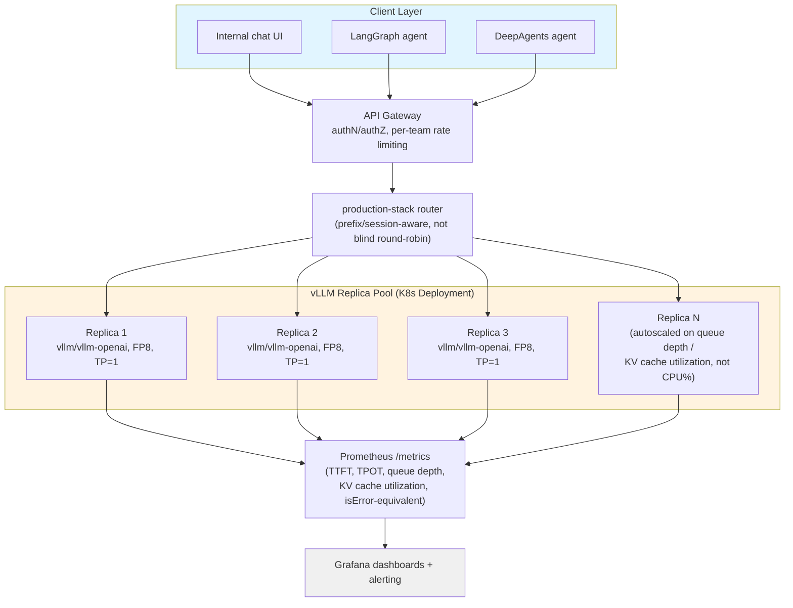

# Interview Preparation

Every prior chapter in this course taught you a mechanism — why decode is memory-bandwidth-bound, how PagedAttention eliminates fragmentation, how the V1 scheduler unifies prefill and decode admission, why a naive round-robin load balancer quietly kills your prefix-cache hit rate. This chapter has a different job: it rehearses that knowledge in the exact shapes an interviewer, a design panel, or an on-call incident will actually demand it — a rapid-fire question, an ambiguous "how would you decide," a whiteboard system design, or a broken deployment someone hands you and says "figure out why." Nothing below is new material. Every answer is a compressed pointer back to a chapter you've already worked through, phrased the way you should say it out loud: precise about what's confirmed current behavior versus what changed recently, honest about trade-offs, and quick to cite a specific mechanism — a flag name, a default value, a scheduler behavior — rather than a vague gesture at "best practices."

One framing worth internalizing before you read further: vLLM ships a new minor release roughly every two weeks, and it has already been through one full architectural rewrite (V0 → V1). An interviewer who works with vLLM day to day knows this, and the strongest possible signal you can send in this domain is not reciting a flag name from memory — it's demonstrating that you know *which facts are stable* (PagedAttention's block-based design, the prefill/decode compute-vs-bandwidth distinction, continuous batching's iteration-level admission) versus *which facts you'd verify before shipping* (the exact current list of `--tool-call-parser` values, whether a specific flag still parses, this week's default for a config knob). This chapter models that distinction explicitly, the same way the rest of the course has.

## Learning Objectives

By the end of this chapter, you will be able to:

- Answer the core questions interviewers ask most often about vLLM's architecture, memory management, batching, scheduling, quantization, parallelism, and production operations — each with a precise, defensible model answer
- Reason through realistic "how would you decide" scenarios involving mixed workloads, degraded latency under nominal GPU utilization, VRAM-constrained large-model serving, broken tool calling, and multi-replica cache locality
- Whiteboard a complete system design for a production LLM serving platform — model/precision choice, memory budgeting, parallelism, benchmarking, deployment, observability, and scaling — starting from a one-sentence prompt, and defend it against follow-up probes
- Diagnose five realistic categories of broken vLLM deployments using a direct, escalating diagnostic discipline rather than guessing
- Recognize the shape of real production vLLM incidents and articulate the specific chapter-grounded fix each one implies
- Correct, on sight, the handful of vLLM misconceptions that come up most often in real conversations: that V0 still exists as a fallback, that `best_of` is still a `SamplingParams` field, that `guided_json` is the current structured-output request shape, and that GGUF is vLLM's recommended production quantization path

---

## Prerequisites

This is a synthesis chapter — it introduces no new mechanism, flag, or API shape that wasn't already covered. It assumes you have completed the entire course, Chapters 1 through 23, and treats every one of them as background:

- **Chapters 1–2** — prefill vs. decode, TTFT/TPOT/ITL, throughput-vs-latency, and why decode is memory-bandwidth-bound while prefill is compute-bound
- **Chapter 3** — the `LLM` class, `vllm serve`, offline vs. online inference
- **Chapter 4** — the OpenAI-compatible server, endpoints, `/health`/`/metrics`
- **Chapter 5** — `SamplingParams`, including the `max_tokens` default-16 gotcha and `best_of`'s removal
- **Chapters 6–9** — KV cache fundamentals, PagedAttention, continuous batching, and the V1 unified scheduler (including recompute-based preemption)
- **Chapters 10–12** — memory management flags, prefix caching, and chunked prefill
- **Chapters 13–14** — quantization method trade-offs and speculative decoding
- **Chapter 15** — tensor, pipeline, data, and expert parallelism
- **Chapter 16** — structured outputs (`structured_outputs`/`--structured-outputs-config.backend`) and tool-call parsers
- **Chapters 17–18** — `vllm bench`, the concurrency sweep, and the one-variable-at-a-time tuning methodology
- **Chapters 19–20** — Docker, Kubernetes, `production-stack`, autoscaling signals
- **Chapters 21–23** — the best-practices synthesis, the pitfall catalog, and the capstone projects this chapter's scenarios draw from

If any bullet above feels shaky, this chapter will expose it — that's the point of an interview-prep chapter — but it will not re-teach the underlying material. Go back to the cited chapter, not to this one, to close a real gap.

---

## Frequently Asked Interview Questions

Each question below is written the way it actually gets asked — often less precisely than the chapter that answers it — followed by a model answer you could say almost verbatim.

### 1. "What is PagedAttention and why does it matter?"

**Model answer:** Before PagedAttention, serving engines allocated each sequence's KV cache as one contiguous slab of GPU memory, sized for the sequence's *worst-case* length. That has the same failure mode as early, non-virtual-memory operating systems: internal fragmentation (a slab reserved for 2048 tokens but the sequence only ever uses 300 wastes the rest for that sequence's whole lifetime) and external fragmentation (free memory scattered in slab-sized holes that can't be reused for a differently-sized request), plus no way to share memory between sequences that happen to share content.

PagedAttention, from Kwon et al.'s SOSP 2023 paper ("Efficient Memory Management for Large Language Model Serving with PagedAttention"), borrows the OS virtual-memory idea directly: KV cache is stored in fixed-size **blocks** (default 16 tokens per block), allocated on demand as a sequence grows, and a per-sequence block table maps logical token positions to physical blocks — which don't need to be contiguous. That eliminates external fragmentation entirely and caps internal fragmentation to, at most, one partially-filled block per sequence. It's also what makes prefix caching and copy-on-write sharing possible at all (Chapter 11) — sharing a *block*, not a whole contiguous allocation, is only coherent once memory is already block-structured. The original paper reported 2–4x throughput improvement over FasterTransformer/Orca-style baselines, and it's the single idea that made high-concurrency, memory-efficient LLM serving practical.

**A correction worth volunteering unprompted:** an old changelog entry about a "removed legacy attention implementation" sometimes gets misread as "vLLM removed PagedAttention." That's wrong — it refers to a V0-era standalone attention *kernel* being deleted. Paging and block-structured KV cache remain foundational to V1; every current attention backend (FlashAttention, FlashInfer, etc.) still operates on the paged KV cache.

### 2. "What's the difference between throughput and latency in LLM serving, and when do you optimize for each?"

**Model answer:** They're in direct tension, and the tension is structural, not a tuning oversight. Throughput (tokens/sec across all concurrent requests) goes up as you admit more sequences into the same batch — more work happens per scheduler step. Latency per individual request (TTFT, TPOT) goes up as the batch gets bigger, because each request now shares the same GPU compute and memory bandwidth with more competitors per step.

The decision is workload-driven, not a universal "pick one": a batch-offline job (scoring a dataset overnight, generating synthetic training data) has no per-request SLA at all — maximize throughput, push concurrency as high as the KV cache pool allows. An interactive chat product with a sub-second TTFT SLA needs to cap concurrency well below the GPU's saturation point, sacrificing aggregate throughput to keep any single request's latency predictable. In practice you find this boundary empirically, not analytically — Chapter 17's concurrency sweep (ramp `--max-num-seqs`/client concurrency while watching TTFT/TPOT percentiles) reveals a "knee": the point past which added concurrency buys diminishing throughput and non-linearly worsening tail latency. Production concurrency limits should sit at or just before that knee, not past it.

### 3. "Explain continuous batching and how it differs from static batching."

**Model answer:** Static batching groups a fixed set of requests, runs them together until every one of them finishes, and only then admits the next batch — so if 15 of 16 requests finish quickly and one runs long (a long generation, or a request that just needs more tokens), the other 15 GPU-request slots sit idle waiting for the last one. That's catastrophic for LLM workloads specifically, because output length varies enormously per request and is not known in advance.

Continuous batching (also called iteration-level scheduling) makes the admission decision at the granularity of a single scheduler step, not a whole batch: the moment a sequence finishes generating, its slot is immediately backfilled with a new sequence from the waiting queue, rather than waiting for every other in-flight sequence to also finish. Every step is really running a dynamically-changing set of sequences, some in early decode, some new, some about to finish. This is precisely what V1's unified scheduler does — it treats prompt tokens and output tokens through the same dynamic per-step token budget (`max_num_batched_tokens`), replacing V0's earlier prefill-phase/decode-phase split scheduling logic. The practical payoff: GPU utilization stays high because there's no batch-completion barrier forcing idle slots, and a request's wait time in queue depends on real-time load rather than an unlucky pairing with a long-running batchmate.

### 4. "Why is decode memory-bandwidth-bound while prefill is compute-bound?"

**Model answer:** Prefill processes the entire prompt in one forward pass — for a prompt of length *N*, the attention and matrix-multiply operations scale with *N* (and roughly *N²* for the attention score computation before masking), so there's a large, dense amount of arithmetic to do per byte of model weight loaded from VRAM. That ratio of compute-to-memory-traffic keeps GPU tensor cores busy — prefill is compute-bound, and more/faster FLOPs directly help.

Decode generates exactly one new token per sequence per step. To produce that one token, the engine still has to read the *entire* model's weights from GPU memory (every layer, every weight matrix) plus the sequence's whole KV cache history for attention — a huge memory read — to compute one token's worth of new arithmetic. The compute-to-memory-traffic ratio is now tiny: decode does barely any arithmetic per byte moved, so the GPU's tensor cores sit comparatively idle waiting on memory bandwidth (HBM read speed) rather than being FLOP-starved. This is why continuous batching's biggest win is specifically at decode: batching many sequences' decode steps together means one weight-matrix read from HBM gets amortized across every sequence in the batch, converting a bandwidth-bound single-sequence operation into a much better-utilized batched one. It's also why raw GPU FLOPs (the number often quoted in marketing) is a much weaker predictor of decode throughput than memory bandwidth (GB/s) is.

### 5. "What happens when vLLM runs out of KV cache space mid-request?"

**Model answer:** The scheduler has to preempt something — pick a running sequence, stop it, and free its blocks so a higher-priority or longer-waiting sequence can proceed (commonly the most-recently-admitted sequence, freeing the most blocks per preemption). The important, version-specific detail: **V1 does not swap a preempted sequence's KV cache out to CPU memory.** V0 could do that (GPU↔CPU swap), which is part of why `--swap-space` existed as a meaningful flag. V1 uses **recompute-based preemption** instead — the preempted sequence's KV cache blocks are simply dropped, and when the scheduler later has room for it again, its prefill is recomputed from scratch rather than restored from a CPU-side copy.

The practical implication: preemption in V1 is not free, but the cost model is different from V0's — it's "redo the prefill compute," not "pay a swap-in/swap-out memory-transfer cost." This is also why `--swap-space` is confirmed effectively a no-op in current V1 (an open GitHub issue notes `num_cpu_blocks` is hardcoded to zero) — worth stating with an explicit "verify against current docs" caveat, since there's active work on tiered KV cache offloading that may eventually repurpose that flag. The actionable lever if you're seeing frequent preemption isn't a swap-space setting at all — it's admission-side: lower `--max-num-seqs` or `--max-model-len` so fewer sequences compete for the same KV cache pool, or add GPUs/parallelism so the pool itself is bigger.

### 6. "How would you decide between tensor parallelism and pipeline parallelism?"

**Model answer:** Start from the fact that parallelism is a last resort, reached for only when a model's weights (plus a workable KV cache pool) don't fit in one GPU's VRAM at all — it's not a default performance lever, because both forms add real communication overhead that a single GPU never pays.

**Tensor parallelism** (`--tensor-parallel-size`) shards individual weight matrices across GPUs — every GPU participates in every layer's computation, and needs to synchronize (an all-reduce) after specific sub-layers, every single layer, every single forward pass. That synchronization needs very low latency and very high bandwidth, which is exactly what NVLink (or equivalent same-node interconnect) provides. TP is therefore fundamentally an **intra-node** technique — reach for it first when a model doesn't fit on one GPU but does fit across several GPUs on one node.

**Pipeline parallelism** (`--pipeline-parallel-size`) instead splits *ranges of layers* across GPU groups — GPU group 0 holds layers 1–N, group 1 holds layers N+1–2N, and so on, with only activations passed between them at the pipeline stage boundary, not per-sublayer. That's far less communication-frequent, so PP tolerates slower interconnects (cross-node networking) far better than TP does — making it the right choice when a model needs to span *multiple nodes*. The cost is pipeline "bubbles" — idle time while later stages wait on earlier ones, worse at low concurrency where there isn't enough in-flight work to keep every stage busy simultaneously.

The decision framework, stated plainly: fits on one GPU → no parallelism. Needs multiple GPUs, same node with NVLink → tensor parallelism. Needs to span multiple nodes → combine TP within each node with PP across nodes. Needs horizontal throughput scaling with a model that already fits on one GPU/node → data parallelism (independent full replicas) instead of either — that's an availability/throughput decision, not a "the model doesn't fit" decision. Reaching for pipeline parallelism across two NVLink-connected GPUs on the same node is a common mistake — it leaves the fast interconnect underused and pays a pipeline-bubble cost for no reason; tensor parallelism is the correct choice there.

### 7. "What's the trade-off in choosing a quantization method?"

**Model answer:** Every quantization method trades some combination of quality, VRAM footprint, and throughput/latency against each other, and the right choice depends on hardware and workload, not a universal ranking.

- **FP8** (E4M3/E5M2) is generally the strongest default on modern NVIDIA hardware with native FP8 tensor-core support — it typically needs comparatively little pre-processing and gives a strong quality/performance balance, roughly halving weight memory versus FP16/BF16 with a smaller quality hit than more aggressive schemes.
- **AWQ** and **GPTQ** are both established 4-bit post-training quantization methods, common on VRAM-constrained/consumer hardware where an FP8-capable GPU generation isn't available — AWQ uses Marlin/Machete kernels for good large-batch throughput; GPTQ commonly runs on ExLlamaV2 kernels.
- **BitsAndBytes** quantizes on-the-fly at load time from an ordinary unquantized checkpoint — convenient (no separate quantized artifact to source or maintain) at some throughput cost versus a purpose-built pre-quantized checkpoint.
- **GGUF** is confirmed moved out-of-tree to a separate plugin (`vllm-gguf-plugin`), and the vLLM docs themselves describe GGUF support as "highly experimental and under-optimized." It's the right choice if you're specifically standardizing on GGUF artifacts for another reason, but it is **not** the recommended default for vLLM production serving — llama.cpp/Ollama remain the more natural home for GGUF specifically.

The trade-off that matters most in practice: quantization is never "free" quality-wise, even when a benchmark shows a small aggregate score delta — always validate a quantized checkpoint against your *actual* target task (not just a generic benchmark) before shipping it, because aggregate quality metrics can hide task-specific regressions.

### 8. "What's prefix caching and when does it help most?"

**Model answer:** Prefix caching recognizes when two sequences share an identical token prefix and lets the second sequence reuse the first one's already-computed KV cache blocks instead of recomputing that prefill work from scratch — recognized via block-level hashing, so the sharing is detected automatically, not configured per-request. It's **default-on in V1** ("Prefix caching is enabled by default for V1" per current docs) — worth stating as opt-out, not opt-in, behavior, since older material sometimes still frames it as something you turn on.

It helps most when requests share a large, static prefix and differ only in a small suffix: a system prompt plus few-shot examples repeated on every call, a RAG pipeline where the same retrieved document chunk backs several different user questions in a session, or a multi-turn chat where earlier turns stay fixed while only the newest turn changes. It barely matters when prompts are mostly unique per request (independent one-off questions with no shared boilerplate) — there's nothing to hit against. The mechanism has a real prompt-engineering implication worth internalizing: **static content first, variable content last** — since sharing is prefix-based, putting a per-request timestamp or session ID at the *start* of the prompt (before the shared system prompt) silently defeats caching for the entire request, because the very first tokens no longer match across requests. And it doesn't share indefinitely — blocks get evicted under memory pressure, and copy-on-write breaks sharing the moment two sequences that shared a prefix diverge (one generates a token the other didn't), so cache hit rate is a runtime metric to watch, not a guarantee.

### 9. "Why did vLLM move from V0 to V1, at a high level?"

**Model answer:** V0 grew organically over time into a scheduler with separate prefill-phase and decode-phase scheduling logic, various opt-in flags for things like chunked prefill that only kicked in conditionally based on model characteristics, and an architecture that had accumulated enough complexity to make some optimizations hard to compose. V1 is a re-architecture of the scheduler, KV cache manager, worker, sampler, and API server — while deliberately keeping V0's proven model implementations and GPU kernels rather than rewriting those — with an explicit design goal described as "zero configs": enabling optimizations like prefix caching and chunked prefill **by default**, unified into one scheduler that treats prompt and output tokens through the same per-step token budget instead of separate code paths for each phase.

The practical consequence, and the one worth being precise about in an interview: **V0 is fully deprecated and removed** — it's not a fallback you can opt into anymore (an old `VLLM_USE_V1=0` environment variable existed during the transition period specifically to opt back into V0, but it's not meaningful in current versions — if you see it in an old blog post, it's a historical artifact, not something to try). V1 is simply "how vLLM works now." This matters practically because a chunk of tutorial content, blog posts, and even some course material written before the transition describes V0-era behavior (conditional chunked prefill, swap-based preemption, the old `guided_json` request fields, `best_of`) as current — recognizing "this describes V0" is itself a useful debugging skill (see the "stale tutorial" scenario below).

### 10. "How do you tune a vLLM deployment for a concurrency SLA?"

**Model answer:** Start from measurement, not intuition — Chapter 17's concurrency sweep is the tool: run `vllm bench serve` (or an equivalent load generator) at increasing concurrency levels against production-representative prompts (realistic length distribution, not uniform synthetic prompts), plotting TTFT/TPOT percentiles and achieved throughput at each level. There's reliably a "knee" — a concurrency level past which added load produces sharply worse tail latency for comparatively little extra throughput. The SLA-safe operating concurrency is at or just below that knee, with margin, not at the point where the GPU is nominally still "not maxed out."

From there, apply the one-variable-at-a-time discipline from Chapter 18: identify whether the binding constraint is `max_num_seqs` (queue building up while GPU compute looks idle — sequence-count-bound) or `max_num_batched_tokens` (GPU saturated processing large prefills, few requests actually admitted — token-budget-bound), and raise only the one that's actually the wall, re-measuring after each change rather than changing several knobs at once and guessing which one mattered. If you're still short of the SLA after those knobs are sized to headroom, the next lever is quantization (free up VRAM for a bigger KV cache pool, which raises the ceiling on safely-supportable concurrency) or horizontal scaling (data-parallel replicas behind a prefix-cache-aware router), not a further squeeze on the same single instance.

---

## Scenario-Based Questions

These are posed the way a panel actually poses them — open-ended, with room to reason before committing to an answer.

### Scenario 1: A RAG service with long, varying-length documents plus short chat turns on the same server

**Prompt:** You're serving one vLLM instance handling both a RAG pipeline (long, variable-length retrieved-document prompts, short answers) and short interactive chat turns, on the same deployment. What configuration choices would you make, and why?

**Model answer:** The core risk here is head-of-line blocking at the scheduler level: without chunked prefill, one long RAG prefill (say, an 8K-token retrieved document) occupies a whole scheduler step's compute budget, and every short chat request queued behind it waits for that entire prefill to finish before its own first token can be generated — directly hurting the chat traffic's TTFT even though its own request is trivially cheap. Chunked prefill (Chapter 12) is exactly the mitigation: it splits a long prefill into smaller chunks processed across multiple scheduler steps, interleaved with other sequences' steps (including short chat requests' decode steps), so the long prefill doesn't monopolize a step. It's default-on in current V1 whenever possible, so in most cases there's nothing to explicitly enable — but I'd still verify it's active for this specific mixed workload and not disabled by an inherited flag from an older config.

Beyond that: I'd size `--max-num-batched-tokens` generously enough that a reasonable chunk of a long document's prefill still makes real progress per step (too small a token budget means the long prefill trickles forward extremely slowly, hurting *its* TTFT even as it stops blocking others — there's a real trade-off, not a free lunch), and I'd make sure prefix caching is doing useful work — RAG prompts often share a system prompt/instruction prefix, so keeping that static, shared content *first* in the prompt template (with the retrieved document and user question after it) lets repeated instruction boilerplate hit cache even though the retrieved-document content itself won't typically repeat across unrelated queries. Finally, I'd benchmark the two traffic shapes separately and combined (Chapter 17's realistic-mix guidance) rather than assuming a benchmark run on one traffic shape predicts the other's latency under contention.

### Scenario 2: TTFT degrades under load but GPU utilization looks fine

**Prompt:** A production service's TTFT is degrading as load increases, but `nvidia-smi`/GPU utilization metrics look healthy — not pegged at 100%, no obvious compute bottleneck. Diagnose.

**Model answer:** "GPU utilization looks fine" is a classic false signal in LLM serving — it tells you the GPU isn't sitting idle, but it says nothing about whether requests are actually being admitted promptly or queuing at the scheduler. My first hypothesis is scheduling/admission, not raw compute: check queue depth and time-to-first-schedule specifically (not just GPU busy-percent) — if `max_num_seqs` or `max_num_batched_tokens` is capping how many requests get admitted per step, new requests can sit in an admission queue for a meaningful amount of time even while the GPU is busy processing the sequences it already admitted, and that queueing time shows up entirely as degraded TTFT with no corresponding compute-utilization signal at all, because compute utilization only measures what's *running*, not what's *waiting*.

Concretely, I'd pull vLLM's own Prometheus metrics (`/metrics`) rather than only host-level GPU stats — vLLM exposes scheduler-level signals like the number of running vs. waiting sequences and KV cache utilization specifically because host-level GPU metrics can't see this distinction. If waiting-sequence count is climbing with load while running-sequence count is flat at some cap, that confirms an admission-side bottleneck: either `max_num_seqs`/`max_num_batched_tokens` is set conservatively relative to the KV cache pool's actual headroom, or the KV cache pool itself is undersized (too generous a `--max-model-len` reserving worst-case space per sequence, leaving less room for concurrent admission — the "over-provisioned max-model-len" pitfall). The fix follows from whichever of those is confirmed: raise the binding admission knob if there's real headroom underneath it, or shrink `--max-model-len`/add capacity if the KV cache pool itself is the actual ceiling. I would not reach for "add more GPUs" as a first move here — that's throwing hardware at what's very likely a configuration-side bottleneck, and it's exactly the kind of mistake the one-variable-at-a-time tuning discipline (Chapter 18) exists to prevent.

### Scenario 3: Serving a 70B model on limited VRAM

**Prompt:** A team wants to serve a 70B-parameter model but only has limited VRAM available (say, a handful of consumer or mid-tier GPUs, not a full 8×H100 node). Walk through the decision process.

**Model answer:** I'd work through this in the order that actually reduces VRAM need, not in an arbitrary order: quantization before parallelism, because quantization is free of communication overhead while parallelism always adds some.

First, budget the unquantized footprint: a 70B model at FP16/BF16 is roughly 140 GB of weights alone, before any KV cache or activation memory — already more than a single high-end GPU's VRAM, and definitely more than a consumer GPU's. Quantizing to FP8 roughly halves that to ~70 GB; a 4-bit method (AWQ/GPTQ) gets weights down to roughly ~35–40 GB. That's the first lever, and it costs nothing but a one-time validation pass against the actual target task's quality (never assume quantization is quality-free — Chapter 13's core warning).

If quantized weights still don't fit one GPU's VRAM alongside a workable KV cache pool, the next lever is tensor parallelism across GPUs on one node (assuming NVLink or equivalent same-node interconnect) — splitting the quantized weights themselves across, say, 2 or 4 GPUs. Only if the deployment needs to span multiple nodes (more GPUs than one node has, or node-level redundancy) would I add pipeline parallelism on top of tensor parallelism within each node. I would explicitly avoid reaching for pipeline parallelism *within* one node purely to shard a model that tensor parallelism could shard instead — that leaves fast interconnect underused for no benefit.

Concretely, I'd budget it as: pick the quantization method appropriate to the actual GPU generation available (FP8 if the hardware supports native FP8 tensor cores; AWQ/GPTQ if it's older/consumer hardware), compute weight footprint at that precision, compute how many GPUs' combined VRAM comfortably covers weights plus a KV cache pool sized to the traffic's actual concurrency need (not the model's max supported context "just in case" — Chapter 10's core pitfall), and only then decide the TP degree needed to get there. I'd validate the whole plan with `vllm bench` before considering it settled, because theoretical VRAM math and actual measured throughput at a given concurrency can diverge from the back-of-envelope numbers.

### Scenario 4: A LangGraph tool-calling agent against self-hosted vLLM isn't reliably invoking tools

**Prompt:** A team's LangGraph agent, calling tools against a self-hosted vLLM model, isn't reliably invoking tools the way it does against a hosted API. Diagnose.

**Model answer:** The first thing I'd check, before anything model- or prompt-related, is whether tool calling was even correctly enabled on the server and whether the parser/chat-template pairing is right — this is a parser/config mismatch far more often than it's a genuine model-capability gap. Tool calling requires two things together on `vllm serve`: `--enable-auto-tool-choice` (the mandatory flag that turns the feature on at all) and `--tool-call-parser <name>` matching the model family actually being served — a Hermes-family model needs the `hermes` parser, a Llama 3.1/3.2 model needs `llama3_json` plus (critically) an explicit `--chat-template`, and so on. Many parsers require a specific chat-template jinja file (often shipped as `examples/tool_chat_template_*.jinja` in the vLLM repo) paired with them — if the parser is set but the chat template isn't, or a mismatched one is used, the model was never actually instructed, via its own prompt formatting, to emit tool calls in the shape that parser expects. The server won't error loudly here; it'll just fail to reliably extract tool calls from otherwise-plausible-looking model output, which looks from the LangGraph side exactly like "the model isn't invoking tools reliably."

My diagnostic order: (1) hit the server directly with a raw HTTP tool-calling request (bypass LangChain/LangGraph entirely) and inspect the raw response — does `tool_calls` come back structured, or is the model just emitting tool-call-shaped text inside the `content` field because the parser never engaged? (2) if that's broken, check the exact `--tool-call-parser` value against the model family being served and confirm the paired chat template is the one that model's docs recommend. (3) only after confirming the raw server-level tool-call extraction is correct would I look at the LangGraph side — is `bind_tools()` being used correctly, is the tool schema itself ambiguous in a way that would confuse any model regardless of parser correctness. Skipping straight to "the agent's prompt/schema must be wrong" before confirming the server-level parser/template pairing is correct is the most common wasted-time path here.

### Scenario 5: Naive round-robin load balancing hurts cache hit rate

**Prompt:** A team naively round-robins load across several vLLM replicas and sees worse-than-expected prefix-cache hit rates compared to single-instance testing. Diagnose and recommend a fix.

**Model answer:** This is expected, not a bug — prefix caching (Chapter 11) is a *per-replica* phenomenon: each replica maintains its own KV cache pool with no cross-replica sharing. A generic round-robin (or even random/least-connections) load balancer has no concept of "which replica has already computed this prefix's KV cache" — it distributes purely by request count or in-flight-request count, so two requests sharing a long, expensive-to-compute prefix (a shared system prompt, a repeated RAG document, consecutive turns in the same conversation) land on different replicas roughly as often as they land on the same one. Every "miss" caused by that misrouting means paying the full prefill cost again on whichever replica happens to get the request, even though some other replica already did that work minutes ago.

The diagnosis is confirmed by comparing per-replica cache-hit-rate metrics against the aggregate: if each individual replica's hit rate looks reasonable in isolation but the service-wide effective hit rate (weighted by request volume) is much lower, that's the signature of routing-induced cache fragmentation rather than a caching mechanism problem. The fix is **not** a caching change — it's a routing change: use `vllm-project/production-stack`'s router, which supports prefix/session-aware routing (routing requests that share a prefix, or belong to the same session, back to the same replica preferentially) instead of blind round-robin. This is a genuinely different problem from sticky-session load balancing in a stateless web-service sense — the goal isn't correctness (any replica *can* correctly serve any request), it's efficiency (routing to the replica most likely to already have the relevant KV cache blocks warm). I'd also flag the trade-off honestly: prefix-aware routing concentrates load somewhat non-uniformly across replicas by design, so it needs to be paired with monitoring that watches for any one replica becoming a hot spot, not assumed to be strictly better on every axis.

### Scenario 6: An 18-month-old vLLM tutorial has multiple broken examples

**Prompt:** A team followed an 18-month-old vLLM tutorial and hit several broken examples. Walk through which specific things likely changed and how to verify current behavior.

**Model answer:** I'd work through this as a version-migration checklist, because an 18-month gap almost certainly straddles the V0→V1 transition and several related API cleanups, and each broken example likely maps to one specific, nameable change rather than "vLLM is just broken now":

1. **V0-specific env vars or behavior.** If the tutorial mentions `VLLM_USE_V1=0` or describes conditional/opt-in chunked prefill, or GPU↔CPU KV cache swap on preemption, that's V0-era material — V0 is fully deprecated and removed, not a fallback. Anything written as "V1 is the new experimental engine, V0 is still default" is now inverted or simply obsolete.
2. **`best_of` in `SamplingParams`.** Confirmed removed — it was a V0-era best-of-N sampling field. A tutorial's `SamplingParams(best_of=4, ...)` example will now raise a `TypeError` for an unexpected keyword argument. The current equivalent is requesting `n` completions directly and picking the best one yourself via whatever scoring approach fits (reward model, heuristic, majority vote).
3. **`guided_json`/`guided_regex`/`guided_choice`/`guided_grammar`/`guided_decoding_backend` request fields.** These were removed in v0.12.0. The current shape nests everything under a `structured_outputs` field in the request body (`extra_body={"structured_outputs": {"json": schema}}`), and the server-side flag is now `--structured-outputs-config.backend` rather than the old `--guided-decoding-backend` naming. An old tutorial's structured-output example will fail with an unrecognized-field-style error against a current server.
4. **GGUF loading.** If the tutorial shows GGUF models loading with no extra installation step, that assumed in-tree support that has since moved out-of-tree to `vllm-gguf-plugin` — a current install needs that plugin installed first, or the load fails.
5. **Standalone benchmark scripts.** `benchmark_serving.py`/`benchmark_latency.py`/`benchmark_throughput.py`-style invocations are retired in favor of the unified `vllm bench latency/serve/throughput` CLI (needing the `vllm[bench]` extra).

The general verification habit I'd instill on the team going forward, not just as a one-time fix: for any flag or field a tutorial names, check `vllm serve --help` (or the equivalent Python class's current signature) against a currently-installed vLLM before trusting the tutorial's example verbatim, and check `github.com/vllm-project/vllm/releases` for what changed between the tutorial's vintage and today. Given the ~2-week release cadence, treating any vLLM tutorial older than a few months as "needs a compatibility check" is a reasonable default, not excessive caution.

### Scenario 7: 20% latency reduction with no new hardware

**Prompt:** A team wants a 20% latency reduction on their existing vLLM deployment without adding hardware. Walk through the prioritized list of levers to try first.

**Model answer:** I'd apply Chapter 18's methodology directly: measure first, change one variable at a time, and prioritize levers by expected impact-per-effort rather than reaching for the most dramatic option first.

1. **Confirm what's actually binding.** Run the concurrency sweep and check vLLM's own scheduler metrics (waiting vs. running sequence counts, KV cache utilization) before touching any config — "latency is bad" could mean admission-queue delay, decode-step latency under a large batch, or genuinely undersized hardware, and the fix differs completely by which it is.
2. **Check for over-provisioned `--max-model-len`.** This is the single most common, highest-leverage, zero-cost fix: if `--max-model-len` is set to the model's max supported context "just in case" but real traffic never approaches it, the KV cache pool is sized for a worst case that never happens, artificially capping concurrent sequences and forcing more queueing than necessary. Right-sizing this to observed/expected traffic (with reasonable margin) often recovers meaningful concurrency headroom for free.
3. **Verify prefix caching is actually being exploited.** If shared boilerplate (system prompts, repeated RAG context, multi-turn history) is being resent with dynamic content placed *before* the shared portion, caching is silently defeated. Reordering the prompt template (static-first, variable-last) is a no-cost, no-redeploy fix that can meaningfully cut TTFT for the affected traffic shape.
4. **Re-tune `max_num_seqs`/`max_num_batched_tokens` for the actual traffic mix**, not whatever default or copied config is currently in place — informed by the sweep in step 1, raise whichever one is actually the binding constraint.
5. **Reconsider quantization** if not already applied — moving to FP8 (or a 4-bit method if the hardware predates FP8 tensor-core support) frees VRAM for a larger KV cache pool, which raises the safe concurrency ceiling without new hardware, at the cost of a quality-validation pass.
6. **Consider speculative decoding** for latency-sensitive, lower-concurrency workloads specifically — n-gram/prompt-lookup speculative decoding (`--speculative-config`) needs no draft model and can meaningfully cut decode latency per sequence when acceptance rate is good, though its benefit shrinks as batch size grows (there's less "spare" compute headroom per step to exploit at high concurrency).

I'd explicitly avoid presenting parallelism (TP/PP) as a lever here — it doesn't reduce latency on an already-VRAM-sufficient deployment; it's a "doesn't fit" or horizontal-throughput tool, not a latency-tuning one for a model that already runs fine on the existing hardware.

---

## System Design Discussion

### Prompt: "Design a production LLM serving platform to serve a fine-tuned open model to 500 concurrent internal users with a sub-2-second TTFT SLA."

Treat this the way you would any system-design interview: state assumptions, build up from requirements to architecture to rollout, and narrate trade-offs as you go rather than presenting a finished diagram with no reasoning behind it.

#### 1. Clarify requirements

Before designing anything, I'd confirm: is "500 concurrent users" 500 simultaneously-in-flight requests, or 500 people who might each issue a request every few minutes (much lower actual concurrency)? For this walkthrough I'll assume the harder case — up to roughly 100–150 truly concurrent in-flight requests at peak, based on a realistic think-time model for 500 internal users, not literally 500 simultaneous generations. I'd also confirm: is this a chat-style interactive workload (short-to-medium prompts, streamed responses, the sub-2s TTFT SLA applying per-turn), and is the fine-tuned model a specific known size — I'll assume a 30B-class open model, fine-tuned in-house, since that's a realistic "internal platform" size that needs real capacity planning but doesn't require a multi-node deployment by default.

Non-functional requirements worth stating explicitly: the sub-2s TTFT SLA at the stated concurrency, reasonable availability (internal tool, but a production dependency for other teams — not "best effort"), and the platform needs to be consumable by at least one agent framework (LangGraph and/or DeepAgents, per the prompt) without bespoke per-team integration work.

#### 2. Model and precision choice

A 30B-class model at FP16/BF16 is roughly 60 GB of weights — already too large for a single mid-tier GPU's VRAM alongside a meaningful KV cache pool, and a poor fit for this SLA's concurrency need even on a large GPU, since more of that GPU's VRAM should go to KV cache than to unnecessarily-precise weights. I'd default to **FP8** quantization on modern NVIDIA hardware (assuming FP8-capable GPUs are available, which is a reasonable assumption for a 2026-era internal platform) — it roughly halves weight VRAM to ~30 GB with a comparatively small quality hit, and is the production-common choice on current-generation NVIDIA hardware specifically. I would not default to GGUF here — it's explicitly out-of-tree, "highly experimental" per vLLM's own docs, and not the recommended production path; I'd only reach for it if the team had an existing GGUF-artifact pipeline they needed to preserve, and even then I'd flag the ceiling explicitly (see the production case below). I'd validate the fine-tuned + quantized checkpoint's quality against the actual target task, not a generic benchmark, before committing to this precision for the whole platform.

#### 3. Memory budgeting and parallelism

With FP8 weights at ~30 GB, a single modern datacenter GPU (large VRAM class) can hold the weights with meaningful room left for KV cache and activation buffers — so my default plan is **no parallelism at all**, one full model replica per GPU, reached only after confirming the math: `gpu_memory_utilization` ceiling (default 0.9) minus weights minus activation/CUDA-graph buffer reserve equals the KV cache pool, and I'd size `--max-model-len` to the platform's actual observed/expected prompt+response length (not the model's max supported context "just in case," which is the single most common concurrency-crippling mistake at this scale) — say 8K tokens for an internal chat/assistant tool, with headroom, rather than a 128K ceiling nobody's traffic actually needs. That KV-cache-pool-per-sequence-length math directly determines how many concurrent sequences one replica can safely support, which in turn determines how many replicas are needed to comfortably clear the 100–150 concurrent-request target with margin — this is a "how many replicas," not a "how many GPUs per replica," scaling decision, since the model already fits on one GPU. I'd only introduce tensor parallelism if a single available GPU's VRAM turned out to be too small even for FP8 weights plus a workable KV cache pool, and I would not reach for pipeline parallelism at all at this scale — there's no multi-node requirement forcing it.

#### 4. Architecture



#### 5. Benchmarking plan

Before this ever reaches production traffic, I'd run `vllm bench serve` against a staging replica with a **realistic prompt-length distribution** built from a sample of actual expected traffic (a mix of short questions and longer context-bearing prompts, not uniform synthetic length — Chapter 17/22's explicit warning against unrealistic benchmark shapes), sweeping concurrency to find the knee — the point past which TTFT's p99 degrades sharply relative to throughput gained. The safe per-replica concurrency ceiling for the SLA is set at or below that knee, with margin, and that number — not a guess — is what determines how many replicas are needed to clear the platform-wide 100–150 concurrent-request target. I'd re-run this sweep any time the model, quantization, or `--max-model-len` changes, since all three shift where the knee sits.

#### 6. Deployment

Each replica runs the official `vllm/vllm-openai` Docker image with GPU passthrough (`--gpus all`, NVIDIA Container Toolkit on the host), deployed as a Kubernetes Deployment via the `vllm-project/production-stack` Helm chart, which brings the prefix-aware router and autoscaling hooks in as part of the same deployment path rather than being bolted on separately. Health/readiness probes hit vLLM's own `/health` endpoint (unauthenticated liveness — confirm it's not exposed outside the cluster network) so a replica that's still loading weights or has crashed its model-loading step doesn't receive traffic before it's ready.

#### 7. Observability

`/metrics` (Prometheus, `vllm:`-prefixed metric names) is scraped from every replica — I'd specifically dashboard TTFT/TPOT percentiles, per-replica running/waiting sequence counts, and KV cache utilization, because these are the signals that actually explain *why* latency is degrading (Scenario 2, above) in a way host-level GPU utilization alone can't. A correlation ID minted at the gateway and threaded through to each replica's structured logs makes a slow request attributable to a specific hop (gateway queueing vs. router decision vs. a specific replica's scheduling delay) instead of "somewhere in the system."

#### 8. Scaling strategy

Autoscaling is signaled off **queue depth and KV cache utilization**, not CPU utilization — a GPU-bound inference service can show low, uninformative CPU usage while genuinely saturated on GPU memory and compute, so a CPU-utilization-based HPA would simply never trigger a scale-out event under real load (this is a real, common failure mode, covered as a production case below). Cold start is a first-class concern in the scaling plan: a new replica has to load tens of GB of weights before serving its first request, so autoscaling has to react to leading indicators (rising queue depth) well before saturation, not to a lagging signal that only shows the problem after users are already experiencing degraded TTFT.

#### 9. Agent-framework consumption

The platform exposes exactly the OpenAI-compatible surface (`/v1/chat/completions`, tool calling via `--enable-auto-tool-choice --tool-call-parser <name>` matched to the fine-tuned model's chat template, structured outputs via `structured_outputs`). A LangGraph agent consumes it through an ordinary `ChatOpenAI`-compatible client pointed at the gateway URL; a DeepAgents-based consumer does the same through its own model-client configuration — neither needs anything vLLM-specific in its own code, because the whole point of the OpenAI-compatible surface is that the serving-engine choice underneath is invisible to the agent framework. If MCP tools are also in play for either agent, that's an entirely orthogonal integration (the agent framework's own tool-wiring layer) — this platform only needs to correctly serve the model those agents call, with tool-call parsing correctly configured so that whatever tool-calling requests those frameworks issue actually get parsed out of the model's raw output.

#### 10. Follow-up probes an interviewer might raise

- **"What if the fine-tuned model needs more frequent updates than the base model?"** Treat the fine-tuned checkpoint as a versioned artifact behind the same rollout discipline as any other production deploy — canary a new checkpoint on a small slice of replicas first, watch quality/latency metrics, roll forward or back based on those, never blue/green the whole pool on an unvalidated fine-tune.
- **"Why not GGUF if it would let the team reuse an existing quantization pipeline?"** I'd push back gently — GGUF is explicitly out-of-tree and "highly experimental" per vLLM's own docs for this exact reason; if the team has strong GGUF-tooling reasons, I'd scope a validation phase specifically testing its production ceiling (throughput, stability under load) before committing the whole platform to it, rather than assuming parity with AWQ/FP8.
- **"What changes if this needs to serve external, not just internal, users?"** Authentication moves from an internal-network-trust model to `--api-key`-gated (or a full OAuth-style gateway) access, rate limiting becomes per-external-tenant rather than per-internal-team, and I'd reconsider whether `/metrics`/`/health` need to be firewalled off from the public-facing surface entirely (they're unauthenticated by design).

---

## Practical Troubleshooting Exercises

Each exercise gives a symptom the way a bug report would state it. Diagnose it by reasoning from the mechanism, not by guessing, before reading the resolution.

### Exercise 1: CUDA out of memory on startup

**Symptom:** `vllm serve` crashes during startup with a CUDA out-of-memory error, before ever serving a request.

**Diagnosis steps:**
1. Check whether the model's weights alone, at the configured `dtype`/`quantization`, actually fit within `gpu_memory_utilization × total VRAM`. A 70B model at BF16 needs ~140 GB — if that's being attempted on a single 80 GB GPU with no quantization and no parallelism, this isn't a config-tuning problem, it's a "the plan doesn't fit" problem.
2. If weights should fit by that math, check whether something else on the GPU (another process, a leftover PyTorch context from a crashed previous run) is already consuming VRAM before vLLM even starts — `nvidia-smi` before launch should show the GPU close to empty.
3. Check `--gpu-memory-utilization` itself — if it's set unusually low (or left at a default that's lower than expected for a tight-fitting model), there may simply not be enough of the ceiling allotted.

**Root cause:** Almost always one of: weights genuinely don't fit at the chosen precision/GPU combination, or a leftover process is already holding VRAM.

**Fix:** If weights don't fit — this is not a flag to tune, it's a plan to change: apply quantization (FP8/AWQ/GPTQ) to shrink the weight footprint, or add tensor-parallelism GPUs to spread the weights. If a leftover process is the cause, clear it (`nvidia-smi` to identify the PID, terminate it) before retrying. Only after confirming weights fit at the intended precision/GPU combination is `--gpu-memory-utilization` itself worth adjusting, and even then, raising it (e.g., toward 0.95) trades away memory headroom for the OS/driver/other processes, so it's a last, careful lever, not a first one.

### Exercise 2: Requests are silently truncated at ~16 tokens

**Symptom:** Every response from the server stops abruptly at a short, suspiciously consistent length — no error, just a truncated-looking answer.

**Diagnosis steps:** Check the request's `max_tokens` value (or the `SamplingParams.max_tokens` value, for offline use). If it was never explicitly set, this is very likely the answer.

**Root cause:** `max_tokens` **defaults to 16** in `SamplingParams` — a value easy to overlook since most other sampling parameters have sensible, generous, or zero-effect defaults. A request or `SamplingParams` construction that omits it entirely gets truncated at exactly 16 generated tokens, silently, with no error at all — it's a valid, complete response as far as the API is concerned, just a very short one.

**Fix:** Set `max_tokens` explicitly to whatever the use case actually needs — there's no "correct" universal default here, only a task-appropriate one (a short classification-style answer might genuinely want a low number; a long-form generation needs it set to whatever ceiling the task requires). Treat every new integration's first test as an opportunity to confirm `max_tokens` was set deliberately, not left at the library default.

### Exercise 3: Structured output request fails with an unrecognized field error

**Symptom:** A request using `guided_json` (or `guided_regex`/`guided_choice`/`guided_grammar`) in the request body fails against a current vLLM server with an error about an unrecognized or unexpected field.

**Diagnosis steps:** Check the vLLM version being targeted, and cross-reference against the release the `guided_*` fields were removed in.

**Root cause:** The `guided_json`/`guided_regex`/`guided_choice`/`guided_grammar`/`guided_whitespace_pattern`/`structural_tag`/`guided_decoding_backend` request-body fields were **removed in v0.12.0**. Code (or a tutorial) written against an older version will fail this way against any current server.

**Fix:** Migrate to the current request shape — everything nests under a `structured_outputs` field:

```python
completion = client.chat.completions.create(
    model=model,
    messages=[...],
    extra_body={"structured_outputs": {"json": schema}},   # was guided_json
)
```

with equivalent fields `choice`, `regex`, `grammar`, `structural_tag` replacing their old `guided_*` counterparts. On the server side, the launch flag is `--structured-outputs-config.backend`, replacing the old `--guided-decoding-backend` naming — confirm both the request shape and the launch flag are updated together, since a half-migrated setup (new request shape against a server still expecting the old flag naming, or vice versa) will produce its own confusing errors.

### Exercise 4: GGUF model won't load

**Symptom:** `vllm serve <repo>:Q4_K_M`-style GGUF model load fails on a current vLLM install.

**Diagnosis steps:** Check whether `vllm-gguf-plugin` is installed alongside vLLM itself.

**Root cause:** GGUF support has moved out-of-tree to a separate plugin (`vllm-gguf-plugin`) — a vanilla `pip install vllm` no longer bundles it, so any GGUF load attempt fails until the plugin is explicitly installed.

**Fix:** `uv pip install vllm-gguf-plugin` (or the pip equivalent) before attempting to serve a GGUF checkpoint. Also confirm the load format specifics: GGUF loading uses `repo_id:quant_type` syntax (e.g., `unsloth/Qwen3-0.6B-GGUF:Q4_K_M`), and the docs' own recommendation is to pass `--tokenizer` pointing at the base model's tokenizer explicitly, rather than relying on tokenizer conversion from the GGUF file itself — that conversion path is slow and unstable for large-vocabulary models. Beyond fixing the immediate load failure, flag to the team that GGUF is explicitly called "highly experimental and under-optimized" in vLLM's own docs — worth revisiting whether GGUF is the right choice for this deployment at all versus AWQ/FP8, rather than treating this fix as the end of the conversation.

### Exercise 5: Tool calls aren't being parsed from model output

**Symptom:** The model's raw text output clearly contains what looks like a tool-call-shaped response, but the API response's `tool_calls` field comes back empty, and the model's attempted tool call shows up instead as ordinary prose in `content`.

**Diagnosis steps:** Check whether `--enable-auto-tool-choice` was passed at all (tool-call parsing is off by default without it), and if so, whether the paired `--tool-call-parser` matches the model family being served, and whether the required `--chat-template` (where the parser needs one, e.g. `llama3_json`) was supplied.

**Root cause:** Most commonly, the parser was set but the matching chat template wasn't (or a mismatched one was) — the model was never actually instructed, via its own prompt formatting, to emit tool calls in the exact shape that specific parser is looking for, so the parser has nothing correctly-shaped to extract even though the model's output might superficially resemble a tool call.

**Fix:** Pair the parser with its expected chat template explicitly every time, sourcing the template from the model's own repo or vLLM's shipped `examples/tool_chat_template_*.jinja` files rather than assuming a generic template works across model families:

```bash
vllm serve NousResearch/Hermes-3-Llama-3.1-8B \
  --enable-auto-tool-choice \
  --tool-call-parser hermes
```

Verify the fix by hitting the server directly (bypassing any agent framework) with a raw tool-calling request and inspecting whether `tool_calls` comes back structured — confirming the server-level fix in isolation before assuming any downstream agent-framework issue is also resolved.

---

## Real-World Production Cases

The following are illustrative, composite case studies — representative patterns this course's chapters warn about, not a specific company's exact incident.

### Case 1: A support-tools team cripples concurrency with an over-provisioned `max-model-len`

A team serving an internal Q&A assistant set `--max-model-len` to the fine-tuned model's full supported context window "so we never have to worry about it," reasoning that headroom is always good. Real traffic never approached anywhere near that ceiling — the vast majority of prompts plus responses stayed under a few thousand tokens. Because the KV cache pool has to reserve worst-case space per admitted sequence, the effective concurrency the same GPU could serve collapsed to a fraction of what it could have handled with a context length actually sized to observed traffic. The fix, once diagnosed via the memory-budgeting math (Chapter 10), was straightforward: right-size `--max-model-len` to observed traffic with reasonable margin, which immediately and substantially raised the number of concurrent sequences the same hardware could serve — no new hardware, no new flags, just a corrected assumption about what "headroom" should mean.

### Case 2: A platform team hits the V0→V1 migration wall following a stale tutorial

A team stood up their first vLLM deployment following a well-regarded but roughly year-old blog post. Several things broke immediately and confusingly: a `SamplingParams(best_of=4)` call raised a `TypeError`; a structured-output request using `guided_json` failed with an unrecognized-field error; an environment-variable toggle (`VLLM_USE_V1=0`) mentioned in the post as "if you hit issues, fall back to the stable engine" did nothing at all on the current install. Rather than treating each failure as an isolated bug, a quick check of the vLLM release notes clarified the actual shape of the problem: the tutorial predated several confirmed breaking changes — `best_of`'s removal, the `guided_*` field removal in v0.12.0, and V0's full deprecation. The team's fix was a version-migration pass across the whole tutorial rather than patching each symptom independently, and the lasting process change was treating any vLLM reference material older than a few months as needing a compatibility check against current docs before trusting it verbatim.

### Case 3: A team chooses GGUF for production, then hits the "highly experimental" ceiling

A team standardizing on GGUF artifacts elsewhere in their stack (for llama.cpp-based edge deployments) tried to reuse the same GGUF checkpoints for their vLLM-based production server, reasoning that one quantized artifact format across the whole stack would simplify operations. After installing `vllm-gguf-plugin` and getting the model loading, they hit real production friction: less-optimized throughput than AWQ/FP8 checkpoints of the same model achieved, and occasional instability the team correlated with the plugin's comparative immaturity — consistent with vLLM's own docs explicitly labeling GGUF support "highly experimental and under-optimized." After a side-by-side benchmark comparing GGUF against AWQ and FP8 checkpoints of the same fine-tuned model, the team switched the vLLM-served production path to FP8, keeping GGUF only for the llama.cpp/edge use case it was already well-suited for — converging on "the right quantization format depends on the serving engine," rather than forcing one artifact format across engines with different levels of support for it.

### Case 4: A RAG team's prefix-cache hit rate collapses due to prompt structure

A RAG-based internal assistant team noticed their prefix-cache hit rate, initially strong in early testing, degraded sharply once a "request tracing" feature was added that prepended a unique request ID and timestamp to the very start of every prompt, ahead of the shared system prompt and instructions. Because prefix-cache matching is based on the prompt's literal leading tokens, that per-request-unique prefix meant no two requests ever shared an identical prefix again, even though the bulk of each prompt (the system prompt, the shared instructions, often the same retrieved document across nearby requests) was otherwise identical. The fix was structural, not a caching-flag change: move the unique tracing metadata to the *end* of the prompt (or into a request header entirely separate from the model-visible prompt content, if the tracing need didn't actually require it to be in-context at all), restoring the shared-prefix-first ordering that lets caching do its job. The lasting lesson the team took away: any field added to a prompt template needs to be evaluated for where it sits relative to shared content, not just for whether it's needed at all.

### Case 5: A platform team's autoscaler never triggers because it watches the wrong signal

A platform team deployed their vLLM service in Kubernetes with a Horizontal Pod Autoscaler configured the same way as their existing web-service autoscalers: scale out when average CPU utilization crosses a threshold. Under real load, users experienced clearly degraded TTFT and growing queue times, but the autoscaler never triggered a single scale-out event — CPU utilization stayed unremarkable throughout, because the service's actual bottleneck was GPU compute and GPU memory bandwidth, resources a CPU-utilization metric has no visibility into at all. The fix was replacing the autoscaling signal entirely: scale on vLLM's own exposed metrics — queue depth (waiting-sequence count) and KV cache utilization — rather than CPU, since those are the signals that actually reflect the service's real saturation state. The team also had to account for cold-start cost in the new autoscaling policy (a new replica needs to finish loading weights before it can serve traffic), scaling out on a leading indicator (rising queue depth) rather than waiting until saturation was already visibly hurting users.

---

## Summary

- The FAQ section's core questions — PagedAttention's motivation and mechanism, throughput-vs-latency, continuous batching vs. static batching, the compute-bound/memory-bandwidth-bound split between prefill and decode, recompute-based preemption in V1, the TP-vs-PP decision framework, quantization trade-offs, prefix caching's prompt-ordering implication, the V0→V1 rationale, and concurrency-SLA tuning methodology — are the questions most likely to open any serious vLLM/inference-engineering conversation; be able to answer each without notes.
- **V0 is fully deprecated and removed; `best_of` is removed from `SamplingParams`; the old `guided_*` request fields were removed in v0.12.0; GGUF has moved out-of-tree and is explicitly labeled experimental.** These four corrections are the highest-value "gotchas" in this chapter, precisely because stale tutorials and blog posts still teach all four as current — volunteering the correct current state proactively is a strong interview signal.
- Scenario questions reward the same discipline every time: state what you'd check first, cite the specific mechanism (a flag, a default value, a scheduler behavior) rather than a vague principle, and be explicit about trade-offs rather than presenting one option as costless.
- The system design walkthrough's load-bearing decisions — quantization before parallelism, right-sizing `--max-model-len` to observed traffic before anything else, benchmarking to find the concurrency knee rather than guessing a limit, prefix-cache-aware routing instead of blind round-robin, and autoscaling on queue depth/KV cache utilization rather than CPU — are the same decisions Chapters 10–13, 15, and 17–20 each argue for individually; a good system-design answer is mostly the skill of assembling chapters you already know into one coherent architecture under time pressure.
- Every troubleshooting exercise resolves with the same discipline: check the mechanism most likely to explain the symptom directly (a default value, a required flag pairing, a missing plugin) before assuming a deeper or more exotic cause.
- The real-world cases share a pattern worth internalizing: none were caused by an exotic bug — each was a well-documented risk (an over-generous memory config, a stale-tutorial migration gap, a quantization format mismatched to its serving engine, a prompt-ordering mistake, a wrong autoscaling signal) that a team caught through measurement and correct diagnosis, not through guesswork.

---

## Knowledge Check

1. State, in one or two sentences, why PagedAttention's block-based design is a prerequisite for prefix caching working at all.
2. A colleague says "vLLM removed PagedAttention in a recent release, I saw it in the changelog." What's the actual, more precise reading of that changelog entry?
3. Why does decode benefit disproportionately from continuous batching compared to prefill, in terms of the compute-to-memory-bandwidth ratio?
4. What specifically happens to a preempted sequence's KV cache in current V1, and how does that differ from V0's behavior? What's the practical implication for the `--swap-space` flag?
5. A model needs to span two nodes because it doesn't fit on one node's combined GPU VRAM even after quantization. What combination of parallelism strategies would you use, and why would tensor parallelism alone not work here?
6. Name the two request-body fields (old vs. current) for requesting a JSON-schema-constrained output, and the vLLM version the old one was removed in.
7. A team's GPU utilization dashboard looks healthy, but TTFT is degrading under load. What vLLM-specific metrics would you check instead of (or in addition to) GPU utilization, and why?
8. Why is a CPU-utilization-based Horizontal Pod Autoscaler a poor fit for a vLLM deployment?
9. A prefix-caching hit rate looks fine per-replica but poor in aggregate across a multi-replica deployment behind a round-robin load balancer. What's the most likely cause, and what's the recommended fix?
10. What two things must be true on `vllm serve` for tool calling to work at all, and what's the single most common reason tool calls fail to parse even when both are present?
11. Why is over-provisioning `--max-model-len` "just in case" one of the most consequential configuration mistakes in vLLM, mechanically?
12. What's the current recommended request-shape migration for a team still using `guided_json`, and what version was the old field removed in?
13. Why is GGUF not recommended as vLLM's primary production quantization path, per vLLM's own documentation?

<details>
<summary>Answers</summary>

1. Prefix caching relies on recognizing when two sequences share identical KV cache *blocks* and sharing that memory (with copy-on-write once they diverge) — that's only coherent once KV cache is already stored in fixed-size, block-structured units rather than one contiguous per-sequence allocation, which is exactly what PagedAttention's design provides.
2. The changelog entry refers to a V0-era standalone attention *kernel* implementation being deleted from the codebase, not to PagedAttention or paged/block-structured KV cache as a concept — those remain foundational to V1's design, and every current attention backend (FlashAttention, FlashInfer, etc.) still operates on paged KV cache.
3. Decode's compute-to-memory-bandwidth ratio is very low — one new token requires reading the entire model's weights plus the sequence's whole KV cache history from GPU memory, for a tiny amount of new arithmetic. Batching many sequences' decode steps together amortizes that same weight read across every sequence in the batch, converting an otherwise bandwidth-starved operation into a much better-utilized one. Prefill already has a high compute-to-memory ratio per sequence (a dense forward pass over the whole prompt), so batching helps it comparatively less.
4. In current V1, a preempted sequence's KV cache blocks are simply dropped, and its prefill is recomputed from scratch when the scheduler admits it again — there is no GPU↔CPU swap, unlike V0 which could swap a preempted sequence's KV cache out to CPU memory. Practical implication: `--swap-space` is confirmed effectively a no-op in current V1 (an open GitHub issue notes `num_cpu_blocks` is hardcoded to zero), so it should not be relied on as a functional lever without checking current docs first.
5. Tensor parallelism plus pipeline parallelism across nodes — TP within each node (leveraging fast intra-node interconnect for its frequent per-sublayer synchronization), PP across the nodes (tolerating slower cross-node networking since it only passes activations at pipeline-stage boundaries, far less frequently). Tensor parallelism alone doesn't work across nodes because its per-sublayer, every-forward-pass synchronization needs very low latency/high bandwidth that ordinary cross-node networking typically can't provide efficiently.
6. Old: `guided_json` (and siblings `guided_regex`/`guided_choice`/`guided_grammar`). Current: `structured_outputs` (nested field, e.g. `{"json": schema}`). Removed in v0.12.0.
7. vLLM's own scheduler-level metrics via `/metrics` — specifically waiting vs. running sequence counts and KV cache utilization — because these reveal admission-queue delay, which host-level GPU utilization can't see at all (GPU utilization only reflects what's currently running, not what's queued waiting to be admitted).
8. A GPU-bound inference service can be genuinely saturated on GPU compute/memory bandwidth while showing unremarkable CPU utilization, since CPU does comparatively little work relative to the GPU in this workload — a CPU-utilization-based autoscaler has no visibility into the actual bottleneck and may never trigger scale-out under real load.
9. Most likely cause: the load balancer distributes requests without any awareness of which replica already has a given prefix's KV cache warm, so requests sharing a prefix rarely land on the same replica twice in a row, causing cache misses that wouldn't occur on a single instance. Recommended fix: prefix/session-aware routing, e.g. via `vllm-project/production-stack`'s router, instead of blind round-robin.
10. `--enable-auto-tool-choice` (mandatory to turn the feature on) and a `--tool-call-parser <name>` matching the model family. The single most common failure even with both present: a missing or mismatched `--chat-template` — many parsers require a specific chat template paired with them, and without it the model was never actually instructed, via its own prompt formatting, to emit tool calls in the shape that parser expects.
11. The KV cache pool has to reserve worst-case per-sequence space based on `--max-model-len`, regardless of what real traffic actually uses — an unnecessarily large `--max-model-len` shrinks the number of concurrent sequences the same KV cache pool can support, even though no real request ever approaches that length, directly capping achievable concurrency for no benefit.
12. Migrate to `extra_body={"structured_outputs": {"json": schema}}` on the request side, and `--structured-outputs-config.backend` on the server-launch side (replacing `--guided-decoding-backend`). Removed in v0.12.0.
13. vLLM's own documentation describes GGUF support as "highly experimental and under-optimized" — it's migrated out-of-tree to a separate plugin (`vllm-gguf-plugin`) rather than remaining a first-class in-tree quantization path, and llama.cpp/Ollama remain the more natural, better-optimized home for GGUF specifically.

</details>

---

## Further Reading

- Kwon, Woosuk, et al. "Efficient Memory Management for Large Language Model Serving with PagedAttention." Proceedings of the 29th ACM Symposium on Operating Systems Principles (SOSP 2023) — the foundational paper behind FAQ question 1
- Official vLLM docs: `docs.vllm.ai` — always check which version a given page describes; the source of truth for any flag, default, or behavior cited in this chapter
- Release notes: `github.com/vllm-project/vllm/releases` — check before trusting any specific flag/default from this chapter or any tutorial, given the roughly biweekly release cadence
- `docs.vllm.ai/en/latest/usage/v1_guide.html` — the V1 architecture guide behind FAQ questions 5, 8, 9, and the chunked-prefill/prefix-caching default-on behavior
- `docs.vllm.ai/en/latest/features/structured_outputs.html` and `docs.vllm.ai/en/latest/features/tool_calling.html` — the current request/flag shapes behind Troubleshooting Exercises 3 and 5
- `github.com/vllm-project/vllm-gguf-plugin` — GGUF's current out-of-tree home, behind FAQ question 7 and Troubleshooting Exercise 4
- `github.com/vllm-project/production-stack` — the Kubernetes/Helm deployment and prefix-aware router behind Scenario 5 and the System Design Discussion
- This course, **Chapters 1–2** — prefill/decode, TTFT/TPOT, throughput-vs-latency, and compute-vs-memory-bandwidth behind FAQ questions 2 and 4
- This course, **Chapters 6–9** — KV cache, PagedAttention, continuous batching, and the V1 scheduler behind FAQ questions 1, 3, 5, and 9
- This course, **Chapters 10–12** — memory management, prefix caching, and chunked prefill behind FAQ questions 5, 8 and Scenarios 1–2, 5
- This course, **Chapters 13–14** — quantization and speculative decoding behind FAQ question 7, Scenario 3, and Case 3
- This course, **Chapter 15** — parallelism behind FAQ question 6 and Scenario 3
- This course, **Chapter 16** — structured outputs and tool calling behind Scenario 4 and Troubleshooting Exercise 5
- This course, **Chapters 17–18** — benchmarking and tuning methodology behind FAQ question 10 and Scenario 7
- This course, **Chapters 19–20** — Docker, Kubernetes, autoscaling behind the System Design Discussion and Case 5
- This course, **Chapters 21–23** — the best-practices synthesis, pitfall catalog, and capstone projects this entire chapter's scenarios and cases draw from

---

## Where to Go From Here

If you've worked through this chapter and can defend every model answer above in your own words, you've completed a genuinely thorough treatment of vLLM — from "why is naive LLM serving memory-bound and fragmentation-prone" all the way through production architecture, scaling strategy, and the agent-framework integrations that make a self-hosted model actually useful in a real system. That's worth pausing on: this is not a small course, and finishing it puts you ahead of most engineers currently operating vLLM in production, many of whom learned it from a single blog post and have never worked through the prefill/decode compute-vs-bandwidth distinction or the TP-vs-PP decision framework in the depth this course did.

From here, the highest-leverage next step is practice, not more reading. Return to the **[Index](./00-index.md)** and revisit any chapter this chapter's questions exposed as shakier than you'd like — that's a far better use of time than re-reading the whole course front to back. If you want to keep building on the agent-framework side specifically, this repository's **[LangGraph course](../langgraph-course/00-index.md)**, **[MCP course](../mcp-course/00-index.md)**, and **[DeepAgents course](../deepagents-course/00-index.md)** are the natural next stops for wiring a self-hosted vLLM deployment into a real agent system — all three assume the serving-engine fluency you now have, and all three will give you more real systems to point what you've learned here at. Congratulations on finishing the course — now go run something in production with it.

<div style="display:flex;justify-content:space-between;align-items:center;">
  <a href="./23-capstone-projects.md">← Previous: Capstone Projects</a>
  <a href="./00-index.md">🏠 Index</a>
  <span></span>
</div>
