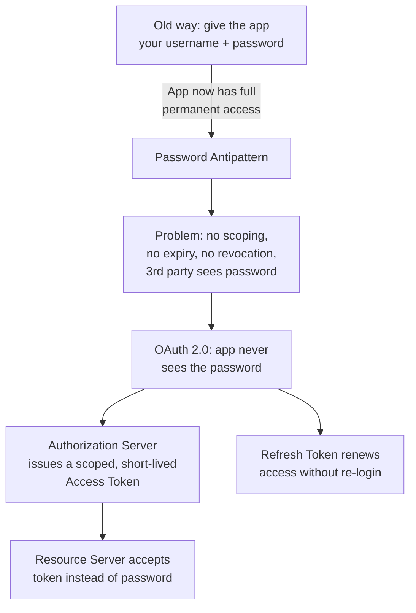

# OAuth 2.0 & Token-Based Authentication — From "What Is That Login Popup?" to Production-Grade Auth

## Course Overview

You clicked "Authenticate" on an MCP server in Claude or Kimi. A browser window popped up, you logged in (maybe via SSO, maybe with a password), and the app suddenly had access — without ever seeing your credentials. Later, that access kept working for days without you logging in again, until one day it silently refreshed itself.

That entire experience is **OAuth 2.0** (and its close companion, **OpenID Connect**). This course teaches you OAuth from first principles — not as a checklist of steps to copy-paste, but as a system with a specific problem it solves, actors with specific incentives, and failure modes that have caused real breaches. By the end, you will be able to read an OAuth flow diagram, implement a client and a server, debug a broken redirect, and explain in an interview why PKCE exists and what the "confused deputy" problem is.

This course assumes you work with dashboards, IoT systems, REST APIs, and JSON — and treats OAuth as an extension of that world (it's just HTTP redirects and JSON responses under the hood), not as a mysterious black box.

## Why This, and Why Now

MCP clients (Claude, Kimi, IDE integrations), mobile apps, and third-party integrations ("Sign in with Google", "Connect your Slack") all use OAuth 2.0 for the same reason: they need access to a service on your behalf, without you handing over the keys to your entire account.

## Who This Course Is For

You should already know:

- HTTP basics (GET/POST, headers, status codes, redirects)
- What a REST API is and how to call one
- What JSON is and how to read a JSON response
- Basic command-line comfort (`curl`, running a small script)

You do **not** need prior security, cryptography, or web-auth background — every term is defined the first time it's used.

## Quick Self-Assessment

| Question | If "no," start at |
|---|---|
| Do you know the difference between authentication and authorization? | Chapter 1 |
| Can you name the 4 main actors in an OAuth flow? | Chapter 2 |
| Do you know what a redirect URI is and why it matters? | Chapter 3 |
| Have you heard of PKCE and could you explain it? | Chapter 4 |
| Do you know the difference between an access token and a refresh token? | Chapter 5 |
| Could you explain why OAuth is not an authentication protocol? | Chapter 8 |

## Estimated Timeline

| Pace | Duration |
|---|---|
| Intensive (learning full-time) | 4–6 days |
| Steady (evenings/weekends) | 2–3 weeks |
| Reference-only (dip in as needed) | Ongoing |

## Complete Chapter Index

| # | Chapter | Focus |
|---|---|---|
| 00 | [Index](./00-index.md) | You are here |
| 01 | [Introduction & Why OAuth Exists](./01-introduction-and-why-oauth-exists.md) | The password-sharing problem, what OAuth actually solves |
| 02 | [Core Concepts & Terminology](./02-core-concepts-and-terminology.md) | The 4 actors, tokens, scopes, endpoints — your vocabulary |
| 03 | [Fundamental Components](./03-fundamental-components.md) | Client IDs, redirect URIs, authorization/token endpoints, client types |
| 04 | [The Authorization Code Flow with PKCE](./04-authorization-code-flow-with-pkce.md) | Step-by-step walkthrough of the exact flow you saw in Claude/Kimi |
| 05 | [Tokens: Access, Refresh, and ID Tokens](./05-tokens-access-refresh-id.md) | JWT structure, expiry, rotation, how auto-refresh actually works |
| 06 | [Architecture & Internals](./06-architecture-and-internals.md) | How the pieces fit together end-to-end, session state, storage |
| 07 | [Grant Types & Variations](./07-grant-types-and-variations.md) | Client Credentials, Device Code, and why Implicit/Password are dead |
| 08 | [OpenID Connect vs. OAuth](./08-openid-connect-vs-oauth.md) | Why OAuth alone isn't "login," and what OIDC adds |
| 09 | [Practical Usage: Building the Flow](./09-practical-usage-building-the-flow.md) | Minimal working client + server you can run locally |
| 10 | [MCP and OAuth in Practice](./10-mcp-and-oauth-in-practice.md) | Exactly what happens when you click "Authenticate" in Claude/Kimi |
| 11 | [Security & Risks](./11-security-and-risks.md) | Token theft, CSRF, open redirects, confused deputy, and real breaches |
| 12 | [Best Practices](./12-best-practices.md) | Production-grade patterns for clients and servers |
| 13 | [Common Mistakes & Pitfalls](./13-common-mistakes-and-pitfalls.md) | What breaks in real implementations, and how to spot it |
| 14 | [Advanced Concepts](./14-advanced-concepts.md) | Token binding, mTLS, DPoP, Dynamic Client Registration, federation |
| 15 | [Capstone Projects](./15-capstone-projects.md) | Beginner → production-grade projects to cement the skill |
| 16 | [Interview Preparation](./16-interview-preparation.md) | Common questions, scenarios, system design, troubleshooting |

## Learning Roadmap & Milestones

**Milestone 1 — Beginner (Chapters 1–3):** You can explain OAuth to a colleague using the password-sharing analogy, name the 4 actors, and identify a client ID / redirect URI / authorization endpoint in a real OAuth URL.

**Milestone 2 — Intermediate (Chapters 4–8):** You can trace a full Authorization Code + PKCE flow step by step, explain what's inside a JWT access token, and articulate why OAuth ≠ authentication (and where OIDC fits).

**Milestone 3 — Practical (Chapters 9–10):** You've run a working OAuth client and server locally, and can explain precisely what Claude/Kimi's "Authenticate" button does under the hood for an MCP server.

**Milestone 4 — Advanced/Professional (Chapters 11–16):** You know the major attack classes and mitigations, can review an OAuth implementation for security best practices, and can answer system-design and troubleshooting questions in an interview.

## Recommended Resources

- [RFC 6749 — The OAuth 2.0 Authorization Framework](https://datatracker.ietf.org/doc/html/rfc6749) (the original spec — dense but authoritative)
- [RFC 7636 — PKCE](https://datatracker.ietf.org/doc/html/rfc7636)
- [OAuth 2.1 draft](https://oauth.net/2.1/) (consolidates security best practices into the base spec)
- [OpenID Connect Core 1.0](https://openid.net/specs/openid-connect-core-1_0.html)
- [jwt.io](https://jwt.io) — decode and inspect real JWTs
- `oauth.com` by Aaron Parecki — the most readable practitioner-level explainer of OAuth 2.0
- [MCP Authorization spec](https://modelcontextprotocol.io/specification/2025-06-18/basic/authorization) — see also this repo's [`mcp-course`](../../AI-ML/mcp-course/13-authentication-and-authorization.md) Chapter 13

  
  <a href="./00-index.md">🏠 Index</a>
  <a href="./01-introduction-and-why-oauth-exists.md">Next: Introduction & Why OAuth Exists →</a>

