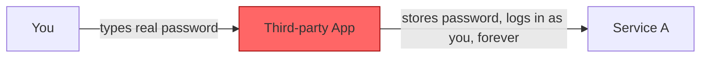
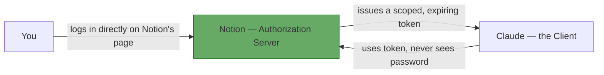

# Chapter 1: Introduction & Why OAuth Exists

## Learning Objectives

By the end of this chapter, you will be able to:

- Explain the difference between **authentication** and **authorization**
- Describe the "password anti-pattern" and why it's dangerous
- State, in one sentence, the problem OAuth 2.0 solves
- Recognize OAuth's real-world footprint (the "Sign in with X" buttons, MCP "Authenticate" buttons)

## Prerequisites for This Chapter

None beyond general API/web familiarity — this is the on-ramp.

## The Scenario You Already Experienced

You add an MCP server (say, a Notion or Linear integration) to Claude or Kimi. You click **Authenticate**. A browser tab opens showing Notion's own login page — not Claude's. You log in (maybe via your company SSO). Notion asks "Allow Claude to access your workspace?" You click Allow. The tab closes, and Claude now has access.

Two things should stand out:

1. **You typed your password into Notion's page, never into Claude's.** Claude (the "app") never saw your Notion password.
2. **Notion decided what Claude can access** ("read pages," not "delete your entire workspace"), not the other way around.

That is OAuth 2.0's entire purpose in one paragraph: **letting an app do something on your behalf at another service, without that app ever holding your master credentials, and with the service — not the app — controlling what's allowed.**

## Authentication vs. Authorization — The Distinction You Must Nail First

These two words get used interchangeably in casual conversation, but they mean different things, and OAuth's name literally tells you which one it is:

- **Authentication** = proving *who you are*. ("I am akash.gaur@kloudspot.com, here's my password / SSO login.")
- **Authorization** = proving *what you're allowed to do*, and here specifically, **granting a third party permission to act on your behalf**. ("Claude is allowed to read my Notion pages.")

**OAuth 2.0 is an authorization protocol, not an authentication protocol.** This point is subtle enough that Chapter 8 is dedicated entirely to it — hold onto it as a thread through the whole course.

Analogy: authentication is showing your ID at a hotel front desk to prove you're you. Authorization is the hotel then handing you a **key card** that opens *your room only, for the duration of your stay* — not the master key to every room. The key card doesn't re-prove who you are each time you use it; it just proves you were authorized. OAuth is the key-card system.

## The Old Way, and Why It Failed: The Password Anti-Pattern

Before OAuth (roughly pre-2007, and still seen in legacy systems), the pattern for "let App B use my data in Service A" was:

1. You type your Service A username and password directly into App B's login form.
2. App B stores that password (often in plaintext or reversibly encrypted) and uses it to log into Service A on your behalf, indefinitely.

This is called the **password anti-pattern**, and it has four serious, compounding problems:

| Problem | Concrete Consequence |
|---|---|
| **No scoping** | App B gets your *entire* account — email, billing, everything — even if it only needed to read your calendar. |
| **No expiry** | The password (or a copy of it) works forever until you manually change it. |
| **No selective revocation** | To cut off App B, you must change your password everywhere, breaking every *other* app that also had it. |
| **Credential exposure** | Your actual password now lives in App B's database. If App B is breached, your Service A account is compromised too. |

This is exactly the pattern the MCP "Authenticate" button avoids. If Claude used the old way, you'd type your Notion password into a Claude-controlled form, and Claude would hold it forever with full access. Instead:

## Why OAuth, Specifically, and Not Something Ad-Hoc

Every company could invent its own "give me a scoped token" scheme, and for years many did (API keys you generate manually, for instance — see Chapter 8 for why those aren't OAuth). OAuth 2.0 became the industry standard because it's an **open, interoperable specification** ([RFC 6749](https://datatracker.ietf.org/doc/html/rfc6749)): if Notion, Google, Slack, and GitHub all implement OAuth 2.0 the same way, then any client — Claude, Kimi, your own script — can integrate with all of them using the same logic. That's the same "one protocol, many providers" value MCP itself provides for tools; OAuth provides it for authorization.

## Real-World Footprint

You've used OAuth dozens of times without naming it:

- "Sign in with Google / GitHub / Microsoft" buttons
- Connecting a calendar app to your Google Calendar
- Authorizing a third-party Twitter/X client
- The exact MCP "Authenticate" flow that prompted this course
- A CI pipeline authorizing against a cloud provider using short-lived credentials

## Summary

- OAuth 2.0 is an **authorization** protocol: it lets an app act on your behalf without ever holding your password.
- The problem it replaced — the **password anti-pattern** — had no scoping, no expiry, and no clean revocation.
- The service you're authorizing against (not the app) decides what's allowed and issues a token that proves it.
- This is exactly what happens when you click "Authenticate" on an MCP server.

## Knowledge Check

1. In your own words, what's the difference between authentication and authorization?
2. What are the four specific problems with typing your real password into a third-party app?
3. In the MCP "Authenticate" example, which party (Claude or Notion) decides what Claude is allowed to access?
4. Why does an open standard like OAuth matter more than each company inventing its own token scheme?

## Hands-On Exercise

Find three "Sign in with X" or "Connect to Y" buttons in apps you already use (e.g., a calendar app, a note-taking app, a dashboard tool). For each one, write down: (a) what service is doing the authorizing, (b) what you'd guess the app is allowed to access, and (c) whether you were ever asked for your actual password by the *requesting* app (it should be "no" if it's implemented correctly).

## Further Reading

- [RFC 6749, Section 1 — Introduction](https://datatracker.ietf.org/doc/html/rfc6749#section-1)
- [oauth.com — An Introduction to OAuth 2](https://www.oauth.com/oauth2-servers/getting-started/)

  <a href="./00-index.md">← Previous: Index</a>
  <a href="./00-index.md">🏠 Index</a>
  <a href="./02-core-concepts-and-terminology.md">Next: Core Concepts & Terminology →</a>

