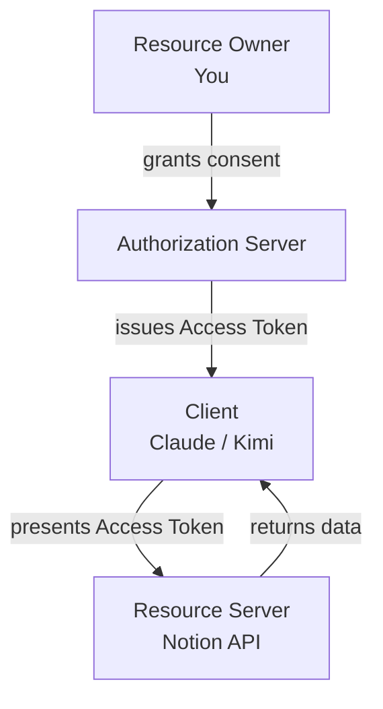

# Chapter 2: Core Concepts & Terminology

## Learning Objectives

- Name and define the 4 actors in every OAuth flow
- Define: scope, access token, refresh token, authorization grant, client ID/secret
- Map each term onto the Claude/MCP "Authenticate" example from Chapter 1

## Prerequisites for This Chapter

[Chapter 1](./01-introduction-and-why-oauth-exists.md) — you should be comfortable with "OAuth = authorization, not authentication" before proceeding.

## The 4 Actors

Every OAuth interaction, no matter how complex, involves exactly four roles. Learn these cold — the rest of the course is just describing how these four talk to each other.

| Role | Definition | In the MCP/Claude Example |
|---|---|---|
| **Resource Owner** | The person who owns the data/account and can grant access to it | **You** |
| **Client** | The application requesting access on the resource owner's behalf | **Claude / Kimi** (the MCP host application) |
| **Authorization Server (AS)** | Issues tokens after authenticating the resource owner and getting their consent | **Notion's / the MCP server's login system** |
| **Resource Server (RS)** | Hosts the protected data/API and accepts tokens to grant access | **Notion's API** (often the same system as the AS, but conceptually distinct) |

**Why this matters:** almost every OAuth bug or security question in this course reduces to "which of these four parties can see what, and when." If you can always place yourself correctly as the Resource Owner and mentally separate the AS from the RS, you can reason through any diagram.

Analogy for all four at once: think of a company office building. **You** are an employee (Resource Owner) who can authorize visitor access. **Reception** (Authorization Server) checks IDs and issues a visitor badge with specific access. **The server room** (Resource Server) is the actual protected resource, and it trusts any badge issued by reception, without re-checking the visitor's ID itself. **The visitor** (a delivery courier, say) is the Client, who only asked to get in and drop off a package.

## Scope

A **scope** is a specific, named permission the client is requesting — the granular unit of "what can this app do." Instead of one all-or-nothing switch, scopes let the resource owner (or the AS's policy) grant exactly what's needed.

Example scopes you might see in a consent screen:
- `read:pages` — read your Notion pages
- `write:pages` — create/edit pages
- `read:profile` — see your name and email
- `offline_access` — permission to receive a refresh token (used to stay authorized without you logging in again — covered in Chapter 5)

Analogy: scopes are like the specific rooms listed on a visitor badge — "Lobby, Floor 3 Conference Room" — not "every door in the building."

## Client ID and Client Secret

- **Client ID**: a public identifier for the application, registered with the Authorization Server ahead of time. Not secret — it's often visible in URLs.
- **Client Secret**: a private credential proving the *application itself* is who it claims to be (not the user — the app). Only used by **confidential clients** (server-side apps that can keep a secret safe). Public clients like mobile apps, single-page apps, and desktop apps (including Claude/Kimi's MCP client) generally **cannot** hold a secret safely, which is exactly why PKCE exists (Chapter 4).

## Authorization Grant

An **authorization grant** is the general term for "the credential the client uses to prove the resource owner authorized it," which the client then exchanges for an access token. The most common grant type — and the one behind the Claude/Kimi flow — is the **authorization code**: a short-lived, one-time-use string handed to the client after the user logs in and consents.

## Access Token

The actual "key card" — a string the client attaches to API requests to the Resource Server to prove it's authorized. Short-lived by design (minutes to hours). Covered in depth in Chapter 5.

## Refresh Token

A longer-lived credential, issued alongside the access token, used **only** to get a new access token from the Authorization Server without the user logging in again. This is the "automatic re-authentication" you noticed. Covered in depth in Chapter 5.

## Redirect URI (Callback URL)

The URL the Authorization Server sends the user's browser back to after login/consent, carrying the authorization code. This is the "browser window opens... then closes" part of what you observed — the closing happens when the AS redirects back to a URI the client is listening on. Covered in Chapter 3.

## Consent Screen

The page (hosted by the Authorization Server, not the client) where the resource owner sees exactly which scopes are being requested and approves or denies them. This is the "Allow Claude to access your workspace?" screen.

## Putting It Together: A Vocabulary Map of What You Saw

| What you observed | OAuth term |
|---|---|
| The "Authenticate" button in Claude | Kicks off the flow — Claude is the **Client** |
| Browser window opens to Notion's login | You're being routed to the **Authorization Server** |
| You log in (SSO or password) | Resource Owner **authentication** at the AS (not by Claude) |
| "Allow Claude to access..." screen | The **consent screen**, listing requested **scopes** |
| Browser window closes, Claude "has access" | AS redirected to Claude's **redirect URI** with an **authorization code**; Claude exchanged it for an **access token** |
| Access silently renews later | Claude used its **refresh token** to get a new access token |

## Summary

- Every OAuth flow has exactly 4 actors: Resource Owner, Client, Authorization Server, Resource Server.
- Scopes make permissions granular instead of all-or-nothing.
- Client ID is public; Client Secret is private and only usable by confidential clients.
- The authorization code is a short-lived proof of consent, exchanged for an access token.
- Refresh tokens exist specifically to avoid repeated logins.

## Knowledge Check

1. In the Claude/Notion example, name the Resource Server. Is it the same system as the Authorization Server here?
2. Why can't a desktop app like Claude's MCP client safely hold a Client Secret?
3. What's the difference between an authorization grant and an access token?
4. What would happen (from a security standpoint) if scopes didn't exist and every OAuth grant was all-or-nothing?

## Hands-On Exercise

Open any "Sign in with Google" consent screen (you can trigger one safely by starting, but not completing, a Google OAuth login on a site you trust, or by re-examining permissions already granted at [myaccount.google.com/permissions](https://myaccount.google.com/permissions)). Identify the scopes listed in plain English and try to guess their scope names (e.g., "See your email address" ≈ `email` or `userinfo.email`).

## Further Reading

- [RFC 6749, Section 1.1 — Roles](https://datatracker.ietf.org/doc/html/rfc6749#section-1.1)
- [oauth.com — Scope](https://www.oauth.com/oauth2-servers/scope/)

  <a href="./01-introduction-and-why-oauth-exists.md">← Previous: Introduction & Why OAuth Exists</a>
  <a href="./00-index.md">🏠 Index</a>
  <a href="./03-fundamental-components.md">Next: Fundamental Components →</a>

