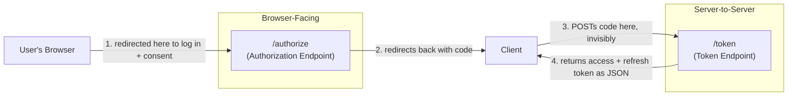

# Chapter 3: Fundamental Components

## Learning Objectives

- Identify the two required Authorization Server endpoints and what each does
- Explain client types (confidential vs. public) and why it dictates flow choice
- Understand redirect URIs, the `state` parameter, and why both matter for security
- Read a real OAuth authorization URL and identify every parameter

## Prerequisites for This Chapter

[Chapter 2](./02-core-concepts-and-terminology.md) — the 4 actors and core vocabulary.

## The Two Core Endpoints

Every OAuth Authorization Server exposes (at minimum) two HTTP endpoints:

| Endpoint | Purpose | Who calls it |
|---|---|---|
| **Authorization Endpoint** | A browser-facing page: authenticates the user, shows consent, redirects back with a code | The user's **browser** (via redirect) |
| **Token Endpoint** | A machine-to-machine JSON API: exchanges a code (or refresh token) for an access token | The **Client** app, directly, server-to-server |

This split is the reason a browser window opens for login but the "getting the token" part happens invisibly. The authorization endpoint is UI (HTML pages you interact with); the token endpoint is a plain API call your client makes in the background — you never see it.



## Client Types: Confidential vs. Public

This distinction determines *which flow variant* a client must use — it's the reason PKCE (Chapter 4) exists at all.

- **Confidential client**: runs on a server you control, where a `client_secret` can be kept genuinely private (e.g., your backend API service). Can authenticate itself to the token endpoint with the secret.
- **Public client**: runs on a device/environment where any embedded secret is extractable by the end user — native mobile apps, desktop apps, single-page browser apps. **Claude Desktop and Kimi's MCP client are public clients.** Anyone could decompile the app or inspect network traffic and find a hardcoded secret, so the spec assumes public clients have none.

This is precisely why the flow you observed needs an extra safeguard — a plain authorization code alone, with no secret to prove client identity, could be intercepted and used by an attacker. That safeguard is PKCE, covered next chapter.

## Redirect URI

The **redirect URI** (also "callback URL") is the address the Authorization Server sends the browser to after authentication and consent, carrying the authorization code as a query parameter.

Two critical rules:

1. **It must be pre-registered** with the Authorization Server when the client is set up. The AS will refuse to redirect anywhere else.
2. It's the primary defense against a malicious app registering itself and stealing codes meant for a legitimate app — if an attacker can't register *your* redirect URI, they can't receive *your* code.

For a desktop app like Claude, the redirect URI is often something unusual-looking, e.g. `http://localhost:PORT/callback` (Claude briefly runs a tiny local web server to catch the redirect) or a custom URI scheme like `claude://oauth/callback`. That's the mechanism by which "the browser window closes and the app has access" — the app was listening on that address the whole time.

## The `state` Parameter

`state` is an opaque, random value the **client** generates, sends in the initial authorization request, and checks matches on the way back. Its job is purely **CSRF protection**: it proves the redirect response actually corresponds to a request *this client instance* initiated, not one an attacker tricked the user's browser into completing. Covered in depth in Chapter 11 (Security).

## Anatomy of a Real Authorization Request URL

Here's what actually loads in that browser tab (values illustrative):

```
https://notion.so/oauth/authorize?
  response_type=code
  &client_id=abc123claude
  &redirect_uri=http://localhost:52847/callback
  &scope=read:pages%20write:pages%20offline_access
  &state=x9f2kzp1
  &code_challenge=E9Melhoa2OwvFrEMTJguCHaoeK1t8URWbuGJSstw-cM
  &code_challenge_method=S256
```

| Parameter | Meaning |
|---|---|
| `response_type=code` | "I want the Authorization Code flow" (as opposed to older, now-deprecated flows) |
| `client_id` | Which registered app is requesting access |
| `redirect_uri` | Where to send the browser back to |
| `scope` | Space-separated list of permissions requested |
| `state` | CSRF-protection nonce, echoed back unchanged |
| `code_challenge` / `code_challenge_method` | PKCE parameters — previewed here, explained fully in Chapter 4 |

Try this yourself: next time an "Authenticate" flow opens a browser tab, glance at the URL bar before you log in. You'll see most of these parameters directly.

## Summary

- The Authorization Endpoint is browser-facing (login + consent); the Token Endpoint is a background API call.
- Public clients (like desktop/mobile MCP clients) can't hold secrets — this drives the need for PKCE.
- The redirect URI must be pre-registered and is a core anti-hijacking defense.
- `state` protects against CSRF by binding the callback to the request that started it.

## Knowledge Check

1. Why does an authorization code arrive via the browser but get exchanged for a token via a direct server call?
2. Why is Claude Desktop a "public client" rather than "confidential"?
3. What attack does the `state` parameter prevent, specifically?
4. What happens if a client tries to redirect to a URI it never registered with the Authorization Server?

## Hands-On Exercise

Trigger any real "Sign in with X" flow (Google, GitHub, etc.) but stop right at the browser redirect — before logging in — and copy the full URL from the address bar. Identify each query parameter using the table above. If `code_challenge` is present, you've just spotted PKCE in the wild — keep that URL, you'll use it again in Chapter 4.

## Further Reading

- [RFC 6749, Section 3 — Protocol Endpoints](https://datatracker.ietf.org/doc/html/rfc6749#section-3)
- [RFC 6749, Section 10.12 — CSRF Protection](https://datatracker.ietf.org/doc/html/rfc6749#section-10.12)

<div style="display:flex;justify-content:space-between;align-items:center;">
  <a href="./02-core-concepts-and-terminology.md">← Previous: Core Concepts & Terminology</a>
  <a href="./00-index.md">🏠 Index</a>
  <a href="./04-authorization-code-flow-with-pkce.md">Next: The Authorization Code Flow with PKCE →</a>
</div>
