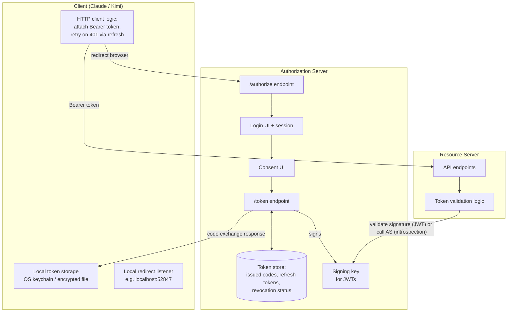
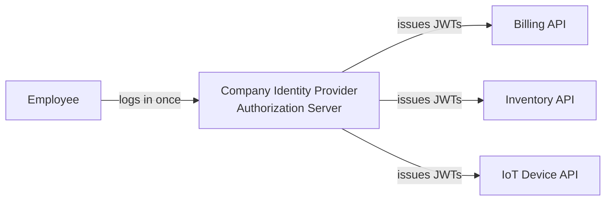

# Chapter 6: Architecture & Internals

## Learning Objectives

- Draw the complete OAuth architecture from first principles, including where state lives
- Understand session vs. token lifecycle and how they interact
- Understand token validation strategies: introspection vs. self-contained JWTs
- Understand how the AS and RS relate when they're the same system vs. separate systems

## Prerequisites for This Chapter

Chapters [3](./03-fundamental-components.md)–[5](./05-tokens-access-refresh-id.md).

## The Full Picture, End-to-End

## Where State Actually Lives

A common beginner confusion: "if the token is self-contained (JWT), what does the Authorization Server even need to remember afterward?" The answer: quite a lot, because tokens must be **revocable** even before they naturally expire (user clicks "Disconnect," admin revokes access, suspected breach).

The Authorization Server persists:
- Issued authorization codes (single-use, very short TTL — often 30–60 seconds)
- Issued refresh tokens and their rotation lineage (to detect reuse — see Chapter 5)
- A revocation list / status per refresh token or token family
- Registered clients (client_id, redirect URIs, allowed grant types)

The Resource Server, if using self-contained JWT access tokens, often needs **no persistent state per request** — it just verifies the signature and checks `exp`/`aud`/`scope` claims. This statelessness is a deliberate design win: it means the Resource Server can validate tokens without a network call back to the Authorization Server on every single API request, so it scales horizontally with no shared session state.

## Two Token Validation Strategies

| Strategy | How it works | Trade-off |
|---|---|---|
| **Self-contained (JWT) validation** | RS verifies the cryptographic signature locally using the AS's public key; checks `exp`, `aud`, `scope` claims | Fast, no network call, scales well — but can't be instantly revoked before `exp` unless paired with a separate revocation check |
| **Token introspection** ([RFC 7662](https://datatracker.ietf.org/doc/html/rfc7662)) | RS calls the AS's `/introspect` endpoint on every request, asking "is this token still valid?" | Always up-to-date on revocation — but adds latency and load, and creates a hard dependency on the AS being reachable |

Many production systems use a hybrid: short-lived JWTs (so a brief window of "can't revoke instantly" is acceptable) plus occasional introspection for high-value operations.

## When AS and RS Are the Same System vs. Separate

In the Claude/Notion example, Notion plays both the Authorization Server role (its login + consent UI) and the Resource Server role (its actual page-reading API) — they're the same company's infrastructure, which is the common case for "connect your account to a third-party app."

But in enterprise settings, these are frequently **separate systems**: your company's Identity Provider (Okta, Azure AD, Auth0) acts as the Authorization Server, issuing tokens that dozens of *different* internal Resource Servers (a billing API, an inventory API, an IoT device-management API) all trust and validate independently, because they all point to the same AS's public signing key. This is the architecture behind enterprise SSO, and it's why a single company login can grant access across many otherwise-unrelated internal services.

## Session vs. Token: Two Different Lifecycles

Don't conflate "you're logged into Notion in your browser" with "Claude has an access token for Notion." They're related but independent:

- Your **browser session** with Notion (a cookie) can persist across many separate OAuth grants to different apps.
- Each **app's OAuth grant** (the code/token exchange) is a separate, per-app authorization, tracked independently by the AS.

This is why you can revoke Claude's access to Notion (in Notion's connected-apps settings) without logging out of Notion itself, and vice versa — logging out of Notion in your browser doesn't revoke tokens already issued to Claude.

## Summary

- The Authorization Server maintains real state (codes, refresh tokens, revocation status) even when access tokens are stateless JWTs.
- JWT validation is fast and scalable but has a revocation-delay trade-off; introspection is always current but adds latency and coupling.
- AS and RS can be the same system (consumer "connect your account" apps) or deliberately separate (enterprise SSO across many internal APIs).
- Your login session and an app's OAuth grant are separate, independently revocable lifecycles.

## Knowledge Check

1. Why can't a purely self-contained JWT be instantly revoked the moment a user clicks "Disconnect"?
2. What's the latency/coupling trade-off of token introspection vs. local JWT validation?
3. In an enterprise SSO setup, why can one login grant access to many unrelated internal APIs?
4. Why does revoking an app's access not require logging out of the underlying service in your browser?

## Hands-On Exercise

Pick an app you've connected via OAuth (a calendar integration, a Slack app, etc.). Find that service's "connected apps" or "authorized applications" settings page and revoke access to just that one app. Confirm you're still logged into the main service itself afterward — this demonstrates the session/token lifecycle split directly.

## Further Reading

- [RFC 7662 — OAuth 2.0 Token Introspection](https://datatracker.ietf.org/doc/html/rfc7662)
- [RFC 7009 — OAuth 2.0 Token Revocation](https://datatracker.ietf.org/doc/html/rfc7009)

  <a href="./05-tokens-access-refresh-id.md">← Previous: Tokens: Access, Refresh, and ID Tokens</a>
  <a href="./00-index.md">🏠 Index</a>
  <a href="./07-grant-types-and-variations.md">Next: Grant Types & Variations →</a>

