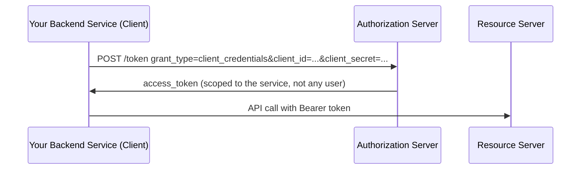
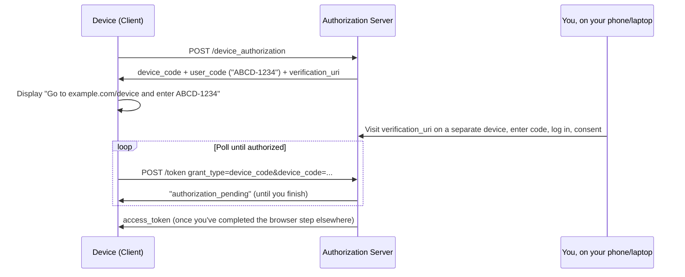
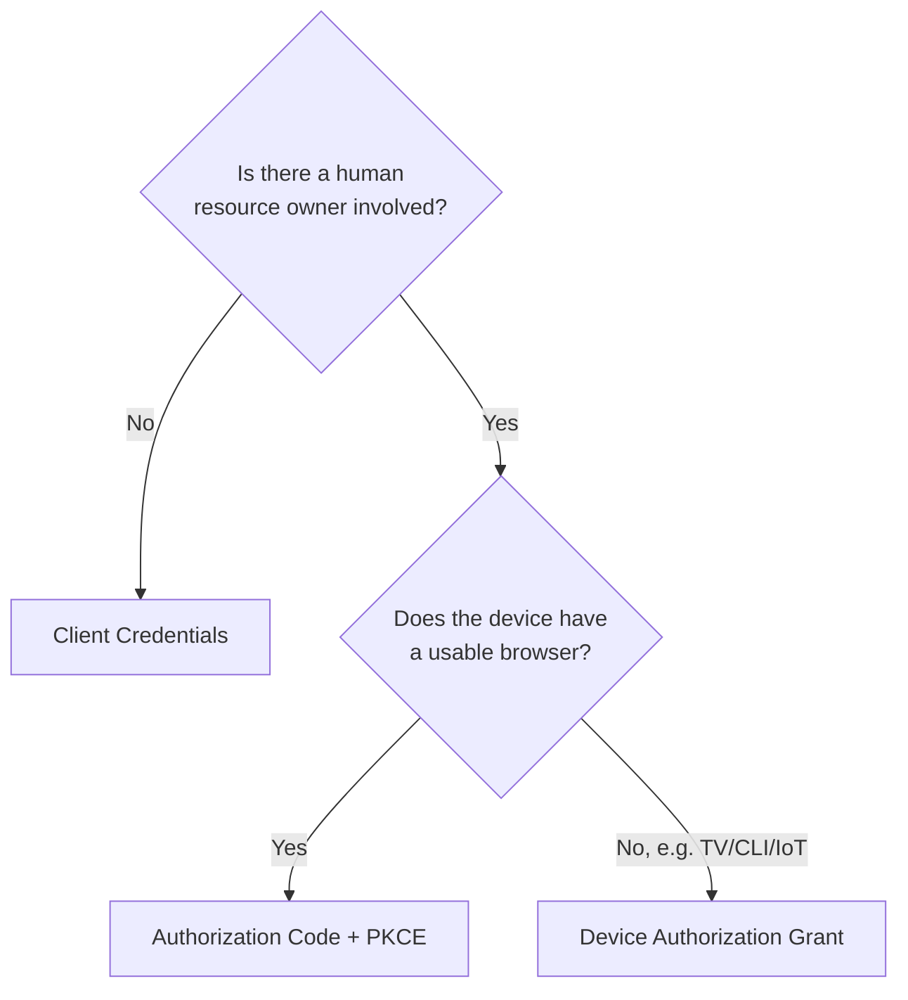

# Chapter 7: Grant Types & Variations

## Learning Objectives

- Identify which grant type fits which scenario: user-present app, machine-to-machine, input-constrained device
- Explain why the Implicit and Resource Owner Password Credentials grants are now deprecated
- Recognize the Device Authorization Grant, used for TVs, CLIs, and IoT devices

## Prerequisites for This Chapter

Chapters [4](./04-authorization-code-flow-with-pkce.md)–[6](./06-architecture-and-internals.md).

## Grant Types at a Glance

| Grant Type | Use Case | Involves a Browser? | Status |
|---|---|---|---|
| **Authorization Code (+ PKCE)** | User-present apps: web, mobile, desktop, MCP clients | Yes | ✅ Current standard |
| **Client Credentials** | Machine-to-machine, no user involved (a backend service calling another backend service) | No | ✅ Current standard |
| **Device Authorization Grant** | Input-constrained devices: smart TVs, CLI tools, IoT devices with no browser | Yes, but on a *separate* device | ✅ Current standard |
| **Refresh Token** | Not a login grant — renews an access token using an existing refresh token | No | ✅ Current standard (covered in Ch. 5) |
| **Implicit Grant** | (Historically) browser-only SPAs with no backend | Yes | ❌ Deprecated (removed in OAuth 2.1) |
| **Resource Owner Password Credentials (ROPC)** | (Historically) trusted first-party apps | No | ❌ Deprecated (removed in OAuth 2.1) |

## Client Credentials Grant

Used when there is **no human resource owner in the loop at all** — one service authenticating as itself to call another service. This is common for backend-to-backend integrations, cron jobs pulling data from an API, or your IoT backend authenticating to a cloud telemetry ingestion service.



```bash
curl -X POST https://api.example.com/oauth/token \
  -d grant_type=client_credentials \
  -d client_id=iot-backend-service \
  -d client_secret=***
```

Since there's no user and no browser step, this is the simplest grant — a single request-response. It requires a **confidential client** (a secret can be safely stored server-side), so it's never appropriate for a mobile app or SPA.

## Device Authorization Grant (RFC 8628)

Used when the device requesting access has no usable browser or is awkward to type into — a smart TV app, a CLI tool (`gh auth login` uses exactly this), or a headless IoT device.



This is exactly the "go to this URL on another device and enter this code" screen you've seen on smart TVs and CLI tools. Relevant to your IoT background: this is the standard answer for "how does a headless device that can't run a browser get user-delegated access to a cloud API."

## Why Implicit Grant Is Deprecated

The **Implicit Grant** returned the access token directly in the browser redirect URL fragment, skipping the token-endpoint exchange step entirely — designed for early browser-only SPAs that couldn't make a second background request easily. Problems:

- The access token appears directly in the URL, which browsers log in history, and which can leak via the `Referer` header or browser extensions.
- No refresh tokens were issuable safely in this model, since there's no token endpoint exchange to attach them to.
- Modern SPAs can make background `fetch`/`XHR` calls just fine, making the original justification for skipping the code-exchange step obsolete.

**Current guidance: use Authorization Code + PKCE even for browser-only SPAs.** OAuth 2.1 formally removes the Implicit Grant.

## Why Resource Owner Password Credentials (ROPC) Is Deprecated

ROPC let the client collect the user's actual username/password directly and trade them for a token in one API call — which is, precisely, the password anti-pattern from Chapter 1, just wrapped in an OAuth-shaped request. It was only ever intended for a first-party app migrating *away* from legacy password auth, as a stepping stone — never for third-party clients. OAuth 2.1 removes it entirely.

## Decision Guide



## Summary

- Authorization Code + PKCE remains the default for any app where a human logs in.
- Client Credentials is for pure machine-to-machine access with no user in the loop.
- Device Authorization Grant solves input-constrained/no-browser devices by delegating login to a second device.
- Implicit and ROPC grants are deprecated for real security reasons, not stylistic preference — avoid both in new designs.

## Knowledge Check

1. Why can't a public client (mobile app) safely use the Client Credentials grant?
2. What real security weakness caused the Implicit Grant to be deprecated?
3. How does the Device Authorization Grant let a TV get user-delegated access without a keyboard or browser?
4. Why was ROPC only ever meant as a temporary migration tool, never a permanent design?

## Hands-On Exercise

Run `gh auth login` if you have the GitHub CLI installed (or read its documented flow if not) and map what you see onto the Device Authorization Grant diagram above: identify the user_code, the verification URL, and the polling behavior.

## Further Reading

- [RFC 8628 — OAuth 2.0 Device Authorization Grant](https://datatracker.ietf.org/doc/html/rfc8628)
- [RFC 6749, Section 4.4 — Client Credentials Grant](https://datatracker.ietf.org/doc/html/rfc6749#section-4.4)
- [OAuth 2.1 draft — removed grant types](https://oauth.net/2.1/)

<div style="display:flex;justify-content:space-between;align-items:center;">
  <a href="./06-architecture-and-internals.md">← Previous: Architecture & Internals</a>
  <a href="./00-index.md">🏠 Index</a>
  <a href="./08-openid-connect-vs-oauth.md">Next: OpenID Connect vs. OAuth →</a>
</div>
