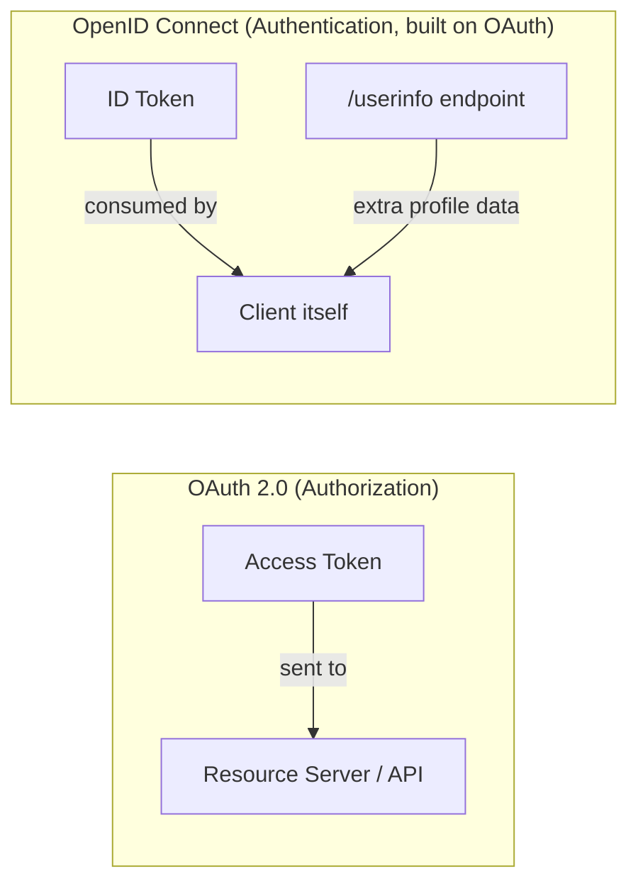

# Chapter 8: OpenID Connect vs. OAuth

## Learning Objectives

- Explain precisely why "OAuth is not an authentication protocol" — the point flagged since Chapter 1
- Define the ID Token and the `/userinfo` endpoint, and how they add authentication on top of OAuth
- Correctly choose between plain OAuth, OIDC, and API keys for a given scenario

## Prerequisites for This Chapter

Chapters [1](./01-introduction-and-why-oauth-exists.md) and [5](./05-tokens-access-refresh-id.md) — especially the access-token-vs-ID-token distinction previewed there.

## The Confusion, Precisely Stated

"Sign in with Google" *feels* like a login system. It uses OAuth's exact flow (Authorization Code + PKCE, redirect, consent). So why do we keep insisting "OAuth isn't authentication"?

Here's the precise problem: a plain OAuth access token proves **"this app is authorized to call this API with these scopes."** It does **not**, by itself, cryptographically prove **"this specific user is currently present and was just authenticated."** An access token could be replayed by a different app that got hold of it, and the *client* would have no reliable way to know for certain who's behind it, or when they logged in.

This actually happened in the real world: early sites naively used "can I successfully call the Facebook API with this token?" as a login check, without OIDC's protections. This class of vulnerability became infamous enough to earn its own name.

## OpenID Connect (OIDC): OAuth + a Standardized Identity Layer

**OpenID Connect** is a thin, standardized layer built *on top of* OAuth 2.0, specifically to answer "who is this, and did they just authenticate?" safely. It doesn't replace OAuth — it reuses the exact same Authorization Code + PKCE flow and adds two things:

1. **The `openid` scope** — requesting this scope tells the AS "also give me identity information, not just API access."
2. **The ID Token** — a JWT, returned alongside the access token, specifically designed to be consumed by the **client itself** as proof of login (as opposed to the access token, which is designed to be consumed by the **Resource Server**).



## What's Inside an ID Token

```json
{
  "iss": "https://accounts.google.com",
  "sub": "10769150350006150715113082367",
  "aud": "your-client-id.apps.googleusercontent.com",
  "exp": 1755003600,
  "iat": 1755000000,
  "email": "akash.gaur@kloudspot.com",
  "email_verified": true,
  "name": "Akash Gaur"
}
```

Key differences from an access token's payload:
- `iss` (issuer) and `aud` (audience) are checked strictly by the client to confirm this token was meant for *them specifically*, issued by *this* trusted AS.
- It carries identity claims (`email`, `name`) meant for the client's own use — never forwarded to a Resource Server as an access credential.
- The client must verify the signature itself, locally, rather than just trusting that "the API accepted it" (which is the mistake that caused the vulnerability mentioned above).

## The `/userinfo` Endpoint

For additional profile data beyond what fits in the ID token, OIDC defines a standard `/userinfo` endpoint that the client calls using the access token, returning a standard set of claims (`name`, `picture`, `email`, etc.) in a consistent shape across every OIDC-compliant provider — Google, Microsoft, Okta, Auth0 all respond in the same format, which is what makes "one login button, many providers" code reusable.

## Side-by-Side Comparison

| | Plain OAuth 2.0 | OpenID Connect |
|---|---|---|
| **Answers** | "Can this app access this API?" | "Who is this user, and did they just log in?" |
| **Key artifact** | Access Token | ID Token (+ access token still present) |
| **Consumed by** | Resource Server | The Client itself |
| **Standardized user profile format?** | No | Yes (`/userinfo`, standard claims) |
| **Use "Sign in with X"?** | Technically possible but insecure/non-standard | This is exactly what it's built for |

## When to Use Which

- **Plain OAuth 2.0**: you need an app to access a specific API on a user's behalf (read their calendar, post to their workspace) and you don't need to establish "who is logging into my app" as a separate concept.
- **OpenID Connect**: you need actual **login** — "Sign in with Google/Microsoft," establishing a session in your own app tied to a real, verified identity.
- **API Keys** (not OAuth at all): a much simpler, static, unscoped-by-default credential — appropriate for server-to-server calls where you fully trust the caller and don't need per-user delegation, expiry, or fine scoping. Not covered further in this course since it's a different mechanism entirely, but worth naming so you don't conflate the two.

## Summary

- OAuth 2.0 proves "this app can call this API"; OIDC adds proof of "this user just authenticated," via the ID Token.
- The ID Token is consumed by the client itself; the access token is consumed by the Resource Server — mixing them up is a real, historically exploited vulnerability class.
- `/userinfo` gives a standardized profile shape across every OIDC provider.
- Choose OIDC specifically when you need actual login; plain OAuth when you only need delegated API access.

## Knowledge Check

1. In your own words, what specific question does an ID token answer that an access token does not?
2. Why is it a security mistake to treat "the API accepted my access token" as proof of user login?
3. What does the `openid` scope specifically trigger the Authorization Server to return?
4. Why would an IoT backend calling a cloud API on its own behalf (no human user) need neither OIDC nor even user-delegated OAuth?

## Hands-On Exercise

Find a "Sign in with Google" button on any site you trust and, using browser dev tools' Network tab, watch the token exchange request/response (or, safely, decode a sample Google ID token structure from Google's own OIDC documentation). Identify the `iss`, `aud`, and `sub` claims and explain in your own words what each protects against.

## Further Reading

- [OpenID Connect Core 1.0 specification](https://openid.net/specs/openid-connect-core-1_0.html)
- [Google's OIDC documentation — ID Tokens](https://developers.google.com/identity/openid-connect/openid-connect)

<div style="display:flex;justify-content:space-between;align-items:center;">
  <a href="./07-grant-types-and-variations.md">← Previous: Grant Types & Variations</a>
  <a href="./00-index.md">🏠 Index</a>
  <a href="./09-practical-usage-building-the-flow.md">Next: Practical Usage: Building the Flow →</a>
</div>
